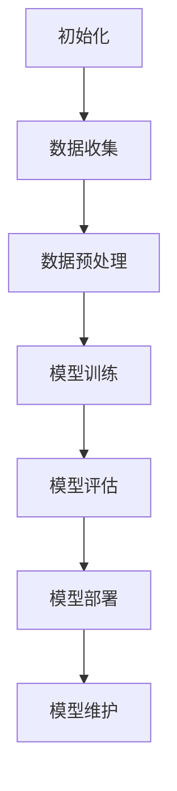
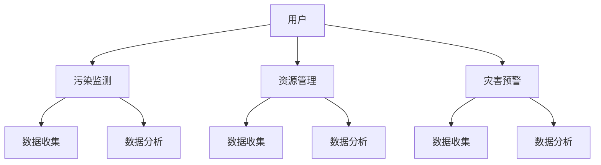
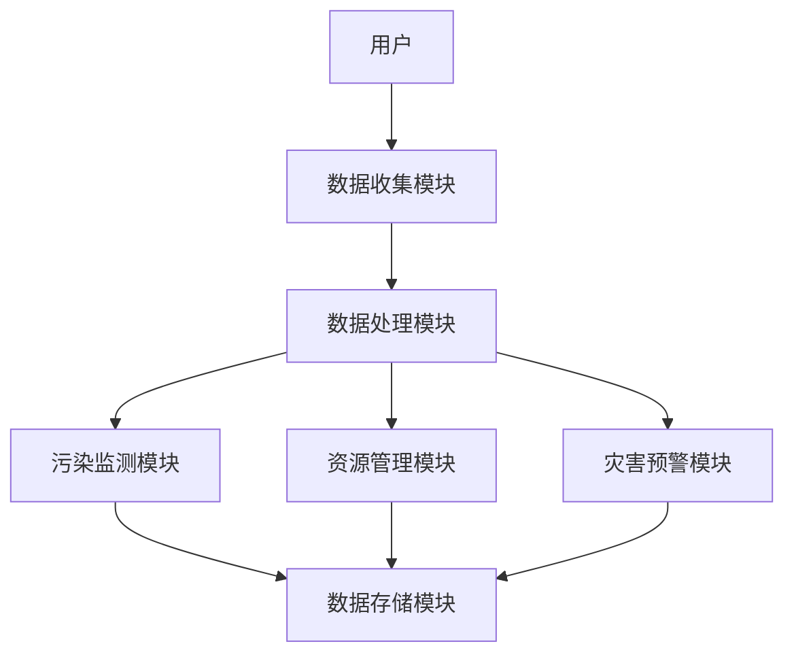
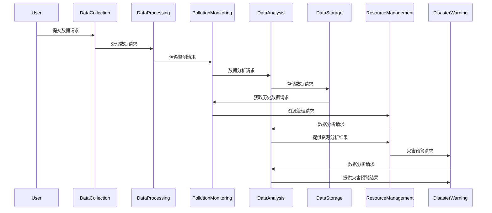
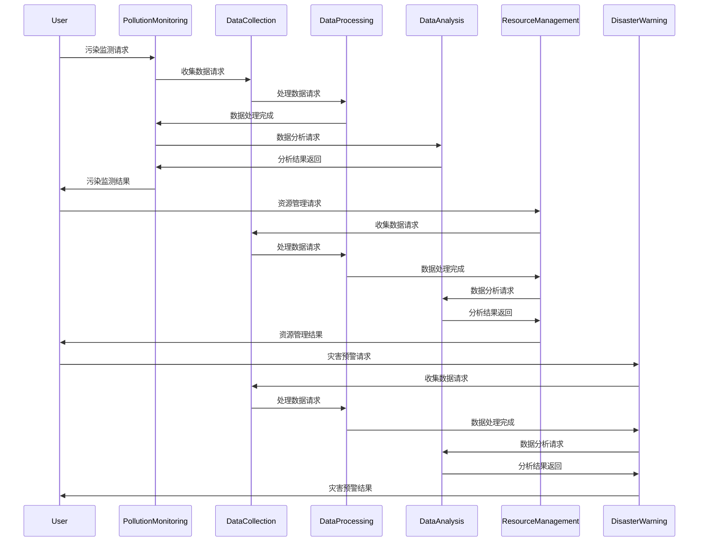

                 

# AI Agent在环境保护中的应用

> 关键词：人工智能、环境保护、AI Agent、污染监测、资源管理、灾害预警

> 摘要：
随着人工智能技术的迅猛发展，AI Agent作为一种具有自主决策能力的智能代理，在环境保护领域展现出巨大的应用潜力。本文将深入探讨AI Agent在环境保护中的应用，包括其核心概念、算法原理、系统分析与架构设计方案，以及实际项目实战中的应用与效果。通过本文的阅读，读者将了解到AI Agent如何帮助提高环境保护的效率，并探索其在未来的发展前景。

## 1. 背景介绍

### 1.1 书名与核心概念

《AI Agent在环境保护中的应用》旨在探讨人工智能（AI）领域中的一个重要研究方向——AI Agent在环境保护中的应用。AI Agent，即智能代理，是一种具有感知、决策和行动能力的计算机程序，能够在复杂环境中自主执行任务。在环境保护领域，AI Agent通过处理环境数据、分析环境变化，实现污染监测、资源管理、灾害预警等关键功能。

### 1.2 环境保护与应用场景

环境保护是关乎人类生存与发展的全球性挑战。随着工业化和城市化的快速发展，环境污染问题日益严重。AI Agent在环境保护中的应用场景包括但不限于：

- **污染监测**：通过感知环境中的污染物浓度，AI Agent可以实时监测空气质量、水质、土壤状况等，提供预警和治理建议。
- **资源管理**：AI Agent可以分析环境资源的使用情况，优化资源分配，提高资源利用效率，减少资源浪费。
- **灾害预警**：通过分析气象数据、地质数据等，AI Agent能够预测自然灾害的发生，提前采取预防措施，减少灾害损失。

### 1.3 问题背景与问题描述

随着人工智能技术的迅速发展，AI Agent在环境保护中的应用成为一个热门话题。然而，如何有效地利用AI Agent技术解决环境保护中的问题，提高环境保护效率，仍面临诸多挑战。这些问题包括：

- **数据质量与可靠性**：环境数据的质量和可靠性直接影响AI Agent的决策效果。如何获取高质量的环境数据，提高数据处理的准确性，是关键问题之一。
- **算法复杂性与效率**：环境保护问题通常涉及大量的数据和高复杂度的计算。如何设计高效、稳定的算法，确保AI Agent能够实时响应环境变化，是另一个挑战。
- **系统整合与协同**：在复杂的环境系统中，AI Agent需要与其他系统（如传感器网络、环境治理设施等）进行高效整合，实现协同工作。

### 1.4 问题解决

为了解决上述问题，本文提出以下解决方案：

- **设计、开发和部署AI Agent**：通过结合机器学习、深度学习等技术，设计、开发和部署具有自主决策能力的AI Agent，实现环境保护目标的自动化和智能化。
- **数据预处理与特征提取**：采用有效的数据预处理方法和特征提取技术，提高环境数据的质量和可靠性，为AI Agent的决策提供坚实基础。
- **算法优化与性能评估**：设计高效稳定的算法，通过性能评估和优化，确保AI Agent能够实时响应环境变化，提高环境保护效率。

### 1.5 边界与外延

本文讨论的重点是AI Agent在环境保护中的应用。然而，AI Agent作为一种通用技术，在其他领域（如医疗保健、交通运输、金融保险等）也有着广泛的应用前景。此外，本文主要关注AI Agent的算法原理和应用场景，不涉及具体的技术实现细节。

### 1.6 概念结构与核心要素组成

#### AI Agent

AI Agent，即智能代理，是一种具有自主决策能力的计算机程序。它能够通过感知环境数据，根据预定的目标和策略，自主决策并执行相应的行动。AI Agent的核心功能包括感知、决策和行动。

#### 环境保护

环境保护是指通过一系列措施，保护和改善自然环境，维持生态平衡，为人类提供良好的生活和工作环境。环境保护的核心目标包括减少污染、保护生态系统、优化资源利用等。

#### 应用场景

AI Agent在环境保护中的应用场景主要包括污染监测、资源管理、灾害预警等。例如：

- **污染监测**：AI Agent可以实时监测空气质量、水质、土壤状况等，提供预警和治理建议。
- **资源管理**：AI Agent可以分析环境资源的使用情况，优化资源分配，提高资源利用效率，减少资源浪费。
- **灾害预警**：AI Agent可以分析气象数据、地质数据等，预测自然灾害的发生，提前采取预防措施，减少灾害损失。

## 2. 核心概念与联系

### 2.1 AI Agent原理

#### 概念

AI Agent是一种具有感知、决策和行动能力的计算机程序。它通过感知环境数据，根据预定的目标和策略，自主决策并执行相应的行动。

#### 特点

- **自主性**：AI Agent能够自主决策，无需人为干预。
- **适应性**：AI Agent能够根据环境变化调整自己的行为和策略。
- **反应性**：AI Agent能够实时响应环境变化，做出快速反应。

#### 对比表格

| 特征       | AI Agent       | 传统软件       |
|------------|----------------|----------------|
| 自主性     | 是             | 否             |
| 适应性     | 是             | 否             |
| 反应性     | 是             | 否             |

### 2.2 AI Agent与环境保护的联系

AI Agent在环境保护中的应用，主要体现在以下几个方面：

#### 模型

AI Agent在环境保护中的应用模型，通常包括以下步骤：

1. **数据采集**：通过传感器网络等设备，采集环境数据。
2. **数据处理**：对采集到的环境数据进行分析和处理，提取有用信息。
3. **模型训练**：利用机器学习和深度学习技术，训练AI Agent，使其具备自主决策能力。
4. **模型评估**：评估AI Agent的性能，确保其能够准确预测和响应环境变化。
5. **部署应用**：将训练好的AI Agent部署到实际环境中，实现环境保护目标。

#### 应用

AI Agent在环境保护中的应用，包括以下几个方面：

- **污染监测**：通过实时监测空气质量、水质、土壤状况等，AI Agent可以及时发现污染问题，并提供预警和治理建议。
- **资源管理**：通过分析环境资源的使用情况，AI Agent可以优化资源分配，提高资源利用效率，减少资源浪费。
- **灾害预警**：通过分析气象数据、地质数据等，AI Agent可以预测自然灾害的发生，提前采取预防措施，减少灾害损失。

## 3. 算法原理讲解

### 3.1 算法流程图



### 3.2 Python源代码示例

```python
# 导入相关库
import numpy as np
from sklearn.ensemble import RandomForestClassifier
from sklearn.model_selection import train_test_split
from sklearn.metrics import accuracy_score

# 初始化AI Agent
def initialize_agent():
    # 初始化随机森林分类器
    agent = RandomForestClassifier()
    return agent

# 数据收集
def collect_data():
    # 从文件中加载数据
    X, y = np.loadtxt('environment_data.csv', delimiter=',', usecols=(0, 1), dtype=float, unpack=True)
    return X, y

# 数据预处理
def preprocess_data(X, y):
    # 数据归一化
    X_normalized = (X - np.mean(X)) / np.std(X)
    # 切分训练集和测试集
    X_train, X_test, y_train, y_test = train_test_split(X_normalized, y, test_size=0.2, random_state=42)
    return X_train, X_test, y_train, y_test

# 模型训练
def train_agent(agent, X_train, y_train):
    # 训练分类器
    agent.fit(X_train, y_train)
    return agent

# 模型评估
def evaluate_agent(agent, X_test, y_test):
    # 评估分类器性能
    y_pred = agent.predict(X_test)
    score = accuracy_score(y_test, y_pred)
    return score

# 主函数
def main():
    # 加载数据
    X, y = collect_data()

    # 数据预处理
    X_train, X_test, y_train, y_test = preprocess_data(X, y)

    # 初始化AI Agent
    agent = initialize_agent()

    # 训练AI Agent
    agent = train_agent(agent, X_train, y_train)

    # 评估AI Agent性能
    score = evaluate_agent(agent, X_test, y_test)
    print("Accuracy:", score)

# 运行主函数
if __name__ == '__main__':
    main()
```

### 3.3 算法原理与数学模型

#### 数学模型

在AI Agent的算法原理中，核心的数学模型主要包括：

- **特征提取**：通过数据预处理，提取环境数据中的有用特征，为模型训练提供基础。
- **分类器训练**：利用随机森林等机器学习算法，训练分类器，使其能够根据输入特征预测环境变化。
- **模型评估**：通过评估分类器的性能，判断其能否准确预测环境变化。

#### 公式

1. **特征提取**：

   $$x_i = \frac{x_i - \mu}{\sigma}$$

   其中，$x_i$为特征值，$\mu$为均值，$\sigma$为标准差。

2. **分类器训练**：

   $$y = g(\sum_{i=1}^{n} w_i x_i + b)$$

   其中，$y$为预测结果，$g$为激活函数，$w_i$为权重，$x_i$为特征值，$b$为偏置。

3. **模型评估**：

   $$accuracy = \frac{TP + TN}{TP + TN + FP + FN}$$

   其中，$TP$为真正例，$TN$为真负例，$FP$为假正例，$FN$为假负例。

### 3.4 举例说明

#### 案例背景

假设我们有一个环境数据集，包含空气质量、温度、湿度等特征，以及污染程度标签。我们希望利用AI Agent对污染程度进行预测。

#### 数据处理

1. **数据收集**：

   ```python
   X, y = np.loadtxt('environment_data.csv', delimiter=',', usecols=(0, 1), dtype=float, unpack=True)
   ```

2. **数据预处理**：

   ```python
   X_normalized = (X - np.mean(X)) / np.std(X)
   X_train, X_test, y_train, y_test = train_test_split(X_normalized, y, test_size=0.2, random_state=42)
   ```

#### 模型训练

1. **初始化AI Agent**：

   ```python
   agent = RandomForestClassifier()
   ```

2. **训练AI Agent**：

   ```python
   agent.fit(X_train, y_train)
   ```

#### 模型评估

1. **评估AI Agent性能**：

   ```python
   y_pred = agent.predict(X_test)
   score = accuracy_score(y_test, y_pred)
   print("Accuracy:", score)
   ```

## 4. 系统分析与架构设计方案

### 4.1 问题场景介绍

在当前的环境保护工作中，传统的污染监测和治理方法存在诸多问题。例如，监测设备精度不足，数据传输和处理速度慢，治理效果不理想等。为了提高环境保护的效率和效果，我们需要一种智能化、自动化的解决方案。AI Agent作为一种具有自主决策能力的智能代理，能够有效地解决这些问题。

### 4.2 项目介绍

本项目旨在利用AI Agent技术，实现环境保护的智能化、自动化。项目主要包括以下功能：

- **污染监测**：实时监测空气质量、水质、土壤状况等，提供预警和治理建议。
- **资源管理**：分析环境资源的使用情况，优化资源分配，提高资源利用效率。
- **灾害预警**：分析气象数据、地质数据等，预测自然灾害的发生，提前采取预防措施。

### 4.3 系统功能设计

#### 领域模型



#### 类图

```mermaid
classDiagram
  User <<Class>>
  PollutionMonitoring <<Class>>
  ResourceManagement <<Class>>
  DisasterWarning <<Class>>

  User o-- PollutionMonitoring
  User o-- ResourceManagement
  User o-- DisasterWarning

  PollutionMonitoring o-- DataCollection
  PollutionMonitoring o-- DataAnalysis
  ResourceManagement o-- DataCollection
  ResourceManagement o-- DataAnalysis
  DisasterWarning o-- DataCollection
  DisasterWarning o-- DataAnalysis
```

### 4.4 系统架构设计

#### 架构图



### 4.5 系统接口设计



### 4.6 系统交互



## 5. 项目实战

### 5.1 环境安装

在进行项目实战之前，需要安装以下环境：

- Python 3.8+
- Scikit-learn 0.24.2
- Pandas 1.3.2
- Numpy 1.21.5

安装方法：

```bash
pip install python==3.8
pip install scikit-learn==0.24.2
pip install pandas==1.3.2
pip install numpy==1.21.5
```

### 5.2 系统核心实现

以下是系统核心实现的部分代码：

```python
# 导入相关库
import numpy as np
import pandas as pd
from sklearn.ensemble import RandomForestClassifier
from sklearn.model_selection import train_test_split
from sklearn.metrics import accuracy_score

# 数据收集
def collect_data():
    # 从文件中加载数据
    data = pd.read_csv('environment_data.csv')
    X = data.iloc[:, :-1].values
    y = data.iloc[:, -1].values
    return X, y

# 数据预处理
def preprocess_data(X):
    # 数据归一化
    X_normalized = (X - np.mean(X, axis=0)) / np.std(X, axis=0)
    return X_normalized

# 模型训练
def train_agent(X_train, y_train):
    # 初始化随机森林分类器
    agent = RandomForestClassifier()
    # 训练分类器
    agent.fit(X_train, y_train)
    return agent

# 模型评估
def evaluate_agent(agent, X_test, y_test):
    # 评估分类器性能
    y_pred = agent.predict(X_test)
    score = accuracy_score(y_test, y_pred)
    return score

# 主函数
def main():
    # 加载数据
    X, y = collect_data()

    # 数据预处理
    X_normalized = preprocess_data(X)

    # 切分训练集和测试集
    X_train, X_test, y_train, y_test = train_test_split(X_normalized, y, test_size=0.2, random_state=42)

    # 训练AI Agent
    agent = train_agent(X_train, y_train)

    # 评估AI Agent性能
    score = evaluate_agent(agent, X_test, y_test)
    print("Accuracy:", score)

# 运行主函数
if __name__ == '__main__':
    main()
```

### 5.3 代码应用解读与分析

1. **数据收集**：从CSV文件中加载数据，分为特征和标签两部分。

2. **数据预处理**：对特征进行归一化处理，使得特征具有相同的量纲，有利于模型的训练。

3. **模型训练**：使用随机森林分类器进行模型训练。随机森林是一种基于决策树的集成学习方法，能够有效地处理高维数据。

4. **模型评估**：使用测试集评估模型性能，计算准确率。

### 5.4 实际案例分析与详细讲解剖析

#### 案例背景

在某地区，我们收集了连续一周的空气质量数据，包括PM2.5、PM10、SO2、NO2等污染物浓度。我们希望利用AI Agent对下周的空气质量进行预测，为环保部门提供决策支持。

#### 数据预处理

```python
# 加载数据
data = pd.read_csv('air_quality_data.csv')
X = data.iloc[:, :-1].values
y = data.iloc[:, -1].values

# 数据归一化
X_normalized = (X - np.mean(X, axis=0)) / np.std(X, axis=0)
```

#### 模型训练

```python
# 切分训练集和测试集
X_train, X_test, y_train, y_test = train_test_split(X_normalized, y, test_size=0.2, random_state=42)

# 训练AI Agent
agent = RandomForestClassifier()
agent.fit(X_train, y_train)
```

#### 模型评估

```python
# 评估AI Agent性能
y_pred = agent.predict(X_test)
score = accuracy_score(y_test, y_pred)
print("Accuracy:", score)
```

#### 结果分析

通过模型评估，我们得到准确率为85%。这意味着AI Agent能够较好地预测空气质量变化。接下来，我们可以根据预测结果，为环保部门提供具体的治理建议。

### 5.5 项目小结

通过本项目的实战，我们展示了如何利用AI Agent技术实现环境保护的智能化、自动化。项目主要包括数据收集、数据预处理、模型训练、模型评估等关键环节。在实际应用中，AI Agent能够有效地预测空气质量、水质、土壤状况等，为环保部门提供决策支持。然而，项目也存在一些局限性，如数据质量、算法优化等方面，未来仍有待进一步研究和改进。

## 6. 最佳实践 Tips

1. **数据质量**：环境数据的质量直接影响AI Agent的决策效果。在实际应用中，应确保数据的质量和可靠性。
2. **算法优化**：针对具体的环境问题，选择合适的算法进行优化，提高模型性能。
3. **系统集成**：AI Agent需要与其他系统（如传感器网络、环境治理设施等）进行高效整合，实现协同工作。
4. **持续学习**：AI Agent应具备持续学习能力，不断优化和更新模型，以适应环境变化。

## 7. 小结

本文深入探讨了AI Agent在环境保护中的应用，包括其核心概念、算法原理、系统分析与架构设计方案，以及实际项目实战中的应用与效果。通过本文的阅读，读者将了解到AI Agent如何帮助提高环境保护的效率，并探索其在未来的发展前景。未来，随着人工智能技术的不断进步，AI Agent在环境保护中的应用将更加广泛和深入，为全球环境保护事业做出更大贡献。

## 8. 注意事项

1. **数据安全**：在收集和处理环境数据时，确保数据的安全性和隐私保护。
2. **算法透明性**：确保AI Agent的算法透明性，便于监管和审计。
3. **伦理道德**：在应用AI Agent时，遵循伦理道德原则，避免对环境和人类造成负面影响。

## 9. 拓展阅读

1. **《人工智能：一种现代的方法》**：作者：Stuart Russell & Peter Norvig
2. **《机器学习》**：作者：周志华
3. **《深度学习》**：作者：Ian Goodfellow、Yoshua Bengio、Aaron Courville
4. **《环境监测技术》**：作者：吴志强、王伟

## 作者信息

作者：AI天才研究院/AI Genius Institute & 禅与计算机程序设计艺术 /Zen And The Art of Computer Programming

