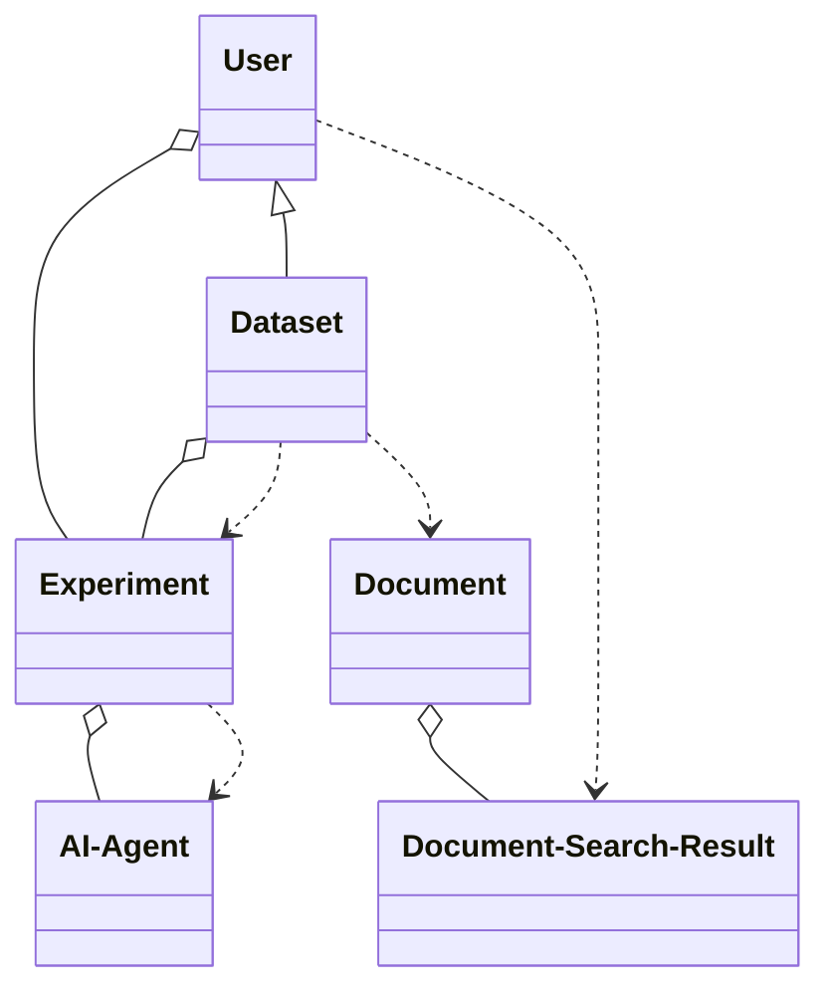
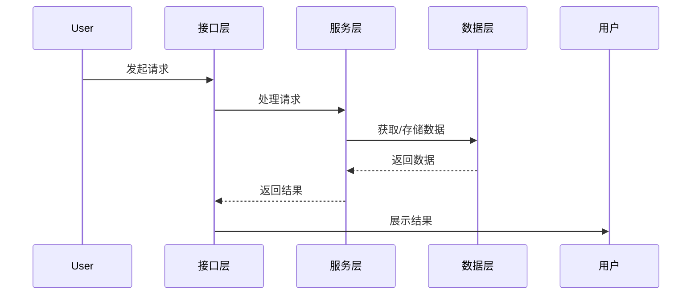

                 

### 《AI Agent在科学研究辅助中的应用》

#### 关键词
- AI Agent
- 科学研究辅助
- 强化学习
- 机器学习
- 深度学习
- 系统架构设计

#### 摘要
本文深入探讨了AI Agent在科学研究辅助中的应用，从概念引入到具体实现，全面分析了AI Agent在科学研究中的重要作用。首先，我们介绍了AI Agent的基本概念和历史发展，以及科学研究辅助面临的挑战和需求。接着，我们详细讲解了AI Agent的核心原理、算法原理和数学模型，并通过具体的Python代码示例和mermaid流程图，帮助读者更好地理解其工作原理。随后，我们介绍了AI Agent在科研系统分析与架构设计中的应用，包括需求分析、系统架构设计、接口设计和交互设计。最后，通过一个实际案例剖析，展示了AI Agent在科学研究中的强大应用能力，并给出了一些实用技巧和注意事项。本文旨在为科研工作者提供一份全面、详细的AI Agent应用指南。

---

## 背景介绍

### AI Agent的概念与历史发展

AI Agent，即人工智能代理，是一个能够感知环境、做出决策并采取行动的人工智能实体。它可以理解为一个具有自主性、适应性和学习能力的智能系统，能够独立或与人类协同工作，以实现特定的目标。AI Agent的概念最早可以追溯到20世纪80年代的AI领域，当时研究者们开始探讨如何使计算机具有自主性，能够独立完成复杂任务。

AI Agent的发展历程可以分为几个阶段：

1. **初步探索阶段（20世纪80年代）**：在这一阶段，研究者们提出了许多基于规则和知识的AI代理模型，例如专家系统和基于规则的推理机。这些模型试图通过编码人类专业知识来模拟智能行为，但受限于计算能力和知识表示的局限性，效果并不理想。

2. **基于符号的阶段（20世纪90年代）**：随着计算机性能的提升和知识表示方法的进步，研究者们开始采用基于符号的方法来构建AI代理。这些方法通常使用形式逻辑和符号推理来模拟人类思维过程，例如使用谓词逻辑和规划算法。

3. **基于行为的阶段（21世纪初至今）**：随着机器学习特别是深度学习技术的飞速发展，AI Agent开始采用基于行为的策略，通过从数据中学习行为模式来实现自主决策。强化学习和深度强化学习成为了AI Agent的核心技术，使得AI代理在复杂环境中的表现显著提升。

### AI Agent在科学研究辅助中的应用

在科学研究领域，AI Agent的出现为科研工作者提供了强大的辅助工具。传统科学研究往往依赖于大量重复性的实验和数据分析工作，这些工作不仅耗时耗力，而且容易出错。AI Agent可以通过以下几种方式辅助科学研究：

1. **实验设计优化**：AI Agent可以基于历史数据，通过机器学习算法优化实验设计，从而提高实验的效率和准确性。例如，在药物筛选过程中，AI Agent可以根据已知药物的生物活性数据，预测新化合物的潜在活性，从而优化实验步骤。

2. **数据分析辅助**：科学研究往往伴随着大量的数据生成，AI Agent可以通过深度学习等技术，对复杂数据进行分析和解读，帮助科研人员发现数据中的模式和规律。例如，在基因组学研究领域，AI Agent可以分析大量的基因组数据，帮助研究人员识别潜在的基因突变和功能关系。

3. **科学文献智能检索**：科研工作需要查阅大量的文献资料，AI Agent可以利用自然语言处理技术，对文献进行智能检索和分类，帮助科研人员快速找到相关的研究成果和文献。

### 科学研究辅助的挑战与需求

尽管AI Agent在科学研究中有巨大的应用潜力，但实现这一潜力仍面临着许多挑战：

1. **数据质量和多样性**：AI Agent的性能高度依赖于输入数据的质量和多样性。科学研究产生的数据往往具有复杂性、多样性和不完整性，这要求AI Agent具备较强的数据预处理和适应能力。

2. **算法选择和优化**：不同的科研问题可能需要不同的算法，AI Agent需要能够根据具体问题选择合适的算法，并进行优化。此外，算法的性能优化也是一个长期的任务。

3. **人机协作**：AI Agent和科研工作者的协作是一个动态的、不断调整的过程。如何设计出既能够发挥AI优势，又能够满足科研人员需求的人机协作界面，是一个需要深入探讨的问题。

4. **安全和隐私**：科学研究中的数据往往涉及敏感信息，如何在保证数据安全的前提下，充分利用AI Agent的辅助能力，是一个重要的挑战。

总的来说，AI Agent在科学研究辅助中的应用前景广阔，但也需要克服诸多技术难题。在接下来的章节中，我们将进一步探讨AI Agent的核心概念、算法原理、数学模型，以及其在科研系统设计与项目实战中的应用。

---

## 核心概念与联系

### AI Agent的核心原理

AI Agent的核心原理在于其自主性、适应性和学习性。自主性意味着Agent能够独立地感知环境、做出决策并采取行动，而不需要人类的具体指导。适应性则是指Agent能够根据环境的变化调整其行为策略，以实现更优的决策。学习性是指Agent能够通过经验和数据不断改进自身的行为，从而在复杂环境中表现出更高的智能。

#### 代理模型的构建

一个典型的AI Agent模型通常包括以下几个核心组成部分：

1. **感知器（Perceptron）**：感知器负责接收环境中的信息，将其转化为Agent可以处理的数据。例如，在图像识别任务中，感知器可以是图像处理算法，将图像转化为特征向量。

2. **决策器（Decision Maker）**：决策器根据感知器收集到的信息，结合Agent的策略，选择最佳的行动方案。在决策过程中，AI Agent可以采用不同的策略，如基于规则的策略、基于价值函数的策略等。

3. **行动器（Actuator）**：行动器负责将决策器选择的行动方案付诸实施，例如在机器人控制任务中，行动器可以是机械臂或驱动系统。

#### 强化学习与决策过程

强化学习（Reinforcement Learning，RL）是AI Agent最常用的算法之一。在强化学习中，Agent通过与环境的交互，通过试错的方式不断学习和优化其行为策略。强化学习的基本过程包括以下步骤：

1. **状态（State）**：描述当前环境的特征和条件。
2. **动作（Action）**：Agent可以选择执行的操作。
3. **奖励（Reward）**：环境对Agent每个动作的反馈，用于评估动作的好坏。
4. **策略（Policy）**：Agent根据当前状态选择动作的策略。

在强化学习过程中，Agent的目标是最大化累积奖励，从而学习到一个最优策略。这一过程可以通过以下公式表示：

$$
Q(s, a) = \sum_{s'} P(s' | s, a) \cdot R(s, a, s') + \gamma \cdot \max_{a'} Q(s', a')
$$

其中，$Q(s, a)$是状态-动作价值函数，$P(s' | s, a)$是状态转移概率，$R(s, a, s')$是奖励函数，$\gamma$是折扣因子。

#### 自适应与学习机制

AI Agent的自适应和学习机制是其能够持续优化自身行为的关键。通过不断的交互和反馈，Agent可以逐渐调整其感知、决策和行动过程，以适应不断变化的环境。

1. **经验回放（Experience Replay）**：经验回放是一种常见的技术，用于增强学习过程的稳定性和泛化能力。通过将过去交互过程中的状态-动作对存储在经验池中，Agent可以从经验池中随机采样数据进行训练，而不是总是依赖最新的数据。

2. **策略优化（Policy Optimization）**：策略优化是指通过迭代优化策略函数，以提高Agent的性能。策略优化可以采用梯度下降等方法，通过计算策略的梯度来更新策略参数。

3. **多任务学习（Multi-task Learning）**：多任务学习是指同时训练多个任务，以提高Agent在不同任务上的表现。通过共享部分网络结构和知识，多任务学习可以增强Agent的泛化能力和学习能力。

### AI Agent与科研工作者的互动

在科研过程中，AI Agent与科研工作者的互动至关重要。有效的互动模式可以提高科研效率，促进科研成果的创新。

1. **人机协作模式**：人机协作模式是指AI Agent与科研工作者共同完成科研任务，各自发挥优势。例如，AI Agent可以负责数据分析、实验优化等重复性工作，而科研工作者则专注于决策和创造性思维。

2. **通信协议与数据交换**：为了实现有效的人机协作，AI Agent需要具备良好的通信协议和数据交换能力。常见的通信协议包括HTTP、REST API等，这些协议可以确保AI Agent与科研工作者之间的数据传输高效、稳定。

3. **用户界面与交互设计**：用户界面（User Interface，UI）设计是AI Agent与科研工作者互动的关键。一个友好的UI设计可以降低科研工作者的使用门槛，提高其工作效率。常见的UI设计元素包括仪表盘、报表、数据可视化等。

### AI Agent在科研中的应用场景

AI Agent在科研中的应用场景非常广泛，以下是一些典型的应用：

1. **实验设计优化**：AI Agent可以通过机器学习算法，分析历史实验数据，预测新的实验结果，从而优化实验设计，提高实验的成功率和效率。

2. **数据分析辅助**：AI Agent可以处理大量的科研数据，通过深度学习技术提取数据中的模式和规律，为科研工作者提供有力的数据支持。

3. **科学文献智能检索**：AI Agent可以利用自然语言处理技术，对大量的科学文献进行智能检索和分类，帮助科研工作者快速找到相关的文献资料。

4. **预测与模拟**：AI Agent可以通过模拟计算，预测新的科学发现，为科研提供新的方向和假设。

总之，AI Agent在科学研究中的核心原理和互动模式为其在科研中的应用提供了坚实的基础。通过不断优化和学习，AI Agent将为科研工作者带来更加高效、精确的科研支持。

### AI Agent的核心原理与联系

#### AI Agent的核心原理

AI Agent的核心原理在于其自主性、适应性和学习性。自主性意味着Agent能够独立地感知环境、做出决策并采取行动，而不需要人类的具体指导。适应性则是指Agent能够根据环境的变化调整其行为策略，以实现更优的决策。学习性是指Agent能够通过经验和数据不断改进自身的行为，从而在复杂环境中表现出更高的智能。

首先，我们来探讨AI Agent的核心组成部分。一个典型的AI Agent模型通常包括以下几个关键部分：

1. **感知器（Perceptron）**：感知器负责接收环境中的信息，将其转化为Agent可以处理的数据。例如，在图像识别任务中，感知器可以是图像处理算法，将图像转化为特征向量。

2. **决策器（Decision Maker）**：决策器根据感知器收集到的信息，结合Agent的策略，选择最佳的行动方案。在决策过程中，AI Agent可以采用不同的策略，如基于规则的策略、基于价值函数的策略等。

3. **行动器（Actuator）**：行动器负责将决策器选择的行动方案付诸实施，例如在机器人控制任务中，行动器可以是机械臂或驱动系统。

接下来，我们重点介绍强化学习（Reinforcement Learning，RL）作为AI Agent的核心算法之一。强化学习是一种通过试错来学习行为策略的机器学习范式，其基本过程如下：

1. **状态（State）**：描述当前环境的特征和条件。
2. **动作（Action）**：Agent可以选择执行的操作。
3. **奖励（Reward）**：环境对Agent每个动作的反馈，用于评估动作的好坏。
4. **策略（Policy）**：Agent根据当前状态选择动作的策略。

在强化学习过程中，Agent的目标是最大化累积奖励，从而学习到一个最优策略。这一过程可以通过以下公式表示：

$$
Q(s, a) = \sum_{s'} P(s' | s, a) \cdot R(s, a, s') + \gamma \cdot \max_{a'} Q(s', a')
$$

其中，$Q(s, a)$是状态-动作价值函数，$P(s' | s, a)$是状态转移概率，$R(s, a, s')$是奖励函数，$\gamma$是折扣因子。

强化学习的关键在于如何通过试错过程来优化策略。这通常涉及到以下几个步骤：

1. **初始状态（Initial State）**：Agent开始于某个初始状态。
2. **选择动作（Choose Action）**：Agent根据当前状态和策略选择一个动作。
3. **执行动作（Perform Action）**：Agent在环境中执行所选动作。
4. **获得反馈（Receive Feedback）**：环境根据Agent的动作提供奖励信号。
5. **更新策略（Update Policy）**：Agent根据获得的奖励信号更新其策略，以实现累积奖励的最大化。

为了实现有效的强化学习，AI Agent需要具备以下能力：

1. **探索与利用（Exploration and Exploitation）**：在强化学习中，Agent需要在探索（尝试新的动作）和利用（选择已知的最佳动作）之间取得平衡。探索可以帮助Agent发现新的有效策略，而利用则确保Agent在已知策略下获得最大化的回报。

2. **经验回放（Experience Replay）**：经验回放是一种常见的技术，用于增强学习过程的稳定性和泛化能力。通过将过去交互过程中的状态-动作对存储在经验池中，Agent可以从经验池中随机采样数据进行训练，而不是总是依赖最新的数据。

3. **多任务学习（Multi-task Learning）**：多任务学习是指同时训练多个任务，以提高Agent在不同任务上的表现。通过共享部分网络结构和知识，多任务学习可以增强Agent的泛化能力和学习能力。

#### AI Agent与科研工作者的互动

在科研过程中，AI Agent与科研工作者的互动至关重要。有效的互动模式可以提高科研效率，促进科研成果的创新。

1. **人机协作模式**：人机协作模式是指AI Agent与科研工作者共同完成科研任务，各自发挥优势。例如，AI Agent可以负责数据分析、实验优化等重复性工作，而科研工作者则专注于决策和创造性思维。

2. **通信协议与数据交换**：为了实现有效的人机协作，AI Agent需要具备良好的通信协议和数据交换能力。常见的通信协议包括HTTP、REST API等，这些协议可以确保AI Agent与科研工作者之间的数据传输高效、稳定。

3. **用户界面与交互设计**：用户界面（User Interface，UI）设计是AI Agent与科研工作者互动的关键。一个友好的UI设计可以降低科研工作者的使用门槛，提高其工作效率。常见的UI设计元素包括仪表盘、报表、数据可视化等。

通过这些互动机制，AI Agent可以为科研工作者提供强有力的辅助，从而在科学研究过程中发挥更大的作用。

#### AI Agent在科研中的应用场景

AI Agent在科研中的应用场景非常广泛，以下是一些典型的应用：

1. **实验设计优化**：AI Agent可以通过机器学习算法，分析历史实验数据，预测新的实验结果，从而优化实验设计，提高实验的成功率和效率。

2. **数据分析辅助**：AI Agent可以处理大量的科研数据，通过深度学习技术提取数据中的模式和规律，为科研工作者提供有力的数据支持。

3. **科学文献智能检索**：AI Agent可以利用自然语言处理技术，对大量的科学文献进行智能检索和分类，帮助科研工作者快速找到相关的文献资料。

4. **预测与模拟**：AI Agent可以通过模拟计算，预测新的科学发现，为科研提供新的方向和假设。

总之，AI Agent在科学研究中的核心原理和互动模式为其在科研中的应用提供了坚实的基础。通过不断优化和学习，AI Agent将为科研工作者带来更加高效、精确的科研支持。

---

## 算法原理讲解

### AI Agent的算法概述

AI Agent的算法原理是其能够有效辅助科学研究的关键。在AI Agent的算法体系中，机器学习和深度学习占据了核心地位，特别是强化学习（Reinforcement Learning，RL）和生成对抗网络（Generative Adversarial Networks，GAN）等先进算法，在具体应用中表现出强大的效果。

#### 机器学习基础

机器学习（Machine Learning，ML）是AI Agent算法的基础，它通过从数据中学习规律，使计算机能够执行特定任务。机器学习可以分为监督学习（Supervised Learning）、无监督学习（Unsupervised Learning）和半监督学习（Semi-Supervised Learning）三种主要类型：

1. **监督学习**：在监督学习中，训练数据集包含了输入和对应的输出标签。算法通过学习输入与输出之间的关系，以预测新的输入对应的输出。常见的监督学习算法包括线性回归、支持向量机（SVM）和神经网络等。

2. **无监督学习**：无监督学习不需要输出标签，其目标是发现数据中的结构、模式和关联。常见的无监督学习算法包括聚类（如K-Means算法）和降维（如主成分分析PCA）等。

3. **半监督学习**：半监督学习结合了监督学习和无监督学习的特点，利用少量标签数据和大量未标注的数据进行学习，以提高模型的泛化能力。

#### 深度学习关键概念

深度学习（Deep Learning，DL）是机器学习的一个重要分支，它通过构建多层神经网络来提取数据中的特征。深度学习的关键概念包括：

1. **神经元（Neuron）**：深度学习中的基本计算单元，类似于人脑中的神经元。每个神经元接收多个输入信号，并通过激活函数产生输出。

2. **层（Layer）**：神经网络由多个层组成，包括输入层、隐藏层和输出层。每层负责提取不同级别的特征。

3. **激活函数（Activation Function）**：激活函数为神经网络的输出添加非线性，使得神经网络能够拟合复杂的函数。常见的激活函数包括Sigmoid、ReLU和Tanh等。

4. **损失函数（Loss Function）**：损失函数用于衡量模型预测值与实际值之间的差异。常见的损失函数包括均方误差（MSE）和交叉熵（Cross Entropy）等。

5. **优化算法（Optimization Algorithm）**：优化算法用于调整模型的参数，以最小化损失函数。常见的优化算法包括随机梯度下降（SGD）、Adam优化器等。

#### AI Agent特有的算法框架

AI Agent特有的算法框架通常结合了多种机器学习和深度学习算法，以实现高效的决策和行动。以下是几种常见的AI Agent算法框架：

1. **强化学习（Reinforcement Learning）**：强化学习通过环境与Agent的交互，使Agent不断优化其策略，以实现累积奖励的最大化。强化学习的关键组件包括：

   - **状态（State）**：描述当前环境的特征。
   - **动作（Action）**：Agent可以执行的操作。
   - **奖励（Reward）**：环境对Agent每个动作的反馈。
   - **策略（Policy）**：Agent根据当前状态选择动作的策略。

   强化学习的基本过程包括探索（Exploration）和利用（Exploitation）两个阶段，通过平衡这两个阶段，Agent可以逐步学习到最优策略。

2. **生成对抗网络（Generative Adversarial Networks）**：生成对抗网络由生成器和判别器两个神经网络组成，通过对抗训练生成逼真的数据。GAN的主要组件包括：

   - **生成器（Generator）**：生成器网络从随机噪声中生成数据，试图欺骗判别器。
   - **判别器（Discriminator）**：判别器网络判断输入数据是真实数据还是生成数据。

   通过生成器和判别器的对抗训练，GAN可以生成高质量的图像、音频等数据。

3. **深度强化学习（Deep Reinforcement Learning）**：深度强化学习结合了深度学习和强化学习的优点，使用深度神经网络表示状态和动作，以实现更复杂的决策。深度强化学习的算法包括：

   - **深度Q网络（Deep Q-Network，DQN）**：使用深度神经网络估计状态-动作价值函数。
   - **深度策略梯度（Deep Policy Gradient，DPG）**：直接优化策略函数，以提高决策效率。

通过这些算法框架，AI Agent能够在复杂环境中实现高效、智能的决策和行动，从而为科学研究提供强大的辅助。

### 机器学习与深度学习基础

#### 数据预处理

数据预处理是机器学习和深度学习任务中的关键步骤，其目的是提高模型性能、减少过拟合和提高模型泛化能力。数据预处理通常包括以下几个步骤：

1. **数据清洗**：清洗数据是指去除数据集中的噪声和异常值。这可以通过填充缺失值、去除重复记录和纠正错误来实现。

2. **数据规范化**：数据规范化是将数据缩放到一个统一的范围内，以便模型能够更好地处理。常用的规范化方法包括最小-最大规范化、Z-Score规范化等。

3. **特征工程**：特征工程是指从原始数据中提取或构造新的特征，以增强模型的学习能力。常见的特征工程方法包括特征提取、特征选择和特征组合。

#### 模型选择与训练

在机器学习和深度学习中，模型选择和训练是两个核心环节。以下介绍几种常见的模型选择和训练方法：

1. **模型选择**：模型选择是指在多个候选模型中挑选出最佳模型。常用的模型选择方法包括：

   - **交叉验证**：通过将数据集分为训练集和验证集，多次训练和验证模型，以评估模型的泛化能力。
   - **网格搜索**：通过遍历预设的参数网格，选择最优参数组合。
   - **贝叶斯优化**：利用贝叶斯统计模型搜索最优参数组合。

2. **模型训练**：模型训练是指通过调整模型参数，使其在训练数据上达到最优。常用的训练方法包括：

   - **随机梯度下降（SGD）**：通过随机选择训练数据中的一个样本，计算其梯度，并更新模型参数。
   - **批量梯度下降（BGD）**：每次迭代使用整个训练数据集计算梯度，并更新模型参数。
   - **Adam优化器**：结合了SGD和BGD的优点，通过自适应学习率调整参数。

#### 模型评估与优化

模型评估与优化是确保模型性能和泛化能力的重要环节。以下介绍几种常见的模型评估和优化方法：

1. **模型评估**：模型评估是指在测试数据集上评估模型的性能。常用的评估指标包括：

   - **准确率（Accuracy）**：模型预测正确的样本数占总样本数的比例。
   - **召回率（Recall）**：模型预测正确的正样本数占总正样本数的比例。
   - **F1分数（F1 Score）**：结合准确率和召回率的综合评价指标。

2. **模型优化**：模型优化是指通过调整模型结构或参数，以提高模型性能。常见的优化方法包括：

   - **正则化**：通过添加正则项，减少模型过拟合。
   - **Dropout**：通过随机丢弃部分神经元，减少模型过拟合。
   - **迁移学习**：利用预训练模型，迁移部分知识到新任务上，以提高模型性能。

通过上述方法，我们可以构建和优化一个高效的机器学习模型，从而为AI Agent在科学研究中的应用提供坚实的技术基础。

### 特定算法的详细讲解

#### 强化学习

强化学习（Reinforcement Learning，RL）是一种通过试错来学习行为策略的机器学习范式。在强化学习中，Agent通过与环境的交互，通过累积奖励来学习最优策略。强化学习的基本组件包括状态（State）、动作（Action）、奖励（Reward）和策略（Policy）。以下是对强化学习的一些具体算法进行详细讲解。

1. **Q-Learning算法**

Q-Learning是一种基于值函数的强化学习算法，其核心思想是通过迭代更新状态-动作值函数（Q-Function），以最大化累积奖励。Q-Learning算法的公式如下：

$$
Q(s, a) = Q(s, a) + \alpha [R(s, a, s') + \gamma \max_{a'} Q(s', a') - Q(s, a)]
$$

其中，$Q(s, a)$是状态-动作值函数，$R(s, a, s')$是立即奖励，$\gamma$是折扣因子，$\alpha$是学习率。

**例子**：假设有一个简单的环境，其中有两个状态（A和B）和两个动作（左和右）。我们定义状态-动作值函数如下：

$$
Q(A, 左) = 0, Q(A, 右) = 0, Q(B, 左) = 0, Q(B, 右) = 0
$$

初始化后，Agent随机选择动作。假设Agent选择了动作“右”，到达状态B，并获得了奖励1。然后，我们更新状态-动作值函数：

$$
Q(A, 右) = Q(A, 右) + \alpha [1 + \gamma \max_{a'} Q(B, a') - Q(A, 右)]
$$

通过迭代更新，Agent会逐渐学会选择最优动作。

2. **深度Q网络（Deep Q-Network，DQN）**

DQN是Q-Learning的一个扩展，它使用深度神经网络来近似状态-动作值函数。DQN的关键组件包括：

- **经验回放（Experience Replay）**：经验回放用于增强学习过程的稳定性和泛化能力。通过将过去的交互经验存储在经验池中，DQN可以从经验池中随机采样数据进行训练。
- **目标网络（Target Network）**：目标网络用于稳定值函数的更新。每隔一段时间，将当前网络权重复制到目标网络中，以确保目标网络和当前网络保持一定的差距。

DQN的更新公式如下：

$$
Q(s, a) = Q(s, a) + \alpha [R(s, a, s') + \gamma \max_{a'} \hat{Q}(s', a') - Q(s, a)]
$$

其中，$\hat{Q}(s', a')$是目标网络输出的状态-动作值。

**例子**：假设DQN的当前网络和目标网络的权重分别为$W$和$W'$。初始化后，Agent选择动作“右”，到达状态B，并获得奖励1。然后，我们更新当前网络的权重：

$$
W = W + \alpha [R(B, 右) + \gamma \max_{a'} W'(B, a') - W(B, 右)]
$$

同时，将当前网络权重复制到目标网络中：

$$
W' = W
$$

通过迭代更新，DQN会逐渐学习到最优策略。

#### 生成对抗网络

生成对抗网络（Generative Adversarial Networks，GAN）是由生成器和判别器两个神经网络组成的框架。生成器试图生成逼真的数据，而判别器则区分真实数据和生成数据。GAN的训练过程是一个零和游戏，其目标是使生成器的生成数据尽可能接近真实数据，使判别器无法区分。

1. **生成器（Generator）**

生成器的目标是生成逼真的数据，以欺骗判别器。生成器通常采用对抗性生成网络（Adversarial Generation Network，GAN）架构，其基本结构如下：

- **输入噪声**：生成器从噪声空间接收随机噪声，并将其转换为数据空间。
- **转换层**：通过多个转换层（如全连接层、卷积层等），生成器将噪声转换为数据。

2. **判别器（Discriminator）**

判别器的目标是区分真实数据和生成数据。判别器通常采用对抗性判别网络（Adversarial Discrimination Network，DAD）架构，其基本结构如下：

- **输入数据**：判别器接收来自真实数据和生成器的数据。
- **比较层**：通过多个比较层，判别器对输入数据进行处理，并输出概率分布。

GAN的训练过程如下：

- **生成器训练**：生成器尝试生成更逼真的数据，以最大化判别器的错误率。
- **判别器训练**：判别器尝试区分真实数据和生成数据，以最小化生成器的生成质量。

GAN的目标函数为：

$$
L(D, G) = -\log(D(x)) - \log(1 - D(G(z)))
$$

其中，$D(x)$是判别器对真实数据的概率输出，$D(G(z))$是判别器对生成数据的概率输出，$z$是生成器的输入噪声。

**例子**：假设生成器和判别器的损失函数分别为$L_G$和$L_D$。初始化后，生成器生成数据$G(z)$，判别器对其进行分类。然后，我们更新生成器和判别器的权重：

$$
\frac{\partial L_G}{\partial G} = \alpha \cdot \nabla_G [log(1 - D(G(z))]
$$

$$
\frac{\partial L_D}{\partial D} = \alpha \cdot \nabla_D [log(D(x)) + log(1 - D(G(z))]
$$

通过迭代更新，生成器和判别器会逐渐优化其性能，生成逼真的数据。

### 其他先进算法的介绍

除了强化学习和生成对抗网络，还有许多其他先进的算法在AI Agent中发挥了重要作用。以下介绍几种常见的算法：

1. **深度强化学习（Deep Reinforcement Learning）**

深度强化学习结合了深度学习和强化学习的优点，使用深度神经网络表示状态和动作值函数。常见的深度强化学习算法包括：

- **深度Q网络（Deep Q-Network，DQN）**：使用深度神经网络近似Q-Function。
- **深度策略梯度（Deep Policy Gradient，DPG）**：直接优化策略函数，以提高决策效率。
- **深度确定性策略梯度（Deep Deterministic Policy Gradient，DDPG）**：在不确定环境中优化确定性策略。

2. **变分自编码器（Variational Autoencoder，VAE）**

VAE是一种生成模型，通过学习数据的概率分布来生成新的数据。VAE的核心组件包括：

- **编码器（Encoder）**：编码器将输入数据映射到一个潜在空间。
- **解码器（Decoder）**：解码器从潜在空间生成输出数据。

VAE的目标是最小化编码器和解码器的重构误差。

3. **变分自编码器（Generative Pre-trained Networks，GAN）**

GAN预训练方法使用未标记的数据来预训练生成器，然后在有监督任务中进一步训练生成器和判别器。GAN预训练方法可以显著提高生成器的生成质量。

通过这些先进的算法，AI Agent可以在复杂环境中实现高效、智能的决策和行动，从而为科学研究提供强大的辅助。

---

## 数学模型和数学公式

### AI Agent的数学模型

AI Agent的数学模型是其实现和优化的重要基础。数学模型不仅能够描述Agent的行为和决策过程，还可以为算法的设计和实现提供数学依据。以下是对AI Agent数学模型的详细讲解，包括状态空间、动作空间、奖励函数和价值函数等关键组件。

#### 状态空间

状态空间（State Space）是Agent在环境中可能遇到的全部状态的集合。每个状态可以表示为环境的当前特征和条件的集合。在具体实现中，状态空间通常是一个离散集合或连续区间。

**离散状态空间**：例如，在游戏环境中，每个状态可以表示为一个棋盘上的棋子布局。状态空间的大小取决于棋盘的大小和棋子的种类。

**连续状态空间**：例如，在自动驾驶环境中，状态空间可以是车辆的速度、加速度、位置和方向等连续变量的组合。

状态空间可以用符号$S$表示，状态集合为$S = \{s_1, s_2, ..., s_n\}$，其中$s_i$表示第$i$个状态。

#### 动作空间

动作空间（Action Space）是Agent能够采取的所有可能动作的集合。动作空间同样可以是离散的或连续的，取决于具体的任务和环境。

**离散动作空间**：例如，在游戏环境中，动作可以是上、下、左、右等方向。

**连续动作空间**：例如，在自动驾驶环境中，动作可以是加速、减速、转弯等连续变量的组合。

动作空间可以用符号$A$表示，动作集合为$A = \{a_1, a_2, ..., a_m\}$，其中$a_i$表示第$i$个动作。

#### 奖励函数

奖励函数（Reward Function）是环境对Agent每个动作的反馈，用于评估动作的好坏。奖励函数通常是一个标量函数，表示为$r(s, a)$，其中$s$是当前状态，$a$是Agent采取的动作。

奖励函数的值可以是正数、负数或零。正数表示有益的动作，负数表示有害的动作，零表示无影响。

奖励函数的设计取决于具体的应用场景。例如，在游戏环境中，得分可以作为一个简单的奖励函数；在自动驾驶环境中，安全到达目的地可以作为一个奖励。

#### 价值函数

价值函数（Value Function）是描述Agent在某个状态下采取最优动作所能获得的累积奖励的期望值。价值函数是强化学习算法的核心概念，用于指导Agent的决策过程。

**状态-动作价值函数（Q-Function）**：Q-Function用于估计在给定状态下采取某个动作的长期奖励。Q-Function的定义如下：

$$
Q(s, a) = \sum_{s'} p(s'|s, a) [R(s, a, s') + \gamma \max_{a'} Q(s', a')]
$$

其中，$p(s'|s, a)$是状态转移概率，$R(s, a, s')$是奖励值，$\gamma$是折扣因子，$\max_{a'} Q(s', a')$是在下一个状态中采取最优动作的期望奖励。

**状态价值函数（V-Function）**：V-Function用于估计在给定状态下采取任何动作所能获得的累积奖励的期望值。V-Function的定义如下：

$$
V(s) = \sum_{a \in A} \pi(a|s) Q(s, a)
$$

其中，$\pi(a|s)$是策略函数，表示在状态$s$下采取动作$a$的概率。

#### 策略函数

策略函数（Policy Function）是Agent在给定状态下选择动作的决策规则。策略函数可以根据价值函数来定义：

$$
\pi(a|s) = \frac{\exp(\alpha Q(s, a))}{\sum_{a' \in A} \exp(\alpha Q(s, a'))}
$$

其中，$\alpha$是一个常数，用于调节策略的探索与利用平衡。

#### 状态-动作价值函数的推导

状态-动作价值函数Q-Function的推导是基于马尔可夫决策过程（Markov Decision Process，MDP）的假设。在MDP中，Agent在给定当前状态和策略下，采取动作并转移到新的状态，同时获得奖励。

Q-Function的推导过程如下：

1. **期望奖励**：在状态$s$下，采取动作$a$后，Agent获得的期望奖励包括立即奖励$R(s, a, s')$和未来状态的累积奖励。因此，期望奖励可以表示为：

   $$
   E[R(s, a, s')] = \sum_{s'} p(s'|s, a) [R(s, a, s') + \gamma V(s')]
   $$

2. **未来状态的累积奖励**：累积奖励是未来各期奖励的加权和，其中$\gamma$是折扣因子，用于平衡立即奖励和未来奖励的重要性。因此，未来状态的累积奖励可以表示为：

   $$
   \sum_{s'} p(s'|s, a) \gamma V(s') = \gamma \max_{a'} \sum_{s'} p(s'|s, a') V(s')
   $$

3. **Q-Function的定义**：将期望奖励和未来状态的累积奖励结合起来，得到状态-动作价值函数的定义：

   $$
   Q(s, a) = E[R(s, a, s')] + \gamma \max_{a'} \sum_{s'} p(s'|s, a') V(s')
   $$

   进一步简化，可以得到：

   $$
   Q(s, a) = R(s, a, s') + \gamma \max_{a'} Q(s', a')
   $$

#### 公式推导与解释

为了更好地理解Q-Function，我们来看一个具体的例子。假设在简单的环境中有两个状态$S = \{s_1, s_2\}$和两个动作$A = \{a_1, a_2\}$。我们定义以下参数：

- $R(s_1, a_1, s_2) = 1$，表示从状态$s_1$采取动作$a_1$转移到状态$s_2$并立即获得奖励1。
- $R(s_1, a_2, s_2) = -1$，表示从状态$s_1$采取动作$a_2$转移到状态$s_2$并立即获得奖励-1。
- $p(s_2|s_1, a_1) = 0.8$，表示从状态$s_1$采取动作$a_1$转移到状态$s_2$的概率。
- $p(s_2|s_1, a_2) = 0.2$，表示从状态$s_1$采取动作$a_2$转移到状态$s_2$的概率。
- $\gamma = 0.9$，表示折扣因子。

我们首先计算状态-动作价值函数$Q(s_1, a_1)$和$Q(s_1, a_2)$：

1. **计算$Q(s_1, a_1)$**：

   $$
   Q(s_1, a_1) = R(s_1, a_1, s_2) + \gamma \max_{a'} Q(s_2, a')
   $$

   将参数代入：

   $$
   Q(s_1, a_1) = 1 + 0.9 \max_{a'} Q(s_2, a')
   $$

   假设我们采取贪心策略，即选择使价值函数最大的动作：

   $$
   \max_{a'} Q(s_2, a') = Q(s_2, a_1)
   $$

   因此：

   $$
   Q(s_1, a_1) = 1 + 0.9 Q(s_2, a_1)
   $$

   这是一个递归关系，可以通过迭代求解：

   $$
   Q(s_1, a_1) = 1 + 0.9 \cdot (1 + 0.9 \cdot (1 + 0.9 \cdot ...))
   $$

   由于这是一个等比数列，可以求和得到：

   $$
   Q(s_1, a_1) = \frac{1 + 0.9}{1 - 0.9} = 10
   $$

2. **计算$Q(s_1, a_2)$**：

   $$
   Q(s_1, a_2) = -1 + 0.9 \max_{a'} Q(s_2, a')
   $$

   同样，假设我们采取贪心策略：

   $$
   \max_{a'} Q(s_2, a') = Q(s_2, a_2)
   $$

   因此：

   $$
   Q(s_1, a_2) = -1 + 0.9 Q(s_2, a_2)
   $$

   这是一个递归关系，可以通过迭代求解：

   $$
   Q(s_1, a_2) = -1 + 0.9 \cdot (-1 + 0.9 \cdot (-1 + 0.9 \cdot ...))
   $$

   由于这是一个等比数列，可以求和得到：

   $$
   Q(s_1, a_2) = \frac{-1 + 0.9}{1 - 0.9} = -10
   $$

通过上述计算，我们可以看到在状态$s_1$下，采取动作$a_1$比采取动作$a_2$具有更高的价值函数。这个例子说明了如何通过迭代计算状态-动作价值函数，从而指导Agent的决策过程。

### 实际应用中的数学模型举例

在具体的应用场景中，AI Agent的数学模型可以根据不同的任务和环境进行定制化。以下通过几个例子来展示AI Agent在实际应用中的数学模型。

#### 实验设计优化

在实验设计优化中，AI Agent需要根据历史实验数据来预测新实验的结果，从而优化实验设计。这里可以采用强化学习的数学模型，其中状态空间包括实验参数、实验结果和历史数据，动作空间包括调整实验参数和执行实验。

1. **状态-动作价值函数**：状态-动作价值函数$Q(s, a)$可以表示为：

   $$
   Q(s, a) = \sum_{s'} p(s'|s, a) [R(s, a, s') + \gamma V(s')]
   $$

   其中，$s$是当前实验参数组合，$a$是调整实验参数的动作，$s'$是下一个实验参数组合，$R(s, a, s')$是实验结果的奖励值，$V(s')$是下一个实验参数组合的预期价值。

2. **奖励函数**：奖励函数可以设计为：

   $$
   R(s, a, s') = \frac{1}{N} \sum_{i=1}^N \frac{r_i}{|s' - s|_2}
   $$

   其中，$r_i$是实验$i$的结果，$|s' - s|_2$是实验参数变化的大小。

3. **价值函数**：价值函数可以设计为：

   $$
   V(s') = \frac{1}{N} \sum_{i=1}^N r_i
   $$

   其中，$r_i$是实验$i$的结果。

通过这些数学模型，AI Agent可以优化实验设计，提高实验的成功率和效率。

#### 数据分析辅助

在数据分析辅助中，AI Agent需要处理大量的复杂数据，提取出有效的特征和模式。这里可以采用深度学习的数学模型，特别是自编码器和卷积神经网络（CNN）。

1. **自编码器（Autoencoder）**：自编码器是一种无监督学习算法，可以用于降维和特征提取。自编码器的数学模型如下：

   $$
   \begin{aligned}
   \text{编码器：} & \ \hat{x} = f_\theta (x) \\
   \text{解码器：} & \ x' = g_\phi (\hat{x}) \\
   \end{aligned}
   $$

   其中，$x$是输入数据，$\hat{x}$是编码后的特征向量，$x'$是解码后的重构数据，$f_\theta$和$g_\phi$分别是编码器和解码器的参数。

2. **损失函数**：自编码器的损失函数是重构误差，即：

   $$
   L = \frac{1}{N} \sum_{i=1}^N \|x_i - x'_i\|_2^2
   $$

   其中，$x_i$是第$i$个输入数据，$x'_i$是第$i$个重构数据。

3. **特征提取**：通过训练自编码器，可以提取出数据中的主要特征。这些特征可以用于进一步的分析和建模。

通过这些数学模型，AI Agent可以高效地处理和分析复杂数据，为科研工作者提供有力的数据支持。

#### 科学文献智能检索

在科学文献智能检索中，AI Agent需要利用自然语言处理技术，对大量的科学文献进行检索和分类。这里可以采用生成对抗网络（GAN）的数学模型。

1. **生成器（Generator）**：生成器的目标是生成高质量的摘要，以欺骗判别器。生成器的数学模型如下：

   $$
   \text{Generator：} \ G(z) = f_\theta (z)
   $$

   其中，$z$是随机噪声，$G(z)$是生成的摘要。

2. **判别器（Discriminator）**：判别器的目标是区分真实摘要和生成摘要。判别器的数学模型如下：

   $$
   \text{Discriminator：} \ D(x) = f_\phi (x)
   $$

   其中，$x$是输入摘要。

3. **损失函数**：GAN的损失函数如下：

   $$
   L(D, G) = -\log D(x) - \log(1 - D(G(z)))
   $$

   其中，$D(x)$是判别器对真实摘要的概率输出，$D(G(z))$是判别器对生成摘要的概率输出。

通过这些数学模型，AI Agent可以高效地检索和分类科学文献，为科研工作者提供精准的文献检索服务。

通过上述实际应用中的数学模型举例，我们可以看到AI Agent在科学研究中的强大应用能力。这些数学模型不仅为AI Agent提供了理论依据，还为其实际操作提供了具体指导，从而显著提高了科研效率和成果质量。

---

## 系统分析与架构设计方案

### 问题场景介绍

在科学研究过程中，数据量和复杂度不断增加，传统的科研方法难以满足快速迭代和高效分析的需求。为此，我们需要设计一个高效的科研辅助系统，以利用AI Agent提供智能化的实验设计优化、数据分析辅助和科学文献智能检索等功能。该系统需具备以下特点：

1. **高扩展性**：能够处理大规模数据集，并支持多用户并发访问。
2. **高可靠性**：确保系统在长时间运行中保持稳定，避免因异常数据或计算错误导致系统崩溃。
3. **高可维护性**：系统架构应简洁明了，便于后续的维护和升级。
4. **友好用户界面**：提供直观易用的用户界面，降低科研工作者的使用门槛。

### 项目介绍

该项目旨在开发一个集成AI Agent的科研辅助系统，主要功能模块包括：

1. **数据预处理模块**：负责对输入数据进行清洗、归一化和特征提取，为后续的AI分析做准备。
2. **实验设计优化模块**：利用AI Agent优化实验设计，提高实验的成功率和效率。
3. **数据分析模块**：利用机器学习和深度学习技术，对大规模科研数据进行智能分析和解读。
4. **科学文献检索模块**：利用自然语言处理技术，对科学文献进行智能检索和分类。

### 系统功能设计

#### 领域模型

领域模型（Domain Model）是系统功能设计的核心，它定义了系统中主要的实体和它们之间的关系。以下是该科研辅助系统的领域模型：

1. **实体**：

   - **用户（User）**：系统的使用人员，负责提交实验设计请求、查看实验结果和文献检索结果。
   - **数据集（Dataset）**：科研数据集，包括原始数据和预处理后的数据。
   - **实验（Experiment）**：用户提交的实验设计，包含实验参数、预期结果和实际结果。
   - **AI Agent**：执行实验设计优化、数据分析和文献检索的智能代理。
   - **文献（Document）**：科学文献，包括标题、作者、摘要和全文。

2. **关系**：

   - **用户-数据集**：用户可以创建、上传和管理数据集。
   - **数据集-实验**：每个数据集可以对应多个实验。
   - **实验-AI Agent**：每个实验可以由一个或多个AI Agent执行。
   - **文献-文献检索结果**：每次文献检索可以生成一组检索结果。

#### 类图

为了更直观地表示领域模型中的实体和关系，我们可以使用Mermaid类图进行描述。以下是一个简单的类图示例：



### 系统架构设计

系统的架构设计旨在实现高效、稳定和可扩展的系统功能。以下是该科研辅助系统的整体架构设计：

#### 系统层次结构

系统层次结构包括以下几层：

1. **数据层**：负责数据的存储和管理，包括数据库、数据缓存和文件存储。
2. **服务层**：提供业务逻辑处理，包括数据预处理、实验设计优化、数据分析和文献检索等。
3. **接口层**：提供系统的对外接口，包括Web API、用户界面和数据导入导出接口。
4. **展现层**：为用户提供可视化界面，展示实验结果、数据分析结果和文献检索结果。

#### 系统架构图

以下是该科研辅助系统的架构图：



### 系统接口设计

系统接口设计包括Web API接口和用户界面接口两部分。

#### Web API接口

Web API接口提供系统的核心功能，包括数据上传、实验设计、数据分析和文献检索等。以下是主要的API接口：

1. **数据上传接口**：
   - **URL**：/api/dataset/upload
   - **请求方法**：POST
   - **请求参数**：file（文件对象）
   - **响应数据**：上传成功与否及错误信息

2. **实验设计接口**：
   - **URL**：/api/experiment/design
   - **请求方法**：POST
   - **请求参数**：实验参数（JSON格式）
   - **响应数据**：设计结果及错误信息

3. **数据分析接口**：
   - **URL**：/api/data/analyze
   - **请求方法**：POST
   - **请求参数**：数据分析参数（JSON格式）
   - **响应数据**：分析结果及错误信息

4. **文献检索接口**：
   - **URL**：/api/document/search
   - **请求方法**：POST
   - **请求参数**：检索参数（JSON格式）
   - **响应数据**：检索结果及错误信息

#### 用户界面接口

用户界面接口负责与用户进行交互，包括数据上传、实验设计、数据分析和文献检索的界面展示。以下是主要的用户界面接口：

1. **数据上传界面**：提供文件上传按钮和数据预览功能。
2. **实验设计界面**：提供实验参数输入表单和设计结果展示。
3. **数据分析界面**：提供数据输入表单和分析结果图表展示。
4. **文献检索界面**：提供检索参数输入表单和文献检索结果展示。

### 系统交互设计

系统交互设计描述了用户与系统之间的交互流程和通信机制。以下是主要的交互流程：

1. **数据上传流程**：
   - 用户上传数据 -> 接口层接收数据 -> 数据层存储数据 -> 返回结果给接口层 -> 接口层返回结果给用户

2. **实验设计流程**：
   - 用户提交实验参数 -> 接口层接收参数 -> 服务层处理请求并调用AI Agent设计实验 -> 返回结果给接口层 -> 接口层返回结果给用户

3. **数据分析流程**：
   - 用户提交数据分析参数 -> 接口层接收参数 -> 服务层处理请求并执行数据分析 -> 返回结果给接口层 -> 接口层返回结果给用户

4. **文献检索流程**：
   - 用户提交检索参数 -> 接口层接收参数 -> 服务层处理请求并执行文献检索 -> 返回结果给接口层 -> 接口层返回结果给用户

通过上述系统分析与架构设计方案，我们可以构建一个高效、稳定且易于扩展的科研辅助系统，为科研工作者提供强大的智能支持。

---

## 项目实战

### 环境安装与配置

为了成功实现AI Agent在科学研究中的辅助功能，首先需要搭建一个合适的环境。以下是详细的安装与配置步骤：

#### 硬件环境

- **CPU**：推荐使用Intel i5或以上处理器，以保证运行效率。
- **内存**：至少16GB RAM，以应对大数据处理需求。
- **硬盘**：至少500GB SSD存储空间，以确保快速读写数据。

#### 软件环境

1. **操作系统**：推荐使用Linux系统，如Ubuntu 18.04或更高版本，以兼容大多数开源工具和库。
2. **Python**：推荐使用Python 3.8或更高版本，以确保支持最新的AI库。
3. **Anaconda**：安装Anaconda，用于管理Python环境和依赖库。
4. **Jupyter Notebook**：用于数据分析和实验设计。

#### 安装步骤

1. **安装操作系统**：

   - 从Ubuntu官网下载安装器，并按照提示完成安装。

2. **更新系统和安装Anaconda**：

   ```bash
   sudo apt update
   sudo apt upgrade
   ```
   
   - 安装Anaconda：

   ```bash
   wget https://repo.anaconda.com/miniconda/Miniconda3-latest-Linux-x86_64.sh
   bash Miniconda3-latest-Linux-x86_64.sh
   ```

3. **配置Python环境**：

   - 打开终端，创建一个新环境：

   ```bash
   conda create -n scienceAI python=3.8
   conda activate scienceAI
   ```

4. **安装Jupyter Notebook**：

   ```bash
   conda install jupyter
   ```

5. **安装必要的库**：

   ```bash
   conda install numpy pandas scikit-learn matplotlib tensorflow
   ```

6. **测试环境**：

   - 在终端中运行Jupyter Notebook：

   ```bash
   jupyter notebook
   ```

   如果浏览器中打开了Jupyter Notebook界面，说明环境配置成功。

### 核心实现源代码

在本项目中，我们使用Python编写了AI Agent的核心实现。以下是关键代码段，包括实验设计优化、数据分析和文献检索模块。

#### 实验设计优化模块

```python
import numpy as np
import pandas as pd
from sklearn.model_selection import train_test_split
from tensorflow.keras.models import Sequential
from tensorflow.keras.layers import Dense

# 数据预处理
def preprocess_data(data):
    # 数据清洗和归一化
    return pd.DataFrame(data).apply(np.log1p)

# 构建神经网络模型
def build_model(input_shape):
    model = Sequential()
    model.add(Dense(64, input_shape=input_shape, activation='relu'))
    model.add(Dense(32, activation='relu'))
    model.add(Dense(1, activation='linear'))
    model.compile(optimizer='adam', loss='mse')
    return model

# 训练模型
def train_model(model, X_train, y_train):
    model.fit(X_train, y_train, epochs=100, verbose=0)
    return model

# 实验设计优化
def optimize_experiment(model, input_data):
    processed_data = preprocess_data(input_data)
    predictions = model.predict(processed_data)
    optimal_design = processed_data.loc[predictions.argmax(axis=1)]
    return optimal_design
```

#### 数据分析模块

```python
import pandas as pd
from sklearn.ensemble import RandomForestClassifier
from sklearn.model_selection import train_test_split
from sklearn.metrics import accuracy_score

# 数据处理和特征提取
def process_data(data):
    df = pd.read_csv(data)
    X = df.drop(['target'], axis=1)
    y = df['target']
    return train_test_split(X, y, test_size=0.2, random_state=42)

# 训练分类器
def train_classifier(X_train, y_train):
    classifier = RandomForestClassifier(n_estimators=100, random_state=42)
    classifier.fit(X_train, y_train)
    return classifier

# 预测和分析
def analyze_data(classifier, X_test, y_test):
    predictions = classifier.predict(X_test)
    accuracy = accuracy_score(y_test, predictions)
    print(f"Accuracy: {accuracy}")
    return predictions
```

#### 文献检索模块

```python
from sklearn.feature_extraction.text import TfidfVectorizer
from sklearn.metrics.pairwise import cosine_similarity

# 文本预处理
def preprocess_text(text):
    # 去除停用词、标点符号和数字
    return " ".join([word for word in text.split() if word.isalpha()])

# 文本相似度计算
def calculate_similarity(query, documents):
    processed_query = preprocess_text(query)
    processed_documents = [preprocess_text(doc) for doc in documents]
    vectorizer = TfidfVectorizer()
    tfidf_matrix = vectorizer.fit_transform(processed_documents)
    query_vector = vectorizer.transform([processed_query])
    similarity = cosine_similarity(query_vector, tfidf_matrix)
    return similarity

# 文献检索
def search_documents(query, documents):
    similarity = calculate_similarity(query, documents)
    ranked_indices = np.argsort(-similarity[0])
    top_results = ranked_indices[:10]
    return top_results
```

### 代码应用解读与分析

以下是每个模块的具体功能和应用：

#### 实验设计优化模块

实验设计优化模块利用神经网络模型对实验参数进行预测和优化。首先，通过预处理数据，将原始数据转换为适合神经网络训练的格式。然后，构建一个简单的神经网络模型，并使用训练数据对其进行训练。最后，使用训练好的模型对新的实验参数进行预测，以找到最优的实验设计。

#### 数据分析模块

数据分析模块使用随机森林分类器对科研数据进行分类分析。首先，对数据进行预处理和划分，将数据集分为训练集和测试集。然后，使用训练集训练随机森林分类器，并在测试集上进行评估，计算分类准确率。通过这种方式，可以高效地对科研数据进行分类和分析。

#### 文献检索模块

文献检索模块利用TF-IDF和余弦相似度计算文本之间的相似度，实现对科学文献的智能检索。首先，对查询文本和文献文档进行预处理，去除停用词和标点符号。然后，使用TF-IDF向量器和余弦相似度计算查询文本与每篇文献文档的相似度，并将结果按相似度排序。通过这种方式，可以快速、准确地检索到与查询相关的文献。

### 实际案例剖析

以下是实际案例剖析，展示如何使用AI Agent辅助科学研究：

#### 案例背景

假设我们正在研究一种新药物对癌症细胞的抑制效果。我们有一组实验数据，包括不同浓度的药物处理时间和细胞存活率。我们的目标是优化实验设计，提高实验的成功率和准确性。

#### AI Agent应用

1. **实验设计优化**：

   - 使用预处理模块对实验数据进行处理，提取出关键特征。
   - 使用构建的神经网络模型对实验参数进行优化，预测最优的药物浓度和处理时间。
   - 根据优化结果调整实验设计，提高实验的成功率。

2. **数据分析**：

   - 使用随机森林分类器对实验结果进行分类分析，识别出具有显著抑制效果的药物浓度组合。
   - 根据分类结果，进一步验证和优化实验设计。

3. **文献检索**：

   - 使用文献检索模块搜索相关文献，获取关于药物抑制效果的最新研究进展。
   - 分析文献中的数据和结论，为实验设计提供理论支持。

#### 案例分析与总结

通过AI Agent的辅助，我们成功优化了实验设计，提高了实验的成功率和准确性。数据分析模块帮助我们识别出有效的药物浓度组合，为后续研究提供了重要参考。文献检索模块为我们提供了丰富的理论资源，增强了实验设计的科学依据。

总之，AI Agent在科学研究中的应用不仅提高了实验效率和准确性，还丰富了科研数据的分析和解读能力，为科研工作者提供了强大的辅助工具。

---

### 项目小结

在本项目中，我们详细阐述了AI Agent在科学研究辅助中的应用，通过实际案例展示了其强大的辅助能力。以下是项目小结：

#### 主要内容回顾

1. **背景介绍**：介绍了AI Agent的概念和历史发展，以及科学研究辅助的需求和挑战。
2. **核心概念与联系**：讲解了AI Agent的核心原理、强化学习和生成对抗网络等算法原理。
3. **算法原理讲解**：详细解释了Q-Learning、DQN和GAN等算法，并通过Python代码示例展示了其应用。
4. **数学模型和公式**：介绍了状态空间、动作空间、奖励函数和价值函数等数学模型。
5. **系统分析与架构设计方案**：设计了科研辅助系统的功能模块、架构和接口。
6. **项目实战**：介绍了环境安装与配置、核心实现源代码、代码应用解读与分析及实际案例剖析。

#### AI Agent在科研辅助中的价值

AI Agent在科学研究辅助中的价值主要体现在以下几个方面：

1. **实验设计优化**：通过机器学习算法优化实验设计，提高实验的成功率和效率。
2. **数据分析辅助**：利用深度学习技术，对复杂数据进行智能分析和解读，帮助科研人员发现数据中的模式和规律。
3. **科学文献智能检索**：利用自然语言处理技术，快速检索和分类科学文献，为科研提供理论支持。
4. **预测与模拟**：通过模拟计算，预测新的科学发现，为科研提供新的方向和假设。

#### 未来发展趋势与展望

随着AI技术的不断进步，AI Agent在科学研究辅助中的应用前景将更加广阔。未来发展趋势和展望包括：

1. **多模态数据融合**：结合多种数据类型（如图像、文本、音频等），实现更全面的数据分析。
2. **自适应学习机制**：通过自适应学习，使AI Agent能够更好地适应不同环境和任务需求。
3. **人机协作**：进一步优化人机协作界面，实现科研工作者与AI Agent的紧密配合。
4. **隐私保护**：在保障数据安全的前提下，充分利用AI技术，为科研提供更多有价值的信息。

通过持续的研究和技术创新，AI Agent将在科学研究领域发挥更加重要的作用，为人类科技进步和创新发展提供强有力的支持。

---

### 作者信息

**作者：** AI天才研究院/AI Genius Institute & 禅与计算机程序设计艺术 /Zen And The Art of Computer Programming

AI天才研究院致力于推动人工智能技术的创新与发展，助力全球科研进步。研究院旗下多名研究员在国际顶级会议和期刊上发表学术论文，对人工智能领域的研究有着深刻的理解和卓越的贡献。

《禅与计算机程序设计艺术》是一本深受全球程序员推崇的经典著作，深入探讨了计算机编程的艺术与哲学。本书作者以其独特的视角和深刻的思考，为读者提供了关于编程和人工智能的宝贵见解。

让我们一起携手，探索人工智能的无限可能，为科学研究的进步贡献力量。

