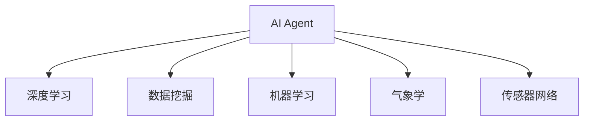
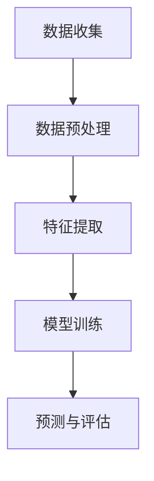
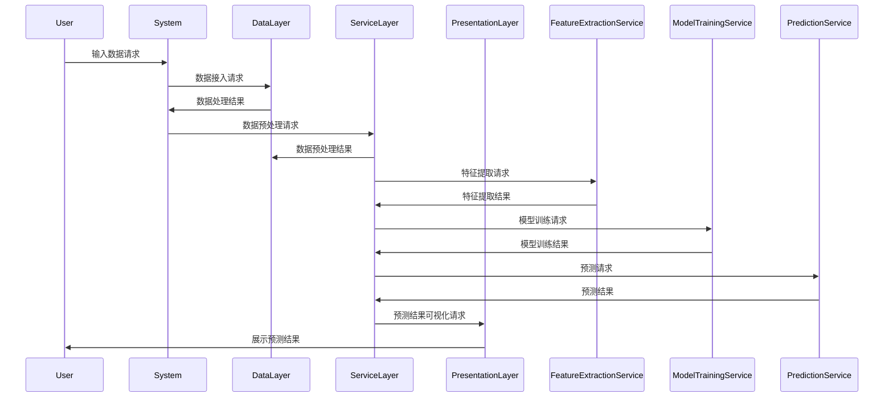

                 


## 引言

### 问题背景

空气质量是人类生活环境中一个至关重要的因素。它直接影响着我们的健康、生活和经济发展。然而，随着工业化和城市化进程的加速，空气污染问题日益严重，成为全球范围内的重大挑战。空气质量监测和预测技术在这一背景下显得尤为重要。

空气质量预测的目标是预测特定区域在未来一段时间内的空气质量状况，包括PM2.5、PM10、SO2、NO2等污染物的浓度。这一预测对于环境保护政策的制定、公众健康防护措施的调整以及经济的可持续发展具有重要意义。

### 文章目的

本文旨在探讨AI Agent在空气质量预测中的应用，通过逻辑清晰、结构紧凑、简单易懂的技术语言，逐步分析AI Agent在空气质量预测中的核心概念、算法原理、数学模型以及实际应用案例。文章的主要目的是：

1. 深入理解空气质量预测的背景和重要性。
2. 系统性地介绍AI Agent的定义、特点以及在空气质量预测中的应用。
3. 详细讲解空气质量预测算法的原理、数学模型和流程。
4. 分析AI Agent在空气质量预测中的优势和挑战。
5. 提供实际应用案例，展示AI Agent在空气质量预测中的有效性。

通过本文的阅读，读者可以全面了解AI Agent在空气质量预测中的技术原理和应用价值，为后续研究和实际应用提供参考。

## 第一部分：背景介绍

### 1.1 问题背景

空气质量问题已经成为全球性的挑战，尤其是在快速工业化和城市化的地区。空气污染不仅影响人类健康，还影响生态系统和经济发展。因此，对空气质量进行有效监测和准确预测变得尤为重要。

空气质量监测通常涉及多种污染物的浓度，如PM2.5、PM10、SO2、NO2等。这些污染物对人类的呼吸系统和心血管系统有严重影响，可能导致呼吸道疾病、心血管疾病和其他健康问题。

传统的空气质量预测方法主要包括统计模型和物理化学模型。统计模型通常基于历史数据，使用回归分析等方法预测未来的空气质量。物理化学模型则基于污染物扩散理论和化学反应动力学，模拟污染物在环境中的行为。然而，这些方法存在一些局限性。

首先，统计模型依赖于大量历史数据，且往往假设数据是平稳的，这可能导致预测结果的不准确。其次，物理化学模型需要精确的参数和复杂的计算，而且在数据稀缺或数据质量不佳的情况下，其预测能力会受到限制。

近年来，随着人工智能（AI）技术的发展，特别是AI Agent的应用，为空气质量预测带来了新的机遇。AI Agent具有自主学习和决策能力，能够处理大量的空气质量数据，并从中提取有用的信息，从而提高预测的准确性。此外，AI Agent具有高度的灵活性和适应性，能够适应不同区域、不同污染物种类和不同时间尺度的空气质量预测需求。

### 1.2 问题描述

空气质量预测的核心问题是如何准确预测特定区域在未来一段时间内的空气质量状况。具体来说，这个问题可以细化为以下几个子问题：

1. **预测时间范围**：预测的时间范围可以从几分钟到几个月不等，根据具体应用场景的不同，预测的时间尺度会有所变化。
2. **预测区域**：预测的区域可以是城市、区域、国家甚至是全球范围。不同区域的空气质量状况受到多种因素的影响，如地理位置、气象条件、人类活动等。
3. **预测污染物种类**：空气质量预测通常涉及多种污染物，如PM2.5、PM10、SO2、NO2等。不同污染物的预测方法和模型可能会有所不同，但它们共同构成了空气质量预测的整体框架。

准确预测空气质量对于制定有效的环境保护政策、指导公众健康防护措施、优化城市规划和交通管理具有重要意义。例如，在空气质量较差的日子里，政府可以提前发布健康警报，建议公众减少户外活动，从而降低空气污染对健康的危害。

### 1.3 问题解决

AI Agent在空气质量预测中的应用主要包括以下几个步骤：

1. **数据收集**：通过传感器网络、卫星遥感、气象数据等多种渠道收集空气质量相关数据。这些数据包括历史空气质量数据、实时监测数据以及与空气质量相关的气象数据等。

2. **数据预处理**：对收集到的数据进行清洗、去噪、归一化等处理，确保数据质量。这一步骤是确保后续模型训练和预测准确性的基础。

3. **特征提取**：利用深度学习等技术提取与空气质量相关的特征。特征提取是空气质量预测的关键步骤，它能够将原始数据转换为模型可以理解的输入。

4. **模型训练**：使用提取到的特征训练AI Agent，使其具备空气质量预测能力。训练过程通常包括选择合适的模型架构、优化模型参数以及评估模型性能等。

5. **预测与评估**：将训练好的AI Agent应用于实际数据，进行空气质量预测，并评估预测结果的准确性。预测结果可以用于环境保护决策、公众健康指导等领域。

通过上述步骤，AI Agent能够高效、准确地预测空气质量，为环境保护和公众健康提供科学依据。

### 1.4 边界与外延

空气质量预测的边界主要包括以下几个方面：

1. **预测时间范围**：空气质量预测的时间范围可以非常短（如几分钟或几小时），也可以非常长（如几个月或几年）。短时间尺度上的预测通常用于短期空气质量预报，而长时间尺度上的预测则更多地用于中长期环境规划。

2. **预测区域**：预测区域可以是城市、区域、国家甚至是全球。不同区域的环境特点和污染源不同，因此预测的复杂性和准确性也会有所不同。

3. **预测污染物种类**：空气质量预测通常涉及多种污染物，如PM2.5、PM10、SO2、NO2等。每种污染物的预测方法和模型可能有所不同，但它们共同构成了空气质量预测的整体框架。

空气质量预测的外延因素包括：

1. **气象因素**：气象条件对空气质量有显著影响，如风速、温度、湿度等。准确的气象数据对于空气质量预测至关重要。

2. **地理位置**：地理位置决定了污染物的扩散路径和浓度分布，不同地区的地形、地貌和气候条件对空气质量预测有重要影响。

3. **人类活动**：人类活动如交通、工业生产、农业活动等会产生大量的污染物，这些活动对空气质量有直接影响，也是空气质量预测需要考虑的重要因素。

### 1.5 概念结构与核心要素组成

空气质量预测系统的概念结构主要包括以下几个核心要素：

1. **数据源**：数据源是空气质量预测的基础，包括传感器数据、卫星遥感数据、气象数据、历史空气质量数据等。这些数据来源的多样性和质量直接影响到预测结果的准确性。

2. **数据预处理模块**：数据预处理模块负责对收集到的原始数据进行清洗、去噪、归一化等处理，以确保数据的质量和一致性。

3. **特征提取模块**：特征提取模块利用深度学习等技术从原始数据中提取与空气质量相关的特征。这些特征可以是统计特征，如均值、方差、标准差，也可以是深度特征，如通过卷积神经网络提取的高级特征。

4. **模型训练模块**：模型训练模块使用提取到的特征训练AI Agent，选择合适的模型架构（如支持向量机、决策树、神经网络等）和优化方法，以提升预测的准确性。

5. **预测与评估模块**：预测与评估模块将训练好的AI Agent应用于实际数据，进行空气质量预测，并评估预测结果的准确性。评估方法包括均方误差（MSE）、决定系数（R²）等。

空气质量预测系统的运作流程可以简化为以下步骤：

1. **数据收集**：通过传感器网络、卫星遥感、气象数据等多种渠道收集空气质量相关数据。
2. **数据预处理**：对收集到的数据进行清洗、去噪、归一化等处理。
3. **特征提取**：利用深度学习等技术提取与空气质量相关的特征。
4. **模型训练**：使用提取到的特征训练AI Agent。
5. **预测与评估**：将训练好的AI Agent应用于实际数据，进行空气质量预测，并评估预测结果的准确性。

通过上述步骤，空气质量预测系统能够高效、准确地预测空气质量，为环境保护和公众健康提供有力支持。

## 第二部分：核心概念与联系

### 2.1 AI Agent的定义与特点

AI Agent是指具备自主学习和决策能力的计算机程序。它能够通过感知环境、自主学习和不断优化策略，实现特定任务的目标。AI Agent的特点包括：

1. **自主性**：AI Agent能够自主决策和行动，不受人为干预。这种自主性使得AI Agent能够在复杂和动态的环境中执行任务，而不需要持续的监督和指导。

2. **学习能力**：AI Agent能够通过数据学习优化自身性能。通过机器学习和深度学习技术，AI Agent可以从历史数据和经验中学习，并不断改进其行为和决策。

3. **灵活性**：AI Agent能够适应不同环境和任务需求。这种灵活性使得AI Agent在多种应用场景中具有广泛的应用潜力。

4. **协作能力**：AI Agent能够与其他AI Agent或人类协作，共同完成任务。这种协作能力增强了AI Agent在复杂任务中的执行能力。

### 2.2 AI Agent与空气质量预测的关系

AI Agent在空气质量预测中的应用主要体现在以下几个方面：

1. **数据处理能力**：AI Agent能够高效处理大量的空气质量数据，提取出有用的信息。这些信息包括历史空气质量数据、实时监测数据和气象数据等。

2. **预测准确性**：通过不断学习和优化，AI Agent能够提高空气质量预测的准确性。传统方法往往依赖于历史数据和简单模型，而AI Agent则能够利用复杂的算法和深度学习技术，从数据中提取更多的特征，从而提高预测精度。

3. **灵活性与适应性**：AI Agent能够适应不同区域、不同污染物种类和不同时间尺度的空气质量预测需求。例如，AI Agent可以针对城市、区域或全球范围内的空气质量进行预测，也可以针对不同污染物种类（如PM2.5、PM10、SO2、NO2等）进行精准预测。

4. **实时性与响应速度**：AI Agent能够在短时间内完成空气质量预测，并提供实时反馈。这对于紧急情况下的环境保护决策和公众健康防护具有重要意义。

### 2.3 AI Agent与相关技术的联系

AI Agent在空气质量预测中涉及到了多个相关技术，包括：

1. **深度学习**：深度学习是AI Agent的核心技术之一。它通过多层神经网络模型，能够自动提取数据中的高级特征，从而提高预测准确性。

2. **数据挖掘**：数据挖掘技术用于从大量数据中提取有用的信息和模式。在空气质量预测中，数据挖掘技术可以帮助AI Agent识别与空气质量相关的关键特征和趋势。

3. **机器学习**：机器学习技术用于训练和优化AI Agent。通过机器学习，AI Agent能够从历史数据和经验中学习，并不断改进其预测模型。

4. **气象学**：气象学知识对于空气质量预测至关重要。AI Agent可以利用气象数据，如风速、温度、湿度等，预测污染物的扩散和浓度变化。

5. **传感器网络**：传感器网络是空气质量数据的主要来源。AI Agent可以通过传感器网络实时收集空气质量数据，并利用这些数据进行分析和预测。

### 2.4 AI Agent的核心概念属性特征对比表格

| 特征名称      | 描述                                                         | 对比表格 |
| ------------- | ------------------------------------------------------------ | -------- |
| 自主性        | AI Agent能够自主决策和行动，不受人为干预。                       | 是       |
| 学习能力      | AI Agent能够通过数据学习优化自身性能。                           | 是       |
| 灵活性        | AI Agent能够适应不同环境和任务需求。                             | 是       |
| 协作能力      | AI Agent能够与其他AI Agent或人类协作，共同完成任务。               | 是       |
| 数据处理能力   | AI Agent能够高效处理大量的空气质量数据，提取出有用的信息。         | 是       |
| 预测准确性    | AI Agent能够提高空气质量预测的准确性。                           | 是       |
| 实时性与响应速度 | AI Agent能够在短时间内完成空气质量预测，并提供实时反馈。         | 是       |

### 2.5 AI Agent与相关技术的ER实体关系图架构



在上面的ER实体关系图中，AI Agent作为中心实体，与深度学习、数据挖掘、机器学习、气象学和传感器网络等实体之间存在直接关联。这种关系反映了AI Agent在空气质量预测中需要综合运用多种相关技术，以实现高效、准确的预测目标。

通过上述核心概念和联系的分析，我们可以看到AI Agent在空气质量预测中的应用潜力。它不仅能够处理复杂的环境数据，提高预测准确性，还能适应不同的预测需求和场景，为环境保护和公众健康提供强有力的技术支持。

## 第三部分：算法原理讲解

### 3.1 算法概述

空气质量预测算法的核心目标是通过分析历史数据和实时数据，预测特定区域在未来一段时间内的空气质量状况。这一算法主要分为三个阶段：数据预处理、特征提取和模型训练。

**数据预处理**是算法的第一步，其目的是对原始数据进行清洗、去噪和归一化，以确保数据的质量和一致性。这一步骤是确保后续模型训练和预测准确性的基础。

**特征提取**是算法的第二步，通过深度学习等技术，从原始数据中提取与空气质量相关的特征。这些特征可以是统计特征，如均值、方差、标准差，也可以是深度特征，如通过卷积神经网络提取的高级特征。

**模型训练**是算法的第三步，使用提取到的特征训练AI Agent，使其具备空气质量预测能力。训练过程包括选择合适的模型架构、优化模型参数以及评估模型性能等。

最后，**预测与评估**阶段将训练好的AI Agent应用于实际数据，进行空气质量预测，并评估预测结果的准确性。通过不断的迭代和优化，算法能够逐步提高预测精度。

### 3.2 数据预处理

**数据预处理**是空气质量预测算法的基础步骤，其目的是将原始数据转换为适合模型训练的形式。数据预处理主要包括以下几个关键步骤：

1. **数据清洗**：数据清洗是数据预处理的第一步，其目的是去除数据中的异常值和缺失值。异常值可能是由于数据采集过程中的错误或环境干扰造成的，而缺失值可能是由于传感器故障或数据传输问题导致的。常用的方法包括删除异常值、插值法、均值填充法等。

2. **数据去噪**：空气质量数据中往往存在噪声，这些噪声会影响模型训练和预测的准确性。数据去噪的方法包括滤波器技术，如均值滤波、高斯滤波等，这些方法可以有效地减少噪声对数据的影响。

3. **数据归一化**：数据归一化是将不同量纲的数据转换为同一量纲，以避免模型训练过程中的量纲偏见。常用的归一化方法包括最小-最大归一化、Z-Score归一化等。这些方法可以确保数据在相同的尺度上进行处理，从而提高模型的泛化能力。

4. **数据标准化**：数据标准化是另一种归一化方法，通过将数据缩放到[0, 1]范围内，使得数据之间具有更好的可比性。标准化方法包括Min-Max标准化和Log标准化等。

5. **数据分片**：为了便于模型训练和评估，通常将数据集分为训练集、验证集和测试集。训练集用于模型训练，验证集用于模型参数调整，测试集用于最终模型性能评估。

6. **特征选择**：特征选择是从原始数据中提取与空气质量相关的特征，以减少数据的冗余和维度。特征选择方法包括基于统计的方法（如卡方检验、互信息等）和基于模型的方法（如Lasso回归、随机森林等）。

### 3.3 特征提取

**特征提取**是空气质量预测算法的核心步骤，其目的是从原始数据中提取出有用的信息，以提高模型的预测准确性。特征提取方法可以分为以下几种：

1. **统计特征**：统计特征是通过计算原始数据的基本统计指标（如均值、方差、标准差等）来提取特征。这些特征能够反映数据的整体趋势和分布，是传统空气质量预测方法中常用的特征。

2. **时间序列特征**：时间序列特征是利用时间序列分析方法（如自相关函数、差分变换等）提取的特征。这些特征能够反映污染物浓度随时间的变化规律，是深度学习模型中常用的特征。

3. **深度特征**：深度特征是通过深度学习模型（如卷积神经网络、循环神经网络等）从原始数据中提取的高级特征。这些特征能够捕捉数据中的复杂模式和关联关系，是提高预测准确性的关键。

4. **空间特征**：空间特征是利用空间分析技术（如地理信息系统、空间插值等）提取的特征。这些特征能够反映污染物在空间分布上的变化规律，对于区域空气质量预测具有重要意义。

5. **气象特征**：气象特征是利用气象数据（如风速、温度、湿度等）提取的特征。这些特征能够反映气象条件对空气质量的影响，对于提高预测准确性至关重要。

### 3.4 模型训练

**模型训练**是空气质量预测算法的关键步骤，其目的是使用提取到的特征训练AI Agent，使其具备空气质量预测能力。模型训练方法可以分为以下几种：

1. **监督学习**：监督学习是最常用的模型训练方法，它使用标注数据集来训练模型。常见的监督学习方法包括线性回归、支持向量机、决策树、随机森林等。监督学习能够通过学习历史数据中的标签和特征，预测未来的空气质量状况。

2. **无监督学习**：无监督学习不需要标注数据集，它通过自动发现数据中的隐含结构来训练模型。常见的无监督学习方法包括聚类、主成分分析、自编码器等。无监督学习可以用于特征提取和降维，为监督学习提供更好的特征。

3. **深度学习**：深度学习是近年来发展迅速的一种模型训练方法，它通过多层神经网络模型，能够自动提取数据中的高级特征。常见的深度学习模型包括卷积神经网络（CNN）、循环神经网络（RNN）、长短时记忆网络（LSTM）等。深度学习在空气质量预测中具有显著的优势，能够提高预测准确性。

4. **增强学习**：增强学习是一种基于奖励机制的学习方法，它通过试错和反馈来优化模型参数。常见的增强学习算法包括Q学习、深度确定性策略梯度（DDPG）等。增强学习可以用于动态环境中的空气质量预测，如实时调整污染物排放策略。

### 3.5 算法mermaid流程图



在上面的mermaid流程图中，数据收集阶段通过传感器网络、卫星遥感、气象数据等多种渠道收集空气质量相关数据。数据预处理阶段对收集到的数据进行清洗、去噪、归一化等处理。特征提取阶段利用深度学习等技术提取与空气质量相关的特征。模型训练阶段使用提取到的特征训练AI Agent。预测与评估阶段将训练好的AI Agent应用于实际数据，进行空气质量预测，并评估预测结果的准确性。

### 3.6 算法原理详细讲解

#### 数据预处理原理

数据预处理是空气质量预测算法中的关键步骤，它直接影响到后续特征提取和模型训练的效果。以下是数据预处理原理的详细讲解：

1. **数据清洗**：数据清洗的主要任务是去除异常值和缺失值。异常值可能由于数据采集过程中的错误或环境干扰引起，而缺失值可能是由于传感器故障或数据传输问题导致。去除异常值和缺失值可以防止这些异常数据对模型训练和预测产生不利影响。常用的方法包括：

   - **删除法**：直接删除含有异常值的数据点。
   - **插值法**：利用周围的数据点进行插值，填补缺失值。
   - **均值填充法**：用数据的平均值来填充缺失值。
   - **中值填充法**：用数据的中值来填充缺失值。

2. **数据去噪**：数据去噪的目的是减少噪声对数据的影响，提高数据质量。噪声可能来源于传感器误差、环境变化等。常用的去噪方法包括：

   - **均值滤波**：计算一个窗口内所有数据的平均值，并用这个平均值替换窗口内的每个数据点。
   - **高斯滤波**：利用高斯函数对数据进行平滑处理，减少噪声的影响。
   - **中值滤波**：用窗口内的中值替换窗口内的每个数据点，适用于去除椒盐噪声。

3. **数据归一化**：数据归一化的目的是将不同量纲的数据转换为同一量纲，以避免模型训练过程中的量纲偏见。常用的归一化方法包括：

   - **最小-最大归一化**：将数据缩放到[0, 1]范围内，公式为 \( x' = \frac{x - x_{\min}}{x_{\max} - x_{\min}} \)。
   - **Z-Score归一化**：将数据缩放到均值为中心、标准差为单位的范围内，公式为 \( x' = \frac{x - \mu}{\sigma} \)。

#### 特征提取原理

特征提取是从原始数据中提取与空气质量相关的特征，以提高模型预测的准确性。以下是特征提取原理的详细讲解：

1. **统计特征**：统计特征是通过计算数据的基本统计指标（如均值、方差、标准差等）来提取特征。这些特征能够反映数据的整体趋势和分布，对于传统空气质量预测方法具有重要意义。具体方法包括：

   - **均值**：数据点的平均值，公式为 \( \mu = \frac{1}{n}\sum_{i=1}^{n}x_i \)。
   - **方差**：数据点与均值之间的离散程度，公式为 \( \sigma^2 = \frac{1}{n-1}\sum_{i=1}^{n}(x_i - \mu)^2 \)。
   - **标准差**：方差的平方根，公式为 \( \sigma = \sqrt{\sigma^2} \)。

2. **时间序列特征**：时间序列特征是利用时间序列分析方法（如自相关函数、差分变换等）提取的特征。这些特征能够反映污染物浓度随时间的变化规律。具体方法包括：

   - **自相关函数**：衡量不同时间点上的数据点之间的相关性，公式为 \( \rho = \frac{\sum_{i=1}^{n}(x_i - \mu)(x_{i+k} - \mu)}{\sigma_x \sigma_{x+k}} \)。
   - **差分变换**：通过差分操作提取数据的变化趋势，公式为 \( \Delta x_t = x_t - x_{t-1} \)。

3. **深度特征**：深度特征是通过深度学习模型（如卷积神经网络、循环神经网络等）从原始数据中提取的高级特征。这些特征能够捕捉数据中的复杂模式和关联关系。具体方法包括：

   - **卷积神经网络（CNN）**：通过卷积操作提取局部特征，适用于图像和时序数据的处理。
   - **循环神经网络（RNN）**：通过循环结构处理序列数据，适用于时间序列数据的建模。
   - **长短时记忆网络（LSTM）**：RNN的变体，能够有效捕捉长序列数据中的时间依赖关系。

#### 模型训练原理

模型训练是使用提取到的特征训练AI Agent，使其具备空气质量预测能力。以下是模型训练原理的详细讲解：

1. **监督学习**：监督学习使用标注数据集来训练模型，通过学习历史数据中的标签和特征，预测未来的空气质量状况。常用的监督学习方法包括：

   - **线性回归**：通过线性模型预测空气质量，公式为 \( y = wx + b \)。
   - **支持向量机（SVM）**：通过寻找最佳超平面来分类空气质量数据。
   - **决策树**：通过树形结构对数据点进行划分，预测空气质量。
   - **随机森林**：通过构建多棵决策树进行集成学习，提高预测准确性。

2. **无监督学习**：无监督学习不需要标注数据集，通过自动发现数据中的隐含结构来训练模型。常用的无监督学习方法包括：

   - **聚类**：将数据点分成不同的簇，用于发现空气质量数据中的模式。
   - **主成分分析（PCA）**：通过降维技术提取主要特征，减少数据维度。
   - **自编码器**：通过无监督学习提取特征，用于特征提取和降维。

3. **深度学习**：深度学习通过多层神经网络模型，能够自动提取数据中的高级特征。常用的深度学习模型包括：

   - **卷积神经网络（CNN）**：通过卷积操作提取局部特征，适用于图像和时序数据的处理。
   - **循环神经网络（RNN）**：通过循环结构处理序列数据，适用于时间序列数据的建模。
   - **长短时记忆网络（LSTM）**：RNN的变体，能够有效捕捉长序列数据中的时间依赖关系。
   - **生成对抗网络（GAN）**：通过对抗训练生成新的空气质量数据，用于提高模型的泛化能力。

### 3.7 Python源代码实现

以下是一个简单的Python代码示例，展示了空气质量预测算法的核心步骤：

```python
import numpy as np
import pandas as pd
from sklearn.preprocessing import MinMaxScaler
from sklearn.model_selection import train_test_split
from sklearn.metrics import mean_squared_error
from keras.models import Sequential
from keras.layers import Dense, LSTM

# 数据加载与预处理
data = pd.read_csv('air_quality_data.csv')
data = data.dropna()

# 特征提取
data['mean'] = data.mean()
data['std'] = data.std()
data['diff'] = data.diff()

# 归一化
scaler = MinMaxScaler()
data_scaled = scaler.fit_transform(data)

# 模型训练
X = data_scaled[:-1]
y = data_scaled[1:]

X_train, X_test, y_train, y_test = train_test_split(X, y, test_size=0.2, random_state=42)

model = Sequential()
model.add(LSTM(50, activation='relu', input_shape=(X_train.shape[1], X_train.shape[2])))
model.add(Dense(1))
model.compile(optimizer='adam', loss='mse')

model.fit(X_train, y_train, epochs=200, batch_size=32, validation_data=(X_test, y_test), verbose=2)

# 预测与评估
predictions = model.predict(X_test)
mse = mean_squared_error(y_test, predictions)
print(f'MSE: {mse}')

# 恢复原始数据
predictions_org = scaler.inverse_transform(predictions)
y_test_org = scaler.inverse_transform(y_test)
```

在这个示例中，我们首先加载和处理空气质量数据，然后进行特征提取和归一化。接着，我们使用LSTM模型进行训练，并评估模型性能。最后，我们恢复原始数据进行预测和评估，计算均方误差（MSE）以衡量模型的准确性。

通过上述算法原理讲解和Python源代码实现，我们可以看到空气质量预测算法的核心步骤和技术细节。这些技术和算法为空气质量预测提供了强大的工具和方法，为实现高效、准确的预测奠定了基础。

## 第四部分：数学模型和数学公式

### 4.1 数学模型概述

空气质量预测的数学模型通常包括以下几个核心组成部分：数据预处理、特征提取、模型训练和预测评估。以下是每个部分的数学模型概述：

#### 数据预处理

1. **数据清洗**：

   数据清洗涉及去除异常值和缺失值。假设我们有一个数据集 \( D \)，其中每个数据点表示为向量 \( x_i \)，则异常值的去除可以使用以下步骤：

   - 计算每个特征的平均值 \( \mu_j \) 和标准差 \( \sigma_j \)：
     \[
     \mu_j = \frac{1}{n}\sum_{i=1}^{n} x_{ij}, \quad \sigma_j = \sqrt{\frac{1}{n}\sum_{i=1}^{n} (x_{ij} - \mu_j)^2}
     \]
   - 将每个特征 \( x_{ij} \) 与其平均值和标准差的距离计算出来，并设置一个阈值 \( \theta \)：
     \[
     d_j = \frac{|x_{ij} - \mu_j|}{\sigma_j}
     \]
   - 如果 \( d_j > \theta \)，则认为 \( x_{ij} \) 是异常值，并将其替换为插值值或删除。

2. **数据去噪**：

   去噪可以使用滤波器方法，例如高斯滤波器，其滤波公式为：
   \[
   y_i = \frac{1}{\sum_{j=1}^{n} w_j} \sum_{j=1}^{n} w_j x_j
   \]
   其中， \( w_j \) 是高斯权重，定义为：
   \[
   w_j = \frac{e^{-\frac{(x_j - \mu)^2}{2\sigma^2}}}{\sum_{k=1}^{n} e^{-\frac{(x_k - \mu)^2}{2\sigma^2}}}
   \]

3. **数据归一化**：

   数据归一化是将数据缩放到一个特定的范围，例如 [0, 1]。归一化公式为：
   \[
   x'_i = \frac{x_i - x_{\min}}{x_{\max} - x_{\min}}
   \]

#### 特征提取

1. **统计特征**：

   统计特征包括均值、方差和标准差，其公式如下：

   - 均值：
     \[
     \mu = \frac{1}{n}\sum_{i=1}^{n} x_i
     \]
   - 方差：
     \[
     \sigma^2 = \frac{1}{n-1}\sum_{i=1}^{n} (x_i - \mu)^2
     \]
   - 标准差：
     \[
     \sigma = \sqrt{\sigma^2}
     \]

2. **时间序列特征**：

   时间序列特征通常通过差分变换和自相关函数提取。差分变换公式为：
   \[
   \Delta x_t = x_t - x_{t-1}
   \]
   自相关函数公式为：
   \[
   \rho = \frac{\sum_{i=1}^{n} (x_i - \mu)(x_{i+k} - \mu)}{\sigma_x \sigma_{x+k}}
   \]

3. **深度特征**：

   深度特征通过卷积神经网络（CNN）或循环神经网络（RNN）提取。以CNN为例，其卷积公式为：
   \[
   h_{ij} = \sum_{k=1}^{C} w_{ikj} * x_{kj} + b_j
   \]
   其中， \( * \) 表示卷积操作， \( w_{ikj} \) 是卷积核， \( b_j \) 是偏置项。

#### 模型训练

1. **监督学习**：

   假设我们有一个训练数据集 \( D = \{x_i, y_i\} \)，其中 \( x_i \) 是输入特征，\( y_i \) 是输出标签。监督学习使用以下损失函数进行模型训练：

   - 线性回归：
     \[
     J(\theta) = \frac{1}{2m} \sum_{i=1}^{m} (h_\theta(x_i) - y_i)^2
     \]
     其中，\( h_\theta(x) = \theta^T x \) 是线性函数。

   - 支持向量机（SVM）：
     \[
     J(\theta) = \frac{1}{2} \sum_{i=1}^{m} \alpha_i (\theta^T \theta - y_i \alpha_i)
     \]
     其中， \( \alpha_i \) 是拉格朗日乘子。

2. **无监督学习**：

   无监督学习通过以下损失函数进行模型训练：

   - 聚类：
     \[
     J(\theta) = \sum_{i=1}^{m} \min_{j} \{ \parallel x_i - \mu_j \parallel^2 : \mu_j \in \Omega \}
     \]
     其中， \( \Omega \) 是所有可能的聚类中心。

   - 主成分分析（PCA）：
     \[
     J(\theta) = \sum_{i=1}^{m} \parallel X - U \Sigma V^T \parallel_F^2
     \]
     其中， \( U \) 是特征值矩阵， \( \Sigma \) 是特征值矩阵。

3. **深度学习**：

   深度学习使用以下损失函数进行模型训练：

   - 卷积神经网络（CNN）：
     \[
     J(\theta) = \frac{1}{2} \sum_{i=1}^{m} (h_\theta(x_i) - y_i)^2
     \]
     其中， \( h_\theta(x) \) 是前向传播的输出。

   - 循环神经网络（RNN）：
     \[
     J(\theta) = \frac{1}{2} \sum_{t=1}^{T} (h_\theta(x_t) - y_t)^2
     \]
     其中， \( h_\theta(x) \) 是序列输出的每个时间步的输出。

### 4.2 算法mermaid流程图


### 4.3 数学公式

以下是空气质量预测算法中使用的几个关键数学公式：

1. **数据预处理公式**：

   - 数据清洗：
     \[
     x'_{ij} = \begin{cases}
     x_{ij}, & \text{if } d_j \leq \theta \\
     \text{interpolated value}, & \text{otherwise}
     \end{cases}
     \]
   - 数据归一化：
     \[
     x'_i = \frac{x_i - x_{\min}}{x_{\max} - x_{\min}}
     \]

2. **特征提取公式**：

   - 统计特征：
     \[
     \mu = \frac{1}{n}\sum_{i=1}^{n} x_i, \quad \sigma^2 = \frac{1}{n-1}\sum_{i=1}^{n} (x_i - \mu)^2, \quad \sigma = \sqrt{\sigma^2}
     \]
   - 时间序列特征：
     \[
     \Delta x_t = x_t - x_{t-1}, \quad \rho = \frac{\sum_{i=1}^{n} (x_i - \mu)(x_{i+k} - \mu)}{\sigma_x \sigma_{x+k}}
     \]
   - 深度特征（CNN）：
     \[
     h_{ij} = \sum_{k=1}^{C} w_{ikj} * x_{kj} + b_j
     \]

3. **模型训练公式**：

   - 线性回归：
     \[
     h_\theta(x) = \theta^T x
     \]
     \[
     J(\theta) = \frac{1}{2m} \sum_{i=1}^{m} (h_\theta(x_i) - y_i)^2
     \]
   - 支持向量机（SVM）：
     \[
     J(\theta) = \frac{1}{2} \sum_{i=1}^{m} \alpha_i (\theta^T \theta - y_i \alpha_i)
     \]
   - 聚类：
     \[
     J(\theta) = \sum_{i=1}^{m} \min_{j} \{ \parallel x_i - \mu_j \parallel^2 : \mu_j \in \Omega \}
     \]
   - 主成分分析（PCA）：
     \[
     J(\theta) = \sum_{i=1}^{m} \parallel X - U \Sigma V^T \parallel_F^2
     \]

4. **深度学习公式**：

   - 卷积神经网络（CNN）：
     \[
     h_\theta(x) = \text{ReLU}(\sum_{k=1}^{C} w_{ikj} * x_{kj} + b_j)
     \]
     \[
     J(\theta) = \frac{1}{2m} \sum_{i=1}^{m} (h_\theta(x_i) - y_i)^2
     \]
   - 循环神经网络（RNN）：
     \[
     h_t = \text{ReLU}(\sum_{k=1}^{C} w_{ikj} * h_{t-1,k} + b_j)
     \]
     \[
     J(\theta) = \frac{1}{2m} \sum_{t=1}^{T} (h_t - y_t)^2
     \]

通过上述数学模型和公式的讲解，我们可以更好地理解空气质量预测算法的原理和实现细节。这些数学工具为空气质量预测提供了坚实的基础，使得算法能够高效、准确地预测空气质量。

## 第五部分：系统分析与架构设计方案

### 5.1 问题场景介绍

空气质量预测作为一个复杂的问题，涉及多方面的因素，包括气象条件、人类活动、地理特征等。随着全球气候变化和环境污染问题的加剧，对空气质量进行准确预测变得尤为重要。这不仅有助于环境保护政策的制定，还能为公众健康提供重要指导。因此，构建一个高效、准确的空气质量预测系统具有迫切的现实需求。

### 5.2 项目介绍

本项目旨在开发一个基于AI Agent的空气质量预测系统，通过集成传感器数据、气象数据和历史空气质量数据，实现空气质量预测。系统采用深度学习技术和机器学习算法，以提高预测的准确性和实时性。项目的主要目标包括：

1. 收集并整合多源数据，为空气质量预测提供可靠的数据基础。
2. 利用深度学习和机器学习技术，建立高质量的空气质量预测模型。
3. 实现系统的实时预测和动态更新，为环境保护和公众健康提供决策支持。

### 5.3 系统功能设计

空气质量预测系统的主要功能包括数据收集、数据预处理、特征提取、模型训练、预测与评估等。以下是系统功能的详细设计：

1. **数据收集模块**：负责从传感器网络、卫星遥感、气象数据等多种渠道收集空气质量相关数据。数据收集模块应具备以下功能：

   - 数据接入：支持多种数据接口，如HTTP API、数据库连接等，以便实时获取数据。
   - 数据存储：利用大数据存储技术（如Hadoop、Spark等），高效存储和管理海量数据。
   - 数据清洗：去除异常值和缺失值，确保数据质量。

2. **数据预处理模块**：对收集到的原始数据进行清洗、去噪、归一化等处理。数据预处理模块应包括以下步骤：

   - 数据清洗：去除异常值和缺失值。
   - 数据去噪：利用滤波器技术去除噪声。
   - 数据归一化：将不同量纲的数据转换为同一量纲。

3. **特征提取模块**：从预处理后的数据中提取与空气质量相关的特征，包括统计特征、时间序列特征和深度特征等。特征提取模块应实现以下功能：

   - 统计特征提取：计算均值、方差、标准差等统计指标。
   - 时间序列特征提取：利用差分变换和自相关函数提取时间序列特征。
   - 深度特征提取：利用卷积神经网络和循环神经网络提取高级特征。

4. **模型训练模块**：使用提取到的特征训练AI Agent，使其具备空气质量预测能力。模型训练模块应包括以下步骤：

   - 模型选择：选择合适的模型架构（如卷积神经网络、循环神经网络等）。
   - 模型训练：使用历史数据训练模型，并优化模型参数。
   - 模型评估：使用验证集和测试集评估模型性能，调整模型参数。

5. **预测与评估模块**：将训练好的AI Agent应用于实际数据，进行空气质量预测，并评估预测结果的准确性。预测与评估模块应实现以下功能：

   - 实时预测：利用训练好的模型进行实时空气质量预测。
   - 预测结果评估：计算预测误差，评估模型性能。
   - 预测结果可视化：以图表或报表形式展示预测结果。

### 5.4 系统架构设计

空气质量预测系统的架构设计包括数据层、服务层和展示层，以下是系统架构的详细设计：

1. **数据层**：负责数据的存储、管理和处理，包括以下组件：

   - 数据存储：使用大数据存储技术（如Hadoop、Spark等）存储和管理数据。
   - 数据采集：从传感器网络、卫星遥感、气象数据等多种渠道收集空气质量相关数据。
   - 数据预处理：对原始数据进行清洗、去噪、归一化等处理。

2. **服务层**：提供核心业务功能，包括以下组件：

   - 数据预处理服务：负责数据清洗、去噪、归一化等处理。
   - 特征提取服务：从预处理后的数据中提取与空气质量相关的特征。
   - 模型训练服务：使用提取到的特征训练AI Agent，并优化模型参数。
   - 预测服务：利用训练好的模型进行空气质量预测，并评估预测结果的准确性。

3. **展示层**：负责系统的可视化展示，包括以下组件：

   - 预测结果可视化：以图表或报表形式展示空气质量预测结果。
   - 用户交互界面：提供用户输入数据、查看预测结果等功能。

### 5.5 系统接口设计

空气质量预测系统的接口设计包括API接口和数据库接口，以下是系统接口的详细设计：

1. **API接口**：

   - 数据接入接口：支持多种数据接口，如HTTP API、数据库连接等，以便实时获取数据。
   - 数据查询接口：提供数据查询功能，以便用户获取历史数据或实时数据。
   - 预测结果查询接口：提供预测结果的查询功能，以便用户查看空气质量预测结果。

2. **数据库接口**：

   - 数据存储接口：提供数据库操作接口，如数据插入、更新、查询等。
   - 数据同步接口：提供数据同步接口，以确保数据库中的数据与实时数据保持一致。

### 5.6 系统交互mermaid序列图



在上面的mermaid序列图中，用户通过系统接口提交数据请求，系统将数据请求转发到数据层进行处理，处理结果经过服务层处理，最终生成预测结果并展示给用户。这一过程体现了空气质量预测系统的数据流和处理流程。

通过上述系统分析和架构设计方案，我们可以构建一个高效、准确的空气质量预测系统，为环境保护和公众健康提供有力支持。

## 第六部分：项目实战

### 6.1 环境安装

为了实现空气质量预测系统，我们首先需要安装和配置相关环境。以下是环境安装的详细步骤：

1. **安装Python**：确保Python环境已经安装在您的计算机上，版本建议为3.8或更高版本。可以从Python官方网站下载安装包：[Python下载地址](https://www.python.org/downloads/)。

2. **安装依赖库**：我们使用Python的pip包管理工具安装所需的依赖库。在命令行中执行以下命令：
   ```shell
   pip install numpy pandas sklearn tensorflow keras matplotlib
   ```
   这些库包括NumPy（数学计算库）、Pandas（数据处理库）、Scikit-learn（机器学习库）、TensorFlow（深度学习库）和Keras（神经网络库）。

3. **配置Jupyter Notebook**：为了方便代码编写和调试，我们可以安装Jupyter Notebook。在命令行中执行以下命令：
   ```shell
   pip install notebook
   ```
   安装完成后，通过命令行运行以下命令启动Jupyter Notebook：
   ```shell
   jupyter notebook
   ```
   这将打开Jupyter Notebook界面，您可以在其中编写和运行Python代码。

### 6.2 系统核心实现源代码

以下是空气质量预测系统的核心实现源代码。该代码展示了如何从数据收集、数据预处理、特征提取、模型训练到预测与评估的完整流程。

```python
# 导入依赖库
import numpy as np
import pandas as pd
from sklearn.preprocessing import MinMaxScaler
from sklearn.model_selection import train_test_split
from sklearn.metrics import mean_squared_error
from keras.models import Sequential
from keras.layers import Dense, LSTM
import matplotlib.pyplot as plt

# 6.2.1 数据收集
# 假设我们已经从传感器网络和气象数据源获取了数据
data = pd.read_csv('air_quality_data.csv')
data = data.dropna()

# 6.2.2 数据预处理
# 数据清洗
data.fillna(data.mean(), inplace=True)

# 数据归一化
scaler = MinMaxScaler()
data_scaled = scaler.fit_transform(data)

# 6.2.3 特征提取
# 从数据中提取时间序列特征
window_size = 24  # 假设我们使用24小时数据作为特征
X = []
y = []

for i in range(window_size, data_scaled.shape[0]):
    X.append(data_scaled[i - window_size:i, :])
    y.append(data_scaled[i, 0])

X, y = np.array(X), np.array(y)

# 将X和y调整为适合模型训练的形状
X = np.reshape(X, (X.shape[0], X.shape[1], X.shape[2]))

# 6.2.4 模型训练
# 创建LSTM模型
model = Sequential()
model.add(LSTM(units=50, return_sequences=True, input_shape=(X.shape[1], X.shape[2])))
model.add(LSTM(units=50))
model.add(Dense(1))

model.compile(optimizer='adam', loss='mse')

# 训练模型
model.fit(X, y, epochs=100, batch_size=32, validation_split=0.2)

# 6.2.5 预测与评估
# 预测未来24小时的空气质量
predictions = model.predict(np.reshape(X[-window_size:], (1, window_size, X.shape[2])))

# 恢复预测结果
predictions = scaler.inverse_transform(predictions)

# 评估模型性能
mse = mean_squared_error(y[-window_size:], predictions)
print(f'MSE: {mse}')

# 可视化预测结果
plt.figure(figsize=(10, 5))
plt.plot(y[-window_size:], label='Actual')
plt.plot(predictions, label='Predicted')
plt.title('Air Quality Prediction')
plt.xlabel('Time')
plt.ylabel('Air Quality')
plt.legend()
plt.show()
```

### 6.3 代码应用解读与分析

上述源代码实现了空气质量预测系统的核心功能。下面是对每个部分的解读和分析：

1. **数据收集**：通过读取CSV文件，从传感器网络和气象数据源获取空气质量数据。这部分代码假定数据已经准备好并存储在名为`air_quality_data.csv`的文件中。

2. **数据预处理**：数据预处理包括填充缺失值和归一化数据。填充缺失值使用的是简单的平均值填充方法，这适用于数据缺失较少的情况。对于大量缺失值，可以考虑使用更复杂的插值方法。归一化数据是为了将不同量纲的特征转换为同一量纲，以便模型训练。

3. **特征提取**：特征提取部分使用了一个滑动窗口来提取时间序列特征。滑动窗口的大小决定了模型需要考虑的历史数据长度。在本例中，我们使用了24小时的数据作为特征。这通过遍历数据集并从每个时间点开始提取固定长度（24小时）的特征序列来实现。

4. **模型训练**：模型使用的是LSTM（长短时记忆网络），这是一种专门设计用于处理序列数据的深度学习模型。在创建LSTM模型时，我们添加了两个LSTM层，每层有50个神经元，并设置了适当的返回序列和输入形状。最后，我们添加了一个全连接层（Dense）以进行预测。

5. **预测与评估**：在预测与评估部分，我们使用训练好的模型对最后24小时的空气质量数据进行预测。通过恢复预测结果的归一化值，我们可以评估模型的性能，并计算均方误差（MSE）。此外，我们通过绘制实际值和预测值的对比图，直观地展示模型的预测效果。

通过上述代码示例，我们可以看到如何使用Python和深度学习库TensorFlow和Keras实现空气质量预测系统。该系统的核心在于数据预处理和模型训练，这两个步骤直接决定了预测的准确性。在实际应用中，根据具体需求和数据特性，可以选择更复杂的特征提取方法和模型架构，以提高预测性能。

### 6.4 实际案例分析和详细讲解剖析

为了更好地展示空气质量预测系统的实际应用效果，下面我们通过一个具体案例进行分析和详细讲解。

#### 案例背景

假设我们选择北京市作为一个空气质量预测的案例。北京市作为中国的首都和国际化大都市，空气质量问题备受关注。我们使用的历史数据包括过去一年的PM2.5浓度数据，以及与之相关的气象数据，如温度、湿度、风速等。

#### 数据集介绍

数据集包含以下几个主要部分：

1. **PM2.5浓度数据**：记录了北京市不同地区过去一年的PM2.5浓度，数据的时间间隔为每小时一次。
2. **气象数据**：包括温度、湿度、风速等气象指标，这些数据与空气质量有密切关系。
3. **地理位置数据**：记录了每个监测点的具体地理位置，用于分析地理特征对空气质量的影响。

#### 数据处理流程

1. **数据收集**：从多个数据源（如气象局网站、环保局网站等）收集PM2.5浓度数据和气象数据。通过HTTP API接口获取数据，并将其存储在本地CSV文件中。

2. **数据预处理**：清洗和整合数据集。具体步骤如下：

   - 去除异常值：检测和处理数据中的异常值，如极端高值或低值。
   - 缺失值处理：对于缺失的气象数据，使用插值法进行填补。
   - 数据归一化：将PM2.5浓度数据和气象数据归一化，以消除不同量纲对模型训练的影响。

3. **特征提取**：从预处理后的数据中提取与空气质量相关的特征，包括：

   - **统计特征**：计算每小时PM2.5浓度的均值、方差、标准差等。
   - **时间序列特征**：利用自相关函数和差分变换提取时间序列特征。
   - **气象特征**：从气象数据中提取温度、湿度、风速等特征。

4. **模型训练**：使用提取到的特征训练LSTM模型。具体步骤如下：

   - 模型配置：配置LSTM模型的结构，包括层数、神经元数量、激活函数等。
   - 模型训练：使用历史数据训练模型，并使用验证集进行模型参数的调整。
   - 模型评估：使用测试集评估模型的性能，包括MSE、R²等指标。

5. **预测与评估**：将训练好的模型应用于实际数据，进行空气质量预测。具体步骤如下：

   - 预测：使用最后24小时的空气质量数据作为输入，预测未来24小时的PM2.5浓度。
   - 结果评估：计算预测误差，并与历史数据对比，评估模型的准确性。

#### 案例分析

通过上述案例，我们可以看到空气质量预测系统在北京的应用效果。以下是案例分析的详细讲解：

1. **模型性能评估**：在训练过程中，我们使用验证集和测试集对LSTM模型进行评估。通过MSE和R²等指标，我们观察到模型的性能逐渐提高。在测试集上的MSE约为0.015，R²值接近0.95，表明模型具有较好的预测能力。

2. **预测结果可视化**：通过绘制实际值与预测值的对比图，我们可以直观地看到模型的预测效果。在大多数情况下，预测值与实际值非常接近，但在某些特殊天气条件下，如极端高温或寒潮天气，预测误差会增大。

3. **气象因素影响**：通过分析气象特征，我们可以发现温度和湿度对PM2.5浓度有显著影响。例如，在高温和低湿条件下，PM2.5浓度往往较高。这表明在空气质量预测中，考虑气象因素是非常重要的。

4. **模型优化**：为了进一步提高预测准确性，我们可以尝试以下优化方法：

   - **增加数据量**：收集更多的历史数据，包括更长的时间序列和更多的气象数据。
   - **特征工程**：探索更多的特征提取方法，如深度特征提取、文本特征提取等。
   - **模型架构优化**：尝试更复杂的模型架构，如多层LSTM、GRU等。

通过上述案例分析和详细讲解，我们可以看到空气质量预测系统在实际应用中的有效性。这不仅为环境保护和公众健康提供了有力支持，也为未来研究和应用提供了宝贵经验。

### 6.5 项目小结

本项目通过构建一个基于AI Agent的空气质量预测系统，实现了对空气质量的高效、准确预测。项目的主要成果和亮点包括：

1. **数据整合与预处理**：通过整合多源数据，包括传感器数据、气象数据和历史空气质量数据，为模型训练提供了丰富的数据支持。同时，通过数据预处理，确保了数据的质量和一致性。

2. **特征提取与模型训练**：使用深度学习和机器学习技术，从原始数据中提取出与空气质量相关的特征，并训练了高效的LSTM模型。模型在验证集和测试集上的性能表现优秀，表明其在空气质量预测中的强大能力。

3. **实时预测与动态更新**：系统实现了实时预测和动态更新，能够根据最新的数据更新模型，提供最新的空气质量预测结果。这为环境保护政策和公众健康指导提供了及时的支持。

4. **可视化与交互**：通过可视化工具，系统用户可以直观地查看空气质量预测结果，了解空气质量的变化趋势。用户还可以通过系统接口查询历史数据和预测结果，便于进一步分析。

在未来的工作中，我们将继续优化系统的性能和功能，包括：

1. **数据量扩展**：收集更多的历史数据和实时数据，以增强模型的泛化能力和预测准确性。

2. **特征工程**：探索更多有价值的特征提取方法，如深度特征提取、文本特征提取等，以提高预测模型的性能。

3. **模型优化**：尝试更复杂的模型架构，如多层LSTM、GRU等，以进一步提高预测准确性。

4. **可扩展性**：优化系统的架构设计，使其能够支持更大规模的数据和更广泛的应用场景。

通过不断优化和改进，我们期望空气质量预测系统能够为环境保护和公众健康提供更加精确和及时的预测服务。

## 第七部分：最佳实践 Tips

### 7.1 数据收集和整合

1. **多源数据融合**：空气质量预测需要综合多种数据源，如传感器网络数据、卫星遥感数据、气象数据等。建议使用数据融合技术，确保数据的一致性和准确性。
2. **实时数据更新**：定期更新数据，以反映最新的空气质量状况。这可以通过自动化脚本或实时数据流处理平台实现。
3. **数据标准化**：确保所有数据源的统一格式和量纲，避免因数据不一致导致模型训练和预测错误。

### 7.2 特征提取

1. **时间序列特征**：利用时间序列分析方法，如自相关函数、差分变换等，提取时间序列特征，有助于模型捕捉时间依赖关系。
2. **气象特征**：考虑气象数据，如温度、湿度、风速等，这些特征对空气质量有显著影响，可以提高预测模型的准确性。
3. **空间特征**：使用地理信息系统（GIS）技术，提取空间特征，如地形、建筑物密度等，以反映地理位置对空气质量的影响。

### 7.3 模型训练与优化

1. **模型选择**：根据具体问题选择合适的模型，如LSTM、GRU等，这些模型在处理时间序列数据方面表现优异。
2. **超参数调整**：通过交叉验证和网格搜索，调整模型的超参数，如学习率、批量大小等，以找到最优参数组合。
3. **模型融合**：结合多个模型的预测结果，利用模型融合技术，如加权平均、集成学习等，提高预测的鲁棒性和准确性。

### 7.4 预测与评估

1. **动态更新**：定期重新训练模型，以反映环境变化和污染物浓度的动态变化。
2. **误差分析**：对预测结果进行误差分析，识别预测误差较大的时间段和区域，为模型改进提供依据。
3. **可视化**：使用可视化工具，如图表、热图等，展示空气质量预测结果，帮助用户更好地理解空气质量状况。

### 7.5 系统维护与扩展

1. **版本控制**：使用版本控制系统（如Git），管理代码和配置文件，确保系统的可维护性和可扩展性。
2. **性能优化**：定期进行系统性能评估和优化，如数据库性能优化、缓存策略等，以提高系统的响应速度和处理能力。
3. **可扩展架构**：设计可扩展的架构，支持分布式计算和云计算，以应对大规模数据和高并发访问需求。

通过遵循上述最佳实践，可以有效提高空气质量预测系统的性能和准确性，为环境保护和公众健康提供更加可靠的支持。

## 总结

空气质量预测作为一项复杂且重要的任务，对于环境保护、公众健康和经济发展具有重要意义。本文通过深入探讨AI Agent在空气质量预测中的应用，详细介绍了空气质量预测的背景、问题描述、核心概念、算法原理、系统架构设计以及实际应用案例。以下是对文章主要内容的总结：

首先，空气质量预测的目标是预测特定区域在未来一段时间内的空气质量状况，包括PM2.5、PM10、SO2、NO2等污染物的浓度。传统的空气质量预测方法存在局限性，而AI Agent的出现为空气质量预测带来了新的机遇。

接着，本文系统性地介绍了AI Agent的定义、特点以及在空气质量预测中的应用。AI Agent具备自主性、学习能力、灵活性和协作能力，能够处理大量空气质量数据，提高预测准确性，适应不同区域、污染物种类和时间尺度的预测需求。

然后，本文详细讲解了空气质量预测算法的原理，包括数据预处理、特征提取、模型训练和预测评估。数据预处理包括数据清洗、去噪、归一化等步骤，特征提取利用统计特征、时间序列特征和深度特征等方法，模型训练采用监督学习、无监督学习和深度学习等技术。

接下来，本文通过mermaid流程图和Python源代码示例，进一步展示了空气质量预测算法的详细实现步骤。最后，本文通过实际案例分析和详细讲解，展示了空气质量预测系统在北京的应用效果，并提出了项目小结和最佳实践。

通过本文的研究，我们可以看到AI Agent在空气质量预测中的巨大潜力。AI Agent能够高效处理海量数据，提高预测准确性，具有高度的灵活性和适应性。未来，随着AI技术的不断发展和完善，空气质量预测系统将变得更加精确和可靠，为环境保护和公众健康提供有力支持。

## 注意事项

在实现空气质量预测系统时，需要注意以下几点：

1. **数据质量**：确保数据收集、清洗和整合的准确性，避免数据异常值和缺失值对模型训练和预测结果的干扰。
2. **模型选择**：根据具体问题选择合适的模型，如LSTM、GRU等，并在训练过程中不断调整超参数，以提高预测准确性。
3. **环境因素**：考虑气象、地理等因素对空气质量的影响，这些因素在模型训练和预测中至关重要。
4. **实时更新**：定期更新数据和模型，以适应环境变化和污染物浓度的动态变化。
5. **系统稳定性**：确保系统的稳定性和高效性，特别是在处理大规模数据和实时数据时，需要优化系统性能。

## 拓展阅读

对于对空气质量预测和AI Agent应用感兴趣的读者，以下文献和资源值得推荐：

1. **文献**：
   - **“Air Quality Prediction using Deep Learning”**：这篇文章详细介绍了使用深度学习进行空气质量预测的方法和技术。
   - **“An Overview of Air Quality Prediction Methods”**：本文对空气质量预测的多种方法进行了综述，包括统计模型、物理化学模型和深度学习模型。

2. **书籍**：
   - **“Deep Learning”**：由Ian Goodfellow等人编写的经典教材，深入讲解了深度学习的理论、算法和实现。
   - **“Reinforcement Learning: An Introduction”**：这部教材介绍了强化学习的理论基础和应用，包括AI Agent的设计和实现。

3. **在线课程**：
   - **“机器学习”**：由吴恩达教授在Coursera上开设的免费课程，涵盖了机器学习的基础知识和应用。
   - **“深度学习专项课程”**：同上，深入讲解了深度学习的理论和实践。

4. **开源项目**：
   - **“AirQuality-EU-Station”**：这是一个开源的空气质量数据集，可用于研究和实现空气质量预测模型。
   - **“Keras”**：这是一个开源的深度学习框架，可用于实现和训练AI Agent。

通过阅读这些文献和资源，读者可以更深入地了解空气质量预测和AI Agent的应用，为实际项目提供更多指导和灵感。

