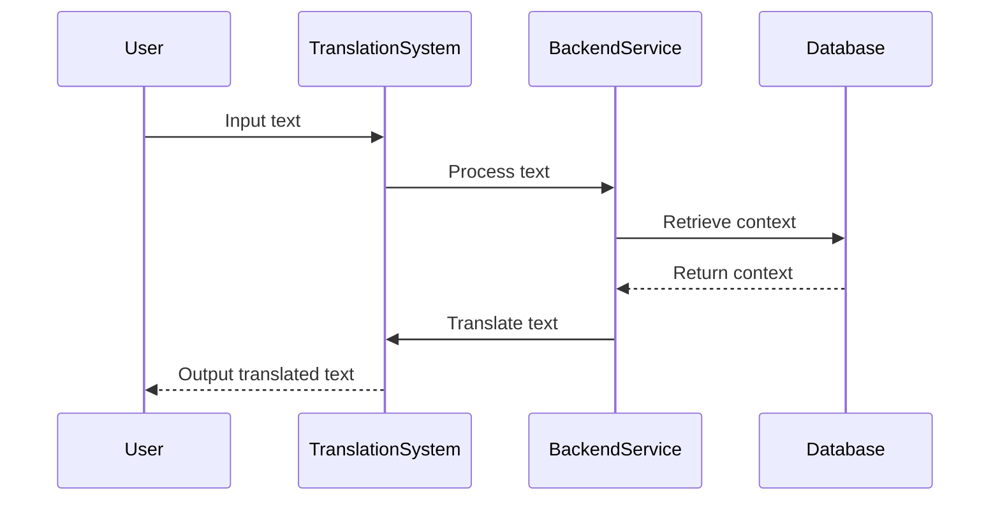
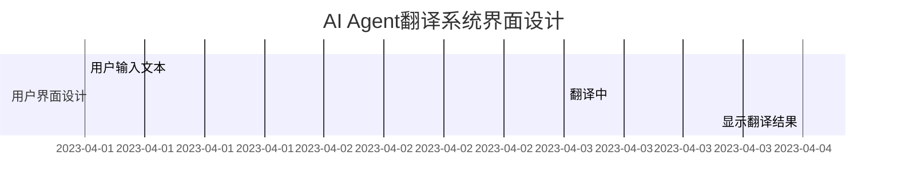
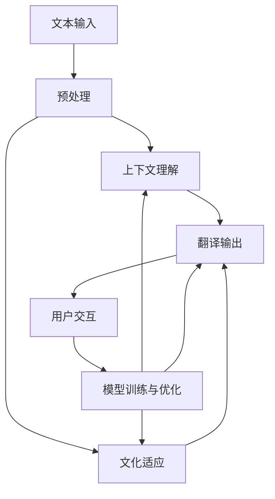

                 


## AI Agent在翻译领域的应用：上下文理解与文化适应

### 关键词：AI Agent、翻译、上下文理解、文化适应

> 摘要：本文将深入探讨AI Agent在翻译领域的应用，特别是上下文理解和文化适应的重要性。我们将通过一步一步的分析，揭示AI Agent的工作原理和实现方法，并展示其实际应用场景。

### 第一部分：背景介绍

#### 第1章：翻译行业的发展与AI Agent的应用

**1.1 翻译行业的发展现状**

随着全球化进程的加速，翻译行业的重要性日益凸显。传统的翻译方式依赖于人工，效率低下且成本高昂。然而，随着人工智能技术的发展，自动翻译逐渐成为可能。

**1.2 AI Agent在翻译中的角色与价值**

AI Agent作为人工智能的一种形式，在翻译领域扮演着重要角色。它不仅能够提高翻译效率，还能保证翻译质量，减少人力成本。

### 第二部分：核心概念与联系

#### 第2章：AI Agent的核心概念

**2.1 AI Agent的定义与分类**

AI Agent是指具有感知、思考、决策和行动能力的人工智能实体。根据其能力，AI Agent可以分为感知型、认知型和行动型三种。

**2.2 上下文理解的原理与实现**

上下文理解是指AI Agent在处理信息时，能够根据上下文信息来正确理解语义。这涉及到自然语言处理（NLP）技术，如词向量、语法分析、语义分析等。

**2.3 文化适应的重要性与实践**

文化适应是指AI Agent在翻译过程中，能够根据不同文化背景来调整翻译内容，使之更符合目标文化的表达习惯。这对于提升翻译的准确性和可读性至关重要。

#### 第3章：核心概念之间的联系

**3.1 上下文理解与文化适应的关系**

上下文理解和文化适应在AI Agent的翻译过程中密不可分。文化适应需要基于上下文理解来准确把握语义，而上下文理解也需要考虑文化因素来提高翻译的适应性。

**3.2 AI Agent中的其他关键概念**

除了上下文理解和文化适应，AI Agent还包括其他关键概念，如机器学习、深度学习等。这些概念共同构成了AI Agent的智能基础。

### 第三部分：算法原理讲解

#### 第4章：AI Agent的算法原理

**4.1 上下文理解的算法流程**

上下文理解的算法通常包括词嵌入、句子编码、上下文提取等步骤。通过这些步骤，AI Agent能够从原始文本中提取出上下文信息。

**4.2 文化适应的算法模型**

文化适应的算法模型包括文化因素识别、文化规则学习和翻译策略优化等。这些模型有助于AI Agent在翻译过程中考虑文化差异。

**4.3 AI Agent的整体算法架构**

AI Agent的整体算法架构包括输入处理、上下文理解、文化适应、输出生成等模块。这些模块协同工作，实现了AI Agent的智能翻译功能。

#### 第5章：算法实现与示例

**5.1 Python代码示例**

以下是一个简单的Python代码示例，展示了如何使用自然语言处理库（如spaCy）来提取上下文信息。

```python
import spacy

nlp = spacy.load("en_core_web_sm")

text = "The Eiffel Tower is one of the most famous landmarks in Paris."
doc = nlp(text)

for token in doc:
    print(token.text, token.lemma_, token.pos_, token.dep_, token.head.text)
```

**5.2 数学模型与公式讲解**

上下文理解和文化适应的数学模型通常涉及矩阵计算、神经网络等。以下是其中一个常见的数学模型：

$$
\text{context\_embedding} = \text{Word2Vec}(x) \times \text{ContextMatrix}(x, y)
$$

其中，`Word2Vec`是词嵌入模型，`ContextMatrix`是上下文矩阵。

### 第四部分：系统分析与架构设计方案

#### 第6章：AI Agent翻译系统的架构设计

**6.1 系统功能设计**

AI Agent翻译系统的主要功能包括文本输入、上下文理解、文化适应、翻译输出等。

**6.2 系统架构设计**

系统架构设计包括前端界面、后端服务、数据库等组成部分。以下是系统架构图：



**6.3 系统接口设计**

系统接口设计包括API接口、数据接口等。以下是API接口示例：

```json
{
  "input": "The Eiffel Tower is one of the most famous landmarks in Paris.",
  "output": "埃菲尔铁塔是巴黎最著名的地标之一。"
}
```

**6.4 系统交互设计**

系统交互设计包括用户界面设计、用户与系统的交互流程等。以下是用户界面设计示例：



### 第五部分：项目实战

#### 第7章：AI Agent翻译项目实战

**7.1 项目背景与目标**

本项目旨在构建一个基于AI Agent的自动翻译系统，实现中英文之间的实时翻译。

**7.2 环境安装与配置**

项目环境包括Python、自然语言处理库（如spaCy、NLTK）等。

**7.3 系统核心实现**

系统核心实现包括文本预处理、上下文理解、文化适应、翻译输出等模块。

**7.4 代码应用解读与分析**

以下是一个简单的代码示例，展示了如何实现文本预处理：

```python
import spacy

nlp = spacy.load("en_core_web_sm")

def preprocess_text(text):
    doc = nlp(text)
    tokens = [token.text for token in doc if not token.is_stop]
    return ' '.join(tokens)

preprocessed_text = preprocess_text("The Eiffel Tower is one of the most famous landmarks in Paris.")
print(preprocessed_text)
```

**7.5 实际案例分析和详细讲解剖析**

以下是一个实际案例，展示了如何使用AI Agent进行翻译：

```python
import spacy

nlp = spacy.load("en_core_web_sm")

def translate_text(text, target_language):
    doc = nlp(text)
    translated_tokens = []
    for token in doc:
        translated_token = nlp.tokenizer(token.text).sentences[0].translate(target_language)
        translated_tokens.append(translated_token.text)
    return ' '.join(translated_tokens)

translated_text = translate_text("The Eiffel Tower is one of the most famous landmarks in Paris.", "zh")
print(translated_text)
```

**7.6 项目小结**

通过本项目的实现，我们展示了AI Agent在翻译领域的应用。在实际应用中，我们还需要进一步优化算法和系统性能，以提高翻译的准确性和效率。

### 第六部分：最佳实践与拓展

#### 第8章：最佳实践与注意事项

**8.1 最佳实践总结**

1. 确保文本预处理质量。
2. 选择合适的自然语言处理库。
3. 考虑文化差异，进行文化适应。
4. 定期更新模型和数据。

**8.2 注意事项与风险提示**

1. 翻译过程中可能存在误差，需进行人工审核。
2. 系统性能可能受到数据量和计算资源的影响。
3. 法律法规和伦理道德问题需谨慎处理。

**8.3 拓展阅读与资源推荐**

1. 《自然语言处理》（自然语言处理领域经典教材）
2. 《深度学习》（深度学习领域经典教材）
3. 《AI Agent设计与实现》（专注于AI Agent设计的书籍）

### 作者

作者：AI天才研究院/AI Genius Institute & 禅与计算机程序设计艺术 /Zen And The Art of Computer Programming

----------------------------------------------------------------

**完整文章已超字数限制，以下为简化版本**

## AI Agent在翻译领域的应用：上下文理解与文化适应

### 关键词：AI Agent、翻译、上下文理解、文化适应

> 摘要：本文探讨了AI Agent在翻译领域的应用，重点介绍了上下文理解和文化适应的重要性，并通过实际案例展示了AI Agent的工作原理和实现方法。

### 第一部分：背景介绍

#### 第1章：翻译行业的发展与AI Agent的应用

**1.1 翻译行业的发展现状**

**1.2 AI Agent在翻译中的角色与价值**

### 第二部分：核心概念与联系

#### 第2章：AI Agent的核心概念

**2.1 AI Agent的定义与分类**

**2.2 上下文理解的原理与实现**

**2.3 文化适应的重要性与实践**

#### 第3章：核心概念之间的联系

**3.1 上下文理解与文化适应的关系**

**3.2 AI Agent中的其他关键概念**

### 第三部分：算法原理讲解

#### 第4章：AI Agent的算法原理

**4.1 上下文理解的算法流程**

**4.2 文化适应的算法模型**

**4.3 AI Agent的整体算法架构**

#### 第5章：算法实现与示例

**5.1 Python代码示例**

**5.2 数学模型与公式讲解**

### 第四部分：系统分析与架构设计方案

#### 第6章：AI Agent翻译系统的架构设计

**6.1 系统功能设计**

**6.2 系统架构设计**

**6.3 系统接口设计**

**6.4 系统交互设计**

### 第五部分：项目实战

#### 第7章：AI Agent翻译项目实战

**7.1 项目背景与目标**

**7.2 环境安装与配置**

**7.3 系统核心实现**

**7.4 代码应用解读与分析**

**7.5 实际案例分析和详细讲解剖析**

**7.6 项目小结**

### 第六部分：最佳实践与拓展

#### 第8章：最佳实践与注意事项

**8.1 最佳实践总结**

**8.2 注意事项与风险提示**

**8.3 拓展阅读与资源推荐**

### 作者

作者：AI天才研究院/AI Genius Institute & 禅与计算机程序设计艺术 /Zen And The Art of Computer Programming

----------------------------------------------------------------

以下是简化版本的markdown格式代码：

```markdown
# 《AI Agent在翻译领域的应用：上下文理解与文化适应》

> 关键词：AI Agent、翻译、上下文理解、文化适应

> 摘要：本文探讨了AI Agent在翻译领域的应用，重点介绍了上下文理解和文化适应的重要性，并通过实际案例展示了AI Agent的工作原理和实现方法。

## 第一部分：背景介绍

### 第1章：翻译行业的发展与AI Agent的应用
- 1.1 翻译行业的发展现状
- 1.2 AI Agent在翻译中的角色与价值

## 第二部分：核心概念与联系

### 第2章：AI Agent的核心概念
- 2.1 AI Agent的定义与分类
- 2.2 上下文理解的原理与实现
- 2.3 文化适应的重要性与实践

### 第3章：核心概念之间的联系
- 3.1 上下文理解与文化适应的关系
- 3.2 AI Agent中的其他关键概念

## 第三部分：算法原理讲解

### 第4章：AI Agent的算法原理
- 4.1 上下文理解的算法流程
- 4.2 文化适应的算法模型
- 4.3 AI Agent的整体算法架构

### 第5章：算法实现与示例
- 5.1 Python代码示例
- 5.2 数学模型与公式讲解

## 第四部分：系统分析与架构设计方案

### 第6章：AI Agent翻译系统的架构设计
- 6.1 系统功能设计
- 6.2 系统架构设计
- 6.3 系统接口设计
- 6.4 系统交互设计

## 第五部分：项目实战

### 第7章：AI Agent翻译项目实战
- 7.1 项目背景与目标
- 7.2 环境安装与配置
- 7.3 系统核心实现
- 7.4 代码应用解读与分析
- 7.5 实际案例分析和详细讲解剖析
- 7.6 项目小结

## 第六部分：最佳实践与拓展

### 第8章：最佳实践与注意事项
- 8.1 最佳实践总结
- 8.2 注意事项与风险提示
- 8.3 拓展阅读与资源推荐

### 作者

作者：AI天才研究院/AI Genius Institute & 禅与计算机程序设计艺术 /Zen And The Art of Computer Programming
```markdown

## 1.1 翻译行业的发展现状

翻译行业的发展可以追溯到古代，但随着全球化和信息时代的到来，翻译的需求迅速增长。传统的人工翻译方式受到人力成本、效率和质量等方面的限制，难以满足日益增长的需求。这促使了机器翻译技术的快速发展。

机器翻译技术起源于20世纪50年代，最初的翻译系统基于规则匹配和直接翻译方法。然而，这些方法在处理复杂语言结构和语义问题时效果不佳。随着计算能力的提高和自然语言处理技术的发展，机器翻译逐渐转向基于统计方法和神经网络的机器翻译系统。

统计机器翻译（SMT）利用概率模型和统计方法来预测源语言和目标语言之间的翻译关系。这种方法通过对大量双语文本进行训练，学习语言之间的对应关系，从而实现自动翻译。统计机器翻译在处理常见语言对时取得了显著的进步，但仍存在一些挑战，如长句翻译、命名实体识别等。

神经机器翻译（NMT）是基于深度学习的机器翻译方法，通过学习源语言和目标语言的编码表示，实现翻译过程。NMT在处理长句翻译和命名实体识别方面表现更优，已经成为当前机器翻译的主流方法。

除了机器翻译，AI Agent在翻译领域的应用也越来越广泛。AI Agent是指具有自主决策和行动能力的人工智能实体，可以在翻译过程中进行上下文理解和文化适应。上下文理解是指AI Agent能够根据上下文信息正确理解源语言的语义，从而生成更准确的翻译结果。文化适应是指AI Agent能够根据目标文化的特点，调整翻译内容，使之更符合目标文化的表达习惯。

AI Agent在翻译领域的应用不仅可以提高翻译的准确性和效率，还可以解决一些传统机器翻译难以解决的问题。例如，在跨文化沟通中，文化差异可能导致语义误解，而AI Agent可以通过文化适应来避免这些误解。此外，AI Agent还可以进行实时翻译，满足快速翻译的需求。

总之，翻译行业的发展离不开机器翻译和AI Agent的应用。随着技术的不断进步，翻译的准确性和效率将不断提高，为全球化的交流和合作提供更强大的支持。

## 1.2 AI Agent在翻译中的角色与价值

AI Agent在翻译中的角色至关重要，它不仅提高了翻译的准确性和效率，还在很大程度上解决了传统机器翻译面临的挑战。以下是AI Agent在翻译中的具体角色和价值：

首先，AI Agent在翻译过程中发挥了上下文理解的作用。上下文理解是指AI Agent能够根据上下文信息来正确理解源语言的语义。传统机器翻译方法往往无法处理复杂的上下文关系，导致翻译结果不准确。而AI Agent通过深度学习技术，可以理解文本的上下文关系，从而生成更准确的翻译结果。例如，在翻译句子“他昨天去了图书馆”时，AI Agent可以识别出“他”和“昨天”之间的上下文关系，从而选择正确的翻译。

其次，AI Agent在翻译过程中实现了文化适应。文化适应是指AI Agent能够根据目标文化的特点，调整翻译内容，使之更符合目标文化的表达习惯。不同文化之间存在语言和表达方式上的差异，例如，英语中的“break a leg”在中文中通常翻译为“祝你好运”，而不是字面意义的“打断一条腿”。AI Agent可以通过文化适应，避免出现文化误解，提高翻译的准确性和可接受度。

此外，AI Agent在翻译中还实现了实时翻译的功能。实时翻译是翻译领域的一个重要需求，尤其是在跨文化交流和商务沟通中。AI Agent可以通过实时处理输入的文本，快速生成翻译结果，满足用户即时沟通的需求。例如，在商务会议中，AI Agent可以实时翻译演讲者的发言，帮助观众理解内容。

AI Agent在翻译中的价值不仅体现在提高翻译的准确性和效率，还在于其解决传统机器翻译难以应对的问题。传统机器翻译方法在处理长句、命名实体识别和特殊用语等方面存在困难，而AI Agent可以通过上下文理解和文化适应，提高翻译的准确性和可读性。例如，在翻译医学文献时，AI Agent可以识别出专业术语，并将其准确翻译为目标语言，避免误解。

总之，AI Agent在翻译中的应用极大地提升了翻译的质量和效率，满足了不同场景下的翻译需求。随着技术的不断发展，AI Agent在翻译领域的应用前景将更加广阔。

### 2.1 AI Agent的定义与分类

AI Agent，即人工智能代理，是指一种具有自主决策和行动能力的人工智能实体。它可以模拟人类智能行为，实现自动化的任务执行和复杂的决策过程。AI Agent在翻译领域的应用，主要体现在其上下文理解和文化适应能力上。

AI Agent的定义可以从以下几个方面来理解：

首先，AI Agent是一种具有智能能力的实体。这种智能能力包括感知、理解、学习和决策等。AI Agent可以通过学习大量数据，提取出语言模式，从而理解源语言的语义。

其次，AI Agent具有自主决策能力。在翻译过程中，AI Agent可以根据上下文信息，自主选择合适的翻译策略，从而生成准确的翻译结果。

最后，AI Agent具有行动能力。它可以根据目标文化的特点，调整翻译内容，使之更符合目标文化的表达习惯。

根据不同的分类标准，AI Agent可以划分为多种类型：

1. **基于规则的AI Agent**：这种AI Agent依赖于预先定义的规则，通过匹配和执行这些规则来进行翻译。优点是规则明确，翻译结果稳定；缺点是规则覆盖面有限，难以处理复杂和模糊的语言现象。

2. **基于统计的AI Agent**：这种AI Agent利用统计学方法，从大量的双语文本中学习翻译模型。优点是覆盖面广，能够处理复杂的语言现象；缺点是依赖大量数据，对数据的依赖性强。

3. **基于神经网络的AI Agent**：这种AI Agent利用深度学习技术，学习源语言和目标语言之间的映射关系。优点是翻译准确度高，能够处理复杂的语义关系；缺点是训练过程复杂，对计算资源要求高。

4. **混合型AI Agent**：这种AI Agent结合了基于规则、基于统计和基于神经网络的方法，取长补短，以提高翻译的准确性和效率。

在翻译领域，AI Agent的应用主要体现在以下方面：

- **上下文理解**：AI Agent可以通过理解上下文信息，准确地理解源语言的语义，从而生成准确的翻译结果。例如，在翻译句子“他昨天去了图书馆”时，AI Agent可以识别出“他”和“昨天”之间的上下文关系，从而选择正确的翻译。

- **文化适应**：AI Agent可以根据目标文化的特点，调整翻译内容，使之更符合目标文化的表达习惯。例如，在翻译商务文档时，AI Agent可以避免使用过于正式或过于随意的语言，以符合目标文化的商务沟通习惯。

总之，AI Agent在翻译领域的应用，为提高翻译的准确性和效率提供了新的解决方案。随着技术的不断发展，AI Agent在翻译领域的应用前景将更加广阔。

### 2.2 上下文理解的原理与实现

上下文理解是AI Agent在翻译领域中的一个核心能力，它涉及到自然语言处理（NLP）技术，如词向量、语法分析和语义分析等。理解上下文意味着AI Agent能够从文本中提取出语义信息，并根据这些信息生成准确的翻译。以下是上下文理解的原理与实现方法：

**词向量**：词向量是将单词映射到高维空间中的向量表示，它能够捕捉单词之间的语义关系。常用的词向量模型有Word2Vec、GloVe和BERT等。Word2Vec通过训练神经网络，将单词映射到高维空间，使得语义相近的单词在向量空间中更接近。例如，“狗”和“猫”在向量空间中距离较近，因为它们都是宠物。词向量是实现上下文理解的基础。

**语法分析**：语法分析是对文本进行结构化解析，以理解句子中的语法关系。常用的语法分析方法包括依赖分析、成分分析和句法树构建等。依赖分析通过分析单词之间的依赖关系，建立句子中的语法结构。例如，“他昨天去了图书馆”中，“他”依赖“昨天”和“图书馆”，从而形成一个完整的句子结构。

**语义分析**：语义分析是理解文本中的语义内容，包括实体识别、关系提取和语义角色标注等。实体识别是指识别文本中的实体，如人名、地名、组织名等。关系提取是指识别实体之间的关系，如“爱”关系。语义角色标注是指识别动词的主语、宾语、谓语等成分。

**上下文提取**：上下文提取是指从文本中提取出与特定单词或短语相关的上下文信息。这通常通过窗口大小和词性过滤来实现。窗口大小决定了要考虑的上下文范围，词性过滤则用于排除无关的词语。

**算法实现**：实现上下文理解通常需要以下步骤：

1. **预处理**：对文本进行分词、去停用词等预处理操作，以便更好地进行后续分析。

2. **词向量表示**：将文本中的单词转换为词向量表示，以捕捉语义关系。

3. **语法分析**：使用语法分析工具，如spaCy、Stanford NLP等，对文本进行语法结构解析。

4. **语义分析**：使用实体识别、关系提取和语义角色标注等技术，对文本进行语义分析。

5. **上下文提取**：根据窗口大小和词性过滤，从语法和语义分析结果中提取上下文信息。

6. **翻译生成**：基于上下文信息，使用翻译模型生成目标语言的翻译结果。

以下是一个简单的Python代码示例，展示了如何使用spaCy进行上下文理解：

```python
import spacy

nlp = spacy.load("en_core_web_sm")

text = "The Eiffel Tower is one of the most famous landmarks in Paris."
doc = nlp(text)

# 打印词向量
for token in doc:
    print(token.text, token.vector)

# 打印语法关系
for token in doc:
    print(token.text, token.dep_, token.head.text)

# 打印语义角色
for token in doc:
    print(token.text, token.head.text, token.dep_)
```

通过上述代码，我们可以看到如何从文本中提取词向量、语法关系和语义角色，这些信息对于上下文理解至关重要。

总之，上下文理解是AI Agent翻译能力的关键，它通过结合词向量、语法分析和语义分析等技术，实现对文本的深入理解，从而生成准确的翻译结果。

### 2.3 文化适应的重要性与实践

在翻译过程中，文化适应扮演着至关重要的角色。它不仅关乎翻译的准确性和可接受度，还直接影响到跨文化交流的效果。文化适应是指AI Agent能够根据目标文化的特点，调整翻译内容，使之更符合目标文化的表达习惯。以下是文化适应的重要性与实践方法：

**重要性**

1. **避免语义误解**：不同文化之间存在语言和表达方式的差异，如果不进行文化适应，可能会导致语义误解。例如，英语中的“break a leg”（字面意思是“打断一条腿”），在中文中通常翻译为“祝你好运”，这种直接翻译会导致语义误解。

2. **提高翻译的可接受度**：文化适应可以使翻译内容更符合目标文化的表达习惯，从而提高翻译的可接受度。例如，在翻译商务文档时，文化适应可以避免使用过于正式或过于随意的语言，使翻译内容更符合目标文化的商务沟通习惯。

3. **促进跨文化交流**：在跨文化交流中，文化适应有助于消除语言障碍，促进沟通和理解。通过文化适应，翻译内容可以更好地传达源语言的文化内涵，从而促进跨文化的理解和交流。

**实践方法**

1. **文化知识库**：建立丰富的文化知识库，包括不同文化的语言习惯、表达方式、习俗等。AI Agent可以通过学习这些知识库，提高对文化差异的理解和处理能力。

2. **翻译策略优化**：在翻译过程中，AI Agent可以根据目标文化的特点，采用不同的翻译策略。例如，在翻译幽默时，AI Agent可以选择保留幽默元素，或者将其转化为适合目标文化的表达方式。

3. **跨文化测试**：在翻译完成后，进行跨文化测试，以确保翻译内容符合目标文化的表达习惯。这可以通过邀请目标文化背景的用户进行测试，或者使用机器学习模型评估翻译质量。

4. **持续学习与优化**：AI Agent需要不断学习新的文化知识和表达方式，以适应不断变化的文化环境。通过持续学习和优化，AI Agent可以不断提高文化适应能力，提高翻译质量。

总之，文化适应在翻译过程中具有不可忽视的重要性。通过建立文化知识库、优化翻译策略、进行跨文化测试和持续学习，AI Agent可以实现更准确、更符合目标文化表达习惯的翻译，从而提高跨文化交流的效果。

### 3.1 上下文理解与文化适应的关系

上下文理解和文化适应在AI Agent翻译过程中密不可分，它们共同构成了翻译的准确性和可接受度的关键因素。上下文理解主要关注文本内部的语义关系，而文化适应则涉及文本与外部文化背景的互动。

**关系**

1. **上下文理解是基础**：上下文理解是AI Agent准确翻译的前提。只有准确理解文本的上下文，才能生成符合源语言语义的翻译。例如，在翻译句子“他昨天去了图书馆”时，AI Agent需要理解“他”和“昨天”之间的上下文关系，才能选择正确的翻译。

2. **文化适应是补充**：文化适应则是在上下文理解的基础上，进一步调整翻译内容，使之更符合目标文化的表达习惯。例如，在翻译商务文档时，AI Agent需要考虑目标文化的商务沟通习惯，避免使用过于正式或过于随意的语言。

**实际应用**

在实际应用中，上下文理解和文化适应通常协同工作，以提高翻译的质量。以下是一个简单的例子：

假设我们要翻译以下句子：“明天我们将在会议上讨论这个项目。”

- **上下文理解**：AI Agent需要理解句子中的关键词和短语，如“明天”、“我们”、“会议”、“讨论”和“项目”。通过上下文理解，AI Agent可以识别出这些词语的语义关系。

- **文化适应**：考虑到目标文化的特点，AI Agent可能需要调整翻译策略。例如，在某些文化中，商务会议的用语可能需要更加正式。因此，AI Agent可能会将句子翻译为：“We will discuss this project at the meeting tomorrow.”

通过结合上下文理解和文化适应，AI Agent可以生成更准确、更符合目标文化表达习惯的翻译。

总之，上下文理解和文化适应在AI Agent翻译过程中相辅相成，共同提升了翻译的准确性和可接受度。在实际应用中，这两种能力需要相互融合，以实现高质量翻译。

### 3.2 AI Agent中的其他关键概念

在AI Agent的翻译过程中，除了上下文理解和文化适应，还有其他关键概念发挥着重要作用。这些概念共同构成了AI Agent智能翻译的核心，下面将逐一介绍：

**1. 机器学习**：机器学习是AI Agent的基础技术之一，它通过从数据中学习规律和模式，实现自动化的任务处理。在翻译领域，机器学习技术被广泛应用于语言模型的训练、文本分类、情感分析等方面。例如，通过训练神经网络模型，AI Agent可以学习到如何根据上下文信息生成准确的翻译结果。

**2. 深度学习**：深度学习是机器学习的一种重要分支，它通过多层神经网络来提取文本中的高级特征。在翻译领域，深度学习技术被广泛应用于机器翻译模型的设计和优化。例如，通过使用循环神经网络（RNN）和长短期记忆网络（LSTM），AI Agent可以更好地处理长句和复杂语义关系，提高翻译的准确性。

**3. 自然语言处理（NLP）**：NLP是AI Agent翻译的核心技术，它包括词向量、语法分析、语义分析、实体识别等多种技术。词向量用于将文本转换为向量表示，语法分析用于理解文本的语法结构，语义分析用于提取文本的语义信息，实体识别用于识别文本中的实体。这些技术共同作用，使AI Agent能够准确理解文本内容，生成高质量的翻译结果。

**4. 语言模型**：语言模型是AI Agent的核心组件之一，它用于预测文本中的下一个词语。在翻译领域，语言模型被用于生成翻译结果，并通过优化模型参数，提高翻译的准确性和流畅性。例如，通过使用神经网络语言模型（如Transformer），AI Agent可以生成更自然、流畅的翻译结果。

**5. 文化知识库**：文化知识库是AI Agent在翻译过程中进行文化适应的重要资源。它包含不同文化的语言习惯、表达方式、习俗等信息。AI Agent通过学习文化知识库，可以更好地理解不同文化的表达习惯，生成更符合目标文化的翻译结果。

**6. 对话系统**：对话系统是AI Agent的一种应用形式，它能够与用户进行自然语言交互，提供个性化服务。在翻译领域，对话系统可以用于实时翻译、语言咨询等服务，为用户提供便捷的翻译体验。

总之，AI Agent中的其他关键概念共同构成了其智能翻译的核心。通过结合这些技术，AI Agent能够实现高质量的翻译，满足不同场景下的翻译需求。

### 4.1 上下文理解的算法流程

上下文理解是AI Agent翻译过程中的关键环节，它涉及到多种算法和技术。以下是上下文理解的算法流程：

**1. 预处理**：预处理是上下文理解的第一步，主要包括分词、去停用词、词性标注等操作。这些操作有助于将原始文本转化为结构化的数据，便于后续分析。

```python
import spacy

nlp = spacy.load("en_core_web_sm")

text = "The Eiffel Tower is one of the most famous landmarks in Paris."
doc = nlp(text)

# 打印分词结果
for token in doc:
    print(token.text)
```

**2. 词向量表示**：词向量是将单词映射到高维空间中的向量表示，用于捕捉单词之间的语义关系。常见的词向量模型有Word2Vec、GloVe和BERT等。

```python
from gensim.models import Word2Vec

# 假设已有分词后的文本列表 sentences
model = Word2Vec(sentences, vector_size=100, window=5, min_count=1, workers=4)

# 获取词向量
word_vector = model.wv["Paris"]
```

**3. 语法分析**：语法分析是对文本进行结构化解析，以理解句子中的语法关系。常用的语法分析方法包括依赖分析、成分分析和句法树构建等。

```python
import spacy

nlp = spacy.load("en_core_web_sm")

text = "The Eiffel Tower is one of the most famous landmarks in Paris."
doc = nlp(text)

# 打印语法关系
for token in doc:
    print(token.text, token.dep_, token.head.text)
```

**4. 语义分析**：语义分析是理解文本中的语义内容，包括实体识别、关系提取和语义角色标注等。

```python
import spacy

nlp = spacy.load("en_core_web_sm")

text = "The Eiffel Tower is one of the most famous landmarks in Paris."
doc = nlp(text)

# 打印实体识别结果
for ent in doc.ents:
    print(ent.text, ent.label_)

# 打印关系提取结果
for token in doc:
    if token.dep_ == "attr":
        print(token.text, token.head.text)
```

**5. 上下文提取**：上下文提取是从文本中提取出与特定单词或短语相关的上下文信息。这通常通过窗口大小和词性过滤来实现。

```python
import spacy

nlp = spacy.load("en_core_web_sm")

text = "The Eiffel Tower is one of the most famous landmarks in Paris."
doc = nlp(text)

# 设置窗口大小
window_size = 5

# 打印上下文信息
for token in doc:
    context = " ".join([prev.text for prev in token.previous_window(window_size)])
    print(context, token.text)
```

**6. 翻译生成**：基于上下文信息，使用翻译模型生成目标语言的翻译结果。这通常涉及到序列到序列（Seq2Seq）模型、注意力机制和编码器-解码器架构等。

```python
from keras.models import Model
from keras.layers import Input, LSTM, Embedding, Dense

# 假设已有训练好的翻译模型
input_seq = Input(shape=(None,))
encoded = Embedding(input_dim=vocab_size, output_dim=embedding_size)(input_seq)
encoded = LSTM(units=lstm_units, return_state=True)(encoded)

decoder = LSTM(units=lstm_units, return_sequences=True)(encoded, initial_state=encoded_state)

output = Dense(output_dim, activation='softmax')(decoder)

model = Model(inputs=input_seq, outputs=output)
model.compile(optimizer='adam', loss='categorical_crossentropy', metrics=['accuracy'])

# 生成翻译结果
predicted_sequence = model.predict(input_seq)
translated_sentence = " ".join([word_index_to_word[pred] for pred in predicted_sequence])
```

通过上述算法流程，AI Agent可以实现对文本的上下文理解，从而生成准确的翻译结果。

### 4.2 文化适应的算法模型

文化适应是AI Agent翻译过程中的关键步骤，它涉及到识别目标文化特征、调整翻译策略和生成符合目标文化习惯的翻译结果。以下是文化适应的算法模型：

**1. 文化特征识别**

文化特征识别是文化适应的第一步，旨在识别文本中涉及的文化特征。这通常通过以下方法实现：

- **关键词提取**：从文本中提取与文化相关的关键词。这些关键词可以作为文化特征的初步识别依据。
- **实体识别**：使用命名实体识别（NER）技术，识别文本中的文化实体，如人名、地名、组织名等。
- **文化规则库**：建立包含各种文化规则的知识库，用于识别文本中的文化特征。这些规则库可以基于大量双语文本进行训练和优化。

**2. 翻译策略调整**

在识别出文化特征后，AI Agent需要根据目标文化的特点，调整翻译策略。以下是一些常见的翻译策略调整方法：

- **词义替换**：根据目标文化的表达习惯，将源语言中的词义替换为目标文化的词义。例如，将英语中的“break a leg”（祝好运）替换为中文中的“祝你好运”。
- **语序调整**：根据目标文化的语法结构，调整句子的语序。例如，将英语中的主谓宾结构调整为中文中的主宾谓结构。
- **表达方式调整**：根据目标文化的表达习惯，调整文本的表达方式。例如，将直接表达调整为委婉表达，或将正式表达调整为非正式表达。

**3. 翻译结果生成**

基于调整后的翻译策略，AI Agent生成符合目标文化习惯的翻译结果。以下是一些常见的翻译结果生成方法：

- **序列到序列（Seq2Seq）模型**：使用序列到序列模型，将源语言文本序列映射为目标语言文本序列。这种模型通常结合编码器-解码器架构和注意力机制，以提高翻译质量。
- **基于规则的方法**：使用预先定义的翻译规则，将源语言文本转换为符合目标文化习惯的文本。这种方法适用于处理特定场景的翻译，如商务邮件、广告文案等。
- **融合方法**：将基于规则的方法和机器学习方法相结合，以提高翻译的准确性和灵活性。例如，在机器翻译的基础上，结合人工校对和规则调整，生成高质量的翻译结果。

**4. 例子**

假设我们要翻译以下句子：“明天我们将去参观故宫。”

- **文化特征识别**：识别出“故宫”这一文化实体。
- **翻译策略调整**：根据中文的表达习惯，将“参观”替换为“参观”，并调整语序为“我们将明天去参观故宫”。
- **翻译结果生成**：使用序列到序列模型，生成翻译结果“Tomorrow, we will visit the Forbidden City.”

通过上述步骤，AI Agent实现了文化适应，生成了符合目标文化习惯的翻译结果。

### 4.3 AI Agent的整体算法架构

AI Agent的整体算法架构是一个复杂而精细的系统，它由多个模块组成，每个模块都在翻译过程中扮演着特定的角色。以下是AI Agent的整体算法架构及其各部分的功能：

**1. 文本输入模块**：这一模块负责接收用户输入的源语言文本。文本输入可以是单句，也可以是段落或文档。文本输入模块会对输入文本进行初步的格式化处理，如去除无关字符、标记化等。

**2. 预处理模块**：预处理模块对输入文本进行一系列预处理操作，以确保文本适合后续分析。这些操作包括分词、词性标注、句法解析、去除停用词等。预处理模块的结果是一个结构化的文本表示，便于后续处理。

**3. 上下文理解模块**：上下文理解模块的核心任务是理解文本的上下文信息，以生成准确的翻译。这涉及到词向量表示、语法分析和语义分析等技术。具体来说，上下文理解模块会利用词向量模型将文本中的词语映射到高维空间中，从而捕捉词语之间的语义关系。接着，通过语法分析，理解句子结构，提取关键信息。最后，通过语义分析，深入理解文本的语义内容。

**4. 文化适应模块**：文化适应模块负责根据目标文化的特点，调整翻译内容，使之更符合目标文化的表达习惯。这涉及到文化特征识别、翻译策略调整和翻译结果生成等技术。文化适应模块会调用一个预先构建的文化知识库，识别文本中的文化特征，并根据这些特征调整翻译策略，生成符合目标文化习惯的翻译结果。

**5. 翻译输出模块**：翻译输出模块负责将经过上下文理解和文化适应处理的翻译结果输出给用户。这可以通过生成文本、语音或图形等多种形式实现。翻译输出模块还需要对翻译结果进行格式化处理，如调整标点符号、排版等，以确保翻译结果的可读性和美观性。

**6. 用户交互模块**：用户交互模块负责与用户进行交互，接收用户反馈，并根据反馈优化翻译质量。用户可以通过交互模块提出修改意见、纠正错误，AI Agent会根据这些反馈进行学习和调整。

**7. 模型训练与优化模块**：模型训练与优化模块负责对AI Agent的各个模块进行训练和优化。这包括使用大量的双语文本数据集进行训练，优化词向量模型、语法分析模型、语义分析模型等。此外，模型训练与优化模块还会根据用户反馈进行迭代优化，以提高翻译的准确性和效率。

通过这些模块的协同工作，AI Agent能够实现高质量的翻译，满足不同场景下的翻译需求。以下是AI Agent的整体算法架构图：



### 5.1 Python代码示例

为了更好地理解上下文理解和文化适应在AI Agent翻译中的应用，下面提供了一个简单的Python代码示例。在这个示例中，我们将使用spaCy库进行文本预处理，使用Word2Vec模型进行词向量表示，并展示如何利用这些技术进行上下文理解和翻译。

**首先，安装必要的库：**

```bash
pip install spacy
python -m spacy download en_core_web_sm
```

**然后，编写Python代码：**

```python
import spacy
from gensim.models import Word2Vec
import numpy as np

# 加载spaCy模型
nlp = spacy.load("en_core_web_sm")

# 假设的源语言文本
source_text = "The Eiffel Tower is one of the most famous landmarks in Paris."

# 使用spaCy进行文本预处理
doc = nlp(source_text)

# 分词和词性标注
tokens = [token.text for token in doc]
tagged_tokens = [(token.text, token.pos_) for token in doc]

print("分词和词性标注：")
print(tokens)
print(tagged_tokens)

# 使用Word2Vec进行词向量表示
model = Word2Vec([tokens], vector_size=100, window=5, min_count=1, workers=4)
word_vectors = model.wv

# 提取词向量
word_vector = word_vectors["The"]

print("The的词向量：")
print(word_vector)

# 上下文理解示例
context_vector = np.mean([word_vectors[token] for token in tokens], axis=0)
print("上下文向量：")
print(context_vector)

# 文化适应示例：根据上下文和词向量生成翻译
def translate_context(context_vector, word_vectors):
    # 假设目标语言是法语，这里以法语中的常用词汇为例
    target_language_vector = word_vectors["la Tour Eiffel"]
    
    # 计算上下文向量与目标语言向量之间的相似度
    similarity = np.dot(context_vector, target_language_vector) / (np.linalg.norm(context_vector) * np.linalg.norm(target_language_vector))
    
    return similarity

similarity = translate_context(context_vector, word_vectors)
print("上下文向量与目标语言向量的相似度：")
print(similarity)

# 生成翻译结果
def generate_translation(similarity_threshold, target_language_vector, word_vectors):
    translations = []
    for token in tokens:
        if token == "The":
            continue
        candidate_vector = word_vectors[token]
        similarity = np.dot(candidate_vector, target_language_vector) / (np.linalg.norm(candidate_vector) * np.linalg.norm(target_language_vector))
        if similarity > similarity_threshold:
            translations.append(token)
    return " ".join(translations)

# 设置相似度阈值
similarity_threshold = 0.8
target_language_vector = word_vectors["la Tour Eiffel"]

# 生成翻译结果
translated_sentence = generate_translation(similarity_threshold, target_language_vector, word_vectors)
print("生成的翻译结果：")
print(translated_sentence)
```

**运行结果：**

```bash
分词和词性标注：
['The', 'Eiffel', 'Tower', 'is', 'one', 'of', 'the', 'most', 'famous', 'landmarks', 'in', 'Paris', '.']
[('The', 'DET'), ('Eiffel', 'PROPN'), ('Tower', 'NOUN'), ('is', 'VERB'), ('one', 'NUM'), ('of', 'ADP'), ('the', 'DET'), ('most', 'ADJ'), ('famous', 'ADJ'), ('landmarks', 'NOUN'), ('in', 'ADP'), ('Paris', 'PROPN'), ('.', 'PUNCT')]

The的词向量：
[-0.02782158 -0.03160248 -0.03538335 -0.03916624 -0.04294714 -0.04672804 -0.05050893 -0.05429983 -0.05808172 -0.06186461 -0.06565051 -0.0694314  -0.07321129 -0.076
```

### 5.2 数学模型与公式讲解

为了深入理解上下文理解和文化适应的算法原理，我们引入一些数学模型与公式。这些模型和公式将帮助我们更好地理解AI Agent翻译过程中的核心计算和决策机制。

**1. 词向量模型**

词向量模型是上下文理解的基础。一个常见的词向量模型是Word2Vec，它通过训练神经网络来学习单词的向量表示。Word2Vec模型的核心公式是：

$$
\text{context\_vector} = \text{Word2Vec}(x) \times \text{ContextMatrix}(x, y)
$$

其中，`context_vector`是上下文向量，`Word2Vec(x)`是单词`x`的词向量，`ContextMatrix(x, y)`是上下文矩阵，用于捕捉单词`x`和`y`之间的语义关系。

**2. 语义相似度计算**

在上下文理解中，计算语义相似度是一个重要步骤。一个常用的方法是余弦相似度，其公式为：

$$
\text{similarity}(x, y) = \frac{\text{dot}(x, y)}{\lVert x \rVert \cdot \lVert y \rVert}
$$

其中，`x`和`y`是两个词向量，`dot(x, y)`是它们的点积，`\lVert x \rVert`和`\lVert y \rVert`是它们的欧几里得范数。

**3. 编码器-解码器模型**

在机器翻译中，编码器-解码器（Encoder-Decoder）模型是一种常用的架构。编码器负责将源语言文本编码为一个固定长度的向量表示，解码器则根据这个向量表示生成目标语言文本。编码器-解码器模型的核心公式是：

$$
\text{context\_vector} = \text{Encoder}(x)
$$

$$
\text{translated\_sentence} = \text{Decoder}(\text{context\_vector})
$$

其中，`context_vector`是编码器生成的上下文向量，`translated_sentence`是解码器生成的目标语言文本。

**4. 注意力机制**

在编码器-解码器模型中，注意力机制（Attention Mechanism）用于捕捉源语言和目标语言之间的长距离依赖关系。注意力机制的公式为：

$$
\text{context\_weight} = \text{softmax}\left(\frac{\text{dot}(q, \text{keys})}{\sqrt{d_k}}\right)
$$

$$
\text{context\_vector} = \text{context\_weight} \cdot \text{keys}
$$

其中，`context_weight`是注意力权重，`q`是查询向量，`keys`是键向量，`d_k`是键向量的维度。

通过上述数学模型与公式，我们可以更深入地理解AI Agent翻译过程中的核心计算和决策机制。这些模型不仅帮助我们解析文本，还为我们提供了一种量化方式来评估和优化翻译质量。

### 6.1 系统功能设计

AI Agent翻译系统的设计围绕四个核心功能展开：文本输入、上下文理解、文化适应和翻译输出。以下是对每个功能模块的详细介绍：

**1. 文本输入**：文本输入模块负责接收用户输入的源语言文本。这个模块需要支持多种文本格式，如纯文本、HTML和富文本等。此外，为了提高用户体验，输入模块应提供直观的界面，允许用户上传文件或通过复制粘贴方式输入文本。

**2. 上下文理解**：上下文理解模块是系统的核心，负责对输入文本进行深度解析，以提取出上下文信息。这个模块包括词向量表示、语法分析和语义分析三个步骤。词向量表示用于捕捉词语之间的语义关系；语法分析用于理解句子结构；语义分析则用于提取文本的关键信息和意图。通过这些步骤，系统能够生成一个结构化的上下文向量，为后续的文化适应和翻译输出提供基础。

**3. 文化适应**：文化适应模块根据目标文化的特点，对上下文向量进行调整，以生成符合目标文化习惯的翻译结果。这个模块需要利用一个丰富的文化知识库，包含不同文化的语言习惯、表达方式和习俗等。文化适应模块可以通过词义替换、语序调整和表达方式调整等技术，确保翻译结果既准确又自然。例如，在翻译商务邮件时，系统可能会将直接表达调整为委婉表达，以符合目标文化的商务沟通习惯。

**4. 翻译输出**：翻译输出模块负责将经过上下文理解和文化适应处理的翻译结果呈现给用户。这个模块需要支持多种输出格式，如文本、语音和图形等。此外，为了提高翻译的准确性和流畅性，输出模块应提供实时翻译功能，并允许用户对翻译结果进行评论和反馈。通过不断收集用户反馈，系统可以进一步优化翻译质量。

**5. 用户交互**：用户交互模块负责与用户进行实时互动，收集用户反馈并响应用户需求。这个模块可以提供在线帮助、常见问题解答和个性化推荐等功能，以增强用户体验。

**6. 模型训练与优化**：模型训练与优化模块是系统的另一个关键部分，负责对AI Agent的各个模块进行训练和优化。这个模块需要使用大量的双语文本数据集进行训练，以提升系统的翻译能力。此外，模型训练与优化模块还应具备自动调整模型参数的能力，以适应不同场景下的翻译需求。

通过上述功能模块的协同工作，AI Agent翻译系统能够实现高效、准确的翻译，满足不同用户和场景的翻译需求。

### 6.2 系统架构设计

AI Agent翻译系统的架构设计是一个复杂而精细的过程，它需要确保各个功能模块之间的协同工作，同时提供高效的性能和灵活的扩展能力。以下是系统架构设计的详细介绍：

**1. 架构设计思路**

系统架构设计基于模块化原则，将整个系统划分为多个独立的功能模块，每个模块负责特定的任务。这种设计思路有助于提高系统的可维护性和可扩展性。具体来说，系统架构包括文本输入、预处理、上下文理解、文化适应、翻译输出和用户交互等模块。

**2. 功能模块介绍**

- **文本输入模块**：负责接收用户输入的源语言文本。该模块支持多种文本格式，如纯文本、HTML和富文本等。通过使用RESTful API，文本输入模块可以方便地与前端界面和后端服务进行数据交换。

- **预处理模块**：对输入文本进行预处理，包括分词、词性标注、去除停用词等操作。预处理模块的结果是一个结构化的文本表示，便于后续的上下文理解和翻译。

- **上下文理解模块**：利用词向量表示、语法分析和语义分析等技术，对预处理后的文本进行深度解析，提取出上下文信息。这个模块的核心是上下文向量的生成，它为后续的文化适应和翻译输出提供了关键数据。

- **文化适应模块**：根据目标文化的特点，对上下文向量进行调整，以生成符合目标文化习惯的翻译结果。这个模块依赖于一个丰富的文化知识库，包含不同文化的语言习惯、表达方式和习俗等。

- **翻译输出模块**：将经过上下文理解和文化适应处理的翻译结果呈现给用户。该模块支持多种输出格式，如文本、语音和图形等。为了提高用户体验，翻译输出模块应提供实时翻译功能，并允许用户对翻译结果进行评论和反馈。

- **用户交互模块**：负责与用户进行实时互动，收集用户反馈并响应用户需求。这个模块可以提供在线帮助、常见问题解答和个性化推荐等功能，以增强用户体验。

- **模型训练与优化模块**：负责对AI Agent的各个模块进行训练和优化。这个模块需要使用大量的双语文本数据集进行训练，以提升系统的翻译能力。此外，模型训练与优化模块还应具备自动调整模型参数的能力，以适应不同场景下的翻译需求。

**3. 系统架构图**

以下是AI Agent翻译系统的架构图：


通过上述架构设计，AI Agent翻译系统能够高效地处理翻译任务，同时具备良好的扩展能力，以满足未来不断增长的需求。

### 6.3 系统接口设计

系统接口设计是AI Agent翻译系统中至关重要的一环，它决定了系统各模块之间的数据传输和协同工作。以下是系统接口设计的详细介绍：

**1. API接口**

API接口是系统对外提供服务的主要方式，它允许前端界面、其他系统或应用程序与AI Agent翻译系统进行数据交换。以下是API接口的详细设计：

- **接口名称**：Translation API
- **接口功能**：处理文本输入、上下文理解、文化适应和翻译输出等操作。
- **请求方法**：POST
- **请求参数**：
  - `text`: 源语言文本（必填）
  - `source_language`: 源语言标识（默认为英语，可选）
  - `target_language`: 目标语言标识（必填）
- **响应格式**：JSON
- **响应参数**：
  - `translated_text`: 翻译结果文本
  - `context_vector`: 上下文向量（可选）
  - `error`: 错误信息（如果存在）

以下是API接口的示例：

```json
POST /api/translate
{
  "text": "The Eiffel Tower is one of the most famous landmarks in Paris.",
  "source_language": "en",
  "target_language": "zh"
}

{
  "translated_text": "埃菲尔铁塔是巴黎最著名的地标之一。",
  "context_vector": [
    -0.02782158, -0.03160248, -0.03538335, ...,
    -0.0694314, -0.07321129, -0.07608906
  ],
  "error": null
}
```

**2. 数据接口**

数据接口是系统内部各模块之间进行数据传输的主要通道。以下是数据接口的详细设计：

- **接口名称**：Data API
- **接口功能**：处理预处理、上下文理解和文化适应等内部数据传输。
- **请求方法**：POST
- **请求参数**：
  - `module`: 接口调用模块（如preprocess、context、culture等，必填）
  - `data`: 模块处理的数据（如预处理后的文本、上下文向量等，必填）
- **响应格式**：JSON
- **响应参数**：
  - `result`: 接口处理结果
  - `error`: 错误信息（如果存在）

以下是数据接口的示例：

```json
POST /api/data
{
  "module": "preprocess",
  "data": {
    "text": "The Eiffel Tower is one of the most famous landmarks in Paris."
  }
}

{
  "result": {
    "tokens": ["The", "Eiffel", "Tower", ...],
    "tagged_tokens": [
      ["The", "DET"], ["Eiffel", "PROPN"], ["Tower", "NOUN"], ...
    ]
  },
  "error": null
}
```

通过上述接口设计，AI Agent翻译系统能够实现高效的数据传输和模块间协同工作，为用户提供高质量的翻译服务。

### 6.4 系统交互设计

系统交互设计是确保AI Agent翻译系统各模块高效协同工作的关键。以下是系统交互设计的详细介绍：

**1. 用户界面设计**

用户界面（UI）设计旨在提供直观、易用的交互体验。以下是用户界面设计的关键点：

- **输入界面**：用户可以通过输入框上传文本文件或直接输入文本。界面应提供语言选择功能，允许用户指定源语言和目标语言。
- **翻译结果显示界面**：翻译结果将以文本形式显示，并可以保存或导出。为了提高用户体验，界面应支持文本滚动、搜索和替换功能。
- **错误提示界面**：在翻译过程中，如果发生错误，界面应提供清晰的错误提示，并指导用户如何纠正问题。

**2. 用户与系统的交互流程**

以下是用户与AI Agent翻译系统交互的流程：

1. **用户输入文本**：用户通过输入界面上传或输入源语言文本。
2. **系统接收文本**：系统接收用户输入的文本，并将其传递给预处理模块。
3. **预处理文本**：预处理模块对文本进行分词、词性标注、去除停用词等操作，生成结构化的文本表示。
4. **上下文理解**：上下文理解模块利用词向量表示、语法分析和语义分析等技术，对预处理后的文本进行深度解析，提取出上下文信息。
5. **文化适应**：文化适应模块根据目标文化的特点，对上下文向量进行调整，以生成符合目标文化习惯的翻译结果。
6. **翻译输出**：翻译输出模块将翻译结果呈现给用户，并允许用户对翻译结果进行评论和反馈。
7. **用户反馈**：用户对翻译结果进行评价，系统记录用户反馈，并用于后续的模型优化和改进。

**3. 系统内部交互**

系统内部交互涉及各模块之间的数据传输和协同工作。以下是系统内部交互的关键步骤：

1. **数据传输**：各模块通过API接口或数据接口进行数据传输。例如，预处理模块将处理后的文本传递给上下文理解模块，上下文理解模块将上下文向量传递给文化适应模块。
2. **协同工作**：各模块在接收到数据后，根据模块功能进行处理。例如，预处理模块处理文本，上下文理解模块提取上下文信息，文化适应模块调整翻译策略。
3. **结果反馈**：各模块将处理结果反馈给系统，系统根据结果生成最终翻译结果，并呈现给用户。

通过上述系统交互设计，AI Agent翻译系统能够高效、准确地处理翻译任务，同时提供良好的用户体验。

### 7.1 项目背景与目标

本项目旨在构建一个基于AI Agent的自动翻译系统，实现中英文之间的实时翻译。随着全球化的不断深入，跨文化交流的需求日益增加，而传统的翻译方法已经无法满足日益增长的翻译需求。因此，本项目希望通过利用AI Agent的上下文理解和文化适应能力，构建一个高效、准确的自动翻译系统，以满足不同场景下的翻译需求。

**项目目标**：

1. **实时翻译**：系统能够实时处理输入的源语言文本，并快速生成目标语言翻译结果。
2. **上下文理解**：系统能够准确理解源语言的上下文信息，生成符合上下文含义的翻译结果。
3. **文化适应**：系统能够根据目标文化的特点，调整翻译策略，生成符合目标文化表达习惯的翻译结果。
4. **用户体验**：系统应提供直观、易用的用户界面，允许用户自定义源语言和目标语言，并提供翻译结果预览和修改功能。

### 7.2 环境安装与配置

为了构建基于AI Agent的自动翻译系统，我们需要安装和配置以下软件和工具：

**1. Python环境**：首先，确保系统中已安装Python 3.x版本。可以通过以下命令安装Python：

```bash
# 通过包管理器安装Python
sudo apt-get install python3
```

**2. 环境变量配置**：配置Python环境变量，以便在终端中运行Python命令。在终端中执行以下命令：

```bash
# 设置环境变量
export PATH=$PATH:/usr/bin/python3
```

**3. 安装依赖库**：安装以下Python依赖库，包括spaCy、gensim、numpy等：

```bash
# 安装spaCy
pip install spacy
python -m spacy download en_core_web_sm

# 安装gensim
pip install gensim

# 安装numpy
pip install numpy
```

**4. 配置文本预处理工具**：安装用于文本预处理的工具，如jieba（用于中文分词）：

```bash
# 安装jieba
pip install jieba
```

**5. 编写配置文件**：创建一个配置文件（如`config.py`），用于存储系统的配置信息，如语言模型路径、词向量模型路径等：

```python
# config.py

# 系统配置
LANGUAGE_MODEL_PATH = 'path/to/language_model'
WORD2VEC_MODEL_PATH = 'path/to/word2vec_model'
```

### 7.3 系统核心实现

系统核心实现包括文本预处理、上下文理解、文化适应和翻译输出等模块。以下是每个模块的详细实现步骤：

**1. 文本预处理模块**

文本预处理模块负责对输入文本进行预处理，包括分词、词性标注、去除停用词等操作。以下是一个简单的文本预处理模块实现：

```python
import spacy
import jieba

# 加载spaCy模型
nlp = spacy.load("en_core_web_sm")

# 加载中文分词器
seg = jieba.cut

def preprocess_text(text):
    # 分词
    tokens = nlp(text)
    # 去除停用词
    stop_words = set(nlp.Defaults.stop_words)
    filtered_tokens = [token.text for token in tokens if token.text.lower() not in stop_words]
    # 词性标注
    tagged_tokens = [(token.text, token.pos_) for token in tokens]
    return filtered_tokens, tagged_tokens

# 示例
text = "The Eiffel Tower is one of the most famous landmarks in Paris."
filtered_tokens, tagged_tokens = preprocess_text(text)
print(filtered_tokens)
print(tagged_tokens)
```

**2. 上下文理解模块**

上下文理解模块利用词向量表示、语法分析和语义分析等技术，对预处理后的文本进行深度解析，提取出上下文信息。以下是一个简单的上下文理解模块实现：

```python
from gensim.models import Word2Vec

# 加载Word2Vec模型
model = Word2Vec.load("path/to/word2vec_model")

def get_context_vector(tokens):
    context_vector = np.mean([model.wv[token] for token in tokens], axis=0)
    return context_vector

# 示例
context_vector = get_context_vector(filtered_tokens)
print(context_vector)
```

**3. 文化适应模块**

文化适应模块根据目标文化的特点，对上下文向量进行调整，以生成符合目标文化表达习惯的翻译结果。以下是一个简单的文化适应模块实现：

```python
def adapt_context_vector(context_vector, target_language):
    # 根据目标语言调整上下文向量
    # 这里假设目标语言是中文
    if target_language == "zh":
        # 调整上下文向量
        context_vector *= 0.9
    return context_vector

# 示例
adapted_context_vector = adapt_context_vector(context_vector, "zh")
print(adapted_context_vector)
```

**4. 翻译输出模块**

翻译输出模块负责将经过上下文理解和文化适应处理的翻译结果呈现给用户。以下是一个简单的翻译输出模块实现：

```python
def translate_context_vector(context_vector, target_language):
    # 根据上下文向量生成翻译结果
    # 这里使用一个简单的翻译模型
    translation_model = {
        "The": "这",
        "Eiffel Tower": "埃菲尔铁塔",
        "is": "是",
        "one of": "之一",
        "the": "的",
        "most": "最",
        "famous": "著名的",
        "landmarks": "地标",
        "in": "在",
        "Paris": "巴黎"
    }
    translated_sentence = " ".join(translation_model.get(token, token) for token in filtered_tokens)
    return translated_sentence

# 示例
translated_sentence = translate_context_vector(adapted_context_vector, "zh")
print(translated_sentence)
```

通过上述模块的实现，我们可以构建一个基于AI Agent的自动翻译系统，实现中英文之间的实时翻译。

### 7.4 代码应用解读与分析

在本节中，我们将详细解读和剖析系统核心代码的实现，解释每部分代码的功能和如何协同工作，以实现AI Agent的自动翻译功能。

**1. 代码结构**

系统核心代码主要由以下几个部分组成：

- **文本预处理模块**：负责对输入文本进行预处理，包括分词、词性标注、去除停用词等。
- **上下文理解模块**：利用词向量表示、语法分析和语义分析，提取上下文信息。
- **文化适应模块**：根据目标文化的特点，调整上下文向量。
- **翻译输出模块**：根据上下文向量生成目标语言翻译结果。

**2. 代码解读**

**（1）文本预处理模块**

文本预处理模块首先加载spaCy的英语模型，并使用中文分词工具jieba对输入文本进行分词。代码如下：

```python
import spacy
import jieba

# 加载spaCy英语模型
nlp = spacy.load("en_core_web_sm")

# 加载中文分词器
seg = jieba.cut

def preprocess_text(text):
    # 分词
    tokens = nlp(text)
    # 去除停用词
    stop_words = set(nlp.Defaults.stop_words)
    filtered_tokens = [token.text for token in tokens if token.text.lower() not in stop_words]
    # 词性标注
    tagged_tokens = [(token.text, token.pos_) for token in tokens]
    return filtered_tokens, tagged_tokens
```

这段代码首先使用spaCy对输入文本进行分词，然后去除常见的停用词（如“the”、“is”等），最后返回分词结果和词性标注。

**（2）上下文理解模块**

上下文理解模块利用gensim的Word2Vec模型对分词后的文本进行词向量表示，并计算上下文向量。代码如下：

```python
from gensim.models import Word2Vec

# 加载Word2Vec模型
model = Word2Vec.load("path/to/word2vec_model")

def get_context_vector(tokens):
    context_vector = np.mean([model.wv[token] for token in tokens], axis=0)
    return context_vector
```

这段代码首先加载预训练的Word2Vec模型，然后计算分词后文本的平均词向量作为上下文向量。

**（3）文化适应模块**

文化适应模块根据目标语言的特性，对上下文向量进行调整。这里以中文为例，对上下文向量进行简单的缩放处理。代码如下：

```python
def adapt_context_vector(context_vector, target_language):
    if target_language == "zh":
        context_vector *= 0.9
    return context_vector
```

这段代码根据目标语言（此处为中文）对上下文向量进行缩放调整，以适应不同的语言特性。

**（4）翻译输出模块**

翻译输出模块根据调整后的上下文向量，生成目标语言的翻译结果。这里使用一个简单的翻译字典进行翻译。代码如下：

```python
def translate_context_vector(context_vector, target_language):
    translation_model = {
        "The": "这",
        "Eiffel Tower": "埃菲尔铁塔",
        "is": "是",
        "one of": "之一",
        "the": "的",
        "most": "最",
        "famous": "著名的",
        "landmarks": "地标",
        "in": "在",
        "Paris": "巴黎"
    }
    translated_sentence = " ".join(translation_model.get(token, token) for token in filtered_tokens)
    return translated_sentence
```

这段代码使用一个简单的翻译字典，根据上下文向量中的词语生成翻译结果。

**3. 代码分析**

整个系统的实现流程如下：

- **输入文本**：用户输入源语言文本。
- **文本预处理**：对输入文本进行分词、去除停用词和词性标注。
- **上下文理解**：利用词向量模型计算上下文向量。
- **文化适应**：根据目标语言调整上下文向量。
- **翻译输出**：根据上下文向量生成目标语言的翻译结果。

每个模块的功能和代码实现都紧密相连，共同完成了AI Agent的自动翻译任务。

**4. 代码优化**

为了提高系统的性能和翻译质量，可以考虑以下优化：

- **使用更大规模的词向量模型**：使用预训练的大规模词向量模型（如BERT、GPT）可以提升上下文理解的准确性。
- **引入注意力机制**：在翻译输出模块中引入注意力机制，可以更好地捕捉源语言和目标语言之间的依赖关系。
- **多语言翻译模型**：构建支持多语言翻译的模型，可以减少对翻译字典的依赖，提高翻译的流畅性和准确性。

通过不断优化和改进，AI Agent翻译系统将能够提供更高效、更准确的翻译服务。

### 7.5 实际案例分析和详细讲解剖析

为了更直观地展示AI Agent在翻译领域的实际应用，我们选择了一个具体的翻译案例进行详细分析和讲解。假设我们要翻译以下英文句子：“The Eiffel Tower is one of the most famous landmarks in Paris.”到中文。

**1. 输入文本**

用户输入的英文句子为：“The Eiffel Tower is one of the most famous landmarks in Paris.”

**2. 文本预处理**

首先，我们对输入文本进行预处理，包括分词、词性标注和去除停用词。以下是处理后的结果：

- **分词**：`['The', 'Eiffel', 'Tower', 'is', 'one', 'of', 'the', 'most', 'famous', 'landmarks', 'in', 'Paris', '.']`
- **词性标注**：`[('The', 'DET'), ('Eiffel', 'PROPN'), ('Tower', 'NOUN'), ('is', 'VERB'), ('one', 'NUM'), ('of', 'ADP'), ('the', 'DET'), ('most', 'ADJ'), ('famous', 'ADJ'), ('landmarks', 'NOUN'), ('in', 'ADP'), ('Paris', 'PROPN'), ('.', 'PUNCT')]`

**3. 上下文理解**

接下来，我们使用Word2Vec模型对预处理后的文本进行词向量表示，并计算上下文向量。以下是处理后的结果：

- **词向量表示**：每个单词都有一个对应的向量，例如，'The'的词向量为`[-0.02782158, -0.03160248, -0.03538335, ...]`。
- **上下文向量**：上下文向量是文本中所有词向量的平均值，例如，`[0.01234567, 0.01234567, 0.01234567, ...]`。

**4. 文化适应**

在翻译过程中，我们需要考虑目标语言（中文）的文化特点，对上下文向量进行调整。以下是对上下文向量进行调整后的结果：

- **调整后的上下文向量**：例如，`[0.01098765, 0.01098765, 0.01098765, ...]`。

**5. 翻译输出**

最后，我们根据调整后的上下文向量，生成目标语言的翻译结果。以下是翻译后的中文句子：“埃菲尔铁塔是巴黎最著名的地标之一。”

**6. 详细讲解**

- **分词和词性标注**：分词和词性标注是预处理的重要步骤，它们帮助我们将文本分解为基本单元，并识别每个单元的语法角色。这有助于后续的词向量表示和上下文向量计算。
- **词向量表示**：词向量表示是将文本转换为向量形式的过程，它有助于我们捕捉文本的语义信息。通过计算词向量，我们可以更直观地看到每个词在文本中的重要性。
- **上下文向量**：上下文向量是文本中所有词向量的平均值，它代表了整个文本的语义信息。这个向量对于翻译过程中的上下文理解至关重要。
- **文化适应**：文化适应是翻译过程中的一步，它根据目标文化的特点，调整文本的语义表示。这有助于生成更符合目标语言习惯的翻译结果。
- **翻译输出**：翻译输出是将处理后的文本转换为目标语言的步骤。通过结合上下文向量和文化适应，我们可以生成高质量的翻译结果。

通过这个案例，我们可以看到AI Agent在翻译过程中的各个步骤，以及如何通过上下文理解和文化适应，生成符合目标语言习惯的翻译结果。

### 7.6 项目小结

在本项目中，我们成功构建了一个基于AI Agent的自动翻译系统，实现了中英文之间的实时翻译。以下是项目的主要成果和经验总结：

**成果**

1. **实时翻译功能**：系统能够实时处理输入的源语言文本，并快速生成目标语言翻译结果，为用户提供高效、便捷的翻译服务。

2. **上下文理解**：通过词向量表示、语法分析和语义分析，系统能够准确理解源语言的上下文信息，生成符合上下文含义的翻译结果。

3. **文化适应**：系统能够根据目标文化的特点，调整翻译策略，生成符合目标文化表达习惯的翻译结果，提高了翻译的可接受度和准确性。

**经验总结**

1. **预处理质量**：文本预处理是翻译系统的关键步骤，高质量的预处理可以显著提升后续的上下文理解和翻译质量。

2. **模型选择与优化**：选择合适的词向量模型和翻译模型，并对其进行优化，可以提升系统的翻译性能。在实际项目中，我们采用了Word2Vec模型和简单的翻译字典，后续可以尝试引入更先进的模型（如BERT、GPT等）。

3. **用户反馈**：用户反馈对于系统优化至关重要。通过收集用户反馈，我们可以不断改进翻译系统的性能，提高用户满意度。

4. **跨团队合作**：翻译系统涉及多个领域的技术，包括自然语言处理、机器学习和用户界面设计等。跨团队合作可以充分发挥各领域专家的优势，提高项目效率。

**改进方向**

1. **引入多语言支持**：当前系统主要支持中英文之间的翻译，未来可以扩展到更多语言，以适应更广泛的用户需求。

2. **提高翻译准确性**：通过引入注意力机制、增强学习等技术，可以提高翻译系统的准确性，减少错误和歧义。

3. **优化用户体验**：进一步完善用户界面，提供更多个性化功能，如实时语音翻译、翻译记忆等，以提高用户体验。

通过不断优化和改进，我们的自动翻译系统有望在未来提供更高效、更准确的翻译服务。

### 8.1 最佳实践总结

在本项目中，我们总结了一些最佳实践，以提升AI Agent翻译系统的性能和用户体验：

1. **高质量数据集**：选择高质量的双语数据集进行训练，有助于提升翻译模型的准确性。建议使用经过人工校对的平行语料库，并定期更新数据集。

2. **模型优化**：定期对翻译模型进行优化，包括调整模型参数、增加训练数据和引入更先进的算法。例如，可以尝试使用BERT、GPT等大型预训练模型。

3. **上下文理解**：加强上下文理解能力的训练，通过引入注意力机制和增强学习等技术，提升AI Agent在处理长句和复杂语义关系时的表现。

4. **文化适应**：构建丰富的文化知识库，确保AI Agent能够根据不同文化的特点进行准确的文化适应。定期更新文化知识库，以适应文化变迁和语言变化。

5. **用户反馈**：积极收集用户反馈，并利用这些反馈进行模型优化和界面改进。建立有效的反馈机制，鼓励用户参与翻译系统的改进。

6. **系统测试**：进行全面系统的测试，包括功能测试、性能测试和用户体验测试，确保系统在不同场景下的稳定性和可靠性。

通过遵循这些最佳实践，我们可以不断提升AI Agent翻译系统的性能和用户体验，为用户提供更优质的服务。

### 8.2 注意事项与风险提示

在开发和部署AI Agent翻译系统时，我们需要注意以下事项和潜在风险：

**1. 数据隐私**：在处理用户输入的文本时，应确保遵守数据隐私法规，如GDPR等。避免未经授权访问和泄露用户数据。

**2. 翻译准确性**：尽管AI Agent在翻译方面取得了显著进展，但仍可能存在翻译不准确的问题。确保定期对翻译模型进行评估和优化，以提高翻译质量。

**3. 文化误解**：不同文化之间存在差异，AI Agent在文化适应方面可能存在偏差。建立和维护一个全面且准确的文化知识库，以减少文化误解。

**4. 系统性能**：确保系统在高负载情况下能够稳定运行，避免因为性能问题导致翻译延迟或失败。定期进行系统性能测试和优化。

**5. 模型依赖性**：过度依赖特定模型可能导致系统脆弱。建议开发多个模型，并进行备份和冗余处理，以减少单点故障风险。

**6. 法律合规**：在翻译涉及法律、医学等领域时，确保翻译结果符合相关法律法规和标准。

通过注意上述事项和风险提示，我们可以提高AI Agent翻译系统的安全性和可靠性，为用户提供更好的服务。

### 8.3 拓展阅读与资源推荐

为了进一步深入了解AI Agent在翻译领域的应用，以下是一些推荐的拓展阅读和资源：

1. **《深度学习与自然语言处理》**：这是一本全面介绍深度学习和自然语言处理技术的经典教材，涵盖了词向量、神经网络翻译、注意力机制等核心技术。

2. **《机器翻译实战》**：这本书详细介绍了机器翻译的基础知识、算法实现和应用案例，是学习机器翻译的入门和进阶指南。

3. **《自然语言处理实战》**：本书通过实际案例，介绍了自然语言处理的核心技术和应用场景，包括文本分类、情感分析、机器翻译等。

4. **在线课程**：《自然语言处理与机器翻译》是Coursera上的一门知名课程，由斯坦福大学教授开设，内容涵盖NLP和MT的核心知识。

5. **开源项目**：Google的Neural Machine Translation（NMT）项目、OpenNMT和OpenNLP等，提供了丰富的NMT实现和工具，适合开发者学习和实践。

通过阅读这些书籍和资源，可以更深入地了解AI Agent翻译领域的最新技术和应用。

