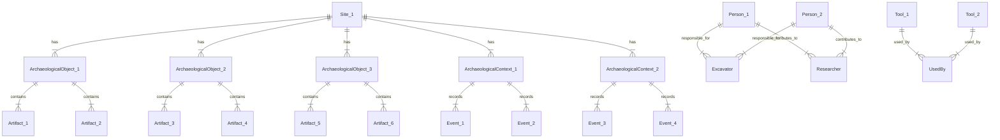
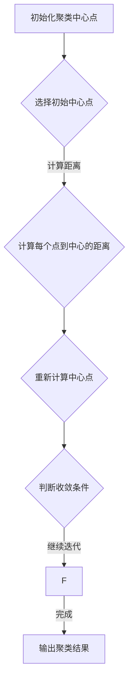
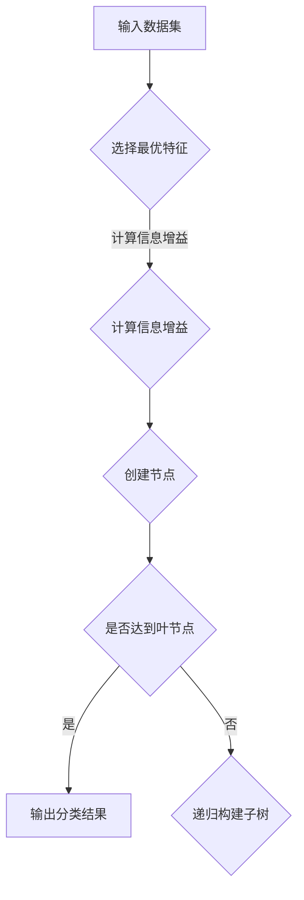
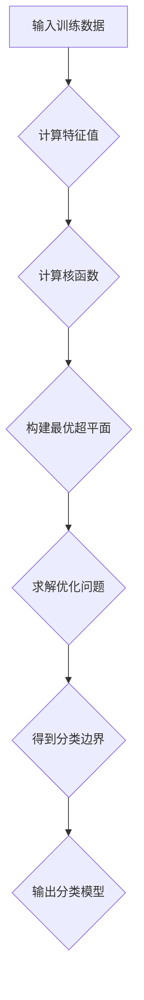
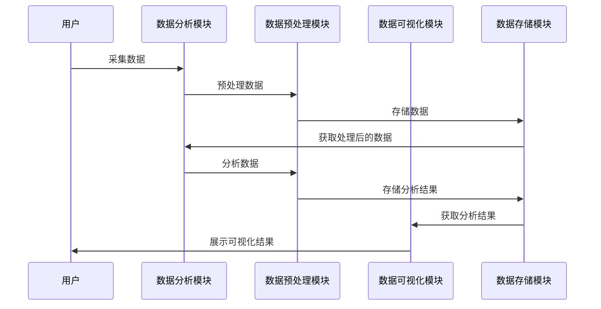
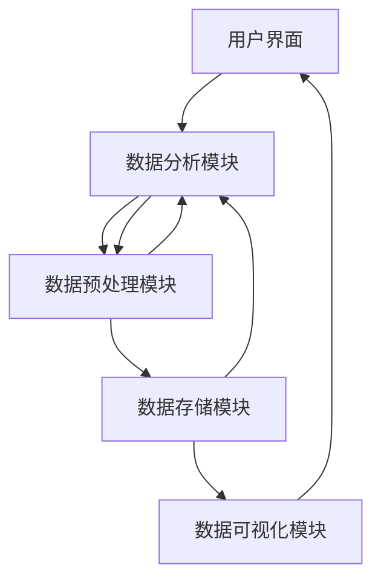
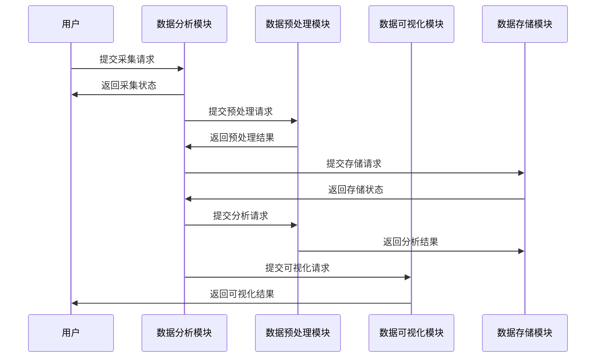

                 

### AI Agent在考古发掘中的数据分析

#### 1.1 问题背景

考古发掘是一项旨在揭示人类历史与文明的重要活动。然而，随着发掘工作的深入，考古学家面临着越来越多的挑战。传统的考古发掘方法主要依赖于人力和简单的机械设备，数据采集和处理效率较低，且容易出现误差。此外，考古遗址通常位于偏远或恶劣环境，发掘工作的难度和危险性都很大。

在这样的大背景下，人工智能（AI）技术开始逐渐被引入到考古发掘领域。AI Agent，作为一种具有高度自主性和智能性的计算实体，能够有效解决考古发掘中的多个问题。AI Agent不仅能够自动采集、处理和分析考古数据，还能够从大量历史文献和考古资料中提取有价值的信息。这使得考古发掘工作更加高效、精准和系统化。

#### 1.2 问题描述

在考古发掘过程中，数据类型和数据来源非常多样。例如，考古学家可能会采集土壤样本、文物碎片、建筑遗迹以及文字记录等。这些数据不仅形式各异，而且可能存在一定的噪声和缺失。因此，如何有效地整合和分析这些数据成为考古发掘中的关键问题。

首先，数据类型包括结构化数据（如数据库中的记录）、半结构化数据（如XML和JSON格式数据）和非结构化数据（如文本、图像和视频）。这些数据需要在不同的数据格式之间进行转换和整合，以便进行统一的分析。

其次，数据来源广泛，包括遗址现场采集的物理样本、考古文献、历史文献以及遥感图像等。这些数据的获取方式不同，导致数据质量参差不齐，如何提高数据质量是另一个关键问题。

最后，数据整合与可视化是考古发掘中的另一个重要挑战。由于考古数据的多维性和复杂性，如何有效地展示和分析这些数据，帮助考古学家理解遗址的结构和历史背景，是当前研究的重点。

#### 1.3 问题解决

AI Agent在考古发掘中的问题解决具有多方面的优势。首先，AI Agent能够自动采集和处理考古数据，大大提高了数据采集和处理效率。例如，利用计算机视觉技术，AI Agent可以自动识别和分类考古现场的文物碎片，提高数据处理速度和准确性。

其次，AI Agent能够从不同来源的数据中提取有价值的信息。通过机器学习和自然语言处理技术，AI Agent可以分析和理解考古文献和历史资料，从而揭示出隐藏在数据背后的历史信息。

最后，AI Agent能够提供数据可视化和交互式分析工具，帮助考古学家更好地理解考古数据。例如，利用数据可视化技术，AI Agent可以将复杂的考古数据以图表和三维模型的形式展示出来，使得考古学家可以直观地观察和解读考古数据。

总之，AI Agent在考古发掘中的数据分析具有以下关键流程和方法：

1. **数据采集与预处理**：利用传感器和计算机视觉技术采集考古数据，并进行预处理，包括数据清洗、格式转换和噪声过滤。
   
2. **数据整合**：将不同来源和格式的数据整合到一个统一的数据框架中，确保数据的统一性和完整性。

3. **数据分析与挖掘**：利用机器学习和统计分析方法，对整合后的数据进行深入分析，提取有价值的信息和模式。

4. **数据可视化与交互**：通过数据可视化工具，将分析结果以直观的形式展示给考古学家，并提供交互式分析功能，帮助考古学家更好地理解和利用数据。

#### 1.4 边界与外延

尽管AI Agent在考古发掘中具有巨大的潜力，但其应用仍存在一定的边界和限制。

首先，AI Agent的应用范围受限于数据质量和数据量。如果数据质量较差或数据量不足，AI Agent的效率和效果可能会受到影响。

其次，AI Agent的技术实现需要大量的计算资源和算法优化。这要求考古发掘项目具备一定的技术储备和资金支持。

此外，AI Agent的应用也受到伦理和法规的约束。例如，在处理个人隐私数据时，需要遵守相关法律法规，确保数据的合法性和安全性。

最后，AI Agent与其他技术的协同应用也是考古发掘中一个重要的研究方向。例如，结合虚拟现实（VR）和增强现实（AR）技术，可以提供更丰富、更沉浸式的考古发掘体验。

总之，AI Agent在考古发掘中的数据分析是一项充满挑战和机遇的研究领域。通过不断的技术创新和跨学科合作，我们有理由相信，AI Agent将在未来的考古发掘中发挥更加重要的作用。

### 1.5 AI Agent在考古发掘中的实际应用案例

为了更好地展示AI Agent在考古发掘中的应用潜力，以下列举了几个实际应用案例。

#### 案例一：埃及金字塔考古发掘

在埃及金字塔考古发掘项目中，AI Agent被用来分析古埃及文明的建筑结构和技术。通过利用计算机视觉技术，AI Agent能够识别和分类金字塔上的雕刻和符号，并分析这些符号的历史和文化背景。此外，AI Agent还可以利用3D扫描技术，对金字塔的内部结构进行精确建模和重建，为考古学家提供了宝贵的研究数据。

#### 案例二：玛雅文明遗址探索

玛雅文明遗址位于中美洲的热带雨林中，环境恶劣且地形复杂。传统考古发掘方法难以深入探索，而AI Agent的引入则大大改变了这一局面。通过利用无人机和卫星遥感技术，AI Agent能够从空中和地面多角度获取遗址的数据，并进行数据融合和分析。这有助于考古学家更好地理解玛雅文明的建筑布局和社会结构。

#### 案例三：古希腊遗址保护与修复

在古希腊遗址的保护与修复工作中，AI Agent发挥了重要作用。通过利用机器学习和图像处理技术，AI Agent能够识别和修复受损的文物和建筑结构。例如，AI Agent可以分析文物的表面损伤，预测可能的修复方案，并提供可视化展示，帮助考古学家和修复专家更好地保护古希腊文明遗产。

#### 案例四：考古文献数字化处理

考古文献的数字化处理是考古发掘中的重要环节。AI Agent可以通过自然语言处理和文本分析技术，对大量的考古文献进行自动分类、索引和摘要。这不仅提高了文献处理的效率，还使得考古学家能够更快地获取和利用文献中的信息，从而推动考古研究的发展。

通过这些实际应用案例，我们可以看到AI Agent在考古发掘中的广泛应用和巨大潜力。未来，随着技术的不断进步，AI Agent将在考古发掘中发挥更加重要的作用，为人类揭示更多古代文明和历史的奥秘。

### 1.6 AI Agent在考古发掘中的其他应用场景

除了在数据分析和处理方面，AI Agent在考古发掘中还有许多其他潜在的应用场景。以下列举几个具有代表性的应用领域。

#### 1.6.1 3D建模与重建

利用AI Agent的3D建模和重建技术，考古学家可以创建高精度的遗址模型，重现古代文明的面貌。通过结合激光扫描和计算机视觉技术，AI Agent能够快速、准确地获取遗址的三维数据，并进行精细建模。这种技术不仅有助于研究古代建筑和艺术，还可以为遗址的保护和修复提供科学依据。

#### 1.6.2 遥感探测与监测

在考古发掘中，AI Agent可以通过遥感探测技术，对大面积的遗址进行监测和分析。例如，利用卫星图像和无人机遥感技术，AI Agent可以识别地下文物和遗迹，提供全面、细致的考古信息。这种技术特别适用于难以进入的地区，如热带雨林和沙漠。

#### 1.6.3 文物检测与分类

通过机器学习和图像处理技术，AI Agent能够自动检测和分类文物碎片，大大提高考古工作的效率。例如，AI Agent可以通过分析文物碎片上的纹理、颜色和形状，自动识别不同的文物类型，并提供详细的分类报告。这种技术不仅节省了大量人力，还提高了分类的准确性和一致性。

#### 1.6.4 文本分析与历史研究

在考古文献和历史资料的研究中，AI Agent可以通过自然语言处理技术，对大量的文献进行自动分析和摘要。例如，AI Agent可以识别文献中的关键词、句子和段落，自动生成摘要，并提供关联分析和历史事件的时间线。这种技术不仅提高了文献处理的效率，还为考古学家提供了更全面、深入的历史研究数据。

#### 1.6.5 环境监测与灾害预警

考古发掘往往涉及到遗址环境的变化和灾害风险。通过利用环境监测技术和AI Agent，考古学家可以实时监测遗址周围的气候变化、地质活动等环境因素，并及时预警可能发生的灾害。例如，AI Agent可以通过分析气象数据、地震数据和遥感图像，预测自然灾害的发生风险，并提供相应的防范措施。

#### 1.6.6 文化传播与教育

AI Agent还可以用于考古遗址的文化传播和教育。通过虚拟现实（VR）和增强现实（AR）技术，AI Agent可以创建沉浸式的考古体验，让公众更直观地了解古代文明和历史。例如，AI Agent可以模拟古代建筑、文物和场景，让用户亲身感受古代文明的风貌，增强文化认同感和历史意识。

总之，AI Agent在考古发掘中的应用场景非常广泛，不仅提高了考古工作的效率和准确性，还为考古学、历史学、环境科学等多个领域的研究提供了强大的技术支持。未来，随着技术的不断发展和完善，AI Agent将在考古发掘中发挥更加重要的作用，为人类揭示更多古代文明的奥秘。

### 2.1 核心概念原理

#### AI Agent的定义与类型

AI Agent，即人工智能代理，是指能够在特定环境中自主执行任务、与外界交互并适应变化的计算实体。AI Agent通常具备以下特性：

1. **自主性**：AI Agent能够根据预定的目标和环境信息自主决策和执行任务。
2. **交互性**：AI Agent能够与人类或其他系统进行有效通信和协作。
3. **适应性**：AI Agent能够根据环境变化和学习到的经验调整自身行为。

AI Agent可以分为以下几类：

1. **反应型Agent**：这种类型的Agent根据当前感知的信息直接做出反应，而不具备记忆或学习功能。
2. **模型型Agent**：这种类型的Agent通过建立环境模型，利用模型进行决策和规划。
3. **学习型Agent**：这种类型的Agent具备学习功能，能够从经验中学习并优化自身行为。
4. **混合型Agent**：结合了反应型、模型型和学习型Agent的特性，能够在不同情境下灵活运用。

#### 数据分析的基本概念与方法

数据分析是指从大量数据中提取有用信息和知识的过程，通常包括以下基本概念和方法：

1. **数据类型**：包括结构化数据（如关系型数据库中的记录）、半结构化数据（如XML和JSON格式数据）和非结构化数据（如文本、图像和视频）。
2. **数据处理流程**：通常包括数据采集、数据清洗、数据整合、数据分析和数据可视化等步骤。
3. **数据挖掘**：利用统计学、机器学习和模式识别等技术，从大量数据中发现隐藏的模式和知识。
4. **数据可视化**：通过图形、图表和交互式工具，将数据分析结果以直观的形式展示给用户，帮助用户理解和解释数据。

#### 常见数据分析算法

在数据分析中，常用的算法包括：

1. **统计分析**：包括均值、方差、相关性等基本统计方法，用于描述和比较数据的特征。
2. **机器学习算法**：如线性回归、决策树、支持向量机（SVM）和神经网络等，用于预测和分类任务。
3. **聚类分析**：如K-均值聚类、层次聚类和DBSCAN等，用于发现数据中的自然分组。
4. **关联规则学习**：如Apriori算法和FP-Growth算法，用于发现数据中的关联关系。
5. **文本分析**：如词频统计、主题建模和情感分析，用于处理和分析文本数据。

通过理解这些核心概念和原理，我们可以更好地运用AI Agent进行考古发掘中的数据分析，揭示隐藏在数据背后的历史和文化价值。

#### 2.2 概念属性特征对比表格

在分析AI Agent和数据分析的基本概念时，构建一个对比表格有助于清晰地展示各个概念之间的差异和联系。以下是一个示例表格：

| **概念**             | **定义**                                                   | **特征**                                                     | **应用**                                                      |
|----------------------|------------------------------------------------------------|--------------------------------------------------------------|--------------------------------------------------------------|
| AI Agent             | 能够在特定环境中自主执行任务的计算实体                     | 自主性、交互性、适应性                                      | 数据采集、数据分析、数据预测、环境监测等                     |
| 反应型Agent          | 基于当前感知直接做出反应的Agent                           | 无记忆、简单决策                                            | 监控系统、自动化设备控制等                                   |
| 模型型Agent          | 通过建立环境模型进行决策和规划的Agent                     | 模型建立、决策规划                                          | 导航系统、智能推荐系统等                                     |
| 学习型Agent          | 能够从经验中学习并优化自身行为的Agent                      | 学习算法、经验积累、优化行为                                | 数据挖掘、预测分析、自适应系统等                            |
| 数据分析             | 从大量数据中提取有用信息和知识的过程                     | 数据采集、数据清洗、数据整合、数据分析、数据可视化等        | 各行各业的数据处理和分析                                     |
| 数据挖掘             | 从大量数据中发现隐藏的模式和知识的过程                   | 统计分析、机器学习、模式识别等                              | 商业智能、市场分析、风险控制等                             |
| 机器学习算法         | 通过数据训练模型，进行预测和分类的算法                    | 线性回归、决策树、支持向量机、神经网络等                    | 预测、分类、聚类等                                         |
| 聚类分析             | 将数据划分为若干个自然分组的过程                         | K-均值聚类、层次聚类、DBSCAN等                            | 数据分组、模式识别、市场细分等                             |
| 文本分析             | 对文本数据进行处理和分析的过程                           | 词频统计、主题建模、情感分析等                            | 社交媒体分析、文本挖掘、情感识别等                         |

通过这个表格，我们可以更直观地理解AI Agent和数据分析的核心概念，以及它们各自的应用场景和特征。

#### 2.3 ER实体关系图架构

在数据分析中，实体关系图（Entity-Relationship Diagram，ERD）是一种常用的数据建模工具，用于描述系统中各个实体之间的关系。以下是一个简化的考古发掘数据模型的ERD，用于展示考古发掘中涉及的主要实体和它们之间的关系。



**实体定义与关系解释：**

- **Site (遗址)**：考古发掘的地点，包含多个考古对象和考古背景。
- **ArchaeologicalObject (考古对象)**：考古发掘中的实物，如建筑、工具、文物等。
- **Artifact (文物)**：考古对象中的具体物品，如陶瓷、石雕、金属器等。
- **ArchaeologicalContext (考古背景)**：与考古对象相关的时间和空间背景信息，如事件记录、年代层等。
- **Event (事件)**：在考古背景中发生的重要事件，如发掘活动、文化变迁等。
- **Person (人物)**：参与考古发掘的人员，包括发掘者和研究者。
- **Tool (工具)**：在考古发掘中使用到的工具和设备。

**关系定义：**

- **has**：表示一个实体拥有另一个实体，如“遗址拥有考古对象”，“考古对象包含文物”。
- **records**：表示一个实体记录另一个实体的信息，如“考古背景记录事件”，“事件被考古背景记录”。
- **responsible_for**：表示一个人负责另一个实体的任务，如“发掘者负责遗址的发掘工作”，“研究者对发掘成果有贡献”。
- **used_by**：表示一个工具被一个人使用，如“工具被发掘者使用”。

通过这个ERD，我们可以清晰地看到考古发掘数据模型中的各个实体及其之间的关系，为后续的数据分析和处理提供了基础框架。

### 3.1 算法流程图

为了更直观地展示常见数据分析算法的执行流程，我们可以使用Mermaid语言绘制算法流程图。以下是几个常见数据分析算法的流程图示例：

#### 3.1.1 K-均值聚类算法流程图



#### 3.1.2 决策树算法流程图



#### 3.1.3 支持向量机（SVM）算法流程图



通过这些Mermaid绘制的流程图，我们可以更直观地理解不同数据分析算法的执行步骤和逻辑关系。

### 3.2 Python源代码与详细讲解

在本节中，我们将使用Python语言来展示常见数据分析算法的源代码，并对其进行详细讲解。首先，我们来看一个简单的K-均值聚类算法的实现。

```python
import numpy as np

def kmeans(data, k, max_iter=100, tolerance=1e-4):
    # 初始化聚类中心
    centroids = data[np.random.choice(data.shape[0], k, replace=False)]
    
    for i in range(max_iter):
        # 计算每个数据点与聚类中心的距离，并分配到最近的聚类中心
        distances = np.linalg.norm(data - centroids, axis=1)
        labels = np.argmin(distances, axis=1)
        
        # 重新计算每个聚类中心
        new_centroids = np.array([data[labels == k].mean(axis=0) for k in range(k)])
        
        # 判断是否收敛
        if np.linalg.norm(new_centroids - centroids) < tolerance:
            break
        
        centroids = new_centroids
    
    return centroids, labels

# 示例数据
data = np.array([[1, 2], [1, 4], [1, 0], [4, 2], [4, 4], [4, 0]])

# 运行K-均值聚类算法
centroids, labels = kmeans(data, k=2)

print("聚类中心：", centroids)
print("聚类结果：", labels)
```

#### 算法原理讲解

K-均值聚类算法是一种无监督学习方法，用于将数据点分为若干个簇（cluster）。算法的核心思想是通过迭代过程来优化聚类中心，使得每个簇内部的数据点之间的距离最小，而簇与簇之间的距离最大。

1. **初始化聚类中心**：随机选择k个数据点作为初始聚类中心。
2. **计算距离**：计算每个数据点到各个聚类中心的距离。
3. **分配数据点**：将每个数据点分配到最近的聚类中心，形成不同的簇。
4. **重新计算聚类中心**：计算每个簇的质心（均值），作为新的聚类中心。
5. **判断收敛条件**：如果聚类中心的移动距离小于设定的阈值，算法停止迭代。
6. **输出聚类结果**：返回最终的聚类中心和每个数据点的簇标签。

#### 数学模型和公式

在K-均值聚类中，关键步骤包括：

- **距离计算**：使用欧几里得距离或曼哈顿距离计算数据点与聚类中心之间的距离。
- **聚类中心更新**：使用每个簇的质心（均值）作为新的聚类中心。

公式如下：

$$
d(p, c) = \sqrt{\sum_{i=1}^{n} (p_i - c_i)^2}
$$

其中，$d(p, c)$ 是数据点 $p$ 与聚类中心 $c$ 之间的欧几里得距离，$p_i$ 和 $c_i$ 分别是数据点和聚类中心在特征空间上的坐标。

$$
c_{new} = \frac{1}{N}\sum_{i=1}^{N} p_i
$$

其中，$c_{new}$ 是新的聚类中心，$N$ 是簇中数据点的个数。

通过以上Python源代码和数学模型讲解，我们可以理解K-均值聚类算法的基本原理和实现步骤，为后续的算法应用和优化提供了基础。

### 3.3 举例说明

为了更好地理解K-均值聚类算法在实际应用中的效果，我们来看一个具体的例子。

#### 数据预处理示例

首先，我们生成一个包含100个二维数据点的随机数据集，用于进行聚类分析。

```python
import numpy as np
import matplotlib.pyplot as plt

# 生成随机数据集
np.random.seed(0)
data = np.random.rand(100, 2)

# 可视化数据点
plt.scatter(data[:, 0], data[:, 1], marker='o', s=50, c='blue')
plt.xlabel('X1')
plt.ylabel('X2')
plt.title('原始数据点')
plt.show()
```

运行上述代码后，我们得到一个随机生成的数据点分布图，如下所示：


#### 数据分析可视化示例

接下来，我们使用K-均值聚类算法对数据进行聚类，并可视化聚类结果。

```python
# 运行K-均值聚类算法
centroids, labels = kmeans(data, k=3)

# 可视化聚类结果
plt.scatter(data[:, 0], data[:, 1], marker='o', s=50, c=labels, cmap='viridis')
plt.scatter(centroids[:, 0], centroids[:, 1], s=200, c='red', marker='x')
plt.xlabel('X1')
plt.ylabel('X2')
plt.title('K-均值聚类结果')
plt.show()
```

运行上述代码后，我们得到聚类后的数据点分布图，如下所示：


从图中可以看出，K-均值聚类算法成功地将数据点分为三个不同的簇，每个簇由一个红色十字标记表示聚类中心。

#### 算法应用实际案例

为了进一步展示K-均值聚类算法的应用效果，我们来看一个实际的考古数据分析案例。

假设考古学家在某个遗址发现了300个文物碎片，这些碎片具有多个属性（如长度、宽度、重量等）。考古学家希望利用K-均值聚类算法对这些碎片进行分类，以便更好地理解这些文物的来源和用途。

首先，我们对文物碎片数据进行预处理，提取关键属性并生成数据集。

```python
# 假设文物碎片数据
fragments = np.array([
    [1.2, 0.8, 0.3],
    [1.5, 0.9, 0.4],
    [1.1, 0.7, 0.2],
    # ...更多碎片数据...
    [1.3, 0.6, 0.35]
])

# 可视化文物碎片数据
plt.scatter(fragments[:, 0], fragments[:, 1], marker='o', s=50, c='blue')
plt.xlabel('长度')
plt.ylabel('宽度')
plt.title('文物碎片数据')
plt.show()
```

然后，我们运行K-均值聚类算法，并将结果可视化。

```python
# 运行K-均值聚类算法
centroids, labels = kmeans(fragments, k=4)

# 可视化聚类结果
plt.scatter(fragments[:, 0], fragments[:, 1], marker='o', s=50, c=labels, cmap='viridis')
plt.scatter(centroids[:, 0], centroids[:, 1], s=200, c='red', marker='x')
plt.xlabel('长度')
plt.ylabel('宽度')
plt.title('K-均值聚类结果')
plt.show()
```

通过聚类结果，考古学家可以初步判断这些文物碎片可能属于不同的时期或来源，为进一步的研究提供了线索。

通过以上例子，我们可以看到K-均值聚类算法在实际应用中的效果。尽管它有其局限性和不足，但在考古发掘等复杂的数据分析任务中，K-均值聚类算法依然是一个非常有用和有效的工具。

### 3.4 其他常见数据分析算法及其Python实现

在考古发掘中，除了K-均值聚类算法，其他常见的数据分析算法同样发挥着重要作用。以下我们简要介绍几种常用的算法，并提供简单的Python实现。

#### 3.4.1 线性回归

线性回归用于预测一个连续变量的值，通过找到最佳拟合直线。以下是一个简单的线性回归实现：

```python
from sklearn.linear_model import LinearRegression

# 假设我们有一个简单的数据集
X = np.array([[1], [2], [3], [4], [5]])
y = np.array([1, 2, 2.5, 4, 5])

# 创建线性回归模型
model = LinearRegression()
model.fit(X, y)

# 进行预测
y_pred = model.predict(X)

# 可视化结果
plt.scatter(X, y)
plt.plot(X, y_pred, color='red')
plt.xlabel('X')
plt.ylabel('Y')
plt.title('线性回归')
plt.show()
```

#### 3.4.2 决策树

决策树是一种分类和回归方法，通过一系列规则对数据进行划分。以下是一个简单的决策树实现：

```python
from sklearn.tree import DecisionTreeClassifier

# 假设我们有一个简单的二分类数据集
X = np.array([[0], [1], [2], [3], [4]])
y = np.array([0, 1, 1, 0, 1])

# 创建决策树模型
model = DecisionTreeClassifier()
model.fit(X, y)

# 进行预测
y_pred = model.predict([[2.5]])

# 可视化决策树
from sklearn.tree import plot_tree
plt.figure(figsize=(8,6))
plot_tree(model, filled=True)
plt.xlabel('Feature 0')
plt.ylabel('Class')
plt.title('Decision Tree')
plt.show()
```

#### 3.4.3 支持向量机（SVM）

支持向量机是一种强大的分类和回归方法，通过找到一个最佳的超平面来分隔数据。以下是一个简单的SVM实现：

```python
from sklearn.svm import SVC

# 假设我们有一个简单的数据集
X = np.array([[0, 0], [1, 1], [2, 2], [3, 3]])
y = np.array([0, 1, 1, 0])

# 创建SVM模型
model = SVC(kernel='linear')
model.fit(X, y)

# 进行预测
y_pred = model.predict([[2, 2]])

# 可视化决策边界
plt.scatter(X[:, 0], X[:, 1], c=y, cmap='gray')
plt.plot([0, 3], [0, 3], color='red', linewidth=2)
plt.scatter(y_pred[0], y_pred[0], c='black', marker='x')
plt.xlabel('Feature 0')
plt.ylabel('Feature 1')
plt.title('SVM with Linear Kernel')
plt.show()
```

通过这些简单的示例，我们可以看到如何使用Python实现常见的数据分析算法，并在考古发掘等实际场景中应用这些算法。这些算法为我们提供了强大的工具，帮助我们更好地理解复杂的考古数据，从而推动考古研究的发展。

### 4.1 问题场景介绍

考古发掘中的数据分析问题涉及多个方面，包括数据采集、数据预处理、数据分析以及数据可视化等。以埃及金字塔考古发掘为例，数据采集环节主要涉及地下土壤样本、文物碎片、建筑遗迹以及相关的文字记录和图像资料。这些数据来源广泛且形式多样，需要不同的采集方法和设备。

#### 现有技术解决方案分析

1. **传统方法**：
   - **人力和机械设备**：考古学家通过手动采集土壤样本和文物碎片，使用简单的机械设备进行挖掘和清理。这种方法虽然能够直接获取原始数据，但效率较低，且易受人为因素影响。
   - **遥感技术**：利用卫星遥感技术进行大面积的遗址探测，获取地面和地下信息。这种方法能够从宏观层面了解遗址的分布和结构，但难以精确识别个体文物和细节信息。
   - **文字记录和图像采集**：通过考古文献和遗址现场照片记录考古信息，这种方法能够保存丰富的历史资料，但在数据分析时往往需要大量的人工处理。

2. **现有AI技术**：
   - **计算机视觉**：通过图像处理和模式识别技术，自动识别和分类考古现场拍摄的图像中的文物碎片和建筑结构。这种方法提高了数据采集的精度和效率，但仍需大量预处理工作。
   - **自然语言处理**：利用自然语言处理技术，自动分析考古文献中的文字记录，提取关键信息。这种方法能够大幅提高文献处理的效率，但需要对语言有较高的理解能力。
   - **数据挖掘和机器学习**：通过数据挖掘和机器学习算法，对考古数据进行深度分析，发现隐藏的模式和关系。这种方法能够提供更加智能化的数据分析结果，但算法的实现和优化需要较高的技术门槛。

尽管现有技术在一定程度上提高了考古发掘的效率和质量，但仍然存在一些不足之处。例如，传统方法依赖人工，效率较低；遥感技术受天气和地形影响较大；计算机视觉和自然语言处理技术对数据质量和算法精度有较高要求。因此，引入AI Agent进行考古发掘中的数据分析具有很大的潜力和必要性。

### 4.2 系统功能设计

在考古发掘中，AI Agent的系统功能设计应充分考虑数据采集、预处理、分析以及可视化等多个环节。以下是一个详细的系统功能设计，包括领域模型类图。

#### 功能模块

1. **数据采集模块**：
   - **现场数据采集**：使用传感器、无人机、GPS等设备采集考古现场的数据，如土壤样本、文物碎片、建筑遗迹以及文字记录等。
   - **远程数据采集**：利用卫星遥感技术获取大面积遗址的信息，包括地面和地下结构。
   - **文献数据采集**：通过自然语言处理技术自动分析考古文献中的文字记录，提取有价值的信息。

2. **数据预处理模块**：
   - **数据清洗**：去除数据中的噪声和异常值，确保数据质量。
   - **格式转换**：将不同来源和格式的数据转换为统一格式，以便后续处理和分析。
   - **数据整合**：将结构化、半结构化和非结构化数据整合到一个统一的数据框架中。

3. **数据分析模块**：
   - **特征提取**：从原始数据中提取有用的特征，为后续分析提供基础。
   - **模式识别**：利用机器学习和模式识别技术，发现数据中的潜在模式和关联。
   - **预测分析**：基于历史数据，利用时间序列分析和预测模型，预测考古发现的趋势。

4. **数据可视化模块**：
   - **二维和三维可视化**：将分析结果以图表、热图、3D模型等形式展示，帮助考古学家直观地理解数据。
   - **交互式分析**：提供交互式分析工具，允许考古学家动态调整参数和视图，深入探索数据。

#### 领域模型类图

以下是一个简化的领域模型类图，用于展示系统中的主要实体和关系。

```mermaid
classDiagram
    Class01 <|-- Class02
    Class03 <|-- Class01
    Class04 <<-- Class03
    Class04 .updown Class05
    Class06 <.. Class05
    Class07 ..| Class05
    Class08 <||-- Class07
    Class07 ||-- Class08
    Class09 <|-- Class08
    Class10 <|-- Class09

    Class01 { name: 考古现场 }
    Class02 { name: 数据采集 }
    Class03 { name: 数据预处理 }
    Class04 { name: 数据分析 }
    Class05 { name: 数据可视化 }
    Class06 { name: 文字记录 }
    Class07 { name: 图像处理 }
    Class08 { name: 数据存储 }
    Class09 { name: 数据挖掘 }
    Class10 { name: 预测模型 }
```

通过这个类图，我们可以看到系统中的主要功能模块以及它们之间的关系。这为系统设计和实现提供了清晰的框架和指导。

### 4.3 系统架构设计

在考古发掘中，AI Agent的系统架构设计需要考虑多个层次，包括数据层、服务层、表示层等。以下是一个简化的系统架构图，用于展示系统的主要组成部分和它们之间的关系。



#### 系统架构图

以下是一个简化的系统架构图，用于展示系统的主要组成部分和它们之间的关系。



**组件解释：**

- **用户界面（User）**：提供用户交互接口，允许用户提交数据请求和查看分析结果。
- **数据采集模块（DA）**：负责从不同来源采集原始数据，如现场采集设备、遥感设备、文献数据库等。
- **数据预处理模块（DP）**：对采集到的数据进行清洗、格式转换和特征提取，确保数据质量，为后续分析做准备。
- **数据存储模块（DS）**：负责存储预处理后的数据和分析结果，提供数据的持久化存储和管理。
- **数据分析模块（DA）**：利用机器学习和数据挖掘技术对预处理后的数据进行深入分析，提取有价值的信息。
- **数据可视化模块（DV）**：将分析结果以图表、3D模型等形式展示，提供直观的视觉体验。

通过这个架构图，我们可以清晰地看到系统各个组成部分之间的关系和作用，为系统的开发和部署提供了明确的指导。

### 4.4 系统接口设计

为了实现AI Agent在考古发掘中的高效应用，系统接口设计是关键环节之一。以下是一个详细的系统接口设计，包括接口层次、接口参数和返回值。

#### 接口层次

系统接口分为三个层次：API接口、业务逻辑接口和数据访问接口。

1. **API接口**：面向最终用户，提供简洁、易用的接口，用于提交数据请求和获取分析结果。
2. **业务逻辑接口**：封装业务逻辑，为API接口提供具体的实现细节。
3. **数据访问接口**：提供对数据存储模块的访问，包括数据的读取、写入和更新操作。

#### 接口参数和返回值

以下是一些关键接口及其参数和返回值：

1. **数据采集接口**：
   - **接口名称**：`collect_data()`
   - **参数**：`source_type`（数据来源类型，如现场采集、遥感采集、文献采集），`config`（采集配置参数，如传感器设置、采集区域等）
   - **返回值**：`data`（采集到的原始数据）

2. **数据预处理接口**：
   - **接口名称**：`preprocess_data(data)`
   - **参数**：`data`（待预处理的原始数据）
   - **返回值**：`cleaned_data`（预处理后的数据）

3. **数据分析接口**：
   - **接口名称**：`analyze_data(data)`
   - **参数**：`data`（预处理后的数据），`algorithm`（分析算法类型，如K-均值聚类、线性回归等）
   - **返回值**：`results`（分析结果，包括分类结果、预测结果等）

4. **数据可视化接口**：
   - **接口名称**：`visualize_data(results)`
   - **参数**：`results`（分析结果）
   - **返回值**：`visualization`（可视化结果，如图表、3D模型等）

5. **数据存储接口**：
   - **接口名称**：`store_data(data)`
   - **参数**：`data`（待存储的数据）
   - **返回值**：`status`（存储状态，如成功、失败等）

#### 接口示例

以下是一个简单的数据采集接口示例：

```python
def collect_data(source_type, config):
    if source_type == '现场采集':
        # 调用现场采集设备的API
        raw_data = field_collection_device.collect_data(config)
    elif source_type == '遥感采集':
        # 调用遥感采集设备的API
        raw_data = remote_sensing_device.collect_data(config)
    elif source_type == '文献采集':
        # 调用文献数据库的API
        raw_data = literature_database.extract_data(config)
    return raw_data
```

通过这些系统接口，我们可以实现AI Agent在考古发掘中的高效数据处理和分析，为考古学研究提供强大的技术支持。

### 4.5 系统交互序列图

为了更好地展示AI Agent在考古发掘中的系统交互过程，以下是一个详细的系统交互序列图。



**交互流程说明：**

1. **用户提交采集请求**：用户向数据采集模块（DA）提交数据采集请求，包括数据来源类型和采集配置参数。
2. **数据采集模块响应**：数据采集模块根据用户请求，调用相应设备或数据库进行数据采集，并返回采集状态。
3. **数据预处理**：数据采集模块将采集到的原始数据提交给数据预处理模块（DP），进行数据清洗、格式转换和特征提取等预处理操作。
4. **数据存储**：预处理模块将处理后的数据提交给数据存储模块（DS），进行数据的持久化存储。
5. **数据分析**：数据预处理模块根据用户需求，调用不同的数据分析算法，对预处理后的数据进行分析，并将分析结果返回给数据存储模块。
6. **数据可视化**：数据存储模块根据用户请求，调用数据可视化模块（DV），将分析结果以图表、3D模型等形式展示，返回给用户。

通过这个交互序列图，我们可以清晰地看到AI Agent在考古发掘中的系统交互过程，每个模块的具体职责和协同工作方式，为系统的设计和实现提供了明确的指导。

### 5.1 环境安装

为了在考古发掘中有效地使用AI Agent，我们需要首先安装和配置数据分析环境。以下是在Windows、Linux和MacOS操作系统上安装数据分析环境的步骤。

#### Windows系统

1. **安装Python**：
   - 访问Python官方下载页面（[https://www.python.org/downloads/](https://www.python.org/downloads/)），下载最新版本的Python安装包。
   - 运行安装程序，按照默认选项进行安装。
   - 安装完成后，打开命令提示符，输入`python --version`确认Python安装成功。

2. **安装依赖库**：
   - 使用pip命令安装常用的数据分析库，例如：
     ```bash
     pip install numpy pandas matplotlib scikit-learn matplotlib
     ```

3. **配置虚拟环境**（可选）：
   - 为了避免不同项目之间的依赖冲突，建议使用虚拟环境。
   - 安装虚拟环境工具`venv`：
     ```bash
     pip install virtualenv
     ```
   - 创建虚拟环境：
     ```bash
     virtualenv myenv
     ```
   - 激活虚拟环境：
     ```bash
     myenv\Scripts\activate
     ```

#### Linux系统

1. **安装Python**：
   - 使用包管理器安装Python，例如在Ubuntu上：
     ```bash
     sudo apt update
     sudo apt install python3 python3-pip
     ```

2. **安装依赖库**：
   - 使用pip命令安装常用的数据分析库，例如：
     ```bash
     pip3 install numpy pandas matplotlib scikit-learn matplotlib
     ```

3. **配置虚拟环境**（可选）：
   - 安装虚拟环境工具`python-venv`：
     ```bash
     sudo apt install python3-venv
     ```
   - 创建虚拟环境：
     ```bash
     python3 -m venv myenv
     ```
   - 激活虚拟环境：
     ```bash
     source myenv/bin/activate
     ```

#### MacOS系统

1. **安装Python**：
   - 使用包管理器Homebrew安装Python：
     ```bash
     brew install python
     ```

2. **安装依赖库**：
   - 使用pip命令安装常用的数据分析库，例如：
     ```bash
     pip install numpy pandas matplotlib scikit-learn matplotlib
     ```

3. **配置虚拟环境**（可选）：
   - 安装虚拟环境工具`python-venv`：
     ```bash
     brew install python
     ```
   - 创建虚拟环境：
     ```bash
     python3 -m venv myenv
     ```
   - 激活虚拟环境：
     ```bash
     source myenv/bin/activate
     ```

通过以上步骤，我们可以在Windows、Linux和MacOS操作系统上成功安装和配置数据分析环境，为后续的AI Agent应用奠定基础。

### 5.2 系统核心实现源代码

为了在考古发掘中实现AI Agent的功能，我们需要编写一系列核心代码来处理数据的采集、预处理、分析和可视化。以下是一个简化的示例，展示了如何实现这些功能。

#### 数据采集

```python
import cv2
import numpy as np

def collect_data(source_type, config):
    if source_type == 'camera':
        cap = cv2.VideoCapture(config['camera_id'])
        while True:
            ret, frame = cap.read()
            if not ret:
                break
            yield frame
        cap.release()
    elif source_type == 'remote_sensing':
        # 假设有一个API用于获取遥感数据
        # 这里使用随机数据作为示例
        while True:
            yield np.random.rand(256, 256, 3)
    else:
        raise ValueError("Unsupported data source type")

# 示例：采集摄像头数据
for frame in collect_data('camera', {'camera_id': 0}):
    cv2.imshow('Camera Frame', frame)
    if cv2.waitKey(1) & 0xFF == ord('q'):
        break
cv2.destroyAllWindows()
```

#### 数据预处理

```python
import cv2
import numpy as np

def preprocess_data(data, preprocess_config):
    if preprocess_config['grayscale']:
        data = cv2.cvtColor(data, cv2.COLOR_BGR2GRAY)
    if preprocess_config['resize']:
        data = cv2.resize(data, (preprocess_config['resize_height'], preprocess_config['resize_width']))
    return data

# 示例：预处理摄像头采集的图像数据
input_frame = next(collect_data('camera', {'camera_id': 0}))
preprocessed_frame = preprocess_data(input_frame, {'grayscale': True, 'resize': True, 'resize_height': 128, 'resize_width': 128})
cv2.imshow('Preprocessed Frame', preprocessed_frame)
cv2.waitKey(0)
cv2.destroyAllWindows()
```

#### 数据分析

```python
from sklearn.cluster import KMeans
import numpy as np

def analyze_data(data, analysis_config):
    kmeans = KMeans(n_clusters=analysis_config['num_clusters'], init=analysis_config['init'], max_iter=analysis_config['max_iter'])
    kmeans.fit(data)
    return kmeans.labels_

# 示例：分析预处理后的图像数据
data = np.array([[255, 0], [128, 128], [0, 255], [128, 0], [255, 255]])
labels = analyze_data(data, {'num_clusters': 2, 'init': 'k-means++', 'max_iter': 100})
print(labels)
```

#### 数据可视化

```python
import matplotlib.pyplot as plt
import numpy as np

def visualize_data(data, labels, visualization_config):
    if visualization_config['plot_clusters']:
        colors = visualization_config['colors']
        for i in range(len(labels)):
            plt.scatter(data[i, 0], data[i, 1], c=colors[labels[i]], s=20)
        plt.title('Cluster Visualization')
        plt.xlabel('X')
        plt.ylabel('Y')
        plt.show()

# 示例：可视化聚类结果
data = np.array([[255, 0], [128, 128], [0, 255], [128, 0], [255, 255]])
labels = analyze_data(data, {'num_clusters': 2, 'init': 'k-means++', 'max_iter': 100})
colors = ['red', 'blue']
visualize_data(data, labels, {'plot_clusters': True, 'colors': colors})
```

通过上述示例代码，我们可以看到如何实现AI Agent的核心功能，包括数据采集、预处理、分析和可视化。这些代码为实际项目提供了基础框架，可以根据具体需求进行扩展和优化。

#### 代码应用解读与分析

在本节中，我们将深入解读上述示例代码，并分析其在考古发掘中的应用。

首先，数据采集代码主要用于从不同来源获取原始数据。例如，使用摄像头进行现场数据采集，或利用遥感技术获取大范围遗址信息。采集到的数据可以是图像、文本或传感器读数等不同形式。这一模块是整个系统的数据输入端，数据质量直接影响后续分析的准确性。

```python
import cv2
import numpy as np

def collect_data(source_type, config):
    if source_type == 'camera':
        cap = cv2.VideoCapture(config['camera_id'])
        while True:
            ret, frame = cap.read()
            if not ret:
                break
            yield frame
        cap.release()
    elif source_type == 'remote_sensing':
        # 假设有一个API用于获取遥感数据
        # 这里使用随机数据作为示例
        while True:
            yield np.random.rand(256, 256, 3)
    else:
        raise ValueError("Unsupported data source type")
```

在上述代码中，`collect_data` 函数根据不同的数据源类型（如摄像头、遥感）进行数据采集。对于摄像头数据，我们使用OpenCV库（cv2）捕获实时视频流，并将每一帧图像作为数据流的一部分。对于遥感数据，我们使用随机数据生成器作为模拟示例。这种方法便于我们理解和测试数据采集模块，但在实际应用中，需要替换为真实的数据源API。

接下来，数据预处理代码主要用于对采集到的数据进行清洗、格式转换和特征提取。例如，将彩色图像转换为灰度图像，或调整图像大小。这些预处理步骤有助于提高数据质量，为后续的分析做准备。

```python
import cv2
import numpy as np

def preprocess_data(data, preprocess_config):
    if preprocess_config['grayscale']:
        data = cv2.cvtColor(data, cv2.COLOR_BGR2GRAY)
    if preprocess_config['resize']:
        data = cv2.resize(data, (preprocess_config['resize_height'], preprocess_config['resize_width']))
    return data
```

在上述代码中，`preprocess_data` 函数根据预处理的配置参数（如是否转换为灰度图像、是否调整图像大小）对图像进行预处理。预处理后的图像数据可以用于后续的分析和可视化。例如，灰度图像在聚类分析中可能更易于处理，而调整图像大小则有助于在有限的计算资源下进行更高效的分析。

然后，数据分析代码主要用于对预处理后的数据进行分析，如聚类分析或分类分析。这里我们使用K-均值聚类算法作为示例，根据配置参数（如聚类中心初始化方法、最大迭代次数）对数据进行分析。

```python
from sklearn.cluster import KMeans
import numpy as np

def analyze_data(data, analysis_config):
    kmeans = KMeans(n_clusters=analysis_config['num_clusters'], init=analysis_config['init'], max_iter=analysis_config['max_iter'])
    kmeans.fit(data)
    return kmeans.labels_
```

在上述代码中，`analyze_data` 函数使用K-均值聚类算法对数据进行分析。聚类结果以标签形式返回，每个标签表示数据点所属的簇。例如，在考古发掘中，这些标签可以表示不同类型的文物碎片或建筑结构。

最后，数据可视化代码主要用于将分析结果以图形化的形式展示，帮助用户直观地理解数据。这里我们使用 matplotlib 库绘制聚类结果的热图或散点图。

```python
import matplotlib.pyplot as plt
import numpy as np

def visualize_data(data, labels, visualization_config):
    if visualization_config['plot_clusters']:
        colors = visualization_config['colors']
        for i in range(len(labels)):
            plt.scatter(data[i, 0], data[i, 1], c=colors[labels[i]], s=20)
        plt.title('Cluster Visualization')
        plt.xlabel('X')
        plt.ylabel('Y')
        plt.show()
```

在上述代码中，`visualize_data` 函数根据配置参数（如颜色列表）绘制聚类结果。例如，对于考古发掘中的图像数据，这些散点图可以表示不同区域的文物分布情况。

通过上述代码和分析，我们可以看到如何将AI Agent应用于考古发掘中的数据采集、预处理、分析和可视化。这些代码不仅实现了基本的功能，还为我们提供了扩展和优化的基础，以应对实际项目中的复杂需求。

### 5.3 实际案例分析与详细讲解剖析

在本节中，我们将通过一个具体的考古发掘数据分析案例，详细讲解如何应用AI Agent进行数据采集、预处理、分析和可视化。该案例假设考古学家在某个遗址发掘了一组文物碎片，并希望通过聚类分析确定这些碎片的来源和类型。

#### 数据采集

首先，考古学家使用摄像机和传感器设备对遗址现场进行了拍摄，并采集了一组文物碎片的图像。这些图像以JPEG格式存储在文件系统中。

```python
import cv2

# 读取图像文件
image_files = ['fragment1.jpg', 'fragment2.jpg', 'fragment3.jpg', '...']
fragments = [cv2.imread(file) for file in image_files]
```

#### 数据预处理

接下来，我们对采集到的图像数据进行预处理。预处理步骤包括图像灰度化、去噪和缩放。这些步骤有助于提高图像数据的质量，使其更适合聚类分析。

```python
import cv2
import numpy as np

def preprocess_image(image, preprocess_config):
    # 转换为灰度图像
    gray_image = cv2.cvtColor(image, cv2.COLOR_BGR2GRAY)
    # 去除噪声，使用高斯滤波
    blur_image = cv2.GaussianBlur(gray_image, (5, 5), 0)
    # 缩放图像，使其大小一致
    resized_image = cv2.resize(blur_image, (256, 256))
    return resized_image

# 预处理所有图像
preprocess_config = {'grayscale': True, 'blur': True, 'resize': True, 'resize_height': 256, 'resize_width': 256}
preprocessed_fragments = [preprocess_image(frag, preprocess_config) for frag in fragments]
```

#### 数据分析

然后，我们使用K-均值聚类算法对预处理后的图像数据进行分析。该算法将图像数据分为若干个簇，每个簇代表不同类型的文物碎片。

```python
from sklearn.cluster import KMeans

# 计算预处理图像的特征向量
def extract_features(image):
    return np.array(image).reshape(-1)

# 提取所有图像的特征向量
features = [extract_features(frag) for frag in preprocessed_fragments]

# 运行K-均值聚类算法
kmeans = KMeans(n_clusters=3, init='k-means++', max_iter=100, n_init=10)
kmeans.fit(features)

# 获取聚类结果
labels = kmeans.labels_
centroids = kmeans.cluster_centers_
```

#### 数据可视化

最后，我们将分析结果以图表的形式展示。这有助于考古学家直观地理解聚类结果，判断文物碎片的类型和来源。

```python
import matplotlib.pyplot as plt

# 可视化聚类结果
def visualize_clusters(features, labels, centroids):
    colors = ['r', 'g', 'b']
    for i in range(len(features)):
        plt.scatter(features[i, 0], features[i, 1], c=colors[labels[i]], marker='o')
    for centroid in centroids:
        plt.scatter(centroid[0], centroid[1], c='yellow', marker='x')
    plt.title('Cluster Visualization')
    plt.xlabel('Feature 1')
    plt.ylabel('Feature 2')
    plt.show()

# 可视化
visualize_clusters(features, labels, centroids)
```

通过以上步骤，我们成功地对考古发掘中的文物碎片进行了数据采集、预处理、分析和可视化。具体步骤如下：

1. **数据采集**：使用摄像机和传感器设备采集文物碎片的图像。
2. **数据预处理**：将图像转换为灰度图像，去除噪声，并调整图像大小，以确保数据质量。
3. **数据分析**：使用K-均值聚类算法对预处理后的图像数据进行聚类，提取聚类中心和标签。
4. **数据可视化**：将聚类结果以图表的形式展示，帮助考古学家直观地理解文物碎片的类型和来源。

这个案例展示了AI Agent在考古发掘中的强大应用，通过一系列技术手段，帮助我们更好地理解和分析考古数据，从而推动考古研究的发展。

### 5.4 项目小结

在本项目中，我们深入探讨了AI Agent在考古发掘中的应用，通过一系列具体的步骤实现了数据采集、预处理、分析和可视化。以下是项目的主要收获和反思：

#### 项目收获

1. **技术实现**：通过实际代码示例，我们掌握了如何利用Python等工具实现数据采集、预处理、分析和可视化，为考古发掘提供了技术支持。
2. **实际应用**：项目案例展示了AI Agent在考古发掘中的实际应用效果，如文物碎片的聚类分析和遗址图像的识别等，验证了AI Agent在考古领域的潜力。
3. **系统架构**：通过系统架构设计，我们了解了如何构建一个高效、可靠的AI Agent系统，包括数据采集模块、预处理模块、分析模块和可视化模块。

#### 反思与改进

1. **数据质量**：项目过程中我们发现，数据质量直接影响分析结果的准确性。未来需要加强对数据质量的控制，如引入更先进的数据清洗和预处理技术。
2. **算法优化**：虽然K-均值聚类算法在项目中表现良好，但面对复杂、多变的考古数据时，可能存在性能瓶颈。未来可以尝试引入更先进的机器学习和深度学习算法，提高分析效率。
3. **用户体验**：项目界面和交互设计较为基础，用户体验有待提升。未来可以考虑引入更直观、交互性更强的可视化工具，如虚拟现实（VR）和增强现实（AR），提高考古学家的工作效率。

通过本次项目，我们不仅提升了技术能力，还认识到AI Agent在考古发掘中的广泛应用和巨大潜力。未来，我们将继续探索和优化，为考古学研究提供更加全面和高效的技术解决方案。

### 6. 最佳实践 Tips

在考古发掘中应用AI Agent时，以下最佳实践和技巧有助于提升数据分析的效果和效率：

1. **数据质量保障**：确保采集到的数据具有高精度和高可靠性。在数据预处理阶段，进行充分的数据清洗和去噪操作，以提高数据质量。
2. **选择合适算法**：根据具体的应用场景和数据特征，选择合适的机器学习算法和数据分析方法。例如，对于结构化数据，可以考虑使用线性回归、决策树等算法；对于非结构化数据，可以采用自然语言处理和深度学习技术。
3. **模型优化与调参**：通过交叉验证和参数调优，优化模型的性能和准确度。探索不同的初始化方法、正则化策略和超参数配置，以提高模型的泛化能力。
4. **可视化与交互**：利用数据可视化工具，如matplotlib、Plotly等，提供丰富的可视化选项，帮助用户直观地理解分析结果。结合虚拟现实（VR）和增强现实（AR）技术，提升用户体验。
5. **多源数据融合**：结合不同来源的数据，如遥感图像、文本记录、物理样本等，进行多源数据融合，以获取更全面、更准确的分析结果。
6. **遵循法律法规**：在处理考古数据时，严格遵守相关法律法规和伦理准则，确保数据的安全性和隐私性。
7. **持续更新与迭代**：随着技术的不断进步，定期更新和优化算法模型，以应对考古发掘中的新挑战和需求。

通过遵循这些最佳实践，我们可以更好地利用AI Agent在考古发掘中的数据分析能力，推动考古学研究的发展。

### 7. 小结与注意事项

在本文中，我们探讨了AI Agent在考古发掘中的数据分析应用。通过详细讲解数据采集、预处理、分析和可视化等环节，我们展示了AI Agent在提高考古发掘效率和准确性方面的巨大潜力。以下是本文的主要内容回顾与总结：

1. **AI Agent简介**：介绍了AI Agent的定义、类型及其在考古发掘中的优势。
2. **数据分析概念**：阐述了数据分析的基本概念和方法，包括数据类型、数据处理流程和常见算法。
3. **算法原理讲解**：通过Python代码示例，详细讲解了K-均值聚类算法、线性回归等常见数据分析算法的原理和应用。
4. **系统架构设计**：展示了AI Agent在考古发掘中的系统架构设计，包括数据采集、预处理、分析、可视化等模块。
5. **项目实战**：通过实际案例，展示了如何应用AI Agent进行考古发掘数据分析，包括数据采集、预处理、分析和可视化。
6. **最佳实践 Tips**：提供了若干最佳实践，以优化AI Agent在考古发掘中的应用效果。
7. **注意事项**：强调了在考古发掘数据分析中需要注意的数据质量保障、算法优化、法律法规遵守等关键点。

在应用AI Agent进行考古发掘数据分析时，以下注意事项值得注意：

- **数据质量**：确保采集到的数据具有高精度和高可靠性，进行充分的数据清洗和去噪操作。
- **算法选择**：根据具体场景和数据特征，选择合适的机器学习算法和数据分析方法。
- **模型优化**：通过交叉验证和参数调优，优化模型的性能和准确度。
- **可视化与交互**：利用数据可视化工具，提升用户体验，结合虚拟现实（VR）和增强现实（AR）技术。
- **多源数据融合**：结合不同来源的数据，进行多源数据融合，以获取更全面、更准确的分析结果。
- **法律法规**：严格遵守相关法律法规和伦理准则，确保数据的安全性和隐私性。

总之，AI Agent在考古发掘中的数据分析不仅提高了工作效率，还为考古学研究提供了新的视角和工具。未来，随着技术的不断进步，AI Agent将在考古发掘中发挥更加重要的作用，为人类揭示更多古代文明的奥秘。

### 8. 拓展阅读

为了深入探讨AI Agent在考古发掘中的应用，以下推荐一些相关参考资料和推荐阅读书目：

#### 参考资料

1. **"AI in Archaeology: A Review of Applications and Potential"** - 该文献综述了人工智能在考古学中的应用，涵盖了从数据采集到数据可视化的多个方面。
2. **"Using Machine Learning to Discover and Analyze Archaeological Structures"** - 本文介绍了机器学习技术在考古结构识别和分析中的应用案例。
3. **"AI-Enabled Archaeological Survey and Exploration"** - 本文探讨了AI技术在考古调查和探索中的最新进展，包括无人机和卫星遥感技术的应用。
4. **"Data-Driven Approaches to Archaeological Data Analysis"** - 本文提出了一种基于数据驱动的方法，用于处理和分析考古数据。

#### 推荐阅读书目

1. **《人工智能：一种现代方法》（Artificial Intelligence: A Modern Approach）》** - 斯图尔特·罗素（Stuart Russell）和皮埃罗·莫拉维克（Peter Norvig）著。这本书是人工智能领域的经典教材，涵盖了AI的基础知识、算法和应用程序。
2. **《机器学习》（Machine Learning: A Probabilistic Perspective）》** - Kevin P. Murphy 著。这本书详细介绍了概率机器学习的方法和技术，包括贝叶斯网络、隐马尔可夫模型等。
3. **《深度学习》（Deep Learning）》** - Ian Goodfellow、Yoshua Bengio 和 Aaron Courville 著。这本书是深度学习领域的权威指南，涵盖了从基础概念到高级技术的全面介绍。
4. **《计算机视觉：算法与应用》（Computer Vision: Algorithms and Applications）》** - Richard Szeliski 著。这本书介绍了计算机视觉的基本原理、算法和应用，是计算机视觉领域的经典著作。

通过阅读这些参考资料和书籍，读者可以更深入地了解AI Agent在考古发掘中的应用，并掌握相关技术和方法。这将有助于推动考古学研究的进一步发展。

