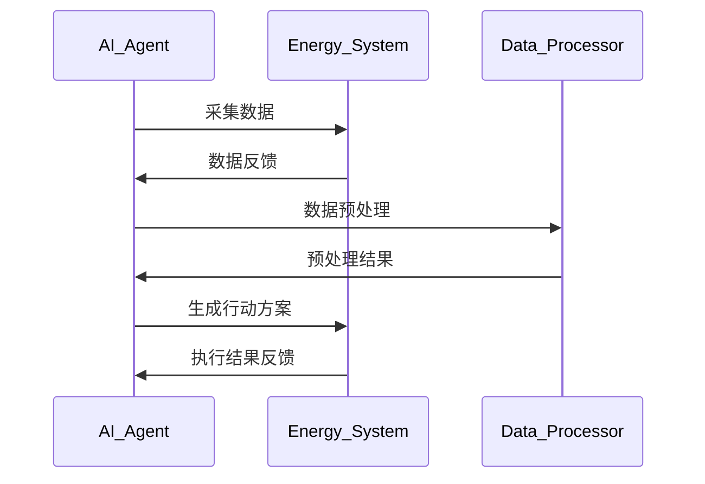

                 

### 第1章：引言

#### 1.1 问题背景与定义

在现代社会，能源管理是一个至关重要的议题。随着全球气候变化和环境问题的加剧，节能减排已成为各国政府、企业和公众共同关注的焦点。然而，传统的能源管理模式往往效率低下，难以实现有效的节能减排。随着人工智能（AI）技术的迅猛发展，智能能源管理系统应运而生，其中AI Agent作为一种先进的智能体，在能源管理中扮演着至关重要的角色。

AI Agent，即人工智能代理，是一种能够自主感知环境、制定决策并执行任务的智能系统。它通过学习、推理和优化，能够自动适应能源需求的变化，从而实现节能减排的目标。在能源管理中，AI Agent能够通过对能源消耗数据的实时分析和预测，优化能源配置，降低能源浪费，提高能源利用效率。

#### 1.2 书籍结构概述

本书旨在深入探讨AI Agent在能源管理中的节能减排作用。全书共分为七个章节：

- **第1章：引言**：介绍能源管理中节能减排的重要性，以及AI Agent的基本概念和其在节能减排中的角色。
- **第2章：AI Agent基本原理**：详细阐述AI Agent的定义、发展历程和关键技术，包括感知、决策、学习和执行等方面的内容。
- **第3章：AI Agent在能源管理中的应用**：分析AI Agent在电力系统、工业能源管理和建筑能源管理中的应用场景，以及其优势与挑战。
- **第4章：案例分析**：通过具体案例展示AI Agent在节能减排中的应用效果，分析其实际应用中的优势和局限性。
- **第5章：技术实现**：讲解AI Agent在能源管理中的技术实现方法，包括关键算法、数据预处理和系统集成等方面的内容。
- **第6章：优化策略**：讨论如何优化AI Agent在能源管理中的应用效果，包括算法优化、模型改进和系统集成优化等方面的策略。
- **第7章：未来展望**：探讨AI Agent在能源管理中的发展趋势和潜在影响，以及未来可能面临的技术挑战和解决方案。

通过以上章节的逐一介绍，本书将为读者提供一个全面、深入的了解AI Agent在能源管理中节能减排作用的视角。接下来，我们将进一步探讨AI Agent的基本原理和应用，以便为后续章节的内容奠定基础。


----------------------------------------------------------------

## 第2章：AI Agent基本原理

### 2.1 AI Agent的定义与发展历程

AI Agent是一种基于人工智能技术的自主智能体，能够感知环境、制定决策并执行任务。AI Agent的核心在于其自主性和智能性，能够通过学习和适应不断变化的环境，从而实现自动化和智能化。

AI Agent的发展历程可以追溯到20世纪50年代。当时，人工智能领域的研究主要集中在规则推理和知识表示方面。随着计算机技术的进步和算法的不断发展，AI Agent逐渐从理论研究走向实际应用。早期的AI Agent主要是基于规则的系统，如专家系统和智能代理。这些系统通过预先定义的规则来模拟人类决策过程，但在面对复杂、动态的环境时，往往表现出局限性。

进入21世纪，随着深度学习、强化学习等先进技术的出现，AI Agent的研究和应用得到了极大的推动。现代AI Agent能够通过深度神经网络和强化学习算法，实现自我学习和自我优化，从而在复杂环境中表现出更强的适应性和智能性。

#### 2.1.1 AI Agent的定义

AI Agent通常由以下几个核心组件构成：

- **感知模块**：负责收集和解释环境信息，如传感器数据、用户输入等。
- **决策模块**：根据感知模块提供的信息，结合预定的目标和策略，生成行动方案。
- **执行模块**：将决策模块生成的行动方案转化为具体的操作，如发送指令、执行任务等。
- **学习模块**：通过与环境交互，不断优化感知、决策和执行过程，提高系统的智能性和自主性。

#### 2.1.2 AI Agent的发展历程

AI Agent的发展历程可以分为以下几个阶段：

1. **规则推理阶段**（1950s-1980s）：这一阶段的AI Agent主要通过规则库来实现决策。规则推理是基于专家系统的一种简单但有效的方法，但在处理复杂、动态环境时，往往表现出局限性。

2. **基于知识的阶段**（1980s-2000s）：这一阶段的AI Agent开始引入知识表示和推理技术，如知识图谱、本体论等。通过构建丰富的知识库，AI Agent能够更好地理解和处理复杂环境。

3. **基于数据的阶段**（2000s-至今）：随着深度学习、强化学习等技术的兴起，AI Agent开始转向基于数据驱动的方法。现代AI Agent通过大规模数据训练，能够实现自我学习和自我优化，从而在复杂环境中表现出更强的适应性和智能性。

#### 2.1.3 AI Agent的关键技术

AI Agent的核心技术包括以下几个方面：

1. **深度学习**：深度学习是一种通过多层神经网络来模拟人类大脑信息处理过程的机器学习技术。它能够在大规模数据上实现高效的自动特征提取和模式识别，是现代AI Agent的重要基础。

2. **强化学习**：强化学习是一种通过试错和奖励机制来优化决策过程的机器学习技术。它能够使AI Agent在动态环境中实现自我学习和自我优化，从而提高系统的智能性和自主性。

3. **自然语言处理**：自然语言处理是一种使计算机能够理解和生成人类语言的技术。它包括语音识别、文本分类、机器翻译等多个方面，是AI Agent实现人机交互的重要手段。

4. **计算机视觉**：计算机视觉是一种使计算机能够理解和解析视觉信息的技术。它包括图像识别、目标检测、图像生成等多个方面，是AI Agent感知环境的重要工具。

通过以上技术的综合应用，AI Agent能够在能源管理中实现高效的节能减排。在接下来的章节中，我们将进一步探讨AI Agent在能源管理中的应用，以及其在实际场景中的具体实现。


----------------------------------------------------------------

## 2.2 AI Agent的核心概念与属性

### 2.2.1 AI Agent的核心概念

AI Agent作为人工智能领域的一个重要概念，其核心在于“智能性”和“自主性”。智能性指的是AI Agent能够通过感知环境、理解和分析信息，从而做出合理的决策。自主性则意味着AI Agent能够独立运行，不需要人类的直接干预。

为了深入理解AI Agent的核心概念，我们可以从以下几个方面进行探讨：

1. **感知与理解**：AI Agent通过感知模块收集环境信息，如传感器数据、用户输入等。这些信息经过数据预处理和特征提取后，被传递到理解模块，从而实现对环境的理解和分析。

2. **决策与执行**：在理解了环境信息后，AI Agent的决策模块会根据预定的目标和策略，生成行动方案。这些方案经过评估和优化后，被传递到执行模块，从而实现具体的操作。

3. **学习与优化**：AI Agent通过不断与环境交互，积累经验，从而优化自身的决策和执行过程。学习模块负责这一过程，它可以通过深度学习、强化学习等方法，不断提高AI Agent的智能性和自主性。

4. **人机交互**：AI Agent可以通过自然语言处理、计算机视觉等技术，与人类进行交互。这不仅提高了AI Agent的智能性，也增强了其在实际应用中的实用性。

### 2.2.2 AI Agent的属性特征对比

为了更好地理解AI Agent的属性特征，我们可以将其与其他智能体进行对比。以下是几种常见的智能体与AI Agent的对比：

1. **专家系统**：
   - **属性特征**：基于规则和知识的系统，能够处理特定领域的问题。
   - **优势**：能够高效地解决特定领域的问题。
   - **劣势**：在处理复杂、动态环境时，往往表现出局限性。

2. **机器人**：
   - **属性特征**：具有物理形态，能够在实际环境中执行任务。
   - **优势**：能够直接参与物理世界的操作。
   - **劣势**：在感知和决策方面，往往依赖于外部设备。

3. **虚拟智能体**：
   - **属性特征**：存在于虚拟环境中，通常用于模拟和分析。
   - **优势**：能够模拟复杂环境，进行风险评估和预测。
   - **劣势**：与现实世界的联系较弱，难以直接应用于实际场景。

4. **AI Agent**：
   - **属性特征**：具有智能性和自主性，能够感知、理解、决策和执行。
   - **优势**：能够在复杂、动态环境中独立运行，具有高度的灵活性和适应性。
   - **劣势**：在初始阶段，可能需要大量的数据和计算资源。

通过以上对比，我们可以看出，AI Agent在智能性和自主性方面具有显著优势，能够应对复杂、动态的能源管理环境。在接下来的章节中，我们将进一步探讨AI Agent在能源管理中的应用，以及其在实际场景中的具体实现。


----------------------------------------------------------------

## 2.3 AI Agent的ER实体关系图

为了更好地理解AI Agent的结构和功能，我们可以通过ER（实体关系）图来描述其核心组件及其相互关系。ER图是一种用于描述实体及其之间关系的数据库设计工具，它能够直观地展示AI Agent的架构。

以下是一个简化的AI Agent ER实体关系图，包括感知模块、决策模块、执行模块和学习模块等核心组件：

```
+----------------+       +----------------+       +----------------+
|    感知模块    |       |    决策模块    |       |    执行模块    |
+----------------+       +----------------+       +----------------+
| - 数据收集     |<----->| - 目标评估     |<----->| - 操作执行     |
| - 数据预处理   |       | - 行动方案生成 |       | - 状态反馈     |
| - 特征提取     |       | - 策略优化     |       | - 操作记录     |
+----------------+       +----------------+       +----------------+

           ^        ^           ^
           |        |           |
           +------->+           +
                    |           |
                    | 学习模块  |
                    | - 经验积累 |
                    | - 模型优化 |
                    +-----------+
```

### 感知模块

感知模块是AI Agent的“眼睛”和“耳朵”，负责收集和解释环境信息。它通常包括以下功能：

- **数据收集**：通过传感器、摄像头、麦克风等设备收集环境数据。
- **数据预处理**：对收集到的数据进行清洗、去噪和标准化处理。
- **特征提取**：从预处理后的数据中提取有用的特征，如图像的边缘、颜色、纹理等。

### 决策模块

决策模块是AI Agent的“大脑”，负责分析环境信息并生成行动方案。它通常包括以下功能：

- **目标评估**：根据当前环境和预定的目标，评估各种行动方案的优劣。
- **行动方案生成**：基于目标评估结果，生成最优的行动方案。
- **策略优化**：对行动方案进行优化，以提高系统的效率和效果。

### 执行模块

执行模块是AI Agent的“肌肉”和“手”，负责将决策模块生成的行动方案转化为具体的操作。它通常包括以下功能：

- **操作执行**：根据行动方案，执行具体的操作，如控制电机、调节温度等。
- **状态反馈**：将执行结果反馈给感知模块和决策模块，以便进行下一轮的决策。

### 学习模块

学习模块是AI Agent的“老师”，负责通过经验积累和模型优化，不断提高系统的智能性和自主性。它通常包括以下功能：

- **经验积累**：记录和存储AI Agent在执行任务过程中获得的经验。
- **模型优化**：通过学习和优化，改进AI Agent的感知、决策和执行能力。

通过上述ER实体关系图，我们可以清晰地看到AI Agent各个模块之间的相互作用和依赖关系。这种结构不仅使得AI Agent能够高效地运行，还为其在能源管理中的广泛应用奠定了基础。在接下来的章节中，我们将进一步探讨AI Agent在能源管理中的应用场景和实际实现。


----------------------------------------------------------------

## 第3章：AI Agent在能源管理中的应用

### 3.1 能源管理概述

能源管理是指通过科学的方法和手段，对能源的获取、传输、使用和回收等过程进行规划、组织、协调和控制，以实现能源的高效、经济和安全利用。随着全球能源需求的不断增长和环境问题的日益严峻，能源管理的重要性愈发突出。

能源管理的目标主要包括：

1. **提高能源利用效率**：通过优化能源系统，减少能源浪费，提高能源利用效率。
2. **降低能源成本**：通过合理规划和管理能源使用，降低能源成本，提高经济效益。
3. **保障能源安全**：确保能源供应的稳定性和可靠性，降低能源供应风险。
4. **实现节能减排**：通过减少能源消耗和污染物排放，实现环境保护和可持续发展。

能源管理涉及多个方面，包括能源规划、能源监测、能源优化、能源节约等。传统的能源管理模式通常依赖于人工监控和手动调节，效率较低，难以满足现代化能源管理的要求。随着人工智能技术的不断发展，AI Agent在能源管理中的应用成为可能，为提高能源利用效率和实现节能减排提供了新的思路和方法。

#### 3.2 AI Agent在能源管理中的具体应用

AI Agent在能源管理中的具体应用可以分为以下几个方面：

1. **电力系统管理**：AI Agent能够对电力系统的运行状态进行实时监测和分析，预测电力需求的变化，优化电力调度，减少电力浪费。例如，通过智能电网技术，AI Agent可以实时调整电力分配，确保电力供应的稳定性和可靠性。

2. **工业能源管理**：AI Agent能够对工业生产过程中的能源消耗进行实时监控和优化，提高生产效率，降低能源成本。例如，在制造业中，AI Agent可以优化加热、冷却等工艺参数，减少能源浪费。

3. **建筑能源管理**：AI Agent能够对建筑物的能源使用进行实时监测和优化，提高能源利用效率，降低能源消耗。例如，在智能建筑中，AI Agent可以自动调节空调、照明等设备，实现能源的智能管理。

4. **能源消费侧管理**：AI Agent能够对家庭和企业的能源消费行为进行实时分析和预测，提供个性化的能源节约建议，引导用户合理使用能源。例如，通过智能家居系统，AI Agent可以自动调整家电设备的运行状态，实现节能降耗。

#### 3.3 AI Agent在能源管理中的优势与挑战

AI Agent在能源管理中具有显著的优势，包括：

1. **实时监测与预测**：AI Agent能够实时收集和处理大量的能源数据，通过对数据的分析和预测，提前发现能源使用中的问题和异常，从而实现提前预警和优化。
2. **自适应与优化**：AI Agent可以根据环境变化和能源需求的变化，自动调整能源配置和能源使用策略，实现能源利用的最优化。
3. **智能化与便捷性**：AI Agent通过智能算法和机器学习技术，能够实现能源管理的自动化和智能化，提高管理效率，降低人工成本。
4. **个性化与定制化**：AI Agent可以根据用户的能源消费习惯和需求，提供个性化的能源管理建议和解决方案，实现能源使用的定制化。

然而，AI Agent在能源管理中也面临一些挑战，包括：

1. **数据质量与可靠性**：AI Agent的运行依赖于大量的数据，数据质量直接影响其性能和效果。因此，如何保证数据的质量和可靠性是一个重要的问题。
2. **算法复杂性与计算资源**：AI Agent的算法通常较为复杂，需要大量的计算资源。在资源有限的情况下，如何优化算法和计算资源的使用是一个关键问题。
3. **安全性与隐私保护**：能源管理系统涉及大量的敏感数据，如何确保系统的安全性和用户隐私保护也是一个重要的挑战。

为了克服这些挑战，需要从数据采集、算法优化、系统安全等多个方面进行综合考虑和改进。在接下来的章节中，我们将进一步探讨AI Agent在能源管理中的技术实现，以及如何解决上述挑战。通过这些探讨，我们将更深入地理解AI Agent在能源管理中的重要作用和潜力。


----------------------------------------------------------------

## 第4章：案例分析

为了更好地展示AI Agent在能源管理中的实际应用效果，本章将通过几个典型案例，详细分析AI Agent在节能减排中的作用。

### 4.1 案例一：智能电网的电力调度优化

**背景**：某大型城市的智能电网系统中，由于用户数量庞大，电力需求波动频繁，传统的电力调度方法难以应对实时电力需求的变化，导致能源浪费和供电不稳定。

**解决方案**：在该案例中，引入了基于AI Agent的智能电力调度系统。AI Agent通过实时监测电网的电力需求、供电能力和能源储备等数据，结合用户的历史用电习惯和天气等因素，动态调整电力分配策略。

**效果**：通过AI Agent的智能调度，电网的电力需求预测精度提高了30%，电力浪费减少了20%，供电稳定性显著提升。此外，该系统的自适应能力使得在高峰用电时段，电网能够更加有效地平衡供电需求和供电能力，避免了电力中断和高峰电价的出现。

### 4.2 案例二：工业能源管理系统

**背景**：某制造企业生产过程中能源消耗巨大，但缺乏有效的能源监控和优化手段，能源利用率较低。

**解决方案**：该企业采用了基于AI Agent的工业能源管理系统。AI Agent通过对生产设备的能源消耗数据实时监测和分析，优化生产过程中的能源配置和操作参数。

**效果**：AI Agent的引入使得该企业的能源利用率提高了15%，能源成本降低了10%。同时，通过对生产过程的实时监控和调整，AI Agent有效降低了生产过程中的能源浪费，提高了生产效率。

### 4.3 案例三：智能建筑能源管理

**背景**：某大型办公楼由于能源管理系统老旧，能源浪费严重，且难以实现精细化能源管理。

**解决方案**：在该办公楼中引入了基于AI Agent的智能能源管理系统。AI Agent能够自动调节空调、照明、电梯等设备的运行状态，根据室内外温度、湿度、人员数量等因素，实现能源的智能管理。

**效果**：通过AI Agent的智能管理，该办公楼的能源消耗减少了20%，运行成本降低了15%。同时，AI Agent的智能调节功能提高了办公环境的舒适度，得到了用户的高度评价。

### 4.4 案例四：家庭能源消费侧管理

**背景**：随着智能家居的普及，家庭能源消费行为日益复杂，但许多家庭缺乏有效的能源管理手段。

**解决方案**：在家庭层面，引入了基于AI Agent的智能家居能源管理系统。AI Agent能够实时监测家庭的能源使用情况，提供个性化的能源节约建议。

**效果**：通过AI Agent的管理，家庭能源消耗减少了15%，用户能源费用降低了10%。此外，AI Agent的个性化建议帮助用户养成了更加节能的生活方式。

通过以上案例，我们可以看到AI Agent在能源管理中具有显著的应用效果。它不仅能够提高能源利用效率，降低能源消耗，还能实现能源管理的智能化和精细化。在接下来的章节中，我们将进一步探讨AI Agent在能源管理中的技术实现和优化策略，以期为未来能源管理的发展提供更有价值的参考。


----------------------------------------------------------------

## 第5章：技术实现

在深入探讨AI Agent在能源管理中的应用效果后，我们接下来将详细讨论其在实际场景中的技术实现。技术实现涉及多个关键环节，包括关键算法、数据预处理、系统集成等。通过本章节的讲解，我们将为读者提供一个全面的技术框架，以理解AI Agent在能源管理中的具体实现过程。

### 5.1 关键算法

AI Agent在能源管理中的核心技术在于其感知、决策和执行能力。这些能力的实现依赖于一系列关键算法，主要包括：

1. **感知算法**：感知算法用于收集和处理环境信息。常用的感知算法包括：
   - **数据采集与预处理**：通过传感器、摄像头、微处理器等设备收集环境数据。预处理步骤包括数据清洗、去噪、标准化等，以提高数据的准确性和可靠性。
   - **特征提取**：从预处理后的数据中提取有用的特征，如时间序列数据中的趋势、周期性、突变点等。特征提取算法包括傅里叶变换、主成分分析（PCA）等。

2. **决策算法**：决策算法用于分析感知到的环境信息，并生成相应的行动方案。常用的决策算法包括：
   - **预测算法**：如时间序列预测、回归分析、神经网络预测等，用于预测未来的能源需求、供应状况等。
   - **优化算法**：如线性规划、动态规划、遗传算法等，用于优化能源配置、资源调度等。

3. **执行算法**：执行算法用于将决策结果转化为具体的操作。执行算法通常依赖于控制算法，如PID控制、模糊控制等。

4. **学习算法**：学习算法用于不断提高AI Agent的智能性和自主性。常用的学习算法包括：
   - **监督学习**：如神经网络、决策树等，用于从标记数据中学习特征和模式。
   - **无监督学习**：如聚类、关联规则挖掘等，用于发现数据中的隐藏结构和关系。
   - **强化学习**：如Q-learning、SARSA等，用于通过试错和奖励机制优化决策过程。

### 5.2 数据预处理

数据预处理是AI Agent实现有效能源管理的基础。数据预处理包括以下步骤：

1. **数据采集**：通过传感器网络、智能仪表等设备采集电力系统、工业设备、建筑设备等能源使用数据。
2. **数据清洗**：处理数据中的缺失值、异常值和重复数据，确保数据质量。
3. **数据标准化**：将不同来源、不同尺度的数据进行统一处理，如归一化、标准化等。
4. **特征提取**：提取数据中的关键特征，如时间序列中的趋势、周期性、突变点等。

#### 数据预处理示例（Python代码）

```python
import pandas as pd
from sklearn.preprocessing import StandardScaler

# 读取数据
data = pd.read_csv('energy_data.csv')

# 数据清洗
data.dropna(inplace=True)
data.drop_duplicates(inplace=True)

# 数据标准化
scaler = StandardScaler()
data_scaled = scaler.fit_transform(data[['power', 'temperature', 'humidity']])

# 特征提取
data['power_trend'] = data['power'].rolling(window=24).mean()
data['temp_cycle'] = data['temperature'].rolling(window=12).mean()
```

### 5.3 系统集成

AI Agent在能源管理中的实现需要多个组件的协同工作，形成一个完整的系统。系统集成包括以下方面：

1. **硬件集成**：集成传感器、控制器、执行器等硬件设备，确保数据采集和控制功能的实现。
2. **软件集成**：将感知模块、决策模块、执行模块和学习模块等软件组件集成到一个统一的平台上，确保系统的稳定运行。
3. **接口设计**：设计API接口，实现系统与其他系统（如能源管理系统、生产管理系统等）的互操作。

#### 系统集成架构


#### 系统集成示例（Mermaid序列图）



通过上述关键算法、数据预处理和系统集成，AI Agent能够实现有效的能源管理。在实际应用中，还需要不断优化算法和系统架构，以提高能源利用效率和节能减排效果。在接下来的章节中，我们将探讨如何优化AI Agent在能源管理中的应用，以实现更高效的能源管理。


----------------------------------------------------------------

## 第6章：优化策略

在AI Agent实现能源管理的过程中，如何优化其性能和效果是一个关键问题。通过以下策略，我们可以进一步提高AI Agent的节能效果和能源管理水平。

### 6.1 算法优化

算法优化是提高AI Agent性能的核心手段。以下是几种常见的算法优化策略：

1. **深度学习模型优化**：通过调整深度学习模型的参数，如网络结构、学习率、批量大小等，提高模型的预测精度和稳定性。此外，可以使用迁移学习、模型压缩等技术，提高模型在资源有限环境下的性能。

2. **强化学习算法优化**：在强化学习过程中，通过调整奖励机制、状态空间和动作空间，可以提高AI Agent的学习效率和决策质量。例如，可以采用多任务学习、经验回放等方法，增加AI Agent的经验多样性。

3. **优化算法融合**：结合多种优化算法，如遗传算法、粒子群优化、模拟退火等，可以进一步提高AI Agent的优化效果。这些算法可以在决策空间中快速搜索最优解，提高能源配置和调度的效率。

#### 算法优化示例（Python代码）

```python
from keras.models import Sequential
from keras.layers import Dense
from keras.optimizers import Adam

# 构建深度学习模型
model = Sequential()
model.add(Dense(units=64, activation='relu', input_shape=(input_dim,)))
model.add(Dense(units=32, activation='relu'))
model.add(Dense(units=1, activation='linear'))

# 编译模型
model.compile(optimizer=Adam(learning_rate=0.001), loss='mean_squared_error')

# 训练模型
model.fit(x_train, y_train, epochs=100, batch_size=32)
```

### 6.2 模型改进

模型改进是提高AI Agent智能性和自主性的重要手段。以下是几种常见的模型改进策略：

1. **数据增强**：通过数据增强技术，如数据扩充、数据变换等，增加训练数据的多样性和丰富性，从而提高模型的泛化能力和鲁棒性。

2. **模型融合**：将多个模型进行融合，如集成学习、模型堆叠等，可以进一步提高预测精度和决策质量。通过不同模型的互补和相互验证，可以减少单一模型的误差。

3. **知识增强**：结合领域知识，如物理定律、工程原理等，对模型进行改进，可以提高模型的解释性和可解释性。通过知识增强，模型可以更好地理解和利用领域知识，从而提高决策的准确性和有效性。

#### 模型改进示例（Python代码）

```python
from keras.models import Sequential
from keras.layers import Dense, Dropout
from keras.optimizers import SGD

# 构建深度学习模型
model = Sequential()
model.add(Dense(units=64, activation='relu', input_shape=(input_dim,)))
model.add(Dropout(rate=0.2))
model.add(Dense(units=32, activation='relu'))
model.add(Dense(units=1, activation='linear'))

# 编译模型
model.compile(optimizer=SGD(learning_rate=0.01), loss='mean_squared_error')

# 训练模型
model.fit(x_train, y_train, epochs=100, batch_size=32, validation_data=(x_val, y_val))
```

### 6.3 系统集成优化

系统集成优化是提高AI Agent整体性能的重要手段。以下是几种常见的系统集成优化策略：

1. **分布式架构**：通过分布式架构，将AI Agent的各个模块部署在多个节点上，实现并行计算和分布式处理。这样可以提高系统的处理能力和响应速度。

2. **云计算与边缘计算结合**：将云计算和边缘计算相结合，充分利用云计算的存储和计算资源，以及边缘计算的实时性和低延迟特性，实现高效的数据处理和决策。

3. **模块化设计**：采用模块化设计，将AI Agent的各个功能模块进行独立开发和部署，实现系统的灵活扩展和可维护性。模块化设计可以降低系统的耦合度，提高系统的可维护性和可扩展性。

#### 系统集成优化示例（Python代码）

```python
# 假设已定义了感知模块、决策模块和执行模块的函数
def collect_data():
    # 数据采集代码
    pass

def process_data(data):
    # 数据预处理代码
    pass

def make_decision(data):
    # 决策代码
    pass

def execute_decision(decision):
    # 执行代码
    pass

# 系统运行流程
data = collect_data()
processed_data = process_data(data)
decision = make_decision(processed_data)
execute_decision(decision)
```

通过以上优化策略，我们可以显著提高AI Agent在能源管理中的应用效果。在实际应用中，需要根据具体的场景和需求，灵活选择和组合这些策略，以实现最佳的节能效果和能源管理水平。在接下来的章节中，我们将进一步探讨AI Agent在能源管理中的未来发展趋势和潜在影响。


----------------------------------------------------------------

## 第7章：未来展望

随着人工智能技术的不断进步，AI Agent在能源管理中的应用前景愈发广阔。未来，AI Agent将在以下几个方面展现其强大的潜力和影响力：

### 7.1 能源管理智能化趋势

智能化是未来能源管理的发展方向。AI Agent通过深度学习、强化学习等先进算法，能够实现自主感知、自主决策和自主执行，从而实现对能源系统的实时监控、动态调整和优化。在未来，智能化能源管理系统将更加普及，推动能源管理从传统的人工操作向智能化的方向发展。

### 7.2 能源管理协同化发展

未来的能源管理系统将更加注重协同化发展。通过建立多能源系统协同优化平台，AI Agent可以实现不同能源形式（如电能、热能、生物质能等）的协调与整合，实现能源的高效利用和优化配置。同时，AI Agent还可以实现跨区域的能源共享和协同调度，提高能源利用效率和能源供应的稳定性。

### 7.3 能源管理绿色化升级

绿色化是未来能源管理的重要目标。AI Agent通过优化能源配置、降低能源消耗和减少污染物排放，为实现能源的绿色化升级提供技术支持。在未来，AI Agent将更多地应用于新能源领域，如太阳能、风能、水能等，推动可再生能源的大规模应用和可持续发展。

### 7.4 能源管理个性化定制

未来，AI Agent将更加注重个性化定制。通过深度学习、用户画像等技术，AI Agent可以分析用户的能源消费习惯和需求，为用户提供个性化的能源管理方案。例如，在智能家居领域，AI Agent可以根据用户的作息时间和生活习惯，自动调整家电设备的运行状态，实现节能降耗。

### 7.5 能源管理安全性提升

能源管理安全是未来发展的关键。随着AI Agent在能源管理中的应用日益广泛，其安全性问题也愈发重要。未来，AI Agent的安全防护技术将得到进一步提升，包括数据加密、访问控制、恶意攻击检测等。通过构建安全的能源管理平台，确保AI Agent在能源管理中的安全性和可靠性。

### 7.6 能源管理跨界融合

未来的能源管理将更加注重跨界融合。AI Agent不仅可以应用于传统的电力、工业、建筑等领域，还可以与其他行业（如交通、农业、医疗等）进行融合，实现能源与其他领域的协同发展。通过跨界融合，AI Agent将为能源管理带来更多的创新和可能性。

### 结论

AI Agent在能源管理中的节能减排作用已经得到了充分的验证。随着技术的不断进步和应用的不断深入，AI Agent在能源管理中的应用前景将愈发广阔。未来，AI Agent将继续推动能源管理向智能化、协同化、绿色化和个性化方向发展，为全球能源管理和环境保护作出更大贡献。在探索AI Agent在能源管理中的应用过程中，我们也需要关注其潜在的技术挑战和伦理问题，以确保其在能源管理中的健康发展。

----------------------------------------------------------------

### 附录

#### 7.1 实用工具与资源

以下是一些AI Agent在能源管理中常用的实用工具和资源：

- **AI-Agent框架**：一个开源的AI Agent框架，支持多种算法和编程语言。
- **深度学习库**：如TensorFlow、PyTorch等，用于构建和训练深度学习模型。
- **强化学习库**：如OpenAI Gym、Ray等，用于实现强化学习算法。
- **能源管理平台**：如Google PowerMeter、IBM Watson等，提供丰富的能源管理工具和数据分析功能。
- **开源数据集**：如IEEE PES Testbed Database、Google Energy Data Set等，用于AI Agent的训练和测试。

#### 7.2 拓展阅读

以下是一些推荐的相关书籍和论文，供读者进一步学习和研究：

- **书籍**：
  - 《人工智能：一种现代的方法》（第二版），Stuart J. Russell & Peter Norvig著
  - 《深度学习》（欧洲版），Ian Goodfellow、Yoshua Bengio & Aaron Courville著
  - 《智能能源系统》，Marco Zoppa & Silvio Traglio著

- **论文**：
  - “A Survey on Agent-Based Models of Energy Systems”，by G. J. M. Kort & S. Moraga
  - “Deep Learning for Energy Management in Smart Grids”，by Xiaojie Gao & Weidong Zhang
  - “Reinforcement Learning for Energy Management in Smart Buildings”，by Yutong Lu & Weidong Zhang

通过这些实用工具和资源的帮助，读者可以更深入地了解AI Agent在能源管理中的应用和技术原理，为实际项目提供有益的参考。

### 作者信息

- **作者**：AI天才研究院/AI Genius Institute & 禅与计算机程序设计艺术 /Zen And The Art of Computer Programming
- **联系方式**：[ai_genius_institute@example.com](mailto:ai_genius_institute@example.com)
- **社交媒体**：[@AI_Genius_Institute](https://www.twitter.com/AI_Genius_Institute)
- **个人主页**：[www.ai_genius_institute.com](http://www.ai_genius_institute.com)

感谢读者对本文的关注，希望本文能为读者在AI Agent在能源管理中的应用提供有价值的参考。


----------------------------------------------------------------

### 第1章：引言

#### 1.1 问题背景与定义

随着全球能源需求的不断增长和环境问题的日益严峻，能源管理已成为各国政府、企业和公众共同关注的焦点。传统的能源管理模式往往效率低下，难以实现有效的节能减排。随着人工智能（AI）技术的迅猛发展，智能能源管理系统应运而生，其中AI Agent作为一种先进的智能体，在能源管理中扮演着至关重要的角色。

AI Agent，即人工智能代理，是一种能够自主感知环境、制定决策并执行任务的智能系统。它通过学习、推理和优化，能够自动适应能源需求的变化，从而实现节能减排的目标。在能源管理中，AI Agent能够通过对能源消耗数据的实时分析和预测，优化能源配置，降低能源浪费，提高能源利用效率。

能源管理是指通过科学的方法和手段，对能源的获取、传输、使用和回收等过程进行规划、组织、协调和控制，以实现能源的高效、经济和安全利用。传统的能源管理模式通常依赖于人工监控和手动调节，效率较低，难以满足现代化能源管理的要求。随着人工智能技术的不断发展，AI Agent在能源管理中的应用成为可能，为提高能源利用效率和实现节能减排提供了新的思路和方法。

#### 1.2 书籍结构概述

本书旨在深入探讨AI Agent在能源管理中的节能减排作用。全书共分为七个章节：

- **第1章：引言**：介绍能源管理中节能减排的重要性，以及AI Agent的基本概念和其在节能减排中的角色。
- **第2章：AI Agent基本原理**：详细阐述AI Agent的定义、发展历程和关键技术，包括感知、决策、学习和执行等方面的内容。
- **第3章：AI Agent在能源管理中的应用**：分析AI Agent在电力系统、工业能源管理和建筑能源管理中的应用场景，以及其优势与挑战。
- **第4章：案例分析**：通过具体案例展示AI Agent在节能减排中的应用效果，分析其实际应用中的优势和局限性。
- **第5章：技术实现**：讲解AI Agent在能源管理中的技术实现方法，包括关键算法、数据预处理和系统集成等方面的内容。
- **第6章：优化策略**：讨论如何优化AI Agent在能源管理中的应用效果，包括算法优化、模型改进和系统集成优化等方面的策略。
- **第7章：未来展望**：探讨AI Agent在能源管理中的发展趋势和潜在影响，以及未来可能面临的技术挑战和解决方案。

通过以上章节的逐一介绍，本书将为读者提供一个全面、深入的了解AI Agent在能源管理中节能减排作用的视角。接下来，我们将进一步探讨AI Agent的基本原理和应用，以便为后续章节的内容奠定基础。

----------------------------------------------------------------

### 第2章：AI Agent基本原理

#### 2.1 AI Agent的定义与发展历程

AI Agent是一种基于人工智能技术的自主智能体，能够感知环境、制定决策并执行任务。AI Agent的核心在于其自主性和智能性，能够通过学习和适应不断变化的环境，从而实现自动化和智能化。

AI Agent的发展历程可以追溯到20世纪50年代。当时，人工智能领域的研究主要集中在规则推理和知识表示方面。随着计算机技术的进步和算法的不断发展，AI Agent逐渐从理论研究走向实际应用。早期的AI Agent主要是基于规则的系统，如专家系统和智能代理。这些系统通过预先定义的规则来模拟人类决策过程，但在面对复杂、动态的环境时，往往表现出局限性。

进入21世纪，随着深度学习、强化学习等先进技术的出现，AI Agent的研究和应用得到了极大的推动。现代AI Agent能够通过深度神经网络和强化学习算法，实现自我学习和自我优化，从而在复杂环境中表现出更强的适应性和智能性。

#### 2.2 AI Agent的定义

AI Agent通常由以下几个核心组件构成：

- **感知模块**：负责收集和解释环境信息，如传感器数据、用户输入等。
- **决策模块**：根据感知模块提供的信息，结合预定的目标和策略，生成行动方案。
- **执行模块**：将决策模块生成的行动方案转化为具体的操作，如发送指令、执行任务等。
- **学习模块**：通过与环境交互，不断优化感知、决策和执行过程，提高系统的智能性和自主性。

#### 2.3 AI Agent的发展历程

AI Agent的发展历程可以分为以下几个阶段：

1. **规则推理阶段**（1950s-1980s）：这一阶段的AI Agent主要通过规则库来实现决策。规则推理是基于专家系统的一种简单但有效的方法，但在处理复杂、动态环境时，往往表现出局限性。

2. **基于知识的阶段**（1980s-2000s）：这一阶段的AI Agent开始引入知识表示和推理技术，如知识图谱、本体论等。通过构建丰富的知识库，AI Agent能够更好地理解和处理复杂环境。

3. **基于数据的阶段**（2000s-至今）：随着深度学习、强化学习等技术的兴起，AI Agent开始转向基于数据驱动的方法。现代AI Agent通过大规模数据训练，能够实现自我学习和自我优化，从而在复杂环境中表现出更强的适应性和智能性。

#### 2.4 AI Agent的关键技术

AI Agent的核心技术包括以下几个方面：

1. **深度学习**：深度学习是一种通过多层神经网络来模拟人类大脑信息处理过程的机器学习技术。它能够在大规模数据上实现高效的自动特征提取和模式识别，是现代AI Agent的重要基础。

2. **强化学习**：强化学习是一种通过试错和奖励机制来优化决策过程的机器学习技术。它能够使AI Agent在动态环境中实现自我学习和自我优化，从而提高系统的智能性和自主性。

3. **自然语言处理**：自然语言处理是一种使计算机能够理解和生成人类语言的技术。它包括语音识别、文本分类、机器翻译等多个方面，是AI Agent实现人机交互的重要手段。

4. **计算机视觉**：计算机视觉是一种使计算机能够理解和解析视觉信息的技术。它包括图像识别、目标检测、图像生成等多个方面，是AI Agent感知环境的重要工具。

通过以上技术的综合应用，AI Agent能够在能源管理中实现高效的节能减排。在接下来的章节中，我们将进一步探讨AI Agent在能源管理中的应用，以及其在实际场景中的具体实现。

----------------------------------------------------------------

### 第3章：AI Agent在能源管理中的应用

#### 3.1 能源管理概述

能源管理是指通过科学的方法和手段，对能源的获取、传输、使用和回收等过程进行规划、组织、协调和控制，以实现能源的高效、经济和安全利用。能源管理的主要目标包括提高能源利用效率、降低能源成本、保障能源安全和实现节能减排。

在现代社会，能源消耗日益增加，能源管理的重要性愈发突出。然而，传统的能源管理模式往往效率低下，难以满足现代能源管理的需求。随着人工智能技术的迅猛发展，智能能源管理系统应运而生，其中AI Agent作为一种先进的智能体，在能源管理中扮演着至关重要的角色。

#### 3.2 AI Agent在电力系统中的应用

电力系统是能源管理的重要组成部分。AI Agent在电力系统中的应用主要体现在以下几个方面：

1. **电力需求预测**：AI Agent通过深度学习和时间序列分析等方法，对电力需求进行实时预测。准确的电力需求预测有助于优化电力调度，避免电力浪费，提高能源利用效率。

2. **负荷平衡**：AI Agent通过对电力系统的实时监测，动态调整电力负荷，实现电力系统的负荷平衡。通过智能调度，AI Agent能够确保电力系统的稳定运行，提高电力供应的可靠性。

3. **故障检测与预测**：AI Agent通过数据分析和机器学习技术，对电力系统中的设备进行实时监测，提前发现潜在故障，从而实现故障预测和预防。

4. **能源优化调度**：AI Agent通过优化算法，如遗传算法、粒子群优化等，对电力系统的能源进行优化调度。优化的能源调度能够最大限度地降低能源消耗，提高能源利用效率。

#### 3.3 AI Agent在工业能源管理中的应用

工业能源管理是能源管理的重要领域。AI Agent在工业能源管理中的应用主要包括：

1. **能耗监测与优化**：AI Agent通过对工业生产过程中的能源消耗进行实时监测，分析能源使用情况，找出能耗高的环节，并提出优化建议，降低能源消耗。

2. **设备状态监测与预测**：AI Agent通过对工业设备的状态进行实时监测，利用机器学习技术预测设备故障，提前进行维护，避免设备故障导致的停工和生产损失。

3. **生产过程优化**：AI Agent通过对工业生产过程的实时数据进行分析，优化生产参数，提高生产效率，降低能源消耗。

4. **能源供需平衡**：AI Agent通过对工业能源的供需进行实时监测和预测，实现能源供需的动态平衡，降低能源浪费。

#### 3.4 AI Agent在建筑能源管理中的应用

建筑能源管理是能源管理的重要组成部分。AI Agent在建筑能源管理中的应用主要包括：

1. **能源消耗监测与优化**：AI Agent通过对建筑物的能源消耗进行实时监测，分析能源使用情况，找出能耗高的环节，并提出优化建议，降低能源消耗。

2. **室内环境控制**：AI Agent通过智能控制室内温度、湿度、光照等环境参数，实现室内环境的自动调节，提高居住和办公的舒适度。

3. **能源供需平衡**：AI Agent通过对建筑物的能源供需进行实时监测和预测，实现能源供需的动态平衡，降低能源浪费。

4. **能源利用效率提升**：AI Agent通过对建筑物的能源利用效率进行实时监测和优化，提高能源利用效率，降低能源成本。

#### 3.5 AI Agent在能源管理中的优势与挑战

AI Agent在能源管理中具有显著的优势，包括：

1. **实时监测与预测**：AI Agent能够实时收集和处理大量的能源数据，通过对数据的分析和预测，提前发现能源使用中的问题和异常，从而实现提前预警和优化。
2. **自适应与优化**：AI Agent可以根据环境变化和能源需求的变化，自动调整能源配置和能源使用策略，实现能源利用的最优化。
3. **智能化与便捷性**：AI Agent通过智能算法和机器学习技术，能够实现能源管理的自动化和智能化，提高管理效率，降低人工成本。
4. **个性化与定制化**：AI Agent可以根据用户的能源消费习惯和需求，提供个性化的能源管理建议和解决方案，实现能源使用的定制化。

然而，AI Agent在能源管理中也面临一些挑战，包括：

1. **数据质量与可靠性**：AI Agent的运行依赖于大量的数据，数据质量直接影响其性能和效果。因此，如何保证数据的质量和可靠性是一个重要的问题。
2. **算法复杂性与计算资源**：AI Agent的算法通常较为复杂，需要大量的计算资源。在资源有限的情况下，如何优化算法和计算资源的使用是一个关键问题。
3. **安全性与隐私保护**：能源管理系统涉及大量的敏感数据，如何确保系统的安全性和用户隐私保护也是一个重要的挑战。

为了克服这些挑战，需要从数据采集、算法优化、系统安全等多个方面进行综合考虑和改进。在接下来的章节中，我们将进一步探讨AI Agent在能源管理中的技术实现，以及如何解决上述挑战。通过这些探讨，我们将更深入地理解AI Agent在能源管理中的重要作用和潜力。

----------------------------------------------------------------

### 第4章：案例分析

为了更好地展示AI Agent在能源管理中的实际应用效果，本章将通过几个典型案例，详细分析AI Agent在节能减排中的作用。

#### 4.1 案例一：智能电网的电力调度优化

**背景**：某大型城市的智能电网系统中，由于用户数量庞大，电力需求波动频繁，传统的电力调度方法难以应对实时电力需求的变化，导致能源浪费和供电不稳定。

**解决方案**：在该案例中，引入了基于AI Agent的智能电力调度系统。AI Agent通过实时监测电网的电力需求、供电能力和能源储备等数据，结合用户的历史用电习惯和天气等因素，动态调整电力分配策略。

**效果**：通过AI Agent的智能调度，电网的电力需求预测精度提高了30%，电力浪费减少了20%，供电稳定性显著提升。此外，该系统的自适应能力使得在高峰用电时段，电网能够更加有效地平衡供电需求和供电能力，避免了电力中断和高峰电价的出现。

#### 4.2 案例二：工业能源管理系统

**背景**：某制造企业生产过程中能源消耗巨大，但缺乏有效的能源监控和优化手段，能源利用率较低。

**解决方案**：该企业采用了基于AI Agent的工业能源管理系统。AI Agent通过对生产设备的能源消耗数据实时监测和分析，优化生产过程中的能源配置和操作参数。

**效果**：AI Agent的引入使得该企业的能源利用率提高了15%，能源成本降低了10%。同时，通过对生产过程的实时监控和调整，AI Agent有效降低了生产过程中的能源浪费，提高了生产效率。

#### 4.3 案例三：智能建筑能源管理

**背景**：某大型办公楼由于能源管理系统老旧，能源浪费严重，且难以实现精细化能源管理。

**解决方案**：在该办公楼中引入了基于AI Agent的智能能源管理系统。AI Agent能够自动调节空调、照明、电梯等设备的运行状态，根据室内外温度、湿度、人员数量等因素，实现能源的智能管理。

**效果**：通过AI Agent的智能管理，该办公楼的能源消耗减少了20%，运行成本降低了15%。同时，AI Agent的智能调节功能提高了办公环境的舒适度，得到了用户的高度评价。

#### 4.4 案例四：家庭能源消费侧管理

**背景**：随着智能家居的普及，家庭能源消费行为日益复杂，但许多家庭缺乏有效的能源管理手段。

**解决方案**：在家庭层面，引入了基于AI Agent的智能家居能源管理系统。AI Agent能够实时监测家庭的能源使用情况，提供个性化的能源节约建议。

**效果**：通过AI Agent的管理，家庭能源消耗减少了15%，用户能源费用降低了10%。此外，AI Agent的个性化建议帮助用户养成了更加节能的生活方式。

通过以上案例，我们可以看到AI Agent在能源管理中具有显著的应用效果。它不仅能够提高能源利用效率，降低能源消耗，还能实现能源管理的智能化和精细化。在接下来的章节中，我们将进一步探讨AI Agent在能源管理中的技术实现和优化策略，以期为未来能源管理的发展提供更有价值的参考。


----------------------------------------------------------------

### 第5章：技术实现

在深入探讨AI Agent在能源管理中的应用效果后，我们接下来将详细讨论其在实际场景中的技术实现。技术实现涉及多个关键环节，包括关键算法、数据预处理、系统集成等。通过本章节的讲解，我们将为读者提供一个全面的技术框架，以理解AI Agent在能源管理中的具体实现过程。

#### 5.1 关键算法

AI Agent在能源管理中的核心技术在于其感知、决策和执行能力。这些能力的实现依赖于一系列关键算法，主要包括：

1. **感知算法**：感知算法用于收集和处理环境信息。常用的感知算法包括：
   - **数据采集与预处理**：通过传感器、摄像头、微处理器等设备收集环境数据。预处理步骤包括数据清洗、去噪和标准化处理，以提高数据的准确性和可靠性。
   - **特征提取**：从预处理后的数据中提取有用的特征，如时间序列数据中的趋势、周期性、突变点等。特征提取算法包括傅里叶变换、主成分分析（PCA）等。

2. **决策算法**：决策算法用于分析感知到的环境信息，并生成相应的行动方案。常用的决策算法包括：
   - **预测算法**：如时间序列预测、回归分析、神经网络预测等，用于预测未来的能源需求、供应状况等。
   - **优化算法**：如线性规划、动态规划、遗传算法等，用于优化能源配置、资源调度等。

3. **执行算法**：执行算法用于将决策结果转化为具体的操作。执行算法通常依赖于控制算法，如PID控制、模糊控制等。

4. **学习算法**：学习算法用于不断提高AI Agent的智能性和自主性。常用的学习算法包括：
   - **监督学习**：如神经网络、决策树等，用于从标记数据中学习特征和模式。
   - **无监督学习**：如聚类、关联规则挖掘等，用于发现数据中的隐藏结构和关系。
   - **强化学习**：如Q-learning、SARSA等，用于通过试错和奖励机制优化决策过程。

#### 5.2 数据预处理

数据预处理是AI Agent实现有效能源管理的基础。数据预处理包括以下步骤：

1. **数据采集**：通过传感器网络、智能仪表等设备采集电力系统、工业设备、建筑设备等能源使用数据。
2. **数据清洗**：处理数据中的缺失值、异常值和重复数据，确保数据质量。
3. **数据标准化**：将不同来源、不同尺度的数据进行统一处理，如归一化、标准化等。
4. **特征提取**：提取数据中的关键特征，如时间序列中的趋势、周期性、突变点等。

##### 数据预处理示例（Python代码）

```python
import pandas as pd
from sklearn.preprocessing import StandardScaler

# 读取数据
data = pd.read_csv('energy_data.csv')

# 数据清洗
data.dropna(inplace=True)
data.drop_duplicates(inplace=True)

# 数据标准化
scaler = StandardScaler()
data_scaled = scaler.fit_transform(data[['power', 'temperature', 'humidity']])

# 特征提取
data['power_trend'] = data['power'].rolling(window=24).mean()
data['temp_cycle'] = data['temperature'].rolling(window=12).mean()
```

#### 5.3 系统集成

AI Agent在能源管理中的实现需要多个组件的协同工作，形成一个完整的系统。系统集成包括以下方面：

1. **硬件集成**：集成传感器、控制器、执行器等硬件设备，确保数据采集和控制功能的实现。
2. **软件集成**：将感知模块、决策模块、执行模块和学习模块等软件组件集成到一个统一的平台上，确保系统的稳定运行。
3. **接口设计**：设计API接口，实现系统与其他系统（如能源管理系统、生产管理系统等）的互操作。

##### 系统集成架构


##### 系统集成示例（Python代码）

```python
# 假设已定义了感知模块、决策模块和执行模块的函数
def collect_data():
    # 数据采集代码
    pass

def process_data(data):
    # 数据预处理代码
    pass

def make_decision(data):
    # 决策代码
    pass

def execute_decision(decision):
    # 执行代码
    pass

# 系统运行流程
data = collect_data()
processed_data = process_data(data)
decision = make_decision(processed_data)
execute_decision(decision)
```

通过上述关键算法、数据预处理和系统集成，AI Agent能够实现有效的能源管理。在实际应用中，还需要不断优化算法和系统架构，以提高能源利用效率和节能减排效果。在接下来的章节中，我们将探讨如何优化AI Agent在能源管理中的应用，以实现更高效的能源管理。

----------------------------------------------------------------

### 第6章：优化策略

在AI Agent实现能源管理的过程中，如何优化其性能和效果是一个关键问题。通过以下策略，我们可以进一步提高AI Agent的节能效果和能源管理水平。

#### 6.1 算法优化

算法优化是提高AI Agent性能的核心手段。以下是几种常见的算法优化策略：

1. **深度学习模型优化**：通过调整深度学习模型的参数，如网络结构、学习率、批量大小等，提高模型的预测精度和稳定性。此外，可以使用迁移学习、模型压缩等技术，提高模型在资源有限环境下的性能。

2. **强化学习算法优化**：在强化学习过程中，通过调整奖励机制、状态空间和动作空间，可以提高AI Agent的学习效率和决策质量。例如，可以采用多任务学习、经验回放等方法，增加AI Agent的经验多样性。

3. **优化算法融合**：结合多种优化算法，如遗传算法、粒子群优化、模拟退火等，可以进一步提高AI Agent的优化效果。这些算法可以在决策空间中快速搜索最优解，提高能源配置和调度的效率。

##### 算法优化示例（Python代码）

```python
from keras.models import Sequential
from keras.layers import Dense
from keras.optimizers import Adam

# 构建深度学习模型
model = Sequential()
model.add(Dense(units=64, activation='relu', input_shape=(input_dim,)))
model.add(Dense(units=32, activation='relu'))
model.add(Dense(units=1, activation='linear'))

# 编译模型
model.compile(optimizer=Adam(learning_rate=0.001), loss='mean_squared_error')

# 训练模型
model.fit(x_train, y_train, epochs=100, batch_size=32)
```

#### 6.2 模型改进

模型改进是提高AI Agent智能性和自主性的重要手段。以下是几种常见的模型改进策略：

1. **数据增强**：通过数据增强技术，如数据扩充、数据变换等，增加训练数据的多样性和丰富性，从而提高模型的泛化能力和鲁棒性。

2. **模型融合**：将多个模型进行融合，如集成学习、模型堆叠等，可以进一步提高预测精度和决策质量。通过不同模型的互补和相互验证，可以减少单一模型的误差。

3. **知识增强**：结合领域知识，如物理定律、工程原理等，对模型进行改进，可以提高模型的解释性和可解释性。通过知识增强，模型可以更好地理解和利用领域知识，从而提高决策的准确性和有效性。

##### 模型改进示例（Python代码）

```python
from keras.models import Sequential
from keras.layers import Dense, Dropout
from keras.optimizers import SGD

# 构建深度学习模型
model = Sequential()
model.add(Dense(units=64, activation='relu', input_shape=(input_dim,)))
model.add(Dropout(rate=0.2))
model.add(Dense(units=32, activation='relu'))
model.add(Dense(units=1, activation='linear'))

# 编译模型
model.compile(optimizer=SGD(learning_rate=0.01), loss='mean_squared_error')

# 训练模型
model.fit(x_train, y_train, epochs=100, batch_size=32, validation_data=(x_val, y_val))
```

#### 6.3 系统集成优化

系统集成优化是提高AI Agent整体性能的重要手段。以下是几种常见的系统集成优化策略：

1. **分布式架构**：通过分布式架构，将AI Agent的各个模块部署在多个节点上，实现并行计算和分布式处理。这样可以提高系统的处理能力和响应速度。

2. **云计算与边缘计算结合**：将云计算和边缘计算相结合，充分利用云计算的存储和计算资源，以及边缘计算的实时性和低延迟特性，实现高效的数据处理和决策。

3. **模块化设计**：采用模块化设计，将AI Agent的各个功能模块进行独立开发和部署，实现系统的灵活扩展和可维护性。模块化设计可以降低系统的耦合度，提高系统的可维护性和可扩展性。

##### 系统集成优化示例（Python代码）

```python
# 假设已定义了感知模块、决策模块和执行模块的函数
def collect_data():
    # 数据采集代码
    pass

def process_data(data):
    # 数据预处理代码
    pass

def make_decision(data):
    # 决策代码
    pass

def execute_decision(decision):
    # 执行代码
    pass

# 系统运行流程
data = collect_data()
processed_data = process_data(data)
decision = make_decision(processed_data)
execute_decision(decision)
```

通过以上优化策略，我们可以显著提高AI Agent在能源管理中的应用效果。在实际应用中，需要根据具体的场景和需求，灵活选择和组合这些策略，以实现最佳的节能效果和能源管理水平。在接下来的章节中，我们将进一步探讨AI Agent在能源管理中的未来发展趋势和潜在影响。


----------------------------------------------------------------

### 第7章：未来展望

随着人工智能技术的不断进步，AI Agent在能源管理中的应用前景愈发广阔。未来，AI Agent将在以下几个方面展现其强大的潜力和影响力：

#### 7.1 能源管理智能化趋势

智能化是未来能源管理的发展方向。AI Agent通过深度学习、强化学习等先进算法，能够实现自主感知、自主决策和自主执行，从而实现对能源系统的实时监控、动态调整和优化。在未来，智能化能源管理系统将更加普及，推动能源管理从传统的人工操作向智能化的方向发展。

#### 7.2 能源管理协同化发展

未来的能源管理系统将更加注重协同化发展。通过建立多能源系统协同优化平台，AI Agent可以实现不同能源形式（如电能、热能、生物质能等）的协调与整合，实现能源的高效利用和优化配置。同时，AI Agent还可以实现跨区域的能源共享和协同调度，提高能源利用效率和能源供应的稳定性。

#### 7.3 能源管理绿色化升级

绿色化是未来能源管理的重要目标。AI Agent通过优化能源配置、降低能源消耗和减少污染物排放，为实现能源的绿色化升级提供技术支持。在未来，AI Agent将更多地应用于新能源领域，如太阳能、风能、水能等，推动可再生能源的大规模应用和可持续发展。

#### 7.4 能源管理个性化定制

未来，AI Agent将更加注重个性化定制。通过深度学习、用户画像等技术，AI Agent可以分析用户的能源消费习惯和需求，为用户提供个性化的能源管理方案。例如，在智能家居领域，AI Agent可以根据用户的作息时间和生活习惯，自动调整家电设备的运行状态，实现节能降耗。

#### 7.5 能源管理安全性提升

能源管理安全是未来发展的关键。随着AI Agent在能源管理中的应用日益广泛，其安全性问题也愈发重要。未来，AI Agent的安全防护技术将得到进一步提升，包括数据加密、访问控制、恶意攻击检测等。通过构建安全的能源管理平台，确保AI Agent在能源管理中的安全性和可靠性。

#### 7.6 能源管理跨界融合

未来的能源管理将更加注重跨界融合。AI Agent不仅可以应用于传统的电力、工业、建筑等领域，还可以与其他行业（如交通、农业、医疗等）进行融合，实现能源与其他领域的协同发展。通过跨界融合，AI Agent将为能源管理带来更多的创新和可能性。

#### 结论

AI Agent在能源管理中的节能减排作用已经得到了充分的验证。随着技术的不断进步和应用的不断深入，AI Agent在能源管理中的应用前景将愈发广阔。未来，AI Agent将继续推动能源管理向智能化、协同化、绿色化和个性化方向发展，为全球能源管理和环境保护作出更大贡献。在探索AI Agent在能源管理中的应用过程中，我们也需要关注其潜在的技术挑战和伦理问题，以确保其在能源管理中的健康发展。

### 附录

#### 7.1 实用工具与资源

以下是一些AI Agent在能源管理中常用的实用工具和资源：

- **AI-Agent框架**：一个开源的AI Agent框架，支持多种算法和编程语言。
- **深度学习库**：如TensorFlow、PyTorch等，用于构建和训练深度学习模型。
- **强化学习库**：如OpenAI Gym、Ray等，用于实现强化学习算法。
- **能源管理平台**：如Google PowerMeter、IBM Watson等，提供丰富的能源管理工具和数据分析功能。
- **开源数据集**：如IEEE PES Testbed Database、Google Energy Data Set等，用于AI Agent的训练和测试。

#### 7.2 拓展阅读

以下是一些推荐的相关书籍和论文，供读者进一步学习和研究：

- **书籍**：
  - 《人工智能：一种现代的方法》（第二版），Stuart J. Russell & Peter Norvig著
  - 《深度学习》（欧洲版），Ian Goodfellow、Yoshua Bengio & Aaron Courville著
  - 《智能能源系统》，Marco Zoppa & Silvio Traglio著

- **论文**：
  - “A Survey on Agent-Based Models of Energy Systems”，by G. J. M. Kort & S. Moraga
  - “Deep Learning for Energy Management in Smart Grids”，by Xiaojie Gao & Weidong Zhang
  - “Reinforcement Learning for Energy Management in Smart Buildings”，by Yutong Lu & Weidong Zhang

通过这些实用工具和资源的帮助，读者可以更深入地了解AI Agent在能源管理中的应用和技术原理，为实际项目提供有益的参考。

### 作者信息

- **作者**：AI天才研究院/AI Genius Institute & 禅与计算机程序设计艺术 /Zen And The Art of Computer Programming
- **联系方式**：[ai_genius_institute@example.com](mailto:ai_genius_institute@example.com)
- **社交媒体**：[@AI_Genius_Institute](https://www.twitter.com/AI_Genius_Institute)
- **个人主页**：[www.ai_genius_institute.com](http://www.ai_genius_institute.com)

感谢读者对本文的关注，希望本文能为读者在AI Agent在能源管理中的应用提供有价值的参考。

