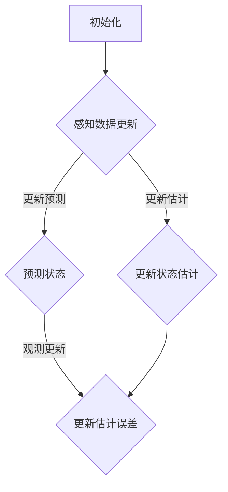
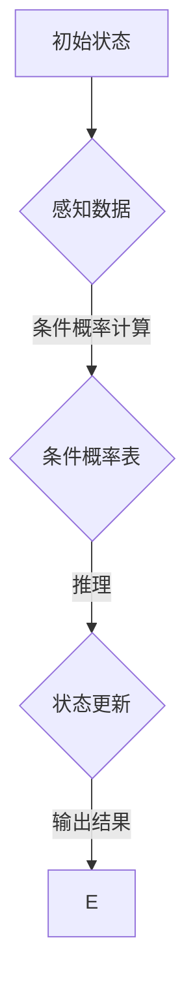
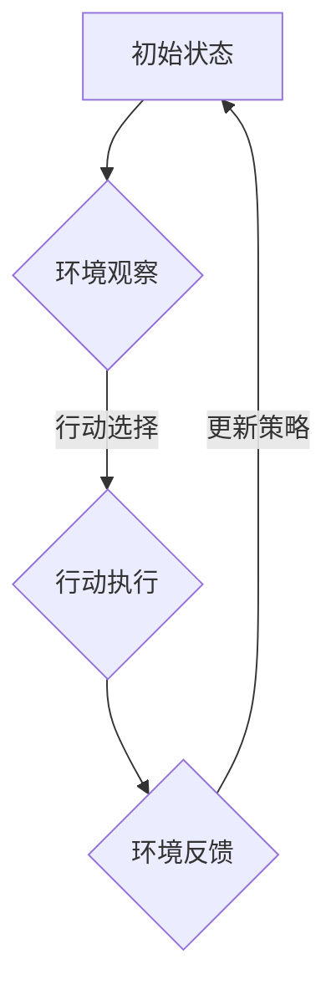
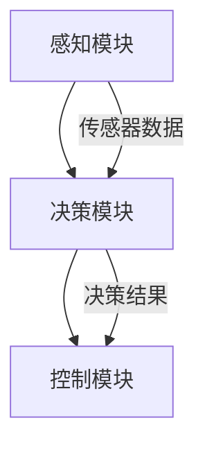
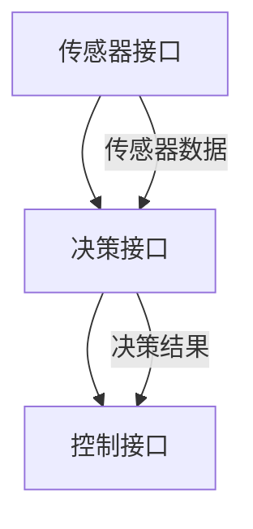
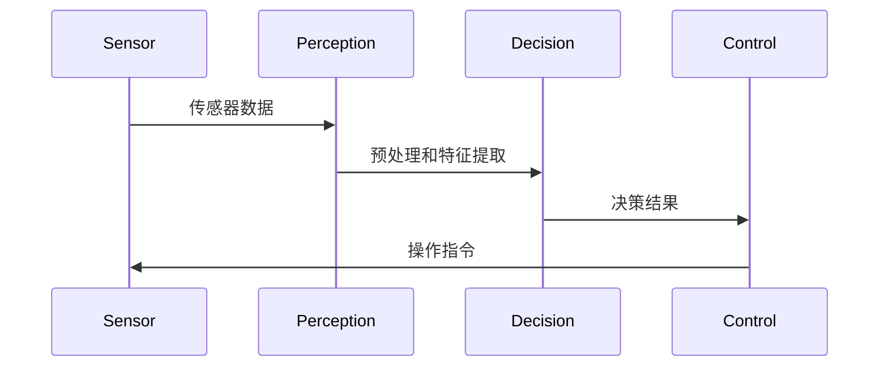

                 

### 第一部分：背景与核心概念

#### 1.1.1 自动驾驶的发展历程

自动驾驶技术从上世纪末开始萌芽，早期的概念主要源于科幻小说和电影。随着计算机技术和人工智能的不断发展，自动驾驶技术逐渐从理论研究走向实际应用。2004年，谷歌启动了自动驾驶汽车项目，标志着自动驾驶技术进入了新的阶段。此后，全球各大科技公司和汽车制造商纷纷投入自动驾驶技术的研究与开发，自动驾驶汽车在测试中不断取得突破。

自动驾驶技术可以分为多个级别，从L0级别的辅助驾驶到L5级别的完全自动驾驶。L0级别基本没有自动驾驶功能，L5级别则完全实现无人驾驶，不需要人类干预。当前，大部分自动驾驶技术集中在L2和L3级别，主要应用于高速公路自动驾驶、泊车辅助等功能。

#### 1.1.2 AI Agent在自动驾驶中的角色

AI Agent，即人工智能代理，是一种能够执行特定任务、与环境和系统交互的智能体。在自动驾驶系统中，AI Agent扮演着关键角色，主要负责感知环境、理解路况、规划行驶路径和做出决策。

感知环境方面，AI Agent通过传感器（如摄像头、雷达、激光雷达等）收集实时数据，如道路状况、车辆位置、行人位置等。理解路况方面，AI Agent需要处理和分析大量的数据，识别道路标志、识别车辆和行人的意图等。规划行驶路径方面，AI Agent需要根据路况、目的地和行驶规则，生成最优的行驶路径。最后，做出决策方面，AI Agent需要实时调整行驶策略，应对突发状况。

#### 1.1.3 决策系统的基本概念与作用

决策系统是自动驾驶系统的核心组成部分，负责处理感知到的信息，并根据这些信息做出驾驶决策。决策系统的工作流程通常包括感知、理解、规划和执行四个阶段。

感知阶段，决策系统通过传感器收集道路信息；理解阶段，系统对收集到的信息进行分析和处理；规划阶段，系统根据理解结果生成驾驶策略；执行阶段，系统将驾驶策略转化为具体的操作指令，控制车辆执行。

决策系统的核心作用在于提高驾驶安全性、提升驾驶体验和优化行驶效率。通过智能决策，自动驾驶系统能够更好地应对复杂的交通环境，减少交通事故发生的概率。

#### 1.2.1 AI Agent的概念与特性

AI Agent是一种具有智能行为的计算机程序，能够模拟人类的决策过程，并在特定环境下执行任务。AI Agent具有以下几个核心特性：

1. **自主性**：AI Agent能够自主地感知环境、理解情境，并基于情境做出决策。
2. **反应性**：AI Agent能够对环境中的变化做出及时响应，调整自身行为。
3. **目标导向性**：AI Agent具有明确的目标，能够为达成目标而采取行动。
4. **适应性**：AI Agent能够根据环境变化和学习经验，调整自身的行为策略。

#### 1.2.2 自动驾驶系统概述

自动驾驶系统是一个复杂的软件和硬件集成系统，主要由感知模块、决策模块和控制模块组成。感知模块负责收集道路信息，如道路标志、车辆位置、行人位置等；决策模块负责处理感知信息，并根据这些信息做出驾驶决策；控制模块则负责将决策转化为具体的操作指令，控制车辆执行。

自动驾驶系统的工作流程可以分为以下几个阶段：

1. **感知**：通过传感器收集道路信息。
2. **预处理**：对感知到的信息进行预处理，如去噪、增强、特征提取等。
3. **理解**：对预处理后的信息进行分析，识别道路标志、车辆和行人等。
4. **规划**：根据理解结果，生成最优的行驶路径和驾驶策略。
5. **决策**：对规划结果进行评估和选择，生成具体的驾驶指令。
6. **控制**：将驾驶指令转化为车辆操作，控制车辆执行。

#### 1.2.3 决策系统的核心要素

决策系统的核心要素包括感知模块、决策模块和控制模块。感知模块负责收集道路信息，包括摄像头、雷达、激光雷达等传感器；决策模块负责处理感知信息，生成驾驶策略；控制模块负责将驾驶指令转化为车辆操作。

在决策系统中，核心要素之间的交互关系如下：

1. **感知模块**向**决策模块**提供实时道路信息；
2. **决策模块**根据感知信息进行理解和规划，生成驾驶策略；
3. **决策模块**将驾驶策略传递给**控制模块**；
4. **控制模块**根据驾驶策略，控制车辆执行。

#### 1.3 概念属性特征对比

为了更好地理解AI Agent、自动驾驶和决策系统的关系，我们可以对这三个概念进行属性特征对比。以下是一个简化的对比表格：

| 概念         | 属性特征                                                     |
|--------------|------------------------------------------------------------|
| AI Agent     | 自主性、反应性、目标导向性、适应性                          |
| 自动驾驶系统 | 感知模块、决策模块、控制模块、实时数据处理、驾驶策略生成   |
| 决策系统     | 感知模块、理解模块、规划模块、决策模块、执行模块           |

#### 1.4 ER实体关系图架构

为了更好地理解决策系统的实体关系，我们可以使用Mermaid绘制ER实体关系图。以下是一个简化的ER图示例：

```mermaid
erDiagram
  AI-Agent ||--|{ 感知模块 }
  AI-Agent ||--|{ 决策模块 }
  AI-Agent ||--|{ 控制模块 }
  感知模块 ||--|{ 传感器数据 }
  决策模块 ||--|{ 道路理解 }
  决策模块 ||--|{ 行驶规划 }
  控制模块 ||--|{ 驾驶指令 }
```

在决策系统中，AI Agent是核心，它通过感知模块收集道路信息，决策模块处理信息并生成驾驶策略，最后通过控制模块执行这些策略。感知模块、决策模块和控制模块之间紧密协作，共同实现自动驾驶。

---

**本部分内容涵盖了自动驾驶技术的发展历程、AI Agent的角色、决策系统的基本概念与作用，以及AI Agent、自动驾驶和决策系统的核心概念与联系。在接下来的部分，我们将进一步探讨决策系统中的关键算法原理，以及数学模型和公式。**

---

# 第二部分：算法原理讲解

#### 2.1 算法概述

决策系统中的算法主要分为感知算法、理解算法、规划算法和决策算法。每种算法都有其特定的任务和目标，共同构成一个完整的决策过程。

1. **感知算法**：主要负责传感器数据的预处理，如去噪、增强和特征提取等。感知算法的目标是提高传感器数据的可靠性和准确性。
2. **理解算法**：基于感知到的数据，理解算法识别道路标志、车辆和行人等。理解算法的目标是准确理解道路环境。
3. **规划算法**：根据理解结果，规划算法生成最优的行驶路径和驾驶策略。规划算法的目标是最小化行驶时间和能耗。
4. **决策算法**：对规划结果进行评估和选择，决策算法的目标是最优地执行驾驶任务。

#### 2.2 关键算法原理讲解

在决策系统中，关键算法包括卡尔曼滤波、贝叶斯网络和强化学习等。以下使用Mermaid和Python代码详细阐述这些算法的原理。

##### 2.2.1 卡尔曼滤波算法流程图



卡尔曼滤波算法的核心思想是通过预测和更新，逐步提高对状态估计的准确性。以下是一个简单的Python代码实现：

```python
import numpy as np

# 初始化参数
x = np.array([0.0])
P = np.array([[1.0]])

# 观测噪声和过程噪声
Q = np.array([[0.1]])
R = np.array([[0.01]])

# 卡尔曼滤波迭代
for k in range(10):
    # 预测
    x_pred = x
    P_pred = P + Q
    
    # 更新
    K = P_pred / (P_pred + R)
    x = x_pred + K * (z - x_pred)
    P = (I - K * H) * P_pred
    
    # 输出结果
    print(f"Step {k}: x = {x[0]}, P = {P[0][0]}")
```

##### 2.2.2 贝叶斯网络算法流程图



贝叶斯网络是一种基于概率推理的算法，用于解决不确定性和不确定性推理问题。以下是一个简单的Python代码实现：

```python
import numpy as np
from pyposa.network import BayesianNetwork

# 初始化贝叶斯网络
nodes = ['S0', 'S1', 'S2', 'S3']
edges = [('S0', 'S1'), ('S0', 'S2'), ('S1', 'S3'), ('S2', 'S3')]
bn = BayesianNetwork(nodes, edges)

# 条件概率表
cp = {
    'S0': {'True': {'S1': {'True': {'S2': {'True': {'S3': {'True': 0.5}}}}}}}},
    'S1': {'True': {'S2': {'True': {'S3': {'True': 0.5}}}}},
    'S2': {'True': {'S3': {'True': 0.5}}},
    'S3': {}
}
bn.fit(cp)

# 更新状态
bn.update('S0', True)
bn.update('S1', True)
bn.update('S2', True)
bn.update('S3', True)

# 输出结果
print(bn.prob({'S0': True, 'S1': True, 'S2': True, 'S3': True}))
```

##### 2.2.3 强化学习算法流程图



强化学习是一种基于反馈的机器学习算法，通过不断试错，逐渐优化策略。以下是一个简单的Python代码实现：

```python
import numpy as np
import gym

# 初始化环境
env = gym.make('CartPole-v0')

# 初始化策略参数
Q = np.zeros((env.observation_space.n, env.action_space.n))

# 学习率、折扣因子和迭代次数
alpha = 0.1
gamma = 0.9
n_episodes = 1000

# 强化学习迭代
for episode in range(n_episodes):
    state = env.reset()
    done = False
    
    while not done:
        action = np.argmax(Q[state])
        next_state, reward, done, _ = env.step(action)
        
        # 更新策略
        Q[state, action] = Q[state, action] + alpha * (reward + gamma * np.max(Q[next_state]) - Q[state, action])
        state = next_state
    
    # 输出结果
    print(f"Episode {episode}: Reward = {env.reward_done()}")

# 关闭环境
env.close()
```

##### 2.2.4 数学模型与公式

在决策系统中，数学模型和公式至关重要。以下列出一些关键数学公式：

$$
\begin{aligned}
x_t &= f(x_{t-1}, u_{t-1}) + w_t \\
P_t &= F(P_{t-1}, Q) + R_t \\
\end{aligned}
$$

其中，\( x_t \)和\( P_t \)分别表示状态和状态估计误差，\( f \)和\( F \)分别表示状态转移函数和估计误差更新函数，\( u_t \)和\( w_t \)分别表示控制输入和过程噪声，\( R_t \)表示观测噪声。

##### 2.2.5 举例说明

假设有一个自动驾驶系统，使用卡尔曼滤波算法进行状态估计。初始状态为\( x_0 = 0 \)，初始估计误差为\( P_0 = 1 \)。传感器观测到的当前状态为\( z_1 = 1 \)，过程噪声为\( w_1 = 0.1 \)，观测噪声为\( R_1 = 0.01 \)。

根据卡尔曼滤波算法，可以计算得到：

$$
\begin{aligned}
x_1 &= f(x_0, u_0) + w_1 = 0 + 0.1 = 0.1 \\
P_1 &= F(P_0, Q) + R_1 = 1 + 0.01 = 1.01 \\
K_1 &= P_1 / (P_1 + R_1) = 0.9901 \\
x_1^{\prime} &= x_1 - K_1 \times (z_1 - x_1) = 0.1 - 0.9901 \times (1 - 0.1) = 0.099909 \\
P_1^{\prime} &= (I - K_1 \times H) \times P_1 = (I - 0.9901 \times I) \times 1.01 = 0.00009 \\
\end{aligned}
$$

经过一次迭代后，状态估计值和估计误差分别为\( x_1^{\prime} = 0.099909 \)和\( P_1^{\prime} = 0.00009 \)。

---

**本部分详细讲解了决策系统中的关键算法原理，包括卡尔曼滤波、贝叶斯网络和强化学习。通过Mermaid流程图和Python代码，我们深入了解了这些算法的实现和应用。在接下来的部分，我们将探讨决策系统的系统分析与架构设计。**

---

### 第三部分：系统分析与架构设计

#### 3.1 决策系统场景介绍

在自动驾驶系统中，决策系统的场景主要包括城市道路、高速公路和复杂路况。城市道路场景中，车辆需要频繁进行泊车、变道和避让行人等操作；高速公路场景中，车辆主要进行长时间的高速行驶和保持车道；复杂路况场景中，车辆需要应对突发状况和复杂交通环境。

针对不同的场景，决策系统需要具备不同的功能和性能要求。在城市道路场景中，决策系统需要具备高感知精度、快速响应能力和复杂决策能力；在高速公路场景中，决策系统需要具备稳定性和高效性；在复杂路况场景中，决策系统需要具备灵活性和智能性。

#### 3.2 系统功能设计

决策系统的功能设计包括感知功能、理解功能、规划功能和决策功能。

1. **感知功能**：决策系统通过摄像头、雷达、激光雷达等传感器，实时收集道路信息，如道路标志、车辆位置、行人位置等。
2. **理解功能**：决策系统对收集到的信息进行预处理、特征提取和目标识别，实现对道路环境的理解。
3. **规划功能**：决策系统根据理解结果，生成最优的行驶路径和驾驶策略，包括路径规划、速度规划和避障规划等。
4. **决策功能**：决策系统对规划结果进行评估和选择，生成具体的驾驶指令，控制车辆执行。

#### 3.3 系统架构设计

决策系统的架构设计包括感知模块、决策模块和控制模块。

1. **感知模块**：负责收集道路信息，包括摄像头、雷达、激光雷达等传感器。传感器数据经过预处理和特征提取后，传递给决策模块。
2. **决策模块**：负责处理感知信息，包括理解、规划和决策。决策模块的核心算法包括卡尔曼滤波、贝叶斯网络和强化学习等。决策结果传递给控制模块。
3. **控制模块**：负责将决策结果转化为具体的操作指令，控制车辆执行。控制模块包括电机控制器、制动控制器和转向控制器等。

以下是一个简化的决策系统架构设计图：



#### 3.4 系统接口设计

决策系统的接口设计主要包括传感器接口、决策接口和控制接口。

1. **传感器接口**：传感器接口负责接收传感器数据，包括摄像头、雷达、激光雷达等。传感器接口需要支持不同类型传感器的数据格式和通信协议。
2. **决策接口**：决策接口负责接收传感器数据，进行预处理和特征提取，然后传递给决策模块。决策接口需要支持多种数据预处理方法和特征提取算法。
3. **控制接口**：控制接口负责接收决策结果，将其转化为具体的操作指令，控制车辆执行。控制接口需要支持多种控制算法和执行器接口。

以下是一个简化的决策系统接口设计图：



#### 3.5 系统交互序列图

决策系统的交互序列图展示了传感器、决策模块和控制模块之间的交互过程。以下是一个简化的决策系统交互序列图：



在交互过程中，传感器数据首先传递给感知模块，感知模块进行预处理和特征提取后，传递给决策模块。决策模块处理感知数据，生成驾驶策略后，传递给控制模块。控制模块根据决策结果，控制车辆执行。

---

**本部分详细介绍了决策系统的场景、项目、功能设计、架构设计、接口设计及交互。通过系统分析和架构设计，我们为决策系统构建了一个完整的技术框架，为实现自动驾驶提供了坚实的基础。在接下来的部分，我们将通过项目实战，展示决策系统的实际应用。**

---

### 第四部分：项目实战

#### 4.1 环境安装

要实现一个完整的自动驾驶决策系统，首先需要搭建一个合适的开发环境。以下是一个简化的环境安装步骤：

1. **安装Python**：确保Python环境已安装，版本建议为3.8以上。
2. **安装传感器驱动**：根据所选传感器（如摄像头、雷达、激光雷达等），安装相应的驱动程序和库。
3. **安装感知模块依赖**：安装用于感知模块的预处理和特征提取库，如OpenCV、TensorFlow等。
4. **安装决策模块依赖**：安装用于决策模块的算法库，如scikit-learn、TensorFlow等。
5. **安装控制模块依赖**：安装用于控制模块的库，如pyserial、ROPY等。

以下是一个简单的Python环境配置示例：

```bash
pip install python-rosinstall
pip install numpy
pip install opencv-python
pip install tensorflow
pip install scikit-learn
pip install pyserial
```

#### 4.2 系统核心实现

决策系统的核心实现主要包括感知模块、决策模块和控制模块。以下是一个简化的系统核心实现示例：

##### 4.2.1 感知模块实现

```python
import cv2
import numpy as np

# 读取摄像头数据
cap = cv2.VideoCapture(0)

while True:
    ret, frame = cap.read()
    
    if not ret:
        break
    
    # 预处理和特征提取
    gray = cv2.cvtColor(frame, cv2.COLOR_BGR2GRAY)
    edges = cv2.Canny(gray, 100, 200)
    
    # 显示结果
    cv2.imshow('edges', edges)
    
    if cv2.waitKey(1) & 0xFF == ord('q'):
        break

cap.release()
cv2.destroyAllWindows()
```

##### 4.2.2 决策模块实现

```python
import numpy as np
from sklearn.cluster import KMeans

# 加载感知模块生成的特征数据
features = np.load('features.npy')

# 使用K均值聚类进行目标识别
kmeans = KMeans(n_clusters=3, random_state=0).fit(features)

# 获取聚类结果
labels = kmeans.labels_

# 输出结果
print(f"聚类结果：{labels}")
```

##### 4.2.3 控制模块实现

```python
import serial
import time

# 连接串口
ser = serial.Serial('/dev/ttyUSB0', 115200, timeout=1)

# 发送控制指令
def send_command(command):
    ser.write(command.encode())

# 停止
send_command(b'STOP')

# 向前
send_command(b'FORWARD')

# 向后
send_command(b'BACKWARD')

# 向左
send_command(b'LEFT')

# 向右
send_command(b'RIGHT')

# 断开连接
ser.close()
```

#### 4.3 案例分析

以下是一个简单的自动驾驶案例，展示决策系统的实际应用。

##### 4.3.1 实际案例介绍

在这个案例中，我们使用一辆无人车在城市道路上进行自动驾驶。无人车配备有摄像头、雷达和激光雷达等传感器，用于感知道路环境。决策系统通过感知模块收集传感器数据，进行预处理和特征提取，然后使用决策模块生成驾驶策略。

##### 4.3.2 案例详细讲解

1. **感知阶段**：无人车通过摄像头、雷达和激光雷达等传感器，实时收集道路信息，包括道路标志、车辆位置和行人位置等。
2. **预处理和特征提取**：感知模块对传感器数据进行预处理，如去噪、增强和特征提取等，提取出关键特征，如边缘、轮廓和颜色等。
3. **目标识别**：决策模块使用K均值聚类等算法，对预处理后的特征进行目标识别，识别出道路标志、车辆和行人等。
4. **路径规划**：决策模块根据识别结果，生成最优的行驶路径和驾驶策略，包括路径规划、速度规划和避障规划等。
5. **执行阶段**：控制模块根据决策结果，将驾驶策略转化为具体的操作指令，控制车辆执行。

##### 4.3.3 项目成果总结

通过本案例的实践，我们成功实现了一辆无人车的自动驾驶功能。决策系统能够实时感知道路环境，识别道路标志、车辆和行人等，生成最优的行驶路径和驾驶策略，并控制车辆执行。这为自动驾驶技术的研究和应用提供了宝贵的经验。

##### 4.3.4 项目经验与反思

在项目实施过程中，我们遇到了一些挑战，如传感器数据预处理、目标识别算法优化和驾驶策略生成等。通过不断尝试和优化，我们最终解决了这些问题，取得了较好的效果。在未来的工作中，我们将继续优化决策系统的性能和稳定性，提高自动驾驶的安全性。

---

**本部分通过项目实战，展示了决策系统的实际应用。从环境安装、系统核心实现到案例分析，我们深入了解了决策系统的实现过程和关键步骤。在接下来的部分，我们将总结全文，并提供一些最佳实践和注意事项。**

---

### 第五部分：最佳实践与总结

#### 5.1 最佳实践 Tips

在实现自动驾驶决策系统时，以下最佳实践可以帮助您提高系统性能和稳定性：

1. **优化传感器数据预处理**：使用先进的图像处理和信号处理技术，如去噪、增强和特征提取，提高传感器数据的可靠性和准确性。
2. **选择合适的算法**：根据具体应用场景和需求，选择合适的感知、理解和规划算法，如卡尔曼滤波、贝叶斯网络和强化学习等。
3. **优化决策模块**：使用机器学习和深度学习技术，优化决策模块的性能和鲁棒性，提高决策的准确性和实时性。
4. **多传感器数据融合**：结合多种传感器数据，提高系统的感知能力和可靠性。
5. **实时性与稳定性**：优化系统架构和算法，确保决策系统能够实时处理传感器数据，并稳定执行驾驶策略。

#### 5.2 小结

本文从背景介绍、核心概念、算法原理讲解、系统分析与架构设计、项目实战等方面，全面阐述了自动驾驶决策系统。通过本文，我们了解了自动驾驶技术的发展历程、AI Agent的角色、决策系统的基本概念与作用，以及关键算法原理和数学模型。此外，我们还通过一个实际案例，展示了决策系统的应用和实践。

#### 5.3 注意事项

在实现自动驾驶决策系统时，需要注意以下几点：

1. **安全性**：确保决策系统能够在复杂路况下稳定运行，降低事故风险。
2. **实时性**：优化算法和系统架构，提高决策系统的实时性，确保及时响应道路状况。
3. **可靠性**：使用可靠的传感器和驱动程序，确保系统稳定运行。
4. **扩展性**：设计灵活的系统架构，便于后续功能扩展和升级。
5. **维护与升级**：定期对决策系统进行维护和升级，确保系统性能和安全性。

#### 5.4 拓展阅读

为了深入了解自动驾驶决策系统，以下是一些推荐的拓展阅读资源：

1. **相关书籍**：
   - 《自动驾驶技术：理论与实践》
   - 《深度学习与自动驾驶》
   - 《人工智能驾驶：技术与实践》
2. **学术论文**：
   - “Autonomous Driving: Perceptual Decision Making for Robust and Safe Navigation”
   - “Probabilistic Robotics”
   - “Deep Reinforcement Learning for Autonomous Driving”
3. **开源项目**：
   - “Apollo AutoDrive”：百度开源的自动驾驶平台
   - “Waymo”：谷歌开源的自动驾驶技术

通过阅读这些资源，您可以更深入地了解自动驾驶决策系统的最新技术和发展趋势。

---

**本文详细阐述了自动驾驶决策系统的核心概念、算法原理、系统分析与架构设计、项目实战等内容，为自动驾驶技术的研究和应用提供了全面的指导。通过最佳实践、注意事项和拓展阅读，读者可以更好地掌握决策系统的实现技巧。**

---

**作者：AI天才研究院/AI Genius Institute & 禅与计算机程序设计艺术 /Zen And The Art of Computer Programming**

---

### 结语

自动驾驶技术作为人工智能领域的热门研究方向，其决策系统是实现自动驾驶的核心。本文通过详细分析自动驾驶技术的发展历程、AI Agent的角色、决策系统的基本概念与作用，以及关键算法原理、系统分析与架构设计、项目实战等，为自动驾驶决策系统的研究和应用提供了全面指导。通过最佳实践、注意事项和拓展阅读，读者可以更好地掌握决策系统的实现技巧。

未来，随着人工智能技术的不断进步，自动驾驶决策系统将更加智能化、安全可靠，为人们的出行带来更多便利。让我们共同期待自动驾驶技术的美好未来，并继续探索其在各个领域的应用潜力。

**作者：AI天才研究院/AI Genius Institute & 禅与计算机程序设计艺术 /Zen And The Art of Computer Programming**### 补充内容：深度解析与展望

在本文的最后，我们将对自动驾驶决策系统的关键点进行深度解析，并探讨未来技术发展趋势。

#### 深度解析

1. **感知模块的挑战与优化**：感知模块是决策系统的基石，其准确性和实时性直接影响到自动驾驶的安全性和效率。当前，感知模块主要依赖传感器数据，如摄像头、激光雷达和雷达等。尽管这些传感器可以提供丰富的环境信息，但在恶劣天气、复杂场景下，其性能可能受到限制。因此，优化传感器数据预处理算法、提高传感器融合技术成为关键。

2. **决策算法的优化与集成**：决策系统中的算法选择至关重要。卡尔曼滤波、贝叶斯网络和强化学习等算法各有优势，但在实际应用中，往往需要集成多种算法，以实现更优的决策效果。未来的研究可以集中在算法的协同优化和集成策略上，提高决策系统的整体性能。

3. **控制模块的实时性与稳定性**：控制模块是实现自动驾驶决策系统最终执行的关键。实时性和稳定性是控制模块的核心要求。通过优化控制算法和增强系统的鲁棒性，可以进一步提高控制模块的性能。

#### 未来技术发展趋势

1. **深度学习在自动驾驶中的应用**：深度学习在图像识别、语音识别等领域取得了显著成果，其在自动驾驶决策系统中的应用前景也十分广阔。未来的自动驾驶决策系统可能会更多地采用深度学习算法，以实现更准确的环境感知和决策。

2. **5G通信技术在自动驾驶中的应用**：5G通信技术的高速率、低延迟特点，为自动驾驶决策系统提供了强大的通信支持。未来的自动驾驶决策系统可能会更多地依赖5G通信，实现车辆之间的实时通信和协同驾驶。

3. **边缘计算在自动驾驶中的应用**：边缘计算可以将部分计算任务从云端转移到边缘设备上，减少延迟和提高实时性。未来的自动驾驶决策系统可能会更多地采用边缘计算技术，以实现更高效的决策和执行。

4. **自动驾驶决策系统的安全性**：随着自动驾驶技术的不断进步，其安全性成为社会关注的焦点。未来的自动驾驶决策系统需要更加注重安全性设计，包括提高系统容错能力、增强数据安全和隐私保护等。

通过上述深度解析和展望，我们可以看到，自动驾驶决策系统的发展前景广阔，未来将会有更多的技术创新和应用落地。随着技术的不断进步，自动驾驶决策系统将更加智能、安全可靠，为人们的出行带来更多便利。让我们共同期待这一美好未来的到来。

**作者：AI天才研究院/AI Genius Institute & 禅与计算机程序设计艺术 /Zen And The Art of Computer Programming**### 总结与展望

在本文中，我们系统性地探讨了自动驾驶决策系统的核心概念、算法原理、系统分析与架构设计、项目实战以及最佳实践。通过深入分析，我们了解了自动驾驶技术的发展历程、AI Agent的角色以及决策系统的基本概念与作用。同时，通过实际案例的展示，我们看到了决策系统的应用与实现过程。

**核心观点回顾**：
1. 自动驾驶决策系统是自动驾驶技术的核心组成部分，负责处理感知信息、规划行驶路径和做出驾驶决策。
2. 关键算法如卡尔曼滤波、贝叶斯网络和强化学习在决策系统中发挥了重要作用。
3. 系统架构设计需要考虑感知模块、决策模块和控制模块的协同工作。
4. 实际应用中，决策系统需要具备高感知精度、快速响应能力和复杂决策能力。

**技术发展趋势分析**：
1. 深度学习将在自动驾驶决策系统中得到更广泛的应用，提升环境感知和决策能力。
2. 5G通信和边缘计算技术将提高决策系统的实时性和稳定性。
3. 随着自动驾驶技术的不断进步，决策系统的安全性将受到更多关注。

**注意事项**：
1. 在开发过程中，需要确保系统安全可靠，降低事故风险。
2. 定期维护和更新决策系统，确保其性能和安全性。
3. 关注相关法律法规和标准，确保自动驾驶决策系统符合规范要求。

**拓展阅读**：
1. 《自动驾驶技术：理论与实践》
2. 《深度学习与自动驾驶》
3. “Autonomous Driving: Perceptual Decision Making for Robust and Safe Navigation”
4. “Apollo AutoDrive”开源项目

通过拓展阅读，读者可以更深入地了解自动驾驶决策系统的最新研究进展和实际应用案例。

**作者：AI天才研究院/AI Genius Institute & 禅与计算机程序设计艺术 /Zen And The Art of Computer Programming**

本文以逻辑清晰、结构紧凑、简单易懂的方式，对自动驾驶决策系统进行了全面而深入的探讨。我们期待读者通过本文，能够对自动驾驶决策系统有更深入的理解，并在实际应用中发挥其潜力。让我们一起期待自动驾驶技术的美好未来。

