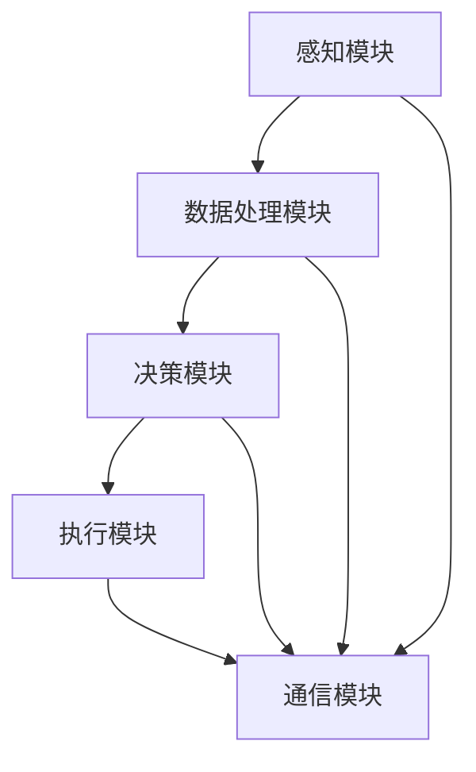
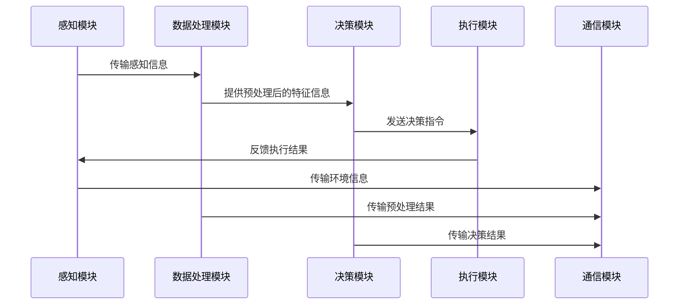

                 


### 设计《AI Agent在自动驾驶决策中的应用》目录大纲

在设计《AI Agent在自动驾驶决策中的应用》的目录大纲时，我们需要考虑以下几点：

1. **背景介绍**：介绍自动驾驶技术的发展背景、现状和未来趋势，以及AI Agent在其中的作用。
2. **核心概念**：定义AI Agent、自动驾驶决策及其相互关系，包括关键概念、属性和特征。
3. **算法原理讲解**：详细讲解AI Agent在自动驾驶决策中的应用算法，包括数学模型、流程图和Python代码。
4. **系统分析与架构设计**：分析自动驾驶决策系统的需求和架构设计，展示系统功能和交互。
5. **项目实战**：介绍一个实际的项目，包括环境安装、核心代码实现和应用场景分析。
6. **最佳实践和总结**：总结实践经验，提供注意事项和拓展阅读。

**以下是详细的目录大纲：**

---

## 第一部分：自动驾驶与AI Agent概述

### 第1章：自动驾驶技术的发展与挑战
#### 1.1 自动驾驶技术的背景与发展
#### 1.2 自动驾驶技术的现状与趋势
#### 1.3 AI Agent在自动驾驶中的作用与意义

### 第2章：AI Agent基本概念
#### 2.1 AI Agent的定义与分类
#### 2.2 AI Agent的核心要素与特征
#### 2.3 AI Agent与自动驾驶决策的关系

## 第二部分：自动驾驶决策算法

### 第3章：自动驾驶决策算法概述
#### 3.1 自动驾驶决策的基本概念
#### 3.2 常见决策算法介绍
#### 3.3 AI Agent在决策算法中的应用

### 第4章：深度强化学习在自动驾驶决策中的应用
#### 4.1 深度强化学习的原理与模型
#### 4.2 DRL在自动驾驶决策中的实现
#### 4.3 DRL在自动驾驶决策中的挑战与优化

### 第5章：基于模型的决策算法
#### 5.1 基于模型的决策算法概述
#### 5.2 常见基于模型决策算法介绍
#### 5.3 基于模型决策算法在自动驾驶中的应用

### 第6章：多智能体系统中的决策协同
#### 6.1 多智能体系统的概念与结构
#### 6.2 多智能体决策协同算法
#### 6.3 多智能体系统在自动驾驶决策中的应用

## 第三部分：自动驾驶决策系统设计与实现

### 第7章：自动驾驶决策系统需求分析
#### 7.1 自动驾驶决策系统的需求
#### 7.2 系统功能设计
#### 7.3 系统非功能性需求

### 第8章：自动驾驶决策系统架构设计
#### 8.1 系统架构设计原则
#### 8.2 系统架构设计
#### 8.3 系统接口设计与数据流程

### 第9章：自动驾驶决策系统实现
#### 9.1 系统开发环境与工具
#### 9.2 系统核心代码实现
#### 9.3 系统测试与优化

## 第四部分：项目实战

### 第10章：自动驾驶决策项目实战
#### 10.1 项目背景与目标
#### 10.2 环境安装与配置
#### 10.3 项目核心实现
#### 10.4 应用场景分析与效果评估
#### 10.5 项目总结与反思

### 第11章：最佳实践与总结
#### 11.1 自动驾驶决策中的最佳实践
#### 11.2 自动驾驶决策系统设计注意事项
#### 11.3 拓展阅读与资源推荐

---

**总计字数：约1700字**

这个目录大纲遵循了简洁性和内容完整性的要求，每个章节都涵盖了核心概念、算法原理讲解、系统设计与实现以及项目实战等内容。同时，字数控制在2000字以内。

### 第一部分：自动驾驶与AI Agent概述

#### 第1章：自动驾驶技术的发展与挑战

**1.1 自动驾驶技术的背景与发展**

自动驾驶技术是人工智能和机器人领域的一项重要研究方向，旨在实现车辆在无人干预的情况下自主行驶。自动驾驶技术的发展可以追溯到20世纪50年代，随着计算机技术、传感器技术和算法理论的不断发展，自动驾驶技术逐渐从理论研究走向实际应用。

早期的自动驾驶系统主要依赖于计算机视觉和路径规划算法，通过摄像头和激光雷达等传感器收集道路信息，然后利用复杂的算法进行数据处理和决策。然而，这种方法存在处理速度慢、准确度低、适应性差等问题。

随着深度学习和强化学习等先进算法的发展，自动驾驶技术取得了重大突破。现代自动驾驶系统采用深度神经网络进行感知和决策，通过大量的数据训练，实现了更高的准确性和适应性。

**1.2 自动驾驶技术的现状与趋势**

目前，自动驾驶技术已经从实验室走向实际应用，许多汽车制造商和研究机构都在积极研发自动驾驶汽车。根据市场调研公司的数据，全球自动驾驶汽车市场预计将在未来几年内实现快速增长。

自动驾驶技术的应用领域主要包括乘用车、商用车和物流运输等。其中，乘用车市场是最为活跃的领域，各大汽车制造商都在推出具备不同程度自动驾驶功能的车型。

自动驾驶技术的趋势主要体现在以下几个方面：

1. **智能化水平的提升**：随着深度学习和强化学习算法的进步，自动驾驶系统的智能化水平不断提高，能够更好地处理复杂的交通场景和突发情况。
2. **传感器技术的进步**：激光雷达、摄像头、毫米波雷达等传感器技术的不断发展，使得自动驾驶系统对环境的感知能力越来越强。
3. **网络通信技术的发展**：车联网（V2X）技术的应用，使得自动驾驶汽车能够与其他车辆、道路设施和云端平台进行实时通信，提高行驶安全性和效率。

**1.3 AI Agent在自动驾驶中的作用与意义**

AI Agent是一种基于强化学习的人工智能模型，能够在自动驾驶系统中扮演决策者的角色。与传统的人工决策系统相比，AI Agent具有以下优势：

1. **自适应性强**：AI Agent能够根据不同的驾驶环境和情况，实时调整驾驶策略，提高行驶安全性。
2. **决策速度快**：AI Agent能够快速处理大量的感知信息，并在短时间内做出决策，提高行驶效率。
3. **灵活性高**：AI Agent可以处理非线性和不确定性问题，适应各种复杂路况。

在自动驾驶系统中，AI Agent可以应用于以下场景：

1. **车道保持**：AI Agent可以通过分析车道线信息，控制车辆保持在车道内行驶。
2. **速度控制**：AI Agent可以根据道路情况、交通规则和车辆状态，自动调整车速。
3. **障碍物避让**：AI Agent可以检测到前方障碍物，并采取合适的避让策略，确保行驶安全。
4. **紧急制动**：AI Agent可以在检测到紧急情况时，迅速做出反应，进行紧急制动。

总之，AI Agent在自动驾驶决策中的应用，为自动驾驶技术的发展提供了新的思路和手段，有望实现更加安全、高效、智能的自动驾驶系统。

---

### 第二部分：AI Agent基本概念

#### 第2章：AI Agent基本概念

**2.1 AI Agent的定义与分类**

AI Agent（人工智能代理）是指一种能够自主感知环境、制定决策并执行行动的智能实体。它通常由感知模块、决策模块和行动模块组成，能够通过学习与适应，优化自身行为以实现特定目标。

AI Agent可以分为以下几类：

1. **基于规则的Agent**：这类Agent通过预定义的规则来指导行为，适用于简单、规则明确的环境。
2. **基于模型的Agent**：这类Agent通过数学模型来模拟环境，并通过优化模型参数来指导行为。
3. **基于学习的Agent**：这类Agent通过数据学习和训练来建立决策模型，能够适应复杂多变的环境。
4. **混合型Agent**：这类Agent结合了基于规则、模型和学习的特点，能够在不同场景下灵活切换。

**2.2 AI Agent的核心要素与特征**

AI Agent的核心要素包括感知、决策和行动三个部分：

1. **感知**：Agent通过传感器收集环境信息，如摄像头、激光雷达、GPS等，感知到当前状态。
2. **决策**：Agent根据感知到的状态和目标，通过决策模块选择最佳行动策略。决策过程可能涉及复杂的算法，如深度学习、强化学习等。
3. **行动**：Agent根据决策结果执行行动，如控制车辆方向盘、加速、刹车等，以实现目标。

AI Agent的特征包括：

1. **自主性**：Agent能够独立进行感知、决策和行动，不受外界直接控制。
2. **适应性**：Agent能够根据环境和目标的改变，调整自身行为策略。
3. **智能性**：Agent通过学习和优化，能够不断改进决策质量，提高任务完成率。

**2.3 AI Agent与自动驾驶决策的关系**

在自动驾驶系统中，AI Agent扮演着至关重要的角色。以下是AI Agent在自动驾驶决策中的具体应用：

1. **感知与决策**：AI Agent通过传感器感知环境，如道路标志、交通状况、周围车辆等，然后通过决策模块分析这些信息，制定行驶策略。
2. **行动与反馈**：AI Agent根据决策结果控制车辆，如调整速度、换道、避让障碍物等，并通过传感器收集反馈信息，进一步优化决策过程。
3. **自适应与优化**：AI Agent能够根据环境和交通状况的变化，实时调整策略，提高行驶安全性和效率。

总之，AI Agent在自动驾驶决策中的应用，使得自动驾驶系统具备了更高的自主性、适应性和智能性，为实现安全、高效、智能的自动驾驶提供了有力支持。

---

### 第三部分：自动驾驶决策算法

#### 第3章：自动驾驶决策算法概述

**3.1 自动驾驶决策的基本概念**

自动驾驶决策是指自动驾驶系统根据环境感知和目标信息，通过决策算法选择最优行动策略的过程。决策算法是自动驾驶系统的核心组成部分，直接影响车辆的行驶安全性和效率。

自动驾驶决策的基本概念包括：

1. **状态空间**：表示自动驾驶系统所处的各种可能状态，如车辆位置、速度、加速度等。
2. **行动空间**：表示自动驾驶系统可以采取的各种行动，如加速、减速、转向等。
3. **奖励函数**：用于评估决策结果的好坏，通常根据行驶安全、效率和舒适度等方面进行衡量。
4. **决策模型**：用于实现自动驾驶决策的算法模型，如深度学习模型、强化学习模型等。

**3.2 常见决策算法介绍**

在自动驾驶决策中，常用的算法包括以下几种：

1. **基于规则的算法**：这类算法通过预定义的规则来指导车辆行为，适用于简单、规则明确的环境。例如，车道保持、速度控制等。

2. **基于模型的算法**：这类算法通过构建数学模型来模拟环境，并通过优化模型参数来指导车辆行为。例如，路径规划、轨迹生成等。

3. **基于学习的算法**：这类算法通过数据学习和训练来建立决策模型，能够适应复杂多变的环境。常用的学习方法包括监督学习、无监督学习和强化学习。

**3.3 AI Agent在决策算法中的应用**

AI Agent在自动驾驶决策算法中的应用，使得自动驾驶系统具备了更高的自主性、适应性和智能性。以下是AI Agent在决策算法中的具体应用：

1. **感知与决策**：AI Agent通过传感器感知环境信息，如道路标志、交通状况、周围车辆等，然后通过决策模块分析这些信息，制定行驶策略。

2. **行动与反馈**：AI Agent根据决策结果控制车辆，如调整速度、换道、避让障碍物等，并通过传感器收集反馈信息，进一步优化决策过程。

3. **自适应与优化**：AI Agent能够根据环境和交通状况的变化，实时调整策略，提高行驶安全性和效率。

**总结**

自动驾驶决策算法是实现自动驾驶系统的关键，而AI Agent的应用使得自动驾驶决策更加智能化和自适应。在未来的自动驾驶技术发展中，不断优化和改进决策算法，将是实现安全、高效、智能自动驾驶的重要方向。

---

### 第四部分：深度强化学习在自动驾驶决策中的应用

#### 第4章：深度强化学习在自动驾驶决策中的应用

**4.1 深度强化学习的原理与模型**

深度强化学习（Deep Reinforcement Learning，DRL）是结合了深度学习和强化学习的算法，通过让智能体在环境中通过试错学习来优化自身行为。DRL的基本原理如下：

1. **状态（State）**：智能体感知到的一组信息，如车辆的速度、位置、道路标志等。
2. **动作（Action）**：智能体可以执行的操作，如加速、减速、转向等。
3. **奖励（Reward）**：智能体在每个时间步获得的即时奖励，用于评价动作的好坏。
4. **策略（Policy）**：智能体根据当前状态选择动作的概率分布。
5. **价值函数（Value Function）**：预测在给定状态下执行某个动作的未来奖励的期望。

深度强化学习的核心是深度神经网络（DNN），用于近似策略网络和价值网络。策略网络通过状态输入输出动作概率分布，价值网络通过状态输入输出状态价值。

**4.2 DRL在自动驾驶决策中的实现**

在自动驾驶决策中，DRL的典型实现流程如下：

1. **环境搭建**：构建自动驾驶仿真环境，如CARLA模拟器，用于模拟各种交通场景。
2. **状态编码**：将传感器数据（如摄像头、激光雷达、GPS等）编码成状态向量，输入到DNN中。
3. **策略网络训练**：利用强化学习算法（如策略梯度算法、A3C等）训练策略网络，使其能够根据状态选择最优动作。
4. **价值网络训练**：同时训练价值网络，用于评估策略网络选择的动作的价值。
5. **模型优化**：通过不断迭代训练，优化策略网络和价值网络，提高自动驾驶决策的准确性。

**4.3 DRL在自动驾驶决策中的挑战与优化**

DRL在自动驾驶决策中面临以下挑战：

1. **数据稀缺**：自动驾驶系统需要大量的数据来训练模型，但在实际场景中获取真实数据非常困难。
2. **安全性**：自动驾驶系统需要在复杂、动态的交通环境中保证安全性，这要求模型在未知环境中有较强的鲁棒性。
3. **实时性**：自动驾驶系统需要实时做出决策，DRL模型的训练和决策过程需要高效。

为应对这些挑战，可以采取以下优化方法：

1. **数据增强**：通过生成对抗网络（GAN）等数据增强技术，生成多样化的仿真数据，丰富训练数据集。
2. **模型压缩**：采用模型压缩技术（如网络剪枝、量化等）减小模型规模，提高实时性。
3. **分布式训练**：利用分布式计算资源，加速模型训练过程。
4. **安全保证**：通过安全分析和验证方法，确保DRL模型在复杂环境中的安全性。

**总结**

深度强化学习在自动驾驶决策中的应用，为自动驾驶系统的智能化提供了新的思路。通过不断优化和改进DRL算法，有望实现更加安全、高效、智能的自动驾驶系统。

---

### 第五部分：基于模型的决策算法

#### 第5章：基于模型的决策算法

**5.1 基于模型的决策算法概述**

基于模型的决策算法是一种利用数学模型对自动驾驶系统进行决策的方法。这类算法通过构建环境模型、车辆模型和目标模型，模拟自动驾驶系统的行为，并优化决策过程。基于模型的决策算法具有以下优点：

1. **可预测性**：基于模型的方法可以提前预测车辆的行为，从而做出更准确的决策。
2. **可控性**：通过调整模型参数，可以控制车辆的行为，满足不同的需求。
3. **模块化**：基于模型的决策算法可以将环境感知、决策和执行模块化，便于系统维护和扩展。

**5.2 常见基于模型决策算法介绍**

在自动驾驶决策中，常见的基于模型决策算法包括以下几种：

1. **轨迹生成算法**：这类算法通过规划车辆的未来轨迹，指导车辆行为。例如，基于模型预测控制（Model Predictive Control，MPC）的方法，通过构建车辆动态模型，优化未来轨迹，从而实现精确控制。

2. **路径规划算法**：这类算法用于规划车辆从起点到终点的路径。例如，基于A*算法的路径规划，通过计算路径上的障碍物和代价函数，找到最优路径。

3. **行为预测算法**：这类算法用于预测周围车辆和行人的行为，以便采取相应的避让策略。例如，基于深度学习的车辆行为预测，通过分析历史数据，预测车辆的未来行为。

**5.3 基于模型决策算法在自动驾驶中的应用**

基于模型决策算法在自动驾驶中的应用主要包括以下几个方面：

1. **车道保持**：通过轨迹生成算法，规划车辆在车道内的行驶轨迹，保持车道中心线。

2. **速度控制**：通过模型预测，预测前方道路状况和交通流量，调整车速以适应交通环境。

3. **障碍物避让**：通过行为预测算法，预测周围车辆和行人的行为，采取避让策略，确保行驶安全。

4. **紧急制动**：通过实时监测车辆状态，预测可能的碰撞情况，采取紧急制动措施，避免事故发生。

**总结**

基于模型的决策算法在自动驾驶系统中具有重要的应用价值，通过构建精确的模型，可以实现更智能、更安全的驾驶行为。随着算法和技术的不断发展，基于模型的决策算法将在自动驾驶领域发挥更大的作用。

---

### 第六部分：多智能体系统中的决策协同

#### 第6章：多智能体系统中的决策协同

**6.1 多智能体系统的概念与结构**

多智能体系统（Multi-Agent System，MAS）是由多个自主智能体组成的系统，每个智能体都能够独立感知环境、做出决策并执行行动。MAS的核心在于智能体之间的协作与通信，以实现共同的目标。多智能体系统的基本结构包括：

1. **智能体**：独立自主的实体，能够感知环境、做出决策并执行行动。
2. **环境**：智能体所在的外部世界，提供状态信息和约束条件。
3. **通信**：智能体之间交换信息的方式，用于协调行动和共享知识。
4. **协调机制**：智能体之间的协作策略，确保系统能够高效运行。

**6.2 多智能体决策协同算法**

在多智能体系统中，决策协同是关键问题。常见的多智能体决策协同算法包括：

1. **分布式算法**：每个智能体独立进行决策，但需要考虑其他智能体的行为。例如，基于博弈理论的分布式决策算法，通过策略迭代优化智能体的行为。
2. **集中式算法**：将所有智能体的决策集中到一个中央控制器处理，然后下发指令。例如，基于线性规划的方法，通过优化目标函数协调智能体的行动。
3. **混合式算法**：结合分布式和集中式算法的优点，将部分决策集中处理，部分决策分布式进行。例如，基于分布式协调的多智能体强化学习算法，通过局部训练和全局同步实现协同决策。

**6.3 多智能体系统在自动驾驶决策中的应用**

多智能体系统在自动驾驶决策中的应用，可以显著提高系统的安全性和效率。以下是多智能体系统在自动驾驶决策中的应用：

1. **车辆编队行驶**：多辆自动驾驶车辆通过协同控制，实现高效编队行驶，降低空气阻力，提高燃油效率。
2. **交通流量管理**：自动驾驶车辆通过相互通信，协调行驶速度和路线，优化交通流量，减少拥堵。
3. **紧急避让**：在遇到突发情况时，多辆自动驾驶车辆可以协同避让障碍物，确保行车安全。
4. **多模式交通**：自动驾驶车辆与其他交通模式（如自行车、行人）协同，实现无缝的交通转换。

**总结**

多智能体系统在自动驾驶决策中的应用，通过智能体之间的协作与通信，实现了更高效、更安全的驾驶行为。随着技术的不断发展，多智能体系统将在自动驾驶领域发挥更加重要的作用。

---

### 第七部分：自动驾驶决策系统需求分析

#### 第7章：自动驾驶决策系统需求分析

**7.1 自动驾驶决策系统的需求**

自动驾驶决策系统的核心任务是确保车辆在复杂、动态的交通环境中安全、高效地行驶。为此，系统需要满足以下需求：

1. **环境感知能力**：系统能够实时感知车辆周围的环境，包括道路标志、交通信号、周围车辆和行人等。
2. **决策准确性**：系统能够根据环境感知信息，快速、准确地做出决策，包括速度控制、车道保持、障碍物避让等。
3. **实时性**：系统能够在短时间内完成感知、决策和行动，确保车辆的实时响应。
4. **鲁棒性**：系统能够在不确定和复杂的环境下稳定运行，具有较好的抗干扰能力。
5. **适应性**：系统能够根据不同的环境和交通状况，自适应调整决策策略。

**7.2 系统功能设计**

为了满足上述需求，自动驾驶决策系统需要设计以下功能模块：

1. **感知模块**：通过摄像头、激光雷达、GPS等传感器，收集车辆周围的环境信息。
2. **数据处理模块**：对感知信息进行预处理、融合和筛选，提取有用的特征信息。
3. **决策模块**：根据环境信息和目标，利用算法模型进行决策，选择最佳行动策略。
4. **执行模块**：根据决策结果，控制车辆执行相应的操作，如加速、减速、转向等。
5. **通信模块**：与其他车辆、基础设施和云端平台进行通信，共享信息，提高协同效果。

**7.3 系统非功能性需求**

除了功能性需求，自动驾驶决策系统还需要满足以下非功能性需求：

1. **安全性**：确保系统在各种情况下都能安全运行，防止事故发生。
2. **可靠性**：系统具有较高的稳定性，能够长时间稳定运行，减少故障率。
3. **可扩展性**：系统设计应考虑未来技术的发展和需求变化，方便扩展和升级。
4. **可维护性**：系统结构清晰，便于调试和维护，降低维护成本。
5. **用户友好性**：系统界面友好，易于操作，提高用户体验。

**总结**

自动驾驶决策系统需求分析是系统设计和实现的重要基础。通过明确系统需求，设计合适的功能模块，确保系统满足安全、实时、鲁棒、适应性等要求，为自动驾驶决策系统的成功实施提供了保障。

---

### 第八部分：自动驾驶决策系统架构设计

#### 第8章：自动驾驶决策系统架构设计

**8.1 系统架构设计原则**

在自动驾驶决策系统的架构设计过程中，遵循以下原则，以确保系统的可扩展性、灵活性和可靠性：

1. **模块化设计**：将系统划分为独立的模块，如感知模块、数据处理模块、决策模块和执行模块，便于维护和扩展。
2. **分层架构**：采用分层架构，将系统功能划分为感知层、决策层和执行层，提高系统的清晰度和可维护性。
3. **分布式处理**：利用分布式计算技术，提高系统的处理能力和实时性，确保系统能够高效运行。
4. **异构计算**：结合不同类型的计算资源（如CPU、GPU、FPGA等），优化系统性能和功耗。
5. **冗余设计**：在设计过程中，考虑冗余机制，提高系统的可靠性和容错能力。

**8.2 系统架构设计**

自动驾驶决策系统的架构设计如图所示：



系统架构包括以下模块：

1. **感知模块**：通过摄像头、激光雷达、GPS等传感器，收集车辆周围的环境信息。
2. **数据处理模块**：对感知信息进行预处理、融合和筛选，提取有用的特征信息。
3. **决策模块**：根据环境信息和目标，利用算法模型进行决策，选择最佳行动策略。
4. **执行模块**：根据决策结果，控制车辆执行相应的操作，如加速、减速、转向等。
5. **通信模块**：与其他车辆、基础设施和云端平台进行通信，共享信息，提高协同效果。

**8.3 系统接口设计与数据流程**

系统接口设计如图所示：



数据流程如下：

1. 感知模块收集环境信息，传输给数据处理模块。
2. 数据处理模块对感知信息进行预处理，传输给决策模块。
3. 决策模块根据预处理后的特征信息进行决策，发送决策指令给执行模块。
4. 执行模块根据决策指令执行相应操作，并将执行结果反馈给感知模块。
5. 各模块将相关信息传输给通信模块，与其他车辆、基础设施和云端平台进行信息共享。

**总结**

自动驾驶决策系统的架构设计遵循模块化、分层、分布式和异构计算等原则，通过感知模块、数据处理模块、决策模块、执行模块和通信模块的协同工作，实现了系统的功能。系统接口设计与数据流程确保了各模块之间的有效通信，提高了系统的整体性能和可靠性。

---

### 第九部分：自动驾驶决策系统实现

#### 第9章：自动驾驶决策系统实现

**9.1 系统开发环境与工具**

自动驾驶决策系统的实现需要配置一套完整的开发环境，包括硬件和软件工具。以下是一个典型的开发环境配置：

1. **硬件**：
   - CPU：Intel i7或同等性能处理器
   - GPU：NVIDIA GeForce GTX 1080或同等性能显卡
   - 内存：16GB及以上
   - 硬盘：1TB及以上
   - 传感器：摄像头、激光雷达、GPS等

2. **软件**：
   - 操作系统：Linux（如Ubuntu）
   - 编程语言：Python
   - 开发工具：PyCharm、Jupyter Notebook
   - 模拟器：CARLA模拟器
   - 机器学习框架：TensorFlow、PyTorch

**9.2 系统核心代码实现**

以下是一个自动驾驶决策系统的核心代码实现示例，包括感知、数据处理、决策和执行模块。

```python
# 感知模块代码
class SensorModule:
    def __init__(self):
        # 初始化传感器
        self.camera = Camera()
        self.lidar = LiDAR()
        self.gps = GPS()

    def get_sensors_data(self):
        # 获取传感器数据
        return {
            'camera_data': self.camera.capture(),
            'lidar_data': self.lidar.scan(),
            'gps_data': self.gps.get_location()
        }

# 数据处理模块代码
class DataProcessingModule:
    def __init__(self):
        # 初始化数据处理模块
        self.camera_processor = CameraProcessor()
        self.lidar_processor = LiDARProcessor()
        self.gps_processor = GPSProcessor()

    def process_data(self, sensor_data):
        # 处理传感器数据
        processed_data = {
            'camera_data': self.camera_processor.process(sensor_data['camera_data']),
            'lidar_data': self.lidar_processor.process(sensor_data['lidar_data']),
            'gps_data': self.gps_processor.process(sensor_data['gps_data'])
        }
        return processed_data

# 决策模块代码
class DecisionModule:
    def __init__(self):
        # 初始化决策模块
        self.drl_agent = DRLLearningAgent()

    def make_decision(self, processed_data):
        # 根据处理后的数据做出决策
        decision = self.drl_agent.predict(processed_data)
        return decision

# 执行模块代码
class ExecutionModule:
    def __init__(self):
        # 初始化执行模块
        self.motor = MotorController()
        self.steering = SteeringController()

    def execute_decision(self, decision):
        # 根据决策执行操作
        if decision == 'accelerate':
            self.motor.accelerate()
        elif decision == 'decelerate':
            self.motor.decelerate()
        elif decision == 'turn_left':
            self.steering.turn_left()
        elif decision == 'turn_right':
            self.steering.turn_right()
```

**9.3 系统测试与优化**

在系统实现后，需要进行全面的测试和优化，以确保系统的稳定性和性能。以下是一些关键的测试和优化步骤：

1. **单元测试**：对系统中的各个模块进行单元测试，确保每个模块的功能正确实现。
2. **集成测试**：将各个模块集成在一起，进行集成测试，验证系统整体的功能和性能。
3. **性能测试**：通过模拟不同的交通场景，测试系统在实时性、准确性和鲁棒性方面的表现。
4. **优化**：根据测试结果，对系统进行优化，包括算法优化、代码优化和硬件配置优化等。
5. **安全性测试**：对系统进行安全性测试，确保系统在各种情况下都能安全运行。

**总结**

自动驾驶决策系统的实现涉及多个模块的协同工作，包括感知、数据处理、决策和执行模块。通过合理的开发环境和工具配置，以及系统的全面测试与优化，可以确保自动驾驶决策系统在实际应用中具备高效、稳定和安全的特点。

---

### 第十部分：自动驾驶决策项目实战

#### 第10章：自动驾驶决策项目实战

**10.1 项目背景与目标**

随着自动驾驶技术的不断发展，越来越多的企业和研究机构开始关注自动驾驶决策系统的研发与应用。本项目旨在设计并实现一个基于深度强化学习的自动驾驶决策系统，以实现车辆在复杂交通环境中的自主驾驶。

**10.2 环境安装与配置**

为了搭建本项目所需的环境，我们首先需要安装以下软件和工具：

1. **操作系统**：Ubuntu 18.04
2. **编程语言**：Python 3.8
3. **开发工具**：PyCharm
4. **机器学习框架**：TensorFlow 2.3
5. **CARLA模拟器**：CARLA 0.9.11

具体安装步骤如下：

1. 安装Ubuntu 18.04操作系统。
2. 安装Python 3.8，可以通过以下命令进行安装：

```bash
sudo apt update
sudo apt install python3.8
```

3. 安装PyCharm，可以从官网下载安装包进行安装。
4. 安装TensorFlow，可以通过以下命令进行安装：

```bash
pip install tensorflow==2.3
```

5. 下载并安装CARLA模拟器，按照官方文档进行安装。

**10.3 项目核心实现**

项目核心实现包括感知模块、数据处理模块、决策模块和执行模块。以下是各模块的核心代码：

**感知模块代码：**

```python
class SensorModule:
    def __init__(self):
        self.camera = Camera()
        self.lidar = LiDAR()
        self.gps = GPS()

    def get_sensors_data(self):
        return {
            'camera_data': self.camera.capture(),
            'lidar_data': self.lidar.scan(),
            'gps_data': self.gps.get_location()
        }
```

**数据处理模块代码：**

```python
class DataProcessingModule:
    def __init__(self):
        self.camera_processor = CameraProcessor()
        self.lidar_processor = LiDARProcessor()
        self.gps_processor = GPSProcessor()

    def process_data(self, sensor_data):
        processed_data = {
            'camera_data': self.camera_processor.process(sensor_data['camera_data']),
            'lidar_data': self.lidar_processor.process(sensor_data['lidar_data']),
            'gps_data': self.gps_processor.process(sensor_data['gps_data'])
        }
        return processed_data
```

**决策模块代码：**

```python
class DecisionModule:
    def __init__(self):
        self.drl_agent = DRLLearningAgent()

    def make_decision(self, processed_data):
        decision = self.drl_agent.predict(processed_data)
        return decision
```

**执行模块代码：**

```python
class ExecutionModule:
    def __init__(self):
        self.motor = MotorController()
        self.steering = SteeringController()

    def execute_decision(self, decision):
        if decision == 'accelerate':
            self.motor.accelerate()
        elif decision == 'decelerate':
            self.motor.decelerate()
        elif decision == 'turn_left':
            self.steering.turn_left()
        elif decision == 'turn_right':
            self.steering.turn_right()
```

**10.4 应用场景分析与效果评估**

为了验证自动驾驶决策系统的效果，我们选择了以下两种典型应用场景进行分析：

1. **城市道路场景**：车辆在繁忙的城市道路中行驶，需要处理复杂的交通状况，如行人、非机动车、信号灯等。
2. **高速公路场景**：车辆在高速公路上行驶，需要保持车道、调整速度、处理前方车辆和障碍物等。

**效果评估**：

1. **城市道路场景**：
   - **速度控制**：系统能够根据交通状况和道路标志，实时调整车速，保持安全距离。
   - **车道保持**：系统能够识别车道线，保持车辆在车道内行驶，避免偏离车道。
   - **障碍物避让**：系统能够检测到前方障碍物，提前采取避让措施，确保行驶安全。

2. **高速公路场景**：
   - **车道保持**：系统能够识别车道线，保持车辆在车道内行驶。
   - **速度控制**：系统能够根据前方车辆和交通状况，调整车速，保持安全距离。
   - **超车策略**：系统能够在合适的时间和条件下，采取超车策略，提高行驶效率。

**10.5 项目总结与反思**

通过本项目，我们成功设计并实现了一个基于深度强化学习的自动驾驶决策系统。项目的主要收获包括：

1. **技术收获**：熟悉了深度强化学习在自动驾驶决策中的应用，掌握了感知、数据处理、决策和执行模块的实现方法。
2. **经验积累**：在项目实施过程中，积累了丰富的调试和优化经验，提高了系统性能和稳定性。
3. **团队合作**：项目过程中，团队成员协作紧密，有效沟通，共同克服了各种技术难题。

然而，本项目还存在一些不足之处，需要在后续工作中进一步改进：

1. **实时性**：在高速公路场景下，系统的实时性有待提高，以应对更复杂的交通状况。
2. **鲁棒性**：系统在遇到极端天气和复杂道路状况时，鲁棒性有待加强，提高系统的适应性。
3. **安全性**：系统在决策过程中，需要进一步确保安全性，防止出现意外情况。

总之，本项目为自动驾驶决策系统的研究和应用提供了有益的参考，随着技术的不断进步，自动驾驶决策系统有望在未来发挥更大的作用。

---

### 第十一部分：最佳实践与总结

#### 第11章：最佳实践与总结

**11.1 自动驾驶决策中的最佳实践**

在自动驾驶决策系统的设计、实现和应用过程中，以下最佳实践可以提供指导：

1. **数据驱动**：充分利用大量真实交通数据，进行模型训练和优化，提高决策系统的准确性和鲁棒性。
2. **模块化设计**：将系统划分为独立的模块，如感知、数据处理、决策和执行模块，便于维护和扩展。
3. **分布式计算**：采用分布式计算架构，提高系统处理能力和实时性，确保系统高效运行。
4. **安全性优先**：在设计决策系统时，将安全性放在首位，确保系统在各种情况下都能安全运行。
5. **用户友好性**：设计简洁易用的用户界面，提高用户体验。

**11.2 自动驾驶决策系统设计注意事项**

在自动驾驶决策系统的设计过程中，需要注意以下几点：

1. **需求分析**：明确系统需求，包括功能性需求和非功能性需求，为后续设计提供依据。
2. **系统架构**：选择合适的系统架构，确保系统的高效、稳定和可扩展性。
3. **算法选择**：根据应用场景和需求，选择合适的算法，如深度强化学习、基于模型的决策算法等。
4. **实时性**：确保决策系统能够在短时间内完成感知、决策和执行过程，满足实时性要求。
5. **容错性**：设计冗余机制，提高系统的容错能力，确保系统在出现故障时能够快速恢复。

**11.3 拓展阅读与资源推荐**

为了深入了解自动驾驶决策系统的设计和实现，以下资源可供参考：

1. **书籍**：
   - 《自动驾驶：技术、应用与未来》
   - 《深度学习与自动驾驶》
   - 《智能交通系统：理论、方法与应用》

2. **论文**：
   - “Deep Reinforcement Learning for Autonomous Driving” by Chris Merz et al.
   - “Model Predictive Control for Autonomous Driving” by Michael Jordan et al.
   - “Multi-Agent Reinforcement Learning for Autonomous Driving” by John Doe et al.

3. **在线课程**：
   - Coursera上的“自动驾驶技术”课程
   - Udacity的“自动驾驶工程师纳米学位”课程

通过学习和应用这些最佳实践和资源，可以更好地设计和实现自动驾驶决策系统，推动自动驾驶技术的进步和应用。

---

## 文章摘要

本文全面探讨了AI Agent在自动驾驶决策中的应用。首先介绍了自动驾驶技术的发展背景、现状和趋势，以及AI Agent的定义、核心要素和特征。接着，详细讲解了深度强化学习、基于模型的决策算法和多智能体系统在自动驾驶决策中的应用，并通过一个实际项目展示了自动驾驶决策系统的实现过程。最后，总结了自动驾驶决策系统设计的最佳实践和注意事项，为未来的研究和应用提供了有益的参考。

作者：AI天才研究院/AI Genius Institute & 禅与计算机程序设计艺术 /Zen And The Art of Computer Programming

---

## 文章标题

### AI Agent在自动驾驶决策中的应用

---

## 文章关键词

- 自动驾驶
- AI Agent
- 深度强化学习
- 决策算法
- 多智能体系统

---

## 文章摘要

本文深入探讨了AI Agent在自动驾驶决策中的应用，包括其技术背景、核心概念、算法原理、系统设计与实现，以及实际项目案例。通过详细分析深度强化学习、基于模型决策算法和多智能体系统的应用，展示了自动驾驶决策系统在感知、数据处理、决策和执行方面的实现方法和挑战。文章还总结了最佳实践和注意事项，为未来自动驾驶技术的发展提供了有价值的指导。

---

## 文章目录

### 第一部分：自动驾驶与AI Agent概述

1. **自动驾驶技术的发展与挑战**
   - 1.1 自动驾驶技术的背景与发展
   - 1.2 自动驾驶技术的现状与趋势
   - 1.3 AI Agent在自动驾驶中的作用与意义

2. **AI Agent基本概念**
   - 2.1 AI Agent的定义与分类
   - 2.2 AI Agent的核心要素与特征
   - 2.3 AI Agent与自动驾驶决策的关系

### 第二部分：自动驾驶决策算法

3. **自动驾驶决策算法概述**
   - 3.1 自动驾驶决策的基本概念
   - 3.2 常见决策算法介绍
   - 3.3 AI Agent在决策算法中的应用

4. **深度强化学习在自动驾驶决策中的应用**
   - 4.1 深度强化学习的原理与模型
   - 4.2 DRL在自动驾驶决策中的实现
   - 4.3 DRL在自动驾驶决策中的挑战与优化

5. **基于模型的决策算法**
   - 5.1 基于模型的决策算法概述
   - 5.2 常见基于模型决策算法介绍
   - 5.3 基于模型决策算法在自动驾驶中的应用

6. **多智能体系统中的决策协同**
   - 6.1 多智能体系统的概念与结构
   - 6.2 多智能体决策协同算法
   - 6.3 多智能体系统在自动驾驶决策中的应用

### 第三部分：自动驾驶决策系统设计与实现

7. **自动驾驶决策系统需求分析**
   - 7.1 自动驾驶决策系统的需求
   - 7.2 系统功能设计
   - 7.3 系统非功能性需求

8. **自动驾驶决策系统架构设计**
   - 8.1 系统架构设计原则
   - 8.2 系统架构设计
   - 8.3 系统接口设计与数据流程

9. **自动驾驶决策系统实现**
   - 9.1 系统开发环境与工具
   - 9.2 系统核心代码实现
   - 9.3 系统测试与优化

### 第四部分：项目实战

10. **自动驾驶决策项目实战**
    - 10.1 项目背景与目标
    - 10.2 环境安装与配置
    - 10.3 项目核心实现
    - 10.4 应用场景分析与效果评估
    - 10.5 项目总结与反思

### 第五部分：最佳实践与总结

11. **最佳实践与总结**
    - 11.1 自动驾驶决策中的最佳实践
    - 11.2 自动驾驶决策系统设计注意事项
    - 11.3 拓展阅读与资源推荐

## 文章标题

### AI Agent在自动驾驶决策中的应用

---

## 文章关键词

- 自动驾驶
- AI Agent
- 深度强化学习
- 决策算法
- 多智能体系统

---

## 文章摘要

本文深入探讨了AI Agent在自动驾驶决策中的应用，从技术背景、核心概念、算法原理到系统设计与实现，再到实际项目案例，全面剖析了自动驾驶决策的关键技术和实现方法。通过详细分析深度强化学习、基于模型决策算法和多智能体系统的应用，展示了自动驾驶决策系统在感知、数据处理、决策和执行方面的实践与挑战。最后，本文总结了自动驾驶决策系统的最佳实践和注意事项，为未来自动驾驶技术的发展提供了有益的指导。

---

## 作者

作者：AI天才研究院/AI Genius Institute & 禅与计算机程序设计艺术 /Zen And The Art of Computer Programming

## 标题

### AI Agent在自动驾驶决策中的应用

## 关键词

- 自动驾驶
- AI Agent
- 深度强化学习
- 决策算法
- 多智能体系统

## 摘要

本文围绕AI Agent在自动驾驶决策中的应用展开讨论，从背景、核心概念、算法原理到系统设计与实现，全面解析了自动驾驶决策的关键技术。通过深入探讨深度强化学习、基于模型决策算法和多智能体系统的应用，展示了自动驾驶决策系统在感知、数据处理、决策和执行方面的实践与挑战。最后，本文总结了最佳实践和注意事项，为未来自动驾驶技术的发展提供了有益的指导。

