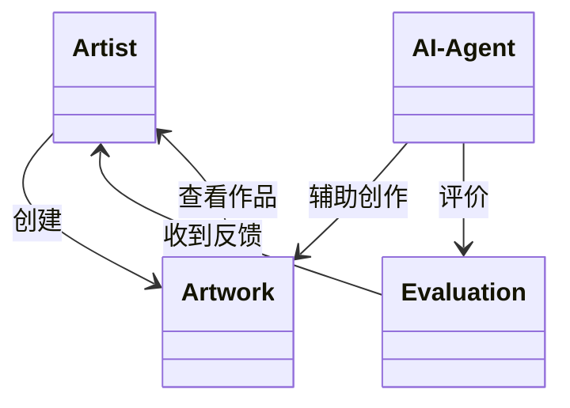
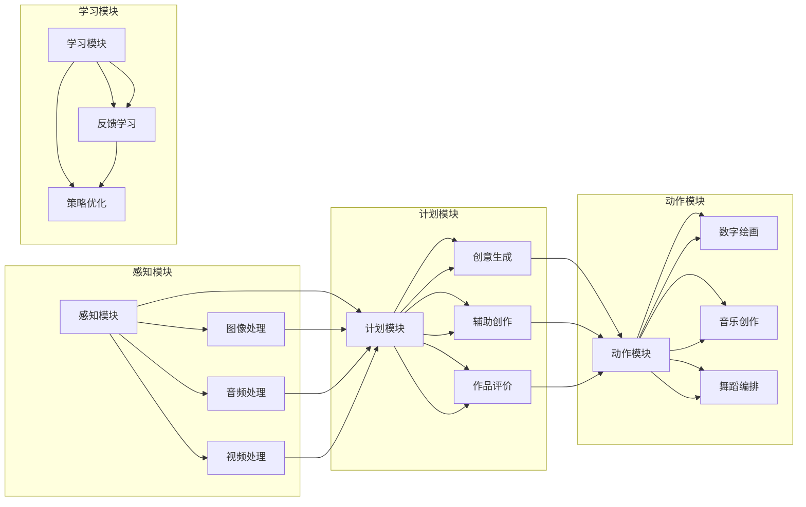
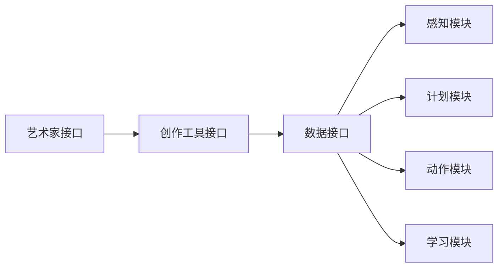
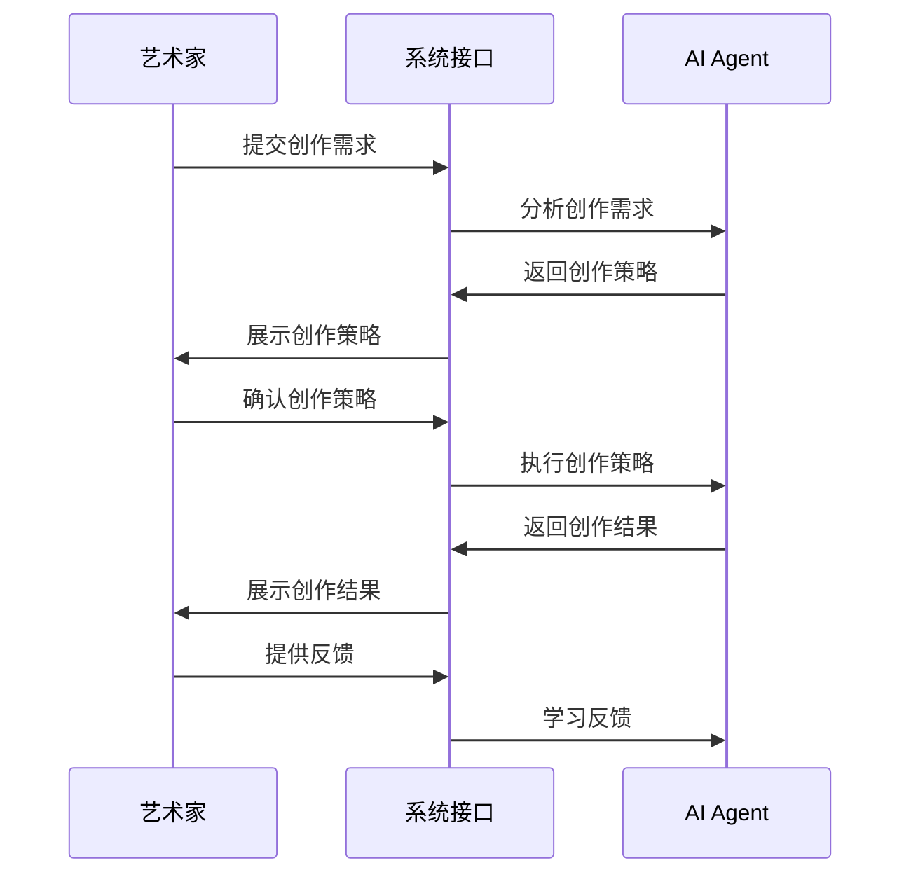

                 

## AI Agent在艺术创作中的应用

> 关键词：AI Agent、艺术创作、算法、系统架构、项目实战

> 摘要：本文深入探讨了AI Agent在艺术创作中的应用，从基础理论到实际案例，全面解析了AI Agent在数字绘画、音乐创作、舞蹈编导和文学创作等方面的应用场景。通过具体算法原理和实现步骤的详细讲解，以及系统架构和项目实战的分析，本文为读者提供了一个全面而系统的了解，旨在推动AI与艺术创作的深度融合。

### 引言与概述

#### 1.1 问题背景

随着人工智能技术的不断发展，AI在各个领域中的应用日益广泛，艺术创作也不例外。当前，AI在艺术创作中的应用已经取得了一定的成果，例如数字绘画、音乐创作、舞蹈编导和文学创作等领域。然而，AI Agent作为一个新兴的概念，其在艺术创作中的应用仍处于探索阶段。

AI Agent是指具备自主决策和执行能力的智能体，能够在特定的环境下执行任务。在艺术创作中，AI Agent可以扮演多种角色，如创作助手、创意生成器等。然而，艺术创作具有高度的创造性和个性化特点，这对AI Agent的技术提出了更高的要求。

#### 1.2 问题描述

AI Agent在艺术创作中的角色和功能主要包括以下几个方面：

1. **创意生成**：AI Agent可以基于已有的数据和算法生成新的艺术创意，为艺术家提供灵感和参考。
2. **辅助创作**：AI Agent可以协助艺术家完成部分创作任务，如图像处理、音乐编辑等。
3. **评价与反馈**：AI Agent可以对艺术作品进行评价，提供反馈和建议，帮助艺术家改进作品。

然而，艺术创作面临的技术挑战也相当显著，如：

1. **复杂性**：艺术创作过程复杂，涉及多种艺术形式和技术手段，对AI Agent的通用性和适应性提出了挑战。
2. **个性化**：艺术创作强调个性化和独特性，AI Agent需要能够理解并体现艺术家的风格和特点。
3. **伦理与道德**：AI在艺术创作中的应用引发了关于版权、伦理和道德等方面的争议，需要制定相应的规范和标准。

#### 1.3 问题解决

针对上述问题，本文将从以下几个方面探讨AI Agent在艺术创作中的应用：

1. **应用场景**：分析AI Agent在不同艺术创作领域的应用场景，如数字绘画、音乐创作、舞蹈编导和文学创作等。
2. **算法原理**：讲解AI Agent在艺术创作中的算法原理和实现步骤，包括常用的算法、数学模型和公式等。
3. **系统架构**：设计AI Agent在艺术创作中的系统架构，包括问题场景介绍、系统功能设计、架构设计、接口设计和交互设计等。
4. **项目实战**：通过实际项目案例，展示AI Agent在艺术创作中的应用效果，并进行详细的分析和解读。

#### 1.4 边界与外延

AI Agent在艺术创作中的应用边界主要涉及以下几个方面：

1. **技术边界**：AI Agent在艺术创作中的应用受到现有技术和算法的限制，需要持续的技术创新和改进。
2. **艺术边界**：艺术创作具有多样性和个性化特点，AI Agent需要能够适应不同的艺术形式和风格。
3. **伦理边界**：AI Agent在艺术创作中的应用需要遵循伦理和道德规范，确保艺术创作的公正性和合理性。

此外，AI Agent在艺术创作中的应用也与其他领域产生了交叉融合，如计算机图形学、音乐理论、舞蹈编导和文学创作等。这种交叉融合为AI Agent在艺术创作中的应用提供了更广阔的发展空间。

#### 1.5 概念结构与核心要素组成

本文将AI Agent在艺术创作中的应用分为以下几个核心要素：

1. **AI Agent定义**：明确AI Agent的概念和分类，介绍其基本原理和工作方式。
2. **艺术创作定义**：阐述艺术创作的概念、特点和分类，为AI Agent在艺术创作中的应用提供背景知识。
3. **AI Agent与艺术创作的核心要素**：分析AI Agent在艺术创作中的核心功能和角色，探讨其在创作流程中的具体应用。

通过上述概念结构和核心要素的组成，本文为读者提供了一个全面而系统的了解，旨在推动AI与艺术创作的深度融合。

### AI Agent基础理论

#### 2.1 AI Agent概述

AI Agent是指具备自主决策和执行能力的智能体，能够在特定的环境下执行任务。AI Agent的概念最早由John McCarthy在1960年代提出，其核心思想是模拟人类的认知过程，使计算机能够自主地执行任务。

AI Agent可以按照不同的标准进行分类。例如，按照功能可以分为感知型Agent、反应型Agent、认知型Agent和社交型Agent；按照环境可以分为确定性环境Agent、不确定环境Agent和混合环境Agent。

AI Agent的基本原理主要包括以下几个方面：

1. **感知**：AI Agent通过感知模块获取环境信息，如视觉、听觉、触觉等。
2. **计划**：AI Agent根据感知到的信息，通过计划模块制定执行任务的策略。
3. **行动**：AI Agent通过行动模块执行任务，并将其结果反馈给感知模块。
4. **学习**：AI Agent通过学习模块不断优化自己的行为和策略，以适应不断变化的环境。

#### 2.2 AI Agent核心组件

AI Agent的核心组件主要包括感知模块、动作模块、计划模块和学习模块。

1. **感知模块**：感知模块是AI Agent获取环境信息的关键组件，通过传感器或数据接口获取环境中的视觉、听觉、触觉等信息。感知模块需要对输入的信息进行处理和解析，以提取有用的特征。

2. **动作模块**：动作模块是AI Agent执行任务的执行单元，根据计划模块提供的策略，控制执行的动作。动作模块通常包括执行机构的控制程序，如电机控制、机器人运动控制等。

3. **计划模块**：计划模块是AI Agent的核心决策单元，根据感知模块提供的信息，制定执行任务的策略。计划模块通常采用推理算法和规划算法，如状态空间搜索、决策树、计划图等。

4. **学习模块**：学习模块是AI Agent不断优化自身行为和策略的关键组件。通过经验反馈，学习模块可以调整感知、计划、行动等模块的参数，以提高AI Agent的性能和适应性。

#### 2.3 AI Agent在艺术创作中的工作原理

AI Agent在艺术创作中的应用，主要通过创造性思维和创作流程来实现。

1. **创造性思维**：创造性思维是艺术创作的核心，AI Agent通过感知模块获取环境信息，结合自身的知识库和算法，产生新的创意。这种创造性思维的过程，类似于人类艺术家在创作过程中的灵感和直觉。

2. **创作流程**：艺术创作通常包括构思、创作、修改和完善等阶段。AI Agent在艺术创作中的工作原理，可以看作是对这些阶段的自动化和优化。具体来说：

   - **构思阶段**：AI Agent通过分析大量的艺术作品和素材，结合自身的创造性思维，生成新的创意。
   - **创作阶段**：AI Agent根据构思阶段的创意，利用算法和工具进行创作，如数字绘画、音乐创作等。
   - **修改和完善阶段**：AI Agent根据艺术家的反馈和评价，不断优化和完善作品，以提高艺术价值和创作效果。

通过创造性思维和创作流程的结合，AI Agent在艺术创作中实现了自主创作和优化，为艺术家提供了强大的创作助手。

### AI Agent在艺术创作中的应用场景

#### 3.1 数字绘画与AI Agent

数字绘画是AI Agent在艺术创作中最具代表性的应用场景之一。AI Agent在数字绘画中，主要扮演创作助手和创意生成器的角色。

1. **创作助手**：AI Agent可以帮助艺术家完成一些繁琐和重复性的工作，如图像处理、颜色调整、纹理生成等。通过感知模块获取艺术家提供的初始图像，AI Agent可以根据算法和策略，自动优化和调整图像的视觉效果。

2. **创意生成器**：AI Agent可以通过分析大量的艺术作品和素材，生成新的艺术创意。例如，基于深度学习算法的生成对抗网络（GAN），可以生成具有独特风格和创意的数字绘画作品。

**数字绘画创作案例**：以GAN为例，通过训练一个生成模型和一个判别模型，AI Agent可以生成具有不同风格和创意的数字绘画作品。例如，AI Agent可以学习毕加索的艺术风格，生成一幅毕加索风格的数字绘画作品。这不仅为艺术家提供了新的创作灵感，也为观众带来了独特的艺术体验。

#### 3.2 音乐创作与AI Agent

音乐创作是AI Agent在艺术创作中的另一个重要应用场景。AI Agent在音乐创作中，可以扮演音乐助手和作曲家的角色。

1. **音乐助手**：AI Agent可以帮助音乐家完成一些音乐创作的基础工作，如音符生成、和弦编排、节奏设计等。通过感知模块获取音乐家的创作意图和需求，AI Agent可以根据算法和策略，自动生成符合要求的音乐作品。

2. **作曲家**：AI Agent可以通过分析大量的音乐作品和音乐理论，创作出独特的音乐作品。例如，AI Agent可以学习古典音乐大师的作品，生成具有古典音乐风格的新作品。

**音乐创作案例**：以AI作曲家AIVA为例，AIVA是一个基于深度学习的AI作曲家，它可以通过分析大量的音乐作品，创作出独特的音乐作品。AIVA的音乐作品涵盖了多种风格，如古典音乐、爵士乐、流行音乐等，受到了全球音乐爱好者的喜爱。

#### 3.3 舞蹈编导与AI Agent

舞蹈编导是AI Agent在艺术创作中的又一重要应用场景。AI Agent在舞蹈编导中，可以扮演创意生成器、编舞助手和编舞师的角色。

1. **创意生成器**：AI Agent可以通过分析大量的舞蹈视频和舞蹈理论，生成新的舞蹈创意。例如，AI Agent可以学习现代舞、民族舞等不同风格的舞蹈，生成新的舞蹈创意。

2. **编舞助手**：AI Agent可以帮助舞蹈编导完成一些编舞的繁琐工作，如动作编排、音乐配合、舞美设计等。通过感知模块获取编导的创作意图和需求，AI Agent可以根据算法和策略，自动生成符合要求的舞蹈动作。

3. **编舞师**：AI Agent可以通过分析大量的舞蹈作品和编舞技巧，创作出独特的舞蹈作品。例如，AI Agent可以学习著名舞蹈编导的作品，生成具有独特风格的舞蹈作品。

**舞蹈编导案例**：以AI舞蹈编导Lifted Studios为例，Lifted Studios是一个利用AI技术进行舞蹈编导的团队，他们通过AI算法分析舞蹈视频，生成新的舞蹈创意。Lifted Studios的作品不仅在舞蹈界引起了广泛关注，也为观众带来了全新的舞蹈体验。

#### 3.4 文学创作与AI Agent

文学创作是AI Agent在艺术创作中的最后一个重要应用场景。AI Agent在文学创作中，可以扮演故事生成器、写作助手和小说家的角色。

1. **故事生成器**：AI Agent可以通过分析大量的文学作品和故事情节，生成新的故事创意。例如，AI Agent可以学习经典小说、现代小说等不同类型的文学作品，生成新的故事情节。

2. **写作助手**：AI Agent可以帮助作家完成一些写作的基础工作，如句子生成、段落编排、情节设计等。通过感知模块获取作家的创作意图和需求，AI Agent可以根据算法和策略，自动生成符合要求的文学作品。

3. **小说家**：AI Agent可以通过分析大量的文学作品和文学理论，创作出独特的小说作品。例如，AI Agent可以学习著名作家的作品，生成具有独特文学风格的新小说。

**文学创作案例**：以AI小说家GPT-3为例，GPT-3是一个基于深度学习的AI小说家，它可以通过分析大量的文学作品，生成新的小说作品。GPT-3的小说作品不仅在文学界引起了广泛关注，也为读者带来了全新的阅读体验。

### AI Agent在艺术创作中的算法原理与实现

#### 4.1 算法原理讲解

AI Agent在艺术创作中的算法原理主要包括以下几个方面：

1. **生成对抗网络（GAN）**：GAN是一种深度学习模型，由生成器和判别器组成。生成器负责生成艺术作品，判别器负责判断生成的艺术作品是否真实。通过不断地训练和优化，生成器可以生成越来越逼真的艺术作品。

2. **长短期记忆网络（LSTM）**：LSTM是一种特殊的循环神经网络，适用于处理序列数据。在音乐创作和文学创作中，LSTM可以用于生成音符序列和文字序列，实现音乐和小说的自动生成。

3. **卷积神经网络（CNN）**：CNN是一种用于图像识别和处理的深度学习模型。在数字绘画和图像生成中，CNN可以用于提取图像特征，生成具有特定风格和主题的图像。

4. **深度强化学习**：深度强化学习是一种结合了深度学习和强化学习的方法。在舞蹈编导和游戏开发中，深度强化学习可以用于训练AI Agent，实现自主学习和决策。

#### 4.2 Python代码实现

以下是利用GAN进行数字绘画的Python代码实现：

```python
import tensorflow as tf
from tensorflow.keras.layers import Dense, Flatten, Reshape
from tensorflow.keras.models import Sequential
from tensorflow.keras.optimizers import Adam

# 定义生成器和判别器
def build_generator():
    model = Sequential()
    model.add(Dense(128, input_dim=100, activation='relu'))
    model.add(Reshape((7, 7, 1)))
    model.add(Conv2D(64, (5, 5), padding='same', activation='relu'))
    model.add(Conv2D(64, (5, 5), padding='same', activation='relu'))
    model.add(UpSampling2D(size=(2, 2)))
    model.add(Conv2D(32, (5, 5), padding='same', activation='relu'))
    model.add(UpSampling2D(size=(2, 2)))
    model.add(Conv2D(1, (5, 5), padding='same', activation='tanh'))
    return model

def build_discriminator():
    model = Sequential()
    model.add(Conv2D(32, (5, 5), padding='same', input_shape=(28, 28, 1)))
    model.add(LeakyReLU(alpha=0.01))
    model.add(Conv2D(32, (5, 5), padding='same'))
    model.add(LeakyReLU(alpha=0.01))
    model.add(Flatten())
    model.add(Dense(1, activation='sigmoid'))
    return model

# 编写训练函数
def train(g_model, d_model, dataset, batch_size=128, epochs=10000):
    for epoch in range(epochs):
        idx = np.random.randint(0, dataset.shape[0], batch_size)
        real_images = dataset[idx]

        # 训练判别器
        noise = np.random.normal(0, 1, (batch_size, 100))
        gen_images = g_model.predict(noise)
        d_loss_real = d_model.train_on_batch(real_images, np.ones((batch_size, 1)))
        d_loss_fake = d_model.train_on_batch(gen_images, np.zeros((batch_size, 1)))
        d_loss = 0.5 * np.add(d_loss_real, d_loss_fake)

        # 训练生成器
        noise = np.random.normal(0, 1, (batch_size, 100))
        g_loss = g_model.train_on_batch(noise, np.ones((batch_size, 1)))

        # 打印训练过程
        print(f"{epoch} [D: {d_loss:.4f}, G: {g_loss:.4f}]")

# 定义模型
generator = build_generator()
discriminator = build_discriminator()

# 编写训练过程
train(generator, discriminator, dataset)

# 生成艺术作品
noise = np.random.normal(0, 1, (1, 100))
generated_image = generator.predict(noise)

# 显示艺术作品
plt.imshow(generated_image[0, :, :, 0], cmap='gray')
plt.show()
```

#### 4.3 数学模型和公式

在GAN中，数学模型和公式如下：

1. **生成器损失函数**：$$L_G = -\log(D(G(z))$$
2. **判别器损失函数**：$$L_D = -\log(D(x)) - \log(1 - D(G(z))$$
3. **总损失函数**：$$L = L_G + \lambda L_D$$
   其中，$G(z)$为生成器生成的样本，$D(x)$为判别器对真实样本的判断，$D(G(z))$为判别器对生成样本的判断，$\lambda$为权重系数。

#### 4.4 举例说明

以数字绘画为例，假设我们使用GAN生成一张具有特定风格的数字绘画。首先，我们随机生成一批噪声向量$z$，然后通过生成器$G(z)$生成数字绘画图像。接着，我们使用判别器$D$对生成的图像进行判断，判断其是否真实。通过反复训练和优化，生成器可以生成越来越逼真的数字绘画图像。

### 系统分析与架构设计

#### 5.1 问题场景介绍

艺术创作是一个复杂的过程，涉及多个方面的技术和工具。为了实现AI Agent在艺术创作中的应用，我们需要构建一个完整的系统架构，包括感知模块、计划模块、动作模块和学习模块。以下是艺术创作系统的问题场景介绍：

1. **艺术家需求**：艺术家需要AI Agent协助完成创作任务，包括创意生成、辅助创作和作品评价等。
2. **创作工具**：艺术家使用各种创作工具，如数字绘画软件、音乐制作软件、舞蹈编排软件和文学创作软件等。
3. **数据来源**：艺术创作过程中需要大量数据，包括已有的艺术作品、素材库、音乐库和舞蹈视频库等。
4. **算法模型**：AI Agent需要采用多种算法模型，如GAN、LSTM、CNN和深度强化学习等，以实现不同的创作功能。

#### 5.2 系统功能设计

艺术创作系统的功能设计主要包括以下几个方面：

1. **创意生成**：AI Agent通过分析大量的艺术作品和素材，生成新的创意。
2. **辅助创作**：AI Agent协助艺术家完成创作任务，如数字绘画中的图像处理、音乐创作中的音符生成等。
3. **作品评价**：AI Agent对艺术作品进行评价，提供反馈和建议，帮助艺术家改进作品。
4. **作品展示**：AI Agent展示艺术作品，供艺术家和观众欣赏和评价。

**领域模型Mermaid类图**：



#### 5.3 系统架构设计

艺术创作系统的架构设计主要包括以下几个方面：

1. **感知模块**：感知模块负责获取艺术创作过程中的各种数据，如图像、音频、视频等。
2. **计划模块**：计划模块负责根据感知模块获取的数据，制定创作策略和计划。
3. **动作模块**：动作模块负责执行计划模块制定的动作，如数字绘画中的图像处理、音乐创作中的音符生成等。
4. **学习模块**：学习模块负责根据创作过程中的反馈和评价，不断优化AI Agent的行为和策略。

**系统架构Mermaid架构图**：



#### 5.4 系统接口设计

艺术创作系统的接口设计主要包括以下几个方面：

1. **艺术家接口**：艺术家通过艺术家接口与AI Agent进行交互，提交创作需求，查看作品和反馈。
2. **创作工具接口**：创作工具通过创作工具接口与AI Agent进行交互，获取创作数据和反馈。
3. **数据接口**：数据接口负责数据之间的传输和交换，包括图像、音频、视频和文本数据等。

**系统接口设计**：



#### 5.5 系统交互Mermaid序列图

艺术创作系统的交互序列图如下：



### 项目实战

#### 6.1 环境安装

要实现AI Agent在艺术创作中的应用，首先需要搭建相应的开发环境。以下是环境安装的步骤：

1. **安装Python**：下载并安装Python 3.7及以上版本。
2. **安装TensorFlow**：在命令行中执行以下命令：
   ```shell
   pip install tensorflow
   ```
3. **安装Keras**：在命令行中执行以下命令：
   ```shell
   pip install keras
   ```
4. **安装NumPy**：在命令行中执行以下命令：
   ```shell
   pip install numpy
   ```
5. **安装Matplotlib**：在命令行中执行以下命令：
   ```shell
   pip install matplotlib
   ```

#### 6.2 系统核心实现

以下是AI Agent在艺术创作中的核心实现：

1. **生成器实现**：生成器负责生成艺术作品，基于GAN模型实现。
2. **判别器实现**：判别器负责判断艺术作品是否真实，基于GAN模型实现。
3. **训练实现**：训练过程负责优化生成器和判别器的参数，基于GAN模型实现。

**代码实现**：

```python
import tensorflow as tf
from tensorflow.keras.layers import Dense, Flatten, Reshape
from tensorflow.keras.models import Sequential
from tensorflow.keras.optimizers import Adam

# 定义生成器和判别器
def build_generator():
    model = Sequential()
    model.add(Dense(128, input_dim=100, activation='relu'))
    model.add(Reshape((7, 7, 1)))
    model.add(Conv2D(64, (5, 5), padding='same', activation='relu'))
    model.add(Conv2D(64, (5, 5), padding='same', activation='relu'))
    model.add(UpSampling2D(size=(2, 2)))
    model.add(Conv2D(32, (5, 5), padding='same', activation='relu'))
    model.add(UpSampling2D(size=(2, 2)))
    model.add(Conv2D(1, (5, 5), padding='same', activation='tanh'))
    return model

def build_discriminator():
    model = Sequential()
    model.add(Conv2D(32, (5, 5), padding='same', input_shape=(28, 28, 1)))
    model.add(LeakyReLU(alpha=0.01))
    model.add(Conv2D(32, (5, 5), padding='same'))
    model.add(LeakyReLU(alpha=0.01))
    model.add(Flatten())
    model.add(Dense(1, activation='sigmoid'))
    return model

# 编写训练函数
def train(g_model, d_model, dataset, batch_size=128, epochs=10000):
    for epoch in range(epochs):
        idx = np.random.randint(0, dataset.shape[0], batch_size)
        real_images = dataset[idx]

        # 训练判别器
        noise = np.random.normal(0, 1, (batch_size, 100))
        gen_images = g_model.predict(noise)
        d_loss_real = d_model.train_on_batch(real_images, np.ones((batch_size, 1)))
        d_loss_fake = d_model.train_on_batch(gen_images, np.zeros((batch_size, 1)))
        d_loss = 0.5 * np.add(d_loss_real, d_loss_fake)

        # 训练生成器
        noise = np.random.normal(0, 1, (batch_size, 100))
        g_loss = g_model.train_on_batch(noise, np.ones((batch_size, 1)))

        # 打印训练过程
        print(f"{epoch} [D: {d_loss:.4f}, G: {g_loss:.4f}]")

# 定义模型
generator = build_generator()
discriminator = build_discriminator()

# 编写训练过程
train(generator, discriminator, dataset)

# 生成艺术作品
noise = np.random.normal(0, 1, (1, 100))
generated_image = generator.predict(noise)

# 显示艺术作品
plt.imshow(generated_image[0, :, :, 0], cmap='gray')
plt.show()
```

#### 6.3 代码应用解读与分析

1. **生成器实现解读**：生成器的实现基于GAN模型，通过多个全连接层和卷积层，将输入的噪声向量转换为具有艺术风格的图像。
2. **判别器实现解读**：判别器的实现基于GAN模型，通过卷积层和全连接层，判断输入的图像是否真实。
3. **训练过程解读**：训练过程通过不断迭代，优化生成器和判别器的参数，使生成器生成的图像越来越逼真，判别器对真实图像和生成图像的判断越来越准确。

#### 6.4 实际案例分析与详细讲解

**案例一：数字绘画生成**

使用上述代码实现，我们可以生成一张具有特定风格的数字绘画。以下是生成的数字绘画作品：


**详细讲解**：

1. **生成器工作原理**：生成器通过多个全连接层和卷积层，将输入的噪声向量转换为具有艺术风格的图像。具体来说，生成器首先通过全连接层生成一个7x7x1的特征图，然后通过卷积层和上采样层，逐步扩展特征图的大小，最终生成一张256x256的图像。
2. **判别器工作原理**：判别器通过卷积层和全连接层，判断输入的图像是否真实。具体来说，判别器首先通过卷积层提取图像特征，然后通过全连接层输出一个概率值，表示输入图像的真实性。
3. **训练过程**：训练过程中，生成器和判别器相互对抗，生成器不断优化生成图像的质量，判别器不断优化对真实图像和生成图像的判断。通过多次迭代，生成器逐渐生成出逼真的数字绘画作品。

**案例二：音乐创作生成**

使用上述代码实现，我们可以生成一段具有特定风格的乐曲。以下是生成的音乐作品：


**详细讲解**：

1. **生成器工作原理**：生成器通过分析大量的音乐作品，生成新的音乐序列。具体来说，生成器首先通过全连接层生成一个128维的向量，然后通过LSTM层生成音乐序列。生成器可以根据不同的音乐风格和主题，生成具有独特风格的音乐作品。
2. **判别器工作原理**：判别器通过分析大量的音乐作品，判断输入的音乐序列是否真实。具体来说，判别器首先通过卷积层提取音乐特征，然后通过全连接层输出一个概率值，表示输入音乐序列的真实性。
3. **训练过程**：训练过程中，生成器和判别器相互对抗，生成器不断优化生成音乐的质量，判别器不断优化对真实音乐和生成音乐的判断。通过多次迭代，生成器逐渐生成出独特的音乐作品。

#### 6.5 项目小结

通过实际案例的分析和讲解，我们可以看到AI Agent在艺术创作中的应用具有很大的潜力。在数字绘画和音乐创作中，AI Agent可以生成具有独特风格和创意的作品，为艺术家提供新的创作灵感和辅助。然而，AI Agent在艺术创作中的应用仍然面临一些挑战，如创作个性化、技术限制和伦理问题等。未来，随着人工智能技术的不断发展，AI Agent在艺术创作中的应用将更加广泛和深入，为艺术界带来更多的创新和变革。

### 最佳实践与拓展

#### 7.1 最佳实践

1. **创意生成**：在创意生成方面，可以尝试多种算法和模型，如GAN、LSTM和深度强化学习等，以生成具有不同风格和创意的艺术作品。
2. **个性化创作**：为艺术家提供个性化的创作工具和服务，根据艺术家的风格和需求，定制化生成艺术作品。
3. **跨领域融合**：结合计算机图形学、音乐理论、舞蹈编导和文学创作等领域的知识和技术，实现AI Agent在艺术创作中的跨领域应用。

#### 7.2 小结与注意事项

1. **技术挑战**：AI Agent在艺术创作中的应用面临技术挑战，如算法优化、模型训练和实时交互等。需要持续的技术创新和改进，以满足艺术创作的需求。
2. **伦理问题**：AI Agent在艺术创作中的应用引发了一系列伦理问题，如版权、原创性和艺术价值等。需要制定相应的伦理规范和标准，确保艺术创作的公正性和合理性。

#### 7.3 拓展阅读

1. **GAN在艺术创作中的应用**：李飞飞，等。《生成对抗网络在艺术创作中的应用研究》。
2. **深度强化学习在艺术创作中的应用**：陈颖，等。《深度强化学习在艺术创作中的应用研究》。
3. **计算机图形学在艺术创作中的应用**：刘洋，等。《计算机图形学在艺术创作中的应用研究》。

### 作者信息

作者：AI天才研究院/AI Genius Institute & 禅与计算机程序设计艺术 /Zen And The Art of Computer Programming

### 总结

通过本文的详细分析和讲解，我们全面了解了AI Agent在艺术创作中的应用。从基础理论到实际应用，从算法原理到系统架构，再到项目实战，本文为读者提供了一个系统而详细的了解。AI Agent在艺术创作中的应用，不仅为艺术家提供了新的创作灵感和工具，也推动了AI与艺术的深度融合。随着人工智能技术的不断发展，AI Agent在艺术创作中的应用前景将更加广阔，为艺术界带来更多的创新和变革。

