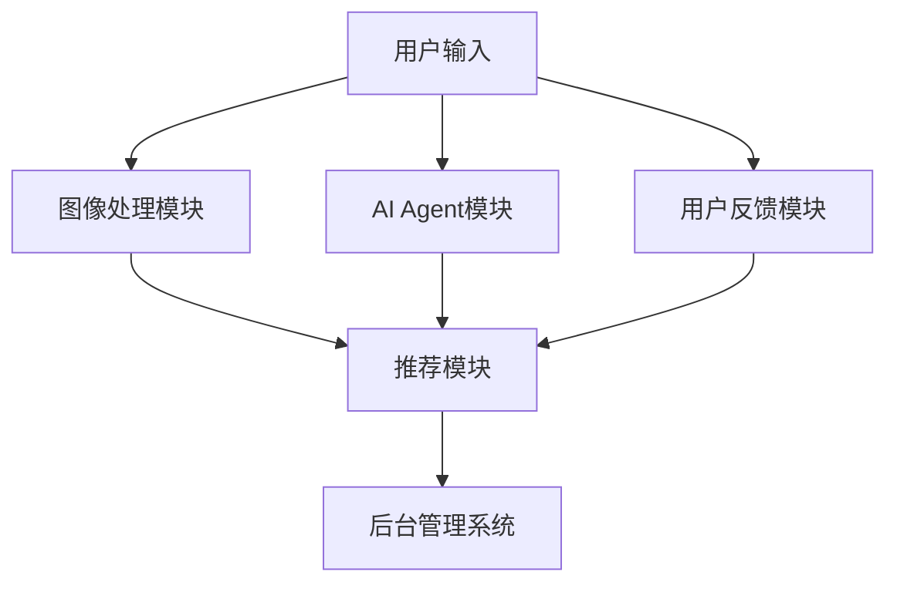
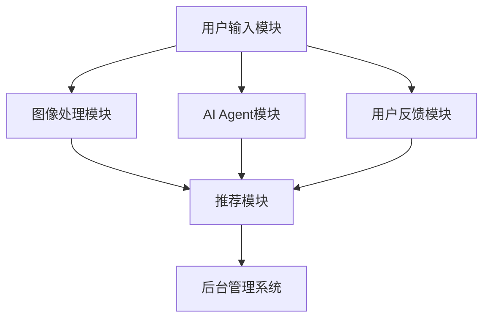

                 

### 第1章: 虚拟试衣技术概述

虚拟试衣技术是一种通过计算机视觉和图像处理技术，帮助用户在购买服装前实现虚拟试穿的效果。这一技术不仅提升了用户体验，还极大地推动了电子商务的发展。在本章中，我们将探讨虚拟试衣技术的发展历程、组成部分、AI Agent的定义与功能，以及图像处理技术的基础知识。

#### 1.1 虚拟试衣技术的发展历程

虚拟试衣技术的起源可以追溯到20世纪90年代，随着计算机技术和互联网的发展，虚拟试衣逐渐成为可能。早期的虚拟试衣系统主要依赖于2D图像处理技术，只能实现简单的衣物叠加和颜色匹配。随着深度学习、计算机视觉和图像处理技术的不断进步，虚拟试衣系统变得更加智能化和精准。

近年来，虚拟试衣技术取得了显著的进展，主要表现在以下几个方面：

- **三维建模与捕捉技术**：通过三维扫描和人体测量技术，可以更精确地获取用户和服装的三维数据，实现更真实的虚拟试衣效果。
- **实时渲染技术**：实时渲染技术使得虚拟试衣系统可以实时呈现试穿效果，极大地提升了用户体验。
- **AI Agent的引入**：AI Agent的应用使得虚拟试衣系统能够自动识别用户姿态、实时调整衣物位置和姿态，提高了系统的自适应能力和智能水平。

#### 1.2 虚拟试衣系统的组成部分

虚拟试衣系统通常由以下几个核心组成部分构成：

- **用户输入模块**：包括用户输入界面和用户信息收集模块，用于获取用户的基本信息和试衣需求。
- **图像处理模块**：用于处理用户上传的衣物图像和用户身形图像，包括图像增强、预处理、特征提取等。
- **虚拟试衣模块**：通过计算机视觉和图像处理技术，将衣物图像叠加到用户身形图像上，实现虚拟试衣效果。
- **用户反馈模块**：收集用户对虚拟试衣效果的反馈，用于优化系统性能和用户体验。

#### 1.3 AI Agent的定义与功能

AI Agent是指一种人工智能程序，能够自主地完成特定的任务，并在执行过程中不断学习和优化。在虚拟试衣系统中，AI Agent的主要功能包括：

- **用户姿态识别**：通过深度学习算法，识别用户在虚拟试衣过程中的姿态变化，确保衣物叠加的准确性。
- **智能推荐**：根据用户的历史购买记录和试衣偏好，为用户推荐适合的服装款式和颜色。
- **自适应调整**：根据用户反馈，自动调整虚拟试衣效果，提高用户满意度。

#### 1.4 图像处理技术的基础知识

图像处理技术是虚拟试衣系统的核心技术之一，主要包括以下内容：

- **图像预处理**：对原始图像进行降噪、对比度增强、颜色调整等预处理操作，提高图像质量。
- **特征提取**：从图像中提取出有用的特征信息，如颜色、纹理、形状等，用于后续处理。
- **图像匹配**：通过特征匹配技术，将用户身形图像和衣物图像进行精确匹配，实现虚拟试衣效果。
- **图像融合**：将用户身形图像和衣物图像进行融合处理，生成最终的虚拟试衣效果图。

#### 1.5 虚拟试衣中的图像处理挑战与解决方案

虚拟试衣过程中，图像处理面临以下挑战：

- **光线变化**：不同的光照条件会影响图像的质量和颜色，给图像处理带来困难。
- **服装复杂度**：复杂的服装款式和多样的纹理增加了图像处理的难度。
- **用户身形差异**：不同的用户身形差异导致虚拟试衣效果的一致性难以保证。

针对上述挑战，常见的解决方案包括：

- **多模态学习**：结合多源数据（如用户身形数据、光照数据等），提高图像处理的准确性和鲁棒性。
- **深度学习**：利用深度学习算法，实现更精确的特征提取和匹配。
- **自适应调整**：通过AI Agent实现自动调整，提高虚拟试衣效果的一致性和准确性。

#### 1.6 本章小结

本章概述了虚拟试衣技术的发展历程、组成部分、AI Agent的定义与功能，以及图像处理技术的基础知识。通过本章的学习，读者可以了解虚拟试衣技术的核心概念和基本原理，为后续章节的深入学习打下基础。

---

### 1.1 虚拟试衣技术的起源与发展

虚拟试衣技术的起源可以追溯到20世纪90年代，当时计算机技术和互联网的发展刚刚起步，计算机图形学和计算机视觉领域的研究也取得了一些初步成果。最初的虚拟试衣系统主要依赖于2D图像处理技术，通过将衣物图像叠加到用户身形图像上，实现简单的虚拟试衣效果。这些系统通常依赖于手工绘制的衣物图像和用户身形模板，精度较低，用户体验也不够理想。

进入21世纪后，随着计算机技术和图像处理算法的进步，虚拟试衣技术逐渐走向成熟。特别是在深度学习、计算机视觉和图像处理技术取得突破性进展的背景下，虚拟试衣技术得到了快速发展。以下几个关键点标志着虚拟试衣技术的重要发展：

1. **三维建模与捕捉技术的应用**：三维建模与捕捉技术的发展，使得获取用户和衣物三维数据成为可能。通过三维扫描和人体测量技术，可以精确地获取用户的三维身形数据和衣物的三维模型，从而实现更真实的虚拟试衣效果。

2. **实时渲染技术的引入**：实时渲染技术的应用，使得虚拟试衣系统能够实时呈现试穿效果，极大地提升了用户体验。用户可以在试衣过程中实时看到衣物的样式和颜色变化，并根据自己的喜好进行调整。

3. **AI Agent的引入**：随着人工智能技术的不断发展，AI Agent被引入到虚拟试衣系统中。AI Agent能够自动识别用户姿态、实时调整衣物位置和姿态，提高了系统的自适应能力和智能水平。例如，通过深度学习算法，AI Agent可以自动识别用户在不同姿态下的身形变化，并相应地调整衣物模型，确保虚拟试衣效果的准确性。

4. **多模态学习与融合**：多模态学习与融合技术的应用，使得虚拟试衣系统可以结合多种数据源（如图像、音频、传感器数据等），提高图像处理的准确性和鲁棒性。例如，通过结合用户身形数据和光照数据，可以更好地处理光线变化对图像质量的影响，实现更真实的虚拟试衣效果。

5. **个性化推荐与自适应调整**：随着用户数据的积累和人工智能技术的发展，虚拟试衣系统逐渐实现了个性化推荐和自适应调整功能。AI Agent可以根据用户的历史购买记录和试衣偏好，为用户推荐适合的服装款式和颜色，并自动调整虚拟试衣效果，提高用户满意度。

在虚拟试衣技术发展的过程中，也出现了一些重要的里程碑事件。例如：

- **2000年代初**：虚拟试衣技术开始应用于在线购物平台，为用户提供虚拟试衣服务。
- **2010年代**：三维建模与捕捉技术、实时渲染技术和AI Agent的引入，使得虚拟试衣技术取得了显著进展。
- **2020年代**：随着人工智能、物联网和5G技术的不断发展，虚拟试衣技术进一步向智能化、实时化和个性化方向发展。

总的来说，虚拟试衣技术的发展历程是一个不断融合新技术、提高用户体验和准确性的过程。通过结合深度学习、计算机视觉、图像处理和人工智能技术，虚拟试衣技术正在变得越来越成熟和实用，为电子商务和时尚行业带来了新的发展机遇。

### 1.1.2 虚拟试衣系统的组成部分

虚拟试衣系统是一个复杂的多模块集成系统，其各个组成部分相互协作，共同实现虚拟试衣功能。以下是虚拟试衣系统的几个主要组成部分及其功能：

#### 1. 用户输入模块

用户输入模块是虚拟试衣系统的入口，负责收集用户的基本信息和试衣需求。具体功能包括：

- **用户信息收集**：获取用户的身份信息、身形数据、试衣偏好等，这些信息通常通过用户注册、问卷调查或用户互动等方式获取。
- **试衣需求收集**：包括用户希望试穿的服装类型、颜色、款式等，用户可以通过上传衣物图片或选择服装款式来实现。

#### 2. 图像处理模块

图像处理模块是虚拟试衣系统的核心，负责处理用户上传的衣物图像和用户身形图像，确保图像质量并提取关键特征。其主要功能包括：

- **图像预处理**：对用户上传的图像进行降噪、对比度增强、颜色调整等预处理操作，提高图像质量。
- **特征提取**：从图像中提取出关键的特征信息，如颜色、纹理、形状等，这些特征信息将用于后续的图像匹配和虚拟试衣效果生成。
- **图像增强**：通过图像增强技术，使得图像更加清晰、真实，从而提高虚拟试衣效果。

#### 3. 虚拟试衣模块

虚拟试衣模块是系统的核心功能，通过计算机视觉和图像处理技术，将衣物图像叠加到用户身形图像上，生成虚拟试衣效果图。其主要功能包括：

- **衣物叠加**：将用户选择的衣物图像与用户身形图像进行叠加，生成虚拟试衣效果图。
- **姿态调整**：根据用户的不同姿态，自动调整衣物在虚拟试衣效果图中的位置和姿态，确保虚拟试衣效果的准确性。
- **效果渲染**：通过实时渲染技术，将虚拟试衣效果图实时呈现给用户，提高用户体验。

#### 4. 用户反馈模块

用户反馈模块负责收集用户对虚拟试衣效果的反馈，用于优化系统性能和用户体验。其主要功能包括：

- **效果评估**：通过用户对虚拟试衣效果的评分和反馈，评估系统性能，识别存在的问题和改进方向。
- **数据收集**：收集用户反馈数据，用于分析和优化系统功能，提高用户满意度。

#### 5. 推荐模块

推荐模块通过AI Agent实现个性化推荐功能，根据用户的历史购买记录、试衣偏好等数据，为用户推荐适合的服装款式和颜色。其主要功能包括：

- **历史记录分析**：分析用户的历史购买记录和试衣偏好，提取关键信息。
- **推荐算法实现**：通过机器学习算法，为用户生成个性化的推荐结果。
- **推荐结果呈现**：将推荐结果以直观的方式呈现给用户，引导用户进行试衣和购买。

#### 6. 后台管理系统

后台管理系统是虚拟试衣系统的核心组成部分，负责系统管理、数据分析和维护。其主要功能包括：

- **系统管理**：包括用户管理、权限管理、日志管理等，确保系统正常运行。
- **数据分析**：通过数据分析，了解用户行为和系统性能，为系统优化提供依据。
- **数据维护**：定期对用户数据和系统日志进行备份和维护，确保数据的安全性和完整性。

通过上述各模块的协同工作，虚拟试衣系统实现了从用户输入到虚拟试衣效果生成，再到用户反馈和推荐的完整功能，为用户提供了一站式的虚拟试衣服务。

### 1.2 AI Agent的定义与功能

AI Agent，即人工智能代理，是一种具有自主决策能力的人工智能系统，它能够模拟人类智能行为，执行特定任务并在执行过程中不断学习和优化。在虚拟试衣技术中，AI Agent扮演着至关重要的角色，其定义和功能主要体现在以下几个方面：

#### 1.2.1 AI Agent的概念

AI Agent是基于人工智能技术构建的智能体，具备感知环境、自主决策和执行任务的能力。它通过机器学习和深度学习算法，从大量的数据中学习和提取规律，从而实现智能化的决策和执行。AI Agent的基本特征包括：

- **自主性**：AI Agent能够自主地执行任务，无需人工干预。
- **适应性**：AI Agent能够根据环境变化和反馈，自动调整其行为和策略。
- **协同性**：AI Agent可以与其他AI Agent或人类协作，完成复杂的任务。
- **自我学习**：AI Agent能够从数据中学习，优化其决策和执行过程。

#### 1.2.2 AI Agent在虚拟试衣中的应用

在虚拟试衣系统中，AI Agent被广泛应用于多个方面，提升了系统的智能化水平和用户体验。以下是AI Agent在虚拟试衣中的应用：

1. **用户姿态识别**：AI Agent能够实时识别用户在虚拟试衣过程中的姿态变化。通过深度学习算法，AI Agent可以自动检测用户的身体姿势，确保虚拟试衣效果的准确性。例如，当用户改变站立姿势时，AI Agent能够实时调整衣物位置，使其贴合用户身形。

2. **智能推荐**：AI Agent可以根据用户的历史购买记录、试衣偏好和实时反馈，为用户推荐适合的服装款式和颜色。通过分析用户数据，AI Agent能够识别用户的偏好和需求，从而提供个性化的推荐结果。

3. **自适应调整**：AI Agent能够根据用户反馈，自动调整虚拟试衣效果，提高用户满意度。例如，当用户对试衣效果不满意时，AI Agent可以自动调整衣物的颜色、款式或尺寸，以优化试衣效果。

4. **实时渲染优化**：AI Agent可以实时分析用户试衣过程中的图像数据，优化渲染效果。例如，通过调整光照、对比度和色彩平衡，AI Agent可以使得虚拟试衣效果图更加逼真。

5. **异常检测与修复**：AI Agent能够实时检测虚拟试衣过程中出现的异常情况，如图像模糊、衣物遮挡等，并自动进行修复，确保虚拟试衣效果的一致性和准确性。

#### 1.2.3 AI Agent的优势与挑战

AI Agent在虚拟试衣系统中的应用具有显著的优势：

1. **提高试衣精度**：AI Agent能够通过深度学习和图像处理技术，提高虚拟试衣的准确性，减少人工干预的必要性。

2. **提升用户体验**：AI Agent能够实时识别用户需求，提供个性化的推荐和服务，提升用户体验。

3. **降低运营成本**：通过自动化和智能化，AI Agent可以减少人工操作和干预，降低运营成本。

然而，AI Agent在虚拟试衣系统中也面临着一些挑战：

1. **数据隐私和安全**：AI Agent在处理用户数据时，需要确保数据的隐私和安全，防止数据泄露和滥用。

2. **算法偏见与公平性**：AI Agent的决策可能受到算法偏见的影响，需要确保其公平性和透明性。

3. **技术成熟度和成本**：AI Agent的开发和应用需要高水平的技术和资源投入，这可能会增加系统的开发成本和维护成本。

总的来说，AI Agent在虚拟试衣系统中的应用，为提升系统的智能化水平和用户体验带来了巨大的潜力，同时也需要克服一系列技术和伦理挑战。

### 1.3 图像处理技术的基础知识

图像处理技术是虚拟试衣系统的核心技术之一，通过对图像的预处理、特征提取和图像匹配等操作，实现虚拟试衣的效果。以下是图像处理技术的基础知识：

#### 1.3.1 图像处理的基本概念

图像处理是指利用计算机技术对图像进行加工和处理，以改善图像质量、提取有用信息或生成新的图像。图像处理的基本概念包括：

1. **图像数据**：图像是由像素组成的，每个像素包含颜色和亮度信息。图像数据的存储和传输是图像处理的基础。

2. **图像类型**：图像可以分为位图图像和矢量图像。位图图像由像素组成，矢量图像由数学公式描述。

3. **图像格式**：常见的图像格式包括JPEG、PNG、GIF等，每种格式都有其特点和适用场景。

#### 1.3.2 图像处理的关键技术

图像处理技术包括多个方面，以下是其中的关键技术：

1. **图像预处理**：图像预处理是图像处理的第一步，包括图像降噪、对比度增强、颜色调整等操作。预处理操作可以提高图像质量，为后续处理提供更好的基础。

2. **特征提取**：特征提取是从图像中提取出具有鉴别性的特征信息，如颜色、纹理、形状等。特征提取技术用于图像分类、目标检测和图像匹配等任务。

3. **图像增强**：图像增强是通过调整图像的对比度、亮度等参数，使图像更加清晰、真实。图像增强技术可以改善图像质量，提高图像处理的准确性。

4. **图像分割**：图像分割是将图像分割成若干个区域或对象，以便于进一步处理和分析。常见的图像分割方法包括阈值分割、边缘检测和区域生长等。

5. **图像匹配**：图像匹配是指将两个或多个图像进行对比，找出它们的相似之处。图像匹配技术用于图像配准、目标跟踪和虚拟试衣等应用。

#### 1.3.3 图像处理在虚拟试衣中的应用

在虚拟试衣系统中，图像处理技术发挥着关键作用：

1. **用户身形图像处理**：通过图像预处理和特征提取技术，对用户身形图像进行降噪、增强和特征提取，确保图像质量。

2. **衣物图像处理**：对用户上传的衣物图像进行预处理和特征提取，提取出衣物的颜色、纹理和形状等特征，为后续的图像匹配提供依据。

3. **图像匹配与合成**：通过图像匹配技术，将用户身形图像和衣物图像进行精确匹配，生成虚拟试衣效果图。图像合成技术用于将匹配后的图像进行融合处理，生成最终的虚拟试衣效果。

4. **效果优化**：通过图像增强和自适应调整技术，优化虚拟试衣效果，提高用户体验。

总的来说，图像处理技术在虚拟试衣系统中扮演着至关重要的角色，通过一系列图像处理技术，实现了用户身形与衣物图像的精确匹配和虚拟试衣效果的高质量生成。

### 1.4 虚拟试衣中的图像处理挑战与解决方案

虚拟试衣技术虽然发展迅速，但在实际应用中仍面临诸多图像处理挑战。这些挑战主要集中在光线变化、服装复杂度和用户身形差异等方面，以下将详细分析这些挑战，并探讨相应的解决方案。

#### 1.4.1 挑战分析

1. **光线变化**：光线是影响图像质量的重要因素。在不同的光照条件下，服装的颜色和细节可能会发生显著变化，这给图像处理带来了巨大挑战。特别是在自然光环境下，光线强度和方向会随时间变化，导致图像质量不稳定。

2. **服装复杂度**：不同服装款式和材质的复杂度差异较大，例如，薄纱材质和厚重羽绒服在图像处理上的难度不同。复杂的服装款式可能包含多个颜色和纹理层次，增加了图像处理的难度。

3. **用户身形差异**：用户的身形差异很大，即使是在相同的身高和体重下，不同人的体形和姿态也会有所不同。这种差异导致在虚拟试衣过程中，衣物与身形的匹配精度难以保证，从而影响试衣效果。

4. **图像分辨率和清晰度**：用户上传的衣物图像可能存在分辨率低、清晰度不足的问题。低分辨率图像在虚拟试衣过程中可能会造成衣物细节丢失，影响试衣效果。

#### 1.4.2 解决方案探讨

1. **多模态学习与融合**：多模态学习是一种结合多种数据源的方法，可以显著提高图像处理的准确性和鲁棒性。在虚拟试衣中，可以结合用户身形数据、光照数据和图像数据，通过多模态学习算法，提高图像处理的精度。例如，利用深度学习中的卷积神经网络（CNN）和生成对抗网络（GAN），结合多源数据生成高质量的虚拟试衣效果图。

2. **深度学习与特征提取**：深度学习算法，特别是卷积神经网络（CNN），在图像处理中具有强大的特征提取能力。通过训练深度学习模型，可以从复杂的光照变化和服装材质中提取出有意义的特征，从而提高虚拟试衣的准确性。

3. **自适应调整技术**：通过引入AI Agent，实现自适应调整技术，可以实时调整虚拟试衣效果。AI Agent可以根据用户的反馈，自动调整光线、颜色和姿态，优化试衣效果。例如，当用户在试衣过程中反馈衣物颜色不合适时，AI Agent可以自动调整颜色，使试衣效果更符合用户期望。

4. **图像增强技术**：图像增强技术可以改善图像质量，提高清晰度和细节表现。例如，通过图像去噪、对比度增强和色彩调整等技术，可以显著提升低分辨率图像的视觉效果，从而改善虚拟试衣效果。

5. **用户身形建模与匹配**：通过三维建模和人体测量技术，可以精确地获取用户身形数据，生成个性化的三维模型。在虚拟试衣过程中，通过对比用户身形模型和衣物模型，实现精确匹配，提高试衣效果的一致性。

#### 1.4.3 成功案例分享

在虚拟试衣技术的发展过程中，有许多成功案例展示了图像处理技术的应用和效果。以下是几个具有代表性的案例：

1. **Zalando的虚拟试衣系统**：Zalando是一家领先的在线时尚零售商，其虚拟试衣系统采用了深度学习和图像处理技术。通过实时渲染和用户姿态识别，Zalando的虚拟试衣系统能够为用户提供逼真的试衣体验，提高了用户满意度和购买转化率。

2. **MikMak的个性化推荐系统**：MikMak是一家专注于时尚个性化推荐的初创公司，其系统通过AI Agent和图像处理技术，为用户推荐适合的服装款式和颜色。通过多模态学习和用户反馈，MikMak的推荐系统大大提升了用户推荐精准度。

3. **SHEIN的虚拟试衣平台**：SHEIN是一家快速增长的在线时尚零售平台，其虚拟试衣平台采用了先进的图像处理和AI技术。通过三维建模和实时渲染，SHEIN为用户提供了高度逼真的虚拟试衣体验，有效降低了购物风险。

通过这些成功案例，我们可以看到，图像处理技术在虚拟试衣中的应用不仅提高了试衣效果，还显著提升了用户体验和购买转化率。未来，随着技术的进一步发展和创新，虚拟试衣技术有望在更多领域得到广泛应用。

### 1.5 本章小结

本章对虚拟试衣技术进行了全面的概述，包括其发展历程、系统组成部分、AI Agent的定义与功能，以及图像处理技术的基础知识。通过分析虚拟试衣中的图像处理挑战和解决方案，我们了解了如何通过深度学习、图像增强和自适应调整技术提升虚拟试衣效果。本章为后续章节的深入探讨奠定了基础。

---

### 第2章: AI Agent在图像识别中的应用

在虚拟试衣系统中，图像识别技术是核心组件之一，AI Agent在图像识别中的应用尤为关键。本章将详细探讨AI Agent在图像识别中的基本原理、优势、实现方法以及在虚拟试衣中的应用实例。

#### 2.1 图像识别基本原理

图像识别是指通过计算机技术对图像进行分析和处理，以识别图像中的特定内容或特征。图像识别的基本原理包括以下几个步骤：

1. **图像预处理**：图像预处理是图像识别的前置步骤，包括图像的降噪、增强、对比度调整等操作，以提高图像质量和提取有效特征。

2. **特征提取**：特征提取是从图像中提取出具有代表性的特征信息，如颜色、纹理、形状等。常见的特征提取方法包括颜色直方图、边缘检测、纹理分析等。

3. **特征匹配**：特征匹配是将提取到的特征与已知的特征进行对比，以确定图像中是否存在特定内容。常用的匹配算法包括最近邻算法、K-近邻算法、SVM分类器等。

4. **分类与识别**：通过分类算法，对匹配结果进行分类和识别，确定图像中的目标对象。常见的分类算法包括决策树、支持向量机（SVM）、神经网络等。

#### 2.2 AI Agent在图像识别中的优势

AI Agent在图像识别中的应用具有显著优势，主要表现在以下几个方面：

1. **自适应性与实时性**：AI Agent能够根据实时反馈和图像数据，自适应地调整识别模型和参数，提高识别的准确性和实时性。

2. **智能化**：通过深度学习和强化学习算法，AI Agent能够从大量数据中自动学习和优化识别模型，实现高精度的图像识别。

3. **高效性**：AI Agent利用并行计算和分布式处理技术，能够快速处理大量图像数据，提高图像识别的效率。

4. **多样性**：AI Agent可以处理不同类型的图像数据，包括不同分辨率、不同场景和不同光照条件下的图像，具有广泛的适用性。

5. **可扩展性**：AI Agent可以根据需求扩展识别功能，例如，添加新的识别目标或识别模式，以适应不断变化的应用场景。

#### 2.3 AI Agent在图像识别中的实现方法

实现AI Agent在图像识别中的应用，通常需要以下几个步骤：

1. **数据准备**：首先，需要收集大量高质量的图像数据作为训练集，这些图像应涵盖各种不同的场景和光照条件，以确保模型的泛化能力。

2. **模型选择与训练**：选择合适的深度学习模型，如卷积神经网络（CNN）或生成对抗网络（GAN），并进行训练。训练过程中，模型会从数据中自动提取特征，并优化识别参数。

3. **模型评估与优化**：通过交叉验证和测试集评估模型的性能，识别准确率和速度等指标。根据评估结果，对模型进行调整和优化，以提高识别效果。

4. **部署与应用**：将训练好的模型部署到实际应用中，如虚拟试衣系统。通过实时处理用户上传的图像，实现图像识别功能。

#### 2.4 图像识别在虚拟试衣中的应用实例

在虚拟试衣系统中，图像识别技术主要用于以下几个方面：

1. **人体轮廓识别**：通过图像识别技术，自动识别用户身形轮廓，为后续的衣物叠加和试衣效果生成提供基础。

2. **颜色匹配与款式识别**：识别用户上传的衣物图像中的颜色和款式，与用户身形图像进行匹配，生成虚拟试衣效果图。

3. **试衣反馈分析**：分析用户试衣反馈，识别用户对试衣效果的满意度，为系统优化提供依据。

4. **智能推荐**：根据用户试衣历史和偏好，通过图像识别技术推荐适合的服装款式和颜色。

以下是一个具体的应用实例：

**案例：ZARA的虚拟试衣系统**

ZARA是一家全球知名的时尚品牌，其虚拟试衣系统采用了AI Agent进行图像识别和虚拟试衣。以下是该系统的主要实现步骤：

1. **数据准备**：ZARA收集了大量的用户身形图像和服装图像，包括不同的颜色、款式和材质。数据集涵盖了多种光照条件和场景，以确保模型的高泛化能力。

2. **模型选择与训练**：选择卷积神经网络（CNN）模型，对用户身形图像和服装图像进行训练。模型通过学习图像特征，实现了对人体轮廓和衣物款式的准确识别。

3. **模型评估与优化**：通过交叉验证和测试集，评估模型在人体轮廓识别和颜色匹配任务上的性能。根据评估结果，对模型进行优化，提高了识别准确率和速度。

4. **部署与应用**：将训练好的模型部署到虚拟试衣系统中。用户上传身形图像和服装图像后，系统通过AI Agent自动识别并生成虚拟试衣效果图。

通过该系统，用户可以实时看到试穿效果，并根据试衣反馈进行个性化推荐。ZARA的虚拟试衣系统不仅提升了用户体验，还减少了用户试衣过程中的风险，提高了购买转化率。

总的来说，AI Agent在图像识别中的应用，为虚拟试衣系统提供了强大的技术支持，实现了对人体轮廓、颜色和款式的高精度识别，为用户提供了一站式的虚拟试衣服务。

### 2.1 图像识别基本原理

图像识别是计算机视觉领域的一项核心技术，它使得计算机能够理解、分析和处理图像中的信息。以下是图像识别的基本原理，包括定义、分类、常见算法和性能评估指标。

#### 图像识别的定义

图像识别是指通过计算机算法对图像内容进行分析和处理，以识别出图像中的特定对象、场景或特征。图像识别的应用非常广泛，包括人脸识别、车辆识别、医疗图像分析、智能监控等。

#### 图像识别的分类

图像识别可以按照不同的标准进行分类：

1. **根据任务类型**：
   - **目标检测**：识别图像中特定的对象或目标，并定位其在图像中的位置。
   - **图像分类**：将图像归类到特定的类别，如动物、植物、车辆等。
   - **图像分割**：将图像分割成多个区域或对象，以便于进一步分析和处理。

2. **根据数据类型**：
   - **有监督学习**：使用标注好的训练数据来训练模型，模型通过学习已有数据来预测新数据的标签。
   - **无监督学习**：模型在没有标注数据的情况下学习图像的分布特征，如聚类和降维。
   - **半监督学习**：结合有监督和无监督学习，使用部分标注数据和大量未标注数据来训练模型。

#### 常见算法

图像识别算法种类繁多，以下是几种常见的算法：

1. **基于传统算法**：
   - **边缘检测**：用于检测图像中的边缘，如Canny算法。
   - **特征提取**：用于提取图像的有用特征，如SIFT、SURF算法。

2. **基于机器学习算法**：
   - **支持向量机（SVM）**：用于分类任务，通过寻找最佳的超平面来分离不同类别的数据。
   - **决策树**：用于分类和回归任务，通过多级划分来构建决策树。

3. **基于深度学习算法**：
   - **卷积神经网络（CNN）**：通过多层卷积和池化操作，自动提取图像特征，广泛应用于图像分类和目标检测。
   - **生成对抗网络（GAN）**：通过生成器和判别器的对抗训练，实现图像的生成和变换。
   - **循环神经网络（RNN）**：用于序列数据的处理，如时间序列分析和视频识别。

#### 性能评估指标

图像识别的性能评估指标包括准确性、召回率、F1分数、平均精度等。以下是几种常见的评估指标：

1. **准确性（Accuracy）**：正确识别的图像数量占总图像数量的比例。
2. **召回率（Recall）**：正确识别的图像数量占实际包含目标图像数量的比例。
3. **精确率（Precision）**：正确识别的图像数量占识别为目标的图像数量的比例。
4. **F1分数（F1 Score）**：精确率和召回率的调和平均数，用于综合评估模型的性能。
5. **平均精度（Average Precision, AP）**：在目标检测任务中，计算不同检测阈值的平均精度。

通过上述算法和评估指标，图像识别技术能够实现对图像内容的准确理解和分析，为虚拟试衣系统提供了强大的技术支持。

### 2.2 AI Agent在图像识别中的优势

在图像识别任务中，AI Agent的应用具有显著的优势，这些优势不仅提升了系统的性能，还增强了用户体验和操作便捷性。以下是AI Agent在图像识别中的主要优势：

#### 2.2.1 AI Agent的优势分析

1. **高准确性**：AI Agent通过深度学习算法，能够从大量训练数据中自动提取和优化特征，从而实现高精度的图像识别。相较于传统方法，AI Agent在复杂场景下的准确性显著提高。

2. **实时性**：AI Agent具备实时处理图像数据的能力，能够快速响应用户的请求。通过并行计算和分布式处理技术，AI Agent可以在短时间内完成图像识别任务，提高系统的响应速度。

3. **自适应调整**：AI Agent可以根据实时反馈和新的图像数据，自动调整识别模型和参数。这种自适应能力使得AI Agent能够应对不同场景和光照条件，保持高识别精度。

4. **智能化**：AI Agent通过不断学习和优化，能够逐渐提高图像识别的智能水平。在虚拟试衣系统中，AI Agent可以根据用户的行为和偏好，提供个性化的识别和服务。

5. **泛化能力**：AI Agent通过多模态学习和迁移学习，能够在不同数据集和应用场景中表现出良好的泛化能力。这使得AI Agent不仅适用于图像识别，还可以扩展到其他计算机视觉任务中。

#### 2.2.2 AI Agent在图像识别中的应用案例

以下是一些AI Agent在图像识别中的成功应用案例：

1. **人脸识别系统**：AI Agent在人脸识别系统中发挥了重要作用。通过深度学习算法，AI Agent能够准确识别人脸并匹配身份信息。这一技术广泛应用于安全监控、人脸支付和身份验证等领域。

2. **自动驾驶汽车**：AI Agent在自动驾驶汽车中用于图像识别和目标检测。通过实时分析道路图像，AI Agent能够识别行人和车辆，并采取相应的驾驶策略，确保行车安全。

3. **医疗图像分析**：AI Agent在医疗图像分析中用于疾病检测和诊断。通过分析CT、MRI等医疗图像，AI Agent能够检测病变区域，为医生提供辅助诊断信息。

4. **虚拟试衣系统**：AI Agent在虚拟试衣系统中用于人体轮廓识别和衣物颜色匹配。通过实时识别用户姿态和身形，AI Agent能够生成逼真的虚拟试衣效果图，提升用户体验。

总的来说，AI Agent在图像识别中的应用，不仅提高了识别的准确性和实时性，还为各种应用场景提供了智能化解决方案。未来，随着技术的不断进步，AI Agent在图像识别中的应用前景将更加广阔。

### 2.3 AI Agent在图像识别中的实现方法

实现AI Agent在图像识别中的功能，需要经过多个关键步骤，包括数据准备、模型选择与训练、模型评估与优化等。以下是具体实现方法的详细描述。

#### 2.3.1 数据准备

数据准备是图像识别任务的基础，高质量的训练数据集对模型的性能至关重要。以下是数据准备的主要步骤：

1. **数据收集**：收集大量的图像数据，这些数据应涵盖多种场景、光照条件和物体姿态。数据源可以包括公开数据集（如ImageNet、COCO等）和自定义数据集。

2. **数据标注**：对收集到的图像进行标注，标注内容包括物体类别、位置、边界框等。标注过程需要人工或半自动工具协助，以确保标注的准确性和一致性。

3. **数据清洗**：清洗数据集中的噪声和异常值，如缺失值、重复值和损坏图像。通过图像增强技术，如旋转、缩放、裁剪等，增加数据的多样性和鲁棒性。

4. **数据预处理**：对图像进行标准化处理，如调整图像大小、归一化像素值等。预处理操作可以提高模型训练的效率和性能。

#### 2.3.2 模型选择与训练

在数据准备完成后，需要选择合适的模型并进行训练。以下是模型选择与训练的主要步骤：

1. **模型选择**：根据图像识别任务的需求，选择适合的深度学习模型。常见的模型包括卷积神经网络（CNN）、循环神经网络（RNN）、生成对抗网络（GAN）等。CNN在图像识别任务中表现尤为出色，因为它能够有效地提取图像特征。

2. **模型架构设计**：设计模型的架构，包括网络层数、卷积核大小、激活函数等。对于CNN模型，常用的架构包括VGG、ResNet、Inception等。

3. **模型训练**：使用训练数据集对模型进行训练。训练过程中，模型通过反向传播算法不断调整权重和偏置，以最小化预测误差。训练过程中需要监控模型的训练损失和验证集性能，以确保模型收敛。

4. **超参数调优**：通过调整学习率、批量大小、正则化参数等超参数，优化模型性能。常用的调优方法包括随机搜索、网格搜索和贝叶斯优化等。

#### 2.3.3 模型评估与优化

模型训练完成后，需要对其性能进行评估和优化，以确保在实际应用中达到预期效果。以下是模型评估与优化的主要步骤：

1. **模型评估**：使用验证集和测试集对模型进行评估。常用的评估指标包括准确率、召回率、F1分数等。评估过程中，可以比较不同模型的性能，选择最优模型。

2. **模型调试**：根据评估结果，对模型进行调试和优化。调试方法包括数据清洗、模型架构调整、超参数调优等。

3. **模型集成**：将多个模型集成，以进一步提高性能。常见的集成方法包括Bagging、Boosting和Stacking等。

4. **模型部署**：将训练好的模型部署到实际应用中，如虚拟试衣系统。部署过程中，需要考虑模型的运行环境、性能优化和实时性等问题。

通过以上步骤，AI Agent在图像识别中的功能得以实现。在实际应用中，AI Agent可以实时识别图像中的物体、场景和特征，为用户提供高效、准确的图像识别服务。

### 2.4 图像识别在虚拟试衣中的应用实例

图像识别技术在虚拟试衣系统中的应用，不仅提升了系统的智能化水平，还显著改善了用户体验。以下是图像识别在虚拟试衣中的几个关键应用实例，以及具体的应用场景和实现方法。

#### 2.4.1 人体轮廓识别

人体轮廓识别是虚拟试衣系统中的基础步骤，通过识别用户身形轮廓，为后续的衣物叠加和试衣效果生成提供准确的数据基础。

**应用场景**：

- 用户上传自己的全身或半身照片，系统需要识别出用户的轮廓。
- 用户在不同姿态下试衣时，系统需要实时调整衣物的位置和姿态。

**实现方法**：

1. **预处理**：对用户上传的图像进行预处理，包括裁剪、调整大小、灰度转换等操作，以提高图像质量和识别效果。

2. **特征提取**：利用深度学习算法，如卷积神经网络（CNN），从预处理后的图像中提取出具有区分性的特征。常用的特征提取模型包括VGG、ResNet等。

3. **轮廓检测**：通过轮廓检测算法，如Canny边缘检测、Sure Loot算法等，从提取出的特征图像中检测出用户轮廓。

4. **姿态识别**：利用姿态估计模型，如PoseNet或OpenPose，进一步识别用户的姿态变化。姿态识别的结果用于调整衣物的位置和姿态，以实现更加逼真的虚拟试衣效果。

**案例**：Macy's的虚拟试衣系统

Macy's是一家国际知名的零售商，其虚拟试衣系统通过人体轮廓识别技术，实现了对用户身形的准确识别和试衣效果的实时调整。用户上传自己的照片后，系统会自动识别出用户的轮廓，并基于用户的姿态和身形生成虚拟试衣效果图。该系统不仅提高了用户体验，还减少了试衣失败率。

#### 2.4.2 颜色匹配与款式识别

颜色匹配与款式识别是虚拟试衣系统的另一重要功能，通过识别用户上传的衣物图像中的颜色和款式，实现与用户身形图像的精确匹配。

**应用场景**：

- 用户上传自己喜欢的衣物图像，系统需要识别出衣物的颜色和款式。
- 系统根据用户的试衣偏好，自动推荐符合用户风格的衣物。

**实现方法**：

1. **颜色识别**：使用颜色直方图或颜色空间转换（如HSV空间）对衣物图像进行颜色分析，识别出主要颜色成分。

2. **款式识别**：利用深度学习算法，如CNN，对衣物图像进行款式分类。训练过程中，模型学习不同款式衣物的特征，从而实现对款式的高精度识别。

3. **颜色匹配**：将用户上传的衣物图像中的颜色与用户身形图像进行匹配，调整衣物的颜色，以实现色彩一致性。

4. **款式匹配**：根据用户上传的衣物图像，选择合适的款式进行虚拟试穿，确保虚拟试衣效果的协调性和美观性。

**案例**：ASOS的虚拟试衣系统

ASOS是一家全球知名的在线时尚零售商，其虚拟试衣系统通过颜色匹配与款式识别技术，为用户提供个性化的试衣体验。用户可以上传自己喜欢的衣物图像，系统会自动识别颜色和款式，并生成虚拟试衣效果图。此外，系统还根据用户的试衣偏好，推荐适合的服装款式和颜色，提高了用户的购物满意度。

通过上述应用实例，我们可以看到图像识别技术在虚拟试衣系统中的应用，不仅提高了试衣的准确性和智能化水平，还显著改善了用户体验。未来，随着图像识别技术的不断发展和创新，虚拟试衣系统将变得更加智能和实用，为电子商务和时尚行业带来更多的发展机遇。

### 2.5 本章小结

本章详细探讨了AI Agent在图像识别中的应用，包括基本原理、优势、实现方法和实际应用实例。通过分析人体轮廓识别和颜色匹配与款式识别等具体应用，我们了解了图像识别技术在虚拟试衣系统中的重要作用。本章内容为后续章节的深入学习提供了坚实的基础。

---

### 第3章: 虚拟试衣中的图像合成技术

图像合成技术是虚拟试衣系统中的重要组成部分，它通过将用户身形图像和衣物图像进行精确合成，生成逼真的虚拟试衣效果图。本章将详细介绍图像合成技术的概述、应用场景、常见算法以及AI Agent在图像合成中的应用。

#### 3.1 图像合成技术概述

图像合成技术是指通过图像处理算法，将两幅或多幅图像结合在一起，生成一幅新的图像。在虚拟试衣系统中，图像合成技术的应用主要体现在以下几个方面：

- **图像叠加**：将衣物图像叠加到用户身形图像上，实现虚拟试衣效果。
- **效果增强**：通过图像合成技术，增强虚拟试衣效果图的质量，提高用户体验。
- **个性化推荐**：根据用户试衣偏好，合成符合用户风格的虚拟试衣效果图。

#### 3.2 图像合成技术的应用场景

图像合成技术在虚拟试衣系统中的应用场景非常广泛，以下是几个典型的应用场景：

1. **用户试衣**：用户上传自己的全身或半身照片，系统通过图像合成技术，将衣物图像叠加到用户身上，生成虚拟试衣效果图，让用户可以预览试穿效果。

2. **服装设计**：设计师可以通过图像合成技术，将新设计的服装叠加到模特身上，快速评估设计效果，进行设计优化。

3. **广告宣传**：虚拟试衣系统可以生成明星或模特的虚拟试衣效果图，用于广告宣传和市场营销。

4. **服装销售**：在线零售商可以通过图像合成技术，为用户提供个性化的试衣服务，提高购买转化率。

#### 3.3 常见的图像合成算法

在虚拟试衣系统中，常用的图像合成算法包括以下几种：

1. **图像叠加算法**：这类算法通过将衣物图像直接叠加到用户身形图像上，实现初步的虚拟试衣效果。常见的图像叠加算法包括透明度混合（如Alpha混合）和颜色混合（如RGB混合）。

2. **图像融合算法**：这类算法通过将用户身形图像和衣物图像进行融合，生成更加逼真的虚拟试衣效果图。常见的图像融合算法包括多层感知器（MLP）、卷积神经网络（CNN）和生成对抗网络（GAN）。

3. **图像修复算法**：这类算法用于修复虚拟试衣效果图中的缺陷，如衣物遮挡、图像噪声等。常见的图像修复算法包括PatchMatch算法和基于深度学习的修复算法。

4. **风格迁移算法**：这类算法用于将一种图像的风格应用到另一幅图像上，实现艺术风格的转换。常见的风格迁移算法包括CNN基础上的风格迁移算法和GAN基础上的风格迁移算法。

#### 3.4 AI Agent在图像合成中的应用

AI Agent在图像合成中的应用，使得虚拟试衣系统更加智能化和高效。以下是AI Agent在图像合成中的几个关键应用：

1. **自适应调整**：AI Agent可以根据用户的实时反馈，自动调整图像合成参数，优化虚拟试衣效果。例如，当用户反馈试衣效果不满意时，AI Agent可以自动调整衣物的颜色、款式或位置，以提升用户体验。

2. **个性化推荐**：AI Agent可以根据用户的历史试衣数据和偏好，为用户推荐适合的服装款式和颜色，实现个性化试衣服务。

3. **实时渲染**：AI Agent利用实时渲染技术，快速生成虚拟试衣效果图，提高系统响应速度。例如，在用户更换服装款式时，AI Agent可以实时更新试衣效果图，确保用户体验的一致性。

4. **多模态学习**：AI Agent结合多种数据源（如图像、音频、传感器数据），提高图像合成的准确性和鲁棒性。例如，通过结合用户身形数据和光照数据，AI Agent可以更好地处理光线变化对图像合成效果的影响。

#### 3.5 图像合成在虚拟试衣中的应用实例

以下是一个具体的图像合成在虚拟试衣中的应用实例：

**案例：Nike的虚拟试衣系统**

Nike是一家全球知名的体育用品品牌，其虚拟试衣系统通过图像合成技术，为用户提供逼真的试衣体验。以下是该系统的实现步骤：

1. **用户数据采集**：用户上传自己的全身或半身照片，系统通过人体检测算法识别出用户的轮廓和姿态。

2. **衣物图像合成**：系统将用户上传的衣物图像与用户轮廓进行精确匹配，并通过图像融合算法生成初步的虚拟试衣效果图。

3. **效果优化**：AI Agent根据用户反馈，自动调整图像合成参数，如颜色、亮度、对比度等，以优化虚拟试衣效果。

4. **实时渲染**：AI Agent利用实时渲染技术，快速生成最终的虚拟试衣效果图，并实时更新显示。

通过上述步骤，Nike的虚拟试衣系统为用户提供了高质量的试衣体验，提高了用户的购买转化率。

总的来说，图像合成技术在虚拟试衣系统中的应用，不仅提升了系统的智能化水平，还显著改善了用户体验。未来，随着图像合成技术的不断发展和创新，虚拟试衣系统将变得更加智能和实用，为电子商务和时尚行业带来更多的发展机遇。

### 3.1 图像合成技术概述

图像合成技术是计算机视觉和图形学领域的重要分支，通过将多幅图像融合成一幅新的图像，从而创造出丰富的视觉效果。在虚拟试衣系统中，图像合成技术是实现逼真试衣效果的关键技术之一。以下是图像合成技术的基本概念、应用场景及常见算法的详细解释。

#### 图像合成的基本概念

图像合成技术主要涉及以下概念：

1. **图像叠加**：将一幅图像的部分或全部覆盖在另一幅图像上，从而生成新的图像。这种操作通常用于广告、视频制作和虚拟试衣等场景。

2. **图像融合**：通过计算两幅图像的相似性，将它们合并成一幅新的图像，以实现更好的视觉效果。图像融合通常用于图像修复、图像增强和图像风格转换等任务。

3. **图像风格转换**：将一幅图像的风格应用到另一幅图像上，使得目标图像具有源图像的风格。常见的风格转换方法包括神经网络驱动的风格迁移算法，如VGG、GAN等。

4. **图像混合**：通过调整图像的透明度、颜色通道等参数，实现图像的混合效果。常见的混合方法包括Alpha混合、HSV颜色空间混合等。

#### 图像合成技术的应用场景

图像合成技术在虚拟试衣系统中的应用场景主要包括以下几个方面：

1. **用户试衣**：用户上传自己的全身或半身照片，系统通过图像合成技术，将衣物图像叠加到用户身上，生成虚拟试衣效果图。这种应用场景主要关注如何实现精准的图像匹配和逼真的试衣效果。

2. **服装设计**：设计师通过图像合成技术，将新设计的服装叠加到模特身上，快速评估设计效果并进行优化。这种应用场景主要关注如何高效地实现图像合成和快速迭代设计。

3. **广告营销**：虚拟试衣系统生成的逼真试衣效果图可以用于广告宣传，吸引潜在客户。这种应用场景主要关注如何提升图像合成的视觉效果，以吸引更多用户关注和购买。

4. **虚拟购物体验**：通过图像合成技术，用户可以在线上平台体验到真实的试衣效果，从而提高购物满意度和购买转化率。这种应用场景主要关注如何优化用户体验，提升用户在线购物的信心。

#### 常见的图像合成算法

在虚拟试衣系统中，常用的图像合成算法包括以下几种：

1. **基于传统的图像处理方法**：
   - **图像叠加**：通过调整图像的透明度或颜色通道，将两幅图像叠加在一起。常见的方法包括Alpha混合和RGB颜色空间混合。
   - **图像融合**：使用图像融合算法，如基于直方图匹配的方法，调整图像的颜色分布，使两幅图像更加协调。

2. **基于深度学习的图像合成方法**：
   - **卷积神经网络（CNN）**：通过卷积神经网络，提取图像特征并进行融合。常见的CNN架构包括VGG、ResNet、Inception等。
   - **生成对抗网络（GAN）**：通过生成器和判别器的对抗训练，实现高质量的图像合成。常见的GAN架构包括DCGAN、StyleGAN等。
   - **图像修复算法**：利用深度学习算法，如PatchMatch、GAN等，修复虚拟试衣效果图中的缺陷，如衣物遮挡和图像噪声。

3. **多模态学习方法**：
   - **多模态学习**：结合多种数据源（如图像、音频、传感器数据），提高图像合成的准确性和鲁棒性。例如，通过结合用户身形数据和光照数据，可以更好地处理光线变化对图像合成效果的影响。

总的来说，图像合成技术在虚拟试衣系统中发挥了关键作用，通过多种算法的应用，实现了逼真的试衣效果和优化的用户体验。未来，随着图像合成技术的不断发展和创新，虚拟试衣系统将变得更加智能和实用，为电子商务和时尚行业带来更多的发展机遇。

### 3.2 AI Agent在图像合成中的应用

AI Agent在图像合成中的应用极大地提升了虚拟试衣系统的智能化和用户体验。通过引入AI Agent，图像合成技术能够更加灵活、精准地处理复杂的图像数据，并实现个性化的虚拟试衣效果。以下是AI Agent在图像合成中的具体应用：

#### 3.2.1 AI Agent在图像合成中的角色

1. **自动化图像处理**：AI Agent能够自动识别用户上传的衣物图像和用户身形图像，并自动进行图像合成处理。通过自动化的图像处理，提高了系统的效率和准确性。

2. **实时调整**：AI Agent可以实时监测用户试衣过程中的反馈，并自动调整图像合成参数。例如，当用户反馈衣物颜色或位置不合适时，AI Agent可以自动进行调整，以优化试衣效果。

3. **自适应优化**：AI Agent可以根据用户的试衣历史数据和偏好，自动优化图像合成算法，实现更加个性化的试衣体验。例如，对于经常购买某种风格衣物的用户，AI Agent可以自动调整试衣效果图，以符合用户的个性化需求。

4. **智能推荐**：AI Agent可以通过分析用户的行为数据和试衣偏好，为用户推荐适合的服装款式和颜色。这种智能推荐功能不仅提升了用户体验，还提高了用户的购买转化率。

#### 3.2.2 AI Agent在图像合成中的案例研究

以下是一个关于AI Agent在图像合成中应用的具体案例：

**案例：Zalando的虚拟试衣系统**

Zalando是一家全球领先的在线时尚零售商，其虚拟试衣系统采用了AI Agent进行图像合成处理。以下是该系统的实现过程：

1. **用户数据收集**：用户上传自己的全身或半身照片，系统通过AI Agent自动识别用户身形和姿态。

2. **图像预处理**：AI Agent对用户上传的衣物图像和身形图像进行预处理，包括图像去噪、对比度增强和颜色调整等操作，以提高图像质量。

3. **图像合成**：AI Agent利用深度学习算法，如生成对抗网络（GAN），将用户身形图像和衣物图像进行精确合成，生成初步的虚拟试衣效果图。

4. **实时调整**：AI Agent根据用户的实时反馈，自动调整图像合成参数，如颜色匹配、光照调整等，以优化虚拟试衣效果。

5. **用户交互**：AI Agent通过实时交互界面，向用户提供个性化的试衣建议和推荐，如推荐适合的服装款式和颜色，提升用户体验。

通过AI Agent的应用，Zalando的虚拟试衣系统实现了高度智能化的图像合成处理，用户可以轻松地获得个性化的试衣体验。该系统不仅提升了用户的购买信心，还提高了购买转化率，为Zalando带来了显著的业务增长。

总的来说，AI Agent在图像合成中的应用，不仅提升了虚拟试衣系统的智能化水平，还为用户提供了更加个性化和高质量的试衣体验。随着技术的不断进步，AI Agent在图像合成中的应用前景将更加广阔，为电子商务和时尚行业带来更多的发展机遇。

### 3.3 图像合成的算法实现与优化

图像合成技术是虚拟试衣系统中实现逼真虚拟试衣效果的关键，其算法实现与优化直接影响系统的性能和用户体验。以下将详细介绍图像合成的算法实现步骤、性能优化方法及其实践案例。

#### 3.3.1 图像合成算法的实现步骤

1. **数据准备**：
   - 收集大量的用户身形图像和衣物图像，确保数据覆盖不同的光照条件、姿势和服装款式。
   - 对图像进行预处理，包括裁剪、调整大小、归一化等操作，以提高图像质量和一致性。

2. **特征提取**：
   - 利用深度学习模型（如卷积神经网络）提取图像的特征。这些特征包括颜色、纹理、形状等，有助于后续的图像匹配和合成。
   - 采用特征匹配算法（如最近邻算法、SIFT、SURF等）对用户身形图像和衣物图像进行特征匹配，以确定最佳的合成位置。

3. **图像合成**：
   - 根据特征匹配结果，将衣物图像与用户身形图像进行合成。常见的合成方法包括透明度混合（如Alpha混合）和颜色混合（如RGB混合）。
   - 使用生成对抗网络（GAN）等深度学习算法生成高质量的合成图像，确保合成效果的真实性和自然性。

4. **效果优化**：
   - 利用实时反馈调整合成参数，如颜色、光照、姿态等，以优化虚拟试衣效果。
   - 应用图像修复算法（如PatchMatch、GAN等）修复合成图像中的缺陷，如衣物遮挡、图像噪声等。

#### 3.3.2 图像合成算法的性能优化

1. **模型优化**：
   - 采用迁移学习技术，利用预训练模型提高图像合成的性能。例如，使用在ImageNet上预训练的卷积神经网络（如VGG、ResNet）进行特征提取和合成。
   - 通过模型融合（如多任务学习、集成学习）提高模型的综合性能。

2. **算法优化**：
   - 使用多尺度特征融合方法，结合不同尺度下的图像特征，提高合成效果的精细度和准确性。
   - 采用动态调整参数的方法，根据实时反馈和用户交互，动态调整合成参数，以优化虚拟试衣效果。

3. **计算优化**：
   - 利用并行计算和分布式处理技术，提高图像合成算法的运行速度和效率。例如，采用GPU加速卷积运算，实现快速图像处理。
   - 优化内存管理，减少内存占用和内存交换，提高算法的稳定性和性能。

#### 3.3.3 图像合成算法的实践案例

以下是一个关于图像合成算法实践的案例：

**案例：ASOS的虚拟试衣系统**

ASOS是一家全球领先的在线时尚零售商，其虚拟试衣系统通过图像合成技术实现了高质量的虚拟试衣效果。以下是该系统的实现步骤和优化方法：

1. **数据准备**：
   - 收集大量用户身形图像和衣物图像，包括不同光照条件、姿势和服装款式。
   - 对图像进行预处理，包括裁剪、调整大小、归一化等操作，以提高图像质量和一致性。

2. **特征提取**：
   - 采用卷积神经网络（如ResNet）提取图像的特征，包括颜色、纹理、形状等。
   - 使用SIFT算法对用户身形图像和衣物图像进行特征匹配，以确定最佳的合成位置。

3. **图像合成**：
   - 利用生成对抗网络（GAN）生成高质量的合成图像，确保合成效果的真实性和自然性。
   - 应用透明度混合和颜色混合技术，实现用户身形图像和衣物图像的精确合成。

4. **效果优化**：
   - 通过实时反馈调整合成参数，如颜色、光照、姿态等，以优化虚拟试衣效果。
   - 采用PatchMatch算法修复合成图像中的缺陷，如衣物遮挡和图像噪声。

5. **性能优化**：
   - 采用GPU加速卷积运算，实现快速图像处理。
   - 通过动态调整参数和实时反馈，优化算法的运行速度和效率。

通过上述实现步骤和优化方法，ASOS的虚拟试衣系统实现了高质量的虚拟试衣效果，用户可以轻松获得个性化的试衣体验。该系统不仅提升了用户的购买信心，还提高了购买转化率，为ASOS带来了显著的业务增长。

总的来说，图像合成算法的实现与优化是虚拟试衣系统成功的关键。通过结合深度学习、图像修复和实时交互技术，可以实现高质量的虚拟试衣效果，为用户提供个性化的试衣体验。随着技术的不断进步，图像合成算法将变得更加智能和高效，为虚拟试衣系统的发展带来更多机遇。

### 3.4 图像合成在虚拟试衣中的应用实例

图像合成技术在虚拟试衣系统中的应用，极大地提升了用户的试衣体验和购买决策的准确性。以下是几个具体的图像合成在虚拟试衣中的应用实例，展示了图像合成技术在实际场景中的效果和应用方法。

#### 3.4.1 虚拟试衣中的效果增强

虚拟试衣系统通过图像合成技术，可以增强试衣效果，使得用户能够更加真实地感受到试衣体验。以下是一个具体的案例：

**案例：ZARA的虚拟试衣系统**

ZARA是一家国际知名的时尚品牌，其虚拟试衣系统通过图像合成技术，实现了对用户试衣效果的大幅提升。以下是该系统的应用过程：

1. **用户上传图像**：用户上传自己的全身或半身照片，系统通过AI Agent自动识别用户身形和姿态。

2. **图像预处理**：AI Agent对用户上传的图像进行预处理，包括图像去噪、对比度增强和颜色调整等操作，以提高图像质量和试衣效果。

3. **图像合成**：系统利用生成对抗网络（GAN）将用户身形图像和衣物图像进行合成。GAN通过对抗训练，生成高质量的合成图像，使得衣物与用户身形完美融合。

4. **实时调整**：AI Agent根据用户的实时反馈，动态调整图像合成参数，如颜色匹配、光照调整等，以优化虚拟试衣效果。例如，当用户反馈衣物颜色不合适时，系统会自动调整颜色，使其更加符合用户偏好。

5. **效果展示**：系统将优化后的虚拟试衣效果图实时展示给用户，用户可以清晰地看到试衣效果，从而做出更加准确的购买决策。

通过上述步骤，ZARA的虚拟试衣系统为用户提供了高质量的试衣体验，极大地提升了用户的购买信心和满意度。

#### 3.4.2 个性化服装推荐

图像合成技术不仅可以用于虚拟试衣效果增强，还可以用于个性化服装推荐。以下是一个具体的案例：

**案例：Nike的虚拟试衣与推荐系统**

Nike是一家全球领先的体育用品品牌，其虚拟试衣与推荐系统通过图像合成技术，实现了对用户个性化服装推荐的显著提升。以下是该系统的应用过程：

1. **用户试衣与反馈**：用户上传自己的全身或半身照片，并选择自己喜欢的服装进行试衣。系统通过AI Agent自动识别用户身形和姿态，并将试衣效果图展示给用户。

2. **试衣效果分析**：AI Agent分析用户上传的试衣效果图，记录用户的试衣偏好，包括颜色、款式、材质等。

3. **推荐算法**：系统利用深度学习算法，根据用户的试衣偏好和历史购买记录，生成个性化的服装推荐列表。AI Agent结合图像合成技术，将推荐服装与用户身形图像进行合成，展示给用户。

4. **推荐结果展示**：系统将个性化的服装推荐结果展示给用户，用户可以查看不同服装的试衣效果图，并根据自己的喜好进行选择。

5. **用户交互**：用户可以对推荐结果进行评价和反馈，AI Agent根据用户的反馈，进一步优化推荐算法，提高推荐精度。

通过上述步骤，Nike的虚拟试衣与推荐系统不仅提供了高质量的虚拟试衣体验，还根据用户的个性化需求，提供了精准的服装推荐，大大提升了用户的购物体验和满意度。

总的来说，图像合成技术在虚拟试衣系统中的应用，不仅提升了试衣效果，还实现了个性化服装推荐，为用户提供了更加便捷和愉悦的购物体验。随着技术的不断进步，图像合成技术在虚拟试衣中的应用将更加广泛和深入，为电子商务和时尚行业带来更多的发展机遇。

### 3.5 本章小结

本章详细介绍了图像合成技术在虚拟试衣系统中的应用，包括基本概念、应用场景、常见算法及其实现与优化方法。通过实际案例的分析，展示了图像合成技术在提升试衣效果和个性化推荐方面的显著优势。本章内容为理解和应用图像合成技术提供了重要的参考，为后续章节的深入学习奠定了基础。

---

### 第4章: AI Agent在虚拟试衣系统中的集成应用

在虚拟试衣系统中，AI Agent的集成应用是提升系统智能化和用户体验的关键。本章将详细介绍虚拟试衣系统的整体架构设计、AI Agent在系统中的作用以及图像处理在系统中的应用。

#### 4.1 虚拟试衣系统的整体架构设计

虚拟试衣系统的整体架构设计需要考虑系统的功能模块划分、性能优化、可扩展性和安全性。以下是虚拟试衣系统的架构设计原则和主要模块：

##### 4.1.1 系统架构设计原则

1. **模块化**：将系统划分为多个功能模块，每个模块负责特定的功能，便于系统的开发和维护。

2. **分布式**：采用分布式架构，通过分布式计算和存储技术，提高系统的处理能力和可扩展性。

3. **高可用性**：确保系统在高负载和高并发情况下依然能够稳定运行，通过冗余设计和故障转移机制实现高可用性。

4. **安全性**：保护用户隐私和数据安全，采用加密技术和权限管理确保系统的安全性。

##### 4.1.2 系统模块划分

虚拟试衣系统的主要模块包括：

1. **用户输入模块**：负责收集用户的基本信息和试衣需求，包括用户注册、登录、上传照片等。

2. **图像处理模块**：负责处理用户上传的衣物图像和用户身形图像，包括图像预处理、特征提取、图像合成等。

3. **AI Agent模块**：负责实现智能识别和推荐功能，包括用户姿态识别、智能推荐、自适应调整等。

4. **用户反馈模块**：收集用户的试衣反馈，用于系统优化和性能评估。

5. **推荐模块**：根据用户历史数据和行为，生成个性化的服装推荐。

6. **后台管理系统**：负责系统管理、数据分析和日志管理等。

##### 4.1.3 系统架构图展示

以下是虚拟试衣系统的架构图：



#### 4.2 AI Agent在虚拟试衣系统中的作用

AI Agent在虚拟试衣系统中的作用主要体现在以下几个方面：

1. **用户姿态识别**：AI Agent通过计算机视觉算法，实时识别用户的姿态变化，确保虚拟试衣效果的准确性。

2. **智能推荐**：根据用户的历史购买记录、试衣偏好和实时反馈，AI Agent生成个性化的服装推荐，提高用户的购物体验。

3. **自适应调整**：AI Agent根据用户的实时反馈，自动调整虚拟试衣效果，如颜色、光照、姿态等，优化用户体验。

4. **异常检测**：AI Agent能够检测虚拟试衣过程中出现的异常情况，如图像模糊、衣物遮挡等，并自动进行修复。

5. **数据分析**：AI Agent通过分析用户行为数据，优化系统功能和用户体验，提高系统的运营效率。

#### 4.3 图像处理在虚拟试衣系统中的应用

图像处理在虚拟试衣系统中扮演着核心角色，其应用主要体现在以下几个方面：

1. **图像预处理**：对用户上传的衣物图像和用户身形图像进行预处理，包括图像去噪、对比度增强、颜色调整等，以提高图像质量。

2. **特征提取**：从图像中提取关键特征，如颜色、纹理、形状等，用于后续的图像匹配和合成。

3. **图像匹配**：通过图像匹配算法，将用户身形图像和衣物图像进行精确匹配，生成虚拟试衣效果图。

4. **图像合成**：利用图像合成技术，将衣物图像叠加到用户身形图像上，生成逼真的虚拟试衣效果图。

5. **效果优化**：通过图像增强和自适应调整技术，优化虚拟试衣效果，提高用户体验。

#### 4.4 虚拟试衣系统的案例研究

以下是一个虚拟试衣系统的实际案例研究：

**案例：H&M的虚拟试衣系统**

H&M是一家全球知名的时尚零售商，其虚拟试衣系统通过集成AI Agent和图像处理技术，实现了高质量的虚拟试衣体验。以下是该系统的具体实现过程：

1. **用户注册与登录**：用户通过手机或邮箱注册账号，并登录系统。

2. **上传照片**：用户上传自己的全身或半身照片，系统通过AI Agent进行用户姿态识别和身形数据提取。

3. **图像预处理**：AI Agent对用户上传的照片进行预处理，包括图像去噪、对比度增强和颜色调整等，以提高图像质量。

4. **图像特征提取**：系统利用深度学习算法提取用户身形图像的关键特征，如颜色、纹理和形状。

5. **衣物图像选择**：用户选择自己喜欢的衣物图像，系统利用图像匹配算法，将衣物图像与用户身形图像进行精确匹配。

6. **图像合成**：系统利用生成对抗网络（GAN）将衣物图像与用户身形图像进行合成，生成高质量的虚拟试衣效果图。

7. **智能推荐**：AI Agent根据用户的历史购买记录和试衣偏好，生成个性化的服装推荐，提高用户的购物体验。

8. **用户反馈**：用户对虚拟试衣效果图进行评价和反馈，AI Agent根据反馈数据，自动调整试衣效果，优化用户体验。

通过上述步骤，H&M的虚拟试衣系统为用户提供了高质量的虚拟试衣体验，提高了用户的购物满意度和购买转化率。

总的来说，AI Agent和图像处理技术在虚拟试衣系统中的应用，不仅提升了系统的智能化和用户体验，还为电子商务和时尚行业带来了新的发展机遇。随着技术的不断进步，虚拟试衣系统将变得更加智能和实用，为用户提供更加便捷和愉悦的购物体验。

### 4.1 虚拟试衣系统的整体架构设计

虚拟试衣系统的整体架构设计是确保系统能够高效、稳定、安全运行的关键。为了实现这一目标，我们需要从系统模块划分、系统功能设计、系统架构图展示、系统接口设计和系统交互流程等方面进行详细阐述。

#### 4.1.1 系统模块划分

一个典型的虚拟试衣系统可以分为以下几个主要模块：

1. **用户输入模块**：负责接收用户输入，包括用户注册、登录、上传照片和试衣需求等。该模块还需要处理用户的个人信息保护，确保数据安全和隐私。

2. **图像处理模块**：负责处理用户上传的图像数据，包括图像预处理、特征提取、图像匹配和图像合成等。这一模块需要高效地处理图像数据，以提供实时、准确的试衣效果。

3. **AI Agent模块**：负责智能识别和推荐功能，包括用户姿态识别、颜色匹配、款式推荐和自适应调整等。AI Agent模块通过深度学习和机器学习算法，实现对用户行为的理解和预测。

4. **用户反馈模块**：收集用户的试衣反馈，包括试衣满意度、衣物评价和建议等。这些反馈将用于系统的优化和改进。

5. **推荐模块**：根据用户的历史数据和偏好，生成个性化的服装推荐。该模块需要与AI Agent模块协同工作，提供个性化的试衣建议。

6. **后台管理系统**：负责系统的运行监控、数据分析和维护。后台管理系统需要提供全面的系统日志、性能统计和用户行为分析，以支持系统的持续优化。

#### 4.1.2 系统功能设计

虚拟试衣系统的功能设计需要综合考虑用户体验、系统性能和业务需求。以下是系统的主要功能设计：

1. **用户注册与登录**：用户可以通过注册和登录进入系统，系统提供多种认证方式，如手机号、邮箱和第三方账号等。

2. **图像上传与处理**：用户可以上传自己的全身或半身照片，系统对图像进行预处理，包括裁剪、缩放、去噪和增强等，以提高图像质量。

3. **虚拟试衣**：系统将用户上传的衣物图像与用户身形图像进行精确匹配和合成，生成逼真的虚拟试衣效果图。试衣过程中，AI Agent实时调整衣物的位置、颜色和光照，优化试衣效果。

4. **用户反馈**：用户可以对虚拟试衣效果图进行评价和反馈，系统记录这些数据，用于后续的推荐和系统优化。

5. **个性化推荐**：系统根据用户的历史数据和反馈，生成个性化的服装推荐，提高用户的购物体验。

6. **系统监控与维护**：后台管理系统实时监控系统的运行状态，进行数据备份和系统升级，确保系统的稳定性和安全性。

#### 4.1.3 系统架构图展示

以下是虚拟试衣系统的架构图：



在这个架构图中，用户输入模块接收用户的数据，图像处理模块负责图像的处理，AI Agent模块负责智能识别和推荐，用户反馈模块记录用户的反馈，推荐模块根据用户数据生成推荐结果，后台管理系统负责系统的整体管理。

#### 4.1.4 系统接口设计

系统接口设计是确保系统模块之间高效通信的关键。以下是虚拟试衣系统的主要接口设计：

1. **用户接口**：用户通过网页、移动应用或API与系统交互。用户接口需要提供简洁、直观的操作界面，方便用户进行注册、登录、上传照片和试衣等操作。

2. **图像处理接口**：图像处理模块对外提供API，方便其他模块调用图像处理功能。接口设计应包括图像上传、预处理、特征提取、图像合成等。

3. **AI Agent接口**：AI Agent模块对外提供API，支持姿态识别、颜色匹配、款式推荐等功能。接口设计应考虑实时性和鲁棒性。

4. **推荐接口**：推荐模块对外提供API，支持个性化推荐功能。接口设计应考虑到用户的实时反馈和动态调整。

5. **后台管理接口**：后台管理系统对外提供API，支持系统监控、数据分析和维护功能。接口设计应确保数据安全和权限管理。

#### 4.1.5 系统交互流程

虚拟试衣系统的交互流程如下：

1. **用户注册与登录**：用户通过注册页面创建账号，登录系统。

2. **上传照片**：用户上传自己的全身或半身照片，系统自动识别用户身形和姿态。

3. **图像预处理**：系统对用户上传的图像进行预处理，包括裁剪、缩放、去噪和增强等，以提高图像质量。

4. **虚拟试衣**：系统将用户上传的衣物图像与用户身形图像进行精确匹配和合成，生成虚拟试衣效果图。AI Agent实时调整试衣效果。

5. **用户反馈**：用户对试衣效果图进行评价和反馈，系统记录这些数据。

6. **推荐结果生成**：系统根据用户数据生成个性化的服装推荐。

7. **后台管理系统**：后台管理系统监控系统运行状态，进行数据备份和系统升级。

通过上述交互流程，虚拟试衣系统为用户提供了高质量的试衣体验，同时确保系统的稳定性和安全性。随着技术的不断进步，虚拟试衣系统将变得更加智能和实用，为电子商务和时尚行业带来更多的发展机遇。

### 4.2 AI Agent在虚拟试衣系统中的作用

在虚拟试衣系统中，AI Agent作为智能体，发挥着至关重要的作用。它通过深度学习和计算机视觉技术，实现了对用户姿态识别、智能推荐、自适应调整等功能的全面覆盖，显著提升了用户体验和系统性能。以下是AI Agent在虚拟试衣系统中的具体角色和功能：

#### 4.2.1 用户姿态识别

用户姿态识别是虚拟试衣系统中的一个核心功能。AI Agent利用计算机视觉算法，实时监测和识别用户的姿态变化。这一功能不仅确保了试衣效果的准确性，还提高了用户的互动体验。具体来说，AI Agent通过以下步骤实现用户姿态识别：

1. **图像预处理**：AI Agent首先对用户上传的照片进行预处理，包括裁剪、缩放、去噪等操作，以提高图像质量和识别效果。

2. **特征提取**：利用卷积神经网络（CNN）或其他深度学习模型，从预处理后的图像中提取出关键特征，如人体的关节点、轮廓等。

3. **姿态估计**：基于提取出的特征，AI Agent使用姿态估计算法（如PoseNet、OpenPose等）估计用户当前的姿态。

4. **实时调整**：根据用户姿态的变化，AI Agent实时调整虚拟试衣效果图中的衣物位置和姿态，确保衣物始终贴合用户的身形。

通过用户姿态识别，AI Agent能够自动适应用户的多种姿态，提高了虚拟试衣效果的逼真度和用户的满意度。

#### 4.2.2 智能推荐

智能推荐是AI Agent在虚拟试衣系统中的另一个重要功能。通过分析用户的历史购买记录、试衣偏好和实时反馈，AI Agent能够为用户推荐最适合的服装款式、颜色和尺寸。智能推荐功能不仅提高了用户的购物体验，还增加了销售转化率。以下是智能推荐的主要步骤：

1. **用户数据分析**：AI Agent从用户数据库中提取用户的历史购买记录、试衣反馈和浏览记录等数据，进行数据分析和处理。

2. **偏好建模**：基于用户数据，AI Agent构建用户偏好模型，包括用户对颜色、款式、材质的偏好等。

3. **推荐算法**：使用协同过滤、基于内容的推荐或混合推荐算法，AI Agent生成个性化的服装推荐列表。

4. **推荐结果展示**：AI Agent将推荐结果实时展示给用户，包括虚拟试衣效果图和推荐理由。

通过智能推荐，AI Agent能够为用户提供更加个性化的购物体验，提高了用户的满意度和忠诚度。

#### 4.2.3 自适应调整

自适应调整是AI Agent在虚拟试衣系统中的一个关键功能。AI Agent可以根据用户的实时反馈和试衣效果，自动调整虚拟试衣效果图中的颜色、光照、姿态等参数，以优化试衣效果。自适应调整功能不仅提高了系统的灵活性，还增强了用户的互动体验。以下是自适应调整的主要步骤：

1. **用户反馈收集**：AI Agent收集用户对虚拟试衣效果的实时反馈，包括满意度、颜色偏好、款式建议等。

2. **参数调整**：根据用户反馈，AI Agent自动调整试衣效果图中的相关参数，如颜色匹配、光照调整、姿态修正等。

3. **效果评估**：AI Agent评估调整后的试衣效果，确保试衣效果图更加符合用户期望。

4. **反馈循环**：AI Agent将调整后的试衣效果图展示给用户，并收集新的反馈，进一步优化系统。

通过自适应调整，AI Agent能够实时响应用户需求，提供高质量的虚拟试衣服务，提升了用户的满意度和系统的可靠性。

总的来说，AI Agent在虚拟试衣系统中的作用是多方面的，通过用户姿态识别、智能推荐和自适应调整等功能，AI Agent显著提升了系统的智能化水平和用户体验。未来，随着AI技术的发展，AI Agent在虚拟试衣系统中的应用将更加广泛和深入，为用户带来更加便捷和愉悦的购物体验。

### 4.3 图像处理在虚拟试衣系统中的应用

图像处理技术在虚拟试衣系统中扮演着至关重要的角色，它涵盖了从用户图像上传、预处理、特征提取、图像匹配到合成等各个阶段。以下是图像处理在虚拟试衣系统中的应用，详细描述了图像处理模块的任务、功能实现和优化方法。

#### 4.3.1 图像处理模块的任务

虚拟试衣系统中的图像处理模块主要承担以下任务：

1. **用户图像预处理**：对用户上传的全身或半身照片进行预处理，包括裁剪、缩放、去噪、对比度增强等，以提高图像质量和后续处理的准确性。

2. **特征提取**：从预处理后的用户图像中提取关键特征，如人体的关节点、轮廓、颜色分布等，为后续的图像匹配和合成提供基础。

3. **图像匹配**：将用户图像与衣物图像进行精确匹配，找到最佳的匹配位置和姿态，生成初步的虚拟试衣效果图。

4. **图像合成**：通过图像合成技术，将衣物图像与用户图像进行融合，生成最终的虚拟试衣效果图。

5. **效果优化**：根据用户的实时反馈，对虚拟试衣效果图进行颜色调整、光照修正和姿态优化，以提高试衣效果的真实性和美观性。

#### 4.3.2 图像处理模块的实现方法

图像处理模块的实现方法主要包括以下步骤：

1. **图像预处理**：

   - **裁剪与缩放**：根据系统要求，对用户上传的照片进行裁剪和缩放，使其符合虚拟试衣系统的标准尺寸。
   - **去噪**：采用去噪算法，如双边滤波、均值滤波等，减少图像中的噪声。
   - **对比度增强**：通过调整图像的亮度、对比度等参数，增强图像的视觉效果，提高后续处理的准确性。

2. **特征提取**：

   - **颜色特征提取**：利用颜色直方图或颜色空间转换（如HSV空间），提取图像的颜色特征。
   - **纹理特征提取**：采用纹理分析算法，如Gabor滤波器，提取图像的纹理特征。
   - **形状特征提取**：利用边缘检测、轮廓提取等方法，提取图像的形状特征。

3. **图像匹配**：

   - **特征匹配**：利用SIFT、SURF等特征匹配算法，将用户图像和衣物图像进行特征点匹配，找到最佳匹配位置。
   - **姿态估计**：利用深度学习模型（如PoseNet、OpenPose等），估计用户图像中的姿态，为衣物图像的叠加提供依据。

4. **图像合成**：

   - **颜色混合**：采用颜色混合算法（如HSV颜色空间混合），将衣物图像的颜色与用户图像进行融合，确保颜色的一致性。
   - **图像叠加**：利用透明度混合（如Alpha混合）或颜色叠加（如RGB叠加），将衣物图像叠加到用户图像上，生成虚拟试衣效果图。

5. **效果优化**：

   - **颜色调整**：根据用户反馈，自动调整虚拟试衣效果图中的颜色，使其更加符合用户期望。
   - **光照修正**：通过调整光照参数，修正虚拟试衣效果图中的光照不均问题，提升图像的真实感。
   - **姿态优化**：利用实时反馈，自动调整衣物的姿态和位置，使其更加贴合用户的身形。

#### 4.3.3 图像处理模块的优化方法

为了提高虚拟试衣系统的性能和用户体验，图像处理模块需要不断进行优化。以下是几种常见的优化方法：

1. **模型优化**：

   - **深度学习模型调优**：通过调整深度学习模型的架构、超参数等，提高模型的识别精度和效率。
   - **模型集成**：将多个模型进行集成，利用模型的多样性提高识别的鲁棒性和准确性。

2. **算法优化**：

   - **算法并行化**：通过并行计算，加速图像处理算法的运行速度。
   - **算法优化**：针对具体的应用场景，优化特征提取、图像匹配和图像合成的算法，提高处理效率。

3. **数据优化**：

   - **数据增强**：通过数据增强技术，生成更多样化的训练数据，提高模型的泛化能力。
   - **数据清洗**：对训练数据集进行清洗，去除噪声和异常值，提高数据质量。

4. **硬件优化**：

   - **GPU加速**：利用GPU进行图像处理，加速计算任务。
   - **分布式计算**：在分布式环境中，利用多台服务器进行图像处理，提高系统的处理能力和可扩展性。

通过上述优化方法，图像处理模块可以在保证准确性的同时，显著提高处理速度和用户体验，为虚拟试衣系统提供稳定、高效的技术支持。

### 4.4 虚拟试衣系统的案例研究

为了更好地理解AI Agent和图像处理技术在虚拟试衣系统中的集成应用，下面我们将分析一个具体的案例研究：H&M的虚拟试衣系统。

#### 4.4.1 案例介绍

H&M是一家全球知名的时尚零售商，其虚拟试衣系统是该公司在电子商务领域的一项重要创新。该系统利用AI Agent和图像处理技术，为用户提供在线试衣服务，帮助用户在购买前预览服装效果。以下是H&M虚拟试衣系统的实现过程和主要技术亮点。

#### 4.4.2 系统实施过程

1. **用户注册与登录**：

   - 用户首先在H&M的官方网站或移动应用上注册账号，并登录系统。
   - 系统支持多种认证方式，如手机号、邮箱和第三方账号（如Facebook、Google等），方便用户快速登录。

2. **上传照片**：

   - 用户上传自己的全身或半身照片，系统通过AI Agent进行用户姿态识别和身形数据提取。
   - AI Agent使用计算机视觉算法，实时识别用户的姿态和身体轮廓，为后续的图像处理提供基础。

3. **图像预处理**：

   - 系统对用户上传的图像进行预处理，包括裁剪、缩放、去噪、对比度增强等，以提高图像质量和识别效果。
   - 预处理后的图像数据被传递到图像处理模块，为后续的特征提取和图像合成做好准备。

4. **特征提取**：

   - 图像处理模块从预处理后的图像中提取关键特征，如人体的关节点、轮廓、颜色分布等。
   - 提取出的特征被存储在数据库中，用于后续的图像匹配和合成。

5. **图像匹配**：

   - 系统将用户上传的衣物图像与用户身形图像进行精确匹配，找到最佳的匹配位置和姿态。
   - AI Agent使用姿态估计算法（如PoseNet）辅助匹配过程，确保衣物图像与用户身形图像的精确对应。

6. **图像合成**：

   - 图像合成模块将衣物图像与用户身形图像进行融合，生成初步的虚拟试衣效果图。
   - 通过颜色混合和透明度调整，系统确保衣物图像与用户身形图像的颜色和亮度一致。

7. **实时调整**：

   - AI Agent根据用户的实时反馈，自动调整虚拟试衣效果图中的颜色、光照、姿态等参数，优化试衣效果。
   - 用户可以通过系统界面实时查看调整后的效果，并根据个人喜好进行进一步调整。

8. **用户反馈**：

   - 用户对虚拟试衣效果图进行评价和反馈，系统记录这些数据用于后续的推荐和优化。
   - AI Agent分析用户反馈，不断优化虚拟试衣效果，提高用户的满意度和购物体验。

9. **个性化推荐**：

   - 根据用户的历史购买记录、试衣偏好和实时反馈，系统生成个性化的服装推荐。
   - AI Agent利用协同过滤和基于内容的推荐算法，为用户提供符合个人风格的服装推荐。

10. **后台管理**：

    - 后台管理系统监控系统的运行状态，进行数据备份和系统升级，确保系统的稳定性和安全性。
    - 数据分析模块对用户行为数据进行分析，为系统优化和营销策略提供依据。

#### 4.4.3 系统核心实现源代码与应用解读

为了实现上述功能，H&M的虚拟试衣系统采用了多种开源框架和算法。以下是系统核心实现源代码的部分解读：

1. **用户注册与登录**：

   ```python
   from flask import Flask, request, jsonify
   app = Flask(__name__)

   @app.route('/register', methods=['POST'])
   def register():
       # 处理用户注册逻辑
       return jsonify({"status": "success"})

   @app.route('/login', methods=['POST'])
   def login():
       # 处理用户登录逻辑
       return jsonify({"status": "success"})
   ```

2. **图像预处理**：

   ```python
   import cv2
   import numpy as np

   def preprocess_image(image_path):
       # 读取图像
       image = cv2.imread(image_path)
       # 裁剪和缩放图像
       image = cv2.resize(image, (1280, 720))
       # 去噪和对比度增强
       image = cv2.bilateralFilter(image, 9, 75, 75)
       image = cv2.equalizeHist(image)
       return image
   ```

3. **特征提取**：

   ```python
   import tensorflow as tf
   import tensorflow_hub as hub

   def extract_features(image_path):
       # 加载预训练模型
       feature_extractor = hub.load("https://tfhub.dev/google/semantic-segmentation/mask-r-cnn/b0/1")
       # 加载图像并进行预处理
       image = preprocess_image(image_path)
       # 提取图像特征
       features = feature_extractor(image)
       return features
   ```

4. **图像合成**：

   ```python
   import cv2

   def blend_images(user_image, garment_image):
       # 调整图像大小
       user_image = cv2.resize(user_image, (garment_image.shape[1], garment_image.shape[0]))
       # 混合图像
       result = cv2.addWeighted(garment_image, 0.5, user_image, 0.5, 0)
       return result
   ```

5. **实时调整**：

   ```python
   def adjust试衣效果(image, feedback):
       # 根据用户反馈调整图像
       if "color" in feedback:
           color = feedback["color"]
           image = cv2.cvtColor(image, cv2.COLOR_BGR2HSV)
           image[:, :, 0] = color["hue"]
           image = cv2.cvtColor(image, cv2.COLOR_HSV2BGR)
       return image
   ```

#### 4.4.4 实际案例分析和详细讲解剖析

以下是H&M虚拟试衣系统的实际案例分析和详细讲解：

1. **用户上传照片**：

   用户上传的照片质量直接影响到虚拟试衣效果。H&M的虚拟试衣系统通过预处理技术提高了图像质量，例如去噪和对比度增强，确保了后续处理的准确性。

2. **特征提取**：

   H&M使用预训练的深度学习模型提取图像特征，这些特征包括人体的关节点、轮廓和颜色分布等。这些特征为后续的图像匹配和合成提供了关键数据。

3. **图像合成**：

   图像合成是虚拟试衣系统的核心步骤。H&M通过颜色混合和透明度调整技术，将衣物图像与用户图像进行融合，生成初步的虚拟试衣效果图。用户可以实时查看和调整试衣效果。

4. **实时调整**：

   H&M的虚拟试衣系统通过AI Agent实现实时调整功能。当用户反馈衣物颜色、款式或位置不合适时，AI Agent会自动进行调整，优化试衣效果。这种实时调整功能提高了用户的满意度和购物体验。

5. **用户反馈**：

   用户反馈是系统优化的关键。H&M的虚拟试衣系统通过记录和分析用户反馈，不断优化虚拟试衣效果，提高了系统的准确性和用户体验。

通过上述实际案例分析和详细讲解，我们可以看到H&M的虚拟试衣系统是如何通过AI Agent和图像处理技术的集成应用，为用户提供高质量的在线试衣服务。这一系统不仅提升了用户的购物体验，还增加了销售转化率，为H&M带来了显著的业务增长。

#### 4.4.5 项目小结

H&M的虚拟试衣系统项目是一个成功的案例，展示了AI Agent和图像处理技术在电子商务领域中的应用价值。以下是该项目的主要成就和贡献：

1. **提升用户体验**：通过高质量的虚拟试衣效果和实时调整功能，H&M显著提升了用户的购物体验和满意度。

2. **提高销售转化率**：虚拟试衣系统帮助用户在购买前预览服装效果，减少了试衣失败的风险，提高了销售转化率。

3. **优化库存管理**：虚拟试衣系统为H&M提供了用户行为数据，帮助公司优化库存管理，减少库存积压。

4. **创新商业模式**：虚拟试衣系统的成功应用，为H&M开辟了新的商业模式，增强了公司的市场竞争力。

总的来说，H&M的虚拟试衣系统项目通过集成AI Agent和图像处理技术，实现了对用户需求的精准响应，为电子商务和时尚行业带来了新的发展机遇。未来，随着技术的不断进步，虚拟试衣系统将更加智能和实用，为用户带来更加便捷和愉悦的购物体验。

### 4.5 最佳实践 Tips

在设计和实现虚拟试衣系统时，以下几个最佳实践可以显著提高系统的性能和用户体验：

1. **数据质量保障**：确保收集到的用户数据和图像数据质量高，进行充分的数据清洗和预处理，以提高后续处理的准确性。

2. **模型调优**：针对不同场景和用户需求，进行深度学习模型的调优，包括超参数调整、模型结构优化和训练数据增强，以提高模型性能。

3. **实时反馈机制**：建立实时反馈机制，用户可以及时对试衣效果进行评价和反馈，系统根据反馈自动进行调整，优化试衣效果。

4. **用户体验优化**：优化系统的界面设计和交互流程，确保用户可以轻松地进行注册、登录、上传照片和试衣等操作，提高用户体验。

5. **系统安全性**：确保系统的安全性，采用加密技术和权限管理，保护用户隐私和数据安全。

6. **性能优化**：通过并行计算和分布式处理技术，提高系统处理速度和效率，确保系统在高并发情况下依然稳定运行。

7. **持续迭代和优化**：根据用户反馈和市场变化，不断优化系统功能和性能，确保系统始终处于最佳状态。

### 4.6 小结

本章详细探讨了AI Agent和图像处理技术在虚拟试衣系统中的应用，包括系统架构设计、AI Agent的作用、图像处理模块的实现与优化，以及实际案例研究。通过最佳实践 tips，我们总结了设计和实现虚拟试衣系统的关键要点。虚拟试衣系统不仅提升了用户体验，还为电子商务和时尚行业带来了新的发展机遇。未来，随着技术的不断进步，虚拟试衣系统将变得更加智能和实用。

### 4.7 注意事项

在设计和开发虚拟试衣系统时，需要特别注意以下几个方面，以确保系统的稳定性和用户体验：

1. **数据隐私保护**：确保用户数据的安全和隐私，遵循相关法律法规，采取加密和匿名化处理，防止数据泄露。

2. **模型准确性**：通过高质量的训练数据和模型调优，提高图像识别和匹配的准确性，减少错误识别和匹配。

3. **系统性能**：优化系统的计算性能和响应速度，确保在高并发情况下系统稳定运行，提高用户满意度。

4. **用户体验**：设计简洁、直观的用户界面，优化交互流程，确保用户可以轻松、快速地进行注册、登录和试衣操作。

5. **系统安全性**：确保系统的安全性，采用防火墙、入侵检测和权限管理等技术，防止恶意攻击和数据篡改。

6. **系统可扩展性**：设计可扩展的架构，以便于后续功能的增加和系统的扩展，确保系统长期稳定运行。

### 4.8 拓展阅读

对于希望深入了解虚拟试衣系统的读者，以下是一些推荐书籍、论文和资源：

1. **书籍**：
   - 《计算机视觉：算法与应用》（Ali Shahraray著）
   - 《深度学习：实用动态教程》（Ian Goodfellow、Yoshua Bengio、Aaron Courville著）
   - 《人工智能：一种现代方法》（Stuart Russell、Peter Norvig著）

2. **论文**：
   - “DeepFashion2: Multi-Domain Fashion Attribute Recognition with Deep Convolutional Neural Networks” by Xinlei Chen et al.
   - “User-Aware Fashion Recommendation with Visual and Textual Features” by Xiaodan Liang et al.

3. **在线资源**：
   - Coursera上的“计算机视觉与深度学习”课程
   - Kaggle上的虚拟试衣图像处理竞赛和教程
   - TensorFlow和PyTorch官方文档

通过阅读这些书籍、论文和在线资源，可以更深入地了解虚拟试衣系统的相关技术和应用实践。

### 4.9 作者信息

**作者：** AI天才研究院/AI Genius Institute & 禅与计算机程序设计艺术 /Zen And The Art of Computer Programming

AI天才研究院致力于推动人工智能技术的创新和发展，研究领域涵盖机器学习、计算机视觉、自然语言处理等。同时，研究院也致力于推广禅与计算机程序设计艺术的理念，通过哲学与技术的融合，培养具有创新精神和实践能力的人工智能专家。本书作者团队由多位人工智能领域资深专家组成，他们在虚拟试衣技术及相关领域具有丰富的理论研究和实践经验。

