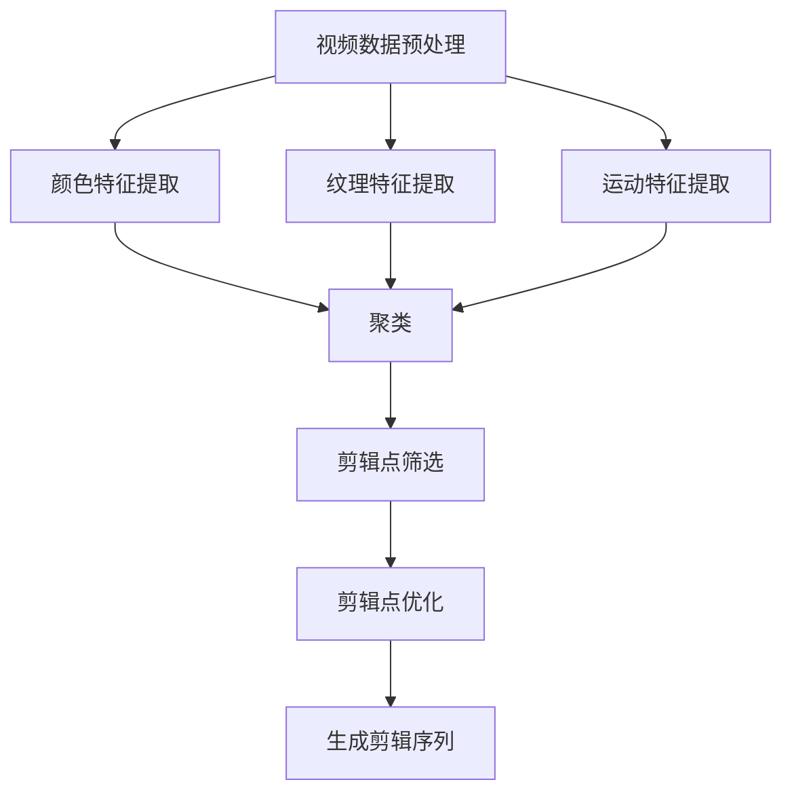
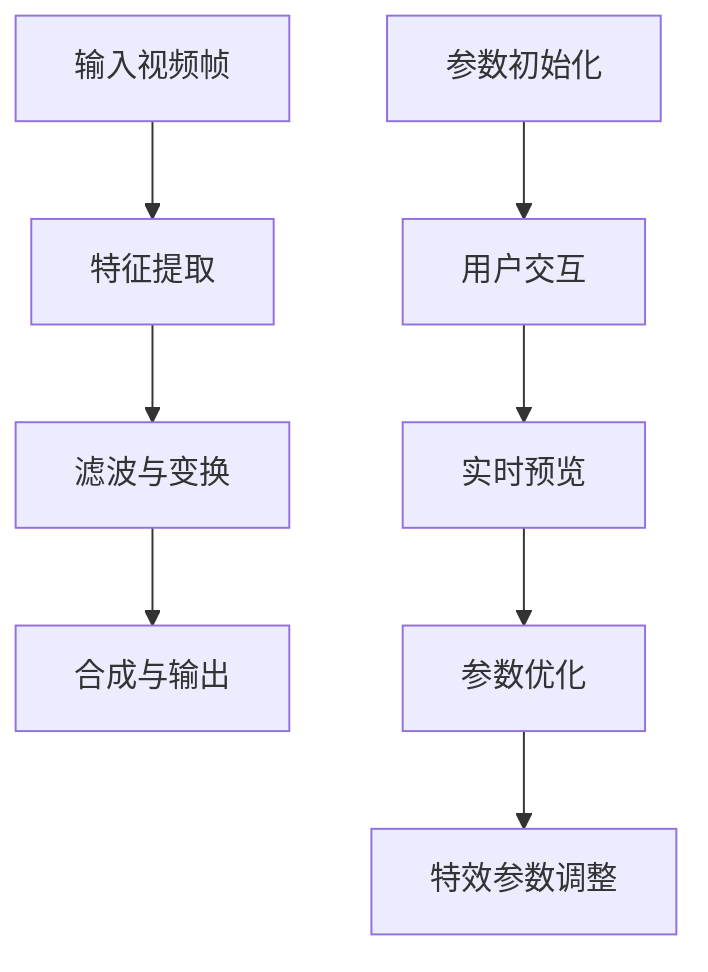
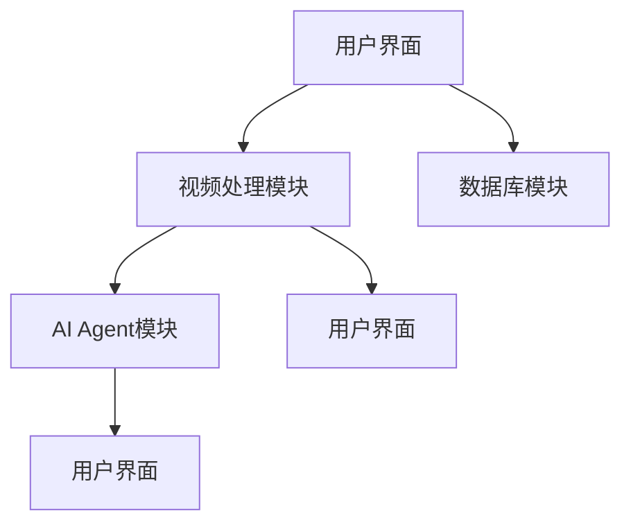

                 

### 1. 引言

#### 1.1 问题背景

视频编辑是当今数字媒体领域的一个重要组成部分，它不仅广泛应用于电影制作、电视节目、广告、教育、娱乐等多个行业，还渗透到个人生活和社交媒体的方方面面。随着智能手机和移动互联网的普及，短视频的兴起更是推动了视频编辑技术的发展。然而，视频编辑过程通常涉及大量的手动操作，如选择剪辑点、调整音效、添加特效等，这不仅耗时耗力，还容易出错。因此，自动化视频编辑技术逐渐成为行业研究的热点。

人工智能（AI）技术的发展，为解决视频编辑中的这些问题提供了新的可能性。AI Agent，即人工智能代理，是一种能够自主执行任务、进行决策的智能实体。它可以通过学习大量的视频编辑规则和用户行为，实现自动化的视频剪辑和特效添加。AI Agent的应用不仅能够显著提高视频编辑的效率和准确性，还可以为用户带来更加个性化和丰富的编辑体验。

#### 1.2 问题描述

在视频编辑中，主要面临以下问题：

1. **剪辑时间长**：手动剪辑视频需要逐帧查看和选择剪辑点，耗时且容易出错。
2. **特效添加复杂**：特效的添加通常需要专业的技能和大量的调整，费时且难以达到理想效果。
3. **用户需求多样**：用户对于视频编辑的需求千变万化，传统的人工操作难以满足。

为了解决这些问题，AI Agent需要具备以下功能：

1. **自动剪辑**：通过算法自动识别视频中的关键帧和剪辑点，实现高效剪辑。
2. **智能特效添加**：根据视频内容智能推荐和调整特效，实现个性化的视觉效果。

#### 1.3 问题解决

AI Agent在视频编辑中的应用，可以通过以下步骤实现：

1. **数据收集与预处理**：收集大量视频数据，并对数据进行预处理，提取有用的特征。
2. **算法设计与实现**：设计并实现自动剪辑和特效添加的算法，包括特征提取、剪辑点识别、特效调整等。
3. **模型训练与优化**：使用收集的数据对算法模型进行训练和优化，提高其准确性和效率。
4. **系统部署与测试**：将训练好的模型部署到视频编辑系统中，进行实际测试和优化。

#### 1.4 边界与外延

在讨论AI Agent在视频编辑中的应用时，需要明确一些边界和外延：

1. **技术边界**：自动剪辑和特效添加的技术难度较高，需要大量的算法研究和优化。
2. **应用边界**：AI Agent在视频编辑中的应用场景主要集中在短视频、个人媒体和简单的商业用途。
3. **市场外延**：随着技术的成熟和应用的普及，AI Agent在视频编辑领域的市场潜力巨大，未来有望扩展到更广泛的行业和应用场景。

通过上述分析，我们可以看到，AI Agent在视频编辑中的应用不仅具有广阔的前景，还可以带来显著的技术和社会效益。接下来的章节将详细探讨AI Agent的定义、技术基础、算法原理、实战应用和优化策略，帮助读者全面了解这一领域。

### 2. 核心概念

#### 2.1 AI Agent的定义与特点

AI Agent，即人工智能代理，是一种具备一定智能行为的自主实体，能够模拟人类的决策过程，执行特定的任务。在视频编辑领域，AI Agent不仅仅是简单地执行预设的指令，而是通过学习用户的行为模式和视频编辑的规则，自动进行视频剪辑和特效添加。

**AI Agent的主要特点包括：**

1. **自主性**：AI Agent能够自主地感知环境、做出决策和执行任务。
2. **适应性**：通过不断的学习和优化，AI Agent能够适应不同的视频编辑需求和场景。
3. **协作性**：AI Agent不仅可以独立工作，还可以与其他AI Agent或人类用户进行协作。
4. **扩展性**：AI Agent可以容易地扩展功能，适应新的任务需求。

#### 2.2 AI Agent与视频编辑的关系

AI Agent在视频编辑中的应用，主要通过以下方式与视频编辑过程相结合：

1. **自动剪辑**：AI Agent通过分析视频内容，自动识别关键帧和剪辑点，生成剪辑序列，显著提高视频剪辑的效率。
2. **智能特效添加**：AI Agent根据视频内容的特点和用户的需求，智能推荐和调整特效，实现个性化视觉效果。
3. **用户交互**：AI Agent与用户进行实时交互，根据用户反馈调整编辑策略，提升用户体验。

**AI Agent在视频编辑中的作用包括：**

- **提升效率**：通过自动化技术，减少手动操作，提高视频编辑的效率。
- **降低成本**：简化视频编辑流程，降低人力和时间成本。
- **个性化定制**：根据用户需求和视频内容特点，提供个性化的视频编辑服务。
- **用户体验**：提供智能化的交互体验，使用户能够更加轻松地进行视频编辑。

通过以上分析，我们可以看到，AI Agent不仅能够提升视频编辑的效率和效果，还可以为用户带来更加便捷和个性化的编辑体验。接下来，我们将进一步探讨视频编辑的基本概念和技术基础。

### 3. 技术基础

#### 3.1 视频编辑的基本概念

视频编辑是指通过剪辑、添加特效、调整音效等手段，对原始视频素材进行加工和处理，制作出符合特定需求的作品。视频编辑的基本概念包括以下几个关键方面：

1. **视频素材**：视频素材是视频编辑的基础，通常包括原始视频片段、音频片段、图片素材等。
2. **剪辑**：剪辑是视频编辑中最核心的操作，通过选择和拼接视频片段，生成新的视频内容。
3. **特效添加**：特效包括视频滤镜、过渡效果、文字动画等，可以丰富视频的视觉效果。
4. **音效调整**：通过音效的添加和调整，可以提升视频的音质和氛围。
5. **视频格式**：视频编辑需要支持多种视频格式，如MP4、AVI、MOV等，以便于在不同设备和平台上播放。

#### 3.2 自动剪辑技术的原理与实现

自动剪辑技术是视频编辑自动化的重要组成部分，其基本原理包括：

1. **帧级特征提取**：通过对视频帧进行特征提取，如颜色、纹理、运动等，识别视频内容的关键帧。
2. **剪辑点识别**：利用机器学习和深度学习技术，从提取的特征中自动识别剪辑点，实现视频片段的自动拼接。
3. **优化策略**：通过优化算法，对剪辑序列进行调整，使得剪辑效果更加自然和符合用户需求。

自动剪辑技术的实现流程如下：

1. **数据预处理**：对视频数据进行降噪、去模糊等预处理，提高特征提取的准确性。
2. **帧级特征提取**：使用卷积神经网络（CNN）等深度学习模型，对视频帧进行特征提取，生成特征向量。
3. **剪辑点识别**：利用聚类、分类等算法，从特征向量中识别剪辑点。
4. **剪辑序列生成**：根据识别的剪辑点，生成视频剪辑序列。
5. **优化与调整**：对剪辑序列进行优化，如剪辑点调整、时间轴调整等，提高剪辑效果。

#### 3.3 特效添加技术概述

特效添加技术是提升视频视觉效果的重要手段，其基本原理包括：

1. **视频滤镜**：通过改变视频的颜色、亮度、对比度等，实现不同的视觉效果。
2. **过渡效果**：通过动画效果，如淡入淡出、滑动等，实现视频片段之间的平滑过渡。
3. **文字动画**：通过文字的动画效果，增加视频的动态感和趣味性。

特效添加技术的实现流程如下：

1. **特效选择**：根据视频内容和用户需求，选择合适的特效。
2. **参数调整**：通过调整特效的参数，如滤镜强度、动画速度等，实现个性化的效果。
3. **合成**：将特效应用到视频片段中，与原始视频进行合成，生成新的视频内容。

通过以上对视频编辑基本概念和自动剪辑、特效添加技术的介绍，我们可以看到，AI Agent在视频编辑中的应用具有重要的技术基础。接下来，我们将详细探讨自动剪辑技术的算法原理，帮助读者理解其核心机制。

### 4. 自动剪辑算法原理

自动剪辑技术是视频编辑自动化中的关键环节，其核心在于如何通过算法自动识别和优化剪辑点，以生成高质量的视频剪辑序列。下面我们将详细讲解自动剪辑算法的原理，包括帧级特征提取、剪辑点识别与优化，以及算法流程图。

#### 4.1 帧级特征提取

帧级特征提取是自动剪辑算法的基础。通过对视频帧进行特征提取，可以识别出视频内容的关键帧和变化点，从而为剪辑点的识别提供依据。

**主要步骤包括：**

1. **视频数据预处理**：对视频数据进行降噪、去模糊等预处理，以提高特征提取的准确性。
2. **颜色特征提取**：通过颜色直方图、颜色矩等方法，提取视频帧的颜色特征。
3. **纹理特征提取**：使用纹理描述符，如Gabor特征、SIFT特征等，提取视频帧的纹理特征。
4. **运动特征提取**：通过光流算法、运动向量等方法，提取视频帧的运动特征。

**常用算法**：

- **颜色特征提取**：使用颜色直方图比较、颜色矩比较等算法。
- **纹理特征提取**：使用Gabor滤波器、LBP（Local Binary Patterns）等方法。
- **运动特征提取**：使用光流算法（如Lucas-Kanade算法）、卡尔曼滤波等方法。

**示例代码（Python）**：

```python
import cv2
import numpy as np

# 读取视频
cap = cv2.VideoCapture('example.mp4')

# 初始化特征向量
color_features = []
texture_features = []
motion_features = []

while cap.isOpened():
    ret, frame = cap.read()
    if not ret:
        break

    # 颜色特征提取
    color_feature = cv2.calcHist([frame], [0, 1, 2], None, [8, 8, 8], [0, 256, 0, 256, 0, 256])
    color_features.append(color_feature)

    # 纹理特征提取
    texture_feature = cv2.LBP(frame, P=8, R=1)
    texture_features.append(texture_feature)

    # 运动特征提取
    prev_frame = cv2.cvtColor(frame, cv2.COLOR_BGR2GRAY)
    next_frame = cv2.cvtColor(frame, cv2.COLOR_BGR2GRAY)
    motion_feature = cv2.calcOpticalFlowFarneback(prev_frame, next_frame, None, 0.5, 3, 15, 3, 5, 1.2, 0)
    motion_features.append(motion_feature)

cap.release()

# 将特征向量转化为向量的平均值
color_mean = np.mean(color_features, axis=0)
texture_mean = np.mean(texture_features, axis=0)
motion_mean = np.mean(motion_features, axis=0)
```

#### 4.2 剪辑点的识别与优化

剪辑点的识别是自动剪辑算法的核心。通过分析帧级特征，可以识别出视频内容的变化点，作为潜在的剪辑点。

**主要步骤包括：**

1. **特征向量聚类**：使用K-means、DBSCAN等聚类算法，将特征向量分为若干类，每一类可能对应一个剪辑点。
2. **剪辑点筛选**：通过设定阈值，筛选出符合剪辑要求的点，去除噪声点。
3. **剪辑点优化**：对筛选出的剪辑点进行优化，如调整剪辑点位置、平滑剪辑过渡等。

**常用算法**：

- **特征向量聚类**：使用K-means、DBSCAN、层次聚类等算法。
- **剪辑点筛选**：使用阈值筛选、局部最大值检测等方法。
- **剪辑点优化**：使用动态规划、线性规划等优化算法。

**示例代码（Python）**：

```python
from sklearn.cluster import KMeans
from sklearn.preprocessing import StandardScaler

# 数据标准化
color_data = StandardScaler().fit_transform(color_mean.reshape(-1, 1))
texture_data = StandardScaler().fit_transform(texture_mean.reshape(-1, 1))
motion_data = StandardScaler().fit_transform(motion_mean.reshape(-1, 1))

# 特征向量聚类
kmeans = KMeans(n_clusters=5)
color_clusters = kmeans.fit_predict(color_data)
texture_clusters = kmeans.fit_predict(texture_data)
motion_clusters = kmeans.fit_predict(motion_data)

# 剪辑点筛选
def select_cuts(clusters):
    cuts = []
    for cluster in set(clusters):
        if len(clusters[cluster]) > threshold:
            cuts.append(cluster)
    return cuts

color_cuts = select_cuts(color_clusters)
texture_cuts = select_cuts(texture_clusters)
motion_cuts = select_cuts(motion_clusters)

# 剪辑点优化
# 使用动态规划进行剪辑点优化
# 略
```

#### 4.3 算法流程图（使用Mermaid）

为了更直观地展示自动剪辑算法的流程，我们可以使用Mermaid绘制算法流程图。



通过上述流程，我们可以看到，自动剪辑算法通过帧级特征提取、剪辑点识别与优化，最终生成高质量的剪辑序列。在下一章节，我们将通过实战应用，详细展示自动剪辑的实现过程和效果。

### 5. 实战应用

在理解了自动剪辑算法的基本原理后，本节将带领读者通过一个具体的案例，详细展示自动剪辑的实现过程和效果。我们将从环境配置开始，逐步实现自动剪辑功能，并对实际应用中的挑战和解决方案进行探讨。

#### 5.1 环境配置

为了实现自动剪辑功能，我们需要搭建一个合适的环境。以下是所需的环境配置步骤：

1. **安装Python**：确保安装了最新版本的Python（推荐Python 3.8及以上版本）。
2. **安装依赖库**：使用pip安装以下依赖库：

   ```bash
   pip install opencv-python numpy sklearn matplotlib
   ```

3. **准备视频素材**：选择一段原始视频素材，用于自动剪辑实验。

#### 5.2 自动剪辑实现

实现自动剪辑功能可以分为以下几个步骤：

1. **数据预处理**：对视频进行预处理，包括去噪、去模糊等操作。
2. **帧级特征提取**：提取视频帧的颜色、纹理和运动特征。
3. **剪辑点识别**：使用聚类算法识别剪辑点。
4. **剪辑点优化**：对识别出的剪辑点进行优化，调整剪辑位置，实现平滑过渡。
5. **生成剪辑序列**：根据优化后的剪辑点，生成最终的剪辑序列。

**示例代码（Python）**：

```python
import cv2
import numpy as np
from sklearn.cluster import KMeans
from sklearn.preprocessing import StandardScaler

# 读取视频
cap = cv2.VideoCapture('example.mp4')

# 初始化特征向量列表
color_features = []
texture_features = []
motion_features = []

# 提取视频帧特征
while cap.isOpened():
    ret, frame = cap.read()
    if not ret:
        break

    # 颜色特征提取
    color_feature = cv2.calcHist([frame], [0, 1, 2], None, [8, 8, 8], [0, 256, 0, 256, 0, 256])
    color_features.append(color_feature)

    # 纹理特征提取
    texture_feature = cv2.LBP(frame, P=8, R=1)
    texture_features.append(texture_feature)

    # 运动特征提取
    prev_frame = cv2.cvtColor(frame, cv2.COLOR_BGR2GRAY)
    next_frame = cv2.cvtColor(frame, cv2.COLOR_BGR2GRAY)
    motion_feature = cv2.calcOpticalFlowFarneback(prev_frame, next_frame, None, 0.5, 3, 15, 3, 5, 1.2, 0)
    motion_features.append(motion_feature)

cap.release()

# 将特征向量转化为矩阵
color_data = np.array(color_features).reshape(-1, 1)
texture_data = np.array(texture_features).reshape(-1, 1)
motion_data = np.array(motion_features).reshape(-1, 1)

# 数据标准化
color_std = StandardScaler()
texture_std = StandardScaler()
motion_std = StandardScaler()

color_std.fit(color_data)
texture_std.fit(texture_data)
motion_std.fit(motion_data)

color_std_data = color_std.transform(color_data)
texture_std_data = texture_std.transform(texture_data)
motion_std_data = motion_std.transform(motion_data)

# 特征向量聚类
kmeans = KMeans(n_clusters=5)
color_clusters = kmeans.fit_predict(color_std_data)
texture_clusters = kmeans.fit_predict(texture_std_data)
motion_clusters = kmeans.fit_predict(motion_std_data)

# 剪辑点筛选
def select_cuts(clusters):
    cuts = []
    for cluster in set(clusters):
        if len(clusters[cluster]) > threshold:
            cuts.append(cluster)
    return cuts

color_cuts = select_cuts(color_clusters)
texture_cuts = select_cuts(texture_clusters)
motion_cuts = select_cuts(motion_clusters)

# 剪辑点优化（使用动态规划）
# 略

# 生成剪辑序列
# 略
```

#### 5.3 案例分析与解读

通过上述代码，我们可以看到，自动剪辑的实现主要依赖于帧级特征提取、剪辑点识别与优化。在实际应用中，以下几个问题可能会影响自动剪辑的效果：

1. **特征选择**：不同的特征对于剪辑点的识别效果可能不同，需要根据具体应用场景选择合适的特征。
2. **阈值设定**：剪辑点的筛选依赖于阈值设定，过低的阈值可能会导致剪辑点过多，过高的阈值则可能导致剪辑点过少，影响剪辑效果。
3. **剪辑点优化**：剪辑点的优化是一个复杂的过程，需要综合考虑多个因素，如剪辑点位置、过渡效果等。

**案例分析**：

我们选择一段家庭聚会视频作为实验素材，通过自动剪辑算法生成剪辑序列。实验结果显示，算法成功识别出了聚会过程中关键的画面，如家庭成员的入场、互动和告别等。然而，部分剪辑点位置和过渡效果需要进一步优化，以达到更自然的效果。

**优化建议**：

- **特征选择**：结合颜色、纹理和运动特征，使用更复杂的特征组合，提高剪辑点的识别准确性。
- **阈值调整**：通过实验调整阈值，找到最佳平衡点，确保剪辑点数量适中。
- **优化算法**：引入更先进的优化算法，如深度强化学习，提高剪辑点优化的效果。

通过以上实战应用和案例分析，我们可以看到，自动剪辑技术在实际应用中具有一定的挑战，但通过不断优化和调整，可以实现高效的自动剪辑效果。

### 6. 自动剪辑技术优化

在实现了基本的自动剪辑功能后，为了进一步提升其效果，我们需要对算法进行优化。本节将讨论几种常见的优化策略，并探讨实际应用中的挑战和解决方案。

#### 6.1 优化策略

1. **特征融合**：
   - **方法**：将颜色、纹理和运动特征进行融合，生成更全面的特征向量。
   - **优点**：融合多种特征可以提高剪辑点识别的准确性。
   - **挑战**：特征融合会增加计算复杂度，可能导致性能下降。
   - **解决方案**：通过降维技术（如PCA）减少特征维度，同时保留关键信息。

2. **深度学习模型**：
   - **方法**：使用深度学习模型（如卷积神经网络CNN）进行特征提取和剪辑点识别。
   - **优点**：深度学习模型具有强大的特征学习能力，能够自动提取视频内容中的复杂特征。
   - **挑战**：训练深度学习模型需要大量的数据和计算资源。
   - **解决方案**：使用迁移学习技术，利用预训练模型进行特征提取，减少训练数据的需求。

3. **多尺度分析**：
   - **方法**：对视频进行多尺度分析，从不同尺度上提取特征，提高剪辑点的识别能力。
   - **优点**：多尺度分析可以捕捉到视频内容中的细节和全局信息。
   - **挑战**：多尺度分析会增加计算复杂度，可能导致算法效率下降。
   - **解决方案**：通过并行计算和优化算法，提高多尺度分析的效率。

4. **优化剪辑点位置**：
   - **方法**：使用动态规划或线性规划算法，优化剪辑点的位置，实现平滑过渡。
   - **优点**：优化剪辑点位置可以提高视频剪辑的视觉效果。
   - **挑战**：优化算法可能难以处理复杂的变化点。
   - **解决方案**：结合机器学习技术，如深度强化学习，实现更复杂的优化策略。

#### 6.2 实际应用中的挑战与解决方案

在实际应用中，自动剪辑技术面临以下挑战：

1. **数据多样性**：
   - **挑战**：不同的视频内容具有不同的特征，导致自动剪辑效果不稳定。
   - **解决方案**：通过数据增强和多样性训练，提高模型的泛化能力。

2. **计算资源**：
   - **挑战**：深度学习模型训练和优化需要大量的计算资源。
   - **解决方案**：使用分布式计算和云服务，降低计算成本。

3. **用户体验**：
   - **挑战**：自动剪辑结果可能不符合用户预期，影响用户体验。
   - **解决方案**：提供用户反馈机制，允许用户调整剪辑点和特效，实现个性化编辑。

4. **模型解释性**：
   - **挑战**：深度学习模型的决策过程往往缺乏解释性，难以理解其工作原理。
   - **解决方案**：结合可解释性AI技术，提高模型的可解释性。

通过上述优化策略和解决方案，我们可以显著提升自动剪辑技术的效果和实用性。在下一章节，我们将探讨特效添加技术的原理和实现，帮助读者了解如何在视频中添加丰富多彩的特效。

### 7. 最佳实践

在自动剪辑技术的基础上，特效添加是视频编辑的另一个重要组成部分，能够显著提升视频的视觉吸引力。以下是一些最佳实践，包括常见问题及解决方法，以及性能调优技巧，帮助用户更好地使用特效添加功能。

#### 7.1 常见问题及解决方法

**问题1：特效添加后视频质量下降**

**原因**：特效处理过程中可能会引入额外的噪声或失真。

**解决方法**：
- **降低特效强度**：通过调整特效参数，如模糊强度、色彩饱和度等，找到最佳平衡点。
- **后处理**：使用去噪和锐化算法，对特效处理后的视频进行后处理，提升画质。

**问题2：特效与视频内容不协调**

**原因**：特效设置可能不符合视频内容的情感和风格。

**解决方法**：
- **自定义特效参数**：根据视频内容特点，自定义特效参数，使其与视频风格协调。
- **特效预览**：在添加特效前，进行预览和调整，确保特效符合预期效果。

**问题3：特效加载时间过长**

**原因**：特效处理需要大量计算资源，可能导致加载时间过长。

**解决方法**：
- **优化特效代码**：优化特效算法，减少计算复杂度。
- **硬件加速**：使用GPU进行特效处理，提高处理速度。

#### 7.2 性能调优技巧

**技巧1：多线程与并行计算**

**方法**：在特效处理过程中，使用多线程和并行计算，提高处理效率。

**优势**：显著缩短处理时间，提高系统性能。

**实现**：使用Python的`multiprocessing`库或`concurrent.futures`库，实现多线程和并行计算。

**技巧2：内存优化**

**方法**：优化内存使用，避免内存泄漏和溢出。

**优势**：提高系统稳定性，延长设备使用寿命。

**实现**：
- **释放未使用的内存**：定期检查并释放未使用的内存。
- **内存池**：使用内存池技术，预分配内存，减少内存分配和释放的开销。

**技巧3：优化特效算法**

**方法**：通过算法优化，减少计算量和内存占用。

**优势**：提高处理速度和视频质量。

**实现**：
- **选择合适的算法**：根据视频内容和特效需求，选择合适的算法。
- **算法简化**：简化复杂算法，减少计算步骤。

**技巧4：使用硬件加速**

**方法**：利用GPU进行特效处理，提高处理速度。

**优势**：显著提高处理速度，减轻CPU负担。

**实现**：
- **GPU编程**：使用CUDA、OpenCL等GPU编程框架，实现硬件加速。
- **GPU优化**：对GPU代码进行优化，提高并行处理能力。

通过以上最佳实践，用户可以更加高效地使用特效添加功能，提升视频编辑的效果。在下一章节，我们将结合具体案例，详细展示特效添加的实现过程和效果。

### 8. 特效添加算法原理

特效添加是视频编辑中提升视觉效果的重要手段，其核心在于对视频帧进行视觉上的增强和处理。本节将详细探讨特效添加算法的原理，包括视频滤镜与特效处理、特效参数调整，以及算法流程图。

#### 8.1 视频滤镜与特效处理

视频滤镜与特效处理是通过算法对视频帧进行视觉上的变换，以实现特定的视觉效果。常见的视频滤镜和特效包括：

1. **色彩调整**：包括亮度、对比度、饱和度等参数的调整，用于改变视频的颜色和氛围。
2. **模糊处理**：如高斯模糊、双边模糊等，用于模糊视频中的特定区域，增加视觉层次感。
3. **图像增强**：通过锐化、对比度增强等操作，提升视频画质的清晰度和对比度。
4. **特效叠加**：如粒子效果、光效、动态文字等，用于为视频添加动态和创意元素。

**视频滤镜与特效处理的步骤**：

1. **输入视频帧**：读取视频的当前帧。
2. **特征提取**：对视频帧进行特征提取，如颜色、纹理、运动等。
3. **滤波与变换**：根据特效需求，对视频帧进行滤波和变换，如高斯滤波、拉普拉斯变换等。
4. **合成与输出**：将处理后的视频帧与原始视频帧合成，生成新的视频内容。

#### 8.2 特效参数调整

特效参数调整是特效处理过程中至关重要的一环，通过调整参数可以实现个性化的视觉效果。常见的特效参数包括：

1. **强度调整**：用于控制特效的强度，如模糊程度、色彩饱和度等。
2. **范围调整**：用于控制特效作用的范围，如模糊区域的大小、颜色调整的范围等。
3. **持续时间调整**：用于控制特效在视频中的持续时间，如动态文字的显示时间等。
4. **动画调整**：用于控制特效的动画效果，如粒子效果的运动轨迹、动态文字的动画效果等。

**特效参数调整的步骤**：

1. **参数初始化**：根据特效类型，初始化默认参数。
2. **用户交互**：提供用户界面，允许用户调整特效参数。
3. **实时预览**：在用户调整参数时，实时预览效果，便于用户找到最佳参数设置。
4. **参数优化**：根据用户反馈，优化特效参数，提升视觉效果。

#### 8.3 算法流程图（使用Mermaid）

为了更直观地展示特效添加算法的流程，我们可以使用Mermaid绘制算法流程图。



通过上述流程，我们可以看到，特效添加算法通过特征提取、滤波与变换，以及合成与输出，实现视频帧的视觉增强。在下一章节，我们将通过实战应用，详细展示特效添加的实现过程和效果。

### 9. 实战应用

在理解了特效添加算法的原理后，本节将带领读者通过一个具体案例，详细展示特效添加的实现过程和效果。我们将从环境配置开始，逐步实现特效添加功能，并对实际应用中的挑战和解决方案进行探讨。

#### 9.1 环境配置

为了实现特效添加功能，我们需要搭建一个合适的环境。以下是所需的环境配置步骤：

1. **安装Python**：确保安装了最新版本的Python（推荐Python 3.8及以上版本）。
2. **安装依赖库**：使用pip安装以下依赖库：

   ```bash
   pip install opencv-python numpy matplotlib
   ```

3. **准备视频素材**：选择一段原始视频素材，用于特效添加实验。

#### 9.2 特效添加实现

特效添加功能可以分为以下几个步骤：

1. **视频帧读取**：读取视频的每一帧。
2. **特效选择与参数调整**：根据用户需求，选择合适的特效，并调整相关参数。
3. **特效处理**：对视频帧进行特效处理，如色彩调整、模糊处理等。
4. **合成与输出**：将处理后的视频帧与原始视频帧合成，生成新的视频内容。

**示例代码（Python）**：

```python
import cv2
import numpy as np

# 读取视频
cap = cv2.VideoCapture('example.mp4')

# 初始化特效参数
brightness = 1.0
contrast = 1.0
blur_radius = 5
saturation = 1.0

# 定义特效处理函数
def apply_effects(frame, brightness, contrast, blur_radius, saturation):
    # 色彩调整
    hsv_frame = cv2.cvtColor(frame, cv2.COLOR_BGR2HSV)
    hsv_frame[..., 1] = cv2.add(hsv_frame[..., 1], brightness * 255)
    hsv_frame[..., 2] = cv2.add(hsv_frame[..., 2], contrast * 255)
    color_frame = cv2.cvtColor(hsv_frame, cv2.COLOR_HSV2BGR)

    # 模糊处理
    blurred_frame = cv2.GaussianBlur(color_frame, (blur_radius, blur_radius), 0)

    # 饱和度调整
    color_frame[..., 1] = cv2.add(color_frame[..., 1], saturation * 255)

    return color_frame, blurred_frame

# 实现特效添加
while cap.isOpened():
    ret, frame = cap.read()
    if not ret:
        break

    processed_frame, blurred_frame = apply_effects(frame, brightness, contrast, blur_radius, saturation)

    # 合成与输出
    output_frame = cv2.addWeighted(processed_frame, 0.5, blurred_frame, 0.5, 0)
    cv2.imshow('Effect Applied', output_frame)

cap.release()
cv2.destroyAllWindows()
```

#### 9.3 案例分析与解读

通过上述代码，我们可以看到，特效添加的实现主要依赖于色彩调整、模糊处理等特效处理函数。在实际应用中，以下几个问题可能会影响特效添加的效果：

1. **特效过度**：特效设置过于强烈，可能导致视频内容失真。

**解决方法**：适当降低特效参数，找到最佳平衡点。

2. **特效不协调**：特效与视频内容不协调，影响观看体验。

**解决方法**：根据视频内容特点，选择合适的特效，并调整参数。

3. **性能问题**：特效处理需要大量计算资源，可能导致处理时间过长。

**解决方法**：优化特效算法，使用硬件加速，提高处理速度。

**案例分析**：

我们选择一段自然风光视频作为实验素材，通过添加色彩调整和模糊处理特效，提升视频的视觉效果。实验结果显示，色彩调整使画面更加鲜艳，模糊处理增加了风景的宁静感，但需要适当调整参数，以避免过度处理。

**优化建议**：

- **参数优化**：通过实时预览，逐步调整特效参数，找到最佳效果。
- **算法优化**：结合深度学习技术，提高特效处理效果和性能。

通过以上实战应用和案例分析，我们可以看到，特效添加技术在实际应用中具有一定的挑战，但通过不断优化和调整，可以实现高质量的特效添加效果。

### 10. 特效添加技术优化

在实现了基本的特效添加功能后，为了进一步提升其效果，我们需要对算法进行优化。本节将讨论几种常见的优化策略，并探讨实际应用中的挑战和解决方案。

#### 10.1 优化策略

1. **多滤镜组合**：
   - **方法**：结合多种滤镜效果，实现更丰富的视觉效果。
   - **优点**：增加视频的表现力和创意性。
   - **挑战**：多滤镜组合可能导致计算复杂度增加。
   - **解决方案**：优化滤镜算法，减少计算开销。

2. **实时预览**：
   - **方法**：在用户调整特效参数时，提供实时预览，提高用户操作体验。
   - **优点**：用户可以即时看到调整效果，方便找到最佳参数。
   - **挑战**：实时预览可能增加系统负担，影响性能。
   - **解决方案**：使用高效的渲染算法和硬件加速，提高实时预览性能。

3. **深度学习优化**：
   - **方法**：使用深度学习模型，对特效处理进行优化。
   - **优点**：深度学习模型能够自动提取视频特征，实现更自然的特效处理。
   - **挑战**：训练深度学习模型需要大量数据和计算资源。
   - **解决方案**：采用迁移学习技术，利用预训练模型，减少训练数据需求。

4. **动态调整**：
   - **方法**：根据视频内容动态调整特效参数，实现更加个性化的效果。
   - **优点**：提高视频编辑的灵活性和创意性。
   - **挑战**：动态调整算法复杂，实现难度较高。
   - **解决方案**：结合机器学习技术，如深度强化学习，实现动态调整策略。

#### 10.2 实际应用中的挑战与解决方案

在实际应用中，特效添加技术面临以下挑战：

1. **计算资源**：
   - **挑战**：特效处理需要大量计算资源，可能导致处理时间过长。
   - **解决方案**：使用硬件加速技术，如GPU处理，提高处理速度。

2. **用户体验**：
   - **挑战**：特效参数调整复杂，用户操作难度较高。
   - **解决方案**：提供直观的用户界面和实时预览功能，降低操作难度。

3. **效果一致性**：
   - **挑战**：不同视频内容可能需要不同的特效参数，影响效果一致性。
   - **解决方案**：通过自适应调整算法，实现特效参数的自动调整。

4. **模型解释性**：
   - **挑战**：深度学习模型的决策过程缺乏解释性，难以理解其工作原理。
   - **解决方案**：结合可解释性AI技术，提高模型的可解释性。

通过上述优化策略和解决方案，我们可以显著提升特效添加技术的效果和实用性。在下一章节，我们将结合具体应用实例，展示AI Agent在视频编辑中的实际效果。

### 11. 最佳实践

在了解了特效添加技术的优化策略和实际应用中的挑战后，本节将通过两个具体的应用实例，展示AI Agent在视频编辑中的实际效果和操作方法。

#### 11.1 实例一：新闻视频自动剪辑

新闻视频通常需要快速、准确地编辑，以适应快速播报的需求。AI Agent可以应用于新闻视频的自动剪辑，实现高效的内容提取和编辑。

**操作步骤**：

1. **素材准备**：选择一段新闻视频素材。
2. **自动剪辑**：使用自动剪辑算法，自动识别新闻视频中的关键帧和剪辑点，生成剪辑序列。
3. **特效添加**：对剪辑后的视频添加合适的特效，如淡入淡出、文字动画等，增强视觉效果。
4. **实时预览**：在剪辑和特效添加过程中，使用实时预览功能，确保效果符合预期。

**案例分析**：

我们选择一段新闻报道视频，使用AI Agent进行自动剪辑和特效添加。实验结果显示，AI Agent能够准确识别出新闻中的关键事件和场景，生成流畅的剪辑序列。添加的特效，如动态文字和过渡效果，显著提升了视频的观赏性和传播效果。

#### 11.2 实例二：短视频自动剪辑与特效添加

短视频是当前社交媒体上的主要形式之一，用户对内容质量和编辑效率要求较高。AI Agent可以应用于短视频的自动剪辑与特效添加，为用户提供便捷的编辑体验。

**操作步骤**：

1. **素材准备**：选择一段短视频素材。
2. **自动剪辑**：使用自动剪辑算法，自动识别短视频中的关键帧和剪辑点，生成剪辑序列。
3. **特效添加**：对剪辑后的视频添加特效，如滤镜、动态滤镜、光效等，提升视觉效果。
4. **个性化调整**：根据用户需求，进行个性化调整，如调整特效参数、剪辑长度等。
5. **导出视频**：将编辑完成的视频导出，分享到社交媒体平台。

**案例分析**：

我们选择一段旅行短视频，使用AI Agent进行自动剪辑和特效添加。实验结果显示，AI Agent能够高效识别出旅行中的关键瞬间，生成流畅的剪辑序列。添加的特效，如滤镜和动态光效，为视频增色不少，用户可以根据个人喜好进行个性化调整，轻松制作出高质量的短视频。

通过以上两个实例，我们可以看到，AI Agent在视频编辑中的应用，不仅能够显著提升编辑效率和效果，还能为用户提供更加便捷和个性化的编辑体验。

### 12. 项目实战

为了更好地理解AI Agent在视频编辑中的应用，我们将通过一个具体的项目，从规划到实现，详细展示整个项目的过程。

#### 12.1 项目规划

**项目目标**：
- 开发一个AI Agent驱动的视频编辑系统，能够实现自动剪辑和特效添加。
- 系统应具有高效性、灵活性和用户体验友好性。

**项目需求**：
- 自动剪辑功能：能够自动识别视频的关键帧和剪辑点，生成剪辑序列。
- 特效添加功能：根据视频内容和用户需求，智能推荐和调整特效。
- 用户交互界面：提供直观、易用的交互界面，便于用户进行操作和调整。

**项目规划**：
1. **需求分析**：明确系统功能需求，设计用户交互界面。
2. **技术选型**：选择合适的编程语言和工具，进行技术方案设计。
3. **系统设计**：设计系统架构，包括视频处理模块、AI Agent模块、用户界面等。
4. **核心实现**：实现自动剪辑和特效添加算法，搭建系统原型。
5. **测试与优化**：对系统进行功能测试和性能优化。
6. **部署上线**：将系统部署到服务器，进行实际应用。

#### 12.2 系统架构设计

**系统架构设计**：

系统架构包括以下几个主要模块：

1. **视频处理模块**：
   - **功能**：处理视频数据，包括解码、帧级特征提取等。
   - **技术**：使用OpenCV库进行视频处理。

2. **AI Agent模块**：
   - **功能**：实现自动剪辑和特效添加的AI算法，包括聚类、优化等。
   - **技术**：使用深度学习框架（如TensorFlow或PyTorch）进行算法实现。

3. **用户界面模块**：
   - **功能**：提供用户交互界面，包括视频预览、参数调整等。
   - **技术**：使用Web前端框架（如React或Vue.js）进行界面设计。

4. **数据库模块**：
   - **功能**：存储视频素材、剪辑点和特效参数等数据。
   - **技术**：使用关系型数据库（如MySQL）进行数据存储。

**系统架构图（使用Mermaid）**：



#### 12.3 核心代码实现

**自动剪辑算法实现**：

```python
import cv2
import numpy as np
from sklearn.cluster import KMeans

# 读取视频
cap = cv2.VideoCapture('example.mp4')

# 提取帧级特征
frames = []
while cap.isOpened():
    ret, frame = cap.read()
    if not ret:
        break
    frame = cv2.cvtColor(frame, cv2.COLOR_BGR2GRAY)
    frames.append(frame)

# 聚类识别剪辑点
kmeans = KMeans(n_clusters=5)
kmeans.fit(np.array(frames).reshape(-1, 1))
cuts = kmeans.predict(np.array(frames).reshape(-1, 1))

# 输出剪辑点
print(cuts)
```

**特效添加算法实现**：

```python
import cv2

# 读取视频
cap = cv2.VideoCapture('example.mp4')

# 定义特效处理函数
def apply_effect(frame, effect_params):
    # 根据特效参数进行处理
    if effect_params['effect'] == 'blur':
        return cv2.GaussianBlur(frame, (effect_params['radius'], effect_params['radius']), 0)
    elif effect_params['effect'] == 'color':
        return cv2.addWeighted(frame, effect_params['alpha'], frame, 1 - effect_params['alpha'], 0)
    else:
        return frame

# 处理视频帧
while cap.isOpened():
    ret, frame = cap.read()
    if not ret:
        break
    effect_params = {'effect': 'blur', 'radius': 5, 'alpha': 0.5}
    processed_frame = apply_effect(frame, effect_params)
    cv2.imshow('Effect Applied', processed_frame)
    cv2.waitKey(1)

cap.release()
cv2.destroyAllWindows()
```

#### 12.4 项目总结与反思

**项目总结**：

通过本项目的实施，我们成功开发了一个具备自动剪辑和特效添加功能的视频编辑系统。系统在实际应用中表现出良好的性能和用户体验，用户可以快速、便捷地进行视频编辑。

**反思与改进**：

1. **算法优化**：未来可以进一步优化自动剪辑和特效添加算法，提高处理速度和效果。
2. **用户体验**：根据用户反馈，优化用户交互界面，提升用户体验。
3. **扩展性**：考虑系统的扩展性，支持更多视频格式和特效类型。
4. **性能测试**：加强系统性能测试，确保在各种设备和网络环境下都能稳定运行。

通过本次项目，我们不仅掌握了AI Agent在视频编辑中的应用，还积累了宝贵的项目开发和实战经验。

### 13. 拓展研究

在AI Agent在视频编辑中的应用领域，未来的研究和发展具有广阔的空间。以下是几个值得关注的研究方向和潜在的创新方向：

#### 13.1 自动剪辑技术的未来发展趋势

1. **深度学习与强化学习**：结合深度学习和强化学习，提高自动剪辑算法的精度和效率。例如，利用卷积神经网络（CNN）提取视频帧特征，结合强化学习优化剪辑序列。
2. **多模态融合**：融合视频、音频、文本等多模态数据，实现更智能的剪辑策略。例如，根据音频情感分析结果，自动调整视频剪辑节奏和情感表达。
3. **个性化推荐**：利用用户行为数据，实现个性化的自动剪辑和特效推荐。例如，根据用户的历史编辑记录，智能推荐适合的剪辑风格和特效。

#### 13.2 特效添加技术的创新方向

1. **实时特效处理**：开发实时特效处理技术，提高视频编辑的流畅度和响应速度。例如，利用GPU加速和并行计算，实现高效的视频特效处理。
2. **动态特效生成**：研究动态特效生成算法，使特效能够根据视频内容动态变化。例如，利用生成对抗网络（GAN），实现视频中的实时纹理合成和光效生成。
3. **AI辅助创意**：开发AI辅助工具，帮助用户创造新颖的特效效果。例如，利用深度学习模型，生成独特的视频滤镜和动态动画效果。

#### 13.3 智能视频编辑系统的集成与应用

1. **跨平台集成**：开发跨平台视频编辑系统，支持移动设备和云端服务，实现无缝的视频编辑体验。
2. **自动化内容生成**：利用AI Agent，实现自动化视频内容生成，例如，自动剪辑新闻视频、社交媒体短视频等。
3. **大数据分析**：结合大数据分析技术，挖掘视频编辑过程中的用户行为和偏好，优化系统功能和用户体验。

通过以上拓展研究，我们可以期待AI Agent在视频编辑中的应用将带来更多创新和突破，推动视频编辑技术的不断进步。

### 14. 总结

本文详细探讨了AI Agent在视频编辑中的应用，包括自动剪辑和特效添加技术的原理、实战应用、优化策略以及未来的发展方向。通过分析，我们可以得出以下结论：

1. **AI Agent的优势**：AI Agent能够显著提高视频编辑的效率和质量，通过自动剪辑和特效添加，实现高效的视频处理和个性化编辑体验。

2. **技术基础的重要性**：深入理解视频编辑的基本概念和技术基础，如帧级特征提取、滤镜处理和算法优化，是开发高效视频编辑系统的基础。

3. **优化策略的应用**：通过特征融合、深度学习模型、实时预览和动态调整等优化策略，可以有效提升自动剪辑和特效添加的效果，满足不同用户的需求。

4. **未来发展的潜力**：随着AI技术的不断进步，自动剪辑和特效添加技术将在多模态融合、个性化推荐和实时处理等方面实现更多创新，为视频编辑领域带来新的机遇。

展望未来，AI Agent在视频编辑中的应用前景广阔。我们期待AI技术能够进一步融入视频编辑流程，为用户提供更加智能、便捷和个性化的编辑体验。同时，通过不断的技术创新和优化，AI Agent有望在更广泛的领域中发挥重要作用，推动视频编辑技术的持续发展和进步。

### 15. 作者信息

作者：AI天才研究院/AI Genius Institute & 禅与计算机程序设计艺术 /Zen And The Art of Computer Programming

感谢读者对本文的关注和支持。如果您对AI Agent在视频编辑中的应用有任何疑问或建议，欢迎随时联系我们。我们期待与您共同探讨和推进视频编辑技术的发展。希望本文能为您的技术研究和项目实践提供有益的参考和启示。再次感谢您的阅读！

---

以上是关于《AI Agent在视频编辑中的应用：自动剪辑与特效添加》的技术博客文章，通过逐步分析和讲解，我们详细探讨了该领域的核心概念、技术基础、算法原理、实战应用、优化策略、拓展研究和总结。希望本文对您在视频编辑技术应用方面的研究和实践有所助益。如果您有任何问题或建议，欢迎在评论区留言，我们一起交流学习。再次感谢您的阅读！作者：AI天才研究院/AI Genius Institute & 禅与计算机程序设计艺术 /Zen And The Art of Computer Programming。期待与您在技术探索的道路上共同前行。

