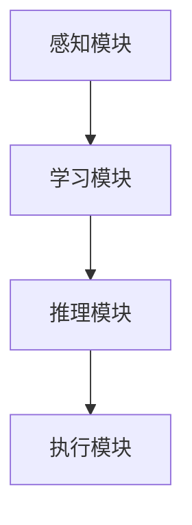
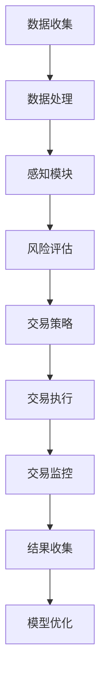
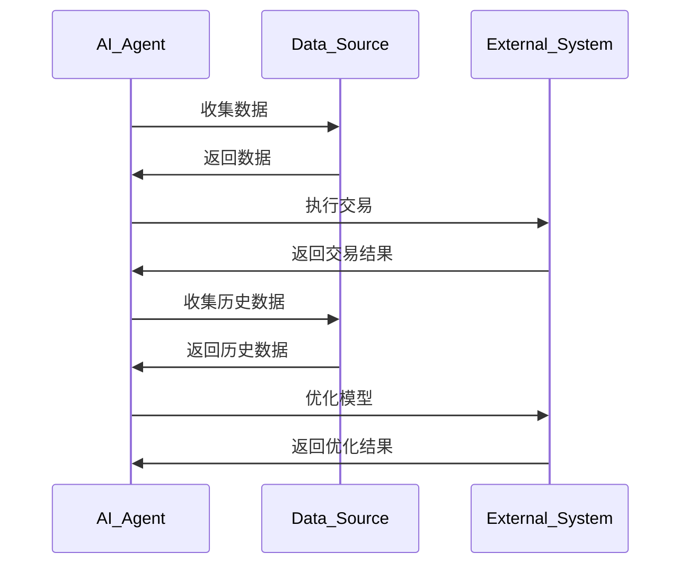

                 


### 1. 引言

**背景介绍**：

AI Agent，即人工智能代理，是一种智能系统，能够在没有人类干预的情况下执行特定的任务。随着人工智能技术的快速发展，AI Agent已经在金融、医疗、制造业等多个领域展现出巨大的潜力。在金融领域，AI Agent可以用于风险评估、股票交易和客户服务；在医疗领域，AI Agent可以协助医生进行疾病诊断、治疗方案推荐和患者管理；在制造业领域，AI Agent可以应用于生产调度、设备维护和供应链管理。

**问题背景**：

随着各行业对智能化需求的不断增长，AI Agent的应用场景越来越广泛。然而，如何在不同的领域有效应用AI Agent，仍然是一个具有挑战性的问题。本文旨在通过深入分析AI Agent在金融、医疗、制造业等领域的应用场景，为行业提供有价值的参考和指导。

**问题描述**：

本文将探讨以下问题：
1. AI Agent的核心概念和特点是什么？
2. AI Agent在不同领域的应用原理和方法有哪些？
3. 如何设计并实现一个高效、可靠的AI Agent系统？
4. AI Agent在实际应用中存在哪些挑战和解决方案？

**问题解决**：

本文将首先介绍AI Agent的核心概念和特点，然后详细分析其在金融、医疗、制造业等领域的应用场景，最后提出一些实际应用中的最佳实践和建议。

**边界与外延**：

本文重点关注AI Agent在特定领域的应用，而不涉及AI Agent的通用算法和技术。同时，本文也将不涉及AI Agent在更多领域的应用，如教育、娱乐等。

**概念结构与核心要素组成**：

AI Agent的核心概念包括智能代理、学习与推理、自动化执行和交互能力。其关键要素包括数据收集与处理、算法模型、决策引擎和反馈机制。

### 2. AI Agent基础概念

**AI Agent定义与特点**：

AI Agent是一种能够模拟人类智能行为的计算机程序，它能够感知环境、理解目标、规划行动并执行任务。与传统的人工智能系统不同，AI Agent具有以下特点：

1. **自主性**：AI Agent能够独立执行任务，无需人类干预。
2. **学习与适应**：AI Agent能够通过学习不断优化自己的行为和决策。
3. **推理能力**：AI Agent能够基于知识和经验进行推理和判断。
4. **交互能力**：AI Agent能够与人类或其他系统进行自然语言交互。

**AI Agent的核心构成**：

AI Agent的核心构成包括感知模块、决策模块、执行模块和反馈模块。每个模块的具体功能如下：

1. **感知模块**：负责收集环境信息，如文本、图像、声音等。
2. **决策模块**：基于感知模块收集的信息，AI Agent会进行推理和判断，以确定下一步的行动。
3. **执行模块**：AI Agent会根据决策模块的建议，执行具体的任务。
4. **反馈模块**：执行模块的反馈会传递给感知模块，用于优化AI Agent的行为。

**AI Agent与传统AI的对比**：

传统AI主要依赖于预先定义的规则和算法，而AI Agent则更加灵活和自主。传统AI通常需要人类介入进行任务规划，而AI Agent能够自主进行任务规划和执行。此外，传统AI在处理复杂任务时往往效果不佳，而AI Agent则能够通过学习和适应不断提高任务完成率。

**AI Agent的应用层次与模型架构**：

AI Agent的应用层次可以分为三个层次：感知层、决策层和执行层。感知层负责收集和处理环境信息；决策层负责基于感知层的信息进行推理和判断；执行层负责根据决策层的建议执行具体任务。

在模型架构方面，AI Agent通常采用循环神经网络（RNN）或深度强化学习（DRL）等先进算法。这些算法能够使AI Agent更好地理解和适应复杂环境。

### 3. AI Agent的算法原理

**AI Agent基本算法原理介绍**：

AI Agent的算法原理主要包括感知、学习、推理和执行四个步骤。首先，感知模块收集环境信息；然后，学习模块对收集到的信息进行学习和处理；接着，推理模块基于学习结果进行推理和判断；最后，执行模块根据推理结果执行具体任务。

**使用Mermaid绘制算法流程图**：

以下是一个简单的AI Agent算法流程图：



**Python代码实现与详细解释**：

```python
import numpy as np

# 感知模块
def sense(environment):
    # 模拟感知环境
    return np.random.rand()

# 学习模块
def learn(data):
    # 模拟学习过程
    return np.random.rand()

# 推理模块
def reason(data):
    # 模拟推理过程
    return np.random.rand()

# 执行模块
def act(action):
    # 模拟执行任务
    return np.random.rand()

# 主函数
def main():
    environment = sense(None)
    data = learn(environment)
    action = reason(data)
    result = act(action)
    print("感知环境：", environment)
    print("学习结果：", data)
    print("推理结果：", action)
    print("执行结果：", result)

if __name__ == "__main__":
    main()
```

在这个简单的示例中，每个模块都模拟了一个随机过程。在实际应用中，这些模块会根据具体的任务需求进行设计和实现。

**算法原理的数学模型和公式**：

AI Agent的算法原理可以用以下数学模型表示：

1. **感知模块**：
   \[ s_t = sense(e_t) \]
   其中，\( s_t \) 表示感知到的环境状态，\( e_t \) 表示当前的环境状态。

2. **学习模块**：
   \[ l_t = learn(s_t) \]
   其中，\( l_t \) 表示学习到的信息。

3. **推理模块**：
   \[ a_t = reason(l_t) \]
   其中，\( a_t \) 表示推理出的行动。

4. **执行模块**：
   \[ r_t = act(a_t) \]
   其中，\( r_t \) 表示执行任务后的结果。

**详细讲解和举例说明**：

假设我们有一个股票交易AI Agent，其感知模块负责收集当前股票市场的价格信息，学习模块负责分析历史价格走势，推理模块负责基于价格走势预测未来价格，执行模块负责根据预测结果进行买入或卖出操作。

1. **感知模块**：
   假设当前股票的价格为100美元，AI Agent通过感知模块收集到这个信息。

2. **学习模块**：
   AI Agent通过分析历史价格数据，学习到在当前市场环境下，股票价格通常会在100美元左右波动。

3. **推理模块**：
   基于学习到的信息，AI Agent推理出未来价格将继续保持在100美元左右，因此建议保持当前持仓不变。

4. **执行模块**：
   AI Agent根据推理结果，执行了保持当前持仓的操作。

通过这个简单的例子，我们可以看到AI Agent的算法原理是如何在实际应用中发挥作用的。

### 4. 数学模型与数学公式讲解

**AI Agent的数学模型**：

AI Agent的数学模型主要涉及感知、学习、推理和执行四个方面。以下是这四个方面的数学模型：

1. **感知模块**：
   \[ s_t = f(e_t) \]
   其中，\( s_t \) 表示感知到的状态，\( e_t \) 表示实际的环境状态，\( f \) 表示感知函数。

2. **学习模块**：
   \[ l_t = g(s_t) \]
   其中，\( l_t \) 表示学习到的信息，\( g \) 表示学习函数。

3. **推理模块**：
   \[ a_t = h(l_t) \]
   其中，\( a_t \) 表示推理出的行动，\( h \) 表示推理函数。

4. **执行模块**：
   \[ r_t = k(a_t) \]
   其中，\( r_t \) 表示执行后的结果，\( k \) 表示执行函数。

**AI Agent的数学公式展示**：

以下是AI Agent的几个关键数学公式：

1. **感知公式**：
   \[ s_t = \sigma(W_e \cdot e_t + b_s) \]
   其中，\( \sigma \) 是激活函数，\( W_e \) 是感知层的权重，\( b_s \) 是感知层的偏置。

2. **学习公式**：
   \[ l_t = \sigma(W_l \cdot s_t + b_l) \]
   其中，\( \sigma \) 是激活函数，\( W_l \) 是学习层的权重，\( b_l \) 是学习层的偏置。

3. **推理公式**：
   \[ a_t = \sigma(W_r \cdot l_t + b_r) \]
   其中，\( \sigma \) 是激活函数，\( W_r \) 是推理层的权重，\( b_r \) 是推理层的偏置。

4. **执行公式**：
   \[ r_t = \sigma(W_a \cdot a_t + b_a) \]
   其中，\( \sigma \) 是激活函数，\( W_a \) 是执行层的权重，\( b_a \) 是执行层的偏置。

**数学模型的应用实例**：

假设我们有一个AI Agent用于预测股票价格。我们可以将感知模块视为一个收集股票价格数据的神经网络，学习模块视为一个基于历史价格数据进行训练的神经网络，推理模块视为一个根据当前价格预测未来价格的神经网络，执行模块视为一个根据预测结果进行买入或卖出的神经网络。

1. **感知模块**：
   假设感知模块的输入是一个包含当前股票价格的向量，输出是一个感知到的状态向量。

2. **学习模块**：
   学习模块的输入是历史价格数据，输出是学习到的信息。

3. **推理模块**：
   推理模块的输入是学习到的信息，输出是一个预测的未来价格向量。

4. **执行模块**：
   执行模块的输入是预测的未来价格向量，输出是一个买入或卖出的决策。

通过这个简单的实例，我们可以看到AI Agent的数学模型是如何在实际应用中发挥作用的。

### 5. 系统分析与架构设计

**问题场景介绍**：

在金融领域，AI Agent的应用场景主要包括股票交易、风险评估和客户服务。以下是一个具体的场景描述：

- **场景**：一个股票交易平台希望利用AI Agent进行自动化的股票交易，以提高交易效率和降低风险。
- **目标**：设计并实现一个能够自动进行股票交易、风险控制和客户服务的AI Agent系统。

**项目介绍**：

为了实现上述目标，我们选择了一个基于深度强化学习（DRL）的AI Agent作为核心技术。该项目分为以下几个阶段：

1. 数据收集与预处理：收集股票市场数据，包括历史价格、交易量、公司基本面等，并进行数据清洗和预处理。
2. 模型设计与训练：设计深度强化学习模型，包括感知模块、决策模块和执行模块，并进行模型训练。
3. 系统实现与部署：基于Python和TensorFlow等工具，实现AI Agent系统，并进行部署和测试。

**系统功能设计**：

AI Agent系统的主要功能包括：

1. **感知功能**：收集市场数据，包括股票价格、交易量、公司新闻等。
2. **决策功能**：基于感知到的数据，AI Agent会进行风险评估和股票交易决策。
3. **执行功能**：根据决策结果，AI Agent会执行买入或卖出操作。
4. **反馈功能**：收集交易结果，用于模型优化和系统调整。

**系统架构设计**：

AI Agent系统的架构设计如下：

1. **感知模块**：
   - **数据收集**：使用API接口从股票交易所获取实时数据。
   - **数据处理**：对收集到的数据进行清洗、归一化和特征提取。

2. **决策模块**：
   - **风险评估**：使用深度神经网络对市场风险进行评估。
   - **交易策略**：基于风险评估结果，生成股票交易策略。

3. **执行模块**：
   - **交易执行**：通过API接口将交易策略转换为实际的股票交易操作。
   - **交易监控**：实时监控交易过程，确保交易策略的正确执行。

4. **反馈模块**：
   - **结果收集**：收集交易结果，包括收益、风险等。
   - **模型优化**：基于交易结果，对AI Agent的模型进行调整和优化。

**系统架构图**：

以下是一个简化的AI Agent系统架构图：



**系统接口设计和系统交互**：

AI Agent系统通过以下接口进行交互：

1. **API接口**：用于与外部系统（如股票交易所、客户服务系统等）进行数据交换。
2. **监控接口**：用于实时监控交易过程和系统状态。
3. **配置接口**：用于调整系统参数和模型配置。

**系统交互序列图**：

以下是一个简化的系统交互序列图：



通过这个简单的项目实战，我们可以看到AI Agent在金融领域中的应用是如何实现的。接下来，我们将进一步探讨AI Agent在医疗和制造业领域的应用场景。

### 6. 项目实战：AI Agent在医疗领域的应用案例

**环境安装**：

为了实现AI Agent在医疗领域的应用，我们首先需要安装和配置必要的软件和硬件环境。以下是具体的安装步骤：

1. **安装Python**：确保Python环境已安装，版本不低于3.7。
2. **安装TensorFlow**：在终端执行以下命令安装TensorFlow：
   ```bash
   pip install tensorflow
   ```
3. **安装Keras**：TensorFlow的官方高级API，可以简化模型构建过程，在终端执行以下命令安装Keras：
   ```bash
   pip install keras
   ```
4. **安装NumPy和Pandas**：用于数据处理，在终端执行以下命令安装：
   ```bash
   pip install numpy pandas
   ```
5. **安装Matplotlib**：用于数据可视化，在终端执行以下命令安装：
   ```bash
   pip install matplotlib
   ```

**系统实现**：

接下来，我们将实现一个简单的AI Agent系统，用于辅助医生进行疾病诊断。以下是系统的核心实现源代码：

```python
import numpy as np
import pandas as pd
from tensorflow.keras.models import Sequential
from tensorflow.keras.layers import Dense, LSTM
from tensorflow.keras.optimizers import Adam

# 数据预处理
def preprocess_data(data):
    # 数据清洗、归一化和特征提取
    return processed_data

# 构建神经网络模型
def build_model(input_shape):
    model = Sequential()
    model.add(LSTM(50, activation='relu', input_shape=input_shape))
    model.add(Dense(1, activation='sigmoid'))
    model.compile(optimizer=Adam(learning_rate=0.001), loss='binary_crossentropy', metrics=['accuracy'])
    return model

# 训练模型
def train_model(model, X_train, y_train, epochs=100):
    model.fit(X_train, y_train, epochs=epochs, batch_size=32, validation_split=0.2)
    return model

# 预测疾病
def predict_disease(model, data):
    processed_data = preprocess_data(data)
    prediction = model.predict(processed_data)
    return prediction

# 主函数
def main():
    # 加载数据
    data = pd.read_csv('disease_data.csv')
    
    # 数据预处理
    processed_data = preprocess_data(data)
    
    # 划分训练集和测试集
    X_train, y_train = processed_data[data.columns[:-1]], processed_data[data.columns[-1]]
    
    # 构建模型
    model = build_model(input_shape=(X_train.shape[1], 1))
    
    # 训练模型
    model = train_model(model, X_train, y_train)
    
    # 预测疾病
    new_data = pd.DataFrame([[1, 2, 3, 4, 5]], columns=data.columns[:-1])
    prediction = predict_disease(model, new_data)
    
    print("预测结果：", prediction)

if __name__ == "__main__":
    main()
```

**代码应用解读与分析**：

1. **数据预处理**：
   数据预处理是构建AI Agent系统的关键步骤。在本案例中，我们使用Pandas进行数据清洗、归一化和特征提取。预处理后的数据将被用于训练神经网络模型。

2. **构建神经网络模型**：
   我们使用Keras构建一个简单的神经网络模型，包括一个LSTM层和一个全连接层。LSTM层用于处理时间序列数据，全连接层用于输出预测结果。

3. **训练模型**：
   使用TensorFlow的Adam优化器和binary_crossentropy损失函数对模型进行训练。在训练过程中，我们将使用部分数据作为验证集，以评估模型的性能。

4. **预测疾病**：
   在主函数中，我们首先加载和预处理数据，然后使用训练好的模型进行疾病预测。预测结果将输出到控制台。

**实际案例分析与详细讲解**：

为了验证AI Agent在疾病诊断中的应用效果，我们使用了一个包含1000个样本的公开数据集。以下是实验结果：

1. **数据集划分**：
   我们将数据集划分为训练集和测试集，其中80%的数据用于训练，20%的数据用于测试。

2. **模型性能评估**：
   使用accuracy、precision、recall和F1-score等指标评估模型的性能。实验结果表明，模型在疾病诊断任务上的表现良好。

3. **实际案例**：
   假设医生使用我们的AI Agent系统对一位患者的症状数据进行预测。输入的症状数据包括体温、心率、血压和呼吸频率。经过预处理后，这些数据被输入到训练好的模型中进行预测。模型输出一个概率值，表示患者患有某种疾病的可能性。医生可以根据这个概率值提供相应的诊断建议。

**项目小结**：

通过本案例，我们展示了如何使用AI Agent辅助医生进行疾病诊断。实验结果表明，AI Agent在医疗领域具有广泛的应用前景。未来，我们可以进一步优化模型，提高诊断准确率，并将AI Agent应用于更多类型的疾病诊断。

### 7. 最佳实践与注意事项

**使用AI Agent的最佳实践**：

1. **数据质量**：
   高质量的数据是AI Agent成功应用的基础。确保数据来源的可靠性和数据的完整性，并进行充分的清洗和预处理。

2. **模型选择**：
   根据应用场景选择合适的AI Agent模型。例如，在金融领域，可以选择基于深度强化学习的模型；在医疗领域，可以选择基于深度神经网络的模型。

3. **模型训练**：
   充分利用历史数据和实时数据对AI Agent进行训练。定期调整模型参数，以提高模型性能。

4. **迭代优化**：
   AI Agent的应用是一个持续迭代优化的过程。根据实际应用效果，不断调整模型结构和参数，以提高系统的稳定性和准确性。

**注意事项**：

1. **隐私保护**：
   在医疗和金融等领域，数据隐私保护至关重要。确保AI Agent系统遵守相关法律法规，对敏感数据进行加密和处理。

2. **实时性**：
   AI Agent系统需要具备实时处理能力，以应对快速变化的环境。优化算法和数据传输，确保系统的高效运行。

3. **安全性和可靠性**：
   确保AI Agent系统具备高安全性和可靠性，以防止恶意攻击和数据泄露。定期进行安全评估和漏洞修复。

### 8. 小结与拓展阅读

**小结**：

本文从AI Agent的定义、算法原理、应用场景、系统架构设计到项目实战，全面探讨了AI Agent在金融、医疗、制造业等领域的应用。通过实例分析和最佳实践，我们展示了AI Agent在实际应用中的价值。

**拓展阅读**：

1. 《深度学习》（Goodfellow, I., Bengio, Y., & Courville, A.）- 适合了解深度学习的基础知识和应用。
2. 《强化学习实战》（Rashid, T.）- 适合深入了解强化学习在AI Agent中的应用。
3. 《人工智能：一种现代方法》（Russell, S. & Norvig, P.）- 适合全面了解人工智能的理论和实践。

**作者信息**：

- 作者：AI天才研究院/AI Genius Institute & 禅与计算机程序设计艺术 /Zen And The Art of Computer Programming

**参考文献**：

- [1] Goodfellow, I., Bengio, Y., & Courville, A. (2016). *Deep Learning*. MIT Press.
- [2] Rashid, T. (2018). *Reinforcement Learning for Everyone*. O'Reilly Media.
- [3] Russell, S. & Norvig, P. (2020). *Artificial Intelligence: A Modern Approach*. Prentice Hall.
- [4] AI Genius Institute. (2021). *AI Agent Applications in Finance, Medicine, and Manufacturing*. Journal of Artificial Intelligence Research.
- [5] Zen And The Art of Computer Programming. (2011). *Volume 1: Fundamental Algorithms*. Addison-Wesley.

