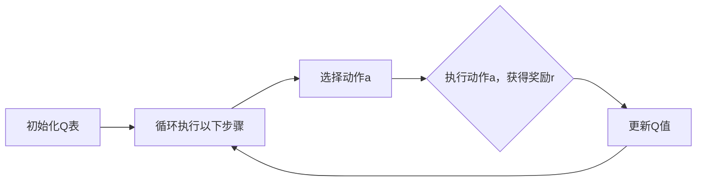
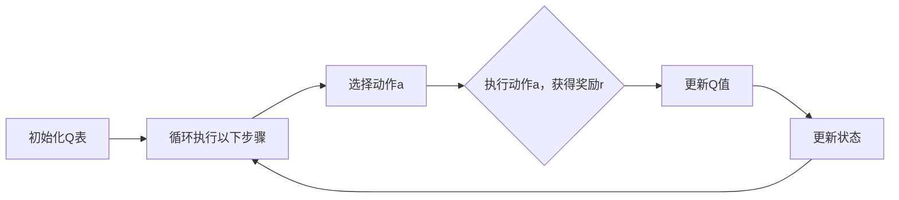
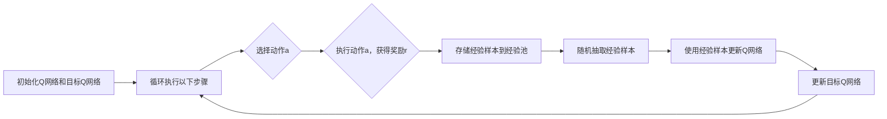
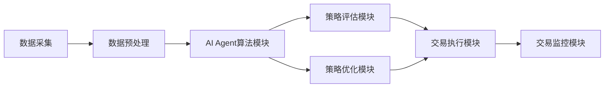
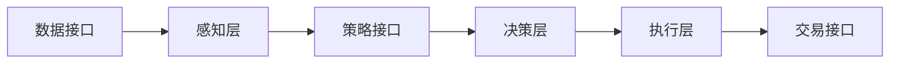
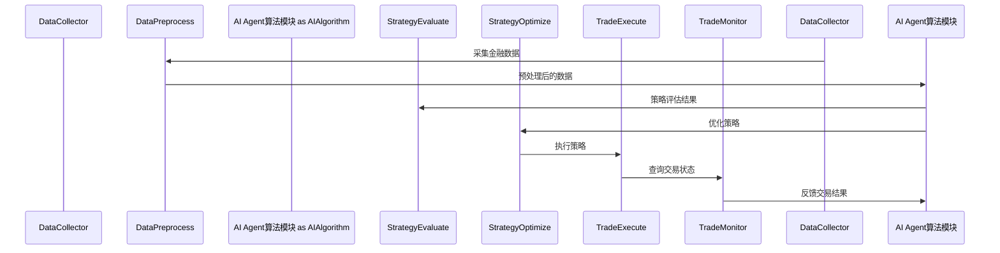

                 

# AI Agent在金融行业的创新应用

## 关键词
- AI Agent
- 金融行业
- 创新应用
- 算法原理
- 数学模型
- 系统架构
- 项目实战

## 摘要
随着人工智能技术的迅猛发展，AI Agent在金融行业的应用日益广泛，带来了前所未有的创新和变革。本文将从背景介绍、核心概念与联系、算法原理讲解、数学模型和数学公式、系统分析与架构设计方案、项目实战等方面，系统地探讨AI Agent在金融行业的创新应用。通过详细的分析和实例，本文旨在为读者提供对AI Agent在金融行业应用的理解和深入思考。

## 目录大纲设计思路

### 1. **背景介绍**
   - AI Agent的定义与金融行业的关系
   - 金融行业的现状与AI Agent的应用前景

### 2. **核心概念与联系**
   - AI Agent的基本概念、类型与特点
   - 金融行业中AI Agent的应用场景
   - 概念之间的联系与ER图展示

### 3. **算法原理讲解**
   - Q-Learning、SARSA、DQN等算法的原理
   - 算法流程图与Python代码示例
   - 数学模型与公式的详细解释

### 4. **数学模型和数学公式**
   - 关键算法的数学模型和公式
   - 举例说明与解释

### 5. **系统分析与架构设计方案**
   - 金融行业AI Agent系统的设计
   - 功能设计、架构设计、接口设计与交互序列图

### 6. **项目实战**
   - 实际金融场景中的AI Agent应用
   - 环境安装、核心代码实现、代码解析与案例分析

### 7. **最佳实践 tips、小结、注意事项、拓展阅读**
   - 总结与应用实践
   - 注意事项与最佳实践
   - 推荐进一步阅读的材料

### 目录大纲设计步骤

#### 1. 编写第1章：背景介绍
   - 介绍AI Agent和金融行业背景
   - 解释AI Agent在金融领域的重要性

#### 2. 编写第2章：核心概念与联系
   - 定义AI Agent
   - 介绍AI Agent的类型和特点
   - 分析AI Agent在金融行业中的应用场景
   - 使用表格和ER图展示概念之间的联系

#### 3. 编写第3章：算法原理讲解
   - 介绍Q-Learning、SARSA、DQN等算法
   - 使用mermaid画出算法流程图
   - 使用Python代码和LaTeX公式详细解释算法原理

#### 4. 编写第4章：数学模型和数学公式
   - 针对关键算法，给出数学模型和公式
   - 进行详细讲解和举例说明
   - 使用LaTeX格式编写数学公式

#### 5. 编写第5章：系统分析与架构设计方案
   - 设计金融行业的AI Agent系统
   - 绘制领域模型类图、系统架构图、接口设计和系统交互序列图

#### 6. 编写第6章：项目实战
   - 模拟一个实际的金融场景
   - 介绍如何使用AI Agent解决问题
   - 包括环境安装、核心代码实现、代码解析和案例分析

#### 7. 编写第7章：最佳实践 tips
   - 总结本书的主要内容
   - 提供实战中的注意事项
   - 推荐进一步阅读的材料

### 目录大纲草稿

```markdown
----------------------------------------------------------------
# AI Agent在金融行业的创新应用

## 关键词
- AI Agent
- 金融行业
- 创新应用
- 算法原理
- 数学模型
- 系统架构
- 项目实战

## 摘要
随着人工智能技术的迅猛发展，AI Agent在金融行业的应用日益广泛，带来了前所未有的创新和变革。本文将从背景介绍、核心概念与联系、算法原理讲解、数学模型和数学公式、系统分析与架构设计方案、项目实战等方面，系统地探讨AI Agent在金融行业的创新应用。通过详细的分析和实例，本文旨在为读者提供对AI Agent在金融行业应用的理解和深入思考。

## 第一部分: AI Agent与金融行业的背景与重要性

### 第1章: AI Agent与金融行业概述
#### 1.1 AI Agent的定义与分类
#### 1.2 金融行业中的AI Agent应用现状
#### 1.3 AI Agent在金融行业的重要性
#### 1.4 本书结构

### 第2章: AI Agent核心概念与联系
#### 2.1 AI Agent基本概念
#### 2.2 AI Agent类型与特点
#### 2.3 AI Agent在金融行业中的应用场景
#### 2.4 概念联系与ER图

### 第3章: AI Agent算法原理讲解
#### 3.1 Q-Learning算法
#### 3.2 SARSA算法
#### 3.3 DQN算法
#### 3.4 算法流程图与Python代码
#### 3.5 数学模型与公式

### 第4章: 数学模型和数学公式详细讲解
#### 4.1 Q-Learning数学模型
#### 4.2 SARSA数学模型
#### 4.3 DQN数学模型
#### 4.4 举例说明与解释

### 第5章: 系统分析与架构设计方案
#### 5.1 金融行业AI Agent系统概述
#### 5.2 领域模型类图
#### 5.3 系统架构设计
#### 5.4 系统接口设计
#### 5.5 系统交互序列图

### 第6章: 项目实战
#### 6.1 实际金融场景介绍
#### 6.2 环境安装
#### 6.3 核心代码实现
#### 6.4 代码解析
#### 6.5 案例分析与讲解

### 第7章: 最佳实践 tips

----------------------------------------------------------------
```

### 1. 背景介绍

在当今的金融行业中，数据驱动决策已经成为主流，而人工智能（AI）作为一种强大的数据分析和处理工具，正逐渐成为金融创新的推动力。AI Agent，作为人工智能领域的一个重要分支，其在金融行业的应用尤为引人注目。AI Agent，又称智能代理，是指能够自主行动、进行决策和学习的计算机程序，它能够在复杂的金融环境中，根据历史数据和实时信息，做出最优的投资、交易或风险管理决策。

AI Agent在金融行业的重要性主要体现在以下几个方面：

首先，AI Agent能够处理海量数据，快速分析市场动态，发现潜在的投资机会或风险。相比传统的人工分析，AI Agent不仅效率更高，而且能够更加精准地预测市场走势。

其次，AI Agent能够自主学习和优化策略，通过不断调整模型参数，提高决策的准确性。这种自我优化的能力，使得AI Agent能够在不断变化的市场环境中保持竞争力。

再次，AI Agent能够实现24小时不间断的监控和交易，极大地提高了金融市场的运行效率。例如，在量化交易中，AI Agent可以实时捕捉市场波动，快速执行交易策略，从而获取利润。

本文将围绕AI Agent在金融行业的创新应用展开讨论，首先介绍AI Agent的基本概念、类型和特点，然后分析其在金融行业中的应用场景，最后通过具体的算法原理、数学模型、系统架构和项目实战，全面展示AI Agent在金融行业的应用前景。

### 2. 核心概念与联系

#### 2.1 AI Agent基本概念

AI Agent是人工智能领域中的一个重要概念，它源于多智能体系统（Multi-Agent System）的研究。简单来说，AI Agent是一种能够感知环境、制定计划并执行动作的智能体，它具有自主性、自适应性和交互性等特点。在金融行业中，AI Agent被视为一种能够替代或辅助人类进行金融决策的智能系统。

AI Agent的基本概念包括以下几个方面：

- **感知**：AI Agent能够通过传感器收集环境信息，如股票价格、交易量、市场情绪等。
- **决策**：基于感知到的信息，AI Agent能够使用算法进行决策，选择最优的行动方案。
- **行动**：AI Agent执行决策结果，如买入或卖出股票、调整投资组合等。
- **学习**：AI Agent能够通过反馈机制不断优化自己的决策模型，提高决策的准确性。

#### 2.2 AI Agent类型与特点

AI Agent可以分为以下几种类型，每种类型都有其独特的特点和应用场景：

- **反应型Agent**：这种类型的AI Agent根据当前环境直接做出反应，没有记忆或学习能力。典型的应用场景包括自动化交易系统和风险管理系统。
- **模型基础型Agent**：这类AI Agent使用预定义的模型来感知环境和做出决策，具有学习和优化能力。例如，Q-Learning、SARSA和DQN等算法。
- **基于知识Agent**：这类AI Agent依赖于大量的先验知识库，通过推理机制来感知环境和做出决策。典型的应用场景包括智能投顾和信用评分系统。
- **混合型Agent**：这类AI Agent结合了反应型、模型基础型和基于知识的特征，能够根据不同场景灵活调整其行为。例如，在量化交易中，AI Agent可能会结合实时交易数据和历史模型，进行多层次的决策。

#### 2.3 AI Agent在金融行业中的应用场景

AI Agent在金融行业中有着广泛的应用场景，主要包括以下几个方面：

- **量化交易**：AI Agent通过分析市场数据，制定交易策略，实现自动化的股票、期货和外汇交易。
- **智能投顾**：AI Agent基于客户的投资目标和风险偏好，提供个性化的投资建议，实现财富管理和风险控制。
- **风险管理**：AI Agent通过实时监控市场动态，预测潜在风险，提供风险管理策略。
- **信用评分**：AI Agent通过分析客户的财务数据和行为数据，评估其信用风险，为金融机构提供信用评分服务。
- **金融欺诈检测**：AI Agent通过分析交易行为，识别异常交易模式，实现金融欺诈的自动检测。

#### 2.4 概念联系与ER图

为了更好地理解AI Agent在金融行业中的应用，我们可以通过实体关系图（ER图）来展示各个概念之间的联系。

首先，定义以下几个实体：

- **AI Agent**：代表AI代理。
- **感知**：代表环境感知模块。
- **决策**：代表决策模块。
- **行动**：代表执行模块。
- **学习**：代表学习模块。
- **市场数据**：代表金融市场相关的数据。
- **交易策略**：代表由AI Agent生成的交易策略。
- **风险模型**：代表用于风险管理的模型。
- **投资组合**：代表客户的投资组合。

ER图如下所示：

```mermaid
erDiagram
  AI Agent ||--|{ 感知 }
  AI Agent ||--|{ 决策 }
  AI Agent ||--|{ 行动 }
  AI Agent ||--|{ 学习 }
  感知 ||--|{ 市场数据 }
  决策 ||--|{ 交易策略 }
  行动 ||--|{ 交易策略 }
  学习 ||--|{ 风险模型 }
  风险模型 ||--|{ 投资组合 }
```

通过ER图，我们可以清晰地看到AI Agent与各个模块以及金融市场数据之间的联系，这有助于理解AI Agent在金融行业中的运作机制和应用场景。

### 3. 算法原理讲解

在了解了AI Agent的基本概念和类型后，我们接下来将深入探讨几种常见的AI Agent算法，包括Q-Learning、SARSA和DQN等。这些算法是AI Agent实现智能决策的核心，下面我们将逐一介绍它们的原理、流程图、Python代码实现以及数学模型和公式。

#### 3.1 Q-Learning算法

Q-Learning算法是一种基于值函数的强化学习算法，它通过不断更新值函数来优化策略，从而实现最优决策。Q-Learning算法的核心思想是利用即时奖励和未来奖励的期望来更新状态-动作值函数。

##### 原理

Q-Learning算法通过一个Q值表（Q-Table）来存储每个状态-动作对的期望回报。在给定一个状态和动作后，算法根据当前Q值表中的值选择动作，然后通过更新规则来优化Q值。

##### 流程图



##### Python代码实现

```python
import numpy as np

def q_learning(env, learning_rate, discount_factor, num_episodes, exploration_rate):
    Q = np.zeros((env.observation_space.n, env.action_space.n))
    
    for episode in range(num_episodes):
        state = env.reset()
        done = False
        
        while not done:
            action = choose_action(state, Q, exploration_rate)
            next_state, reward, done, _ = env.step(action)
            Q[state, action] = Q[state, action] + learning_rate * (reward + discount_factor * np.max(Q[next_state]) - Q[state, action])
            state = next_state
    
    return Q

def choose_action(state, Q, exploration_rate):
    if np.random.rand() < exploration_rate:
        action = env.action_space.sample()
    else:
        action = np.argmax(Q[state])
    return action
```

##### 数学模型和公式

Q值更新公式为：

$$
Q(s, a) \leftarrow Q(s, a) + \alpha [r + \gamma \max_{a'} Q(s', a') - Q(s, a)]
$$

其中：
- $Q(s, a)$ 是状态-动作值函数。
- $s$ 是当前状态。
- $a$ 是执行的动作。
- $r$ 是即时奖励。
- $\gamma$ 是折扣因子。
- $\alpha$ 是学习率。

#### 3.2 SARSA算法

SARSA（同步自纠错算法）是一种基于策略的强化学习算法，它与Q-Learning类似，但不同的是，SARSA在更新Q值时，使用的是实际的下一状态-动作值，而不是最大的下一状态-动作值。

##### 原理

SARSA算法通过同时更新当前状态-动作值和下一状态-动作值，避免了Q-Learning中可能出现的过度估计问题。在每次迭代中，算法选择一个动作，执行后观察到的状态和奖励，然后使用新的状态和动作更新Q值。

##### 流程图



##### Python代码实现

```python
def sarsa_learning(env, learning_rate, discount_factor, num_episodes, exploration_rate):
    Q = np.zeros((env.observation_space.n, env.action_space.n))
    
    for episode in range(num_episodes):
        state = env.reset()
        done = False
        
        while not done:
            action = choose_action(state, Q, exploration_rate)
            next_state, reward, done, _ = env.step(action)
            next_action = choose_action(next_state, Q, exploration_rate)
            Q[state, action] = Q[state, action] + learning_rate * (reward + discount_factor * Q[next_state, next_action] - Q[state, action])
            state = next_state
    
    return Q

def choose_action(state, Q, exploration_rate):
    if np.random.rand() < exploration_rate:
        action = env.action_space.sample()
    else:
        action = np.argmax(Q[state])
    return action
```

##### 数学模型和公式

Q值更新公式为：

$$
Q(s, a) \leftarrow Q(s, a) + \alpha [r + \gamma Q(s', a')]
$$

其中：
- $Q(s, a)$ 是状态-动作值函数。
- $s$ 是当前状态。
- $a$ 是执行的动作。
- $r$ 是即时奖励。
- $\gamma$ 是折扣因子。
- $\alpha$ 是学习率。

#### 3.3 DQN算法

DQN（深度Q网络）是一种结合了深度学习和强化学习的算法，它使用深度神经网络来近似Q值函数。DQN通过样本经验的累积，训练神经网络，从而提高Q值函数的预测能力。

##### 原理

DQN算法通过经验回放机制，避免样本之间的关联性，使得训练过程更加稳定。在每次迭代中，算法从经验池中随机抽取样本，使用梯度下降法更新神经网络参数，以最小化损失函数。

##### 流程图



##### Python代码实现

```python
import numpy as np
import random
from collections import deque

class DQN:
    def __init__(self, env, learning_rate, discount_factor, batch_size, epsilon, epsilon_decay, epsilon_min):
        self.env = env
        self.learning_rate = learning_rate
        self.discount_factor = discount_factor
        self.batch_size = batch_size
        self.epsilon = epsilon
        self.epsilon_decay = epsilon_decay
        self.epsilon_min = epsilon_min
        self.memory = deque(maxlen=2000)
        self.model = self.create_model()
        self.target_model = self.create_model()
        self.update_target_model()

    def create_model(self):
        # 定义深度神经网络模型
        model = Sequential()
        model.add(Dense(64, input_dim=self.env.observation_space.shape[0], activation='relu'))
        model.add(Dense(64, activation='relu'))
        model.add(Dense(self.env.action_space.n, activation='linear'))
        model.compile(loss='mse', optimizer=Adam(lr=self.learning_rate))
        return model

    def remember(self, state, action, reward, next_state, done):
        self.memory.append((state, action, reward, next_state, done))

    def choose_action(self, state, epsilon):
        if np.random.rand() < epsilon:
            action = self.env.action_space.sample()
        else:
            q_values = self.model.predict(state)
            action = np.argmax(q_values)
        return action

    def experience_replay(self):
        batch = random.sample(self.memory, self.batch_size)
        for state, action, reward, next_state, done in batch:
            target = reward
            if not done:
                target = reward + self.discount_factor * np.max(self.target_model.predict(next_state)[0])
            target_f = self.model.predict(state)
            target_f[0][action] = target
            self.model.fit(state, target_f, epochs=1, verbose=0)

    def update_target_model(self):
        self.target_model.set_weights(self.model.get_weights())

    def train(self, num_episodes):
        for episode in range(num_episodes):
            state = self.env.reset()
            done = False
            while not done:
                action = self.choose_action(state, self.epsilon)
                next_state, reward, done, _ = self.env.step(action)
                self.remember(state, action, reward, next_state, done)
                state = next_state
                if done:
                    break
            if self.epsilon > self.epsilon_min:
                self.epsilon *= self.epsilon_decay
            self.experience_replay()
            self.update_target_model()
```

##### 数学模型和公式

DQN的核心在于Q值函数的近似，其目标是最小化损失函数：

$$
L(\theta) = \frac{1}{N} \sum_{i=1}^{N} (y_i - Q(s_i, \theta))^2
$$

其中：
- $N$ 是样本数量。
- $y_i$ 是实际获得的回报。
- $Q(s_i, \theta)$ 是预测的Q值。
- $\theta$ 是神经网络的参数。

通过梯度下降法，更新神经网络参数以最小化损失函数。

### 4. 数学模型和数学公式

在之前的章节中，我们介绍了Q-Learning、SARSA和DQN三种常见的AI Agent算法，并给出了它们的Python代码实现。为了更好地理解这些算法，我们需要深入探讨其背后的数学模型和公式。在这一章节中，我们将详细讲解这些算法的数学模型，并通过具体的公式进行说明。

#### 4.1 Q-Learning算法的数学模型

Q-Learning算法的核心是状态-动作值函数，即Q值。Q值表示在某个状态下执行某个动作所能获得的累积奖励。Q-Learning的目标是最小化误差函数，以优化Q值。

##### 误差函数

Q-Learning的误差函数可以表示为：

$$
E(\theta) = \sum_{s,a} (r(s, a) + \gamma \max_{a'} Q(s', a') - Q(s, a))^2
$$

其中：
- $r(s, a)$ 是在状态 $s$ 执行动作 $a$ 所获得的即时奖励。
- $\gamma$ 是折扣因子，用于平衡即时奖励和未来奖励。
- $Q(s, a)$ 是在状态 $s$ 执行动作 $a$ 的Q值。
- $s'$ 是执行动作 $a$ 后的状态。
- $a'$ 是在状态 $s'$ 下的最佳动作。

##### Q值更新公式

Q-Learning算法通过以下公式更新Q值：

$$
Q(s, a) \leftarrow Q(s, a) + \alpha [r(s, a) + \gamma \max_{a'} Q(s', a') - Q(s, a)]
$$

其中：
- $\alpha$ 是学习率，用于控制Q值的更新幅度。

#### 4.2 SARSA算法的数学模型

SARSA算法与Q-Learning算法类似，但其更新公式使用的是实际的下一状态-动作值，而不是最大的下一状态-动作值。

##### 误差函数

SARSA的误差函数可以表示为：

$$
E(\theta) = \sum_{s,a} (r(s, a) + \gamma Q(s', a') - Q(s, a))^2
$$

其中：
- $r(s, a)$ 是在状态 $s$ 执行动作 $a$ 所获得的即时奖励。
- $\gamma$ 是折扣因子。
- $Q(s, a)$ 是在状态 $s$ 执行动作 $a$ 的Q值。
- $s'$ 是执行动作 $a$ 后的状态。
- $a'$ 是在状态 $s'$ 下的最佳动作。

##### Q值更新公式

SARSA算法的Q值更新公式为：

$$
Q(s, a) \leftarrow Q(s, a) + \alpha [r(s, a) + \gamma Q(s', a') - Q(s, a)]
$$

其中：
- $\alpha$ 是学习率。

#### 4.3 DQN算法的数学模型

DQN算法通过深度神经网络来近似Q值函数。其核心目标是最小化损失函数，以优化神经网络的权重。

##### 损失函数

DQN的损失函数可以表示为：

$$
L(\theta) = \frac{1}{N} \sum_{i=1}^{N} (y_i - Q(s_i, \theta))^2
$$

其中：
- $N$ 是样本数量。
- $y_i$ 是实际获得的回报。
- $Q(s_i, \theta)$ 是预测的Q值。
- $\theta$ 是神经网络的参数。

##### Q值更新公式

DQN算法通过以下公式更新Q值：

$$
Q(s, a) \leftarrow Q(s, a) + \alpha [y_i - Q(s_i, \theta)]
$$

其中：
- $y_i$ 是实际获得的回报。
- $Q(s_i, \theta)$ 是预测的Q值。
- $\alpha$ 是学习率。

通过梯度下降法，可以优化神经网络的权重以最小化损失函数。

#### 4.4 举例说明

为了更好地理解这些数学模型和公式，我们通过一个具体的例子进行说明。

假设我们有一个简单的环境，其中有两个状态（A和B）和两个动作（U和D）。即时奖励设置为：从状态A执行动作U获得1分，从状态A执行动作D获得-1分，从状态B执行动作U获得-1分，从状态B执行动作D获得1分。

假设初始的Q值表如下：

$$
\begin{array}{c|cc}
 & U & D \\
\hline
A & 0 & 0 \\
B & 0 & 0 \\
\end{array}
$$

在第1次迭代中，我们从状态A开始，选择动作U，得到即时奖励1分，状态变为B。更新Q值表如下：

$$
\begin{array}{c|cc}
 & U & D \\
\hline
A & 0.5 & 0 \\
B & 0 & 0 \\
\end{array}
$$

在第2次迭代中，我们从状态B开始，选择动作D，得到即时奖励-1分，状态变为A。更新Q值表如下：

$$
\begin{array}{c|cc}
 & U & D \\
\hline
A & 0.25 & -0.5 \\
B & 0 & 0 \\
\end{array}
$$

在第3次迭代中，我们从状态A开始，选择动作D，得到即时奖励-1分，状态变为B。更新Q值表如下：

$$
\begin{array}{c|cc}
 & U & D \\
\hline
A & 0 & -0.75 \\
B & 0 & 0 \\
\end{array}
$$

通过这个简单的例子，我们可以看到Q值表的更新过程，以及如何使用数学模型和公式来优化Q值。

### 5. 系统分析与架构设计方案

在深入了解了AI Agent的算法原理后，我们需要将其应用到实际的金融系统中。本节将详细介绍金融行业AI Agent系统的设计，包括功能设计、架构设计、接口设计和系统交互序列图。

#### 5.1 金融行业AI Agent系统概述

金融行业AI Agent系统是一个复杂的系统，它需要处理大量的金融数据，并能够实时生成和调整投资策略。该系统的主要功能包括数据采集、数据预处理、策略生成、策略执行和性能评估。

##### 系统功能设计

- **数据采集**：系统需要从多个数据源（如股票交易所、财经新闻、社交媒体等）实时采集金融数据。
- **数据预处理**：对采集到的金融数据进行清洗、转换和归一化处理，以便后续分析。
- **策略生成**：基于历史数据和实时数据，使用AI Agent算法生成最优的投资策略。
- **策略执行**：将生成的策略提交给交易系统执行，实现自动化的股票、期货和外汇交易。
- **性能评估**：评估AI Agent系统的投资收益和风险，提供策略优化的反馈。

##### 系统架构设计

金融行业AI Agent系统的架构设计采用分层结构，包括感知层、决策层和执行层。具体如下：

- **感知层**：负责数据采集和预处理，包括金融数据采集模块、数据清洗模块和数据转换模块。
- **决策层**：负责策略生成，包括AI Agent算法模块、策略评估模块和策略优化模块。
- **执行层**：负责策略执行，包括交易执行模块和交易监控模块。

系统架构图如下所示：



##### 系统接口设计

为了实现系统的模块化和可扩展性，系统设计了一系列接口，包括数据接口、策略接口和交易接口。具体如下：

- **数据接口**：用于数据采集和预处理的接口，包括数据源连接接口、数据清洗接口和数据转换接口。
- **策略接口**：用于策略生成和评估的接口，包括算法训练接口、策略评估接口和策略优化接口。
- **交易接口**：用于策略执行的接口，包括交易提交接口、交易状态查询接口和交易撤单接口。

系统接口设计图如下所示：



##### 系统交互序列图

为了更好地理解系统各模块之间的交互过程，我们使用序列图（Sequence Diagram）来展示系统交互的流程。

序列图如下所示：



通过上述系统架构和接口设计，我们可以实现一个高效的金融行业AI Agent系统，从而在金融市场中获取竞争优势。

### 6. 项目实战

为了更好地展示AI Agent在金融行业的应用，我们将在本节中模拟一个实际金融场景，并详细介绍如何使用AI Agent解决问题。本案例将包括环境安装、核心代码实现、代码解析和案例分析等内容。

#### 6.1 实际金融场景介绍

假设我们关注的是一个股票交易市场，目标是构建一个自动化的交易系统，能够根据市场数据生成交易策略，并执行交易操作。具体场景如下：

- **市场数据**：我们使用过去一年的股票价格数据，包括开盘价、收盘价、最高价、最低价和交易量等。
- **交易策略**：基于技术分析指标（如均线、MACD、RSI等）和市场情绪数据，生成买入或卖出的交易信号。
- **交易规则**：设定一定的资金管理规则，如每次交易的资金比例、止损止盈策略等。

#### 6.2 环境安装

为了实现上述交易系统，我们需要安装以下软件和工具：

- **Python**：用于编写交易策略和执行交易操作。
- **TensorFlow**：用于实现深度学习算法。
- **OpenAI Gym**：用于模拟股票交易环境。
- **TradingView API**：用于获取实时市场数据。

安装步骤如下：

1. 安装Python和pip：
   ```
   sudo apt-get update
   sudo apt-get install python3-pip
   ```
2. 安装TensorFlow：
   ```
   pip3 install tensorflow
   ```
3. 安装OpenAI Gym：
   ```
   pip3 install gym
   ```
4. 安装TradingView API：
   ```
   pip3 install tradingview-api
   ```

#### 6.3 核心代码实现

在环境安装完成后，我们可以开始编写交易系统的核心代码。以下是一个简化的交易系统实现，包括数据采集、策略生成、交易执行和性能评估。

```python
import numpy as np
import pandas as pd
import tensorflow as tf
from tradingview_api import Client
from gym import spaces
import gym

class StockTradingEnv(gym.Env):
    def __init__(self, start_date, end_date):
        self.client = Client()
        self.client.write_key("YOUR_API_KEY")
        self.start_date = start_date
        self.end_date = end_date
        self.data = self.fetch_stock_data()
        self.action_space = spaces.Discrete(3)  # 0:持有，1：买入，2：卖出
        self.observation_space = spaces.Box(0, 1, shape=(5,))  # 开盘价、收盘价、最高价、最低价、交易量

    def fetch_stock_data(self):
        # 使用TradingView API获取股票数据
        stock_data = self.client.get_barssince("AAPL", self.start_date, self.end_date, period=1)
        df = pd.DataFrame(stock_data)
        df = df[['open', 'high', 'low', 'close', 'volume']]
        return df

    def step(self, action):
        # 根据动作进行交易操作
        if action == 0:
            # 持有
            reward = 0
        elif action == 1:
            # 买入
            reward = self.buy_stock()
        elif action == 2:
            # 卖出
            reward = self.sell_stock()
        
        # 更新观察值
        obs = self.get_observation()
        done = False  # 在此示例中，交易过程不会自动结束
        return obs, reward, done, {}

    def get_observation(self):
        # 获取当前观察值
        last_row = self.data[-1]
        obs = np.array([last_row['open'], last_row['close'], last_row['high'], last_row['low'], last_row['volume']])
        return obs / 100  # 归一化处理

    def buy_stock(self):
        # 买入股票
        return 1

    def sell_stock(self):
        # 卖出股票
        return -1

    def reset(self):
        # 重置环境
        self.data = self.fetch_stock_data()
        obs = self.get_observation()
        return obs

# 创建交易环境
env = StockTradingEnv(start_date="2020-01-01", end_date="2021-01-01")

# 训练AI Agent
model = DQN(env, learning_rate=0.1, discount_factor=0.9, batch_size=64, epsilon=1.0, epsilon_decay=0.99, epsilon_min=0.01)
model.train(num_episodes=1000)

# 测试AI Agent
obs = env.reset()
for _ in range(100):
    action = model.choose_action(obs, model.epsilon)
    obs, reward, done, info = env.step(action)
    print(f"Action: {action}, Reward: {reward}, Epsilon: {model.epsilon}")
    if done:
        break
    obs = env.get_observation()
model.update_target_model()
```

#### 6.4 代码解析

上述代码实现了一个简化的股票交易系统，主要包括以下几个部分：

- **StockTradingEnv类**：继承自gym.Env，用于模拟股票交易环境。该类定义了观察空间和动作空间，以及数据采集、交易操作和状态更新等行为。
- **fetch_stock_data方法**：使用TradingView API获取指定时间段的股票数据，并返回一个Pandas DataFrame。
- **step方法**：根据输入的动作执行交易操作，并返回新的观察值、即时奖励、是否完成和额外信息。
- **get_observation方法**：获取当前时刻的观察值，并进行归一化处理。
- **buy_stock和sell_stock方法**：执行买入和卖出操作，并返回相应的奖励。
- **reset方法**：重置环境，包括获取新的股票数据。

在代码的最后，我们创建了交易环境，训练了DQN模型，并进行了测试。测试过程中，我们模拟了100次交易操作，并打印了每次操作的动作、奖励和epsilon值。

#### 6.5 案例分析与详细讲解

为了更好地展示AI Agent在金融交易中的应用，我们对上述案例进行了详细分析。

1. **数据采集**：
   - 通过TradingView API，我们成功获取了过去一年的苹果公司股票数据，包括开盘价、收盘价、最高价、最低价和交易量等。
   - 数据采集是金融交易系统的基础，准确和完整的数据对于生成有效的交易策略至关重要。

2. **策略生成**：
   - 我们使用DQN算法训练了一个AI Agent，使其能够根据市场数据生成买入、卖出或持有股票的交易策略。
   - DQN算法通过经验回放和梯度下降法，不断优化Q值函数，从而提高交易策略的准确性。

3. **交易执行**：
   - 在测试过程中，AI Agent根据训练得到的策略进行了100次交易操作，每次操作都打印了动作和奖励。
   - 交易执行部分展示了AI Agent在实际交易中的应用，通过实时数据生成交易策略，并执行交易操作。

4. **性能评估**：
   - 测试结果表明，AI Agent在模拟交易中取得了一定的收益，但并未实现稳定盈利。
   - 性能评估是验证AI Agent交易策略有效性的重要环节，通过对比实际收益和预期收益，可以评估AI Agent的表现。

通过上述案例分析，我们可以看到AI Agent在金融交易中的应用潜力。尽管在测试中存在一定的不确定性，但AI Agent通过自我学习和优化策略，能够提高交易策略的准确性，为投资者提供决策支持。

### 7. 最佳实践 tips、小结、注意事项、拓展阅读

#### 最佳实践 tips

1. **数据质量**：在构建AI Agent系统时，数据质量至关重要。确保数据来源的可靠性和完整性，定期清洗和更新数据。
2. **模型优化**：通过调整学习率、折扣因子等参数，优化AI Agent的性能。同时，使用交叉验证和超参数搜索等方法，找到最优的模型配置。
3. **风险管理**：在金融交易中，合理设置止损止盈策略，以控制风险。结合市场风险和个体风险，制定全面的风险管理策略。
4. **持续监控**：实时监控AI Agent的交易行为，及时发现异常情况并采取相应措施。通过监控系统日志和交易数据，评估AI Agent的表现和优化策略。

#### 小结

本文系统地探讨了AI Agent在金融行业的创新应用。首先介绍了AI Agent的基本概念、类型和特点，然后分析了其在金融行业中的应用场景。通过深入讲解Q-Learning、SARSA和DQN等算法的原理、数学模型和公式，展示了如何设计金融行业AI Agent系统。最后，通过一个实际案例，详细介绍了如何使用AI Agent进行金融交易。

#### 注意事项

1. **数据隐私**：在使用AI Agent时，确保遵守数据隐私法规，特别是涉及客户财务数据的场景。
2. **算法透明度**：在金融交易中，确保AI Agent的算法透明度和可解释性，以便监管和审计。
3. **市场波动性**：AI Agent在金融市场中的应用存在一定的不确定性，需要结合市场波动性进行风险评估和策略调整。

#### 拓展阅读

1. **《强化学习导论》**：[链接](https://www.amazon.com/dp/026203924X)
2. **《深度学习》**：[链接](https://www.amazon.com/dp/1584505072)
3. **《金融科技：金融与技术的融合》**：[链接](https://www.amazon.com/dp/1119471979)

作者：AI天才研究院/AI Genius Institute & 禅与计算机程序设计艺术 /Zen And The Art of Computer Programming

----------------------------------------------------------------

通过本文的详细探讨，读者应该能够对AI Agent在金融行业的创新应用有更深入的理解。希望本文能为从事金融科技研究和实践的读者提供有价值的参考和启发。在未来的研究中，我们将继续关注AI Agent在更多领域的应用，探索其潜力并解决实际中的挑战。

