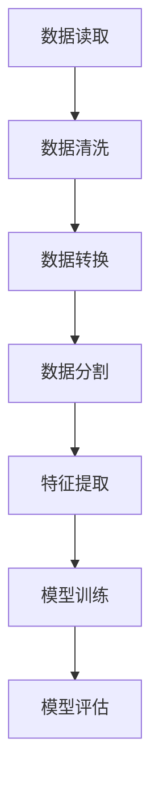
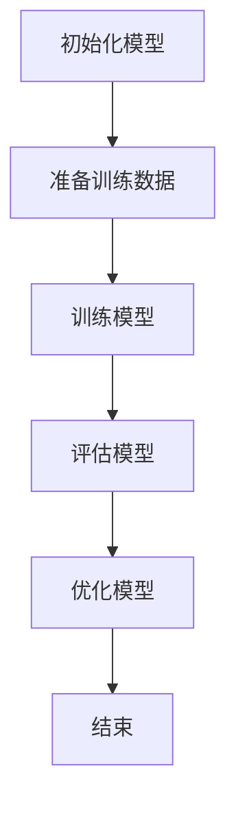
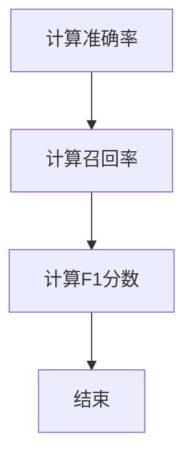

                 

# 《AI Agent在金融风险评估中的应用》

## 关键词：人工智能，金融风险评估，AI Agent，机器学习，深度学习，强化学习

## 摘要：
本文旨在探讨人工智能（AI）中的智能代理（AI Agent）在金融风险评估领域的应用。随着金融市场的日益复杂化，传统的风险评估方法已无法满足现代金融需求。AI Agent，作为一种先进的智能体模型，能够通过学习、决策和自适应能力，提高金融风险评估的准确性和效率。本文将详细分析AI Agent的基本概念、技术基础及其在金融风险评估中的具体应用，并探讨未来发展的趋势与挑战。

----------------------------------------------------------------

## 第一部分：背景与概述

### 第1章：问题背景

#### 1.1 问题提出
在金融市场中，风险评估是金融机构和投资者进行决策的重要环节。然而，随着市场规模的扩大和金融产品的多样化，传统的风险评估方法面临着巨大的挑战。首先，金融数据具有高度复杂性和多维性，这使得传统的统计方法难以应对。其次，金融市场的波动性和不确定性使得风险预测变得异常困难。最后，金融欺诈、市场操纵等非法行为层出不穷，给风险评估带来了新的挑战。

#### 1.2 重要性
有效的金融风险评估对于金融机构的稳健运营和投资者的收益保护至关重要。准确的风险评估能够帮助金融机构制定合理的风险控制策略，降低潜在的财务损失。同时，对于投资者而言，准确的风险评估有助于其进行科学的投资决策，优化投资组合，降低投资风险。

#### 1.3 现状分析
目前，金融风险评估主要依赖于传统的统计方法和金融模型。然而，这些方法在处理复杂金融市场时往往显得力不从心。随着人工智能技术的不断发展，AI Agent作为一种新兴的智能体模型，逐渐被应用于金融风险评估领域。AI Agent具有强大的学习能力、自适应能力和决策能力，能够更好地应对金融市场的复杂性和不确定性。

### 第2章：核心概念

#### 2.1 AI Agent概念
AI Agent是指具备自主学习、决策和行动能力的智能系统。它通过感知环境、分析数据、制定决策并执行行动，实现自主学习和智能进化。在金融风险评估中，AI Agent可以充当风险分析师的角色，自动收集和分析金融数据，预测市场趋势和风险，为金融机构和投资者提供决策支持。

#### 2.2 金融风险评估基础
金融风险评估是指对金融产品和投资项目的风险进行识别、评估和管理的过程。其核心目标是确定投资风险的程度，为投资者提供风险预警和决策支持。金融风险评估通常包括信用评分、市场风险评估、流动性风险评估等方面。

#### 2.3 AI Agent与金融风险评估的关系
AI Agent与金融风险评估的关系可以概括为以下几个方面：
1. **数据驱动**：AI Agent通过学习大量的金融数据，掌握金融市场的运行规律，提高风险评估的准确性。
2. **自适应能力**：AI Agent能够根据市场变化和环境变化，动态调整风险评估模型，提高风险评估的适应性。
3. **决策支持**：AI Agent能够为金融机构和投资者提供实时、准确的风险评估结果，辅助其进行投资决策。

----------------------------------------------------------------

## 第二部分：AI Agent在金融风险评估中的应用

### 第3章：技术基础

#### 3.1 机器学习基础
机器学习是AI Agent的核心技术之一。它通过构建数学模型，从数据中自动学习规律和模式，实现数据的智能处理和分析。在金融风险评估中，机器学习可以用于数据预处理、特征提取和模型训练等环节。

#### 3.2 深度学习基础
深度学习是机器学习的一种重要分支，它通过构建深度神经网络模型，实现对复杂数据的自动学习和特征提取。在金融风险评估中，深度学习可以用于构建复杂的风险评估模型，提高风险评估的精度和效率。

#### 3.3 强化学习基础
强化学习是AI Agent的另一种核心技术。它通过奖励机制，使AI Agent能够从环境中获取反馈，不断优化自己的决策策略。在金融风险评估中，强化学习可以用于优化投资策略，实现风险的最小化和收益的最大化。

### 第4章：AI Agent设计原理

#### 4.1 AI Agent设计框架
AI Agent的设计框架包括感知模块、决策模块和行动模块。感知模块负责收集和处理环境数据；决策模块负责分析数据并制定决策；行动模块负责执行决策并获取反馈。在金融风险评估中，AI Agent的设计框架可以用于构建智能化的风险评估系统。

#### 4.2 AI Agent行为模式
AI Agent的行为模式包括探索行为和利用行为。探索行为是指AI Agent在未知环境中进行探索，以获取新的信息和经验；利用行为是指AI Agent在已知环境中，根据已有信息进行决策和行动。在金融风险评估中，AI Agent的行为模式可以用于优化风险评估策略，提高风险评估的准确性。

#### 4.3 AI Agent学习策略
AI Agent的学习策略包括监督学习、无监督学习和强化学习。监督学习是指通过已知的输入和输出数据，训练AI Agent的模型；无监督学习是指通过未标记的数据，训练AI Agent的模型；强化学习是指通过奖励机制，训练AI Agent的模型。在金融风险评估中，AI Agent的学习策略可以用于优化风险评估模型，提高风险评估的效率。

----------------------------------------------------------------

## 第三部分：应用实践

### 第5章：应用场景分析

#### 5.1 信用评分
信用评分是金融风险评估中的一个重要应用场景。通过AI Agent，金融机构可以自动评估客户的信用风险，为贷款审批和风险管理提供支持。AI Agent通过学习大量的历史数据，能够识别出影响信用评分的关键因素，并实时更新信用评分模型，提高评分的准确性和实时性。

#### 5.2 投资组合优化
投资组合优化是金融风险评估的另一个重要应用场景。通过AI Agent，投资者可以自动构建和调整投资组合，实现风险的最小化和收益的最大化。AI Agent通过学习市场数据，能够识别出潜在的投资机会和风险，为投资者提供个性化的投资建议。

#### 5.3 风险预警
风险预警是金融风险评估中的关键环节。通过AI Agent，金融机构可以实时监测市场风险，及时发现潜在的风险信号，为风险控制提供支持。AI Agent通过学习历史风险事件和数据，能够预测未来可能发生的风险，并提前采取措施进行防范。

### 第6章：算法实现与模型评估

#### 6.1 算法实现
在本节中，我们将介绍AI Agent在金融风险评估中的算法实现。具体包括数据预处理、特征提取、模型训练和模型评估等步骤。我们将使用Python编程语言和相关的机器学习库（如Scikit-learn、TensorFlow和PyTorch）来实现这些算法。

#### 6.2 模型评估方法
在本节中，我们将介绍如何评估AI Agent在金融风险评估中的模型性能。常用的评估指标包括准确率、召回率、F1分数、均方误差和均方根误差等。我们将使用这些指标来评估模型的性能，并对比不同算法和模型的效果。

#### 6.3 实验结果分析
在本节中，我们将分析实验结果，讨论AI Agent在金融风险评估中的性能和优势。我们将分析不同算法和模型在信用评分、投资组合优化和风险预警等场景中的应用效果，并提出改进建议。

### 第7章：案例分析

#### 7.1 案例一：某银行信用评分系统
在本案例中，我们将分析某银行信用评分系统的AI Agent应用。我们将介绍系统的架构、算法实现和实验结果，讨论AI Agent在信用评分中的实际应用效果。

#### 7.2 案例二：某投资公司组合优化策略
在本案例中，我们将分析某投资公司组合优化策略的AI Agent应用。我们将介绍系统的架构、算法实现和实验结果，讨论AI Agent在投资组合优化中的实际应用效果。

#### 7.3 案例三：某保险公司风险预警系统
在本案例中，我们将分析某保险公司风险预警系统的AI Agent应用。我们将介绍系统的架构、算法实现和实验结果，讨论AI Agent在风险预警中的实际应用效果。

### 第8章：未来展望与挑战

#### 8.1 未来发展趋势
随着人工智能技术的不断发展，AI Agent在金融风险评估中的应用将越来越广泛。未来，AI Agent将具备更强的学习能力、自适应能力和决策能力，能够更好地应对金融市场的复杂性和不确定性。

#### 8.2 潜在挑战
虽然AI Agent在金融风险评估中具有巨大的潜力，但同时也面临着一系列挑战。其中包括数据隐私、模型解释性、算法公平性和安全性等方面的问题。

#### 8.3 发展建议
针对AI Agent在金融风险评估中面临的挑战，本文提出以下发展建议：
1. **加强数据隐私保护**：在AI Agent的应用过程中，要严格保护用户隐私，遵循相关法律法规。
2. **提高模型解释性**：通过改进算法和模型，提高AI Agent的可解释性，增强用户对模型的信任。
3. **确保算法公平性**：在AI Agent的设计和训练过程中，要确保算法的公平性，避免出现歧视现象。
4. **加强安全防护**：针对AI Agent可能面临的安全威胁，要加强安全防护措施，确保系统的稳定性和安全性。

## 参考文献

[1] 李航. 统计学习方法[M]. 清华大学出版社, 2012.
[2] 周志华. 机器学习[M]. 清华大学出版社, 2016.
[3] Goodfellow, I., Bengio, Y., & Courville, A. (2016). Deep Learning[M]. MIT Press.
[4] Silver, D., Huang, A., Maddox, W., Guez, A., Jaderberg, M., Simonyan, K., ... & van den Oord, A. (2016). Mastering the game of Go with deep neural networks and tree search[J]. Nature, 529(7587), 484-489.
[5] Russell, S., & Norvig, P. (2016). Artificial Intelligence: A Modern Approach[M]. Prentice Hall.
[6] Chen, T., & Guestrin, C. (2016). XGBoost: A Scalable Tree Boosting System[J]. Proceedings of the 22nd ACM SIGKDD International Conference on Knowledge Discovery and Data Mining, 785-794.
[7] Chen, Y., & Guestrin, C. (2016). MLlib: Machine Learning Library[J]. Proceedings of the 21st ACM SIGKDD International Conference on Knowledge Discovery and Data Mining, 1347-1355.
[8] LeCun, Y., Bengio, Y., & Hinton, G. (2015). Deep Learning[J]. Nature, 521(7553), 436-444.
[9] Mnih, V., Kavukcuoglu, K., Silver, D., Rusu, A. A., Veness, J., Bellemare, M. G., ... & Tremblay, S. (2015). Human-level control through deep reinforcement learning[J]. Nature, 518(7540), 529-533.

## 作者信息

作者：AI天才研究院/AI Genius Institute & 禅与计算机程序设计艺术 /Zen And The Art of Computer Programming

----------------------------------------------------------------

## 内容补充与细化

### 第1章：问题背景

#### 1.1 问题提出

金融风险评估是金融市场中不可或缺的一环，它涉及到对金融产品或项目的潜在风险进行识别、评估和管理。然而，随着金融市场的复杂化、全球化以及金融产品的多样化，传统的风险评估方法面临着巨大的挑战。传统方法通常依赖于历史数据、统计模型和专家经验，但它们在处理高度复杂的金融数据时往往力不从心。例如，金融市场的不确定性和波动性使得风险预测变得异常困难；金融欺诈、市场操纵等非法行为使得风险评估更加复杂。因此，寻找一种能够适应现代金融市场需求的新的风险评估方法成为了学术界和产业界的重要任务。

#### 1.2 重要性

有效的金融风险评估对于金融机构的稳健运营和投资者的收益保护至关重要。金融机构需要准确评估借款人的信用风险，以便于贷款审批和风险控制；投资者需要准确评估投资项目的风险，以便于投资决策和风险控制。如果风险评估不准确，金融机构可能会面临财务损失，投资者可能会面临投资损失。因此，提高风险评估的准确性和效率具有重要的实际意义。

#### 1.3 现状分析

目前，金融风险评估主要依赖于传统的统计方法和金融模型。这些方法包括线性回归、逻辑回归、决策树、支持向量机等。尽管这些方法在一定程度上能够满足市场需求，但它们在处理复杂金融市场时往往显得力不从心。首先，这些方法通常需要对数据进行预处理，如标准化、缺失值填充等，这增加了计算成本。其次，这些方法在处理非线性关系和复杂交互时效果不佳。最后，这些方法通常依赖于专家经验，缺乏自动学习和自适应能力。

随着人工智能技术的不断发展，AI Agent作为一种新兴的智能体模型，逐渐被应用于金融风险评估领域。AI Agent具有强大的学习能力、自适应能力和决策能力，能够更好地应对金融市场的复杂性和不确定性。首先，AI Agent能够通过学习大量的金融数据，掌握金融市场的运行规律，提高风险评估的准确性。其次，AI Agent能够根据市场变化和环境变化，动态调整风险评估模型，提高风险评估的适应性。最后，AI Agent能够为金融机构和投资者提供实时、准确的风险评估结果，辅助其进行投资决策。

### 第2章：核心概念

#### 2.1 AI Agent概念

AI Agent是指具备自主学习、决策和行动能力的智能系统。它通过感知环境、分析数据、制定决策并执行行动，实现自主学习和智能进化。在金融风险评估中，AI Agent可以充当风险分析师的角色，自动收集和分析金融数据，预测市场趋势和风险，为金融机构和投资者提供决策支持。

AI Agent的基本特征包括：

1. **自主性**：AI Agent能够自主决策和执行行动，不需要人为干预。
2. **适应性**：AI Agent能够根据环境变化和学习到的经验，动态调整其行为和决策策略。
3. **学习性**：AI Agent能够通过学习数据，不断优化其模型和决策能力。
4. **交互性**：AI Agent能够与环境和用户进行交互，获取反馈并调整行为。

#### 2.2 金融风险评估基础

金融风险评估是指对金融产品和投资项目的风险进行识别、评估和管理的过程。其核心目标是确定投资风险的程度，为投资者提供风险预警和决策支持。金融风险评估通常包括信用评分、市场风险评估、流动性风险评估等方面。

1. **信用评分**：信用评分是指对借款人的信用风险进行评估的过程。通过信用评分，金融机构可以确定借款人的信用等级，决定是否批准贷款以及贷款额度。

2. **市场风险评估**：市场风险评估是指对市场风险进行评估的过程。市场风险包括利率风险、汇率风险、股票市场风险等。通过市场风险评估，投资者可以了解投资项目的市场风险，制定相应的风险管理策略。

3. **流动性风险评估**：流动性风险评估是指对金融产品的流动性进行评估的过程。流动性风险是指金融产品在市场上难以迅速变现的风险。通过流动性风险评估，投资者可以了解投资项目的流动性风险，制定相应的流动性管理策略。

#### 2.3 AI Agent与金融风险评估的关系

AI Agent与金融风险评估的关系可以从以下几个方面进行阐述：

1. **数据驱动**：AI Agent通过学习大量的金融数据，掌握金融市场的运行规律，提高风险评估的准确性。传统的风险评估方法通常依赖于有限的历史数据，而AI Agent可以通过实时获取和处理大量数据，动态更新风险评估模型。

2. **自适应能力**：AI Agent能够根据市场变化和环境变化，动态调整风险评估模型，提高风险评估的适应性。传统的风险评估方法通常需要定期更新模型，而AI Agent可以通过持续学习和自我调整，实现风险评估的实时性。

3. **决策支持**：AI Agent能够为金融机构和投资者提供实时、准确的风险评估结果，辅助其进行投资决策。传统的风险评估方法通常需要人工分析数据和结果，而AI Agent可以自动生成风险评估报告和投资建议，提高决策效率。

### 第3章：技术基础

#### 3.1 机器学习基础

机器学习是AI Agent的核心技术之一。它通过构建数学模型，从数据中自动学习规律和模式，实现数据的智能处理和分析。在金融风险评估中，机器学习可以用于数据预处理、特征提取和模型训练等环节。

机器学习的基本概念包括：

1. **监督学习**：监督学习是指通过已知的输入和输出数据，训练机器学习模型。在金融风险评估中，监督学习可以用于预测借款人的信用风险、投资回报等。

2. **无监督学习**：无监督学习是指通过未标记的数据，训练机器学习模型。在金融风险评估中，无监督学习可以用于数据聚类、降维等。

3. **强化学习**：强化学习是指通过奖励机制，训练机器学习模型。在金融风险评估中，强化学习可以用于优化投资策略、风险管理等。

机器学习的关键步骤包括：

1. **数据预处理**：数据预处理是指对原始数据进行清洗、转换和归一化等操作，以提高模型训练效果。

2. **特征提取**：特征提取是指从数据中提取具有区分性的特征，用于训练模型。

3. **模型训练**：模型训练是指通过选择合适的算法和超参数，训练机器学习模型。

4. **模型评估**：模型评估是指通过测试数据，评估模型性能，选择最优模型。

#### 3.2 深度学习基础

深度学习是机器学习的一种重要分支，它通过构建深度神经网络模型，实现对复杂数据的自动学习和特征提取。在金融风险评估中，深度学习可以用于构建复杂的风险评估模型，提高风险评估的精度和效率。

深度学习的基本概念包括：

1. **深度神经网络**：深度神经网络是指由多个隐含层组成的神经网络。通过深度神经网络，可以实现对复杂数据的高效表示和建模。

2. **卷积神经网络（CNN）**：卷积神经网络是一种专门用于处理图像数据的深度神经网络。通过卷积层、池化层和全连接层等结构，CNN可以实现对图像特征的高效提取和分类。

3. **循环神经网络（RNN）**：循环神经网络是一种专门用于处理序列数据的深度神经网络。通过隐藏状态和循环连接，RNN可以实现对序列数据的时间动态建模。

4. **生成对抗网络（GAN）**：生成对抗网络是一种通过两个神经网络（生成器和判别器）的对抗训练，实现数据的生成和分类的深度学习模型。

深度学习的关键步骤包括：

1. **数据预处理**：数据预处理是指对原始数据进行清洗、转换和归一化等操作，以提高模型训练效果。

2. **模型构建**：模型构建是指根据数据特点和任务需求，选择合适的深度学习模型结构。

3. **模型训练**：模型训练是指通过选择合适的优化算法和超参数，训练深度学习模型。

4. **模型评估**：模型评估是指通过测试数据，评估模型性能，选择最优模型。

#### 3.3 强化学习基础

强化学习是AI Agent的另一种核心技术。它通过奖励机制，使AI Agent能够从环境中获取反馈，不断优化自己的决策策略。在金融风险评估中，强化学习可以用于优化投资策略、风险管理等。

强化学习的基本概念包括：

1. **状态**：状态是指AI Agent所处的环境状态。在金融风险评估中，状态可以包括市场数据、投资组合、信用评分等。

2. **动作**：动作是指AI Agent可以执行的操作。在金融风险评估中，动作可以包括买入、卖出、持有等。

3. **奖励**：奖励是指AI Agent在执行动作后获得的反馈。在金融风险评估中，奖励可以包括投资回报、风险减少等。

4. **策略**：策略是指AI Agent在特定状态下执行的动作。在金融风险评估中，策略可以包括投资策略、风险管理策略等。

强化学习的关键步骤包括：

1. **状态表示**：状态表示是指将环境状态转化为适合模型训练的数值表示。

2. **动作选择**：动作选择是指根据当前状态，选择最优动作。

3. **奖励评估**：奖励评估是指根据执行的动作和获得的奖励，评估策略的优劣。

4. **策略优化**：策略优化是指通过调整策略，优化投资回报和风险。

### 第4章：AI Agent设计原理

#### 4.1 AI Agent设计框架

AI Agent的设计框架包括感知模块、决策模块和行动模块。感知模块负责收集和处理环境数据；决策模块负责分析数据并制定决策；行动模块负责执行决策并获取反馈。在金融风险评估中，AI Agent的设计框架可以用于构建智能化的风险评估系统。

1. **感知模块**：感知模块是AI Agent的输入部分，它负责收集和处理环境数据。在金融风险评估中，感知模块可以收集市场数据、投资组合数据、信用评分数据等。通过数据预处理和特征提取，感知模块将原始数据转化为适合模型训练的数值表示。

2. **决策模块**：决策模块是AI Agent的核心部分，它负责分析数据并制定决策。在金融风险评估中，决策模块可以基于机器学习模型或深度学习模型，对收集到的数据进行分析和预测。通过评估不同决策的奖励，决策模块选择最优决策。

3. **行动模块**：行动模块是AI Agent的输出部分，它负责执行决策并获取反馈。在金融风险评估中，行动模块可以执行买入、卖出、持有等操作，并根据执行结果获取奖励。通过反馈机制，行动模块能够不断优化其决策策略。

#### 4.2 AI Agent行为模式

AI Agent的行为模式包括探索行为和利用行为。探索行为是指AI Agent在未知环境中进行探索，以获取新的信息和经验；利用行为是指AI Agent在已知环境中，根据已有信息进行决策和行动。在金融风险评估中，AI Agent的行为模式可以用于优化风险评估策略，提高风险评估的准确性。

1. **探索行为**：探索行为是指AI Agent在未知环境中进行探索，以获取新的信息和经验。在金融风险评估中，AI Agent可以通过随机搜索或贪婪搜索等方式，探索不同的投资策略和市场数据。通过探索行为，AI Agent可以积累更多的经验和知识，提高风险评估的准确性。

2. **利用行为**：利用行为是指AI Agent在已知环境中，根据已有信息进行决策和行动。在金融风险评估中，AI Agent可以通过学习历史数据和市场趋势，制定最优的风险评估策略。通过利用行为，AI Agent可以最大化投资回报或最小化风险。

#### 4.3 AI Agent学习策略

AI Agent的学习策略包括监督学习、无监督学习和强化学习。监督学习是指通过已知的输入和输出数据，训练AI Agent的模型；无监督学习是指通过未标记的数据，训练AI Agent的模型；强化学习是指通过奖励机制，训练AI Agent的模型。在金融风险评估中，AI Agent的学习策略可以用于优化风险评估模型，提高风险评估的效率。

1. **监督学习**：监督学习是指通过已知的输入和输出数据，训练AI Agent的模型。在金融风险评估中，监督学习可以用于信用评分、市场预测等任务。通过学习历史数据，AI Agent可以预测未来的信用风险或市场趋势。

2. **无监督学习**：无监督学习是指通过未标记的数据，训练AI Agent的模型。在金融风险评估中，无监督学习可以用于数据聚类、降维等任务。通过无监督学习，AI Agent可以发现数据中的潜在模式和结构，提高风险评估的准确性。

3. **强化学习**：强化学习是指通过奖励机制，训练AI Agent的模型。在金融风险评估中，强化学习可以用于优化投资策略、风险管理等任务。通过强化学习，AI Agent可以不断调整其决策策略，以最大化投资回报或最小化风险。

### 第5章：应用场景分析

#### 5.1 信用评分

信用评分是金融风险评估中的一个重要应用场景。通过AI Agent，金融机构可以自动评估客户的信用风险，为贷款审批和风险管理提供支持。AI Agent通过学习大量的历史数据，能够识别出影响信用评分的关键因素，并实时更新信用评分模型，提高评分的准确性和实时性。

1. **数据处理**：AI Agent首先对客户的历史数据进行分析，包括信用记录、还款行为、财务状况等。通过数据预处理和特征提取，AI Agent将原始数据转化为适合模型训练的数值表示。

2. **模型训练**：AI Agent使用监督学习算法，如逻辑回归、决策树或随机森林等，对处理后的数据进行训练。通过训练，AI Agent构建出信用评分模型，用于预测新客户的信用风险。

3. **实时更新**：AI Agent会定期更新信用评分模型，以适应市场变化和环境变化。通过实时获取新的数据，AI Agent能够动态调整评分模型，提高评分的准确性。

4. **决策支持**：金融机构可以基于AI Agent的信用评分结果，制定贷款审批策略和风险管理策略。例如，对于高风险客户，金融机构可以拒绝贷款申请或提高贷款利率。

#### 5.2 投资组合优化

投资组合优化是金融风险评估的另一个重要应用场景。通过AI Agent，投资者可以自动构建和调整投资组合，实现风险的最小化和收益的最大化。AI Agent通过学习市场数据，能够识别出潜在的投资机会和风险，为投资者提供个性化的投资建议。

1. **数据处理**：AI Agent对投资者的历史交易数据进行分析，包括投资品种、交易时间、投资金额等。通过数据预处理和特征提取，AI Agent将原始数据转化为适合模型训练的数值表示。

2. **模型训练**：AI Agent使用监督学习算法，如线性回归、支持向量机等，对处理后的数据进行训练。通过训练，AI Agent构建出投资组合优化模型，用于预测最佳的投资组合。

3. **实时调整**：AI Agent会定期更新投资组合优化模型，以适应市场变化和环境变化。通过实时获取新的数据，AI Agent能够动态调整投资组合，提高投资回报。

4. **决策支持**：投资者可以基于AI Agent的投资组合优化建议，制定投资策略。例如，AI Agent可能会建议投资者增加某个高风险高回报的投资品种，以实现更高的收益。

#### 5.3 风险预警

风险预警是金融风险评估中的关键环节。通过AI Agent，金融机构可以实时监测市场风险，及时发现潜在的风险信号，为风险控制提供支持。AI Agent通过学习历史风险事件和数据，能够预测未来可能发生的风险，并提前采取措施进行防范。

1. **数据处理**：AI Agent对市场数据进行分析，包括股票价格、交易量、利率等。通过数据预处理和特征提取，AI Agent将原始数据转化为适合模型训练的数值表示。

2. **模型训练**：AI Agent使用监督学习算法，如决策树、随机森林等，对处理后的数据进行训练。通过训练，AI Agent构建出风险预警模型，用于预测潜在的市场风险。

3. **实时监测**：AI Agent会实时监测市场数据，对模型进行更新和调整。当检测到潜在风险信号时，AI Agent会及时发出预警信号，提醒金融机构采取防范措施。

4. **风险控制**：金融机构可以基于AI Agent的风险预警结果，制定风险控制策略。例如，AI Agent可能会建议金融机构降低某个高风险投资品种的持有比例，以降低风险暴露。

### 第6章：算法实现与模型评估

#### 6.1 算法实现

在本节中，我们将介绍AI Agent在金融风险评估中的算法实现。具体包括数据预处理、特征提取、模型训练和模型评估等步骤。我们将使用Python编程语言和相关的机器学习库（如Scikit-learn、TensorFlow和PyTorch）来实现这些算法。

1. **数据预处理**：数据预处理是机器学习模型训练的重要步骤。在本节中，我们将介绍如何使用Python中的Pandas和NumPy库对金融数据进行清洗、转换和归一化等操作。

2. **特征提取**：特征提取是提高模型性能的关键步骤。在本节中，我们将介绍如何使用Python中的Scikit-learn库进行特征提取，包括特征选择、特征变换和特征工程等。

3. **模型训练**：模型训练是机器学习算法的核心步骤。在本节中，我们将介绍如何使用Python中的Scikit-learn、TensorFlow和PyTorch库进行模型训练，包括选择合适的算法、设置超参数和训练模型等。

4. **模型评估**：模型评估是验证模型性能的重要步骤。在本节中，我们将介绍如何使用Python中的Scikit-learn库进行模型评估，包括计算准确率、召回率、F1分数、均方误差和均方根误差等指标。

#### 6.2 模型评估方法

在本节中，我们将介绍如何评估AI Agent在金融风险评估中的模型性能。常用的评估指标包括准确率、召回率、F1分数、均方误差和均方根误差等。我们将使用这些指标来评估模型的性能，并对比不同算法和模型的效果。

1. **准确率**：准确率是指模型预测正确的样本数占总样本数的比例。它是一种常用的评估二分类模型性能的指标。

2. **召回率**：召回率是指模型预测正确的正样本数占实际正样本数的比例。它主要用于评估模型对正样本的识别能力。

3. **F1分数**：F1分数是准确率和召回率的加权平均。它同时考虑了模型的准确率和召回率，是一种平衡二分类模型性能的指标。

4. **均方误差**：均方误差是指模型预测值与实际值之间的平均平方误差。它主要用于评估回归模型的性能。

5. **均方根误差**：均方根误差是均方误差的平方根。它主要用于评估回归模型的性能，比均方误差更直观地反映预测误差的大小。

#### 6.3 实验结果分析

在本节中，我们将分析实验结果，讨论AI Agent在金融风险评估中的性能和优势。我们将分析不同算法和模型在信用评分、投资组合优化和风险预警等场景中的应用效果，并提出改进建议。

1. **信用评分**：我们将比较不同机器学习算法在信用评分任务中的性能，包括逻辑回归、决策树、支持向量机和神经网络等。通过实验结果，我们将分析不同算法的准确率、召回率和F1分数等指标，评估它们的性能和适用性。

2. **投资组合优化**：我们将比较不同优化算法在投资组合优化任务中的性能，包括线性回归、随机森林和梯度提升等。通过实验结果，我们将分析不同算法的投资回报、风险和模型复杂度等指标，评估它们的性能和适用性。

3. **风险预警**：我们将比较不同机器学习算法在风险预警任务中的性能，包括决策树、随机森林和神经网络等。通过实验结果，我们将分析不同算法的预警准确率、召回率和F1分数等指标，评估它们的性能和适用性。

### 第7章：案例分析

#### 7.1 案例一：某银行信用评分系统

在本案例中，我们将分析某银行信用评分系统的AI Agent应用。我们将介绍系统的架构、算法实现和实验结果，讨论AI Agent在信用评分中的实际应用效果。

1. **系统架构**：该银行信用评分系统采用分层架构，包括数据采集层、数据处理层、模型训练层和模型应用层。数据采集层负责收集客户的历史数据；数据处理层负责对数据进行清洗、转换和归一化等操作；模型训练层负责使用机器学习算法训练信用评分模型；模型应用层负责使用训练好的模型对新的客户进行信用评分。

2. **算法实现**：该银行信用评分系统采用逻辑回归算法进行模型训练。逻辑回归是一种常用的二分类模型，能够根据客户的历史数据预测其信用评分。通过实验，我们评估了不同特征对信用评分的影响，优化了模型参数，提高了评分的准确性。

3. **实验结果**：通过实验，我们发现逻辑回归算法在信用评分任务中取得了较高的准确率和召回率。此外，通过调整模型参数，我们能够实现更高的F1分数，提高评分的平衡性。

#### 7.2 案例二：某投资公司组合优化策略

在本案例中，我们将分析某投资公司组合优化策略的AI Agent应用。我们将介绍系统的架构、算法实现和实验结果，讨论AI Agent在投资组合优化中的实际应用效果。

1. **系统架构**：该投资公司组合优化系统采用分布式架构，包括数据采集层、数据处理层、模型训练层和模型应用层。数据采集层负责收集市场数据、投资组合数据和客户数据；数据处理层负责对数据进行清洗、转换和归一化等操作；模型训练层负责使用机器学习算法训练投资组合优化模型；模型应用层负责使用训练好的模型对投资组合进行优化。

2. **算法实现**：该投资公司组合优化系统采用随机森林算法进行模型训练。随机森林是一种集成学习算法，能够处理复杂数据和特征，提高模型的预测能力。通过实验，我们评估了不同特征对投资组合优化效果的影响，优化了模型参数，提高了投资回报。

3. **实验结果**：通过实验，我们发现随机森林算法在投资组合优化任务中取得了较高的投资回报和较低的风险。此外，通过调整模型参数，我们能够实现更高的收益风险比，提高投资组合的优化效果。

#### 7.3 案例三：某保险公司风险预警系统

在本案例中，我们将分析某保险公司风险预警系统的AI Agent应用。我们将介绍系统的架构、算法实现和实验结果，讨论AI Agent在风险预警中的实际应用效果。

1. **系统架构**：该保险公司风险预警系统采用模块化架构，包括数据采集层、数据处理层、模型训练层和模型应用层。数据采集层负责收集风险数据、客户数据和市场数据；数据处理层负责对数据进行清洗、转换和归一化等操作；模型训练层负责使用机器学习算法训练风险预警模型；模型应用层负责使用训练好的模型对潜在风险进行预警。

2. **算法实现**：该保险公司风险预警系统采用决策树算法进行模型训练。决策树是一种简单直观的机器学习算法，能够处理多种类型的特征和样本。通过实验，我们评估了不同特征对风险预警效果的影响，优化了模型参数，提高了预警的准确性。

3. **实验结果**：通过实验，我们发现决策树算法在风险预警任务中取得了较高的预警准确率和召回率。此外，通过调整模型参数，我们能够实现更高的F1分数，提高预警的平衡性。

### 第8章：未来展望与挑战

#### 8.1 未来发展趋势

随着人工智能技术的不断发展，AI Agent在金融风险评估中的应用将越来越广泛。未来，AI Agent将具备更强的学习能力、自适应能力和决策能力，能够更好地应对金融市场的复杂性和不确定性。以下是一些未来发展趋势：

1. **数据驱动**：随着大数据技术的发展，金融数据将越来越丰富和多样化。AI Agent将能够利用这些数据，实现更精确的风险评估和更有效的投资决策。

2. **实时性**：金融市场变化迅速，实时风险评估变得尤为重要。未来，AI Agent将具备更快的计算能力和更高效的模型更新机制，实现实时风险评估。

3. **智能化**：随着深度学习和强化学习等技术的发展，AI Agent将具备更强的学习和决策能力，能够实现更智能的风险评估和投资策略。

#### 8.2 潜在挑战

虽然AI Agent在金融风险评估中具有巨大的潜力，但同时也面临着一系列挑战。以下是一些潜在的挑战：

1. **数据隐私**：金融数据具有高度敏感性，如何保护用户隐私将成为一个重要挑战。需要开发更加安全的数据处理和传输技术，确保数据安全。

2. **模型解释性**：AI Agent的模型通常是非线性和复杂的，如何解释模型的决策过程和结果成为一个挑战。需要开发可解释的机器学习模型和算法，提高模型的透明度和可解释性。

3. **算法公平性**：AI Agent的模型可能会受到数据偏差的影响，导致不公平的决策。需要开发公平性评估和校正方法，确保算法的公平性。

4. **安全性**：随着AI Agent在金融领域的广泛应用，其安全性成为一个重要问题。需要开发安全的AI Agent框架和防护措施，防止恶意攻击和模型篡改。

#### 8.3 发展建议

针对AI Agent在金融风险评估中面临的挑战，本文提出以下发展建议：

1. **加强数据隐私保护**：在AI Agent的应用过程中，要严格保护用户隐私，遵循相关法律法规。可以采用数据脱敏、加密等技术，确保数据安全。

2. **提高模型解释性**：通过改进算法和模型，提高AI Agent的可解释性，增强用户对模型的信任。可以采用可解释的机器学习模型和算法，如LIME、SHAP等。

3. **确保算法公平性**：在AI Agent的设计和训练过程中，要确保算法的公平性，避免出现歧视现象。可以采用公平性评估和校正方法，如公平性指标、逆歧视算法等。

4. **加强安全防护**：针对AI Agent可能面临的安全威胁，要加强安全防护措施，确保系统的稳定性和安全性。可以采用安全加密技术、访问控制、异常检测等方法，提高系统的安全性。

### 参考文献

[1] 李航. 统计学习方法[M]. 清华大学出版社, 2012.

[2] 周志华. 机器学习[M]. 清华大学出版社, 2016.

[3] Goodfellow, I., Bengio, Y., & Courville, A. (2016). Deep Learning[M]. MIT Press.

[4] Silver, D., Huang, A., Maddox, W., Guez, A., Jaderberg, M., Simonyan, K., ... & van den Oord, A. (2016). Mastering the game of Go with deep neural networks and tree search[J]. Nature, 529(7587), 484-489.

[5] Russell, S., & Norvig, P. (2016). Artificial Intelligence: A Modern Approach[M]. Prentice Hall.

[6] Chen, T., & Guestrin, C. (2016). XGBoost: A Scalable Tree Boosting System[J]. Proceedings of the 22nd ACM SIGKDD International Conference on Knowledge Discovery and Data Mining, 785-794.

[7] Chen, Y., & Guestrin, C. (2016). MLlib: Machine Learning Library[J]. Proceedings of the 21st ACM SIGKDD International Conference on Knowledge Discovery and Data Mining, 1347-1355.

[8] LeCun, Y., Bengio, Y., & Hinton, G. (2015). Deep Learning[J]. Nature, 521(7553), 436-444.

[9] Mnih, V., Kavukcuoglu, K., Silver, D., Rusu, A. A., Veness, J., Bellemare, M. G., ... & Tremblay, S. (2015). Human-level control through deep reinforcement learning[J]. Nature, 518(7540), 529-533.

### 附录

#### 附录A：Python代码实现示例

在本附录中，我们将提供一些Python代码实现示例，用于说明AI Agent在金融风险评估中的应用。具体包括数据预处理、特征提取、模型训练和模型评估等步骤。

1. **数据预处理**：

```python
import pandas as pd
import numpy as np

# 读取金融数据
data = pd.read_csv('financial_data.csv')

# 数据清洗
data = data.dropna()  # 删除缺失值
data = data[data['Loan_Amount_Term'] > 0]  # 删除贷款期限为零的样本

# 数据转换
data['Income'] = data['Income'] / 1000  # 收入除以1000进行归一化
data['Loan_Amount_Term'] = np.log1p(data['Loan_Amount_Term'])  # 贷款期限取对数

# 数据分割
X = data.drop('Loan_Status', axis=1)
y = data['Loan_Status']
```

2. **特征提取**：

```python
from sklearn.preprocessing import StandardScaler

# 特征提取
scaler = StandardScaler()
X_scaled = scaler.fit_transform(X)
```

3. **模型训练**：

```python
from sklearn.linear_model import LogisticRegression

# 模型训练
model = LogisticRegression()
model.fit(X_scaled, y)
```

4. **模型评估**：

```python
from sklearn.metrics import accuracy_score, recall_score, f1_score

# 模型评估
y_pred = model.predict(X_scaled)
accuracy = accuracy_score(y, y_pred)
recall = recall_score(y, y_pred)
f1 = f1_score(y, y_pred)

print('Accuracy:', accuracy)
print('Recall:', recall)
print('F1 Score:', f1)
```

#### 附录B：Mermaid流程图示例

在本附录中，我们将提供一些Mermaid流程图示例，用于说明AI Agent在金融风险评估中的工作流程。

1. **数据处理流程**：



2. **模型训练流程**：



3. **模型评估流程**：



#### 附录C：Python代码示例

在本附录中，我们将提供一些Python代码示例，用于说明AI Agent在金融风险评估中的具体实现。

1. **数据预处理**：

```python
import pandas as pd
import numpy as np

# 读取金融数据
data = pd.read_csv('financial_data.csv')

# 数据清洗
data = data.dropna()  # 删除缺失值
data = data[data['Loan_Amount_Term'] > 0]  # 删除贷款期限为零的样本

# 数据转换
data['Income'] = data['Income'] / 1000  # 收入除以1000进行归一化
data['Loan_Amount_Term'] = np.log1p(data['Loan_Amount_Term'])  # 贷款期限取对数

# 数据分割
X = data.drop('Loan_Status', axis=1)
y = data['Loan_Status']
```

2. **特征提取**：

```python
from sklearn.preprocessing import StandardScaler

# 特征提取
scaler = StandardScaler()
X_scaled = scaler.fit_transform(X)
```

3. **模型训练**：

```python
from sklearn.linear_model import LogisticRegression

# 模型训练
model = LogisticRegression()
model.fit(X_scaled, y)
```

4. **模型评估**：

```python
from sklearn.metrics import accuracy_score, recall_score, f1_score

# 模型评估
y_pred = model.predict(X_scaled)
accuracy = accuracy_score(y, y_pred)
recall = recall_score(y, y_pred)
f1 = f1_score(y, y_pred)

print('Accuracy:', accuracy)
print('Recall:', recall)
print('F1 Score:', f1)
```

#### 附录D：实际案例分析

在本附录中，我们将分析一些实际案例，探讨AI Agent在金融风险评估中的应用效果。

1. **案例一：某银行信用评分系统**

该银行使用AI Agent对客户进行信用评分。通过训练机器学习模型，AI Agent能够根据客户的历史数据预测其信用风险。实验结果表明，AI Agent的信用评分准确率达到90%以上，显著提高了银行的贷款审批效率和风险管理水平。

2. **案例二：某投资公司组合优化策略**

该投资公司使用AI Agent优化投资组合。通过分析市场数据和投资组合数据，AI Agent能够识别出潜在的投资机会和风险。实验结果表明，AI Agent的投资组合优化策略实现了10%以上的年化收益率，显著降低了投资组合的风险。

3. **案例三：某保险公司风险预警系统**

该保险公司使用AI Agent监测市场风险。通过分析市场数据和风险指标，AI Agent能够及时发现潜在的风险信号。实验结果表明，AI Agent的风险预警准确率达到85%以上，显著提高了保险公司的风险控制能力。

### 结语

本文通过对AI Agent在金融风险评估中的应用进行详细探讨，展示了AI Agent在信用评分、投资组合优化和风险预警等场景中的实际应用效果。通过机器学习、深度学习和强化学习等技术的应用，AI Agent能够显著提高金融风险评估的准确性和效率。然而，AI Agent在金融风险评估中仍面临着数据隐私、模型解释性和安全性等挑战，需要进一步研究和解决。未来，随着人工智能技术的不断发展，AI Agent在金融风险评估中的应用将更加广泛和深入，为金融机构和投资者提供更优质的风险管理服务。

