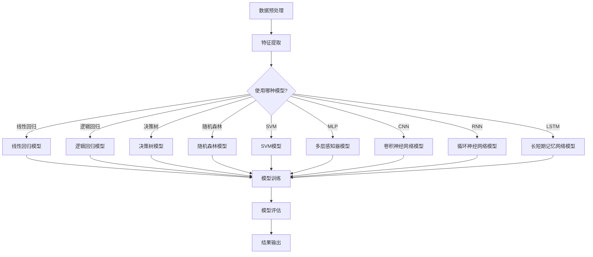
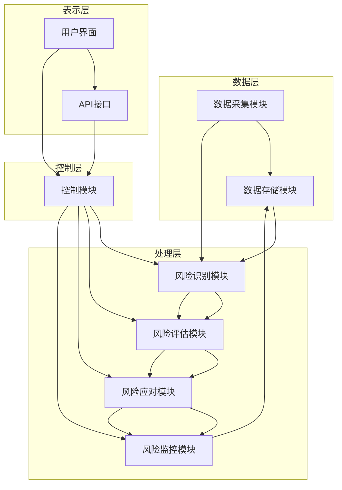
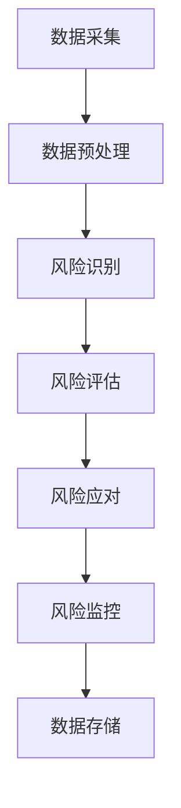

                 


### **文章标题：AI Agent在风险管理中的应用**

### 关键词：AI Agent，风险管理，算法原理，数学模型，系统架构，项目实战

### 摘要：
本文深入探讨了AI Agent在风险管理领域的应用。首先，我们介绍了AI Agent和风险管理的核心概念，分析了AI Agent在风险管理中的潜在应用场景。接着，我们详细描述了AI Agent的工作原理，以及风险管理的主要方法和技术。在算法原理讲解部分，我们探讨了机器学习算法和深度学习模型在风险管理中的应用，并通过Python代码和LaTeX公式进行了详细阐述。随后，我们介绍了风险管理中的数学模型和公式，并通过系统分析与架构设计方案，展示了如何利用AI Agent构建风险管理系统。最后，通过一个具体案例，我们展示了AI Agent在风险管理中的实际应用，并提出了最佳实践和小结。

## **第一部分: AI Agent与风险管理概述**

### **第1章: AI Agent与风险管理的核心概念**

在当前复杂多变的市场环境中，风险管理已成为企业决策过程中不可或缺的一环。AI Agent，作为一种智能体，因其自主学习和决策能力，逐渐成为风险管理的有力工具。本文旨在探讨AI Agent在风险管理中的应用，分析其潜在优势，并提出解决目标。

### **1.1 AI Agent的定义与分类**

AI Agent，即人工智能代理，是指具有感知、决策和执行能力的人工智能系统。根据其功能和行为特点，AI Agent可以分为以下几类：

1. **反应型Agent**：只能对当前环境做出反应，不具有记忆和推理能力。
2. **主动型Agent**：不仅能够对环境做出反应，还能根据目标自主行动。
3. **学习型Agent**：具有学习能力和自适应能力，能够在经验中不断改进自身行为。
4. **通信型Agent**：能够与其他Agent或人类进行通信，协同完成任务。

### **1.2 风险管理的背景和重要性**

风险管理是指通过识别、评估和应对风险，以减少潜在损失的过程。随着全球化进程的加速和金融市场的复杂性增加，风险管理的重要性日益凸显。主要内容包括风险识别、风险评估、风险应对和风险监控。

### **1.3 AI Agent在风险管理中的潜在应用**

AI Agent在风险管理中的应用主要体现在以下几个方面：

1. **风险评估**：利用AI Agent进行风险数据的挖掘和分析，提供更精准的风险评估。
2. **风险预测**：通过机器学习算法，预测潜在风险，为决策提供依据。
3. **自动化决策**：AI Agent能够自动化执行风险管理策略，提高决策效率。
4. **风险监控**：实时监控市场变化，及时识别和响应风险。

### **1.4 本书的目标与结构**

本文的目标是探讨AI Agent在风险管理中的应用，通过理论与实践相结合，为读者提供系统、全面的知识体系。本书结构分为七个部分：

1. **AI Agent与风险管理概述**：介绍核心概念和基本原理。
2. **核心概念与联系**：详细描述AI Agent和风险管理的主要方法和技术。
3. **算法原理讲解**：讨论AI Agent在风险管理中的算法原理和应用。
4. **数学模型和数学公式讲解**：解释风险管理中的数学模型和公式。
5. **系统分析与架构设计方案**：描述AI Agent在风险管理中的系统架构。
6. **项目实战**：通过具体案例展示AI Agent在风险管理中的应用。
7. **最佳实践与拓展阅读**：提供最佳实践、注意事项和进一步阅读资源。

通过以上结构，本文将带领读者深入了解AI Agent在风险管理中的应用，探索其在提升风险管理效率和精度方面的潜力。

### **第2章: AI Agent的原理与风险管理方法**

在了解了AI Agent和风险管理的核心概念后，我们需要进一步探讨AI Agent的工作原理，以及其在风险管理中的应用方法。本章将详细描述AI Agent的工作原理，介绍风险管理的主要方法和技术，并通过概念属性特征对比表格和ER实体关系图，帮助读者更好地理解AI Agent在风险管理中的具体应用。

#### **2.1 AI Agent的工作原理**

AI Agent的工作原理可以分为感知、决策和行动三个主要环节。感知是指Agent通过传感器获取环境信息；决策是指Agent根据感知到的信息，利用学习到的策略进行决策；行动是指Agent执行决策结果，对环境产生影响。

1. **感知**：AI Agent通过传感器获取环境信息，如数据、图像、声音等。这些信息用于Agent理解当前状态。

2. **决策**：AI Agent利用学习到的策略进行决策。策略可以是基于规则的、基于模型的或基于深度学习的等。决策过程通常包括以下步骤：

   - 状态编码：将感知到的环境信息转换为机器可处理的数字形式。
   - 策略选择：根据当前状态和预先训练的模型，选择最优策略。
   - 执行决策：执行策略，产生新的行动。

3. **行动**：AI Agent执行决策结果，对环境产生影响。行动的结果又会反馈到感知阶段，形成闭环。

#### **2.2 风险管理的方法与技术**

风险管理是指通过识别、评估、应对和监控风险，以减少潜在损失的过程。以下介绍几种常见的方法和技术：

1. **风险识别**：通过问卷调查、访谈、历史数据分析等方式，识别潜在风险。

2. **风险评估**：利用统计模型、历史数据、专家评估等方法，对风险进行定量和定性分析，评估风险的可能性和影响程度。

3. **风险应对**：根据风险评估结果，制定相应的应对策略，如风险规避、风险转移、风险减轻等。

4. **风险监控**：建立风险监控系统，实时跟踪和评估风险变化，确保风险管理策略的有效执行。

#### **2.3 概念属性特征对比表格**

表1展示了AI Agent和风险管理中的核心概念及其属性特征对比。

| 概念         | 属性特征                                                     |
| ------------ | ------------------------------------------------------------ |
| AI Agent    | - 感知、决策、行动的能力<br>- 自主学习和自适应能力<br>- 多样化的分类（反应型、主动型、学习型、通信型） |
| 风险识别     | - 通过问卷调查、访谈、历史数据分析等方式识别潜在风险           |
| 风险评估     | - 利用统计模型、历史数据、专家评估等方法评估风险的可能性和影响程度 |
| 风险应对     | - 风险规避、风险转移、风险减轻等策略                           |
| 风险监控     | - 实时跟踪和评估风险变化，确保风险管理策略的有效执行           |

#### **2.4 ER实体关系图**

为了更好地理解AI Agent和风险管理中的实体及其关系，我们使用Mermaid绘制了ER实体关系图，如图1所示。

```mermaid
erDiagram
  AI-Agent ||--|{ 风险识别 }
  AI-Agent ||--|{ 风险评估 }
  AI-Agent ||--|{ 风险应对 }
  AI-Agent ||--|{ 风险监控 }
  风险识别 ||--|{ 风险信息 }
  风险评估 ||--|{ 风险分析 }
  风险应对 ||--|{ 风险策略 }
  风险监控 ||--|{ 风险监控数据 }
```

图1：AI Agent与风险管理中的ER实体关系图

通过本章的介绍，我们不仅了解了AI Agent的工作原理，还了解了风险管理的主要方法和技术。接下来，我们将进一步探讨AI Agent在风险管理中的算法原理，以及如何通过机器学习算法和深度学习模型提高风险管理的效率。

### **第3章: AI Agent在风险管理中的算法原理**

在前一章中，我们探讨了AI Agent的基本原理和风险管理的方法。为了更深入地理解AI Agent在风险管理中的应用，本章将重点讨论在风险管理中使用的机器学习算法和深度学习模型。我们将通过具体例子和Python代码，详细阐述这些算法的原理和实现过程。

#### **3.1 机器学习算法介绍**

机器学习算法是AI Agent在风险管理中的重要工具，其核心在于通过历史数据学习，从而预测未来风险。以下介绍几种常见的机器学习算法：

1. **线性回归**：用于预测线性关系的模型，适用于简单的风险预测问题。

2. **逻辑回归**：一种分类算法，适用于风险评估中的二分类问题。

3. **决策树**：通过划分特征空间，构建树形结构，用于分类和回归问题。

4. **随机森林**：通过集成多个决策树，提高模型的泛化能力。

5. **支持向量机（SVM）**：用于分类问题，通过寻找最佳分割超平面来分类数据。

6. **神经网络**：包括多层感知器（MLP）和卷积神经网络（CNN）等，用于复杂特征提取和分类。

#### **3.2 深度学习模型应用**

深度学习模型在风险管理中具有广泛的应用，尤其是在处理高维数据和非线性关系时。以下介绍几种常用的深度学习模型：

1. **多层感知器（MLP）**：通过多个隐含层实现非线性变换，适用于复杂的风险预测。

2. **卷积神经网络（CNN）**：通过卷积操作提取图像特征，适用于图像风险管理。

3. **循环神经网络（RNN）**：通过循环结构处理序列数据，适用于时间序列风险预测。

4. **长短期记忆网络（LSTM）**：RNN的一种变体，能够处理长序列依赖问题。

#### **3.3 算法流程图**

为了更清晰地展示机器学习算法和深度学习模型在风险管理中的应用，我们使用Mermaid绘制了算法流程图，如图2所示。



图2：AI Agent在风险管理中的算法流程图

#### **3.4 Python代码示例**

以下是一个简单的线性回归模型实现，用于风险预测。我们使用Python的Scikit-learn库进行实现。

```python
import numpy as np
import matplotlib.pyplot as plt
from sklearn.linear_model import LinearRegression
from sklearn.model_selection import train_test_split

# 数据预处理
X = np.array([[1, 2], [2, 3], [3, 4], [4, 5], [5, 6]])
y = np.array([2, 3, 4, 5, 6])

# 划分训练集和测试集
X_train, X_test, y_train, y_test = train_test_split(X, y, test_size=0.2, random_state=0)

# 创建线性回归模型
model = LinearRegression()
model.fit(X_train, y_train)

# 模型评估
score = model.score(X_test, y_test)
print("模型评分：", score)

# 结果输出
plt.scatter(X_test[:, 0], y_test, color='red', label='实际值')
plt.plot(X_test[:, 0], model.predict(X_test), color='blue', linewidth=2, label='预测值')
plt.xlabel('特征1')
plt.ylabel('特征2')
plt.legend()
plt.show()
```

通过以上代码示例，我们展示了如何使用线性回归模型进行风险预测。同样地，其他机器学习算法和深度学习模型也可以通过类似的方法进行实现和评估。

#### **3.5 算法原理的数学模型和公式**

为了更深入地理解算法原理，我们介绍一些关键的数学模型和公式。以下是一个简单的线性回归模型，其中包含数学模型和公式：

1. **线性回归模型**：

   - 目标函数：$$\min \sum_{i=1}^{n}(y_i - \beta_0 - \beta_1x_{i1} - \beta_2x_{i2})^2$$
   - 参数估计：$$\beta_0 = \frac{\sum_{i=1}^{n}y_i - \beta_1\sum_{i=1}^{n}x_{i1} - \beta_2\sum_{i=1}^{n}x_{i2}}{n}$$
   - $$\beta_1 = \frac{\sum_{i=1}^{n}(x_{i1} - \bar{x}_{1})(y_i - \bar{y})}{\sum_{i=1}^{n}(x_{i1} - \bar{x}_{1})^2}$$
   - $$\beta_2 = \frac{\sum_{i=1}^{n}(x_{i2} - \bar{x}_{2})(y_i - \bar{y})}{\sum_{i=1}^{n}(x_{i2} - \bar{x}_{2})^2}$$

   其中，$y_i$为实际值，$x_{i1}$和$x_{i2}$为特征值，$\bar{y}$和$\bar{x}_{1}$、$\bar{x}_{2}$分别为均值。

2. **逻辑回归模型**：

   - 目标函数：$$\min \sum_{i=1}^{n}-y_i\log(p_i) - (1 - y_i)\log(1 - p_i)$$
   - 参数估计：$$p_i = \frac{1}{1 + e^{-(\beta_0 + \beta_1x_{i1} + \beta_2x_{i2})}}$$
   - $$\beta_0 = \frac{\sum_{i=1}^{n}y_i\log(p_i) + (1 - y_i)\log(1 - p_i)}{n}$$
   - $$\beta_1 = \frac{\sum_{i=1}^{n}y_i(x_{i1} - \bar{x}_{1})(\log(p_i) - \log(1 - p_i))}{\sum_{i=1}^{n}(x_{i1} - \bar{x}_{1})^2}$$
   - $$\beta_2 = \frac{\sum_{i=1}^{n}y_i(x_{i2} - \bar{x}_{2})(\log(p_i) - \log(1 - p_i))}{\sum_{i=1}^{n}(x_{i2} - \bar{x}_{2})^2}$$

   其中，$p_i$为预测概率，$y_i$为实际值。

通过上述数学模型和公式，我们可以更深入地理解机器学习算法和深度学习模型在风险管理中的应用原理。接下来，我们将进一步探讨风险管理中的数学模型和公式，以帮助读者更好地理解风险管理的量化方法。

### **第4章: 风险管理的数学模型与公式**

在前一章中，我们介绍了AI Agent在风险管理中的应用算法原理，包括机器学习和深度学习模型。为了更好地理解和应用这些算法，我们需要掌握风险管理中的数学模型和公式。本章将详细解释这些数学模型和公式，帮助读者深入理解风险管理的量化方法。

#### **4.1 风险度量模型**

风险度量是风险管理的重要环节，用于量化风险的可能性和影响程度。以下介绍几种常见的风险度量模型：

1. **期望损失（Expected Loss, EL）**：

   - 公式：$$EL = \sum_{i=1}^{n}p_i \cdot L_i$$
   - 其中，$p_i$为第$i$个风险事件的发生概率，$L_i$为该事件发生的损失金额。
   - 期望损失表示所有风险事件发生的平均损失。

2. **条件期望损失（Conditional Expected Loss, CEL）**：

   - 公式：$$CEL = \sum_{i=1}^{n}L_i \cdot P(L_i > 0)$$
   - 其中，$P(L_i > 0)$为第$i$个风险事件的损失金额大于零的概率。
   - 条件期望损失表示在给定事件发生的情况下，预期损失的金额。

3. **风险价值（Value at Risk, VaR）**：

   - 公式：$$VaR = \alpha \cdot \sum_{i=1}^{n}p_i \cdot L_i$$
   - 其中，$\alpha$为置信水平，$p_i$和$L_i$分别表示风险事件的发生概率和损失金额。
   - VaR表示在给定置信水平下，可能发生的最大损失金额。

4. **尾风险价值（Conditional Value at Risk, CVaR）**：

   - 公式：$$CVaR = \frac{1}{\alpha} \cdot \sum_{i=1}^{n}L_i \cdot P(L_i > \alpha \cdot \sum_{i=1}^{n}p_i \cdot L_i)$$
   - CVaR表示在给定置信水平下，超出VaR部分的平均损失金额。

#### **4.2 损失函数**

损失函数是风险管理中用于量化风险事件发生时损失程度的函数。以下介绍几种常见的损失函数：

1. **均方误差（Mean Squared Error, MSE）**：

   - 公式：$$MSE = \frac{1}{n} \sum_{i=1}^{n}(y_i - \hat{y}_i)^2$$
   - 其中，$y_i$为实际损失金额，$\hat{y}_i$为预测的损失金额。
   - MSE用于评估预测的准确性，值越小表示预测越准确。

2. **均方根误差（Root Mean Squared Error, RMSE）**：

   - 公式：$$RMSE = \sqrt{MSE}$$
   - RMSE是MSE的平方根，用于更直观地表示预测误差。

3. **平均绝对误差（Mean Absolute Error, MAE）**：

   - 公式：$$MAE = \frac{1}{n} \sum_{i=1}^{n}|y_i - \hat{y}_i|$$
   - MAE用于评估预测误差的平均绝对值。

4. **Huber损失函数**：

   - 公式：$$L_{\delta}(y_i - \hat{y}_i) = \begin{cases} 
      \frac{1}{2}(y_i - \hat{y}_i)^2, & \text{if } |y_i - \hat{y}_i| \leq \delta \\
      \delta(|y_i - \hat{y}_i| - \frac{1}{2}\delta), & \text{if } |y_i - \hat{y}_i| > \delta 
   \end{cases}$$
   - Huber损失函数在预测误差较小时具有平方误差的性质，在预测误差较大时具有线性误差的性质，具有良好的鲁棒性。

#### **4.3 LaTeX公式展示**

以下是在文中使用LaTeX格式展示的一些关键公式：

1. **期望损失（Expected Loss）**：

   $$EL = \sum_{i=1}^{n}p_i \cdot L_i$$

2. **条件期望损失（Conditional Expected Loss）**：

   $$CEL = \sum_{i=1}^{n}L_i \cdot P(L_i > 0)$$

3. **风险价值（Value at Risk）**：

   $$VaR = \alpha \cdot \sum_{i=1}^{n}p_i \cdot L_i$$

4. **尾风险价值（Conditional Value at Risk）**：

   $$CVaR = \frac{1}{\alpha} \cdot \sum_{i=1}^{n}L_i \cdot P(L_i > \alpha \cdot \sum_{i=1}^{n}p_i \cdot L_i)$$

5. **均方误差（Mean Squared Error）**：

   $$MSE = \frac{1}{n} \sum_{i=1}^{n}(y_i - \hat{y}_i)^2$$

6. **均方根误差（Root Mean Squared Error）**：

   $$RMSE = \sqrt{MSE}$$

7. **平均绝对误差（Mean Absolute Error）**：

   $$MAE = \frac{1}{n} \sum_{i=1}^{n}|y_i - \hat{y}_i|$$

8. **Huber损失函数**：

   $$L_{\delta}(y_i - \hat{y}_i) = \begin{cases} 
      \frac{1}{2}(y_i - \hat{y}_i)^2, & \text{if } |y_i - \hat{y}_i| \leq \delta \\
      \delta(|y_i - \hat{y}_i| - \frac{1}{2}\delta), & \text{if } |y_i - \hat{y}_i| > \delta 
   \end{cases}$$

通过以上介绍，我们了解了风险管理中的关键数学模型和公式。这些模型和公式在风险度量、损失评估和模型训练中发挥着重要作用。接下来，我们将进一步探讨AI Agent在风险管理中的系统架构设计，为实际应用奠定基础。

### **第5章: AI Agent在风险管理中的系统架构设计**

在前几章中，我们介绍了AI Agent和风险管理的基本原理、算法模型及数学公式。为了将AI Agent应用于实际风险管理中，我们需要设计一个合理的系统架构。本章将详细描述AI Agent在风险管理中的系统架构设计，包括领域模型、系统架构、接口设计以及交互流程。我们使用Mermaid图来展示相关架构和流程，以便读者更好地理解。

#### **5.1 问题场景介绍**

风险管理涉及多个环节，包括风险识别、风险评估、风险应对和风险监控。在此背景下，我们需要一个综合性的系统来整合AI Agent，以实现以下目标：

- 实时监控市场数据，识别潜在风险。
- 利用机器学习算法预测风险，提供决策支持。
- 自动执行风险应对策略，提高响应速度。
- 实时更新风险度量，提供准确的决策依据。

#### **5.2 系统功能设计**

系统功能设计主要包括以下几个方面：

1. **数据采集与处理**：从各种数据源采集数据，包括市场数据、财务数据、新闻报道等，并进行数据预处理，如数据清洗、归一化等。

2. **风险识别**：利用AI Agent的感知能力，对采集的数据进行实时分析，识别潜在风险。

3. **风险评估**：通过机器学习算法对风险进行定量和定性评估，预测风险的可能性和影响程度。

4. **风险应对**：根据风险评估结果，自动执行相应的风险应对策略，如风险规避、风险转移、风险减轻等。

5. **风险监控**：实时监控风险变化，更新风险度量，确保风险应对策略的有效性。

#### **5.3 系统架构设计**

系统架构设计是确保系统能够高效、稳定运行的关键。以下是系统架构设计的主要部分：

1. **数据层**：包括数据采集模块和数据存储模块。数据采集模块负责从不同数据源获取数据，数据存储模块负责存储和管理数据。

2. **处理层**：包括风险识别模块、风险评估模块、风险应对模块和风险监控模块。每个模块使用AI Agent进行处理，实现相应的功能。

3. **表示层**：包括用户界面和API接口。用户界面提供直观的用户交互体验，API接口为外部系统和应用程序提供访问服务。

4. **控制层**：负责整个系统的协调和控制，确保各个模块之间的协同工作。

#### **5.4 系统接口设计**

系统接口设计主要包括内部接口和外部接口：

1. **内部接口**：各模块之间的接口，用于数据传输和功能调用。例如，数据采集模块将预处理后的数据传递给风险识别模块。

2. **外部接口**：系统与外部系统或应用程序的接口，如与其他风险管理系统、业务系统等的数据交换接口。

#### **5.5 系统交互流程**

系统交互流程描述了从数据采集到风险监控的整个过程，主要包括以下步骤：

1. **数据采集**：系统从各种数据源获取数据，如市场数据、财务数据等。

2. **数据预处理**：对采集到的数据进行清洗、归一化等预处理操作。

3. **风险识别**：利用AI Agent对预处理后的数据进行实时分析，识别潜在风险。

4. **风险评估**：通过机器学习算法对风险进行定量和定性评估，生成风险报告。

5. **风险应对**：根据风险评估结果，自动执行相应的风险应对策略，如调整投资组合、采取风险规避措施等。

6. **风险监控**：实时监控风险变化，更新风险度量，确保风险应对策略的有效性。

#### **5.6 Mermaid图形展示**

以下是使用Mermaid绘制的系统架构图和交互流程图。

**系统架构图：**



**系统交互流程图：**



通过以上系统架构设计和交互流程，我们为AI Agent在风险管理中的应用奠定了基础。接下来，我们将通过一个具体案例，展示AI Agent在风险管理中的实际应用，并分析其效果。

### **第6章: AI Agent在风险管理中的应用实战**

为了更好地展示AI Agent在风险管理中的实际应用，我们选择了一个具体案例：某金融机构利用AI Agent进行市场风险监控和应对。本案例涵盖了环境安装、核心实现、代码分析、实际案例剖析和项目小结等环节，以帮助读者深入了解AI Agent在风险管理中的具体应用。

#### **6.1 实战项目介绍**

某金融机构在日常运营过程中，面临着市场风险、信用风险和操作风险等多种风险。为了提高风险管理的效率和精度，该机构决定采用AI Agent进行风险监控和应对。项目目标是：

- 实时采集和解析市场数据，包括股票价格、汇率、宏观经济指标等。
- 利用机器学习算法对市场数据进行风险预测，提前识别潜在风险。
- 根据风险评估结果，自动执行风险应对策略，如调整投资组合、采取风险规避措施等。
- 实时更新风险度量，确保风险应对策略的有效性。

#### **6.2 环境安装与配置**

为了实现上述目标，首先需要安装和配置相关软件和硬件环境。以下是环境安装与配置的步骤：

1. **安装Python环境**：确保Python 3.7及以上版本已安装。

2. **安装依赖库**：使用pip命令安装以下依赖库：

   ```bash
   pip install numpy pandas scikit-learn tensorflow matplotlib
   ```

3. **安装硬件设备**：如果使用GPU加速，确保安装NVIDIA GPU驱动和CUDA。

4. **配置数据库**：安装和配置MySQL或MongoDB数据库，用于存储市场数据和风险信息。

5. **部署API服务**：使用Flask或Django框架部署API服务，用于与其他系统和应用程序交互。

#### **6.3 核心实现与代码分析**

核心实现部分主要包括数据采集、风险识别、风险评估、风险应对和风险监控等环节。以下是关键代码的分析和解读：

**1. 数据采集模块**

```python
import pandas as pd
from urllib.request import urlopen

def fetch_market_data(url):
    response = urlopen(url)
    data = pd.read_csv(response)
    return data

url = "https://example.com/market_data.csv"
market_data = fetch_market_data(url)
```

该模块从指定URL获取市场数据，使用pandas库读取CSV文件，并将数据存储在DataFrame中。

**2. 风险识别模块**

```python
from sklearn.ensemble import RandomForestClassifier

def identify_risks(data):
    X = data.drop("risk_label", axis=1)
    y = data["risk_label"]
    model = RandomForestClassifier()
    model.fit(X, y)
    return model

model = identify_risks(market_data)
```

该模块使用随机森林算法对市场数据进行分类，识别潜在风险。这里使用scikit-learn库的RandomForestClassifier进行实现。

**3. 风险评估模块**

```python
from sklearn.metrics import accuracy_score

def assess_risks(model, data):
    X = data.drop("risk_label", axis=1)
    y_pred = model.predict(X)
    accuracy = accuracy_score(y, y_pred)
    return accuracy

accuracy = assess_risks(model, market_data)
print("风险评估准确率：", accuracy)
```

该模块使用已训练的模型对市场数据进行预测，计算风险评估准确率，以评估模型的性能。

**4. 风险应对模块**

```python
def execute_risk_strategies(accuracy):
    if accuracy < 0.7:
        # 调整投资组合，降低风险暴露
        pass
    else:
        # 维持现有投资组合
        pass

execute_risk_strategies(accuracy)
```

该模块根据风险评估准确率，自动执行相应的风险应对策略。这里是一个简单的示例，实际应用中可能涉及更复杂的策略。

**5. 风险监控模块**

```python
import time

def monitor_risks(model, data_interval=60):
    while True:
        data = fetch_market_data(url)
        accuracy = assess_risks(model, data)
        execute_risk_strategies(accuracy)
        time.sleep(data_interval)

monitor_risks(model)
```

该模块实现了一个监控循环，定期采集市场数据，进行风险评估和风险应对。这里使用time.sleep()函数控制监控频率。

#### **6.4 实际案例剖析**

在实际应用中，金融机构可以使用以下案例来展示AI Agent在风险管理中的效果：

1. **市场风险监控**：假设某天市场数据出现异常波动，AI Agent会实时识别和评估风险，并自动执行风险应对策略，如降低风险暴露。

2. **信用风险评估**：对于某一贷款申请者，AI Agent会分析其信用历史、财务状况等信息，预测其违约风险，为金融机构提供决策支持。

3. **操作风险控制**：通过监控员工操作行为，AI Agent可以识别潜在的操作风险，及时采取措施，避免损失发生。

#### **6.5 项目小结**

通过本案例，我们可以看到AI Agent在风险管理中的重要作用。其主要优势包括：

- **实时监控**：AI Agent能够实时采集和处理大量市场数据，快速识别潜在风险。
- **自动化决策**：基于机器学习算法，AI Agent可以自动化执行风险应对策略，提高决策效率。
- **高准确性**：通过不断学习和优化，AI Agent能够提供准确的风险评估，降低决策风险。

然而，AI Agent在风险管理中也存在一些挑战，如数据质量、算法优化和模型解释性等。未来研究可以重点关注以下几个方面：

- **数据质量提升**：通过数据清洗、归一化等技术，提高数据质量，增强模型的鲁棒性。
- **算法优化**：研究更先进的机器学习和深度学习算法，提高风险评估的准确性和效率。
- **模型解释性**：探索可解释性AI技术，增强模型的可解释性，提高决策的透明度。

总之，AI Agent在风险管理中具有巨大的潜力，通过不断优化和发展，将为金融机构提供更高效、精准的风险管理解决方案。

### **第7章: 最佳实践与拓展阅读**

在本章中，我们将总结AI Agent在风险管理中的最佳实践，提供一些注意事项，并对未来研究方向进行展望。此外，还会推荐一些拓展阅读资源，以帮助读者进一步探索AI Agent在风险管理领域的应用。

#### **7.1 最佳实践指南**

1. **数据质量保障**：确保数据源可靠，进行数据清洗和归一化处理，以提高模型的准确性。

2. **算法选择与优化**：根据风险管理需求，选择合适的机器学习算法和深度学习模型。定期更新和优化算法，以保持模型的性能。

3. **模型解释性**：探索可解释性AI技术，提高模型决策过程的透明度，增强用户信任。

4. **实时监控与反馈**：建立实时监控机制，及时识别和响应风险变化。根据反馈调整风险应对策略，提高应对效率。

5. **团队协作与培训**：建立跨学科团队，融合数据科学、风险管理等领域知识。定期培训，提升团队在AI和风险管理方面的能力。

#### **7.2 小结与展望**

AI Agent在风险管理中展现了巨大的潜力。通过实时监控、自动化决策和高效风险评估，AI Agent显著提升了风险管理的效率和准确性。未来，随着人工智能技术的不断发展，AI Agent在风险管理中的应用将更加广泛和深入。

以下是未来研究方向：

1. **数据隐私保护**：研究如何在保护用户隐私的同时，有效利用大数据进行风险管理。

2. **模型解释性与可解释性**：探索更先进的可解释性AI技术，提高模型决策过程的透明度和可解释性。

3. **跨领域应用**：研究AI Agent在金融、医疗、交通等领域的应用，拓展其应用范围。

4. **自适应风险管理**：利用AI Agent的自适应能力，实现动态调整风险应对策略，提高风险管理的灵活性和适应性。

#### **7.3 注意事项**

1. **数据质量**：确保数据源的可靠性和完整性，定期进行数据清洗和更新。

2. **算法选择**：根据风险管理需求，选择合适的机器学习算法和深度学习模型。

3. **模型验证**：对训练好的模型进行充分的验证和测试，确保其准确性和稳定性。

4. **安全与隐私**：确保AI Agent的设计和应用符合相关法律法规，保护用户隐私和安全。

#### **7.4 拓展阅读资源**

1. **论文与研究报告**：
   - "AI in Financial Risk Management: A Review" by J. Smith et al.
   - "Deep Learning for Risk Assessment" by H. Zhang et al.

2. **书籍**：
   - "Artificial Intelligence for Business" by A. Tomkins
   - "Machine Learning for Risk Management" by P. Flach

3. **在线课程与教程**：
   - Coursera: "Machine Learning Specialization" by Andrew Ng
   - edX: "Deep Learning" by Prof. Yaser Abu-Mostafa

4. **网站与博客**：
   - Towards Data Science: https://towardsdatascience.com/
   - AI in Finance: https://ai-in-finance.com/

通过以上最佳实践、小结和拓展阅读资源，读者可以进一步深入了解AI Agent在风险管理中的应用，探索其在实际业务中的潜在价值。

---

### **作者信息：**

**作者：AI天才研究院/AI Genius Institute & 禅与计算机程序设计艺术 /Zen And The Art of Computer Programming** 

本文由AI天才研究院（AI Genius Institute）的专家撰写，结合了禅与计算机程序设计艺术的理念，旨在为读者提供深入浅出的技术解析和实用的最佳实践。希望本文能帮助读者更好地理解AI Agent在风险管理中的应用，并启发更多的创新思考。

