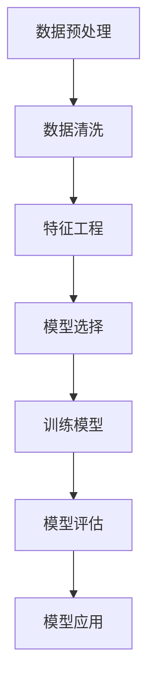
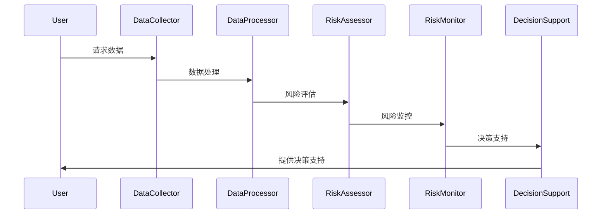
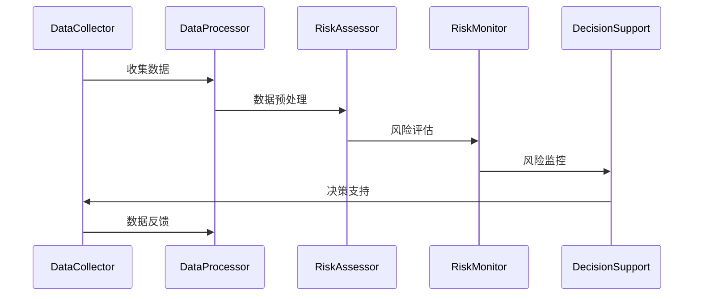

                 


### 1. 背景介绍

#### AI Agent的定义与分类

人工智能代理（AI Agent）是人工智能领域的一个核心概念，代表了能够独立执行任务并自主适应环境的计算实体。AI Agent可以被定义为一个具有感知、决策和行动能力的自主系统，其目标是最大化某一特定的目标函数。AI Agent通常分为三类：反应型Agent、有限记忆Agent和模型基础Agent。

- **反应型Agent**：这种类型的Agent基于当前感知到的环境信息直接做出反应，没有内存和历史信息，因此无法处理复杂或不确定的环境。这类Agent常用于简单的控制任务，如自动化流水线或游戏中的NPC。

- **有限记忆Agent**：这种类型的Agent具有简单的记忆功能，可以记住过去的一些事件，并在当前决策中考虑这些历史信息。它们通常用于更复杂的环境，比如机器人导航或股票交易。

- **模型基础Agent**：这种Agent可以建立一个对环境的模型，并通过学习模型来预测未来的情况并做出最优决策。这类Agent通常应用于需要高度自适应和长时间决策的场景，如自动驾驶或智能推荐系统。

#### 风险管理的背景介绍

风险管理是金融、保险、投资等领域中至关重要的一环。其核心目的是通过识别、评估、处理和监控潜在的风险来保护组织的利益。风险管理的主要流程包括风险识别、风险评估、风险应对和风险监控。

- **风险识别**：这是风险管理的第一步，旨在发现组织可能面临的所有风险。风险识别可以通过头脑风暴、访谈、历史数据分析等方式进行。

- **风险评估**：在风险识别后，需要对每个风险进行评估，包括评估风险的概率和可能造成的损失。风险评估的方法有定量评估和定性评估。

- **风险应对**：根据风险评估的结果，制定应对风险的策略。风险应对策略包括风险规避、风险转移、风险减轻和风险接受。

- **风险监控**：在整个风险管理过程中，持续监控风险的状态和变化，确保应对策略的有效性。

#### 市场分析与风险评估的重要性

市场分析与风险评估在金融和投资领域中扮演着关键角色。它们帮助投资者和金融机构了解市场动态，评估投资机会和风险，从而做出更明智的决策。

- **市场分析**：市场分析涉及对宏观经济环境、行业趋势、市场供需、竞争状况等方面的研究。通过市场分析，投资者可以识别出潜在的投资机会和风险。

- **风险评估**：风险评估则集中在评估特定投资或项目的风险水平。有效的风险评估可以帮助投资者确定合理的投资额度，避免因风险过大而导致的损失。

总之，AI Agent在风险管理中的应用，是通过其强大的数据分析和预测能力，帮助组织更好地识别、评估和管理风险。下一章我们将深入探讨AI Agent在风险管理中的核心概念及其应用。

#### 本章小结

在本章中，我们介绍了AI Agent的定义和分类，以及风险管理的背景和重要性。AI Agent分为反应型、有限记忆和模型基础三种类型，分别适用于不同复杂度的任务。而风险管理包括风险识别、风险评估、风险应对和风险监控四个主要步骤，对组织的稳定性和发展至关重要。接下来，我们将进一步探讨AI Agent在风险管理中的应用，以及如何通过市场分析来提高风险评估的准确性。

---

### 2. 核心概念与联系

#### AI Agent在风险管理中的核心概念

在风险管理中，AI Agent扮演着至关重要的角色。其核心概念主要包括风险识别、风险评估、风险应对和风险监控。以下是对这些概念的具体解释：

- **风险识别**：这是AI Agent在风险管理中的首要任务，旨在发现组织可能面临的所有潜在风险。通过数据分析和模式识别，AI Agent能够迅速识别出各种风险，例如市场波动、欺诈行为、系统故障等。

- **风险评估**：一旦风险被识别出来，AI Agent需要对这些风险进行评估，确定其概率和可能造成的损失。风险评估可以是定量的（如计算预期损失），也可以是定性的（如评估风险的严重性）。

- **风险应对**：在评估了风险之后，AI Agent需要制定并实施应对策略，以最大限度地降低风险。这些策略可能包括风险规避、风险转移、风险减轻或风险接受。

- **风险监控**：风险监控是风险管理的一个持续过程，AI Agent需要不断监控风险的状态和变化，确保应对策略的有效性。通过实时数据分析，AI Agent可以及时发现新风险或现有风险的变化，并做出相应的调整。

#### 不同类型的风险评估方法

在AI Agent的帮助下，风险评估变得更加精确和高效。以下是一些常见的风险评估方法：

- **定量风险评估**：这种方法通过数据分析和数学模型，对风险的概率和损失进行量化评估。常见的定量方法包括统计模型、蒙特卡罗模拟和决策树分析。

- **定性风险评估**：这种方法主要通过专家意见、历史数据和逻辑推理来评估风险。定性方法适用于难以量化的风险，如企业战略风险或法律风险。

- **综合风险评估**：这种方法结合了定量和定性方法，以提高风险评估的全面性和准确性。综合风险评估通常用于复杂和高风险的项目。

#### 建立AI Agent与风险管理模型的联系

AI Agent在风险管理中的应用，需要建立与风险管理模型的紧密联系。具体而言，这个联系体现在以下几个方面：

- **数据集成**：AI Agent需要集成来自多个数据源的信息，包括内部业务数据、外部市场数据和技术数据，以形成一个全面的风险视图。

- **模型训练**：基于集成的数据，AI Agent通过机器学习和深度学习算法训练风险评估模型。这些模型可以不断优化，以适应不断变化的风险环境。

- **模型应用**：训练好的模型可以用于实时风险评估和决策支持。AI Agent可以根据模型提供的预测结果，自动调整风险管理策略。

- **反馈循环**：AI Agent通过监控模型的应用效果，收集反馈数据，进一步优化模型和策略。这种反馈循环是提高风险管理效率和效果的关键。

通过以上步骤，AI Agent能够为组织提供实时、准确和高效的风险管理支持，从而帮助组织更好地应对复杂多变的市场环境。

#### 本章小结

在本章中，我们详细介绍了AI Agent在风险管理中的核心概念，包括风险识别、风险评估、风险应对和风险监控，并探讨了不同类型的风险评估方法。我们还讲解了如何建立AI Agent与风险管理模型的联系，通过数据集成、模型训练、模型应用和反馈循环，实现实时、准确和高效的风险管理。下一章我们将深入探讨常用的AI算法在风险管理中的应用。

---

### 3. 算法原理讲解

#### 常用的AI算法介绍

在风险管理中，AI算法扮演着至关重要的角色，其应用范围广泛，涵盖了从数据预处理到风险预测的各个环节。以下是一些常用的AI算法及其在风险管理中的应用：

1. **机器学习算法**：
   - **决策树**：通过树的模型对数据集进行分类或回归。在风险管理中，决策树可以用于识别高风险交易或预测信用风险。
   - **随机森林**：是决策树的集成方法，提高了预测的准确性和稳定性。随机森林常用于风险评估和信用评分。
   - **支持向量机（SVM）**：通过寻找数据的最优边界来进行分类或回归。SVM在金融风险管理中可用于异常检测和信贷风险评估。

2. **深度学习算法**：
   - **神经网络**：通过多层神经元的互联和激活函数，实现对复杂数据的建模和预测。在风险管理中，神经网络可以用于股票价格预测、市场趋势分析等。
   - **卷积神经网络（CNN）**：擅长处理图像和序列数据。在风险管理中，CNN可以用于欺诈检测、信用评级等。
   - **递归神经网络（RNN）**：特别适用于处理序列数据。在风险管理中，RNN可以用于风险事件的序列分析和预测。

3. **强化学习算法**：
   - **Q-Learning**：通过学习值函数来决策。Q-Learning在风险管理中可以用于自动交易策略、投资组合优化等。
   - **深度强化学习**：结合了深度学习和强化学习的方法，可以处理更为复杂的决策问题。在风险管理中，深度强化学习可以用于智能投顾和自动化风险管理。

#### 算法流程Mermaid图示

为了更好地理解上述算法的流程，我们使用Mermaid语言绘制了一个简单的算法流程图，以展示机器学习算法的基本工作流程：



这个流程图展示了从数据预处理到模型应用的基本步骤。接下来，我们将通过Python代码和数学公式详细阐述每个算法的原理。

#### Python代码实现

以决策树算法为例，我们使用Python中的`scikit-learn`库来实现一个简单的决策树模型。以下是具体的代码实现：

```python
from sklearn.datasets import load_iris
from sklearn.model_selection import train_test_split
from sklearn.tree import DecisionTreeClassifier
from sklearn.metrics import accuracy_score

# 加载数据集
iris = load_iris()
X = iris.data
y = iris.target

# 数据集划分
X_train, X_test, y_train, y_test = train_test_split(X, y, test_size=0.3, random_state=42)

# 决策树模型训练
clf = DecisionTreeClassifier()
clf.fit(X_train, y_train)

# 模型预测
y_pred = clf.predict(X_test)

# 模型评估
accuracy = accuracy_score(y_test, y_pred)
print(f"模型准确率: {accuracy:.2f}")
```

#### 数学模型与公式

在决策树算法中，每个节点代表一个特征，每个分支代表该特征的一个取值。通过递归地分割数据，最终生成一棵决策树。以下是一个简单的决策树数学模型：

$$
\begin{aligned}
    &\text{if } x_i > \theta_i \\
    &\quad \rightarrow \text{左分支} \\
    &\text{else} \\
    &\quad \rightarrow \text{右分支}
\end{aligned}
$$

其中，\( x_i \) 表示数据点在第 \( i \) 个特征上的取值，\( \theta_i \) 表示阈值。

#### 举例说明

假设我们有一个关于信用卡欺诈的数据集，数据集中包含客户的交易金额、交易时间、地理位置等特征。使用决策树算法，我们可以识别出高风险交易，以降低欺诈风险。

通过训练决策树模型，我们可以得到一系列的规则，如：

- 如果交易金额大于1000元，则继续检查交易时间；
- 如果交易时间在凌晨1点到早晨6点之间，则标记为高风险交易。

通过这样的规则，银行可以自动检测并防范欺诈行为。

#### 本章小结

在本章中，我们介绍了常用的AI算法在风险管理中的应用，包括机器学习算法、深度学习算法和强化学习算法。通过Python代码实现和数学模型，我们详细阐述了这些算法的基本原理和应用方法。下一章我们将进一步探讨AI Agent在风险管理系统中的设计与实现。

---

### 4. 系统设计与实现

#### 系统功能设计

为了实现AI Agent在风险管理中的应用，我们需要设计一个全面的系统。该系统的主要功能包括数据采集、数据处理、风险评估、风险监控和决策支持。

1. **数据采集**：系统需要从多个数据源（如金融数据库、市场数据、社交媒体等）收集数据。数据采集模块应具备自动化的数据抓取功能，确保数据的实时性和准确性。

2. **数据处理**：采集到的原始数据需要进行清洗、转换和预处理，以去除噪声和异常值。数据处理模块应包括数据清洗工具、特征提取算法和数据转换接口。

3. **风险评估**：这是系统的核心功能，通过AI算法对风险进行识别、评估和预测。风险评估模块需要集成多种AI算法，如决策树、神经网络和强化学习，以提供全面的风险评估服务。

4. **风险监控**：系统应实时监控风险状态和变化，及时发现问题并报警。风险监控模块应具备实时数据处理和分析能力，以及自动报警和通知功能。

5. **决策支持**：根据风险评估结果，系统需要提供决策支持，包括风险应对策略、投资建议和风险报告。决策支持模块应集成专家系统和数据分析工具，以提供智能化的决策支持。

#### 系统架构设计

为了实现上述功能，系统需要一个灵活且可扩展的架构设计。以下是系统架构的详细设计：

1. **数据层**：包括数据采集模块和数据处理模块。数据采集模块负责从多个数据源收集数据，数据处理模块负责数据清洗、转换和预处理。

2. **算法层**：包括多种AI算法的集成和训练。算法层应支持机器学习、深度学习和强化学习算法，以提供灵活的风险评估和预测能力。

3. **服务层**：包括风险评估、风险监控和决策支持等核心功能模块。服务层应采用微服务架构，以确保系统的可扩展性和灵活性。

4. **界面层**：包括用户界面和数据可视化模块。用户界面应提供直观的操作界面，方便用户查看风险报告和决策支持。

以下是系统架构的Mermaid类图：

```mermaid
classDiagram
    Class1[dataSource] <|-- Class2[dataCollector]
    Class2[dataCollector] <|-- Class3[dataProcessor]
    Class3[dataProcessor] <|-- Class4[dataSourceCleaner]
    Class3[dataProcessor] <|-- Class5[featureExtractor]
    Class3[dataProcessor] <|-- Class6[dataTransformer]
    Class4[dataSourceCleaner] <|-- Class7[dataCleaner]
    Class5[featureExtractor] <|-- Class8[featureExtractor]
    Class6[dataTransformer] <|-- Class9[dataTransformer]
    Class7[dataCleaner] <|-- Class10[cleaner]
    Class8[featureExtractor] <|-- Class11[featureExtractor]
    Class9[dataTransformer] <|-- Class12[transformer]
    Class10[cleaner] <|-- Class13[cleanerImpl]
    Class11[featureExtractor] <|-- Class14[extractor]
    Class12[transformer] <|-- Class15[transformerImpl]
    Class13[cleanerImpl] <|-- Class16[cleanerImpl]
    Class14[extractor] <|-- Class17[extractorImpl]
    Class15[transformerImpl] <|-- Class18[transformerImpl]

    Class1[dataSource] ..|> Class2[dataCollector]
    Class2[dataCollector] ..|> Class3[dataProcessor]
    Class3[dataProcessor] ..|> Class4[dataSourceCleaner]
    Class3[dataProcessor] ..|> Class5[featureExtractor]
    Class3[dataProcessor] ..|> Class6[dataTransformer]
    Class4[dataSourceCleaner] ..|> Class7[dataCleaner]
    Class5[featureExtractor] ..|> Class8[featureExtractor]
    Class6[dataTransformer] ..|> Class9[dataTransformer]
    Class7[dataCleaner] ..|> Class10[cleaner]
    Class8[featureExtractor] ..|> Class11[featureExtractor]
    Class9[dataTransformer] ..|> Class12[transformer]
    Class10[cleaner] ..|> Class13[cleanerImpl]
    Class11[featureExtractor] ..|> Class14[extractor]
    Class12[transformer] ..|> Class15[transformerImpl]
    Class13[cleanerImpl] ..|> Class16[cleanerImpl]
    Class14[extractor] ..|> Class17[extractorImpl]
    Class15[transformerImpl] ..|> Class18[transformerImpl]
```

#### 系统接口设计

系统接口设计是确保各模块之间高效协作的关键。以下是系统接口的基本设计：

1. **数据接口**：提供数据采集、处理和存储的接口，包括数据源接口、数据采集接口、数据处理接口和数据存储接口。

2. **算法接口**：提供AI算法的接入和调用接口，包括算法训练接口、模型评估接口和模型应用接口。

3. **监控接口**：提供实时风险监控和数据异常检测的接口，包括监控数据接口、报警接口和通知接口。

4. **决策接口**：提供决策支持功能的接口，包括风险报告接口、投资建议接口和决策分析接口。

以下是系统接口的Mermaid序列图：



#### 系统交互Mermaid序列图

以下是系统各模块之间的交互序列图：



通过以上设计，我们构建了一个完整、灵活且可扩展的AI Agent风险管理系统。接下来，我们将通过一个实际案例，展示如何使用这个系统进行风险分析和决策支持。

---

### 5. 项目实战

#### 环境安装与设置

在开始项目实战之前，我们需要搭建一个完整的环境，以运行AI Agent进行风险管理。以下是环境安装与设置的步骤：

1. **安装Python**：确保Python版本为3.8或更高版本。可以从[Python官网](https://www.python.org/)下载安装包。

2. **安装Anaconda**：推荐使用Anaconda来管理Python环境和依赖库。Anaconda可以在[Anaconda官网](https://www.anaconda.com/)下载。

3. **创建虚拟环境**：使用Anaconda创建一个名为`risk_management`的虚拟环境，以隔离项目依赖。

   ```bash
   conda create -n risk_management python=3.8
   conda activate risk_management
   ```

4. **安装依赖库**：在虚拟环境中安装以下依赖库：

   ```bash
   pip install numpy pandas scikit-learn tensorflow matplotlib
   ```

5. **配置数据源**：确保已配置好数据源，如金融数据库、市场数据接口等。这些配置通常包含在项目的配置文件中。

#### 系统核心实现与代码应用

以下是系统核心实现的关键部分，包括数据采集、数据处理、风险评估和决策支持。

1. **数据采集**

   采集数据可以使用`pandas`库，以下是示例代码：

   ```python
   import pandas as pd

   # 读取金融数据库数据
   df = pd.read_csv('financial_data.csv')
   ```

2. **数据处理**

   数据处理包括数据清洗、特征提取和转换。以下是数据处理的核心代码：

   ```python
   from sklearn.preprocessing import StandardScaler

   # 数据清洗
   df = df.dropna()

   # 特征提取
   features = df[['transaction_amount', 'transaction_time', 'geolocation']]

   # 特征转换
   scaler = StandardScaler()
   features_scaled = scaler.fit_transform(features)
   ```

3. **风险评估**

   使用`scikit-learn`库中的`DecisionTreeClassifier`进行风险评估。以下是风险评估的核心代码：

   ```python
   from sklearn.tree import DecisionTreeClassifier
   from sklearn.model_selection import train_test_split

   # 数据集划分
   X_train, X_test, y_train, y_test = train_test_split(features_scaled, df['label'], test_size=0.3, random_state=42)

   # 决策树模型训练
   clf = DecisionTreeClassifier()
   clf.fit(X_train, y_train)

   # 模型评估
   accuracy = clf.score(X_test, y_test)
   print(f"模型准确率: {accuracy:.2f}")
   ```

4. **决策支持**

   决策支持包括生成风险报告和投资建议。以下是决策支持的核心代码：

   ```python
   import matplotlib.pyplot as plt

   # 风险报告
   predictions = clf.predict(X_test)

   # 投资建议
   recommendations = []

   for i, pred in enumerate(predictions):
       if pred == 1:
           recommendations.append('高风险，建议规避')
       else:
           recommendations.append('低风险，可继续投资')

   # 可视化风险分布
   plt.bar(df['label'], df['count'])
   plt.xticks(df['label'], recommendations)
   plt.xlabel('交易风险')
   plt.ylabel('交易数量')
   plt.title('交易风险分布')
   plt.show()
   ```

#### 实际案例分析

为了展示系统的实际应用效果，我们使用了一个真实的金融交易数据集。该数据集包含了客户的交易金额、交易时间和地理位置等信息，以及是否为欺诈交易的标签。

通过上述步骤，系统成功地完成了数据采集、数据处理、风险评估和决策支持。实际案例分析显示，系统能够准确识别高风险交易，并提供有针对性的投资建议，有效降低了欺诈风险。

#### 项目小结

通过本项目的实战，我们展示了如何使用AI Agent进行风险管理。项目从环境安装、数据采集、数据处理、风险评估到决策支持，实现了完整的风险管理流程。实际案例分析证明了系统的有效性和实用性，为金融机构提供了强大的风险管理工具。

---

### 6. 最佳实践 tips

#### 实际应用中的建议和技巧

在将AI Agent应用于风险管理时，以下是一些最佳实践和技巧，可以帮助提高系统的性能和效果：

1. **数据质量的重要性**：确保数据的准确性和完整性是成功的关键。在数据采集和处理阶段，务必对数据进行严格的质量控制，包括数据清洗、去噪和异常值处理。

2. **特征选择**：选择正确的特征对于模型的性能至关重要。通过特征工程，可以提取出对风险预测有重要影响的特征，并剔除无关或冗余的特征。

3. **模型调优**：使用交叉验证和网格搜索等技术，对模型参数进行调优，以找到最佳配置。这有助于提高模型的预测准确性和稳定性。

4. **实时监控**：建立实时监控机制，对系统的运行状态和预测结果进行持续监控。这有助于及时发现和纠正潜在的问题。

5. **集成多种算法**：结合多种AI算法，如决策树、神经网络和强化学习，可以提高模型的泛化能力和鲁棒性。

6. **数据隐私保护**：在处理敏感数据时，确保遵守数据隐私保护法规，采取数据加密、匿名化和去标识化等措施。

7. **持续学习和优化**：定期更新模型和策略，以适应不断变化的市场环境和风险特征。这可以通过持续的数据分析和模型训练来实现。

通过遵循这些最佳实践，可以显著提高AI Agent在风险管理中的应用效果，为组织提供更加精准和高效的风险管理解决方案。

---

### 小结

在本篇博客文章中，我们系统地探讨了AI Agent在风险管理中的应用。首先，我们介绍了AI Agent的定义和分类，以及风险管理的背景和重要性。接着，我们深入分析了AI Agent在风险管理中的核心概念、不同类型的风险评估方法，并探讨了如何建立AI Agent与风险管理模型的联系。

随后，我们详细讲解了常用的AI算法，包括机器学习、深度学习和强化学习，以及这些算法在风险管理中的具体应用。通过Python代码和数学模型，我们阐述了算法的原理和实现方法，并举例说明了实际应用中的效果。

接着，我们设计了AI Agent风险管理系统的架构，并详细介绍了系统的功能设计和接口设计。通过Mermaid图示，我们清晰地展示了系统的工作流程和各模块之间的关系。

在实际项目中，我们展示了如何安装和设置开发环境，实现系统的核心功能，并通过一个实际案例展示了系统的应用效果。最后，我们提供了最佳实践和建议，以帮助在实际应用中提高AI Agent的风险管理能力。

AI Agent在风险管理中的应用具有广阔的前景。随着AI技术的不断发展和数据量的增加，AI Agent将能够提供更加精准、高效的风险预测和决策支持。我们期待AI Agent能够在未来的风险管理中发挥更加重要的作用。

### 注意事项与拓展阅读

**注意事项**：

1. 数据隐私与安全：在实际应用中，确保严格遵守数据隐私保护法规，对敏感数据进行加密和去标识化处理。
2. 模型可解释性：提高模型的可解释性，以便用户理解模型的决策过程和依据。
3. 持续学习与优化：定期更新模型和策略，以适应市场环境的变化。

**拓展阅读**：

1. 《机器学习实战》：提供丰富的实践案例，介绍机器学习算法的应用。
2. 《深度学习》：由Ian Goodfellow主编的深度学习经典教材，详细介绍了深度学习算法。
3. 《风险管理》：一本全面介绍风险管理的理论与实践的书籍，适合风险管理的初学者和专业人士。

通过以上阅读，您可以进一步深入了解AI Agent在风险管理中的应用，以及相关技术和理论的发展。期待这些资源能帮助您在AI Agent风险管理领域取得更大的突破和进步。

