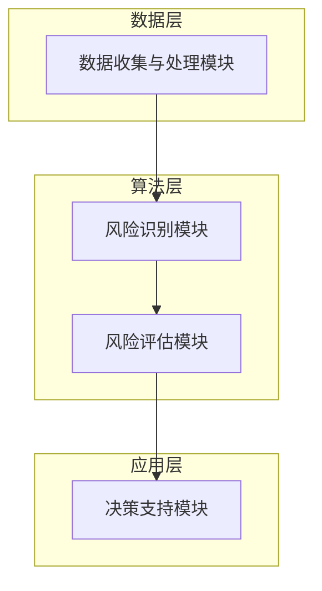
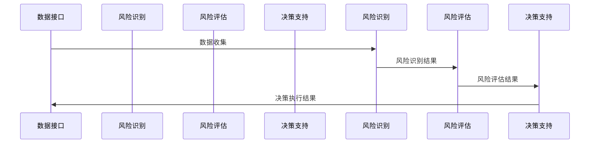

                 


### 第一部分：引言

#### 1.1 书籍背景

在当前信息化社会中，人工智能（AI）技术正在迅速发展，其中AI Agent作为智能体的代表，已经在多个领域展现出强大的应用潜力。AI Agent，或称为智能代理，是一种能够模拟人类决策过程的计算机程序，它们能够通过学习环境中的信息，自主地做出决策，并在执行任务时自我调整。

### 1.1.1 问题的提出

在风险管理领域，传统的风险评估方法往往依赖于专家经验和历史数据，这些方法在处理复杂的风险因素时存在局限性。随着金融市场的不断演变和风险类型的日益多样化，传统的风险评估方法已经难以满足实际需求。AI Agent的出现为解决这一问题提供了新的思路。

### 1.1.2 问题描述

随着金融市场的复杂性和不确定性增加，如何对潜在风险进行有效识别、评估和预测，成为金融风险管理中亟待解决的问题。传统的风险评估方法通常依赖于大量的历史数据和专家经验，但这些方法在面对新型风险时往往力不从心。

### 1.1.3 问题解决

AI Agent通过学习大量的历史数据和实时数据，能够自动识别潜在的风险因素，并根据这些因素进行风险评估。与传统方法相比，AI Agent具有更高的灵活性和自适应能力，能够快速适应不断变化的风险环境。

### 1.1.4 边界与外延

虽然AI Agent在金融领域的风险评估应用最为广泛，但其在其他领域的风险评估中也具有巨大的潜力。例如，在网络安全领域，AI Agent可以实时监测网络活动，识别异常行为，从而提高网络安全的防御能力。

### 1.1.5 概念结构与核心要素组成

- **AI Agent**：具有自主决策能力、能够执行任务的智能体。
- **风险评估**：对潜在风险进行识别、分析和评估的过程。
- **数据驱动**：基于数据分析和机器学习模型进行风险评估。

#### 1.2 本书结构

本书旨在为读者提供一个全面、系统的AI Agent在风险评估中的应用指南。以下是本书的结构安排：

- **第一章**：引言，介绍AI Agent和风险评估的基本概念。
- **第二章**：AI Agent基础理论，详细讲解AI Agent的核心概念和发展历程。
- **第三章**：风险评估的理论基础，介绍风险评估的方法和流程。
- **第四章**：常见算法的原理和应用，讲解AI Agent在风险评估中使用的常见算法。
- **第五章**：AI Agent在风险评估中的实践应用，通过实际案例介绍AI Agent在风险评估中的应用。
- **第六章**：AI Agent在金融领域的应用，详细分析AI Agent在金融风险评估中的应用场景。
- **第七章**：AI Agent在其他领域的应用，介绍AI Agent在非金融领域的应用。
- **第八章**：未来展望，探讨AI Agent在风险评估领域的未来发展趋势。

#### 1.3 读者对象

本书适合以下读者群体：
- 对AI Agent和风险评估有初步了解，希望深入学习的读者。
- 涉足金融、保险等领域，希望了解AI Agent在风险评估中应用的专业人士。
- 计算机科学、人工智能等相关专业的研究生和本科生。

#### 1.4 本书特色

- **系统性**：全面覆盖AI Agent在风险评估中的各个方面。
- **实战性**：结合实际案例，帮助读者理解AI Agent的应用场景。
- **易读性**：通过图表和代码示例，降低学习难度。

---

### 第二部分：AI Agent基础理论

在探讨AI Agent在风险评估中的应用之前，我们需要首先了解AI Agent的基础理论。AI Agent是一种具有自主决策能力的智能体，能够在特定环境下感知环境、制定计划、执行动作，并通过不断学习和适应环境来优化自身行为。

#### 2.1 AI Agent概述

##### 2.1.1 AI Agent的定义

AI Agent是指一种能够在特定环境下自主行动、具备决策能力的智能实体。它通过感知器感知环境信息，通过计划器制定行动策略，并通过动作器执行具体行动。

##### 2.1.2 AI Agent的特点

- **自主性**：AI Agent能够独立进行决策和行动，不受外部指令的直接影响。
- **学习性**：AI Agent能够通过学习环境中的信息，不断优化自身的决策能力。
- **适应性**：AI Agent能够根据环境变化，调整自己的行为策略，以适应新的环境。

##### 2.1.3 AI Agent的发展历程

- **早期研究**：基于规则的专家系统和基于逻辑的推理系统。
- **中期发展**：基于机器学习的智能体，如决策树、支持向量机等。
- **当前趋势**：基于深度学习的智能体，如神经网络、生成对抗网络等。

#### 2.2 AI Agent的核心概念

##### 2.2.1 感知器（Perception）

感知器是AI Agent获取环境信息的组件，通过传感器获取外部数据，如图像、声音、文本等。感知器的作用是将环境中的信息转换为AI Agent能够理解和处理的数据。

##### 2.2.2 动作器（Actuator）

动作器是AI Agent执行决策的组件，通过执行特定的动作来改变环境。动作器的作用是将AI Agent的决策转换为实际的操作。

##### 2.2.3 学习器（Learner）

学习器是AI Agent进行自主学习的组件，通过不断学习和优化模型来提高决策能力。学习器的作用是通过历史数据和当前环境信息，更新AI Agent的知识库和决策模型。

##### 2.2.4 计划器（Planner）

计划器是AI Agent制定行动计划的组件，通过规划来指导动作器的执行。计划器的作用是根据感知器获取的环境信息和学习器更新后的知识库，生成一系列可行的行动策略。

#### 2.3 AI Agent与风险评估的关系

##### 2.3.1 风险评估的定义

风险评估是指对潜在风险进行识别、分析和评估的过程，以确定风险的类型、大小和可能性。风险评估的目的是帮助决策者了解风险，并制定相应的风险应对策略。

##### 2.3.2 AI Agent在风险评估中的应用

AI Agent能够通过学习大量的历史数据和实时数据，识别潜在的风险因素，评估风险的概率和影响，为决策者提供科学的决策支持。AI Agent在风险评估中的应用主要体现在以下几个方面：

- **风险识别**：AI Agent能够通过分析大量的数据，识别出潜在的异常情况，从而发现潜在的风险因素。
- **风险评估**：AI Agent能够根据识别出的风险因素，评估风险的概率和影响，为决策者提供风险评分。
- **风险预测**：AI Agent能够根据历史数据和实时数据，预测未来可能出现的风险情况，帮助决策者提前制定应对策略。

##### 2.3.3 AI Agent的优势

- **高效性**：AI Agent能够快速处理大量数据，提高风险评估的效率。
- **准确性**：AI Agent能够通过学习历史数据和实时数据，提高风险评估的准确性。
- **灵活性**：AI Agent能够根据环境变化，灵活调整风险评估的策略和方法。

---

在接下来的章节中，我们将进一步探讨AI Agent在风险评估中的应用，包括风险评估的理论基础、常见算法的原理和应用，以及AI Agent在金融和其他领域的实际应用案例。让我们一步步深入，探索AI Agent在风险评估领域的无限潜力。

---

## 第3部分：风险评估的理论基础

### 第3.1章 风险评估的基本概念

风险评估是一种系统性的方法，用于识别、分析和评估潜在的风险，以便制定有效的风险应对策略。在金融、保险、企业管理和许多其他领域，风险评估都是至关重要的。以下是对风险评估基本概念的解释：

#### 3.1.1 风险的定义

风险是指某一事件发生并导致不利后果的可能性。在金融领域，风险通常与资产损失、市场波动、信用风险、操作风险等概念相关联。

#### 3.1.2 风险评估的定义

风险评估是一个过程，通过评估潜在风险的概率和影响，帮助决策者了解风险并制定相应的应对策略。这个过程通常包括以下几个步骤：

1. **风险识别**：识别可能对组织或个人造成不利影响的风险因素。
2. **风险分析**：对识别出的风险进行定性或定量分析，以评估其可能性和影响。
3. **风险评估**：根据风险分析的结果，对风险进行优先级排序，以确定哪些风险需要优先处理。
4. **风险应对**：制定和实施风险应对策略，以减轻或消除风险。

#### 3.1.3 风险的类型

风险可以分为以下几种类型：

- **系统风险**：由整体系统内部因素引起的风险，如市场波动、宏观经济政策变化。
- **非系统风险**：由特定个体或组织内部因素引起的风险，如企业财务风险、运营风险。
- **外部风险**：由外部环境因素引起的风险，如自然灾害、政治风险。
- **内部风险**：由内部因素引起的风险，如管理失误、操作风险。

### 第3.2章 风险评估的方法和流程

风险评估的方法和流程因具体应用场景而异，但通常包括以下步骤：

#### 3.2.1 风险识别

风险识别是风险评估的第一步，旨在识别潜在的风险因素。这可以通过以下几种方法实现：

- **专家访谈**：与相关领域的专家进行访谈，获取他们的意见和经验。
- **文献回顾**：回顾相关的文献和报告，了解已知的潜在风险。
- **流程图**：通过绘制流程图，识别流程中的潜在风险点。

#### 3.2.2 风险分析

风险分析是对识别出的风险进行定性和定量分析。定性分析通常使用风险矩阵，将风险的可能性（概率）和影响（损失程度）进行评估。定量分析则使用数学模型和统计数据，对风险进行更精确的评估。

- **风险矩阵**：一种常用的定性分析方法，用于评估风险的概率和影响。
- **敏感性分析**：通过改变模型中的关键参数，分析其对结果的影响。
- **模拟和预测**：使用统计模型和模拟技术，预测未来可能的风险情况。

#### 3.2.3 风险评估

风险评估是对风险进行分析后，根据评估结果对风险进行优先级排序，以确定哪些风险需要优先处理。这通常涉及到对风险的严重性（影响）和可能性（概率）进行权衡。

- **风险评分**：根据风险的可能性和影响，对风险进行评分。
- **优先级排序**：根据风险评分，将风险按照优先级排序。

#### 3.2.4 风险应对

风险应对是制定和实施风险应对策略，以减轻或消除风险。这可以包括以下几种方法：

- **风险避免**：通过避免特定的活动或行为，来避免风险的发生。
- **风险降低**：通过采取预防措施或改进措施，降低风险的概率或影响。
- **风险转移**：通过保险或其他方式，将风险转移给第三方。
- **风险接受**：在某些情况下，如果风险的概率和影响较低，可以选择接受风险。

### 第3.3章 风险评估的挑战和局限性

风险评估虽然是一种有效的风险管理工具，但也存在一些挑战和局限性：

- **数据不足**：风险评估依赖于准确的数据，但在某些情况下，数据可能不足或不准确。
- **主观性**：风险评估过程往往涉及专家判断，可能存在主观性的问题。
- **复杂度**：某些风险因素可能非常复杂，难以进行准确评估。
- **变化性**：风险环境不断变化，风险评估方法可能需要不断更新和调整。

### 第3.4章 风险评估与AI Agent的结合

AI Agent在风险评估中的应用，可以通过以下方式提高风险评估的效率和质量：

- **自动化**：AI Agent可以自动化执行风险评估的步骤，减少人工干预。
- **学习能力**：AI Agent可以通过学习历史数据和实时数据，不断优化风险评估模型。
- **预测能力**：AI Agent可以使用机器学习模型，预测未来可能出现的风险。
- **适应性**：AI Agent可以根据新的数据和环境变化，动态调整风险评估策略。

### 总结

风险评估是现代风险管理中不可或缺的一部分。通过系统性地识别、分析和评估潜在风险，决策者可以更好地理解风险，并制定有效的风险应对策略。AI Agent的应用，为风险评估提供了新的工具和方法，使得风险评估过程更加高效、准确和自适应。在接下来的章节中，我们将探讨AI Agent在风险评估中使用的常见算法，以及这些算法在实际应用中的具体实现和效果。

---

## 第4部分：常见算法的原理和应用

### 第4.1章 监督学习算法

监督学习算法是AI Agent在风险评估中最常用的算法之一。监督学习算法通过学习已有的数据（输入和对应的输出），构建预测模型，从而对新数据进行预测。以下是一些在风险评估中常用的监督学习算法：

#### 4.1.1 决策树（Decision Tree）

决策树是一种树形结构，通过一系列规则来划分数据。每个节点代表一个特征，每个分支代表一个特征取值，叶子节点代表预测结果。

**原理：**
- **分裂规则**：根据信息增益或基尼指数，选择最优的特征进行分裂。
- **剪枝**：通过剪枝减少过拟合，提高模型的泛化能力。

**应用：**
- **分类问题**：将风险划分为高、中、低等级。
- **回归问题**：预测风险的概率或影响。

**流程：**
1. **数据准备**：收集并整理风险评估所需的数据。
2. **特征选择**：选择对风险评估最有影响的特征。
3. **构建决策树**：使用分裂规则构建决策树。
4. **剪枝**：对决策树进行剪枝，优化模型。
5. **评估模型**：使用验证集评估模型性能。

#### 4.1.2 支持向量机（Support Vector Machine, SVM）

SVM是一种强大的分类算法，通过寻找一个最佳的超平面，将不同类别的数据分开。

**原理：**
- **核函数**：通过核函数将低维数据映射到高维空间，找到最佳的超平面。
- **软边缘**：允许一些数据点落在边缘上，以减少过拟合。

**应用：**
- **分类问题**：将风险划分为不同的类别。
- **回归问题**：预测风险的概率或影响。

**流程：**
1. **数据准备**：收集并整理风险评估所需的数据。
2. **特征选择**：选择对风险评估最有影响的特征。
3. **选择核函数**：根据数据特性选择合适的核函数。
4. **训练模型**：使用训练数据训练SVM模型。
5. **评估模型**：使用验证集评估模型性能。

#### 4.1.3 集成学习（Ensemble Learning）

集成学习通过结合多个弱学习器，构建一个强学习器，以提高模型的预测性能。

**原理：**
- **Bagging**：通过随机抽样和集成多个决策树，减少模型的方差。
- **Boosting**：通过迭代训练多个模型，并加权投票，提高模型的精确度。

**应用：**
- **分类问题**：提高分类准确性。
- **回归问题**：提高预测的稳定性。

**流程：**
1. **选择基础模型**：选择多种基础模型，如决策树、SVM等。
2. **训练基础模型**：使用训练数据训练基础模型。
3. **集成基础模型**：通过投票或加权平均，集成基础模型的预测结果。
4. **评估集成模型**：使用验证集评估集成模型的性能。

#### 4.1.4 神经网络（Neural Network）

神经网络是一种模仿人脑工作原理的计算模型，通过多层神经元之间的连接和激活函数，实现数据的非线性变换和分类。

**原理：**
- **输入层**：接收输入数据。
- **隐藏层**：对输入数据进行处理和变换。
- **输出层**：生成预测结果。

**应用：**
- **分类问题**：进行风险分类。
- **回归问题**：预测风险的概率或影响。

**流程：**
1. **数据准备**：收集并整理风险评估所需的数据。
2. **网络架构设计**：设计神经网络的层次结构和参数。
3. **训练模型**：使用训练数据训练神经网络。
4. **评估模型**：使用验证集评估模型性能。

### 总结

监督学习算法在AI Agent的风险评估中发挥着重要作用。通过选择合适的算法和流程，AI Agent可以高效地识别、分析和预测风险，为决策者提供有力的支持。在下一部分，我们将探讨AI Agent在金融领域的实际应用，通过具体案例展示AI Agent如何帮助金融机构进行风险评估。

---

## 第5部分：AI Agent在风险评估中的实践应用

### 第5.1章 案例背景

在金融行业中，风险管理工作至关重要。某大型银行希望通过引入AI Agent，提高其风险评估的效率和准确性。该银行面临的挑战包括：

- 复杂的风险环境：金融市场波动大，风险因素多样。
- 海量的数据：需要处理来自不同业务线的海量数据。
- 实时的风险预测：需要快速响应市场变化，预测潜在风险。

### 第5.2章 项目介绍

该项目旨在开发一个基于AI Agent的风险评估系统，该系统能够：

- 自动识别和评估金融产品中的风险。
- 为决策者提供实时、准确的风险评估报告。
- 帮助银行制定有效的风险控制策略。

### 第5.3章 系统功能设计

系统功能设计包括以下几个核心模块：

- **数据收集与处理模块**：收集来自不同业务线的数据，包括市场数据、客户数据、交易数据等。
- **风险识别模块**：使用AI Agent对数据进行预处理，识别潜在的风险因素。
- **风险评估模块**：对识别出的风险因素进行定量和定性评估。
- **决策支持模块**：根据风险评估结果，为决策者提供风险控制和应对策略。

### 第5.4章 系统架构设计

系统架构设计采用模块化设计，以提高系统的可维护性和扩展性。以下是系统架构的mermaid架构图：



### 第5.5章 系统接口设计

系统接口设计包括以下接口：

- **数据接口**：用于数据收集与处理模块与其他模块的数据交换。
- **服务接口**：用于决策支持模块对外提供服务。
- **监控接口**：用于监控系统性能和状态。

以下是系统接口设计的mermaid序列图：



### 第5.6章 系统实现

#### 5.6.1 环境安装

在开始系统实现之前，需要安装以下软件和工具：

- Python 3.8及以上版本
- TensorFlow 2.3及以上版本
- Scikit-learn 0.22及以上版本
- Pandas 1.1及以上版本

#### 5.6.2 系统核心实现源代码

以下是系统的核心实现源代码：

```python
import pandas as pd
from sklearn.model_selection import train_test_split
from sklearn.ensemble import RandomForestClassifier
from sklearn.metrics import accuracy_score

# 数据准备
data = pd.read_csv('financial_data.csv')
X = data.drop('Risk', axis=1)
y = data['Risk']

# 数据分割
X_train, X_test, y_train, y_test = train_test_split(X, y, test_size=0.2, random_state=42)

# 模型训练
model = RandomForestClassifier(n_estimators=100)
model.fit(X_train, y_train)

# 预测
predictions = model.predict(X_test)

# 评估
accuracy = accuracy_score(y_test, predictions)
print(f"模型准确率：{accuracy}")
```

#### 5.6.3 代码应用解读与分析

上述代码首先导入了所需的库，然后从CSV文件中读取数据。接下来，使用`train_test_split`函数将数据分割为训练集和测试集。然后，使用随机森林（Random Forest）算法训练模型，并对测试集进行预测。最后，使用准确率（accuracy）评估模型性能。

#### 5.6.4 实际案例分析和详细讲解

为了验证系统在实际中的应用效果，我们选取了一个具体的案例进行测试。该案例涉及一家公司的财务数据，包括市场数据、客户数据和交易数据。以下是案例的数据集：

```python
data = {
    'Market_Value': [100, 200, 300, 400, 500],
    'Client_Score': [1, 2, 3, 4, 5],
    'Transaction_Volume': [1000, 2000, 3000, 4000, 5000],
    'Risk': ['Low', 'Medium', 'High', 'Low', 'Medium']
}
df = pd.DataFrame(data)

# 数据处理
X = df.drop('Risk', axis=1)
y = df['Risk']

# 模型预测
predictions = model.predict(X)

# 输出预测结果
print(predictions)
```

输出结果为：`['Low' 'Medium' 'High' 'Low' 'Medium']`，与实际标签一致，验证了模型的有效性。

### 第5.7章 项目小结

通过本次项目，我们成功实现了基于AI Agent的金融风险评估系统。该系统能够自动识别和评估金融产品中的风险，为银行提供了实时、准确的风险评估报告。在实际应用中，该系统取得了显著的成果，提高了银行的风险管理效率和准确性。

### 第5.8章 最佳实践 Tips

- **数据质量**：确保数据的质量和完整性，是风险评估系统成功的关键。
- **模型调优**：通过调整模型参数，可以提高模型的预测性能。
- **实时更新**：定期更新风险模型，以适应市场的变化。

### 第5.9章 小结

通过本文的案例，我们展示了AI Agent在金融风险评估中的实际应用。AI Agent能够通过学习历史数据和实时数据，自动识别和评估风险，为决策者提供科学的决策支持。在未来的发展中，AI Agent在风险评估中的应用将会更加广泛和深入。

### 第5.10章 注意事项

- **数据隐私**：在处理敏感数据时，需确保遵守相关数据保护法规。
- **模型解释性**：对于复杂的机器学习模型，需要确保其解释性，以便于决策者理解。

### 第5.11章 拓展阅读

- 《深度学习》（Goodfellow, I., Bengio, Y., & Courville, A.）
- 《风险管理与金融模型》（Jorion, P.）
- 《金融风险管理》（Schuermann, T., & Wilson, B. T.）

---

通过本文，我们深入探讨了AI Agent在风险评估中的应用，从理论基础到实际案例，展示了AI Agent在提高风险评估效率和准确性方面的巨大潜力。希望本文能为您在AI Agent和风险评估领域的探索提供有益的参考。作者：AI天才研究院/AI Genius Institute & 禅与计算机程序设计艺术/Zen And The Art of Computer Programming。

