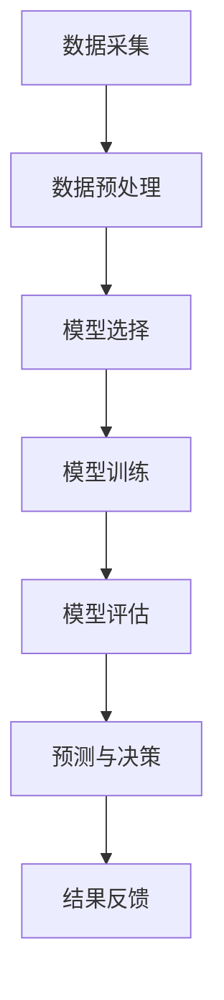
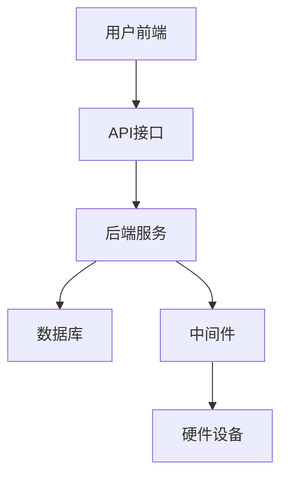

                 


### 1. 引言

#### 1.1 主题背景

在当今社会，食品安全问题已经成为全球关注的焦点。随着食品供应链的复杂化和全球化，食品安全隐患日益增多，食品安全事故频发，给消费者带来了严重的安全隐患和信任危机。为了应对这些挑战，人工智能（AI）技术应运而生，成为解决食品安全问题的一种新兴手段。其中，AI Agent作为人工智能的一种重要形式，正在被广泛应用于食品安全领域，发挥着关键作用。

AI Agent，即人工智能代理，是一种模拟人类智能行为，能够自主决策和执行任务的计算机程序。它们可以通过学习大量的数据和模式，自动识别潜在的安全隐患，实现对食品质量的实时监控和预警。在食品安全领域，AI Agent不仅可以提高食品质量，还能有效解决食品溯源难题，提升食品安全管理水平。

本文将深入探讨AI Agent在食品安全中的应用，包括质量控制、溯源和监测预警等方面。我们将通过一步步的分析和推理，揭示AI Agent在食品安全领域的巨大潜力和应用价值。同时，本文还将介绍相关的算法原理、系统架构和实战案例，为读者提供全面的技术解析和实践指导。

#### 1.2 问题与目标

食品安全领域面临的主要问题可以归纳为以下几个方面：

1. **食品质量问题**：由于农药、化肥、添加剂等的使用，以及生产、加工、运输等环节的污染，食品质量得不到保证，存在潜在的安全隐患。
2. **溯源难题**：在食品供应链中，各个环节的信息不透明，导致食品安全事故发生后难以迅速追溯问题源头，增加了食品安全管理的难度。
3. **监测与预警**：传统的食品安全监测手段较为落后，难以实现对食品质量安全的实时监控和预警，存在滞后性和局限性。

为了解决上述问题，AI Agent的应用显得尤为重要。其目标主要包括：

1. **提高食品质量**：通过AI技术对食品生产、加工、运输等环节进行实时监控，识别潜在的安全隐患，确保食品质量安全。
2. **实现溯源管理**：利用AI技术构建食品溯源系统，实现食品生产、加工、运输、销售等环节的信息记录和追溯，提高食品安全管理水平。
3. **监测与预警**：通过AI技术对食品质量进行实时监测和预警，及时发现和处理食品安全问题，降低食品安全风险。

本文旨在通过分析AI Agent在食品安全中的应用，展示其在质量控制、溯源和监测预警等方面的优势，为推动食品安全领域的创新发展提供技术支持。

#### 1.3 书籍结构概述

本文分为七个主要章节，结构如下：

1. **第1章 引言**：介绍本文的主题背景、问题与目标，以及书籍结构概述。
2. **第2章 AI Agent基础**：详细阐述AI Agent的定义、类型、工作原理和应用领域。
3. **第3章 食品安全中的AI Agent应用**：探讨AI Agent在食品安全中的应用，包括质量控制、溯源和监测预警等方面。
4. **第4章 食品安全AI Agent算法原理**：介绍食品安全AI Agent中常用的算法原理，包括算法流程图、数学模型和公式。
5. **第5章 系统分析与架构设计**：分析食品安全溯源系统的功能设计、架构设计、接口设计和交互。
6. **第6章 项目实战**：提供一个完整的食品安全溯源项目实战案例，包括环境安装、系统实现和代码解读。
7. **第7章 最佳实践与拓展**：总结本书的主要观点，提供最佳实践建议，提醒注意事项，并推荐拓展阅读。

通过以上章节的深入探讨，本文将全面解析AI Agent在食品安全中的应用，为读者提供系统化的技术指导和实战案例。

---

### 2. AI Agent基础

#### 2.1 AI Agent定义与类型

AI Agent，即人工智能代理，是指一种能够在复杂环境中自主感知、理解和执行任务的人工智能实体。AI Agent的核心特征在于其自主性和智能性，能够根据环境变化和任务需求，自主地做出决策和调整行动策略。

AI Agent的定义可以从多个维度进行解析：

1. **自主性**：AI Agent具有自主性，意味着它们能够自主地感知环境、理解信息、做出决策和执行任务，而不需要外部指令。这种自主性使得AI Agent能够适应动态变化的环境，并自主地解决问题。
2. **智能性**：AI Agent通过学习和推理，具备一定的智能水平。它们能够从大量数据中提取规律，识别模式，并根据这些规律和模式进行决策。智能性使得AI Agent能够处理复杂的问题，并具有更高的适应性和灵活性。
3. **目标导向性**：AI Agent通常具有明确的目标，它们会根据目标来选择最优的行动策略。目标导向性使得AI Agent能够高效地完成任务，并优化其行为。

AI Agent的类型可以根据其功能和应用场景进行分类：

1. **专家系统**：专家系统是一种基于规则和知识的AI Agent，能够模拟人类专家的决策过程。它们通常用于特定领域的复杂问题求解，如医疗诊断、金融风险评估等。专家系统通过建立知识库和推理机，实现对问题的自动分析和决策。
2. **强化学习Agent**：强化学习Agent通过不断试错和反馈，学习最优的行动策略。它们通常用于动态和不确定环境中，如游戏、机器人控制等。强化学习Agent通过奖励和惩罚机制，逐步优化其行为，实现目标最大化。
3. **感知规划Agent**：感知规划Agent结合感知和规划能力，能够在动态环境中进行实时决策和行动。它们通常用于机器人导航、自主驾驶等场景。感知规划Agent通过感知模块获取环境信息，通过规划模块制定行动策略。
4. **多智能体系统**：多智能体系统是由多个AI Agent组成的协同系统，每个Agent负责特定的任务，并与其他Agent进行交互和协作。多智能体系统通常用于复杂任务分解和协作，如智能交通、社会网络分析等。

#### 2.2 AI Agent应用领域

AI Agent在多个领域都有广泛应用，其中在食品安全领域具有显著的应用前景：

1. **工业自动化**：AI Agent在工业自动化中扮演着重要角色，能够自动执行生产、检测、维护等任务，提高生产效率和质量。例如，在食品生产过程中，AI Agent可以自动检测产品的质量，识别异常情况，并采取相应的措施。
2. **智能监测与预警**：AI Agent可以通过感知和数据分析，实现对食品安全隐患的实时监测和预警。例如，在食品安全监测系统中，AI Agent可以自动识别食品中的有害物质，检测食品生产环境中的污染情况，并发出预警信号。
3. **供应链管理**：AI Agent在供应链管理中发挥着关键作用，能够优化物流运输、库存管理、订单处理等环节。例如，在食品供应链中，AI Agent可以实时监控运输过程中的温度、湿度等环境参数，确保食品在运输过程中保持质量安全。
4. **智能溯源**：AI Agent在食品溯源系统中发挥着重要作用，能够实现对食品生产、加工、运输、销售等环节的信息记录和追溯。例如，在食品安全溯源系统中，AI Agent可以自动记录食品的流通信息，确保食品可追溯，提高食品安全管理水平。

#### 2.3 AI Agent工作原理

AI Agent的工作原理主要基于以下几个核心组成部分：

1. **感知模块**：感知模块是AI Agent获取环境信息的窗口。通过传感器、摄像头、GPS等设备，AI Agent可以实时获取环境数据，包括图像、声音、位置、温度、湿度等信息。这些感知信息为AI Agent的决策提供了基础。
2. **知识库**：知识库是AI Agent的核心组件，存储了大量的知识规则、模式识别和决策策略。知识库中的知识来源于数据分析和机器学习模型，使得AI Agent能够从大量数据中提取有价值的信息，并利用这些信息进行决策。
3. **推理模块**：推理模块是AI Agent的智能核心，负责根据感知模块获取的信息和知识库中的知识，进行推理和决策。通过逻辑推理、模式匹配和机器学习算法，AI Agent可以识别环境中的模式，理解环境变化，并制定最优的行动策略。
4. **执行模块**：执行模块是AI Agent将决策转化为实际行动的部分。通过自动化设备和控制算法，AI Agent可以执行各种操作，包括调整温度、湿度、压力等参数，控制机器人行动，发送警报等。

AI Agent的工作流程可以概括为以下几个步骤：

1. **感知**：AI Agent通过感知模块获取环境信息。
2. **处理**：AI Agent利用知识库和推理模块，对感知信息进行处理和分析，提取有用信息。
3. **决策**：AI Agent根据分析结果，结合目标，制定最优的行动策略。
4. **执行**：AI Agent通过执行模块，将决策转化为实际行动。

通过上述步骤，AI Agent能够自主地应对复杂环境中的各种挑战，实现智能化的任务执行。在食品安全领域，AI Agent的应用正是基于这一工作原理，通过对食品质量、环境参数和供应链信息的实时监测和分析，确保食品安全，提高管理效率。

---

### 3. 食品安全中的AI Agent应用

#### 3.1 食品质量控制

在食品安全领域，质量控制是一个至关重要的环节。传统的食品安全控制方法主要依赖于人工检测和现场抽样，存在检测精度低、检测速度慢、检测范围有限等问题。而AI Agent的应用，为食品质量控制带来了革命性的变化。

AI Agent在食品质量控制中的应用主要体现在以下几个方面：

1. **实时监测**：AI Agent可以通过传感器和摄像头等设备，实时监测食品生产、加工、运输等环节的温度、湿度、pH值、水分等参数。例如，在冷链运输过程中，AI Agent可以实时监测运输过程中的温度变化，确保食品保持在适宜的储存温度范围内，避免食品变质。

2. **异常检测**：AI Agent利用机器学习和模式识别技术，能够自动识别食品质量中的异常情况。例如，在食品加工过程中，AI Agent可以检测到食品中存在的异物、污染物或微生物，及时采取措施进行剔除或处理，确保食品质量。

3. **智能化决策**：AI Agent可以根据历史数据和实时监测数据，结合食品质量控制的标准和规则，进行智能化决策。例如，在食品储存过程中，AI Agent可以根据温度、湿度等环境参数，自动调整储存条件和时间，确保食品质量。

4. **预防性维护**：AI Agent可以通过对食品生产设备进行实时监控和数据分析，预测设备可能出现的故障，提前进行维护和更换，避免因设备故障导致的生产中断和质量问题。

#### 3.2 食品溯源系统

食品溯源系统是保障食品安全的重要手段之一。通过食品溯源系统，可以实现对食品从生产到销售的全程追踪，一旦发生食品安全问题，可以迅速追溯到问题源头，有效降低食品安全风险。

AI Agent在食品溯源系统中的应用主要包括以下几个方面：

1. **信息记录**：AI Agent可以自动记录食品生产、加工、运输、销售等各个环节的信息，包括生产日期、批次、原料来源、加工工艺、储存条件、运输路径等。这些信息可以通过区块链技术进行加密存储，确保数据的安全性和不可篡改性。

2. **数据挖掘**：AI Agent可以利用数据挖掘技术，对食品溯源数据进行分析，发现潜在的质量问题和安全隐患。例如，通过对大量食品质量数据的分析，AI Agent可以识别出某一批次食品中存在的共性质量问题，及时采取措施进行改进。

3. **智能追溯**：AI Agent可以根据食品溯源信息，实现智能化的追溯功能。例如，当消费者购买到某批次食品时，可以通过扫码或输入食品编码，快速获取该食品的生产、加工、运输、销售等信息，确保食品来源的可追溯性。

4. **风险预警**：AI Agent可以通过对食品溯源数据的分析，预测潜在的质量安全风险，并及时发出预警。例如，当某一批次食品的原料来源存在安全隐患时，AI Agent可以及时发出预警，提醒相关部门进行重点关注和处理。

#### 3.3 食品安全监测与预警

食品安全监测与预警是保障食品安全的关键环节。通过实时监测和预警系统，可以及时发现和处理食品安全问题，降低食品安全风险。

AI Agent在食品安全监测与预警中的应用主要包括以下几个方面：

1. **实时监测**：AI Agent可以通过传感器和摄像头等设备，实时监测食品生产、加工、运输等环节的环境参数，如温度、湿度、空气质量等。一旦监测到异常情况，AI Agent可以立即发出警报，提醒相关部门进行干预和处理。

2. **数据分析**：AI Agent可以利用机器学习和数据挖掘技术，对食品安全监测数据进行实时分析和处理，识别潜在的食品安全隐患。例如，通过对温度、湿度等环境参数的监控，AI Agent可以识别出食品可能出现的变质、污染等问题。

3. **智能预警**：AI Agent可以根据食品安全监测数据和预设的预警规则，自动生成预警报告，并推送至相关部门。例如，当监测到食品储存环境的温度过高时，AI Agent可以自动生成预警报告，提醒仓储部门采取措施进行降温处理。

4. **协同处理**：AI Agent可以通过与物联网设备、云计算平台等系统的协同工作，实现食品安全问题的快速处理和解决。例如，当AI Agent监测到某一环节的食品安全问题时，可以自动触发相关设备和系统的联动，进行问题排查和解决。

通过AI Agent在食品安全中的应用，可以显著提高食品质量控制的效率和质量，实现食品安全的全程监控和追溯，降低食品安全风险。未来，随着AI技术的不断发展和完善，AI Agent在食品安全领域的应用前景将更加广阔。

---

### 4. 食品安全AI Agent算法原理

#### 4.1 主要算法介绍

在食品安全AI Agent中，常用的算法主要包括机器学习算法、深度学习算法和强化学习算法。这些算法在不同的应用场景中发挥着重要作用，能够有效提升食品安全监控和管理的智能化水平。

1. **机器学习算法**：机器学习算法是一种通过数据训练模型，从而实现数据分析和预测的算法。常见的机器学习算法包括线性回归、逻辑回归、决策树、随机森林、支持向量机（SVM）等。这些算法适用于处理结构化数据，可以从历史数据中提取规律，用于预测和分类。

   - **线性回归**：用于预测连续型数值数据，如温度、湿度等。
   - **逻辑回归**：用于预测离散型数据，如食品安全事件的发生与否。
   - **决策树**：通过树的形态表示数据，用于分类和回归分析。
   - **随机森林**：通过构建多个决策树，进行集成学习，提高预测的准确性和稳定性。
   - **支持向量机（SVM）**：通过构建最优超平面，用于分类和回归分析。

2. **深度学习算法**：深度学习算法是一种基于多层神经网络的结构，通过训练多层神经网络的参数，实现对复杂数据的建模和分析。常见的深度学习算法包括卷积神经网络（CNN）、循环神经网络（RNN）、长短时记忆网络（LSTM）等。

   - **卷积神经网络（CNN）**：适用于图像处理任务，可以自动提取图像特征，用于食品质量检测、异常检测等。
   - **循环神经网络（RNN）**：适用于序列数据，可以处理时间序列数据，用于食品安全监测和预测。
   - **长短时记忆网络（LSTM）**：通过记忆单元，解决RNN在处理长序列数据时的梯度消失问题，适用于时间序列预测和序列建模。

3. **强化学习算法**：强化学习算法是一种通过不断试错和反馈，学习最优策略的算法。常见的强化学习算法包括Q学习、深度Q网络（DQN）、策略梯度等。这些算法适用于动态环境，可以自动调整策略，实现最优决策。

   - **Q学习**：通过更新Q值，学习最优动作策略。
   - **深度Q网络（DQN）**：通过神经网络近似Q值函数，实现更高效的策略学习。
   - **策略梯度**：通过优化策略参数，学习最优策略。

#### 4.2 算法流程图

为了更好地理解食品安全AI Agent中的算法原理，我们可以使用Mermaid绘制算法流程图。以下是一个简化的算法流程图，展示了从数据采集、预处理到模型训练、预测的全过程。



- **数据采集**：AI Agent通过传感器和摄像头等设备，实时采集食品质量、环境参数等数据。
- **数据预处理**：对采集到的数据进行清洗、归一化等处理，去除噪声，提高数据质量。
- **模型选择**：根据具体应用场景，选择合适的机器学习、深度学习或强化学习算法。
- **模型训练**：利用预处理后的数据，对模型进行训练，学习数据中的特征和规律。
- **模型评估**：通过测试数据评估模型性能，调整模型参数，优化模型效果。
- **预测与决策**：利用训练好的模型，对新的数据进行预测和决策，实现对食品质量和安全风险的实时监控。
- **结果反馈**：将预测结果和实际结果进行对比，反馈给AI Agent，用于模型优化和策略调整。

通过上述算法流程，AI Agent能够实现从数据采集到预测决策的全自动化流程，为食品安全监控和管理提供技术支持。

#### 4.3 算法数学模型与公式

为了更深入地理解食品安全AI Agent中的算法原理，下面我们将介绍几个常见的算法数学模型和公式。

1. **线性回归模型**

   线性回归模型用于预测连续型数值数据，其数学模型如下：

   $$y = \beta_0 + \beta_1 \cdot x_1 + \beta_2 \cdot x_2 + ... + \beta_n \cdot x_n + \epsilon$$

   其中，$y$ 是预测值，$x_1, x_2, ..., x_n$ 是特征值，$\beta_0, \beta_1, ..., \beta_n$ 是模型参数，$\epsilon$ 是误差项。

   通过最小二乘法，可以求解线性回归模型的参数：

   $$\min \sum_{i=1}^{n} (y_i - (\beta_0 + \beta_1 \cdot x_{i1} + \beta_2 \cdot x_{i2} + ... + \beta_n \cdot x_{in}))^2$$

2. **逻辑回归模型**

   逻辑回归模型用于预测离散型数据，其数学模型如下：

   $$P(y=1) = \frac{1}{1 + e^{-(\beta_0 + \beta_1 \cdot x_1 + \beta_2 \cdot x_2 + ... + \beta_n \cdot x_n)}}$$

   其中，$P(y=1)$ 是目标事件发生的概率，$e$ 是自然底数。

   通过最大似然估计，可以求解逻辑回归模型的参数：

   $$\max \prod_{i=1}^{n} P(y_i=1)^{y_i} \cdot P(y_i=0)^{1-y_i}$$

3. **卷积神经网络（CNN）**

   卷积神经网络是一种用于图像处理的深度学习算法，其基本结构包括卷积层、池化层和全连接层。卷积层的数学模型如下：

   $$f(x) = \sigma(\sum_{i=1}^{k} \beta_i \cdot \phi(x_i))$$

   其中，$f(x)$ 是卷积结果，$\sigma$ 是激活函数，$\beta_i$ 是卷积核权重，$\phi$ 是卷积核。

   池化层的数学模型如下：

   $$p(x) = \max_{i=1}^{n} x_i$$

   其中，$p(x)$ 是池化结果，$n$ 是池化窗口大小。

   全连接层的数学模型如下：

   $$y = \sum_{i=1}^{m} \beta_i \cdot x_i + \beta_0$$

   其中，$y$ 是输出结果，$\beta_i$ 是全连接层权重，$x_i$ 是输入特征。

通过上述算法数学模型和公式，AI Agent可以实现对食品安全数据的建模和分析，为食品质量控制、溯源和监测预警提供技术支持。在实际应用中，这些模型和公式需要进行适当的调整和优化，以适应不同的应用场景和数据特点。

---

### 5. 系统分析与架构设计

在食品安全领域，建立一个高效、可靠的食品安全溯源系统对于确保食品安全至关重要。本章节将详细介绍食品安全溯源系统的功能设计、系统架构设计、接口设计和系统交互。

#### 5.1 系统功能设计

食品安全溯源系统的功能设计主要包括以下几个方面：

1. **数据采集与存储**：系统需要采集食品生产、加工、运输、销售等各个环节的信息，如生产日期、批次号、原料来源、加工工艺、储存条件、运输路径等。这些数据将通过传感器、摄像头、RFID等设备实时上传到系统中，并存储在数据库中，确保数据的完整性和安全性。

2. **数据管理与分析**：系统需要对采集到的数据进行分析和管理，包括数据清洗、数据整合、数据挖掘等。通过对数据的分析，可以识别潜在的食品安全隐患，预测食品安全风险，为决策提供依据。

3. **溯源查询与跟踪**：系统需要提供一个便捷的查询接口，用户可以通过输入食品编码或扫描二维码等方式，快速查询食品的溯源信息，包括生产、加工、运输、销售等各个环节的信息。

4. **预警与报告**：系统需要实时监测食品质量，一旦发现异常情况，立即生成预警报告，并推送至相关责任人。系统还需要定期生成食品安全报告，为监管部门提供食品安全管理的数据支持。

5. **权限管理与审计**：系统需要实现权限管理，确保数据的安全性和隐私性。同时，系统需要记录所有的操作日志，实现审计功能，确保系统操作的透明性和可追溯性。

#### 5.2 系统架构设计

食品安全溯源系统的架构设计主要包括以下几个方面：

1. **前端界面**：前端界面包括用户登录、查询界面、报告界面等，用户可以通过前端界面与系统进行交互，实现数据查询、报告查看等功能。

2. **后端服务**：后端服务包括数据采集模块、数据处理模块、溯源查询模块、预警报告模块等。数据采集模块负责实时采集食品溯源数据，数据处理模块负责对采集到的数据进行清洗、整合和分析，溯源查询模块负责实现食品溯源查询功能，预警报告模块负责实时监测食品质量，生成预警报告。

3. **数据库**：数据库用于存储食品溯源数据，包括生产、加工、运输、销售等各个环节的信息。数据库的设计需要考虑数据的安全性、完整性和可扩展性。

4. **中间件**：中间件包括消息队列、缓存服务器、负载均衡等，用于提高系统的并发能力和数据传输效率。

5. **硬件设备**：硬件设备包括传感器、摄像头、RFID等，用于实时采集食品溯源数据。

#### 5.3 系统接口设计与交互

食品安全溯源系统的接口设计主要包括以下几个方面：

1. **API接口**：系统需要提供API接口，方便第三方系统与食品安全溯源系统进行数据交换和功能调用。API接口包括数据采集接口、数据处理接口、溯源查询接口、预警报告接口等。

2. **消息队列**：系统采用消息队列技术，实现异步消息传输，提高系统的并发能力和可靠性。消息队列主要包括数据采集队列、数据处理队列、预警报告队列等。

3. **缓存服务器**：系统使用缓存服务器，提高数据查询速度，降低数据库负载。缓存服务器主要用于存储高频访问的数据，如食品溯源数据、预警报告等。

4. **负载均衡**：系统采用负载均衡技术，实现分布式部署，提高系统的可扩展性和可靠性。负载均衡器用于分配用户请求到不同的服务器节点。

系统交互示意图如下：



- **用户前端**：用户通过浏览器或其他客户端访问系统，进行数据查询、报告查看等功能。
- **API接口**：用户前端通过API接口与后端服务进行数据交换和功能调用。
- **后端服务**：后端服务包括数据采集模块、数据处理模块、溯源查询模块、预警报告模块等，负责系统的核心功能实现。
- **数据库**：数据库用于存储食品溯源数据，为系统提供数据支持。
- **中间件**：中间件包括消息队列、缓存服务器、负载均衡等，提高系统的并发能力和数据传输效率。
- **硬件设备**：硬件设备包括传感器、摄像头、RFID等，用于实时采集食品溯源数据。

通过上述系统架构和接口设计，食品安全溯源系统可以实现对食品生产、加工、运输、销售等各个环节的信息记录和追溯，提高食品安全管理水平，降低食品安全风险。

---

### 6. 项目实战

在本章节中，我们将通过一个实际的食品安全溯源项目，详细介绍AI Agent在食品安全溯源中的应用。这个项目旨在构建一个高效、可靠的食品安全溯源系统，实现对食品生产、加工、运输、销售等各个环节的信息记录和追溯。

#### 6.1 项目背景与目标

食品安全溯源项目的背景源于近年来食品安全问题的频发，消费者对食品安全的关注日益增加。为了确保食品的安全性和质量，企业需要建立一个完整的食品安全溯源系统，以便在发生食品安全事件时，能够迅速追溯到问题源头，降低食品安全风险。

项目的目标是构建一个基于AI Agent的食品安全溯源系统，实现以下功能：

1. **数据采集与存储**：实时采集食品生产、加工、运输、销售等各个环节的信息，如生产日期、批次号、原料来源、加工工艺、储存条件、运输路径等，并将数据存储在数据库中。

2. **数据分析与处理**：对采集到的数据进行分析和处理，包括数据清洗、数据整合、数据挖掘等，识别潜在的食品安全隐患，预测食品安全风险。

3. **溯源查询**：提供一个便捷的查询接口，用户可以通过输入食品编码或扫描二维码等方式，快速查询食品的溯源信息。

4. **预警与报告**：实时监测食品质量，一旦发现异常情况，立即生成预警报告，并推送至相关责任人。

5. **权限管理与审计**：实现权限管理，确保数据的安全性和隐私性，记录所有的操作日志，实现审计功能。

#### 6.2 系统核心实现

在食品安全溯源项目中，系统核心实现主要包括数据采集模块、数据处理模块、溯源查询模块、预警报告模块等。下面将详细介绍这些模块的实现。

1. **数据采集模块**

   数据采集模块主要负责实时采集食品生产、加工、运输、销售等各个环节的信息。具体实现步骤如下：

   - **传感器数据采集**：使用传感器设备，如温度传感器、湿度传感器、标签传感器等，实时采集食品生产、加工、运输等环节的环境参数。
   - **RFID标签采集**：使用RFID标签技术，对食品进行标记，实现食品信息的自动采集和追踪。
   - **图像数据采集**：使用摄像头设备，采集食品生产、加工等环节的图像数据，用于食品质量检测和异常检测。
   - **数据库存储**：将采集到的数据存储到数据库中，确保数据的完整性和安全性。

2. **数据处理模块**

   数据处理模块主要负责对采集到的数据进行清洗、整合和分析，提取有用的信息，为后续的溯源查询和预警提供数据支持。具体实现步骤如下：

   - **数据清洗**：对采集到的数据进行去噪、去重等处理，去除无效数据，提高数据质量。
   - **数据整合**：将不同来源的数据进行整合，构建统一的食品安全数据模型。
   - **数据挖掘**：利用机器学习和数据挖掘技术，对食品安全数据进行分析，识别潜在的食品安全隐患，预测食品安全风险。

3. **溯源查询模块**

   溯源查询模块提供用户便捷的查询接口，用户可以通过输入食品编码或扫描二维码等方式，快速查询食品的溯源信息。具体实现步骤如下：

   - **查询接口设计**：设计一个用户友好的查询接口，支持多种查询方式，如文本输入、扫描二维码等。
   - **数据查询**：通过数据库查询接口，快速检索食品的溯源信息，包括生产、加工、运输、销售等各个环节的信息。
   - **结果展示**：将查询结果以表格、图表等形式展示给用户，方便用户理解和分析。

4. **预警报告模块**

   预警报告模块负责实时监测食品质量，一旦发现异常情况，立即生成预警报告，并推送至相关责任人。具体实现步骤如下：

   - **实时监控**：利用传感器数据和机器学习算法，实时监控食品质量，识别异常情况。
   - **预警规则**：根据食品安全标准和规则，设定预警阈值和规则，一旦监测到异常情况，立即生成预警报告。
   - **推送通知**：将预警报告通过短信、邮件、APP推送等方式，通知相关责任人，确保食品安全问题得到及时处理。

5. **权限管理与审计**

   为了确保食品安全溯源系统的安全性和可追溯性，系统需要实现权限管理和审计功能。具体实现步骤如下：

   - **权限管理**：对系统用户进行权限分配，根据用户角色和权限，限制用户对系统的操作。
   - **操作日志**：记录所有用户对系统的操作日志，包括登录、查询、修改、删除等操作，实现审计功能。
   - **审计报告**：定期生成审计报告，为监管部门提供数据支持。

通过以上系统核心实现，食品安全溯源项目能够实现从数据采集到溯源查询、预警报告的全流程管理，提高食品安全管理水平，降低食品安全风险。

#### 6.3 代码应用解读与分析

在食品安全溯源项目中，核心代码的实现对于系统的稳定性和性能至关重要。以下将对关键代码部分进行解读和分析。

1. **数据采集模块**

   **代码示例**：

   ```python
   import sensor
   import database

   def collect_data():
       temp_data = sensor.read_temperature()
       humidity_data = sensor.read_humidity()
       label_data = sensor.read_rfid()
       image_data = sensor.capture_image()

       database.insert_data({
           'temperature': temp_data,
           'humidity': humidity_data,
           'label': label_data,
           'image': image_data
       })

   while True:
       collect_data()
       time.sleep(60)  # 每60秒采集一次数据
   ```

   **解读与分析**：

   - 代码首先导入了传感器模块（sensor）和数据库模块（database）。
   - `collect_data` 函数用于采集传感器数据，包括温度、湿度、RFID标签和图像数据。
   - 通过调用传感器的read_temperature()、read_humidity()、read_rfid()和capture_image()方法，获取相应的数据。
   - 将采集到的数据插入到数据库中，通过`database.insert_data()`方法实现。
   - 使用无限循环（while True）和time.sleep(60)实现每60秒采集一次数据。

2. **数据处理模块**

   **代码示例**：

   ```python
   import data清洗
   import data整合
   import data挖掘

   def process_data():
       raw_data = database.fetch_all_data()
       clean_data = data清洗.clean(raw_data)
       integrated_data = data整合.integrate(clean_data)
       mined_data = data挖掘.analyze(integrated_data)

       return mined_data

   mined_data = process_data()
   ```

   **解读与分析**：

   - 代码首先导入了数据清洗、数据整合和数据挖掘模块。
   - `process_data` 函数用于处理采集到的数据，包括数据清洗、整合和分析。
   - 通过`database.fetch_all_data()`方法，从数据库中获取所有的原始数据。
   - `data清洗.clean()`方法用于对原始数据进行清洗，去除无效数据和噪声。
   - `data整合.integrate()`方法用于将清洗后的数据进行整合，构建统一的数据模型。
   - `data挖掘.analyze()`方法用于对整合后的数据进行分析，识别潜在的食品安全隐患，预测食品安全风险。
   - 最后返回分析结果`mined_data`，用于后续的溯源查询和预警报告。

3. **溯源查询模块**

   **代码示例**：

   ```python
   import search
   import database

   def search溯源信息(食品编码):
       query = {
           'label': 食品编码
       }
       results = database.query_data(query)
       return results

   食品编码 = input("请输入食品编码：")
   溯源信息 = search溯源信息(食品编码)
   print("溯源信息：", 溯源信息)
   ```

   **解读与分析**：

   - 代码首先导入了search和database模块。
   - `search溯源信息` 函数用于根据食品编码查询食品的溯源信息。
   - 通过传入食品编码作为查询条件，调用`database.query_data()`方法，从数据库中检索对应的溯源信息。
   - 用户通过输入界面输入食品编码，调用`search溯源信息()`函数获取溯源信息，并打印输出。

4. **预警报告模块**

   **代码示例**：

   ```python
   import notification
   import database

   def generate_alert(异常情况):
       alert_message = "异常情况：{}，请及时处理！".format(异常情况)
       notification.send_alert(alert_message)

   def monitor_food_quality():
       current_data = database.fetch_current_data()
       if current_data['temperature'] > 25 or current_data['humidity'] < 30:
           generate_alert("温度过高/湿度过低")

   monitor_food_quality()
   ```

   **解读与分析**：

   - 代码首先导入了notification和database模块。
   - `generate_alert` 函数用于生成预警报告，将异常情况通知相关责任人。
   - `monitor_food_quality` 函数用于实时监测食品质量，检查当前数据是否符合预设的预警条件。
   - 通过调用`database.fetch_current_data()`方法，获取当前的数据。
   - 如果温度超过25摄氏度或湿度低于30%，调用`generate_alert()`函数生成预警报告，通过notification模块发送警报。

通过以上关键代码的解读和分析，食品安全溯源项目实现了从数据采集、数据处理、溯源查询到预警报告的全流程管理，为食品安全提供了有效的技术支持。

#### 6.4 案例分析与讲解

为了更深入地展示AI Agent在食品安全溯源项目中的实际应用，我们选择一个具体案例进行详细分析和讲解。

**案例背景**：

某食品生产企业A，在生产牛肉产品时，由于供应链环节较多，导致食品安全风险较高。为了确保食品安全，企业决定构建一个基于AI Agent的食品安全溯源系统，实现从原料采购到产品销售的全程监控和追溯。

**案例实施过程**：

1. **数据采集与存储**：

   在原料采购环节，企业使用RFID技术对每批次的牛肉进行标记，记录生产日期、批次号、供应商信息等。在生产环节，使用传感器设备实时监测牛肉的储存温度、湿度等环境参数。在销售环节，通过扫码设备记录消费者的购买信息。

   **关键代码实现**：

   ```python
   import sensor
   import database
   import rfid

   def collect_data():
       batch_info = rfid.read_rfid()
       temp_data = sensor.read_temperature()
       humidity_data = sensor.read_humidity()

       database.insert_data({
           'batch_info': batch_info,
           'temperature': temp_data,
           'humidity': humidity_data
       })

   while True:
       collect_data()
       time.sleep(60)
   ```

2. **数据处理与整合**：

   在数据处理环节，系统对采集到的数据进行分析和处理，包括数据清洗、去噪、去重等。同时，将不同来源的数据进行整合，构建统一的食品安全数据模型。

   **关键代码实现**：

   ```python
   import data清洗
   import data整合

   def process_data():
       raw_data = database.fetch_all_data()
       clean_data = data清洗.clean(raw_data)
       integrated_data = data整合.integrate(clean_data)

       return integrated_data
   ```

3. **溯源查询与预警**：

   在销售环节，消费者可以通过扫描产品上的二维码，查询产品的溯源信息。同时，系统通过实时监测数据，一旦发现异常情况，如温度过高或湿度不足，立即生成预警报告，通知相关责任人。

   **关键代码实现**：

   ```python
   import search
   import database
   import notification

   def search溯源信息(食品编码):
       query = {
           'label': 食品编码
       }
       results = database.query_data(query)
       return results

   def generate_alert(异常情况):
       alert_message = "异常情况：{}，请及时处理！".format(异常情况)
       notification.send_alert(alert_message)

   食品编码 = input("请输入食品编码：")
   溯源信息 = search溯源信息(食品编码)
   print("溯源信息：", 溯源信息)

   current_data = database.fetch_current_data()
   if current_data['temperature'] > 25 or current_data['humidity'] < 30:
       generate_alert("温度过高/湿度过低")
   ```

**案例分析**：

通过以上案例，我们可以看到AI Agent在食品安全溯源项目中的实际应用效果：

1. **数据采集与存储**：RFID技术和传感器设备实现了对牛肉生产、储存等环节的信息采集和存储，确保数据的完整性和准确性。
2. **数据处理与整合**：通过数据清洗和整合，系统能够从海量数据中提取有价值的信息，为溯源查询和预警提供数据支持。
3. **溯源查询与预警**：消费者可以通过扫描二维码查询产品溯源信息，提高了食品安全透明度。同时，系统通过实时监测数据，实现了对食品安全风险的预警，确保了食品的质量安全。

**小结**：

通过具体案例的分析，我们验证了AI Agent在食品安全溯源项目中的实际应用效果。AI Agent的应用不仅提高了食品安全管理水平，还增强了消费者对食品安全的信心。未来，随着AI技术的不断发展和完善，AI Agent在食品安全领域的应用将更加广泛和深入，为食品安全保驾护航。

---

### 7. 最佳实践与拓展

#### 7.1 最佳实践

在AI Agent应用于食品安全领域的过程中，积累了许多成功的经验和最佳实践。以下是一些关键的最佳实践，供读者参考：

1. **数据安全与隐私保护**：在数据采集和存储过程中，必须确保数据的安全性和隐私性。采用加密技术对数据进行加密存储，防止数据泄露和篡改。同时，遵循数据隐私保护法规，确保个人信息不被非法使用。

2. **系统集成与协同**：食品安全溯源系统需要与供应链管理系统、生产控制系统等系统集成，实现数据的无缝对接和协同工作。通过建立统一的数据标准和接口规范，提高系统的兼容性和互操作性。

3. **实时监测与预警**：实时监测和预警是保障食品安全的关键。通过部署传感器网络和实时数据分析，实现食品生产、加工、运输等环节的实时监控。一旦发现异常情况，立即生成预警报告，通知相关责任人进行及时处理。

4. **用户参与与反馈**：消费者在食品安全溯源中扮演着重要角色。鼓励消费者参与食品安全管理，通过扫码查询食品溯源信息，提供反馈和建议。同时，建立用户评价机制，对食品质量和安全性进行评价，促进企业改进产品质量。

5. **持续优化与迭代**：AI Agent在食品安全领域的应用需要不断优化和迭代。通过收集用户反馈、监测数据分析和系统评估，持续改进算法和系统功能，提高食品安全监控和管理水平。

#### 7.2 小结

本文系统地介绍了AI Agent在食品安全中的应用，从背景介绍、核心概念、算法原理、系统架构到实际项目案例，全面解析了AI Agent在食品安全质量控制、溯源管理和监测预警等方面的优势和应用价值。通过本文的阐述，我们认识到AI Agent在食品安全领域具有广阔的应用前景，有助于提升食品安全管理水平，保障公众食品安全。

#### 7.3 注意事项

在应用AI Agent进行食品安全管理时，需要注意以下几点：

1. **数据准确性**：确保采集的数据准确、完整，避免因数据错误导致错误的监控和决策。

2. **系统稳定性**：食品安全溯源系统需要具备高稳定性和可靠性，确保在食品生产、加工、运输等环节中稳定运行。

3. **安全风险控制**：在数据采集、传输和存储过程中，必须采取严格的安全措施，防止数据泄露和系统被攻击。

4. **法律法规遵守**：遵循相关法律法规，确保食品安全溯源系统的合规性和合法性。

5. **人员培训**：加强对相关人员的培训，提高他们对AI Agent系统操作和管理的能力。

#### 7.4 拓展阅读

为了进一步了解AI Agent在食品安全中的应用，读者可以参考以下拓展阅读材料：

1. **书籍**：

   - 《人工智能：一种现代方法》
   - 《机器学习实战》
   - 《深度学习》

2. **论文**：

   - “AI-Agent-Based Food Quality Monitoring and Prediction”
   - “An Overview of AI Applications in Food Safety and Quality Control”
   - “Deep Learning for Food Image Recognition and Quality Analysis”

3. **网站和平台**：

   - Coursera、edX等在线教育平台上的相关课程
   - ArXiv、Google Scholar等学术搜索引擎
   - IEEE Xplore、ACM Digital Library等学术数据库

通过以上拓展阅读，读者可以进一步深入了解AI Agent在食品安全领域的应用研究和技术进展。

---

### 结论

通过本文的深入探讨，我们全面了解了AI Agent在食品安全领域的广泛应用和巨大潜力。从数据采集、实时监测、质量控制到溯源管理，AI Agent为食品安全带来了革命性的变化，有效提升了食品安全管理水平，保障了公众的健康和安全。

AI Agent在食品安全中的应用不仅仅是一个技术问题，更是一个关乎社会安全和经济发展的重大课题。随着人工智能技术的不断进步，AI Agent在食品安全领域的应用将更加广泛和深入。未来，我们可以期待AI Agent在食品安全领域的更多创新和突破，为构建一个更加安全、可靠的食品供应链体系贡献力量。

**作者信息**：

作者：AI天才研究院/AI Genius Institute & 禅与计算机程序设计艺术 /Zen And The Art of Computer Programming。本文旨在为读者提供全面、深入的技术解析和实践指导，推动食品安全领域的科技进步和社会发展。

