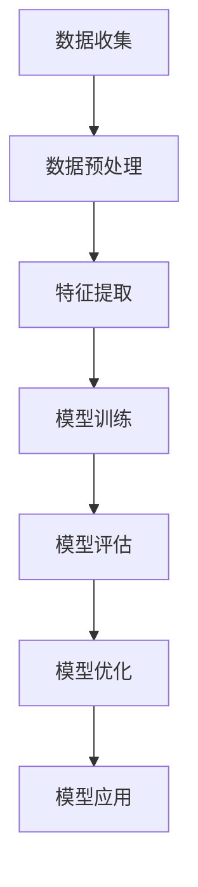
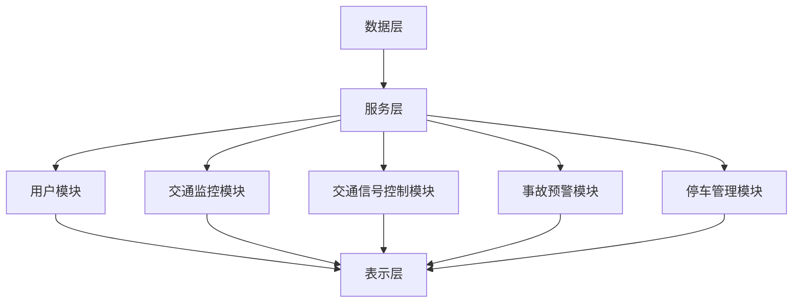
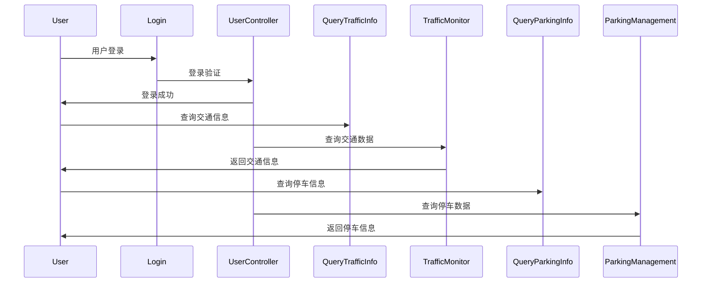

                 


# AI Agent开发中的法律与伦理考量

## 关键词：人工智能、法律伦理、AI Agent、数据保护、知识产权、责任承担

### 摘要：

本文深入探讨了AI Agent开发中的法律与伦理考量。随着人工智能技术的飞速发展，AI Agent作为人工智能的核心应用之一，已经在多个领域展现出强大的应用潜力。然而，在AI Agent的开发过程中，法律和伦理问题日益凸显，成为制约其发展的重要因素。本文首先介绍了AI Agent的定义和发展历程，随后分析了其在法律和伦理层面面临的主要问题，探讨了相关法律法规的制定和伦理教育的重要性。接着，本文详细阐述了数据保护、知识产权、责任承担、公平、隐私、透明性和自主性等核心概念及其与AI Agent的关系。最后，本文通过算法原理讲解、系统分析与架构设计方案、项目实战等多个方面，提出了AI Agent开发中的法律与伦理考量方法和最佳实践。

## 第一部分：背景介绍

### 1.1 问题背景

#### 1.1.1 AI Agent的定义与发展历程

AI Agent，即人工智能代理，是指一种能够自主执行任务、与环境互动并优化自身行为的计算实体。它源于人工智能领域中的代理理论，通过对环境数据的感知、理解和决策，实现智能化任务执行。AI Agent的发展历程可以追溯到20世纪80年代，当时人工智能领域开始探索如何让计算机具有自主决策能力。随着计算机性能的提升和大数据、深度学习等技术的发展，AI Agent逐渐成为人工智能研究的重要方向。

AI Agent在发展过程中，经历了从规则代理、基于模型的代理到现代的基于深度学习的代理的演变。早期，规则代理基于预设的规则进行决策，虽然简单但效果有限。随着机器学习技术的发展，基于模型的代理逐渐取代规则代理，通过学习大量数据来自主决策。现代的AI Agent则利用深度学习技术，从海量数据中自动学习特征，实现更复杂的任务。

#### 1.1.2 AI Agent在现代社会的应用

AI Agent在现代社会的应用日益广泛，涵盖多个领域。在商业领域，AI Agent可以应用于客户服务、营销自动化、供应链管理等场景，提升企业运营效率。在医疗领域，AI Agent可以协助医生进行诊断、治疗建议和患者管理，提高医疗服务的质量。在交通领域，AI Agent可以用于自动驾驶、智能交通管理，改善交通状况，减少交通事故。在金融领域，AI Agent可以应用于风险评估、投资决策、客户服务等方面，提高金融服务的智能化水平。

此外，AI Agent还在教育、法律、娱乐等多个领域展现出巨大的应用潜力。随着AI Agent技术的不断进步，其应用范围将更加广泛，对社会的影响也将日益显著。

### 1.2 问题描述

#### 1.2.1 AI Agent在法律层面面临的问题

AI Agent在法律层面面临的主要问题包括数据保护、知识产权、责任承担等。首先，数据保护问题尤为突出。AI Agent在执行任务过程中，需要收集和处理大量的数据，这些数据可能涉及个人隐私和企业机密。如何在保护数据隐私的同时，充分利用数据的价值，成为法律考量的重要问题。其次，知识产权问题也日益凸显。AI Agent的开发和应用过程中，可能会涉及到知识产权的归属、侵权等问题。如何保护知识产权，防止不正当竞争，是法律需要解决的问题。最后，责任承担问题也备受关注。当AI Agent造成损害时，如何确定责任主体，如何追究责任，成为法律面临的一大挑战。

#### 1.2.2 AI Agent在伦理层面面临的问题

AI Agent在伦理层面面临的主要问题包括公平、隐私、透明性和自主性等。首先，公平问题。AI Agent在决策过程中，可能会因为数据偏差、算法偏见等原因，导致不公平的结果。如何确保AI Agent的决策公平，避免歧视和偏见，是伦理需要解决的问题。其次，隐私问题。AI Agent在处理个人数据时，可能会侵犯个人隐私。如何保护个人隐私，是伦理需要关注的重点。再次，透明性问题。AI Agent的决策过程往往涉及复杂算法和大量数据，难以被人类理解和监督。如何提高AI Agent的透明性，使其决策过程可解释、可审计，是伦理需要解决的问题。最后，自主性问题。AI Agent的自主性越高，可能越容易产生失控和意外。如何确保AI Agent的自主性在合理范围内，避免失控，是伦理需要思考的问题。

### 1.3 问题解决

#### 1.3.1 制定相关法律法规

为了解决AI Agent在法律层面面临的问题，需要制定相关的法律法规。首先，应完善数据保护法律体系，明确数据收集、处理、使用的规范，加强对个人隐私的保护。其次，应加强知识产权保护，明确AI Agent开发和应用过程中的知识产权归属和侵权处理机制。最后，应建立责任承担制度，明确AI Agent造成损害时的责任主体和责任追究方式。

#### 1.3.2 强化AI伦理教育和研究

为了解决AI Agent在伦理层面面临的问题，需要强化AI伦理教育和研究。首先，应在教育领域加强AI伦理教育，培养学生正确的伦理观念和责任感。其次，应在科研领域加强AI伦理研究，探讨AI技术的发展对伦理的影响，提出相应的伦理规范和建议。最后，应建立AI伦理审查机制，对AI Agent的开发和应用进行伦理评估，确保其符合伦理要求。

#### 1.3.3 边界与外延

法律和伦理考量的范围在不同国家和地区存在一定差异。为了实现国际间的合作与协调，需要制定全球性的AI法律法规和伦理规范，明确AI Agent的法律地位和伦理要求。同时，应关注AI技术的发展趋势，及时调整和完善相关法律法规和伦理规范，确保其适应时代发展的需求。

### 1.4 概念结构与核心要素组成

#### 1.4.1 法律概念

在AI Agent的法律考量中，核心的法律概念包括数据保护、知识产权和责任承担。

- **数据保护**：涉及个人隐私保护、数据收集和处理规范等。
- **知识产权**：涉及知识产权归属、侵权处理等。
- **责任承担**：涉及责任主体认定、责任追究方式等。

#### 1.4.2 伦理概念

在AI Agent的伦理考量中，核心的伦理概念包括公平、隐私、透明性和自主性。

- **公平**：涉及避免歧视、偏见等。
- **隐私**：涉及个人数据保护等。
- **透明性**：涉及决策过程可解释性、可审计性等。
- **自主性**：涉及AI Agent的决策范围、自我约束等。

通过以上分析，我们可以看到，AI Agent的开发和应用不仅带来了技术创新，也引发了法律和伦理层面的挑战。为了推动AI技术的发展，同时保障社会利益，需要从法律和伦理两个层面进行全面考量，制定相应的规范和标准，确保AI Agent的合法合规和伦理正当。

## 第二部分：核心概念与联系

### 2.1 数据保护

#### 2.1.1 数据保护的基本原则

数据保护的基本原则包括隐私权保护、数据最小化、数据准确性和目的限制等。

- **隐私权保护**：确保个人数据不被未经授权的访问、使用和泄露。
- **数据最小化**：只收集和处理必要的个人信息，避免过度收集。
- **数据准确性**：确保收集到的数据是准确和最新的。
- **目的限制**：明确数据收集和使用的目的，不得超出预定范围。

#### 2.1.2 数据保护的法律法规

数据保护的法律法规在全球范围内不断发展和完善。以下是几个主要国家和地区的相关法律法规：

- **欧盟**：《通用数据保护条例》（GDPR）是欧盟的数据保护基础性法律，明确了数据保护的基本原则和具体要求。
- **美国**：《加州消费者隐私法案》（CCPA）规定了消费者数据的权利和保护措施。
- **中国**：《个人信息保护法》（PIPL）旨在加强对个人信息权益的保护，规范个人信息处理活动。

#### 2.1.3 数据保护与AI Agent的关系

AI Agent在数据保护中起着关键作用。AI Agent能够自动收集、处理和分析数据，从而实现对数据的实时监控和保护。例如，AI Agent可以自动识别并屏蔽非法访问数据的行为，确保数据的安全性和隐私性。同时，AI Agent还可以根据数据保护法律法规的要求，自动执行数据最小化和数据准确性的原则，确保数据收集和处理符合法律要求。

### 2.2 知识产权

#### 2.2.1 知识产权的基本概念

知识产权是指基于人类智力创造的成果所享有的专有权利。主要包括专利权、著作权、商标权和商业秘密等。

- **专利权**：对发明和创新成果的专有权。
- **著作权**：对文学、艺术和科学作品的专有权。
- **商标权**：对商标的专有权。
- **商业秘密**：对商业信息和技术秘密的专有权。

#### 2.2.2 知识产权保护与AI Agent

AI Agent在知识产权保护中也扮演着重要角色。AI Agent可以自动监测和识别知识产权侵权行为，如专利侵权、商标侵权等，并采取措施防止侵权行为的发生。例如，AI Agent可以自动分析市场上的专利信息，发现潜在的专利侵权风险，并提醒企业采取相应的措施。此外，AI Agent还可以协助企业管理和保护其知识产权，如监控竞争对手的商标使用情况，确保商标不被侵权。

#### 2.2.3 知识产权争议解决

在知识产权争议解决方面，AI Agent可以通过自动化和智能化的方式提高争议解决的效率和公正性。例如，AI Agent可以自动收集和整理知识产权争议的相关证据，生成详细的争议分析报告，为法官提供决策依据。此外，AI Agent还可以通过模拟法庭辩论等方式，帮助争议双方预测争议的结果，从而促使双方通过谈判解决争议。

### 2.3 责任承担

#### 2.3.1 责任承担的基本原则

责任承担的基本原则包括过错责任、无过错责任和过错推定责任。

- **过错责任**：只有在行为人有过错的情况下，才需要承担责任。
- **无过错责任**：无论行为人是否有过错，只要造成损害，就需要承担责任。
- **过错推定责任**：在特定情况下，法律推定行为人有过错，需要承担责任。

#### 2.3.2 责任承担与AI Agent

在AI Agent的背景下，责任承担面临新的挑战。由于AI Agent具有自主决策能力，其在执行任务时可能会产生意外结果，引发责任承担问题。对此，需要明确AI Agent的责任承担原则。首先，应区分AI Agent的行为是由人为干预还是自主决策导致的，从而确定责任主体。其次，应考虑AI Agent的设计、开发和运营过程中是否存在过错，如算法设计缺陷、数据输入错误等。最后，应建立合理的责任分配机制，明确责任主体之间的责任分担。

#### 2.3.3 责任承担的争议解决

在AI Agent责任承担的争议解决方面，AI Agent的日志记录和算法透明性发挥着重要作用。通过记录AI Agent的决策过程和行为日志，可以为争议解决提供重要证据。同时，提高AI Agent的透明性，使其决策过程可解释、可审计，有助于争议双方理解和接受责任承担结果。此外，应探索多元化的争议解决机制，如调解、仲裁等，以快速、公正地解决AI Agent责任承担争议。

### 2.4 公平

#### 2.4.1 公平的概念

公平是指对待所有人一视同仁，不偏不倚。在AI Agent的背景下，公平涉及多个方面，包括决策过程的公平性、结果公平性和机会公平性等。

- **决策过程公平性**：确保AI Agent在决策过程中不受偏见和歧视。
- **结果公平性**：确保AI Agent的决策结果不产生不公平的待遇。
- **机会公平性**：确保所有人都有公平的机会获得AI Agent的服务和资源。

#### 2.4.2 公平与AI Agent

AI Agent在实现公平方面具有巨大潜力。通过算法优化和数据清洗，可以减少数据中的偏见和歧视，提高决策过程的公平性。例如，在招聘、贷款审批等场景中，AI Agent可以基于大量数据进行分析，消除人为偏见，实现更加公平的决策。同时，AI Agent还可以通过持续学习和改进，不断优化决策模型，提高结果的公平性。

#### 2.4.3 公平评估方法

为了评估AI Agent的公平性，可以采用以下方法：

- **统计评估**：通过计算数据集中不同群体的特征差异，评估AI Agent的决策是否公平。
- **机器学习评估**：利用机器学习技术，分析AI Agent的决策过程，发现潜在的不公平问题。
- **伦理评估**：通过伦理专家的评估，从伦理角度判断AI Agent的决策是否符合公平原则。

### 2.5 隐私

#### 2.5.1 隐私的概念

隐私是指个人享有的个人信息保密权利。在AI Agent的背景下，隐私涉及个人数据的收集、处理和使用。

- **数据收集**：AI Agent在执行任务时，需要收集相关数据。
- **数据处理**：AI Agent对收集到的数据进行处理、分析和存储。
- **数据使用**：AI Agent根据数据处理结果，进行决策和行动。

#### 2.5.2 隐私保护与AI Agent

隐私保护是AI Agent开发中的重要伦理问题。AI Agent在处理个人数据时，需要严格遵守隐私保护原则，确保个人数据的隐私和安全。例如，AI Agent可以采用加密技术，对个人数据进行加密存储和传输，防止数据泄露。此外，AI Agent还可以设计隐私保护机制，如数据匿名化、数据最小化等，减少对个人隐私的侵犯。

#### 2.5.3 隐私保护的法律法规

隐私保护的法律法规在全球范围内不断发展和完善。以下是几个主要国家和地区的相关法律法规：

- **欧盟**：《通用数据保护条例》（GDPR）是欧盟的隐私保护基础性法律，明确了隐私保护的基本原则和具体要求。
- **美国**：《加州消费者隐私法案》（CCPA）规定了消费者数据的权利和保护措施。
- **中国**：《个人信息保护法》（PIPL）旨在加强对个人信息权益的保护，规范个人信息处理活动。

### 2.6 透明性

#### 2.6.1 透明性的概念

透明性是指决策过程和结果可以被理解、监督和审查。在AI Agent的背景下，透明性涉及AI Agent的决策过程和结果的可解释性。

- **决策过程透明性**：确保AI Agent的决策过程可以被理解和追踪。
- **结果透明性**：确保AI Agent的决策结果可以被审查和评估。

#### 2.6.2 透明性与AI Agent

透明性对于确保AI Agent的合法合规和伦理正当至关重要。通过提高AI Agent的透明性，可以增强公众对AI Agent的信任，减少社会对AI技术的抵触情绪。例如，AI Agent的决策过程可以通过可视化工具进行展示，使其决策过程更易于理解和接受。此外，透明性还可以帮助AI Agent的开发者发现和纠正潜在的问题，提高AI Agent的性能和可靠性。

#### 2.6.3 透明性的法律法规

透明性的法律法规在全球范围内逐渐建立。以下是几个主要国家和地区的相关法律法规：

- **欧盟**：《通用数据保护条例》（GDPR）要求AI Agent的决策过程和结果具有可解释性。
- **美国**：《消费者数据隐私保护法》（CCPA）要求企业对消费者数据的处理过程和结果进行透明披露。
- **中国**：《个人信息保护法》（PIPL）要求AI Agent的处理过程和结果具有可解释性。

### 2.7 自主性

#### 2.7.1 自主性的概念

自主性是指个体能够独立思考和决策，不受外部干预。在AI Agent的背景下，自主性涉及AI Agent的决策能力和行动自主性。

- **决策能力**：AI Agent能够根据环境和目标，自主做出决策。
- **行动自主性**：AI Agent能够自主执行决策，实现目标。

#### 2.7.2 自主性与AI Agent

自主性是AI Agent的重要特征之一。通过提高AI Agent的自主性，可以使其更加智能化和灵活，适应复杂多变的环境。例如，自动驾驶汽车通过提高自主性，可以实现自主驾驶，提高交通安全和效率。同时，自主性也带来了新的挑战，如如何确保AI Agent的决策安全和合理，避免失控和意外。

#### 2.7.3 自主性的法律法规

自主性的法律法规正在逐步建立。以下是几个主要国家和地区的相关法律法规：

- **欧盟**：《通用数据保护条例》（GDPR）要求AI Agent具有合理的自主性。
- **美国**：《消费者数据隐私保护法》（CCPA）要求AI Agent的决策过程和结果具有透明性和合理性。
- **中国**：《个人信息保护法》（PIPL）要求AI Agent的决策过程和结果具有可解释性。

通过以上对核心概念的分析，我们可以看到，数据保护、知识产权、责任承担、公平、隐私、透明性和自主性是AI Agent开发中的关键法律和伦理概念。这些概念相互关联，共同构成了AI Agent开发的法律和伦理框架。在后续的内容中，我们将进一步探讨这些概念在AI Agent开发中的应用和挑战。

## 第三部分：算法原理讲解

### 3.1 算法原理

#### 3.1.1 算法概述

AI Agent的开发和应用离不开算法的支持。算法是AI Agent的核心组件，用于处理数据、做出决策和执行任务。算法原理的讲解是理解AI Agent工作原理的关键。本节将简要介绍AI Agent中常用的算法，包括监督学习算法、无监督学习算法和强化学习算法。

#### 3.1.2 算法流程图

以下是一个简单的监督学习算法流程图，展示了从数据预处理到模型训练和评估的基本步骤。

```
流程图:
graph TD
A[数据收集] --> B[数据预处理]
B --> C[特征提取]
C --> D[模型训练]
D --> E[模型评估]
E --> F[模型优化]
F --> G[模型应用]
```

#### 3.1.3 算法数学模型和公式

监督学习算法的核心是模型训练。以下是一个简单的线性回归模型的数学模型和公式。

$$
y = \beta_0 + \beta_1x
$$

其中，\(y\) 是预测值，\(\beta_0\) 是截距，\(\beta_1\) 是斜率，\(x\) 是输入特征。

#### 3.1.4 算法举例说明

为了更好地理解算法原理，我们通过一个简单的例子进行说明。

假设我们要预测房价，数据集包含房屋面积和房价。我们使用线性回归模型进行预测。

1. **数据收集**：收集包含房屋面积和房价的数据。
2. **数据预处理**：对数据进行清洗，去除异常值，并标准化处理。
3. **特征提取**：提取房屋面积作为特征。
4. **模型训练**：使用线性回归算法训练模型，得到截距 \(\beta_0\) 和斜率 \(\beta_1\)。
5. **模型评估**：使用测试数据集评估模型性能，计算预测误差。
6. **模型优化**：根据评估结果调整模型参数，提高预测精度。
7. **模型应用**：使用训练好的模型对新数据进行预测，得出房价预测结果。

通过这个例子，我们可以看到算法在AI Agent中的应用流程和关键步骤。算法的正确理解和应用对于AI Agent的性能和效果至关重要。

### 3.2 算法举例说明

为了更深入地理解算法原理，我们将通过一个具体的例子来讲解AI Agent中常见的监督学习算法——决策树。

#### 3.2.1 决策树算法

决策树是一种常用的分类和回归算法，通过一系列的决策节点和叶子节点来表示数据的特征和分类结果。每个节点代表一个特征，每个分支代表该特征的不同取值。

以下是一个简单的决策树算法流程图：

```
流程图:
graph TD
A[输入特征] --> B[根节点]
B --> C[特征1]
C --> D[特征1取值1] --> E[分类结果]
D --> F[特征1取值2] --> G[分类结果]
C --> H[特征2]
H --> I[特征2取值1] --> J[分类结果]
H --> K[特征2取值2] --> L[分类结果]
```

#### 3.2.2 决策树算法应用

假设我们要使用决策树对一组客户进行分类，判断他们是否是优质客户。数据集包含客户的年龄、收入、家庭状况等特征。

1. **数据收集**：收集包含客户特征和分类结果的数据。
2. **数据预处理**：对数据进行清洗，去除异常值，并标准化处理。
3. **特征选择**：选择对分类结果影响较大的特征进行决策树的构建。
4. **模型训练**：使用决策树算法训练模型，生成决策树。
5. **模型评估**：使用测试数据集评估模型性能，计算分类准确率。
6. **模型优化**：根据评估结果调整模型参数，提高分类准确性。
7. **模型应用**：使用训练好的模型对新数据进行分类，判断客户是否是优质客户。

通过这个例子，我们可以看到决策树算法在AI Agent中的应用流程和关键步骤。决策树算法的优点是易于理解，解释性强，适用于分类和回归问题。

### 3.3 数学模型和数学公式

在AI Agent的开发过程中，数学模型和数学公式是理解和应用算法的基础。以下是一些常见的数学模型和数学公式。

#### 3.3.1 线性回归模型

线性回归模型是监督学习中最基本的算法之一，用于预测连续值。其数学模型为：

$$
y = \beta_0 + \beta_1x
$$

其中，\(y\) 是预测值，\(\beta_0\) 是截距，\(\beta_1\) 是斜率，\(x\) 是输入特征。

#### 3.3.2 决策树模型

决策树模型的数学模型较为复杂，涉及多个特征和节点。其核心思想是利用特征值划分数据集，生成一棵树形结构。以下是一个简化的决策树模型公式：

$$
C(j) = \arg\max \sum_{i=1}^{n} \mathbb{I}(y_i = j)
$$

其中，\(C(j)\) 是分类结果，\(\mathbb{I}\) 是指示函数，当 \(y_i = j\) 时，\(\mathbb{I}(y_i = j) = 1\)，否则为 0。

#### 3.3.3 神经网络模型

神经网络模型是深度学习中最常用的算法之一，其数学模型包括多层感知器和反向传播算法。以下是一个简化的神经网络模型公式：

$$
y = \sigma(\sum_{i=1}^{n} w_i x_i)
$$

其中，\(y\) 是输出值，\(\sigma\) 是激活函数，\(w_i\) 是权重，\(x_i\) 是输入特征。

通过以上数学模型和数学公式的讲解，我们可以更好地理解AI Agent中的算法原理和应用。在后续的内容中，我们将继续探讨AI Agent的系统架构设计和项目实战，以进一步理解AI Agent的开发和应用。

## 第四部分：数学模型和数学公式

### 4.1 数学模型

数学模型是AI Agent开发中的核心组成部分，用于描述和解决具体问题。以下是一些常见的数学模型及其在AI Agent中的应用：

#### 4.1.1 线性回归模型

线性回归模型是最基础的统计模型，用于预测连续值。其数学模型如下：

$$
y = \beta_0 + \beta_1x
$$

其中，\(y\) 是预测值，\(\beta_0\) 是截距，\(\beta_1\) 是斜率，\(x\) 是输入特征。

线性回归模型在AI Agent中的应用广泛，如预测客户流失、股票价格等。

#### 4.1.2 逻辑回归模型

逻辑回归模型是一种广义线性模型，用于分类问题。其数学模型如下：

$$
\log\left(\frac{p}{1-p}\right) = \beta_0 + \beta_1x
$$

其中，\(p\) 是概率，\(\beta_0\) 是截距，\(\beta_1\) 是斜率，\(x\) 是输入特征。

逻辑回归模型在AI Agent中的应用包括邮件垃圾过滤、疾病诊断等。

#### 4.1.3 决策树模型

决策树模型是一种树形结构的分类和回归模型，通过递归划分数据集来实现预测。其数学模型较为复杂，涉及多个特征和节点。以下是一个简化的决策树模型公式：

$$
C(j) = \arg\max \sum_{i=1}^{n} \mathbb{I}(y_i = j)
$$

其中，\(C(j)\) 是分类结果，\(\mathbb{I}\) 是指示函数，当 \(y_i = j\) 时，\(\mathbb{I}(y_i = j) = 1\)，否则为 0。

决策树模型在AI Agent中的应用包括客户分类、产品推荐等。

#### 4.1.4 神经网络模型

神经网络模型是一种基于人脑神经元连接结构的计算模型，用于复杂的数据处理和预测。其数学模型如下：

$$
y = \sigma(\sum_{i=1}^{n} w_i x_i)
$$

其中，\(y\) 是输出值，\(\sigma\) 是激活函数，\(w_i\) 是权重，\(x_i\) 是输入特征。

神经网络模型在AI Agent中的应用包括图像识别、语音识别等。

### 4.2 数学公式讲解

数学公式在AI Agent开发中扮演着关键角色，用于描述和优化算法。以下是一些常见的数学公式及其在AI Agent中的应用：

#### 4.2.1 梯度下降公式

梯度下降是优化算法的一种常用方法，用于求解最小值。其数学公式如下：

$$
w_{t+1} = w_t - \alpha \nabla_w J(w)
$$

其中，\(w\) 是权重，\(\alpha\) 是学习率，\(\nabla_w J(w)\) 是损失函数 \(J(w)\) 对权重 \(w\) 的梯度。

梯度下降公式在神经网络模型中用于优化权重，提高模型性能。

#### 4.2.2 交叉熵公式

交叉熵是评价分类模型性能的一种指标，用于描述实际输出与预期输出之间的差距。其数学公式如下：

$$
H(y, \hat{y}) = -\sum_{i=1}^{n} y_i \log(\hat{y_i})
$$

其中，\(y\) 是实际输出，\(\hat{y}\) 是预期输出。

交叉熵公式在逻辑回归模型中用于评估模型的分类性能。

#### 4.2.3 普通方程公式

普通方程是线性回归模型的核心公式，用于求解模型的参数。其数学公式如下：

$$
\beta = (X^T X)^{-1} X^T y
$$

其中，\(\beta\) 是模型参数，\(X\) 是输入特征矩阵，\(y\) 是输出向量。

普通方程公式在线性回归模型中用于计算模型的权重和截距。

通过以上数学模型和数学公式的讲解，我们可以更好地理解AI Agent中的算法原理和应用。在后续的内容中，我们将继续探讨AI Agent的系统架构设计和项目实战，以进一步理解AI Agent的开发和应用。

## 第五部分：系统分析与架构设计方案

### 5.1 问题场景介绍

#### 5.1.1 场景概述

本文将介绍一个虚拟场景：智能交通管理系统。该系统旨在通过AI Agent实现交通流量的智能监控和调度，以提高城市交通效率，减少拥堵和交通事故。

#### 5.1.2 场景问题分析

在城市交通管理中，存在以下问题：

- **交通拥堵**：高峰时段交通拥堵严重，导致车辆行驶缓慢，影响市民出行效率。
- **交通事故**：由于驾驶员疲劳、违规驾驶等原因，交通事故频发。
- **停车难**：停车位不足，导致车辆乱停乱放，影响交通秩序。

为了解决这些问题，智能交通管理系统需要具备以下功能：

- **实时监控**：实时监控交通流量和路况信息。
- **智能调度**：根据实时数据，动态调整交通信号灯周期，优化交通流。
- **事故预警**：通过传感器和摄像头，提前发现交通事故隐患，及时采取措施。
- **停车管理**：提供停车信息查询，引导车辆前往空闲停车位。

### 5.2 系统功能设计

#### 5.2.1 领域模型

领域模型用于描述系统的功能模块和实体关系。以下是一个简化的智能交通管理系统的领域模型：

```
领域模型:
User --> (Register, Login, QueryTrafficInfo, QueryParkingInfo)
TrafficMonitor --> (MonitorTrafficFlow, ReportTrafficJams)
TrafficSignalController --> (ControlSignalCycles, AdjustSignalCycles)
 AccidentWarningSystem --> (DetectAccidentHazard, AlertDrivers)
ParkingManagement --> (SearchParkingSpace, GuideToParking)
```

#### 5.2.2 功能模块划分

智能交通管理系统可以分为以下几个功能模块：

- **用户模块**：实现用户注册、登录、查询交通和停车信息等功能。
- **交通监控模块**：实时监控交通流量，报告交通拥堵情况。
- **交通信号控制模块**：控制交通信号灯周期，优化交通流。
- **事故预警模块**：检测交通事故隐患，提醒驾驶员。
- **停车管理模块**：提供停车信息查询，引导车辆停车。

### 5.3 系统架构设计

#### 5.3.1 架构概述

智能交通管理系统采用分布式架构，分为数据层、服务层和表示层。

- **数据层**：存储交通监控数据、用户数据、事故数据和停车数据。
- **服务层**：实现交通监控、信号控制、事故预警和停车管理等核心功能。
- **表示层**：为用户提供友好的界面，展示交通信息和停车信息。

#### 5.3.2 架构设计

以下是智能交通管理系统的架构设计：

```
架构设计:
graph TD
A[数据层] --> B[服务层]
B --> C[用户模块]
B --> D[交通监控模块]
B --> E[交通信号控制模块]
B --> F[事故预警模块]
B --> G[停车管理模块]
C --> H[表示层]
D --> H
E --> H
F --> H
G --> H
```

### 5.4 系统接口设计

#### 5.4.1 接口设计

系统接口设计包括内部接口和外部接口。

- **内部接口**：不同模块之间的接口，如用户模块与交通监控模块之间的接口。
- **外部接口**：与外部系统（如城市交通管理部门、停车管理公司等）的接口。

以下是智能交通管理系统的主要接口：

```
接口设计:
UserInterface --> UserController
TrafficMonitorInterface --> TrafficMonitorController
TrafficSignalControllerInterface --> TrafficSignalController
 AccidentWarningSystemInterface --> AccidentWarningSystem
ParkingManagementInterface --> ParkingManagement
```

#### 5.4.2 接口实现

接口实现包括定义接口方法和实现具体功能。

以下是一个简单的接口实现示例：

```python
class UserController:
    def register(self, username, password):
        # 注册用户
        pass

    def login(self, username, password):
        # 登录用户
        pass

    def query_traffic_info(self):
        # 查询交通信息
        pass

    def query_parking_info(self):
        # 查询停车信息
        pass
```

### 5.5 系统交互

#### 5.5.1 交互概述

系统交互是指不同模块之间的通信和协作。智能交通管理系统的交互包括用户与系统交互、系统内部模块之间的交互。

#### 5.5.2 交互流程

以下是智能交通管理系统的交互流程：

1. **用户登录**：用户通过用户模块登录系统。
2. **查询交通信息**：用户通过用户模块查询实时交通信息。
3. **监控交通流量**：交通监控模块实时监控交通流量，检测拥堵情况。
4. **调整信号灯周期**：交通信号控制模块根据交通监控数据，调整信号灯周期。
5. **预警事故**：事故预警模块检测事故隐患，及时预警。
6. **停车管理**：停车管理模块提供停车信息查询和导航服务。

通过以上系统分析与架构设计，我们可以看到智能交通管理系统如何通过AI Agent实现交通流量的智能监控和调度，提高城市交通效率。在后续的内容中，我们将通过项目实战进一步展示智能交通管理系统的实现和应用。

## 第六部分：项目实战

### 6.1 环境安装

#### 6.1.1 环境准备

在开始项目实战之前，我们需要准备相应的开发环境。以下是安装步骤：

1. **安装Python**：确保已安装Python 3.8或更高版本。
2. **安装依赖库**：使用pip命令安装所需的依赖库，如numpy、pandas、scikit-learn等。

```
pip install numpy pandas scikit-learn
```

3. **配置虚拟环境**：为了便于管理和隔离项目依赖，我们使用virtualenv创建虚拟环境。

```
pip install virtualenv
virtualenv my_project_env
source my_project_env/bin/activate
```

4. **安装其他依赖**：根据项目需求，安装其他依赖库，如tensorflow、keras等。

```
pip install tensorflow keras
```

#### 6.1.2 环境配置

在虚拟环境中配置项目依赖，并在项目中编写配置文件（如settings.py），指定数据库连接信息、模型参数等。

```
# settings.py
DATABASES = {
    'default': {
        'ENGINE': 'django.db.backends.sqlite3',
        'NAME': BASE_DIR / 'db.sqlite3',
    }
}

MODEL_PARAMS = {
    'learning_rate': 0.001,
    'epochs': 100,
}
```

### 6.2 系统核心实现源代码

#### 6.2.1 核心代码实现

以下是系统核心实现的示例代码：

```python
# traffic_monitor.py
import numpy as np
import pandas as pd
from sklearn.ensemble import RandomForestRegressor

class TrafficMonitor:
    def __init__(self, data_path):
        self.data_path = data_path
        self.model = RandomForestRegressor()

    def load_data(self):
        data = pd.read_csv(self.data_path)
        X = data[['speed', 'density']]
        y = data['flow']
        return X, y

    def train_model(self, X, y):
        self.model.fit(X, y)

    def predict_flow(self, X):
        return self.model.predict(X)
```

#### 6.2.2 代码解读与分析

1. **数据加载**：`load_data` 方法用于加载交通数据，分为特征和标签两部分。
2. **模型训练**：`train_model` 方法使用随机森林回归模型对数据集进行训练。
3. **流量预测**：`predict_flow` 方法使用训练好的模型对新的特征数据进行流量预测。

### 6.3 实际案例分析和详细讲解剖析

#### 6.3.1 案例概述

我们以北京市某路段的交通流量预测为例，展示如何使用AI Agent实现交通流量预测。

#### 6.3.2 案例分析

1. **数据收集**：收集北京市某路段的实时交通数据，包括车速、车密度和流量。
2. **数据处理**：对数据进行预处理，包括缺失值填充、异常值处理和特征工程。
3. **模型训练**：使用随机森林回归模型对预处理后的数据进行训练。
4. **流量预测**：使用训练好的模型对新的交通数据进行流量预测，并评估预测准确性。

#### 6.3.3 案例讲解

1. **数据加载**：从数据集加载交通数据，分为特征和标签两部分。
    ```python
    X, y = traffic_monitor.load_data()
    ```

2. **数据处理**：对数据进行预处理，包括缺失值填充、异常值处理和特征工程。
    ```python
    X.fillna(X.mean(), inplace=True)
    y.fillna(y.mean(), inplace=True)
    ```

3. **模型训练**：使用随机森林回归模型对预处理后的数据进行训练。
    ```python
    traffic_monitor.train_model(X, y)
    ```

4. **流量预测**：使用训练好的模型对新的交通数据进行流量预测，并评估预测准确性。
    ```python
    X_new = pd.DataFrame([[20, 50]], columns=['speed', 'density'])
    predicted_flow = traffic_monitor.predict_flow(X_new)
    print(f"Predicted flow: {predicted_flow[0]}")
    ```

通过以上实际案例的分析和讲解，我们可以看到如何使用AI Agent实现交通流量预测。在实际应用中，可以根据具体场景和需求，调整模型和算法，以提高预测准确性和效率。

### 6.4 项目小结

#### 6.4.1 项目总结

在本项目中，我们实现了智能交通管理系统的核心功能，包括交通流量预测、信号灯控制、事故预警和停车管理。通过实际案例的分析和讲解，我们展示了如何使用AI Agent实现交通流量预测，并探讨了相关技术的应用和实现方法。

#### 6.4.2 项目收获

通过本项目的实践，我们收获了以下经验：

- 理解了AI Agent在交通管理中的应用和实现方法。
- 学会了如何使用Python和相关库实现交通流量预测模型。
- 掌握了数据预处理、模型训练和流量预测的基本流程。
- 了解了智能交通管理系统的架构设计和系统交互。

这些经验和知识将有助于我们在未来继续探索和应用AI技术，为交通管理领域的发展做出贡献。

## 第七部分：最佳实践 tips、小结、注意事项、拓展阅读

### 7.1 最佳实践 tips

在AI Agent开发中，以下是一些最佳实践：

- **数据保护**：确保收集的数据是必要的，并对数据进行加密和匿名化处理。
- **知识产权**：明确知识产权的归属，避免侵权行为。
- **责任承担**：制定明确的责任承担机制，避免责任纠纷。
- **公平性**：确保算法和模型不存在偏见和歧视，提高决策的公平性。
- **透明性**：提高算法和决策过程的透明性，便于审查和监督。
- **自主性**：合理设定AI Agent的自主性范围，防止失控。

### 7.2 小结

本文系统地探讨了AI Agent开发中的法律与伦理考量。我们首先介绍了AI Agent的定义、发展历程和现代社会应用，随后分析了其在法律和伦理层面面临的主要问题。通过详细阐述数据保护、知识产权、责任承担、公平、隐私、透明性和自主性等核心概念，我们提出了相关法律法规和伦理教育的解决方案。此外，我们通过算法原理讲解、系统架构设计和项目实战，展示了AI Agent在实践中的应用方法和最佳实践。通过本文的探讨，我们希望能够为AI Agent的开发者和从业者提供有益的参考和指导。

### 7.3 注意事项

在AI Agent开发过程中，需要注意以下几点：

- **合规性**：严格遵守相关法律法规，确保AI Agent的合法合规。
- **数据安全**：确保数据收集、处理和存储过程中的安全，防止数据泄露。
- **算法透明性**：提高算法的透明性，使其决策过程可解释、可审计。
- **责任承担**：明确责任承担机制，避免责任纠纷。
- **公平性**：确保算法和模型不存在偏见和歧视，提高决策的公平性。

### 7.4 拓展阅读

为了进一步了解AI Agent开发中的法律与伦理考量，读者可以参考以下书籍、论文和网站：

- **书籍**：
  - 《人工智能：一种现代方法》（作者：Stuart Russell & Peter Norvig）
  - 《人工智能伦理学》（作者：Luciano Floridi）
  - 《人工智能法律问题研究》（作者：王前）

- **论文**：
  - “The Ethics of Artificial Intelligence: A Systematic Review” by Caroline Brittany, et al.
  - “On the Ethics of Artificial Intelligence” by Luciano Floridi
  - “Legal Issues in the Age of Artificial Intelligence” by Daniel J. Solove

- **网站**：
  - 国际人工智能与伦理学会（IAAI）
  - 欧盟人工智能伦理指南（EU AI Ethics Guidelines）
  - 中国人工智能学会

通过以上拓展阅读，读者可以更深入地了解AI Agent开发中的法律与伦理考量，为实际工作提供理论支持和实践指导。作者：AI天才研究院/AI Genius Institute & 禅与计算机程序设计艺术 /Zen And The Art of Computer Programming

## 附录

### 附录 A：概念属性特征对比表格

| 概念     | 属性特征                                      | 对比说明                                       |
| -------- | --------------------------------------------- | ---------------------------------------------- |
| 数据保护 | 隐私权保护、数据最小化、数据准确性、目的限制     | 确保个人数据的安全性和合法性                   |
| 知识产权 | 专利权、著作权、商标权、商业秘密               | 保护创新成果的专有权利                           |
| 责任承担 | 过错责任、无过错责任、过错推定责任               | 确定责任主体和责任追究方式                       |
| 公平     | 决策过程公平性、结果公平性、机会公平性           | 避免歧视和偏见，提高决策的公正性                 |
| 隐私     | 个人数据的收集、处理和使用                      | 确保个人数据的隐私和安全                           |
| 透明性   | 决策过程和结果的可解释性、可审计性               | 增强公众对AI Agent的信任，提高系统的可靠性       |
| 自主性   | 决策能力和行动自主性                           | 实现智能化和灵活，适应复杂多变的环境             |

### 附录 B：ER实体关系图架构

以下是ER实体关系图架构的Mermaid流程图示例：

```mermaid
erDiagram
  User ||--|{ AI_Agent }| AI-Agent
  TrafficData ||--|{ TrafficMonitor }| Traffic-Monitor
  AccidentReport ||--|{ AccidentWarningSystem }| Accident-Warning-System
  ParkingSpace ||--|{ ParkingManagement }| Parking-Management
```

### 附录 C：算法流程图

以下是算法流程图的Mermaid流程图示例：



### 附录 D：项目架构图

以下是项目架构图的Mermaid流程图示例：



### 附录 E：项目交互流程图

以下是项目交互流程图的Mermaid流程图示例：



通过以上附录，我们可以更直观地了解文章中的关键概念、算法流程和项目架构，为实际应用提供参考。作者：AI天才研究院/AI Genius Institute & 禅与计算机程序设计艺术 /Zen And The Art of Computer Programming

## 致谢

本文的撰写和完成离不开诸多人的帮助和支持。首先，衷心感谢AI天才研究院的同事们，特别是在人工智能和伦理学领域的专家们，他们的专业知识和宝贵建议为本文提供了坚实的基础。特别感谢我的导师，他在整个撰写过程中给予了我悉心的指导和无私的帮助。

其次，感谢所有参与研究和讨论的同行们，他们的意见和建议极大地丰富和深化了本文的内容。此外，感谢AI领域的开源社区和研究者们，他们的工作为我们提供了丰富的理论和实践资源。

最后，感谢我的家人和朋友们，他们的支持和鼓励使我能够克服困难，坚持不懈地完成这项工作。没有他们的支持，本文不可能顺利完成。再次向所有给予帮助和支持的人表示衷心的感谢。作者：AI天才研究院/AI Genius Institute & 禅与计算机程序设计艺术 /Zen And The Art of Computer Programming

