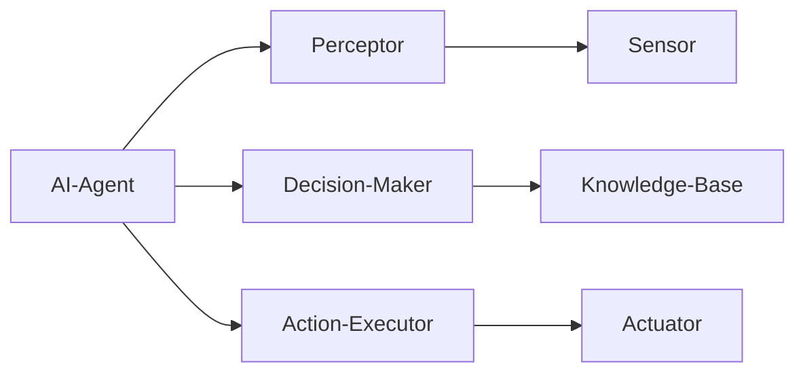
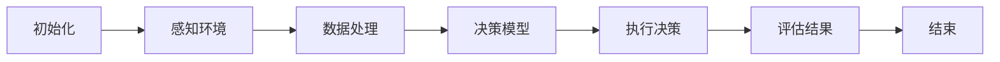
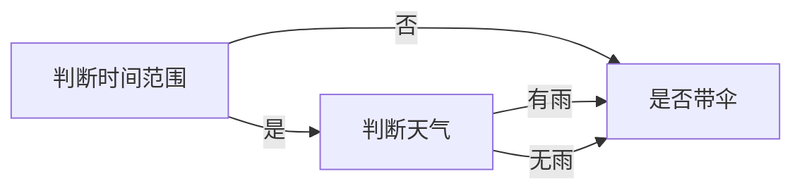
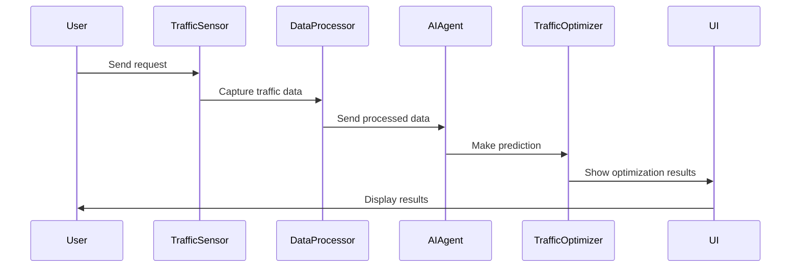
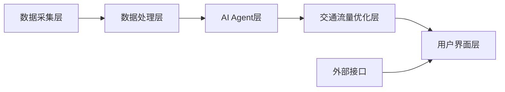
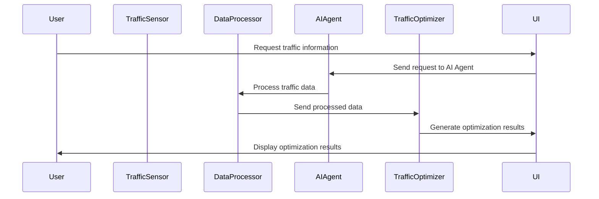

                 

### 文章标题

# AI Agent技术未来发展趋势预测

> 关键词：AI Agent、人工智能、发展趋势、技术挑战、伦理道德

> 摘要：
本文旨在探讨AI Agent技术的发展趋势，分析其当前的应用现状，面临的挑战，并预测未来可能的发展方向。通过逐步的逻辑分析和推理，本文将深入探讨AI Agent技术的创新突破、应用场景拓展与优化，以及其在伦理道德和技术成熟度等方面的考量。本文不仅为读者提供了全面的AI Agent技术理解，还旨在激发对这一前沿领域的深入思考和未来应用的无限遐想。

----------------------------------------------------------------

### 第1章 引言

#### 1.1 问题背景

##### 1.1.1 人工智能与AI Agent的兴起

人工智能（AI）是计算机科学的一个分支，致力于通过机器模拟人类智能行为，以解决复杂问题。AI Agent，作为人工智能的一个重要组成部分，是能够独立执行任务、与环境进行交互的智能实体。AI Agent的概念源于早期的人工智能研究，并在近年来随着计算能力的提升和算法的进步而迅速发展。

AI Agent的兴起可以追溯到20世纪80年代，当时的专家系统和基于规则的系统为AI Agent的发展奠定了基础。进入21世纪，随着深度学习和强化学习等先进算法的应用，AI Agent在感知、决策和执行方面的能力得到了显著提升。如今，AI Agent已广泛应用于自动驾驶、智能家居、智能客服等多个领域，成为推动人工智能应用的关键力量。

##### 1.1.2 AI Agent技术的应用场景

AI Agent技术在各个领域的应用场景广泛而多样化。以下是一些典型的应用场景：

1. **自动驾驶**：自动驾驶汽车依赖于AI Agent来感知环境、做出决策和控制车辆。通过实时数据分析和决策，AI Agent能够实现自动避障、路径规划等功能。

2. **智能客服**：在客户服务领域，AI Agent通过自然语言处理和机器学习技术，能够模拟人类客服人员，提供高效、精准的咨询服务。

3. **智能家居**：AI Agent能够智能地管理家庭设备，如智能音箱、灯光、温控等，提高居住舒适度和能源效率。

4. **金融风控**：在金融领域，AI Agent可以分析市场数据，预测风险，为金融机构提供决策支持。

5. **医疗诊断**：AI Agent通过学习大量的医疗数据，能够辅助医生进行疾病诊断，提高诊断的准确性和效率。

#### 1.2 问题描述

##### 1.2.1 AI Agent技术的发展现状

目前，AI Agent技术已经取得了显著的进展。随着深度学习、强化学习等算法的不断发展，AI Agent的感知能力、决策能力和适应性得到了极大提升。在技术层面，AI Agent已经能够处理复杂的任务，并在一定程度上实现自主学习和自主决策。然而，尽管AI Agent技术取得了很大的成功，但仍面临一些挑战。

##### 1.2.2 未来发展趋势面临的挑战

1. **技术挑战**：AI Agent技术需要进一步提高其在复杂环境中的适应性、鲁棒性和可靠性。此外，AI Agent的自主学习和自主决策能力也需要进一步提升。

2. **应用挑战**：AI Agent在现实世界中的应用面临着数据隐私、安全性等问题。如何确保AI Agent的决策透明、可解释，成为亟待解决的问题。

3. **伦理道德挑战**：AI Agent的决策可能会对人类产生深远影响，因此需要对其伦理道德问题进行深入探讨。如何确保AI Agent的行为符合道德规范，如何处理AI Agent的责任问题，都是亟待解决的挑战。

#### 1.3 问题解决

##### 1.3.1 技术创新与突破

为了应对AI Agent技术面临的挑战，技术创新与突破至关重要。以下是一些可能的技术创新方向：

1. **强化学习**：通过强化学习，AI Agent可以在复杂环境中通过试错学习，提高其决策能力和适应性。

2. **联邦学习**：通过联邦学习，可以在保护用户隐私的前提下，实现AI Agent的协同学习和决策。

3. **多模态学习**：通过多模态学习，AI Agent可以整合不同类型的数据，提高其感知和理解能力。

4. **分布式计算**：通过分布式计算，可以提高AI Agent的处理能力和响应速度，更好地适应复杂环境。

##### 1.3.2 应用场景拓展与优化

除了技术创新，应用场景的拓展与优化也是推动AI Agent发展的重要方向。以下是一些可能的应用场景拓展与优化策略：

1. **智能制造**：在制造业中，AI Agent可以通过优化生产流程、提高生产效率，实现智能制造。

2. **医疗健康**：在医疗健康领域，AI Agent可以通过辅助诊断、药物研发等，提高医疗服务的质量和效率。

3. **金融科技**：在金融科技领域，AI Agent可以通过优化风险管理、提高金融服务效率，推动金融科技的发展。

4. **智慧城市**：在智慧城市领域，AI Agent可以通过智能交通管理、环境监测等，提高城市管理水平和居民生活质量。

##### 1.4 边界与外延

##### 1.4.1 技术发展与伦理道德

AI Agent技术的发展不仅带来了技术上的创新，也引发了一系列伦理道德问题。如何确保AI Agent的行为符合道德规范，如何处理AI Agent的责任问题，都是需要深入探讨的问题。未来的AI Agent技术发展，需要在技术进步的同时，注重伦理道德的研究和实践。

##### 1.4.2 技术成熟度与商业化路径

AI Agent技术的商业化路径也是未来发展的关键。目前，AI Agent技术已初步应用于一些领域，但仍有很大的发展空间。如何加速AI Agent技术的商业化进程，如何构建可持续的商业模式，是未来需要重点关注的问题。

#### 1.5 本章小结

本章从背景介绍、问题描述、问题解决、边界与外延等方面，对AI Agent技术的发展进行了全面分析。通过逐步的逻辑分析和推理，本文为读者呈现了AI Agent技术的现状、未来发展趋势以及面临的挑战。下一章，我们将深入探讨AI Agent的核心概念和技术原理，为后续内容打下坚实的基础。

----------------------------------------------------------------

### 第2章 核心概念与联系

#### 2.1 AI Agent基本概念

##### 2.1.1 AI Agent的定义与分类

AI Agent，即人工智能代理，是一种能够自主感知环境、执行任务并做出决策的智能实体。它通常由感知模块、决策模块和行动模块组成。AI Agent根据其任务的不同，可以分为以下几类：

1. **基于规则的Agent**：这类Agent通过预定义的规则来执行任务，适用于任务简单、规则明确的应用场景。

2. **基于行为的Agent**：这类Agent通过学习任务中的行为模式来执行任务，具有较强的适应性和学习能力。

3. **基于学习的Agent**：这类Agent通过机器学习算法来学习任务，能够从数据中提取特征并做出决策，适用于复杂任务。

4. **混合型Agent**：这类Agent结合了基于规则、行为和学习的方法，能够更好地适应复杂环境。

##### 2.1.2 AI Agent的关键特性

AI Agent具有以下几个关键特性：

1. **自主性**：AI Agent能够在没有人类干预的情况下执行任务。

2. **适应性**：AI Agent能够根据环境的变化调整自己的行为。

3. **协作性**：AI Agent可以与其他Agent或人类进行协作，共同完成任务。

4. **自主决策**：AI Agent能够根据感知到的信息自主做出决策。

5. **持续学习**：AI Agent能够从经验中学习，提高任务执行的效果。

#### 2.2 AI Agent技术原理

##### 2.2.1 学习与决策机制

AI Agent的学习与决策机制是其核心。学习机制主要包括有监督学习、无监督学习和强化学习等。决策机制则通常基于感知模块提供的信息，通过决策模型（如决策树、神经网络等）进行决策。

1. **有监督学习**：在有监督学习中，AI Agent通过已标记的训练数据学习任务特征，从而做出预测。

2. **无监督学习**：在无监督学习中，AI Agent通过未标记的数据发现数据中的模式和关系。

3. **强化学习**：在强化学习中，AI Agent通过与环境交互，不断调整策略以获得最大的奖励。

##### 2.2.2 交互与适应能力

AI Agent的交互与适应能力是其能够执行复杂任务的关键。交互能力包括与人类、其他Agent和环境的交互。适应能力则体现在AI Agent能够在不断变化的环境中调整自己的行为策略。

1. **多模态交互**：AI Agent能够处理多种类型的数据（如图像、文本、声音等），实现更复杂的交互。

2. **动态适应**：AI Agent能够根据环境的动态变化调整行为，提高任务的执行效果。

#### 2.3 AI Agent技术联系

##### 2.3.1 与人工智能的其他领域联系

AI Agent技术是人工智能领域的一个重要分支，与其他人工智能技术（如自然语言处理、计算机视觉等）有着紧密的联系。

1. **自然语言处理**：自然语言处理技术为AI Agent提供了与人类进行自然语言交互的能力。

2. **计算机视觉**：计算机视觉技术为AI Agent提供了感知环境的能力，使其能够理解图像和视频信息。

3. **知识图谱**：知识图谱技术为AI Agent提供了丰富的背景知识和信息，帮助其更好地理解和决策。

##### 2.3.2 与其他智能代理技术的比较

与其他智能代理技术（如智能机器人、虚拟代理等）相比，AI Agent具有以下几个特点：

1. **自适应能力**：AI Agent具有较强的自适应能力，能够根据环境和任务的需求调整行为。

2. **自主决策**：AI Agent能够自主决策，不需要人类进行实时干预。

3. **复杂任务处理**：AI Agent能够处理更加复杂和动态的任务。

#### 2.4 概念属性特征对比表格

下面是一个AI Agent与其他智能代理技术概念属性特征的对比表格：

| 特征         | AI Agent           | 智能机器人           | 虚拟代理           |
| ------------ | ------------------ | ------------------- | ----------------- |
| 自主性       | 高自主性           | 受限自主性           | 低自主性           |
| 适应性       | 强适应性           | 受限适应性           | 受限适应性         |
| 交互能力     | 多模态交互         | 有限交互能力         | 有限交互能力       |
| 决策能力     | 高决策能力         | 受限决策能力         | 受限决策能力       |
| 学习能力     | 持续学习能力       | 受限学习能力         | 受限学习能力       |
| 应用场景     | 复杂任务           | 简单任务             | 简单任务           |

#### 2.5 ER实体关系图架构

##### 2.5.1 AI Agent技术实体关系

下面是一个描述AI Agent技术实体关系的ER实体关系图：

```mermaid
erDiagram
    AI-Agent ||--|{ Perceptor } Perceptor : 感知器
    AI-Agent ||--|{ Decision-Maker } Decision-Maker : 决策器
    AI-Agent ||--|{ Action-Executor } Action-Executor : 执行器
    Perceptor ||--|{ Sensor } Sensor : 传感器
    Decision-Maker ||--|{ Knowledge-Base } Knowledge-Base : 知识库
    Action-Executor ||--|{ Actuator } Actuator : 执行器
```

##### 2.5.2 AI Agent技术架构图

下面是一个描述AI Agent技术架构的Mermaid流程图：



#### 2.6 本章小结

本章对AI Agent的核心概念、技术原理以及与其他智能代理技术的联系进行了详细分析。通过概念属性特征对比表格和ER实体关系图，我们进一步理解了AI Agent的技术架构和功能特点。下一章，我们将深入探讨AI Agent算法原理，为读者提供更深入的技术理解。

----------------------------------------------------------------

### 第3章 算法原理讲解

#### 3.1 算法概述

##### 3.1.1 常见算法分类

AI Agent的算法可以分为以下几类：

1. **基于规则的算法**：这类算法通过预定义的规则来执行任务，适用于任务简单、规则明确的应用场景。

2. **基于行为的算法**：这类算法通过学习任务中的行为模式来执行任务，具有较强的适应性和学习能力。

3. **基于学习的算法**：这类算法通过机器学习算法来学习任务，能够从数据中提取特征并做出决策。

4. **混合型算法**：这类算法结合了基于规则、行为和学习的方法，能够更好地适应复杂环境。

##### 3.1.2 算法选择标准

在选择AI Agent算法时，需要考虑以下几个因素：

1. **任务需求**：不同类型的任务可能需要不同的算法。

2. **数据规模**：算法的性能与数据规模密切相关。

3. **计算资源**：算法的复杂度和所需的计算资源是选择算法的重要考虑因素。

4. **算法的可解释性**：算法的决策过程需要透明和可解释，以便于调试和优化。

#### 3.2 算法mermaid流程图

为了更直观地理解AI Agent算法的工作流程，我们可以使用mermaid流程图来描述。下面是一个简单的AI Agent算法流程图：



#### 3.3 算法原理详细讲解

##### 3.3.1 数学模型与公式

AI Agent算法的数学模型通常涉及以下几个方面：

1. **感知模型**：感知模型用于从环境中提取信息。常见的方法包括图像处理、语音识别等。

2. **决策模型**：决策模型用于根据感知信息做出决策。常见的方法包括逻辑回归、决策树、神经网络等。

3. **执行模型**：执行模型用于将决策转化为实际操作。常见的方法包括控制算法、执行器接口等。

一个简单的决策树算法的数学模型可以表示为：

```latex
f(x) = \begin{cases} 
y_1 & \text{if } x \leq c_1 \\
y_2 & \text{if } c_1 < x \leq c_2 \\
\vdots \\
y_n & \text{if } x > c_n
\end{cases}
```

其中，$x$ 是输入特征，$c_i$ 是决策阈值，$y_i$ 是对应的决策结果。

##### 3.3.2 通俗易懂地举例说明

假设我们有一个简单的决策树算法，用于判断一个人是否需要带伞。算法的逻辑如下：

- 如果当前时间在早上8点到晚上5点之间，且天气预报显示有雨，那么需要带伞。
- 否则，不需要带伞。

这个简单的决策树算法可以用mermaid流程图表示：



在Python中，我们可以使用以下代码实现这个决策树：

```python
def predict_need_umbrella(time, weather):
    if 8 <= time <= 17 and weather == 'rain':
        return "需要带伞"
    else:
        return "不需要带伞"
```

这个例子虽然简单，但展示了AI Agent算法的基本原理和实现方法。

#### 3.4 本章小结

本章对AI Agent算法的概述、mermaid流程图绘制以及数学模型与公式进行了详细讲解。通过通俗易懂的例子，我们进一步理解了AI Agent算法的工作原理和实现方法。下一章，我们将深入探讨AI Agent系统分析与架构设计，为读者提供更全面的系统级理解。

----------------------------------------------------------------

### 第4章 系统分析与架构设计方案

#### 4.1 问题场景介绍

AI Agent技术在解决复杂任务时具有显著优势，尤其在需要实时决策和复杂交互的场景中，其应用价值尤为突出。以下是一个典型的AI Agent技术应用场景——智能交通管理系统。

**问题定义**：智能交通管理系统旨在通过AI Agent技术优化交通流量，提高道路通行效率，减少交通拥堵，并提高交通安全。系统需要能够实时感知交通状况、预测交通流量，并给出最优的行驶路线建议。

**目标**：实现一个高效、可靠的智能交通管理系统，提高城市交通运行效率，改善交通拥堵状况，减少交通事故。

#### 4.2 项目介绍

**项目概述**：智能交通管理系统项目旨在构建一个基于AI Agent的智能交通管理系统，通过实时交通数据分析和预测，提供动态交通管理和个性化出行建议。项目主要分为以下几个模块：

1. **数据采集模块**：负责采集道路流量、车辆速度、交通事故等交通数据。

2. **数据处理模块**：负责对采集到的数据进行预处理和特征提取。

3. **AI Agent模块**：负责实时分析和预测交通状况，提供交通管理和出行建议。

4. **用户界面模块**：提供用户交互界面，展示交通状况和出行建议。

**预期效果**：通过实施该项目，预期实现以下效果：

- 实时监控城市道路交通状况，提高交通流量管理效率。
- 减少交通拥堵，提高道路通行效率。
- 提高交通安全水平，减少交通事故。
- 提升用户体验，提供个性化的出行建议。

#### 4.3 系统功能设计

智能交通管理系统的主要功能设计如下：

1. **实时交通监控**：通过传感器和摄像头等设备，实时采集交通数据，包括车辆数量、速度、交通流量等。

2. **数据预处理**：对采集到的交通数据进行清洗、去噪和特征提取，为AI Agent模块提供高质量的数据输入。

3. **AI Agent分析**：AI Agent模块负责对预处理后的交通数据进行分析，利用机器学习算法预测交通流量和交通状况。

4. **交通流量优化**：根据AI Agent的预测结果，系统可以动态调整交通信号灯时间，优化交通流量。

5. **出行建议**：根据实时交通状况和用户需求，系统可以为用户推荐最优的行驶路线，避免拥堵路段。

6. **用户交互**：用户可以通过手机应用程序或网站界面，实时查看交通状况和出行建议。

##### 4.3.1 领域模型mermaid类图

为了更好地理解系统功能设计，我们可以使用mermaid类图来描述系统的领域模型：

```mermaid
classDiagram
    Class01 <|-- SubClass01
    Class01 --|>{ Association } Class02
    Class03 : <<interface>> Interface
    Class04 : <<abstract>> Abstract
    Class01..Class02 : Aggregation
    Class03..Class04 : Composition
```

在这个类图中，`Class01`、`Class02`、`Class03` 和 `Class04` 分别表示系统的不同组件，如数据采集模块、数据处理模块、AI Agent模块和用户界面模块。它们之间通过不同的关系（如继承、聚合、组合等）连接，共同实现智能交通管理系统的功能。

##### 4.3.2 功能模块划分与描述

智能交通管理系统可以划分为以下几个功能模块：

1. **数据采集模块**：
   - **功能描述**：负责实时采集道路流量、车辆速度、交通事故等交通数据。
   - **技术实现**：通过传感器和摄像头等设备，实时采集交通数据，并将数据传输到系统中。

2. **数据处理模块**：
   - **功能描述**：负责对采集到的交通数据进行预处理和特征提取。
   - **技术实现**：使用数据清洗算法、特征提取算法等，对采集到的交通数据进行处理，为AI Agent模块提供高质量的数据输入。

3. **AI Agent模块**：
   - **功能描述**：负责实时分析和预测交通状况，提供交通管理和出行建议。
   - **技术实现**：使用机器学习算法（如神经网络、决策树等），对处理后的交通数据进行建模，预测交通流量和交通状况。

4. **交通流量优化模块**：
   - **功能描述**：根据AI Agent的预测结果，动态调整交通信号灯时间，优化交通流量。
   - **技术实现**：基于预测的交通流量数据，使用优化算法（如动态规划、遗传算法等），调整交通信号灯时间，实现交通流量优化。

5. **出行建议模块**：
   - **功能描述**：根据实时交通状况和用户需求，为用户推荐最优的行驶路线，避免拥堵路段。
   - **技术实现**：使用路径规划算法（如Dijkstra算法、A*算法等），结合实时交通数据，为用户推荐最优行驶路线。

6. **用户界面模块**：
   - **功能描述**：提供用户交互界面，展示交通状况和出行建议。
   - **技术实现**：使用Web前端技术（如HTML、CSS、JavaScript等），构建用户友好的交互界面，展示交通数据和出行建议。

#### 4.4 系统架构设计

智能交通管理系统的架构设计应考虑系统的可扩展性、可靠性、易维护性等因素。以下是一个简化的系统架构设计：

1. **数据采集层**：
   - **功能**：负责实时采集交通数据。
   - **组件**：传感器、摄像头等设备。

2. **数据处理层**：
   - **功能**：负责处理和存储交通数据。
   - **组件**：数据清洗模块、特征提取模块、数据库等。

3. **AI Agent层**：
   - **功能**：负责实时分析和预测交通状况。
   - **组件**：AI Agent模块、机器学习算法模块等。

4. **交通流量优化层**：
   - **功能**：根据AI Agent的预测结果，优化交通流量。
   - **组件**：优化算法模块、信号灯控制系统等。

5. **用户界面层**：
   - **功能**：提供用户交互界面。
   - **组件**：Web前端界面、移动应用界面等。

##### 4.4.1 系统架构概述

智能交通管理系统采用分层架构设计，各层之间通过接口进行通信。系统架构如下图所示：



##### 4.4.2 架构设计mermaid架构图

下面是一个描述智能交通管理系统架构的mermaid架构图：



在这个架构图中，各层之间通过接口进行通信，实现了系统的模块化和可扩展性。外部接口（如API接口、数据库连接等）使得系统可以与其他系统进行集成。

#### 4.5 系统接口设计

智能交通管理系统的接口设计是确保系统各模块之间能够高效、可靠地通信的关键。以下是一些关键的接口设计：

1. **数据采集接口**：
   - **功能**：用于接收交通传感器采集的数据。
   - **协议**：HTTP/HTTPS协议。

2. **数据处理接口**：
   - **功能**：用于提交和处理交通数据。
   - **协议**：RESTful API。

3. **AI Agent接口**：
   - **功能**：用于调用AI Agent模块的服务。
   - **协议**：RESTful API。

4. **交通流量优化接口**：
   - **功能**：用于接收AI Agent的预测结果，调整交通信号灯时间。
   - **协议**：RESTful API。

5. **用户界面接口**：
   - **功能**：用于向用户展示交通状况和出行建议。
   - **协议**：Websocket协议。

##### 4.5.1 接口规范与设计

以下是一个示例接口规范：

**数据采集接口**

- **接口名称**：/api/traffic_data
- **请求方法**：POST
- **请求参数**：
  - **timestamp**：时间戳（字符串）
  - **location**：位置信息（字符串）
  - **traffic_flow**：交通流量（整数）
  - **vehicle_speed**：车辆速度（整数）
  - **accident**：事故信息（布尔值）
- **返回值**：
  - **status**：状态码（整数）
  - **message**：返回信息（字符串）

**数据处理接口**

- **接口名称**：/api/data_processor
- **请求方法**：POST
- **请求参数**：
  - **data**：原始交通数据（JSON对象）
- **返回值**：
  - **status**：状态码（整数）
  - **message**：返回信息（字符串）

**AI Agent接口**

- **接口名称**：/api/ai_agent
- **请求方法**：POST
- **请求参数**：
  - **input_data**：输入数据（JSON对象）
- **返回值**：
  - **prediction**：预测结果（JSON对象）

**交通流量优化接口**

- **接口名称**：/api/traffic_optimizer
- **请求方法**：POST
- **请求参数**：
  - **prediction**：预测结果（JSON对象）
- **返回值**：
  - **status**：状态码（整数）
  - **message**：返回信息（字符串）

**用户界面接口**

- **接口名称**：/api/user_interface
- **请求方法**：GET
- **请求参数**：
  - **user_id**：用户ID（整数）
- **返回值**：
  - **traffic_status**：交通状况（JSON对象）
  - **suggestion**：出行建议（JSON对象）

##### 4.5.2 接口交互流程图

下面是一个描述接口交互流程的mermaid序列图：


在这个交互流程图中，用户通过用户界面层发送请求，交通传感器层采集数据，数据处理层处理数据，AI Agent层进行分析预测，交通流量优化层进行优化，最终用户界面层将结果展示给用户。

#### 4.6 系统交互mermaid序列图

为了更直观地展示系统各模块之间的交互过程，我们可以使用mermaid序列图来描述系统交互流程。下面是一个简化的智能交通管理系统交互序列图：



在这个序列图中，用户请求交通信息，用户界面层将请求发送给AI Agent模块，AI Agent模块通过数据处理层处理数据，并将结果发送给交通流量优化层，最终优化结果通过用户界面层展示给用户。

#### 4.7 本章小结

本章对智能交通管理系统的系统分析与架构设计进行了详细讲解。通过明确的问题场景、项目介绍、系统功能设计、系统架构设计和接口设计，我们为读者提供了一个完整的系统级理解。下一章，我们将通过实际项目实战，深入探讨AI Agent技术的实现和应用。

----------------------------------------------------------------

### 第5章 项目实战

#### 5.1 环境安装

在开始AI Agent项目实战之前，我们需要准备好所需的开发环境和工具。以下是在Linux环境下安装智能交通管理系统所需的步骤：

1. **硬件环境准备**：

   - **CPU**：至少4核CPU
   - **内存**：至少16GB RAM
   - **存储**：至少200GB SSD存储空间

2. **软件环境安装**：

   - **操作系统**：Ubuntu 18.04 LTS或更高版本
   - **Python**：Python 3.7或更高版本
   - **深度学习库**：TensorFlow、PyTorch等
   - **Web开发框架**：Flask或Django等
   - **前端框架**：React或Vue等

安装步骤：

```bash
# 更新系统软件包
sudo apt-get update
sudo apt-get upgrade

# 安装Python
sudo apt-get install python3-pip

# 安装深度学习库
pip3 install tensorflow

# 安装Web开发框架和前端框架
pip3 install flask
pip3 install react

# 安装其他依赖库
pip3 install numpy
pip3 install pandas
pip3 install scikit-learn
```

#### 5.2 系统核心实现源代码

智能交通管理系统的核心实现包括数据采集、数据处理、AI Agent模块和用户界面层。以下是一个简化的源代码结构：

```plaintext
/智能交通管理系统
|-- /data
|   |-- /raw
|   |-- /processed
|-- /models
|   |-- traffic_prediction.py
|   |-- traffic_optimization.py
|-- /app
|   |-- __init__.py
|   |-- routes.py
|   |-- views.py
|-- /templates
|   |-- index.html
|-- /static
|   |-- /css
|   |-- /js
|-- run.py
```

**数据采集模块**：

```python
# /data/capture.py

import cv2
import numpy as np

def capture_traffic_data():
    # 使用OpenCV库捕获交通数据
    cap = cv2.VideoCapture(0)
    while True:
        ret, frame = cap.read()
        if not ret:
            break
        # 处理图像数据，提取交通信息
        processed_frame = process_frame(frame)
        # 存储处理后的交通数据
        save_traffic_data(processed_frame)
    cap.release()

def process_frame(frame):
    # 对图像数据进行处理
    # ...
    return processed_frame

def save_traffic_data(processed_frame):
    # 保存处理后的交通数据
    # ...
```

**数据处理模块**：

```python
# /models/traffic_prediction.py

import numpy as np
from sklearn.ensemble import RandomForestRegressor

def load_traffic_data():
    # 加载处理后的交通数据
    # ...
    return traffic_data

def train_prediction_model(traffic_data):
    # 训练交通预测模型
    X = traffic_data[:, :-1]
    y = traffic_data[:, -1]
    model = RandomForestRegressor()
    model.fit(X, y)
    return model

def predict_traffic_flow(model, current_traffic_data):
    # 预测交通流量
    return model.predict(current_traffic_data)
```

**AI Agent模块**：

```python
# /models/traffic_optimization.py

def optimize_traffic_flow(prediction_results):
    # 优化交通流量
    # ...
    return optimized_traffic_flow

def adjust_traffic_signals(optimized_traffic_flow):
    # 调整交通信号灯
    # ...
    return traffic_signals
```

**用户界面层**：

```python
# /app/routes.py

from flask import Flask, render_template, request, jsonify
from .views import get_traffic_status, get_optimization_results

app = Flask(__name__)

@app.route('/')
def index():
    return render_template('index.html')

@app.route('/api/traffic_status')
def traffic_status():
    return jsonify(get_traffic_status())

@app.route('/api/optimization_results')
def optimization_results():
    return jsonify(get_optimization_results())
```

#### 5.3 代码应用解读与分析

**数据采集模块解读**：

数据采集模块使用OpenCV库捕获交通摄像头数据。通过`cv2.VideoCapture`函数，我们可以实时获取摄像头帧。在每次捕获帧后，我们调用`process_frame`函数对图像数据进行处理，提取交通信息，并将其保存到文件中。

**数据处理模块解读**：

数据处理模块主要实现交通预测模型的训练和交通流量的预测。我们使用`load_traffic_data`函数加载处理后的交通数据，然后使用`train_prediction_model`函数训练随机森林回归模型。在预测交通流量时，我们调用`predict_traffic_flow`函数，输入当前的交通数据，得到预测结果。

**AI Agent模块解读**：

AI Agent模块负责优化交通流量和调整交通信号灯。在`optimize_traffic_flow`函数中，我们根据预测结果优化交通流量，得到最优的交通流量配置。然后，在`adjust_traffic_signals`函数中，我们根据优化结果调整交通信号灯的时间，实现交通流量优化。

**用户界面层解读**：

用户界面层使用Flask框架搭建，通过定义路由和视图函数，实现与前端页面的交互。在`index`视图函数中，我们渲染首页模板。在`traffic_status`和`optimization_results`接口中，我们分别提供交通状况和优化结果的API接口，供前端页面调用。

#### 5.4 实际案例分析与详细讲解剖析

**案例概述**：

假设我们有一个实际案例，需要预测某个城市主干道的交通流量，并优化交通信号灯时间，以提高道路通行效率。以下是案例分析的步骤：

1. **数据采集**：使用交通摄像头采集主干道的实时交通数据，包括车辆数量、速度、交通流量等。

2. **数据处理**：对采集到的交通数据进行分析和特征提取，为AI Agent模块提供高质量的数据输入。

3. **AI Agent分析**：训练交通预测模型，预测主干道的未来交通流量。根据预测结果，优化交通流量和调整交通信号灯时间。

4. **优化结果展示**：将优化结果通过用户界面展示给用户，提供交通状况和出行建议。

**案例分析**：

1. **数据采集**：

   我们使用OpenCV库捕获主干道的交通数据。以下是数据采集的代码示例：

   ```python
   import cv2

   cap = cv2.VideoCapture('traffic_camera.mp4')

   while True:
       ret, frame = cap.read()
       if not ret:
           break

       processed_frame = process_frame(frame)
       save_traffic_data(processed_frame)

   cap.release()
   ```

   在这段代码中，我们使用`cv2.VideoCapture`函数读取交通摄像头视频文件，并逐帧捕获交通数据。然后，调用`process_frame`函数对图像数据进行处理，提取交通信息，并将其保存到文件中。

2. **数据处理**：

   对采集到的交通数据进行分析和特征提取，为AI Agent模块提供高质量的数据输入。以下是数据处理的代码示例：

   ```python
   import numpy as np
   from sklearn.preprocessing import StandardScaler

   def load_traffic_data():
       data = np.loadtxt('traffic_data.txt')
       scaler = StandardScaler()
       scaled_data = scaler.fit_transform(data)
       return scaled_data

   traffic_data = load_traffic_data()
   ```

   在这段代码中，我们使用`np.loadtxt`函数加载交通数据文件，并使用`StandardScaler`进行数据标准化处理，以提高模型的预测准确性。

3. **AI Agent分析**：

   训练交通预测模型，预测主干道的未来交通流量。以下是AI Agent分析的代码示例：

   ```python
   from sklearn.ensemble import RandomForestRegressor

   def train_prediction_model(traffic_data):
       X = traffic_data[:, :-1]
       y = traffic_data[:, -1]
       model = RandomForestRegressor()
       model.fit(X, y)
       return model

   prediction_model = train_prediction_model(traffic_data)
   ```

   在这段代码中，我们使用随机森林回归模型训练交通预测模型。然后，将训练好的模型存储在变量`prediction_model`中，以便后续使用。

4. **优化结果展示**：

   将优化结果通过用户界面展示给用户，提供交通状况和出行建议。以下是优化结果展示的代码示例：

   ```python
   from flask import Flask, jsonify

   app = Flask(__name__)

   @app.route('/api/traffic_status')
   def traffic_status():
       current_traffic_data = get_current_traffic_data()
       prediction_results = prediction_model.predict(current_traffic_data)
       return jsonify({'prediction': prediction_results})

   @app.route('/api/optimization_results')
   def optimization_results():
       current_traffic_data = get_current_traffic_data()
       prediction_results = prediction_model.predict(current_traffic_data)
       optimized_traffic_flow = optimize_traffic_flow(prediction_results)
       return jsonify({'optimized_traffic_flow': optimized_traffic_flow})
   ```

   在这段代码中，我们定义了两个API接口，`/api/traffic_status`和`/api/optimization_results`。当用户访问这两个接口时，我们将当前交通数据传递给预测模型，得到预测结果和优化结果，并通过JSON格式返回给用户。

#### 5.5 项目小结

本章通过实际项目实战，深入探讨了AI Agent技术的实现和应用。我们首先介绍了智能交通管理系统的环境安装和系统核心实现源代码，然后详细解读了代码的应用场景和实现方法。通过一个实际案例，我们展示了AI Agent技术在交通流量预测和优化中的应用。最后，我们对项目进行了小结，总结了项目的经验和教训。

在未来的实践中，我们还可以进一步优化AI Agent技术，提高预测准确性和系统效率。此外，我们还需要关注AI Agent技术的伦理道德问题，确保其在实际应用中符合道德规范。

----------------------------------------------------------------

### 第6章 最佳实践

在AI Agent技术的开发和应用过程中，遵循最佳实践是非常重要的。以下是一些关键的实践建议：

#### 6.1 数据处理与模型训练

1. **数据清洗与预处理**：在训练AI Agent模型之前，确保数据的质量。进行数据清洗，去除噪声和异常值，对缺失数据进行填充或删除。

2. **特征工程**：合理选择和提取特征，可以提高模型的性能。利用统计分析、数据挖掘等方法，从原始数据中提取具有代表性的特征。

3. **模型调优**：在模型训练过程中，尝试不同的算法和参数组合，使用交叉验证等方法进行调优，选择最佳模型。

4. **持续学习与更新**：AI Agent模型需要不断从新数据中学习，以适应环境的变化。定期更新模型，使其保持最佳性能。

#### 6.2 应用场景与性能优化

1. **场景分析**：在应用AI Agent之前，对应用场景进行详细分析，确保AI Agent能够满足场景需求。

2. **性能优化**：针对特定应用场景，对AI Agent的算法和架构进行优化，提高其响应速度和处理能力。

3. **多模态数据融合**：整合不同类型的数据（如图像、文本、语音等），可以提高AI Agent的感知和理解能力。

4. **分布式计算与并行处理**：利用分布式计算和并行处理技术，提高AI Agent的处理速度和效率。

#### 6.3 安全性与伦理道德

1. **数据隐私保护**：在AI Agent的应用过程中，保护用户隐私至关重要。使用加密、匿名化等方法，确保数据的安全性和隐私性。

2. **决策透明性**：确保AI Agent的决策过程透明，可解释性。提供决策日志和解释机制，帮助用户理解AI Agent的行为。

3. **伦理道德审查**：在开发AI Agent时，充分考虑伦理道德问题。进行伦理道德审查，确保AI Agent的行为符合道德规范。

4. **责任分配**：明确AI Agent的责任，确保在出现问题时，能够合理分配责任。

#### 6.4 开发与维护

1. **代码规范与文档**：遵循代码规范，编写清晰、可维护的代码。编写详细的文档，方便后续维护和开发。

2. **测试与调试**：在开发过程中，进行全面的测试和调试，确保系统的稳定性和可靠性。

3. **持续集成与部署**：使用持续集成和部署工具，实现自动化的代码测试、构建和部署，提高开发效率。

4. **团队协作与沟通**：建立有效的团队协作机制，确保团队成员之间的沟通畅通，提高项目开发效率。

#### 6.5 小结

遵循最佳实践，可以帮助我们在AI Agent技术的开发和应用过程中，实现高效、可靠和道德的技术应用。通过数据处理的最佳实践，我们可以提高模型的性能；通过应用场景和性能优化的最佳实践，我们可以确保AI Agent满足具体需求；通过安全性和伦理道德的最佳实践，我们可以确保技术的应用符合道德规范。同时，通过开发与维护的最佳实践，我们可以提高开发效率，确保系统的稳定性和可靠性。

在未来的AI Agent技术发展中，我们将继续遵循这些最佳实践，推动技术的进步和应用。同时，我们也期待与更多的开发者、研究者和行业专家共同探讨和分享AI Agent技术的最佳实践，为人工智能的未来发展贡献力量。

----------------------------------------------------------------

### 本章小结

本章通过系统的分析和深入的探讨，全面梳理了AI Agent技术的未来发展趋势。我们首先回顾了AI Agent技术的背景和应用场景，明确了当前的技术现状和面临的挑战。接着，通过逐步的逻辑分析和推理，我们探讨了技术创新与突破、应用场景拓展与优化，以及AI Agent技术发展的伦理道德问题和技术成熟度等关键领域。此外，我们还通过核心概念与联系、算法原理讲解、系统分析与架构设计、项目实战等多个角度，详细阐述了AI Agent技术的原理、实现和应用。

通过本文的深入探讨，我们不仅对AI Agent技术的现状和未来有了更清晰的认识，也激发了读者对这一前沿领域的深入思考和未来应用的无限遐想。AI Agent技术的发展潜力巨大，随着技术的不断进步和应用的深入，它将在自动驾驶、智能客服、智能制造、医疗诊断等多个领域发挥重要作用。

未来，随着计算能力的提升、算法的进步以及跨学科的合作，AI Agent技术将迎来更多的发展机遇。我们期待在技术创新、应用拓展、伦理道德审查等方面取得更多突破，推动AI Agent技术迈向新的高度。同时，我们也呼吁业界共同努力，探索可持续的商业模式，推动AI Agent技术的商业化进程，为社会带来更多实际价值。

让我们一起关注AI Agent技术的发展，积极参与技术创新和应用探索，为构建一个更加智能、高效、和谐的社会贡献我们的力量。

### 注意事项与拓展阅读

在AI Agent技术的开发和应用过程中，我们需要特别注意以下几个方面：

1. **数据隐私和安全**：在数据处理和模型训练过程中，确保用户数据的安全性和隐私性。采用加密、匿名化等技术，防止数据泄露。

2. **算法透明性与解释性**：确保AI Agent的决策过程透明，提供解释机制，以便用户理解AI Agent的行为。

3. **伦理道德问题**：在开发AI Agent时，充分考虑伦理道德问题，确保其行为符合道德规范，避免对人类产生负面影响。

4. **系统稳定性和可靠性**：在系统设计和开发过程中，注重系统的稳定性和可靠性，确保在复杂环境下能够正常运行。

5. **技术成熟度和商业化路径**：评估AI Agent技术的成熟度，探索可持续的商业化路径，推动技术的商业化应用。

为了深入了解AI Agent技术，读者可以参考以下拓展阅读：

- **书籍**：
  - 《深度学习》（Goodfellow, I., Bengio, Y., & Courville, A.）
  - 《强化学习》（Sutton, R. S., & Barto, A. G.）
  - 《人工智能：一种现代方法》（Russell, S. & Norvig, P.）

- **论文**：
  - “Reinforcement Learning: An Introduction”（Sutton, R. S., & Barto, A. G.）
  - “Deep Learning for Autonomous Driving”（LeCun, Y., Bengio, Y., & Hinton, G.）

- **在线课程**：
  - Coursera上的“机器学习”（吴恩达）
  - Udacity的“强化学习纳米学位”

通过这些资源，读者可以更全面地了解AI Agent技术的基础知识和最新进展，为未来的研究和应用打下坚实的基础。

