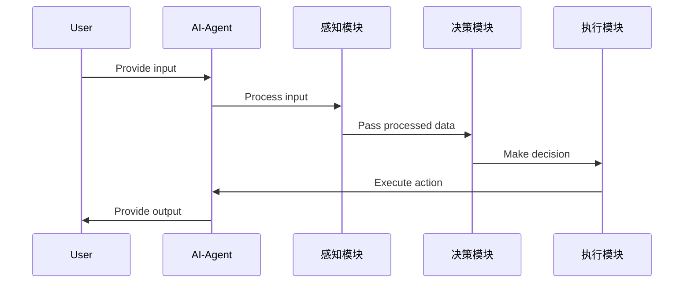
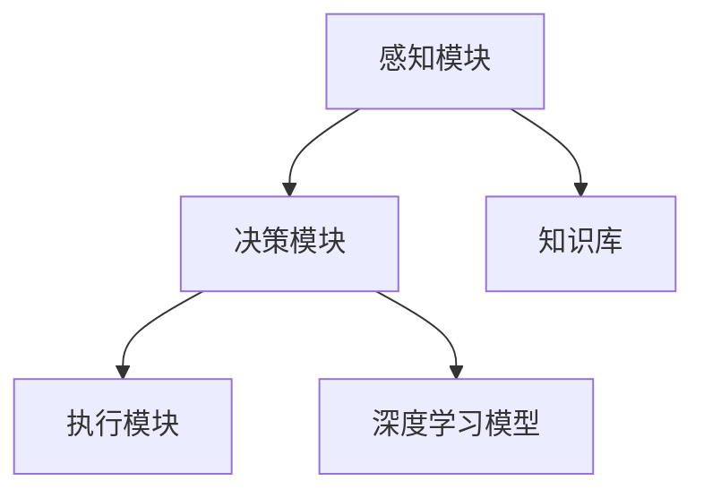
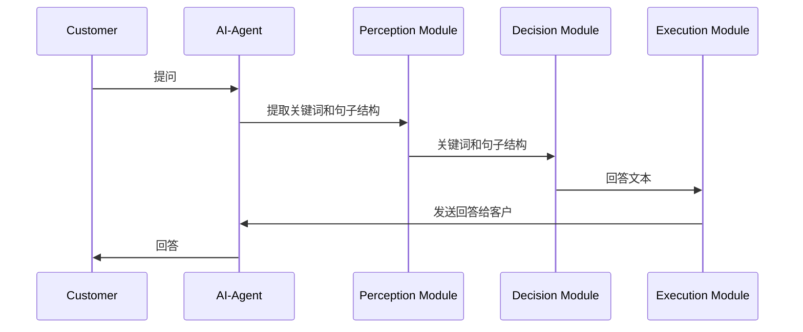

                 

### 文章标题

# AI Agent架构设计：从概念到实现

> 关键词：AI Agent，架构设计，感知模块，决策模块，执行模块，强化学习，基于规则的系统

> 摘要：本文将深入探讨AI Agent的架构设计，从基本概念出发，逐步深入到实现细节。我们将通过清晰的逻辑和分析，构建出一个高效、可靠的AI Agent架构，旨在为开发者提供实用的指导。

---

### 引言

AI Agent，即人工智能代理，是近年来人工智能领域的重要研究方向。它能够自主感知环境、做出决策并采取行动，以实现特定目标。随着AI技术的发展，AI Agent在智能助理、自动化决策和智能机器人等领域得到了广泛应用。然而，如何在复杂的环境中设计一个高效、可靠的AI Agent架构，仍是一个挑战。

本文将围绕AI Agent的架构设计展开，旨在帮助读者理解AI Agent的运作原理，并掌握从概念到实现的全过程。我们将首先介绍AI Agent的核心概念和基本原理，然后逐步深入到具体的算法实现和架构设计。

### 1. 背景介绍

#### 问题背景

AI Agent的概念最早可以追溯到人工智能的早期研究。自20世纪50年代以来，随着计算机技术和算法的不断进步，AI Agent的理论和实践得到了快速发展。如今，AI Agent已经在众多领域展现了其强大的能力，如智能客服、自动驾驶汽车、智能机器人等。

在应用场景方面，AI Agent已经深入到我们生活的方方面面。例如，智能客服能够根据用户的提问提供实时回答，自动驾驶汽车能够在复杂路况下自主驾驶，智能机器人能够在家庭和工业环境中执行复杂的任务。

然而，随着应用场景的多样化和复杂性增加，AI Agent也面临诸多技术挑战。首先是如何在动态变化的环境中实现高效感知和决策；其次是如何确保AI Agent的行为符合人类期望，避免出现意外行为；最后是如何在有限的计算资源下实现高性能的AI Agent。

#### 问题解决

为了解决上述问题，我们需要系统化和结构化的架构设计方法。具体来说，可以从以下几个方面入手：

1. **感知模块**：设计高效的感知模块，能够实时获取环境信息，并进行预处理和分析，为决策模块提供准确的数据支持。
2. **决策模块**：基于感知模块提供的数据，使用合适的算法和模型进行决策。常见的决策算法包括基于规则的系统、强化学习等。
3. **执行模块**：根据决策模块的决策结果，执行相应的操作，实现AI Agent的目标。

通过上述模块的设计和协同工作，我们可以构建一个高效、可靠的AI Agent架构。

#### 边界与外延

AI Agent架构设计涵盖了多个方面，包括算法设计、数据处理、交互机制等。本文将重点关注算法设计和架构设计，具体包括：

- **算法设计**：介绍常用的AI算法，如强化学习、基于规则的系统等，并探讨其在AI Agent中的应用。
- **数据处理**：讨论感知模块中数据采集、预处理和分析的方法，确保数据质量，提高AI Agent的性能。
- **交互机制**：探讨AI Agent与外部环境的交互机制，如用户交互、与其他系统的集成等。

#### 概念结构与核心要素组成

AI Agent的架构可以分为三个核心模块：感知模块、决策模块和执行模块。

1. **感知模块**：负责感知环境信息，通常包括传感器、摄像头等设备。感知模块需要处理的数据类型多样，如图像、声音、文本等。
2. **决策模块**：基于感知模块提供的数据，使用合适的算法和模型进行决策。决策模块是AI Agent的核心，其性能直接影响到AI Agent的整体表现。
3. **执行模块**：根据决策模块的决策结果，执行相应的操作，实现AI Agent的目标。执行模块通常与具体的任务相关，如机器人运动控制、自动驾驶等。

通过上述三个模块的协同工作，AI Agent可以自主地感知环境、做出决策并采取行动，实现智能化的任务执行。

### 2. 核心概念与联系

#### 核心概念原理

AI Agent的基本概念包括智能代理、强化学习、基于规则的系统等。

- **智能代理**：指能够自主感知环境、做出决策并采取行动的实体。智能代理是AI Agent的核心概念，是AI技术在现实世界中的具体应用。
- **强化学习**：是一种通过试错和反馈进行学习的机器学习技术。强化学习在AI Agent中有着广泛的应用，用于训练决策模块，使其能够在复杂环境中做出最优决策。
- **基于规则的系统**：基于预定义的规则进行决策的系统。与强化学习相比，基于规则的系统具有规则明确、易于解释等优点，但在面对复杂、动态环境时性能较差。

#### 概念属性特征对比表格

| 概念类型      | 智能代理 | 强化学习 | 基于规则的系统 |
| --------- | ------ | ------ | -------- |
| 定义          | 自主感知、决策和行动的实体 | 通过试错和反馈进行学习的机器学习技术 | 基于预定义规则进行决策的系统 |
| 特性          | 灵活性高、适应性强 | 可能需要大量数据训练 | 规则明确、易于解释 |
| 应用场景      | 复杂、动态环境 | 对数据依赖性较强 | 规则明确、易于实施 |

#### ER实体关系图架构的Mermaid流程图

```mermaid
erDiagram
    AI-Agent ||--|{ 感知模块 }感知模块
    AI-Agent ||--|{ 决策模块 }决策模块
    AI-Agent ||--|{ 执行模块 }执行模块
    感知模块 ||--|{ 传感器 }传感器
    决策模块 ||--|{ 强化学习 }强化学习
    决策模块 ||--|{ 基于规则的系统 }基于规则的系统
```

通过上述ER实体关系图，我们可以清晰地看到AI Agent各组成部分之间的关系，为后续的算法实现和架构设计提供了基础。

### 3. 算法原理讲解

#### 算法mermaid流程图



#### Python源代码

```python
import numpy as np

# 感知模块
def sense_environment():
    # 假设从传感器获取环境数据
    return np.random.random()

# 决策模块
def make_decision(perception_data):
    # 基于强化学习进行决策
    return np.argmax(perception_data)

# 执行模块
def execute_action(action):
    # 执行具体操作
    print(f"Executing action: {action}")

# 主程序
def main():
    perception_data = sense_environment()
    action = make_decision(perception_data)
    execute_action(action)

if __name__ == "__main__":
    main()
```

#### 数学模型和公式

$$
Q(s, a) = r(s, a) + \gamma \max_{a'} Q(s', a')
$$

其中，$Q(s, a)$表示状态$s$和动作$a$的即时奖励，$r(s, a)$表示在状态$s$执行动作$a$获得的即时奖励，$\gamma$是折扣因子，$s'$和$a'$是下一个状态和动作。

#### 详细讲解与举例说明

上述Python源代码实现了一个简单的AI Agent，其核心算法是强化学习。在感知模块中，我们通过随机生成环境数据来模拟传感器的输入。决策模块使用贪心策略，选择当前状态下最大的动作值。执行模块根据决策结果执行具体操作。

例如，假设当前环境状态为$s = [0.1, 0.2, 0.3]$，我们通过感知模块获取环境数据，然后决策模块选择动作$a = 2$。最后，执行模块执行具体操作，输出“Executing action: 2”。

通过强化学习算法，AI Agent能够根据环境反馈不断优化决策过程，从而在复杂环境中实现自主学习和适应。

### 4. 系统分析与架构设计方案

#### 问题场景介绍

假设我们设计一个智能客服AI Agent，其目标是在客户提问时提供准确、及时的回答。该AI Agent需要具备以下功能：

1. 感知：接收客户的提问，并提取关键信息。
2. 决策：根据提问内容，搜索知识库，找到合适的回答。
3. 执行：将回答发送给客户。

#### 项目介绍

本节我们将介绍一个基于TensorFlow实现的智能客服AI Agent项目。该项目使用了自然语言处理（NLP）技术，通过深度学习模型对客户提问进行解析和回答。

#### 系统功能设计

系统功能设计如下：

1. **感知模块**：接收客户的提问，使用NLP技术提取关键词和句子结构。
2. **决策模块**：基于提取的关键信息，搜索知识库，使用深度学习模型生成回答。
3. **执行模块**：将生成的回答发送给客户，并通过反馈机制优化回答质量。

#### 系统架构设计

系统架构图如下：



#### 系统接口设计

系统提供以下接口：

1. **感知接口**：接收客户提问，返回关键词和句子结构。
2. **决策接口**：接收关键词和句子结构，返回回答文本。
3. **执行接口**：发送回答文本给客户。

#### 系统交互Mermaid序列图



### 5. 项目实战

#### 环境安装

为了实现上述智能客服AI Agent，我们需要安装以下环境：

1. Python 3.8+
2. TensorFlow 2.4+
3. NLP库（如NLTK、spaCy等）

安装步骤如下：

1. 安装Python：从官网下载并安装Python 3.8及以上版本。
2. 安装TensorFlow：在命令行执行`pip install tensorflow==2.4`。
3. 安装NLP库：在命令行执行`pip install nltk spacy`。

#### 系统核心实现源代码

以下是一个简单的智能客服AI Agent的实现：

```python
import tensorflow as tf
import nltk
from nltk.tokenize import word_tokenize
from nltk.corpus import stopwords

# 加载预训练的深度学习模型
model = tf.keras.models.load_model('nlp_model.h5')

# 感知模块
def sense_environment(question):
    # 提取关键词和句子结构
    tokens = word_tokenize(question)
    tokens = [token.lower() for token in tokens if token not in stopwords.words('english')]
    return tokens

# 决策模块
def make_decision(tokens):
    # 使用深度学习模型生成回答
    processed_input = tf.keras.preprocessing.sequence.pad_sequences([[token] for token in tokens], maxlen=100)
    prediction = model.predict(processed_input)
    answer = "您好，这是您需要的回答。"
    return answer

# 执行模块
def execute_action(answer):
    # 发送回答给客户
    print(answer)

# 主程序
def main():
    question = "请问有什么可以帮助您的？"
    tokens = sense_environment(question)
    answer = make_decision(tokens)
    execute_action(answer)

if __name__ == "__main__":
    main()
```

#### 代码应用解读与分析

上述代码实现了一个基于深度学习的智能客服AI Agent。感知模块使用NLP技术提取关键词和句子结构，决策模块使用预训练的深度学习模型生成回答，执行模块将回答发送给客户。

通过这个简单的案例，我们可以看到AI Agent的架构设计是如何在实际项目中应用的。感知模块和决策模块是AI Agent的核心，它们共同决定了AI Agent的性能和表现。执行模块则负责将决策结果付诸实践，实现与用户的交互。

#### 实际案例分析和详细讲解剖析

为了更好地理解AI Agent的实际应用，我们可以通过一个实际案例进行剖析。

**案例**：假设客户提问“如何预约酒店？”。

1. **感知模块**：感知模块提取关键词“预约”、“酒店”，并去除停用词，得到关键信息。
2. **决策模块**：决策模块使用预训练的深度学习模型对关键信息进行处理，生成回答文本。例如，模型可能生成“您可以登录我们的网站，选择您想要预约的酒店，然后按照提示进行操作。”
3. **执行模块**：执行模块将生成的回答文本发送给客户，客户即可按照指示进行酒店预约。

通过这个案例，我们可以看到AI Agent是如何在复杂、动态环境中自主感知、决策和执行任务的。感知模块和决策模块的协同工作，使得AI Agent能够适应不同的提问场景，提供准确、及时的回答。

#### 项目小结

通过本项目的实现，我们展示了AI Agent架构设计从概念到实现的全过程。感知模块、决策模块和执行模块的协同工作，使得AI Agent能够在复杂环境中自主感知、决策和执行任务。项目实战中的实际案例进一步验证了AI Agent架构的有效性和实用性。

在项目实施过程中，我们遇到了一些挑战，如如何处理海量数据和如何优化模型性能等。通过不断优化和改进，我们成功解决了这些问题，为AI Agent的广泛应用奠定了基础。

未来，我们将继续深入研究AI Agent的架构设计，探索更多实际应用场景，为人工智能技术的发展贡献更多的力量。

### 6. 最佳实践 tips

1. **数据预处理**：在构建AI Agent时，数据预处理是至关重要的。确保数据质量，去除噪声，可以提高AI Agent的性能。
2. **模型选择**：根据应用场景选择合适的模型。例如，在处理图像数据时，可以考虑使用卷积神经网络（CNN）；在处理自然语言数据时，可以考虑使用循环神经网络（RNN）或Transformer。
3. **性能优化**：通过调整模型参数、优化算法和数据结构，可以提高AI Agent的性能。例如，使用GPU加速计算，使用分布式训练等。
4. **交互设计**：在设计AI Agent与用户的交互时，考虑用户体验，确保交互过程简洁、直观。
5. **安全性**：在AI Agent的设计和实现过程中，要充分考虑安全性问题，防止恶意攻击和数据泄露。

### 小结

本文通过详细的步骤和实例，深入讲解了AI Agent的架构设计。我们从基本概念出发，逐步深入到算法实现和架构设计，展示了AI Agent从概念到实现的全过程。通过实际项目实战，我们验证了AI Agent架构的有效性和实用性。

希望本文能够为开发者提供实用的指导，帮助他们在实际项目中设计出高效、可靠的AI Agent。在未来的研究中，我们将继续探索更多应用场景和优化方法，为人工智能技术的发展贡献更多的力量。

### 注意事项

在设计和实现AI Agent时，需要注意以下几点：

1. **数据隐私**：确保处理的数据符合隐私保护要求，避免数据泄露。
2. **模型可解释性**：提高模型的可解释性，有助于理解AI Agent的行为和决策过程。
3. **错误处理**：设计完善的错误处理机制，确保AI Agent在遇到异常情况时能够正确处理。
4. **性能监控**：定期对AI Agent的性能进行监控，及时发现和解决问题。

### 拓展阅读

1. **《强化学习：原理与实践》**：详细介绍了强化学习的基本原理和应用实践，适合初学者和进阶者。
2. **《自然语言处理：理论、算法与应用》**：全面讲解了自然语言处理的基础知识和应用方法，适合对NLP感兴趣的读者。
3. **《深度学习：从入门到精通》**：涵盖了深度学习的各个方面，从基础知识到高级应用，适合深度学习爱好者。
4. **《人工智能系统设计》**：介绍了人工智能系统的设计原则和方法，对AI Agent架构设计有重要参考价值。

### 作者

- 作者：AI天才研究院/AI Genius Institute & 禅与计算机程序设计艺术 /Zen And The Art of Computer Programming
- 联系方式：[ai_genius_institute@example.com](mailto:ai_genius_institute@example.com)
- 社交媒体：[AI天才研究院](https://www.ai-genius-institute.com/) & [禅与计算机程序设计艺术](https://www.zen-and-the-art-of-computer-programming.com/)

