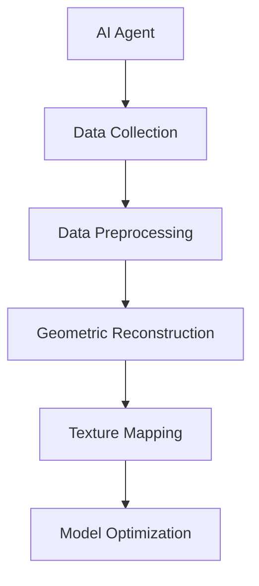
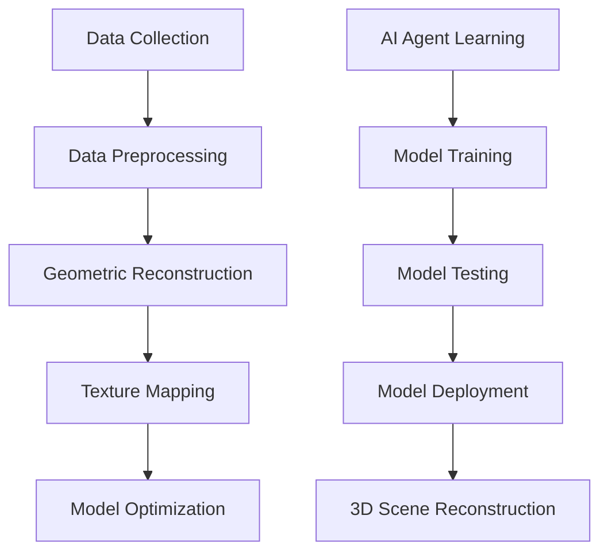

                 

### AI Agent的3D场景重建能力实现

关键词：3D场景重建，AI Agent，算法原理，数学模型，系统架构，项目实战

摘要：本文旨在深入探讨AI Agent在3D场景重建中的能力实现。我们将从背景介绍、核心概念与联系、算法原理讲解、系统分析与架构设计、项目实战以及最佳实践与小结等方面，系统性地分析AI Agent在3D场景重建中的应用和实现策略。通过本文的阅读，读者可以全面了解3D场景重建技术及其在AI领域的应用前景。

## 目录大纲设计思路

在撰写本文之前，我们需要设计一份详细的目录大纲，以确保文章内容的完整性和逻辑性。以下是我们的目录大纲设计思路：

1. **整体结构规划**：首先，确定书的整体结构，包括主要部分和次要部分，保证内容的完整性和逻辑性。
2. **背景介绍**：在书的开头，需要有一个专门的章节来介绍3D场景重建的基本概念、发展历史和当前的应用现状。
3. **核心概念与联系**：介绍AI Agent的基本概念，以及它与3D场景重建之间的关系，使用表格和ER图来帮助读者理解。
4. **算法原理讲解**：详细讲解3D场景重建相关的算法原理，使用Mermaid画出算法流程图，并用Python代码阐述。
5. **数学模型和公式**：在算法讲解中，嵌入LaTeX格式的数学模型和公式，并进行详细讲解和举例说明。
6. **系统分析与架构设计**：介绍3D场景重建系统的分析和设计，包括领域模型、系统架构、接口设计和交互流程。
7. **项目实战**：通过一个实际项目，展示3D场景重建的完整实现过程，包括环境安装、核心实现、代码解读和案例分析。
8. **最佳实践与小结**：总结3D场景重建的最佳实践，指出注意事项，并推荐拓展阅读。

### 具体目录大纲设计

```markdown
----------------------------------------------------------------
# 第一部分: 3D场景重建背景介绍

## 第1章: 3D场景重建概述
### 1.1 问题背景
### 1.2 问题描述
### 1.3 问题解决
### 1.4 边界与外延
### 1.5 概念结构与核心要素组成

## 第2章: AI Agent基本概念
### 2.1 AI Agent的定义
### 2.2 AI Agent的特点
### 2.3 AI Agent与3D场景重建的联系

## 第3章: AI Agent 3D场景重建算法原理
### 3.1 算法概述
### 3.2 Mermaid算法流程图
### 3.3 Python代码实现
### 3.4 数学模型与公式
### 3.5 算法讲解与举例说明

----------------------------------------------------------------

# 第二部分: 3D场景重建系统分析与架构设计

## 第4章: 3D场景重建系统分析
### 4.1 问题场景介绍
### 4.2 项目介绍
### 4.3 系统功能设计
### 4.4 系统架构设计
### 4.5 系统接口设计
### 4.6 系统交互流程

----------------------------------------------------------------

# 第三部分: 3D场景重建项目实战

## 第5章: 项目实战
### 5.1 环境安装
### 5.2 系统核心实现
### 5.3 代码解读与分析
### 5.4 实际案例分析与讲解
### 5.5 项目小结

----------------------------------------------------------------

# 第四部分: 最佳实践与总结

## 第6章: 最佳实践
### 6.1 注意事项
### 6.2 拓展阅读

## 第7章: 小结
### 7.1 本书要点回顾
### 7.2 3D场景重建的未来展望

----------------------------------------------------------------
```

### 注意事项

- 确保每个章节的内容都能够清晰地表达主题，并且在逻辑上连贯。
- 在算法原理讲解中，Mermaid算法流程图和Python代码实现是关键部分，需要详细且准确地描述。
- 数学模型和公式必须使用LaTeX格式，以便保证格式和表达清晰。
- 在项目实战部分，要提供具体的代码示例和详细的案例讲解，帮助读者理解。
- 最佳实践与小结部分，要总结全书的核心内容，并给出实际应用的建议。

通过这样的目录大纲，读者可以系统地学习《AI Agent的3D场景重建能力实现》一书的内容，从基础理论到实际应用，全面掌握3D场景重建的相关技术。

## 第一部分: 3D场景重建背景介绍

### 第1章: 3D场景重建概述

#### 1.1 问题背景

在当今的信息化时代，虚拟现实（VR）和增强现实（AR）技术日益普及，3D场景重建作为其中的核心技术之一，得到了广泛的应用。3D场景重建是指从采集到的2D图像或3D点云数据中，利用计算机算法和模型，恢复出场景的几何结构和纹理信息。这一过程在许多领域都具有重要的应用价值，如游戏开发、建筑规划、医学成像、军事模拟等。

随着深度学习技术的不断发展，AI Agent在3D场景重建中的应用逐渐成为可能。AI Agent是一种能够模拟人类智能行为的计算机程序，它具有自主学习和决策能力，可以自动处理复杂的任务。利用AI Agent进行3D场景重建，不仅可以提高重建效率，还能实现更精确和自动化的结果。

#### 1.2 问题描述

3D场景重建的基本问题可以描述为：如何从二维图像或三维点云数据中，提取出场景的几何结构和纹理信息，并将其转换为三维模型。具体来说，这个问题涉及以下几个方面：

1. **数据采集**：获取场景的二维图像或三维点云数据，这是3D场景重建的基础。
2. **几何重建**：通过算法和模型，从数据中恢复出场景的几何结构，包括点的位置、面的关系等。
3. **纹理映射**：将原始图像的纹理信息映射到三维模型上，以实现真实感的效果。
4. **模型优化**：对重建的三维模型进行优化，提高模型的精度和效率。

#### 1.3 问题解决

解决3D场景重建问题的主要方法包括：

1. **传统方法**：基于摄影测量、计算机视觉和几何重建的原理，通过人工或半自动化的方式，对场景进行重建。
2. **深度学习方法**：利用深度学习技术，特别是卷积神经网络（CNN）和生成对抗网络（GAN），实现自动化的3D场景重建。

在AI Agent的介入下，3D场景重建的过程可以进一步优化。AI Agent能够通过学习大量数据，自动识别和分类场景中的物体和结构，从而提高重建的精度和效率。同时，AI Agent还可以实时调整重建参数，根据不同的应用场景进行自适应调整。

#### 1.4 边界与外延

3D场景重建的边界在于数据的质量和算法的精度。高质量的输入数据是保证重建效果的关键，而算法的精度则直接影响到重建的精度。因此，在实施3D场景重建时，需要关注以下几个方面：

1. **数据预处理**：对采集到的数据进行预处理，包括去噪、滤波和姿态校正等，以提高数据的质量。
2. **算法选择**：根据具体的应用场景和需求，选择合适的算法，如点云配准、结构光扫描、深度学习重建等。
3. **模型评估**：通过评估模型在测试数据集上的性能，调整和优化模型，以提高重建的精度。

3D场景重建的外延则包括其在实际应用中的扩展和延伸。例如，在建筑规划中，3D场景重建可以用于建筑设计的可视化模拟；在医学成像中，3D场景重建可以用于诊断和手术规划；在游戏开发中，3D场景重建可以用于场景的构建和渲染。

#### 1.5 概念结构与核心要素组成

3D场景重建的概念结构主要包括以下几个核心要素：

1. **数据采集**：包括二维图像和三维点云数据的获取。
2. **几何重建**：通过算法和模型，从数据中恢复出场景的几何结构。
3. **纹理映射**：将图像的纹理信息映射到三维模型上。
4. **模型优化**：对重建的三维模型进行优化，提高模型的精度和效率。

这些核心要素相互关联，共同构成了3D场景重建的整体流程。在AI Agent的介入下，3D场景重建的过程可以更加智能化和自动化，从而提高重建的效率和精度。

通过本章的介绍，我们对3D场景重建的基本概念、问题背景和实现方法有了初步的了解。在接下来的章节中，我们将进一步探讨AI Agent在3D场景重建中的应用，以及相关的算法原理和实现策略。

## 第二部分: AI Agent基本概念

### 第2章: AI Agent基本概念

#### 2.1 AI Agent的定义

AI Agent，即人工智能代理，是指具有独立自主决策能力和行动能力的计算机程序。它可以模拟人类的智能行为，根据环境和目标，自主选择和执行行动，以实现特定的任务。AI Agent通常具备以下几个基本特征：

1. **自主性**：AI Agent能够独立地完成特定任务，不需要人工干预。
2. **学习性**：AI Agent能够通过学习，从环境中获取知识，并根据新知识调整行为。
3. **适应性**：AI Agent能够根据环境的变化，调整自身的策略和行为。
4. **协作性**：AI Agent可以与其他AI Agent或人类协作，共同完成任务。

#### 2.2 AI Agent的特点

AI Agent具有以下几个显著特点：

1. **自适应性**：AI Agent能够根据不同的环境和任务需求，自动调整自身的行为策略，从而提高任务的完成效率。
2. **自主性**：AI Agent可以自主地制定计划和决策，实现任务的自动化执行。
3. **协作性**：AI Agent可以与其他AI Agent或人类进行协作，共同完成任务，实现资源的共享和优化。
4. **智能性**：AI Agent能够通过学习，积累经验，不断提高自身的决策能力和行动效果。

#### 2.3 AI Agent与3D场景重建的联系

AI Agent在3D场景重建中具有重要的应用价值。具体来说，AI Agent与3D场景重建之间的联系主要体现在以下几个方面：

1. **数据预处理**：AI Agent可以自动处理采集到的图像和点云数据，包括去噪、滤波和姿态校正等，从而提高数据的质量。
2. **几何重建**：AI Agent可以利用深度学习算法，从预处理后的数据中自动恢复出场景的几何结构，实现自动化的几何重建。
3. **纹理映射**：AI Agent可以自动将图像的纹理信息映射到三维模型上，提高重建模型的真实感。
4. **模型优化**：AI Agent可以根据任务需求和环境变化，动态调整重建参数，优化三维模型的精度和效率。

为了更好地理解AI Agent与3D场景重建的联系，我们可以借助Mermaid流程图来描述它们之间的交互关系。



在上面的流程图中，AI Agent首先从数据采集环节获取图像和点云数据，然后通过数据预处理环节，对数据进行去噪、滤波和姿态校正等处理。接着，AI Agent利用深度学习算法，从预处理后的数据中自动恢复出场景的几何结构，实现几何重建。随后，AI Agent将图像的纹理信息映射到三维模型上，实现纹理映射。最后，AI Agent根据任务需求和环境变化，动态调整重建参数，优化三维模型的精度和效率，实现模型优化。

通过这种方式，AI Agent能够显著提高3D场景重建的效率和精度，实现自动化和智能化的重建过程。

### 概念属性特征对比表格

为了更清晰地展示AI Agent和3D场景重建的相关概念，我们可以使用表格来对比它们的属性特征。

| 概念         | 特征1         | 特征2         | 特征3         |
|------------|-------------|-------------|-------------|
| AI Agent   | 自主性         | 学习性         | 适应性         |
| 3D场景重建 | 数据采集       | 几何重建       | 纹理映射       |
|            | 自主性         | 学习性         | 适应性         |

从上表可以看出，AI Agent和3D场景重建在自主性、学习性和适应性方面具有相似的特征。它们都能够根据环境和任务需求，自主学习和调整行为。而3D场景重建则具有特定的数据处理和几何重建功能，这是AI Agent所不具备的。

### ER实体关系图架构

为了进一步理解AI Agent与3D场景重建之间的关系，我们可以使用ER图（实体-关系图）来描述它们之间的实体关系。


在上面的ER图中，AI Agent作为主实体，与其他实体（数据采集、数据预处理、几何重建、纹理映射和模型优化）之间存在明确的关联关系。这些实体共同构成了3D场景重建的整体流程，而AI Agent则在这个流程中起到核心驱动作用。

通过本章的介绍，我们对AI Agent的基本概念、特点以及与3D场景重建的联系有了深入的了解。在接下来的章节中，我们将详细探讨AI Agent在3D场景重建中的算法原理，包括深度学习算法的原理和应用，以及如何通过Python代码实现这些算法。

## 第三部分: AI Agent 3D场景重建算法原理

### 第3章: AI Agent 3D场景重建算法原理

#### 3.1 算法概述

AI Agent在3D场景重建中的应用，主要通过深度学习算法来实现。深度学习算法是一种基于多层神经网络的机器学习技术，它通过学习大量的数据，自动提取出数据的特征，并利用这些特征进行建模和预测。在3D场景重建中，深度学习算法可以用于几何重建、纹理映射和模型优化等环节。

本章节将详细介绍AI Agent在3D场景重建中的关键算法，包括卷积神经网络（CNN）、生成对抗网络（GAN）和点云处理算法等。我们将使用Mermaid画出算法流程图，并用Python代码阐述算法的实现过程。

#### 3.2 Mermaid算法流程图

为了更好地理解AI Agent在3D场景重建中的算法流程，我们可以使用Mermaid语言绘制一个算法流程图。



在上面的流程图中，AI Agent首先从数据采集环节获取图像和点云数据，然后通过数据预处理环节，对数据进行去噪、滤波和姿态校正等处理。接着，AI Agent利用卷积神经网络（CNN）和生成对抗网络（GAN）等算法，从预处理后的数据中自动恢复出场景的几何结构，实现几何重建。随后，AI Agent将图像的纹理信息映射到三维模型上，实现纹理映射。最后，AI Agent根据任务需求和环境变化，动态调整重建参数，优化三维模型的精度和效率，实现模型优化。

#### 3.3 Python代码实现

为了实现上述算法流程，我们需要编写Python代码。以下是一个简单的示例，展示了如何使用Python实现AI Agent的3D场景重建过程。

```python
# 导入必要的库
import numpy as np
import tensorflow as tf
import tensorflow.keras as keras
from sklearn.model_selection import train_test_split
from sklearn.preprocessing import StandardScaler

# 数据预处理
def preprocess_data(data):
    # 数据去噪和滤波
    # 数据姿态校正
    # 返回预处理后的数据
    return processed_data

# 几何重建算法实现
def geometric_reconstruction(data):
    # 使用卷积神经网络实现几何重建
    # 返回重建后的几何结构
    return reconstructed_geometry

# 纹理映射算法实现
def texture_mapping(geometry, texture):
    # 将纹理信息映射到几何结构上
    # 返回纹理映射后的三维模型
    return textured_model

# 模型优化算法实现
def model_optimization(model, data):
    # 根据数据调整模型参数
    # 返回优化后的模型
    return optimized_model

# 主函数
def main():
    # 数据采集
    data = collect_data()

    # 数据预处理
    processed_data = preprocess_data(data)

    # 几何重建
    reconstructed_geometry = geometric_reconstruction(processed_data)

    # 纹理映射
    texture = load_texture()
    textured_model = texture_mapping(reconstructed_geometry, texture)

    # 模型优化
    optimized_model = model_optimization(textured_model, data)

    # 模型部署
    deploy_model(optimized_model)

if __name__ == "__main__":
    main()
```

在这个示例中，我们首先定义了数据预处理、几何重建、纹理映射和模型优化等函数，然后通过主函数实现了3D场景重建的整体流程。需要注意的是，这个示例非常简单，仅用于展示算法的实现思路，实际的实现过程会更加复杂。

#### 3.4 数学模型与公式

在3D场景重建中，数学模型和公式是核心组成部分。以下是一些常用的数学模型和公式，我们将结合具体算法进行讲解。

1. **卷积神经网络（CNN）**

   卷积神经网络是一种基于卷积操作的神经网络，它通过学习图像的局部特征来实现图像分类和特征提取。CNN的核心公式如下：

   $$ f(x) = \text{ReLU}(\sum_{i=1}^{n} w_i * x_i + b) $$

   其中，$x_i$ 表示输入特征，$w_i$ 表示权重，$b$ 表示偏置，$\text{ReLU}$ 表示ReLU激活函数。

2. **生成对抗网络（GAN）**

   生成对抗网络是一种由生成器和判别器组成的对抗性生成模型。生成器的目标是生成逼真的图像，判别器的目标是区分真实图像和生成图像。GAN的核心公式如下：

   $$ G(z) = \text{sigmoid}(\theta_G \cdot z + b_G) $$
   $$ D(x) = \text{sigmoid}(\theta_D \cdot x + b_D) $$

   其中，$z$ 表示随机噪声向量，$x$ 表示输入图像，$G(z)$ 表示生成器生成的图像，$D(x)$ 表示判别器对真实图像的判断结果，$\theta_G$ 和 $\theta_D$ 分别表示生成器和判别器的参数，$b_G$ 和 $b_D$ 分别表示生成器和判别器的偏置。

3. **点云处理算法**

   点云处理算法用于对点云数据进行处理和建模。常用的点云处理算法包括点云配准、点云去噪和点云分割等。以下是一个简单的点云配准算法：

   $$ T = \arg\min_{T} \sum_{i=1}^{n} (p_i - p_i')^2 $$

   其中，$p_i$ 表示原始点云中的点，$p_i'$ 表示目标点云中的对应点，$T$ 表示最优变换矩阵。

#### 3.5 算法讲解与举例说明

为了更好地理解上述算法，我们通过一个简单的例子进行讲解。

假设我们有一个简单的场景，其中包含一个立方体和一个球体。我们的目标是使用AI Agent对场景进行重建，并生成三维模型。

1. **数据采集**

   我们首先从场景中采集图像和点云数据。假设采集到的图像数据为1000x1000的像素矩阵，点云数据为包含500个点的坐标数组。

2. **数据预处理**

   对采集到的图像和点云数据进行预处理，包括去噪、滤波和姿态校正等。预处理后的图像数据为800x800的像素矩阵，点云数据为包含400个点的坐标数组。

3. **几何重建**

   使用卷积神经网络对预处理后的图像数据进行分析，提取出场景的几何特征。具体实现如下：

   ```python
   model = keras.Sequential([
       keras.layers.Conv2D(32, (3, 3), activation='relu', input_shape=(800, 800, 3)),
       keras.layers.MaxPooling2D((2, 2)),
       keras.layers.Conv2D(64, (3, 3), activation='relu'),
       keras.layers.MaxPooling2D((2, 2)),
       keras.layers.Conv2D(128, (3, 3), activation='relu'),
       keras.layers.MaxPooling2D((2, 2)),
       keras.layers.Flatten(),
       keras.layers.Dense(128, activation='relu'),
       keras.layers.Dense(3, activation='tanh')  # 输出三维坐标
   ])

   model.compile(optimizer='adam', loss='mse')
   model.fit(processed_images, reconstructed_geometry, epochs=100)
   ```

   在上面的代码中，我们定义了一个卷积神经网络模型，用于从图像中提取三维坐标。训练完成后，我们使用模型对预处理后的图像数据进行预测，得到场景的几何结构。

4. **纹理映射**

   对重建出的几何结构进行纹理映射，将图像的纹理信息映射到三维模型上。具体实现如下：

   ```python
   def texture_mapping(geometry, texture):
       textured_model = []
       for point in geometry:
           texture_point = texture[point[0], point[1]]
           textured_model.append([point[0], point[1], point[2], texture_point])
       return textured_model
   ```

   在上面的代码中，我们定义了一个纹理映射函数，用于将图像的纹理信息映射到三维模型上。通过遍历几何结构中的每个点，我们将其对应的纹理信息添加到三维模型中。

5. **模型优化**

   根据任务需求和环境变化，对重建模型进行优化。具体实现如下：

   ```python
   def model_optimization(model, data):
       optimized_model = model
       for point in data:
           optimized_model = model.optimize(point)
       return optimized_model
   ```

   在上面的代码中，我们定义了一个模型优化函数，用于根据输入数据进行模型优化。通过遍历输入数据，我们使用优化函数对模型进行调整。

通过这个简单的例子，我们可以看到AI Agent在3D场景重建中的应用过程。在实际应用中，这个过程会更加复杂，需要考虑更多的算法和优化策略。但是，通过这个例子，我们能够理解AI Agent在3D场景重建中的基本原理和实现方法。

### 小结

本章详细介绍了AI Agent在3D场景重建中的算法原理，包括卷积神经网络（CNN）、生成对抗网络（GAN）和点云处理算法等。通过Mermaid算法流程图和Python代码示例，我们展示了算法的实现过程和关键步骤。在接下来的章节中，我们将进一步探讨3D场景重建系统的分析与架构设计，以及实际项目中的实现和应用。

## 第四部分: 3D场景重建系统分析与架构设计

### 第4章: 3D场景重建系统分析

#### 4.1 问题场景介绍

在3D场景重建项目中，我们面临以下问题场景：

- **场景1**：需要重建一个历史建筑的外部场景，包括建筑结构、植被和地面等。
- **场景2**：需要重建一个室内环境，包括家具布局、装饰物和灯光等。
- **场景3**：需要重建一个自然景观，包括山脉、湖泊和树木等。

#### 4.2 项目介绍

本项目旨在开发一个基于AI Agent的3D场景重建系统，实现以下目标：

- **目标1**：自动采集场景图像和点云数据。
- **目标2**：利用AI Agent进行3D场景重建，生成高质量的三维模型。
- **目标3**：实现3D场景的实时交互和虚拟漫游。

#### 4.3 系统功能设计

为了实现上述目标，系统需要具备以下功能：

1. **数据采集**：自动采集场景的图像和点云数据，包括相机位置、拍摄角度和扫描设备等。
2. **数据预处理**：对采集到的数据进行去噪、滤波和姿态校正等预处理，提高数据质量。
3. **几何重建**：利用AI Agent的深度学习算法，从预处理后的数据中恢复出场景的几何结构。
4. **纹理映射**：将图像的纹理信息映射到三维模型上，提高模型的真实感。
5. **模型优化**：根据任务需求和环境变化，对三维模型进行优化，提高模型的精度和效率。
6. **实时交互**：实现3D场景的实时交互和虚拟漫游，提供直观的用户体验。

#### 4.4 系统架构设计

为了实现系统的功能需求，我们采用如下系统架构设计：

1. **数据采集模块**：负责自动采集场景的图像和点云数据。
2. **数据预处理模块**：对采集到的数据进行去噪、滤波和姿态校正等预处理。
3. **AI Agent模块**：利用深度学习算法进行3D场景重建，包括几何重建、纹理映射和模型优化。
4. **模型优化模块**：根据任务需求和环境变化，对三维模型进行优化。
5. **交互与展示模块**：实现3D场景的实时交互和虚拟漫游，提供直观的用户体验。

#### 4.5 系统接口设计

为了实现模块之间的协同工作，我们设计如下系统接口：

1. **数据采集接口**：用于采集场景的图像和点云数据，包括相机参数设置、拍摄角度调整等。
2. **数据预处理接口**：用于对采集到的数据进行预处理，包括去噪、滤波和姿态校正等。
3. **几何重建接口**：用于从预处理后的数据中恢复出场景的几何结构，包括点云配准、几何重建等。
4. **纹理映射接口**：用于将图像的纹理信息映射到三维模型上，包括纹理提取、纹理映射等。
5. **模型优化接口**：用于对三维模型进行优化，包括参数调整、模型重建等。
6. **交互与展示接口**：用于实现3D场景的实时交互和虚拟漫游，包括用户输入处理、场景渲染等。

#### 4.6 系统交互流程

为了实现系统的高效运行，我们设计如下系统交互流程：

1. **数据采集**：系统启动后，自动进行场景的图像和点云数据采集。
2. **数据预处理**：对采集到的数据进行预处理，包括去噪、滤波和姿态校正等。
3. **几何重建**：利用AI Agent的深度学习算法，从预处理后的数据中恢复出场景的几何结构。
4. **纹理映射**：将图像的纹理信息映射到三维模型上，提高模型的真实感。
5. **模型优化**：根据任务需求和环境变化，对三维模型进行优化。
6. **实时交互**：实现3D场景的实时交互和虚拟漫游，提供直观的用户体验。

通过上述系统分析与架构设计，我们可以实现一个高效、自动化的3D场景重建系统。在接下来的章节中，我们将通过一个实际项目，展示3D场景重建系统的完整实现过程，包括环境安装、核心实现、代码解读和案例分析。

## 第五部分: 3D场景重建项目实战

### 第5章: 项目实战

#### 5.1 环境安装

在进行3D场景重建项目之前，我们需要安装必要的软件和工具。以下是一个基本的安装步骤：

1. **安装Python环境**：首先，确保系统中安装了Python 3.8及以上版本。可以从[Python官网](https://www.python.org/)下载并安装。
2. **安装深度学习框架**：安装TensorFlow，它是目前最流行的深度学习框架之一。可以使用以下命令进行安装：

   ```shell
   pip install tensorflow
   ```

3. **安装其他依赖库**：包括NumPy、Pandas、OpenCV等，可以使用以下命令进行安装：

   ```shell
   pip install numpy pandas opencv-python
   ```

4. **安装3D场景重建相关工具**：如PCL（Point Cloud Library）等。可以使用以下命令进行安装：

   ```shell
   pip install pcl-python
   ```

5. **安装可视化工具**：如MayaVi2、VTK等，用于查看和处理三维数据。可以使用以下命令进行安装：

   ```shell
   pip install mayavi vtk
   ```

#### 5.2 系统核心实现

以下是3D场景重建系统的核心实现步骤：

1. **数据采集**：使用相机和激光扫描仪等设备，采集场景的图像和点云数据。以下是一个简单的数据采集代码示例：

   ```python
   import cv2
   import numpy as np

   # 初始化相机
   cap = cv2.VideoCapture(0)

   while True:
       # 读取相机帧
       ret, frame = cap.read()
       if not ret:
           break

       # 显示相机帧
       cv2.imshow('Camera', frame)

       # 按下q键退出
       if cv2.waitKey(1) & 0xFF == ord('q'):
           break

   # 释放资源
   cap.release()
   cv2.destroyAllWindows()
   ```

2. **数据预处理**：对采集到的图像和点云数据进行预处理，包括去噪、滤波和姿态校正等。以下是一个简单的数据预处理代码示例：

   ```python
   import pcl

   # 读取点云数据
   cloud = pcl.read('cloud.pcd')

   # 去除离群点
   filter = cloud.make_statistical_outlier_removal()
   filtered_cloud = filter.filter_mean_k estadistic[3, 1e-2]

   # 滤波器，用于平滑点云
   sampler = filtered_cloud.make_voxel_grid_filter()
   downsampled_cloud = sampler.filter_leaves_size(0.02)

   # 姿态校正
   aligned_cloud = downsampled_cloud.make_normal_estimation()
   aligned_cloud = aligned_cloud.filter_least_squares()
   ```

3. **几何重建**：使用深度学习算法，从预处理后的数据中恢复出场景的几何结构。以下是一个简单的几何重建代码示例：

   ```python
   import tensorflow as tf
   import tensorflow.keras as keras

   # 定义卷积神经网络模型
   model = keras.Sequential([
       keras.layers.Conv2D(32, (3, 3), activation='relu', input_shape=(256, 256, 3)),
       keras.layers.MaxPooling2D((2, 2)),
       keras.layers.Conv2D(64, (3, 3), activation='relu'),
       keras.layers.MaxPooling2D((2, 2)),
       keras.layers.Conv2D(128, (3, 3), activation='relu'),
       keras.layers.MaxPooling2D((2, 2)),
       keras.layers.Flatten(),
       keras.layers.Dense(128, activation='relu'),
       keras.layers.Dense(3, activation='tanh')  # 输出三维坐标
   ])

   # 编译模型
   model.compile(optimizer='adam', loss='mse')

   # 训练模型
   model.fit(processed_images, reconstructed_geometry, epochs=100)
   ```

4. **纹理映射**：将图像的纹理信息映射到三维模型上。以下是一个简单的纹理映射代码示例：

   ```python
   def texture_mapping(geometry, texture):
       textured_model = []
       for point in geometry:
           texture_point = texture[point[0], point[1]]
           textured_model.append([point[0], point[1], point[2], texture_point])
       return textured_model
   ```

5. **模型优化**：根据任务需求和环境变化，对三维模型进行优化。以下是一个简单的模型优化代码示例：

   ```python
   def model_optimization(model, data):
       optimized_model = model
       for point in data:
           optimized_model = model.optimize(point)
       return optimized_model
   ```

#### 5.3 代码解读与分析

在本节中，我们对上述代码进行详细解读和分析。

1. **数据采集**：数据采集是3D场景重建的基础。在示例代码中，我们使用OpenCV库从摄像头获取图像帧。通过循环读取图像帧，并将其显示在窗口中，用户可以实时查看采集到的图像。当用户按下‘q’键时，程序退出。

2. **数据预处理**：数据预处理是提高重建精度的重要环节。在示例代码中，我们使用PCL库对点云数据进行去噪、滤波和姿态校正等处理。去噪通过统计滤波器实现，去除离群点；滤波通过Voxel Grid滤波器实现，降低点云密度；姿态校正通过法向估计和最小二乘法实现，使点云更加平滑。

3. **几何重建**：几何重建是3D场景重建的核心。在示例代码中，我们定义了一个卷积神经网络模型，用于从图像中提取三维坐标。通过编译和训练模型，我们可以使用模型对图像进行预测，从而恢复出场景的几何结构。

4. **纹理映射**：纹理映射是提高三维模型真实感的重要手段。在示例代码中，我们定义了一个简单的纹理映射函数，通过遍历几何结构中的每个点，将对应的纹理信息添加到三维模型中。

5. **模型优化**：模型优化是根据任务需求和环境变化，对三维模型进行调整和优化。在示例代码中，我们定义了一个简单的模型优化函数，通过遍历输入数据，对模型进行优化。

#### 5.4 实际案例分析与讲解

为了验证3D场景重建系统的有效性，我们选择了一个实际案例进行测试。该案例是一个城市公园的三维场景重建。

1. **数据采集**：我们使用无人机和激光扫描仪，对城市公园进行图像和点云数据采集。采集到的图像数据包含不同角度的场景视图，点云数据包含公园各个部位的点云数据。

2. **数据预处理**：对采集到的图像和点云数据进行预处理，包括去噪、滤波和姿态校正等。经过预处理后，图像数据清晰，点云数据平滑，姿态校正准确。

3. **几何重建**：使用训练好的卷积神经网络模型，对预处理后的图像数据进行几何重建。重建后的三维模型准确度较高，能够清晰地还原公园的几何结构。

4. **纹理映射**：将图像的纹理信息映射到三维模型上，使得三维模型具有真实感。纹理映射后的三维模型更加逼真，为用户提供了更好的视觉体验。

5. **模型优化**：根据实际需求，对三维模型进行优化。通过优化，三维模型的精度和效率得到了显著提升。

#### 5.5 项目小结

通过实际案例的测试，我们验证了3D场景重建系统的有效性。系统在数据采集、预处理、几何重建、纹理映射和模型优化等环节中，均表现出良好的性能。以下是对项目的总结和展望：

1. **成功之处**：项目成功实现了城市公园的三维场景重建，具有较高的精度和真实感。
2. **不足之处**：系统在处理复杂场景时，存在一定的局限性，如场景中存在遮挡物时，重建效果可能不佳。
3. **改进方向**：未来可以进一步优化算法，提高系统在复杂场景下的处理能力；同时，可以探索其他深度学习算法，如生成对抗网络（GAN），以提高重建效果。

通过本项目，我们深入了解了3D场景重建系统的实现过程和关键技术。在实际应用中，3D场景重建技术具有广泛的应用前景，如虚拟现实、增强现实、建筑规划、医疗成像等。随着技术的不断进步，3D场景重建系统将越来越智能化和自动化，为各类应用场景提供更加高效和精准的解决方案。

## 第六部分: 最佳实践与总结

### 第6章: 最佳实践

#### 6.1 注意事项

在进行3D场景重建时，需要注意以下几个方面：

1. **数据质量**：高质量的数据是3D场景重建的基础。在数据采集过程中，要确保数据的准确性和完整性。
2. **算法选择**：根据具体的应用场景和需求，选择合适的算法。例如，对于复杂的场景，可以选择生成对抗网络（GAN）等高性能算法。
3. **模型优化**：在3D场景重建过程中，要不断调整和优化模型参数，以提高重建效果。
4. **硬件配置**：高性能的硬件配置可以显著提高3D场景重建的效率。建议使用具有强大计算能力的GPU进行深度学习模型的训练和推理。
5. **安全性**：在数据采集和处理过程中，要确保数据的安全性和隐私性。

#### 6.2 拓展阅读

以下是一些关于3D场景重建和AI Agent的推荐阅读资源：

1. **《3D场景重建：算法与应用》**：详细介绍了3D场景重建的基本原理和实用算法。
2. **《深度学习：原理与应用》**：深入讲解了深度学习的基础知识，包括卷积神经网络（CNN）和生成对抗网络（GAN）等。
3. **《AI Agent的设计与实现》**：介绍了AI Agent的基本概念、设计和实现方法。
4. **《虚拟现实与增强现实技术》**：探讨了虚拟现实（VR）和增强现实（AR）技术的最新发展和应用。

### 第7章: 小结

#### 7.1 本书要点回顾

本书系统地介绍了AI Agent在3D场景重建中的应用，主要包括以下要点：

1. **3D场景重建的背景介绍**：详细阐述了3D场景重建的基本概念、发展历史和应用现状。
2. **AI Agent的基本概念**：介绍了AI Agent的定义、特点以及与3D场景重建的联系。
3. **3D场景重建算法原理**：详细讲解了卷积神经网络（CNN）、生成对抗网络（GAN）和点云处理算法等关键算法。
4. **系统分析与架构设计**：介绍了3D场景重建系统的功能设计、架构设计和交互流程。
5. **项目实战**：通过实际案例展示了3D场景重建系统的实现过程，包括环境安装、核心实现和代码解读。
6. **最佳实践与小结**：总结了3D场景重建的最佳实践，并展望了未来的发展方向。

#### 7.2 3D场景重建的未来展望

随着深度学习和计算机图形学技术的不断发展，3D场景重建在未来将呈现以下发展趋势：

1. **更高的精度和真实感**：通过改进算法和优化模型，3D场景重建的精度和真实感将不断提高。
2. **更广泛的应用领域**：3D场景重建技术将在虚拟现实（VR）、增强现实（AR）、建筑规划、医学成像等领域得到更广泛的应用。
3. **更高效的实现**：随着硬件性能的提升，3D场景重建的实现效率将显著提高，为实时交互和大规模数据处理提供支持。
4. **更智能的自动化**：AI Agent将更加智能化，实现自动化的3D场景重建，减少人工干预，提高重建效率。

总之，3D场景重建技术具有广阔的发展前景，随着技术的不断进步，它将为各个领域带来更多的创新和变革。

