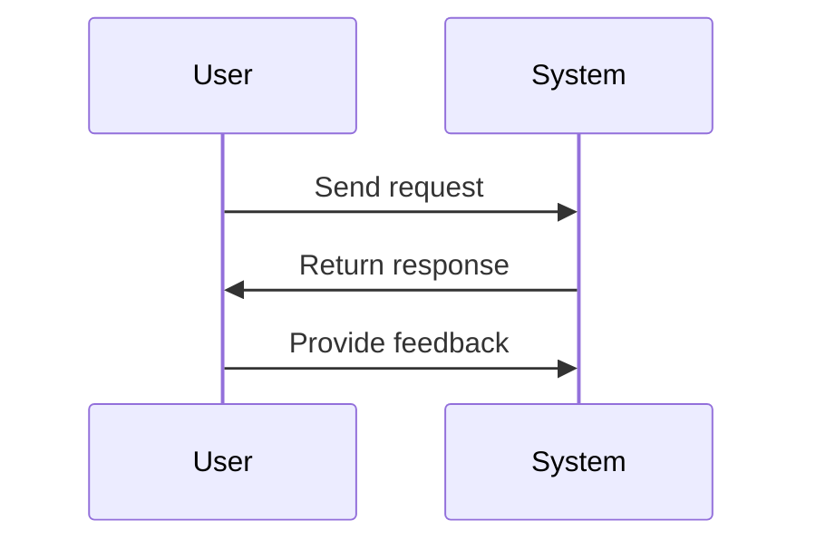

                 


### Step 1: Introduction and Background

#### Article Title: AI Agent's Personalization: User Profiles and Preference Learning

**Keywords: AI Agent, Personalization, User Profiles, Preference Learning**

**Abstract:**
This article delves into the concept of AI agents, focusing on their ability to personalize user experiences through the construction of user profiles and the learning of user preferences. We explore the fundamental concepts, principles, and practical applications of this technology, offering a comprehensive guide for both beginners and experts in the field.

#### Chapter 1: Problem Background and Core Concepts

**1.1 Problem Background**

**1.1.1 The Rise of AI Agents**
- Definition and importance of AI agents
- Historical development of AI agents

**1.1.2 The Need for Personalized Services**
- Importance of personalized user experiences
- Challenges in delivering personalized services

**1.1.3 Core Concepts**

**1.1.3.1 User Profiles**
- Definition and components of user profiles
- Applications of user profiles

**1.1.3.2 Preference Learning**
- Definition and types of preference learning
- Methods for preference learning

**1.1.4 Boundaries and Extensions**
- Boundaries of personalized services
- Relationships between user profiles and preference learning

#### Chapter 2: User Profile Principles

**2.1 User Profile Basics**

**2.1.1 Definition of User Profiles**
$$
User\ Profile = Basic\ Attributes + Behavioral\ Features + Preference\ Features
$$

**2.1.2 Characteristics of User Profiles**
- Completeness
- Real-time updating
- Fine-grained segmentation

**2.2 User Profile Construction Methods**

**2.2.1 Data Collection**
- Data sources
- Data processing

**2.2.2 Data Analysis and Mining**
- Data preprocessing
- Feature extraction
- User behavior analysis

**2.3 User Profile Application Cases**
- E-commerce platforms
- Social media
- Entertainment industry

#### Chapter 3: Preference Learning Principles

**3.1 Preference Learning Basics**

**3.1.1 Definition of Preference Learning**
- Purpose and process of preference learning

**3.1.2 Methods for Preference Learning**
- Collaborative filtering
- Content-based recommendation
- Deep learning

**3.2 Preference Learning Algorithms**

**3.2.1 Matrix Factorization**
- Principles of matrix factorization
- Common algorithms

**3.2.2 Deep Learning**
- Neural network architecture
- Algorithm implementation

**3.3 Preference Learning Application Cases**
- E-commerce
- Social media
- Education sector

#### Chapter 4: The Relationship Between User Profiles and Preference Learning

**4.1 The Relationship Between User Profiles and Preference Learning**
- Impact of user profiles on preference learning
- Optimization of user profiles through preference learning

**4.2 Joint Modeling**
- Principles of joint modeling
- Modeling methods

#### Chapter 5: Conclusion

### Step 2: Fundamental Concepts and Principles

#### Chapter 6: System Analysis and Design

**6.1 System Function Design**
- Overview of system functions
- Module division

**6.2 System Architecture Design**
- Overview of system architecture
- Component design

**6.3 System Interface Design**
- Interface specifications
- Interface implementation

**6.4 System Interaction Design**
```

### Step 3: System Analysis and Design (Continued)

**6.4 System Interaction Design**



#### Chapter 7: Implementation and Optimization

**7.1 Environment Installation**
- Requirements
- Installation steps

**7.2 Core System Implementation**
```python
# Example Python code for core system implementation
```

**7.3 Code Application Explanation and Analysis**
- Code architecture analysis
- Key code interpretation

**7.4 Practical Case Analysis and Explanation**
- Case analysis
- Detailed explanation and dissection

#### Chapter 8: Best Practices, Summary, and Extensions

**8.1 Best Practices Tips**
- Tips for effective implementation

**8.2 Summary**
- Key takeaways

**8.3 Notes and Precautions**
- Points to be aware of

**8.4 Further Reading**
- Suggested resources for deeper understanding

### Conclusion

**Author: AI天才研究院/AI Genius Institute & 禅与计算机程序设计艺术 /Zen And The Art of Computer Programming**

