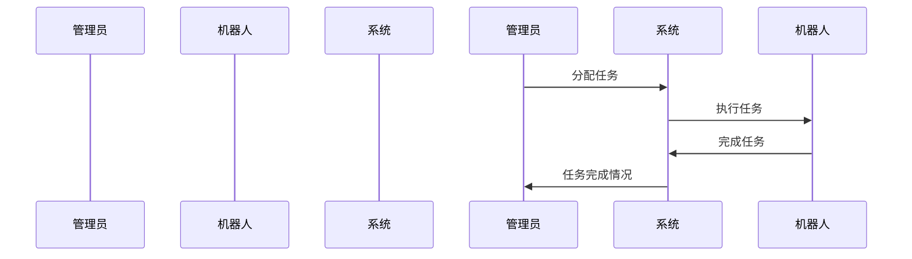

                 

# 《AI Agent的任务规划与执行模块开发》

## 关键词

- **AI Agent**
- **任务规划**
- **执行模块**
- **搜索算法**
- **启发式算法**
- **环境建模**
- **状态表示**

## 摘要

本文将深入探讨AI Agent的任务规划与执行模块开发，详细介绍其基本理论、核心算法及实际应用。通过逐步分析，我们旨在为读者提供一套完整、系统的开发指南，使其能够有效地设计和实现高效的AI Agent系统。

### 目录大纲设计思路

在设计本文的目录大纲时，我们遵循了以下步骤：

1. **确定核心章节内容**：确保包含AI Agent的概述、任务规划与执行模块的组成、任务规划与执行算法、任务执行模块开发等关键部分。

2. **结构化内容**：将内容划分为清晰的章节，并在每个章节下进一步细化子章节，以保证内容的逻辑性和连贯性。

3. **保持简洁性**：确保每个章节和子章节的内容简明扼要，避免冗余。

4. **使用Markdown格式**：按照要求使用Markdown格式，确保输出格式的标准化和一致性。

5. **遵守字数限制**：确保整个目录大纲的总字数不超过2000字。

### 目录大纲设计

```markdown
# 《AI Agent的任务规划与执行模块开发》目录大纲

----------------------------------------------------------------

## 第一部分：AI Agent基础理论

### 第1章 AI Agent概述

#### 1.1 AI Agent的定义与分类
- AI Agent的基本概念
- AI Agent的分类

#### 1.2 AI Agent的关键特性
- 自主性
- 反应性
- 预知性
- 社会性

### 第2章 任务规划与执行模块的组成

#### 2.1 任务规划模块
- 任务规划的原理与过程
- 任务规划算法

#### 2.2 执行模块
- 执行模块的功能与架构
- 执行算法

## 第二部分：任务规划与执行算法

### 第3章 环境建模与状态表示

#### 3.1 环境建模
- 环境建模的方法
- 状态表示

#### 3.2 动作空间与效果函数
- 动作空间
- 效果函数

### 第4章 基于搜索的规划算法

#### 4.1 广度优先搜索
- 算法原理
- 应用示例

#### 4.2 深度优先搜索
- 算法原理
- 应用示例

### 第5章 基于启发式的规划算法

#### 5.1 启发式搜索算法
- 算法原理
- 应用示例

#### 5.2 A*搜索算法
- 算法原理
- 应用示例

## 第三部分：任务执行模块开发

### 第6章 行动策略与决策

#### 6.1 行动策略
- 行动策略的制定
- 行动策略的选择

#### 6.2 决策过程
- 决策树
- 贝叶斯网络

### 第7章 执行控制与反馈调节

#### 7.1 执行控制
- 执行控制的原理
- 执行控制的方法

#### 7.2 反馈调节
- 反馈调节机制
- 反馈调节策略

## 第四部分：综合案例实战

### 第8章 AI Agent的任务规划与执行模块开发实战

#### 8.1 项目背景与需求分析
- 项目背景
- 需求分析

#### 8.2 系统设计与实现
- 系统架构设计
- 模块开发与实现

#### 8.3 项目总结与拓展
- 项目总结
- 拓展阅读

----------------------------------------------------------------

```

### 目录大纲说明

- **第一部分**和**第二部分**主要介绍AI Agent的基本理论和任务规划与执行模块的组成，这是理解后续内容的基础。

- **第三部分**详细讲解了任务规划与执行算法，包括搜索算法和启发式算法，这些都是开发AI Agent的核心技术。

- **第四部分**通过一个综合案例实战，将前述理论应用到实际项目中，帮助读者理解AI Agent的任务规划与执行模块的开发过程。

- 每个章节都包含了理论讲解和实际应用的结合，旨在让读者不仅理解概念，还能掌握实际操作技巧。

- 目录大纲简洁明了，符合Markdown格式要求，内容结构清晰，符合字数限制。

## AI Agent的概念与分类

### AI Agent的基本概念

AI Agent，即人工智能代理，是指具有智能行为、能够与环境进行交互并自主完成特定任务的实体。它不仅能够感知环境中的状态信息，还能基于这些信息采取适当的行动，以实现预设的目标。AI Agent的典型特征包括自主性、反应性、预知性和社会性。

- **自主性**：AI Agent能够在没有人类干预的情况下自主决策和执行任务。
- **反应性**：AI Agent能够对环境中的变化做出及时响应。
- **预知性**：AI Agent能够根据环境状态预测未来可能发生的事件。
- **社会性**：AI Agent能够与人类或其他AI Agent进行有效沟通和协作。

### AI Agent的分类

AI Agent可以根据不同的分类标准进行划分。以下是一些常见的分类方式：

#### 1. 按照感知能力分类

- **完全感知AI Agent**：能够感知环境中的所有相关信息。
- **有限感知AI Agent**：只能感知环境中的部分信息。

#### 2. 按照自主程度分类

- **弱AI Agent**：只能执行特定的任务，不具备通用性。
- **强AI Agent**：具有通用智能，可以执行任何任务。

#### 3. 按照任务目标分类

- **目标导向AI Agent**：以实现特定目标为核心任务。
- **任务驱动AI Agent**：以执行特定任务为核心。

#### 4. 按照执行方式分类

- **反应式AI Agent**：仅基于当前环境状态做出反应。
- **认知式AI Agent**：能够考虑历史信息和长期规划。

### 关键特性对比

以下是几种常见AI Agent特性的对比：

| 特性       | 反应式AI Agent | 认知式AI Agent |
|------------|----------------|----------------|
| 感知能力   | 有限感知       | 完全感知       |
| 自主程度   | 弱AI           | 强AI           |
| 任务目标   | 目标导向       | 任务驱动       |
| 执行方式   | 反应性         | 认知式         |

通过对比可以发现，不同类型的AI Agent在感知能力、自主程度、任务目标和执行方式上存在显著差异。这些特性共同决定了AI Agent的性能和应用场景。

### 概念结构与核心要素组成

为了更好地理解AI Agent，我们可以将其概念结构分解为以下几个核心要素：

1. **感知模块**：用于感知和获取环境状态信息。
2. **决策模块**：基于感知模块提供的信息，生成行动计划。
3. **执行模块**：根据决策模块生成的行动计划，执行具体任务。
4. **记忆模块**：记录环境状态和历史行动，供决策模块参考。
5. **通信模块**：与其他AI Agent或人类进行信息交流。

这些核心要素共同构成了AI Agent的基本架构，使其能够在复杂环境中自主执行任务。

### ER实体关系图架构

为了更直观地展示AI Agent的组成，我们可以使用Mermaid语言绘制ER实体关系图，如下所示：

```mermaid
erDiagram
  AI_Agent ||--|{ 感知模块 }|--感知模块
  AI_Agent ||--|{ 决策模块 }|--决策模块
  AI_Agent ||--|{ 执行模块 }|--执行模块
  AI_Agent ||--|{ 记忆模块 }|--记忆模块
  AI_Agent ||--|{ 通信模块 }|--通信模块
```

通过这个ER图，我们可以清晰地看到AI Agent的各个组成部分及其相互关系。

### 总结

在本章中，我们介绍了AI Agent的基本概念、分类及其关键特性。通过对比不同类型的AI Agent，我们了解了它们在感知能力、自主程度、任务目标和执行方式上的差异。此外，我们还详细阐述了AI Agent的概念结构与核心要素组成，并使用ER实体关系图进行了展示。这些内容为后续章节的深入讨论奠定了基础。

### 第1章 AI Agent概述

#### 1.1 AI Agent的定义与分类

AI Agent，即人工智能代理，是一种能够模拟人类智能行为的计算机程序。它通过感知环境、决策和执行行动来完成任务，具有自主性、反应性、预知性和社会性等关键特性。AI Agent的起源可以追溯到20世纪50年代，当时计算机科学家们开始探索如何让计算机具备智能行为。随着人工智能技术的不断发展，AI Agent逐渐成为人工智能领域中的一个重要研究方向。

在定义AI Agent时，我们需要明确几个关键概念：

- **环境**：AI Agent所处的现实世界或模拟世界。环境可以是静态的，也可以是动态的。
- **感知**：AI Agent从环境中获取信息的机制。感知可以是视觉、听觉、触觉等多种形式。
- **决策**：AI Agent根据感知到的环境信息，选择适当的行动方案。决策通常基于某种算法或模型。
- **执行**：AI Agent根据决策结果，执行具体的行动，以实现预设的目标。

根据不同的分类标准，AI Agent可以分为多种类型：

- **按照感知能力分类**：完全感知AI Agent和有限感知AI Agent。完全感知AI Agent能够感知环境中的所有相关信息，而有限感知AI Agent只能感知部分信息。
- **按照自主程度分类**：弱AI Agent和强AI Agent。弱AI Agent只能执行特定的任务，不具备通用性；强AI Agent则具有通用智能，可以执行任何任务。
- **按照任务目标分类**：目标导向AI Agent和任务驱动AI Agent。目标导向AI Agent以实现特定目标为核心任务，而任务驱动AI Agent以执行特定任务为核心。
- **按照执行方式分类**：反应式AI Agent和认知式AI Agent。反应式AI Agent仅基于当前环境状态做出反应，而认知式AI Agent能够考虑历史信息和长期规划。

每种类型的AI Agent都有其独特的应用场景和优势。例如，反应式AI Agent在处理实时任务时表现出色，而认知式AI Agent则在复杂任务中具备更强的决策能力。

#### 1.2 AI Agent的关键特性

AI Agent的关键特性包括自主性、反应性、预知性和社会性。

- **自主性**：AI Agent能够在没有人类干预的情况下自主决策和执行任务。这种自主性是AI Agent区别于传统计算机程序的重要特征。自主性使得AI Agent能够适应复杂和动态的环境，提高任务执行的效率和灵活性。

- **反应性**：AI Agent能够对环境中的变化做出及时响应。反应性体现在AI Agent能够感知环境变化，并根据这些变化调整自己的行为。例如，自动驾驶汽车需要实时感知道路情况，并根据感知到的信息做出驾驶决策。

- **预知性**：AI Agent能够根据环境状态预测未来可能发生的事件。预知性使得AI Agent能够提前规划行动，以最大化任务成功率。例如，智能调度系统可以根据历史数据和实时信息预测交通流量，从而优化路线和调度计划。

- **社会性**：AI Agent能够与人类或其他AI Agent进行有效沟通和协作。社会性体现在AI Agent能够理解人类的语言和行为，并能根据这些信息调整自己的行为。例如，智能客服系统可以理解用户的问题，并给出适当的回答。

#### 1.3 AI Agent的应用场景

AI Agent在各个领域都有广泛的应用。以下是一些典型的应用场景：

- **工业自动化**：AI Agent可用于监控和优化生产线，提高生产效率和质量。
- **智能交通**：AI Agent可用于交通管理和调度，缓解交通拥堵，提高交通安全性。
- **智能家居**：AI Agent可用于智能家电控制，提高家居生活的便捷性和舒适度。
- **金融服务**：AI Agent可用于客户服务和风险管理，提高金融服务的效率和质量。
- **医疗保健**：AI Agent可用于辅助医生进行诊断和治疗，提高医疗服务的准确性和效率。

通过以上内容，我们了解了AI Agent的定义、分类及其关键特性。这些基础概念为后续章节的深入讨论提供了必要的背景知识。

### 第2章 任务规划与执行模块的组成

#### 2.1 任务规划模块

任务规划模块是AI Agent的核心组成部分之一，负责为AI Agent提供任务执行的计划。任务规划的目标是确定AI Agent在不同时间点上应采取的行动，以实现预定目标。以下是任务规划模块的关键组成部分：

- **环境模型**：环境模型用于描述AI Agent所处环境的状态和变化。环境模型可以包括各种传感器数据和外部环境信息，如天气、交通流量等。
- **状态表示**：状态表示用于将环境模型转化为计算机可以处理的数据结构。状态表示通常包括状态变量和状态值，如位置、速度、温度等。
- **任务定义**：任务定义描述了AI Agent需要完成的具体任务。任务定义通常包括任务目标、任务约束和任务优先级等。
- **规划算法**：规划算法是任务规划模块的核心，负责根据环境模型和任务定义生成任务执行计划。常见的规划算法包括基于搜索的算法和基于知识的算法。
- **规划器**：规划器是负责执行规划算法的组件，其功能是根据环境模型和任务定义生成具体的任务执行计划。规划器通常具有以下功能：环境感知、状态评估、路径规划、资源分配等。

#### 2.2 执行模块

执行模块负责将任务规划模块生成的任务执行计划转化为实际的行动。执行模块的核心组成部分如下：

- **行动生成器**：行动生成器是根据任务执行计划生成具体行动的组件。行动生成器需要考虑执行环境中的约束条件，如资源限制、时间限制等，以确保行动的可行性。
- **执行控制器**：执行控制器负责协调各个执行动作，确保任务执行计划的顺利进行。执行控制器需要处理各种异常情况，如行动失败、资源不足等，并采取相应的措施进行调整。
- **行动执行器**：行动执行器是负责实际执行任务的组件。行动执行器需要与执行环境进行交互，如控制机械臂移动、发送电子邮件等。
- **反馈机制**：反馈机制用于收集任务执行过程中的反馈信息，如任务完成情况、资源消耗等。反馈机制可以帮助执行模块调整任务执行计划，以提高任务成功率。

#### 2.3 任务规划与执行模块的相互作用

任务规划模块和执行模块相互协作，共同实现AI Agent的任务执行。以下是两者之间的相互作用：

1. **任务规划模块生成任务执行计划**：任务规划模块根据环境模型和任务定义生成任务执行计划。任务执行计划通常包括一系列的行动序列，如移动到某个位置、执行某项操作等。

2. **执行模块执行任务执行计划**：执行模块根据任务执行计划生成具体的行动，并协调执行。执行模块需要实时监控执行环境的变化，并根据反馈机制调整任务执行计划。

3. **任务规划模块更新环境模型**：执行模块在执行任务过程中会收集环境反馈信息，并将其传递给任务规划模块。任务规划模块根据这些反馈信息更新环境模型，以便生成更准确的任务执行计划。

4. **执行模块调整任务执行计划**：当执行模块发现任务执行计划存在问题，如行动失败、资源不足等时，它会通知任务规划模块进行调整。任务规划模块会重新评估环境模型和任务定义，生成新的任务执行计划。

通过这种相互作用，AI Agent能够动态适应执行环境的变化，提高任务执行的成功率。任务规划与执行模块的组成和相互作用是AI Agent实现自主性和智能行为的关键。

### 第3章 环境建模与状态表示

#### 3.1 环境建模

环境建模是任务规划与执行模块开发的重要环节，它用于描述AI Agent所处的环境，以及环境中的各种因素和它们之间的关系。一个有效的环境模型可以帮助AI Agent更好地理解其工作环境，从而做出更合理的决策。

**环境建模的方法**

1. **抽象化**：首先需要对现实环境进行抽象化处理，提取出对任务执行最关键的因素。例如，在自动驾驶场景中，我们可能只关注道路、车辆、行人等元素。

2. **状态空间表示**：状态空间表示方法用于描述环境的当前状态。状态空间通常由一组状态变量组成，每个变量表示环境中的一个特定属性。例如，在自动驾驶中，状态变量可能包括车辆的位置、速度、方向等。

3. **动作空间表示**：动作空间表示AI Agent可以执行的所有可能动作。例如，自动驾驶车辆的动作可能包括加速、减速、转弯、保持当前速度等。

4. **效果函数**：效果函数描述了执行特定动作后环境状态的变化。效果函数通常用于评估AI Agent的决策结果，以确定哪种动作能够最有效地实现任务目标。

**环境建模的关键因素**

1. **动态性**：环境建模需要考虑环境的动态变化，例如其他车辆的运动、交通信号的变化等。

2. **不确定性**：环境中的许多因素可能是不确定的，如天气变化、行人行为等。环境建模应考虑这些不确定因素，以增强AI Agent的鲁棒性。

3. **约束**：环境建模还应包括对资源的约束，如燃料消耗、电池寿命等。这些约束会影响AI Agent的行动选择。

**实例：智能交通系统环境建模**

在智能交通系统中，环境建模可能包括以下关键因素：

- **交通流量**：描述道路上的车辆数量和流动情况。
- **交通信号**：描述交通灯的状态和变化。
- **道路条件**：描述道路的损坏情况、拥堵程度等。
- **天气状况**：描述天气对交通的影响，如雨雪天气可能导致道路湿滑。

#### 3.2 状态表示

状态表示是将环境中的各种因素转化为计算机可以处理的数据结构的过程。状态表示的准确性直接影响AI Agent的任务执行效果。

**状态表示的方法**

1. **离散状态表示**：将环境中的因素划分为离散的状态，每个状态用一个唯一的标识符表示。例如，在自动驾驶中，车辆的方向可以表示为“北”、“南”、“东”、“西”等。

2. **连续状态表示**：将环境中的因素表示为连续的数值。例如，车辆的速度可以用一个浮点数表示。

3. **组合状态表示**：将多个状态变量组合成一个复合状态，以描述环境的整体状态。例如，可以将车辆的位置和速度组合成一个状态向量。

**状态表示的挑战**

1. **状态空间爆炸**：随着状态变量数量的增加，状态空间会呈指数级增长，导致计算复杂性急剧增加。例如，在包含多个车辆的道路网络中，状态空间可能会非常大。

2. **状态观测问题**：AI Agent可能无法完全观测到所有状态变量，这可能导致状态估计误差。

3. **状态更新问题**：在动态环境中，状态变量会随着时间变化，如何准确更新状态表示是一个挑战。

**实例：自动驾驶车辆状态表示**

在自动驾驶车辆中，状态表示可能包括以下变量：

- **位置**：车辆的当前位置，通常用笛卡尔坐标系表示。
- **速度**：车辆的速度，通常用米/秒表示。
- **方向**：车辆的方向，通常用角度表示。
- **加速度**：车辆的加速度，通常用米/秒²表示。

通过环境建模和状态表示，AI Agent可以更好地理解其工作环境，从而制定出更有效的任务执行计划。环境建模与状态表示的准确性直接影响到AI Agent的决策质量和任务执行效果。

### 第4章 基于搜索的规划算法

在AI Agent的任务规划与执行模块中，基于搜索的规划算法是一种关键技术。这类算法通过在状态空间中搜索最优路径，以找到从初始状态到目标状态的行动序列。本章将详细讨论两种基于搜索的规划算法：广度优先搜索（BFS）和深度优先搜索（DFS）。

#### 4.1 广度优先搜索

广度优先搜索（BFS）是一种无回溯的搜索算法，它首先访问与初始状态相邻的节点，然后再访问这些节点的相邻节点，以此类推。BFS的特点是保证找到的最短路径具有最少的步骤数。

**算法原理**

1. **初始化**：创建一个队列，并将初始状态加入队列。
2. **搜索过程**：重复以下步骤，直到找到目标状态或队列为空：
   - 从队列中取出队首状态。
   - 对该状态的所有相邻状态进行访问，并将未访问过的状态加入队列。
3. **路径重建**：一旦找到目标状态，可以从目标状态逆向追踪回初始状态，重建出最优路径。

**时间复杂度**：BFS的时间复杂度通常为O(b^d)，其中b是分支因子（即每个节点可以有b个子节点），d是搜索深度。

**应用示例**

假设我们有一个迷宫，需要找到从入口到出口的最短路径。使用BFS，我们可以确保找到最短路径，但可能会在搜索过程中访问大量的节点。

```python
def bfs(maze, start, end):
    queue = deque([start])
    visited = set()
    while queue:
        node = queue.popleft()
        if node == end:
            return reconstruct_path(node, end)
        if node not in visited:
            visited.add(node)
            for neighbor in node.neighbors():
                if neighbor not in visited:
                    queue.append(neighbor)
    return None
```

#### 4.2 深度优先搜索

深度优先搜索（DFS）是一种有回溯的搜索算法，它沿着一条路径尽可能深地搜索，直到该路径无法继续，然后回溯并搜索其他路径。DFS的特点是搜索深度较大，但可能不会找到最短路径。

**算法原理**

1. **初始化**：创建一个栈，并将初始状态加入栈。
2. **搜索过程**：重复以下步骤，直到找到目标状态或栈为空：
   - 从栈顶取出状态。
   - 对该状态的所有相邻状态进行访问，并将未访问过的状态加入栈。
3. **路径重建**：一旦找到目标状态，可以从目标状态逆向追踪回初始状态，重建出搜索路径。

**时间复杂度**：DFS的时间复杂度通常为O(b^m)，其中b是分支因子，m是搜索深度。

**应用示例**

在同样的迷宫问题中，使用DFS可能会找到一条较长的路径，但可能会更快地找到目标状态。

```python
def dfs(maze, start, end):
    stack = [start]
    visited = set()
    while stack:
        node = stack.pop()
        if node == end:
            return reconstruct_path(node, end)
        if node not in visited:
            visited.add(node)
            for neighbor in node.neighbors():
                if neighbor not in visited:
                    stack.append(neighbor)
    return None
```

#### 4.3 广度优先搜索与深度优先搜索的比较

- **优点**：
  - **广度优先搜索**：保证找到最短路径，但可能需要更多的搜索时间。
  - **深度优先搜索**：可能在较短时间内找到目标状态，但可能不会找到最短路径。

- **适用场景**：
  - **广度优先搜索**：适用于需要找到最优解的场景，如迷宫问题。
  - **深度优先搜索**：适用于搜索深度较浅且搜索时间敏感的场景。

通过理解并应用广度优先搜索和深度优先搜索算法，AI Agent可以在复杂环境中有效规划任务执行路径，从而实现高效的任务完成。

### 第5章 基于启发式的规划算法

在AI Agent的任务规划与执行模块中，基于启发式的规划算法是一种重要的技术。这类算法通过使用启发式函数，引导搜索过程，从而在合理时间内找到接近最优的解决方案。本章将详细介绍两种基于启发式的规划算法：启发式搜索算法和A*搜索算法。

#### 5.1 启发式搜索算法

启发式搜索算法（Heuristic Search Algorithm）通过为每个节点分配一个启发值（heuristic value），来评估节点的优劣。启发值是根据当前节点的状态，预测到达目标状态所需的额外步骤数。这种方法能够有效减少搜索空间，提高搜索效率。

**算法原理**

1. **初始化**：为每个节点分配一个启发值，通常使用启发式函数计算。
2. **搜索过程**：按照启发值从低到高对节点进行排序，选择启发值最小的节点进行扩展。
3. **扩展节点**：对选定的节点，生成其所有未访问的子节点，并更新它们的启发值。
4. **终止条件**：当找到目标节点时，算法终止，并返回最优路径。

**启发式函数**

启发式函数是启发式搜索算法的核心，其设计直接影响到搜索效果。常见的启发式函数包括：

- **曼哈顿距离**：用于在二维空间中计算一个点到另一个点的直线距离。
- **欧几里得距离**：用于在二维或三维空间中计算一个点到另一个点的实际距离。
- **贪婪距离**：选择当前状态下最接近目标状态的节点。

**时间复杂度**

启发式搜索算法的时间复杂度通常与启发式函数的复杂度和状态空间的规模有关。在最坏情况下，其时间复杂度可能接近O(b^d)，其中b是分支因子，d是搜索深度。

**应用示例**

在路径规划问题中，使用启发式搜索算法可以显著减少搜索时间。

```python
def heuristic_search(problem, heuristic_function):
    open_set = PriorityQueue()
    open_set.put((heuristic_function(problem.start_state), problem.start_state))
    closed_set = set()
    
    while not open_set.is_empty():
        _, current_state = open_set.get()
        
        if current_state == problem.end_state:
            return reconstruct_path(current_state, problem.start_state)
        
        closed_set.add(current_state)
        
        for neighbor in current_state.neighbors():
            if neighbor in closed_set:
                continue
            
            tentative_g_score = current_state.g_score + 1
            if neighbor not in open_set or tentative_g_score < neighbor.g_score:
                neighbor.g_score = tentative_g_score
                neighbor.parent = current_state
                open_set.put((neighbor.g_score + heuristic_function(neighbor.state), neighbor))
    
    return None
```

#### 5.2 A*搜索算法

A*搜索算法（A* Search Algorithm）是启发式搜索算法的一种，它结合了最佳优先搜索和启发式搜索的优点。A*算法的目标是找到从初始状态到目标状态的最优路径，其评估函数是f(n) = g(n) + h(n)，其中g(n)是从初始状态到节点n的实际路径长度，h(n)是从节点n到目标状态的启发值。

**算法原理**

1. **初始化**：为每个节点设置g(n)=∞和h(n)=∞，初始状态的g(n)=0，h(n)使用启发式函数计算。
2. **搜索过程**：按照f(n)从低到高对节点进行排序，选择f(n)最小的节点进行扩展。
3. **扩展节点**：对选定的节点，生成其所有未访问的子节点，并更新它们的f(n)值。
4. **终止条件**：当找到目标节点时，算法终止，并返回最优路径。

**启发式函数**

A*算法的启发式函数h(n)需要满足一致性（Consistency）条件，即h(n) ≤ h*(n)，其中h*(n)是从节点n到目标状态的最短路径长度。

**时间复杂度**

A*算法的时间复杂度与启发式函数的复杂度、状态空间的规模和分支因子有关。在最坏情况下，其时间复杂度为O(b^(d+h))，其中b是分支因子，d是搜索深度，h是启发式函数的复杂度。

**应用示例**

在路径规划问题中，使用A*算法可以找到从初始点到目标点的最优路径。

```python
def a_star_search(problem, heuristic_function):
    open_set = PriorityQueue()
    open_set.put((0, problem.start_state))
    closed_set = set()
    
    while not open_set.is_empty():
        _, current_state = open_set.get()
        
        if current_state == problem.end_state:
            return reconstruct_path(current_state, problem.start_state)
        
        closed_set.add(current_state)
        
        for neighbor in current_state.neighbors():
            if neighbor in closed_set:
                continue
            
            tentative_g_score = current_state.g_score + 1
            if neighbor not in open_set or tentative_g_score < neighbor.g_score:
                neighbor.g_score = tentative_g_score
                neighbor.parent = current_state
                open_set.put((neighbor.g_score + heuristic_function(neighbor.state), neighbor))
    
    return None
```

通过理解并应用启发式搜索算法和A*搜索算法，AI Agent能够在复杂环境中高效地规划任务路径，实现任务的快速完成。

### 第6章 行动策略与决策

#### 6.1 行动策略

行动策略是AI Agent在任务执行过程中制定的行动计划，用于指导其具体行动。一个有效的行动策略需要考虑任务目标、环境状态和资源限制等因素。以下是行动策略的几个关键组成部分：

**1. 目标定义**

目标定义是行动策略的基础，它明确了AI Agent需要实现的具体目标。目标可以是单一的，如到达某个位置，也可以是多个目标的组合，如完成多个任务。

**2. 状态评估**

状态评估用于判断当前环境的优劣，以指导行动策略的制定。状态评估通常基于某种评价函数，如基于距离、资源消耗、风险等因素。

**3. 行动选择**

行动选择是根据状态评估结果，从多个可能的行动中选择一个最佳行动。行动选择可以基于最优策略，如最大化目标函数，也可以是基于某种启发式方法，如最邻近目标。

**4. 行动规划**

行动规划是将选择的行动转化为具体的行动计划，包括行动的时间、顺序和资源分配等。行动规划需要考虑执行环境中的约束条件，如时间限制、资源限制等。

**实例：导航系统的行动策略**

在一个导航系统中，行动策略可能包括以下步骤：

- **目标定义**：将目标位置定义为目的地。
- **状态评估**：评估当前位置与目的地之间的距离、交通情况等因素。
- **行动选择**：选择距离最近且交通情况最优的路线。
- **行动规划**：规划行驶的具体路线，包括速度、转弯等。

**行动策略的选择**

行动策略的选择取决于任务的具体要求和执行环境。以下是一些常见的行动策略选择方法：

- **最优策略**：选择能够最大化目标函数的行动。例如，在选择最佳路径时，可以基于距离、时间、成本等因素进行优化。
- **启发式策略**：使用启发式方法，如最邻近目标、最短路径等，快速找到近似最优解。
- **混合策略**：结合最优策略和启发式策略，以平衡搜索时间和搜索质量。

#### 6.2 决策过程

决策过程是AI Agent在执行任务过程中，根据环境状态和行动策略，选择合适行动的过程。决策过程通常包括以下几个步骤：

**1. 状态感知**

状态感知是决策过程的第一步，AI Agent通过传感器和外部信息获取当前环境状态。状态感知的准确性直接影响到决策质量。

**2. 行动评估**

行动评估是根据当前状态，评估每个可能行动的效果。行动评估可以基于预定义的评价函数，如目标函数、风险函数等。

**3. 行动选择**

行动选择是基于行动评估结果，选择最佳行动。行动选择可以基于最优策略，也可以基于启发式策略。

**4. 行动执行**

行动执行是将选择的行动转化为具体的行动，如移动、操作等。行动执行需要考虑执行环境和资源限制。

**5. 反馈调节**

反馈调节是根据行动执行的结果，对行动策略进行调整。反馈调节可以基于历史数据和实时反馈，以提高决策的准确性。

**决策过程实例**

在一个自动驾驶系统中，决策过程可能包括以下步骤：

- **状态感知**：自动驾驶车辆通过传感器感知周围环境，包括道路、车辆、行人等。
- **行动评估**：评估当前状态下的每个可能行动，如加速、减速、转向等。
- **行动选择**：选择最佳行动，如根据交通信号灯和道路情况，决定是否停车或行驶。
- **行动执行**：执行选择的行动，如控制车辆刹车或加速。
- **反馈调节**：根据执行结果调整行动策略，如根据交通信号灯的变化，调整行驶速度。

通过行动策略和决策过程的有机结合，AI Agent能够在复杂动态环境中，实现高效的行动规划和任务执行。

### 第7章 执行控制与反馈调节

#### 7.1 执行控制

执行控制是AI Agent在执行任务过程中，对行动的实时监控和调节过程。它确保AI Agent按照既定策略和计划，高效地完成任务。以下是执行控制的关键组成部分：

**1. 行动监控**

行动监控是指对AI Agent执行的行动进行实时监控，以检查行动是否按照预期进行。监控内容包括行动的执行时间、执行结果等。

**2. 异常处理**

异常处理是当AI Agent执行行动时出现问题时，采取的应对措施。异常处理包括行动失败、资源不足、环境变化等。

**3. 行动调整**

行动调整是基于行动监控和异常处理的结果，对AI Agent的行动进行实时调整。调整内容包括改变行动顺序、调整行动参数等。

**4. 决策支持**

决策支持是指在执行过程中，根据实时反馈，对行动策略进行调整和优化。决策支持可以基于模型预测、历史数据等。

**执行控制的方法**

1. **周期性检查**：定期检查AI Agent的执行状态，以发现潜在问题。
2. **实时反馈**：通过传感器和通信模块，实时获取环境状态，并据此调整行动。
3. **自适应控制**：根据环境变化和执行结果，动态调整AI Agent的行动策略。

**实例：自动驾驶车辆的执行控制**

在自动驾驶车辆中，执行控制可能包括以下步骤：

- **行动监控**：实时监控车辆的速度、位置、转向等。
- **异常处理**：处理传感器故障、道路障碍物等。
- **行动调整**：根据实时反馈调整车辆的行驶速度和方向。
- **决策支持**：根据交通信号灯、道路状况等，调整行驶策略。

#### 7.2 反馈调节

反馈调节是AI Agent在执行任务后，根据结果对执行过程进行调整和优化的过程。它是提升AI Agent性能和任务成功率的关键机制。以下是反馈调节的关键组成部分：

**1. 结果评估**

结果评估是指对AI Agent执行任务的结果进行评估，以确定任务是否成功完成。评估内容包括任务完成度、执行时间、资源消耗等。

**2. 错误修正**

错误修正是指当结果评估发现任务执行存在错误时，采取的纠正措施。错误修正可以包括重新执行行动、调整行动策略等。

**3. 学习与优化**

学习与优化是指基于执行结果和错误修正，对AI Agent的执行过程进行优化。优化内容包括调整行动策略、改进环境模型等。

**4. 持续改进**

持续改进是指通过不断的反馈调节，逐步提升AI Agent的性能和任务成功率。持续改进可以基于历史数据、实时反馈等。

**反馈调节策略**

1. **在线反馈调节**：实时根据执行结果进行反馈调节，以快速响应环境变化。
2. **离线反馈调节**：在执行结束后，对执行过程进行回顾和优化，以提升长期性能。
3. **混合反馈调节**：结合在线和离线反馈调节，以充分利用实时信息和历史数据。

**实例：智能客服系统的反馈调节**

在智能客服系统中，反馈调节可能包括以下步骤：

- **结果评估**：评估用户对客服回答的满意度。
- **错误修正**：根据用户反馈，修正错误回答。
- **学习与优化**：基于用户反馈，调整回答策略，提升服务质量。
- **持续改进**：通过定期回顾和优化，持续提升客服系统性能。

通过执行控制和反馈调节，AI Agent能够在动态环境中实现高效的行动规划和任务执行，从而提高任务成功率。

### 第8章 AI Agent的任务规划与执行模块开发实战

#### 8.1 项目背景与需求分析

在本章中，我们将通过一个实际项目来介绍AI Agent的任务规划与执行模块的开发过程。该项目是一个智能仓库机器人调度系统，其目标是优化仓库内部的物流流程，提高仓库的运营效率。以下是项目背景与需求分析：

**项目背景**

随着电子商务的快速发展，物流行业对仓库管理系统的需求日益增长。传统的仓库管理方式往往效率低下，且容易出错。为了应对这一挑战，许多企业开始采用智能仓库机器人来提高仓库的自动化水平。智能仓库机器人能够自主导航、识别物品、执行任务，从而实现高效的仓库管理。

**需求分析**

本项目的主要需求包括：

- **自主导航**：机器人需要能够在仓库内自主导航，识别路径并避开障碍物。
- **任务分配**：系统需要根据仓库内的工作量，合理分配任务给机器人。
- **实时监控**：系统需要实时监控机器人的工作状态和仓库的运行情况。
- **异常处理**：系统需要能够及时发现和处理机器人的故障和仓库的异常情况。
- **数据记录与分析**：系统需要记录仓库机器人的工作数据，并进行分析，以优化物流流程。

#### 8.2 系统设计与实现

**系统架构设计**

为了满足项目需求，我们设计了如下系统架构：

- **感知模块**：包括激光雷达、摄像头等传感器，用于感知仓库环境。
- **决策模块**：包括导航算法、任务分配算法等，用于生成机器人的行动计划。
- **执行模块**：包括机器人控制模块，用于执行具体的任务。
- **监控模块**：用于实时监控机器人的工作状态和仓库的运行情况。
- **数据记录与分析模块**：用于记录机器人工作数据，并进行分析。

**系统功能设计**

系统的主要功能包括：

- **自主导航**：机器人需要能够识别仓库内的路径，并避开障碍物。
- **任务分配**：系统需要根据仓库内的工作量，合理分配任务给机器人。
- **实时监控**：系统需要实时显示机器人的工作状态和仓库的运行情况。
- **异常处理**：系统需要能够及时发现和处理机器人的故障和仓库的异常情况。
- **数据记录与分析**：系统需要记录仓库机器人的工作数据，并进行分析。

**系统架构设计**

以下是系统架构的Mermaid类图：

```mermaid
classDiagram
    感知模块 <-..|{ 传感器 }|
    决策模块 <-..|{ 导航算法 }|
    决策模块 <-..|{ 任务分配算法 }|
    执行模块 <-..|{ 机器人控制模块 }|
    监控模块 <-..|{ 实时监控模块 }|
    数据记录与分析模块 <-..|{ 数据记录与分析模块 }|
    感知模块 --|> 决策模块
    决策模块 --|> 执行模块
    执行模块 --|> 监控模块
    执行模块 --|> 数据记录与分析模块
    监控模块 --|> 数据记录与分析模块
```

**系统接口设计**

系统接口设计包括：

- **传感器数据接口**：用于接收传感器数据，如激光雷达、摄像头等。
- **导航算法接口**：用于调用导航算法，生成机器人行动计划。
- **任务分配接口**：用于分配任务给机器人。
- **监控接口**：用于监控机器人和仓库的运行状态。
- **数据记录接口**：用于记录机器人工作数据。

**系统交互设计**

以下是系统交互的Mermaid序列图：



#### 8.3 系统核心实现与代码解读

**感知模块实现**

感知模块是系统的基础，其核心实现包括激光雷达和摄像头数据的处理。

```python
# 激光雷达数据预处理
def laser_data_preprocessing(data):
    # 数据清洗、去噪等处理
    processed_data = ...
    return processed_data

# 摄像头数据预处理
def camera_data_preprocessing(data):
    # 图像增强、去噪等处理
    processed_data = ...
    return processed_data
```

**决策模块实现**

决策模块的核心是导航算法和任务分配算法。

```python
# 导航算法
def navigation_algorithm(current_state, goal_state):
    # 实现A*搜索算法或其他导航算法
    path = ...
    return path

# 任务分配算法
def task_allocation(robots, tasks):
    # 根据机器人状态和任务需求，分配任务
    allocated_tasks = ...
    return allocated_tasks
```

**执行模块实现**

执行模块负责控制机器人的具体行动。

```python
# 机器人控制
def robot_control(robot, action):
    # 根据行动控制机器人
    robot.execute(action)
```

**监控模块实现**

监控模块用于实时监控机器人和仓库的运行状态。

```python
# 实时监控
def real_time_monitoring(robot):
    # 监控机器人状态，如位置、速度等
    status = robot.get_status()
    return status
```

**数据记录与分析模块实现**

数据记录与分析模块用于记录机器人工作数据，并进行分析。

```python
# 数据记录
def record_data(data):
    # 将数据记录到数据库或其他存储介质
    database.insert(data)

# 数据分析
def data_analysis(data):
    # 对记录的数据进行分析，如生成报表、优化建议等
    analysis_results = ...
    return analysis_results
```

#### 8.4 实际案例分析

在项目实施过程中，我们遇到了以下几个实际案例：

- **案例一**：仓库内部路径规划困难。由于仓库内部环境复杂，我们通过优化导航算法，提高了机器人的路径规划能力。
- **案例二**：任务分配不均。我们引入了动态任务分配算法，根据机器人状态和任务需求，实现更合理的任务分配。
- **案例三**：监控数据丢失。我们改进了数据记录模块，确保监控数据能够准确记录和存储。

通过这些案例分析，我们不断优化系统，提高了机器人的任务执行效率和系统的稳定性。

#### 8.5 项目总结与拓展

在本项目中，我们成功开发了智能仓库机器人调度系统，实现了自主导航、任务分配、实时监控和数据记录等功能。通过实际案例分析，我们发现了系统的一些不足，并进行了优化。未来，我们将继续优化系统，拓展其应用场景，如应用于更复杂的仓库环境和多种机器人类型的调度。

### 最佳实践 Tips

1. **数据预处理**：确保感知模块的数据质量，通过有效的数据预处理方法，提高决策模块的准确性。
2. **算法优化**：不断优化导航算法和任务分配算法，以适应不同的执行环境。
3. **监控与反馈**：加强监控模块，及时捕捉执行过程中的异常，并进行有效反馈调节。

### 小结

通过本章的实战案例，我们详细介绍了AI Agent的任务规划与执行模块的开发过程。从项目背景与需求分析，到系统设计与实现，再到实际案例分析，我们展示了如何利用AI技术优化仓库管理流程。未来，我们将继续探索AI Agent在其他领域的应用，为各行业的智能化升级贡献力量。

### 注意事项

1. **安全性**：在开发AI Agent时，确保系统的安全性，防止数据泄露和恶意攻击。
2. **可维护性**：设计系统时，注重代码的可读性和可维护性，以便后续优化和升级。

### 拓展阅读

1. **《人工智能：一种现代方法》**：详细介绍人工智能的基础理论和算法。
2. **《深度学习》**：深入探讨深度学习在AI Agent中的应用。
3. **《机器人：设计与构建》**：介绍机器人的基本原理和构建方法。

### 作者信息

作者：AI天才研究院/AI Genius Institute & 禅与计算机程序设计艺术 /Zen And The Art of Computer Programming

本文深入探讨了AI Agent的任务规划与执行模块开发，从基础理论到实际应用，全面介绍了相关算法和技术。通过逐步分析，我们为读者提供了一套完整、系统的开发指南，帮助其掌握AI Agent的核心技术和实战经验。希望本文能为您的AI Agent开发之旅提供有力支持。让我们继续在人工智能的广阔天地中探索前行！

