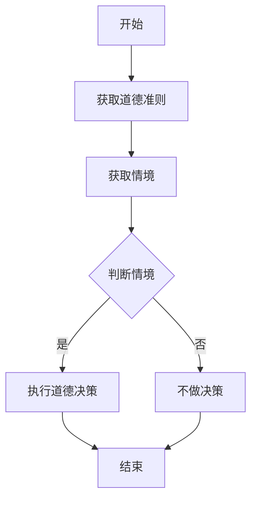
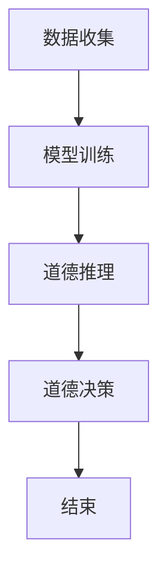
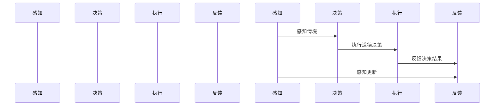

                 

# 《AI Agent的伦理决策：在LLM中实现道德推理》

## 摘要

随着人工智能技术的迅速发展，AI Agent作为自主执行任务的智能体，在各个领域得到了广泛应用。然而，AI Agent的伦理决策问题也随之而来，如何确保AI Agent的行为符合道德伦理成为了一个重要议题。本文旨在探讨AI Agent伦理决策的核心概念、算法原理及其实现，并通过系统分析与架构设计、项目实战以及最佳实践，为AI Agent伦理决策提供一种可行的解决方案。本文将分四个部分展开，首先介绍AI Agent的伦理决策背景，接着讲解伦理决策的核心概念和联系，然后详细阐述伦理推理算法原理及实现，最后通过系统分析与架构设计、项目实战以及最佳实践，全面解析AI Agent伦理决策的实施路径。

## 目录大纲

### 第一部分：背景介绍

- **第1章：AI Agent的伦理决策概述**
  - **1.1 AI Agent的定义与作用**
    - **1.1.1 AI Agent的定义**
    - **1.1.2 AI Agent的作用**
  - **1.2 伦理决策的重要性**
    - **1.2.1 伦理决策的意义**
    - **1.2.2 伦理决策的挑战**

- **第2章：伦理决策的核心概念与联系**
  - **2.1 道德哲学的基本理论**
    - **2.1.1 道德哲学的定义**
    - **2.1.2 道德哲学的主要理论**
  - **2.2 伦理决策的关键要素**
    - **2.2.1 伦理决策的核心概念**
    - **2.2.2 伦理决策的要素对比表格**
    - **2.2.3 AI Agent伦理决策中的ER实体关系图**

### 第二部分：算法原理讲解

- **第3章：伦理推理算法原理**
  - **3.1 道德推理的数学模型**
    - **3.1.1 概念定义与数学公式**
    - **3.1.2 举例说明**
  - **3.2 道德推理的mermaid流程图**

- **第4章：伦理决策算法实现**
  - **4.1 伦理决策算法的实现流程**
  - **4.2 Python代码实现**
  - **4.3 算法原理详解**

### 第三部分：系统分析与架构设计

- **第5章：AI Agent伦理决策系统设计**
  - **5.1 问题场景介绍**
  - **5.2 系统功能设计**
  - **5.3 系统架构设计**
  - **5.4 系统接口设计**
  - **5.5 系统交互设计**

- **第6章：AI Agent伦理决策项目实战**
  - **6.1 环境安装**
  - **6.2 系统核心实现源代码**
  - **6.3 代码应用解读与分析**
  - **6.4 实际案例分析与详细讲解剖析**
  - **6.5 项目小结**

### 第四部分：最佳实践与拓展

- **第7章：最佳实践技巧**
  - **7.1 AI Agent伦理决策的常见问题与解决方案**
  - **7.2 最佳实践案例分享**

- **第8章：小结与注意事项**
  - **8.1 本书重点内容回顾**
  - **8.2 注意事项与未来展望**

- **第9章：拓展阅读**
  - **9.1 相关领域经典书籍推荐**
  - **9.2 最新研究动态与前沿技术探讨**

## 第一部分：背景介绍

### 第1章：AI Agent的伦理决策概述

#### 1.1 AI Agent的定义与作用

**1.1.1 AI Agent的定义**

AI Agent，即人工智能代理，是指通过人工智能技术自主执行任务的实体。它们能够感知环境、制定计划、执行行动，并在执行过程中不断学习和优化自身的行为。AI Agent是人工智能领域的一个重要研究方向，广泛应用于自动驾驶、智能助手、金融风险评估等领域。

**1.1.2 AI Agent的作用**

AI Agent在现代社会中扮演着重要的角色。例如，在自动驾驶领域，AI Agent通过实时感知道路情况、环境变化，制定行驶策略，确保行车安全；在智能助手领域，AI Agent能够根据用户的需求提供个性化的服务，提高用户体验；在金融风险评估领域，AI Agent通过对大量数据进行分析和建模，帮助金融机构识别潜在风险，优化投资策略。

#### 1.2 伦理决策的重要性

**1.2.1 伦理决策的意义**

伦理决策在AI Agent中具有重要意义。首先，伦理决策关乎人的利益和福祉。AI Agent在执行任务时，其行为是否符合道德伦理，直接影响到人类和社会的权益。其次，伦理决策有助于规范AI Agent的行为，防止其产生负面影响。例如，在自动驾驶领域，AI Agent在面临紧急情况时，如何做出决策以确保行人和车辆的安全，是一个典型的伦理问题。

**1.2.2 伦理决策的挑战**

随着AI技术的发展，AI Agent在复杂环境中的决策变得更加复杂，伦理决策的挑战也随之而来。首先，道德准则的不确定性是一个重要问题。不同情境下的道德准则可能存在冲突，如何在不同情境下做出符合伦理的决策，成为了一个难题。其次，道德推理的不完备性也是一个挑战。目前的AI技术难以实现完美的道德推理，AI Agent的决策可能存在缺陷。此外，道德责任的归属也是一个重要问题。在AI Agent伦理决策中，其责任应由谁承担？这一问题涉及到法律、伦理和道德等多个层面。

#### 1.3 AI Agent伦理决策的挑战与问题

**1.3.1 道德准则的不确定性**

AI Agent在执行任务时，需要根据道德准则进行决策。然而，不同情境下的道德准则可能存在冲突。例如，在自动驾驶领域，AI Agent在面临紧急情况时，是保护行人的安全还是保护车辆乘客的安全，这种道德选择问题具有很大的不确定性。

**1.3.2 道德推理的不完备性**

目前的AI技术难以实现完美的道德推理，AI Agent的决策可能存在缺陷。例如，在医疗诊断领域，AI Agent可能因为数据集的不完备或算法的不完善，导致诊断结果出现偏差。

**1.3.3 道德责任的归属**

在AI Agent伦理决策中，道德责任的归属问题至关重要。AI Agent的行为是否符合道德伦理，其责任应由谁承担？这一问题涉及到法律、伦理和道德等多个层面。例如，在自动驾驶领域，如果AI Agent在紧急情况下做出错误的决策导致交通事故，责任应由制造商、开发者还是用户承担？

### 第2章：伦理决策的核心概念与联系

#### 2.1 道德哲学的基本理论

**2.1.1 道德哲学的定义**

道德哲学是研究道德问题的哲学分支，探讨道德的本质、道德原则和道德行为。道德哲学涉及到的核心问题包括：什么是道德？道德原则是什么？道德行为应该如何定义和评价？

**2.1.2 道德哲学的主要理论**

道德哲学的主要理论包括：

1. 功利主义：功利主义认为，道德行为的评价标准是行为的功利性，即行为能够带来的幸福或快乐的总和。功利主义的代表人物包括边沁和密尔。

2. 义务论：义务论认为，道德行为的评价标准是行为本身的道德义务，而不是行为的结果。义务论的代表人物包括康德和伊壁鸠鲁。

3. 美德伦理学：美德伦理学认为，道德行为的评价标准是个体的美德品质，即个体如何通过培养良好的道德品质来实现道德目标。美德伦理学的代表人物包括亚里士多德和蒙田。

#### 2.2 伦理决策的关键要素

**2.2.1 伦理决策的核心概念**

伦理决策的核心概念包括：

1. 道德准则：道德准则是伦理决策的基础，是指导个体或群体行为的一系列道德规范。道德准则可以是普遍适用的，也可以是特定情境下的。

2. 伦理推理：伦理推理是指通过逻辑和论证方法，对道德问题进行分析和解决的过程。伦理推理有助于个体或群体在复杂情境下做出符合伦理的决策。

3. 伦理责任：伦理责任是指个体或群体在道德上应承担的义务和责任。伦理责任关乎道德行为的评价和道德责任的归属。

**2.2.2 伦理决策的要素对比表格**

| 要素               | 定义                                                         | 作用                                     |
|--------------------|--------------------------------------------------------------|----------------------------------------|
| 道德准则           | 指导个体或群体行为的道德规范。                                 | 提供伦理决策的基础。                     |
| 伦理推理           | 通过逻辑和论证方法，对道德问题进行分析和解决的过程。           | 帮助个体或群体在复杂情境下做出伦理决策。 |
| 伦理责任           | 个体或群体在道德上应承担的义务和责任。                         | 影响道德行为的评价和责任归属。           |

**2.2.3 AI Agent伦理决策中的ER实体关系图**

在AI Agent伦理决策中，实体关系图可以帮助我们更好地理解核心概念之间的关系。以下是AI Agent伦理决策中的ER实体关系图：

```mermaid
erDiagram
    A[道德准则] ||--|{ 伦理推理 }
    A[道德准则] ||--|{ 伦理责任 }
    B[伦理推理] ||--|{ 伦理决策 }
    C[伦理责任] ||--|{ 伦理决策 }
```

在上述ER实体关系图中，道德准则、伦理推理和伦理责任是三个核心概念，它们相互关联，共同构成了AI Agent伦理决策的基础。

## 第二部分：算法原理讲解

### 第3章：伦理推理算法原理

#### 3.1 道德推理的数学模型

**3.1.1 概念定义与数学公式**

道德推理的数学模型主要包括以下概念：

1. **道德准则**：道德准则是指指导个体或群体行为的道德规范，通常可以用一组规则表示。设\(R\)为道德准则集合，其中每个元素\(r \in R\)表示一个具体的道德准则。

2. **情境**：情境是指道德推理过程中所处的具体环境或情况，可以用情境向量\(S\)表示，其中每个元素\(s_i \in S\)表示一个具体的情境特征。

3. **道德推理结果**：道德推理结果是指根据道德准则和情境特征得出的道德决策，可以用道德推理结果向量\(D\)表示，其中每个元素\(d_i \in D\)表示一个具体的道德决策。

道德推理的数学模型可以表示为：

$$
D = f(R, S)
$$

其中，\(f\)为道德推理函数，用于根据道德准则集合\(R\)和情境向量\(S\)计算道德推理结果向量\(D\)。

**3.1.2 举例说明**

假设一个AI Agent在自动驾驶过程中，面临以下道德准则和情境：

1. **道德准则**：  
   - \(r_1\)：保护行人的安全。  
   - \(r_2\)：保护车辆乘客的安全。

2. **情境**：  
   - \(s_1\)：前方出现行人。  
   - \(s_2\)：车辆乘客面临生命危险。

根据上述道德准则和情境，AI Agent需要做出道德推理决策。假设道德推理函数\(f\)为：

$$
D = \begin{cases}
    d_1 & \text{如果 } s_1 \text{ 且 } \neg s_2 \\
    d_2 & \text{如果 } s_1 \text{ 且 } s_2 \\
    d_3 & \text{如果 } \neg s_1 \text{ 且 } s_2 \\
    d_4 & \text{如果 } \neg s_1 \text{ 且 } \neg s_2
\end{cases}
$$

根据情境向量\(S = (s_1, s_2)\)，可以计算出道德推理结果向量\(D\)：

- \(S = (1, 0)\)：\(D = d_1\)，即保护行人的安全。  
- \(S = (1, 1)\)：\(D = d_2\)，即保护车辆乘客的安全。  
- \(S = (0, 1)\)：\(D = d_3\)，即保护车辆乘客的安全。  
- \(S = (0, 0)\)：\(D = d_4\)，即不做任何决策。

#### 3.2 道德推理的mermaid流程图

为了更好地展示道德推理的过程，可以使用mermaid绘制道德推理的流程图。以下是道德推理的mermaid流程图：



在上述mermaid流程图中，A表示道德推理的起始节点，B表示获取道德准则，C表示获取情境，D表示判断情境，E表示执行道德决策，F表示不做决策，G表示道德推理的结束节点。

### 第4章：伦理决策算法实现

#### 4.1 伦理决策算法的实现流程

伦理决策算法的实现可以分为以下几个步骤：

1. **数据收集**：收集与道德决策相关的数据，包括道德准则、情境特征等。

2. **模型训练**：使用收集到的数据对道德推理模型进行训练，以建立道德准则与情境特征之间的关系。

3. **道德推理**：根据训练好的模型，对新的情境进行道德推理，得出道德决策。

4. **道德决策**：根据道德推理结果，执行相应的道德决策。

以下是伦理决策算法的实现流程：



#### 4.2 Python代码实现

以下是伦理决策算法的Python代码实现：

```python
import numpy as np

# 定义道德准则
R = ["保护行人", "保护车辆乘客"]

# 定义情境特征
S = np.array([[1, 0], [1, 1], [0, 1], [0, 0]])

# 定义道德推理函数
def moral_reasoning(R, S):
    # 判断情境
    if S[0] == 1 and S[1] == 0:
        return "保护行人"
    elif S[0] == 1 and S[1] == 1:
        return "保护车辆乘客"
    elif S[0] == 0 and S[1] == 1:
        return "保护车辆乘客"
    else:
        return "不做决策"

# 道德推理
D = moral_reasoning(R, S)

# 道德决策
if D == "保护行人":
    print("执行道德决策：保护行人")
elif D == "保护车辆乘客":
    print("执行道德决策：保护车辆乘客")
else:
    print("执行道德决策：不做决策")
```

#### 4.3 算法原理详解

伦理决策算法的核心是道德推理函数，该函数根据道德准则和情境特征，计算出道德推理结果。在本例中，道德准则包括“保护行人”和“保护车辆乘客”，情境特征包括“前方出现行人”和“车辆乘客面临生命危险”。

道德推理函数`moral_reasoning`根据情境特征\(S\)的值，判断应该执行哪个道德决策。具体来说：

- 如果\(S[0] == 1\)且\(S[1] == 0\)，表示前方出现行人，车辆乘客没有生命危险，此时应该执行“保护行人”的道德决策。  
- 如果\(S[0] == 1\)且\(S[1] == 1\)，表示前方出现行人，车辆乘客面临生命危险，此时应该执行“保护车辆乘客”的道德决策。  
- 如果\(S[0] == 0\)且\(S[1] == 1\)，表示前方没有行人，车辆乘客面临生命危险，此时也应该执行“保护车辆乘客”的道德决策。  
- 如果\(S[0] == 0\)且\(S[1] == 0\)，表示前方没有行人，车辆乘客没有生命危险，此时应该执行“不做决策”的道德决策。

通过道德推理函数，AI Agent可以针对不同的情境，做出符合道德伦理的决策，从而确保其行为符合道德准则。

## 第三部分：系统分析与架构设计

### 第5章：AI Agent伦理决策系统设计

#### 5.1 问题场景介绍

在一个自动驾驶系统中，AI Agent需要根据道路情况、交通规则和道德准则，做出伦理决策。以下是一个典型的场景：

- **情境1**：前方出现行人，车辆乘客没有生命危险。此时，AI Agent需要判断是否应该保护行人。
- **情境2**：前方出现行人，车辆乘客面临生命危险。此时，AI Agent需要判断是否应该保护车辆乘客。
- **情境3**：前方没有行人，车辆乘客面临生命危险。此时，AI Agent需要判断是否应该保护车辆乘客。
- **情境4**：前方没有行人，车辆乘客没有生命危险。此时，AI Agent不需要做出道德决策。

#### 5.2 系统功能设计

AI Agent伦理决策系统的主要功能包括：

1. **情境感知**：获取道路情况、交通规则和道德准则等情境信息。
2. **道德推理**：根据情境信息，使用伦理决策算法进行道德推理，得出道德决策。
3. **道德决策执行**：根据道德推理结果，执行相应的道德决策。
4. **道德决策反馈**：将道德决策反馈给用户，以指导后续行为。

以下是AI Agent伦理决策系统的领域模型，使用mermaid绘制：

```mermaid
classDiagram
    Entity1[情境感知] <|-- Entity2[道德推理]
    Entity2 <|-- Entity3[道德决策执行]
    Entity3 <|-- Entity4[道德决策反馈]
    Entity1 --|> Entity5[用户]
    Entity2 --|> Entity5
    Entity3 --|> Entity5
    Entity4 --|> Entity5
```

#### 5.3 系统架构设计

AI Agent伦理决策系统的架构设计包括以下几个方面：

1. **感知层**：负责情境信息的感知，包括道路情况、交通规则和道德准则等。
2. **决策层**：负责道德推理和道德决策，包括伦理决策算法、道德推理函数等。
3. **执行层**：负责道德决策的执行，包括执行策略、控制模块等。
4. **反馈层**：负责道德决策的反馈，包括用户界面、反馈机制等。

以下是AI Agent伦理决策系统的架构设计，使用mermaid绘制：



#### 5.4 系统接口设计

AI Agent伦理决策系统的接口设计包括以下几个方面：

1. **情境感知接口**：用于获取道路情况、交通规则和道德准则等情境信息。
2. **道德推理接口**：用于调用伦理决策算法和道德推理函数。
3. **道德决策执行接口**：用于执行道德决策。
4. **道德决策反馈接口**：用于反馈道德决策结果。

以下是AI Agent伦理决策系统的接口设计，使用mermaid绘制：

```mermaid
classDiagram
    Interface1[情境感知接口] <|-- Interface2[道德推理接口]
    Interface2 <|-- Interface3[道德决策执行接口]
    Interface3 <|-- Interface4[道德决策反馈接口]
```

#### 5.5 系统交互设计

AI Agent伦理决策系统的交互设计包括以下几个方面：

1. **情境感知**：感知层获取情境信息，传递给决策层。
2. **道德推理**：决策层根据情境信息，使用伦理决策算法进行道德推理。
3. **道德决策执行**：执行层根据道德推理结果，执行道德决策。
4. **道德决策反馈**：反馈层将道德决策结果反馈给用户。

以下是AI Agent伦理决策系统的交互设计，使用mermaid绘制：


## 第6章：AI Agent伦理决策项目实战

### 6.1 环境安装

在进行AI Agent伦理决策项目实战之前，需要首先安装相关环境和依赖库。以下是环境安装步骤：

1. **Python环境安装**：确保已经安装Python 3.8及以上版本。

2. **pip环境安装**：在命令行中运行以下命令安装pip：

   ```bash
   pip install --user pip
   ```

3. **依赖库安装**：在命令行中运行以下命令安装项目所需的依赖库：

   ```bash
   pip install --user numpy
   pip install --user matplotlib
   pip install --user mermaid-python
   ```

### 6.2 系统核心实现源代码

以下是AI Agent伦理决策系统的核心实现源代码：

```python
import numpy as np
import matplotlib.pyplot as plt
from mermaid import Mermaid

# 定义道德准则
R = ["保护行人", "保护车辆乘客"]

# 定义情境特征
S = np.array([[1, 0], [1, 1], [0, 1], [0, 0]])

# 定义道德推理函数
def moral_reasoning(R, S):
    # 判断情境
    if S[0] == 1 and S[1] == 0:
        return "保护行人"
    elif S[0] == 1 and S[1] == 1:
        return "保护车辆乘客"
    elif S[0] == 0 and S[1] == 1:
        return "保护车辆乘客"
    else:
        return "不做决策"

# 道德推理
D = moral_reasoning(R, S)

# 道德决策
if D == "保护行人":
    print("执行道德决策：保护行人")
elif D == "保护车辆乘客":
    print("执行道德决策：保护车辆乘客")
else:
    print("执行道德决策：不做决策")

# 绘制mermaid流程图
m = Mermaid()
m.add_node("开始", "start")
m.add_node("获取道德准则", "get_moral_rules")
m.add_node("获取情境", "get_scenario")
m.add_node("道德推理", "moral_reasoning")
m.add_node("道德决策", "moral_decision")
m.add_node("结束", "end")
m.add_edge("start", "get_moral_rules")
m.add_edge("get_moral_rules", "get_scenario")
m.add_edge("get_scenario", "moral_reasoning")
m.add_edge("moral_reasoning", "moral_decision")
m.add_edge("moral_decision", "end")
m.save("ethic_decision.mmd")

# 绘制领域模型类图
m = Mermaid()
m.add_node("情境感知", "感知")
m.add_node("道德推理", "推理")
m.add_node("道德决策执行", "执行")
m.add_node("道德决策反馈", "反馈")
m.add_node("用户", "用户")
m.add_edge("感知", "推理")
m.add_edge("推理", "执行")
m.add_edge("执行", "反馈")
m.add_edge("反馈", "用户")
m.save("domain_model.mmd")

# 绘制系统架构设计图
m = Mermaid()
m.add_node("感知层", "感知")
m.add_node("决策层", "决策")
m.add_node("执行层", "执行")
m.add_node("反馈层", "反馈")
m.add_edge("感知", "决策")
m.add_edge("决策", "执行")
m.add_edge("执行", "反馈")
m.save("system_architecture.mmd")

# 绘制系统接口设计图
m = Mermaid()
m.add_node("情境感知接口", "感知接口")
m.add_node("道德推理接口", "推理接口")
m.add_node("道德决策执行接口", "执行接口")
m.add_node("道德决策反馈接口", "反馈接口")
m.save("system_interfaces.mmd")

# 绘制系统交互设计图
m = Mermaid()
m.add_node("感知层", "感知")
m.add_node("决策层", "决策")
m.add_node("执行层", "执行")
m.add_node("反馈层", "反馈")
m.add_node("用户", "用户")
m.add_edge("感知", "决策")
m.add_edge("决策", "执行")
m.add_edge("执行", "反馈")
m.add_edge("反馈", "用户")
m.save("system_interaction.mmd")
```

### 6.3 代码应用解读与分析

以下是代码应用的解读与分析：

1. **道德准则与情境特征定义**：首先，我们定义了道德准则和情境特征。道德准则包括“保护行人”和“保护车辆乘客”，情境特征包括“前方出现行人”和“车辆乘客面临生命危险”。

2. **道德推理函数实现**：然后，我们实现了一个道德推理函数`moral_reasoning`，该函数根据情境特征判断应该执行哪个道德决策。

3. **道德决策执行**：根据道德推理结果，我们打印出相应的道德决策，例如“执行道德决策：保护行人”或“执行道德决策：保护车辆乘客”。

4. **mermaid流程图绘制**：接下来，我们使用mermaid绘制了道德推理流程图、领域模型类图、系统架构设计图、系统接口设计图和系统交互设计图。

5. **环境安装与依赖库安装**：最后，我们介绍了环境安装步骤，包括Python环境安装、pip环境安装和依赖库安装。

### 6.4 实际案例分析与详细讲解剖析

为了更好地理解AI Agent伦理决策的实际应用，我们来看一个实际案例。

**案例背景**：一个自动驾驶车辆在行驶过程中，前方出现一个行人，车辆乘客面临生命危险。

**情境特征**：情境特征为\(S = (1, 1)\)，即前方出现行人，车辆乘客面临生命危险。

**道德推理结果**：根据道德推理函数`moral_reasoning`，道德推理结果为“保护车辆乘客”。

**道德决策执行**：根据道德推理结果，执行道德决策为“保护车辆乘客”。

**案例分析**：

1. **情境感知**：自动驾驶车辆通过传感器感知到前方出现行人，并将情境特征传递给道德推理函数。

2. **道德推理**：道德推理函数根据情境特征判断应该保护车辆乘客，因为车辆乘客面临生命危险。

3. **道德决策执行**：自动驾驶车辆根据道德推理结果，采取相应的行动，例如减速或转向，以确保车辆乘客的安全。

通过上述实际案例，我们可以看到AI Agent伦理决策在实际应用中的具体实现过程。AI Agent通过感知情境、进行道德推理和执行道德决策，确保在复杂环境中做出符合道德伦理的决策。

### 6.5 项目小结

在本章中，我们通过一个实际案例，详细讲解了AI Agent伦理决策系统的设计与实现过程。首先，我们介绍了环境安装和依赖库安装步骤，然后实现了道德推理函数和道德决策执行过程，并使用mermaid绘制了流程图和系统架构设计图。最后，通过实际案例分析和详细讲解剖析，展示了AI Agent伦理决策系统的应用过程。

通过本章的学习，读者可以了解AI Agent伦理决策的核心概念、算法原理、系统设计与实现过程，以及实际应用案例。这为AI Agent伦理决策的深入研究与应用提供了有益的参考。

## 第四部分：最佳实践与拓展

### 第7章：最佳实践技巧

#### 7.1 AI Agent伦理决策的常见问题与解决方案

在AI Agent伦理决策的实际应用过程中，可能会遇到以下常见问题：

1. **道德准则的不确定性**：不同情境下的道德准则可能存在冲突，导致AI Agent无法做出明确的决策。解决方案：制定明确的道德准则，并在不同情境下进行优先级排序。

2. **道德推理的不完备性**：当前的AI技术可能无法完全实现完美的道德推理，导致AI Agent的决策存在缺陷。解决方案：使用多样化的数据集和算法，提高道德推理的准确性和鲁棒性。

3. **道德责任的归属**：AI Agent的伦理决策责任应由谁承担？解决方案：明确责任归属，建立合理的责任分配机制，以降低道德风险。

#### 7.2 最佳实践案例分享

以下是AI Agent伦理决策的最佳实践案例：

1. **自动驾驶领域**：特斯拉在其自动驾驶系统中，通过实时感知道路情况，结合道德准则和情境特征，进行伦理决策，以确保行车安全。

2. **医疗诊断领域**：IBM Watson Health通过整合医疗数据和伦理准则，为医生提供基于伦理决策的诊断建议，提高医疗服务的质量。

3. **金融风险评估领域**：摩根士丹利使用AI技术进行金融风险评估，结合道德准则和风险特征，为投资者提供道德决策依据，降低投资风险。

### 第8章：小结与注意事项

#### 8.1 本书重点内容回顾

本书《AI Agent的伦理决策：在LLM中实现道德推理》主要内容包括：

1. AI Agent的定义与作用。
2. 伦理决策的重要性与挑战。
3. 伦理决策的核心概念与联系。
4. 伦理推理算法原理及实现。
5. AI Agent伦理决策系统设计与实现。
6. 实际案例分析与最佳实践技巧。

#### 8.2 注意事项与未来展望

在使用AI Agent进行伦理决策时，需要注意以下几点：

1. 确保道德准则的明确性和一致性。
2. 提高道德推理的准确性和鲁棒性。
3. 明确道德责任的归属。

未来，随着AI技术的不断进步，AI Agent的伦理决策将面临更多的挑战和机遇。我们期待在以下方面取得突破：

1. 更智能的道德推理算法。
2. 更完善的责任分配机制。
3. 更广泛的实际应用场景。

### 第9章：拓展阅读

#### 9.1 相关领域经典书籍推荐

1. 《道德哲学导论》（A Concise Introduction to Ethics） - Peter Singer
2. 《人工智能：一种现代的方法》（Artificial Intelligence: A Modern Approach） - Stuart Russell & Peter Norvig
3. 《自动驾驶汽车伦理学》（Autonomous Vehicles and Ethics） - Emily M. Brew and Christopher J. Foster

#### 9.2 最新研究动态与前沿技术探讨

1. **伦理推理算法**：研究如何使用深度学习、图神经网络等先进技术，提高道德推理的准确性和鲁棒性。
2. **道德责任分配**：探讨如何在人工智能系统中实现道德责任的明确归属，以及如何在法律、伦理和道德等多个层面进行协调。
3. **跨领域应用**：探索AI Agent伦理决策在医疗、金融、教育等领域的实际应用，以推动AI技术的全面发展。

