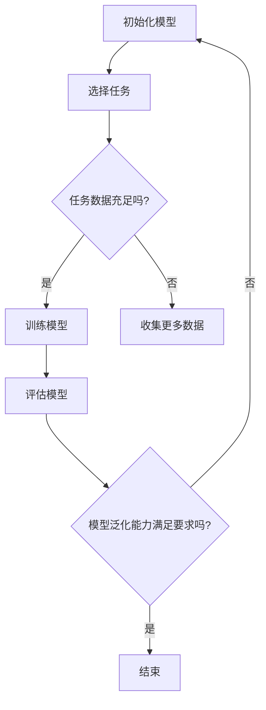

                 


### 元学习：基础概念与原理

#### 背景介绍

元学习（Meta-Learning），又称为泛化学习，是机器学习领域的一个重要分支。它旨在构建能够在未知任务上快速学习的模型。传统的机器学习方法往往专注于特定任务的优化，而元学习则试图通过学习如何学习，从而提高模型在遇到新任务时的适应能力。

在机器学习中，我们通常将学习过程分为两个阶段：训练（Training）和测试（Testing）。训练阶段是通过大量的样本数据来调整模型参数，使模型能够在特定任务上表现良好。测试阶段则是验证模型在未知数据上的泛化能力。然而，这种方法在处理新任务时往往需要大量的重新训练，效率较低。

元学习通过学习一个通用学习策略，使模型能够在新的任务上快速适应，减少了训练时间，提高了学习效率。其核心思想是通过在多个任务上训练模型，从而获得一种能够泛化的学习策略。

#### 问题解决

元学习通过解决以下几个关键问题，实现了对新任务的快速适应：

1. **数据不足问题**：在新的任务上，我们往往无法获得大量的训练数据。元学习通过学习如何在少量数据上高效地学习，解决了数据不足的问题。

2. **模型泛化能力**：传统的机器学习模型在特定任务上表现良好，但面对新任务时可能无法很好地泛化。元学习通过在多个任务上训练，提高了模型的泛化能力。

3. **计算效率**：重新训练一个模型往往需要大量的计算资源。元学习通过学习通用学习策略，减少了训练时间，提高了计算效率。

#### 边界与外延

元学习不仅适用于机器学习领域，还可以扩展到其他领域，如自然语言处理、计算机视觉等。此外，元学习的研究还包括如何设计更有效的元学习算法、如何处理动态变化的任务等。

在元学习中，常用的算法包括模型更新的元学习、模型架构的元学习和基于采样的元学习等。每种算法都有其独特的原理和应用场景。

#### 概念结构与核心要素组成

元学习的概念结构包括以下几个核心要素：

- **学习任务**：指需要进行学习的问题，如分类、回归等。
- **学习算法**：用于解决学习任务的算法，如梯度下降、神经网络等。
- **学习策略**：用于指导学习算法的通用策略，如经验权重更新、模型架构搜索等。
- **泛化能力**：模型在未知任务上的表现能力，是评价元学习效果的重要指标。

### 核心概念与联系

元学习的核心概念包括：

- **元学习算法**：如模型更新的元学习、模型架构的元学习和基于采样的元学习。
- **通用学习策略**：用于指导元学习算法，提高模型在未知任务上的适应能力。
- **泛化能力**：模型在未知任务上的表现能力，是元学习的最终目标。

这些概念之间的联系在于：

- **元学习算法**是实现通用学习策略的具体实现方式。
- **通用学习策略**指导元学习算法，使其能够适应新的任务。
- **泛化能力**是评价元学习效果的重要指标，反映了模型在未知任务上的适应能力。

#### 算法原理讲解

下面我们使用Mermaid画出元学习算法的流程图：



在上面的流程图中，我们首先初始化一个模型，然后选择一个任务。接着，我们检查任务数据是否充足。如果充足，我们直接训练模型；否则，我们尝试收集更多数据。在模型训练完成后，我们评估模型的泛化能力。如果满足要求，则结束；否则，我们重新初始化模型并重复上述过程。

接下来，我们使用Python源代码详细阐述元学习算法：

```python
import numpy as np

# 初始化模型
model = initialize_model()

# 选择任务
task = choose_task()

# 检查任务数据是否充足
if is_enough_data(task):
    # 训练模型
    model = train_model(model, task)
else:
    # 收集更多数据
    task = collect_more_data(task)

# 评估模型
evaluation = evaluate_model(model, task)

# 检查模型泛化能力
if evaluation >= threshold:
    # 模型泛化能力满足要求，结束
    print("Model generalized well, task completed.")
else:
    # 模型泛化能力不满足要求，重新初始化模型
    model = initialize_model()
```

在上述代码中，我们首先初始化模型，然后选择一个任务。接着，我们检查任务数据是否充足。如果充足，我们直接训练模型；否则，我们尝试收集更多数据。在模型训练完成后，我们评估模型的泛化能力。如果满足要求，则结束；否则，我们重新初始化模型并重复上述过程。

#### 数学公式与举例

元学习的数学模型通常涉及以下几个关键公式：

1. **损失函数**：用于衡量模型在任务上的表现，通常表示为：

   $$L(\theta) = \sum_{i=1}^{n} (y_i - \hat{y}_i)^2$$

   其中，$y_i$ 是真实标签，$\hat{y}_i$ 是模型的预测结果。

2. **梯度下降**：用于优化模型参数，表示为：

   $$\theta = \theta - \alpha \cdot \nabla L(\theta)$$

   其中，$\theta$ 是模型参数，$\alpha$ 是学习率，$\nabla L(\theta)$ 是损失函数关于参数 $\theta$ 的梯度。

3. **模型更新**：在元学习中，模型更新通常基于经验权重，表示为：

   $$\theta' = \theta + \alpha \cdot (\theta - \theta^*)$$

   其中，$\theta^*$ 是当前任务的最优权重。

举例来说，假设我们有一个二分类问题，需要使用元学习算法训练一个模型。我们首先初始化模型参数 $\theta$，然后通过梯度下降更新参数。在每次迭代中，我们选择一个任务，使用少量数据进行训练，并评估模型的泛化能力。如果泛化能力满足要求，则更新模型参数；否则，重新初始化模型并重复上述过程。

### 总结

元学习是机器学习领域的一个重要分支，通过学习如何学习，使模型能够快速适应新任务。本文详细介绍了元学习的基础概念、原理和算法，并通过Python代码和数学公式进行了阐述。元学习在解决数据不足、模型泛化能力和计算效率等方面具有显著优势，未来有望在更广泛的领域得到应用。接下来，我们将进一步探讨AI Agent的元学习能力及其在实际应用中的价值。

