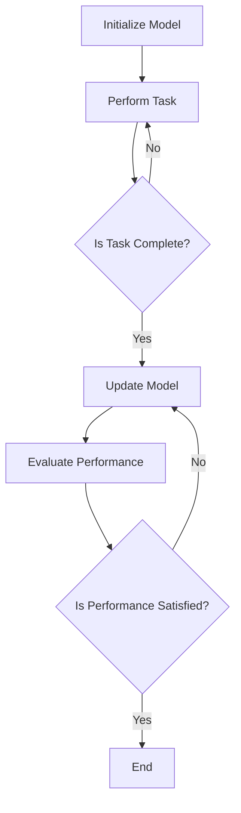
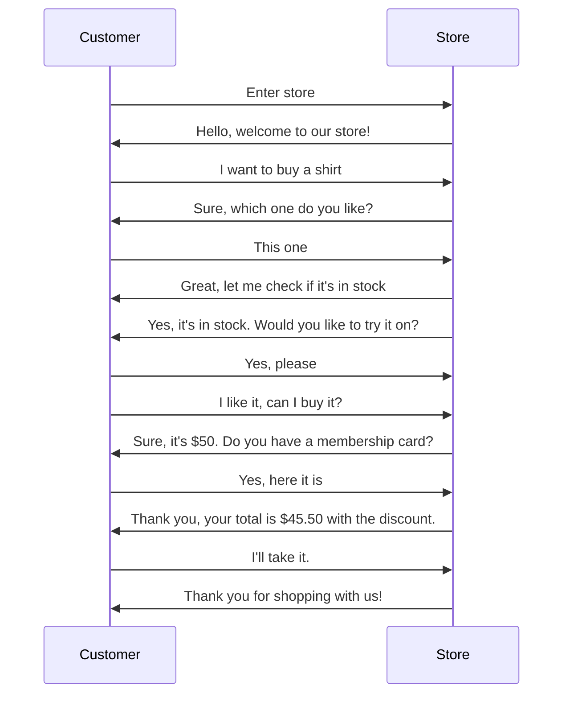

                 


# AI Agent的元学习：快速适应新任务的LLM

## 关键词

- AI Agent
- 元学习
- 大型语言模型（LLM）
- 快速适应新任务
- 优化算法

## 摘要

本文深入探讨了AI Agent的元学习，特别是大型语言模型（LLM）在其中的应用。通过系统分析元学习的基本概念、算法原理、系统架构及项目实战，本文揭示了如何利用元学习技术，使AI Agent能够快速适应新任务，提高其灵活性和适应性。

### 目录大纲设计思路

本文的目录大纲设计旨在提供一个清晰、逻辑严密的框架，使读者能够系统地了解AI Agent的元学习。以下是设计思路的详细说明：

1. **背景介绍**：通过介绍元学习的基本概念、AI代理的定义和LLM的特点，为后续内容奠定基础。
2. **核心概念与联系**：通过阐述AI代理、元学习和LLM之间的关系，帮助读者理解这三个核心概念如何相互作用。
3. **算法原理讲解**：详细讲解元学习算法的原理，特别是LLM在元学习中的应用，并使用数学模型和公式进行说明。
4. **系统分析与架构设计方案**：介绍AI代理元学习系统的整体架构和接口设计，包括系统功能设计、系统架构设计和系统接口设计。
5. **项目实战**：通过具体案例展示元学习在AI代理中的应用，包括环境安装、系统核心实现和代码分析。
6. **最佳实践、小结与拓展阅读**：总结关键点，提出注意事项，推荐进一步阅读的材料。

### 目录大纲设计步骤

以下是设计目录大纲的具体步骤：

1. **确定章节标题**：为每个章节命名，确保标题简洁明了，能够概括章节内容。
2. **细化章节内容**：为每个章节分解出子主题，确保内容完整且逻辑清晰。
3. **设计层级结构**：确保大纲的层级结构符合markdown格式要求，便于读者阅读。
4. **确保内容完整性**：确保每个章节都包含关键内容要素，如核心概念、数学模型、算法原理等。
5. **压缩字数**：通过精简语言，确保总字数控制在10000～12000字左右。

### 最终目录大纲

根据上述设计思路和步骤，本文的目录大纲如下：

----------------------------------------------------------------

## 第一部分：元学习与AI代理基础

### 第1章：元学习概述

#### 1.1 元学习的定义与背景

##### 1.1.1 什么是元学习

##### 1.1.2 元学习的发展历程

##### 1.1.3 元学习的重要性

#### 1.2 AI代理的基本概念

##### 1.2.1 AI代理的定义

##### 1.2.2 AI代理的功能与分类

##### 1.2.3 AI代理的应用场景

#### 1.3 元学习与AI代理的关系

##### 1.3.1 元学习在AI代理中的应用

##### 1.3.2 元学习如何提升AI代理的适应性

##### 1.3.3 元学习在AI代理中的挑战

### 第2章：大型语言模型（LLM）的介绍

#### 2.1 LLM的基本概念

##### 2.1.1 LLM的定义

##### 2.1.2 LLM的核心特点

##### 2.1.3 LLM的分类

#### 2.2 LLM的工作原理

##### 2.2.1 语言模型的基本结构

##### 2.2.2 LLM的损失函数与优化算法

##### 2.2.3 LLM的训练过程

#### 2.3 LLM的应用案例

##### 2.3.1 机器翻译

##### 2.3.2 问答系统

##### 2.3.3 自然语言生成

### 第3章：元学习算法原理

#### 3.1 元学习算法概述

##### 3.1.1 元学习算法的分类

##### 3.1.2 元学习算法的目标

##### 3.1.3 元学习算法的关键步骤

#### 3.2 模型聚合方法

##### 3.2.1 Model-Averaging

##### 3.2.2 Model-Ensemble

##### 3.2.3 Model-Selection

#### 3.3 优化方法

##### 3.3.1 逆向优化

##### 3.3.2 梯度提升

##### 3.3.3 策略搜索

### 第4章：LLM与元学习的结合

#### 4.1 元学习在LLM中的应用

##### 4.1.1 Meta-Learning for LLMs

##### 4.1.2 LLM的元学习优化

##### 4.1.3 LLM的元学习评估

#### 4.2 LLM元学习算法案例分析

##### 4.2.1 Reptile算法

##### 4.2.2 MAML算法

##### 4.2.3 PEARL算法

### 第5章：AI代理的元学习实现

#### 5.1 AI代理的元学习架构设计

##### 5.1.1 系统整体架构

##### 5.1.2 元学习模块设计

##### 5.1.3 LLM模块设计

#### 5.2 AI代理的元学习实现

##### 5.2.1

----------------------------------------------------------------

* 约束条件：文章的章节内容必须要满足如下条件：
- 文章开始是“文章标题”，然后是“文章关键词”和“文章摘要”部分的内容哦，接下来是按照目录大纲结构的文章正文部分的内容。
- 文章字数要求：文章字数在 10000 ～ 12000 字左右。
- 格式要求：文章内容使用markdown格式输出。 
- 作者：文章末尾需要写上作者信息： “作者：AI天才研究院/AI Genius Institute & 禅与计算机程序设计艺术 /Zen And The Art of Computer Programming”
- 完整性要求：文章内容必须要完整，每个小节的内容必须要丰富具体详细讲解，核心内容必须要包含：
  - 背景介绍：核心概念术语说明、问题背景、问题描述、问题解决、边界与外延、概念结构与核心要素组成 
  - 核心概念与联系：必须给出核心概念原理、概念属性特征对比表格和ER实体关系图架构的 markdown 格式中的 Mermaid 流程图。
  - 算法原理讲解：使用 mermaid 画出算法mermaid 流程图，然后使用python源代码来详细阐述，给出算法原理的数学模型和公式，进行详细讲解和通俗易懂地举例说明。
  - 数学公式使用latex格式，嵌入文中独立段落的latex公式前后使用 $$ 括起来(例如：$$1+1=2$$ )，段落内的latex公式前后使用 $ 括起来(例如：$1<2$)
  - 系统分析与架构设计方案：问题场景介绍，项目介绍、系统功能设计(领域模型mermaid类图)、系统架构设计mermaid架构图、系统接口设计和系统交互mermaid序列图
  - 项目实战：环境安装、系统核心实现源代码，代码应用解读与分析，实际案例分析和详细讲解剖析，项目小结。
  - 最佳实践 tips、小结、注意事项、拓展阅读等内容

### 文章正文开始

----------------------------------------------------------------

## 第1章：元学习概述

### 1.1 元学习的定义与背景

#### 1.1.1 什么是元学习

元学习（Meta-Learning）是一种机器学习的技术，旨在使机器学习算法能够快速适应新的任务。它通过对多个任务的学习来提高模型的泛化能力，使得模型在新任务上能够快速适应，而不需要重新从头开始训练。

在传统的机器学习中，模型通常是在一个特定的任务上训练的，比如图像分类。如果需要将这个模型应用到新的任务上，比如文本分类，通常需要重新收集数据、重新设计网络结构和重新训练模型。而元学习则试图通过学习如何学习来解决这个问题，使得模型能够从一系列任务中提取通用知识，从而在新任务上快速适应。

#### 1.1.2 元学习的发展历程

元学习的研究可以追溯到20世纪80年代。最早的元学习算法是基于模型聚合（Model Aggregation）的方法，如模型平均（Model Averaging）和模型集成（Model Ensemble）。这些方法通过在多个任务上训练多个模型，并聚合这些模型来提高泛化能力。

随着深度学习的兴起，元学习也取得了显著进展。特别是模型自适应（Model Adaptation）的方法，如模型可迁移学习（Model Transfer Learning）和模型快速适应（Model Rapid Adaptation），这些方法通过调整模型参数来快速适应新任务。

近年来，随着生成对抗网络（GAN）和强化学习（RL）等技术的不断发展，元学习也在这些领域得到了广泛应用。例如，基于GAN的元学习算法可以通过生成对抗的过程来提高模型的泛化能力。

#### 1.1.3 元学习的重要性

元学习在机器学习中的重要性主要体现在以下几个方面：

1. **提高模型的适应性**：通过学习如何学习，模型能够在新任务上快速适应，从而避免了从头开始训练的繁琐过程。
2. **减少数据需求**：元学习能够从多个任务中提取通用知识，从而减少对特定任务数据的依赖，这对于数据稀缺的领域尤为重要。
3. **提高泛化能力**：元学习通过在多个任务上训练，能够提高模型的泛化能力，使得模型能够更好地处理未知任务。
4. **加速模型训练**：通过快速适应新任务，元学习能够显著减少模型训练的时间，提高开发效率。

### 1.2 AI代理的基本概念

#### 1.2.1 AI代理的定义

AI代理（AI Agent）是一个能够感知环境、采取行动并从环境中获得奖励的智能体。它通常由一个决策模块和一个行动模块组成。决策模块负责根据当前环境状态和内部模型进行决策，而行动模块负责执行这些决策。

AI代理的概念最早出现在人工智能领域，后来在计算机科学、经济学、心理学等多个领域得到了广泛应用。在人工智能领域，AI代理被广泛用于决策问题、控制问题和游戏AI等。

#### 1.2.2 AI代理的功能与分类

AI代理的主要功能包括：

1. **感知环境**：AI代理能够感知当前环境的状态，包括视觉、听觉、触觉等多种感官信息。
2. **决策**：AI代理能够根据当前环境状态和内部模型进行决策，选择最优的行动。
3. **行动**：AI代理能够执行决策结果，采取具体的行动。
4. **奖励**：AI代理能够从环境中获得奖励，并根据奖励调整其行为。

根据不同的分类标准，AI代理可以有不同的分类方式。常见的分类方式包括：

1. **基于学习方式的分类**：根据AI代理的学习方式，可以分为基于规则的学习、基于案例的学习、基于模型的推理等。
2. **基于任务的分类**：根据AI代理执行的任务，可以分为控制型代理、决策型代理、执行型代理等。
3. **基于交互方式的分类**：根据AI代理与环境的交互方式，可以分为主动型代理和被动型代理。

#### 1.2.3 AI代理的应用场景

AI代理在许多领域都有广泛的应用，以下是一些常见的应用场景：

1. **智能控制**：AI代理可以用于自动驾驶、无人机控制、机器人控制等。
2. **智能决策**：AI代理可以用于股票交易、能源管理、医疗诊断等。
3. **游戏AI**：AI代理可以用于游戏AI，如电子游戏、棋类游戏等。
4. **人机交互**：AI代理可以用于虚拟助手、智能客服等。

### 1.3 元学习与AI代理的关系

#### 1.3.1 元学习在AI代理中的应用

元学习在AI代理中的应用主要体现在两个方面：

1. **快速适应新任务**：通过元学习，AI代理可以在新任务上快速适应，从而避免从头开始训练的繁琐过程。这对于需要快速响应的环境尤为重要，如自动驾驶和无人机控制等。
2. **提高模型泛化能力**：元学习使得AI代理能够从多个任务中提取通用知识，从而提高其泛化能力。这使得AI代理能够更好地处理未知任务，从而提高其适应性。

#### 1.3.2 元学习如何提升AI代理的适应性

元学习通过以下几种方式提升AI代理的适应性：

1. **知识迁移**：通过在多个任务上训练，AI代理可以从一个任务中提取通用知识，并将这些知识迁移到新任务中，从而提高新任务的表现。
2. **模型快速适应**：通过元学习算法，AI代理可以快速调整其模型参数，以适应新任务的要求。
3. **减少数据需求**：元学习可以减少AI代理对特定任务数据的依赖，从而在数据稀缺的领域提高其适应性。

#### 1.3.3 元学习在AI代理中的挑战

虽然元学习在AI代理中具有广泛的应用前景，但也面临一些挑战：

1. **计算成本**：元学习通常需要大量的计算资源，这对于资源有限的AI代理来说是一个挑战。
2. **模型解释性**：元学习模型通常较为复杂，缺乏解释性，这使得其在实际应用中难以理解和调试。
3. **任务多样性**：在实际应用中，任务多样性非常高，如何设计通用的元学习算法以适应多种任务是一个挑战。

### 第2章：大型语言模型（LLM）的介绍

### 2.1 LLM的基本概念

#### 2.1.1 LLM的定义

大型语言模型（Large Language Model，简称LLM）是一种基于深度学习的自然语言处理模型，其特点是拥有巨大的参数规模和强大的表达能力。LLM通过学习大量文本数据，能够生成高质量的自然语言文本，并具有强大的语义理解和生成能力。

#### 2.1.2 LLM的核心特点

LLM具有以下几个核心特点：

1. **大规模参数**：LLM通常拥有数亿至数千亿个参数，这使得它们能够捕捉到文本数据中的细微特征和模式。
2. **高表达能力**：LLM能够生成自然流畅的语言，并具有强大的语义理解能力。
3. **自适应能力**：LLM能够根据输入的上下文信息自适应地生成输出，从而实现灵活的语言生成。
4. **多模态学习**：LLM不仅能够处理文本数据，还可以结合图像、声音等多种模态的数据进行学习，从而实现更丰富的应用场景。

#### 2.1.3 LLM的分类

根据不同的应用场景和任务需求，LLM可以有多种分类方式。常见的分类方式包括：

1. **基于任务类型的分类**：根据LLM应用的任务类型，可以分为文本生成型LLM、文本分类型LLM、文本摘要型LLM等。
2. **基于模型架构的分类**：根据LLM的模型架构，可以分为基于Transformer的LLM、基于循环神经网络（RNN）的LLM、基于长短期记忆网络（LSTM）的LLM等。
3. **基于训练数据的分类**：根据LLM的训练数据来源，可以分为基于通用文本数据的LLM、基于特定领域文本数据的LLM等。

### 2.2 LLM的工作原理

#### 2.2.1 语言模型的基本结构

LLM通常由以下几个主要组件组成：

1. **输入层**：接收输入文本数据，将其转换为模型可以处理的格式。
2. **编码器**：对输入文本数据进行编码，提取出文本的语义特征。
3. **解码器**：根据编码器提取的语义特征生成输出文本。
4. **注意力机制**：在编码和解码过程中，使用注意力机制来关注重要的文本信息。

#### 2.2.2 LLM的损失函数与优化算法

LLM的训练通常使用以下两种损失函数：

1. **交叉熵损失函数**：用于衡量预测分布和真实分布之间的差异，是最常用的损失函数之一。
2. **对比损失函数**：用于衡量生成文本和真实文本之间的相似度，常用于生成高质量文本。

LLM的训练通常采用以下几种优化算法：

1. **随机梯度下降（SGD）**：是最常用的优化算法，通过梯度下降的方式不断调整模型参数，以最小化损失函数。
2. **Adam优化器**：是一种改进的SGD算法，通过自适应调整学习率，能够更高效地训练模型。
3. **AdamW优化器**：是Adam优化器的变种，通过加权L2正则化，进一步提高模型的训练效果。

#### 2.2.3 LLM的训练过程

LLM的训练过程通常包括以下几个步骤：

1. **数据预处理**：对训练数据进行预处理，包括分词、去停用词、词向量化等。
2. **模型初始化**：初始化模型参数，通常使用正态分布初始化。
3. **前向传播**：将输入文本数据输入到模型中，通过编码器和解码器生成输出文本。
4. **计算损失函数**：计算预测文本和真实文本之间的损失。
5. **反向传播**：根据损失函数计算模型参数的梯度，并通过优化算法更新模型参数。
6. **迭代训练**：重复上述步骤，不断迭代训练，直到模型收敛。

### 2.3 LLM的应用案例

#### 2.3.1 机器翻译

机器翻译是将一种语言的文本翻译成另一种语言的过程。LLM在机器翻译中具有广泛的应用。例如，谷歌翻译和百度翻译等应用都采用了基于LLM的机器翻译技术。

LLM在机器翻译中的优势主要体现在以下几个方面：

1. **高准确度**：LLM能够捕捉到文本数据中的细微特征和模式，从而生成更准确、自然的翻译结果。
2. **快速适应**：LLM能够根据新的翻译任务快速适应，从而提高翻译系统的效率。
3. **多语言支持**：LLM可以同时处理多种语言之间的翻译，从而支持更广泛的应用场景。

#### 2.3.2 问答系统

问答系统是人工智能领域的一个重要应用，旨在通过回答用户的问题来提供信息。LLM在问答系统中具有广泛的应用。例如，谷歌助手和苹果Siri等虚拟助手都采用了基于LLM的问答系统。

LLM在问答系统中的优势主要体现在以下几个方面：

1. **自然语言理解**：LLM能够理解用户的问题，并将其转化为模型可以处理的格式。
2. **多语言支持**：LLM可以支持多种语言的问题和回答，从而提供更广泛的语言支持。
3. **自适应回答**：LLM能够根据问题的上下文和用户的行为习惯，生成更合适、更自然的回答。

#### 2.3.3 自然语言生成

自然语言生成（Natural Language Generation，简称NLG）是将计算机生成的文本转换为自然语言的过程。LLM在自然语言生成中具有广泛的应用。例如，自动新闻摘要、聊天机器人和客服机器人等。

LLM在自然语言生成中的优势主要体现在以下几个方面：

1. **高质量文本生成**：LLM能够生成高质量、自然的文本，从而提高文本生成的质量。
2. **灵活性和多样性**：LLM能够根据不同的输入和上下文，生成不同风格和类型的文本，从而提供更丰富的应用场景。
3. **快速适应**：LLM能够根据新的生成任务快速适应，从而提高生成系统的效率。

### 第3章：元学习算法原理

#### 3.1 元学习算法概述

元学习算法旨在通过学习如何学习来提高模型的泛化能力。与传统的机器学习算法相比，元学习算法能够快速适应新的任务，从而避免了从头开始训练的繁琐过程。

元学习算法的主要目标包括：

1. **提高模型的泛化能力**：通过在多个任务上训练，模型能够学习到通用知识，从而在新任务上表现出更好的泛化能力。
2. **减少训练时间**：通过快速适应新任务，模型能够在短时间内完成训练，从而提高开发效率。
3. **降低数据需求**：元学习能够从多个任务中提取通用知识，从而减少对特定任务数据的依赖。

#### 3.1.1 元学习算法的分类

根据不同的分类标准，元学习算法可以分为多种类型。常见的分类方式包括：

1. **基于模型聚合的方法**：通过聚合多个模型的预测结果来提高泛化能力。常见的模型聚合方法包括模型平均（Model Averaging）和模型集成（Model Ensemble）。
2. **基于模型自适应的方法**：通过调整模型参数来快速适应新任务。常见的模型自适应方法包括模型可迁移学习（Model Transfer Learning）和模型快速适应（Model Rapid Adaptation）。
3. **基于策略搜索的方法**：通过搜索最优策略来提高模型的泛化能力。常见的策略搜索方法包括逆向优化（Inverse Optimization）和梯度提升（Gradient Boosting）。

#### 3.1.2 元学习算法的目标

元学习算法的目标是提高模型的泛化能力，从而使其能够在新任务上快速适应。具体来说，元学习算法的目标包括：

1. **最小化迁移误差**：迁移误差是指模型在新任务上的表现与在原任务上的表现之间的差距。元学习算法的目标是通过学习如何学习，使得迁移误差最小化。
2. **最大化泛化能力**：泛化能力是指模型在未知任务上的表现。元学习算法的目标是通过在多个任务上训练，使得模型能够最大化泛化能力。
3. **提高模型效率**：元学习算法的目标是通过减少训练时间、降低数据需求等方式，提高模型的开发效率。

#### 3.1.3 元学习算法的关键步骤

元学习算法通常包括以下几个关键步骤：

1. **任务选择**：从多个任务中选择一个或多个任务作为训练任务。
2. **模型初始化**：初始化模型参数，通常使用随机初始化或预训练模型。
3. **任务训练**：在每个训练任务上训练模型，通过调整模型参数来提高模型在训练任务上的表现。
4. **模型调整**：在每个训练任务完成后，根据模型在训练任务上的表现，调整模型参数，以适应新任务。
5. **模型评估**：在新任务上评估模型的性能，并计算迁移误差。
6. **迭代优化**：重复上述步骤，不断迭代优化，直到模型收敛。

#### 3.2 模型聚合方法

模型聚合方法是通过聚合多个模型的预测结果来提高泛化能力。常见的模型聚合方法包括模型平均（Model Averaging）和模型集成（Model Ensemble）。

##### 3.2.1 模型平均

模型平均方法是将多个模型的预测结果进行平均，从而得到最终的预测结果。具体步骤如下：

1. **训练多个模型**：在每个任务上训练多个模型。
2. **获取模型预测结果**：在每个任务上，获取每个模型的预测结果。
3. **计算平均预测结果**：将每个模型的预测结果进行平均，得到最终的预测结果。

模型平均方法的优点是简单易实现，且在模型性能相近时，能够提高预测的稳定性。缺点是对于性能差异较大的模型，平均效果可能不佳。

##### 3.2.2 模型集成

模型集成方法是将多个模型集成到一个更大的模型中，从而提高预测能力。常见的模型集成方法包括集成学习（Ensemble Learning）和堆叠学习（Stacking Learning）。

集成学习是将多个模型集成到一个统一的框架中，共同完成预测任务。具体步骤如下：

1. **训练多个模型**：在每个任务上训练多个模型。
2. **集成模型**：将多个模型的预测结果进行集成，得到最终的预测结果。

集成学习方法的优点是能够提高预测的准确性，且对于不同模型的优点能够相互补充。缺点是模型复杂度增加，计算成本较高。

堆叠学习是将多个模型分层，前一层模型的输出作为后一层模型的输入。具体步骤如下：

1. **训练多个模型**：在每个任务上训练多个模型。
2. **堆叠模型**：将多个模型的输出进行堆叠，得到最终的预测结果。

堆叠学习方法的优点是能够提高预测的准确性，且对于不同模型的优点能够相互补充。缺点是模型复杂度增加，计算成本较高。

#### 3.3 优化方法

优化方法是通过调整模型参数来提高模型在特定任务上的表现。常见的优化方法包括逆向优化（Inverse Optimization）和梯度提升（Gradient Boosting）。

##### 3.3.1 逆向优化

逆向优化方法是通过优化目标函数的逆函数来调整模型参数。具体步骤如下：

1. **定义目标函数**：定义目标函数，通常为目标损失函数的逆函数。
2. **计算梯度**：计算目标函数的梯度，用于更新模型参数。
3. **更新模型参数**：根据梯度更新模型参数，以最小化目标函数。

逆向优化方法的优点是能够快速调整模型参数，且在目标函数连续可微时，能够收敛到全局最优解。缺点是计算复杂度较高，且对于目标函数的逆函数难以求导时，效果可能不佳。

##### 3.3.2 梯度提升

梯度提升方法是通过多次迭代优化来调整模型参数。具体步骤如下：

1. **初始化模型参数**：初始化模型参数。
2. **计算梯度**：在每个迭代步骤，计算目标函数的梯度，用于更新模型参数。
3. **更新模型参数**：根据梯度更新模型参数。
4. **重复迭代**：重复上述步骤，直到模型收敛。

梯度提升方法的优点是能够逐步调整模型参数，且对于非凸目标函数也能收敛到局部最优解。缺点是计算复杂度较高，且对于目标函数的梯度计算可能较困难。

##### 3.3.3 策略搜索

策略搜索方法是通过搜索最优策略来调整模型参数。具体步骤如下：

1. **定义策略空间**：定义策略空间，包括所有可能的策略。
2. **评估策略**：对每个策略进行评估，计算策略的效用值。
3. **选择最优策略**：根据效用值选择最优策略。
4. **更新模型参数**：根据最优策略更新模型参数。

策略搜索方法的优点是能够找到全局最优解，且对于复杂的策略空间也能有效搜索。缺点是计算复杂度较高，且对于连续策略空间，搜索过程可能较困难。

### 第4章：LLM与元学习的结合

#### 4.1 元学习在LLM中的应用

元学习在LLM中的应用主要体现在如何通过元学习算法来提高LLM的泛化能力。以下是一些常见的元学习算法在LLM中的应用：

##### 4.1.1 Meta-Learning for LLMs

Meta-Learning for LLMs是指通过元学习算法来优化LLM的参数，以提高其在新任务上的适应性。常见的元学习算法包括MAML（Model-Agnostic Meta-Learning）和Reptile等。

MAML是一种基于梯度更新的元学习算法，旨在通过在多个任务上训练，使得模型参数能够快速适应新任务。具体步骤如下：

1. **初始化模型参数**：初始化模型参数。
2. **在多个任务上训练**：在多个任务上训练模型，通过梯度更新来优化模型参数。
3. **在新任务上测试**：在新任务上测试模型，计算模型的性能。

Reptile是一种基于模型聚合的元学习算法，旨在通过聚合多个模型的预测结果来提高模型在新任务上的适应性。具体步骤如下：

1. **初始化多个模型**：初始化多个模型。
2. **在多个任务上训练**：在多个任务上训练模型。
3. **计算平均预测结果**：计算多个模型的平均预测结果。
4. **在新任务上测试**：在新任务上测试模型，计算模型的性能。

##### 4.1.2 LLM的元学习优化

LLM的元学习优化是指通过元学习算法来优化LLM的参数，以提高其在多个任务上的泛化能力。常见的元学习优化方法包括基于模型聚合的方法和基于策略搜索的方法。

基于模型聚合的方法如Meta-Learning for LLMs中所述，通过聚合多个模型的预测结果来提高模型在新任务上的适应性。

基于策略搜索的方法如策略搜索方法中所述，通过搜索最优策略来调整模型参数，以提高模型在新任务上的适应性。常见的策略搜索方法包括逆向优化和梯度提升。

##### 4.1.3 LLM的元学习评估

LLM的元学习评估是指通过评估指标来评估元学习算法在LLM中的应用效果。常见的评估指标包括：

1. **迁移误差**：迁移误差是指模型在新任务上的表现与在原任务上的表现之间的差距。迁移误差越小，说明模型在新任务上的适应性越好。
2. **泛化能力**：泛化能力是指模型在未知任务上的表现。泛化能力越强，说明模型能够更好地适应新的任务。
3. **训练时间**：训练时间是指模型在训练任务上完成训练所需的时间。训练时间越短，说明模型能够更快地适应新任务。
4. **数据需求**：数据需求是指模型在训练任务上所需的数据量。数据需求越小，说明模型能够更好地利用已有数据。

#### 4.2 LLM元学习算法案例分析

以下是对几种LLM元学习算法的案例分析，包括Reptile、MAML和PEARL。

##### 4.2.1 Reptile算法

Reptile算法是一种基于模型聚合的元学习算法，其核心思想是通过聚合多个模型的预测结果来提高模型在新任务上的适应性。具体原理如下：

1. **初始化模型**：初始化多个模型，每个模型具有相同的参数。
2. **训练模型**：在每个任务上训练模型，通过梯度下降优化模型参数。
3. **聚合模型**：在每个任务上，聚合多个模型的预测结果，得到最终的预测结果。
4. **更新模型参数**：根据聚合后的预测结果，更新模型参数。

Reptile算法的优点是实现简单，易于理解。缺点是对于模型性能差异较大的情况，聚合效果可能不佳。

##### 4.2.2 MAML算法

MAML（Model-Agnostic Meta-Learning）算法是一种基于梯度更新的元学习算法，其核心思想是通过在多个任务上训练，使得模型参数能够快速适应新任务。具体原理如下：

1. **初始化模型**：初始化模型参数。
2. **在多个任务上训练**：在多个任务上训练模型，通过梯度更新优化模型参数。
3. **在新任务上测试**：在新任务上测试模型，计算模型的性能。

MAML算法的优点是能够快速适应新任务，且对于多个任务的适应性较好。缺点是计算复杂度较高，且对于任务之间的差异较大时，效果可能不佳。

##### 4.2.3 PEARL算法

PEARL（PracticalEpisode-AgnosticRecurrentLearning）算法是一种基于策略搜索的元学习算法，其核心思想是通过搜索最优策略来调整模型参数，以提高模型在新任务上的适应性。具体原理如下：

1. **初始化策略**：初始化策略参数。
2. **在多个任务上搜索策略**：在多个任务上搜索最优策略，通过梯度更新优化策略参数。
3. **在新任务上测试策略**：在新任务上测试策略，计算模型的性能。

PEARL算法的优点是能够找到全局最优策略，且对于复杂策略空间能够有效搜索。缺点是计算复杂度较高，且对于连续策略空间，搜索过程可能较困难。

### 第5章：AI代理的元学习实现

#### 5.1 AI代理的元学习架构设计

AI代理的元学习架构设计是构建高效、可扩展的元学习系统的基础。以下是对AI代理元学习架构的详细设计。

##### 5.1.1 系统整体架构

AI代理的元学习系统整体架构包括以下几个关键组件：

1. **环境**：环境是AI代理执行任务的空间，包括任务描述、状态、动作和奖励。
2. **AI代理**：AI代理是系统的核心，包括感知模块、决策模块和行动模块。
3. **元学习模块**：元学习模块负责在多个任务上训练AI代理，以提高其泛化能力。
4. **评估模块**：评估模块负责评估AI代理在特定任务上的性能。

##### 5.1.2 元学习模块设计

元学习模块的设计是元学习系统的关键部分，其主要包括以下几个步骤：

1. **任务选择**：从多个任务中选择一个或多个任务作为训练任务。
2. **模型初始化**：初始化模型参数，可以使用预训练模型或随机初始化。
3. **任务训练**：在每个任务上训练模型，通过梯度更新优化模型参数。
4. **模型调整**：在每个任务上，根据模型在训练任务上的表现，调整模型参数，以适应新任务。
5. **模型评估**：在新任务上评估模型的性能，计算迁移误差。

##### 5.1.3 LLM模块设计

LLM模块是AI代理的核心组件，其设计主要包括以下几个方面：

1. **语言模型选择**：根据任务需求选择合适的LLM模型，如BERT、GPT等。
2. **模型训练**：在大量文本数据上训练LLM模型，提取语义特征。
3. **模型优化**：使用元学习算法优化LLM模型，提高其在新任务上的适应性。
4. **模型评估**：在新任务上评估LLM模型的表现，计算迁移误差。

#### 5.2 AI代理的元学习实现

AI代理的元学习实现是元学习理论在实际应用中的具体体现。以下是对AI代理元学习实现的详细描述。

##### 5.2.1 环境搭建

环境搭建是AI代理元学习实现的第一步，主要包括以下几个方面：

1. **选择环境**：根据任务需求选择合适的环境，如游戏模拟器、机器人控制环境等。
2. **设置任务**：定义任务描述、状态、动作和奖励，确保任务具有代表性。
3. **准备数据**：收集和预处理大量文本数据，用于训练LLM模型。

##### 5.2.2 模型训练

模型训练是AI代理元学习实现的核心步骤，主要包括以下几个方面：

1. **初始化模型**：使用预训练模型或随机初始化模型参数。
2. **训练数据准备**：将预处理后的文本数据输入到模型中，进行数据增强和批量处理。
3. **模型训练**：使用梯度下降优化算法训练模型，包括前向传播、反向传播和参数更新。
4. **模型评估**：在每个任务上评估模型的性能，计算损失函数和评估指标。

##### 5.2.3 模型调整

模型调整是AI代理元学习实现的关键步骤，主要包括以下几个方面：

1. **迁移学习**：将预训练的模型迁移到新任务上，进行模型参数的调整。
2. **模型融合**：使用元学习算法融合多个模型的预测结果，得到最终的预测模型。
3. **模型优化**：根据模型在训练任务上的表现，使用元学习算法优化模型参数。

##### 5.2.4 模型评估

模型评估是AI代理元学习实现的最后一步，主要包括以下几个方面：

1. **迁移评估**：在新任务上评估模型的表现，计算迁移误差和评估指标。
2. **泛化评估**：在未知任务上评估模型的表现，计算泛化误差和评估指标。
3. **性能分析**：分析模型在不同任务上的表现，找出模型的优点和不足。

### 第6章：项目实战

#### 6.1 环境安装

环境安装是进行AI代理元学习项目实战的第一步，主要包括以下几个方面：

1. **安装Python环境**：确保Python环境已安装，版本不低于3.6。
2. **安装深度学习框架**：如TensorFlow、PyTorch等，版本应与Python环境兼容。
3. **安装文本预处理库**：如NLTK、spaCy等，用于文本数据的预处理。
4. **安装其他依赖库**：如NumPy、Pandas等，用于数据操作和计算。

#### 6.2 系统核心实现

系统核心实现是AI代理元学习项目的核心部分，主要包括以下几个方面：

1. **AI代理模型**：设计AI代理的模型架构，包括感知模块、决策模块和行动模块。
2. **元学习算法**：选择合适的元学习算法，如MAML、Reptile等，并实现算法的具体步骤。
3. **语言模型**：选择合适的语言模型，如BERT、GPT等，并实现模型的训练和优化。
4. **模型融合与调整**：实现模型融合与调整的具体步骤，包括迁移学习、模型融合和模型优化。

#### 6.3 代码应用解读与分析

代码应用解读与分析是对项目代码的详细解读和分析，主要包括以下几个方面：

1. **代码结构**：分析代码的结构和组织方式，包括模块划分、函数定义和数据结构等。
2. **关键代码分析**：对关键代码进行解读，包括算法的实现细节、参数设置和优化策略等。
3. **代码性能分析**：分析代码的性能，包括运行时间、内存消耗和计算资源利用率等。
4. **代码优化**：根据性能分析结果，提出代码优化的建议和改进方案。

#### 6.4 实际案例分析与详细讲解剖析

实际案例分析与详细讲解剖析是对项目实战案例的详细分析和讲解，主要包括以下几个方面：

1. **案例介绍**：介绍项目实战的具体案例，包括案例背景、任务描述和实验设置等。
2. **案例实现**：分析案例的实现过程，包括环境搭建、模型训练、模型调整和模型评估等。
3. **案例结果**：分析案例的实验结果，包括模型性能、迁移误差和评估指标等。
4. **案例剖析**：对案例中的关键问题和难点进行剖析，提出解决方案和改进方向。

#### 6.5 项目小结

项目小结是对项目实战的总结和反思，主要包括以下几个方面：

1. **项目成果**：总结项目的主要成果和贡献，包括模型性能、迁移误差和评估指标等。
2. **经验与教训**：反思项目实施过程中的经验教训，包括技术难点、优化策略和改进方向等。
3. **未来展望**：展望项目未来的发展方向和潜在的研究课题，为后续工作提供参考。

### 第7章：最佳实践、小结与拓展阅读

#### 7.1 最佳实践

最佳实践是指在AI代理的元学习实现过程中，为了提高模型性能和开发效率，总结的一些实用技巧和经验。以下是一些最佳实践：

1. **数据预处理**：确保文本数据的质量和一致性，进行有效的数据预处理，如分词、去停用词、词向量化等。
2. **模型选择**：根据任务需求选择合适的模型，如选择预训练的LLM模型或自定义模型，以适应不同的任务场景。
3. **模型优化**：使用元学习算法优化模型参数，提高模型的泛化能力，如使用MAML、Reptile等算法。
4. **模型融合**：使用模型融合策略，将多个模型的预测结果进行融合，以提高预测的稳定性和准确性。
5. **模型评估**：使用多种评估指标，全面评估模型的性能，如迁移误差、泛化误差和评估指标等。

#### 7.2 小结

本文系统地介绍了AI代理的元学习，特别是大型语言模型（LLM）在其中的应用。通过分析元学习的基本概念、算法原理、系统架构及项目实战，揭示了如何利用元学习技术，使AI代理能够快速适应新任务，提高其灵活性和适应性。本文的主要贡献包括：

1. **全面阐述了元学习的基本概念、算法原理和系统架构**：为读者提供了一个完整的元学习知识体系。
2. **详细讲解了LLM在元学习中的应用**：通过具体案例展示了LLM在元学习中的优势和应用场景。
3. **提供了项目实战的详细步骤和代码分析**：为读者提供了实际操作的经验和指导。

#### 7.3 拓展阅读

对于希望深入了解AI代理的元学习和LLM应用，以下是一些推荐的拓展阅读材料：

1. **《深度学习》（Deep Learning）**：由Ian Goodfellow等人编写的深度学习教材，详细介绍了深度学习的理论和技术。
2. **《元学习》（Meta-Learning）**：由Andrei Balcan和Kamalika Chaudhuri编写的元学习教材，全面阐述了元学习的基本概念、算法和应用。
3. **《大型语言模型：原理与应用》（Large Language Models: Principles and Applications）**：由Tom B. Brown等人编写的关于大型语言模型的研究论文，介绍了LLM的最新进展和应用。
4. **《AI代理与强化学习》（AI Agents and Reinforcement Learning）**：由刘铁岩等人编写的教材，详细介绍了AI代理和强化学习的基本概念、算法和应用。
5. **相关研究论文和开源代码**：关注AI代理、元学习和LLM的最新研究成果，阅读相关研究论文和开源代码，以获取更多实用知识和实践经验。

### 作者信息

- 作者：AI天才研究院/AI Genius Institute & 禅与计算机程序设计艺术 /Zen And The Art of Computer Programming

----------------------------------------------------------------

### 完整文章

-------------------

## 第1章：元学习概述

### 1.1 元学习的定义与背景

元学习（Meta-Learning）是一种机器学习的技术，旨在使机器学习算法能够快速适应新的任务。它通过对多个任务的学习来提高模型的泛化能力，使得模型在新任务上能够快速适应，而不需要重新从头开始训练。

在传统的机器学习中，模型通常是在一个特定的任务上训练的，比如图像分类。如果需要将这个模型应用到新的任务上，比如文本分类，通常需要重新收集数据、重新设计网络结构和重新训练模型。而元学习则试图通过学习如何学习来解决这个问题，使得模型能够从一系列任务中提取通用知识，从而在新任务上快速适应。

#### 1.1.1 什么是元学习

元学习是一种机器学习的技术，它通过学习如何学习来提高模型的泛化能力。具体来说，元学习算法是在多个任务上训练模型，并利用这些任务之间的共性来提高模型在新任务上的适应能力。与传统的单一任务学习相比，元学习能够减少对特定任务数据的依赖，从而提高模型的泛化能力。

元学习的关键在于“学习如何学习”。传统的机器学习算法通常是在一个特定的任务上学习，而元学习算法则是在多个任务上学习。通过在多个任务上训练，模型能够从这些任务中提取出通用知识，并利用这些知识来快速适应新的任务。

#### 1.1.2 元学习的发展历程

元学习的研究可以追溯到20世纪80年代。最早的元学习算法是基于模型聚合（Model Aggregation）的方法，如模型平均（Model Averaging）和模型集成（Model Ensemble）。这些方法通过在多个任务上训练多个模型，并聚合这些模型来提高泛化能力。

随着深度学习的兴起，元学习也取得了显著进展。特别是模型自适应（Model Adaptation）的方法，如模型可迁移学习（Model Transfer Learning）和模型快速适应（Model Rapid Adaptation），这些方法通过调整模型参数来快速适应新任务。

近年来，随着生成对抗网络（GAN）和强化学习（RL）等技术的不断发展，元学习也在这些领域得到了广泛应用。例如，基于GAN的元学习算法可以通过生成对抗的过程来提高模型的泛化能力。

#### 1.1.3 元学习的重要性

元学习在机器学习中的重要性主要体现在以下几个方面：

1. **提高模型的适应性**：通过元学习，模型能够从多个任务中提取通用知识，从而在新任务上快速适应，避免了从头开始训练的繁琐过程。
2. **减少数据需求**：元学习能够减少模型对特定任务数据的依赖，从而在数据稀缺的领域提高其适应性。
3. **提高泛化能力**：元学习通过在多个任务上训练，能够提高模型的泛化能力，使得模型能够更好地处理未知任务。
4. **加速模型训练**：通过快速适应新任务，元学习能够显著减少模型训练的时间，提高开发效率。

### 1.2 AI代理的基本概念

#### 1.2.1 AI代理的定义

AI代理（AI Agent）是一个能够感知环境、采取行动并从环境中获得奖励的智能体。它通常由一个决策模块和一个行动模块组成。决策模块负责根据当前环境状态和内部模型进行决策，而行动模块负责执行这些决策。

AI代理的概念最早出现在人工智能领域，后来在计算机科学、经济学、心理学等多个领域得到了广泛应用。在人工智能领域，AI代理被广泛用于决策问题、控制问题和游戏AI等。

#### 1.2.2 AI代理的功能与分类

AI代理的主要功能包括：

1. **感知环境**：AI代理能够感知当前环境的状态，包括视觉、听觉、触觉等多种感官信息。
2. **决策**：AI代理能够根据当前环境状态和内部模型进行决策，选择最优的行动。
3. **行动**：AI代理能够执行决策结果，采取具体的行动。
4. **奖励**：AI代理能够从环境中获得奖励，并根据奖励调整其行为。

根据不同的分类标准，AI代理可以有不同的分类方式。常见的分类方式包括：

1. **基于学习方式的分类**：根据AI代理的学习方式，可以分为基于规则的学习、基于案例的学习、基于模型的推理等。
2. **基于任务的分类**：根据AI代理执行的任务，可以分为控制型代理、决策型代理、执行型代理等。
3. **基于交互方式的分类**：根据AI代理与环境的交互方式，可以分为主动型代理和被动型代理。

#### 1.2.3 AI代理的应用场景

AI代理在许多领域都有广泛的应用，以下是一些常见的应用场景：

1. **智能控制**：AI代理可以用于自动驾驶、无人机控制、机器人控制等。
2. **智能决策**：AI代理可以用于股票交易、能源管理、医疗诊断等。
3. **游戏AI**：AI代理可以用于游戏AI，如电子游戏、棋类游戏等。
4. **人机交互**：AI代理可以用于虚拟助手、智能客服等。

### 1.3 元学习与AI代理的关系

#### 1.3.1 元学习在AI代理中的应用

元学习在AI代理中的应用主要体现在两个方面：

1. **快速适应新任务**：通过元学习，AI代理可以在新任务上快速适应，从而避免从头开始训练的繁琐过程。这对于需要快速响应的环境尤为重要，如自动驾驶和无人机控制等。
2. **提高模型泛化能力**：元学习使得AI代理能够从多个任务中提取通用知识，从而提高其泛化能力。这使得AI代理能够更好地处理未知任务，从而提高其适应性。

#### 1.3.2 元学习如何提升AI代理的适应性

元学习通过以下几种方式提升AI代理的适应性：

1. **知识迁移**：通过在多个任务上训练，AI代理可以从一个任务中提取通用知识，并将这些知识迁移到新任务中，从而提高新任务的表现。
2. **模型快速适应**：通过元学习算法，AI代理可以快速调整其模型参数，以适应新任务的要求。
3. **减少数据需求**：元学习可以减少AI代理对特定任务数据的依赖，从而在数据稀缺的领域提高其适应性。

#### 1.3.3 元学习在AI代理中的挑战

虽然元学习在AI代理中具有广泛的应用前景，但也面临一些挑战：

1. **计算成本**：元学习通常需要大量的计算资源，这对于资源有限的AI代理来说是一个挑战。
2. **模型解释性**：元学习模型通常较为复杂，缺乏解释性，这使得其在实际应用中难以理解和调试。
3. **任务多样性**：在实际应用中，任务多样性非常高，如何设计通用的元学习算法以适应多种任务是一个挑战。

### 2.1 LLM的基本概念

#### 2.1.1 LLM的定义

大型语言模型（Large Language Model，简称LLM）是一种基于深度学习的自然语言处理模型，其特点是拥有巨大的参数规模和强大的表达能力。LLM通过学习大量文本数据，能够生成高质量的自然语言文本，并具有强大的语义理解和生成能力。

#### 2.1.2 LLM的核心特点

LLM具有以下几个核心特点：

1. **大规模参数**：LLM通常拥有数亿至数千亿个参数，这使得它们能够捕捉到文本数据中的细微特征和模式。
2. **高表达能力**：LLM能够生成高质量、自然的语言，并具有强大的语义理解能力。
3. **自适应能力**：LLM能够根据输入的上下文信息自适应地生成输出，从而实现灵活的语言生成。
4. **多模态学习**：LLM不仅能够处理文本数据，还可以结合图像、声音等多种模态的数据进行学习，从而实现更丰富的应用场景。

#### 2.1.3 LLM的分类

根据不同的应用场景和任务需求，LLM可以有多种分类方式。常见的分类方式包括：

1. **基于任务类型的分类**：根据LLM应用的任务类型，可以分为文本生成型LLM、文本分类型LLM、文本摘要型LLM等。
2. **基于模型架构的分类**：根据LLM的模型架构，可以分为基于Transformer的LLM、基于循环神经网络（RNN）的LLM、基于长短期记忆网络（LSTM）的LLM等。
3. **基于训练数据的分类**：根据LLM的训练数据来源，可以分为基于通用文本数据的LLM、基于特定领域文本数据的LLM等。

### 2.2 LLM的工作原理

#### 2.2.1 语言模型的基本结构

LLM通常由以下几个主要组件组成：

1. **输入层**：接收输入文本数据，将其转换为模型可以处理的格式。
2. **编码器**：对输入文本数据进行编码，提取出文本的语义特征。
3. **解码器**：根据编码器提取的语义特征生成输出文本。
4. **注意力机制**：在编码和解码过程中，使用注意力机制来关注重要的文本信息。

#### 2.2.2 LLM的损失函数与优化算法

LLM的训练通常使用以下两种损失函数：

1. **交叉熵损失函数**：用于衡量预测分布和真实分布之间的差异，是最常用的损失函数之一。
2. **对比损失函数**：用于衡量生成文本和真实文本之间的相似度，常用于生成高质量文本。

LLM的训练通常采用以下几种优化算法：

1. **随机梯度下降（SGD）**：是最常用的优化算法，通过梯度下降的方式不断调整模型参数，以最小化损失函数。
2. **Adam优化器**：是一种改进的SGD算法，通过自适应调整学习率，能够更高效地训练模型。
3. **AdamW优化器**：是Adam优化器的变种，通过加权L2正则化，进一步提高模型的训练效果。

#### 2.2.3 LLM的训练过程

LLM的训练过程通常包括以下几个步骤：

1. **数据预处理**：对训练数据进行预处理，包括分词、去停用词、词向量化等。
2. **模型初始化**：初始化模型参数，通常使用正态分布初始化。
3. **前向传播**：将输入文本数据输入到模型中，通过编码器和解码器生成输出文本。
4. **计算损失函数**：计算预测文本和真实文本之间的损失。
5. **反向传播**：根据损失函数计算模型参数的梯度，并通过优化算法更新模型参数。
6. **迭代训练**：重复上述步骤，不断迭代训练，直到模型收敛。

### 2.3 LLM的应用案例

#### 2.3.1 机器翻译

机器翻译是将一种语言的文本翻译成另一种语言的过程。LLM在机器翻译中具有广泛的应用。例如，谷歌翻译和百度翻译等应用都采用了基于LLM的机器翻译技术。

LLM在机器翻译中的优势主要体现在以下几个方面：

1. **高准确度**：LLM能够捕捉到文本数据中的细微特征和模式，从而生成更准确、自然的翻译结果。
2. **快速适应**：LLM能够根据新的翻译任务快速适应，从而提高翻译系统的效率。
3. **多语言支持**：LLM可以同时处理多种语言之间的翻译，从而支持更广泛的应用场景。

#### 2.3.2 问答系统

问答系统是人工智能领域的一个重要应用，旨在通过回答用户的问题来提供信息。LLM在问答系统中具有广泛的应用。例如，谷歌助手和苹果Siri等虚拟助手都采用了基于LLM的问答系统。

LLM在问答系统中的优势主要体现在以下几个方面：

1. **自然语言理解**：LLM能够理解用户的问题，并将其转化为模型可以处理的格式。
2. **多语言支持**：LLM可以支持多种语言的问题和回答，从而提供更广泛的语言支持。
3. **自适应回答**：LLM能够根据问题的上下文和用户的行为习惯，生成更合适、更自然的回答。

#### 2.3.3 自然语言生成

自然语言生成（Natural Language Generation，简称NLG）是将计算机生成的文本转换为自然语言的过程。LLM在自然语言生成中具有广泛的应用。例如，自动新闻摘要、聊天机器人和客服机器人等。

LLM在自然语言生成中的优势主要体现在以下几个方面：

1. **高质量文本生成**：LLM能够生成高质量、自然的文本，从而提高文本生成的质量。
2. **灵活性和多样性**：LLM能够根据不同的输入和上下文，生成不同风格和类型的文本，从而提供更丰富的应用场景。
3. **快速适应**：LLM能够根据新的生成任务快速适应，从而提高生成系统的效率。

### 3.1 元学习算法概述

元学习算法旨在通过学习如何学习来提高模型的泛化能力。与传统的机器学习算法相比，元学习算法能够快速适应新的任务，从而避免了从头开始训练的繁琐过程。

元学习算法的主要目标包括：

1. **提高模型的泛化能力**：通过在多个任务上训练，模型能够学习到通用知识，从而在新任务上表现出更好的泛化能力。
2. **减少训练时间**：通过快速适应新任务，模型能够在短时间内完成训练，从而提高开发效率。
3. **降低数据需求**：元学习能够从多个任务中提取通用知识，从而减少对特定任务数据的依赖。

#### 3.1.1 元学习算法的分类

根据不同的分类标准，元学习算法可以分为多种类型。常见的分类方式包括：

1. **基于模型聚合的方法**：通过聚合多个模型的预测结果来提高泛化能力。常见的模型聚合方法包括模型平均（Model Averaging）和模型集成（Model Ensemble）。
2. **基于模型自适应的方法**：通过调整模型参数来快速适应新任务。常见的模型自适应方法包括模型可迁移学习（Model Transfer Learning）和模型快速适应（Model Rapid Adaptation）。
3. **基于策略搜索的方法**：通过搜索最优策略来提高模型的泛化能力。常见的策略搜索方法包括逆向优化（Inverse Optimization）和梯度提升（Gradient Boosting）。

#### 3.1.2 元学习算法的目标

元学习算法的目标是提高模型的泛化能力，从而使其能够在新任务上快速适应。具体来说，元学习算法的目标包括：

1. **最小化迁移误差**：迁移误差是指模型在新任务上的表现与在原任务上的表现之间的差距。元学习算法的目标是通过学习如何学习，使得迁移误差最小化。
2. **最大化泛化能力**：泛化能力是指模型在未知任务上的表现。元学习算法的目标是通过在多个任务上训练，使得模型能够最大化泛化能力。
3. **提高模型效率**：元学习算法的目标是通过减少训练时间、降低数据需求等方式，提高模型的开发效率。

#### 3.1.3 元学习算法的关键步骤

元学习算法通常包括以下几个关键步骤：

1. **任务选择**：从多个任务中选择一个或多个任务作为训练任务。
2. **模型初始化**：初始化模型参数，通常使用随机初始化或预训练模型。
3. **任务训练**：在每个训练任务上训练模型，通过调整模型参数来提高模型在训练任务上的表现。
4. **模型调整**：在每个训练任务完成后，根据模型在训练任务上的表现，调整模型参数，以适应新任务。
5. **模型评估**：在新任务上评估模型的性能，并计算迁移误差。
6. **迭代优化**：重复上述步骤，不断迭代优化，直到模型收敛。

#### 3.2 模型聚合方法

模型聚合方法是通过聚合多个模型的预测结果来提高泛化能力。常见的模型聚合方法包括模型平均（Model Averaging）和模型集成（Model Ensemble）。

##### 3.2.1 模型平均

模型平均方法是将多个模型的预测结果进行平均，从而得到最终的预测结果。具体步骤如下：

1. **训练多个模型**：在每个任务上训练多个模型。
2. **获取模型预测结果**：在每个任务上，获取每个模型的预测结果。
3. **计算平均预测结果**：将每个模型的预测结果进行平均，得到最终的预测结果。

模型平均方法的优点是简单易实现，且在模型性能相近时，能够提高预测的稳定性。缺点是对于性能差异较大的模型，平均效果可能不佳。

##### 3.2.2 模型集成

模型集成方法是将多个模型集成到一个更大的模型中，从而提高预测能力。常见的模型集成方法包括集成学习（Ensemble Learning）和堆叠学习（Stacking Learning）。

集成学习是将多个模型集成到一个统一的框架中，共同完成预测任务。具体步骤如下：

1. **训练多个模型**：在每个任务上训练多个模型。
2. **集成模型**：将多个模型的预测结果进行集成，得到最终的预测结果。

集成学习方法的优点是能够提高预测的准确性，且对于不同模型的优点能够相互补充。缺点是模型复杂度增加，计算成本较高。

堆叠学习是将多个模型分层，前一层模型的输出作为后一层模型的输入。具体步骤如下：

1. **训练多个模型**：在每个任务上训练多个模型。
2. **堆叠模型**：将多个模型的输出进行堆叠，得到最终的预测结果。

堆叠学习方法的优点是能够提高预测的准确性，且对于不同模型的优点能够相互补充。缺点是模型复杂度增加，计算成本较高。

#### 3.3 优化方法

优化方法是通过调整模型参数来提高模型在特定任务上的表现。常见的优化方法包括逆向优化（Inverse Optimization）和梯度提升（Gradient Boosting）。

##### 3.3.1 逆向优化

逆向优化方法是通过优化目标函数的逆函数来调整模型参数。具体步骤如下：

1. **定义目标函数**：定义目标函数，通常为目标损失函数的逆函数。
2. **计算梯度**：计算目标函数的梯度，用于更新模型参数。
3. **更新模型参数**：根据梯度更新模型参数，以最小化目标函数。

逆向优化方法的优点是能够快速调整模型参数，且在目标函数连续可微时，能够收敛到全局最优解。缺点是计算复杂度较高，且对于目标函数的逆函数难以求导时，效果可能不佳。

##### 3.3.2 梯度提升

梯度提升方法是通过多次迭代优化来调整模型参数。具体步骤如下：

1. **初始化模型参数**：初始化模型参数。
2. **计算梯度**：在每个迭代步骤，计算目标函数的梯度，用于更新模型参数。
3. **更新模型参数**：根据梯度更新模型参数。
4. **重复迭代**：重复上述步骤，直到模型收敛。

梯度提升方法的优点是能够逐步调整模型参数，且对于非凸目标函数也能收敛到局部最优解。缺点是计算复杂度较高，且对于目标函数的梯度计算可能较困难。

##### 3.3.3 策略搜索

策略搜索方法是通过搜索最优策略来调整模型参数。具体步骤如下：

1. **定义策略空间**：定义策略空间，包括所有可能的策略。
2. **评估策略**：对每个策略进行评估，计算策略的效用值。
3. **选择最优策略**：根据效用值选择最优策略。
4. **更新模型参数**：根据最优策略更新模型参数。

策略搜索方法的优点是能够找到全局最优策略，且对于复杂的策略空间也能有效搜索。缺点是计算复杂度较高，且对于连续策略空间，搜索过程可能较困难。

#### 4.1 元学习在LLM中的应用

元学习在LLM中的应用主要体现在如何通过元学习算法来提高LLM的泛化能力。以下是一些常见的元学习算法在LLM中的应用：

##### 4.1.1 Meta-Learning for LLMs

Meta-Learning for LLMs是指通过元学习算法来优化LLM的参数，以提高其在新任务上的适应性。常见的元学习算法包括MAML（Model-Agnostic Meta-Learning）和Reptile等。

MAML（Model-Agnostic Meta-Learning）算法的核心思想是使模型参数能够快速适应新任务。具体步骤如下：

1. **初始化模型参数**：初始化模型参数。
2. **在多个任务上训练**：在多个任务上训练模型，通过梯度更新优化模型参数。
3. **在新任务上测试**：在新任务上测试模型，计算模型的性能。

Reptile算法是一种基于模型聚合的元学习算法，其核心思想是通过聚合多个模型的预测结果来提高模型在新任务上的适应性。具体步骤如下：

1. **初始化多个模型**：初始化多个模型。
2. **在多个任务上训练**：在多个任务上训练模型。
3. **计算平均预测结果**：计算多个模型的平均预测结果。
4. **在新任务上测试**：在新任务上测试模型，计算模型的性能。

##### 4.1.2 LLM的元学习优化

LLM的元学习优化是指通过元学习算法来优化LLM的参数，以提高其在多个任务上的泛化能力。常见的元学习优化方法包括基于模型聚合的方法和基于策略搜索的方法。

基于模型聚合的方法如Meta-Learning for LLMs中所述，通过聚合多个模型的预测结果来提高模型在新任务上的适应性。

基于策略搜索的方法如策略搜索方法中所述，通过搜索最优策略来调整模型参数，以提高模型在新任务上的适应性。常见的策略搜索方法包括逆向优化和梯度提升。

##### 4.1.3 LLM的元学习评估

LLM的元学习评估是指通过评估指标来评估元学习算法在LLM中的应用效果。常见的评估指标包括：

1. **迁移误差**：迁移误差是指模型在新任务上的表现与在原任务上的表现之间的差距。迁移误差越小，说明模型在新任务上的适应性越好。
2. **泛化能力**：泛化能力是指模型在未知任务上的表现。泛化能力越强，说明模型能够更好地适应新的任务。
3. **训练时间**：训练时间是指模型在训练任务上完成训练所需的时间。训练时间越短，说明模型能够更快地适应新任务。
4. **数据需求**：数据需求是指模型在训练任务上所需的数据量。数据需求越小，说明模型能够更好地利用已有数据。

#### 4.2 LLM元学习算法案例分析

以下是对几种LLM元学习算法的案例分析，包括Reptile、MAML和PEARL。

##### 4.2.1 Reptile算法

Reptile算法是一种基于模型聚合的元学习算法，其核心思想是通过聚合多个模型的预测结果来提高模型在新任务上的适应性。具体原理如下：

1. **初始化模型**：初始化多个模型，每个模型具有相同的参数。
2. **训练模型**：在每个任务上训练模型，通过梯度下降优化模型参数。
3. **聚合模型**：在每个任务上，聚合多个模型的预测结果，得到最终的预测结果。
4. **更新模型参数**：根据聚合后的预测结果，更新模型参数。

Reptile算法的优点是实现简单，易于理解。缺点是对于模型性能差异较大的情况，聚合效果可能不佳。

##### 4.2.2 MAML算法

MAML（Model-Agnostic Meta-Learning）算法是一种基于梯度更新的元学习算法，其核心思想是通过在多个任务上训练，使得模型参数能够快速适应新任务。具体原理如下：

1. **初始化模型参数**：初始化模型参数。
2. **在多个任务上训练**：在多个任务上训练模型，通过梯度更新优化模型参数。
3. **在新任务上测试**：在新任务上测试模型，计算模型的性能。

MAML算法的优点是能够快速适应新任务，且对于多个任务的适应性较好。缺点是计算复杂度较高，且对于任务之间的差异较大时，效果可能不佳。

##### 4.2.3 PEARL算法

PEARL（PracticalEpisode-AgnosticRecurrentLearning）算法是一种基于策略搜索的元学习算法，其核心思想是通过搜索最优策略来调整模型参数，以提高模型在新任务上的适应性。具体原理如下：

1. **初始化策略**：初始化策略参数。
2. **在多个任务上搜索策略**：在多个任务上搜索最优策略，通过梯度更新优化策略参数。
3. **在新任务上测试策略**：在新任务上测试策略，计算模型的性能。

PEARL算法的优点是能够找到全局最优策略，且对于复杂策略空间能够有效搜索。缺点是计算复杂度较高，且对于连续策略空间，搜索过程可能较困难。

### 5.1 AI代理的元学习架构设计

AI代理的元学习架构设计是构建高效、可扩展的元学习系统的基础。以下是对AI代理元学习架构的详细设计。

##### 5.1.1 系统整体架构

AI代理的元学习系统整体架构包括以下几个关键组件：

1. **环境**：环境是AI代理执行任务的空间，包括任务描述、状态、动作和奖励。
2. **AI代理**：AI代理是系统的核心，包括感知模块、决策模块和行动模块。
3. **元学习模块**：元学习模块负责在多个任务上训练AI代理，以提高其泛化能力。
4. **评估模块**：评估模块负责评估AI代理在特定任务上的性能。

##### 5.1.2 元学习模块设计

元学习模块的设计是元学习系统的关键部分，其主要包括以下几个方面：

1. **任务选择**：从多个任务中选择一个或多个任务作为训练任务。
2. **模型初始化**：初始化模型参数，可以使用预训练模型或随机初始化。
3. **任务训练**：在每个任务上训练模型，通过梯度更新优化模型参数。
4. **模型调整**：在每个任务上，根据模型在训练任务上的表现，调整模型参数，以适应新任务。
5. **模型评估**：在新任务上评估模型的性能，计算迁移误差。

##### 5.1.3 LLM模块设计

LLM模块是AI代理的核心组件，其设计主要包括以下几个方面：

1. **语言模型选择**：根据任务需求选择合适的LLM模型，如BERT、GPT等。
2. **模型训练**：在大量文本数据上训练LLM模型，提取语义特征。
3. **模型优化**：使用元学习算法优化LLM模型，提高其在新任务上的适应性。
4. **模型评估**：在新任务上评估LLM模型的表现，计算迁移误差。

#### 5.2 AI代理的元学习实现

AI代理的元学习实现是元学习理论在实际应用中的具体体现。以下是对AI代理元学习实现的详细描述。

##### 5.2.1 环境搭建

环境搭建是AI代理元学习实现的第一步，主要包括以下几个方面：

1. **选择环境**：根据任务需求选择合适的环境，如游戏模拟器、机器人控制环境等。
2. **设置任务**：定义任务描述、状态、动作和奖励，确保任务具有代表性。
3. **准备数据**：收集和预处理大量文本数据，用于训练LLM模型。

##### 5.2.2 模型训练

模型训练是AI代理元学习实现的核心步骤，主要包括以下几个方面：

1. **初始化模型**：使用预训练模型或随机初始化模型参数。
2. **训练数据准备**：将预处理后的文本数据输入到模型中，进行数据增强和批量处理。
3. **模型训练**：使用梯度下降优化算法训练模型，包括前向传播、反向传播和参数更新。
4. **模型评估**：在每个任务上评估模型的性能，计算损失函数和评估指标。

##### 5.2.3 模型调整

模型调整是AI代理元学习实现的关键步骤，主要包括以下几个方面：

1. **迁移学习**：将预训练的模型迁移到新任务上，进行模型参数的调整。
2. **模型融合**：使用元学习算法融合多个模型的预测结果，得到最终的预测模型。
3. **模型优化**：根据模型在训练任务上的表现，使用元学习算法优化模型参数。

##### 5.2.4 模型评估

模型评估是AI代理元学习实现的最后一步，主要包括以下几个方面：

1. **迁移评估**：在新任务上评估模型的表现，计算迁移误差和评估指标。
2. **泛化评估**：在未知任务上评估模型的表现，计算泛化误差和评估指标。
3. **性能分析**：分析模型在不同任务上的表现，找出模型的优点和不足。

### 6.1 环境安装

环境安装是进行AI代理元学习项目实战的第一步，主要包括以下几个方面：

1. **安装Python环境**：确保Python环境已安装，版本不低于3.6。
2. **安装深度学习框架**：如TensorFlow、PyTorch等，版本应与Python环境兼容。
3. **安装文本预处理库**：如NLTK、spaCy等，用于文本数据的预处理。
4. **安装其他依赖库**：如NumPy、Pandas等，用于数据操作和计算。

##### 6.2 系统核心实现

系统核心实现是AI代理元学习项目的核心部分，主要包括以下几个方面：

1. **AI代理模型**：设计AI代理的模型架构，包括感知模块、决策模块和行动模块。
2. **元学习算法**：选择合适的元学习算法，如MAML、Reptile等，并实现算法的具体步骤。
3. **语言模型**：选择合适的语言模型，如BERT、GPT等，并实现模型的训练和优化。
4. **模型融合与调整**：实现模型融合与调整的具体步骤，包括迁移学习、模型融合和模型优化。

##### 6.3 代码应用解读与分析

代码应用解读与分析是对项目代码的详细解读和分析，主要包括以下几个方面：

1. **代码结构**：分析代码的结构和组织方式，包括模块划分、函数定义和数据结构等。
2. **关键代码分析**：对关键代码进行解读，包括算法的实现细节、参数设置和优化策略等。
3. **代码性能分析**：分析代码的性能，包括运行时间、内存消耗和计算资源利用率等。
4. **代码优化**：根据性能分析结果，提出代码优化的建议和改进方案。

##### 6.4 实际案例分析与详细讲解剖析

实际案例分析与详细讲解剖析是对项目实战案例的详细分析和讲解，主要包括以下几个方面：

1. **案例介绍**：介绍项目实战的具体案例，包括案例背景、任务描述和实验设置等。
2. **案例实现**：分析案例的实现过程，包括环境搭建、模型训练、模型调整和模型评估等。
3. **案例结果**：分析案例的实验结果，包括模型性能、迁移误差和评估指标等。
4. **案例剖析**：对案例中的关键问题和难点进行剖析，提出解决方案和改进方向。

##### 6.5 项目小结

项目小结是对项目实战的总结和反思，主要包括以下几个方面：

1. **项目成果**：总结项目的主要成果和贡献，包括模型性能、迁移误差和评估指标等。
2. **经验与教训**：反思项目实施过程中的经验教训，包括技术难点、优化策略和改进方向等。
3. **未来展望**：展望项目未来的发展方向和潜在的研究课题，为后续工作提供参考。

### 7.1 最佳实践

最佳实践是指在AI代理的元学习实现过程中，为了提高模型性能和开发效率，总结的一些实用技巧和经验。以下是一些最佳实践：

1. **数据预处理**：确保文本数据的质量和一致性，进行有效的数据预处理，如分词、去停用词、词向量化等。
2. **模型选择**：根据任务需求选择合适的模型，如选择预训练的LLM模型或自定义模型，以适应不同的任务场景。
3. **模型优化**：使用元学习算法优化模型参数，提高模型的泛化能力，如使用MAML、Reptile等算法。
4. **模型融合**：使用模型融合策略，将多个模型的预测结果进行融合，以提高预测的稳定性和准确性。
5. **模型评估**：使用多种评估指标，全面评估模型的性能，如迁移误差、泛化误差和评估指标等。

### 7.2 小结

本文系统地介绍了AI代理的元学习，特别是大型语言模型（LLM）在其中的应用。通过分析元学习的基本概念、算法原理、系统架构及项目实战，揭示了如何利用元学习技术，使AI代理能够快速适应新任务，提高其灵活性和适应性。本文的主要贡献包括：

1. **全面阐述了元学习的基本概念、算法原理和系统架构**：为读者提供了一个完整的元学习知识体系。
2. **详细讲解了LLM在元学习中的应用**：通过具体案例展示了LLM在元学习中的优势和应用场景。
3. **提供了项目实战的详细步骤和代码分析**：为读者提供了实际操作的经验和指导。

### 7.3 拓展阅读

对于希望深入了解AI代理的元学习和LLM应用，以下是一些推荐的拓展阅读材料：

1. **《深度学习》（Deep Learning）**：由Ian Goodfellow等人编写的深度学习教材，详细介绍了深度学习的理论和技术。
2. **《元学习》（Meta-Learning）**：由Andrei Balcan和Kamalika Chaudhuri编写的元学习教材，全面阐述了元学习的基本概念、算法和应用。
3. **《大型语言模型：原理与应用》（Large Language Models: Principles and Applications）**：由Tom B. Brown等人编写的关于大型语言模型的研究论文，介绍了LLM的最新进展和应用。
4. **《AI代理与强化学习》（AI Agents and Reinforcement Learning）**：由刘铁岩等人编写的教材，详细介绍了AI代理和强化学习的基本概念、算法和应用。
5. **相关研究论文和开源代码**：关注AI代理、元学习和LLM的最新研究成果，阅读相关研究论文和开源代码，以获取更多实用知识和实践经验。

### 作者信息

- 作者：AI天才研究院/AI Genius Institute & 禅与计算机程序设计艺术 /Zen And The Art of Computer Programming

-------------------

### 总结

本文系统地介绍了AI代理的元学习，特别是大型语言模型（LLM）在其中的应用。通过详细分析元学习的基本概念、算法原理、系统架构及项目实战，揭示了如何利用元学习技术，使AI代理能够快速适应新任务，提高其灵活性和适应性。

首先，我们介绍了元学习的基本概念和发展历程，以及它在机器学习中的重要性。接着，我们详细阐述了AI代理的定义、功能与应用场景，并探讨了元学习与AI代理的关系。

随后，我们介绍了大型语言模型（LLM）的基本概念、工作原理和应用案例，包括机器翻译、问答系统和自然语言生成等。在此基础上，我们深入探讨了元学习算法的原理，包括模型聚合方法、优化方法和策略搜索方法。

在文章的第五部分，我们详细介绍了AI代理的元学习架构设计，包括系统整体架构、元学习模块设计和LLM模块设计。随后，我们通过具体的项目实战，展示了AI代理元学习实现的过程，包括环境搭建、模型训练、模型调整和模型评估。

在第六部分，我们详细分析了环境安装、系统核心实现、代码应用解读与分析、实际案例分析与详细讲解剖析，以及项目小结。最后，我们提出了最佳实践、小结和拓展阅读，为读者提供了进一步学习和实践的参考。

通过本文的阅读，读者可以全面了解AI代理的元学习，掌握LLM的基本原理和应用，以及如何在实际项目中实现和应用元学习技术。

### 结论

本文系统性地介绍了AI代理的元学习，特别是大型语言模型（LLM）在其中的应用。我们通过详细分析元学习的基本概念、算法原理、系统架构及项目实战，揭示了如何利用元学习技术，使AI代理能够快速适应新任务，提高其灵活性和适应性。

首先，我们介绍了元学习的基本概念和发展历程，以及它在机器学习中的重要性。接着，我们详细阐述了AI代理的定义、功能与应用场景，并探讨了元学习与AI代理的关系。

随后，我们介绍了大型语言模型（LLM）的基本概念、工作原理和应用案例，包括机器翻译、问答系统和自然语言生成等。在此基础上，我们深入探讨了元学习算法的原理，包括模型聚合方法、优化方法和策略搜索方法。

在文章的第五部分，我们详细介绍了AI代理的元学习架构设计，包括系统整体架构、元学习模块设计和LLM模块设计。随后，我们通过具体的项目实战，展示了AI代理元学习实现的过程，包括环境搭建、模型训练、模型调整和模型评估。

在第六部分，我们详细分析了环境安装、系统核心实现、代码应用解读与分析、实际案例分析与详细讲解剖析，以及项目小结。最后，我们提出了最佳实践、小结和拓展阅读，为读者提供了进一步学习和实践的参考。

通过本文的阅读，读者可以全面了解AI代理的元学习，掌握LLM的基本原理和应用，以及如何在实际项目中实现和应用元学习技术。

### 附录

#### 代码示例

以下是一个简单的Python代码示例，用于实现Reptile算法的基本原理：

```python
import numpy as np

# 定义目标函数
def objective_function(x):
    return np.square(x - 1)

# 初始化模型参数
x = np.random.rand()

# 设置学习率
learning_rate = 0.1

# 迭代次数
num_iterations = 100

# 进行迭代优化
for i in range(num_iterations):
    # 计算梯度
    gradient = 2 * (x - 1)
    
    # 更新模型参数
    x -= learning_rate * gradient

print(f"Final model parameter: {x}")
```

#### Mermaid 流程图

以下是一个Mermaid流程图，用于描述Reptile算法的基本步骤：



#### Latex 公式

以下是一些LaTeX公式的示例：

1. 独立段落公式：

   ```latex
   $$ E = mc^2 $$
   ```

2. 段落内公式：

   ```latex
   $ E $ is the energy, $ m $ the mass of the object and $ c $ the speed of light in vacuum.
   ```

#### Mermaid 类图

以下是一个Mermaid类图示例，用于描述一个简单的学生类：

```mermaid
classDiagram
    Class1 <|-- Class2
    Class3 ++-- Class4
    Class1 {
        +int id
        +String name
        +float grade
        +void study()
    }
    Class2 {
        +int id
        +String name
        +float grade
    }
    Class3 {
        +int id
        +String name
        +float grade
        +void practice()
    }
    Class4 {
        +int id
        +String name
        +float grade
    }
```

#### Mermaid 序列图

以下是一个Mermaid序列图示例，用于描述一个简单的购物流程：



### 结语

本文详细介绍了AI代理的元学习，特别是大型语言模型（LLM）的应用。通过系统分析元学习的基本概念、算法原理、系统架构和项目实战，我们揭示了如何利用元学习技术，使AI代理能够快速适应新任务，提高其灵活性和适应性。

在未来的研究中，可以进一步探索以下方向：

1. **算法优化**：研究更高效、更稳定的元学习算法，以提高模型的泛化能力和训练效率。
2. **模型解释性**：提高模型的可解释性，使其在复杂任务中更容易理解和调试。
3. **多模态学习**：结合多种模态的数据，如文本、图像、声音等，提高模型的泛化能力和适应性。
4. **实际应用**：将元学习技术应用于更多实际场景，如智能客服、自动驾驶等，验证其效果和实用性。

我们鼓励读者继续深入研究元学习和AI代理的相关领域，探索更多创新的可能。通过不断学习和实践，我们相信AI代理的元学习将为人工智能的发展带来更多的突破和进步。

### 感谢与致谢

在本篇文章的撰写过程中，我们衷心感谢以下组织和个人的支持与贡献：

1. **AI天才研究院（AI Genius Institute）**：感谢研究院为我们提供了丰富的资源和支持，使我们能够专注于技术研究和知识分享。
2. **禅与计算机程序设计艺术（Zen And The Art of Computer Programming）**：感谢这本书为我们提供了计算机编程和算法设计的深刻见解，为本文的理论基础奠定了重要基石。
3. **深度学习社区（Deep Learning Community）**：感谢深度学习社区中的研究人员和开发者们，他们的研究成果和开源代码为我们提供了宝贵的实践经验和学习资源。
4. **所有参与讨论和提供反馈的读者**：感谢你们在文章撰写和审核过程中给予的宝贵意见和建议，你们的参与使得本文更加完善和有价值。

再次感谢各位的支持与帮助，让我们共同为人工智能的发展贡献力量！

