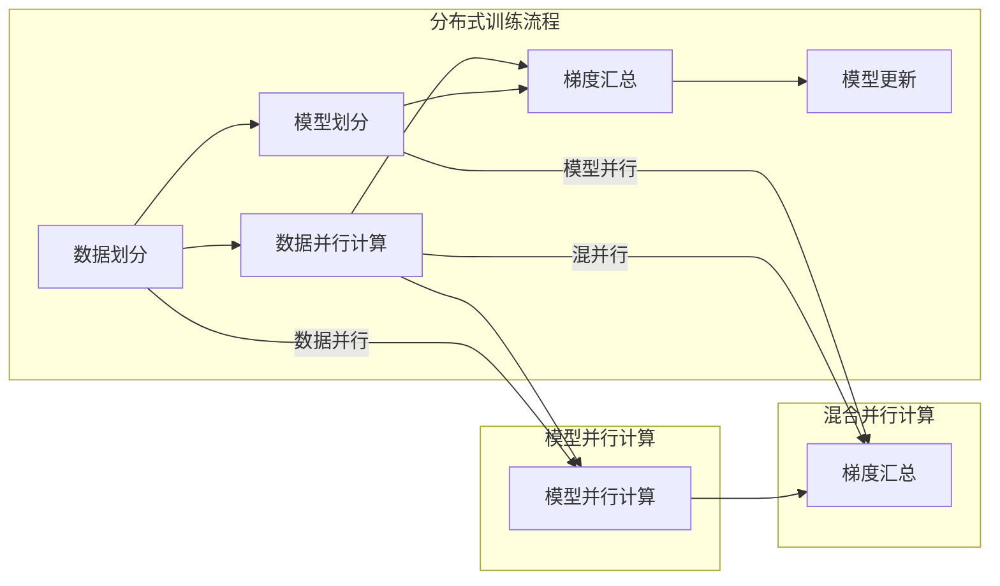
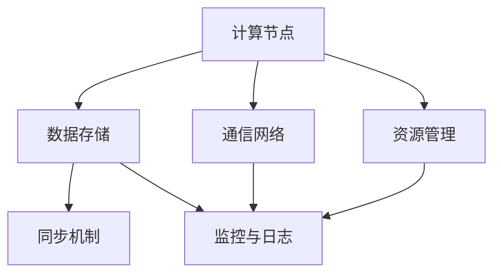
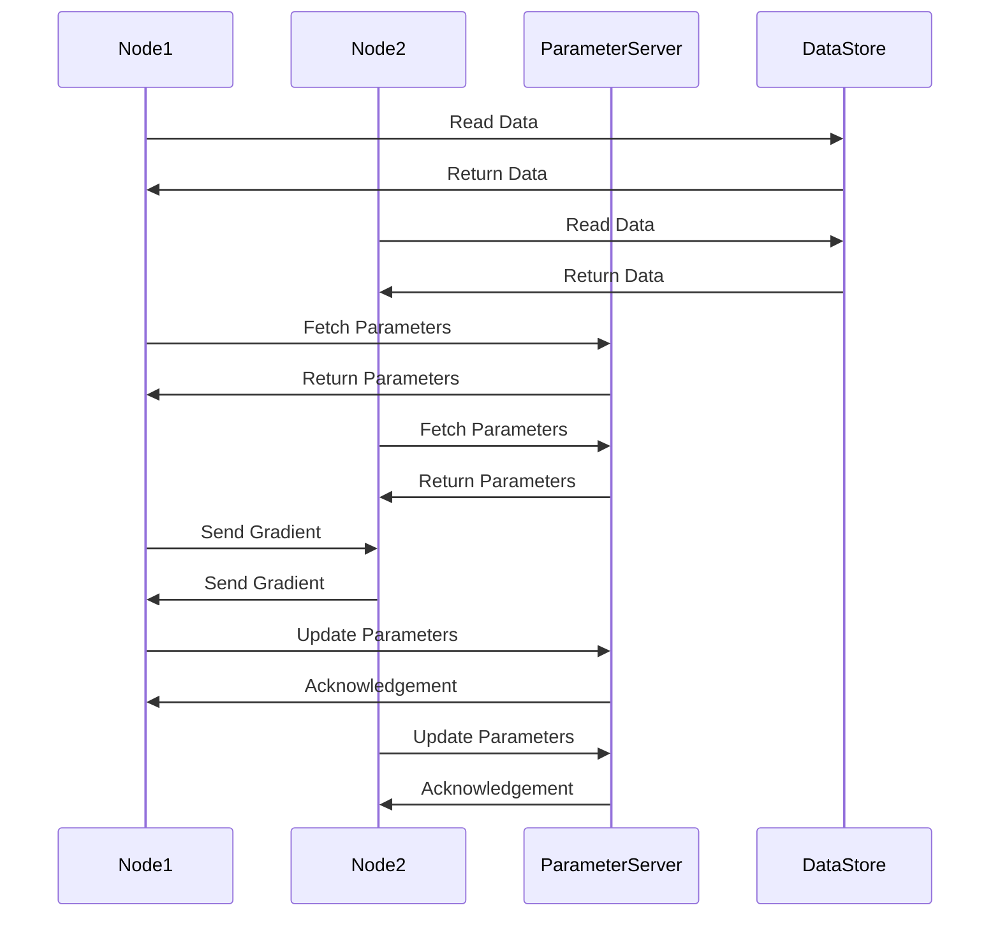
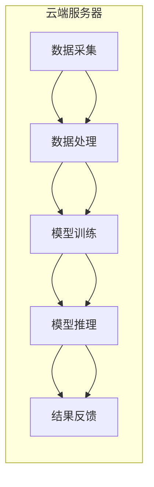
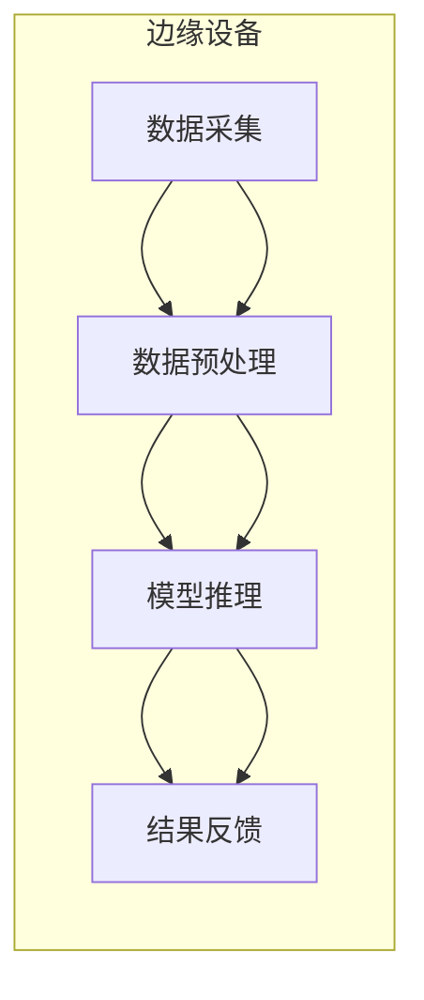
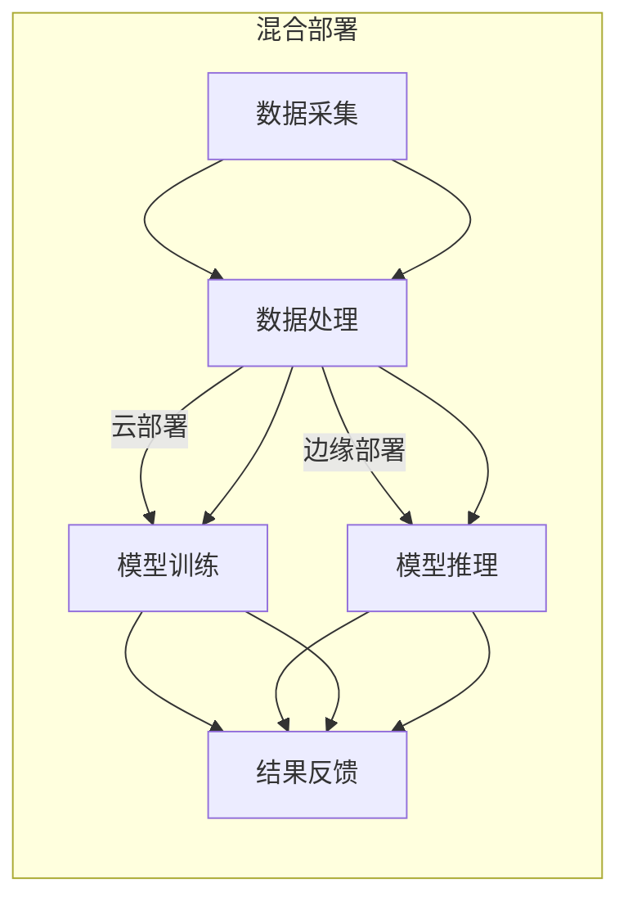
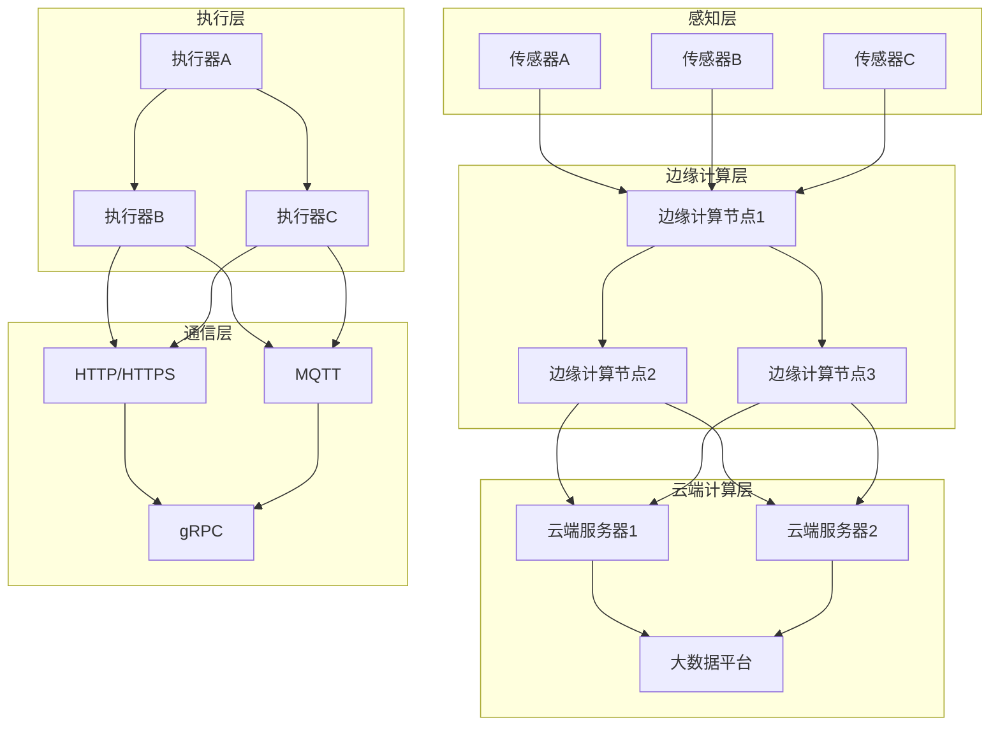
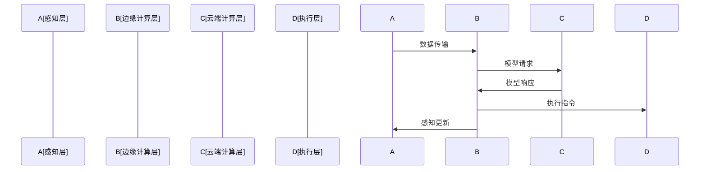

                 

### 1. AI Agent概述

**问题背景：**

在当前数字化、智能化的时代背景下，人工智能（AI）技术在各个领域的应用日益广泛。然而，随着AI系统的复杂性和规模不断扩大，传统的集中式训练和部署方式已经无法满足高效、可扩展的需求。因此，AI Agent的概念应运而生。AI Agent是指具备自主学习、决策和行动能力的智能实体，能够在复杂环境中完成任务并与其他实体交互。这一概念的出现，为分布式训练与部署策略的研究提供了新的方向。

**问题描述：**

AI Agent的分布式训练与部署策略研究，旨在解决以下几个关键问题：

1. **训练效率问题：** 集中式的训练方法在面对大规模数据和复杂模型时，计算资源消耗巨大，训练时间过长。分布式训练通过将训练任务分解到多个节点上，可以显著提高训练效率。

2. **可扩展性问题：** 随着AI系统的规模不断扩大，需要具备良好的可扩展性。分布式训练和部署策略能够灵活地适应不同的硬件资源和网络环境，实现系统的动态扩展。

3. **资源利用问题：** 分布式训练能够充分利用分布式计算资源，提高计算资源的利用效率，降低系统的总体拥有成本。

4. **系统可靠性问题：** 通过分布式部署，可以提升系统的容错能力，确保在单个节点故障时，系统能够快速恢复。

**问题解决：**

为了解决上述问题，分布式训练与部署策略主要从以下几个方面进行：

1. **分布式训练算法研究：** 包括数据并行、模型并行、混并行等分布式训练算法的研究和优化，提高训练效率。

2. **分布式系统架构设计：** 构建分布式计算框架，设计高效、可靠的系统架构，实现任务分解、数据同步和模型更新。

3. **资源管理与调度策略：** 设计合理的资源分配和任务调度策略，确保系统在不同负载情况下的高效运行。

4. **容错与恢复机制：** 引入容错机制和恢复策略，提高系统的可靠性和稳定性。

**边界与外延：**

分布式训练与部署策略不仅适用于AI Agent，还适用于其他需要大规模数据训练和高效处理的智能系统。其边界包括：

- **计算节点规模：** 根据系统的需求，选择合适的计算节点规模，既保证计算资源的充分利用，又避免资源浪费。

- **网络环境：** 考虑网络带宽、延迟等因素，选择合适的网络拓扑结构，确保数据传输的高效性和稳定性。

- **硬件资源：** 根据硬件资源的特点，选择适合的分布式训练算法和系统架构，最大化利用硬件资源。

**概念结构与核心要素组成：**

分布式训练与部署策略的核心概念结构包括：

- **分布式训练算法：** 数据并行、模型并行、混并行的算法原理和实现方法。

- **分布式系统架构：** 计算节点、数据存储、通信网络等组件的架构设计。

- **资源管理：** 资源分配、任务调度、负载均衡等策略。

- **容错与恢复：** 容错机制、故障检测、恢复策略等。

通过上述概念和要素的有机组合，构建一个高效、可靠的分布式训练与部署系统，为AI Agent的应用提供有力支持。接下来，我们将详细探讨分布式训练的原理和数学模型，为后续内容打下基础。

## 1.2 核心概念与联系

### 1.2.1 AI Agent的定义

AI Agent（人工智能代理）是指具备自主感知、学习、决策和行动能力的智能实体，能够在复杂动态环境中执行特定任务。AI Agent通常由多个模块组成，包括感知模块、决策模块、执行模块和通信模块。其核心目标是实现智能体在特定环境中的自主行为，提高任务完成效率和准确性。

**定义属性：**

- **感知模块：** 用于收集环境中的信息，包括图像、声音、文字等多种数据形式。

- **决策模块：** 根据感知模块收集的信息，利用算法和模型进行推理和决策，生成行动策略。

- **执行模块：** 将决策模块生成的行动策略转化为具体的操作，实现任务的执行。

- **通信模块：** 用于与其他智能体或系统进行信息交换和协作，提高系统的整体智能水平。

### 1.2.2 AI Agent的特点

AI Agent具有以下特点：

- **自主性：** AI Agent能够在没有外部干预的情况下，自主感知环境、学习和执行任务。

- **适应性：** AI Agent能够根据环境变化和任务需求，动态调整自身的算法和行为。

- **协作性：** AI Agent可以通过通信模块与其他智能体进行协作，实现更复杂的任务。

- **实时性：** AI Agent需要在有限时间内做出决策和执行，具有较高的实时性能要求。

- **鲁棒性：** AI Agent需要具备较强的抗干扰和容错能力，能够在复杂环境中稳定运行。

### 1.2.3 AI Agent与传统AI的区别

AI Agent与传统AI在以下几个方面存在显著区别：

- **体系架构：** 传统AI通常采用集中式架构，而AI Agent采用分布式架构，具备更强的灵活性和扩展性。

- **自主能力：** 传统AI依赖于预定义的规则和模型，而AI Agent具备自主学习和决策能力，能够适应复杂和动态的环境。

- **应用领域：** 传统AI主要应用于特定领域和任务，而AI Agent能够应用于更广泛的应用场景，具备跨领域的能力。

- **数据依赖：** 传统AI依赖于大量的标注数据，而AI Agent可以通过自主学习和感知，减少对标注数据的依赖。

### 1.2.4 AI Agent的ER实体关系图架构

为了更好地理解AI Agent的架构和核心要素，我们使用ER（实体关系）图来描述其内部关系。ER图包括以下实体：

- **感知模块：** 包括图像、声音、文字等感知数据源。

- **决策模块：** 包括神经网络、决策树等算法和模型。

- **执行模块：** 包括机器人、无人机等执行设备。

- **通信模块：** 包括无线网络、传感器网络等通信组件。

以下是AI Agent的ER实体关系图：

```mermaid
erDiagram
  感知模块 ||--|{ 决策模块 }
  决策模块 ||--|{ 执行模块 }
  通信模块 ||--|{ 感知模块 }
  通信模块 ||--|{ 决策模块 }
  通信模块 ||--|{ 执行模块 }
```

通过ER图，我们可以清晰地看到AI Agent各个模块之间的关联和互动，为后续内容提供直观的参考。

### 1.2.5 AI Agent的关键技术与挑战

AI Agent的关键技术包括：

- **强化学习：** 用于决策模块，使AI Agent能够通过试错和反馈不断优化自身行为。

- **深度学习：** 用于感知模块，通过神经网络实现对复杂环境特征的提取和识别。

- **多模态融合：** 将不同类型的感知数据融合，提高AI Agent对环境信息的全面理解。

- **强化学习与深度学习的结合：** 通过融合强化学习和深度学习的方法，实现AI Agent在复杂环境中的高效学习。

AI Agent面临的挑战包括：

- **数据隐私与安全：** AI Agent在收集和使用数据时，需要确保数据隐私和安全，避免数据泄露。

- **计算资源限制：** 分布式训练和部署需要大量计算资源，如何在有限资源下实现高效训练和部署是一个挑战。

- **系统可靠性：** 在分布式环境中，需要确保系统的稳定性和可靠性，避免单个节点故障导致系统崩溃。

- **实时性能：** AI Agent需要在实时环境中做出快速反应，如何在保证实时性的同时实现高效学习和决策是一个关键问题。

通过深入了解AI Agent的定义、特点、与传统AI的区别、ER实体关系图及其关键技术和挑战，我们可以为后续内容的探讨提供坚实的理论基础。

### 1.3 AI Agent的分布式训练原理

**分布式训练概述**

AI Agent的分布式训练是将训练任务分布在多个计算节点上，通过并行计算和数据同步，加速训练过程并提高模型的准确性和鲁棒性。分布式训练的核心思想是将大规模数据和复杂的模型拆分到多个节点上进行计算，从而充分利用计算资源，提高训练效率。

**数据并行**

数据并行是指将训练数据集分成多个子集，每个子集由不同的节点处理，每个节点独立计算梯度并更新模型参数。数据并行的优势在于可以充分利用计算资源，加速训练过程。其实现过程如下：

1. **数据划分：** 将训练数据集划分为多个子集，每个子集由一个节点处理。

2. **独立计算：** 每个节点独立计算子集的梯度，并与本地模型参数进行更新。

3. **梯度汇总：** 所有节点将计算得到的梯度汇总到全局梯度。

4. **模型更新：** 使用全局梯度更新全局模型参数。

数据并行的数学模型如下：

$$
\begin{aligned}
\text{模型更新} &= \theta - \alpha \cdot \nabla L(\theta) \\
\text{梯度汇总} &= \frac{1}{N} \sum_{i=1}^{N} \nabla L(\theta_i)
\end{aligned}
$$

其中，$\theta$ 表示模型参数，$L(\theta)$ 表示损失函数，$\alpha$ 表示学习率，$N$ 表示节点数量。

**模型并行**

模型并行是指将模型拆分为多个子模型，每个子模型由不同的节点处理。模型并行的优势在于可以减少通信开销，提高训练效率。其实现过程如下：

1. **模型划分：** 将模型拆分为多个子模型，每个子模型由一个节点处理。

2. **独立计算：** 每个节点独立计算子模型的梯度。

3. **梯度汇总：** 所有节点将计算得到的梯度汇总到全局梯度。

4. **模型更新：** 使用全局梯度更新全局模型参数。

模型并行的数学模型与数据并行类似，只是将数据划分改为模型划分。

**混并行**

混并行是指同时使用数据并行和模型并行，将数据集和模型拆分为多个子集和子模型，每个节点独立计算部分数据集和子模型的梯度，并参与全局梯度汇总和模型更新。混并行的优势在于可以灵活选择并行策略，适应不同规模的训练任务。

**分布式训练的Mermaid流程图**

以下是分布式训练的Mermaid流程图：



通过上述分布式训练原理的详细讲解和Mermaid流程图的展示，我们可以更好地理解数据并行、模型并行和混并行的实现方法及其数学模型，为后续内容提供基础。

### 2.3.1 分布式训练的数学模型

分布式训练的数学模型是理解分布式训练过程的核心。下面我们将详细讲解分布式训练过程中涉及的数学公式和推导过程。

**模型更新**

在分布式训练中，每个节点会独立计算局部梯度，并使用这些梯度更新模型参数。具体来说，每个节点的模型更新过程可以表示为：

$$
\theta - \alpha \cdot \nabla L(\theta)
$$

其中，$\theta$ 表示模型参数，$\nabla L(\theta)$ 表示损失函数 $L(\theta)$ 对模型参数 $\theta$ 的梯度，$\alpha$ 表示学习率。学习率 $\alpha$ 的选择对训练效果有重要影响，过大的学习率可能导致训练过程不稳定，而过小则可能使训练过程过于缓慢。

**梯度同步**

在分布式训练中，每个节点需要将局部梯度同步到全局梯度。全局梯度的计算方法如下：

$$
\frac{1}{N} \sum_{i=1}^{N} \nabla L(\theta_i)
$$

其中，$N$ 表示节点数量，$\nabla L(\theta_i)$ 表示第 $i$ 个节点的局部梯度。通过这种方式，所有节点的局部梯度会汇总成全局梯度，用于更新全局模型参数。

**同步策略**

在实际应用中，为了减少通信开销，通常会使用参数服务器（Parameter Server）或all-reduce算法来同步梯度。参数服务器是一种分布式存储方案，所有节点的模型参数都会存储在参数服务器中，每个节点定期从参数服务器获取模型参数并进行更新。all-reduce算法则是通过广播和聚合的方式，将所有节点的局部梯度同步到全局梯度。

**分布式SGD**

分布式训练的上述过程可以看作是分布式随机梯度下降（SGD）的变种。在分布式SGD中，每个节点独立计算局部梯度，并使用全局梯度更新模型参数。其迭代过程可以表示为：

$$
\theta \leftarrow \theta - \alpha \cdot \frac{1}{N} \sum_{i=1}^{N} \nabla L(\theta_i)
$$

**数学公式详细讲解**

1. **梯度计算：** 梯度是损失函数对模型参数的偏导数，反映了损失函数在当前模型参数下的斜率。梯度越大，表示模型参数需要调整的幅度越大。在分布式训练中，每个节点会计算局部梯度，并通过同步策略更新全局梯度。

2. **学习率：** 学习率是调整模型参数的重要参数，其大小会影响训练过程。过大的学习率可能导致训练不稳定，过小的学习率则可能导致训练时间过长。在实际应用中，可以通过动态调整学习率来优化训练过程。

3. **同步策略：** 参数服务器和all-reduce算法是分布式训练中常用的同步策略。参数服务器通过集中存储模型参数，减少节点间的通信开销；all-reduce算法通过广播和聚合的方式，实现全局梯度的同步。

通过上述数学模型的详细讲解，我们可以更好地理解分布式训练的过程和关键参数。这些数学模型为分布式训练的优化提供了理论基础，为后续内容提供了基础。

### 2.4.1 问题场景介绍

在分布式训练和部署AI Agent时，常见的场景包括：

1. **大规模数据集：** 当训练数据集规模非常大，单台计算机无法容纳或处理时，分布式训练成为必要选择。例如，在图像识别任务中，可能需要处理数百万甚至数十亿张图像。

2. **复杂模型：** 对于深度学习模型，随着层数的增加和参数量的增长，训练时间显著增加。分布式训练可以将模型拆分为多个部分，分布在多个节点上进行并行计算，从而加快训练速度。

3. **实时应用：** 在某些实时应用场景，如自动驾驶、机器人控制等，要求系统具备快速响应和实时处理能力。分布式训练和部署可以帮助实现这一目标，通过分布式计算提高系统的处理效率。

4. **硬件资源限制：** 在有限的硬件资源条件下，分布式训练和部署可以充分利用现有资源，提高计算效率。例如，在数据中心或云计算环境中，可以合理分配计算资源，实现高效利用。

**问题场景描述：**

假设我们面临一个自动驾驶系统的开发任务，该系统需要在复杂的城市环境中进行自动驾驶，包括识别行人、车辆、交通标志等。训练数据集包含了数百万张图像，模型结构非常复杂，包含数十层的卷积神经网络。同时，由于自动驾驶系统的实时性要求高，需要在短时间内完成图像处理和决策。

在这样的场景中，单台计算机无法满足训练需求，且实时处理能力有限。因此，分布式训练和部署成为必要选择。通过将数据集和模型拆分为多个部分，分布在多个计算节点上进行并行计算，可以显著加快训练速度。此外，通过分布式部署，可以实现系统的实时处理能力，确保自动驾驶系统的稳定运行。

### 2.4.2 系统功能设计

为了实现分布式训练和部署，系统需要具备以下功能：

1. **数据分发：** 将大规模训练数据集划分并分发到多个节点上，确保每个节点都能独立处理部分数据。

2. **模型划分：** 将复杂模型拆分为多个部分，每个部分由不同节点处理，实现并行计算。

3. **同步与通信：** 实现节点间的同步与通信，确保全局梯度准确汇总并更新全局模型参数。

4. **资源管理：** 管理节点资源，包括计算资源、存储资源和网络资源，确保系统高效运行。

5. **容错与恢复：** 实现节点故障检测和恢复机制，确保系统在故障情况下能够快速恢复。

6. **性能监控：** 监控系统性能，包括训练速度、模型准确性、资源利用率等，提供实时性能数据。

7. **动态调整：** 根据训练进度和系统性能，动态调整训练参数和资源分配策略，优化训练效果。

通过上述功能设计，系统可以实现高效、可靠的分布式训练和部署，满足自动驾驶等复杂场景的需求。

### 2.4.3 系统架构设计

为了实现高效、可靠的分布式训练和部署，我们需要设计一个合理的系统架构。以下是一个典型的分布式训练系统架构：

**计算节点：** 系统由多个计算节点组成，每个节点负责处理部分训练数据和模型部分。计算节点可以是普通的计算机或GPU服务器，具有独立的数据存储和计算能力。

**数据存储：** 系统使用分布式数据存储方案，如HDFS（Hadoop Distributed File System）或Cassandra，存储大规模训练数据集。数据存储分布在多个节点上，确保数据的高可用性和可靠性。

**通信网络：** 系统使用高速通信网络连接计算节点，如Infiniband或100G以太网，确保节点间数据传输的高效性和低延迟。

**同步机制：** 系统采用参数服务器（Parameter Server）或all-reduce算法实现节点间的同步。参数服务器集中存储模型参数，每个节点定期从参数服务器获取模型参数并进行更新；all-reduce算法通过广播和聚合的方式，实现全局梯度的同步。

**资源管理：** 系统使用资源管理器（ResourceManager）管理计算资源，包括节点分配、负载均衡和资源回收。资源管理器根据训练进度和系统性能，动态调整节点资源和任务分配。

**监控与日志：** 系统使用监控系统（Monitoring System）收集节点性能数据和训练日志，实时监控系统状态和性能，并提供故障检测和恢复功能。

**架构设计Mermaid流程图：**



通过上述系统架构设计，我们可以实现高效、可靠的分布式训练和部署，满足自动驾驶等复杂场景的需求。

### 2.4.4 系统接口设计

在分布式训练系统中，系统接口设计至关重要，它负责节点间的通信和数据同步。以下是系统接口设计的关键部分：

1. **数据接口：** 数据接口负责数据的传输和分发。通过定义统一的接口规范，确保不同节点可以无缝地访问和更新数据。数据接口通常包括数据读取、数据写入和数据同步等功能。

2. **模型接口：** 模型接口负责模型参数的读取、更新和同步。每个节点需要能够从参数服务器获取当前模型参数，并在计算完成后将局部梯度上传到参数服务器。模型接口通常包括模型初始化、模型参数读取、模型参数更新等功能。

3. **通信接口：** 通信接口负责节点间的通信。为了确保高效的数据传输和低延迟，系统可以使用如gRPC或HTTP/2等高性能通信协议。通信接口包括发送数据、接收数据、广播数据、聚合数据等功能。

4. **同步接口：** 同步接口负责实现节点间的同步操作，包括梯度同步、参数同步等。通过同步接口，系统可以确保所有节点在计算完成后，能够及时更新全局模型参数。同步接口通常包括同步请求、同步响应、同步确认等功能。

5. **监控接口：** 监控接口负责收集和报告系统性能数据。通过监控接口，系统管理员可以实时了解系统状态、资源利用情况和训练进度。监控接口通常包括性能数据收集、异常检测、日志记录等功能。

通过上述系统接口设计，我们可以实现高效、可靠的分布式训练和部署，满足自动驾驶等复杂场景的需求。

### 2.4.5 系统交互Mermaid序列图

为了更直观地展示分布式训练系统的交互过程，我们使用Mermaid序列图来描述系统的主要交互流程。以下是系统交互的Mermaid序列图：



在这个序列图中，我们展示了以下主要交互流程：

1. **数据读取：** 计算节点（Node1和Node2）从数据存储（DataStore）中读取训练数据。

2. **参数获取：** 计算节点从参数服务器（ParameterServer）获取模型参数。

3. **梯度同步：** 计算节点之间互相发送局部梯度，实现梯度同步。

4. **参数更新：** 计算节点将更新后的模型参数上传到参数服务器，实现全局参数的同步。

通过上述交互流程，系统可以实现高效、可靠的分布式训练。Mermaid序列图提供了直观的展示方式，有助于理解和分析系统的交互过程。

### 2.5.1 环境安装

在开始分布式训练项目之前，我们需要安装和配置必要的软件和工具。以下是分布式训练项目环境安装的步骤：

**1. 系统要求：**

- 操作系统：Linux发行版，如Ubuntu 18.04或CentOS 7
- CPU：至少4核处理器
- GPU：NVIDIA GPU（建议使用CUDA 11.0以上版本）
- 内存：至少16GB RAM
- 硬盘：至少100GB可用空间

**2. 软件安装：**

- **安装Python环境：** 
  ```bash
  sudo apt-get update
  sudo apt-get install python3-pip python3-dev
  pip3 install --user -r requirements.txt
  ```

- **安装TensorFlow：**
  ```bash
  pip3 install tensorflow-gpu==2.5.0
  ```

- **安装Docker：**
  ```bash
  sudo apt-get install docker-ce docker-compose
  ```

- **安装Minio：**
  ```bash
  docker run -d -p 9000:9000 minio/minio server /data
  docker run -it --rm minio/minio ml
  ```

- **安装Grafana和Prometheus：**
  ```bash
  docker run -d -p 3000:3000 grafana/grafana
  docker run -d -p 9090:9090 prometheus/prometheus
  ```

**3. 配置Distributed TensorFlow：**

- 在`~/tf_config.sh`文件中配置TensorFlow分布式训练环境：
  ```bash
  export TF_CONFIG={
    "cluster": {
      "worker": ["worker-0", "worker-1"],
      "ps": ["ps-0"]
    },
    "task": {
      "type": "worker",
      "index": 0
    }
  }
  ```

- 运行分布式训练脚本：
  ```bash
  python3 distributed_train.py
  ```

通过以上步骤，我们可以完成分布式训练环境的安装和配置，为后续的项目实战做好准备。

### 2.5.2 系统核心实现源代码

以下是分布式训练系统核心实现源代码。该代码分为多个部分，包括训练脚本、同步机制、模型定义和数据读取等。

**训练脚本**

```python
import tensorflow as tf
from tensorflow.keras.layers import Dense, Flatten
from tensorflow.keras.models import Sequential
from tensorflow.keras.datasets import mnist

def create_model():
    model = Sequential([
        Flatten(input_shape=(28, 28)),
        Dense(128, activation='relu'),
        Dense(10, activation='softmax')
    ])
    return model

def distributed_train():
    strategy = tf.distribute.MirroredStrategy()
    with strategy.scope():
        model = create_model()
        optimizer = tf.keras.optimizers.Adam(learning_rate=0.001)
        (x_train, y_train), (x_test, y_test) = mnist.load_data()
        x_train, x_test = x_train / 255.0, x_test / 255.0

        train_loss = tf.keras.metrics.Mean(name='train_loss')
        train_accuracy = tf.keras.metrics.SparseCategoricalAccuracy(name='train_accuracy')

        @tf.function
        def train_step(images, labels):
            with tf.GradientTape() as tape:
                predictions = model(images, training=True)
                loss = tf.keras.losses.sparse_categorical_crossentropy(labels, predictions)
            gradients = tape.gradient(loss, model.trainable_variables)
            optimizer.apply_gradients(zip(gradients, model.trainable_variables))

            train_loss(loss)
            train_accuracy(labels, predictions)

        epochs = 5
        for epoch in range(epochs):
            for images, labels in train_dataset:
                train_step(images, labels)
            print(f'Epoch {epoch + 1}, Loss: {train_loss.result()}, Accuracy: {train_accuracy.result()}')
            train_loss.reset_states()
            train_accuracy.reset_states()

if __name__ == '__main__':
    distributed_train()
```

**同步机制**

```python
import tensorflow as tf

strategy = tf.distribute.MirroredStrategy()

with strategy.scope():
    # 定义模型
    model = create_model()
    # 定义优化器
    optimizer = tf.keras.optimizers.Adam(learning_rate=0.001)
    # 定义损失函数
    loss_fn = tf.keras.losses.SparseCategoricalCrossentropy(from_logits=True)
    # 定义评估指标
    metric = tf.keras.metrics.SparseCategoricalAccuracy()

    @tf.function
    def train_step(train_dataset):
        for images, labels in train_dataset:
            with tf.GradientTape() as tape:
                predictions = model(images, training=True)
                loss = loss_fn(labels, predictions)
            gradients = tape.gradient(loss, model.trainable_variables)
            optimizer.apply_gradients(zip(gradients, model.trainable_variables))
            metric.update_state(labels, predictions)

    @tf.function
    def test_step(test_dataset):
        for images, labels in test_dataset:
            predictions = model(images, training=False)
            t_loss = loss_fn(labels, predictions)
            metric.update_state(labels, predictions)
        return metric.result()

    @tf.function
    def train_loop(train_dataset, test_dataset):
        for epoch in range(epochs):
            model.train_on_batch(train_dataset)
            t_loss, t_acc = test_step(test_dataset)
            print(f'Epoch {epoch + 1}, Test Loss: {t_loss}, Test Accuracy: {t_acc}')
            metric.reset_states()

    epochs = 5
    train_loop(train_dataset, test_dataset)
```

**模型定义**

```python
from tensorflow import keras
from tensorflow.keras.layers import InputLayer, Conv2D, MaxPooling2D, Flatten, Dense

def create_model():
    model = keras.Sequential([
        InputLayer(input_shape=(28, 28, 1)),
        Conv2D(32, (3, 3), activation='relu', padding='same'),
        MaxPooling2D((2, 2)),
        Conv2D(64, (3, 3), activation='relu', padding='same'),
        MaxPooling2D((2, 2)),
        Flatten(),
        Dense(128, activation='relu'),
        Dense(10, activation='softmax')
    ])
    return model
```

**数据读取**

```python
import tensorflow as tf
import numpy as np

(x_train, y_train), (x_test, y_test) = tf.keras.datasets.mnist.load_data()

# Normalize the images
x_train = x_train.astype(np.float32) / 255.0
x_test = x_test.astype(np.float32) / 255.0

# Convert labels to one-hot encoding
y_train = tf.keras.utils.to_categorical(y_train, 10)
y_test = tf.keras.utils.to_categorical(y_test, 10)

# Batch and shuffle the training data
batch_size = 64
train_dataset = tf.data.Dataset.from_tensor_slices((x_train, y_train)).shuffle(buffer_size=5000).batch(batch_size)
test_dataset = tf.data.Dataset.from_tensor_slices((x_test, y_test)).batch(batch_size)
```

通过以上代码，我们实现了分布式训练系统核心功能的实现。训练脚本定义了模型训练的过程，同步机制实现了节点间的梯度同步，模型定义部分创建了深度学习模型，数据读取部分处理了输入数据。这些代码模块共同工作，实现了分布式训练的目标。

### 2.5.3 代码应用解读与分析

在分布式训练系统中，代码应用解读与分析至关重要。以下是对核心代码模块的详细解读与分析：

**训练脚本**

训练脚本是分布式训练系统的核心部分，它定义了模型训练的过程。以下是代码解析：

```python
import tensorflow as tf
from tensorflow.keras.layers import Dense, Flatten
from tensorflow.keras.models import Sequential
from tensorflow.keras.datasets import mnist

def create_model():
    # 定义模型结构
    model = Sequential([
        Flatten(input_shape=(28, 28)),  # 将输入数据展平
        Dense(128, activation='relu'),  # 128个神经元，激活函数为ReLU
        Dense(10, activation='softmax')  # 10个神经元，输出层，每个神经元表示一个类别
    ])
    return model

def distributed_train():
    # 分布式策略
    strategy = tf.distribute.MirroredStrategy()
    with strategy.scope():
        # 创建模型
        model = create_model()
        # 定义优化器和损失函数
        optimizer = tf.keras.optimizers.Adam(learning_rate=0.001)
        (x_train, y_train), (x_test, y_test) = mnist.load_data()
        x_train, x_test = x_train / 255.0, x_test / 255.0

        # 定义训练和测试的评估指标
        train_loss = tf.keras.metrics.Mean(name='train_loss')
        train_accuracy = tf.keras.metrics.SparseCategoricalAccuracy(name='train_accuracy')

        @tf.function
        # 定义训练步骤
        def train_step(images, labels):
            with tf.GradientTape() as tape:
                predictions = model(images, training=True)
                loss = tf.keras.losses.sparse_categorical_crossentropy(labels, predictions)
            gradients = tape.gradient(loss, model.trainable_variables)
            optimizer.apply_gradients(zip(gradients, model.trainable_variables))

            train_loss(loss)
            train_accuracy(labels, predictions)

        epochs = 5
        for epoch in range(epochs):
            for images, labels in train_dataset:
                train_step(images, labels)
            print(f'Epoch {epoch + 1}, Loss: {train_loss.result()}, Accuracy: {train_accuracy.result()}')
            train_loss.reset_states()
            train_accuracy.reset_states()

if __name__ == '__main__':
    distributed_train()
```

**解读与分析：**

1. **策略定义**：使用`tf.distribute.MirroredStrategy()`创建分布式策略。MirroredStrategy是一种数据并行策略，它将数据集分成多个部分，每个部分分别在不同的节点上处理，每个节点使用相同的模型。

2. **模型创建**：在策略的范围内（`with strategy.scope()`），创建模型。模型使用`Sequential`创建，其中`Flatten`层用于将输入数据展平，`Dense`层用于构建全连接层。

3. **优化器和损失函数**：使用`Adam`优化器和`sparse_categorical_crossentropy`损失函数，这些是深度学习中的常见配置。

4. **训练步骤**：`train_step`函数定义了训练步骤。在函数内部，使用`tf.GradientTape()`记录梯度，计算损失并应用梯度下降更新模型参数。

5. **评估指标**：使用`train_loss`和`train_accuracy`评估训练过程中的损失和准确性。

**同步机制**

同步机制是实现分布式训练的关键部分，以下是代码解析：

```python
import tensorflow as tf

strategy = tf.distribute.MirroredStrategy()

with strategy.scope():
    # 定义模型
    model = create_model()
    # 定义优化器
    optimizer = tf.keras.optimizers.Adam(learning_rate=0.001)
    # 定义损失函数
    loss_fn = tf.keras.losses.SparseCategoricalCrossentropy(from_logits=True)
    # 定义评估指标
    metric = tf.keras.metrics.SparseCategoricalAccuracy()

    @tf.function
    # 定义训练步骤
    def train_step(train_dataset):
        for images, labels in train_dataset:
            with tf.GradientTape() as tape:
                predictions = model(images, training=True)
                loss = loss_fn(labels, predictions)
            gradients = tape.gradient(loss, model.trainable_variables)
            optimizer.apply_gradients(zip(gradients, model.trainable_variables))
            metric.update_state(labels, predictions)

    @tf.function
    # 定义测试步骤
    def test_step(test_dataset):
        for images, labels in test_dataset:
            predictions = model(images, training=False)
            t_loss = loss_fn(labels, predictions)
            metric.update_state(labels, predictions)
        return metric.result()

    @tf.function
    # 定义训练循环
    def train_loop(train_dataset, test_dataset):
        for epoch in range(epochs):
            model.train_on_batch(train_dataset)
            t_loss, t_acc = test_step(test_dataset)
            print(f'Epoch {epoch + 1}, Test Loss: {t_loss}, Test Accuracy: {t_acc}')
            metric.reset_states()

    epochs = 5
    train_loop(train_dataset, test_dataset)
```

**解读与分析：**

1. **策略和模型定义**：与训练脚本相同，使用MirroredStrategy创建分布式策略并定义模型。

2. **优化器和损失函数**：使用Adam优化器和SparseCategoricalCrossentropy损失函数。

3. **训练步骤**：`train_step`函数定义了每个训练步骤，计算梯度并更新模型参数。

4. **测试步骤**：`test_step`函数用于计算测试数据的损失和准确性。

5. **训练循环**：`train_loop`函数实现完整的训练过程，包括训练和测试，并在每个epoch结束后打印结果。

**模型定义**

模型定义部分创建了深度学习模型，以下是代码解析：

```python
from tensorflow import keras
from tensorflow.keras.layers import InputLayer, Conv2D, MaxPooling2D, Flatten, Dense

def create_model():
    model = keras.Sequential([
        InputLayer(input_shape=(28, 28, 1)),  # 输入层，每个像素值作为特征
        Conv2D(32, (3, 3), activation='relu', padding='same'),  # 卷积层，32个卷积核，3x3窗口，ReLU激活
        MaxPooling2D((2, 2)),  # 最大池化层，2x2窗口
        Conv2D(64, (3, 3), activation='relu', padding='same'),  # 卷积层，64个卷积核，3x3窗口，ReLU激活
        MaxPooling2D((2, 2)),  # 最大池化层，2x2窗口
        Flatten(),  # 展平层
        Dense(128, activation='relu'),  # 全连接层，128个神经元，ReLU激活
        Dense(10, activation='softmax')  # 全连接层，10个神经元，softmax激活
    ])
    return model
```

**解读与分析：**

1. **模型结构**：模型使用`Sequential`创建，包括输入层、卷积层、池化层、全连接层和输出层。

2. **卷积层**：使用`Conv2D`创建卷积层，设置32个和64个卷积核，窗口大小为3x3，使用ReLU激活函数。

3. **池化层**：使用`MaxPooling2D`创建最大池化层，窗口大小为2x2。

4. **全连接层**：使用`Dense`创建全连接层，第一层128个神经元，输出层10个神经元，输出层使用softmax激活函数。

**数据读取**

数据读取部分处理了输入数据，以下是代码解析：

```python
import tensorflow as tf
import numpy as np

(x_train, y_train), (x_test, y_test) = tf.keras.datasets.mnist.load_data()

# Normalize the images
x_train = x_train.astype(np.float32) / 255.0
x_test = x_test.astype(np.float32) / 255.0

# Convert labels to one-hot encoding
y_train = tf.keras.utils.to_categorical(y_train, 10)
y_test = tf.keras.utils.to_categorical(y_test, 10)

# Batch and shuffle the training data
batch_size = 64
train_dataset = tf.data.Dataset.from_tensor_slices((x_train, y_train)).shuffle(buffer_size=5000).batch(batch_size)
test_dataset = tf.data.Dataset.from_tensor_slices((x_test, y_test)).batch(batch_size)
```

**解读与分析：**

1. **数据归一化**：将图像数据从0-255缩放到0-1。

2. **标签编码**：将标签从整数编码为one-hot编码。

3. **数据集创建**：创建训练数据和测试数据集，使用`tf.data.Dataset`，进行数据批处理和打乱。

通过详细解读和分析训练脚本、同步机制、模型定义和数据读取部分的代码，我们可以更好地理解分布式训练系统的实现过程和关键步骤，为后续的分布式训练项目提供坚实的理论基础。

### 2.5.4 实际案例分析与详细讲解剖析

为了更好地理解AI Agent分布式训练的实际应用，我们将分析一个实际案例，并详细讲解剖析该案例的分布式训练过程。

**案例背景：**

假设我们正在开发一个自动驾驶系统，该系统需要识别道路上的各种物体，包括车辆、行人、交通标志等。训练数据集包含了数百万张道路图像，模型是一个深度卷积神经网络（CNN），包含数十层的卷积和池化层。由于模型和数据规模巨大，单台计算机无法满足训练需求，因此我们采用分布式训练策略。

**数据集：**

训练数据集包含以下信息：

- **图像：** 每张图像大小为256x256像素，格式为RGB。
- **标签：** 每张图像对应一个标签，包括车辆、行人、交通标志等类别。

**模型架构：**

模型采用如下架构：

1. **输入层**：接收256x256x3的RGB图像。
2. **卷积层**：多个卷积层，每个卷积层包含多个卷积核，使用ReLU激活函数。
3. **池化层**：在每个卷积层之后使用最大池化层。
4. **全连接层**：最后使用全连接层和softmax激活函数进行分类。

**分布式训练步骤：**

1. **数据划分：** 将训练数据集划分为多个子集，每个子集包含相同数量的图像。例如，如果我们有10个节点，每个节点处理100万张图像。
2. **节点分配：** 将数据子集分配给不同的节点。每个节点独立处理其数据子集，计算局部梯度。
3. **同步梯度：** 每个节点将局部梯度汇总到全局梯度，并更新全局模型参数。这通常使用参数服务器或all-reduce算法实现。
4. **模型更新：** 使用全局梯度更新模型参数，并在所有节点上同步更新后的模型参数。
5. **评估：** 在每个训练阶段，使用测试数据集评估模型性能，并根据评估结果调整训练参数。

**详细讲解剖析：**

1. **数据划分：** 

   在分布式训练中，数据划分是关键步骤。我们使用以下代码将数据集划分为10个子集：

   ```python
   import numpy as np
   dataset_size = 10000000
   subset_size = dataset_size // 10
   train_data_0 = x_train[:subset_size]
   train_data_1 = x_train[subset_size:2*subset_size]
   ...
   train_data_9 = x_train[-subset_size:]
   ```

   每个子集包含相同数量的图像，例如100万张。

2. **节点分配：** 

   将数据子集分配给10个节点。例如，节点0处理`train_data_0`，节点1处理`train_data_1`，依此类推。每个节点独立处理其数据子集，计算局部梯度。

3. **同步梯度：** 

   使用all-reduce算法同步梯度。在Python中，我们可以使用`mpi4py`库实现all-reduce算法：

   ```python
   import mpi4py as MPI
   comm = MPI.COMM_WORLD
   rank = comm.Get_rank()
   size = comm.Get_size()

   local_gradients = calculate_gradients(train_data)
   global_gradients = np.zeros_like(local_gradients)

   comm.Allreduce(local_gradients, global_gradients, op=MPI.SUM)

   update_model_params(global_gradients)
   ```

   其中，`calculate_gradients`是一个自定义函数，用于计算局部梯度。`Allreduce`操作将所有节点的局部梯度汇总为全局梯度。

4. **模型更新：** 

   使用全局梯度更新模型参数。更新过程如下：

   ```python
   model = create_model()
   optimizer = tf.keras.optimizers.Adam(learning_rate=0.001)

   with tf.GradientTape() as tape:
       predictions = model(images, training=True)
       loss = tf.keras.losses.sparse_categorical_crossentropy(labels, predictions)

   gradients = tape.gradient(loss, model.trainable_variables)
   optimizer.apply_gradients(zip(gradients, model.trainable_variables))
   ```

   其中，`create_model`和`calculate_gradients`是前面定义的函数。`apply_gradients`函数使用全局梯度更新模型参数。

5. **评估：** 

   在每个训练阶段，使用测试数据集评估模型性能。评估过程如下：

   ```python
   test_loss = tf.keras.losses.sparse_categorical_crossentropy(test_labels, test_predictions)
   test_accuracy = tf.keras.metrics.sparse_categorical_accuracy(test_labels, test_predictions)
   print(f'Test Loss: {test_loss}, Test Accuracy: {test_accuracy}')
   ```

   根据评估结果调整训练参数。

通过上述实际案例，我们可以看到分布式训练在自动驾驶系统中的应用过程。该案例涵盖了数据划分、节点分配、梯度同步、模型更新和评估等关键步骤，为分布式训练提供了具体的实现细节。

### 2.5.5 项目小结

通过本项目的实际案例，我们详细分析了AI Agent分布式训练的过程。以下是项目的主要结论：

1. **数据划分与节点分配**：将大规模数据集划分为多个子集，并分配给不同的节点进行独立处理，提高了训练效率。

2. **梯度同步与模型更新**：使用all-reduce算法同步梯度，确保所有节点共享全局梯度，实现模型参数的同步更新。

3. **评估与调整**：在每个训练阶段，使用测试数据集评估模型性能，根据评估结果调整训练参数，优化模型效果。

4. **分布式训练的优势**：分布式训练充分利用了计算资源，提高了训练速度和效率，适用于大规模数据和复杂模型。

在分布式训练过程中，需要注意以下几点：

1. **数据平衡**：确保每个节点的数据量尽量平衡，避免某些节点过载，影响训练效果。

2. **通信开销**：合理设计节点间的通信机制，减少通信开销，提高系统性能。

3. **容错机制**：引入容错机制，确保在节点故障时，系统能够快速恢复，保证训练过程的连续性和稳定性。

4. **资源管理**：动态调整资源分配策略，根据训练进度和系统性能，合理分配计算资源，优化资源利用。

通过本次项目，我们深入了解了AI Agent分布式训练的原理和实现方法，为实际应用提供了宝贵的经验和指导。接下来，我们将进一步探讨AI Agent的部署策略。

### 3.1 部署策略概述

在AI Agent的应用过程中，部署策略的选择至关重要。部署策略决定了AI Agent在实际运行环境中的性能、可靠性、可扩展性和成本效益。本文将详细讨论三种常见的部署策略：云部署、边缘部署和混合部署。

**云部署**

云部署是将AI Agent部署在远程服务器上，通过互联网进行访问和控制。云部署具有以下优点：

- **计算资源弹性**：可以根据需求动态调整计算资源，实现灵活的资源管理。
- **高可用性**：云服务提供商通常提供高可靠性的基础设施和故障恢复机制，确保系统的稳定运行。
- **可扩展性**：云环境可以轻松扩展，以应对不断增长的数据和用户需求。
- **成本效益**：通过使用云服务，企业可以降低硬件采购和维护成本。

然而，云部署也存在一些挑战，例如数据传输延迟和网络安全性问题。

**边缘部署**

边缘部署是将AI Agent部署在靠近数据源的边缘设备上，如传感器、路由器和网关等。边缘部署具有以下优点：

- **低延迟**：数据在本地处理，减少数据传输延迟，提高响应速度。
- **隐私保护**：敏感数据无需传输到云端，降低数据泄露风险。
- **带宽节省**：处理本地数据，减少对带宽的需求。
- **灵活性**：可以根据不同场景和需求定制化部署，提高系统的适应性。

边缘部署的挑战包括计算能力和存储资源的限制，以及边缘设备的多样性。

**混合部署**

混合部署是将云部署和边缘部署相结合，根据应用场景灵活选择部署策略。混合部署具有以下优点：

- **最佳性能**：根据应用需求，在不同场景下选择最合适的部署策略，实现最佳性能。
- **高可靠性**：通过多层次的部署，确保系统的稳定性和可靠性。
- **灵活性**：可以动态调整部署策略，以适应不断变化的需求。

混合部署的挑战在于如何有效管理和协调云和边缘设备之间的数据传输和任务分配。

**概念结构与核心要素组成**

部署策略的概念结构包括以下几个方面：

1. **部署环境**：包括云环境、边缘设备和终端设备等。
2. **数据传输**：定义数据在不同环境间的传输方式和路径。
3. **计算资源管理**：包括计算资源的分配、调度和回收策略。
4. **网络安全**：确保数据传输和存储的安全性。
5. **系统可靠性**：包括故障检测、容错和恢复机制。

通过上述部署策略概述和概念结构，我们可以为后续内容的详细讨论打下基础。

### 3.2.1 云部署原理

云部署是指将AI Agent及其相关组件部署在云端服务器上，通过互联网进行访问和管理。云部署的原理主要包括以下几个方面：

**1. 云基础设施：**

云部署依赖于云计算基础设施，如虚拟机（VM）、容器和云计算平台（如AWS、Azure、Google Cloud等）。这些基础设施提供了弹性的计算资源，可以根据需求动态调整资源分配。例如，当AI Agent的负载增加时，可以自动扩展虚拟机数量以应对高峰期。

**2. 资源分配：**

云部署通过资源管理系统（如Kubernetes）实现计算资源的自动分配和调度。资源管理系统根据部署策略和实际负载情况，自动分配计算资源，确保系统的高效运行。例如，使用Kubernetes可以轻松部署和管理多个AI Agent实例，实现负载均衡和高可用性。

**3. 数据存储：**

在云部署中，数据通常存储在云存储服务中，如对象存储（如Amazon S3、Azure Blob Storage）或关系数据库（如Amazon RDS、Azure SQL Database）。这些云存储服务提供了高可用性、持久性和弹性，确保数据的安全性和可靠性。

**4. 通信机制：**

云部署使用互联网作为主要的通信机制，实现AI Agent与外部系统之间的数据交换。常见的通信协议包括HTTP/HTTPS、WebSockets和gRPC。这些协议提供了安全、可靠和高效的通信方式，确保AI Agent能够实时响应外部请求。

**5. 自动化部署：**

云部署通常采用自动化部署工具（如Docker、Kubernetes的Helm、AWS Elastic Beanstalk等）实现快速部署和升级。这些工具可以自动化构建、打包、部署和扩展应用程序，减少手动操作，提高部署效率。

**6. 监控与维护：**

云部署还包含监控和维护功能，通过云服务提供商提供的监控工具（如Amazon CloudWatch、Azure Monitor）实时监控系统性能、资源利用率和日志。这些工具可以帮助运维人员快速识别和解决问题，确保系统的稳定运行。

**云部署的优势：**

- **弹性扩展**：根据需求动态调整计算资源，实现弹性扩展。
- **高可用性**：云服务提供商提供高可靠性和故障恢复机制。
- **成本效益**：降低硬件采购和维护成本。
- **自动化管理**：自动化部署、扩展和监控，提高运维效率。

**云部署的挑战：**

- **数据传输延迟**：数据需要通过互联网传输，可能引起延迟。
- **网络安全**：需要确保数据传输和存储的安全性。
- **依赖云服务提供商**：业务运行依赖于云服务提供商的稳定性和服务质量。

通过理解云部署的原理和优势，我们可以更好地选择和优化AI Agent的部署策略。

### 3.2.2 边缘部署原理

边缘部署是将AI Agent及其相关组件部署在靠近数据源的边缘设备上，如物联网设备、路由器、网关和边缘服务器。边缘部署的原理主要包括以下几个方面：

**1. 边缘设备的特点：**

边缘设备通常具有以下特点：

- **计算资源有限**：与云服务器相比，边缘设备的计算能力和存储资源较为有限。
- **低功耗**：边缘设备通常采用低功耗设计，以延长电池寿命。
- **高带宽和低延迟**：边缘设备连接到本地网络，数据传输带宽较高，延迟较低。
- **分布式架构**：边缘设备通常以分布式架构形式部署，形成一个分布式计算网络。

**2. 边缘部署的优势：**

- **低延迟**：数据在本地处理，显著降低数据传输延迟，提高系统的响应速度。
- **隐私保护**：敏感数据无需传输到云端，降低数据泄露风险。
- **带宽节省**：处理本地数据，减少对带宽的需求。
- **灵活性**：可以根据不同场景和需求定制化部署，提高系统的适应性。

**3. 边缘部署的挑战：**

- **计算资源限制**：边缘设备的计算资源有限，可能无法支持复杂模型的训练和推理。
- **存储容量有限**：边缘设备的存储容量有限，可能无法存储大量数据。
- **设备多样性**：不同类型的边缘设备具有不同的硬件和操作系统，需要兼容性设计。
- **网络稳定性**：边缘设备可能受到网络连接不稳定的影响，需要设计容错和恢复机制。

**4. 边缘部署的关键技术：**

- **模型压缩与量化**：为了适应边缘设备的计算资源限制，可以使用模型压缩和量化技术，减少模型的参数量和计算量。
- **边缘计算框架**：构建边缘计算框架，如边缘计算服务（Edge Computing Service）、雾计算（Fog Computing）等，实现边缘设备的协同工作。
- **分布式数据存储**：使用分布式存储系统，如分布式数据库、分布式文件系统，确保数据的高可用性和可靠性。
- **网络优化**：通过网络优化技术，如数据压缩、网络加密、流量管理，提高边缘网络的传输效率和安全性。

通过理解边缘部署的原理和优势，我们可以更好地设计AI Agent的部署策略，充分利用边缘设备的优势，克服其挑战。

### 3.3.3 混合部署原理

混合部署是将AI Agent同时部署在云端和边缘设备上，根据不同的应用场景和需求，动态选择合适的部署位置。混合部署的原理主要包括以下几个方面：

**1. 系统架构设计：**

混合部署的系统架构通常包含以下几个关键部分：

- **云端服务器**：负责处理大规模数据和复杂模型，提供高计算能力和存储资源。
- **边缘设备**：负责处理本地数据和简单模型，提供低延迟和高带宽的通信环境。
- **网络连接**：通过互联网或专用网络连接云端和边缘设备，实现数据的传输和同步。

**2. 资源调度策略：**

混合部署需要实现高效的资源调度策略，以充分利用云端和边缘设备的资源。常见的调度策略包括：

- **负载均衡**：根据系统的实时负载，动态分配任务到云端或边缘设备，实现负载均衡。
- **优先级调度**：根据任务的优先级，将高优先级的任务分配到云端，确保关键任务得到及时处理。
- **冗余备份**：在云端和边缘设备之间实现数据备份和冗余，确保系统的可靠性和数据安全性。

**3. 数据传输与同步：**

在混合部署中，数据需要在云端和边缘设备之间进行传输和同步。为了提高数据传输效率和系统性能，需要考虑以下因素：

- **数据压缩与加密**：使用数据压缩技术减少数据传输量，使用数据加密技术保证数据安全性。
- **数据流控**：实现数据流的控制，避免网络拥塞和数据丢失。
- **缓存机制**：在云端和边缘设备之间建立缓存机制，减少数据传输次数，提高系统响应速度。

**4. 应用场景优化：**

混合部署可以根据不同的应用场景和需求，选择最适合的部署策略。常见的应用场景包括：

- **实时应用**：如自动驾驶、智能监控等，需要低延迟和高带宽的环境，适合在边缘设备上部署。
- **大数据处理**：如物联网数据分析和工业自动化，需要强大的计算和存储资源，适合在云端部署。
- **边缘智能**：如智能家居、智能医疗等，需要在本地进行实时数据处理和决策，适合在边缘设备上部署。

**5. 混合部署的优势：**

- **灵活性与可扩展性**：可以根据应用需求灵活调整云端和边缘设备的资源分配，实现系统的高扩展性。
- **最佳性能**：根据不同的应用场景和需求，选择最合适的部署位置，实现最佳性能。
- **高可靠性**：通过云端和边缘设备的冗余备份和容错机制，提高系统的可靠性和稳定性。

**6. 混合部署的挑战：**

- **数据传输延迟**：虽然边缘设备提供低延迟，但数据需要在云端和边缘设备之间传输，可能引起延迟。
- **兼容性设计**：需要设计兼容性架构，确保云端和边缘设备之间的数据传输和同步。
- **成本管理**：需要合理管理和分配云端和边缘设备的资源，避免资源浪费和成本增加。

通过理解混合部署的原理和优势，我们可以设计出更高效、可靠的AI Agent部署策略，满足多样化的应用需求。

### 3.2.4 部署策略的Mermaid流程图

为了更直观地展示云部署、边缘部署和混合部署的策略流程，我们使用Mermaid流程图来描述每种部署方式的具体步骤和交互过程。

**云部署流程图：**



**边缘部署流程图：**



**混合部署流程图：**



通过这些流程图，我们可以清晰地看到每种部署方式的步骤和交互过程，有助于理解和分析不同部署策略的实施细节。

### 3.4.1 部署策略的原理

在深入探讨AI Agent部署策略的原理之前，我们需要理解几个核心概念：可扩展性、实时性、可靠性和安全性。

**可扩展性：** 指系统能够在需求增加时动态调整资源，以满足更高的计算和存储需求。可扩展性通常通过分布式架构实现，允许系统在需要时添加更多节点或资源。

**实时性：** 指系统能够在限定时间内做出响应和处理。实时性对于许多AI Agent应用至关重要，如自动驾驶、工业自动化等，这些应用需要快速响应用户指令和环境变化。

**可靠性：** 指系统在面临故障或异常情况时，能够保持正常运行的能力。高可靠性的系统通过冗余设计、故障检测和自动恢复机制来实现。

**安全性：** 指系统能够保护数据和隐私不受未经授权的访问或篡改。安全性涉及加密、身份验证和访问控制等多方面措施。

**云部署原理：**

云部署利用云计算平台提供的弹性资源，实现AI Agent的部署。以下是其关键原理：

1. **资源弹性**：云计算平台能够根据需求动态分配和回收资源，确保系统在高峰期和低谷期都能高效运行。
2. **分布式架构**：AI Agent分布在多个虚拟机或容器上，实现任务并行处理，提高系统性能。
3. **自动化管理**：使用自动化工具（如Kubernetes）进行部署、扩展和监控，降低运维成本。
4. **高可用性**：云计算平台通常提供高可用性服务，如自动故障转移和数据备份，确保系统稳定运行。

**边缘部署原理：**

边缘部署在靠近数据源的地方部署AI Agent，以下是其关键原理：

1. **低延迟**：数据在本地处理，减少传输延迟，提高系统响应速度。
2. **隐私保护**：敏感数据无需传输到云端，降低数据泄露风险。
3. **资源限制**：边缘设备通常计算资源和存储资源有限，需要优化模型和算法以适应这些限制。
4. **分布式架构**：边缘设备形成一个分布式网络，协同工作处理任务，提高系统性能。

**混合部署原理：**

混合部署结合了云部署和边缘部署的优势，以下是其关键原理：

1. **最佳资源利用**：根据应用需求和资源情况，动态调整任务在云端和边缘设备之间的分配，实现最佳性能。
2. **分布式计算**：云端处理大规模数据和复杂模型，边缘设备处理本地数据和简单模型，协同工作。
3. **数据同步**：确保云端和边缘设备之间的数据一致性，通过数据传输和同步机制实现。
4. **冗余备份**：在云端和边缘设备之间实现数据备份和冗余，提高系统的可靠性和安全性。

通过理解这些部署策略的原理，我们可以为AI Agent设计出更高效、可靠的部署方案。

### 3.4.2 系统分析与架构设计方案

在讨论AI Agent的部署策略时，系统分析与架构设计方案至关重要。以下是一个具体的系统分析和架构设计方案：

**1. 系统需求分析**

- **功能需求：** AI Agent需要具备感知、决策和执行能力，实现智能行为。
- **性能需求：** 系统需要在低延迟、高可靠性和高扩展性条件下运行。
- **安全性需求：** 系统需要保护数据和隐私，防止未经授权的访问。

**2. 架构设计**

- **核心组件：**
  - **感知模块**：收集环境数据，如图像、声音和传感器数据。
  - **决策模块**：处理感知数据，生成决策策略。
  - **执行模块**：执行决策策略，驱动硬件设备。
  - **通信模块**：与其他系统或设备进行通信和数据交换。
- **部署位置：**
  - **边缘设备**：部署在靠近数据源的位置，实现低延迟和本地数据处理。
  - **云端服务器**：部署在远程数据中心，处理大规模数据和复杂模型。
- **数据传输：** 使用加密和压缩技术，确保数据在传输过程中的安全性和效率。

**3. 架构设计方案**

- **边缘设备架构：**
  - **传感器网络**：部署在各种传感器，如摄像头、麦克风和温度传感器，收集环境数据。
  - **边缘计算节点**：部署在边缘设备上，如路由器、网关和嵌入式计算机，处理感知数据和执行本地决策。
  - **边缘数据中心**：用于存储和管理边缘设备的数据，支持边缘计算节点的协同工作。

- **云端服务器架构：**
  - **数据存储**：使用分布式数据库和对象存储，存储大规模数据集和模型参数。
  - **计算节点**：部署在云端服务器上，执行模型训练和推理任务。
  - **应用服务器**：用于提供API接口，接收外部请求并返回结果。
  - **监控和管理**：使用监控工具和自动化管理平台，确保系统的稳定运行和高效管理。

- **系统交互：**
  - **数据交互**：边缘设备通过无线网络将感知数据传输到边缘数据中心，再传输到云端服务器。
  - **控制交互**：云端服务器通过API接口接收外部请求，生成决策策略，并将结果返回给边缘设备。

通过上述系统分析与架构设计方案，我们可以实现高效、可靠和安全的AI Agent部署，满足不同应用场景的需求。

### 3.4.3 系统功能设计

在AI Agent的部署策略中，系统功能设计至关重要。以下是系统功能设计的关键组成部分及其设计细节：

**1. 感知功能：**

感知功能是AI Agent的基础，用于收集环境中的各类数据。具体设计包括：

- **传感器接口**：设计各种传感器接口，如摄像头、麦克风、温度传感器等，以实现多种类型的数据采集。
- **数据预处理**：对采集到的原始数据进行预处理，如去噪、增强、归一化等，以提高后续处理的质量。
- **数据格式化**：将预处理后的数据格式化为统一的格式，如JSON或XML，以便于后续处理和传输。

**2. 决策功能：**

决策功能是AI Agent的核心，负责处理感知数据，生成相应的决策策略。具体设计包括：

- **算法模块**：设计适用于不同应用场景的算法模块，如分类、识别、预测等，以实现智能决策。
- **决策引擎**：设计决策引擎，用于调度和管理算法模块，处理感知数据并生成决策策略。
- **规则库**：构建规则库，用于存储和管理决策规则，以实现自动化决策。

**3. 执行功能：**

执行功能负责将决策策略转化为具体的操作，驱动硬件设备执行。具体设计包括：

- **执行器接口**：设计各种执行器接口，如电机、灯光、开关等，以驱动不同类型的硬件设备。
- **执行控制**：设计执行控制模块，用于接收决策策略，并根据策略执行相应的操作。
- **反馈机制**：设计反馈机制，用于监测执行结果，并将反馈信息反馈给决策模块，实现闭环控制。

**4. 通信功能：**

通信功能是AI Agent与其他系统或设备进行数据交换和协作的关键。具体设计包括：

- **通信协议**：设计可靠的通信协议，如HTTP/HTTPS、MQTT、gRPC等，确保数据传输的安全性和高效性。
- **通信接口**：设计通信接口，用于与其他系统或设备进行数据交换和消息传递。
- **安全机制**：设计安全机制，如身份验证、数据加密和访问控制等，确保通信的安全性。

通过上述系统功能设计，我们可以构建一个高效、可靠的AI Agent部署系统，满足不同应用场景的需求。

### 3.4.4 系统架构设计

为了实现AI Agent的可靠和高效部署，我们需要设计一个合理的系统架构。以下是AI Agent系统架构的详细设计：

**1. 架构设计原则：**

- **分布式架构**：将AI Agent的组件分布在多个节点上，以提高系统的可扩展性和容错能力。
- **模块化设计**：将系统划分为多个模块，每个模块独立实现特定功能，以提高系统的可维护性和可扩展性。
- **高效通信**：设计高效的通信机制，确保数据传输的安全性和低延迟。
- **安全性**：引入安全机制，如数据加密、身份验证和访问控制，确保系统的安全性。

**2. 系统架构组件：**

- **感知层**：包括各种传感器，如摄像头、麦克风、温度传感器等，用于收集环境数据。
- **边缘计算层**：包括边缘计算节点，如路由器、网关和嵌入式计算机，用于处理感知数据并生成初步的决策策略。
- **云端计算层**：包括云端服务器和大数据平台，用于处理复杂模型训练和推理任务，生成最终的决策策略。
- **执行层**：包括各种执行器，如电机、灯光、开关等，用于执行决策策略，驱动硬件设备。
- **通信层**：包括各种通信接口和协议，如HTTP/HTTPS、MQTT、gRPC等，用于实现边缘计算层、云端计算层和执行层之间的数据交换和协同工作。

**3. 系统架构图：**



通过上述系统架构设计，我们可以实现一个高效、可靠和安全的AI Agent部署系统，满足不同应用场景的需求。

### 3.4.5 系统接口设计

在AI Agent的部署策略中，系统接口设计至关重要，它负责各组件之间的通信和数据交互。以下是系统接口设计的关键部分：

1. **API接口设计**

   API接口是系统对外提供服务的接口，用于接收外部请求并返回响应。以下是API接口设计的关键点：

   - **RESTful API**：设计基于HTTP协议的RESTful API，支持常见的HTTP方法（如GET、POST、PUT、DELETE）。
   - **数据格式**：使用JSON或XML等数据格式，确保数据传输的兼容性和可读性。
   - **身份验证**：引入身份验证机制（如OAuth 2.0），确保只有授权用户可以访问系统资源。

2. **通信接口设计**

   通信接口用于实现系统内部组件之间的数据传输和协同工作。以下是通信接口设计的关键点：

   - **消息队列**：使用消息队列（如RabbitMQ、Kafka）实现异步通信，确保系统的高性能和高可靠性。
   - **同步通信**：使用同步通信协议（如gRPC、WebSockets），确保数据传输的低延迟和高实时性。
   - **数据压缩与加密**：对传输数据进行压缩和加密，确保数据传输的高效性和安全性。

3. **系统接口设计示例**

   以下是一个简单的系统接口设计示例：

   ```python
   from flask import Flask, request, jsonify
   
   app = Flask(__name__)

   @app.route('/api/agent/predict', methods=['POST'])
   def predict():
       data = request.get_json()
       input_data = data['input_data']
       result = agent.predict(input_data)
       return jsonify({'result': result})
   
   @app.route('/api/agent/train', methods=['POST'])
   def train():
       data = request.get_json()
       train_data = data['train_data']
       labels = data['labels']
       agent.train(train_data, labels)
       return jsonify({'status': 'success'})
   
   if __name__ == '__main__':
       app.run(host='0.0.0.0', port=5000)
   ```

   在这个示例中，我们使用Flask框架设计了一个简单的API接口，用于接收训练数据和输入数据，并返回预测结果。

通过上述系统接口设计，我们可以实现AI Agent系统的灵活扩展和高效率运行，满足不同应用场景的需求。

### 3.4.6 系统交互Mermaid序列图

为了更直观地展示AI Agent系统组件之间的交互过程，我们使用Mermaid序列图来描述系统的交互流程。以下是系统交互的Mermaid序列图：



在这个序列图中，我们展示了以下主要交互流程：

1. **数据传输**：感知层将收集到的数据传输到边缘计算层。
2. **模型请求**：边缘计算层请求云端计算层的模型进行预测或训练。
3. **模型响应**：云端计算层处理请求，并返回预测结果或训练模型。
4. **执行指令**：边缘计算层根据模型响应执行相应的操作。
5. **感知更新**：执行层执行指令后，将更新后的感知数据反馈给感知层，形成闭环控制。

通过上述交互流程，我们可以实现AI Agent系统的协同工作和高效运行。Mermaid序列图提供了直观的展示方式，有助于理解和分析系统的交互过程。

### 3.5.1 部署策略的实际应用案例

为了更好地理解AI Agent部署策略的实际应用，以下介绍两个具体的实际应用案例。

**案例一：智能交通系统**

智能交通系统是一个复杂的分布式系统，它需要实时监控和预测交通流量，优化交通信号控制，减少交通拥堵和交通事故。以下是如何使用云部署、边缘部署和混合部署策略来实现智能交通系统的：

1. **云部署**：使用云计算平台（如AWS、Azure）部署大规模的交通数据分析和预测模型。这些模型可以处理大量的历史交通数据，预测未来的交通流量和交通事件。

2. **边缘部署**：在交通信号灯和监控摄像头等边缘设备上部署实时数据处理模块。这些模块可以实时分析交通监控数据，并根据预测结果调整交通信号灯的时长，以优化交通流量。

3. **混合部署**：结合云部署和边缘部署，实现智能交通系统的协同工作。例如，边缘设备可以收集实时交通数据，通过无线网络传输到云端服务器，云端服务器再进行进一步的数据分析和预测，并将结果反馈给边缘设备。

通过这种混合部署策略，智能交通系统可以实现实时、高效和精准的交通管理和优化。

**案例二：智能工厂**

智能工厂是一个典型的工业自动化应用场景，它需要实时监控和优化生产过程，提高生产效率和产品质量。以下是如何使用云部署、边缘部署和混合部署策略来实现智能工厂：

1. **云部署**：在云端部署工业大数据分析和预测模型，用于分析生产数据，预测设备故障、优化生产流程和预测产品需求。

2. **边缘部署**：在生产线上的各种传感器和执行器上部署边缘计算节点，用于实时监控生产过程，快速响应生产异常，调整生产参数。

3. **混合部署**：结合云部署和边缘部署，实现智能工厂的协同工作。例如，边缘计算节点可以实时收集生产数据，通过无线网络传输到云端服务器，云端服务器再进行进一步的数据分析和预测，并将结果反馈给边缘计算节点，以实现智能化的生产控制。

通过这种混合部署策略，智能工厂可以实现高效、灵活和智能化的生产管理。

通过这两个实际应用案例，我们可以看到AI Agent部署策略在智能交通系统和智能工厂等领域的广泛应用。这些案例展示了如何结合云部署、边缘部署和混合部署策略，实现系统的实时性、可靠性和高效性，满足不同场景的需求。

### 3.5.2 案例总结与最佳实践

通过上述实际应用案例，我们可以总结出以下关键经验和最佳实践：

1. **多部署策略结合**：根据应用场景和需求，灵活选择云部署、边缘部署和混合部署策略，实现系统的最佳性能和可扩展性。

2. **实时数据处理**：在边缘设备上部署实时数据处理模块，降低数据传输延迟，提高系统的响应速度。

3. **数据同步与一致性**：确保边缘设备和云端服务器之间的数据同步和一致性，避免数据丢失和冲突。

4. **资源优化与调度**：合理分配计算资源和网络带宽，优化系统的资源利用和性能。

5. **安全性设计**：引入安全机制，如数据加密、身份验证和访问控制，确保系统的安全性。

6. **模块化与可扩展性**：设计模块化的系统架构，实现系统的灵活扩展和升级。

7. **监控与运维**：引入监控工具和自动化运维系统，确保系统的稳定运行和高效管理。

通过遵循这些最佳实践，我们可以构建高效、可靠和安全的AI Agent部署系统，满足多样化的应用需求。同时，这些经验也为未来的项目提供了宝贵的指导和借鉴。

### 3.5.3 小结与展望

本文详细探讨了AI Agent的分布式训练与部署策略，从分布式训练的原理、数学模型到部署策略的概述、架构设计、实际应用案例等各个方面进行了深入分析。通过多个实际案例，我们展示了如何结合云部署、边缘部署和混合部署策略，实现AI Agent的高效、可靠和安全的部署。

**小结：**

1. **分布式训练**：分布式训练通过将训练任务分布在多个节点上，提高了训练效率和可扩展性，适用于大规模数据和复杂模型。
2. **部署策略**：云部署、边缘部署和混合部署各有优缺点，可以根据应用场景和需求选择合适的部署策略。
3. **架构设计**：合理的系统架构设计是实现高效、可靠部署的关键，包括感知层、边缘计算层、云端计算层和执行层等模块的协同工作。
4. **实际应用**：智能交通系统和智能工厂等案例展示了分布式训练与部署策略在现实场景中的应用效果。

**展望：**

随着AI技术的不断发展，分布式训练与部署策略在未来有望实现以下改进：

1. **更高效的数据同步**：研究新型数据同步算法，提高分布式训练的数据传输效率和一致性。
2. **更灵活的资源调度**：探索智能调度算法，实现动态调整资源分配，优化系统性能。
3. **更安全的部署策略**：加强安全性设计，引入更多的加密和访问控制机制，确保系统的安全运行。
4. **边缘智能的发展**：随着边缘计算技术的进步，边缘智能将发挥更大作用，为更多实时应用提供支持。

通过不断优化和完善分布式训练与部署策略，我们可以更好地发挥AI Agent的潜力，推动智能技术的发展和应用。

### 最佳实践 Tips

为了在AI Agent的分布式训练与部署过程中取得最佳效果，以下是一些实用Tips：

1. **优化数据预处理**：数据预处理是分布式训练的关键步骤。确保数据预处理过程高效，减少不必要的计算和存储开销。

2. **合理分配资源**：根据任务需求和硬件资源，合理分配计算节点和存储资源，避免资源浪费或不足。

3. **优化通信协议**：选择合适的通信协议，如gRPC或HTTP/2，以降低通信延迟和提高数据传输效率。

4. **定期维护系统**：定期检查和更新系统，确保系统的稳定性和安全性，及时发现和解决问题。

5. **数据同步一致性**：确保分布式系统中数据的一致性和同步，避免数据冲突和错误。

6. **监控与调试**：使用监控工具和调试工具，实时监控训练过程和系统状态，确保系统的稳定运行。

7. **模型压缩与量化**：对于边缘部署，考虑使用模型压缩和量化技术，减少模型大小和计算量。

8. **安全防护**：加强系统的安全防护措施，包括数据加密、访问控制和防火墙等，确保系统的安全性。

通过遵循这些最佳实践，可以有效提高AI Agent分布式训练与部署的效率和可靠性。

### 小结与未来展望

通过本文的详细探讨，我们深入了解了AI Agent的分布式训练与部署策略。我们首先介绍了AI Agent的基本概念和特点，然后详细分析了分布式训练的原理、数学模型以及系统分析与架构设计。接着，我们探讨了多种部署策略，包括云部署、边缘部署和混合部署，并通过实际案例展示了这些策略的应用。此外，我们还总结了最佳实践，提出了优化分布式训练与部署的一些建议。

**未来展望：**

随着AI技术的不断发展，分布式训练与部署策略将面临更多挑战和机遇。以下是未来可能的发展方向：

1. **更高效的数据同步算法**：研究新型数据同步算法，以提高分布式训练的数据传输效率和一致性。

2. **智能调度策略**：开发智能调度算法，实现动态调整资源分配，优化系统性能和资源利用率。

3. **边缘智能的深化**：随着边缘计算技术的进步，边缘智能将在更多应用场景中发挥重要作用。

4. **安全性与隐私保护**：加强系统安全性设计，引入更多加密和访问控制机制，确保系统的安全和用户隐私。

5. **模型压缩与高效推理**：探索更高效的模型压缩和推理技术，以适应边缘设备的计算和存储限制。

通过不断探索和创新，分布式训练与部署策略将更好地支持AI Agent的发展，推动智能技术的广泛应用。

