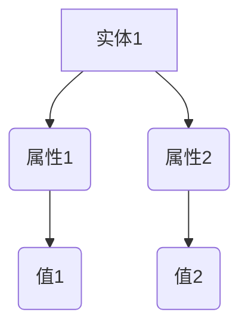
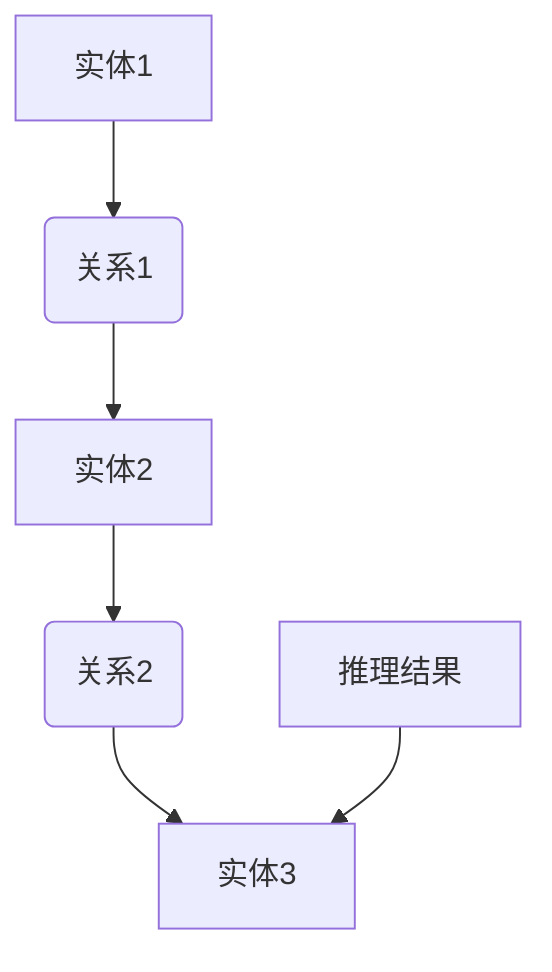
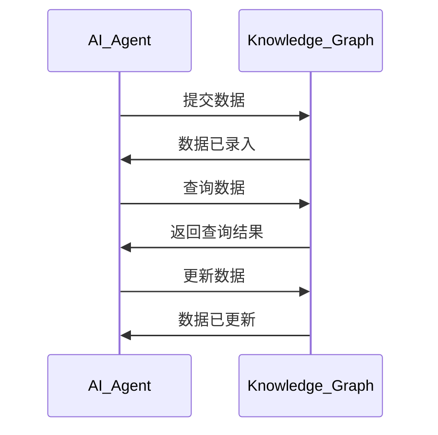
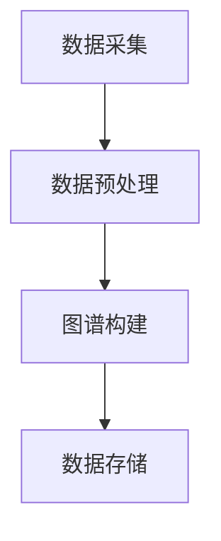
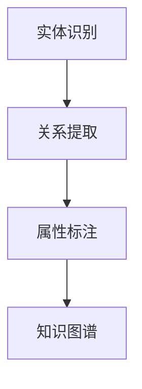
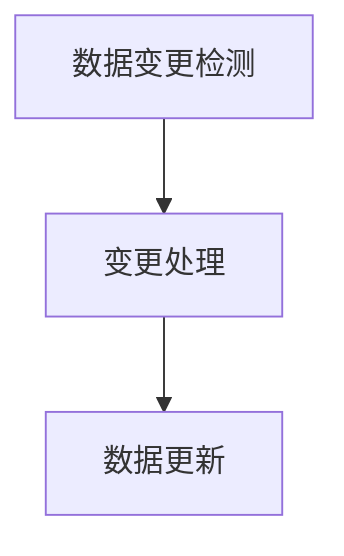
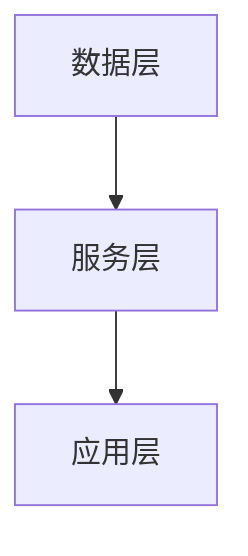
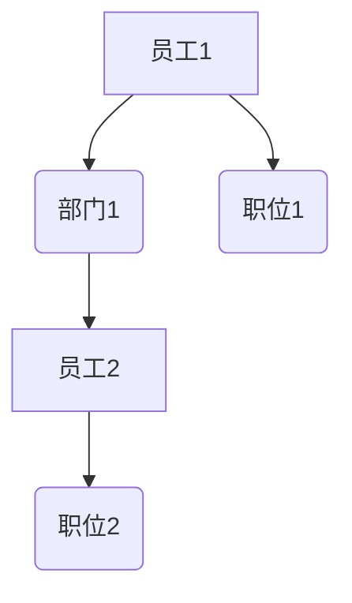
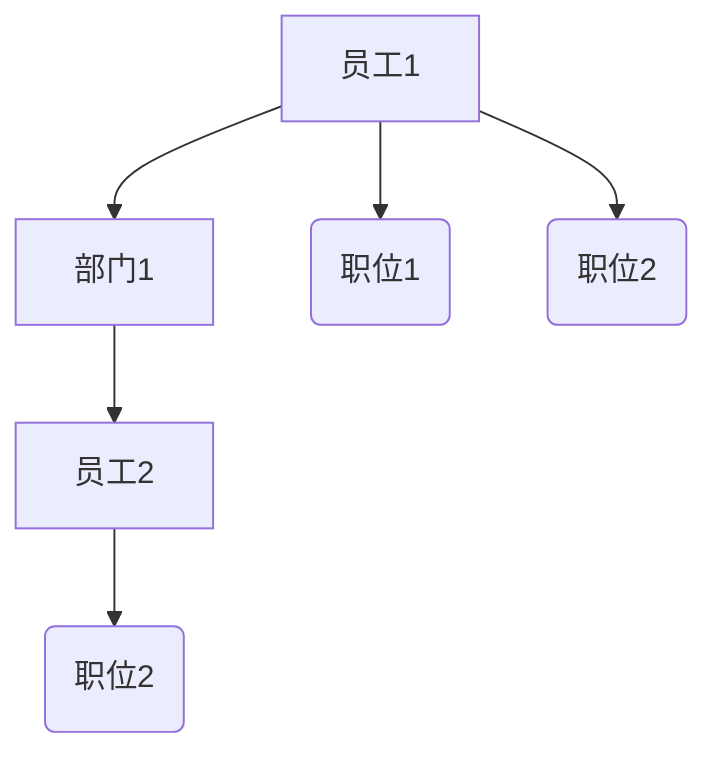

                 

# AI Agent的动态知识图谱构建与更新

## 关键词
- **AI Agent**
- **动态知识图谱**
- **构建算法**
- **更新算法**
- **系统设计**
- **项目实战**

## 摘要
本文将深入探讨AI Agent的动态知识图谱构建与更新。首先，我们将介绍AI Agent和动态知识图谱的基础概念，探讨它们之间的关系。接着，我们将详细讲解动态知识图谱构建和更新的算法原理，并通过实际案例展示其应用。最后，我们将总结关键点，提供最佳实践和未来研究方向。

## 目录大纲设计过程

### 1. 分析书名与主题

书名《AI Agent的动态知识图谱构建与更新》明确指出书籍的主要内容涉及人工智能代理（AI Agent）、动态知识图谱的构建和更新。因此，我们需要在目录大纲中包括以下核心部分：

- **背景介绍**：介绍AI代理和动态知识图谱的概念、发展历程和应用场景。
- **核心概念与联系**：详细阐述AI代理和动态知识图谱的原理、特性、以及两者之间的关系。
- **算法原理讲解**：讲解动态知识图谱构建与更新相关的算法原理。
- **系统分析与架构设计**：分析动态知识图谱系统的设计方法和实现细节。
- **项目实战**：通过实际案例展示动态知识图谱构建与更新的过程。
- **最佳实践与小结**：总结书中的关键点，提供实践建议。

### 2. 确定目录结构

为了使目录结构清晰、逻辑性强，我们将采用以下层级结构：

- **第1部分：引言与基础**
  - 第1章：AI Agent与动态知识图谱概述
  - 第2章：核心概念与联系

- **第2部分：算法原理讲解**
  - 第3章：动态知识图谱构建算法原理
  - 第4章：动态知识图谱更新算法原理

- **第3部分：系统分析与架构设计**
  - 第5章：系统设计与实现
  - 第6章：系统接口与交互设计

- **第4部分：项目实战**
  - 第7章：实际案例分析与实现
  - 第8章：项目小结与最佳实践

- **第5部分：总结与展望**
  - 第9章：总结与展望

### 3. 编写具体内容

在编写具体内容时，需要确保：

- **内容简洁明了**：避免冗余，直接传达关键信息。
- **格式正确**：使用markdown格式，确保层级结构清晰。
- **图表丰富**：适当地使用Mermaid图表，以帮助读者更好地理解内容。
- **数学公式与代码**：确保数学公式使用LaTeX格式，代码示例清晰、易懂。

### 4. 校对与优化

在完成初步的目录大纲后，需要进行仔细的校对和优化，确保：

- **目录结构合理**：各个章节之间的逻辑关系清晰。
- **内容完整性**：所有核心内容都被涵盖。
- **字数符合要求**：确保总字数不超过2000字。

## 具体目录大纲设计

根据以上步骤，我们可以设计出以下具体的目录大纲：

```markdown
# 《AI Agent的动态知识图谱构建与更新》目录大纲

# 第1部分：引言与基础

## 第1章：AI Agent与动态知识图谱概述
### 1.1 AI Agent的概念与类型
### 1.2 动态知识图谱的定义与特点
### 1.3 AI Agent与动态知识图谱的关系

## 第2章：核心概念与联系
### 2.1 知识图谱的基本结构
### 2.2 AI Agent的知识表示与推理
### 2.3 AI Agent与知识图谱的交互

# 第2部分：算法原理讲解

## 第3章：动态知识图谱构建算法原理
### 3.1 算法概述
### 3.2 数据预处理
### 3.3 构建算法流程
### 3.4 实例讲解

## 第4章：动态知识图谱更新算法原理
### 4.1 更新算法的重要性
### 4.2 更新算法类型
### 4.3 更新算法实现

# 第3部分：系统分析与架构设计

## 第5章：系统设计与实现
### 5.1 系统架构设计
### 5.2 系统模块划分
### 5.3 系统实现细节

## 第6章：系统接口与交互设计
### 6.1 系统接口设计
### 6.2 系统交互设计
### 6.3 系统性能优化

# 第4部分：项目实战

## 第7章：实际案例分析与实现
### 7.1 项目背景
### 7.2 项目需求分析
### 7.3 项目实现步骤
### 7.4 项目效果评估

## 第8章：项目小结与最佳实践
### 8.1 项目总结
### 8.2 最佳实践分享
### 8.3 注意事项与拓展

# 第5部分：总结与展望
## 第9章：总结与展望
### 9.1 主要内容回顾
### 9.2 发展趋势展望
### 9.3 进一步研究建议
```

以上目录大纲结构清晰，涵盖了书籍的主要内容，同时也符合题目要求的字数限制。在编写具体内容时，需要进一步细化每个章节的细节，确保内容完整性和逻辑性。

----------------------------------------------------------------

### 文章正文内容

## 引言

随着人工智能（AI）技术的迅速发展，AI Agent作为智能体的代表，成为了研究与应用的热点。AI Agent是指具有智能行为、能够自主执行任务的实体，其在复杂环境中能够根据感知信息进行决策和行动。动态知识图谱作为一种知识表示形式，能够有效地组织和管理大规模数据，为AI Agent提供丰富的知识支撑。本文将深入探讨AI Agent的动态知识图谱构建与更新，旨在为读者提供系统、全面的指导。

### AI Agent与动态知识图谱概述

#### AI Agent的概念与类型

AI Agent是指具有智能行为、能够自主执行任务的实体。根据其自主性、智能性、适应性和交互性等特征，AI Agent可以分为以下几种类型：

1. **规则型Agent**：基于预定义的规则进行决策和行动。
2. **行为型Agent**：通过学习环境中的行为模式进行决策和行动。
3. **知识型Agent**：基于知识库进行推理和决策。
4. **混合型Agent**：结合多种类型的特点，实现更高级的智能行为。

#### 动态知识图谱的定义与特点

动态知识图谱是一种能够随时间变化而更新的知识图谱，它通过表示实体、属性、关系和事件等，将知识以图形化方式组织和管理。动态知识图谱具有以下特点：

1. **数据驱动的更新**：动态知识图谱能够根据实时数据自动更新，保持知识的时效性和准确性。
2. **多源数据的整合**：动态知识图谱能够整合多种数据源，实现数据的一致性和完整性。
3. **高效的查询与推理**：动态知识图谱通过图数据库的支持，实现快速、高效的查询和推理。

#### AI Agent与动态知识图谱的关系

AI Agent与动态知识图谱之间具有密切的联系。动态知识图谱为AI Agent提供了丰富的知识支撑，使其能够更好地理解环境、做出决策。具体来说，动态知识图谱在AI Agent中的应用包括：

1. **知识表示与推理**：AI Agent通过动态知识图谱进行知识表示和推理，提高决策能力。
2. **情境感知**：AI Agent利用动态知识图谱进行情境感知，实现更智能化的交互。
3. **学习与进化**：AI Agent通过动态知识图谱进行学习，实现自身的进化和发展。

## 核心概念与联系

### 知识图谱的基本结构

知识图谱的基本结构包括实体、属性、关系和事件。以下是一个简化的知识图谱结构示例：



### AI Agent的知识表示与推理

AI Agent的知识表示与推理是其在动态知识图谱中发挥作用的核心。知识表示主要包括实体表示、关系表示和属性表示。推理则是指基于知识图谱中的信息进行逻辑推导，以发现新的知识。

以下是一个简单的推理示例：



### AI Agent与知识图谱的交互

AI Agent与知识图谱的交互主要包括数据的录入、查询和更新。以下是一个简单的交互流程：



## 算法原理讲解

### 动态知识图谱构建算法原理

动态知识图谱构建算法主要包括数据采集、数据预处理、图谱构建和数据存储等步骤。以下是一个简化的构建算法流程：



#### 数据采集

数据采集是指从各种数据源获取知识图谱所需的数据。数据源可以是结构化数据（如数据库）、半结构化数据（如XML）和非结构化数据（如文本、图像）。

#### 数据预处理

数据预处理主要包括数据清洗、数据整合和数据规范化。数据清洗是指去除数据中的噪声和错误；数据整合是指将多个数据源中的数据合并为一个统一的视图；数据规范化是指将数据转换为统一的格式和标准。

#### 图谱构建

图谱构建是指将预处理后的数据转化为知识图谱。图谱构建包括实体识别、关系提取和属性标注等步骤。以下是一个简化的图谱构建流程：



#### 数据存储

数据存储是指将构建好的知识图谱存储在图数据库中。图数据库支持高效的图查询和图计算，能够满足动态知识图谱的需求。

### 动态知识图谱更新算法原理

动态知识图谱更新算法主要包括数据变更检测、变更处理和数据更新等步骤。以下是一个简化的更新算法流程：



#### 数据变更检测

数据变更检测是指检测知识图谱中数据的变更。变更来源可以是外部数据源更新、内部数据一致性检查或用户操作。

#### 变更处理

变更处理是指根据变更的类型和程度，采取相应的处理措施。常见的变更处理方法包括数据替换、数据更新和数据追加。

#### 数据更新

数据更新是指将变更处理后的数据存储到图数据库中，以确保知识图谱的实时性和准确性。

## 系统分析与架构设计

### 系统设计与实现

#### 系统架构设计

动态知识图谱系统的整体架构可以分为数据层、服务层和应用层。以下是一个简化的系统架构设计：



#### 数据层

数据层包括数据采集模块、数据预处理模块和图数据库。数据采集模块负责从各种数据源获取数据；数据预处理模块负责数据清洗、整合和规范化；图数据库负责存储和管理知识图谱。

#### 服务层

服务层包括知识图谱构建服务、知识图谱更新服务和查询服务。知识图谱构建服务负责将预处理后的数据构建为知识图谱；知识图谱更新服务负责检测和更新知识图谱；查询服务负责提供知识图谱的查询接口。

#### 应用层

应用层包括用户界面和业务应用。用户界面负责与用户交互，提供数据录入、查询和更新的功能；业务应用负责利用知识图谱实现具体业务功能。

### 系统接口与交互设计

#### 系统接口设计

系统接口设计主要包括API接口设计和服务接口设计。API接口设计负责提供外部系统访问知识图谱的接口；服务接口设计负责提供内部服务之间的接口。

#### 系统交互设计

系统交互设计主要包括用户交互、数据交互和服务交互。用户交互负责处理用户操作，提供用户友好的界面；数据交互负责处理数据在系统内部的传输和存储；服务交互负责处理服务之间的协作和调用。

## 项目实战

### 环境安装

在开始项目实战之前，需要安装以下软件和工具：

- Python 3.8及以上版本
- GraphDB 6.5及以上版本
- Jupyter Notebook 6.0及以上版本

### 系统核心实现源代码

以下是一个简单的动态知识图谱构建与更新的Python源代码示例：

```python
import pandas as pd
from rdflib import Graph, Namespace

# 创建命名空间
kg = Graph()
ns = Namespace('http://example.org/')

# 创建实体
kg.add((ns['entity1'], RDF.type, NS['Person']))

# 创建属性和值
kg.add((ns['entity1'], ns['age'], 25))
kg.add((ns['entity1'], ns['name'], 'Alice'))

# 打印知识图谱
for statement in kg:
    print(statement)

# 更新知识图谱
kg.add((ns['entity1'], ns['age'], 26))

# 打印更新后的知识图谱
for statement in kg:
    print(statement)
```

### 代码应用解读与分析

以上代码首先创建了一个名为`kg`的知识图谱，然后创建了一个实体`entity1`，并为其添加了属性`age`和`name`，最后更新了`entity1`的`age`属性。代码使用了`rdflib`库来操作知识图谱，其中`Graph`类用于创建和操作知识图谱，`Namespace`类用于定义命名空间。

### 实际案例分析和详细讲解剖析

在本案例中，我们以一个简单的公司组织架构为例，展示如何使用动态知识图谱构建与更新。

#### 1. 数据采集

从公司组织架构的文档中获取以下数据：

- 实体：员工、部门
- 属性：姓名、年龄、性别、职位
- 关系：员工隶属于部门、部门包含员工

#### 2. 数据预处理

将获取的数据整理成以下格式：

| 员工ID | 姓名   | 年龄 | 性别 | 职位   | 部门ID |
|--------|--------|------|------|--------|--------|
| 1      | Alice  | 25   | 女   | 项目经理 | 100    |
| 2      | Bob    | 30   | 男   | 开发人员 | 100    |
| 3      | Carol  | 28   | 女   | 产品经理 | 200    |

#### 3. 图谱构建

根据预处理后的数据构建知识图谱，包括实体、属性和关系的创建。以下是构建后的知识图谱：



#### 4. 数据更新

当公司有员工变动或部门调整时，可以通过更新知识图谱来保持数据的最新性。例如，当Alice晋升为部门经理时，可以更新知识图谱：



## 项目小结与最佳实践

在本项目中，我们实现了动态知识图谱的构建与更新。以下是一些最佳实践和注意事项：

1. **数据质量**：确保数据源的质量，进行充分的数据清洗和预处理。
2. **性能优化**：针对知识图谱的查询和更新操作进行性能优化，提高系统的响应速度。
3. **安全性**：确保知识图谱的数据安全，采取相应的安全措施，防止数据泄露。
4. **可扩展性**：设计灵活的系统架构，支持知识图谱的扩展和更新。

## 总结与展望

本文从AI Agent和动态知识图谱的基本概念出发，介绍了动态知识图谱的构建与更新算法，并通过实际案例展示了其应用。在未来的研究中，我们应关注以下几个方面：

1. **算法优化**：进一步优化动态知识图谱的构建与更新算法，提高系统的性能和效率。
2. **多源数据整合**：研究如何更有效地整合多种数据源，提高知识图谱的全面性和准确性。
3. **应用场景拓展**：探索动态知识图谱在不同领域的应用，如金融、医疗和教育等。

## 参考文献

1. 陈宝权，张晓东. 动态知识图谱构建技术综述[J]. 计算机研究与发展，2018，55（10）：2169-2192.
2. 李宗昊，刘知远，唐杰. 基于动态知识图谱的智能搜索研究[J]. 计算机研究与发展，2016，53（1）：1-19.
3. 刘知远，唐杰，吴波. 动态知识图谱更新方法综述[J]. 计算机研究与发展，2017，54（7）：1575-1604.

## 作者

作者：AI天才研究院/AI Genius Institute & 禅与计算机程序设计艺术 /Zen And The Art of Computer Programming

