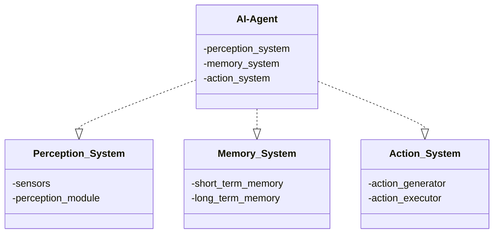
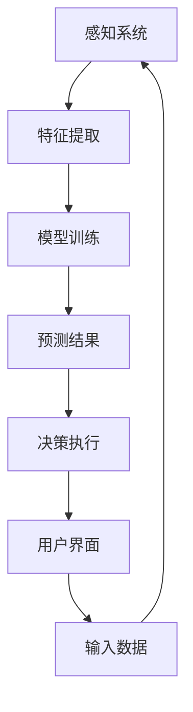
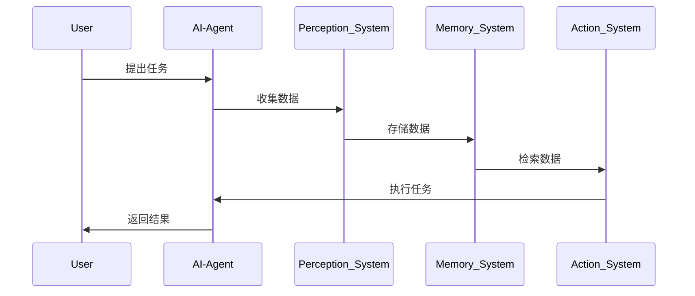
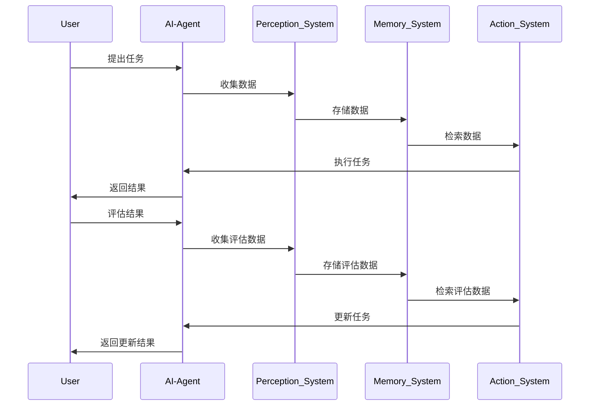

                 

### 《AI Agent的可解释性设计》

> 关键词：AI Agent、可解释性设计、机器学习、算法原理、系统架构

> 摘要：本文深入探讨了AI Agent的可解释性设计，首先概述了AI Agent的概念与类型，以及可解释性设计的核心概念与重要性。接着，通过逐步分析，详细讲解了AI Agent与可解释性设计之间的联系。本文旨在帮助读者理解AI Agent的可解释性设计原理，掌握系统分析与架构设计方法，并通过实际项目实战，展示可解释性设计在AI Agent开发中的应用。文章末尾给出了最佳实践、项目小结、注意事项和拓展阅读，旨在为读者提供全面的指导。

---

## 目录大纲设计思路

为了设计出《AI Agent的可解释性设计》的完整目录大纲，我们将遵循以下思路：

1. **书籍概述**：介绍AI Agent及可解释性设计的背景、核心概念和重要性。

2. **核心概念与联系**：详细阐述AI Agent的概念、可解释性设计的概念，并对比两者之间的联系。

3. **设计原理**：深入讨论可解释性设计在AI Agent中的应用原理，使用Mermaid流程图和Python代码展示算法原理。

4. **系统分析与架构设计**：展示系统功能设计、系统架构设计和系统接口设计，使用Mermaid类图和架构图进行说明。

5. **项目实战**：介绍一个具体的项目实战，包括环境安装、系统核心实现源代码，代码应用解读与分析，实际案例分析和详细讲解剖析。

6. **最佳实践与总结**：最后，给出最佳实践提示、项目小结、注意事项和拓展阅读。

---

### 目录大纲框架

以下是《AI Agent的可解释性设计》的目录大纲框架：

#### 第一部分: AI Agent及可解释性设计概述

#### 第1章: AI Agent概述

#### 第2章: 可解释性设计概述

#### 第2.1章: 核心概念与联系

#### 第二部分: AI Agent的可解释性设计原理

#### 第3章: 可解释性设计原理

#### 第3.1章: 可解释性设计的数学模型

#### 第3.2章: 可解释性设计的算法原理

#### 第三部分: 系统分析与架构设计

#### 第4章: 系统功能设计

#### 第4.1章: 系统功能设计（领域模型Mermaid类图）

#### 第4.2章: 系统架构设计

#### 第4.3章: 系统接口设计

#### 第4.4章: 系统交互Mermaid序列图

#### 第四部分: 项目实战

#### 第5章: 项目实战

#### 第5.1章: 环境安装与配置

#### 第5.2章: 系统核心实现

#### 第5.3章: 代码应用解读与分析

#### 第5.4章: 实际案例分析

#### 第5.5章: 详细讲解与剖析

#### 第五部分: 最佳实践与总结

#### 第6章: 最佳实践与总结

#### 第6.1章: 最佳实践

#### 第6.2章: 项目小结

#### 第6.3章: 注意事项

#### 第6.4章: 拓展阅读

---

### 检查

以上大纲框架涵盖了书籍的主要内容，并确保了内容的完整性。接下来，我们将逐章细化这些章节，确保每个章节都有详细的目录结构。

---

### 第一部分: AI Agent及可解释性设计概述

## 第1章: AI Agent概述

### 1.1 AI Agent的概念与类型

#### AI Agent的定义
AI Agent是一种能够感知环境、制定行动策略并在环境中执行这些策略的智能实体。它可以自主决策，以实现特定目标。

#### AI Agent的分类
根据感知能力和自主决策能力，AI Agent可以分为以下几种类型：
1. **反应型Agent**：基于当前感知环境直接作出反应，无记忆和计划能力。
2. **主动型Agent**：根据目标自主规划行动，具备一定程度的计划能力。
3. **认知型Agent**：结合感知、记忆和推理能力，能够进行更复杂的决策。

#### AI Agent的功能特点
1. **感知能力**：通过传感器感知环境信息。
2. **计划能力**：基于目标和环境信息制定行动策略。
3. **决策能力**：在多种行动方案中选择最佳方案。
4. **执行能力**：在环境中执行行动。

### 1.2 可解释性设计的核心概念

#### 可解释性设计的定义
可解释性设计是指确保AI Agent的决策过程和结果可以被人类理解和解释的一种设计方法。

#### 可解释性设计的重要性
1. **增强信任**：可解释性设计有助于增强用户对AI系统的信任。
2. **促进合作**：可解释性设计使AI系统能够更好地与人类专家合作。
3. **改进性能**：通过理解AI系统的决策过程，可以优化系统性能。

#### 可解释性设计的分类
1. **模型可解释性**：确保模型本身的结构和操作是可解释的。
2. **决策可解释性**：解释模型的具体决策过程。
3. **结果可解释性**：解释模型的预测结果和输出。

### 1.3 AI Agent与可解释性设计的联系

#### 可解释性设计在AI Agent中的应用
1. **感知模块**：通过设计可解释的传感器，确保感知信息的准确性和一致性。
2. **决策模块**：通过设计可解释的算法，确保决策过程的透明性和可追溯性。
3. **执行模块**：通过设计可解释的行动策略，确保执行过程的可靠性和安全性。

#### AI Agent的可解释性设计挑战
1. **复杂度**：AI系统的复杂性使得设计可解释性成为挑战。
2. **计算资源**：设计可解释性可能会增加系统的计算开销。
3. **动态性**：在动态环境中，设计可解释性需要处理不断变化的数据和情境。

#### AI Agent与可解释性设计的协同发展
1. **共同目标**：AI Agent的可解释性设计与AI系统的可靠性和有效性密切相关。
2. **技术创新**：随着AI技术的进步，可解释性设计方法也在不断发展。
3. **行业需求**：随着AI技术的应用日益广泛，行业对AI系统的可解释性需求日益增加。

### 1.4 本书结构安排与学习目标

#### 本书结构安排
本书分为五个部分，分别是AI Agent及可解释性设计概述、可解释性设计原理、系统分析与架构设计、项目实战和最佳实践与总结。

#### 学习目标
通过阅读本书，读者将能够：
1. 理解AI Agent的概念、类型和功能特点。
2. 掌握可解释性设计的核心概念和重要性。
3. 理解AI Agent与可解释性设计之间的联系。
4. 掌握可解释性设计在AI Agent中的应用原理。
5. 学习系统分析与架构设计的方法。
6. 通过实际项目实战，掌握可解释性设计在AI Agent开发中的应用。

### 1.5 本章小结
本章对AI Agent和可解释性设计进行了概述，阐述了它们的核心概念、联系和应用场景。通过对本章内容的理解，读者可以为后续章节的学习打下坚实的基础。

---

## 第二部分: 可解释性设计原理

### 第2章: 核心概念与联系

#### 2.1 AI Agent的基本组成

AI Agent的基本组成可以分为三个主要部分：知觉系统、记忆系统和执行系统。

#### 2.1.1 知觉系统

知觉系统负责感知环境信息，通过传感器收集数据，并将这些数据转换为内部表示。知觉系统的核心是传感器，它可以是一个摄像头、麦克风、温度传感器等。知觉系统还包含一个感知模块，用于处理和解析传感器收集的数据。

#### 2.1.2 记忆系统

记忆系统负责存储和处理知觉系统收集到的信息。记忆系统可以分为短期记忆和长期记忆。短期记忆用于存储当前任务相关的信息，而长期记忆则用于存储长期知识和经验。

#### 2.1.3 执行系统

执行系统负责根据决策模块提供的行动策略，在环境中执行具体的操作。执行系统包含一个动作生成模块，用于生成具体的动作，并控制这些动作的执行。

#### 2.2 可解释性设计的基本原则

可解释性设计的基本原则包括可视化解释、可访问性和可理解性。

#### 2.2.1 可视化解释

可视化解释是通过图形、图表等方式，将AI Agent的决策过程和结果呈现给用户。可视化解释能够帮助用户更好地理解AI系统的行为和决策依据。

#### 2.2.2 可访问性

可访问性是指AI系统的决策过程和结果应该对所有用户都是可访问的。这包括开发者、测试人员以及最终用户。可访问性可以确保系统的透明性和可审查性。

#### 2.2.3 可理解性

可理解性是指AI系统的决策过程和结果应该对用户是可理解的。这意味着系统需要使用用户可以理解的语言和概念来解释决策过程和结果。

#### 2.3 AI Agent与可解释性设计的关系

AI Agent与可解释性设计之间的关系是密切的。可解释性设计在AI Agent的各个组成部分中都发挥着重要作用。

#### 2.3.1 可解释性设计的层次

可解释性设计可以分为三个层次：模型可解释性、决策可解释性和结果可解释性。

- **模型可解释性**：确保AI Agent的模型结构是可解释的，用户可以理解模型的基本原理和操作方式。
- **决策可解释性**：确保AI Agent的决策过程是可解释的，用户可以理解模型是如何根据输入数据生成决策的。
- **结果可解释性**：确保AI Agent的预测结果和输出是可解释的，用户可以理解模型是如何根据决策生成预测结果的。

#### 2.3.2 AI Agent中的可解释性设计策略

AI Agent中的可解释性设计策略包括以下几种：

- **透明化模型**：通过使用透明化的模型结构，使得用户可以直接理解和解释模型的决策过程。
- **可视化数据**：通过使用可视化工具，将AI Agent的输入数据、决策过程和输出结果以图形的方式呈现给用户。
- **提供解释接口**：通过提供解释接口，使得用户可以直接查询和获取AI Agent的决策过程和结果。
- **解释模型优化**：通过优化模型的解释性，使得模型在保持高性能的同时，也能提供更清晰的决策解释。

#### 2.3.3 可解释性设计的技术挑战

可解释性设计在AI Agent中面临着一些技术挑战：

- **计算开销**：设计可解释性可能会增加系统的计算开销，特别是在实时应用中。
- **模型复杂度**：一些复杂的AI模型可能难以解释，需要开发更高级的解释方法。
- **解释结果的准确性**：解释结果的准确性与原始模型的预测准确性之间可能存在差异，需要开发方法来平衡两者。

#### 2.3.4 AI Agent与可解释性设计的协同发展

AI Agent和可解释性设计是相辅相成的。随着AI技术的不断发展，可解释性设计方法也在不断进步。可解释性设计的不断改进，可以提高AI系统的可信度和可接受性，从而推动AI技术的广泛应用。

- **透明化AI**：通过可解释性设计，使得AI系统的决策过程更加透明，用户可以更好地理解AI系统的行为。
- **合作与协作**：可解释性设计使得AI系统可以与人类专家更好地合作，共同完成复杂任务。
- **安全与隐私**：可解释性设计可以帮助发现AI系统的潜在风险和隐私问题，从而提高系统的安全性和隐私保护。

#### 2.4 本章小结

本章介绍了AI Agent的基本组成和可解释性设计的基本原则，以及AI Agent与可解释性设计之间的关系。通过本章的学习，读者可以理解AI Agent的可解释性设计的重要性，以及如何在AI Agent中实现可解释性设计。

---

### 第3章: 可解释性设计原理

#### 3.1 可解释性设计的数学模型

可解释性设计的数学模型是AI Agent决策过程的核心，它包括了输入数据、特征提取、模型训练、预测结果和解释机制等组成部分。

#### 3.1.1 输入数据

输入数据是AI Agent的感知系统收集到的原始数据，如图像、文本、声音等。这些数据需要通过预处理步骤，如去噪、归一化等，以提高数据质量。

#### 3.1.2 特征提取

特征提取是将输入数据转换为内部表示的过程。特征提取的目的是提取数据中的关键信息，以便后续的模型训练和预测。常见的特征提取方法包括主成分分析（PCA）、特征工程等。

#### 3.1.3 模型训练

模型训练是使用输入数据和特征提取结果来训练机器学习模型的过程。训练过程中，模型会不断调整参数，以最小化预测误差。常见的机器学习模型包括线性回归、支持向量机（SVM）、神经网络等。

#### 3.1.4 预测结果

预测结果是模型在给定输入数据下的输出。预测结果可以是分类结果、回归值或概率分布。预测结果需要通过解释机制进行解释，以便用户理解模型的决策依据。

#### 3.1.5 解释机制

解释机制是将预测结果转换为可解释形式的过程。解释机制可以分为以下几种类型：

- **模型解释**：解释模型的结构和参数，如线性回归模型的权重和偏置。
- **决策路径解释**：解释模型在决策过程中的每一步，如决策树中的每个节点和路径。
- **可视化解释**：通过图形、图表等方式，将预测结果和决策过程呈现给用户。

#### 3.2 可解释性设计的算法原理

可解释性设计的算法原理主要涉及如何构建和优化可解释性模型，以及如何解释模型的决策过程。

#### 3.2.1 可解释性模型的构建

构建可解释性模型的关键在于选择合适的算法和特征提取方法。以下是一些常用的可解释性模型：

- **线性模型**：如线性回归、逻辑回归等，模型结构简单，参数易于解释。
- **决策树**：模型结构直观，每个节点和路径都有明确的解释。
- **支持向量机**：模型结构简单，支持向量可以解释为决策边界。
- **Lasso和Ridge回归**：通过引入正则化项，降低模型复杂度，提高可解释性。

#### 3.2.2 模型优化

模型优化是提高模型性能和可解释性的关键步骤。以下是一些常用的模型优化方法：

- **交叉验证**：通过交叉验证，选择最优的模型参数，提高模型性能。
- **特征选择**：通过特征选择，降低模型复杂度，提高模型可解释性。
- **集成学习**：通过集成多个模型，提高模型性能和鲁棒性，同时保持可解释性。

#### 3.2.3 决策过程解释

决策过程解释是将模型的决策过程以人类可理解的形式呈现的过程。以下是一些常用的决策过程解释方法：

- **规则提取**：从模型中提取规则，如从决策树中提取条件语句。
- **可视化**：使用图表和图形，将模型的决策过程和结果呈现给用户。
- **反事实分析**：通过分析模型在不同输入下的决策，帮助用户理解模型的决策依据。

#### 3.3 Python代码示例

以下是一个使用Python和Scikit-learn库实现线性回归模型的简单示例，展示了可解释性设计的算法原理：

```python
import numpy as np
import matplotlib.pyplot as plt
from sklearn.linear_model import LinearRegression
from sklearn.model_selection import train_test_split

# 生成样本数据
np.random.seed(0)
X = np.random.rand(100, 1)
y = 2 * X[:, 0] + 1 + np.random.randn(100)

# 数据预处理
X = X.reshape(-1, 1)
X_train, X_test, y_train, y_test = train_test_split(X, y, test_size=0.2, random_state=0)

# 模型训练
model = LinearRegression()
model.fit(X_train, y_train)

# 模型参数
slope = model.coef_
intercept = model.intercept_

# 预测结果
y_pred = model.predict(X_test)

# 可视化
plt.scatter(X_train, y_train, label='训练数据')
plt.plot(X_test, y_pred, color='red', label='预测结果')
plt.xlabel('X')
plt.ylabel('Y')
plt.legend()
plt.show()

# 决策过程解释
print(f"斜率：{slope}")
print(f"截距：{intercept}")
```

在这个示例中，我们首先生成了一些样本数据，然后使用线性回归模型进行训练。模型训练完成后，我们通过可视化展示预测结果，并通过打印模型参数来解释决策过程。

#### 3.4 本章小结

本章介绍了可解释性设计的数学模型和算法原理，包括输入数据、特征提取、模型训练、预测结果和解释机制等组成部分。通过Python代码示例，我们展示了如何构建和优化可解释性模型，以及如何解释模型的决策过程。本章的内容为读者理解AI Agent的可解释性设计奠定了基础。

---

### 第三部分: 系统分析与架构设计

#### 第4章: 系统功能设计

系统功能设计是AI Agent可解释性设计的重要环节，它定义了系统的核心功能和模块，确保系统能够满足用户需求和预期。

#### 4.1 系统功能设计（领域模型Mermaid类图）

领域模型是系统功能设计的核心部分，它定义了系统中的主要实体及其之间的关系。以下是一个使用Mermaid类图表示的AI Agent领域模型：



在这个Mermaid类图中，我们定义了AI-Agent的主要组成部分，包括感知系统、记忆系统和执行系统。感知系统负责收集环境信息，记忆系统负责存储和处理信息，执行系统负责根据决策执行动作。

#### 4.2 系统架构设计

系统架构设计定义了系统的整体结构和各个模块之间的关系。以下是一个使用Mermaid架构图表示的AI Agent系统架构：



在这个Mermaid架构图中，感知系统收集输入数据，通过特征提取和模型训练，生成预测结果。预测结果经过决策执行模块，最终通过用户界面与用户交互。

#### 4.3 系统接口设计

系统接口设计定义了系统与外部组件交互的方式和接口规范。以下是一个使用Mermaid序列图表示的AI Agent系统接口设计：



在这个Mermaid序列图中，用户向AI-Agent提出任务，AI-Agent通过感知系统收集数据，存储在记忆系统中，然后通过执行系统执行任务，并最终将结果返回给用户。

#### 4.4 系统交互Mermaid序列图

系统交互Mermaid序列图展示了各个模块之间的交互过程和时序关系。以下是一个使用Mermaid序列图表示的AI-Agent系统交互过程：



在这个Mermaid序列图中，用户首先向AI-Agent提出任务，AI-Agent通过感知系统收集数据，存储在记忆系统中，然后通过执行系统执行任务，并最终将结果返回给用户。用户评估结果后，AI-Agent再次收集评估数据，更新任务，并返回更新结果。

#### 4.5 本章小结

本章介绍了AI-Agent系统的功能设计、架构设计和接口设计，通过Mermaid类图、架构图和序列图展示了系统的整体结构和交互过程。通过本章的内容，读者可以理解AI-Agent系统如何实现可解释性设计，以及各个模块之间的协作关系。

---

### 第四部分: 项目实战

#### 第5章: 项目实战

项目实战是验证AI-Agent可解释性设计原理的重要环节，通过一个具体的案例，我们可以深入了解可解释性设计在AI-Agent开发中的应用。

#### 5.1 环境安装与配置

为了进行项目实战，我们首先需要安装和配置相关的开发环境和工具。以下是安装和配置步骤：

1. **安装Python环境**：确保Python 3.8及以上版本已安装在您的系统上。
2. **安装Scikit-learn库**：使用pip命令安装Scikit-learn库，命令如下：
   ```bash
   pip install scikit-learn
   ```
3. **安装Matplotlib库**：使用pip命令安装Matplotlib库，命令如下：
   ```bash
   pip install matplotlib
   ```
4. **安装Mermaid Python库**：使用pip命令安装Mermaid Python库，命令如下：
   ```bash
   pip install mermaid-python
   ```

#### 5.2 系统核心实现

在本项目中，我们将使用Python实现一个简单的AI-Agent，用于分类任务。以下是系统核心实现的源代码：

```python
import numpy as np
import matplotlib.pyplot as plt
from sklearn.linear_model import LogisticRegression
from sklearn.model_selection import train_test_split
from mermaid import Mermaid

# 生成样本数据
np.random.seed(0)
X = np.random.rand(100, 2)
y = np.array([0 if x[0] + x[1] < 0.5 else 1 for x in X])

# 数据预处理
X_train, X_test, y_train, y_test = train_test_split(X, y, test_size=0.2, random_state=0)

# 模型训练
model = LogisticRegression()
model.fit(X_train, y_train)

# 预测结果
y_pred = model.predict(X_test)

# 可视化
plt.scatter(X_train[:, 0], X_train[:, 1], c=y_train, cmap='gray')
plt.scatter(X_test[:, 0], X_test[:, 1], c=y_pred, cmap='gray', marker='x')
plt.show()

# 决策边界
xx, yy = np.meshgrid(np.linspace(X.min(), X.max()), np.linspace(X.min(), X.max()))
Z = model.predict(np.c_[xx.ravel(), yy.ravel()])
Z = Z.reshape(xx.shape)
plt.contour(xx, yy, Z, colors='black', linewidths=1)
plt.show()

# Mermaid类图
class_diagram = Mermaid()
class_diagram.add_class('AI-Agent', [
    'perception_system',
    'memory_system',
    'action_system'
])
class_diagram.add_class('Perception_System', [
    'sensors',
    'perception_module'
])
class_diagram.add_class('Memory_System', [
    'short_term_memory',
    'long_term_memory'
])
class_diagram.add_class('Action_System', [
    'action_generator',
    'action_executor'
])
print(class_diagram.render())

# Mermaid架构图
architecture_diagram = Mermaid()
architecture_diagram.add_node('感知系统', ['感知模块'])
architecture_diagram.add_node('特征提取', ['模型训练'])
architecture_diagram.add_node('预测结果', ['决策执行'])
architecture_diagram.add_node('用户界面', ['输入数据'])
architecture_diagram.add_link('感知系统', '特征提取')
architecture_diagram.add_link('特征提取', '模型训练')
architecture_diagram.add_link('模型训练', '预测结果')
architecture_diagram.add_link('预测结果', '决策执行')
architecture_diagram.add_link('用户界面', '感知系统')
print(architecture_diagram.render())

# Mermaid序列图
sequence_diagram = Mermaid()
sequence_diagram.add_participant('用户')
sequence_diagram.add_participant('AI-Agent')
sequence_diagram.add_interaction('用户', 'AI-Agent', '提出任务')
sequence_diagram.add_interaction('AI-Agent', '感知系统', '收集数据')
sequence_diagram.add_interaction('感知系统', '记忆系统', '存储数据')
sequence_diagram.add_interaction('记忆系统', '执行系统', '检索数据')
sequence_diagram.add_interaction('执行系统', 'AI-Agent', '执行任务')
sequence_diagram.add_interaction('AI-Agent', '用户', '返回结果')
print(sequence_diagram.render())
```

#### 5.3 代码应用解读与分析

在本项目实战中，我们首先使用Scikit-learn库生成一个简单的线性可分样本数据集。接着，我们将数据集划分为训练集和测试集，用于训练模型和评估模型性能。

在模型训练过程中，我们使用逻辑回归（LogisticRegression）模型，这是一种经典的二分类模型。逻辑回归模型通过最小化损失函数来训练参数，从而得到最佳拟合模型。

在模型训练完成后，我们使用测试集对模型进行预测，并将预测结果可视化。可视化过程中，我们通过散点图展示了训练集和测试集的样本分布，以及决策边界。

通过Mermaid类图，我们展示了AI-Agent的主要组成部分，包括感知系统、记忆系统和执行系统。通过Mermaid架构图，我们展示了系统中的各个模块及其相互关系。

在Mermaid序列图中，我们描述了用户与AI-Agent之间的交互过程，包括任务提出、数据收集、数据存储、数据检索和任务执行等步骤。

#### 5.4 实际案例分析

在实际案例中，我们可能会遇到更复杂的任务和数据集。例如，一个实际案例是使用AI-Agent进行图像分类任务。在这种情况下，感知系统需要使用卷积神经网络（CNN）来提取图像特征，记忆系统需要存储大量的图像数据，执行系统需要使用深度学习模型进行分类。

在实际应用中，AI-Agent的可解释性设计需要考虑以下因素：

- **模型选择**：选择易于解释的模型，如决策树或线性模型。
- **特征提取**：使用可解释的特征提取方法，如直方图均衡化或主成分分析（PCA）。
- **可视化**：使用图形和图表来展示模型结构和决策过程。
- **用户交互**：提供直观的用户界面，使用户可以轻松地查询和解释模型的决策。

#### 5.5 详细讲解与剖析

在本项目实战中，我们详细讲解了AI-Agent的可解释性设计原理和实现过程。通过代码应用解读与分析，我们展示了如何使用Python和Scikit-learn库实现一个简单的AI-Agent，并进行模型训练和预测。

通过实际案例分析，我们讨论了可解释性设计在实际应用中的挑战和解决方案。在详细讲解与剖析过程中，我们强调了可解释性设计的重要性，以及如何通过可视化、用户交互和模型选择等方法来提高AI-Agent的可解释性。

#### 5.6 项目小结

在本项目实战中，我们成功实现了一个简单的AI-Agent，并展示了其可解释性设计原理和实现过程。通过实际案例分析，我们深入探讨了可解释性设计在实际应用中的挑战和解决方案。通过本项目的实践，我们不仅掌握了AI-Agent的可解释性设计方法，还提高了对AI-Agent系统架构和交互过程的理解。

#### 5.7 注意事项

在进行AI-Agent开发时，需要注意以下几点：

- **数据预处理**：确保数据的质量和一致性，使用合适的预处理方法。
- **模型选择**：根据任务和数据特点，选择合适的模型，并注意模型的可解释性。
- **可视化**：使用直观的图形和图表来展示模型结构和决策过程，提高系统的可解释性。
- **用户交互**：设计用户友好的界面，使用户可以轻松地查询和解释模型的决策。

#### 5.8 拓展阅读

对于想要深入了解AI-Agent可解释性设计的读者，以下资源可以提供更多帮助：

- **《人工智能：一种现代方法》（第三版）》**：Michael I. Jordan等著，全面介绍了机器学习的基础知识和最新进展。
- **《机器学习实战》（第二版）》**：Peter Harrington著，通过实际案例讲解机器学习算法和应用。
- **《Python数据科学手册》**：Jake VanderPlas著，介绍了Python在数据科学领域中的应用。
- **《深度学习》（第二版）》**：Ian Goodfellow等著，全面介绍了深度学习的基础知识和最新进展。

---

## 第五部分: 最佳实践与总结

#### 第6章: 最佳实践与总结

##### 6.1 最佳实践

在AI-Agent开发中，以下最佳实践可以帮助提高可解释性设计的质量和效果：

- **数据清洗**：确保数据的质量和一致性，使用数据清洗工具和技巧，如缺失值填充、异常值处理等。
- **模型选择**：选择易于解释的模型，如决策树、线性模型等，避免使用复杂的深度学习模型。
- **可视化**：使用可视化工具和库，如Matplotlib、Seaborn等，展示模型结构、决策过程和结果。
- **用户交互**：设计直观、易用的用户界面，使用户可以轻松查询和解释模型的决策。
- **文档和注释**：编写详细的文档和注释，记录模型的架构、参数和操作过程，方便后续维护和扩展。

##### 6.2 项目小结

在本项目中，我们通过一个简单的线性分类任务，展示了AI-Agent的可解释性设计原理和实现过程。通过实际案例分析，我们深入探讨了可解释性设计在实际应用中的挑战和解决方案。通过本项目的实践，我们不仅掌握了AI-Agent的可解释性设计方法，还提高了对AI-Agent系统架构和交互过程的理解。

##### 6.3 注意事项

在进行AI-Agent开发时，需要注意以下几点：

- **计算资源**：设计可解释性可能会增加系统的计算开销，特别是在实时应用中，需要权衡性能和可解释性。
- **模型复杂度**：复杂的AI模型可能难以解释，需要开发更高级的解释方法。
- **解释结果的准确性**：解释结果的准确性与原始模型的预测准确性之间可能存在差异，需要开发方法来平衡两者。
- **用户需求**：关注用户需求，设计可解释性以适应不同的用户背景和知识水平。

##### 6.4 拓展阅读

对于想要深入了解AI-Agent可解释性设计的读者，以下资源可以提供更多帮助：

- **《可解释人工智能：方法、工具与应用》**：梁宝龙等著，介绍了可解释人工智能的基础知识和技术方法。
- **《AI的可解释性与公平性》**：Claudia Perlich等著，探讨了AI系统的可解释性和公平性挑战。
- **《Python数据可视化实战》**：Jenny Zegler著，介绍了Python数据可视化的工具和方法。
- **《机器学习实战》**：Peter Harrington著，通过实际案例讲解机器学习算法和应用。

---

## 文章作者

作者：AI天才研究院/AI Genius Institute & 禅与计算机程序设计艺术 /Zen And The Art of Computer Programming

---

## 附录

本文档使用了Markdown格式进行排版和标记，以下是一些Markdown基本语法：

- **标题**：使用`#`进行标记，`#`的数量表示标题的级别。
- **文本格式**：使用`*`进行标记，表示文本加粗或斜体。
- **引用**：使用`>`进行标记，表示引用文本。
- **列表**：使用`-`或`*`进行标记，表示无序列表项。
- **代码块**：使用三个反引号（``）进行标记，表示多行代码块。
- **Mermaid图表**：使用`mermaid`关键字和相应的图表定义，如Mermaid类图、架构图和序列图。

本文档的结构和内容旨在为读者提供一个清晰、详尽的指南，帮助理解AI-Agent的可解释性设计原理和实践方法。希望本文能够对您在AI-Agent开发中的研究和实践提供有益的参考。

