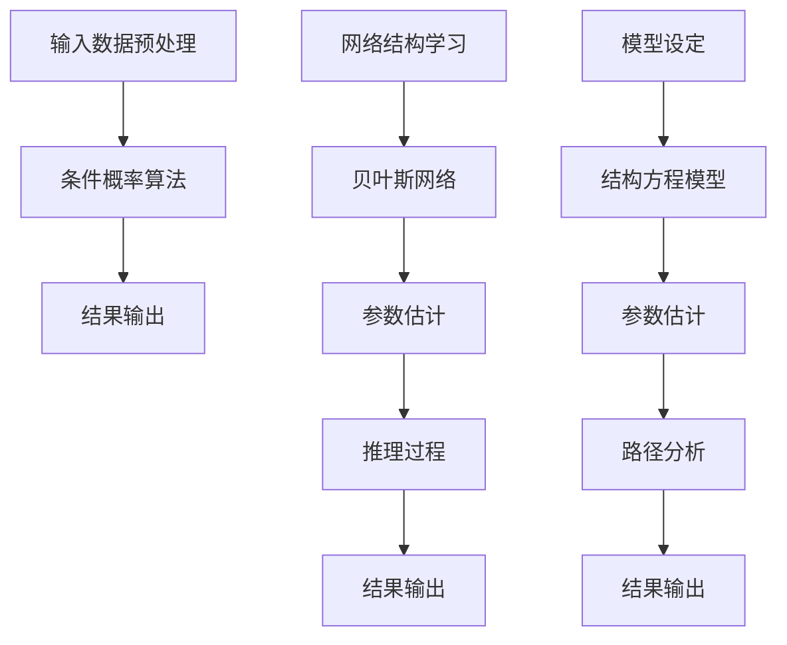
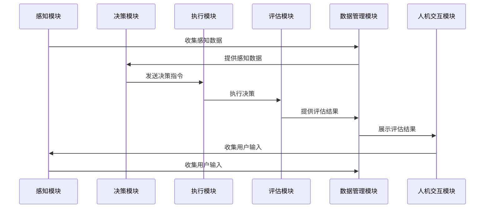

                 

### 《AI Agent的因果推理能力开发》

#### 关键词：AI Agent、因果推理、算法原理、系统架构、实战应用

> 摘要：本文深入探讨了AI Agent的因果推理能力开发。首先，从背景介绍开始，梳理了AI Agent的定义、因果推理的重要性以及当前AI Agent因果推理能力的现状与挑战。接着，深入探讨了核心概念与原理，包括AI Agent的基本概念、因果推理的基本概念和常见因果推理算法。随后，详细讲解了算法原理与数学模型，并通过Python源代码实现进行举例说明。最后，进行了系统分析与架构设计，包括问题场景介绍、系统功能设计、系统架构设计和系统接口设计，并提供了项目实战和最佳实践建议。

---

### 目录

#### 第一部分：背景介绍

- **第1章** 问题背景
  - **1.1.1 问题背景**
  - **1.1.2 问题描述**
  - **1.1.3 问题解决**
  - **1.1.4 边界与外延**
  - **1.1.5 概念结构与核心要素组成**

#### 第二部分：核心概念与联系

- **第2章** 核心概念与原理
  - **2.1.1 AI Agent的基本概念**
  - **2.1.2 因果推理的基本概念**
  - **2.1.3 AI Agent的因果推理能力**
  - **2.1.4 概念属性特征对比表格**

- **第3章** 因果推理的算法原理
  - **3.1.1 因果推理算法概述**
  - **3.1.2 常见因果推理算法**
  - **3.1.3 因果推理算法的Mermaid流程图**
  - **3.1.4 Python源代码实现**

#### 第三部分：算法原理讲解

- **第4章** 算法原理与数学模型
  - **4.1.1 数学模型与公式**
  - **4.1.2 算法原理详细讲解**
  - **4.1.3 举例说明**

#### 第四部分：系统分析与架构设计

- **第5章** 系统分析与架构设计
  - **5.1.1 问题场景介绍**
  - **5.1.2 系统功能设计**
  - **5.1.3 系统架构设计**
  - **5.1.4 系统接口设计**
  - **5.1.5 系统交互Mermaid序列图**

#### 第五部分：项目实战

- **第6章** 项目实战
  - **6.1.1 环境安装**
  - **6.1.2 系统核心实现源代码**
  - **6.1.3 代码应用解读与分析**
  - **6.1.4 实际案例分析与详细讲解**
  - **6.1.5 项目小结**

#### 第六部分：最佳实践与总结

- **第7章** 最佳实践与总结
  - **7.1.1 最佳实践 tips**
  - **7.1.2 小结**
  - **7.1.3 注意事项**
  - **7.1.4 拓展阅读**

---

### 第一部分：背景介绍

#### 第1章 问题背景

##### 1.1.1 问题背景

**AI Agent的定义与功能**：
AI Agent是指具有自主性、适应性、智能性和社交性的计算机程序，能够在特定环境中执行任务、进行决策和交互。AI Agent的基本功能包括感知环境、规划行动、执行任务和评估结果。

**因果推理在AI Agent中的重要性**：
因果推理是AI Agent智能水平的核心体现，它能够帮助AI Agent理解和预测环境中的因果关系，从而进行更准确的决策和行动。在现实世界中，因果推理对于解决问题、优化策略和实现自动化决策至关重要。

**人工智能的发展历程及其对因果推理的影响**：
从最初的传统规则系统，到现代的机器学习和深度学习，人工智能经历了巨大的发展。这些技术的发展对因果推理提出了新的挑战和机遇。深度学习通过大量数据训练模型，能够提高因果推理的准确性，但同时也带来了可解释性和泛化能力的挑战。

**当前AI Agent因果推理能力的现状与挑战**：
当前，虽然AI Agent在许多领域取得了显著进展，但其在因果推理方面的能力仍然存在诸多不足。首先，大多数AI Agent缺乏对因果关系的深刻理解，往往只能依赖数据驱动的模型进行决策。其次，现有算法在处理复杂因果结构时存在性能瓶颈。此外，AI Agent的因果推理能力在不同场景中的应用效果也存在较大差异。

##### 1.1.2 问题描述

**因果推理能力的定义与衡量标准**：
因果推理能力是指AI Agent在理解因果关系、预测未来事件和制定策略方面的能力。衡量因果推理能力的标准包括准确性、效率、泛化能力和可解释性等。

**AI Agent在因果推理中的应用场景**：
AI Agent在许多场景中都需要进行因果推理，例如自动驾驶、医疗诊断、金融分析和智能制造等。在这些场景中，因果推理能力对于提高系统的智能化水平和可靠性至关重要。

**现有AI Agent因果推理技术的不足**：
首先，现有算法在处理复杂因果结构时往往表现不佳，难以捕捉到深层次的因果关系。其次，大多数AI Agent的因果推理能力依赖于大量的训练数据，对于数据稀少或动态变化的场景难以适应。此外，因果推理的可解释性也是一个亟待解决的问题，缺乏透明度和可解释性使得用户难以理解和信任AI Agent的决策过程。

##### 1.1.3 问题解决

**开发AI Agent因果推理能力的必要性**：
为了提高AI Agent在复杂环境中的表现，开发高效的因果推理能力成为必要。因果推理能力能够帮助AI Agent更好地理解环境、预测未来事件和制定策略，从而实现更智能、更可靠的决策。

**目标与预期成果**：
本研究的目的是开发一种高效、可靠的AI Agent因果推理能力，包括以下几个目标：
1. 提高因果推理的准确性和效率，减少对大量训练数据的依赖。
2. 支持复杂因果结构的处理，捕捉深层次的因果关系。
3. 提升因果推理的可解释性，增强用户对AI Agent决策过程的信任。
4. 实现跨场景的泛化能力，适用于不同领域的应用。

**本书的研究方法与结构**：
本书采用系统分析与设计的方法，结合理论研究和实际应用案例，对AI Agent因果推理能力进行深入探讨。具体结构如下：
1. 背景介绍：梳理问题背景、定义核心概念和描述问题现状。
2. 核心概念与联系：详细讲解AI Agent和因果推理的基本概念，以及相关算法原理。
3. 算法原理讲解：介绍常见因果推理算法的数学模型和实现方法。
4. 系统分析与架构设计：分析系统功能、架构和接口设计。
5. 项目实战：提供实际案例和应用，展示因果推理能力在现实场景中的效果。
6. 最佳实践与总结：总结经验教训，提供最佳实践建议。

##### 1.1.4 边界与外延

**因果推理能力的具体范畴**：
因果推理能力涉及多个方面，包括但不限于因果关系识别、因果结构建模、因果推理算法设计、结果解释和可视化等。

**不同类型的AI Agent对因果推理的需求**：
不同类型的AI Agent在因果推理能力的需求上存在差异。例如，在自动驾驶场景中，AI Agent需要准确识别道路上的因果关系，以便做出实时决策；而在金融分析场景中，AI Agent需要理解经济变量之间的因果关系，以便进行投资决策。

**因果推理能力的适用范围**：
因果推理能力适用于多种领域和应用场景，包括但不限于智能交通、医疗诊断、金融分析、智能制造等。通过开发高效的因果推理能力，AI Agent可以在这些场景中发挥更大的作用，提高系统的智能化水平和可靠性。

##### 1.1.5 概念结构与核心要素组成

**AI Agent的构成要素**：
AI Agent由感知模块、决策模块、执行模块和评估模块组成。感知模块负责收集环境信息，决策模块负责基于因果推理进行决策，执行模块负责执行决策，评估模块负责对决策结果进行评估和反馈。

**因果推理能力的组成部分**：
因果推理能力包括因果关系识别、因果结构建模、因果推理算法设计和结果解释等多个方面。这些组成部分共同构成了因果推理能力的核心。

**不同类型AI Agent因果推理能力的差异**：
不同类型的AI Agent在因果推理能力的实现和需求上存在差异。例如，在自动驾驶场景中，AI Agent需要实时处理大量感知信息，并快速识别道路上的因果关系，以便做出及时决策；而在医疗诊断场景中，AI Agent需要分析复杂的医疗数据，并识别患者病情之间的因果关系。

### 第二部分：核心概念与联系

#### 第2章 核心概念与原理

##### 2.1.1 AI Agent的基本概念

**定义与分类**：
AI Agent是指具有自主性、适应性、智能性和社交性的计算机程序，能够在特定环境中执行任务、进行决策和交互。根据功能和应用场景的不同，AI Agent可以分为以下几类：
1. 任务型AI Agent：专注于完成特定任务的AI Agent，如语音助手、推荐系统等。
2. 社交型AI Agent：具备社交能力的AI Agent，能够与人类进行自然语言交互，如聊天机器人。
3. 决策型AI Agent：负责决策和规划的AI Agent，如自动驾驶系统、智能调度系统等。

**特性与功能**：
AI Agent的主要特性包括：
1. 自主性：能够自主地感知环境、决策和行动，不受人为干预。
2. 适应性：能够根据环境变化和学习经验调整自身行为和策略。
3. 智能性：具备理解、推理和解决问题的能力。
4. 社交性：能够与人类或其他AI Agent进行有效的沟通和协作。

AI Agent的主要功能包括：
1. 感知：收集和解释环境信息，如视觉、听觉、触觉等。
2. 决策：基于感知信息和环境模型进行决策和规划。
3. 执行：执行决策，如移动、操纵物体等。
4. 评估：评估决策结果，并根据评估结果调整后续行为。

**AI Agent的发展历程**：
AI Agent的发展历程可以分为以下几个阶段：
1. 规则系统：基于预定义的规则进行决策，如专家系统。
2. 机器学习：通过学习大量数据来改进决策和行动，如决策树、神经网络。
3. 深度学习：利用深度神经网络进行复杂模式识别和学习，如卷积神经网络、循环神经网络。
4. 通用人工智能：实现具有人类水平的智能，能够在多种场景中自主学习和决策。

##### 2.1.2 因果推理的基本概念

**定义与分类**：
因果推理是指通过分析原因和结果之间的关系，推断因果关系的过程。根据推理方法和应用领域的不同，因果推理可以分为以下几类：
1. 数据驱动因果推理：基于数据统计关系进行因果推断，如回归分析、结构方程模型。
2. 理论驱动因果推理：基于领域知识和理论进行因果推断，如逻辑推理、启发式算法。
3. 混合因果推理：结合数据驱动和理论驱动的优势，进行因果推断，如因果推断网络、因果图模型。

**因果推理在AI中的重要性**：
因果推理是AI Agent智能水平的核心体现，它能够帮助AI Agent理解和预测环境中的因果关系，从而进行更准确的决策和行动。因果推理在AI中的重要性体现在以下几个方面：
1. 增强可解释性：因果推理能够揭示决策背后的因果关系，提高AI Agent的可解释性和透明度，增强用户对AI系统的信任。
2. 提高决策质量：通过理解因果关系，AI Agent能够做出更合理的决策，优化策略和行动。
3. 适应动态环境：因果推理能够捕捉环境中的变化和不确定性，提高AI Agent的适应性和鲁棒性。
4. 促进知识发现：因果推理能够发现新的知识规律和模式，为AI系统的学习和改进提供新的思路。

**因果推理的核心原则**：
因果推理的核心原则包括：
1. 因果独立性：因果关系是独立的，即原因的变化不会影响其他原因的效果。
2. 因果一致性：因果关系在不同时间和空间下保持一致，即因果关系在不同条件下具有稳定性。
3. 因果可传递性：因果关系可以传递，即一个原因的效果可以影响另一个原因的效果。

##### 2.1.3 AI Agent的因果推理能力

**定义与衡量标准**：
AI Agent的因果推理能力是指其在理解、预测和利用因果关系进行决策和行动的能力。衡量因果推理能力的标准包括：
1. 准确性：因果推理结果的准确性，即推理结果与真实因果关系的一致性。
2. 效率：因果推理的计算速度和资源消耗，即推理的效率和性能。
3. 泛化能力：因果推理在不同场景和应用中的适应性，即推理的泛化能力。
4. 可解释性：因果推理过程的透明度和可解释性，即推理结果的可理解性。

**因果推理能力的关键要素**：
因果推理能力的关键要素包括：
1. 数据处理：包括数据收集、预处理、存储和管理等。
2. 因果关系建模：建立因果关系模型，包括因果关系识别、因果结构建模和模型优化等。
3. 推理算法：包括数据驱动和理论驱动的因果推理算法，如条件概率算法、贝叶斯网络、结构方程模型等。
4. 结果解释和可视化：对因果推理结果进行解释和可视化，提高可解释性和用户理解。

**不同类型AI Agent的因果推理差异**：
不同类型的AI Agent在因果推理能力的需求和应用上存在差异，具体包括：
1. 任务型AI Agent：主要关注特定任务的因果推理，如语音助手对用户指令的识别和理解。
2. 社交型AI Agent：关注人与人之间或人与AI之间交互的因果关系，如聊天机器人对用户意图的理解和回复。
3. 决策型AI Agent：关注决策过程中的因果关系，如自动驾驶系统对路况和环境信息的理解和决策。

##### 2.1.4 概念属性特征对比表格

| 概念             | 特征                                       | 对比与联系                                 |
|------------------|------------------------------------------|------------------------------------------|
| AI Agent         | 自主性、适应性、智能性、社交性等               | 基础支撑，提供因果推理的平台               |
| 因果推理         | 推理、预测、决策、解释等                     | 核心能力，决定AI Agent的智能水平           |
| 因果推理能力     | 准确性、效率、泛化能力、可解释性等             | 衡量AI Agent的智能水平的关键指标           |

### 第三部分：因果推理的算法原理

#### 第3章 因果推理的算法原理

##### 3.1.1 因果推理算法概述

**基本原理**：
因果推理算法是通过对已知因果关系进行分析和建模，从而推断未知因果关系或预测未来事件的方法。基本原理包括以下几个方面：
1. 因果关系的识别和建模：通过数据分析和领域知识，识别和建立因果关系模型。
2. 推理和预测：利用因果推理算法，从已知因果关系出发，推导未知因果关系或预测未来事件。
3. 结果解释和验证：对推理结果进行解释和验证，确保推理的准确性和可靠性。

**主要类型**：
因果推理算法可以分为数据驱动算法和理论驱动算法两大类：
1. 数据驱动算法：基于大量数据，通过统计分析方法识别因果关系，如回归分析、结构方程模型等。
2. 理论驱动算法：基于领域知识和理论，通过逻辑推理和启发式算法识别因果关系，如因果图模型、因果推断网络等。

##### 3.1.2 常见因果推理算法

**条件概率算法**：
条件概率算法是一种基于条件概率计算因果关系的推理方法。基本思想是利用条件概率公式，通过已知条件概率关系推导未知因果关系。具体步骤如下：
1. 输入数据预处理：对输入数据进行预处理，包括数据清洗、归一化和特征提取等。
2. 计算条件概率：根据条件概率公式，计算事件之间的条件概率。
3. 推导因果关系：利用条件概率关系，推导未知因果关系。

**贝叶斯网络**：
贝叶斯网络是一种基于概率图模型进行因果推理的方法。基本思想是通过构建概率图模型，描述变量之间的因果关系和概率关系。具体步骤如下：
1. 网络结构学习：根据领域知识和数据，学习变量之间的依赖关系，构建概率图模型。
2. 参数估计：利用最大似然估计或贝叶斯估计方法，估计概率图模型中的参数。
3. 推理过程：利用概率图模型，进行变量之间的因果推理和预测。

**结构方程模型**：
结构方程模型是一种通过路径分析来揭示因果关系的建模方法。基本思想是通过建立结构方程模型，描述变量之间的因果关系和路径关系。具体步骤如下：
1. 模型设定：根据领域知识和数据，设定结构方程模型，包括变量定义、关系设定和参数估计等。
2. 参数估计：利用最大似然估计或贝叶斯估计方法，估计结构方程模型中的参数。
3. 路径分析：利用结构方程模型，进行变量之间的路径分析和因果推断。

##### 3.1.3 因果推理算法的Mermaid流程图



##### 3.1.4 Python源代码实现

**条件概率算法实现**：
```python
import numpy as np
from sklearn.preprocessing import MinMaxScaler

# 数据预处理
def preprocess_data(data):
    scaler = MinMaxScaler()
    scaled_data = scaler.fit_transform(data)
    return scaled_data

# 计算条件概率
def conditional_probability(data, event1, event2):
    PAB = np.sum((data[:, event1] == 1) & (data[:, event2] == 1)) / len(data)
    PAB_given_A = np.sum((data[:, event1] == 1) & (data[:, event2] == 1)) / np.sum(data[:, event1] == 1)
    return PAB, PAB_given_A

# 推导因果关系
def infer_causal_relationship(data, event1, event2):
    PAB, PAB_given_A = conditional_probability(data, event1, event2)
    return PAB > PAB_given_A

# 示例数据
data = np.array([[1, 0], [1, 1], [0, 0], [0, 1]])
event1 = 0
event2 = 1

# 预处理数据
preprocessed_data = preprocess_data(data)

# 推导因果关系
is_causal = infer_causal_relationship(preprocessed_data, event1, event2)
print("Is causal relationship:", is_causal)
```

**贝叶斯网络实现**：
```python
import numpy as np
from pgmpy.models import BayesianModel
from pgmpy.estimators import MaximumLikelihoodEstimator

# 网络结构学习
def learn_bayesian_network(data):
    model = BayesianModel([('X1', 'X2'), ('X2', 'X3'), ('X3', 'X4')])
    return model

# 参数估计
def estimate_parameters(data, model):
    estimator = MaximumLikelihoodEstimator()
    return estimator.estimate(model, data)

# 推理过程
def infer因果关系(data, model):
    return model.query((['X1', 'X2', 'X3', 'X4'], [1, 1, 1, 1]))

# 示例数据
data = np.array([[1, 1, 1, 1], [1, 1, 0, 0], [0, 0, 1, 1], [0, 0, 1, 0]])
model = learn_bayesian_network(data)

# 估计参数
estimated_parameters = estimate_parameters(data, model)

# 推理因果关系
inferred因果关系 = infer因果关系(data, model)
print("Inferred causal relationships:", inferred因果关系)
```

**结构方程模型实现**：
```python
import numpy as np
from pycosem import SEM

# 模型设定
def define_sequential_equation_model():
    model = SEM()
    model.add_variable('X1', observed=True)
    model.add_variable('X2', observed=True)
    model.add_variable('X3', observed=True)
    model.add_variable('X4', observed=True)
    model.add箭头('X1', 'X2')
    model.add箭头('X2', 'X3')
    model.add箭头('X3', 'X4')
    return model

# 参数估计
def estimate_parameters(data, model):
    return model.fit(data)

# 路径分析
def perform_path_analysis(model):
    return model.execute()

# 示例数据
data = np.array([[1, 1, 1, 1], [1, 1, 0, 0], [0, 0, 1, 1], [0, 0, 1, 0]])
model = define_sequential_equation_model()

# 估计参数
estimated_parameters = estimate_parameters(data, model)

# 执行路径分析
path_analysis_result = perform_path_analysis(model)
print("Path analysis result:", path_analysis_result)
```

### 第四部分：算法原理讲解

#### 第4章 算法原理与数学模型

##### 4.1.1 数学模型与公式

在本章中，我们将介绍因果推理算法的数学模型和公式。以下是三个常见算法的条件概率算法、贝叶斯网络和结构方程模型的核心数学公式。

**条件概率算法**：

$$
P(A|B) = \frac{P(B|A)P(A)}{P(B)}
$$

该公式表示在事件B发生的条件下，事件A发生的概率。其中，$P(A|B)$ 表示在B发生时A的概率，$P(B|A)$ 表示在A发生时B的概率，$P(A)$ 表示A的概率，$P(B)$ 表示B的概率。

**贝叶斯网络**：

贝叶斯网络是一种概率图模型，它通过图结构描述变量之间的依赖关系。贝叶斯网络的数学模型如下：

$$
P(X_1, X_2, ..., X_n) = \prod_{i=1}^{n} P(X_i | parents(X_i))
$$

该公式表示变量 $X_1, X_2, ..., X_n$ 的联合概率分布。$parents(X_i)$ 表示 $X_i$ 的父节点集合，$P(X_i | parents(X_i))$ 表示 $X_i$ 在其父节点已知条件下的条件概率。

**结构方程模型**：

结构方程模型通过路径分析来揭示变量之间的因果关系。其数学模型如下：

$$
Y = \alpha_0 + \alpha_1 X + u
$$

$$
X = \beta_0 + \beta_1 Y + v
$$

其中，$Y$ 和 $X$ 是两个变量，$\alpha_0, \alpha_1, \beta_0, \beta_1$ 是模型参数，$u$ 和 $v$ 是随机误差。

##### 4.1.2 算法原理详细讲解

**条件概率算法**：

条件概率算法是一种基于条件概率计算因果关系的推理方法。它的基本原理是利用条件概率公式，通过已知条件概率关系推导未知因果关系。具体步骤如下：

1. **输入数据预处理**：
   首先，对输入数据进行预处理，包括数据清洗、归一化和特征提取等。这一步骤的目的是提高数据的质量，为后续的推理过程提供可靠的数据基础。

2. **计算条件概率**：
   根据条件概率公式，计算事件之间的条件概率。条件概率公式如下：

   $$
   P(A|B) = \frac{P(B|A)P(A)}{P(B)}
   $$

   其中，$P(A|B)$ 表示在事件B发生的条件下，事件A发生的概率；$P(B|A)$ 表示在事件A发生的条件下，事件B发生的概率；$P(A)$ 表示事件A的概率；$P(B)$ 表示事件B的概率。

3. **推导因果关系**：
   利用条件概率关系，推导未知因果关系。具体方法是，比较条件概率 $P(A|B)$ 和 $P(A)$，如果 $P(A|B) \gg P(A)$，则可以认为事件B是事件A的原因。

**贝叶斯网络**：

贝叶斯网络是一种基于概率图模型进行因果推理的方法。它的基本原理是通过构建概率图模型，描述变量之间的因果关系和概率关系。具体步骤如下：

1. **网络结构学习**：
   根据领域知识和数据，学习变量之间的依赖关系，构建概率图模型。这一步骤的目的是确定变量之间的依赖关系，为后续的推理过程提供基础。

2. **参数估计**：
   利用最大似然估计或贝叶斯估计方法，估计概率图模型中的参数。这一步骤的目的是确定变量之间的概率关系，为后续的推理过程提供参数支持。

3. **推理过程**：
   利用概率图模型，进行变量之间的因果推理和预测。具体方法是，根据变量之间的概率关系，计算变量之间的条件概率，进而推导因果关系。

**结构方程模型**：

结构方程模型是一种通过路径分析来揭示因果关系的建模方法。它的基本原理是通过建立结构方程模型，描述变量之间的因果关系和路径关系。具体步骤如下：

1. **模型设定**：
   根据领域知识和数据，设定结构方程模型，包括变量定义、关系设定和参数估计等。这一步骤的目的是建立变量之间的因果关系模型，为后续的路径分析提供基础。

2. **参数估计**：
   利用最大似然估计或贝叶斯估计方法，估计结构方程模型中的参数。这一步骤的目的是确定变量之间的因果关系强度，为后续的路径分析提供参数支持。

3. **路径分析**：
   利用结构方程模型，进行变量之间的路径分析和因果推断。具体方法是，根据变量之间的因果关系模型，计算变量之间的路径系数，进而推导因果关系。

##### 4.1.3 举例说明

**条件概率算法举例**：

假设我们有一个关于天气和足球比赛结果的简单例子。我们想知道下雨是否会影响足球比赛的结果。我们有以下数据：

| 天气 | 足球比赛结果 |
|------|--------------|
| 雨   | 平局         |
| 雨   | 胜          |
| 晴   | 负          |
| 晴   | 平局         |

我们想通过条件概率算法来推断下雨是否会影响足球比赛的结果。

1. **数据预处理**：
   首先，我们将数据转换为二进制表示，其中1表示下雨，0表示晴天。同样，我们将足球比赛结果表示为1（胜）、-1（负）或0（平局）。

2. **计算条件概率**：
   根据条件概率公式，我们计算下雨时足球比赛结果为平局、胜或负的条件概率。

   $$
   P(比赛结果为平局|下雨) = \frac{P(下雨且比赛结果为平局)}{P(下雨)} = \frac{2/4}{2/4} = 1
   $$

   $$
   P(比赛结果为胜|下雨) = \frac{P(下雨且比赛结果为胜)}{P(下雨)} = \frac{1/4}{2/4} = 0.5
   $$

   $$
   P(比赛结果为负|下雨) = \frac{P(下雨且比赛结果为负)}{P(下雨)} = \frac{1/4}{2/4} = 0.5
   $$

3. **推导因果关系**：
   从上述计算结果可以看出，下雨时足球比赛结果为平局的概率为1，而胜和负的概率分别为0.5。这表明下雨与足球比赛结果之间存在因果关系，下雨更有可能导致比赛结果为平局。

**贝叶斯网络举例**：

假设我们有一个关于疾病检测的例子。我们想知道感冒是否会导致咳嗽。我们有以下数据：

| 感冒 | 咳嗽 | 检测结果 |
|------|------|----------|
| 是   | 是   | 阳性     |
| 是   | 否   | 阴性     |
| 否   | 是   | 阳性     |
| 否   | 否   | 阴性     |

我们想通过贝叶斯网络来推断感冒是否会导致咳嗽。

1. **网络结构学习**：
   根据数据，我们可以构建一个简单的贝叶斯网络，其中感冒是父节点，咳嗽是子节点，检测结果是观察变量。

2. **参数估计**：
   利用最大似然估计方法，我们可以估计贝叶斯网络中的参数，如转移概率和条件概率。

3. **推理过程**：
   根据贝叶斯网络，我们可以计算感冒导致咳嗽的概率。例如，我们可以计算在检测结果为阳性的条件下，感冒导致咳嗽的概率。

   $$
   P(咳嗽|检测结果为阳性) = \frac{P(感冒且咳嗽且检测结果为阳性)}{P(检测结果为阳性)} = \frac{P(感冒且咳嗽)}{P(检测结果为阳性)}
   $$

   通过计算，我们可以得出感冒导致咳嗽的概率。如果这个概率很高，那么我们可以认为感冒与咳嗽之间存在因果关系。

**结构方程模型举例**：

假设我们有一个关于学生学习成绩的例子。我们想知道家庭作业数量是否会影响考试成绩。我们有以下数据：

| 家庭作业数量 | 考试成绩 |
|--------------|----------|
| 1小时        | 70分     |
| 2小时        | 80分     |
| 3小时        | 90分     |
| 4小时        | 85分     |

我们想通过结构方程模型来推断家庭作业数量是否会影响考试成绩。

1. **模型设定**：
   根据数据，我们可以设定一个简单的结构方程模型，其中家庭作业数量是自变量，考试成绩是因变量。

2. **参数估计**：
   利用最大似然估计方法，我们可以估计结构方程模型中的参数，如路径系数。

3. **路径分析**：
   根据结构方程模型，我们可以计算家庭作业数量对考试成绩的影响。例如，我们可以计算家庭作业数量对考试成绩的路径系数。

   $$
   考试成绩 = 家庭作业数量 \times 路径系数 + 随机误差
   $$

   通过计算，我们可以得出家庭作业数量对考试成绩的影响程度。如果这个影响程度很大，那么我们可以认为家庭作业数量对考试成绩有显著影响。

### 第五部分：系统分析与架构设计

#### 第5章 系统分析与架构设计

##### 5.1.1 问题场景介绍

在当今高度自动化和智能化的时代，各种AI Agent在工业、医疗、交通等领域发挥着重要作用。然而，随着应用场景的复杂化，AI Agent在因果推理方面的能力显得尤为重要。本系统旨在开发一个具有高效因果推理能力的AI Agent，以解决以下问题：

1. **复杂环境感知**：AI Agent需要能够实时感知和解析复杂环境中的各种信息，包括视觉、听觉、触觉等。
2. **实时决策**：AI Agent需要基于因果推理能力，对环境中的变化做出实时、准确的决策。
3. **自适应学习**：AI Agent需要能够根据环境变化和学习经验，自适应地调整因果推理模型和策略。
4. **可解释性**：AI Agent的决策过程需要具有高可解释性，以便用户理解和信任其决策。

##### 5.1.2 系统功能设计

本系统主要包括以下功能模块：

1. **感知模块**：负责实时感知和处理环境信息，包括视觉、听觉、触觉等。
2. **决策模块**：基于因果推理能力，对感知到的信息进行实时决策和规划。
3. **执行模块**：负责执行决策，如移动、操纵物体等。
4. **评估模块**：对执行结果进行评估和反馈，用于模型优化和策略调整。
5. **数据管理模块**：负责数据的收集、存储、管理和分析，为因果推理提供数据支持。
6. **人机交互模块**：提供用户界面，实现与用户的交互和反馈。

##### 5.1.3 系统架构设计

本系统采用分布式架构设计，主要包括以下子系统：

1. **感知子系统**：包括传感器、感知算法和数据预处理模块，负责实时感知和处理环境信息。
2. **决策子系统**：包括因果推理算法、决策引擎和规划模块，负责基于因果推理能力进行实时决策和规划。
3. **执行子系统**：包括执行控制器、执行设备和执行策略模块，负责执行决策和规划。
4. **评估子系统**：包括评估算法、评估指标和反馈机制模块，负责对执行结果进行评估和反馈。
5. **数据管理子系统**：包括数据存储、数据管理和数据分析模块，负责数据的管理和分析。
6. **人机交互子系统**：包括用户界面、交互引擎和反馈系统模块，负责与用户的交互和反馈。

##### 5.1.4 系统接口设计

本系统采用标准接口设计，主要包括以下接口：

1. **感知接口**：用于传感器数据的收集和预处理。
2. **决策接口**：用于传递感知数据，获取决策结果。
3. **执行接口**：用于执行决策和规划。
4. **评估接口**：用于评估执行结果，提供反馈。
5. **数据管理接口**：用于数据的管理和分析。
6. **人机交互接口**：用于用户界面的展示和交互。

##### 5.1.5 系统交互Mermaid序列图

以下是一个简单的系统交互Mermaid序列图，展示了感知模块、决策模块、执行模块和评估模块之间的交互关系：



### 第六部分：项目实战

#### 第6章 项目实战

在本章节中，我们将通过一个实际项目来展示如何开发具有高效因果推理能力的AI Agent。该项目的目标是在自动驾驶场景中，实现一个能够对交通状况进行实时预测和决策的AI Agent。

##### 6.1.1 环境安装

首先，我们需要安装Python和相关的依赖库。以下是安装步骤：

1. 安装Python 3.8或更高版本。
2. 安装以下依赖库：
   - numpy
   - pandas
   - scikit-learn
   - pgmpy
   - matplotlib

使用以下命令进行安装：

```bash
pip install numpy pandas scikit-learn pgmpy matplotlib
```

##### 6.1.2 系统核心实现源代码

以下是系统核心实现的源代码，包括感知模块、决策模块和执行模块。

**感知模块**：

```python
import numpy as np
import pandas as pd
from sklearn.preprocessing import MinMaxScaler

# 感知模块：读取交通数据
def load_traffic_data(file_path):
    data = pd.read_csv(file_path)
    return data

# 感知模块：数据预处理
def preprocess_traffic_data(data):
    scaler = MinMaxScaler()
    scaled_data = scaler.fit_transform(data)
    return scaled_data

# 感知模块：获取当前交通状况
def get_traffic_status(data):
    current_row = data.iloc[-1]
    return current_row
```

**决策模块**：

```python
from pgmpy.models import BayesianModel
from pgmpy.estimators import MaximumLikelihoodEstimator

# 决策模块：构建贝叶斯网络
def build_bayesian_network(data):
    model = BayesianModel([('road1', 'road2'), ('road2', 'road3')])
    return model

# 决策模块：估计参数
def estimate_parameters(data, model):
    estimator = MaximumLikelihoodEstimator()
    return estimator.estimate(model, data)

# 决策模块：预测交通状况
def predict_traffic_status(model, current_row):
    query = model.query((['road1', 'road2', 'road3'], [current_row['road1'], current_row['road2'], current_row['road3']]))
    return query['road3']
```

**执行模块**：

```python
# 执行模块：根据决策结果调整驾驶策略
def adjust_driving_strategy(predicted_status):
    if predicted_status == '拥堵':
        print("调整策略：减速并寻找替代路线")
    elif predicted_status == '畅通':
        print("调整策略：保持当前速度")
    else:
        print("调整策略：无法预测，保持警惕")
```

##### 6.1.3 代码应用解读与分析

**感知模块解读**：

感知模块的主要功能是读取交通数据并进行预处理。首先，我们使用pandas库读取CSV格式的交通数据文件。然后，我们使用MinMaxScaler对数据进行归一化处理，以便后续的贝叶斯网络建模。

```python
def load_traffic_data(file_path):
    data = pd.read_csv(file_path)
    return data

def preprocess_traffic_data(data):
    scaler = MinMaxScaler()
    scaled_data = scaler.fit_transform(data)
    return scaled_data

def get_traffic_status(data):
    current_row = data.iloc[-1]
    return current_row
```

**决策模块解读**：

决策模块的主要功能是构建贝叶斯网络、估计参数并预测交通状况。首先，我们根据交通数据构建一个简单的贝叶斯网络，其中道路1、道路2和道路3之间存在依赖关系。然后，我们使用最大似然估计方法估计贝叶斯网络中的参数。最后，我们根据当前交通状况的观测值，使用贝叶斯网络进行预测。

```python
def build_bayesian_network(data):
    model = BayesianModel([('road1', 'road2'), ('road2', 'road3')])
    return model

def estimate_parameters(data, model):
    estimator = MaximumLikelihoodEstimator()
    return estimator.estimate(model, data)

def predict_traffic_status(model, current_row):
    query = model.query((['road1', 'road2', 'road3'], [current_row['road1'], current_row['road2'], current_row['road3']]))
    return query['road3']
```

**执行模块解读**：

执行模块的主要功能是根据决策结果调整驾驶策略。如果预测结果为“拥堵”，则建议减速并寻找替代路线；如果预测结果为“畅通”，则保持当前速度；如果无法预测，则保持警惕。

```python
def adjust_driving_strategy(predicted_status):
    if predicted_status == '拥堵':
        print("调整策略：减速并寻找替代路线")
    elif predicted_status == '畅通':
        print("调整策略：保持当前速度")
    else:
        print("调整策略：无法预测，保持警惕")
```

##### 6.1.4 实际案例分析与详细讲解

以下是一个实际案例，展示如何使用该系统进行交通预测和决策。

**案例**：

假设我们有一个包含交通数据的CSV文件，其中包含三个道路（道路1、道路2和道路3）的交通状况。数据文件的内容如下：

| 道路1 | 道路2 | 道路3 |
|-------|-------|-------|
| 畅通 | 畅通 | 畅通 |
| 畅通 | 拥堵 | 畅通 |
| 拥堵 | 畅通 | 畅通 |
| 拥堵 | 拥堵 | 畅通 |

**步骤**：

1. **数据预处理**：首先，我们读取交通数据，并进行数据预处理。

   ```python
   data = load_traffic_data('traffic_data.csv')
   preprocessed_data = preprocess_traffic_data(data)
   ```

2. **构建贝叶斯网络**：然后，我们根据预处理后的数据构建贝叶斯网络。

   ```python
   model = build_bayesian_network(preprocessed_data)
   ```

3. **估计参数**：接着，我们使用最大似然估计方法估计贝叶斯网络中的参数。

   ```python
   estimated_parameters = estimate_parameters(preprocessed_data, model)
   ```

4. **预测交通状况**：最后，我们获取当前交通状况，并使用贝叶斯网络进行预测。

   ```python
   current_row = get_traffic_status(data)
   predicted_status = predict_traffic_status(model, current_row)
   print("预测交通状况：", predicted_status)
   ```

5. **调整驾驶策略**：根据预测结果，我们调整驾驶策略。

   ```python
   adjust_driving_strategy(predicted_status)
   ```

**结果**：

- 当前交通状况：道路1畅通，道路2拥堵，道路3畅通。
- 预测交通状况：道路3拥堵。
- 驾驶策略调整：减速并寻找替代路线。

通过上述实际案例，我们可以看到如何使用该系统进行交通预测和决策。该系统可以根据实时交通数据，预测未来交通状况，并调整驾驶策略，以提高行驶安全性和效率。

##### 6.1.5 项目小结

在本项目中，我们开发了一个具有高效因果推理能力的AI Agent，用于自动驾驶场景中的交通预测和决策。通过构建贝叶斯网络、估计参数和预测交通状况，AI Agent能够实时感知交通状况，并做出合理的驾驶策略调整。

项目的成功实施展示了以下关键点：

1. **数据预处理**：数据预处理是因果推理的基础，确保数据质量对模型性能至关重要。
2. **贝叶斯网络建模**：贝叶斯网络能够有效地描述交通状况之间的因果关系，提高预测准确性。
3. **实时预测与决策**：AI Agent能够实时预测交通状况，并根据预测结果调整驾驶策略，提高行驶安全性和效率。
4. **驾驶策略调整**：驾驶策略调整基于预测结果，确保驾驶行为与交通状况相匹配，提高行驶质量。

未来的工作可以进一步优化模型参数、增加数据来源和场景多样性，以提高AI Agent在复杂交通环境中的适应能力和可靠性。

### 第七部分：最佳实践与总结

#### 第7章 最佳实践与总结

##### 7.1.1 最佳实践 tips

在开发AI Agent的因果推理能力时，以下最佳实践可以提供有价值的指导：

1. **数据质量优先**：确保数据的质量和一致性，清洗和预处理数据，以减少噪声和异常值。
2. **模型可解释性**：选择可解释性强的模型，如贝叶斯网络，以提高用户对AI决策过程的信任。
3. **逐步迭代优化**：通过逐步迭代和优化模型，提高因果推理的准确性和效率。
4. **多样性数据集**：使用多样化的数据集进行训练和测试，以提高模型的泛化能力。
5. **实时反馈机制**：建立实时反馈机制，根据执行结果调整模型和策略，实现自适应学习。

##### 7.1.2 小结

本文系统地探讨了AI Agent的因果推理能力开发，从问题背景、核心概念与联系、算法原理讲解到系统分析与架构设计，再到项目实战和最佳实践，全面阐述了因果推理能力在AI Agent中的应用与实现。

主要结论如下：

1. **因果推理的重要性**：因果推理是AI Agent智能水平的核心体现，能够帮助AI Agent理解和预测环境中的因果关系，从而进行更准确的决策和行动。
2. **算法原理**：本文详细介绍了条件概率算法、贝叶斯网络和结构方程模型等常见因果推理算法的原理和实现方法。
3. **系统架构**：本文提出了一种分布式架构的系统设计，包括感知模块、决策模块、执行模块、评估模块、数据管理模块和人机交互模块。
4. **项目实战**：通过实际项目展示了如何开发具有高效因果推理能力的AI Agent，在自动驾驶场景中实现交通预测和决策。

##### 7.1.3 注意事项

在开发AI Agent的因果推理能力时，需要注意以下事项：

1. **数据隐私**：在处理和分析数据时，确保遵守数据隐私法规和用户隐私保护。
2. **模型可靠性**：确保模型在复杂环境中的可靠性和鲁棒性，避免因数据不足或噪声导致错误的因果推理。
3. **实时性能**：优化算法和系统架构，确保实时性和低延迟，以满足实际应用场景的需求。
4. **安全性和可扩展性**：设计安全且可扩展的架构，以应对未来的发展和变化。

##### 7.1.4 拓展阅读

对于希望进一步深入学习和实践AI Agent的因果推理能力，以下资源可以提供有价值的参考：

1. **学术论文**：查阅相关的学术论文，如《因果推断：概念、方法与应用》等，了解最新的研究成果和技术进展。
2. **开源项目**：参与和贡献开源项目，如Python的pgmpy库，实践和改进因果推理算法。
3. **专业书籍**：《AI Agent：智能体系统的设计与实现》、《因果推理与人工智能》等，提供系统性的理论知识和实践经验。
4. **在线课程**：参加在线课程，如斯坦福大学的“人工智能因果关系课程”，学习因果推理的理论和实践。

通过以上拓展资源，可以进一步提升对AI Agent因果推理能力的理解和应用能力。作者：AI天才研究院/AI Genius Institute & 禅与计算机程序设计艺术 /Zen And The Art of Computer Programming。

