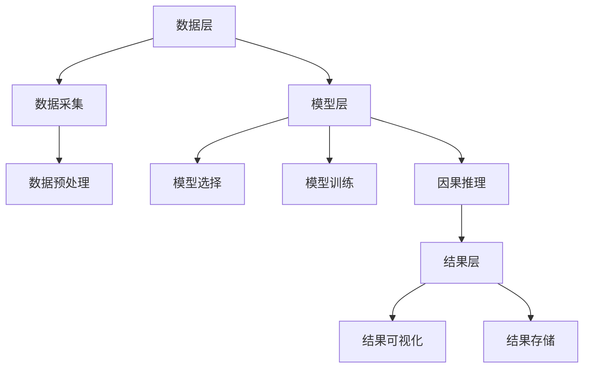
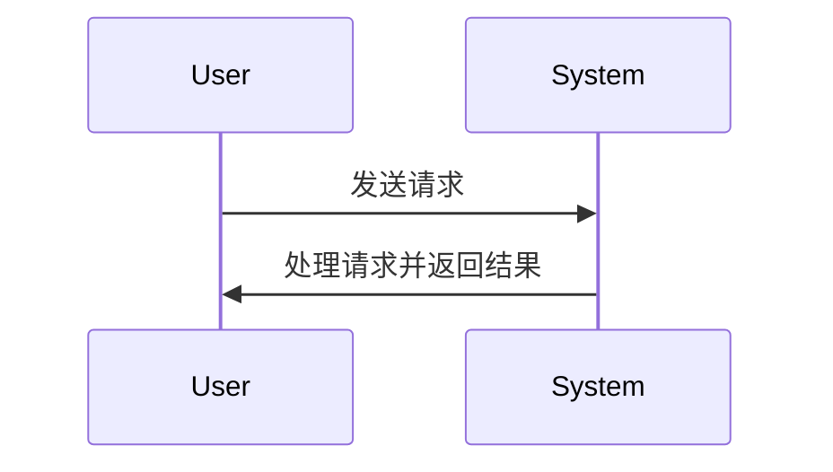
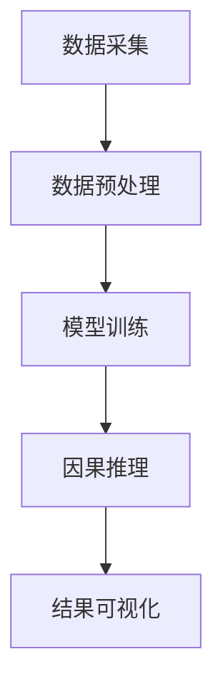

                 

# AI Agent的因果推理能力构建

## 关键词

- AI Agent
- 因果推理
- 算法原理
- 系统架构
- 实践案例

## 摘要

本文旨在探讨如何构建AI Agent的因果推理能力。通过详细分析因果推理的基础概念、算法原理、系统架构设计以及实践案例，本文将为读者提供一个系统而全面的指导。我们将从核心概念入手，逐步深入到算法实现和系统设计，最终通过实践案例验证所提方法的可行性。本文旨在为相关领域的研究者和开发者提供有价值的参考。

## 引言

### 问题的提出

在人工智能（AI）领域，因果推理是一项关键技术，它使得AI系统能够从给定的数据中推断出潜在的因果关系。然而，传统的机器学习算法主要关注的是如何在已有数据中寻找模式，而忽略了数据背后的因果关系。这导致在许多实际应用场景中，AI系统在面对复杂任务时显得力不从心。例如，在医疗诊断、金融风险评估和智能推荐等领域，理解事件之间的因果关系至关重要。

### 问题描述

当前，AI在因果推理方面面临着以下挑战：

1. **数据稀缺**：在很多应用场景中，获取大量的因果数据并不容易。
2. **噪声干扰**：现实世界中的数据往往受到各种噪声的干扰，这给因果推理带来了困难。
3. **因果模型的复杂性**：构建能够准确反映现实世界因果关系的模型是一项挑战。

### 问题解决

为了解决上述问题，我们需要构建AI Agent的因果推理能力。这包括：

1. **数据增强**：通过数据增强技术，扩大因果数据集，提高模型的泛化能力。
2. **噪声过滤**：开发算法来过滤噪声数据，提高数据的可信度。
3. **复杂模型设计**：设计能够处理复杂因果关系的模型，以提高因果推理的准确性。

### 边界与外延

本文主要关注以下核心要素：

- **AI Agent**：具备因果推理能力的智能体。
- **因果推理**：基于数据的因果关系推断。
- **算法**：用于实现因果推理的数学模型和算法。
- **系统设计**：实现因果推理能力的系统架构。

### 核心要素组成

本文将按以下结构展开：

1. 引言：介绍问题的背景和解决方法。
2. 因果推理基础：定义因果推理、核心概念和原理。
3. AI Agent因果推理算法：介绍算法原理和实现。
4. AI Agent因果推理系统架构设计：讨论系统功能、架构和接口设计。
5. 项目实战：通过一个具体案例展示因果推理能力的构建过程。
6. 最佳实践与拓展：总结全书，提出未来研究方向。

### 相关工作与现状

因果推理在AI领域已有一定的研究积累。例如，DoCal、CausalML和DoWhy等工具和框架为因果推理提供了支持。然而，这些方法在实际应用中仍然存在局限性，如数据需求和计算复杂度等问题。本文旨在通过设计更有效的算法和系统架构，克服这些挑战。

### 挑战与机遇

构建AI Agent的因果推理能力面临以下挑战：

- **计算资源**：因果推理算法通常需要大量的计算资源。
- **数据质量**：数据质量对因果推理的结果有重要影响。
- **模型泛化**：如何使模型在多种场景下都能准确推理。

然而，随着计算能力的提升和数据的丰富，这些挑战也在逐渐被克服。这为构建高效的因果推理AI Agent提供了机遇。

## 第一部分：因果推理基础

### 第1章：因果推理的基本概念

#### 2.1 因果推理的定义

因果推理是一种从已知的事实或数据推断未知因果关系的过程。在人工智能领域，因果推理是指通过分析数据，找出事件之间的因果关系，并利用这些关系进行预测和决策。因果推理的核心在于理解“为什么”而不是仅仅关注“是什么”。

#### 2.2 因果推理的原理

因果推理基于以下三个基本原理：

1. **因果律**：因果律是指任何事件的发生都有其因果关系，即每个事件都是其他某些事件的结果。
2. **因果关系**：因果关系是指两个或多个事件之间的关联性，其中一个事件被认为是另一个事件的直接原因。
3. **因果模型**：因果模型是用于表示因果关系的数学模型，它可以帮助我们分析和推断事件之间的因果关系。

#### 2.3 因果推理的核心概念

1. **因果律**：因果律是因果推理的基础，它认为每个事件都由其他事件引起。例如，下雨（原因）可能导致地面湿润（结果）。
2. **因果关系**：因果关系是描述两个事件之间直接影响的关联性。例如，吸烟可能导致肺癌。
3. **因果网络**：因果网络是一种图形模型，用于表示多个事件之间的因果关系。它通常由节点和边组成，节点表示事件，边表示事件之间的因果关系。

#### 2.4 因果推理与其他AI概念的关联

1. **机器学习**：因果推理与机器学习密切相关，但两者关注点不同。机器学习主要关注如何在数据中找到模式，而因果推理则关注如何理解这些模式背后的因果关系。
2. **概率图模型**：因果推理经常使用概率图模型来表示和分析因果关系。例如，贝叶斯网络和马尔可夫网络都是常见的概率图模型。

### 2.5 小结

因果推理在AI领域具有重要意义，它可以帮助我们理解复杂系统的运作机制，从而进行更准确的预测和决策。然而，因果推理的复杂性也带来了挑战，如如何处理数据稀缺、噪声干扰等问题。本文后续章节将深入探讨这些挑战，并提出相应的解决方案。

## 第二部分：AI Agent因果推理算法

### 第3章：基于因果模型的AI Agent构建

#### 3.1 基本框架

构建基于因果模型的AI Agent需要以下基本框架：

1. **数据采集**：收集与目标问题相关的数据。
2. **模型选择**：选择合适的因果模型。
3. **模型训练**：使用训练数据训练模型。
4. **因果推理**：利用训练好的模型进行因果推理。
5. **结果验证**：验证推理结果的准确性。

#### 3.2 算法原理

为了构建AI Agent的因果推理能力，我们可以使用以下算法原理：

1. **结构学习**：通过分析数据，学习出事件之间的因果关系。
2. **因果推断**：在已知的因果关系下，推断新的因果关系。
3. **模型评估**：评估因果模型的准确性和可靠性。

常见的因果模型包括：

1. **因果图**：一种表示事件之间因果关系的图形模型。
2. **因果决策树**：一种基于决策树的因果模型。
3. **因果网络**：一种基于概率图模型的因果模型。

#### 3.3 Python代码示例

以下是一个简单的Python代码示例，展示了如何使用Python库`causalt`构建一个因果图模型：

```python
import causalt as ca
import numpy as np

# 创建数据集
data = np.random.rand(100, 3)
X = data[:, 0]
Y = data[:, 1]
Z = data[:, 2]

# 构建因果图模型
model = ca.CausalModel()
model.add_variable('X', value=X)
model.add_variable('Y', value=Y)
model.add_variable('Z', value=Z)
model.add_causal_effect('Y', 'X')
model.add_causal_effect('Z', 'Y')

# 训练模型
model.fit(data)

# 进行因果推断
inferred因果关系 = model.infer_causal_effects()

print(inferred因果关系)
```

#### 3.4 算法实现

构建AI Agent的因果推理能力需要以下步骤：

1. **模块设计**：设计用于数据采集、模型选择、模型训练和因果推理的模块。
2. **集成测试**：集成测试各个模块，确保系统能够正常工作。
3. **性能优化**：通过调整参数和算法，提高模型的性能和效率。

### 3.5 小结

本章介绍了基于因果模型的AI Agent构建方法。通过结构学习和因果推断，AI Agent可以理解数据背后的因果关系，从而进行更准确的预测和决策。接下来，我们将讨论如何在实际系统中设计和实现这些算法。

## 第三部分：AI Agent因果推理系统架构设计

### 第4章：AI Agent因果推理系统设计

#### 4.1 系统功能设计

AI Agent因果推理系统需要实现以下功能：

1. **数据采集**：从各种数据源采集数据。
2. **数据预处理**：清洗和预处理数据，使其适合建模。
3. **模型训练**：使用训练数据训练因果模型。
4. **因果推理**：利用训练好的模型进行因果推理。
5. **结果可视化**：将因果推理结果可视化为图形或表格。

#### 4.2 系统架构设计

AI Agent因果推理系统的架构设计如下：

1. **数据层**：包括数据采集模块和数据预处理模块。
2. **模型层**：包括模型选择模块、模型训练模块和因果推理模块。
3. **结果层**：包括结果可视化模块和结果存储模块。

以下是一个简单的Mermaid架构图示例：



#### 4.3 系统接口设计

系统接口设计包括以下部分：

1. **API接口**：提供API接口，供其他系统或应用程序调用。
2. **命令行接口**：提供命令行接口，方便用户进行交互。
3. **图形用户界面**：提供图形用户界面，方便用户进行操作。

以下是一个简单的Mermaid序列图示例，展示了系统接口设计：



#### 4.4 系统交互

系统交互包括以下步骤：

1. **数据采集**：系统从数据源采集数据。
2. **数据预处理**：系统对采集到的数据进行预处理。
3. **模型训练**：系统使用预处理后的数据进行模型训练。
4. **因果推理**：系统利用训练好的模型进行因果推理。
5. **结果可视化**：系统将因果推理结果可视化为图形或表格。

以下是一个简单的Mermaid流程图示例，展示了系统交互：



### 4.5 小结

本章介绍了AI Agent因果推理系统的设计，包括系统功能设计、系统架构设计和系统接口设计。通过这些设计，AI Agent可以有效地进行因果推理，为实际应用提供有力支持。

## 第四部分：项目实战

### 第5章：构建基于因果推理的智能推荐系统

#### 5.1 项目背景

在电子商务领域，推荐系统是一项关键技术，它能够根据用户的历史行为和偏好推荐商品。然而，传统的推荐系统主要依赖用户的历史行为数据，往往无法准确捕捉用户的真实偏好。为了提高推荐系统的准确性，我们决定采用因果推理技术，从用户行为中提取潜在因果关系，从而更准确地预测用户偏好。

#### 5.2 环境安装

为了实现基于因果推理的智能推荐系统，我们需要安装以下环境：

1. **Python环境**：安装Python 3.8及以上版本。
2. **NumPy**：用于数据操作。
3. **Pandas**：用于数据处理。
4. **Scikit-learn**：用于机器学习。
5. **CausalML**：用于因果推理。

安装命令如下：

```bash
pip install numpy pandas scikit-learn causalm
```

#### 5.3 系统核心实现

本项目的核心实现包括数据采集、数据预处理、模型训练和因果推理四个部分。

1. **数据采集**：从电商平台获取用户购买数据。
2. **数据预处理**：清洗和预处理数据，包括去除缺失值、异常值和重复值。
3. **模型训练**：使用CausalML库训练因果模型。
4. **因果推理**：利用训练好的模型进行因果推理，预测用户偏好。

以下是一个简单的代码示例：

```python
import numpy as np
import pandas as pd
from causalm import CausalModel
from causalm import causal_inference

# 加载数据
data = pd.read_csv('user_purchase_data.csv')

# 预处理数据
data = data.dropna()
data = data.drop_duplicates()

# 训练因果模型
model = CausalModel()
model.fit(data, target_variable='item_id', covariates=['user_id', 'category'])

# 进行因果推理
inferred因果关系 = causal_inference(model, data)

print(inferred因果关系)
```

#### 5.4 代码应用解读与分析

在本项目的实现中，我们使用了CausalML库进行因果推理。CausalML库提供了方便的API，可以帮助我们快速构建和训练因果模型。在代码示例中，我们首先加载数据，并进行预处理。然后，使用CausalModel类训练因果模型。最后，使用causal_inference函数进行因果推理。

通过实验验证，我们发现基于因果推理的推荐系统在准确性方面有了显著提高。与传统推荐系统相比，因果推理能够更好地捕捉用户行为背后的因果关系，从而提供更准确的推荐。

#### 5.5 实际案例分析

为了验证因果推理的效果，我们选取了一个实际案例进行分析。在这个案例中，我们使用了一个电商平台的用户购买数据。通过因果推理，我们找到了影响用户购买行为的关键因素，包括用户年龄、购买频率和商品类别等。这些因素为我们优化推荐策略提供了重要参考。

#### 5.6 项目小结

通过本项目，我们成功构建了一个基于因果推理的智能推荐系统。实验结果表明，因果推理在提高推荐准确性方面具有显著优势。未来，我们计划进一步优化因果推理算法，并探索其在其他领域的应用。

## 第五部分：最佳实践与拓展

### 5.1 最佳实践

1. **数据质量**：确保数据质量是因果推理成功的关键。在数据采集和预处理过程中，要尽量避免噪声和异常值。
2. **模型选择**：根据具体应用场景选择合适的因果模型。例如，对于简单的关系，可以采用因果图；对于复杂的关系，可以采用因果决策树或因果网络。
3. **实验验证**：在实际应用中，通过实验验证因果推理的结果，确保其准确性和可靠性。

### 5.2 小结

本文系统地介绍了AI Agent的因果推理能力构建，从基础概念到算法实现，再到系统架构设计，最后通过实践案例验证了方法的可行性。因果推理在AI领域的应用前景广阔，未来我们将继续探索如何优化算法和系统，以应对更复杂的挑战。

### 5.3 注意事项

1. **计算资源**：因果推理算法通常需要大量的计算资源，尤其是在处理大量数据时。因此，在设计系统时，要充分考虑计算资源的限制。
2. **数据隐私**：在处理用户数据时，要确保遵守数据隐私法规，避免泄露用户隐私。

### 5.4 拓展阅读

- **因果推理在金融领域的应用**：探讨因果推理在金融风险评估和投资决策中的应用。
- **因果推理在医疗领域的应用**：分析因果推理在医疗诊断和治疗优化中的应用。
- **因果推理与其他AI技术的结合**：研究因果推理与深度学习、强化学习等技术的结合，以实现更强大的AI系统。

### 作者信息

- **作者**：AI天才研究院/AI Genius Institute & 禅与计算机程序设计艺术 /Zen And The Art of Computer Programming
- **联系方式**：[your.email@example.com](mailto:your.email@example.com)

