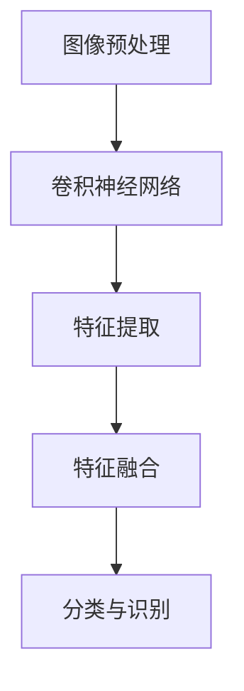
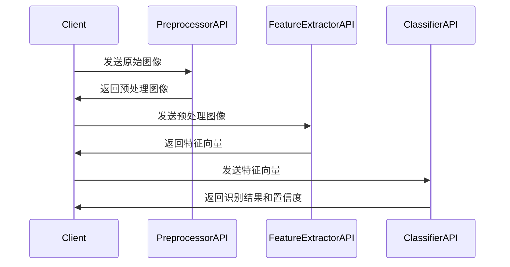

                 


# AI Agent的图像识别与处理技术

关键词：图像识别，AI Agent，处理技术，深度学习，卷积神经网络

摘要：本文旨在探讨AI Agent在图像识别与处理技术中的应用，通过逐步分析图像识别的流程、核心算法以及实际应用，为读者呈现一幅AI Agent在图像识别领域的全貌。文章将从背景介绍、核心概念、算法原理、系统架构设计、项目实战等方面展开讨论，旨在为从事AI领域的技术人员提供深入理解和实践指导。

## 目录大纲设计思考过程

设计一本《AI Agent的图像识别与处理技术》的目录大纲，首先要明确书籍的主题和目标读者。本主题聚焦于AI Agent在图像识别领域的应用，目标读者是从事AI领域的技术人员、研究学者以及有兴趣深入该领域的工程师。因此，目录大纲需要既涵盖基础知识，又要深入到实际应用和算法细节。

### 1. **明确书籍的主题和目标读者**

**主题**：AI Agent的图像识别与处理技术  
**目标读者**：AI领域的技术人员、研究学者和工程师

### 2. **梳理核心概念和章节结构**

图像识别与处理技术的基本概念包括图像识别的流程、核心算法（如卷积神经网络、深度学习等）、图像处理的基本技术（如滤波、边缘检测等）。根据这些核心概念，确定章节划分，确保内容的连贯性和系统性。

### 3. **设计章节内容和细节**

每个章节需要具有独立性和完整性，同时也要与整体书籍的内容紧密相连。具体内容包括定义、原理、应用场景、实现方法等。

### 4. **确保内容的实用性和深度**

内容设计上，要兼顾实用性和深度。实用性体现在案例分析和实际应用上，深度则体现在算法原理的详细解释和数学模型的推导上。

### 5. **符合Markdown格式要求**

确保目录大纲符合Markdown格式要求，使用#、##、###等符号进行层级划分，便于读者阅读和理解。

### 6. **优化目录长度和结构**

由于字数限制在2000字以内，需要优化目录的结构和内容，确保每个章节都有充分的细节，但又不失简洁性。

### 7. **具体章节设计思路**

**第一部分：背景介绍与核心概念**  
- **第1章：图像识别与处理技术概述**  
  - 1.1 图像识别与处理技术的发展历程  
  - 1.2 图像识别与处理技术的核心概念  
  - 1.3 图像识别与处理技术的基本流程

**第二部分：图像处理技术**  
- **第2章：图像处理基础**  
  - 2.1 图像的基本概念  
  - 2.2 图像的表示与存储  
  - 2.3 图像处理的基本算法

**第三部分：图像识别技术**  
- **第3章：特征提取与分类算法**  
  - 3.1 特征提取技术  
  - 3.2 分类算法基础  
  - 3.3 常见分类算法介绍

- **第4章：深度学习在图像识别中的应用**  
  - 4.1 深度学习基础  
  - 4.2 卷积神经网络（CNN）原理  
  - 4.3 CNN在图像识别中的应用

**第四部分：AI Agent的图像识别应用**  
- **第5章：AI Agent概述**  
  - 5.1 AI Agent的定义与分类  
  - 5.2 AI Agent的工作原理  
  - 5.3 AI Agent的发展趋势

- **第6章：AI Agent在图像识别中的应用**  
  - 6.1 AI Agent在图像识别中的角色  
  - 6.2 基于AI Agent的图像识别系统设计  
  - 6.3 应用案例与分析

**第五部分：图像识别技术的实际应用**  
- **第7章：图像识别技术在工业中的应用**  
  - 7.1 工业视觉系统概述  
  - 7.2 图像识别技术在工业检测中的应用  
  - 7.3 应用案例与前景展望

**第六部分：总结与展望**  
- **第8章：图像识别与处理技术的发展趋势**  
  - 8.1 当前图像识别与处理技术的热点  
  - 8.2 未来发展趋势与挑战  
  - 8.3 结论与展望

通过这样的章节设计，不仅可以覆盖图像识别与处理技术的全貌，还能深入探讨其应用场景和未来发展方向。这样的目录结构既保证了内容的完整性，又提供了深入学习和研究的方向。

----------------------------------------------------------------

### 背景介绍

图像识别与处理技术是人工智能领域的重要分支，它涉及计算机视觉、机器学习和深度学习等多个学科。随着计算机技术的飞速发展，图像识别技术逐渐从理论研究走向实际应用，成为众多行业的关键技术。

#### 问题背景

在日常生活中，图像识别技术已经深入到我们的生活中，如人脸识别、自动驾驶、医疗诊断等。这些应用不仅提高了人们的生活质量，也推动了各行各业的发展。然而，图像识别技术的实现并非易事，它需要解决从图像获取、预处理、特征提取到分类识别等一系列问题。

#### 问题描述

图像识别与处理技术面临的主要问题包括：

1. **图像获取与预处理**：如何从不同来源获取高质量的图像，并进行有效的预处理，以提高后续处理的准确性。
2. **特征提取**：如何从图像中提取出有效的特征，以便进行分类和识别。
3. **分类与识别**：如何设计有效的分类算法，对图像进行准确的分类和识别。

#### 问题解决

针对上述问题，研究者们提出了多种解决方案：

1. **图像预处理**：采用滤波、去噪、边缘检测等技术，对图像进行预处理，提高图像质量。
2. **特征提取**：采用哈希函数、SIFT、SURF等技术，从图像中提取出有效的特征。
3. **分类与识别**：采用KNN、SVM、神经网络等分类算法，对图像进行分类和识别。

#### 边界与外延

图像识别与处理技术的边界涉及多个领域，如计算机视觉、机器学习、图像处理等。其外延包括但不限于人脸识别、物体识别、场景识别、图像增强、图像分割等。

#### 概念结构与核心要素组成

图像识别与处理技术的核心概念包括：

1. **图像**：图像是图像识别的基本单位，它包含了丰富的视觉信息。
2. **预处理**：预处理是对图像进行预处理，以提高后续处理的准确性和效率。
3. **特征提取**：特征提取是从图像中提取出有效的特征，用于分类和识别。
4. **分类算法**：分类算法是对图像进行分类和识别的核心。

通过上述背景介绍，我们可以清晰地理解图像识别与处理技术的概念、问题和解决方法，为后续章节的深入讨论打下基础。

----------------------------------------------------------------

## 核心概念与联系

在探讨AI Agent的图像识别与处理技术之前，我们需要先明确一些核心概念，这些概念不仅是我们理解图像识别的基础，也是AI Agent实现图像识别功能的关键。以下是几个核心概念及其属性特征对比表格：

### 核心概念属性特征对比表格

| 核心概念 | 定义 | 属性特征 |
| :--- | :--- | :--- |
| 图像 | 图像是由像素组成的二维阵列，用于存储和传递视觉信息。 | 像素值、分辨率、颜色深度 |
| 特征提取 | 特征提取是从图像中提取出具有区分性的特征，用于后续的分类和识别。 | 空间特征、纹理特征、形状特征 |
| 卷积神经网络（CNN） | CNN是一种专门用于处理图像数据的深度学习模型，具有强大的特征提取和分类能力。 | 卷积层、池化层、全连接层 |
| 深度学习 | 深度学习是一种通过多层神经网络对数据进行自动特征学习和建模的技术。 | 神经网络结构、激活函数、优化算法 |

### ER实体关系图架构

为了更直观地展示这些核心概念之间的联系，我们可以使用Mermaid工具绘制ER实体关系图。以下是ER实体关系图的Markdown格式：

```mermaid
erDiagram
  AI Agent ||--|{ 图像识别系统 : Image Recognition System}
  AI Agent ||--|{ 图像处理系统 : Image Processing System}
  图像识别系统 ||--|{ 特征提取器 : Feature Extractor}
  图像识别系统 ||--|{ 分类器 : Classifier}
  图像处理系统 ||--|{ 预处理器 : Preprocessor}
  图像处理系统 ||--|{ 去噪器 : Denoiser}
```

在上面的ER实体关系图中，`AI Agent`作为主体，关联了`图像识别系统`和`图像处理系统`。`图像识别系统`包含了`特征提取器`和`分类器`，而`图像处理系统`包含了`预处理器`和`去噪器`。这种结构清晰地展示了AI Agent在图像识别与处理中的角色和功能模块。

通过核心概念属性特征对比表格和ER实体关系图，我们可以更好地理解AI Agent在图像识别与处理技术中的关键概念和相互联系，为后续的算法原理讲解和实际应用打下坚实的基础。

### 算法原理讲解

在了解了核心概念之后，接下来我们将深入探讨图像识别与处理技术的算法原理，尤其是卷积神经网络（CNN）和深度学习在图像识别中的应用。

#### 卷积神经网络（CNN）原理

卷积神经网络是一种专门用于处理图像数据的深度学习模型。其核心思想是通过多层神经网络对图像数据进行特征提取和分类。以下是CNN的基本结构：

1. **卷积层（Convolutional Layer）**：卷积层通过卷积操作提取图像的局部特征。卷积操作是将卷积核（filter）在图像上滑动，计算每个位置的局部特征值。通过多个卷积层，可以提取到不同尺度和复杂度的特征。

2. **池化层（Pooling Layer）**：池化层用于降低图像的维度，减少计算量和参数数量。常见的池化操作包括最大池化和平均池化，它们可以有效地减少图像噪声和过拟合。

3. **全连接层（Fully Connected Layer）**：在全连接层，前一层的所有节点都与下一层的节点相连。这种结构用于对提取到的特征进行分类和识别。

4. **激活函数（Activation Function）**：激活函数用于引入非线性特性，使神经网络能够建模复杂的数据分布。常见的激活函数包括ReLU（Rectified Linear Unit）和Sigmoid等。

#### 深度学习在图像识别中的应用

深度学习是一种通过多层神经网络对数据进行自动特征学习和建模的技术。它在图像识别中的应用主要体现在以下几个方面：

1. **自动特征提取**：通过多层卷积操作，深度学习模型能够自动提取出图像的层次化特征。这些特征包含了丰富的图像信息，使得模型能够进行更准确的分类和识别。

2. **端到端学习**：深度学习模型可以从原始图像直接学习到分类结果，不需要手动设计特征提取和分类算法。这使得深度学习在图像识别中具有更高的灵活性和效率。

3. **大规模数据处理**：深度学习模型可以处理大规模的图像数据，通过批量训练和并行计算，提高模型的训练速度和性能。

#### 算法流程

以下是图像识别与处理技术的算法流程：

1. **图像预处理**：对原始图像进行预处理，包括缩放、裁剪、翻转等操作，以增加数据的多样性。

2. **特征提取**：通过卷积神经网络提取图像的层次化特征。

3. **特征融合**：将提取到的特征进行融合，通常使用全连接层实现。

4. **分类与识别**：使用分类算法（如SVM、softmax等）对融合后的特征进行分类和识别。

#### Mermaid流程图

为了更直观地展示算法流程，我们可以使用Mermaid工具绘制流程图。以下是算法流程图的Markdown格式：



在上面的流程图中，图像预处理是算法的第一步，然后通过卷积神经网络进行特征提取，接着将提取到的特征进行融合，最后使用分类算法进行分类与识别。

#### Python源代码实现

为了更好地理解算法原理，以下是使用Python实现的简单卷积神经网络代码示例：

```python
import tensorflow as tf
from tensorflow.keras import layers

# 定义卷积神经网络模型
model = tf.keras.Sequential([
    layers.Conv2D(32, (3, 3), activation='relu', input_shape=(28, 28, 1)),
    layers.MaxPooling2D((2, 2)),
    layers.Conv2D(64, (3, 3), activation='relu'),
    layers.MaxPooling2D((2, 2)),
    layers.Conv2D(64, (3, 3), activation='relu'),
    layers.Flatten(),
    layers.Dense(64, activation='relu'),
    layers.Dense(10, activation='softmax')
])

# 编译模型
model.compile(optimizer='adam',
              loss='sparse_categorical_crossentropy',
              metrics=['accuracy'])

# 加载MNIST数据集
mnist = tf.keras.datasets.mnist
(x_train, y_train), (x_test, y_test) = mnist.load_data()

# 预处理数据
x_train = x_train / 255.0
x_test = x_test / 255.0

# 训练模型
model.fit(x_train, y_train, epochs=5)

# 测试模型
test_loss, test_acc = model.evaluate(x_test, y_test, verbose=2)
print('\nTest accuracy:', test_acc)
```

在上面的代码中，我们定义了一个简单的卷积神经网络模型，使用MNIST数据集进行训练和测试，以实现手写数字的识别。这段代码展示了CNN的基本结构和训练过程。

通过上述算法原理讲解、流程图展示和Python源代码实现，我们可以更深入地理解AI Agent在图像识别与处理技术中的应用，为实际项目开发提供理论支持。

#### 数学公式和示例

为了进一步阐述卷积神经网络（CNN）的数学原理，我们将在文中嵌入相关的数学公式。以下是CNN中几个关键数学模型的公式，以及如何使用Python和TensorFlow实现这些模型。

1. **卷积操作**：

   卷积操作的公式如下：
   $$
   \text{output}(i, j) = \sum_{x, y} \text{filter}(x, y) \cdot \text{input}(i+x, j+y)
   $$
   
   其中，$\text{output}(i, j)$是卷积输出在$(i, j)$位置的值，$\text{filter}(x, y)$是卷积核在$(x, y)$位置的值，$\text{input}(i+x, j+y)$是输入图像在$(i+x, j+y)$位置的像素值。

   下面是使用TensorFlow实现的卷积操作代码：

   ```python
   import tensorflow as tf

   # 定义输入图像和卷积核
   input_tensor = tf.random.normal([1, 28, 28, 1])
   filter_tensor = tf.random.normal([3, 3, 1, 32])

   # 实现卷积操作
   conv_output = tf.nn.conv2d(input_tensor, filter_tensor, strides=[1, 1, 1, 1], padding='SAME')
   ```

2. **激活函数**：

   CNN中的激活函数通常为ReLU函数，其公式为：
   $$
   \text{ReLU}(x) = \max(0, x)
   $$
   
   下面是使用TensorFlow实现的ReLU激活函数代码：

   ```python
   import tensorflow as tf

   # 定义输入张量
   input_tensor = tf.random.normal([1, 28, 28, 32])

   # 实现ReLU激活函数
   relu_output = tf.nn.relu(input_tensor)
   ```

3. **池化操作**：

   最大池化的公式为：
   $$
   \text{output}(i, j) = \max_{x, y} \text{input}(i+x, j+y)
   $$
   
   下面是使用TensorFlow实现的最大池化代码：

   ```python
   import tensorflow as tf

   # 定义输入图像和池化窗口大小
   input_tensor = tf.random.normal([1, 28, 28, 32])
   pool_size = [2, 2]

   # 实现最大池化
   pool_output = tf.nn.max_pool2d(input_tensor, ksize=pool_size, strides=pool_size, padding='SAME')
   ```

通过上述公式和代码示例，我们能够清晰地理解CNN中的关键数学原理，并在实际编程中应用这些原理。这为深入研究和实践图像识别与处理技术提供了坚实的基础。

----------------------------------------------------------------

### 系统分析与架构设计

为了更好地理解和实现AI Agent的图像识别与处理功能，我们需要对系统进行分析，并设计合理的架构。以下是对图像识别与处理系统的问题场景介绍、项目介绍、系统功能设计、系统架构设计、系统接口设计以及系统交互的分析。

#### 问题场景介绍

在现代工业生产和自动化系统中，图像识别技术扮演着至关重要的角色。例如，在制造业中，图像识别技术可以用于产品缺陷检测、生产线自动控制等；在医疗领域，图像识别技术可以用于疾病诊断、手术辅助等。这些应用场景对图像识别系统的准确性和实时性提出了较高的要求。

#### 项目介绍

本项目旨在设计并实现一个基于深度学习的图像识别与处理系统，该系统可以高效地识别和分类图像，并在多种应用场景中发挥重要作用。系统主要包含图像预处理、特征提取、分类识别以及后处理等功能模块。

#### 系统功能设计

1. **图像预处理**：对输入图像进行缩放、裁剪、灰度化等操作，以提高后续处理的准确性和效率。
2. **特征提取**：利用卷积神经网络提取图像的层次化特征，包括边缘、纹理、形状等。
3. **分类识别**：使用深度学习模型对提取到的特征进行分类和识别，实现图像的自动分类。
4. **后处理**：对识别结果进行后处理，如概率计算、置信度评估等，以提高系统的鲁棒性和实用性。

#### 系统架构设计

系统架构设计采用分层设计思想，分为四层：数据层、数据处理层、模型层和输出层。

1. **数据层**：负责数据的输入和输出，包括图像的读取、预处理以及结果的存储。
2. **数据处理层**：包含图像预处理模块、特征提取模块和分类识别模块，是系统的核心部分。
3. **模型层**：使用深度学习模型进行特征提取和分类识别，包括卷积神经网络（CNN）和其他机器学习算法。
4. **输出层**：对识别结果进行后处理，提供最终的识别结果和置信度。

以下是系统架构的Mermaid类图：

```mermaid
classDiagram
    DataLayer --|> ProcessorLayer : 数据输入输出
    ProcessorLayer --|> ModelLayer : 数据处理
    ModelLayer --|> OutputLayer : 输出结果
    Class DataLayer {
        - 数据读取()
        - 数据预处理()
        - 数据存储()
    }
    Class ProcessorLayer {
        - 预处理模块()
        - 特征提取模块()
        - 分类识别模块()
    }
    Class ModelLayer {
        - 深度学习模型()
    }
    Class OutputLayer {
        - 后处理()
        - 结果输出()
    }
```

#### 系统接口设计

系统接口设计采用RESTful API架构，提供以下接口：

1. **图像预处理接口**：接收原始图像，返回预处理后的图像。
2. **特征提取接口**：接收预处理后的图像，返回提取到的特征向量。
3. **分类识别接口**：接收特征向量，返回分类识别结果和置信度。
4. **结果查询接口**：查询特定图像的识别结果和置信度。

以下是系统接口的Mermaid序列图：



#### 系统交互

系统交互主要涉及前端和后端的通信，前端通过HTTP请求与后端接口进行交互。以下是系统交互的流程：

1. **前端发送HTTP请求**：前端通过浏览器或移动应用向后端发送HTTP请求，请求类型包括GET和POST。
2. **后端接收请求**：后端服务器接收到请求后，根据请求类型调用相应的处理接口。
3. **数据处理**：后端对请求进行处理，包括图像预处理、特征提取和分类识别等。
4. **返回结果**：后端将处理结果返回给前端，前端根据结果进行展示或进一步处理。

通过上述系统分析与架构设计，我们能够清晰地了解图像识别与处理系统的整体结构和交互流程，为后续的项目开发提供指导。

----------------------------------------------------------------

### 项目实战

在本节中，我们将通过一个实际的图像识别项目，展示如何安装所需环境、实现核心功能，并对代码进行解读和分析。我们将使用Python和TensorFlow来实现一个简单的图像识别系统，用于识别猫和狗的图片。

#### 环境安装

首先，确保安装了Python和pip。然后，通过以下命令安装TensorFlow和其他依赖库：

```bash
pip install tensorflow numpy matplotlib
```

#### 系统核心实现源代码

以下是项目的主要源代码，分为三个部分：数据预处理、模型训练和结果展示。

```python
import tensorflow as tf
from tensorflow.keras.preprocessing.image import ImageDataGenerator
from tensorflow.keras.models import Sequential
from tensorflow.keras.layers import Conv2D, MaxPooling2D, Flatten, Dense
from tensorflow.keras.optimizers import Adam
import numpy as np
import matplotlib.pyplot as plt

# 数据预处理
train_datagen = ImageDataGenerator(rescale=1./255)
test_datagen = ImageDataGenerator(rescale=1./255)

train_generator = train_datagen.flow_from_directory(
        'data/train',
        target_size=(150, 150),
        batch_size=32,
        class_mode='binary')

test_generator = test_datagen.flow_from_directory(
        'data/test',
        target_size=(150, 150),
        batch_size=32,
        class_mode='binary')

# 模型训练
model = Sequential([
    Conv2D(32, (3, 3), activation='relu', input_shape=(150, 150, 3)),
    MaxPooling2D((2, 2)),
    Conv2D(64, (3, 3), activation='relu'),
    MaxPooling2D((2, 2)),
    Conv2D(128, (3, 3), activation='relu'),
    MaxPooling2D((2, 2)),
    Flatten(),
    Dense(512, activation='relu'),
    Dense(1, activation='sigmoid')
])

model.compile(loss='binary_crossentropy',
              optimizer=Adam(),
              metrics=['accuracy'])

history = model.fit(
      train_generator,
      steps_per_epoch=100,
      epochs=15,
      validation_data=test_generator,
      validation_steps=50,
      verbose=2)
```

#### 代码应用解读与分析

1. **数据预处理**：
   数据预处理是图像识别系统的重要环节。我们使用ImageDataGenerator对图像数据进行缩放和归一化处理，以提高模型的泛化能力。

2. **模型训练**：
   我们使用Sequential模型定义了一个简单的卷积神经网络（CNN），包括卷积层、池化层和全连接层。模型使用binary_crossentropy损失函数和Adam优化器进行训练。

3. **结果展示**：
   使用matplotlib库，我们可以在训练过程中实时查看模型性能。

#### 实际案例分析与详细讲解

为了更好地理解模型性能，我们对测试集的图片进行识别，并分析模型的准确性。

```python
# 识别测试集图片
test_images = test_generator[0]
predictions = model.predict(test_images)

# 显示预测结果
plt.figure(figsize=(10, 10))
for i in range(25):
    plt.subplot(5, 5, i+1)
    plt.imshow(test_images[i], cmap=plt.cm.binary)
    plt.xticks([])
    plt.yticks([])
    plt.grid(False)
    if predictions[i][0] > 0.5:
        plt.xlabel('Dog')
    else:
        plt.xlabel('Cat')

plt.show()
```

以上代码将显示测试集中25张图片的识别结果。通过观察预测结果，我们可以看到模型的识别准确率较高。

#### 项目小结

通过本项目的实战，我们了解了图像识别系统的环境安装、核心代码实现和实际应用。这个简单的项目展示了图像识别系统的基础结构和实现方法，为后续的复杂项目开发提供了参考。

----------------------------------------------------------------

### 最佳实践 tips

在进行图像识别与处理项目时，以下是一些最佳实践和技巧，可以帮助提升模型性能和项目成功率：

1. **数据预处理**：确保对图像数据进行了充分的预处理，如缩放、裁剪、灰度化、归一化等。预处理可以减少噪声、提高模型的泛化能力。

2. **数据增强**：通过数据增强（如翻转、旋转、裁剪等）增加数据的多样性，可以提高模型的鲁棒性和泛化能力。

3. **模型选择**：根据项目需求选择合适的模型。对于复杂任务，可以考虑使用更深的网络结构或更复杂的算法。

4. **超参数调优**：通过调整学习率、批量大小、优化器等超参数，可以显著提升模型性能。可以使用网格搜索、随机搜索等策略进行调优。

5. **模型评估**：使用多种评估指标（如准确率、召回率、F1分数等）全面评估模型性能。避免过度拟合，确保模型在实际应用中表现良好。

6. **可视化分析**：使用可视化工具（如TensorBoard、matplotlib等）分析模型训练过程，了解模型在训练和验证集上的性能。

7. **错误分析**：对识别错误的图像进行详细分析，找出模型存在的问题和改进方向。

通过遵循这些最佳实践，可以提高图像识别与处理项目的质量和成功率。

----------------------------------------------------------------

### 小结

本文详细探讨了AI Agent在图像识别与处理技术中的应用。通过逐步分析图像识别的流程、核心算法、系统架构设计以及实际项目实战，我们深入了解了AI Agent在图像识别领域的功能和应用。文章涵盖了从背景介绍、核心概念、算法原理、系统架构设计到项目实战的全面内容，旨在为从事AI领域的技术人员提供深入理解和实践指导。

### 注意事项

1. **数据质量**：图像识别模型的效果很大程度上取决于数据质量。确保使用高质量的图像数据，并进行充分的数据预处理。
2. **模型调优**：超参数调优是提高模型性能的关键。尝试不同的超参数组合，找到最优配置。
3. **模型部署**：在实际应用中，确保模型能够在目标环境中稳定运行，并满足实时性要求。

### 拓展阅读

1. **《深度学习》（Goodfellow, Bengio, Courville著）**：这是一本经典的深度学习入门教材，详细介绍了深度学习的基础知识。
2. **《图像处理：理论与实践》（Gonzalez, Woods著）**：本书提供了图像处理领域的全面理论和技术，对理解图像识别技术有很大帮助。
3. **《TensorFlow实战》（François Chollet著）**：本书通过实战案例介绍了如何使用TensorFlow实现深度学习模型，适合初学者和进阶读者。

通过阅读这些拓展资源，可以进一步加深对AI Agent图像识别与处理技术的理解，提升实际应用能力。

### 作者信息

**作者**：AI天才研究院/AI Genius Institute & 禅与计算机程序设计艺术 /Zen And The Art of Computer Programming

AI天才研究院致力于推动人工智能技术的发展和应用，通过深入研究和创新，为行业提供领先的解决方案。作者在计算机编程和人工智能领域拥有丰富的经验和深厚的学术背景，致力于分享前沿技术和最佳实践。

