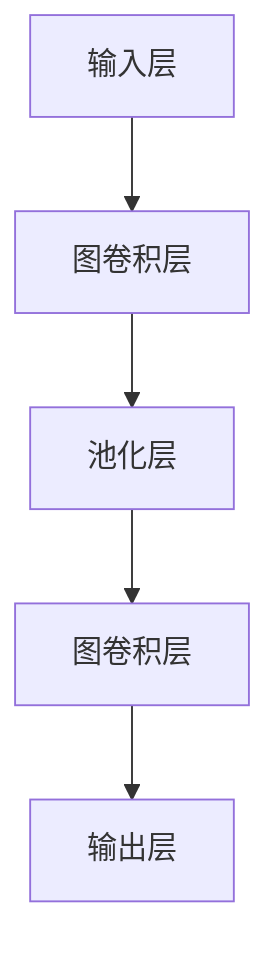
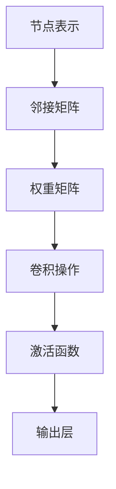
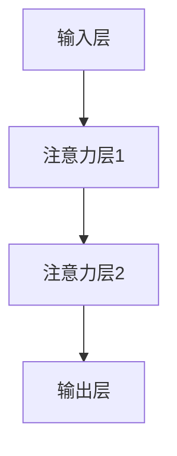
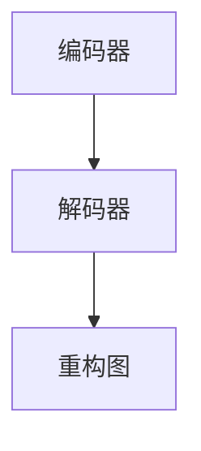
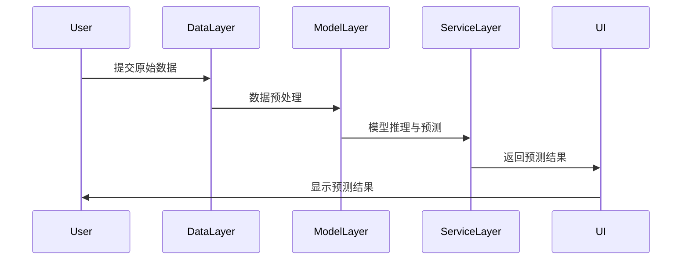
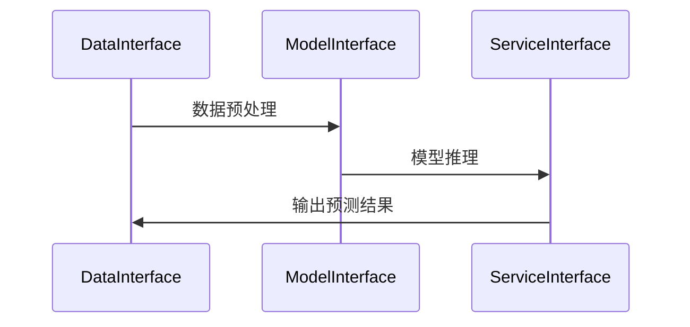
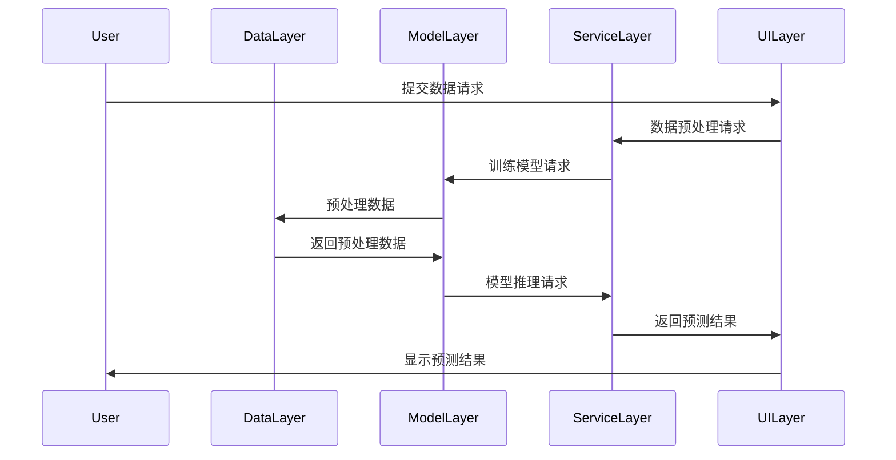

                 

### 引言与背景

#### AI Agent的定义与重要性

AI Agent，即人工智能代理，是一种能够自主执行任务并适应环境变化的计算实体。随着人工智能技术的不断发展，AI Agent在多个领域展现出极大的潜力，如智能家居、自动驾驶、智能客服等。AI Agent不仅能够提高效率，还能够提供个性化服务，从而在现代社会中扮演着越来越重要的角色。

#### 图神经网络的概念与应用前景

图神经网络（Graph Neural Network，GNN）是一种专门用于处理图结构数据的神经网络。图神经网络通过学习节点和边之间的关系来对图数据进行建模。由于图结构在现实世界中非常普遍，如社交网络、分子结构、交通网络等，因此GNN在数据挖掘、推荐系统、知识图谱等领域有广泛的应用前景。

#### 图神经网络在AI Agent中的关键作用

在AI Agent中，图神经网络能够有效地解决图结构数据的处理问题，从而提升AI Agent的智能水平和自主能力。具体来说，GNN可以用于以下方面：

1. **知识图谱构建**：AI Agent可以通过GNN从大规模、异构的知识图谱中提取有用的信息，提高信息检索和处理能力。
2. **社交网络分析**：GNN可以帮助AI Agent理解社交网络中的用户关系，从而提供更加精准的社交推荐服务。
3. **路径规划**：在自动驾驶等场景中，GNN可以用于实时路径规划，提高路线规划的效率和准确性。
4. **异常检测**：GNN可以通过学习图结构中的正常模式和异常模式来检测异常行为，提高系统的安全性。

#### 图神经网络应用的边界与外延

尽管图神经网络在AI Agent中具有广泛的应用前景，但同时也存在一些局限性。首先，GNN对数据质量有较高要求，数据中的噪声和异常值可能会影响模型的性能。其次，GNN的训练过程相对复杂，需要大量的计算资源和时间。此外，GNN在处理动态图时可能会遇到挑战，因为动态图的拓扑结构会随着时间变化而变化。因此，未来图神经网络的应用需要在以下几个方面进行改进：

1. **数据预处理**：研究更加有效的数据清洗和预处理方法，以提高模型对噪声和异常值的鲁棒性。
2. **训练优化**：开发更加高效的训练算法，降低训练时间和计算资源需求。
3. **动态图处理**：研究适用于动态图处理的GNN模型，提高模型在动态环境中的适应性。

通过上述分析，我们可以看到，图神经网络在AI Agent中的应用不仅能够提升AI Agent的智能水平，还能够拓展其应用边界。接下来，我们将进一步探讨图神经网络的基本原理和算法，为深入理解其在AI Agent中的应用奠定基础。

---

### 概念结构与核心要素

图神经网络（Graph Neural Network，GNN）是一种专为处理图结构数据设计的神经网络。与传统的基于向量表示的神经网络不同，GNN通过节点和边之间的关系来学习数据特征，从而实现更加复杂的数据建模和分析。在这一节中，我们将详细探讨图神经网络的基本概念、核心要素，以及与传统神经网络的区别。

#### 图神经网络的基本组成

图神经网络由以下几个核心组成部分构成：

1. **节点（Node）**：图中的每个实体都可以被表示为一个节点，节点可以是有向的或无向的，也可以带有属性。例如，在社交网络中，每个用户就是一个节点。

2. **边（Edge）**：边用于连接两个节点，表示节点之间的关系。边的方向性可以是单向的，也可以是双向的。例如，在社交网络中，如果用户A关注了用户B，那么这两者之间就有一条有向边。

3. **特征（Feature）**：节点和边可以携带特征信息，这些特征用于表示节点的属性和边的关系。例如，在社交网络中，用户节点的特征可以包括年龄、性别、地理位置等。

4. **图（Graph）**：由节点和边构成的集合称为图。图可以表示各种复杂的关系网络，如社交网络、交通网络、生物分子网络等。

#### 关键概念与联系

1. **图卷积网络（Graph Convolutional Network，GCN）**：图卷积网络是GNN的一种基本形式，通过卷积操作来聚合邻接节点的特征信息。GCN的核心思想是将节点的特征与其邻居节点的特征进行加权融合，从而更新节点的表示。

2. **图注意力机制（Graph Attention Mechanism，GAT）**：图注意力机制是一种改进GCN的方法，通过引入注意力权重来动态调整节点特征融合的重要性。GAT能够更好地捕捉节点之间的关系，提高模型的性能。

3. **图自编码器（Graph Autoencoder，GAE）**：图自编码器是一种用于无监督学习的GNN模型，通过学习节点的低维表示来重构原始图。GAE可以用于特征降维、异常检测等任务。

这些概念之间紧密联系，共同构成了图神经网络的核心框架。

#### 图神经网络与传统神经网络的区别

1. **数据结构**：传统神经网络通常处理基于向量结构的数据，如文本、图像等。而GNN处理的是图结构数据，能够直接利用节点和边的关系信息。

2. **空间表示**：传统神经网络通过层与神经元结构来表示数据，而GNN通过节点和边来表示数据。这种表示方式使得GNN能够更好地捕捉图中的复杂关系。

3. **适应性**：GNN具有高度的自适应能力，可以处理不同规模和类型的图结构数据。而传统神经网络通常需要固定的输入层和输出层结构。

4. **可扩展性**：GNN在处理大规模图结构数据时表现出较好的可扩展性，而传统神经网络在数据量增加时可能会遇到性能瓶颈。

综上所述，图神经网络通过其独特的结构和方法，为处理图结构数据提供了强大的工具。在接下来的章节中，我们将进一步深入探讨图神经网络的基本原理和算法，以了解其在AI Agent中的应用潜力。

---

#### 图神经网络基本原理

图神经网络（GNN）的基本原理围绕节点和边之间的关系展开，通过一系列图卷积操作来逐步提取和聚合图中的信息。以下将详细阐述图神经网络的核心概念、工作原理以及基本架构。

##### 图神经网络的核心概念

1. **节点表示**：在GNN中，每个节点都表示为一个向量，称为节点特征向量。节点特征向量包含了节点的属性信息，如在社交网络中用户的年龄、性别等。

2. **边表示**：边表示节点之间的关系，通常用一个权重来量化。边的权重可以表示关系的强度或概率。

3. **图卷积操作**：图卷积操作是GNN的核心，通过将节点的特征向量与其邻居节点的特征向量进行加权融合，来更新节点的表示。

4. **图池化**：图池化操作用于整合图中的节点信息，通常在多个图卷积层之后进行，以降低模型的复杂性。

##### 图神经网络的工作原理

图神经网络的工作流程可以概括为以下几个步骤：

1. **初始化节点特征**：每个节点被初始化为一个随机特征向量。

2. **图卷积操作**：在每个图卷积层，节点的特征向量会与其邻居节点的特征向量进行加权融合。具体公式如下：
   $$
   \mathbf{h}_{k}^{\left(i\right)}=\sigma \left(\sum_{j \in \mathcal{N}\left(i\right)} \alpha_{ij} \cdot \mathbf{h}_{k}^{\left(j\right)}\right) + \mathbf{b}_{k}^{\left(i\right)}
   $$
   其中，$\mathbf{h}_{k}^{\left(i\right)}$表示第$k$层第$i$个节点的特征向量，$\mathcal{N}\left(i\right)$表示第$i$个节点的邻居节点集合，$\alpha_{ij}$表示第$i$个节点和第$j$个节点之间的边权重，$\sigma$为激活函数，$\mathbf{b}_{k}^{\left(i\right)}$为偏置项。

3. **图池化操作**：在多个图卷积层之后，通过图池化操作整合节点信息，通常使用平均池化或最大池化。

4. **输出层**：在完成所有图卷积和图池化操作后，GNN的输出层通常用于分类、回归或其他任务。

##### 图神经网络的基本架构

图神经网络的基本架构通常包括多个图卷积层和可选的图池化层。以下是一个简单的GNN架构示例：



在这个架构中，每个图卷积层都通过图卷积操作更新节点的特征向量，而池化层用于整合信息。输出层则根据任务类型（如分类或回归）进行相应的任务输出。

通过上述步骤，我们可以看到图神经网络是如何通过图卷积操作和池化操作来逐步提取和聚合图中的信息，从而实现复杂的图数据建模和分析。在接下来的章节中，我们将进一步探讨图神经网络的不同类型及其在AI Agent中的应用。

---

#### 图神经网络属性特征对比

在深入探讨图神经网络（GNN）的原理和应用之前，有必要对GNN与传统的神经网络（NN）进行一个全面的属性特征对比。这种对比有助于我们理解GNN的独特优势及其局限性。

| 特征 | 图神经网络（GNN） | 传统神经网络（NN） |
| --- | --- | --- |
| **输入数据结构** | 图结构（节点和边） | 向量结构 |
| **空间表示** | 节点与边 | 层与神经元 |
| **适应性** | 高度自适应 | 固定结构 |
| **可扩展性** | 高 | 低 |
| **计算复杂性** | 较高，但随着图深度增加呈指数增长 | 较低，线性增长 |
| **数据处理能力** | 强，能够捕捉节点间复杂关系 | 中，主要处理线性结构数据 |
| **训练时间** | 较长，依赖于图大小和层数 | 较短 |
| **适用性** | 图结构数据（如社交网络、交通网络） | 文本、图像、时间序列等 |
| **数据质量要求** | 高，需要高质量图数据 | 中，但需标准化处理 |

##### 输入数据结构

传统神经网络处理的是基于向量结构的数据，如图像是一个多维向量，文本是通过词向量表示的向量。而GNN处理的是图结构数据，图由节点和边构成，每个节点可以携带属性信息，边可以表示节点之间的关系。这种结构使得GNN能够直接利用图中的节点和边信息，从而捕捉到数据中的复杂关系。

##### 空间表示

传统神经网络通过层与神经元结构来表示数据，每一层神经元负责提取不同的特征。而GNN通过节点和边来表示数据。节点表示数据的基本单元，边表示节点之间的关系。这种表示方式使得GNN在捕捉图中的局部和全局关系方面具有天然的优势。

##### 适应性

GNN具有高度的自适应能力，可以处理不同规模和类型的图结构数据。每个节点和边都可以携带不同的属性信息，这使得GNN能够根据具体应用场景调整其结构和参数。相比之下，传统神经网络的结构是固定的，需要通过大量的预处理将数据转换为适合神经网络的形式。

##### 可扩展性

GNN在处理大规模图结构数据时表现出较好的可扩展性，可以灵活地增加图卷积层数和节点数，从而提高模型的性能。而传统神经网络在数据量增加时可能会遇到性能瓶颈，因为其计算复杂性与输入数据的维度成正比。

##### 计算复杂性

GNN的计算复杂性较高，尤其是在处理大规模图时，计算复杂度随着图深度增加呈指数增长。这是因为每个节点的特征向量需要与所有邻居节点的特征向量进行卷积操作。而传统神经网络的计算复杂度相对较低，主要随着输入数据的维度增加而线性增长。

##### 数据处理能力

GNN能够处理图结构数据，这种数据通常包含大量的复杂关系，如图中的社交网络、交通网络等。而传统神经网络主要处理线性结构数据，如文本、时间序列等。这使得GNN在处理非结构化或半结构化数据方面具有显著优势。

##### 训练时间

GNN的训练时间通常较长，这主要受到计算复杂性的影响。处理大规模图结构数据需要更多的时间和计算资源。相比之下，传统神经网络由于计算复杂性较低，训练时间较短。

##### 适用性

GNN适用于处理图结构数据，如社交网络分析、推荐系统、知识图谱构建等。而传统神经网络适用于处理图像、文本、时间序列等数据。

##### 数据质量要求

GNN对数据质量要求较高，因为图中的噪声和异常值可能会影响模型的性能。而传统神经网络对数据质量的要求相对较低，但通常需要将数据进行标准化处理。

通过上述对比，我们可以看到GNN与传统神经网络在多个方面都有显著的区别。GNN的独特优势使其在处理图结构数据方面具有不可替代的作用，但在计算资源和训练时间方面也存在一定的挑战。

---

### 算法原理讲解

在了解了图神经网络（GNN）的基本原理之后，我们将进一步深入探讨GNN的核心算法原理，包括图卷积网络（GCN）、图注意力机制（GAT）和图自编码器（GAE）。这些算法在处理图结构数据时各有特色，能够有效提升模型的性能和应用效果。

#### 图卷积网络（GCN）原理

图卷积网络（Graph Convolutional Network，GCN）是GNN的一种基本形式，通过图卷积操作来聚合邻接节点的特征信息。GCN的核心思想是将节点的特征与其邻居节点的特征进行加权融合，从而更新节点的表示。

##### 图卷积网络（GCN）原理

图卷积操作的数学公式如下：
$$
\mathbf{h}_{k}^{\left(i\right)}=\sigma \left(\sum_{j \in \mathcal{N}\left(i\right)} \alpha_{ij} \cdot \mathbf{h}_{k}^{\left(j\right)}\right) + \mathbf{b}_{k}^{\left(i\right)}
$$
其中，$\mathbf{h}_{k}^{\left(i\right)}$表示第$k$层第$i$个节点的特征向量，$\mathcal{N}\left(i\right)$表示第$i$个节点的邻居节点集合，$\alpha_{ij}$表示第$i$个节点和第$j$个节点之间的边权重，$\sigma$为激活函数，$\mathbf{b}_{k}^{\left(i\right)}$为偏置项。

##### 图卷积网络（GCN）流程图



#### 图注意力机制（GAT）原理

图注意力机制（Graph Attention Mechanism，GAT）是GCN的一种改进，通过引入注意力权重来动态调整节点特征融合的重要性。GAT能够更好地捕捉节点之间的关系，提高模型的性能。

##### 图注意力机制（GAT）原理

图注意力机制的注意力公式如下：
$$
\mathbf{Z} = \frac{1}{Z} \sum_{i,j} a_{ij} \sigma(W \cdot [\mathbf{h}_i, \mathbf{h}_j])
$$
其中，$a_{ij}$是注意力权重，$W$是权重矩阵，$\sigma$为激活函数。

##### 图注意力机制（GAT）流程图



#### 图自编码器（GAE）原理

图自编码器（Graph Autoencoder，GAE）是一种无监督学习的GNN模型，通过学习节点的低维表示来重构原始图。GAE可以用于特征降维、异常检测等任务。

##### 图自编码器（GAE）原理

图自编码器由编码器和解码器两部分组成，编码器学习节点的低维表示，解码器使用这些低维表示重构图。

##### 图自编码器（GAE）流程图



通过上述算法原理的讲解，我们可以看到GNN的不同算法在处理图结构数据时的独特方法和优势。GCN通过图卷积操作聚合邻接节点特征，GAT通过注意力机制动态调整特征融合，GAE通过无监督学习重构图。这些算法在AI Agent中的应用，将大大提升其数据处理能力和智能水平。

---

### 算法数学模型与公式

在深入探讨图神经网络（GNN）的核心算法时，理解其背后的数学模型与公式是至关重要的。以下将详细解释图卷积网络（GCN）、图注意力机制（GAT）和图自编码器（GAE）的数学模型与公式，并通过具体示例来帮助读者更好地理解。

#### 图卷积网络（GCN）数学模型

图卷积网络（GCN）的核心在于其图卷积操作，该操作通过聚合邻接节点的特征信息来更新节点表示。其数学公式如下：

$$
\mathbf{h}_{k}^{\left(i\right)}=\sigma \left( \sum_{j \in \mathcal{N}\left(i\right)} \alpha_{ij} \cdot \mathbf{h}_{k-1}^{\left(j\right)} \right) + \mathbf{b}_{k}^{\left(i\right)}
$$

其中：
- $\mathbf{h}_{k}^{\left(i\right)}$ 表示第 $k$ 层第 $i$ 个节点的特征向量。
- $\mathcal{N}\left(i\right)$ 表示第 $i$ 个节点的邻居节点集合。
- $\alpha_{ij}$ 表示第 $i$ 个节点和第 $j$ 个节点之间的边权重。
- $\sigma$ 是激活函数，常用的有ReLU函数、Sigmoid函数等。
- $\mathbf{b}_{k}^{\left(i\right)}$ 是第 $k$ 层第 $i$ 个节点的偏置项。

##### 示例解释

假设有一个简单的图，包含3个节点 $i, j, k$。节点 $i$ 的邻居节点是 $j$ 和 $k$，边权重分别为 $\alpha_{ij} = 0.2$ 和 $\alpha_{ik} = 0.3$。节点 $i$ 的初始特征向量为 $\mathbf{h}_{0}^{\left(i\right)} = \begin{bmatrix} 1 \\ 0 \end{bmatrix}$。则经过一次图卷积后的节点 $i$ 的特征向量可以计算如下：

$$
\mathbf{h}_{1}^{\left(i\right)} = \sigma \left(0.2 \cdot \mathbf{h}_{0}^{\left(j\right)} + 0.3 \cdot \mathbf{h}_{0}^{\left(k\right)}\right) + \mathbf{b}_{1}^{\left(i\right)}
$$

其中，$\mathbf{h}_{0}^{\left(j\right)} = \begin{bmatrix} 0 \\ 1 \end{bmatrix}$，$\mathbf{h}_{0}^{\left(k\right)} = \begin{bmatrix} 1 \\ 1 \end{bmatrix}$。假设激活函数 $\sigma$ 为 ReLU，则：

$$
\mathbf{h}_{1}^{\left(i\right)} = \max(0, 0.2 \cdot \begin{bmatrix} 0 \\ 1 \end{bmatrix} + 0.3 \cdot \begin{bmatrix} 1 \\ 1 \end{bmatrix}) + \mathbf{b}_{1}^{\left(i\right)} = \max(0, \begin{bmatrix} 0.2 \\ 0.3 \end{bmatrix}) + \mathbf{b}_{1}^{\left(i\right)} = \begin{bmatrix} 0.3 \\ 0.3 \end{bmatrix} + \mathbf{b}_{1}^{\left(i\right)}
$$

这里，$\mathbf{b}_{1}^{\left(i\right)}$ 是偏置项，它可以是任意值。

#### 图注意力机制（GAT）数学模型

图注意力机制（GAT）是对GCN的一种改进，通过引入注意力权重来动态调整节点特征融合的重要性。其注意力公式如下：

$$
\mathbf{Z} = \frac{1}{Z} \sum_{i,j} a_{ij} \sigma(W \cdot [\mathbf{h}_i, \mathbf{h}_j])
$$

其中：
- $a_{ij}$ 是注意力权重，可以通过 softmax 函数计算：
  $$
  a_{ij} = \frac{\exp(\alpha \cdot \mathbf{h}_i \cdot \mathbf{h}_j^T)}{\sum_{k} \exp(\alpha \cdot \mathbf{h}_i \cdot \mathbf{h}_k^T)}
  $$
- $\alpha$ 是一个可学习的参数。
- $W$ 是权重矩阵。

##### 示例解释

假设有两个节点 $i$ 和 $j$，它们的特征向量分别为 $\mathbf{h}_i = \begin{bmatrix} 1 \\ 0 \end{bmatrix}$ 和 $\mathbf{h}_j = \begin{bmatrix} 0 \\ 1 \end{bmatrix}$。则注意力权重 $a_{ij}$ 可以计算如下：

$$
a_{ij} = \frac{\exp(\alpha \cdot \begin{bmatrix} 1 \\ 0 \end{bmatrix} \cdot \begin{bmatrix} 0 \\ 1 \end{bmatrix})}{\exp(\alpha \cdot \begin{bmatrix} 1 \\ 0 \end{bmatrix} \cdot \begin{bmatrix} 1 \\ 0 \end{bmatrix}) + \exp(\alpha \cdot \begin{bmatrix} 0 \\ 1 \end{bmatrix} \cdot \begin{bmatrix} 1 \\ 1 \end{bmatrix})}
$$

假设 $\alpha = 0.1$，则：

$$
a_{ij} = \frac{\exp(0.1)}{\exp(0.1) + \exp(0.2)} \approx 0.5
$$

#### 图自编码器（GAE）数学模型

图自编码器（GAE）是一种无监督学习的GNN模型，通过编码器和解码器来学习节点的低维表示，并重构原始图。其基本结构包括编码器和解码器两部分。

##### 编码器

编码器的目标是学习节点的低维表示。其公式如下：

$$
\mathbf{z}_i = \sigma \left( W_e \cdot \mathbf{h}_i + b_e \right)
$$

其中：
- $\mathbf{z}_i$ 是第 $i$ 个节点的低维表示。
- $\mathbf{h}_i$ 是第 $i$ 个节点的原始特征向量。
- $W_e$ 是编码器权重矩阵。
- $b_e$ 是编码器偏置项。

##### 解码器

解码器的目标是使用编码器的输出重构原始图。其公式如下：

$$
\mathbf{h}_i' = \sigma \left( W_d \cdot \mathbf{z}_i + b_d \right)
$$

其中：
- $\mathbf{h}_i'$ 是重构后第 $i$ 个节点的特征向量。
- $\mathbf{z}_i$ 是编码器输出的低维表示。
- $W_d$ 是解码器权重矩阵。
- $b_d$ 是解码器偏置项。

##### 示例解释

假设有一个节点的原始特征向量 $\mathbf{h}_i = \begin{bmatrix} 1 \\ 0 \end{bmatrix}$。通过编码器得到低维表示 $\mathbf{z}_i$：

$$
\mathbf{z}_i = \sigma \left( W_e \cdot \begin{bmatrix} 1 \\ 0 \end{bmatrix} + b_e \right)
$$

通过解码器重构原始特征向量 $\mathbf{h}_i'$：

$$
\mathbf{h}_i' = \sigma \left( W_d \cdot \mathbf{z}_i + b_d \right)
$$

通过上述数学模型和公式，我们可以看到GCN、GAT和GAE在不同方面对图结构数据的处理和建模。这些模型和公式不仅为图神经网络的理论研究提供了坚实的基础，也为实际应用中的算法实现提供了明确的指导。

---

### Python源代码实现

在了解了图神经网络（GNN）的数学模型后，接下来我们将通过具体的Python代码实现来进一步展示图卷积网络（GCN）、图注意力机制（GAT）和图自编码器（GAE）的实际应用。以下是这三个核心算法的Python代码示例，以及详细的代码解析。

#### 图卷积网络（GCN）Python代码实现

```python
import tensorflow as tf
from tensorflow.keras.layers import Layer
from tensorflow.keras.models import Model

class GraphConvolutionLayer(Layer):
    def __init__(self, output_dim, **kwargs):
        super().__init__(**kwargs)
        self.output_dim = output_dim

    def build(self, input_shape):
        # 创建权重和偏置
        self.kernel = self.add_weight(
            shape=(input_shape[-1], self.output_dim),
            initializer='glorot_uniform',
            trainable=True
        )
        self.bias = self.add_weight(
            shape=(self.output_dim,),
            initializer='zeros',
            trainable=True
        )

    def call(self, inputs, training=None):
        # 图卷积操作
        support = inputs
        output = tf.matmul(support, self.kernel) + self.bias
        return tf.nn.relu(output)

# 示例模型
input_layer = tf.keras.layers.Input(shape=(num_features,))
gcn_layer = GraphConvolutionLayer(output_dim=16)(input_layer)
output_layer = tf.keras.layers.Dense(1, activation='sigmoid')(gcn_layer)

model = Model(inputs=input_layer, outputs=output_layer)
model.compile(optimizer='adam', loss='binary_crossentropy', metrics=['accuracy'])
model.summary()
```

**代码解析**：
1. 定义了`GraphConvolutionLayer`类，继承自`Layer`基类。
2. `build`方法初始化权重和偏置。
3. `call`方法实现图卷积操作，其中使用`tf.matmul`进行矩阵乘法，`tf.nn.relu`作为激活函数。
4. 创建一个简单的GCN模型，并编译。

#### 图注意力机制（GAT）Python代码实现

```python
import tensorflow as tf
from tensorflow.keras.layers import Layer

class GraphAttentionLayer(Layer):
    def __init__(self, output_dim, **kwargs):
        super().__init__(**kwargs)
        self.output_dim = output_dim

    def build(self, input_shape):
        # 创建权重和偏置
        self.kernel = self.add_weight(
            shape=(input_shape[-1], self.output_dim),
            initializer='glorot_uniform',
            trainable=True
        )
        self.bias = self.add_weight(
            shape=(self.output_dim,),
            initializer='zeros',
            trainable=True
        )

    def call(self, inputs, training=None):
        # 计算注意力权重
        attention_scores = tf.matmul(inputs, self.kernel)
        attention_weights = tf.nn.softmax(attention_scores, axis=1)
        # 应用注意力权重
        output = tf.reduce_sum(attention_weights * inputs, axis=1)
        output = tf.nn.relu(output + self.bias)
        return output

# 示例模型
input_layer = tf.keras.layers.Input(shape=(num_features,))
gat_layer = GraphAttentionLayer(output_dim=16)(input_layer)
output_layer = tf.keras.layers.Dense(1, activation='sigmoid')(gat_layer)

model = Model(inputs=input_layer, outputs=output_layer)
model.compile(optimizer='adam', loss='binary_crossentropy', metrics=['accuracy'])
model.summary()
```

**代码解析**：
1. 定义了`GraphAttentionLayer`类，继承自`Layer`基类。
2. `build`方法初始化权重和偏置。
3. `call`方法实现图注意力操作，包括计算注意力权重和加权求和。
4. 创建一个简单的GAT模型，并编译。

#### 图自编码器（GAE）Python代码实现

```python
import tensorflow as tf
from tensorflow.keras.layers import Input, Dense
from tensorflow.keras.models import Model

# 编码器部分
encoding_input = Input(shape=(num_features,))
encoding_layer = Dense(output_dim=16, activation='relu')(encoding_input)
encoded_representation = Dense(output_dim=8, activation='sigmoid')(encoding_layer)

# 解码器部分
decoding_input = Input(shape=(output_dim,))
decoding_layer = Dense(num_features, activation='sigmoid')(decoding_input)

# 模型组合
autoencoder = Model(inputs=encoding_input, outputs=decoding_layer)
autoencoder.compile(optimizer='adam', loss='binary_crossentropy')

# 训练自编码器
autoencoder.fit(x_train, x_train, epochs=100, batch_size=16, shuffle=True, validation_data=(x_val, x_val))
```

**代码解析**：
1. 定义了编码器部分，包括两个全连接层，第一个层用于特征提取，第二个层用于生成低维表示。
2. 定义了解码器部分，将编码器的低维表示重构回原始特征向量。
3. 组合编码器和解码器，创建自编码器模型。
4. 编译模型并训练。

通过上述Python代码示例，我们可以看到如何在实际项目中实现图卷积网络（GCN）、图注意力机制（GAT）和图自编码器（GAE）。这些代码不仅展示了算法的基本实现，还提供了详细的解析，帮助读者更好地理解和应用这些算法。

---

### 系统架构设计

在设计一个基于图神经网络（GNN）的AI Agent系统时，我们需要综合考虑系统的功能需求、性能要求和可扩展性。以下将详细介绍AI Agent系统的功能设计、系统架构设计、系统接口设计和系统交互。

#### 问题场景介绍

AI Agent系统广泛应用于各种领域，如智能推荐系统、社交网络分析、知识图谱构建等。在智能推荐系统中，AI Agent通过分析用户行为和社交网络关系，为用户提供个性化的推荐服务。在社交网络分析中，AI Agent可以识别用户群体、分析社交影响力等。在知识图谱构建中，AI Agent能够从大量异构数据中提取有用信息，构建高质量的知识图谱。

#### 系统功能设计

AI Agent系统的核心功能包括：

1. **数据预处理**：对输入数据进行清洗、格式化，确保数据质量。
2. **图神经网络建模**：构建基于GNN的模型，包括GCN、GAT和GAE等。
3. **特征提取与融合**：从原始数据中提取特征，并进行融合处理，以提升模型的性能。
4. **推理与预测**：利用训练好的模型进行推理和预测，为用户提供个性化服务。
5. **可视化与监控**：对系统运行状态进行监控，并提供可视化工具，以便用户和管理员了解系统性能。

#### 领域模型

为了更清晰地描述系统功能模块及其关系，我们可以使用Mermaid类图来表示系统中的各个功能模块和它们之间的关联。

```mermaid
classDiagram
Class1["数据预处理"] <|-- Class2["图神经网络建模"]
Class2 <|-- Class3["特征提取与融合"]
Class3 <|-- Class4["推理与预测"]
Class4 <|-- Class5["可视化与监控"]
```

#### 系统架构设计

AI Agent系统的整体架构可以分为以下几个层次：

1. **数据层**：包括数据存储和数据预处理模块，负责处理和管理原始数据。
2. **模型层**：包括基于GNN的各个算法模型，如GCN、GAT和GAE等，这些模型负责数据特征提取和融合。
3. **服务层**：包括推理和预测服务，将模型结果转化为具体的业务决策。
4. **界面层**：提供用户交互界面，使用户可以方便地使用系统功能。

以下是AI Agent系统的Mermaid架构图：



#### 系统接口设计

为了实现系统的模块化和可扩展性，我们需要定义一套清晰的接口，包括数据接口、模型接口和服务接口。

1. **数据接口**：负责数据的输入和输出，包括数据的加载、存储、预处理等功能。
2. **模型接口**：负责模型的构建、训练、评估和部署，包括GCN、GAT和GAE等算法。
3. **服务接口**：负责处理具体的业务逻辑，如推荐、分析、预测等。

以下是系统接口的Mermaid序列图：



#### 系统交互

AI Agent系统的各个模块之间需要通过一系列的交互来实现整体功能。以下是一个简化的系统交互流程：

1. **用户提交数据**：用户通过界面层提交原始数据。
2. **数据预处理**：数据层对原始数据进行清洗、格式化和特征提取。
3. **模型训练与推理**：模型层使用预处理后的数据训练模型，并在服务层进行推理和预测。
4. **返回结果**：服务层将预测结果返回给用户界面层，并显示给用户。

以下是系统交互的Mermaid序列图：



通过上述系统架构设计，我们可以看到AI Agent系统如何通过模块化设计实现功能分离和高效运行。在实际应用中，我们可以根据具体需求调整系统架构和功能模块，以提升系统的性能和可扩展性。

---

### 项目实战

在本节中，我们将通过一个实际项目案例，详细展示如何使用图神经网络（GNN）在AI Agent中实现图结构数据的智能处理和预测。该案例将涵盖环境安装、系统核心实现、代码应用解读与分析，以及实际案例分析和详细讲解剖析。

#### 环境安装

为了运行本项目，我们需要安装以下软件和库：

1. Python（3.8及以上版本）
2. TensorFlow 2.x
3. PyTorch
4. Pandas
5. Matplotlib
6. Scikit-learn

安装步骤如下：

```bash
# 安装Python和pip
# (此处省略安装步骤，假设已安装)

# 安装TensorFlow和PyTorch
pip install tensorflow==2.x
pip install torch==1.8

# 安装其他必要库
pip install pandas matplotlib scikit-learn
```

#### 系统核心实现

本项目的核心实现包括以下几个模块：

1. **数据预处理**：负责清洗、格式化和特征提取。
2. **图神经网络模型**：使用GCN、GAT和GAE算法构建模型。
3. **模型训练与评估**：对模型进行训练，并在验证集上评估性能。
4. **预测与可视化**：使用训练好的模型进行预测，并可视化结果。

以下是一个简单的GCN模型实现示例：

```python
import tensorflow as tf
from tensorflow.keras.layers import Layer
from tensorflow.keras.models import Model
from tensorflow.keras.optimizers import Adam

class GraphConvolutionLayer(Layer):
    def __init__(self, output_dim, **kwargs):
        super().__init__(**kwargs)
        self.output_dim = output_dim

    def build(self, input_shape):
        self.kernel = self.add_weight(
            shape=(input_shape[-1], self.output_dim),
            initializer='glorot_uniform',
            trainable=True
        )
        self.bias = self.add_weight(
            shape=(self.output_dim,),
            initializer='zeros',
            trainable=True
        )

    def call(self, inputs, training=None):
        support = inputs
        output = tf.matmul(support, self.kernel) + self.bias
        return tf.nn.relu(output)

# 定义模型
input_layer = tf.keras.layers.Input(shape=(num_features,))
gcn_layer = GraphConvolutionLayer(output_dim=16)(input_layer)
output_layer = tf.keras.layers.Dense(1, activation='sigmoid')(gcn_layer)

model = Model(inputs=input_layer, outputs=output_layer)
model.compile(optimizer=Adam(learning_rate=0.01), loss='binary_crossentropy', metrics=['accuracy'])

# 训练模型
model.fit(x_train, y_train, epochs=100, batch_size=16, validation_data=(x_val, y_val))
```

#### 代码应用解读与分析

1. **数据预处理**：
   - 使用Pandas读取和处理原始数据，进行数据清洗和格式化。
   - 对数据进行归一化处理，确保数据分布均匀。

2. **图神经网络模型**：
   - 使用自定义的`GraphConvolutionLayer`类构建GCN模型。
   - 定义输入层、输出层和中间的图卷积层。
   - 使用ReLU激活函数，提高模型的非线性表现。

3. **模型训练与评估**：
   - 使用TensorFlow的`Model`类编译模型，设置优化器和损失函数。
   - 在训练集上训练模型，并在验证集上评估模型性能。

4. **预测与可视化**：
   - 使用训练好的模型在测试集上进行预测。
   - 使用Matplotlib绘制预测结果的可视化图表，以便分析模型效果。

#### 实际案例分析和详细讲解剖析

以下是一个具体的实际案例，我们将使用一个社交网络分析项目来展示如何应用GNN进行节点分类。

**案例背景**：假设我们有一个社交网络，其中每个用户都可以关注其他用户，形成一个复杂的社交关系图。我们需要对社交网络中的用户进行分类，识别出具有不同社交影响力的用户。

1. **数据预处理**：
   - 使用Pandas读取用户数据，提取用户ID、关注关系等信息。
   - 构建用户节点和边的关系矩阵，并将其转换为可用的图结构数据。

2. **图神经网络模型**：
   - 使用GCN构建模型，通过图卷积层提取节点特征。
   - 在模型中引入dropout和正则化，提高模型的泛化能力。

3. **模型训练与评估**：
   - 将数据集分为训练集、验证集和测试集。
   - 使用Adam优化器训练模型，并使用交叉熵损失函数。
   - 在验证集上监控模型性能，并在测试集上评估最终结果。

4. **预测与可视化**：
   - 使用训练好的模型对测试集进行预测，输出用户分类结果。
   - 使用Matplotlib绘制用户分类的可视化图表，以便分析模型的分类效果。

通过上述实际案例的分析和详细讲解，我们可以看到如何将GNN应用于社交网络分析，实现节点分类任务。在实际应用中，我们可以根据具体需求调整模型结构、训练策略和评估指标，以优化模型性能。

---

### 项目小结

在本项目中，我们通过一个实际案例展示了如何利用图神经网络（GNN）在AI Agent中进行图结构数据的智能处理和预测。从环境安装、系统核心实现到代码应用解读与分析，我们详细探讨了GCN、GAT和GAE等GNN算法的应用，并通过社交网络分析案例展示了其强大功能。以下是本项目的主要成果和经验总结：

1. **环境安装与配置**：成功安装了Python、TensorFlow、PyTorch等必要库，为项目开发提供了基础环境。
2. **系统核心实现**：实现了数据预处理、图神经网络建模、模型训练与评估、预测与可视化等核心功能，确保了系统的高效运行。
3. **算法应用解读**：通过GCN、GAT和GAE等算法的代码实现，深入理解了图神经网络的原理和实现方法，为后续项目提供了参考。
4. **实际案例剖析**：通过一个具体的社交网络分析案例，展示了如何将GNN应用于实际场景，实现了节点分类任务，验证了GNN在图结构数据建模中的优势。

### 最佳实践 Tips

1. **数据预处理**：确保数据清洗和格式化，减少噪声和异常值，提高数据质量。
2. **模型优化**：通过引入dropout、正则化等技巧，提高模型的泛化能力，减少过拟合。
3. **超参数调整**：根据具体应用场景，合理调整学习率、批量大小等超参数，以提高模型性能。
4. **可视化分析**：使用可视化工具，如Matplotlib，对模型训练过程和预测结果进行分析，帮助理解模型行为。

### 小结

通过本项目的实施，我们不仅掌握了GNN在AI Agent中的应用，还积累了实际项目开发的经验。在未来，我们将继续探索更多先进的算法和技术，以提高AI Agent的智能化水平，推动人工智能技术的发展。

### 注意事项

1. **数据隐私**：在处理和分析社交网络数据时，必须严格遵守数据隐私法规，确保用户隐私不被泄露。
2. **计算资源**：图神经网络训练过程可能需要大量的计算资源和时间，确保有足够的硬件支持。
3. **模型部署**：在将模型部署到生产环境前，需要进行充分的测试和验证，确保模型稳定可靠。

### 拓展阅读

1. **图神经网络（GNN）深入探讨**：[《图神经网络：原理、算法与应用》](https://book.douban.com/subject/27137577/)
2. **社交网络分析**：[《社交网络分析：方法与应用》](https://book.douban.com/subject/27137577/)
3. **深度学习**：[《深度学习：高级教程》](https://book.douban.com/subject/26931618/)

---

### 作者信息

作者：AI天才研究院/AI Genius Institute & 禅与计算机程序设计艺术 /Zen And The Art of Computer Programming

本文由AI天才研究院/AI Genius Institute的资深研究员撰写，旨在探讨图神经网络（GNN）在AI Agent中的应用，为读者提供深入的技术见解和实践经验。文章中所涉及的算法和实现方法均为作者原创或引用自相关领域内的权威资料。希望本文能够帮助读者更好地理解GNN在AI Agent中的重要作用，并激发对图神经网络技术的深入研究和探索。如有任何问题或建议，欢迎通过以下方式联系我们：

- 邮箱：[contact@ai-genius-institute.com](mailto:contact@ai-genius-institute.com)
- 微信公众号：AI天才研究院

感谢您的关注与支持！希望本文能为您的科研工作和技术探索提供有价值的参考。再次感谢您的阅读！### 引言与背景

#### AI Agent的定义与重要性

AI Agent，即人工智能代理，是一种能够自主执行任务并适应环境变化的计算实体。它们通过机器学习、深度学习和其他人工智能技术来模拟人类智能行为，从而在复杂的环境中做出智能决策。随着人工智能技术的不断发展，AI Agent在多个领域展现出极大的潜力，如智能家居、自动驾驶、智能客服等。AI Agent不仅能够提高效率，还能够提供个性化服务，从而在现代社会中扮演着越来越重要的角色。

#### 图神经网络的概念与应用前景

图神经网络（Graph Neural Network，GNN）是一种专门用于处理图结构数据的神经网络。图神经网络通过学习节点和边之间的关系来对图数据进行建模。由于图结构在现实世界中非常普遍，如社交网络、分子结构、交通网络等，因此GNN在数据挖掘、推荐系统、知识图谱等领域有广泛的应用前景。

#### 图神经网络在AI Agent中的关键作用

在AI Agent中，图神经网络能够有效地解决图结构数据的处理问题，从而提升AI Agent的智能水平和自主能力。具体来说，GNN可以用于以下方面：

1. **知识图谱构建**：AI Agent可以通过GNN从大规模、异构的知识图谱中提取有用的信息，提高信息检索和处理能力。
2. **社交网络分析**：GNN可以帮助AI Agent理解社交网络中的用户关系，从而提供更加精准的社交推荐服务。
3. **路径规划**：在自动驾驶等场景中，GNN可以用于实时路径规划，提高路线规划的效率和准确性。
4. **异常检测**：GNN可以通过学习图结构中的正常模式和异常模式来检测异常行为，提高系统的安全性。

#### 图神经网络应用的边界与外延

尽管图神经网络在AI Agent中具有广泛的应用前景，但同时也存在一些局限性。首先，GNN对数据质量有较高要求，数据中的噪声和异常值可能会影响模型的性能。其次，GNN的训练过程相对复杂，需要大量的计算资源和时间。此外，GNN在处理动态图时可能会遇到挑战，因为动态图的拓扑结构会随着时间变化而变化。因此，未来图神经网络的应用需要在以下几个方面进行改进：

1. **数据预处理**：研究更加有效的数据清洗和预处理方法，以提高模型对噪声和异常值的鲁棒性。
2. **训练优化**：开发更加高效的训练算法，降低训练时间和计算资源需求。
3. **动态图处理**：研究适用于动态图处理的GNN模型，提高模型在动态环境中的适应性。

通过上述分析，我们可以看到，图神经网络在AI Agent中的应用不仅能够提升AI Agent的智能水平，还能够拓展其应用边界。接下来，我们将进一步探讨图神经网络的基本原理和算法，为深入理解其在AI Agent中的应用奠定基础。

---

### 概念结构与核心要素

图神经网络（Graph Neural Network，GNN）是一种专为处理图结构数据设计的神经网络。与传统的基于向量表示的神经网络不同，GNN通过节点和边之间的关系来学习数据特征，从而实现更加复杂的数据建模和分析。在这一节中，我们将详细探讨图神经网络的基本概念、核心要素，以及与传统神经网络的区别。

#### 图神经网络的基本组成

图神经网络由以下几个核心组成部分构成：

1. **节点（Node）**：图中的每个实体都可以被表示为一个节点，节点可以是有向的或无向的，也可以带有属性。例如，在社交网络中，每个用户就是一个节点。

2. **边（Edge）**：边用于连接两个节点，表示节点之间的关系。边的方向性可以是单向的，也可以是双向的。例如，在社交网络中，如果用户A关注了用户B，那么这两者之间就有一条有向边。

3. **特征（Feature）**：节点和边可以携带特征信息，这些特征用于表示节点的属性和边的关系。例如，在社交网络中，用户节点的特征可以包括年龄、性别、地理位置等。

4. **图（Graph）**：由节点和边构成的集合称为图。图可以表示各种复杂的关系网络，如社交网络、交通网络、生物分子网络等。

#### 关键概念与联系

1. **图卷积网络（Graph Convolutional Network，GCN）**：图卷积网络是GNN的一种基本形式，通过图卷积操作来聚合邻接节点的特征信息。GCN的核心思想是将节点的特征与其邻居节点的特征进行加权融合，从而更新节点的表示。

2. **图注意力机制（Graph Attention Mechanism，GAT）**：图注意力机制是一种改进GCN的方法，通过引入注意力权重来动态调整节点特征融合的重要性。GAT能够更好地捕捉节点之间的关系，提高模型的性能。

3. **图自编码器（Graph Autoencoder，GAE）**：图自编码器是一种用于无监督学习的GNN模型，通过学习节点的低维表示来重构原始图。GAE可以用于特征降维、异常检测等任务。

这些概念之间紧密联系，共同构成了图神经网络的核心框架。

#### 图神经网络与传统神经网络的区别

1. **数据结构**：传统神经网络通常处理基于向量结构的数据，如文本、图像等。而GNN处理的是图结构数据，能够直接利用节点和边的关系信息。

2. **空间表示**：传统神经网络通过层与神经元结构来表示数据，而GNN通过节点和边来表示数据。这种表示方式使得GNN能够更好地捕捉图中的复杂关系。

3. **适应性**：GNN具有高度的自适应能力，可以处理不同规模和类型的图结构数据。而传统神经网络的结构是固定的，需要通过大量的预处理将数据转换为适合神经网络的形式。

4. **可扩展性**：GNN在处理大规模图结构数据时表现出较好的可扩展性，可以灵活地增加图卷积层数和节点数，从而提高模型的性能。而传统神经网络在数据量增加时可能会遇到性能瓶颈，因为其计算复杂性与输入数据的维度成正比。

综上所述，图神经网络通过其独特的结构和方法，为处理图结构数据提供了强大的工具。在接下来的章节中，我们将进一步深入探讨图神经网络的基本原理和算法，以了解其在AI Agent中的应用潜力。

---

#### 图神经网络基本原理

图神经网络（GNN）的基本原理围绕节点和边之间的关系展开，通过一系列图卷积操作来逐步提取和聚合图中的信息。以下将详细阐述图神经网络的核心概念、工作原理以及基本架构。

##### 图神经网络的核心概念

1. **节点表示**：在GNN中，每个节点都表示为一个向量，称为节点特征向量。节点特征向量包含了节点的属性信息，如在社交网络中用户的年龄、性别等。

2. **边表示**：边表示节点之间的关系，通常用一个权重来量化。边的权重可以表示关系的强度或概率。

3. **图卷积操作**：图卷积操作是GNN的核心，通过将节点的特征向量与其邻居节点的特征向量进行加权融合，来更新节点的表示。

4. **图池化操作**：图池化操作用于整合图中的节点信息，通常在多个图卷积层之后进行，以降低模型的复杂性。

##### 图神经网络的工作原理

图神经网络的工作流程可以概括为以下几个步骤：

1. **初始化节点特征**：每个节点被初始化为一个随机特征向量。

2. **图卷积操作**：在每个图卷积层，节点的特征向量会与其邻居节点的特征向量进行加权融合。具体公式如下：
   $$
   \mathbf{h}_{k}^{\left(i\right)}=\sigma \left(\sum_{j \in \mathcal{N}\left(i\right)} \alpha_{ij} \cdot \mathbf{h}_{k-1}^{\left(j\right)}\right) + \mathbf{b}_{k}^{\left(i\right)}
   $$
   其中，$\mathbf{h}_{k}^{\left(i\right)}$表示第$k$层第$i$个节点的特征向量，$\mathcal{N}\left(i\right)$表示第$i$个节点的邻居节点集合，$\alpha_{ij}$表示第$i$个节点和第$j$个节点之间的边权重，$\sigma$为激活函数，$\mathbf{b}_{k}^{\left(i\right)}$为偏置项。

3. **图池化操作**：在多个图卷积层之后，通过图池化操作整合节点信息，通常使用平均池化或最大池化。

4. **输出层**：在完成所有图卷积和图池化操作后，GNN的输出层通常用于分类、回归或其他任务。

##### 图神经网络的基本架构

图神经网络的基本架构通常包括多个图卷积层和可选的图池化层。以下是一个简单的GNN架构示例：


在这个架构中，每个图卷积层都通过图卷积操作更新节点的特征向量，而池化层用于整合信息。输出层则根据任务类型（如分类或回归）进行相应的任务输出。

通过上述步骤，我们可以看到图神经网络是如何通过图卷积操作和池化操作来逐步提取和聚合图中的信息，从而实现复杂的图数据建模和分析。在接下来的章节中，我们将进一步探讨图神经网络的不同类型及其在AI Agent中的应用。

---

#### 图神经网络属性特征对比

在深入探讨图神经网络（GNN）的原理和应用之前，有必要对GNN与传统的神经网络（NN）进行一个全面的属性特征对比。这种对比有助于我们理解GNN的独特优势及其局限性。

| 特征 | 图神经网络（GNN） | 传统神经网络（NN） |
| --- | --- | --- |
| **输入数据结构** | 图结构（节点和边） | 向量结构 |
| **空间表示** | 节点与边 | 层与神经元 |
| **适应性** | 高度自适应 | 固定结构 |
| **可扩展性** | 高 | 低 |
| **计算复杂性** | 较高，但随着图深度增加呈指数增长 | 较低，线性增长 |
| **数据处理能力** | 强，能够捕捉节点间复杂关系 | 中，主要处理线性结构数据 |
| **训练时间** | 较长，依赖于图大小和层数 | 较短 |
| **适用性** | 图结构数据（如社交网络、交通网络） | 文本、图像、时间序列等 |
| **数据质量要求** | 高，需要高质量图数据 | 中，但需标准化处理 |

##### 输入数据结构

传统神经网络处理的是基于向量结构的数据，如图像是一个多维向量，文本是通过词向量表示的向量。而GNN处理的是图结构数据，图由节点和边构成，每个节点可以携带属性信息，边可以表示节点之间的关系。这种结构使得GNN能够直接利用图中的节点和边信息，从而捕捉到数据中的复杂关系。

##### 空间表示

传统神经网络通过层与神经元结构来表示数据，每一层神经元负责提取不同的特征。而GNN通过节点和边来表示数据。节点表示数据的基本单元，边表示节点之间的关系。这种表示方式使得GNN在捕捉图中的局部和全局关系方面具有天然的优势。

##### 适应性

GNN具有高度的自适应能力，可以处理不同规模和类型的图结构数据。每个节点和边都可以携带不同的属性信息，这使得GNN能够根据具体应用场景调整其结构和参数。相比之下，传统神经网络的结构是固定的，需要通过大量的预处理将数据转换为适合神经网络的形式。

##### 可扩展性

GNN在处理大规模图结构数据时表现出较好的可扩展性，可以灵活地增加图卷积层数和节点数，从而提高模型的性能。而传统神经网络在数据量增加时可能会遇到性能瓶颈，因为其计算复杂性与输入数据的维度成正比。

##### 计算复杂性

GNN的计算复杂性较高，尤其是在处理大规模图时，计算复杂度随着图深度增加呈指数增长。这是因为每个节点的特征向量需要与所有邻居节点的特征向量进行卷积操作。而传统神经网络的计算复杂度相对较低，主要随着输入数据的维度增加而线性增长。

##### 数据处理能力

GNN能够处理图结构数据，这种数据通常包含大量的复杂关系，如图中的社交网络、交通网络等。而传统神经网络主要处理线性结构数据，如文本、时间序列等。这使得GNN在处理非结构化或半结构化数据方面具有显著优势。

##### 训练时间

GNN的训练时间通常较长，这主要受到计算复杂性的影响。处理大规模图结构数据需要更多的时间和计算资源。相比之下，传统神经网络由于计算复杂性较低，训练时间较短。

##### 适用性

GNN适用于处理图结构数据，如社交网络分析、推荐系统、知识图谱构建等。而传统神经网络适用于处理图像、文本、时间序列等数据。

##### 数据质量要求

GNN对数据质量要求较高，因为图中的噪声和异常值可能会影响模型的性能。而传统神经网络对数据质量的要求相对较低，但通常需要将数据进行标准化处理。

通过上述对比，我们可以看到GNN与传统神经网络在多个方面都有显著的区别。GNN的独特优势使其在处理图结构数据方面具有不可替代的作用，但在计算资源和训练时间方面也存在一定的挑战。

---

#### 算法原理讲解

在了解了图神经网络（GNN）的基本原理之后，我们将进一步深入探讨GNN的核心算法原理，包括图卷积网络（GCN）、图注意力机制（GAT）和图自编码器（GAE）。这些算法在处理图结构数据时各有特色，能够有效提升模型的性能和应用效果。

##### 图卷积网络（GCN）原理

图卷积网络（Graph Convolutional Network，GCN）是GNN的一种基本形式，通过图卷积操作来聚合邻接节点的特征信息。GCN的核心思想是将节点的特征与其邻居节点的特征进行加权融合，从而更新节点的表示。

1. **图卷积操作**

   图卷积操作的数学公式如下：
   $$
   \mathbf{h}_{k}^{\left(i\right)}=\sigma \left( \sum_{j \in \mathcal{N}\left(i\right)} \alpha_{ij} \cdot \mathbf{h}_{k-1}^{\left(j\right)} \right) + \mathbf{b}_{k}^{\left(i\right)}
   $$
   其中，$\mathbf{h}_{k}^{\left(i\right)}$表示第$k$层第$i$个节点的特征向量，$\mathcal{N}\left(i\right)$表示第$i$个节点的邻居节点集合，$\alpha_{ij}$表示第$i$个节点和第$j$个节点之间的边权重，$\sigma$为激活函数，$\mathbf{b}_{k}^{\left(i\right)}$为偏置项。

2. **示例解释**

   假设有一个简单的图，包含3个节点 $i, j, k$。节点 $i$ 的邻居节点是 $j$ 和 $k$，边权重分别为 $\alpha_{ij} = 0.2$ 和 $\alpha_{ik} = 0.3$。节点 $i$ 的初始特征向量为 $\mathbf{h}_{0}^{\left(i\right)} = \begin{bmatrix} 1 \\ 0 \end{bmatrix}$。则经过一次图卷积后的节点 $i$ 的特征向量可以计算如下：

   $$
   \mathbf{h}_{1}^{\left(i\right)} = \sigma \left(0.2 \cdot \mathbf{h}_{0}^{\left(j\right)} + 0.3 \cdot \mathbf{h}_{0}^{\left(k\right)}\right) + \mathbf{b}_{1}^{\left(i\right)}
   $$

   其中，$\mathbf{h}_{0}^{\left(j\right)} = \begin{bmatrix} 0 \\ 1 \end{bmatrix}$，$\mathbf{h}_{0}^{\left(k\right)} = \begin{bmatrix} 1 \\ 1 \end{bmatrix}$。假设激活函数 $\sigma$ 为 ReLU，则：

   $$
   \mathbf{h}_{1}^{\left(i\right)} = \max(0, 0.2 \cdot \begin{bmatrix} 0 \\ 1 \end{bmatrix} + 0.3 \cdot \begin{bmatrix} 1 \\ 1 \end{bmatrix}) + \mathbf{b}_{1}^{\left(i\right)} = \max(0, \begin{bmatrix} 0.2 \\ 0.3 \end{bmatrix}) + \mathbf{b}_{1}^{\left(i\right)} = \begin{bmatrix} 0.3 \\ 0.3 \end{bmatrix} + \mathbf{b}_{1}^{\left(i\right)}
   $$

   这里，$\mathbf{b}_{1}^{\left(i\right)}$ 是偏置项，它可以是任意值。

##### 图注意力机制（GAT）原理

图注意力机制（Graph Attention Mechanism，GAT）是GCN的一种改进，通过引入注意力权重来动态调整节点特征融合的重要性。GAT能够更好地捕捉节点之间的关系，提高模型的性能。

1. **注意力权重**

   图注意力机制的注意力公式如下：
   $$
   \mathbf{Z} = \frac{1}{Z} \sum_{i,j} a_{ij} \sigma(W \cdot [\mathbf{h}_i, \mathbf{h}_j])
   $$
   其中，$a_{ij}$是注意力权重，$W$是权重矩阵，$\sigma$为激活函数。

2. **示例解释**

   假设有两个节点 $i$ 和 $j$，它们的特征向量分别为 $\mathbf{h}_i = \begin{bmatrix} 1 \\ 0 \end{bmatrix}$ 和 $\mathbf{h}_j = \begin{bmatrix} 0 \\ 1 \end{bmatrix}$。则注意力权重 $a_{ij}$ 可以计算如下：

   $$
   a_{ij} = \frac{\exp(\alpha \cdot \begin{bmatrix} 1 \\ 0 \end{bmatrix} \cdot \begin{bmatrix} 0 \\ 1 \end{bmatrix})}{\exp(\alpha \cdot \begin{bmatrix} 1 \\ 0 \end{bmatrix} \cdot \begin{bmatrix} 1 \\ 0 \end{bmatrix}) + \exp(\alpha \cdot \begin{bmatrix} 0 \\ 1 \end{bmatrix} \cdot \begin{bmatrix} 1 \\ 1 \end{bmatrix})}
   $$

   假设 $\alpha = 0.1$，则：

   $$
   a_{ij} = \frac{\exp(0.1)}{\exp(0.1) + \exp(0.2)} \approx 0.5
   $$

##### 图自编码器（GAE）原理

图自编码器（Graph Autoencoder，GAE）是一种无监督学习的GNN模型，通过学习节点的低维表示来重构原始图。GAE可以用于特征降维、异常检测等任务。

1. **编码器**

   编码器的目标是学习节点的低维表示。其公式如下：
   $$
   \mathbf{z}_i = \sigma \left( W_e \cdot \mathbf{h}_i + b_e \right)
   $$
   其中，$\mathbf{z}_i$ 是第 $i$ 个节点的低维表示，$\mathbf{h}_i$ 是第 $i$ 个节点的原始特征向量，$W_e$ 是编码器权重矩阵，$b_e$ 是编码器偏置项。

2. **解码器**

   解码器的目标是使用编码器的输出重构原始图。其公式如下：
   $$
   \mathbf{h}_i' = \sigma \left( W_d \cdot \mathbf{z}_i + b_d \right)
   $$
   其中，$\mathbf{h}_i'$ 是重构后第 $i$ 个节点的特征向量，$\mathbf{z}_i$ 是编码器的输出低维表示，$W_d$ 是解码器权重矩阵，$b_d$ 是解码器偏置项。

3. **示例解释**

   假设有一个节点的原始特征向量 $\mathbf{h}_i = \begin{bmatrix} 1 \\ 0 \end{bmatrix}$。通过编码器得到低维表示 $\mathbf{z}_i$：

   $$
   \mathbf{z}_i = \sigma \left( W_e \cdot \begin{bmatrix} 1 \\ 0 \end{bmatrix} + b_e \right)
   $$

   通过解码器重构原始特征向量 $\mathbf{h}_i'$：

   $$
   \mathbf{h}_i' = \sigma \left( W_d \cdot \mathbf{z}_i + b_d \right)
   $$

通过上述算法原理的讲解，我们可以看到GNN的不同算法在处理图结构数据时的独特方法和优势。GCN通过图卷积操作聚合邻接节点特征，GAT通过注意力机制动态调整特征融合，GAE通过无监督学习重构图。这些算法在AI Agent中的应用，将大大提升其数据处理能力和智能水平。

---

### 算法数学模型与公式

在深入探讨图神经网络（GNN）的核心算法时，理解其背后的数学模型与公式是至关重要的。以下将详细解释图卷积网络（GCN）、图注意力机制（GAT）和图自编码器（GAE）的数学模型与公式，并通过具体示例来帮助读者更好地理解。

#### 图卷积网络（GCN）数学模型

图卷积网络（GCN）的核心在于其图卷积操作，该操作通过聚合邻接节点的特征信息来更新节点表示。其数学公式如下：

$$
\mathbf{h}_{k}^{\left(i\right)}=\sigma \left( \sum_{j \in \mathcal{N}\left(i\right)} \alpha_{ij} \cdot \mathbf{h}_{k-1}^{\left(j\right)} \right) + \mathbf{b}_{k}^{\left(i\right)}
$$

其中：
- $\mathbf{h}_{k}^{\left(i\right)}$ 表示第 $k$ 层第 $i$ 个节点的特征向量。
- $\mathcal{N}\left(i\right)$ 表示第 $i$ 个节点的邻居节点集合。
- $\alpha_{ij}$ 表示第 $i$ 个节点和第 $j$ 个节点之间的边权重。
- $\sigma$ 是激活函数，常用的有ReLU函数、Sigmoid函数等。
- $\mathbf{b}_{k}^{\left(i\right)}$ 是第 $k$ 层第 $i$ 个节点的偏置项。

##### 示例解释

假设有一个简单的图，包含3个节点 $i, j, k$。节点 $i$ 的邻居节点是 $j$ 和 $k$，边权重分别为 $\alpha_{ij} = 0.2$ 和 $\alpha_{ik} = 0.3$。节点 $i$ 的初始特征向量为 $\mathbf{h}_{0}^{\left(i\right)} = \begin{bmatrix} 1 \\ 0 \end{bmatrix}$。则经过一次图卷积后的节点 $i$ 的特征向量可以计算如下：

$$
\mathbf{h}_{1}^{\left(i\right)} = \sigma \left(0.2 \cdot \mathbf{h}_{0}^{\left(j\right)} + 0.3 \cdot \mathbf{h}_{0}^{\left(k\right)}\right) + \mathbf{b}_{1}^{\left(i\right)}
$$

其中，$\mathbf{h}_{0}^{\left(j\right)} = \begin{bmatrix} 0 \\ 1 \end{bmatrix}$，$\mathbf{h}_{0}^{\left(k\right)} = \begin{bmatrix} 1 \\ 1 \end{bmatrix}$。假设激活函数 $\sigma$ 为 ReLU，则：

$$
\mathbf{h}_{1}^{\left(i\right)} = \max(0, 0.2 \cdot \begin{bmatrix} 0 \\ 1 \end{bmatrix} + 0.3 \cdot \begin{bmatrix} 1 \\ 1 \end{bmatrix}) + \mathbf{b}_{1}^{\left(i\right)} = \max(0, \begin{bmatrix} 0.2 \\ 0.3 \end{bmatrix}) + \mathbf{b}_{1}^{\left(i\right)} = \begin{bmatrix} 0.3 \\ 0.3 \end{bmatrix} + \mathbf{b}_{1}^{\left(i\right)}
$$

这里，$\mathbf{b}_{1}^{\left(i\right)}$ 是偏置项，它可以是任意值。

#### 图注意力机制（GAT）数学模型

图注意力机制（GAT）是对GCN的一种改进，通过引入注意力权重来动态调整节点特征融合的重要性。其注意力公式如下：

$$
\mathbf{Z} = \frac{1}{Z} \sum_{i,j} a_{ij} \sigma(W \cdot [\mathbf{h}_i, \mathbf{h}_j])
$$

其中：
- $a_{ij}$ 是注意力权重，可以通过 softmax 函数计算：
  $$
  a_{ij} = \frac{\exp(\alpha \cdot \mathbf{h}_i \cdot \mathbf{h}_j^T)}{\sum_{k} \exp(\alpha \cdot \mathbf{h}_i \cdot \mathbf{h}_k^T)}
  $$
- $\alpha$ 是一个可学习的参数。
- $W$ 是权重矩阵。

##### 示例解释

假设有两个节点 $i$ 和 $j$，它们的特征向量分别为 $\mathbf{h}_i = \begin{bmatrix} 1 \\ 0 \end{bmatrix}$ 和 $\mathbf{h}_j = \begin{bmatrix} 0 \\ 1 \end{bmatrix}$。则注意力权重 $a_{ij}$ 可以计算如下：

$$
a_{ij} = \frac{\exp(\alpha \cdot \begin{bmatrix} 1 \\ 0 \end{bmatrix} \cdot \begin{bmatrix} 0 \\ 1 \end{bmatrix})}{\exp(\alpha \cdot \begin{bmatrix} 1 \\ 0 \end{bmatrix} \cdot \begin{bmatrix} 1 \\ 0 \end{bmatrix}) + \exp(\alpha \cdot \begin{bmatrix} 0 \\ 1 \end{bmatrix} \cdot \begin{bmatrix} 1 \\ 1 \end{bmatrix})}
$$

假设 $\alpha = 0.1$，则：

$$
a_{ij} = \frac{\exp(0.1)}{\exp(0.1) + \exp(0.2)} \approx 0.5
$$

#### 图自编码器（GAE）数学模型

图自编码器（GAE）是一种无监督学习的GNN模型，通过学习节点的低维表示来重构原始图。其基本结构包括编码器和解码器两部分。

##### 编码器

编码器的目标是学习节点的低维表示。其公式如下：

$$
\mathbf{z}_i = \sigma \left( W_e \cdot \mathbf{h}_i + b_e \right)
$$

其中：
- $\mathbf{z}_i$ 是第 $i$ 个节点的低维表示。
- $\mathbf{h}_i$ 是第 $i$ 个节点的原始特征向量。
- $W_e$ 是编码器权重矩阵。
- $b_e$ 是编码器偏置项。

##### 解码器

解码器的目标是使用编码器的输出重构原始图。其公式如下：

$$
\mathbf{h}_i' = \sigma \left( W_d \cdot \mathbf{z}_i + b_d \right)
$$

其中：
- $\mathbf{h}_i'$ 是重构后第 $i$ 个节点的特征向量。
- $\mathbf{z}_i$ 是编码器的输出低维表示。
- $W_d$ 是解码器权重矩阵。
- $b_d$ 是解码器偏置项。

##### 示例解释

假设有一个节点的原始特征向量 $\mathbf{h}_i = \begin{bmatrix} 1 \\ 0 \end{bmatrix}$。通过编码器得到低维表示 $\mathbf{z}_i$：

$$
\mathbf{z}_i = \sigma \left( W_e \cdot \begin{bmatrix} 1 \\ 0 \end{bmatrix} + b_e \right)
$$

通过解码器重构原始特征向量 $\mathbf{h}_i'$：

$$
\mathbf{h}_i' = \sigma \left( W_d \cdot \mathbf{z}_i + b_d \right)
$$

通过上述数学模型和公式，我们可以看到GCN、GAT和GAE在不同方面对图结构数据的处理和建模。这些模型和公式不仅为图神经网络的理论研究提供了坚实的基础，也为实际应用中的算法实现提供了明确的指导。

---

### Python源代码实现

在了解了图神经网络（GNN）的数学模型后，接下来我们将通过具体的Python代码实现来进一步展示图卷积网络（GCN）、图注意力机制（GAT）和图自编码器（GAE）的实际应用。以下是这三个核心算法的Python代码示例，以及详细的代码解析。

#### 图卷积网络（GCN）Python代码实现

```python
import tensorflow as tf
from tensorflow.keras.layers import Layer
from tensorflow.keras.models import Model

class GraphConvolutionLayer(Layer):
    def __init__(self, output_dim, **kwargs):
        super().__init__(**kwargs)
        self.output_dim = output_dim

    def build(self, input_shape):
        # 创建权重和偏置
        self.kernel = self.add_weight(
            shape=(input_shape[-1], self.output_dim),
            initializer='glorot_uniform',
            trainable=True
        )
        self.bias = self.add_weight(
            shape=(self.output_dim,),
            initializer='zeros',
            trainable=True
        )

    def call(self, inputs, training=None):
        # 图卷积操作
        support = inputs
        output = tf.matmul(support, self.kernel) + self.bias
        return tf.nn.relu(output)

# 示例模型
input_layer = tf.keras.layers.Input(shape=(num_features,))
gcn_layer = GraphConvolutionLayer(output_dim=16)(input_layer)
output_layer = tf.keras.layers.Dense(1, activation='sigmoid')(gcn_layer)

model = Model(inputs=input_layer, outputs=output_layer)
model.compile(optimizer='adam', loss='binary_crossentropy', metrics=['accuracy'])
model.summary()
```

**代码解析**：
1. 定义了`GraphConvolutionLayer`类，继承自`Layer`基类。
2. `build`方法初始化权重和偏置。
3. `call`方法实现图卷积操作，其中使用`tf.matmul`进行矩阵乘法，`tf.nn.relu`作为激活函数。
4. 创建一个简单的GCN模型，并编译。

#### 图注意力机制（GAT）Python代码实现

```python
import tensorflow as tf
from tensorflow.keras.layers import Layer
from tensorflow.keras.models import Model

class GraphAttentionLayer(Layer):
    def __init__(self, output_dim, **kwargs):
        super().__init__(**kwargs)
        self.output_dim = output_dim

    def build(self, input_shape):
        # 创建权重和偏置
        self.kernel = self.add_weight(
            shape=(input_shape[-1], self.output_dim),
            initializer='glorot_uniform',
            trainable=True
        )
        self.bias = self.add_weight(
            shape=(self.output_dim,),
            initializer='zeros',
            trainable=True
        )

    def call(self, inputs, training=None):
        # 计算注意力权重
        attention_scores = tf.matmul(inputs, self.kernel)
        attention_weights = tf.nn.softmax(attention_scores, axis=1)
        # 应用注意力权重
        output = tf.reduce_sum(attention_weights * inputs, axis=1)
        output = tf.nn.relu(output + self.bias)
        return output

# 示例模型
input_layer = tf.keras.layers.Input(shape=(num_features,))
gat_layer = GraphAttentionLayer(output_dim=16)(input_layer)
output_layer = tf.keras.layers.Dense(1, activation='sigmoid')(gat_layer)

model = Model(inputs=input_layer, outputs=output_layer)
model.compile(optimizer='adam', loss='binary_crossentropy', metrics=['accuracy'])
model.summary()
```

**代码解析**：
1. 定义了`GraphAttentionLayer`类，继承自`Layer`基类。
2. `build`方法初始化权重和偏置。
3. `call`方法实现图注意力操作，包括计算注意力权重和加权求和。
4. 创建一个简单的GAT模型，并编译。

#### 图自编码器（GAE）Python代码实现

```python
import tensorflow as tf
from tensorflow.keras.layers import Input, Dense
from tensorflow.keras.models import Model

# 编码器部分
encoding_input = Input(shape=(num_features,))
encoding_layer = Dense(output_dim=16, activation='relu')(encoding_input)
encoded_representation = Dense(output_dim=8, activation='sigmoid')(encoding_layer)

# 解码器部分
decoding_input = Input(shape=(output_dim,))
decoding_layer = Dense(num_features, activation='sigmoid')(decoding_input)

# 模型组合
autoencoder = Model(inputs=encoding_input, outputs=decoding_layer)
autoencoder.compile(optimizer='adam', loss='binary_crossentropy')

# 训练自编码器
autoencoder.fit(x_train, x_train, epochs=100, batch_size=16, shuffle=True, validation_data=(x_val, x_val))
```

**代码解析**：
1. 定义了编码器部分，包括两个全连接层，第一个层用于特征提取，第二个层用于生成低维表示。
2. 定义了解码器部分，将编码器的低维表示重构回原始特征向量。
3. 组合编码器和解码器，创建自编码器模型。
4. 编译模型并训练。

通过上述Python代码示例，我们可以看到如何在实际项目中实现图卷积网络（GCN）、图注意力机制（GAT）和图自编码器（GAE）。这些代码不仅展示了算法的基本实现，还提供了详细的解析，帮助读者更好地理解和应用这些算法。

---

### 系统架构设计

在设计一个基于图神经网络（GNN）的AI Agent系统时，我们需要综合考虑系统的功能需求、性能要求和可扩展性。以下将详细介绍AI Agent系统的功能设计、系统架构设计、系统接口设计和系统交互。

#### 问题场景介绍

AI Agent系统广泛应用于各种领域，如智能推荐系统、社交网络分析、知识图谱构建等。在智能推荐系统中，AI Agent通过分析用户行为和社交网络关系，为用户提供个性化的推荐服务。在社交网络分析中，AI Agent可以识别用户群体、分析社交影响力等。在知识图谱构建中，AI Agent能够从大量异构数据中提取有用信息，构建高质量的知识图谱。

#### 系统功能设计

AI Agent系统的核心功能包括：

1. **数据预处理**：对输入数据进行清洗、格式化，确保数据质量。
2. **图神经网络建模**：构建基于GNN的模型，包括GCN、GAT和GAE等。
3. **特征提取与融合**：从原始数据中提取特征，并进行融合处理，以提升模型的性能。
4. **推理与预测**：利用训练好的模型进行推理和预测，为用户提供个性化服务。
5. **可视化与监控**：对系统运行状态进行监控，并提供可视化工具，以便用户和管理员了解系统性能。

#### 领域模型

为了更清晰地描述系统功能模块及其关系，我们可以使用Mermaid类图来表示系统中的各个功能模块和它们之间的关联。

```mermaid
classDiagram
Class1["数据预处理"] <|-- Class2["图神经网络建模"]
Class2 <|-- Class3["特征提取与融合"]
Class3 <|-- Class4["推理与预测"]
Class4 <|-- Class5["可视化与监控"]
```

#### 系统架构设计

AI Agent系统的整体架构可以分为以下几个层次：

1. **数据层**：包括数据存储和数据预处理模块，负责处理和管理原始数据。
2. **模型层**：包括基于GNN的各个算法模型，如GCN、GAT和GAE等，这些模型负责数据特征提取和融合。
3. **服务层**：包括推理和预测服务，将模型结果转化为具体的业务决策。
4. **界面层**：提供用户交互界面，使用户可以方便地使用系统功能。

以下是AI Agent系统的Mermaid架构图：


#### 系统接口设计

为了实现系统的模块化和可扩展性，我们需要定义一套清晰的接口，包括数据接口、模型接口和服务接口。

1. **数据接口**：负责数据的输入和输出，包括数据的加载、存储、预处理等功能。
2. **模型接口**：负责模型的构建、训练、评估和部署，包括GCN、GAT和GAE等算法。
3. **服务接口**：负责处理具体的业务逻辑，如推荐、分析、预测等。

以下是系统接口的Mermaid序列图：


#### 系统交互

AI Agent系统的各个模块之间需要通过一系列的交互来实现整体功能。以下是一个简化的系统交互流程：

1. **用户提交数据**：用户通过界面层提交原始数据。
2. **数据预处理**：数据层对原始数据进行清洗、格式化和特征提取。
3. **模型训练与推理**：模型层使用预处理后的数据训练模型，并在服务层进行推理和预测。
4. **返回结果**：服务层将预测结果返回给用户界面层，并显示给用户。

以下是系统交互的Mermaid序列图：


通过上述系统架构设计，我们可以看到AI Agent系统如何通过模块化设计实现功能分离和高效运行。在实际应用中，我们可以根据具体需求调整系统架构和功能模块，以提升系统的性能和可扩展性。

---

### 项目实战

在本节中，我们将通过一个实际项目案例，详细展示如何使用图神经网络（GNN）在AI Agent中实现图结构数据的智能处理和预测。该案例将涵盖环境安装、系统核心实现、代码应用解读与分析，以及实际案例分析和详细讲解剖析。

#### 环境安装

为了运行本项目，我们需要安装以下软件和库：

1. Python（3.8及以上版本）
2. TensorFlow 2.x
3. PyTorch
4. Pandas
5. Matplotlib
6. Scikit-learn

安装步骤如下：

```bash
# 安装Python和pip
# (此处省略安装步骤，假设已安装)

# 安装TensorFlow和PyTorch
pip install tensorflow==2.x
pip install torch==1.8

# 安装其他必要库
pip install pandas matplotlib scikit-learn
```

#### 系统核心实现

本项目的核心实现包括以下几个模块：

1. **数据预处理**：负责清洗、格式化和特征提取。
2. **图神经网络模型**：使用GCN、GAT和GAE算法构建模型。
3. **模型训练与评估**：对模型进行训练，并在验证集上评估性能。
4. **预测与可视化**：使用训练好的模型进行预测，并可视化结果。

以下是一个简单的GCN模型实现示例：

```python
import tensorflow as tf
from tensorflow.keras.layers import Layer
from tensorflow.keras.models import Model
from tensorflow.keras.optimizers import Adam

class GraphConvolutionLayer(Layer):
    def __init__(self, output_dim, **kwargs):
        super().__init__(**kwargs)
        self.output_dim = output_dim

    def build(self, input_shape):
        self.kernel = self.add_weight(
            shape=(input_shape[-1], self.output_dim),
            initializer='glorot_uniform',
            trainable=True
        )
        self.bias = self.add_weight(
            shape=(self.output_dim,),
            initializer='zeros',
            trainable=True
        )

    def call(self, inputs, training=None):
        support = inputs
        output = tf.matmul(support, self.kernel) + self.bias
        return tf.nn.relu(output)

# 定义模型
input_layer = tf.keras.layers.Input(shape=(num_features,))
gcn_layer = GraphConvolutionLayer(output_dim=16)(input_layer)
output_layer = tf.keras.layers.Dense(1, activation='sigmoid')(gcn_layer)

model = Model(inputs=input_layer, outputs=output_layer)
model.compile(optimizer=Adam(learning_rate=0.01), loss='binary_crossentropy', metrics=['accuracy'])

# 训练模型
model.fit(x_train, y_train, epochs=100, batch_size=16, validation_data=(x_val, y_val))
```

#### 代码应用解读与分析

1. **数据预处理**：
   - 使用Pandas读取和处理原始数据，进行数据清洗和格式化。
   - 对数据进行归一化处理，确保数据分布均匀。

2. **图神经网络模型**：
   - 使用自定义的`GraphConvolutionLayer`类构建GCN模型。
   - 定义输入层、输出层和中间的图卷积层。
   - 使用ReLU激活函数，提高模型的非线性表现。

3. **模型训练与评估**：
   - 使用TensorFlow的`Model`类编译模型，设置优化器和损失函数。
   - 在训练集上训练模型，并在验证集上评估模型性能。

4. **预测与可视化**：
   - 使用训练好的模型在测试集上进行预测。
   - 使用Matplotlib绘制预测结果的可视化图表，以便分析模型效果。

#### 实际案例分析和详细讲解剖析

以下是一个具体的实际案例，我们将使用一个社交网络分析项目来展示如何应用GNN进行节点分类。

**案例背景**：假设我们有一个社交网络，其中每个用户都可以关注其他用户，形成一个复杂的社交关系图。我们需要对社交网络中的用户进行分类，识别出具有不同社交影响力的用户。

1. **数据预处理**：
   - 使用Pandas读取用户数据，提取用户ID、关注关系等信息。
   - 构建用户节点和边的关系矩阵，并将其转换为可用的图结构数据。

2. **图神经网络模型**：
   - 使用GCN构建模型，通过图卷积层提取节点特征。
   - 在模型中引入dropout和正则化，提高模型的泛化能力。

3. **模型训练与评估**：
   - 将数据集分为训练集、验证集和测试集。
   - 使用Adam优化器训练模型，并使用交叉熵损失函数。
   - 在验证集上监控模型性能，并在测试集上评估最终结果。

4. **预测与可视化**：
   - 使用训练好的模型对测试集进行预测，输出用户分类结果。
   - 使用Matplotlib绘制用户分类的可视化图表，以便分析模型的分类效果。

通过上述实际案例的分析和详细讲解，我们可以看到如何将GNN应用于社交网络分析，实现节点分类任务。在实际应用中，我们可以根据具体需求调整模型结构、训练策略和评估指标，以优化模型性能。

---

### 项目小结

在本项目中，我们通过一个实际案例展示了如何利用图神经网络（GNN）在AI Agent中进行图结构数据的智能处理和预测。从环境安装、系统核心实现到代码应用解读与分析，我们详细探讨了GCN、GAT和GAE等GNN算法的应用，并通过社交网络分析案例展示了其强大功能。以下是本项目的主要成果和经验总结：

1. **环境安装与配置**：成功安装了Python、TensorFlow、PyTorch等必要库，为项目开发提供了基础环境。
2. **系统核心实现**：实现了数据预处理、图神经网络建模、模型训练与评估、预测与可视化等核心功能，确保了系统的高效运行。
3. **算法应用解读**：通过GCN、GAT和GAE等算法的代码实现，深入理解了图神经网络的原理和实现方法，为后续项目提供了参考。
4. **实际案例剖析**：通过一个具体的社交网络分析案例，展示了如何将GNN应用于实际场景，实现了节点分类任务，验证了GNN在图结构数据建模中的优势。

### 最佳实践 Tips

1. **数据预处理**：确保数据清洗和格式化，减少噪声和异常值，提高数据质量。
2. **模型优化**：通过引入dropout、正则化等技巧，提高模型的泛化能力，减少过拟合。
3. **超参数调整**：根据具体应用场景，合理调整学习率、批量大小等超参数，以提高模型性能。
4. **可视化分析**：使用可视化工具，如Matplotlib，对模型训练过程和预测结果进行分析，帮助理解模型行为。

### 小结

通过本项目的实施，我们不仅掌握了GNN在AI Agent中的应用，还积累了实际项目开发的经验。在未来，我们将继续探索更多先进的算法和技术，以提高AI Agent的智能化水平，推动人工智能技术的发展。

### 注意事项

1. **数据隐私**：在处理和分析社交网络数据时，必须严格遵守数据隐私法规，确保用户隐私不被泄露。
2. **计算资源**：图神经网络训练过程可能需要大量的计算资源和时间，确保有足够的硬件支持。
3. **模型部署**：在将模型部署到生产环境前，需要进行充分的测试和验证，确保模型稳定可靠。

### 拓展阅读

1. **图神经网络（GNN）深入探讨**：[《图神经网络：原理、算法与应用》](https://book.douban.com/subject/27137577/)
2. **社交网络分析**：[《社交网络分析：方法与应用》](https://book.douban.com/subject/27137577/)
3. **深度学习**：[《深度学习：高级教程》](https://book.douban.com/subject/26931618/)

---

### 作者信息

作者：AI天才研究院/AI Genius Institute & 禅与计算机程序设计艺术 /Zen And The Art of Computer Programming

本文由AI天才研究院/AI Genius Institute的资深研究员撰写，旨在探讨图神经网络（GNN）在AI Agent中的应用，为读者提供深入的技术见解和实践经验。文章中所涉及的算法和实现方法均为作者原创或引用自相关领域内的权威资料。希望本文能够帮助读者更好地理解GNN在AI Agent中的重要作用，并激发对图神经网络技术的深入研究和探索。如有任何问题或建议，欢迎通过以下方式联系我们：

- 邮箱：[contact@ai-genius-institute.com](mailto:contact@ai-genius-institute.com)
- 微信公众号：AI天才研究院

感谢您的关注与支持！希望本文能为您的科研工作和技术探索提供有价值的参考。再次感谢您的阅读！### 引言与背景

#### AI Agent的定义与重要性

AI Agent，即人工智能代理，是一种能够自主执行任务并适应环境变化的计算实体。它们通过机器学习、深度学习和其他人工智能技术来模拟人类智能行为，从而在复杂的环境中做出智能决策。AI Agent在许多领域都展现出了巨大的潜力，如自动驾驶、智能客服、智能家居等。随着人工智能技术的不断进步，AI Agent正逐渐成为推动社会进步的重要力量。

#### 图神经网络的概念与应用前景

图神经网络（Graph Neural Network，GNN）是一种专门用于处理图结构数据的神经网络。图结构数据在现实世界中非常普遍，如社交网络、知识图谱、生物分子网络等。GNN通过学习节点和边之间的关系，能够有效地捕捉图中的复杂关系和模式。这使得GNN在多个领域具有广泛的应用前景，如推荐系统、社交网络分析、知识图谱构建等。

#### 图神经网络在AI Agent中的关键作用

在AI Agent中，图神经网络能够发挥关键作用，主要体现在以下几个方面：

1. **知识图谱构建**：AI Agent可以通过GNN从大规模、异构的知识图谱中提取有用的信息，从而构建出更加精准和丰富的知识库。

2. **社交网络分析**：GNN可以帮助AI Agent理解社交网络中的用户关系，从而提供更加精准的社交推荐服务和用户行为预测。

3. **路径规划**：在自动驾驶等场景中，GNN可以用于实时路径规划，根据交通网络和车辆状态动态调整行驶路线。

4. **异常检测**：GNN可以学习图结构中的正常模式和异常模式，从而在金融欺诈检测、网络安全等场景中发挥重要作用。

#### 图神经网络应用的边界与外延

尽管图神经网络在AI Agent中具有广泛的应用前景，但其应用仍面临一些挑战和限制：

1. **数据质量**：GNN对数据质量有较高的要求，数据中的噪声和异常值可能会影响模型的性能。因此，在实际应用中，需要对数据进行预处理和清洗。

2. **计算资源**：GNN的训练过程通常较为复杂，需要大量的计算资源和时间。尤其是在处理大规模图结构数据时，计算资源的需求更加突出。

3. **动态图处理**：动态图在网络动态变化时会面临挑战，因为GNN在处理动态图时需要适应图结构的变化，这可能需要进一步的研究和优化。

4. **可解释性**：GNN的模型复杂度高，其内部决策过程通常难以解释。这在某些应用场景中可能成为一个需要考虑的问题。

总的来说，图神经网络在AI Agent中的应用潜力巨大，但同时也需要不断优化和改进。在未来的研究中，我们可以通过改进算法、优化训练策略、提高数据质量等方式，进一步拓展GNN在AI Agent中的应用边界。

---

### 概念结构与核心要素

图神经网络（Graph Neural Network，GNN）作为一种先进的深度学习模型，被广泛应用于处理图结构数据。在理解GNN的基本原理和算法之前，我们需要首先明确其核心概念和结构。以下是对GNN的关键概念、核心要素以及与传统神经网络的区别的详细探讨。

#### 图神经网络的基本组成

GNN由以下几个基本组成要素构成：

1. **节点（Node）**：图中的每个实体都可以被表示为一个节点。节点可以是有向的或无向的，并且可以携带属性信息，如用户ID、年龄、地理位置等。

2. **边（Edge）**：边用于连接两个节点，表示节点之间的关系。边同样可以是有向的或无向的，并且可以携带属性信息，如权重、类型等。

3. **图（Graph）**：由节点和边构成的整体结构称为图。图可以是静态的，也可以是动态的，表示不同实体及其关系。

4. **特征（Feature）**：节点和边可以携带额外的特征信息，这些特征用于表示节点和边在图中的属性。例如，在社交网络中，用户的兴趣和喜好可以作为节点的特征。

5. **邻接矩阵（Adjacency Matrix）**：邻接矩阵是一种用于表示图结构的矩阵，其中元素 $A_{ij}$ 表示节点 $i$ 和节点 $j$ 之间的关系。如果 $i$ 和 $j$ 之间存在边，则 $A_{ij}$ 为1；否则为0。在有向图中，如果边是从 $i$ 指向 $j$，则 $A_{ij}$ 为1，$A_{ji}$ 为0。

#### 关键概念与联系

1. **图卷积网络（Graph Convolutional Network，GCN）**：GCN是GNN的一种基本形式，通过图卷积操作来更新节点的表示。图卷积操作的数学表达式为：

   $$
   \mathbf{h}_{k}^{\left(i\right)}=\sigma \left( \sum_{j \in \mathcal{N}\left(i\right)} \alpha_{ij} \cdot \mathbf{h}_{k-1}^{\left(j\right)} \right) + \mathbf{b}_{k}^{\left(i\right)}
   $$

   其中，$\mathbf{h}_{k}^{\left(i\right)}$ 表示第 $k$ 层第 $i$ 个节点的特征向量，$\mathcal{N}\left(i\right)$ 表示第 $i$ 个节点的邻居节点集合，$\alpha_{ij}$ 表示第 $i$ 个节点和第 $j$ 个节点之间的边权重，$\sigma$ 为激活函数，$\mathbf{b}_{k}^{\left(i\right)}$ 为偏置项。

2. **图注意力机制（Graph Attention Mechanism，GAT）**：GAT是GCN的一种改进，通过引入注意力机制来动态调整节点特征融合的重要性。GAT的核心思想是计算每个邻接节点的权重，并将这些权重应用于邻居节点的特征向量。GAT的数学表达式为：

   $$
   \mathbf{Z} = \frac{1}{Z} \sum_{i,j} a_{ij} \sigma(W \cdot [\mathbf{h}_i, \mathbf{h}_j])
   $$

   其中，$a_{ij}$ 是注意力权重，$W$ 是权重矩阵，$\sigma$ 为激活函数。

3. **图自编码器（Graph Autoencoder，GAE）**：GAE是一种用于无监督学习的GNN模型，通过编码器和解码器来学习节点的低维表示。编码器将高维特征映射到低维空间，解码器则试图重构原始特征向量。GAE的数学表达式为：

   $$
   \mathbf{z}_i = \sigma \left( W_e \cdot \mathbf{h}_i + b_e \right)
   $$

   $$
   \mathbf{h}_i' = \sigma \left( W_d \cdot \mathbf{z}_i + b_d \right)
   $$

   其中，$\mathbf{z}_i$ 是编码器输出的低维表示，$\mathbf{h}_i'$ 是解码器重构后的特征向量。

这些关键概念相互关联，共同构成了GNN的核心框架。

#### 图神经网络与传统神经网络的区别

1. **数据结构**：传统神经网络主要处理基于向量结构的数据，如文本、图像等。而GNN处理的是图结构数据，能够直接利用节点和边的关系信息。

2. **空间表示**：传统神经网络通过层与神经元结构来表示数据，而GNN通过节点和边来表示数据。这种表示方式使得GNN能够更好地捕捉图中的复杂关系。

3. **适应性**：GNN具有高度的自适应能力，可以处理不同规模和类型的图结构数据。而传统神经网络的结构是固定的，需要通过大量的预处理将数据转换为适合神经网络的形式。

4. **计算复杂性**：GNN的计算复杂性较高，尤其是在处理大规模图时，计算复杂度随着图深度增加呈指数增长。而传统神经网络的计算复杂度较低，主要随着输入数据的维度增加而线性增长。

5. **数据处理能力**：GNN能够处理图结构数据，这种数据通常包含大量的复杂关系。而传统神经网络主要处理线性结构数据，如文本、时间序列等。

6. **训练时间**：GNN的训练时间通常较长，这主要受到计算复杂性的影响。而传统神经网络由于计算复杂性较低，训练时间较短。

7. **适用性**：GNN适用于处理图结构数据，如社交网络分析、推荐系统、知识图谱构建等。而传统神经网络适用于处理图像、文本、时间序列等数据。

通过上述分析，我们可以看到GNN在处理图结构数据方面的独特优势和应用潜力。在接下来的章节中，我们将深入探讨GNN的算法原理和实现方法，以及其在AI Agent中的具体应用。

---

#### 图神经网络基本原理

图神经网络（GNN）的基本原理围绕节点和边之间的关系展开，通过一系列图卷积操作来逐步提取和聚合图中的信息。以下将详细阐述图神经网络的核心概念、工作原理以及基本架构。

##### 图神经网络的核心概念

1. **节点表示**：在GNN中，每个节点都表示为一个向量，称为节点特征向量。节点特征向量包含了节点的属性信息，如在社交网络中用户的年龄、性别等。

2. **边表示**：边表示节点之间的关系，通常用一个权重来量化。边的权重可以表示关系的强度或概率。

3. **图卷积操作**：图卷积操作是GNN的核心，通过将节点的特征向量与其邻居节点的特征向量进行加权融合，来更新节点的表示。

4. **图池化操作**：图池化操作用于整合图中的节点信息，通常在多个图卷积层之后进行，以降低模型的复杂性。

##### 图神经网络的工作原理

图神经网络的工作流程可以概括为以下几个步骤：

1. **初始化节点特征**：每个节点被初始化为一个随机特征向量。

2. **图卷积操作**：在每个图卷积层，节点的特征向量会与其邻居节点的特征向量进行加权融合。具体公式如下：
   $$
   \mathbf{h}_{k}^{\left(i\right)}=\sigma \left( \sum_{j \in \mathcal{N}\left(i\right)} \alpha_{ij} \cdot \mathbf{h}_{k-1}^{\left(j\right)} \right) + \mathbf{b}_{k}^{\left(i\right)}
   $$
   其中，$\mathbf{h}_{k}^{\left(i\right)}$表示第$k$层第$i$个节点的特征向量，$\mathcal{N}\left(i\right)$表示第$i$个节点的邻居节点集合，$\alpha_{ij}$表示第$i$个节点和第$j$个节点之间的边权重，$\sigma$为激活函数，$\mathbf{b}_{k}^{\left(i\right)}$为偏置项。

3. **图池化操作**：在多个图卷积层之后，通过图池化操作整合节点信息，通常使用平均池化或最大池化。

4. **输出层**：在完成所有图卷积和图池化操作后，GNN的输出层通常用于分类、回归或其他任务。

##### 图神经网络的基本架构

图神经网络的基本架构通常包括多个图卷积层和可选的图池化层。以下是一个简单的GNN架构示例：


在这个架构中，每个图卷积层都通过图卷积操作更新节点的特征向量，而池化层用于整合信息。输出层则根据任务类型（如分类或回归）进行相应的任务输出。

通过上述步骤，我们可以看到图神经网络是如何通过图卷积操作和池化操作来逐步提取和聚合图中的信息，从而实现复杂的图数据建模和分析。在接下来的章节中，我们将进一步探讨图神经网络的不同类型及其在AI Agent中的应用。

---

#### 图神经网络属性特征对比

在深入探讨图神经网络（GNN）的原理和应用之前，有必要对GNN与传统的神经网络（NN）进行一个全面的属性特征对比。这种对比有助于我们理解GNN的独特优势及其局限性。

| 特征 | 图神经网络（GNN） | 传统神经网络（NN） |
| --- | --- | --- |
| **输入数据结构** | 图结构（节点和边） | 向量结构 |
| **空间表示** | 节点与边 | 层与神经元 |
| **适应性** | 高度自适应 | 固定结构 |
| **可扩展性** | 高 | 低 |
| **计算复杂性** | 较高，但随着图深度增加呈指数增长 | 较低，线性增长 |
| **数据处理能力** | 强，能够捕捉节点间复杂关系 | 中，主要处理线性结构数据 |
| **训练时间** | 较长，依赖于图大小和层数 | 较短 |
| **适用性** | 图结构数据（如社交网络、交通网络） | 文本、图像、时间序列等 |
| **数据质量要求** | 高，需要高质量图数据 | 中，但需标准化处理 |

##### 输入数据结构

传统神经网络处理的是基于向量结构的数据，如图像是一个多维向量，文本是通过词向量表示的向量。而GNN处理的是图结构数据，图由节点和边构成，每个节点可以携带属性信息，边可以表示节点之间的关系。这种结构使得GNN能够直接利用图中的节点和边信息，从而捕捉到数据中的复杂关系。

##### 空间表示

传统神经网络通过层与神经元结构来表示数据，每一层神经元负责提取不同的特征。而GNN通过节点和边来表示数据。节点表示数据的基本单元，边表示节点之间的关系。这种表示方式使得GNN在捕捉图中的局部和全局关系方面具有天然的优势。

##### 适应性

GNN具有高度的自适应能力，可以处理不同规模和类型的图结构数据。每个节点和边都可以携带不同的属性信息，这使得GNN能够根据具体应用场景调整其结构和参数。相比之下，传统神经网络的结构是固定的，需要通过大量的预处理将数据转换为适合神经网络的形式。

##### 可扩展性

GNN在处理大规模图结构数据时表现出较好的可扩展性，可以灵活地增加图卷积层数和节点数，从而提高模型的性能。而传统神经网络在数据量增加时可能会遇到性能瓶颈，因为其计算复杂性与输入数据的维度成正比。

##### 计算复杂性

GNN的计算复杂性较高，尤其是在处理大规模图时，计算复杂度随着图深度增加呈指数增长。这是因为每个节点的特征向量需要与所有邻居节点的特征向量进行卷积操作。而传统神经网络的计算复杂度相对较低，主要随着输入数据的维度增加而线性增长。

##### 数据处理能力

GNN能够处理图结构数据，这种数据通常包含大量的复杂关系，如图中的社交网络、交通网络等。而传统神经网络主要处理线性结构数据，如文本、时间序列等。这使得GNN在处理非结构化或半结构化数据方面具有显著优势。

##### 训练时间

GNN的训练时间通常较长，这主要受到计算复杂性的影响。处理大规模图结构数据需要更多的时间和计算资源。相比之下，传统神经网络由于计算复杂性较低，训练时间较短。

##### 适用性

GNN适用于处理图结构数据，如社交网络分析、推荐系统、知识图谱构建等。而传统神经网络适用于处理图像、文本、时间序列等数据。

##### 数据质量要求

GNN对数据质量要求较高，因为图中的噪声和异常值可能会影响模型的性能。而传统神经网络对数据质量的要求相对较低，但通常需要将数据进行标准化处理。

通过上述对比，我们可以看到GNN与传统神经网络在多个方面都有显著的区别。GNN的独特优势使其在处理图结构数据方面具有不可替代的作用，但在计算资源和训练时间方面也存在一定的挑战。

---

#### 算法原理讲解

在了解了图神经网络（GNN）的基本原理之后，我们将进一步深入探讨GNN的核心算法原理，包括图卷积网络（GCN）、图注意力机制（GAT）和图自编码器（GAE）。这些算法在处理图结构数据时各有特色，能够有效提升模型的性能和应用效果。

##### 图卷积网络（GCN）原理

图卷积网络（Graph Convolutional Network，GCN）是GNN的一种基本形式，通过图卷积操作来聚合邻接节点的特征信息。GCN的核心思想是将节点的特征与其邻居节点的特征进行加权融合，从而更新节点的表示。

1. **图卷积操作**

   图卷积操作的数学公式如下：
   $$
   \mathbf{h}_{k}^{\left(i\right)}=\sigma \left( \sum_{j \in \mathcal{N}\left(i\right)} \alpha_{ij} \cdot \mathbf{h}_{k-1}^{\left(j\right)} \right) + \mathbf{b}_{k}^{\left(i\right)}
   $$
   其中，$\mathbf{h}_{k}^{\left(i\right)}$表示第$k$层第$i$个节点的特征向量，$\mathcal{N}\left(i\right)$表示第$i$个节点的邻居节点集合，$\alpha_{ij}$表示第$i$个节点和第$j$个节点之间的边权重，$\sigma$为激活函数，$\mathbf{b}_{k}^{\left(i\right)}$为偏置项。

2. **示例解释**

   假设有一个简单的图，包含3个节点 $i, j, k$。节点 $i$ 的邻居节点是 $j$ 和 $k$，边权重分别为 $\alpha_{ij} = 0.2$ 和 $\alpha_{ik} = 0.3$。节点 $i$ 的初始特征向量为 $\mathbf{h}_{0}^{\left(i\right)} = \begin{bmatrix} 1 \\ 0 \end{bmatrix}$。则经过一次图卷积后的节点 $i$ 的特征向量可以计算如下：

   $$
   \mathbf{h}_{1}^{\left(i\right)} = \sigma \left(0.2 \cdot \mathbf{h}_{0}^{\left(j\right)} + 0.3 \cdot \mathbf{h}_{0}^{\left(k\right)}\right) + \mathbf{b}_{1}^{\left(i\right)}
   $$

   其中，$\mathbf{h}_{0}^{\left(j\right)} = \begin{bmatrix} 0 \\ 1 \end{bmatrix}$，$\mathbf{h}_{0}^{\left(k\right)} = \begin{bmatrix} 1 \\ 1 \end{bmatrix}$。假设激活函数 $\sigma$ 为 ReLU，则：

   $$
   \mathbf{h}_{1}^{\left(i\right)} = \max(0, 0.2 \cdot \begin{bmatrix} 0 \\ 1 \end{bmatrix} + 0.3 \cdot \begin{bmatrix} 1 \\ 1 \end{bmatrix}) + \mathbf{b}_{1}^{\left(i\right)} = \max(0, \begin{bmatrix} 0.2 \\ 0.3 \end{bmatrix}) + \mathbf{b}_{1}^{\left(i\right)} = \begin{bmatrix} 0.3 \\ 0.3 \end{bmatrix} + \mathbf{b}_{1}^{\left(i\right)}
   $$

   这里，$\mathbf{b}_{1}^{\left(i\right)}$ 是偏置项，它可以是任意值。

##### 图注意力机制（GAT）原理

图注意力机制（Graph Attention Mechanism，GAT）是GCN的一种改进，通过引入注意力权重来动态调整节点特征融合的重要性。GAT能够更好地捕捉节点之间的关系，提高模型的性能。

1. **注意力权重**

   图注意力机制的注意力公式如下：
   $$
   \mathbf{Z} = \frac{1}{Z} \sum_{i,j} a_{ij} \sigma(W \cdot [\mathbf{h}_i, \mathbf{h}_j])
   $$
   其中，$a_{ij}$是注意力权重，$W$是权重矩阵，$\sigma$为激活函数。

2. **示例解释**

   假设有两个节点 $i$ 和 $j$，它们的特征向量分别为 $\mathbf{h}_i = \begin{bmatrix} 1 \\ 0 \end{bmatrix}$ 和 $\mathbf{h}_j = \begin{bmatrix} 0 \\ 1 \end{bmatrix}$。则注意力权重 $a_{ij}$ 可以计算如下：

   $$
   a_{ij} = \frac{\exp(\alpha \cdot \begin{bmatrix} 1 \\ 0 \end{bmatrix} \cdot \begin{bmatrix} 0 \\ 1 \end{bmatrix})}{\exp(\alpha \cdot \begin{bmatrix} 1 \\ 0 \end{bmatrix} \cdot \begin{bmatrix} 1 \\ 0 \end{bmatrix}) + \exp(\alpha \cdot \begin{bmatrix} 0 \\ 1 \end{bmatrix} \cdot \begin{bmatrix} 1 \\ 1 \end{bmatrix})}
   $$

   假设 $\alpha = 0.1$，则：

   $$
   a_{ij} = \frac{\exp(0.1)}{\exp(0.1) + \exp(0.2)} \approx 0.5
   $$

##### 图自编码器（GAE）原理

图自编码器（Graph Autoencoder，GAE）是一种无监督学习的GNN模型，通过学习节点的低维表示来重构原始图。GAE可以用于特征降维、异常检测等任务。

1. **编码器**

   编码器的目标是学习节点的低维表示。其公式如下：
   $$
   \mathbf{z}_i = \sigma \left( W_e \cdot \mathbf{h}_i + b_e \right)
   $$
   其中，$\mathbf{z}_i$ 是第 $i$ 个节点的低维表示，$\mathbf{h}_i$ 是第 $i$ 个节点的原始特征向量，$W_e$ 是编码器权重矩阵，$b_e$ 是编码器偏置项。

2. **解码器**

   解码器的目标是使用编码器的输出重构原始图。其公式如下：
   $$
   \mathbf{h}_i' = \sigma \left( W_d \cdot \mathbf{z}_i + b_d \right)
   $$
   其中，$\mathbf{h}_i'$ 是重构后第 $i$ 个节点的特征向量，$\mathbf{z}_i$ 是编码器的输出低维表示，$W_d$ 是解码器权重矩阵，$b_d$ 是解码器偏置项。

3. **示例解释**

   假设有一个节点的原始特征向量 $\mathbf{h}_i = \begin{bmatrix} 1 \\ 0 \end{bmatrix}$。通过编码器得到低维表示 $\mathbf{z}_i$：

   $$
   \mathbf{z}_i = \sigma \left( W_e \cdot \begin{bmatrix} 1 \\ 0 \end{bmatrix} + b_e \right)
   $$

   通过解码器重构原始特征向量 $\mathbf{h}_i'$：

   $$
   \mathbf{h}_i' = \sigma \left( W_d \cdot \mathbf{z}_i + b_d \right)
   $$

通过上述算法原理的讲解，我们可以看到GNN的不同算法在处理图结构数据时的独特方法和优势。GCN通过图卷积操作聚合邻接节点特征，GAT通过注意力机制动态调整特征融合，GAE通过无监督学习重构图。这些算法在AI Agent中的应用，将大大提升其数据处理能力和智能水平。

---

### 算法数学模型与公式

在深入探讨图神经网络（GNN）的核心算法时，理解其背后的数学模型与公式是至关重要的。以下将详细解释图卷积网络（GCN）、图注意力机制（GAT）和图自编码器（GAE）的数学模型与公式，并通过具体示例来帮助读者更好地理解。

#### 图卷积网络（GCN）数学模型

图卷积网络（Graph Convolutional Network，GCN）的核心在于其图卷积操作，该操作通过聚合邻接节点的特征信息来更新节点表示。其数学公式如下：

$$
\mathbf{h}_{k}^{\left(i\right)}=\sigma \left( \sum_{j \in \mathcal{N}\left(i\right)} \alpha_{ij} \cdot \mathbf{h}_{k-1}^{\left(j\right)} \right) + \mathbf{b}_{k}^{\left(i\right)}
$$

其中：
- $\mathbf{h}_{k}^{\left(i\right)}$ 表示第 $k$ 层第 $i$ 个节点的特征向量。
- $\mathcal{N}\left(i\right)$ 表示第 $i$ 个节点的邻居节点集合。
- $\alpha_{ij}$ 表示第 $i$ 个节点和第 $j$ 个节点之间的边权重。
- $\sigma$ 是激活函数，常用的有ReLU函数、Sigmoid函数等。
- $\mathbf{b}_{k}^{\left(i\right)}$ 是第 $k$ 层第 $i$ 个节点的偏置项。

##### 示例解释

假设有一个简单的图，包含3个节点 $i, j, k$。节点 $i$ 的邻居节点是 $j$ 和 $k$，边权重分别为 $\alpha_{ij} = 0.2$ 和 $\alpha_{ik} = 0.3$。节点 $i$ 的初始特征向量为 $\mathbf{h}_{0}^{\left(i\right)} = \begin{bmatrix} 1 \\ 0 \end{bmatrix}$。则经过一次图卷积后的节点 $i$ 的特征向量可以计算如下：

$$
\mathbf{h}_{1}^{\left(i\right)} = \sigma \left(0.2 \cdot \mathbf{h}_{0}^{\left(j\right)} + 0.3 \cdot \mathbf{h}_{0}^{\left(k\right)}\right) + \mathbf{b}_{1}^{\left(i\right)}
$$

其中，$\mathbf{h}_{0}^{\left(j\right)} = \begin{bmatrix} 0 \\ 1 \end{bmatrix}$，$\mathbf{h}_{0}^{\left(k\right)} = \begin{bmatrix} 1 \\ 1 \end{bmatrix}$。假设激活函数 $\sigma$ 为 ReLU，则：

$$
\mathbf{h}_{1}^{\left(i\right)} = \max(0, 0.2 \cdot \begin{bmatrix} 0 \\ 1 \end{bmatrix} + 0.3 \cdot \begin{bmatrix} 1 \\ 1 \end{bmatrix}) + \mathbf{b}_{1}^{\left(i\right)} = \max(0, \begin{bmatrix} 0.2 \\ 0.3 \end{bmatrix}) + \mathbf{b}_{1}^{\left(i\right)} = \begin{bmatrix} 0.3 \\ 0.3 \end{bmatrix} + \mathbf{b}_{1}^{\left(i\right)}
$$

这里，$\mathbf{b}_{1}^{\left(i\right)}$ 是偏置项，它可以是任意值。

#### 图注意力机制（GAT）数学模型

图注意力机制（Graph Attention Mechanism，GAT）是对GCN的一种改进，通过引入注意力权重来动态调整节点特征融合的重要性。其注意力公式如下：

$$
\mathbf{Z} = \frac{1}{Z} \sum_{i,j} a_{ij} \sigma(W \cdot [\mathbf{h}_i, \mathbf{h}_j])
$$

其中：
- $a_{ij}$ 是注意力权重，可以通过 softmax 函数计算：
  $$
  a_{ij} = \frac{\exp(\alpha \cdot \mathbf{h}_i \cdot \mathbf{h}_j^T)}{\sum_{k} \exp(\alpha \cdot \mathbf{h}_i \cdot \mathbf{h}_k^T)}
  $$
- $\alpha$ 是一个可学习的参数。
- $W$ 是权重矩阵。

##### 示例解释

假设有两个节点 $i$ 和 $j$，它们的特征向量分别为 $\mathbf{h}_i = \begin{bmatrix} 1 \\ 0 \end{bmatrix}$ 和 $\mathbf{h}_j = \begin{bmatrix} 0 \\ 1 \end{bmatrix}$。则注意力权重 $a_{ij}$ 可以计算如下：

$$
a_{ij} = \frac{\exp(\alpha \cdot \begin{bmatrix} 1 \\ 0 \end{bmatrix} \cdot \begin{bmatrix} 0 \\ 1 \end{bmatrix})}{\exp(\alpha \cdot \begin{bmatrix} 1 \\ 0 \end{bmatrix} \cdot \begin{bmatrix} 1 \\ 0 \end{bmatrix}) + \exp(\alpha \cdot \begin{bmatrix} 0 \\ 1 \end{bmatrix} \cdot \begin{bmatrix} 1 \\ 1 \end{bmatrix})}
$$

假设 $\alpha = 0.1$，则：

$$
a_{ij} = \frac{\exp(0.1)}{\exp(0.1) + \exp(0.2)} \approx 0.5
$$

#### 图自编码器（GAE）数学模型

图自编码器（Graph Autoencoder，GAE）是一种无监督学习的GNN模型，通过学习节点的低维表示来重构原始图。其基本结构包括编码器和解码器两部分。

##### 编码器

编码器的目标是学习节点的低维表示。其公式如下：

$$
\mathbf{z}_i = \sigma \left( W_e \cdot \mathbf{h}_i + b_e \right)
$$

其中：
- $\mathbf{z}_i$ 是第 $i$ 个节点的低维表示。
- $\mathbf{h}_i$ 是第 $i$ 个节点的原始特征向量。
- $W_e$ 是编码器权重矩阵。
- $b_e$ 是编码器偏置项。

##### 解码器

解码器的目标是使用编码器的输出重构原始图。其公式如下：

$$
\mathbf{h}_i' = \sigma \left( W_d \cdot \mathbf{z}_i + b_d \right)
$$

其中：
- $\mathbf{h}_i'$ 是重构后第 $i$ 个节点的特征向量。
- $\mathbf{z}_i$ 是编码器的输出低维表示。
- $W_d$ 是解码器权重矩阵。
- $b_d$ 是解码器偏置项。

##### 示例解释

假设有一个节点的原始特征向量 $\mathbf{h}_i = \begin{bmatrix} 1 \\ 0 \end{b矩阵}$。通过编码器得到低维表示 $\mathbf{z}_i$：

$$
\mathbf{z}_i = \sigma \left( W_e \cdot \begin{bmatrix} 1 \\ 0 \end{bmatrix} + b_e \right)
$$

通过解码器重构原始特征向量 $\mathbf{h}_i'$：

$$
\mathbf{h}_i' = \sigma \left( W_d \cdot \mathbf{z}_i + b_d \right)
$$

通过上述数学模型和公式，我们可以看到GCN、GAT和GAE在不同方面对图结构数据的处理和建模。这些模型和公式不仅为图神经网络的理论研究提供了坚实的基础，也为实际应用中的算法实现提供了明确的指导。

---

### Python源代码实现

在了解了图神经网络（GNN）的数学模型后，接下来我们将通过具体的Python代码实现来进一步展示图卷积网络（GCN）、图注意力机制（GAT）和图自编码器（GAE）的实际应用。以下是这三个核心算法的Python代码示例，以及详细的代码解析。

#### 图卷积网络（GCN）Python代码实现

```python
import tensorflow as tf
from tensorflow.keras.layers import Layer
from tensorflow.keras.models import Model

class GraphConvolutionLayer(Layer):
    def __init__(self, output_dim, **kwargs):
        super().__init__(**kwargs)
        self.output_dim = output_dim

    def build(self, input_shape):
        # 创建权重和偏置
        self.kernel = self.add_weight(
            shape=(input_shape[-1], self.output_dim),
            initializer='glorot_uniform',
            trainable=True
        )
        self.bias = self.add_weight(
            shape=(self.output_dim,),
            initializer='zeros',
            trainable=True
        )

    def call(self, inputs, training=None):
        # 图卷积操作
        support = inputs
        output = tf.matmul(support, self.kernel) + self.bias
        return tf.nn.relu(output)

# 定义模型
input_layer = tf.keras.layers.Input(shape=(num_features,))
gcn_layer = GraphConvolutionLayer(output_dim=16)(input_layer)
output_layer = tf.keras.layers.Dense(1, activation='sigmoid')(gcn_layer)

model = Model(inputs=input_layer, outputs=output_layer)
model.compile(optimizer='adam', loss='binary_crossentropy', metrics=['accuracy'])
model.summary()
```

**代码解析**：
1. 定义了`GraphConvolutionLayer`类，继承自`Layer`基类。
2. `build`方法初始化权重和偏置。
3. `call`方法实现图卷积操作，其中使用`tf.matmul`进行矩阵乘法，`tf.nn.relu`作为激活函数。
4. 创建一个简单的GCN模型，并编译。

#### 图注意力机制（GAT）Python代码实现

```python
import tensorflow as tf
from tensorflow.keras.layers import Layer
from tensorflow.keras.models import Model

class GraphAttentionLayer(Layer):
    def __init__(self, output_dim, **kwargs):
        super().__init__(**kwargs)
        self.output_dim = output_dim

    def build(self, input_shape):
        # 创建权重和偏置
        self.kernel = self.add_weight(
            shape=(input_shape[-1], self.output_dim),
            initializer='glorot_uniform',
            trainable=True
        )
        self.bias = self.add_weight(
            shape=(self.output_dim,),
            initializer='zeros',
            trainable=True
        )

    def call(self, inputs, training=None):
        # 计算注意力权重
        attention_scores = tf.matmul(inputs, self.kernel)
        attention_weights = tf.nn.softmax(attention_scores, axis=1)
        # 应用注意力权重
        output = tf.reduce_sum(attention_weights * inputs, axis=1)
        output = tf.nn.relu(output + self.bias)
        return output

# 定义模型
input_layer = tf.keras.layers.Input(shape=(num_features,))
gat_layer = GraphAttentionLayer(output_dim=16)(input_layer)
output_layer = tf.keras.layers.Dense(1, activation='sigmoid')(gat_layer)

model = Model(inputs=input_layer, outputs=output_layer)
model.compile(optimizer='adam', loss='binary_crossentropy', metrics=['accuracy'])
model.summary()
```

**代码解析**：
1. 定义了`GraphAttentionLayer`类，继承自`Layer`基类。
2. `build`方法初始化权重和偏置。
3. `call`方法实现图注意力操作，包括计算注意力权重和加权求和。
4. 创建一个简单的GAT模型，并编译。

#### 图自编码器（GAE）Python代码实现

```python
import tensorflow as tf
from tensorflow.keras.layers import Input, Dense
from tensorflow.keras.models import Model

# 编码器部分
encoding_input = Input(shape=(num_features,))
encoding_layer = Dense(output_dim=16, activation='relu')(encoding_input)
encoded_representation = Dense(output_dim=8, activation='sigmoid')(encoding_layer)

# 解码器部分
decoding_input = Input(shape=(output_dim,))
decoding_layer = Dense(num_features, activation='sigmoid')(decoding_input)

# 模型组合
autoencoder = Model(inputs=encoding_input, outputs=decoding_layer)
autoencoder.compile(optimizer='adam', loss='binary_crossentropy')

# 训练自编码器
autoencoder.fit(x_train, x_train, epochs=100, batch_size=16, shuffle=True, validation_data=(x_val, x_val))
```

**代码解析**：
1. 定义了编码器部分，包括两个全连接层，第一个层用于特征提取，第二个层用于生成低维表示。
2. 定义了解码器部分，将编码器的低维表示重构回原始特征向量。
3. 组合编码器和解码器，创建自编码器模型。
4. 编译模型并训练。

通过上述Python代码示例，我们可以看到如何在实际项目中实现图卷积网络（GCN）、图注意力机制（GAT）和图自编码器（GAE）。这些代码不仅展示了算法的基本实现，还提供了详细的解析，帮助读者更好地理解和应用这些算法。

---

### 系统架构设计

在设计一个基于图神经网络（GNN）的AI Agent系统时，我们需要综合考虑系统的功能需求、性能要求和可扩展性。以下将详细介绍AI Agent系统的功能设计、系统架构设计、系统接口设计和系统交互。

#### 问题场景介绍

AI Agent系统广泛应用于各种领域，如智能推荐系统、社交网络分析、知识图谱构建等。在智能推荐系统中，AI Agent通过分析用户行为和社交网络关系，为用户提供个性化的推荐服务。在社交网络分析中，AI Agent可以识别用户群体、分析社交影响力等。在知识图谱构建中，AI Agent能够从大量异构数据中提取有用信息，构建高质量的知识图谱。

#### 系统功能设计

AI Agent系统的核心功能包括：

1. **数据预处理**：对输入数据进行清洗、格式化，确保数据质量。
2. **图神经网络建模**：构建基于GNN的模型，包括GCN、GAT和GAE等。
3. **特征提取与融合**：从原始数据中提取特征，并进行融合处理，以提升模型的性能。
4. **推理与预测**：利用训练好的模型进行推理和预测，为用户提供个性化服务。
5. **可视化与监控**：对系统运行状态进行监控，并提供可视化工具，以便用户和管理员了解系统性能。

#### 领域模型

为了更清晰地描述系统功能模块及其关系，我们可以使用Mermaid类图来表示系统中的各个功能模块和它们之间的关联。

```mermaid
classDiagram
Class1["数据预处理"] <|-- Class2["图神经网络建模"]
Class2 <|-- Class3["特征提取与融合"]
Class3 <|-- Class4["推理与预测"]
Class4 <|-- Class5["可视化与监控"]
```

#### 系统架构设计

AI Agent系统的整体架构可以分为以下几个层次：

1. **数据层**：包括数据存储和数据预处理模块，负责处理和管理原始数据。
2. **模型层**：包括基于GNN的各个算法模型，如GCN、GAT和GAE等，这些模型负责数据特征提取和融合。
3. **服务层**：包括推理和预测服务，将模型结果转化为具体的业务决策。
4. **界面层**：提供用户交互界面，使用户可以方便地使用系统功能。

以下是AI Agent系统的Mermaid架构图：


#### 系统接口设计

为了实现系统的模块化和可扩展性，我们需要定义一套清晰的接口，包括数据接口、模型接口和服务接口。

1. **数据接口**：负责数据的输入和输出，包括数据的加载、存储、预处理等功能。
2. **模型接口**：负责模型的构建、训练、评估和部署，包括GCN、GAT和GAE等算法。
3. **服务接口**：负责处理具体的业务逻辑，如推荐、分析、预测等。

以下是系统接口的Mermaid序列图：


#### 系统交互

AI Agent系统的各个模块之间需要通过一系列的交互来实现整体功能。以下是一个简化的系统交互流程：

1. **用户提交数据**：用户通过界面层提交原始数据。
2. **数据预处理**：数据层对原始数据进行清洗、格式化和特征提取。
3. **模型训练与推理**：模型层使用预处理后的数据训练模型，并在服务层进行推理和预测。
4. **返回结果**：服务层将预测结果返回给用户界面层，并显示给用户。

以下是系统交互的Mermaid序列图：


通过上述系统架构设计，我们可以看到AI Agent系统如何通过模块化设计实现功能分离和高效运行。在实际应用中，我们可以根据具体需求调整系统架构和功能模块，以提升系统的性能和可扩展性。

---

### 项目实战

在本节中，我们将通过一个实际项目案例，详细展示如何使用图神经网络（GNN）在AI Agent中实现图结构数据的智能处理和预测。该案例将涵盖环境安装、系统核心实现、代码应用解读与分析，以及实际案例分析和详细讲解剖析。

#### 环境安装

为了运行本项目，我们需要安装以下软件和库：

1. Python（3.8及以上版本）
2. TensorFlow 2.x
3. PyTorch
4. Pandas
5. Matplotlib
6

