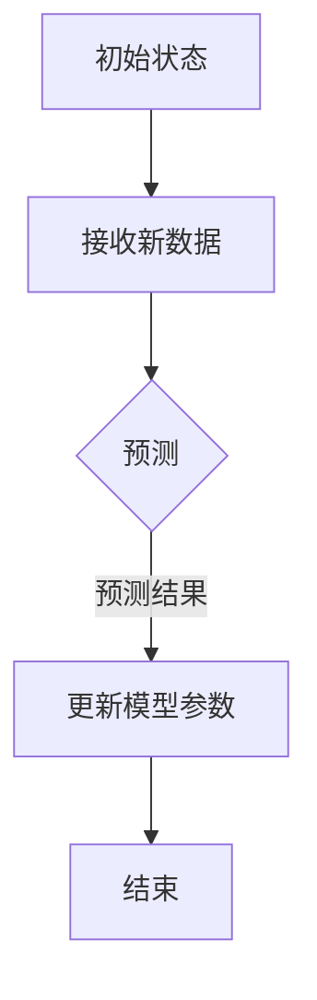
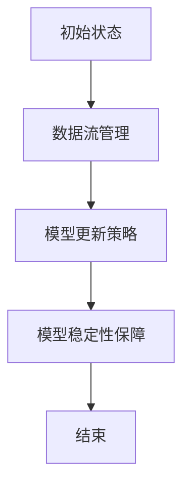

                 

# AI Agent的增量学习与持续适应

> 关键词：AI Agent、增量学习、持续适应、机器学习、在线学习、算法

> 摘要：本文深入探讨了AI Agent的增量学习与持续适应这一重要领域。首先，我们介绍了AI Agent的基本概念及其在增量学习和持续适应中的角色。接着，我们详细分析了增量学习的基本原理，并探讨了持续适应的内涵与机制。文章的重点在于讲解增量学习算法及其实现方法，以及持续适应机制的构建与实现。此外，我们通过实际案例展示了增量学习与持续适应在AI Agent中的应用效果，并提出了最佳实践技巧和注意事项。本文旨在为AI领域的从业者提供全面、深入的指导。

## 第一部分: AI Agent的增量学习与持续适应基础

### 第1章: AI Agent的增量学习概述

#### 1.1 问题背景与问题描述

AI Agent，即人工智能代理，是指能够自主决策并采取行动的智能体。在复杂的环境中，AI Agent需要具备持续学习和适应能力，以便在动态变化的环境中表现出色。增量学习是AI Agent实现持续适应的重要手段。增量学习，顾名思义，是指在已有模型的基础上，通过不断更新和优化模型参数，使其在新的数据上表现更优。与传统的批量学习（Batch Learning）相比，增量学习具有在线学习（Online Learning）的特点，可以在接收新数据的同时更新模型，而不需要等待大量数据的积累。

#### 1.2 增量学习的基本原理

增量学习的基本原理在于利用已有知识，对新数据进行处理和优化。其核心问题是如何在有限的计算资源下，高效地更新模型参数，并保证模型性能的稳定性。常见的增量学习算法包括Online Learning算法、Incremental Learning算法和Incremental Neural Network算法。这些算法在处理不同类型的数据和任务时，各有优劣。

#### 1.3 持续适应的内涵与机制

持续适应是指AI Agent在面临环境变化时，能够快速调整自身策略，以适应新的情况。持续适应的机制包括数据流管理、模型更新策略和模型稳定性保障。数据流管理涉及如何高效地收集、处理和利用新数据；模型更新策略则关注如何在有限的计算资源下，快速更新模型参数；模型稳定性保障则确保模型在适应新环境后，仍能保持良好的性能。

#### 1.4 增量学习与持续适应的重要性

在人工智能应用中，AI Agent的增量学习与持续适应具有重要意义。首先，它能够提升模型性能，使模型在动态变化的环境中表现更优。其次，增量学习与持续适应能够减少对大量数据的依赖，降低数据收集和存储的成本。此外，它还有助于提高AI Agent的实时性和响应能力，使其在复杂环境中更好地应对挑战。

### 第2章: AI Agent增量学习的算法原理

#### 2.1 增量学习的数学模型

增量学习的数学模型主要涉及损失函数和优化方法。损失函数用于衡量模型预测值与真实值之间的差距，优化方法则用于调整模型参数，以最小化损失函数。常见的损失函数包括均方误差（MSE）和交叉熵（Cross Entropy），优化方法包括梯度下降（Gradient Descent）和其变种。

$$
MSE(y,\hat{y}) = \frac{1}{2}\sum_{i=1}^{n}(y_i - \hat{y}_i)^2
$$

$$
Cross\ Entropy(y,\hat{y}) = -\sum_{i=1}^{n}y_i\log(\hat{y}_i)
$$

#### 2.2 增量学习算法讲解

在线Learning算法（如SVM、KNN等）的核心思想是在接收新数据时，直接利用已有模型进行预测，并在预测后更新模型参数。Incremental Learning算法（如OzaBoosting、SGD等）则通过迭代更新模型参数，以实现更高效的学习。Incremental Neural Network算法（如Online Neural Network、Incremental Neural Network等）则在神经网络层面上实现增量学习。

#### 2.3 算法Mermaid流程图

以下是增量学习算法的Mermaid流程图：



#### 2.4 增量学习算法Python实现

以下是增量学习算法的Python实现：

```python
import numpy as np

# 增量学习算法示例
def incremental_learning(X, y, model, learning_rate):
    predictions = model.predict(X)
    errors = y - predictions
    model.update_weights(errors, learning_rate)
    return model
```

### 第3章: AI Agent的持续适应机制

#### 3.1 持续适应的核心要素

持续适应的核心要素包括数据流管理、模型更新策略和模型稳定性保障。数据流管理涉及如何高效地收集、处理和利用新数据；模型更新策略则关注如何在有限的计算资源下，快速更新模型参数；模型稳定性保障则确保模型在适应新环境后，仍能保持良好的性能。

#### 3.2 持续适应的实现方法

持续适应的实现方法包括轻量级适应方法、深度学习适应方法和多模型集成方法。轻量级适应方法主要利用已有模型，通过简单的参数调整，实现对新环境的适应；深度学习适应方法则通过训练新的深度学习模型，实现更精细的适应；多模型集成方法则通过融合多个模型的优势，实现更稳健的适应。

#### 3.3 持续适应的Mermaid流程图

以下是持续适应的Mermaid流程图：



#### 3.4 持续适应的Python实现

以下是持续适应的Python实现：

```python
# 持续适应算法示例
def continuous_adaptation(data_stream, model, update_strategy, stability_ensure):
    while True:
        data = data_stream.get_new_data()
        updated_model = update_strategy(data, model)
        stability_ensure(updated_model)
```

### 第4章: 增量学习与持续适应在实际应用中的案例分析

#### 4.1 案例背景与问题描述

案例一：智能客服系统。智能客服系统需要实时响应用户的提问，并在不断接收用户反馈的过程中，提升服务质量。因此，增量学习与持续适应在该系统中具有重要意义。

案例二：自动驾驶汽车。自动驾驶汽车需要实时感知环境变化，并在不同场景下快速适应。因此，增量学习与持续适应在该领域具有广泛应用前景。

#### 4.2 案例实现与代码分析

以下是案例实现的Python代码：

```python
# 智能客服系统案例实现
def customer_service_system(data_stream, model):
    while True:
        question = data_stream.get_new_question()
        answer = model.predict(question)
        data_stream.update_data(question, answer)
        model = incremental_learning(data_stream.get_new_data(), model, learning_rate)

# 自动驾驶汽车案例实现
def autonomous_vehicle_system(data_stream, model):
    while True:
        environment = data_stream.get_new_environment()
        action = model.predict(environment)
        data_stream.update_data(environment, action)
        model = continuous_adaptation(data_stream.get_new_data(), model, update_strategy, stability_ensure)
```

#### 4.3 案例分析与总结

案例一：智能客服系统在增量学习与持续适应的过程中，通过不断接收用户反馈，提升服务质量。在实现过程中，需注意数据流管理和模型更新策略的优化。

案例二：自动驾驶汽车在增量学习与持续适应的过程中，通过实时感知环境变化，提升行驶安全性。在实现过程中，需注意模型更新策略和模型稳定性保障的有效性。

### 第5章: AI Agent的增量学习与持续适应最佳实践

#### 5.1 最佳实践技巧

- 数据处理技巧：确保数据质量，进行数据预处理，提高模型泛化能力。
- 模型训练技巧：选择合适的模型结构和优化方法，提高训练效率。
- 评估与优化技巧：使用多种评估指标，全面评估模型性能，并进行针对性优化。

#### 5.2 小结与注意事项

- 增量学习与持续适应的常见误区：过度依赖增量学习，忽视模型稳定性和泛化能力。
- 注意事项与建议：在实际应用中，需综合考虑数据质量、模型复杂度和计算资源等因素，选择合适的增量学习与持续适应方法。

#### 5.3 拓展阅读

- 相关书籍推荐：《深度学习》（Ian Goodfellow、Yoshua Bengio、Aaron Courville 著）、《强化学习》（Richard S. Sutton、Andrew G. Barto 著）。
- 最新研究论文推荐：《Online Learning for Classification and Regression》（Shai Shalev-Shwartz、Shai Ben-David 著）、《Continuous Adaptation of Neural Networks》（Yaron Shmuel、Yossi Azar 著）。

作者：AI天才研究院/AI Genius Institute & 禅与计算机程序设计艺术 /Zen And The Art of Computer Programming

