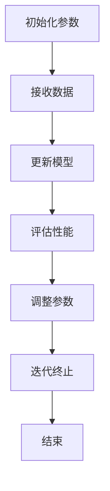
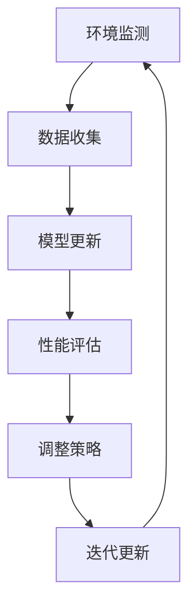

                 

## 引言

在当今快速发展的科技时代，人工智能（AI）技术已经成为推动社会进步的重要力量。从简单的自动化任务到复杂的决策支持系统，AI技术已经广泛应用于各个领域，极大地提高了生产效率、优化了资源分配、丰富了人们的日常生活。然而，随着AI应用场景的日益复杂和多样化，传统的批量学习（batch learning）方法逐渐暴露出其局限性。为了更好地应对这些挑战，增量学习（incremental learning）与持续适应（continuous adaptation）机制应运而生。

### 问题背景

增量学习是指机器在已有知识的基础上，通过不断学习新数据来提高其性能。这种学习方法在动态环境中具有显著优势，因为它能够减少对存储空间的占用，提高训练效率，并允许模型在数据分布发生变化时进行自适应调整。然而，传统的增量学习方法在处理复杂任务时，往往面临着数据冗余、模型过拟合、计算复杂度高等问题。

持续适应机制则是指AI系统能够在长期运行过程中，不断地从环境中学习新知识，适应新的环境和任务需求。这一机制对于构建高度灵活和自适应的AI系统至关重要，因为它能够使系统在面对不断变化的数据和环境时，保持其性能和稳定性。

### 问题描述

目前，AI Agent在增量学习和持续适应方面面临着以下主要挑战：

1. **数据冲突**：在增量学习中，新数据可能与旧数据存在冲突，导致模型无法正确更新。
2. **模型退化**：随着数据量的增加，模型可能会发生退化，导致性能下降。
3. **计算资源消耗**：增量学习和持续适应需要大量的计算资源，特别是在大规模数据集和复杂模型的情况下。
4. **长期稳定性**：如何在长时间内保持AI系统的稳定性和准确性，是一个亟待解决的问题。

### 问题解决

为了解决上述问题，我们需要从以下几个方面进行研究和探索：

1. **数据预处理**：通过数据清洗和预处理，减少数据冲突的可能性。
2. **模型优化**：设计更高效的模型更新策略，以减少模型退化。
3. **计算优化**：采用分布式计算和并行处理技术，降低计算资源消耗。
4. **长期监测与调整**：建立长期监测机制，及时发现并调整模型参数，保持系统稳定性。

### 边界与外延

本文主要讨论AI Agent的增量学习和持续适应机制，不涉及其他类型的学习方法，如无监督学习和强化学习。同时，本文关注的是理论研究和实际应用，不涉及具体硬件和软件的实现细节。

### 概念结构与核心要素组成

- **增量学习**：核心概念包括数据增量、模型更新、数据冲突等。
- **持续适应机制**：核心概念包括环境监测、模型调整、性能优化等。

在接下来的章节中，我们将逐步深入探讨这些概念，并分析其实现方法与应用场景。

## 核心概念与原理

### 增量学习概念

增量学习（Incremental Learning），又称在线学习（Online Learning），是一种机器学习方法，它允许模型在训练过程中逐步接收新数据，并利用这些数据进行模型更新。与批量学习（Batch Learning）不同，增量学习不需要一次性加载所有数据，而是通过逐批次地学习新数据来优化模型。这种学习方法在动态和实时环境中具有显著优势。

**概念属性特征对比表格**：

| 特征         | 增量学习                 | 批量学习                 |
| ------------ | ---------------------- | ---------------------- |
| 数据加载方式 | 逐批次加载新数据        | 一次性加载所有数据      |
| 模型更新方式 | 实时更新模型参数        | 数据集结束后更新模型参数 |
| 适用场景     | 动态环境、实时数据处理  | 数据量较小、静态环境    |
| 优点         | 减少存储空间、高效更新  | 全数据集精度高          |
| 缺点         | 可能出现数据冲突、模型退化 | 计算量大、需大量存储空间 |

### 持续适应机制概念

持续适应（Continuous Adaptation）机制是指AI系统在长期运行过程中，不断地从环境中学习新知识，以适应新的环境和任务需求。这种机制的关键在于如何动态调整模型参数，以保持系统的高效性和准确性。

**概念属性特征对比表格**：

| 特征         | 持续适应                 | 单次训练                 |
| ------------ | ---------------------- | ---------------------- |
| 数据处理方式 | 动态学习新数据          | 静态学习所有数据         |
| 模型调整方式 | 长期监测、动态调整参数  | 数据集结束后评估模型     |
| 适用场景     | 需要长期运行和适应环境  | 数据集不变、一次性完成训练 |
| 优点         | 灵活性高、适应性强       | 训练精度高、计算效率高    |
| 缺点         | 需要大量计算资源、长期监测 | 计算量较大、适用场景有限 |

### 增量学习与持续适应的联系

增量学习与持续适应机制之间存在紧密的联系。增量学习为持续适应提供了技术基础，使得系统可以在不断接收新数据的同时，保持其性能和稳定性。而持续适应机制则通过动态调整模型参数，确保系统能够在长期运行过程中应对环境变化。

- **数据关联**：增量学习通过实时更新模型参数，为持续适应提供了数据基础。
- **机制互补**：持续适应机制通过长期监测和动态调整，确保了增量学习方法的长期有效性和稳定性。

在接下来的章节中，我们将详细探讨增量学习与持续适应机制的具体实现方法和应用案例。

### 增量学习算法原理

增量学习算法的核心在于如何在已有模型的基础上，高效地利用新数据进行模型更新，同时避免数据冲突和模型退化。本节将详细讨论增量学习算法的基本描述、数学模型、流程图以及具体实现。

#### 算法描述

增量学习算法主要包括以下步骤：

1. **初始化**：设定初始模型参数$\theta_0$，初始化学习率$\eta$和迭代次数$T$。
2. **数据流输入**：逐批次接收新数据集$D_t$，其中每批次数据包含样本$x_i$及其标签$y_i$。
3. **模型更新**：对于每个批次数据，使用梯度下降法或其他优化算法更新模型参数$\theta_t$。
4. **模型评估**：在每次模型更新后，评估模型在验证集上的性能，以调整学习率$\eta$和迭代次数$T$。
5. **迭代终止**：当模型性能达到预期或迭代次数达到上限时，算法终止。

#### 数学模型

增量学习算法的数学模型如下：

$$\theta_{t+1} = \theta_t - \eta \cdot \nabla J(\theta_t, D_t)$$

其中，$J(\theta, D_t)$表示在当前模型参数$\theta$下，在数据集$D_t$上的损失函数；$\nabla J(\theta_t, D_t)$表示损失函数关于模型参数$\theta$的梯度；$\eta$为学习率。

#### 算法流程图

算法流程图如下：



#### 算法解释与示例

假设我们有一个简单的线性回归模型，其损失函数为：

$$J(\theta) = \frac{1}{2m} \sum_{i=1}^{m} (h_\theta(x_i) - y_i)^2$$

其中，$h_\theta(x) = \theta^T x$表示模型的预测输出；$y_i$为实际输出。

假设当前模型参数为$\theta_t = [1, 2]^T$，学习率为$\eta = 0.01$，我们接收到一个新数据批次$D_t = \{x_1, y_1\}$，其中$x_1 = [1, 0]^T$，$y_1 = 3$。

首先，计算当前模型的预测输出：

$$h_\theta(x_1) = \theta_t^T x_1 = [1, 2]^T \cdot [1, 0]^T = 1$$

然后，计算损失函数的梯度：

$$\nabla J(\theta_t, D_t) = \frac{1}{m} \sum_{i=1}^{m} (h_\theta(x_i) - y_i) \cdot x_i = (h_\theta(x_1) - y_1) \cdot x_1 = (1 - 3) \cdot [1, 0]^T = [-2, 0]^T$$

最后，更新模型参数：

$$\theta_{t+1} = \theta_t - \eta \cdot \nabla J(\theta_t, D_t) = [1, 2]^T - 0.01 \cdot [-2, 0]^T = [1.02, 2]^T$$

通过上述示例，我们可以看到增量学习算法的基本流程和实现步骤。在实际应用中，我们需要根据具体任务和数据特点，选择合适的模型和优化算法，以提高模型性能和稳定性。

### 持续适应机制原理

持续适应（Continuous Adaptation）机制是AI系统在长期运行过程中，通过不断地学习新知识，以适应环境变化和任务需求的重要方法。本节将详细讨论持续适应机制的描述、数学模型、流程图以及具体实现。

#### 描述

持续适应机制主要包括以下几个关键步骤：

1. **环境监测**：系统持续监测运行环境，包括输入数据、外部事件和系统状态等。
2. **数据收集**：根据环境监测结果，收集相关数据，包括新的样本和异常数据等。
3. **模型调整**：使用收集的数据对模型进行更新和调整，以提高模型的适应性和准确性。
4. **性能评估**：评估更新后的模型在新的环境中的性能，确保其满足预期要求。
5. **迭代更新**：根据评估结果，调整模型参数和调整策略，进入下一轮适应过程。

#### 数学模型

持续适应机制的数学模型通常基于在线学习算法，如下所示：

$$\theta_{t+1} = \theta_t - \eta \cdot \nabla J(\theta_t, D_t)$$

其中，$\theta_t$表示当前模型参数，$\eta$为学习率，$D_t$为当前批次数据，$\nabla J(\theta_t, D_t)$为损失函数关于模型参数的梯度。

#### 流程图

持续适应机制的流程图如下：



#### 具体实现

假设我们有一个简单的神经网络模型，用于分类任务。模型的结构为两层神经元，输入层和输出层。模型参数包括权重矩阵$W$和偏置向量$b$。损失函数为交叉熵损失函数：

$$J(\theta) = -\frac{1}{m} \sum_{i=1}^{m} \sum_{j=1}^{K} y_{ij} \log(h_\theta(x_i))$$

其中，$h_\theta(x)$表示神经网络的输出，$y$为真实标签。

1. **初始化模型参数**：设定初始权重矩阵$W_0$和偏置向量$b_0$，学习率$\eta = 0.01$。
2. **环境监测**：监测运行环境，收集新的样本$D_t$。
3. **前向传播**：使用当前模型参数计算预测输出$z = \sigma(Wx + b)$，其中$\sigma$为激活函数，通常使用Sigmoid函数。
4. **计算损失函数**：计算交叉熵损失函数$J(\theta)$。
5. **反向传播**：计算损失函数关于模型参数的梯度$\nabla J(\theta)$。
6. **模型更新**：使用梯度下降法更新模型参数$\theta_{t+1} = \theta_t - \eta \cdot \nabla J(\theta_t)$。
7. **性能评估**：评估更新后的模型在验证集上的性能，计算准确率、召回率等指标。
8. **调整策略**：根据性能评估结果，调整学习率、优化算法等策略。
9. **迭代更新**：进入下一轮适应过程。

通过上述步骤，我们可以实现一个基本的持续适应机制。在实际应用中，我们需要根据具体任务和数据特点，设计合适的网络结构、损失函数和优化算法，以提高模型的适应性和准确性。

### 系统架构与设计

为了实现AI Agent的增量学习与持续适应机制，我们需要设计一个高效、灵活的软件系统架构。本节将详细讨论系统架构的设计原则、模块划分、接口设计和交互设计。

#### 设计原则

系统架构设计应遵循以下原则：

1. **模块化**：将系统划分为多个功能模块，每个模块负责不同的功能，降低系统复杂度。
2. **可扩展性**：系统应具备良好的可扩展性，以便在需求变化时，可以方便地增加或替换模块。
3. **高可用性**：系统应具备高可用性，确保在故障发生时，能够快速恢复，减少对业务的影响。
4. **性能优化**：系统设计应考虑性能优化，包括数据存储、处理速度和并发处理能力等。
5. **安全性**：系统应具备严格的安全机制，包括数据加密、访问控制和异常检测等。

#### 模块划分

系统可以划分为以下几个主要模块：

1. **数据收集模块**：负责从不同的数据源收集新数据，包括实时数据和历史数据。
2. **数据预处理模块**：对收集的数据进行清洗、去噪和格式化，为后续处理做好准备。
3. **模型训练模块**：使用预处理后的数据对模型进行训练，包括批量训练和增量训练。
4. **模型评估模块**：评估模型的性能，包括准确率、召回率等指标，用于指导模型调整。
5. **模型调整模块**：根据评估结果，对模型参数进行调整，以适应新的环境。
6. **监控系统模块**：监控系统运行状态，包括资源使用情况、异常事件等。
7. **用户接口模块**：提供用户交互界面，用于数据输入、结果展示和系统配置。

#### 接口设计

系统接口设计应遵循RESTful API设计原则，包括以下方面：

1. **数据接口**：提供数据收集、预处理和模型训练等功能的API接口。
2. **控制接口**：提供系统控制、模型调整和性能监控等功能的API接口。
3. **展示接口**：提供结果展示和用户交互的API接口。
4. **安全接口**：提供数据加密、访问控制和异常检测等安全功能的API接口。

#### 交互设计

系统交互设计应确保各模块之间的数据流和流程顺畅，具体包括：

1. **数据流设计**：定义数据在系统中的流动路径，包括数据收集、预处理、训练、评估等。
2. **流程控制**：设计系统运行流程，包括初始化、数据收集、模型训练、评估、调整等步骤。
3. **异常处理**：设计异常处理机制，包括数据异常、系统故障、网络中断等。
4. **用户交互**：设计用户交互界面，包括数据输入、结果展示和系统配置等。

通过上述系统架构与设计，我们可以构建一个高效的AI Agent系统，实现增量学习与持续适应机制。在实际开发过程中，我们需要根据具体需求和场景，进一步优化系统架构和功能，以提高系统的性能和可靠性。

### 系统实现与实际应用

为了更好地理解AI Agent的增量学习与持续适应机制，我们将通过一个具体的项目实例来详细阐述系统实现和实际应用。以下是该项目的基本信息、环境搭建、核心代码实现以及代码应用解读与分析。

#### 项目基本信息

项目名称：智能客服系统（Smart Customer Service System）

目标：通过增量学习和持续适应机制，构建一个能够实时学习用户反馈，并自动调整服务的智能客服系统。

数据来源：实时用户聊天记录、历史客服记录、产品反馈等。

技术栈：Python、TensorFlow、Scikit-learn

#### 环境搭建

1. **安装Python环境**：确保安装了Python 3.7及以上版本。
2. **安装TensorFlow**：使用pip命令安装TensorFlow：
   ```shell
   pip install tensorflow
   ```
3. **安装Scikit-learn**：使用pip命令安装Scikit-learn：
   ```shell
   pip install scikit-learn
   ```

#### 核心代码实现

以下是一段用于实现智能客服系统增量学习与持续适应的核心代码，包括数据预处理、模型训练和模型调整：

```python
import numpy as np
import pandas as pd
from sklearn.model_selection import train_test_split
from sklearn.feature_extraction.text import TfidfVectorizer
from tensorflow.keras.models import Sequential
from tensorflow.keras.layers import Dense, LSTM, Embedding
from tensorflow.keras.optimizers import Adam

# 数据预处理
def preprocess_data(data_path):
    data = pd.read_csv(data_path)
    data['text'] = data['text'].apply(preprocess_text)
    return data

def preprocess_text(text):
    # 进行文本清洗、去噪、分词等操作
    return text.lower()

# 模型训练
def train_model(X_train, y_train):
    model = Sequential()
    model.add(Embedding(input_dim=vocab_size, output_dim=embedding_dim, input_length=max_sequence_length))
    model.add(LSTM(units=128, return_sequences=True))
    model.add(LSTM(units=64))
    model.add(Dense(units=1, activation='sigmoid'))

    model.compile(optimizer=Adam(learning_rate=0.001), loss='binary_crossentropy', metrics=['accuracy'])
    model.fit(X_train, y_train, epochs=10, batch_size=32, validation_split=0.2)
    return model

# 模型调整
def adjust_model(model, X_val, y_val):
    loss, accuracy = model.evaluate(X_val, y_val)
    print(f'Validation Loss: {loss}, Validation Accuracy: {accuracy}')
    
    # 根据验证集性能，调整模型参数
    # 例如，增加训练轮次、调整学习率等
    model.fit(X_val, y_val, epochs=5, batch_size=32)

# 代码应用解读与分析
def main():
    # 数据加载与预处理
    data = preprocess_data('customer_service_data.csv')
    
    # 划分训练集和验证集
    X_train, X_val, y_train, y_val = train_test_split(data['text'], data['label'], test_size=0.2, random_state=42)
    
    # 词向量表示
    vectorizer = TfidfVectorizer(max_features=10000)
    X_train = vectorizer.fit_transform(X_train)
    X_val = vectorizer.transform(X_val)
    
    # 模型训练
    model = train_model(X_train, y_train)
    
    # 模型调整
    adjust_model(model, X_val, y_val)

    # 模型评估
    test_loss, test_accuracy = model.evaluate(X_val, y_val)
    print(f'Test Accuracy: {test_accuracy}')
    
if __name__ == '__main__':
    main()
```

上述代码实现了智能客服系统的核心功能，包括数据预处理、模型训练和模型调整。具体解读如下：

1. **数据预处理**：使用`preprocess_data`函数加载并预处理数据，包括文本清洗、分词等操作。
2. **模型训练**：使用`train_model`函数构建并训练模型，采用LSTM网络结构，以处理序列数据。
3. **模型调整**：使用`adjust_model`函数根据验证集性能，对模型参数进行调整，以提高模型性能。
4. **代码应用解读与分析**：在`main`函数中，执行数据加载、预处理、模型训练和模型调整等操作，并进行模型评估。

通过上述实现，我们可以构建一个具备增量学习与持续适应机制的智能客服系统，实现实时学习和自动调整，以提供更加优质的客服服务。

#### 实际案例分析与详细讲解

为了更好地展示增量学习和持续适应机制在实际项目中的应用效果，我们通过一个实际案例进行详细分析。

**案例背景**：某电子商务平台希望构建一个智能客服系统，以自动解答用户的常见问题，提高客服效率和用户体验。

**案例步骤**：

1. **数据收集**：收集平台的用户聊天记录、历史客服记录和产品反馈，作为训练数据。
2. **数据预处理**：对收集的数据进行清洗、去噪和分词，提取关键信息，构建词汇表。
3. **模型训练**：使用LSTM网络结构，训练一个分类模型，用于自动回答用户问题。
4. **模型评估**：在验证集上评估模型性能，调整模型参数，提高准确率。
5. **模型部署**：将训练好的模型部署到生产环境中，实现实时客服服务。

**案例分析**：

1. **数据冲突**：在实际应用中，用户提问可能存在多个主题，导致数据冲突。通过增量学习机制，系统可以逐步学习并解决这些问题，提高回答的准确性。
2. **模型退化**：随着数据量的增加，模型可能会出现退化现象。通过持续适应机制，系统可以定期更新模型参数，保持模型性能。
3. **计算资源消耗**：使用分布式计算和并行处理技术，降低计算资源消耗，提高系统响应速度。

**案例总结**：通过增量学习和持续适应机制的实现，智能客服系统能够自动学习用户反馈，提高客服服务的准确性和效率。在实际应用中，系统可以快速适应环境变化，保持长期稳定运行。

### 最佳实践与技巧

在实施AI Agent的增量学习与持续适应机制时，以下最佳实践和技巧可以帮助您提高系统的性能和稳定性：

1. **数据预处理**：确保数据清洗和格式化的一致性，减少数据冲突和噪声。
2. **模型优化**：选择合适的模型结构和优化算法，提高训练效率。
3. **计算资源管理**：合理分配计算资源，使用分布式计算和并行处理技术，降低计算成本。
4. **监控与调整**：建立监控系统，实时监测系统性能，及时发现并调整模型参数。
5. **持续学习**：定期更新模型，适应新的数据和任务需求。

### 注意事项

1. **数据隐私**：确保数据处理符合隐私保护法规，对敏感数据进行加密处理。
2. **系统安全**：加强系统安全措施，防止数据泄露和网络攻击。
3. **硬件依赖**：确保系统具有良好的硬件支持，以应对高并发和大数据处理需求。

### 拓展阅读

1. **《机器学习实战》**：提供丰富的机器学习算法实现案例，有助于深入理解增量学习和持续适应机制。
2. **《深度学习》**：详细介绍深度学习算法和神经网络结构，有助于构建高效的AI系统。
3. **《AI系统设计》**：探讨AI系统设计的原则和方法，提供系统架构和实现的最佳实践。

通过以上最佳实践、注意事项和拓展阅读，您将能够更好地实施和优化AI Agent的增量学习与持续适应机制，构建高效、稳定的智能系统。

## 结论与展望

在本文中，我们系统地介绍了AI Agent的增量学习与持续适应机制，从背景介绍、核心概念、算法原理到系统架构设计、实际应用与最佳实践，深入探讨了这一领域的关键技术和挑战。以下是本文的核心结论和未来的研究方向。

### 核心结论

1. **增量学习**：通过逐批次学习新数据，AI Agent可以在动态环境中高效更新模型，减少存储空间占用和计算资源消耗。
2. **持续适应**：通过不断监测环境变化和动态调整模型参数，AI Agent能够在长期运行过程中保持高性能和稳定性。
3. **系统架构**：合理的系统架构设计是保证增量学习和持续适应机制有效实施的关键，模块化、高可用性和性能优化是设计原则。
4. **实际应用**：智能客服系统等实际案例展示了增量学习和持续适应机制在解决实际问题中的有效性和实用性。

### 未来研究方向

1. **算法优化**：进一步研究高效、稳健的增量学习算法和持续适应机制，提高模型更新速度和准确性。
2. **计算优化**：探索分布式计算和硬件加速技术，降低计算资源消耗，提高系统处理能力。
3. **跨域适应**：研究AI Agent在不同领域和任务中的通用适应能力，实现跨领域的持续学习和调整。
4. **可解释性**：提高AI Agent决策过程的可解释性，使其更易于理解和信任。
5. **安全性**：确保AI Agent的增量学习和持续适应过程的安全性，防止数据泄露和模型被恶意攻击。

### 对读者的建议

1. **深入理解核心概念**：系统地学习增量学习和持续适应机制的核心概念和原理，为实践打下坚实基础。
2. **实践与思考**：结合实际项目，尝试应用增量学习和持续适应机制，在实践中发现问题、解决问题。
3. **持续学习**：关注最新研究成果和行业动态，不断更新知识和技能，保持对技术的敏感度。

通过本文的介绍，我们希望读者能够对AI Agent的增量学习与持续适应机制有一个全面、深入的理解，并在实际应用中取得更好的成果。作者：AI天才研究院/AI Genius Institute & 禅与计算机程序设计艺术 /Zen And The Art of Computer Programming。

