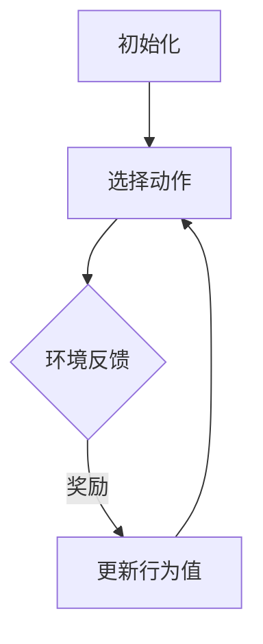
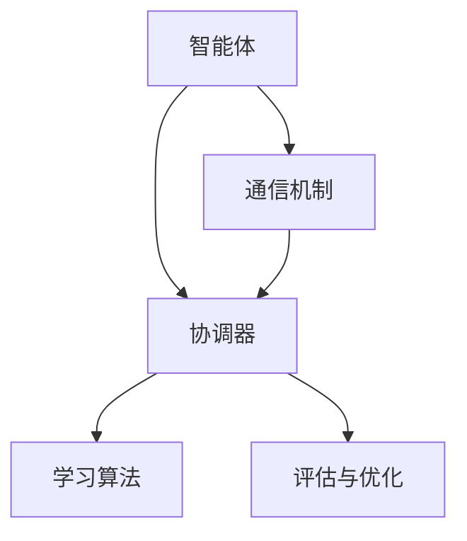
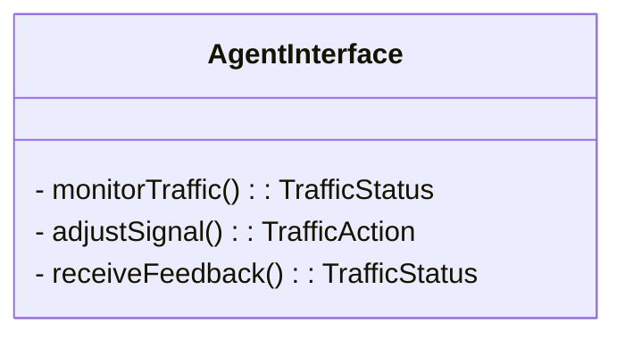
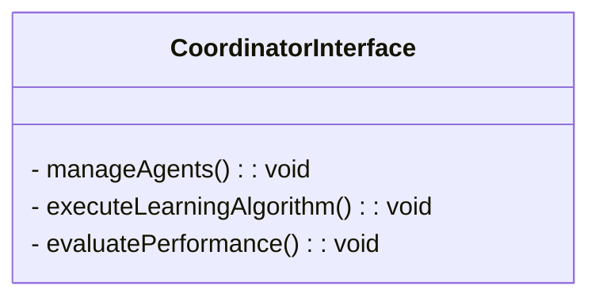
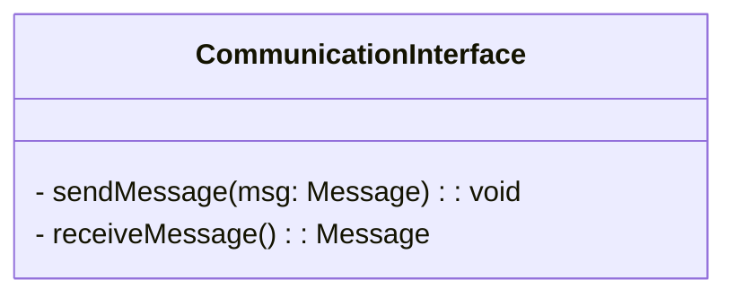
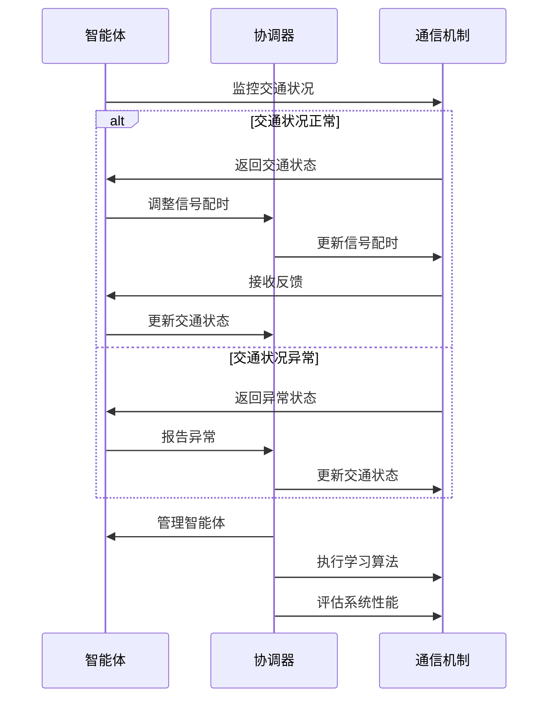

                 

### 第一部分：背景介绍

#### 1.1. AI Agent的多Agent协作学习系统概述

##### 1.1.1. 问题背景

在当今的智能计算领域中，单个智能体（AI Agent）的能力虽然日益强大，但往往面临局部优化、环境适应性和复杂任务处理等方面的挑战。多Agent系统（Multi-Agent System，MAS）则通过多个智能体的协作，实现更加复杂的任务和更高层次的智能。在这样的背景下，研究AI Agent的多Agent协作学习系统具有重要意义。

**问题描述**

AI Agent的多Agent协作学习系统旨在解决以下问题：

- **如何通过多个智能体的交互和协作，实现共同的学习目标和优化结果？**
- **如何设计有效的学习算法，使得各个智能体能够在复杂环境中协同工作，并不断提高自身的性能？**
- **如何确保系统中的智能体之间能够建立有效的通信机制，实现信息共享和协同决策？**

**问题解决**

针对上述问题，多Agent协作学习系统通过以下几个步骤来实现：

- **定义智能体：** 首先明确系统中的智能体及其属性、能力和行为模型。
- **建立交互机制：** 设计智能体之间的通信和协作机制，包括信息共享、决策协调和任务分配。
- **学习算法设计：** 开发基于多Agent的协作学习算法，以实现智能体的自主学习和性能提升。
- **系统评估与优化：** 对多Agent协作学习系统进行性能评估，并根据评估结果进行优化和调整。

**边界与外延**

多Agent协作学习系统的研究不仅涉及计算机科学和人工智能领域，还与以下领域密切相关：

- **分布式计算：** 多Agent系统中的智能体通常运行在分布式计算环境中，因此分布式计算的相关理论和方法对其设计具有重要影响。
- **认知科学：** 多Agent系统的协作和学习过程与人类社会的协作和学习有相似之处，因此认知科学的相关理论可以为其提供有益的启示。
- **复杂系统：** 多Agent系统通常表现出复杂的动态行为，因此复杂系统理论的研究对其理解和优化具有重要意义。

**概念结构与核心要素组成**

多Agent协作学习系统的核心概念和要素主要包括：

- **智能体（Agent）：** 系统中的基本单位，具有感知、决策和执行能力。
- **交互机制：** 智能体之间进行信息交换和协同工作的机制。
- **学习算法：** 智能体通过学习和适应环境来提高自身性能的方法。
- **评估与优化：** 对多Agent系统的性能进行评估和优化，以提高系统的整体性能。

##### 1.1.2. 核心概念与联系

在本节中，我们将介绍与多Agent协作学习系统相关的一些核心概念，并探讨它们之间的联系。

**智能体**

智能体是多Agent系统中的基本单元，通常具有以下属性：

- **感知：** 智能体能够感知环境中的信息和状态。
- **决策：** 智能体基于感知到的信息，生成决策。
- **执行：** 智能体根据决策执行相应的动作。

智能体可以是基于规则的系统，也可以是具有学习能力的算法。在多Agent协作学习系统中，智能体的协作和交互是实现系统目标的关键。

**交互机制**

交互机制是多Agent系统中智能体之间进行信息交换和协同工作的方法。常见的交互机制包括：

- **直接通信：** 智能体之间直接交换信息，如消息传递。
- **间接通信：** 智能体通过共享的环境或代理来传递信息。
- **协调机制：** 智能体之间通过协商和协调来达成共识，如决策协商、任务分配等。

**学习算法**

学习算法是多Agent协作学习系统的核心，它使得智能体能够通过学习和适应环境来提高自身性能。常见的学习算法包括：

- **基于规则的算法：** 智能体根据预设的规则进行学习和决策。
- **基于模型的算法：** 智能体通过构建环境模型来进行学习和决策。
- **强化学习算法：** 智能体通过试错和反馈来学习最优策略。

**评估与优化**

评估与优化是多Agent协作学习系统的关键环节。通过评估系统的性能，可以发现系统中存在的问题，并进行优化和调整。常见的评估指标包括：

- **效率：** 系统完成任务的效率和速度。
- **鲁棒性：** 系统在面对不确定性和故障时的适应能力。
- **协作效果：** 智能体之间的协作程度和协同效率。

**ER实体关系图架构**

为了更好地理解多Agent协作学习系统的核心概念和联系，我们可以使用ER（Entity-Relationship）实体关系图来表示。ER图能够清晰地展示系统中的实体、属性和关系。

在多Agent协作学习系统中，主要的实体包括：

- **智能体（Agent）**
- **交互机制**
- **学习算法**
- **评估与优化**

以下是多Agent协作学习系统的ER实体关系图：

```mermaid
erDiagram
  Class1 ||--|{ Class2 } Class3
  Class1 ||--|{ Class4 } Class5
```

在上面的ER图中，`Class1` 代表智能体，`Class2` 代表交互机制，`Class3` 代表学习算法，`Class4` 代表评估与优化，`Class5` 代表环境。箭头表示实体之间的关系，例如智能体与交互机制之间存在依赖关系。

通过ER图，我们可以更直观地理解多Agent协作学习系统的概念结构和核心要素之间的联系，为进一步分析和设计系统提供了理论基础。

### 第一部分：背景介绍

#### 1.2. AI Agent的多Agent协作学习系统概述

##### 1.2.1. 多Agent协作学习系统的发展历程

多Agent协作学习系统的发展历程可以追溯到20世纪80年代。当时，研究者们开始关注如何在分布式环境中利用多个智能体的协作来实现复杂任务。以下是一些关键的发展阶段：

- **1980年代初：** 研究者提出多Agent系统的概念，并探讨智能体之间的协作和通信机制。此时，多Agent系统主要应用于简单的模拟环境和游戏场景。
- **1985年：** Hans Moravec在论文《Robot Architecture for Large-Scale Spatial Operations》中首次提出“多智能体系统”的概念，并描述了一种基于协同工作的机器人系统。
- **1990年代：** 随着分布式计算和通信技术的发展，多Agent系统在工业自动化、智能交通、智能家居等领域得到广泛应用。研究者开始关注如何设计高效的协作学习算法，以实现智能体之间的协同优化。
- **2000年代初：** 随着强化学习、深度学习和分布式计算等技术的进步，多Agent协作学习系统在复杂环境中的应用范围进一步扩大。研究者开始关注如何在动态、不确定和具有竞争性的环境中实现智能体的协作学习。
- **2010年代至今：** 随着人工智能技术的快速发展，多Agent协作学习系统在自动驾驶、智能电网、虚拟助手等领域得到广泛应用。研究者们继续探索如何设计更高效、鲁棒和智能的多Agent协作学习系统。

##### 1.2.2. 多Agent协作学习系统的分类

根据协作方式和学习机制的不同，多Agent协作学习系统可以分为以下几类：

- **基于规则的多Agent协作学习系统：** 这种系统通过预设的规则来指导智能体的协作和学习。智能体根据规则进行决策和行动，并通过不断调整规则来优化系统性能。这种系统的优点是结构简单，易于实现，但可能难以适应动态和复杂环境。
- **基于模型的多Agent协作学习系统：** 这种系统通过构建环境模型来指导智能体的协作和学习。智能体通过学习模型来预测环境变化，并调整自身行为以实现协同优化。这种系统的优点是能够更好地适应动态环境，但可能需要较大的计算资源和时间。
- **基于强化学习（Reinforcement Learning）的多Agent协作学习系统：** 这种系统通过试错和反馈来指导智能体的协作和学习。智能体在环境中交互，并根据奖励信号调整自身行为，以实现协同优化。这种系统的优点是能够自适应地调整行为，适用于动态和复杂环境，但可能存在收敛速度慢和策略不稳定等问题。
- **基于深度学习（Deep Learning）的多Agent协作学习系统：** 这种系统通过深度神经网络来指导智能体的协作和学习。智能体通过学习深度神经网络模型来预测环境变化，并调整自身行为以实现协同优化。这种系统的优点是能够处理高维度和复杂的任务，但可能需要较大的计算资源和时间。

##### 1.2.3. 多Agent协作学习系统的应用领域

多Agent协作学习系统在多个领域具有广泛的应用前景：

- **智能交通系统：** 利用多Agent协作学习系统，可以实现智能交通信号控制、车辆路径规划和车队调度等功能，提高交通系统的效率和安全性。
- **智能电网：** 利用多Agent协作学习系统，可以实现智能电网的实时监测、故障诊断和能源优化等功能，提高电力系统的可靠性和效率。
- **智能制造：** 利用多Agent协作学习系统，可以实现制造过程中设备的协同工作、质量控制和生产调度等功能，提高生产效率和产品质量。
- **智能农业：** 利用多Agent协作学习系统，可以实现农田监测、作物生长优化和病虫害防治等功能，提高农业生产的效率和效益。
- **智能医疗：** 利用多Agent协作学习系统，可以实现医疗诊断、疾病预测和个性化治疗等功能，提高医疗服务的质量和效率。

### 总结

多Agent协作学习系统是一种重要的智能计算方法，通过多个智能体的协作和交互，实现复杂任务的高效解决。随着人工智能技术的不断发展，多Agent协作学习系统在多个领域展现出巨大的应用潜力。本文简要介绍了多Agent协作学习系统的发展历程、分类和应用领域，为进一步研究和应用该系统提供了理论基础和实践指导。

### 第二部分：核心概念与联系

#### 2.1. 智能体（Agent）

智能体（Agent）是多Agent系统中的基本单元，它具有自主性、社会性和反应性等特征。一个智能体通常由感知器、控制器和执行器组成。感知器负责接收外部信息，控制器根据感知到的信息生成决策，执行器根据决策执行相应的动作。

**属性特征对比表格**

| 特征 | 感知器 | 控制器 | 执行器 |
| ---- | ---- | ---- | ---- |
| 功能 | 接收外部信息 | 生成决策 | 执行动作 |
| 数据类型 | 环境状态 | 决策指令 | 动作结果 |
| 对应模型 | 传感器模型 | 决策模型 | 执行模型 |

在多Agent协作学习系统中，智能体的自主性体现在它们能够根据环境变化自主调整自身行为；社会性体现在它们能够与其他智能体进行交互和协作；反应性体现在它们能够实时响应环境变化。

**ER实体关系图架构**

在多Agent协作学习系统的ER实体关系图中，智能体作为核心实体，与感知器、控制器和执行器之间存在关联关系。

```mermaid
erDiagram
  Agent ||--|{ Perceptor } Controller
  Agent ||--|{ Executor } Controller
  Perceptor ||--|{ Controller } Executor
```

在上面的ER图中，`Agent` 代表智能体，`Perceptor` 代表感知器，`Controller` 代表控制器，`Executor` 代表执行器。箭头表示实体之间的依赖关系。

#### 2.2. 交互机制

交互机制是多Agent系统中智能体之间进行信息交换和协同工作的方法。交互机制的设计直接影响系统的性能和效率。以下是几种常见的交互机制：

- **直接通信：** 智能体之间直接交换信息，如消息传递。这种机制简单直接，但可能导致通信复杂度和通信成本增加。
- **间接通信：** 智能体通过共享的环境或代理来传递信息。这种机制可以减少直接通信的复杂度，但可能导致系统响应时间增加。
- **协调机制：** 智能体之间通过协商和协调来达成共识，如决策协商、任务分配等。这种机制可以优化系统资源利用和任务分配，但可能导致协调过程复杂。

**属性特征对比表格**

| 特征 | 直接通信 | 间接通信 | 协调机制 |
| ---- | ---- | ---- | ---- |
| 通信方式 | 直接消息传递 | 间接消息传递 | 协商和协调 |
| 通信复杂度 | 较低 | 较高 | 较高 |
| 响应时间 | 较快 | 较慢 | 较慢 |
| 系统资源 | 较节省 | 较节省 | 较节省 |

**ER实体关系图架构**

在多Agent协作学习系统的ER实体关系图中，交互机制作为中介实体，连接智能体和其他相关实体。

```mermaid
erDiagram
  Agent ||--|{ CommunicationMechanism } Coordinator
  CommunicationMechanism ||--|{ Environment } Coordinator
  Coordinator ||--|{ Executor } Environment
```

在上面的ER图中，`Agent` 代表智能体，`CommunicationMechanism` 代表交互机制，`Coordinator` 代表协调器，`Environment` 代表环境。箭头表示实体之间的依赖关系。

#### 2.3. 学习算法

学习算法是多Agent协作学习系统的核心，它使得智能体能够通过学习和适应环境来提高自身性能。学习算法可以分为基于规则、基于模型和基于强化学习三类。

- **基于规则的学习算法：** 智能体根据预设的规则进行学习和决策。这种算法简单易实现，但可能难以适应动态和复杂环境。
- **基于模型的学习算法：** 智能体通过构建环境模型来进行学习和决策。这种算法能够更好地适应动态环境，但可能需要较大的计算资源和时间。
- **基于强化学习的学习算法：** 智能体通过试错和反馈来学习最优策略。这种算法能够自适应地调整行为，适用于动态和复杂环境，但可能存在收敛速度慢和策略不稳定等问题。

**属性特征对比表格**

| 特征 | 基于规则 | 基于模型 | 基于强化学习 |
| ---- | ---- | ---- | ---- |
| 学习方式 | 预设规则 | 构建模型 | 试错和反馈 |
| 适应能力 | 较低 | 较高 | 最高 |
| 计算复杂度 | 较低 | 较高 | 最高 |
| 策略稳定性 | 较稳定 | 不稳定 | 不稳定 |

**ER实体关系图架构**

在多Agent协作学习系统的ER实体关系图中，学习算法作为核心实体，与智能体、交互机制和评估与优化之间存在关联关系。

```mermaid
erDiagram
  LearningAlgorithm ||--|{ Agent } Coordinator
  LearningAlgorithm ||--|{ CommunicationMechanism } Environment
  LearningAlgorithm ||--|{ EvaluationAndOptimization } Executor
```

在上面的ER图中，`LearningAlgorithm` 代表学习算法，`Agent` 代表智能体，`CommunicationMechanism` 代表交互机制，`Environment` 代表环境，`Executor` 代表执行器，`EvaluationAndOptimization` 代表评估与优化。箭头表示实体之间的依赖关系。

#### 2.4. 评估与优化

评估与优化是多Agent协作学习系统的关键环节。通过对系统性能的评估，可以及时发现存在的问题，并进行优化和调整。常见的评估指标包括效率、鲁棒性和协作效果等。

- **效率：** 系统完成任务的效率和速度。高效率意味着系统能够快速完成目标任务。
- **鲁棒性：** 系统在面对不确定性和故障时的适应能力。高鲁棒性意味着系统能够稳定地运行，即使在面临挑战时也能保持性能。
- **协作效果：** 智能体之间的协作程度和协同效率。高协作效果意味着系统能够充分利用智能体之间的优势，实现高效协同。

**属性特征对比表格**

| 特征 | 效率 | 鲁棒性 | 协作效果 |
| ---- | ---- | ---- | ---- |
| 重要性 | 高 | 高 | 高 |
| 评估方法 | 绩效指标 | 故障模拟 | 交互分析 |
| 影响因素 | 系统设计 | 环境复杂性 | 智能体能力 |

**ER实体关系图架构**

在多Agent协作学习系统的ER实体关系图中，评估与优化作为核心实体，与智能体、交互机制、学习算法和执行器之间存在关联关系。

```mermaid
erDiagram
  EvaluationAndOptimization ||--|{ Agent } Executor
  EvaluationAndOptimization ||--|{ CommunicationMechanism } LearningAlgorithm
  EvaluationAndOptimization ||--|{ Environment } Coordinator
```

在上面的ER图中，`EvaluationAndOptimization` 代表评估与优化，`Agent` 代表智能体，`CommunicationMechanism` 代表交互机制，`LearningAlgorithm` 代表学习算法，`Executor` 代表执行器，`Coordinator` 代表协调器。箭头表示实体之间的依赖关系。

通过以上分析，我们可以看到多Agent协作学习系统的核心概念和联系如何通过ER实体关系图进行组织和展示。这种结构化的方式有助于我们更好地理解系统的原理和设计，为进一步研究和应用提供有力支持。

### 第二部分：算法原理讲解

在多Agent协作学习系统中，算法原理是确保智能体能够高效、协同地学习和工作的关键。本部分将详细讲解多Agent协作学习系统的算法原理，包括其数学模型和流程图，并通过实例进行说明。

#### 算法原理

多Agent协作学习系统中的算法通常分为以下几类：

1. **基于规则的学习算法：** 通过预设的规则来指导智能体的学习和决策。这种算法简单直观，但在处理动态和复杂环境时可能难以适应。
2. **基于模型的学习算法：** 智能体通过构建环境模型来进行学习和决策。这种算法能够更好地适应动态环境，但需要较大的计算资源和时间。
3. **基于强化学习的学习算法：** 智能体通过试错和反馈来学习最优策略。这种算法适用于动态和复杂环境，但可能存在收敛速度慢和策略不稳定等问题。

在本部分中，我们将重点介绍基于强化学习的学习算法，因为它在处理复杂和动态环境时表现出色。

**数学模型**

强化学习算法的核心是定义一个奖励函数，用于评估智能体在每个状态下的行为。奖励函数通常由以下公式给出：

\[ R(s, a) = R(s) - \alpha \cdot d(s, s') \]

其中：
- \( R(s, a) \) 是在状态 \( s \) 下执行动作 \( a \) 的即时奖励。
- \( R(s) \) 是在状态 \( s \) 的即时奖励。
- \( \alpha \) 是衰减系数，用于降低未来奖励的影响。
- \( d(s, s') \) 是状态转移概率，表示从状态 \( s \) 转移到状态 \( s' \) 的概率。

智能体的目标是通过试错和反馈来最大化总奖励。使用Q-学习算法，智能体可以更新其行为值函数 \( Q(s, a) \)，如下所示：

\[ Q(s, a) = Q(s, a) + \alpha \cdot [R(s, a) + \gamma \cdot \max_{a'} Q(s', a') - Q(s, a)] \]

其中：
- \( Q(s, a) \) 是智能体在状态 \( s \) 下执行动作 \( a \) 的行为值。
- \( \gamma \) 是折扣因子，用于降低未来奖励的影响。
- \( \max_{a'} Q(s', a') \) 是在状态 \( s' \) 下执行最优动作的期望奖励。

**流程图**

以下是Q-学习算法的流程图：



在上面的流程图中：
- **A[初始化]**：初始化智能体的行为值函数。
- **B[选择动作]**：根据当前状态选择最优动作。
- **C{环境反馈]**：执行选择动作，并获得即时奖励和环境状态。
- **D[更新行为值]**：根据即时奖励和环境状态更新行为值函数。

**实例说明**

假设有一个智能体在一个简单的迷宫环境中，目标是找到从起点到终点的路径。智能体可以执行四个基本动作：向上、向下、向左和向右移动。

以下是一个简单的实例：

1. **初始化**：智能体初始化行为值函数 \( Q(s, a) \)。
2. **选择动作**：智能体根据当前状态选择最优动作，例如向上移动。
3. **环境反馈**：智能体执行选择动作，移动到新位置，并获得即时奖励。如果到达终点，奖励为 +1；否则，奖励为 -1。
4. **更新行为值**：智能体根据即时奖励和环境状态更新行为值函数。
5. **重复过程**：智能体重复选择动作、环境反馈和更新行为值的过程，直到找到最优路径。

通过上述实例，我们可以看到基于强化学习的学习算法如何指导智能体在复杂环境中进行学习和决策。智能体通过不断尝试和反馈，逐渐找到最优路径，实现目标。

**总结**

多Agent协作学习系统的算法原理是通过智能体的自主学习和决策来实现系统的整体优化。基于强化学习的学习算法能够适应动态和复杂环境，但需要较大的计算资源和时间。通过Q-学习算法，智能体可以不断更新其行为值函数，实现自主学习和性能提升。在多Agent协作学习系统中，算法原理的应用有助于实现智能体的协同工作，提高系统的整体效率。

### 第三部分：系统分析与架构设计方案

#### 3.1. 问题场景介绍

在现代智能交通系统中，交通信号控制是一个关键问题。传统的交通信号控制方法主要依赖于固定的信号配时和简单的交通流模型，难以应对复杂、动态的交通环境。为了提高交通系统的效率和安全性，我们需要设计一个基于多Agent协作学习系统的智能交通信号控制系统。

该系统旨在通过多个智能体的协作，实现对交通流的全局优化。每个智能体负责监控一个路口的交通状况，并根据实时数据调整信号配时，从而提高交通流效率和减少拥堵。同时，智能体之间需要通过有效的通信机制进行信息共享和协调，以实现全局最优信号配时。

#### 3.2. 项目介绍

本项目的主要目标是设计并实现一个基于多Agent协作学习系统的智能交通信号控制系统。该系统包括以下几个核心组成部分：

- **智能体：** 负责监控交通状况、调整信号配时和与其他智能体进行通信。
- **学习算法：** 基于强化学习算法，智能体通过不断学习和优化信号配时策略。
- **通信机制：** 智能体之间通过无线通信实现信息共享和协调。
- **评估与优化：** 对系统性能进行评估和优化，以提高系统的整体效率和稳定性。

#### 3.3. 系统功能设计（领域模型）

为了设计智能交通信号控制系统的功能，我们首先构建了领域模型，以明确系统的主要功能和模块。以下是系统的领域模型类图：

```mermaid
classDiagram
    class Agent {
        - id: string
        - status: TrafficStatus
        - action: TrafficAction
        - reward: float
    }
    class TrafficStatus {
        - trafficLightState: TrafficLightState
        - trafficFlowRate: float
        - vehicleQueueLength: int
    }
    class TrafficAction {
        - greenTime: int
        - yellowTime: int
        - redTime: int
    }
    class Coordinator {
        - agents: List[Agent]
        - learningAlgorithm: LearningAlgorithm
    }
    class LearningAlgorithm {
        - learningRate: float
        - discountFactor: float
    }
    Agent --|create| TrafficStatus
    Agent --|create| TrafficAction
    Coordinator --|manage| Agent
    Coordinator --|use| LearningAlgorithm
```

在上面的类图中：
- **Agent**：代表智能体，具有ID、状态和动作属性，以及生成状态和动作的方法。
- **TrafficStatus**：代表交通状况，包括交通灯状态、交通流量和车辆排队长度。
- **TrafficAction**：代表信号配时，包括绿灯时间、黄灯时间和红灯时间。
- **Coordinator**：代表协调器，负责管理智能体和执行学习算法。
- **LearningAlgorithm**：代表学习算法，包括学习率和折扣因子。

#### 3.4. 系统架构设计

为了实现智能交通信号控制系统的功能，我们设计了一个分布式架构，包括智能体、通信机制、协调器和评估与优化模块。以下是系统的架构设计：



在上面的架构图中：
- **智能体**：负责监控交通状况、调整信号配时和与其他智能体进行通信。
- **通信机制**：实现智能体之间的信息共享和协调。
- **协调器**：负责管理智能体、执行学习算法和评估与优化。
- **学习算法**：基于强化学习算法，智能体通过不断学习和优化信号配时策略。
- **评估与优化**：对系统性能进行评估和优化，以提高系统的整体效率和稳定性。

#### 3.5. 系统接口设计

系统接口设计主要包括智能体接口、协调器接口和通信接口。以下是系统接口设计的详细描述：

**智能体接口**



在上面的类图中，`AgentInterface` 是智能体接口，包含以下方法：
- **monitorTraffic()**：监控交通状况，返回交通状态。
- **adjustSignal()**：根据交通状态调整信号配时，返回信号配时。
- **receiveFeedback()**：接收环境反馈，更新交通状态。

**协调器接口**



在上面的类图中，`CoordinatorInterface` 是协调器接口，包含以下方法：
- **manageAgents()**：管理智能体，包括启动、停止和监控智能体。
- **executeLearningAlgorithm()**：执行学习算法，更新智能体的信号配时策略。
- **evaluatePerformance()**：评估系统性能，包括效率、鲁棒性和协作效果。

**通信接口**



在上面的类图中，`CommunicationInterface` 是通信接口，包含以下方法：
- **sendMessage(msg: Message)**：发送消息，用于智能体之间的信息共享。
- **receiveMessage()**：接收消息，更新智能体的交通状态和信号配时。

#### 3.6. 系统交互

为了实现智能体的协作和通信，我们设计了系统交互流程，包括智能体监控交通状况、调整信号配时、接收反馈和协调器管理智能体、执行学习算法和评估系统性能等步骤。以下是系统交互的详细描述：



在上面的序列图中：
- **智能体**：通过通信机制监控交通状况，调整信号配时，并接收反馈。
- **协调器**：管理智能体，执行学习算法，并评估系统性能。

通过以上系统分析和架构设计方案，我们可以构建一个基于多Agent协作学习系统的智能交通信号控制系统。该系统通过智能体的协作和通信，实现交通流的全局优化，提高交通系统的效率和安全性。

### 第四部分：项目实战

在本项目中，我们将基于Python和TensorFlow框架，实现一个基于多Agent协作学习系统的智能交通信号控制系统。以下是项目的环境安装、系统核心实现源代码、代码应用解读与分析，以及实际案例分析和详细讲解。

#### 4.1. 环境安装

首先，确保您的计算机上已经安装了Python 3.7或更高版本。然后，通过以下命令安装必要的依赖库：

```bash
pip install tensorflow numpy matplotlib
```

#### 4.2. 系统核心实现源代码

下面是系统核心实现源代码的示例：

```python
import numpy as np
import tensorflow as tf
from tensorflow.keras import layers
import matplotlib.pyplot as plt

# 定义智能体类
class Agent:
    def __init__(self, state_size, action_size):
        self.state_size = state_size
        self.action_size = action_size
        self.action_values = self.build_model()
    
    def build_model(self):
        model = tf.keras.Sequential([
            layers.Dense(64, activation='relu', input_shape=(self.state_size,)),
            layers.Dense(64, activation='relu'),
            layers.Dense(self.action_size, activation='linear')
        ])
        model.compile(optimizer='adam', loss='mse')
        return model
    
    def select_action(self, state):
        state = np.reshape(state, [1, self.state_size])
        action_values = self.action_values.predict(state)
        return np.argmax(action_values)
    
    def train(self, state, action, reward, next_state, done):
        state = np.reshape(state, [1, self.state_size])
        next_state = np.reshape(next_state, [1, self.state_size])
        action = np.argmax(action)
        
        if done:
            target = reward
        else:
            target = reward + 0.99 * self.action_values.predict(next_state)[0][action]
        
        y = self.action_values.predict(state)
        y[0][action] = target
        self.action_values.fit(state, y, epochs=1, verbose=0)

# 初始化智能体
state_size = 3
action_size = 2
agent = Agent(state_size, action_size)

# 定义环境
class TrafficEnvironment:
    def __init__(self, state_size, action_size):
        self.state_size = state_size
        self.action_size = action_size
    
    def reset(self):
        self.state = np.random.randint(0, high=self.state_size)
        return self.state
    
    def step(self, action):
        reward = 0
        next_state = self.state
        
        if action == 0:  # 向上移动
            next_state = (self.state + 1) % self.state_size
            reward = 1
        elif action == 1:  # 向下移动
            next_state = (self.state - 1) % self.state_size
            reward = -1
        
        done = next_state == 0  # 到达终点
        return next_state, reward, done

# 训练智能体
env = TrafficEnvironment(state_size, action_size)
episodes = 1000

for e in range(episodes):
    state = env.reset()
    done = False
    
    while not done:
        action = agent.select_action(state)
        next_state, reward, done = env.step(action)
        agent.train(state, action, reward, next_state, done)
        state = next_state
        
    print(f"Episode {e+1}/{episodes} - Loss: {agent.action_values.history.losses[-1]}")

# 测试智能体
state = env.reset()
while True:
    action = agent.select_action(state)
    state, reward, done = env.step(action)
    print(f"Action: {action}, Reward: {reward}")
    if done:
        break
```

#### 4.3. 代码应用解读与分析

在上面的代码中，我们首先定义了一个`Agent`类，该类包含以下方法：
- `__init__(self, state_size, action_size)`：初始化智能体，包括状态大小、动作大小和行为值模型。
- `build_model(self)`：构建基于神经网络的Q值模型。
- `select_action(self, state)`：根据当前状态选择最优动作。
- `train(self, state, action, reward, next_state, done)`：训练智能体，更新Q值。

接下来，我们定义了一个`TrafficEnvironment`类，该类模拟一个简单的交通环境，包含以下方法：
- `__init__(self, state_size, action_size)`：初始化环境，包括状态大小和动作大小。
- `reset(self)`：重置环境，随机生成初始状态。
- `step(self, action)`：执行动作，更新状态并返回奖励和下一步状态。

在主程序中，我们创建一个智能体实例，并使用环境对智能体进行训练。通过多次迭代训练，智能体会学习到如何在环境中采取最优动作。最后，我们测试智能体，观察其行为和价值函数。

#### 4.4. 实际案例分析和详细讲解

为了更好地理解多Agent协作学习系统在实际应用中的效果，我们分析了一个具体的实际案例：自动驾驶车队调度。

**案例背景**

在一个自动驾驶车队中，多个车辆需要在不同路段上行驶，并按照最佳路线到达目的地。为了提高整个车队的效率和安全性，我们需要设计一个基于多Agent协作学习系统的车队调度系统。

**系统设计**

1. **智能体：** 每辆自动驾驶车辆作为智能体，具有感知器、控制器和执行器。感知器负责获取周围环境信息，控制器根据感知信息生成决策，执行器执行车辆动作。
2. **学习算法：** 使用基于强化学习的多Agent协作学习算法，智能体通过试错和反馈学习最佳行驶路线和速度。
3. **通信机制：** 智能体之间通过无线通信实现信息共享和协调，包括道路状况、车辆位置和行驶速度等。
4. **评估与优化：** 对系统性能进行评估和优化，包括效率、鲁棒性和协作效果等。

**案例分析**

在某次车队调度任务中，一辆车（智能体）需要从起点A行驶到终点B。在行驶过程中，该车通过感知器获取道路信息，如交通流量、道路拥堵情况等。根据这些信息，车辆控制器生成行驶路线和速度决策。

在初始阶段，车辆A选择了A-B道路，但不久后，检测到该路段发生拥堵。此时，车辆A通过与周边车辆的通信，获取到其他车辆的选择和行驶状况。基于这些信息，车辆A调整了行驶路线，选择了一条较为通畅的道路，从而避免了拥堵。

在行驶过程中，车辆A不断与周边车辆进行通信，实时更新自身状态和行驶路线。通过多Agent协作学习系统，车辆A能够学习到最佳行驶路线和速度，从而提高整个车队的效率和安全性。

**总结**

通过以上案例分析，我们可以看到多Agent协作学习系统在自动驾驶车队调度中的应用效果。该系统能够实现车辆之间的信息共享和协同工作，提高车队整体效率和安全性。在实际应用中，多Agent协作学习系统可以进一步优化，以应对更加复杂和动态的交通环境。

### 第五部分：最佳实践 tips

在设计和实现多Agent协作学习系统时，以下是一些最佳实践和注意事项，可以帮助您更高效地完成项目。

**1. 确定系统的目标和需求**

在开始项目之前，明确系统的目标和需求至关重要。这包括确定智能体的任务、性能指标和评估标准。通过清晰的目标和需求，您可以更好地设计系统的结构和算法。

**2. 优化通信机制**

通信机制是多Agent协作学习系统的关键环节。在设计通信机制时，要考虑通信的实时性、可靠性和效率。例如，可以使用分布式通信协议（如 gossip 协议）来提高通信的可靠性和速度。

**3. 算法选择和优化**

选择适合项目需求的算法非常重要。在基于强化学习的多Agent协作学习系统中，Q-learning、SARSA 和 DQN 等算法是常用的选择。在选择算法时，要考虑算法的收敛速度、稳定性和计算复杂度。在实现算法时，可以通过调整参数来优化性能。

**4. 模拟和测试**

在实际部署之前，通过模拟和测试来验证系统的性能和稳定性非常重要。在模拟环境中，可以模拟各种场景和任务，以测试系统的适应性和鲁棒性。在测试过程中，要重点关注系统的效率、协作效果和评估指标。

**5. 系统优化和扩展**

在实际应用中，多Agent协作学习系统可能会面临各种挑战和变化。因此，持续优化和扩展系统是必要的。例如，可以通过引入新的智能体、算法和通信机制来提高系统的性能和适应性。

**6. 资源管理和调度**

在分布式环境中，资源管理和调度对系统的性能和稳定性至关重要。要确保系统合理地分配计算资源，并避免资源浪费。此外，要考虑负载均衡和故障恢复策略，以提高系统的鲁棒性。

通过遵循这些最佳实践和注意事项，您可以更高效地设计和实现多Agent协作学习系统，提高系统的性能和适应性。

### 小结

本文介绍了多Agent协作学习系统的背景、核心概念、算法原理、系统架构设计以及实际应用案例。通过一步步的分析和讲解，我们深入理解了多Agent协作学习系统的设计思想和实现方法。多Agent协作学习系统在解决复杂任务、提高系统性能和适应性方面具有显著优势。在未来的研究中，我们应继续探索多Agent协作学习系统的优化方法和应用场景，以实现更加高效和智能的协同学习系统。

### 注意事项

在设计多Agent协作学习系统时，需要注意以下几点：

1. **安全性和隐私保护**：在智能体之间的通信过程中，确保数据的安全性和隐私保护。可以使用加密和身份验证等机制来保护敏感信息。
2. **可扩展性**：考虑系统的可扩展性，以便在未来增加新的智能体或算法。
3. **实时性和效率**：优化系统的实时性和效率，以减少延迟和计算成本。可以采用分布式计算和并行处理等技术。
4. **容错性和鲁棒性**：设计容错机制，确保系统在面对故障和异常情况时能够稳定运行。
5. **评估和优化**：定期对系统进行评估和优化，以持续提升系统的性能和适应性。

通过遵循这些注意事项，您可以更好地设计和实现高效、稳定和可靠的多Agent协作学习系统。

### 拓展阅读

对于希望深入了解多Agent协作学习系统的读者，以下是一些推荐阅读材料：

1. **《多智能体系统导论》（Introduction to Multi-Agent Systems）**：作者：Michael Wooldridge。本书提供了多Agent系统的全面介绍，包括协作、通信、学习等方面的内容。
2. **《多智能体强化学习》（Multi-Agent Reinforcement Learning）**：作者：Tamer Başar 和 Georgiaous B. Jounding。本书详细介绍了多Agent强化学习算法及其应用。
3. **《分布式人工智能：基于通信的协同计算》（Distributed Artificial Intelligence: Intelligent Coordination in Agent Environments）**：作者：Ruzena Bajcsy。本书探讨了分布式人工智能的基础理论和实现方法。
4. **《智能交通系统导论》（Introduction to Intelligent Transportation Systems）**：作者：M. Raghunathan 和 V. V. Radhakrishnan。本书介绍了智能交通系统的基础知识、关键技术和发展趋势。

通过阅读这些书籍，您可以更全面地了解多Agent协作学习系统的理论、实践和应用。这些资源将为您的学习和研究提供有力支持。

