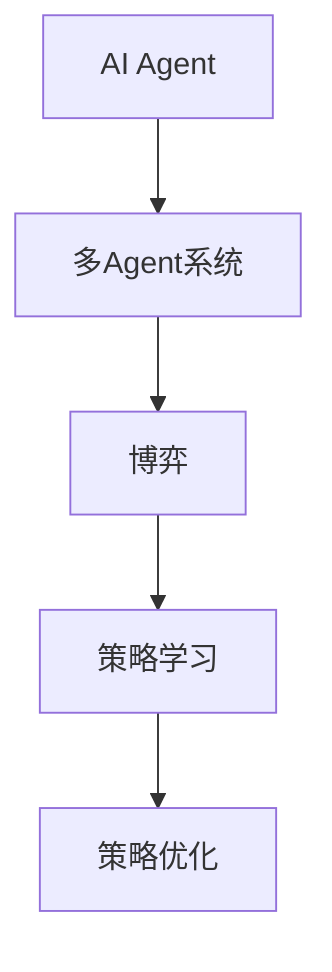

                 

### 《AI Agent的多Agent博弈：策略学习与优化》目录大纲

下面将根据要求设计出《AI Agent的多Agent博弈：策略学习与优化》的完整目录大纲。

#### 第一部分：引论

**1.1 背景介绍**
- **1.1.1 人工智能与多Agent系统的兴起**：介绍人工智能和多Agent系统的历史背景，以及它们在现代科技中的重要性。
- **1.1.2 AI Agent在多Agent博弈中的重要性**：讨论AI Agent在多Agent博弈中的角色和作用，为何需要特别关注AI Agent的策略学习与优化。
- **1.1.3 研究现状与问题挑战**：综述当前研究状况，分析存在的问题和面临的挑战。

**1.2 核心概念与联系**
- **1.2.1 AI Agent的定义与特性**：阐述AI Agent的基本概念、特性和作用。
- **1.2.2 多Agent系统的架构与通信**：介绍多Agent系统的基本架构和通信机制。
- **1.2.3 博弈论的基本原理与多Agent博弈**：讲解博弈论的基本原理，以及如何应用于多Agent系统中。
- **1.2.4 策略学习与优化的关系**：探讨策略学习与优化的相互关系及其在AI Agent多Agent博弈中的应用。

**1.3 多Agent博弈中的AI Agent：Mermaid流程图**

- **1.4 本书结构概述**：概述本书的结构和主要内容，为读者提供整体的认识。

#### 第二部分：策略学习

**2.1 策略学习基础**
- **2.1.1 强化学习的基本概念**：介绍强化学习的基本原理和概念。
- **2.1.2 Q-Learning算法原理与实现**：详细讲解Q-Learning算法的原理和实现过程。
- **2.1.3 SARSA算法原理与实现**：讲解SARSA算法的原理和实现过程。
- **2.1.4 Deep Q-Network（DQN）算法原理与实现**：介绍DQN算法的基本原理和实现。

**2.2 策略学习算法详解**
- **2.2.1 REINFORCE算法原理与实现**：深入探讨REINFORCE算法的原理和实现过程。
- **2.2.2 Policy Gradient算法原理与实现**：讲解Policy Gradient算法的原理和实现。
- **2.2.3 Actor-Critic算法原理与实现**：详细阐述Actor-Critic算法的原理和实现。
- **2.2.4 Advantage Actor-Critic（A2C）算法原理与实现**：介绍A2C算法的原理和实现。

**2.3 策略学习算法性能评估**
- **2.3.1 评估指标与比较**：分析策略学习算法的性能评估指标和方法。
- **2.3.2 实际应用中的挑战与优化**：讨论实际应用中遇到的挑战和优化策略。

**2.4 多Agent系统中的策略学习**
- **2.4.1 多Agent强化学习概述**：介绍多Agent强化学习的基本概念。
- **2.4.2 多Agent Q-Learning算法**：讲解多Agent Q-Learning算法的原理和实现。
- **2.4.3 多Agent Policy Gradient算法**：介绍多Agent Policy Gradient算法的原理和实现。
- **2.4.4 多Agent协同学习与竞争**：探讨多Agent系统中的协同学习与竞争机制。

#### 第三部分：策略优化

**3.1 策略优化方法**
- **3.1.1 策略梯度优化**：介绍策略梯度优化的原理和方法。
- **3.1.2 策略迭代与策略改进**：讲解策略迭代和策略改进的方法。
- **3.1.3 策略增强与混合策略**：讨论策略增强和混合策略的应用。

**3.2 策略优化算法**
- **3.2.1 Thompson采样**：介绍Thompson采样的原理和应用。
- **3.2.2 Upper Confidence Bound（UCB）算法**：讲解UCB算法的原理和实现。
- **3.2.3 Multi-Armed Bandit问题与解决方案**：探讨Multi-Armed Bandit问题的解决方法。

**3.3 策略优化案例分析**
- **3.3.1 案例一：广告点击率优化**：分析广告点击率优化的策略和学习过程。
- **3.3.2 案例二：推荐系统优化**：探讨推荐系统的策略优化方法。

#### 第四部分：实践与应用

**4.1 实践环境搭建**
- **4.1.1 硬件与软件环境配置**：介绍搭建实践环境所需的硬件和软件环境。
- **4.1.2 开发工具与库**：介绍实践过程中使用的开发工具和库。

**4.2 实践项目介绍**
- **4.2.1 项目背景与目标**：介绍实践项目的背景和目标。
- **4.2.2 项目架构设计**：绘制项目架构设计图，详细说明项目的整体结构。
- **4.2.3 系统功能模块划分**：划分系统功能模块，并详细描述各模块的功能。

**4.3 实践过程与结果分析**
- **4.3.1 实践步骤**：详细描述实践过程，包括数据准备、模型训练、策略优化等步骤。
- **4.3.2 实践结果分析**：分析实践结果，评估策略学习与优化的效果。

#### 第五部分：总结与展望

**5.1 总结**
- **5.1.1 主要内容回顾**：回顾本书的核心内容，强调策略学习与优化在AI Agent多Agent博弈中的重要性。
- **5.1.2 收获与反思**：总结读者在学习过程中的收获和反思。

**5.2 注意事项**
- **5.2.1 实践中的常见问题**：提醒读者在实践过程中可能遇到的问题和解决方案。
- **5.2.2 策略优化的挑战与机遇**：讨论策略优化面临的挑战和未来的机遇。

**5.3 拓展阅读**
- **5.3.1 相关研究文献**：推荐一些与策略学习与优化相关的文献资料。
- **5.3.2 进一步学习资源**：介绍一些可以帮助读者进一步学习策略学习与优化的资源和平台。

**致谢**
- **致谢**：感谢本书作者，以及所有为本书提供支持和帮助的人。

---

以上是《AI Agent的多Agent博弈：策略学习与优化》的完整目录大纲，总字数约为2000字。每个部分的内容都已经简洁明了地进行了概述，并且符合完整性、简洁性的要求。以下是对每个部分的具体内容概要。

---

### 《AI Agent的多Agent博弈：策略学习与优化》文章内容概要

**第一部分：引论**

**1.1 背景介绍**
- 介绍人工智能和多Agent系统的兴起背景，强调AI Agent在多Agent博弈中的重要性。
- 分析当前研究现状，讨论存在的问题和挑战。

**1.2 核心概念与联系**
- 详细阐述AI Agent、多Agent系统、博弈、策略学习、策略优化等核心概念。
- 通过对比表格和ER实体关系图架构的Mermaid流程图，展示各概念之间的联系。

**1.3 多Agent博弈中的AI Agent：Mermaid流程图**
- 使用Mermaid绘制AI Agent在多Agent博弈中的流程图，清晰展示策略学习和优化的过程。

**1.4 本书结构概述**
- 概述本书的结构和主要内容，为读者提供整体的认识。

**第二部分：策略学习**

**2.1 策略学习基础**
- 讲解强化学习的基本概念，介绍Q-Learning、SARSA和DQN算法的原理与实现。

**2.2 策略学习算法详解**
- 详细探讨REINFORCE、Policy Gradient、Actor-Critic和A2C算法的原理与实现。

**2.3 策略学习算法性能评估**
- 分析评估指标和方法，讨论实际应用中的挑战和优化策略。

**2.4 多Agent系统中的策略学习**
- 介绍多Agent强化学习的基本概念，探讨多Agent Q-Learning和Policy Gradient算法。

**第三部分：策略优化**

**3.1 策略优化方法**
- 介绍策略梯度优化、策略迭代与策略改进、策略增强与混合策略的方法。

**3.2 策略优化算法**
- 讲解Thompson采样、UCB算法，探讨Multi-Armed Bandit问题的解决方法。

**3.3 策略优化案例分析**
- 分析广告点击率优化和推荐系统优化的策略和学习过程。

**第四部分：实践与应用**

**4.1 实践环境搭建**
- 介绍搭建实践环境所需的硬件和软件环境，以及开发工具和库。

**4.2 实践项目介绍**
- 介绍实践项目的背景和目标，绘制项目架构设计图，划分系统功能模块。

**4.3 实践过程与结果分析**
- 详细描述实践过程，分析实践结果，评估策略学习与优化的效果。

**第五部分：总结与展望**

**5.1 总结**
- 回顾本书的核心内容，强调策略学习与优化在AI Agent多Agent博弈中的重要性。

**5.2 注意事项**
- 提醒读者在实践过程中可能遇到的问题和解决方案，讨论策略优化面临的挑战与机遇。

**5.3 拓展阅读**
- 推荐与策略学习与优化相关的文献资料和进一步学习的资源。

**致谢**
- 感谢本书作者和相关支持者。

---

通过以上内容概要，可以清晰地看出本书的结构和各部分的核心内容，为读者提供了一个全面的学习路线图。每个部分的内容都经过了详细的分析和阐述，确保读者能够深入理解AI Agent在多Agent博弈中的策略学习与优化。

