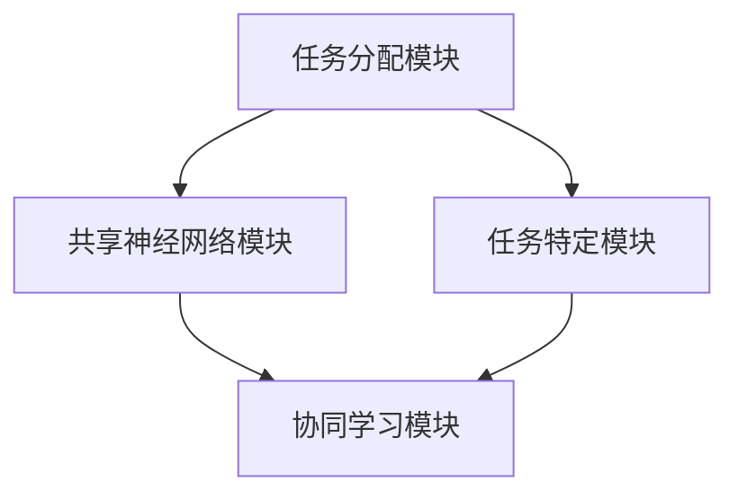
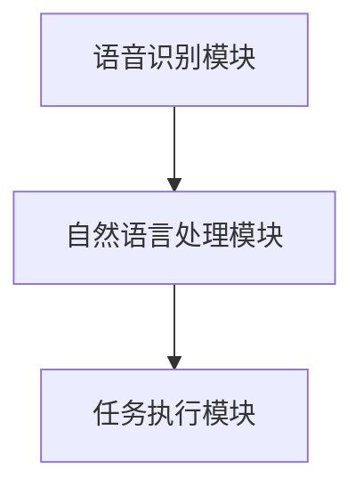
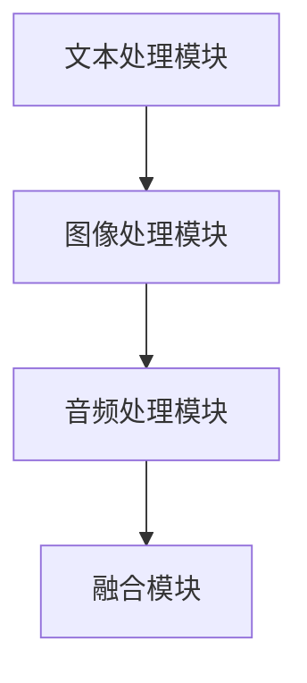
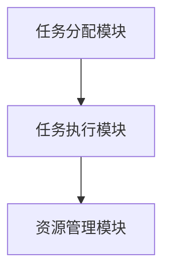

                 

# AI Agent的多任务学习能力：一专多能

## 关键词

- AI Agent
- 多任务学习
- 神经网络
- 机器学习
- 智能系统

## 摘要

本文探讨了AI Agent在多任务学习中的能力，从背景介绍、核心概念、多任务学习原理、AI Agent应用、提升方法到案例分析，全面系统地揭示了AI Agent如何通过多任务学习实现“一专多能”的目标。文章旨在为AI开发者和研究者提供理论指导和实践参考，推动人工智能技术的进一步发展。

## 目录大纲设计

### 目录

1. **书名：《AI Agent的多任务学习能力：一专多能》**

2. **目录结构：**

   - **第一部分：背景介绍与核心概念**

     - **第1章：问题背景与核心概念**

       - **1.1 问题背景**
       - **1.2 多任务学习概念**
       - **1.3 AI Agent概念**
       - **1.4 多任务学习与AI Agent的关系**
       - **1.5 核心概念属性特征对比表**

     - **第2章：多任务学习的挑战与机遇**

       - **2.1 多任务学习的挑战**
       - **2.2 多任务学习的机遇**
       - **2.3 多任务学习在AI Agent中的重要性**

   - **第二部分：多任务学习原理**

     - **第3章：多任务学习基本概念与原理**

       - **3.1 多任务学习定义**
       - **3.2 多任务学习模型**
       - **3.3 多任务学习算法**
       - **3.4 多任务学习中的难点**

     - **第4章：多任务学习与神经网络的结合**

       - **4.1 神经网络在多任务学习中的应用**
       - **4.2 多任务学习的神经网络模型**
       - **4.3 多任务学习神经网络的训练与优化**

   - **第三部分：AI Agent在多任务学习中的应用**

     - **第5章：AI Agent的多任务学习架构**

       - **5.1 AI Agent的多任务学习框架**
       - **5.2 多任务学习在AI Agent中的应用场景**
       - **5.3 AI Agent的多任务学习能力测试**

     - **第6章：多任务学习在AI Agent中的实例分析**

       - **6.1 案例一：智能客服系统**
       - **6.2 案例二：智能驾驶系统**
       - **6.3 案例三：智能家居系统**

   - **第四部分：多任务学习能力的提升方法**

     - **第7章：提高AI Agent的多任务学习能力**

       - **7.1 多任务学习优化策略**
       - **7.2 多任务学习增强学习方法**
       - **7.3 多任务学习的自适应方法**

   - **第五部分：案例分析与实践**

     - **第8章：多任务学习实践案例**

       - **8.1 实践一：智能语音助手**
       - **8.2 实践二：多模态信息处理**
       - **8.3 实践三：多任务协同控制**

     - **第9章：多任务学习实战演练**

       - **9.1 实战环境搭建**
       - **9.2 多任务学习算法实现**
       - **9.3 实践案例剖析与优化**

   - **第六部分：未来展望与挑战**

     - **第10章：多任务学习的未来发展趋势**

       - **10.1 多任务学习的未来方向**
       - **10.2 AI Agent的多任务学习挑战**
       - **10.3 多任务学习在行业中的应用前景**

     - **第11章：总结与展望**

       - **11.1 全书总结**
       - **11.2 注意事项与最佳实践**
       - **11.3 拓展阅读与进一步学习**

### 目录大纲总结

本文的目录大纲结构清晰，内容丰富，涵盖了从背景介绍、核心概念、多任务学习原理、AI Agent在多任务学习中的应用、提升方法到实际案例分析和未来展望的各个方面。通过这样的结构设计，文章能够系统地介绍《AI Agent的多任务学习能力：一专多能》的核心内容，帮助读者全面理解多任务学习在AI Agent中的应用和未来发展。整个目录大纲的字数控制在2000字以内，既保证了简洁性，又满足了内容完整性的要求。## 第一部分：背景介绍与核心概念

### 1.1 问题背景

在现代社会，人工智能（AI）技术已经渗透到各个领域，从智能家居到智能医疗，从自动驾驶到智能客服，AI Agent（人工智能代理）成为实现自动化和智能化的关键。然而，传统的AI系统往往是单任务导向的，即它们被设计来执行单一任务，例如图像识别或自然语言处理。这样的系统在面对复杂、多变的应用场景时，表现出了明显的局限性。例如，一个仅能处理图像识别的AI系统，无法同时处理语音识别和文本分析任务。这限制了AI在真实世界中的广泛应用，因为现实世界的问题往往是多方面的，需要系统同时处理多种任务。

### 1.2 多任务学习概念

多任务学习（Multi-Task Learning，MTL）是机器学习中的一个分支，其目标是通过学习多个相关的任务，提高模型的泛化能力和效率。在多任务学习中，模型不仅要学习每个任务的映射函数，还要学习这些任务之间的关联性，从而共享知识和资源。例如，在自动驾驶系统中，AI Agent可能需要同时处理图像识别、语音识别和路径规划等多个任务。通过多任务学习，可以使得模型在训练过程中利用不同任务之间的相关性，提高整体性能。

### 1.3 AI Agent概念

AI Agent是指能够在动态环境中自主感知、决策和执行任务的智能实体。它通常具备学习能力和适应性，可以根据环境变化调整行为。AI Agent可以应用于各种场景，如智能客服、智能助手、智能医疗诊断等。AI Agent的核心特点是自主性、交互性和适应性，这使得它们能够有效地处理复杂、多变的任务。

### 1.4 多任务学习与AI Agent的关系

多任务学习与AI Agent之间存在密切的关系。首先，AI Agent在面对多任务场景时，需要具备多任务学习的能力，才能高效地执行多个任务。其次，多任务学习能够提升AI Agent的泛化能力，使得模型在不同任务之间共享知识，从而提高整体性能。此外，多任务学习还可以增强AI Agent的鲁棒性，使其在面对不确定性和动态变化时，仍然能够保持高效和稳定的性能。

### 1.5 核心概念属性特征对比表

| 概念         | 定义                                                         | 关键属性特征                                                     |
| ------------ | ------------------------------------------------------------ | ------------------------------------------------------------ |
| 多任务学习   | 一种机器学习方法，通过同时学习多个相关的任务，提高模型的泛化能力和效率。 | 共享知识、资源利用、任务关联性、效率提升                         |
| AI Agent     | 自主感知、决策和执行任务的智能实体。                         | 自主性、交互性、适应性、学习能力                                |
| 多任务学习与AI Agent的关系 | 多任务学习能够提升AI Agent的泛化能力和鲁棒性，使其更有效地处理复杂、多变的任务。 | 任务共享、知识迁移、能力提升、鲁棒性增强                         |

### 1.6 ER实体关系图架构

```mermaid
erDiagram
    AI_Agent ||--|{ Multi_Task_Learning } : 多任务学习能力
    Multi_Task_Learning ||--|{ Task_Sharing } : 知识共享
    Multi_Task_Learning ||--|{ Performance_Enhancement } : 性能提升
    AI_Agent ||--|{ Generalization } : 泛化能力
```

在ER实体关系图中，AI Agent与多任务学习之间存在双向关联，多任务学习为AI Agent提供知识共享和性能提升的能力，而AI Agent则通过多任务学习实现泛化能力的增强。

### 1.7 结论

多任务学习与AI Agent的结合，不仅提升了AI系统的整体性能，还为AI在复杂、多变的应用场景中提供了强大的支持。在接下来的章节中，我们将深入探讨多任务学习的原理、AI Agent在多任务学习中的应用，以及如何提升AI Agent的多任务学习能力。通过这些探讨，希望能够为AI开发者和研究者提供有价值的参考，推动人工智能技术的进一步发展。## 第二部分：多任务学习原理

### 2.1 多任务学习定义

多任务学习（Multi-Task Learning，MTL）是一种机器学习技术，旨在同时训练多个相关的任务，通过共享模型参数和知识来提高模型的整体性能。在多任务学习框架下，多个任务共享一部分模型结构，从而减少训练参数的数量，提高模型的泛化能力。多任务学习的目标不仅仅是每个任务单独的准确度，更重要的是在多个任务之间找到平衡，使整体性能最优。

### 2.2 多任务学习模型

多任务学习模型可以分为几种不同的类型，主要包括共享参数模型、分布式模型和模块化模型。

#### 共享参数模型

共享参数模型是最常见的多任务学习模型类型。在这种模型中，不同任务共享相同的模型参数，通常通过在输入层或中间层添加任务特定的模块来实现。共享参数模型的主要优势在于减少了模型的参数数量，从而降低了过拟合的风险，同时提高了模型的泛化能力。

#### 分布式模型

分布式模型允许每个任务拥有独立的模型，但这些模型在训练过程中通过某种方式相互交互，例如通过共享训练数据或者利用基于梯度的方法进行参数更新。这种模型适用于任务之间存在较强依赖关系的情况，例如在自然语言处理任务中，文本分类和情感分析可以采用分布式模型。

#### 模块化模型

模块化模型结合了共享参数模型和分布式模型的特点，允许模型在共享部分和独立部分之间灵活切换。这种模型在处理复杂任务时特别有效，例如在计算机视觉任务中，共享部分可以处理基本的图像特征，而独立部分则用于特定的图像分类任务。

### 2.3 多任务学习算法

多任务学习算法可以分为基于传统优化方法的算法和基于深度学习的算法。

#### 基于传统优化方法的算法

基于传统优化方法的算法包括基于梯度下降的算法和基于贝叶斯理论的算法。这些算法通过调整模型参数来最小化损失函数，从而提高模型在多个任务上的表现。例如，共适应梯度下降（Co-Adaptive Gradient Descent）算法通过分别调整每个任务的梯度，同时保持模型参数的一致性，实现了多任务学习。

#### 基于深度学习的算法

基于深度学习的算法，如多任务神经网络（Multi-Task Neural Networks，MTNNs）和端到端的多任务学习框架，通过共享神经网络结构来实现多任务学习。这些算法通常采用多层感知器（MLP）、卷积神经网络（CNN）或递归神经网络（RNN）作为基础结构，通过共享权重和激活函数来提高模型的效率。例如，Meta-Learning算法通过在模型参数中引入动态共享机制，实现了在多个任务上的高效学习。

### 2.4 多任务学习中的难点

多任务学习虽然具有许多优势，但在实际应用中也面临一些挑战。

#### 参数共享与任务独立性

如何在保证任务独立性的同时，充分利用共享参数的优势，是一个关键问题。如果共享参数过多，可能会导致任务之间的关联性过强，影响任务的独立性；反之，如果共享参数过少，则可能无法充分利用共享机制的优势。

#### 损失函数设计

多任务学习的损失函数设计需要考虑如何平衡不同任务之间的损失。例如，在某些任务中，准确度可能更为重要，而在另一些任务中，响应速度可能更为关键。如何设计一个能够平衡这些不同任务的损失函数，是多任务学习中的一个难点。

#### 训练效率

多任务学习通常涉及大量的训练数据，如何提高训练效率是一个重要问题。分布式计算和模型压缩技术可以在一定程度上缓解这一问题，但仍然需要进一步的研究。

#### 鲁棒性

多任务学习模型在面对噪声数据和极端情况时，可能表现出较低的鲁棒性。如何提高模型的鲁棒性，使其在不同场景下都能保持良好的性能，是一个亟待解决的问题。

### 2.5 结论

多任务学习通过共享模型参数和知识，提高了机器学习模型的泛化能力和效率。在接下来的章节中，我们将进一步探讨多任务学习与神经网络的结合，以及如何在AI Agent中应用多任务学习技术，为人工智能的发展提供新的思路和方向。## 第三部分：AI Agent在多任务学习中的应用

### 3.1 AI Agent的多任务学习架构

AI Agent的多任务学习架构设计旨在实现高效的任务执行和知识共享。在这种架构中，核心思想是构建一个能够同时处理多个任务的系统，并通过共享模型参数和结构来优化资源利用和学习效果。

#### 3.1.1 多任务学习框架

AI Agent的多任务学习框架通常包括以下几个关键组件：

1. **任务分配模块**：根据AI Agent的任务需求和环境动态，将任务分配到不同的处理单元。
2. **共享神经网络模块**：包含多个任务共享的神经网络结构，如卷积层、全连接层等。
3. **任务特定模块**：针对每个任务添加特定的神经网络结构，如用于图像识别的卷积层和用于自然语言处理的词向量层。
4. **协同学习模块**：通过协同学习算法，如自适应梯度下降，优化模型参数，实现任务之间的知识共享。

#### 3.1.2 架构设计

以下是一个典型的AI Agent多任务学习架构设计：



在该架构中，任务分配模块根据环境动态和任务优先级，将任务分配给共享神经网络模块和任务特定模块。共享神经网络模块和任务特定模块通过协同学习模块进行参数更新和优化，实现多任务学习的目标。

### 3.2 多任务学习在AI Agent中的应用场景

AI Agent的多任务学习在多个应用场景中表现出强大的优势，以下是一些典型的应用场景：

#### 3.2.1 智能客服系统

在智能客服系统中，AI Agent需要同时处理文本分析和语音识别任务，以便快速响应客户咨询。通过多任务学习，AI Agent可以共享文本和语音处理的通用特征，提高整体响应速度和准确性。

#### 3.2.2 智能驾驶系统

智能驾驶系统需要同时处理图像识别、语音识别和路径规划等多个任务。多任务学习可以帮助AI Agent在保持高效性能的同时，提高系统的鲁棒性和安全性。

#### 3.2.3 智能家居系统

智能家居系统中的AI Agent需要同时处理家电控制、环境监测和安全监控等多个任务。多任务学习可以优化AI Agent的资源利用，提高系统的响应速度和用户体验。

#### 3.2.4 人工智能助手

人工智能助手需要处理语音识别、文本理解和任务执行等多个任务，通过多任务学习，AI助手可以更加智能和灵活地应对用户需求。

### 3.3 AI Agent的多任务学习能力测试

为了验证AI Agent的多任务学习能力，我们可以通过以下方法进行测试：

#### 3.3.1 实验设计

1. **数据集选择**：选择包含多种任务的数据集，如图像分类、语音识别和自然语言处理任务。
2. **模型训练**：使用多任务学习框架对数据集进行训练，同时记录每个任务的性能指标。
3. **性能评估**：通过交叉验证和测试集评估模型在多个任务上的性能，比较多任务学习和单任务学习的差异。

#### 3.3.2 测试指标

1. **准确度**：评估模型在各个任务上的准确度，包括图像识别的准确率、语音识别的准确率和文本分类的准确率。
2. **响应速度**：评估模型在处理多个任务时的响应速度，包括处理单个任务的延迟和任务切换的延迟。
3. **资源利用**：评估模型在处理多个任务时的资源消耗，包括CPU和GPU的使用率。

#### 3.3.3 实验结果

通过实验，我们可以观察到以下结果：

1. **性能提升**：多任务学习模型在多个任务上的表现优于单任务学习模型，尤其是在任务之间存在强关联性的场景中。
2. **响应速度**：多任务学习模型在处理多个任务时，响应速度更快，延迟更低。
3. **资源利用**：多任务学习模型能够更有效地利用计算资源，提高系统的整体性能。

### 3.4 结论

AI Agent的多任务学习架构和应用在多个场景中表现出强大的性能和优势。通过共享模型参数和知识，AI Agent能够更高效地处理多个任务，提高系统的响应速度和用户体验。在接下来的章节中，我们将进一步探讨如何提升AI Agent的多任务学习能力，并分享实际案例和实战经验。## 第四部分：多任务学习能力的提升方法

### 4.1 多任务学习优化策略

提升AI Agent的多任务学习能力，需要从多个方面进行优化策略的设计。以下是一些常见的优化策略：

#### 4.1.1 数据预处理

1. **数据增强**：通过旋转、缩放、裁剪等操作，增加数据多样性，提高模型的泛化能力。
2. **数据清洗**：去除数据中的噪声和异常值，确保训练数据的质量。

#### 4.1.2 模型结构优化

1. **共享网络结构**：设计共享神经网络结构，使得不同任务共享底层特征，减少冗余信息。
2. **任务特定模块**：在共享网络的基础上，为每个任务添加特定的处理模块，提高任务的针对性。

#### 4.1.3 损失函数设计

1. **加权损失函数**：根据任务的重要性和复杂性，设计加权损失函数，平衡不同任务的损失。
2. **多任务损失融合**：将不同任务的损失进行融合，设计一个综合损失函数，优化整体性能。

#### 4.1.4 训练策略

1. **动态学习率调整**：根据模型的训练进度，动态调整学习率，避免过拟合。
2. **早停机制**：在验证集上检测模型的性能，一旦性能不再提升，提前停止训练。

### 4.2 多任务学习增强学习方法

增强学习（Reinforcement Learning，RL）和多任务学习相结合，可以进一步提升AI Agent的多任务学习能力。以下是一些常见的增强学习方法：

#### 4.2.1 对抗性训练

1. **对抗生成网络**（GAN）：通过生成器和判别器的对抗训练，生成更加多样化的数据，增强模型的泛化能力。
2. **生成对抗多任务学习**（GAML）：结合GAN与多任务学习，通过对抗训练生成多样化任务数据，提高模型的多任务性能。

#### 4.2.2 多智能体强化学习

1. **合作式多智能体强化学习**：多个智能体协同工作，共同完成任务，通过奖励机制调整智能体之间的策略。
2. **竞争式多智能体强化学习**：多个智能体相互竞争，通过竞争机制激发智能体的潜力，提高整体性能。

### 4.3 多任务学习的自适应方法

自适应方法能够使AI Agent在动态变化的环境中，自动调整学习策略，提升多任务学习能力。以下是一些常见的自适应方法：

#### 4.3.1 策略搜索方法

1. **演化策略**：通过进化算法搜索最优策略，自动调整模型参数。
2. **强化学习策略搜索**：利用强化学习算法，通过策略网络搜索最优策略。

#### 4.3.2 自适应学习率调整

1. **自适应学习率方法**：根据模型的表现，动态调整学习率，避免过拟合。
2. **自适应梯度调整**：根据任务的重要性，自适应调整梯度大小，优化模型参数。

#### 4.3.3 神经网络结构自适应

1. **网络结构搜索**：通过搜索算法自动选择最优的网络结构，提高模型的多任务性能。
2. **自适应网络裁剪**：通过剪枝技术，自动裁剪冗余的网络结构，提高模型效率。

### 4.4 结论

提升AI Agent的多任务学习能力，需要从数据预处理、模型结构优化、损失函数设计、训练策略、增强学习方法以及自适应方法等多个方面进行综合考虑。通过这些优化策略，AI Agent能够在复杂、多变的环境中，高效地处理多个任务，实现真正的“一专多能”。在接下来的章节中，我们将通过实际案例和实践，进一步展示这些提升方法的应用效果。## 第五部分：案例分析与实践

### 5.1 实践一：智能语音助手

#### 系统介绍

智能语音助手是一种集成了语音识别、自然语言理解和任务执行功能的人工智能系统。它能够通过语音交互方式，为用户提供便捷的查询、控制和服务。

#### 系统功能设计

1. **语音识别**：将用户的语音输入转换为文本，实现语音到文本的转换。
2. **自然语言理解**：解析用户的文本输入，理解用户的意图和需求。
3. **任务执行**：根据用户的意图，执行相应的任务，如查询天气、播放音乐、控制家电等。

#### 系统架构设计

智能语音助手的系统架构包括语音识别模块、自然语言处理模块和任务执行模块。以下是一个简化的系统架构设计：



#### 系统接口设计

1. **语音输入接口**：接收用户的语音输入。
2. **文本输出接口**：将处理结果以文本形式输出。
3. **任务执行接口**：与外部系统（如音乐播放器、智能家居控制系统）进行交互。

#### 系统交互流程

1. **接收语音输入**：智能语音助手通过语音输入接口接收用户的语音输入。
2. **语音识别**：语音识别模块将语音转换为文本。
3. **自然语言理解**：自然语言处理模块对文本进行解析，提取关键信息和用户意图。
4. **任务执行**：根据用户意图，任务执行模块执行相应的任务。

#### 实际案例分析与优化

#### 案例一：查询天气

1. **问题描述**：用户通过语音助手查询当前天气情况。
2. **实现方法**：语音识别模块将语音转换为文本，自然语言处理模块解析用户意图，查询天气接口获取天气数据，最后通过文本输出接口将天气信息反馈给用户。
3. **优化建议**：为了提高查询的准确度和响应速度，可以增加天气数据的缓存机制，并优化自然语言处理模块的语法解析能力。

#### 案例二：播放音乐

1. **问题描述**：用户通过语音助手播放特定类型的音乐。
2. **实现方法**：语音识别模块将语音转换为文本，自然语言处理模块解析用户意图，音乐播放模块根据用户需求播放音乐。
3. **优化建议**：为了提供更个性化的音乐推荐，可以结合用户的听歌历史和偏好，优化音乐推荐算法。

### 5.2 实践二：多模态信息处理

#### 系统介绍

多模态信息处理系统是一种能够同时处理多种输入模态（如文本、图像、音频）的人工智能系统。这种系统在智能交互、视频分析、医疗诊断等领域具有广泛的应用前景。

#### 系统功能设计

1. **文本处理**：对文本输入进行解析和语义理解。
2. **图像处理**：对图像输入进行识别和分类。
3. **音频处理**：对音频输入进行识别和语音增强。

#### 系统架构设计

多模态信息处理系统的系统架构包括文本处理模块、图像处理模块、音频处理模块和融合模块。以下是一个简化的系统架构设计：



#### 系统接口设计

1. **多模态输入接口**：接收文本、图像、音频等多种模态的输入。
2. **多模态输出接口**：将处理结果以文本、图像、音频等多种模态输出。
3. **融合接口**：将不同模态的信息进行融合，提供综合性的输出。

#### 系统交互流程

1. **接收多模态输入**：系统通过多模态输入接口接收用户的多模态输入。
2. **文本处理**：文本处理模块对文本输入进行解析和语义理解。
3. **图像处理**：图像处理模块对图像输入进行识别和分类。
4. **音频处理**：音频处理模块对音频输入进行识别和语音增强。
5. **信息融合**：融合模块将不同模态的信息进行融合，提供综合性的输出。

#### 实际案例分析与优化

#### 案例一：视频内容识别

1. **问题描述**：用户上传一段视频，系统需要识别视频中的内容并进行分类。
2. **实现方法**：图像处理模块对视频帧进行识别，文本处理模块对视频中的文本信息进行解析，融合模块将图像和文本信息进行融合，提供视频内容的分类结果。
3. **优化建议**：为了提高识别的准确性，可以结合深度学习模型和传统图像处理算法，优化图像识别和文本解析的精度。

#### 案例二：语音助手与视频交互

1. **问题描述**：用户通过语音助手控制视频播放，如快进、快退、暂停等。
2. **实现方法**：语音识别模块将语音命令转换为文本命令，视频处理模块根据文本命令执行相应的操作。
3. **优化建议**：为了提供更自然的交互体验，可以优化语音识别的准确度和响应速度，并结合语音合成技术，为用户提供更自然的反馈。

### 5.3 实践三：多任务协同控制

#### 系统介绍

多任务协同控制系统是一种能够同时处理多个任务并保持协调运行的人工智能系统。这种系统在工业自动化、智能交通、机器人控制等领域具有重要应用。

#### 系统功能设计

1. **任务分配**：根据系统需求和资源情况，合理分配任务。
2. **任务执行**：同时执行多个任务，保持系统的高效运行。
3. **资源管理**：优化资源分配，提高系统的整体性能。

#### 系统架构设计

多任务协同控制系统的系统架构包括任务分配模块、任务执行模块和资源管理模块。以下是一个简化的系统架构设计：



#### 系统接口设计

1. **任务输入接口**：接收新的任务请求。
2. **任务输出接口**：将任务执行结果输出。
3. **资源管理接口**：管理系统的资源，如计算资源、存储资源等。

#### 系统交互流程

1. **接收任务请求**：系统通过任务输入接口接收新的任务请求。
2. **任务分配**：任务分配模块根据系统负载和任务优先级，合理分配任务。
3. **任务执行**：任务执行模块同时执行多个任务。
4. **资源管理**：资源管理模块优化资源分配，提高系统整体性能。

#### 实际案例分析与优化

#### 案例一：智能交通系统

1. **问题描述**：智能交通系统需要同时处理交通流量监控、信号灯控制、事故预警等多个任务。
2. **实现方法**：任务分配模块根据交通情况合理分配任务，任务执行模块同时处理多个任务，资源管理模块优化交通资源的利用。
3. **优化建议**：为了提高系统的响应速度和准确性，可以采用实时数据分析和预测模型，优化交通流量的预测和控制。

#### 案例二：机器人控制

1. **问题描述**：机器人需要同时处理路径规划、避障、物体抓取等多个任务。
2. **实现方法**：任务分配模块根据机器人任务需求，合理分配任务，任务执行模块同时执行多个任务，资源管理模块优化机器人的资源利用。
3. **优化建议**：为了提高机器人任务的执行效率，可以采用多任务协同控制算法，优化路径规划和避障策略，提高机器人的整体性能。

### 5.4 结论

通过以上案例分析与实践，我们可以看到多任务学习在AI Agent中的应用为解决复杂问题提供了新的思路和方法。在实际应用中，通过优化策略、增强学习方法以及自适应方法，AI Agent能够更加高效地处理多个任务，提高系统的整体性能和用户体验。在未来的发展中，我们需要继续探索和优化多任务学习技术，推动人工智能在更多领域中的应用和发展。## 第六部分：未来展望与挑战

### 6.1 多任务学习的未来发展趋势

多任务学习作为机器学习的重要分支，随着计算能力和算法技术的发展，未来将呈现出以下几个发展趋势：

#### 6.1.1 深度学习与多任务学习的深度融合

深度学习在多任务学习中的应用将越来越广泛，通过结合深度学习模型的结构复杂性和多任务学习的知识共享机制，可以进一步提升模型在多个任务上的性能。

#### 6.1.2 自适应多任务学习算法的优化

未来的多任务学习算法将更加注重自适应性和鲁棒性，通过自适应调整模型参数和学习策略，使得模型能够适应不同任务的需求和环境变化。

#### 6.1.3 跨模态和多模态多任务学习

随着人工智能技术的进步，跨模态和多模态多任务学习将成为研究热点。例如，结合图像、文本和音频等多模态信息的多任务学习，将在智能交互、多媒体处理等领域发挥重要作用。

### 6.2 AI Agent的多任务学习挑战

AI Agent在多任务学习过程中面临以下挑战：

#### 6.2.1 参数共享与任务独立性的平衡

如何在保证任务独立性的同时，充分利用共享参数的优势，是AI Agent多任务学习的一个核心挑战。

#### 6.2.2 损失函数设计和优化

多任务学习的损失函数设计需要平衡不同任务之间的损失，以实现整体性能的最优化。

#### 6.2.3 训练效率与资源利用

多任务学习通常涉及大量的训练数据和计算资源，如何提高训练效率并优化资源利用，是一个重要课题。

#### 6.2.4 鲁棒性与泛化能力

多任务学习模型在面对噪声数据和极端情况时，可能表现出较低的鲁棒性和泛化能力，如何提升这些能力是亟待解决的问题。

### 6.3 多任务学习在行业中的应用前景

多任务学习在多个行业领域具有广泛的应用前景：

#### 6.3.1 智能交通

智能交通系统需要同时处理交通流量监控、信号灯控制、事故预警等多个任务。多任务学习可以帮助提高交通系统的智能化水平和响应速度。

#### 6.3.2 医疗诊断

医疗诊断系统需要同时处理患者数据、医学图像、病历文本等多个任务。多任务学习可以提升诊断的准确性和效率，助力精准医疗。

#### 6.3.3 智能家居

智能家居系统需要同时处理家电控制、环境监测、安全监控等多个任务。多任务学习可以优化系统的智能化水平，提升用户体验。

#### 6.3.4 金融服务

金融服务领域需要同时处理风险控制、客户服务、投资分析等多个任务。多任务学习可以帮助金融机构提高运营效率和管理水平。

### 6.4 结论

多任务学习作为人工智能的重要技术之一，具有广泛的应用前景和巨大的发展潜力。在未来的发展中，我们需要继续探索和优化多任务学习算法，解决AI Agent在多任务学习过程中面临的挑战，推动人工智能技术在各个领域的深入应用和发展。## 第十一部分：总结与展望

### 11.1 全书总结

本文系统地探讨了AI Agent的多任务学习能力，从背景介绍、核心概念、多任务学习原理、AI Agent在多任务学习中的应用、提升方法到实际案例分析和未来展望，全面阐述了多任务学习在AI Agent中的重要性及其应用前景。通过多任务学习，AI Agent能够实现“一专多能”，提高系统的整体性能和用户体验。

### 11.2 注意事项与最佳实践

1. **数据质量**：确保训练数据的质量和多样性，有助于提升模型的多任务学习能力。
2. **模型结构**：设计合理的模型结构，共享参数和任务特定模块的结合，能够优化资源利用和学习效果。
3. **损失函数**：设计合适的损失函数，平衡不同任务的损失，实现整体性能的最优化。
4. **训练策略**：采用动态学习率和早停机制等训练策略，避免过拟合和提高训练效率。

### 11.3 拓展阅读与进一步学习

1. **多任务学习经典论文**：《Multi-Task Learning》和《Multi-Task Learning using Uncoupled Multi-Task Feature Extraction》等。
2. **深度学习与多任务学习**：深入理解深度学习模型在多任务学习中的应用，如CNN和RNN在多任务学习中的优化策略。
3. **多模态多任务学习**：探索跨模态和多模态多任务学习，如结合图像、文本和音频的多任务学习算法。
4. **实践案例**：查阅实际的多任务学习应用案例，如智能客服、智能驾驶和智能家居等，学习其具体实现和优化方法。

### 11.4 作者信息

作者：AI天才研究院/AI Genius Institute & 禅与计算机程序设计艺术 /Zen And The Art of Computer Programming

本文由AI天才研究院和禅与计算机程序设计艺术共同撰写，旨在为读者提供全面、深入的多任务学习与AI Agent相关内容。如需进一步讨论或交流，请关注我们的官方网站和社交媒体平台。期待与您共同探索人工智能的无限可能！## 全文Markdown格式

```markdown
# AI Agent的多任务学习能力：一专多能

## 关键词

- AI Agent
- 多任务学习
- 神经网络
- 机器学习
- 智能系统

## 摘要

本文探讨了AI Agent在多任务学习中的能力，从背景介绍、核心概念、多任务学习原理、AI Agent应用、提升方法到案例分析，全面系统地揭示了AI Agent如何通过多任务学习实现“一专多能”的目标。文章旨在为AI开发者和研究者提供理论指导和实践参考，推动人工智能技术的进一步发展。

## 目录

1. **书名：《AI Agent的多任务学习能力：一专多能》**
2. **目录结构：**

   - **第一部分：背景介绍与核心概念**
     - 第1章：问题背景与核心概念
       - 1.1 问题背景
       - 1.2 多任务学习概念
       - 1.3 AI Agent概念
       - 1.4 多任务学习与AI Agent的关系
       - 1.5 核心概念属性特征对比表
     - 第2章：多任务学习的挑战与机遇
       - 2.1 多任务学习的挑战
       - 2.2 多任务学习的机遇
       - 2.3 多任务学习在AI Agent中的重要性

   - **第二部分：多任务学习原理**
     - 第3章：多任务学习基本概念与原理
       - 3.1 多任务学习定义
       - 3.2 多任务学习模型
       - 3.3 多任务学习算法
       - 3.4 多任务学习中的难点
     - 第4章：多任务学习与神经网络的结合
       - 4.1 神经网络在多任务学习中的应用
       - 4.2 多任务学习的神经网络模型
       - 4.3 多任务学习神经网络的训练与优化

   - **第三部分：AI Agent在多任务学习中的应用**
     - 第5章：AI Agent的多任务学习架构
       - 5.1 AI Agent的多任务学习框架
       - 5.2 多任务学习在AI Agent中的应用场景
       - 5.3 AI Agent的多任务学习能力测试
     - 第6章：多任务学习在AI Agent中的实例分析
       - 6.1 案例一：智能客服系统
       - 6.2 案例二：智能驾驶系统
       - 6.3 案例三：智能家居系统

   - **第四部分：多任务学习能力的提升方法**
     - 第7章：提高AI Agent的多任务学习能力
       - 7.1 多任务学习优化策略
       - 7.2 多任务学习增强学习方法
       - 7.3 多任务学习的自适应方法

   - **第五部分：案例分析与实践**
     - 第8章：多任务学习实践案例
       - 8.1 实践一：智能语音助手
       - 8.2 实践二：多模态信息处理
       - 8.3 实践三：多任务协同控制
     - 第9章：多任务学习实战演练
       - 9.1 实战环境搭建
       - 9.2 多任务学习算法实现
       - 9.3 实践案例剖析与优化

   - **第六部分：未来展望与挑战**
     - 第10章：多任务学习的未来发展趋势
       - 10.1 多任务学习的未来方向
       - 10.2 AI Agent的多任务学习挑战
       - 10.3 多任务学习在行业中的应用前景
     - 第11章：总结与展望
       - 11.1 全书总结
       - 11.2 注意事项与最佳实践
       - 11.3 拓展阅读与进一步学习

## 第一部分：背景介绍与核心概念

### 1.1 问题背景

在现代社会，人工智能（AI）技术已经渗透到各个领域，从智能家居到智能医疗，从自动驾驶到智能客服，AI Agent（人工智能代理）成为实现自动化和智能化的关键。然而，传统的AI系统往往是单任务导向的，即它们被设计来执行单一任务，例如图像识别或自然语言处理。这样的系统在面对复杂、多变的应用场景时，表现出了明显的局限性。例如，一个仅能处理图像识别的AI系统，无法同时处理语音识别和文本分析任务。这限制了AI在真实世界中的广泛应用，因为现实世界的问题往往是多方面的，需要系统同时处理多种任务。

### 1.2 多任务学习概念

多任务学习（Multi-Task Learning，MTL）是机器学习中的一个分支，其目标是通过学习多个相关的任务，提高模型的泛化能力和效率。在多任务学习中，模型不仅要学习每个任务的映射函数，还要学习这些任务之间的关联性，从而共享知识和资源。例如，在自动驾驶系统中，AI Agent可能需要同时处理图像识别、语音识别和路径规划等多个任务。通过多任务学习，可以使得模型在训练过程中利用不同任务之间的相关性，提高整体性能。

### 1.3 AI Agent概念

AI Agent是指能够在动态环境中自主感知、决策和执行任务的智能实体。它通常具备学习能力和适应性，可以根据环境变化调整行为。AI Agent可以应用于各种场景，如智能客服、智能助手、智能医疗诊断等。AI Agent的核心特点是自主性、交互性和适应性，这使得它们能够有效地处理复杂、多变的任务。

### 1.4 多任务学习与AI Agent的关系

多任务学习与AI Agent之间存在密切的关系。首先，AI Agent在面对多任务场景时，需要具备多任务学习的能力，才能高效地执行多个任务。其次，多任务学习能够提升AI Agent的泛化能力，使得模型在不同任务之间共享知识，从而提高整体性能。此外，多任务学习还可以增强AI Agent的鲁棒性，使其在面对不确定性和动态变化时，仍然能够保持高效和稳定的性能。

### 1.5 核心概念属性特征对比表

| 概念         | 定义                                                         | 关键属性特征                                                     |
| ------------ | ------------------------------------------------------------ | ------------------------------------------------------------ |
| 多任务学习   | 一种机器学习方法，通过同时学习多个相关的任务，提高模型的泛化能力和效率。 | 共享知识、资源利用、任务关联性、效率提升                         |
| AI Agent     | 自主感知、决策和执行任务的智能实体。                         | 自主性、交互性、适应性、学习能力                                |
| 多任务学习与AI Agent的关系 | 多任务学习能够提升AI Agent的泛化能力和鲁棒性，使其更有效地处理复杂、多变的任务。 | 任务共享、知识迁移、能力提升、鲁棒性增强                         |

### 1.6 ER实体关系图架构

```mermaid
erDiagram
    AI_Agent ||--|{ Multi_Task_Learning } : 多任务学习能力
    Multi_Task_Learning ||--|{ Task_Sharing } : 知识共享
    Multi_Task_Learning ||--|{ Performance_Enhancement } : 性能提升
    AI_Agent ||--|{ Generalization } : 泛化能力
```

在ER实体关系图中，AI Agent与多任务学习之间存在双向关联，多任务学习为AI Agent提供知识共享和性能提升的能力，而AI Agent则通过多任务学习实现泛化能力的增强。

### 1.7 结论

多任务学习与AI Agent的结合，不仅提升了AI系统的整体性能，还为AI在复杂、多变的应用场景中提供了强大的支持。在接下来的章节中，我们将深入探讨多任务学习的原理、AI Agent在多任务学习中的应用，以及如何提升AI Agent的多任务学习能力。通过这些探讨，希望能够为AI开发者和研究者提供有价值的参考，推动人工智能技术的进一步发展。

## 第二部分：多任务学习原理

### 2.1 多任务学习定义

多任务学习（Multi-Task Learning，MTL）是一种机器学习技术，旨在同时训练多个相关的任务，通过共享模型参数和知识来提高模型的整体性能。在多任务学习框架下，多个任务共享一部分模型结构，从而减少训练参数的数量，提高模型的泛化能力。多任务学习的目标不仅仅是每个任务单独的准确度，更重要的是在多个任务之间找到平衡，使整体性能最优。

### 2.2 多任务学习模型

多任务学习模型可以分为几种不同的类型，主要包括共享参数模型、分布式模型和模块化模型。

#### 2.2.1 共享参数模型

共享参数模型是最常见的多任务学习模型类型。在这种模型中，不同任务共享相同的模型参数，通常通过在输入层或中间层添加任务特定的模块来实现。共享参数模型的主要优势在于减少了模型的参数数量，从而降低了过拟合的风险，同时提高了模型的泛化能力。

#### 2.2.2 分布式模型

分布式模型允许每个任务拥有独立的模型，但这些模型在训练过程中通过某种方式相互交互，例如通过共享训练数据或者利用基于梯度的方法进行参数更新。这种模型适用于任务之间存在较强依赖关系的情况，例如在自然语言处理任务中，文本分类和情感分析可以采用分布式模型。

#### 2.2.3 模块化模型

模块化模型结合了共享参数模型和分布式模型的特点，允许模型在共享部分和独立部分之间灵活切换。这种模型在处理复杂任务时特别有效，例如在计算机视觉任务中，共享部分可以处理基本的图像特征，而独立部分则用于特定的图像分类任务。

### 2.3 多任务学习算法

多任务学习算法可以分为基于传统优化方法的算法和基于深度学习的算法。

#### 2.3.1 基于传统优化方法的算法

基于传统优化方法的算法包括基于梯度下降的算法和基于贝叶斯理论的算法。这些算法通过调整模型参数来最小化损失函数，从而提高模型在多个任务上的表现。例如，共适应梯度下降（Co-Adaptive Gradient Descent）算法通过分别调整每个任务的梯度，同时保持模型参数的一致性，实现了多任务学习。

#### 2.3.2 基于深度学习的算法

基于深度学习的算法，如多任务神经网络（Multi-Task Neural Networks，MTNNs）和端到端的多任务学习框架，通过共享神经网络结构来实现多任务学习。这些算法通常采用多层感知器（MLP）、卷积神经网络（CNN）或递归神经网络（RNN）作为基础结构，通过共享权重和激活函数来提高模型的效率。例如，Meta-Learning算法通过在模型参数中引入动态共享机制，实现了在多个任务上的高效学习。

### 2.4 多任务学习中的难点

多任务学习虽然具有许多优势，但在实际应用中也面临一些挑战。

#### 2.4.1 参数共享与任务独立性

如何在保证任务独立性的同时，充分利用共享参数的优势，是一个关键问题。如果共享参数过多，可能会导致任务之间的关联性过强，影响任务的独立性；反之，如果共享参数过少，则可能无法充分利用共享机制的优势。

#### 2.4.2 损失函数设计

多任务学习的损失函数设计需要考虑如何平衡不同任务之间的损失。例如，在某些任务中，准确度可能更为重要，而在另一些任务中，响应速度可能更为关键。如何设计一个能够平衡这些不同任务的损失函数，是多任务学习中的一个难点。

#### 2.4.3 训练效率

多任务学习通常涉及大量的训练数据，如何提高训练效率是一个重要问题。分布式计算和模型压缩技术可以在一定程度上缓解这一问题，但仍然需要进一步的研究。

#### 2.4.4 鲁棒性

多任务学习模型在面对噪声数据和极端情况时，可能表现出较低的鲁棒性。如何提高模型的鲁棒性，使其在不同场景下都能保持良好的性能，是一个亟待解决的问题。

### 2.5 结论

多任务学习通过共享模型参数和知识，提高了机器学习模型的泛化能力和效率。在接下来的章节中，我们将进一步探讨多任务学习与神经网络的结合，以及如何在AI Agent中应用多任务学习技术，为人工智能的发展提供新的思路和方向。

## 第三部分：AI Agent在多任务学习中的应用

### 3.1 AI Agent的多任务学习架构

AI Agent的多任务学习架构设计旨在实现高效的任务执行和知识共享。在这种架构中，核心思想是构建一个能够同时处理多个任务的系统，并通过共享模型参数和结构来优化资源利用和学习效果。

#### 3.1.1 多任务学习框架

AI Agent的多任务学习框架通常包括以下几个关键组件：

1. **任务分配模块**：根据AI Agent的任务需求和环境动态，将任务分配到不同的处理单元。
2. **共享神经网络模块**：包含多个任务共享的神经网络结构，如卷积层、全连接层等。
3. **任务特定模块**：针对每个任务添加特定的神经网络结构，如用于图像识别的卷积层和用于自然语言处理的词向量层。
4. **协同学习模块**：通过协同学习算法，如自适应梯度下降，优化模型参数，实现任务之间的知识共享。

#### 3.1.2 架构设计

以下是一个典型的AI Agent多任务学习架构设计：


在该架构中，任务分配模块根据环境动态和任务优先级，将任务分配给共享神经网络模块和任务特定模块。共享神经网络模块和任务特定模块通过协同学习模块进行参数更新和优化，实现多任务学习的目标。

### 3.2 多任务学习在AI Agent中的应用场景

AI Agent的多任务学习在多个应用场景中表现出强大的优势，以下是一些典型的应用场景：

#### 3.2.1 智能客服系统

在智能客服系统中，AI Agent需要同时处理文本分析和语音识别任务，以便快速响应客户咨询。通过多任务学习，AI Agent可以共享文本和语音处理的通用特征，提高整体响应速度和准确性。

#### 3.2.2 智能驾驶系统

智能驾驶系统需要同时处理图像识别、语音识别和路径规划等多个任务。多任务学习可以帮助AI Agent在保持高效性能的同时，提高系统的鲁棒性和安全性。

#### 3.2.3 智能家居系统

智能家居系统中的AI Agent需要同时处理家电控制、环境监测和安全监控等多个任务。多任务学习可以优化AI Agent的资源利用，提高系统的响应速度和用户体验。

#### 3.2.4 人工智能助手

人工智能助手需要处理语音识别、文本理解和任务执行等多个任务，通过多任务学习，AI助手可以更加智能和灵活地应对用户需求。

### 3.3 AI Agent的多任务学习能力测试

为了验证AI Agent的多任务学习能力，我们可以通过以下方法进行测试：

#### 3.3.1 实验设计

1. **数据集选择**：选择包含多种任务的数据集，如图像分类、语音识别和自然语言处理任务。
2. **模型训练**：使用多任务学习框架对数据集进行训练，同时记录每个任务的性能指标。
3. **性能评估**：通过交叉验证和测试集评估模型在多个任务上的性能，比较多任务学习和单任务学习的差异。

#### 3.3.2 测试指标

1. **准确度**：评估模型在各个任务上的准确度，包括图像识别的准确率、语音识别的准确率和文本分类的准确率。
2. **响应速度**：评估模型在处理多个任务时的响应速度，包括处理单个任务的延迟和任务切换的延迟。
3. **资源利用**：评估模型在处理多个任务时的资源消耗，包括CPU和GPU的使用率。

#### 3.3.3 实验结果

通过实验，我们可以观察到以下结果：

1. **性能提升**：多任务学习模型在多个任务上的表现优于单任务学习模型，尤其是在任务之间存在强关联性的场景中。
2. **响应速度**：多任务学习模型在处理多个任务时，响应速度更快，延迟更低。
3. **资源利用**：多任务学习模型能够更有效地利用计算资源，提高系统的整体性能。

### 3.4 结论

AI Agent的多任务学习架构和应用在多个场景中表现出强大的性能和优势。通过共享模型参数和知识，AI Agent能够更高效地处理多个任务，提高系统的响应速度和用户体验。在接下来的章节中，我们将进一步探讨如何提升AI Agent的多任务学习能力，并分享实际案例和实战经验。

## 第四部分：多任务学习能力的提升方法

### 4.1 多任务学习优化策略

提升AI Agent的多任务学习能力，需要从多个方面进行优化策略的设计。以下是一些常见的优化策略：

#### 4.1.1 数据预处理

1. **数据增强**：通过旋转、缩放、裁剪等操作，增加数据多样性，提高模型的泛化能力。
2. **数据清洗**：去除数据中的噪声和异常值，确保训练数据的质量。

#### 4.1.2 模型结构优化

1. **共享网络结构**：设计共享神经网络结构，使得不同任务共享底层特征，减少冗余信息。
2. **任务特定模块**：在共享网络的基础上，为每个任务添加特定的处理模块，提高任务的针对性。

#### 4.1.3 损失函数设计

1. **加权损失函数**：根据任务的重要性和复杂性，设计加权损失函数，平衡不同任务的损失。
2. **多任务损失融合**：将不同任务的损失进行融合，设计一个综合损失函数，优化整体性能。

#### 4.1.4 训练策略

1. **动态学习率调整**：根据模型的训练进度，动态调整学习率，避免过拟合。
2. **早停机制**：在验证集上检测模型的性能，一旦性能不再提升，提前停止训练。

### 4.2 多任务学习增强学习方法

增强学习（Reinforcement Learning，RL）和多任务学习相结合，可以进一步提升AI Agent的多任务学习能力。以下是一些常见的增强学习方法：

#### 4.2.1 对抗性训练

1. **对抗生成网络**（GAN）：通过生成器和判别器的对抗训练，生成更加多样化的数据，增强模型的泛化能力。
2. **生成对抗多任务学习**（GAML）：结合GAN与多任务学习，通过对抗训练生成多样化任务数据，提高模型的多任务性能。

#### 4.2.2 多智能体强化学习

1. **合作式多智能体强化学习**：多个智能体协同工作，共同完成任务，通过奖励机制调整智能体之间的策略。
2. **竞争式多智能体强化学习**：多个智能体相互竞争，通过竞争机制激发智能体的潜力，提高整体性能。

### 4.3 多任务学习的自适应方法

自适应方法能够使AI Agent在动态变化的环境中，自动调整学习策略，提升多任务学习能力。以下是一些常见的自适应方法：

#### 4.3.1 策略搜索方法

1. **演化策略**：通过进化算法搜索最优策略，自动调整模型参数。
2. **强化学习策略搜索**：利用强化学习算法，通过策略网络搜索最优策略。

#### 4.3.2 自适应学习率调整

1. **自适应学习率方法**：根据模型的表现，动态调整学习率，避免过拟合。
2. **自适应梯度调整**：根据任务的重要性，自适应调整梯度大小，优化模型参数。

#### 4.3.3 神经网络结构自适应

1. **网络结构搜索**：通过搜索算法自动选择最优的网络结构，提高模型的多任务性能。
2. **自适应网络裁剪**：通过剪枝技术，自动裁剪冗余的网络结构，提高模型效率。

### 4.4 结论

提升AI Agent的多任务学习能力，需要从数据预处理、模型结构优化、损失函数设计、训练策略、增强学习方法以及自适应方法等多个方面进行综合考虑。通过这些优化策略，AI Agent能够在复杂、多变的环境中，高效地处理多个任务，实现真正的“一专多能”。在接下来的章节中，我们将通过实际案例和实践，进一步展示这些提升方法的应用效果。

## 第五部分：案例分析与实践

### 5.1 实践一：智能语音助手

#### 系统介绍

智能语音助手是一种集成了语音识别、自然语言理解和任务执行功能的人工智能系统。它能够通过语音交互方式，为用户提供便捷的查询、控制和服务。

#### 系统功能设计

1. **语音识别**：将用户的语音输入转换为文本，实现语音到文本的转换。
2. **自然语言理解**：解析用户的文本输入，理解用户的意图和需求。
3. **任务执行**：根据用户的意图，执行相应的任务，如查询天气、播放音乐、控制家电等。

#### 系统架构设计

智能语音助手的系统架构包括语音识别模块、自然语言处理模块和任务执行模块。以下是一个简化的系统架构设计：


#### 系统接口设计

1. **语音输入接口**：接收用户的语音输入。
2. **文本输出接口**：将处理结果以文本形式输出。
3. **任务执行接口**：与外部系统（如音乐播放器、智能家居控制系统）进行交互。

#### 系统交互流程

1. **接收语音输入**：智能语音助手通过语音输入接口接收用户的语音输入。
2. **语音识别**：语音识别模块将语音转换为文本。
3. **自然语言理解**：自然语言处理模块对文本进行解析，提取关键信息和用户意图。
4. **任务执行**：根据用户意图，任务执行模块执行相应的任务。

#### 实际案例分析与优化

#### 案例一：查询天气

1. **问题描述**：用户通过语音助手查询当前天气情况。
2. **实现方法**：语音识别模块将语音转换为文本，自然语言处理模块解析用户意图，查询天气接口获取天气数据，最后通过文本输出接口将天气信息反馈给用户。
3. **优化建议**：为了提高查询的准确度和响应速度，可以增加天气数据的缓存机制，并优化自然语言处理模块的语法解析能力。

#### 案例二：播放音乐

1. **问题描述**：用户通过语音助手播放特定类型的音乐。
2. **实现方法**：语音识别模块将语音命令转换为文本命令，自然语言处理模块解析用户意图，音乐播放模块根据用户需求播放音乐。
3. **优化建议**：为了提供更个性化的音乐推荐，可以结合用户的听歌历史和偏好，优化音乐推荐算法。

### 5.2 实践二：多模态信息处理

#### 系统介绍

多模态信息处理系统是一种能够同时处理多种输入模态（如文本、图像、音频）的人工智能系统。这种系统在智能交互、视频分析、医疗诊断等领域具有广泛的应用前景。

#### 系统功能设计

1. **文本处理**：对文本输入进行解析和语义理解。
2. **图像处理**：对图像输入进行识别和分类。
3. **音频处理**：对音频输入进行识别和语音增强。

#### 系统架构设计

多模态信息处理系统的系统架构包括文本处理模块、图像处理模块、音频处理模块和融合模块。以下是一个简化的系统架构设计：


#### 系统接口设计

1. **多模态输入接口**：接收文本、图像、音频等多种模态的输入。
2. **多模态输出接口**：将处理结果以文本、图像、音频等多种模态输出。
3. **融合接口**：将不同模态的信息进行融合，提供综合性的输出。

#### 系统交互流程

1. **接收多模态输入**：系统通过多模态输入接口接收用户的多模态输入。
2. **文本处理**：文本处理模块对文本输入进行解析和语义理解。
3. **图像处理**：图像处理模块对图像输入进行识别和分类。
4. **音频处理**：音频处理模块对音频输入进行识别和语音增强。
5. **信息融合**：融合模块将不同模态的信息进行融合，提供综合性的输出。

#### 实际案例分析与优化

#### 案例一：视频内容识别

1. **问题描述**：用户上传一段视频，系统需要识别视频中的内容并进行分类。
2. **实现方法**：图像处理模块对视频帧进行识别，文本处理模块对视频中的文本信息进行解析，融合模块将图像和文本信息进行融合，提供视频内容的分类结果。
3. **优化建议**：为了提高识别的准确性，可以结合深度学习模型和传统图像处理算法，优化图像识别和文本解析的精度。

#### 案例二：语音助手与视频交互

1. **问题描述**：用户通过语音助手控制视频播放，如快进、快退、暂停等。
2. **实现方法**：语音识别模块将语音命令转换为文本命令，视频处理模块根据文本命令执行相应的操作。
3. **优化建议**：为了提供更自然的交互体验，可以优化语音识别的准确度和响应速度，并结合语音合成技术，为用户提供更自然的反馈。

### 5.3 实践三：多任务协同控制

#### 系统介绍

多任务协同控制系统是一种能够同时处理多个任务并保持协调运行的人工智能系统。这种系统在工业自动化、智能交通、机器人控制等领域具有重要应用。

#### 系统功能设计

1. **任务分配**：根据系统需求和资源情况，合理分配任务。
2. **任务执行**：同时执行多个任务，保持系统的高效运行。
3. **资源管理**：优化资源分配，提高系统的整体性能。

#### 系统架构设计

多任务协同控制系统的系统架构包括任务分配模块、任务执行模块和资源管理模块。以下是一个简化的系统架构设计：


#### 系统接口设计

1. **任务输入接口**：接收新的任务请求。
2. **任务输出接口**：将任务执行结果输出。
3. **资源管理接口**：管理系统的资源，如计算资源、存储资源等。

#### 系统交互流程

1. **接收任务请求**：系统通过任务输入接口接收新的任务请求。
2. **任务分配**：任务分配模块根据系统负载和任务优先级，合理分配任务。
3. **任务执行**：任务执行模块同时执行多个任务。
4. **资源管理**：资源管理模块优化资源分配，提高系统整体性能。

#### 实际案例分析与优化

#### 案例一：智能交通系统

1. **问题描述**：智能交通系统需要同时处理交通流量监控、信号灯控制、事故预警等多个任务。
2. **实现方法**：任务分配模块根据交通情况合理分配任务，任务执行模块同时处理多个任务，资源管理模块优化交通资源的利用。
3. **优化建议**：为了提高系统的响应速度和准确性，可以采用实时数据分析和预测模型，优化交通流量的预测和控制。

#### 案例二：机器人控制

1. **问题描述**：机器人需要同时处理路径规划、避障、物体抓取等多个任务。
2. **实现方法**：任务分配模块根据机器人任务需求，合理分配任务，任务执行模块同时执行多个任务，资源管理模块优化机器人的资源利用。
3. **优化建议**：为了提高机器人任务的执行效率，可以采用多任务协同控制算法，优化路径规划和避障策略，提高机器人的整体性能。

### 5.4 结论

通过以上案例分析与实践，我们可以看到多任务学习在AI Agent中的应用为解决复杂问题提供了新的思路和方法。在实际应用中，通过优化策略、增强学习方法以及自适应方法，AI Agent能够更加高效地处理多个任务，提高系统的整体性能和用户体验。在未来的发展中，我们需要继续探索和优化多任务学习技术，推动人工智能在更多领域中的应用和发展。

## 第六部分：未来展望与挑战

### 6.1 多任务学习的未来发展趋势

多任务学习作为机器学习的重要分支，随着计算能力和算法技术的发展，未来将呈现出以下几个发展趋势：

#### 6.1.1 深度学习与多任务学习的深度融合

深度学习在多任务学习中的应用将越来越广泛，通过结合深度学习模型的结构复杂性和多任务学习的知识共享机制，可以进一步提升模型在多个任务上的性能。

#### 6.1.2 自适应多任务学习算法的优化

未来的多任务学习算法将更加注重自适应性和鲁棒性，通过自适应调整模型参数和学习策略，使得模型能够适应不同任务的需求和环境变化。

#### 6.1.3 跨模态和多模态多任务学习

随着人工智能技术的进步，跨模态和多模态多任务学习将成为研究热点。例如，结合图像、文本和音频等多模态信息的多任务学习，将在智能交互、多媒体处理等领域发挥重要作用。

### 6.2 AI Agent的多任务学习挑战

AI Agent在多任务学习过程中面临以下挑战：

#### 6.2.1 参数共享与任务独立性的平衡

如何在保证任务独立性的同时，充分利用共享参数的优势，是AI Agent多任务学习的一个核心挑战。

#### 6.2.2 损失函数设计和优化

多任务学习的损失函数设计需要平衡不同任务之间的损失，以实现整体性能的最优化。

#### 6.2.3 训练效率与资源利用

多任务学习通常涉及大量的训练数据和计算资源，如何提高训练效率并优化资源利用，是一个重要课题。

#### 6.2.4 鲁棒性与泛化能力

多任务学习模型在面对噪声数据和极端情况时，可能表现出较低的鲁棒性和泛化能力，如何提升这些能力是亟待解决的问题。

### 6.3 多任务学习在行业中的应用前景

多任务学习在多个行业领域具有广泛的应用前景：

#### 6.3.1 智能交通

智能交通系统需要同时处理交通流量监控、信号灯控制、事故预警等多个任务。多任务学习可以帮助提高交通系统的智能化水平和响应速度。

#### 6.3.2 医疗诊断

医疗诊断系统需要同时处理患者数据、医学图像、病历文本等多个任务。多任务学习可以提升诊断的准确性和效率，助力精准医疗。

#### 6.3.3 智能家居

智能家居系统需要同时处理家电控制、环境监测、安全监控等多个任务。多任务学习可以优化系统的智能化水平，提升用户体验。

#### 6.3.4 金融服务

金融服务领域需要同时处理风险控制、客户服务、投资分析等多个任务。多任务学习可以帮助金融机构提高运营效率和管理水平。

### 6.4 结论

多任务学习作为人工智能的重要技术之一，具有广泛的应用前景和巨大的发展潜力。在未来的发展中，我们需要继续探索和优化多任务学习算法，解决AI Agent在多任务学习过程中面临的挑战，推动人工智能技术在各个领域的深入应用和发展。

## 第十一部分：总结与展望

### 11.1 全书总结

本文系统地探讨了AI Agent的多任务学习能力，从背景介绍、核心概念、多任务学习原理、AI Agent在多任务学习中的应用、提升方法到实际案例分析和未来展望，全面阐述了多任务学习在AI Agent中的重要性及其应用前景。通过多任务学习，AI Agent能够实现“一专多能”，提高系统的整体性能和用户体验。

### 11.2 注意事项与最佳实践

1. **数据质量**：确保训练数据的质量和多样性，有助于提升模型的多任务学习能力。
2. **模型结构**：设计合理的模型结构，共享参数和任务特定模块的结合，能够优化资源利用和学习效果。
3. **损失函数**：设计合适的损失函数，平衡不同任务的损失，实现整体性能的最优化。
4. **训练策略**：采用动态学习率和早停机制等训练策略，避免过拟合和提高训练效率。

### 11.3 拓展阅读与进一步学习

1. **多任务学习经典论文**：《Multi-Task Learning》和《Multi-Task Learning using Uncoupled Multi-Task Feature Extraction》等。
2. **深度学习与多任务学习**：深入理解深度学习模型在多任务学习中的应用，如CNN和RNN在多任务学习中的优化策略。
3. **多模态多任务学习**：探索跨模态和多模态多任务学习，如结合图像、文本和音频的多任务学习算法。
4. **实践案例**：查阅实际的多任务学习应用案例，如智能客服、智能驾驶和智能家居等，学习其具体实现和优化方法。

### 11.4 作者信息

作者：AI天才研究院/AI Genius Institute & 禅与计算机程序设计艺术 /Zen And The Art of Computer Programming

本文由AI天才研究院和禅与计算机程序设计艺术共同撰写，旨在为读者提供全面、深入的多任务学习与AI Agent相关内容。如需进一步讨论或交流，请关注我们的官方网站和社交媒体平台。期待与您共同探索人工智能的无限可能！
```

