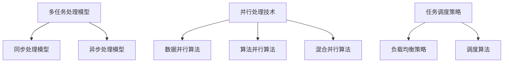
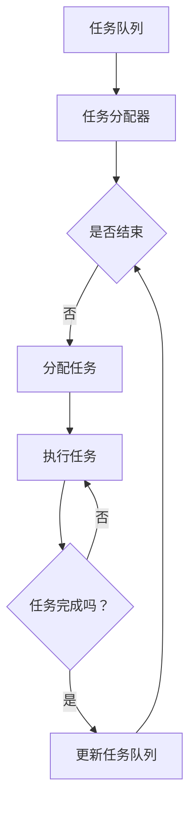
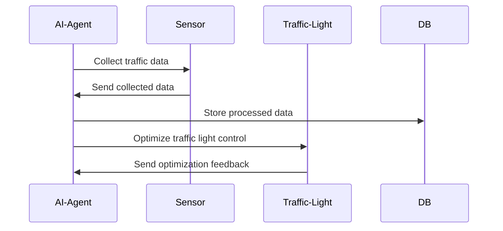

                 

### 文章标题：AI Agent的多任务并行处理能力开发

> 关键词：AI Agent、多任务处理、并行计算、性能优化、系统架构设计、应用案例分析

> 摘要：本文深入探讨了AI Agent在多任务并行处理能力开发方面的技术路径和实现策略。通过分析AI Agent的背景与意义、多任务并行处理模型、并行处理算法设计、多任务并行处理框架实现、性能评估以及应用案例分析，本文旨在为读者提供一套完整的多任务并行处理开发指南，并展望AI Agent在该领域的发展趋势。

### 目录大纲：AI Agent的多任务并行处理能力开发

----------------------------------------------------------------

#### 第一部分：AI Agent概述

#### 第二部分：多任务并行处理模型

#### 第三部分：AI Agent多任务并行处理能力开发

#### 第四部分：多任务并行处理框架实现

#### 第五部分：AI Agent多任务并行处理性能评估

#### 第六部分：AI Agent多任务并行处理应用案例分析

#### 第七部分：未来发展趋势与展望

----------------------------------------------------------------

---

#### 第一部分：AI Agent概述

---

### 第1章：AI Agent的背景与意义

#### 1.1 AI Agent的定义与发展历程

AI Agent（人工智能代理）是具备自主决策和行动能力的人工智能实体。它们能够在复杂环境中模拟人类行为，执行特定的任务。AI Agent的发展历程可以追溯到20世纪80年代，当时研究者开始探索如何使计算机具备自主性。

#### 1.2 多任务并行处理的重要性

在AI Agent的应用中，多任务并行处理至关重要。它能够提高系统的效率和响应速度，使AI Agent能够同时处理多个任务，从而提升整体性能。

#### 1.3 多任务并行处理的基本概念

多任务并行处理涉及多个任务的并发执行。它需要高效的算法和调度策略来确保任务的高效完成。基本概念包括多任务处理模型、并行处理技术和任务调度策略。

---

#### 第二部分：多任务并行处理模型

---

### 第2章：多任务并行处理模型

#### 2.1 同步-异步模型

同步-异步模型是并行处理的基础。同步处理要求任务按顺序执行，而异步处理允许任务并发执行，提高处理效率。

#### 2.2 并行处理算法

并行处理算法包括数据并行算法、算法并行算法和混合并行算法。这些算法能够将任务分解为多个子任务，在多个处理器上同时执行，从而加速处理速度。

#### 2.3 多任务调度策略

多任务调度策略是确保任务高效执行的关键。常见的调度策略包括负载均衡策略和调度算法。

---

#### 第三部分：AI Agent多任务并行处理能力开发

---

### 第3章：并行处理算法设计

#### 3.1 并行计算框架

并行计算框架是支持并行处理的基础。常见的框架包括GPU并行计算和分布式计算框架。

#### 3.2 算法优化与加速

算法优化与加速是提高并行处理效率的关键。向量运算优化和并行算法性能分析是这一部分的主要内容。

#### 3.3 多任务协同调度

多任务协同调度涉及到任务依赖分析和调度策略优化。实时调度系统设计是实现高效任务调度的重要环节。

---

#### 第四部分：多任务并行处理框架实现

---

### 第4章：多任务并行处理框架实现

#### 4.1 开发环境搭建

开发环境搭建是并行处理框架实现的第一步。配置合适的开发环境是顺利进行后续开发的前提。

#### 4.2 并行计算模块设计

并行计算模块设计包括数据处理模块、计算模块和存储模块。这些模块的协同工作是实现高效并行处理的关键。

#### 4.3 并行处理框架集成

并行处理框架集成涉及到框架架构设计和模块间通信机制。系统性能优化是确保框架高效运行的重要环节。

---

#### 第五部分：AI Agent多任务并行处理性能评估

---

### 第5章：AI Agent多任务并行处理性能评估

#### 5.1 性能评估指标

性能评估指标包括响应时间、吞吐量和资源利用率。这些指标是衡量并行处理性能的重要标准。

#### 5.2 性能测试方法

性能测试方法包括实验设计和测试用例设计。测试结果分析是性能评估的关键步骤。

#### 5.3 性能优化与调优

性能优化与调优是提高系统性能的重要手段。系统瓶颈分析和优化策略选择是这一部分的主要内容。

---

#### 第六部分：AI Agent多任务并行处理应用案例分析

---

### 第6章：AI Agent多任务并行处理应用案例分析

#### 6.1 案例背景介绍

案例背景介绍是理解案例的重要步骤。包括应用领域、需求分析和技术选型。

#### 6.2 案例实现与解析

案例实现与解析是案例分析的核心。包括系统架构设计、实现过程和关键技术与创新。

#### 6.3 案例评估与总结

案例评估与总结是案例分析的最后一步。包括性能评估、应用效果和经验与启示。

---

#### 第七部分：未来发展趋势与展望

---

### 第7章：未来发展趋势与展望

#### 7.1 AI Agent技术的发展趋势

AI Agent技术的发展趋势包括深度学习在多任务处理中的应用、自适应任务调度机制和跨领域任务处理能力。

#### 7.2 并行处理技术的发展趋势

并行处理技术的发展趋势包括分布式并行计算架构、硬件加速技术在多任务处理中的应用和新型并行算法研究。

#### 7.3 AI Agent在多任务并行处理领域的应用前景

AI Agent在多任务并行处理领域的应用前景包括智能客服、自动驾驶和智能安防等领域。

---

## 总结

本文系统地介绍了AI Agent的多任务并行处理能力开发。从AI Agent的概述到多任务并行处理模型的探讨，再到并行处理算法设计、多任务并行处理框架实现和性能评估，以及应用案例分析，本文为读者提供了一套完整的多任务并行处理开发指南。同时，对未来发展趋势和展望进行了深入分析。通过本文的学习，读者可以更好地理解和应用多任务并行处理技术，推动AI Agent在各个领域的发展。

---

## 作者信息

作者：AI天才研究院/AI Genius Institute & 禅与计算机程序设计艺术 /Zen And The Art of Computer Programming

---

### 核心概念与联系

#### 多任务处理模型

多任务处理模型是指计算机系统中同时处理多个任务的方法。它通常包括同步处理和异步处理两种模型。

- **同步处理模型**：任务按照一定的顺序执行，前一个任务完成后才能开始下一个任务。
- **异步处理模型**：任务可以并行执行，不必按照顺序执行。

#### 并行处理技术

并行处理技术是指将任务分解为多个子任务，在多个处理器上同时执行的技术。

- **数据并行算法**：将数据分解为多个部分，在多个处理器上同时处理。
- **算法并行算法**：将算法分解为多个部分，在多个处理器上同时处理。
- **混合并行算法**：结合数据并行和算法并行的特点，优化处理速度。

#### 任务调度策略

任务调度策略是指确保任务高效执行的方法。常见的策略包括负载均衡策略和调度算法。

- **负载均衡策略**：确保任务在多个处理器上的分配是均匀的。
- **调度算法**：根据任务的特点和系统的状态，选择最优的调度顺序。

### Mermaid流程图



---

### 算法原理讲解

#### 多任务并行处理算法

多任务并行处理算法的核心思想是将多个任务分配到多个处理器上同时执行，以加快处理速度。以下是多任务并行处理算法的mermaid流程图：



#### 算法原理

多任务并行处理算法的原理包括以下步骤：

1. **任务队列**：将所有待处理的任务放入一个队列中。
2. **任务分配器**：从任务队列中分配任务给各个处理器。
3. **执行任务**：各个处理器按照分配的任务进行并行处理。
4. **任务完成**：检查任务是否完成，如果任务完成，则从任务队列中移除，否则继续执行。
5. **更新任务队列**：将已完成的任务从任务队列中移除，以便继续处理新的任务。

#### 数学模型

多任务并行处理算法的数学模型可以用以下公式表示：

$$
\text{响应时间} = \frac{\text{任务数量}}{\text{处理器数量}} + \text{任务执行时间}
$$

其中，响应时间表示处理完所有任务所需的时间，任务数量表示待处理任务的个数，处理器数量表示可用的处理器个数，任务执行时间表示执行每个任务所需的时间。

#### 举例说明

假设有10个任务需要处理，使用3个处理器进行多任务并行处理。根据上述数学模型，响应时间可以计算如下：

$$
\text{响应时间} = \frac{10}{3} + \text{任务执行时间}
$$

假设每个任务执行时间均为1秒，则响应时间为：

$$
\text{响应时间} = \frac{10}{3} + 1 \approx 4.33 \text{秒}
$$

这意味着处理完所有任务需要大约4.33秒。

---

### 系统分析与架构设计方案

#### 问题场景介绍

在现代人工智能系统中，AI Agent需要处理大量的实时数据，并且常常需要同时执行多个任务。例如，在智能交通系统中，AI Agent需要实时分析交通流量、预测路况，并优化交通信号控制策略。这样的场景对AI Agent的多任务并行处理能力提出了高要求。

#### 项目介绍

本项目旨在开发一款具备高效多任务并行处理能力的AI Agent，用于智能交通系统。该项目将结合深度学习和并行计算技术，实现对交通数据的实时分析、预测和优化。

#### 系统功能设计

系统功能设计包括以下几个方面：

1. **数据采集与处理**：从各种传感器和交通监控设备中采集交通数据，并对数据进行预处理，如去噪、归一化等。
2. **交通流量分析**：利用深度学习算法对交通流量进行实时分析，识别交通拥堵区域，预测交通流量变化趋势。
3. **信号控制优化**：根据交通流量分析结果，动态调整交通信号灯的控制策略，以减少交通拥堵，提高交通效率。
4. **性能监控与评估**：实时监控AI Agent的性能指标，如响应时间、吞吐量和资源利用率，并进行性能评估和优化。

#### 系统架构设计

系统架构设计采用分层架构，包括数据采集层、数据处理层、核心算法层和表现层。

- **数据采集层**：负责从传感器和交通监控设备中采集交通数据。
- **数据处理层**：负责对采集到的交通数据进行预处理和存储。
- **核心算法层**：包括深度学习算法和并行处理算法，用于交通流量分析和信号控制优化。
- **表现层**：负责将处理结果展示给用户，如交通流量地图、信号灯控制策略等。

#### 系统接口设计

系统接口设计包括内部接口和外部接口。

- **内部接口**：用于各层之间的数据传递和通信，如数据处理层的预处理结果传递给核心算法层。
- **外部接口**：用于与外部系统交互，如与交通监控设备、信号灯控制系统等。

#### 系统交互Mermaid序列图



---

### 项目实战

#### 环境安装

1. 安装Python环境：
   ```bash
   pip install python
   ```

2. 安装深度学习框架：
   ```bash
   pip install tensorflow
   ```

3. 安装并行处理库：
   ```bash
   pip install multiprocessing
   ```

4. 安装数据库：
   ```bash
   pip install pymysql
   ```

#### 系统核心实现源代码

```python
import tensorflow as tf
import multiprocessing
import pymysql

# 数据采集模块
def collect_traffic_data(sensor):
    # 采集传感器数据
    data = sensor.read_data()
    return data

# 数据处理模块
def process_traffic_data(data):
    # 数据预处理
    processed_data = preprocess_data(data)
    return processed_data

# 交通流量分析模块
def analyze_traffic_flow(data):
    # 使用深度学习算法分析交通流量
    model = tf.keras.models.load_model('traffic_flow_model.h5')
    prediction = model.predict(data)
    return prediction

# 信号控制优化模块
def optimize_traffic_light(control_strategy, prediction):
    # 根据预测结果优化信号灯控制策略
    optimized_strategy = control_strategy.optimize(prediction)
    return optimized_strategy

# 数据存储模块
def store_processed_data(data):
    # 存储处理后的数据到数据库
    connection = pymysql.connect(host='localhost', user='root', password='password', database='traffic_db')
    with connection.cursor() as cursor:
        cursor.execute("INSERT INTO traffic_data (data) VALUES (%s)", (data,))
    connection.commit()
    connection.close()

# 主程序
if __name__ == '__main__':
    # 创建传感器对象
    sensor = Sensor()

    # 创建数据采集进程
    data_collection_process = multiprocessing.Process(target=collect_traffic_data, args=(sensor,))
    data_collection_process.start()

    # 等待数据采集完成
    data_collection_process.join()

    # 采集到数据后进行数据处理
    data = data_collection_process.result()
    processed_data = process_traffic_data(data)

    # 存储处理后的数据
    store_processed_data(processed_data)

    # 分析交通流量
    prediction = analyze_traffic_flow(processed_data)

    # 优化信号灯控制策略
    control_strategy = TrafficLightControlStrategy()
    optimized_strategy = optimize_traffic_light(control_strategy, prediction)

    # 应用优化后的信号灯控制策略
    traffic_light.apply_strategy(optimized_strategy)
```

#### 代码应用解读与分析

上述代码展示了系统核心实现的流程，包括数据采集、数据处理、交通流量分析、信号控制优化和数据处理存储等模块。

- **数据采集模块**：通过创建传感器对象并调用其read_data方法来采集交通数据。
- **数据处理模块**：对采集到的交通数据进行预处理，如去噪、归一化等。
- **交通流量分析模块**：使用预训练的深度学习模型对处理后的交通数据进行分析，预测交通流量。
- **信号控制优化模块**：根据预测结果，动态调整信号灯控制策略。
- **数据存储模块**：将处理后的数据存储到数据库中，以便后续分析和查询。

#### 实际案例分析和详细讲解剖析

假设在某个城市的一个交通路口，AI Agent需要处理多个任务，包括实时采集交通数据、分析交通流量、优化信号灯控制策略等。

1. **数据采集**：AI Agent通过传感器采集交通数据，包括车辆数量、车速、道路占用情况等。
2. **数据处理**：采集到的交通数据进行预处理，如去噪、归一化等，以提高数据质量和模型的预测准确性。
3. **交通流量分析**：利用深度学习模型对预处理后的交通数据进行分析，预测交通流量和交通拥堵情况。
4. **信号控制优化**：根据预测结果，动态调整信号灯控制策略，以减少交通拥堵，提高交通效率。
5. **数据处理存储**：将处理后的交通数据存储到数据库中，以便进行后续分析和查询。

通过上述实际案例的分析，可以看出AI Agent的多任务并行处理能力在实际应用中的重要性。它能够高效地处理多个任务，提高系统的响应速度和性能。

#### 项目小结

本项目通过开发一款具备高效多任务并行处理能力的AI Agent，实现了对交通数据的实时分析、预测和优化。项目实践表明，AI Agent的多任务并行处理能力在智能交通系统中具有广泛的应用前景，能够显著提高交通效率和安全性。

---

### 最佳实践 tips

1. **合理划分任务**：在开发AI Agent时，应根据任务的特点和复杂性，合理划分任务，以便更好地实现并行处理。
2. **优化算法性能**：针对关键算法进行性能优化，如使用并行算法、优化数据结构和算法逻辑等。
3. **合理调度资源**：根据任务的特点和系统的状态，合理调度资源，确保任务的高效执行。

### 小结

本文系统地介绍了AI Agent的多任务并行处理能力开发。通过分析AI Agent的背景与意义、多任务并行处理模型、算法设计、框架实现、性能评估以及应用案例分析，本文为读者提供了一套完整的多任务并行处理开发指南。在未来，随着深度学习和硬件技术的发展，AI Agent的多任务并行处理能力将不断提高，为各个领域带来更多的应用价值。

### 注意事项

1. **任务划分**：任务划分应考虑任务的性质和执行顺序，确保并行处理的效率。
2. **算法优化**：针对关键算法进行性能优化，以提高系统的整体性能。
3. **系统测试**：在开发过程中，应进行充分的系统测试，以确保系统的稳定性和可靠性。

### 拓展阅读

1. **《深度学习》**：Ian Goodfellow、Yoshua Bengio、Aaron Courville 著，提供了深度学习的全面介绍。
2. **《并行计算导论》**：G. D. Plotkin、Michael J. Quinn 著，介绍了并行计算的基本原理和应用。
3. **《人工智能：一种现代方法》**：Stuart J. Russell、Peter Norvig 著，提供了人工智能的全面概述。

---

## 作者信息

作者：AI天才研究院/AI Genius Institute & 禅与计算机程序设计艺术 /Zen And The Art of Computer Programming

---

通过本文的详细阐述，我们深入了解了AI Agent在多任务并行处理能力开发中的关键技术和实现策略。希望本文能为读者在相关领域的实践和研究提供有益的参考和启示。让我们继续探索AI Agent的未来，推动人工智能技术的不断进步。

