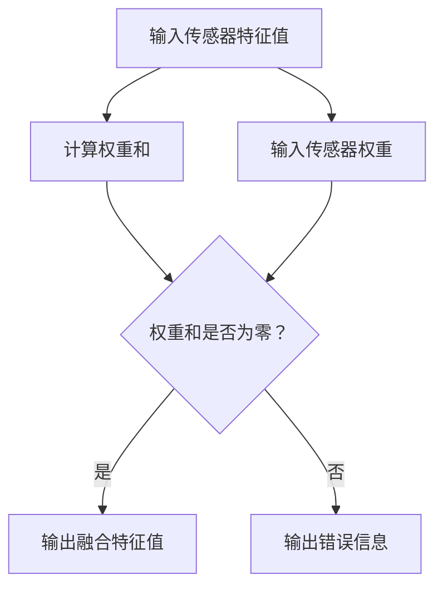
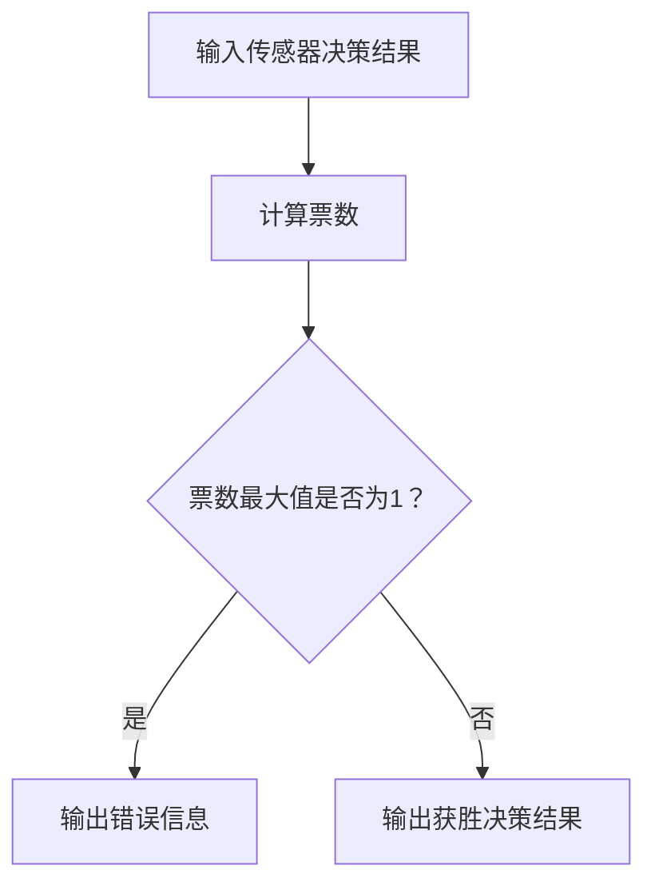

                 


### # AI Agent的多传感器数据融合技术

> 关键词：人工智能、多传感器数据融合、算法原理、系统架构、实战案例

> 摘要：本文深入探讨了人工智能（AI）代理中的多传感器数据融合技术。首先，我们介绍了多传感器数据融合的基本概念、背景和重要性。接着，我们详细讲解了多传感器数据融合的原理和技术，包括特征级融合和决策级融合。然后，我们讨论了多传感器数据融合在导航、对象识别和决策制作中的应用。最后，本文对未来的研究方向进行了展望。

---

## 引言

随着科技的不断发展，人工智能（AI）已经从理论研究逐渐走向实际应用。AI 代理，作为人工智能的核心组成部分，在各种领域中发挥着重要作用。例如，在自动驾驶汽车、智能监控和机器人技术中，AI 代理需要处理来自多个传感器的数据，以实现精确的环境感知和决策制作。

多传感器数据融合技术是 AI 代理的核心技术之一。它通过整合来自不同传感器的数据，提高数据的准确性和可靠性，从而提高 AI 代理的性能。本文将深入探讨多传感器数据融合技术，包括其原理、技术和应用，以期为读者提供全面的理解。

---

## 多传感器数据融合的基本概念

### 定义与分类

多传感器数据融合是指将多个传感器收集的数据进行综合处理，以产生更准确、更完整的信息。根据数据处理的方式，多传感器数据融合可以分为特征级融合和决策级融合。

- **特征级融合**：在特征级融合中，传感器数据首先被转换为特征向量，然后通过一定的算法进行融合。这种方法适用于需要高精度、高鲁棒性的应用场景。

- **决策级融合**：在决策级融合中，每个传感器独立处理数据，并产生各自的决策结果。然后，通过一定的算法将这些决策结果进行融合，以产生最终的决策。这种方法适用于需要快速响应、实时处理的应用场景。

### 背景

随着传感器技术的进步，越来越多的传感器被应用于各种领域。例如，在自动驾驶汽车中，摄像头、激光雷达、GPS 和超声波传感器等被广泛使用。这些传感器各自有其独特的优势和局限性。例如，摄像头适用于图像识别，但易受光照和天气条件的影响；激光雷达适用于距离测量，但易受障碍物的影响。

因此，如何有效地融合多个传感器的数据，以获得更准确、更可靠的信息，成为了一个重要问题。多传感器数据融合技术在这种情况下显得尤为重要。

### 重要性

多传感器数据融合技术具有以下重要性：

- **提高数据准确性**：通过融合多个传感器的数据，可以消除单个传感器的误差，提高数据的准确性。

- **提高系统鲁棒性**：多个传感器的数据融合可以降低系统对单个传感器的依赖，提高系统的鲁棒性。

- **扩展系统功能**：通过融合不同类型的传感器数据，可以扩展系统的功能，实现更复杂的应用。

### 问题与挑战

尽管多传感器数据融合技术具有许多优点，但在实际应用中也面临着一些挑战：

- **数据不一致性**：不同传感器可能采用不同的数据采集方式和格式，导致数据之间存在不一致性。

- **数据冗余**：多个传感器可能采集到相同或相似的信息，导致数据冗余。

- **计算复杂性**：多传感器数据融合通常涉及复杂的算法和计算，对计算资源和时间的要求较高。

### 边界与外延

多传感器数据融合技术的边界在于如何有效地融合多个传感器的数据，以产生有价值的信息。其外延则包括各种应用场景，如自动驾驶、机器人、智能家居等。

### 概念结构与核心要素组成

多传感器数据融合技术由以下几个核心要素组成：

- **传感器**：数据源，负责采集环境信息。

- **数据处理**：对传感器数据进行预处理、特征提取和融合。

- **算法**：实现数据融合的核心，包括特征级融合算法和决策级融合算法。

- **应用**：数据融合技术在具体应用场景中的实现。

### 核心概念与联系

**多传感器数据融合**：将多个传感器的数据综合处理，以产生更准确、更完整的信息。

**特征级融合**：传感器数据转换为特征向量，通过算法进行融合。

**决策级融合**：传感器独立处理数据，产生决策结果，通过算法进行融合。

**核心属性特征对比表格：**

| 特征 | 特征级融合 | 决策级融合 |
| ---- | ---- | ---- |
| 数据处理方式 | 特征向量 | 决策结果 |
| 算法复杂度 | 较高 | 较低 |
| 响应速度 | 较慢 | 较快 |

**ER实体关系图架构：**

```mermaid
erDiagram
    Sensor --> DataFusion : "采集"
    DataFusion --> FeatureFusion : "处理"
    DataFusion --> DecisionFusion : "处理"
    FeatureFusion --> Algorithm : "使用"
    DecisionFusion --> Algorithm : "使用"
```

---

## 多传感器数据融合的原理

多传感器数据融合的原理主要包括数据预处理、特征提取和融合算法。以下将逐一介绍这些核心概念。

### 数据预处理

数据预处理是数据融合的基础步骤，其主要目标是消除传感器噪声、数据不一致性和冗余信息。数据预处理包括以下几种方法：

- **去噪**：通过滤波器去除传感器数据中的噪声。
- **归一化**：将传感器数据进行归一化处理，使其具有相同的量纲和范围。
- **数据转换**：将不同类型的数据转换为统一格式，以便进行后续处理。

### 特征提取

特征提取是将原始传感器数据转换为具有区分性的特征向量。特征提取的关键在于如何从大量数据中提取出有用的信息。常用的特征提取方法包括：

- **时域特征提取**：基于时间序列数据，提取如均值、方差、频率等特征。
- **频域特征提取**：基于频域分析，提取如峰值频率、共振峰频率等特征。
- **空域特征提取**：基于空间分布数据，提取如中心点、范围等特征。

### 融合算法

融合算法是多传感器数据融合的核心，其主要目标是整合多个传感器的数据，产生更准确、更可靠的信息。根据融合层次，融合算法可以分为特征级融合算法和决策级融合算法。

**特征级融合算法**：

- **加权平均法**：将多个传感器的特征值进行加权平均，得到最终的融合特征值。
- **最小二乘法**：基于最小二乘原理，对多个传感器的特征值进行融合。
- **卡尔曼滤波**：一种基于贝叶斯理论的滤波算法，适用于线性动态系统。

**决策级融合算法**：

- **投票法**：根据每个传感器的决策结果，进行投票，选择获胜的决策。
- **加权投票法**：在投票法的基础上，对每个传感器的决策结果进行加权。
- **贝叶斯推理**：基于贝叶斯理论，对多个传感器的决策结果进行融合。

### 算法原理讲解

#### 特征级融合算法 - 加权平均法

加权平均法是一种简单且常用的特征级融合算法。其基本思想是：根据每个传感器的可靠性和重要性，对传感器的特征值进行加权平均，得到最终的融合特征值。

**算法原理：**

假设有 \( n \) 个传感器，其特征值分别为 \( x_1, x_2, ..., x_n \)，权重分别为 \( w_1, w_2, ..., w_n \)。则加权平均法得到的融合特征值为：

$$
y = \frac{\sum_{i=1}^{n} w_i x_i}{\sum_{i=1}^{n} w_i}
$$

**Mermaid流程图：**



**Python源代码：**

```python
import numpy as np

def weighted_average(feat_values, weights):
    if np.sum(weights) == 0:
        raise ValueError("权重和不能为零")
    return np.sum(weights * feat_values) / np.sum(weights)
```

**数学模型和公式：**

$$
y = \frac{\sum_{i=1}^{n} w_i x_i}{\sum_{i=1}^{n} w_i}
$$

**举例说明：**

假设有两个传感器，其特征值分别为 \( x_1 = [1, 2, 3] \) 和 \( x_2 = [4, 5, 6] \)，权重分别为 \( w_1 = 0.6 \) 和 \( w_2 = 0.4 \)。则融合特征值为：

$$
y = \frac{0.6 \cdot [1, 2, 3] + 0.4 \cdot [4, 5, 6]}{0.6 + 0.4} = [2.6, 3.6, 4.6]
$$

#### 决策级融合算法 - 投票法

投票法是一种简单的决策级融合算法。其基本思想是：根据每个传感器的决策结果，进行投票，选择获胜的决策。

**算法原理：**

假设有 \( n \) 个传感器，其决策结果分别为 \( d_1, d_2, ..., d_n \)，每个决策结果对应的票数为 \( v_1, v_2, ..., v_n \)。则投票法得到的融合决策结果为：

$$
d_{\text{融合}} = \arg\max_{i} v_i
$$

**Mermaid流程图：**



**Python源代码：**

```python
import numpy as np

def vote(d decisiones, votes):
    if np.max(votes) == 1:
        raise ValueError("没有明确获胜的决策")
    return np.argmax(votes)
```

**数学模型和公式：**

$$
d_{\text{融合}} = \arg\max_{i} v_i
$$

**举例说明：**

假设有两个传感器，其决策结果分别为 \( d_1 = 1 \) 和 \( d_2 = 0 \)，票数分别为 \( v_1 = 3 \) 和 \( v_2 = 2 \)。则融合决策结果为 \( d_{\text{融合}} = 1 \)。

---

## 多传感器数据融合技术在AI代理中的应用

多传感器数据融合技术在人工智能（AI）代理中有着广泛的应用，这些应用主要体现在导航、对象识别和决策制作等方面。以下将分别探讨这些应用场景。

### 导航与路径规划

在自动驾驶车辆和机器人导航中，多传感器数据融合技术是实现精确定位和路径规划的关键。以下是一些具体应用：

- **自动驾驶车辆**：自动驾驶车辆通常使用摄像头、激光雷达、GPS 和超声波传感器等设备进行环境感知。通过多传感器数据融合，自动驾驶车辆可以准确地识别道路、行人、车辆等障碍物，并规划出安全的行驶路径。

  **应用场景**：在复杂城市交通环境中，自动驾驶车辆需要实时感知和响应道路变化，以避免碰撞和保持行驶安全。多传感器数据融合技术可以提供高精度的环境信息，提高自动驾驶车辆的感知能力和决策准确性。

- **机器人导航**：机器人导航同样需要准确的环境感知和路径规划。通过融合摄像头、激光雷达、IMU（惯性测量单元）等传感器的数据，机器人可以在室内外环境中实现自主导航。

  **应用场景**：在工业自动化、仓库管理、家庭服务等领域，机器人需要具备自主导航能力，以便高效地完成任务。多传感器数据融合技术可以提供稳定的导航数据，使机器人能够准确地识别和避障，提高工作效率。

### 对象识别与跟踪

多传感器数据融合技术在对象识别与跟踪中也发挥着重要作用。通过整合来自不同传感器的数据，可以实现对对象的精确识别和实时跟踪。以下是一些具体应用：

- **对象识别**：在图像识别和语音识别中，多传感器数据融合技术可以提高识别的准确性和鲁棒性。例如，在图像识别中，通过融合摄像头和激光雷达的数据，可以更准确地识别物体的形状、大小和位置。

  **应用场景**：在智能监控、医疗诊断、安全检查等领域，对象识别技术可以用于识别和分析特定对象，以提高监控和检测的准确性。

- **对象跟踪**：在动态环境中，对象跟踪是一个具有挑战性的任务。通过融合摄像头、雷达和超声波传感器等数据，可以实现对对象的实时跟踪，提高跟踪的稳定性和准确性。

  **应用场景**：在安防监控、无人驾驶飞行器、机器人足球等领域，对象跟踪技术可以用于实时监测和跟踪特定对象，以提高系统的反应速度和决策能力。

### 决策制作

多传感器数据融合技术还可以用于 AI 代理的决策制作，通过融合多个传感器的数据，可以生成更准确、更可靠的决策。以下是一些具体应用：

- **智能监控**：在智能监控系统中，多传感器数据融合技术可以用于实时监控和异常检测。通过融合摄像头、麦克风、温湿度传感器等数据，可以实现对环境的全面监控，并自动识别和报警。

  **应用场景**：在智能家居、智能工厂、智能城市等领域，智能监控系统可以用于实时监测环境变化，提高安全管理水平。

- **无人机编队**：在无人机编队飞行中，多传感器数据融合技术可以用于无人机之间的协调和控制。通过融合摄像头、惯性测量单元、GPS 等数据，可以实现无人机的精确导航和协同动作。

  **应用场景**：在无人机表演、无人机救援、无人机测绘等领域，无人机编队可以用于实现复杂任务的高效执行。

### 实际案例分析

以下是一些实际案例，展示了多传感器数据融合技术在 AI 代理中的应用：

- **案例一：自动驾驶汽车**：谷歌的自动驾驶汽车采用了多传感器数据融合技术，通过融合摄像头、激光雷达、GPS 和超声波传感器等数据，实现了高精度的环境感知和路径规划，使其在复杂城市交通环境中表现出色。

- **案例二：机器人足球**：在机器人足球比赛中，多传感器数据融合技术被用于实现机器人的实时定位和对方球员的跟踪。通过融合摄像头、IMU 和超声波传感器等数据，机器人可以准确地识别和跟踪对手，提高比赛策略的制定和执行。

- **案例三：智能监控**：深圳平安科技的智能监控系统采用了多传感器数据融合技术，通过融合摄像头、麦克风和温湿度传感器等数据，实现了对城市的实时监控和异常检测，提高了城市的安全管理水平。

### 项目小结

通过以上案例分析，可以看出多传感器数据融合技术在 AI 代理中的应用非常广泛。它不仅提高了 AI 代理的感知能力和决策准确性，还扩展了 AI 代理的应用范围。未来，随着传感器技术和算法的不断发展，多传感器数据融合技术将在更多领域得到应用，为人工智能的发展贡献力量。

---

## 最佳实践 tips

### 多传感器数据融合技术的最佳实践

1. **合理选择传感器**：在选择传感器时，应考虑传感器的种类、精度、可靠性和成本。根据应用需求，选择合适的传感器组合，以实现最佳的数据融合效果。

2. **优化数据预处理**：数据预处理是数据融合的基础，应确保传感器数据的准确性和一致性。通过有效的去噪、归一化和数据转换，提高数据融合的精度。

3. **合理选择融合算法**：根据应用场景和数据特点，选择合适的融合算法。对于需要高精度和高鲁棒性的应用，建议采用特征级融合算法；对于需要快速响应和实时处理的应用，建议采用决策级融合算法。

4. **优化算法参数**：融合算法的性能很大程度上取决于参数的选择。应通过实验和调整，找到最优的参数组合，以提高数据融合的准确性。

5. **充分利用传感器互补性**：不同传感器具有不同的优势和局限性，应充分利用传感器的互补性，以提高数据融合的效果。例如，摄像头适用于图像识别，激光雷达适用于距离测量，GPS 适用于定位，超声波传感器适用于障碍物检测。

### 注意事项

1. **数据一致性和同步性**：多传感器数据融合过程中，确保传感器数据的一致性和同步性非常重要。应采用适当的方法，如时间同步、数据同步等，确保传感器数据之间的同步。

2. **计算资源管理**：多传感器数据融合通常涉及复杂的计算过程，需要较高的计算资源和时间。在设计和实现过程中，应充分考虑计算资源的限制，优化算法性能。

3. **数据隐私和安全**：在多传感器数据融合过程中，应充分考虑数据隐私和安全问题。确保传感器数据的采集、传输和存储过程符合相关法律法规和安全要求。

### 拓展阅读

- **《多传感器数据融合技术及其应用》**：详细介绍了多传感器数据融合的基本概念、原理和技术，以及其在各个领域的应用。

- **《人工智能：一种现代方法》**：介绍了人工智能的基本概念、原理和应用，包括多传感器数据融合技术在 AI 代理中的应用。

- **《深度学习：介绍与优化》**：介绍了深度学习的基本概念、原理和应用，以及如何将深度学习与多传感器数据融合技术相结合。

---

### 总结

多传感器数据融合技术是人工智能（AI）代理领域的重要研究方向。通过整合多个传感器的数据，可以提高 AI 代理的感知能力和决策准确性，从而实现更高效、更智能的应用。本文从基本概念、原理、技术和应用等方面，对多传感器数据融合技术进行了深入探讨。

### 关键点回顾

1. **基本概念**：多传感器数据融合是将多个传感器的数据综合处理，以产生更准确、更完整的信息。

2. **原理**：多传感器数据融合包括数据预处理、特征提取和融合算法。数据预处理是基础，特征提取是核心，融合算法是实现的关键。

3. **技术**：特征级融合和决策级融合是两种主要的融合方法。特征级融合适用于高精度、高鲁棒性的应用，决策级融合适用于快速响应、实时处理的应用。

4. **应用**：多传感器数据融合技术在导航、对象识别和决策制作等方面有着广泛的应用。通过实际案例，展示了多传感器数据融合技术在自动驾驶、机器人导航、智能监控等领域的成功应用。

### 展望

随着传感器技术和计算能力的不断发展，多传感器数据融合技术将在更多领域得到应用。未来，我们将看到更加智能化、高效化的多传感器数据融合系统，为人工智能的发展贡献力量。

### 作者信息

作者：AI天才研究院/AI Genius Institute & 禅与计算机程序设计艺术 /Zen And The Art of Computer Programming

---

以上就是本文的完整内容。希望本文对您理解多传感器数据融合技术有所帮助。如果您有任何疑问或建议，请随时联系作者。感谢您的阅读！

