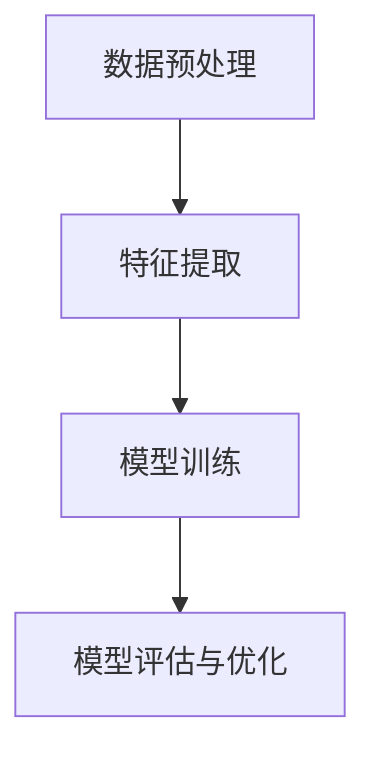
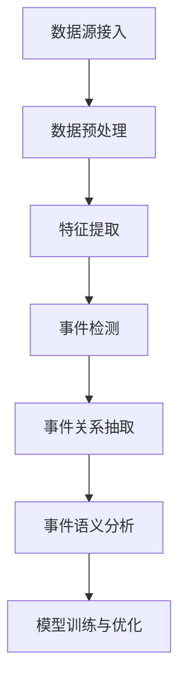
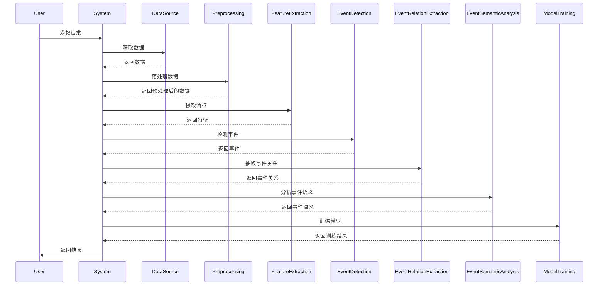

                 

### 第一部分：概述与基础

#### 第1章：AI Agent与多模态事件抽取技术概述

**1.1 AI Agent的定义与作用**

AI Agent，即人工智能代理，是一种模拟人类智能行为的计算机程序。它们能够自主学习、推理、决策和执行任务，旨在提供智能化服务或解决特定问题。AI Agent在人工智能领域具有广泛的应用，如自动化客服、智能推荐系统、自动驾驶等。

**核心概念术语说明：**
- AI Agent：人工智能代理，负责模拟人类智能行为的计算机程序。
- 多模态事件抽取技术：从多种数据源中提取事件信息的技术。

**问题背景与问题描述**

随着大数据和物联网技术的发展，AI Agent需要处理来自不同模态（如文本、图像、声音）的数据。这些数据通常包含大量的事件信息，如新闻、社交媒体帖子、传感器数据等。然而，如何有效地从这些多模态数据中提取有用的事件信息，成为一个亟待解决的问题。

**问题解决方法**

多模态事件抽取技术旨在通过整合不同模态的数据，提取出有意义的事件信息。这需要解决以下几个关键问题：
1. 数据整合：如何将来自不同模态的数据进行整合，以形成一个统一的数据表示。
2. 事件检测：如何从整合后的数据中检测出事件。
3. 事件关系抽取：如何识别事件之间的关联关系。
4. 事件语义分析：如何对事件进行语义分析，提取出关键信息。

**边界与外延**

多模态事件抽取技术的适用范围包括但不限于以下场景：
1. 跨媒体新闻推荐系统：从文本、图像、视频等多种媒体中提取事件信息，为用户提供个性化推荐。
2. 智能问答系统：从多种数据源中提取事件信息，以回答用户的问题。
3. 事件驱动系统：如自动驾驶系统、智能家居系统等，需要实时从传感器数据中提取事件信息，进行决策和执行。

**概念结构与核心要素组成**

多模态事件抽取技术的基本概念和核心要素包括：
1. 数据源：文本、图像、声音等多种数据源。
2. 数据整合：将多种数据源进行整合，形成一个统一的数据表示。
3. 事件检测：检测数据中的事件。
4. 事件关系抽取：识别事件之间的关联关系。
5. 事件语义分析：对事件进行语义分析，提取关键信息。

#### 第2章：AI Agent的算法原理与实现

**2.1 AI Agent算法原理讲解**

AI Agent的算法原理主要包括以下几个步骤：
1. 数据预处理：对来自不同模态的数据进行清洗、去噪、归一化等处理，为后续的算法提供高质量的数据。
2. 特征提取：从预处理后的数据中提取特征，用于表示数据。
3. 模型训练：使用提取到的特征训练机器学习模型，如神经网络、支持向量机等。
4. 模型评估与优化：评估模型性能，并进行优化。

**算法原理讲解**

以下是多模态事件抽取技术的算法原理讲解：

**数学模型和数学公式**

多模态事件抽取技术的核心数学模型包括：
1. 特征提取：使用卷积神经网络（CNN）提取图像特征，使用循环神经网络（RNN）提取文本特征。
2. 模型训练：使用优化算法（如随机梯度下降）训练模型。

数学公式如下：

$$
f(x) = \sum_{i=1}^{n} w_i * x_i
$$

其中，$f(x)$ 表示特征提取函数，$w_i$ 表示权重，$x_i$ 表示特征。

**举例说明**

假设我们有一个文本数据集，包含多个句子，每个句子表示一个事件。我们可以使用以下步骤进行多模态事件抽取：

1. 数据预处理：对文本数据进行清洗、去噪、归一化等处理。
2. 特征提取：使用RNN提取文本特征，使用CNN提取图像特征。
3. 模型训练：使用提取到的特征训练一个神经网络模型，用于检测事件。
4. 模型评估与优化：评估模型性能，并进行优化。

#### 第3章：多模态事件抽取技术的系统架构与实现

**3.1 问题场景介绍**

多模态事件抽取技术在许多场景中都有应用，如：

1. 跨媒体新闻推荐系统：从文本、图像、视频等多种媒体中提取事件信息，为用户提供个性化推荐。
2. 智能问答系统：从多种数据源中提取事件信息，以回答用户的问题。
3. 事件驱动系统：如自动驾驶系统、智能家居系统等，需要实时从传感器数据中提取事件信息，进行决策和执行。

**3.2 系统功能设计**

多模态事件抽取系统的功能设计包括：

1. 数据源接入：接入多种数据源，如文本、图像、声音等。
2. 数据预处理：对数据源数据进行清洗、去噪、归一化等处理。
3. 特征提取：从预处理后的数据中提取特征。
4. 事件检测：检测数据中的事件。
5. 事件关系抽取：识别事件之间的关联关系。
6. 事件语义分析：对事件进行语义分析，提取关键信息。
7. 模型训练与优化：训练机器学习模型，并进行优化。

**3.3 系统架构设计**

多模态事件抽取系统的架构设计如下：

**3.4 系统接口设计和系统交互**

多模态事件抽取系统的接口设计和系统交互如下：

### 第一部分小结

本章首先介绍了AI Agent与多模态事件抽取技术的基本概念和重要性，然后详细讲解了AI Agent的算法原理与实现，最后介绍了多模态事件抽取技术的系统架构与实现。通过对本章内容的理解，读者可以初步掌握多模态事件抽取技术的基本原理和实现方法。

### 注意事项

在应用多模态事件抽取技术时，需要注意以下几点：

1. 数据质量：数据质量直接影响多模态事件抽取的效果，因此需要对数据进行充分的清洗和预处理。
2. 模型选择：根据实际应用场景选择合适的模型，如卷积神经网络（CNN）适合处理图像数据，循环神经网络（RNN）适合处理文本数据。
3. 资源分配：多模态事件抽取技术通常需要大量的计算资源和时间，因此需要合理分配资源，确保系统的高效运行。

### 拓展阅读

1. [《深度学习》](https://www.deeplearningbook.org/)：详细介绍了深度学习的基本原理和应用。
2. [《多模态学习：从基础到应用》](https://books.google.com/books?id=5-yBDwAAQBAJ&pg=PA1&lpg=PA1&dq=multimodal+learning+book&source=bl&ots=3pVLaQ1C-C&sig=ACfU3U3p1_56_9-4Qi0S2TevD-XjO-8TJQ&hl=en)：一本关于多模态学习的入门书籍，涵盖了多模态学习的基础知识与应用。
3. [《人工智能：一种现代方法》](https://www.aima.cs.berkeley.edu/)：一本关于人工智能的权威教材，详细介绍了人工智能的基本原理和方法。

### 最佳实践 tips

1. 在进行多模态事件抽取时，可以根据不同模态的数据特点选择合适的特征提取方法，如CNN适用于图像数据，RNN适用于文本数据。
2. 在模型训练过程中，可以尝试使用多种优化算法，如随机梯度下降（SGD）、Adam等，以寻找最佳的模型性能。
3. 在实际应用中，可以结合业务需求对模型进行调整和优化，以提高模型的实用性和准确性。

