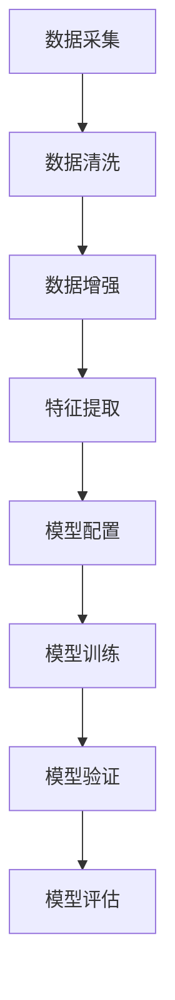

                 

## 引言

### 1.1 问题背景

随着人工智能（AI）技术的迅猛发展，AI代理（AI Agents）在各个领域的应用越来越广泛。AI代理是人工智能系统中的智能体，能够自主地感知环境、采取行动并达到预定的目标。在人类社会中，AI代理已经被应用于许多场景，如智能家居、自动驾驶、医疗诊断等。然而，这些AI代理在实际应用中面临着许多挑战，其中一个关键问题就是多模态场景理解。

多模态场景理解是指AI代理在处理和解析来自多种传感器的数据时，能够准确地理解和识别当前的场景和情境。这些传感器包括视觉传感器、声音传感器、文本传感器、触觉传感器等。传统的AI系统通常依赖于单一模态的数据，如基于图像的视觉系统或基于声音的语音系统。然而，单一模态的数据往往无法提供足够的信息来准确理解复杂的场景。

多模态场景理解的重要性在于它能够提高AI代理的智能水平和决策能力。通过整合来自不同模态的数据，AI代理能够更全面地感知和理解环境，从而做出更准确的决策。例如，一个自动驾驶汽车系统不仅需要依赖摄像头来识别道路和交通标志，还需要依赖激光雷达和雷达来感知周围的环境，以确保行车安全。

### 1.2 多模态场景理解的挑战与意义

尽管多模态场景理解具有重要的意义，但实现这一目标仍然面临许多挑战。以下是其中的几个主要挑战：

1. **数据融合的复杂性**：多模态数据通常具有不同的格式、维度和特征，如何有效地融合这些数据是一个难题。不同的传感器数据可能存在互补性，也可能存在冲突，如何平衡和整合这些数据是一个复杂的问题。

2. **数据同步问题**：多模态数据采集通常需要多个传感器同时工作，不同传感器之间的数据采集时间可能存在差异，如何保证数据的时间一致性是一个关键问题。

3. **特征提取与表示**：不同的模态数据具有不同的特征，如何提取和表示这些特征以便于后续处理是一个重要问题。例如，视觉数据需要提取边缘、纹理等特征，声音数据需要提取音高、节奏等特征。

4. **计算资源限制**：多模态场景理解通常需要大量的计算资源，如何在有限的计算资源下实现高效的场景理解是一个挑战。

多模态场景理解的意义在于：

1. **提高决策准确性**：通过整合多种模态的数据，AI代理能够更全面地了解当前场景，从而提高决策的准确性。

2. **增强交互体验**：多模态交互能够提供更丰富和自然的交互体验，例如，通过视觉、声音和触觉等多模态感知，AI代理能够更准确地理解用户的需求，并提供更个性化的服务。

3. **拓宽应用场景**：多模态场景理解能够拓宽AI代理的应用场景，使其在更复杂的真实世界中发挥作用。

### 1.3 本书的目标和结构

本书旨在全面探讨AI Agent的多模态场景理解技术，帮助读者深入理解这一领域的基本概念、技术原理和实现方法。具体目标如下：

1. **介绍多模态场景理解的基本概念**：通过详细阐述多模态数据的定义、类型和特点，帮助读者建立对多模态场景理解的基础理解。

2. **探讨多模态场景理解的核心技术**：介绍多模态感知与数据预处理、深度学习与多模态数据融合、多模态场景理解的数学模型等核心技术，帮助读者掌握实现多模态场景理解的关键技术。

3. **讲解多模态场景理解的算法实现**：通过Python代码实现，详细讲解多模态场景理解的算法流程和实现细节，帮助读者实际操作和优化算法。

4. **分析多模态场景理解的应用场景**：介绍多模态场景理解在人机交互、智能监控和智能家居等领域的应用，帮助读者了解多模态场景理解在实际应用中的效果和挑战。

5. **总结最佳实践与未来趋势**：总结多模态场景理解的最佳实践，展望未来的发展趋势，帮助读者把握这一领域的前沿动态。

本书的结构如下：

- **第一部分：引言**：介绍多模态场景理解的问题背景、挑战与意义，以及本书的目标和结构。
- **第二部分：多模态数据的定义与类型**：详细阐述多模态数据的定义、分类和特点。
- **第三部分：多模态场景理解的核心概念**：介绍场景理解的概念、多模态感知与数据预处理、多模态数据融合策略。
- **第四部分：多模态场景理解的技术原理**：探讨神经网络技术、深度学习与多模态数据融合、多模态场景理解的数学模型。
- **第五部分：多模态场景理解的算法实现**：讲解多模态场景理解的算法实现，包括算法概述、Python代码实现和算法原理讲解。
- **第六部分：多模态场景理解的应用场景**：分析多模态场景理解在人机交互、智能监控和智能家居等领域的应用。
- **第七部分：多模态场景理解的最佳实践**：总结多模态场景理解的最佳实践，展望未来的发展趋势。

通过本书的系统性学习，读者将能够深入理解多模态场景理解技术，掌握相关理论和实践技能，为在人工智能领域的研究和应用奠定坚实的基础。

### 多模态数据的定义与类型

多模态数据是指由多个不同模态的传感器收集而来的数据。这些模态可以包括视觉、声音、文本、触觉以及其他多种传感器数据。多模态数据融合是人工智能领域中的一个重要研究方向，它旨在将来自不同模态的数据有效地整合在一起，以提高系统的感知能力和决策水平。

#### 2.1 多模态数据的定义

多模态数据融合的定义可以理解为将来自不同模态的数据源进行整合、处理和融合，以形成一个统一且综合的信息表示。具体来说，这一过程包括以下几个步骤：

1. **数据采集**：使用多个传感器同时或依次采集不同的模态数据，如视觉传感器采集图像数据，声音传感器采集音频数据等。

2. **数据预处理**：对采集到的原始数据进行预处理，包括去噪、增强、归一化等，以提高数据的质量和一致性。

3. **特征提取**：从预处理后的数据中提取具有代表性的特征，如视觉数据中的边缘、纹理特征，声音数据中的音高、节奏特征等。

4. **数据融合**：将不同模态的特征进行整合，以形成一个统一的信息表示。数据融合可以采用多种方法，如基于特征的融合、基于模型的融合等。

5. **信息表示**：将融合后的数据表示为一种统一的格式，如向量、图等，以便于后续的处理和应用。

#### 2.2 多模态数据的分类

多模态数据可以根据不同的分类标准进行分类。以下是几种常见的分类方式：

1. **按数据来源分类**：
   - **视觉数据**：由视觉传感器采集，如摄像头、图像传感器等。视觉数据是人工智能领域中最为常见的一种多模态数据。
   - **声音数据**：由声音传感器采集，如麦克风、声波传感器等。声音数据在语音识别、自然语言处理等领域具有重要应用。
   - **文本数据**：由文本传感器采集，如键盘输入、文本传感器等。文本数据在信息检索、机器翻译等领域有广泛应用。
   - **触觉数据**：由触觉传感器采集，如力传感器、触摸传感器等。触觉数据在机器人控制、虚拟现实等领域具有重要应用。
   - **其他传感器数据**：如温度、湿度、压力、磁场等传感器数据。这些数据在环境监测、智能家居等领域有广泛应用。

2. **按数据类型分类**：
   - **结构化数据**：具有固定格式和结构的数据，如关系数据库中的表结构数据。
   - **非结构化数据**：没有固定格式和结构的数据，如文本、图像、声音等。非结构化数据通常需要通过特征提取和语义分析等技术进行预处理。

3. **按数据来源的交互性分类**：
   - **同步数据**：多个传感器同时采集的数据，如摄像头和麦克风同时采集图像和音频数据。
   - **异步数据**：多个传感器在不同时间点采集的数据，如先采集图像数据，后采集音频数据。

#### 2.3 多模态数据的特点

多模态数据具有以下几个特点：

1. **多样性**：多模态数据来源于多种不同的传感器，每种传感器都提供独特的视角和特征，这使得多模态数据具有多样性。

2. **互补性**：不同模态的数据通常具有互补性，一种模态的缺失或不准确可能会通过其他模态的数据得到补偿。

3. **复杂性**：多模态数据融合需要处理来自不同模态的多样性和互补性，这增加了数据融合的复杂性。

4. **实时性**：在某些应用场景中，如自动驾驶、实时监控等，多模态数据需要实时处理，以支持快速决策。

5. **高维性**：多模态数据通常具有高维性，每个模态的数据可能包含大量的特征维度，这使得数据处理和分析更加复杂。

#### 2.4 多模态数据融合的策略

多模态数据融合的策略可以分为以下几类：

1. **基于特征的融合**：将不同模态的特征进行整合，形成一个统一特征空间。常见的融合方法包括特征加权融合、特征拼接、特征映射等。

2. **基于模型的融合**：将不同模态的数据融合到同一个模型中，通过模型训练来学习多模态数据的表示。常见的融合方法包括多任务学习、多模型融合、对抗性神经网络等。

3. **基于数据驱动的方法**：根据数据的特点和需求，设计特定的数据融合方法。这种方法通常需要大量的数据和实验来验证其有效性。

4. **基于知识的方法**：利用领域知识和先验信息来指导多模态数据的融合。这种方法可以在一定程度上减轻数据多样性和互补性的复杂性。

通过上述多模态数据的定义、分类、特点和融合策略的介绍，我们可以看到多模态数据在人工智能应用中的重要性和挑战。在后续章节中，我们将进一步探讨多模态场景理解的核心概念和技术原理，帮助读者深入理解这一领域。

### 多模态场景理解的核心概念

#### 3.1 场景理解的概念

场景理解是指人工智能系统在感知和理解其所在环境时，能够识别和解析当前场景中各种元素和事件的过程。场景理解不仅仅是识别物体和事件，还包括理解它们之间的关系和情境背景。在人工智能领域，场景理解是一个多层次、多维度的复杂任务，其核心在于如何有效地整合和处理来自不同模态的数据，以实现对环境的全面理解。

场景理解的层次结构可以分为以下几个层次：

1. **感知层次**：在这一层次，AI系统通过传感器获取外部环境的信息，如视觉、声音、文本等。感知层次的目标是获取原始数据，并对其进行预处理，如去噪、增强、特征提取等。

2. **特征层次**：在感知层次的基础上，系统对原始数据进行特征提取，生成具有代表性的特征向量。这些特征向量可以是视觉中的边缘、纹理，声音中的音高、节奏，文本中的词向量等。

3. **理解层次**：在这一层次，AI系统利用提取到的特征，通过机器学习算法或其他智能方法，识别和理解场景中的各种元素和事件。理解层次的目标是实现场景的语义表示，如物体分类、事件检测、情境推理等。

4. **决策层次**：在理解了场景之后，AI系统根据当前情境和任务需求，做出相应的决策和行动。决策层次的目标是利用场景理解的结果，指导AI系统的实际操作，如自动驾驶的路径规划、智能监控的目标跟踪等。

#### 3.2 多模态感知与数据预处理

多模态感知是指利用多个不同模态的传感器来获取环境信息。这种多模态的感知方式可以提供更全面、准确的环境信息，从而提高AI系统的感知能力。常见的多模态传感器包括摄像头、麦克风、文本传感器、力传感器等。每个传感器提供的数据都具有独特的视角和特征，通过多模态感知，AI系统可以更全面地了解环境。

数据预处理是多模态场景理解的重要环节，它主要包括以下几个步骤：

1. **数据采集**：使用多个传感器同时或依次采集不同的模态数据。在数据采集过程中，需要考虑传感器之间的同步问题，以确保数据的一致性。

2. **数据清洗**：去除数据中的噪声和异常值，以提高数据的质量。数据清洗可以包括去除噪声、填补缺失值、去除重复数据等。

3. **数据增强**：通过变换、旋转、缩放等方法，增加数据的多样性和丰富性，从而提高模型的泛化能力。

4. **特征提取**：从预处理后的数据中提取具有代表性的特征。不同模态的数据需要采用不同的特征提取方法，如视觉数据可以使用边缘检测、纹理分析等方法，声音数据可以使用频谱分析、语音识别等方法。

5. **数据融合**：将来自不同模态的特征进行整合，形成一个统一的信息表示。数据融合的方法可以包括基于特征的融合、基于模型的融合等。

#### 3.3 多模态数据融合策略

多模态数据融合是场景理解的关键步骤，其目的是利用来自不同模态的数据，提高系统的感知和理解能力。以下是一些常见的多模态数据融合策略：

1. **基于特征的融合**：将不同模态的特征向量进行拼接或加权融合，形成一个多维的特征向量。这种方法简单有效，但需要解决特征维度不一致的问题。

2. **基于模型的融合**：将不同模态的数据输入到同一个模型中进行训练，通过模型学习到多模态数据的内在关系。常见的模型包括多任务学习、多模型融合、对抗性神经网络等。

3. **层次融合策略**：先对每个模态的数据进行单独处理，然后在不同层次上进行融合。这种方法可以更好地利用各模态数据的特性和优势。

4. **领域知识融合**：利用领域知识来指导多模态数据的融合，如利用先验知识来修正数据中的错误或冲突。这种方法可以有效地提高数据融合的准确性和一致性。

5. **自适应融合策略**：根据具体的应用场景和任务需求，动态调整多模态数据的融合策略。这种方法可以根据不同场景的需求，灵活地选择和调整融合方法。

通过多模态感知与数据预处理，AI系统能够更全面地获取和理解环境信息，从而实现更准确的场景理解。多模态数据融合策略的选择和优化对于提高场景理解的准确性和效率至关重要。在后续章节中，我们将进一步探讨多模态场景理解的技术原理和实现方法。

### 多模态场景理解的技术原理

多模态场景理解涉及多种技术原理，其中深度学习技术占据了核心地位。深度学习是一种模拟人脑神经网络的学习方法，通过多层神经网络的堆叠，自动提取数据的特征，从而实现复杂的模式识别和场景理解。以下将详细介绍多模态场景理解中常用的深度学习技术、深度学习与多模态数据融合的方法，以及多模态场景理解的数学模型。

#### 4.1 神经网络技术

神经网络（Neural Networks，NN）是深度学习的基础。神经网络由大量的神经元（节点）组成，这些神经元通过权重连接形成网络结构。神经网络通过学习输入数据的特征和模式，以实现对输入数据的分类、回归或其他复杂任务。

1. **卷积神经网络（Convolutional Neural Networks，CNN）**

卷积神经网络是一种专门用于处理图像数据的神经网络。CNN通过卷积层、池化层和全连接层等结构，逐层提取图像的局部特征，并最终实现图像分类或目标检测。

   - **卷积层**：卷积层通过卷积操作提取图像的局部特征。卷积操作使用一个卷积核（滤波器）在图像上滑动，计算局部区域的特征值。
   
   - **池化层**：池化层用于降低特征图的维度，减少参数数量，提高模型泛化能力。常见的池化方法有最大池化、平均池化等。
   
   - **全连接层**：全连接层将卷积层和池化层输出的特征映射到输出类别。全连接层通过线性变换和激活函数（如ReLU、Sigmoid等）实现。

2. **循环神经网络（Recurrent Neural Networks，RNN）**

循环神经网络是一种专门用于处理序列数据的神经网络。RNN通过其内部的循环结构，能够记忆和传递序列中的信息，实现序列建模和预测。

   - **单向RNN**：单向RNN按照序列的顺序处理数据，每个时间步的输出只依赖于前一个时间步的输出。
   
   - **双向RNN**：双向RNN同时考虑序列的顺序和逆序，通过两个独立的RNN网络分别处理正向和反向序列，然后将两个网络的输出合并。

3. **变换器模型（Transformer）**

变换器模型是一种基于注意力机制的神经网络结构，广泛应用于自然语言处理和计算机视觉任务。变换器模型通过多头自注意力机制和前馈神经网络，实现对输入序列的编码和转换。

   - **多头自注意力**：多头自注意力机制通过多个独立的自注意力机制并行处理输入序列，从而捕捉序列中不同位置之间的依赖关系。
   
   - **前馈神经网络**：前馈神经网络对自注意力机制的输出进行进一步处理，以提取更高级的特征。

#### 4.2 深度学习与多模态数据融合

在多模态场景理解中，深度学习技术通常用于处理和融合来自不同模态的数据。以下介绍几种常见的多模态数据融合方法：

1. **多任务学习（Multi-Task Learning）**

多任务学习是一种将多个任务同时训练的深度学习技术。在多任务学习中，多个任务共享部分网络结构，从而利用任务之间的相关性提高模型性能。

   - **共享层**：共享层用于提取多模态数据的共同特征，从而实现数据融合。
   
   - **任务层**：任务层用于针对每个任务进行独立的分类或回归。

2. **多模型融合（Multi-Model Fusion）**

多模型融合通过训练多个独立的模型，并将这些模型的输出进行融合，以实现多模态数据的综合处理。

   - **并行模型**：多个模型分别处理不同模态的数据，如一个CNN处理视觉数据，一个RNN处理声音数据。
   
   - **融合层**：融合层将多个模型的输出进行融合，以形成最终的输出。

3. **对抗性神经网络（Generative Adversarial Networks，GAN）**

对抗性神经网络通过生成模型和判别模型的对抗训练，实现多模态数据的生成和融合。

   - **生成模型**：生成模型通过学习输入数据的高斯分布，生成新的多模态数据。
   
   - **判别模型**：判别模型通过判断生成数据是否真实，实现对生成模型的训练。

#### 4.3 多模态场景理解的数学模型

多模态场景理解的数学模型主要包括相关性分析、生成对抗网络（GAN）和强化学习（Reinforcement Learning）等。

1. **相关性分析**

相关性分析用于评估不同模态数据之间的相关性，以确定数据融合的有效性。

   - **协方差矩阵**：协方差矩阵用于描述多模态数据之间的线性关系，通过计算协方差矩阵的迹可以评估数据之间的相关性。
   
   - **皮尔逊相关系数**：皮尔逊相关系数用于描述两个变量的线性相关性，其取值范围在-1到1之间，接近1表示强正相关，接近-1表示强负相关，接近0表示无相关性。

2. **生成对抗网络（GAN）**

生成对抗网络通过生成模型和判别模型的对抗训练，实现多模态数据的生成和融合。

   - **生成模型**：生成模型通过学习输入数据的高斯分布，生成新的多模态数据。
   
   - **判别模型**：判别模型通过判断生成数据是否真实，实现对生成模型的训练。
   
   - **损失函数**：生成对抗网络的损失函数通常由生成损失和判别损失组成，生成损失用于度量生成数据的真实性，判别损失用于度量生成数据和真实数据之间的差异。

3. **强化学习（Reinforcement Learning）**

强化学习通过智能体与环境的交互，学习最优策略，实现多模态场景的决策。

   - **状态空间**：状态空间用于描述智能体在环境中的状态。
   
   - **动作空间**：动作空间用于描述智能体可以执行的动作。
   
   - **奖励函数**：奖励函数用于度量智能体在环境中的表现，激励智能体学习最优策略。

通过上述对深度学习技术、多模态数据融合方法和数学模型的介绍，我们可以看到多模态场景理解在技术原理上的多样性和复杂性。在后续章节中，我们将通过具体的算法实现和项目实战，进一步探讨多模态场景理解的技术实现和应用。

### 多模态场景理解的算法实现

#### 5.1 算法概述

多模态场景理解的算法实现是一个复杂的过程，涉及多个步骤，包括数据预处理、模型训练、模型评估等。以下将详细描述这一算法的各个步骤，并提供一个简单的算法流程图。

1. **数据预处理**：数据预处理是算法实现的第一步，其目标是清洗和增强原始数据，以便后续处理。数据预处理包括以下几个关键步骤：
   - 数据采集：使用多个传感器（如摄像头、麦克风等）采集不同模态的数据。
   - 数据清洗：去除噪声、异常值和缺失值，保证数据质量。
   - 数据增强：通过数据变换（如旋转、缩放等）增加数据的多样性，提高模型的泛化能力。
   - 特征提取：从预处理后的数据中提取具有代表性的特征，如视觉数据的边缘、纹理特征，声音数据的频谱特征等。

2. **模型训练**：模型训练是算法实现的核心步骤，其目标是利用预处理后的数据训练一个能够进行多模态场景理解的网络。常见的训练方法包括：
   - 数据加载：将预处理后的数据加载到训练模型中。
   - 模型配置：配置网络的架构、损失函数、优化器等参数。
   - 模型训练：通过迭代训练模型，不断调整网络参数，以最小化损失函数。
   - 模型验证：使用验证数据集评估模型性能，调整模型参数。

3. **模型评估**：模型评估是算法实现的重要环节，其目标是验证模型在未知数据上的表现。评估步骤包括：
   - 数据测试：将模型应用到测试数据集上，生成预测结果。
   - 性能评估：计算模型在不同指标上的表现，如准确率、召回率、F1分数等。
   - 误差分析：分析模型预测错误的原因，为模型优化提供依据。

以下是一个简单的算法流程图：



#### 5.2 Python代码实现

以下是一个简单的Python代码示例，用于实现多模态场景理解算法的各个步骤。代码使用深度学习框架TensorFlow和Keras。

```python
import tensorflow as tf
from tensorflow.keras.models import Model
from tensorflow.keras.layers import Input, Conv2D, MaxPooling2D, Flatten, Dense

# 数据预处理
# 假设已经采集并预处理好了多模态数据，数据分为视觉和声音两部分
# 视觉数据
visual_data = ...
# 声音数据
audio_data = ...

# 特征提取
# 视觉特征提取
visual_model = Model(inputs=visual_data, outputs=Flatten()(visual_data))
visual_features = visual_model.predict(visual_data)

# 声音特征提取
audio_model = Model(inputs=audio_data, outputs=Flatten()(audio_data))
audio_features = audio_model.predict(audio_data)

# 模型配置
# 将视觉和声音特征进行拼接
input_features = Input(shape=(visual_features.shape[1], audio_features.shape[1]))
merged_features = Concatenate()([visual_features, audio_features])

# 全连接层
x = Dense(128, activation='relu')(merged_features)
x = Dense(64, activation='relu')(x)
output = Dense(1, activation='sigmoid')(x)

# 构建模型
model = Model(inputs=input_features, outputs=output)

# 模型训练
model.compile(optimizer='adam', loss='binary_crossentropy', metrics=['accuracy'])
model.fit([visual_features, audio_features], labels, epochs=10, batch_size=32)

# 模型评估
test_visual_features = ...
test_audio_features = ...
predictions = model.predict([test_visual_features, test_audio_features])
print("Accuracy:", accuracy_score(y_true=test_labels, y_pred=predictions))
```

#### 5.3 算法原理讲解

多模态场景理解算法的实现涉及到多个步骤，每个步骤都有其特定的原理和实现方法。以下是这些步骤的详细解释：

1. **数据预处理**：
   - **数据采集**：多模态数据采集是整个算法实现的基础。使用多个传感器（如摄像头、麦克风等）同时或依次采集不同模态的数据。
   - **数据清洗**：清洗数据是为了去除噪声、异常值和缺失值，以保证数据的质量。数据清洗的方法包括去除噪声、填补缺失值、去除重复数据等。
   - **数据增强**：数据增强是为了增加数据的多样性和丰富性，从而提高模型的泛化能力。数据增强的方法包括数据变换（如旋转、缩放等）和数据扩充（如合成更多样化的数据）。

2. **特征提取**：
   - **视觉特征提取**：视觉特征提取通常使用卷积神经网络（CNN）来实现。CNN通过卷积层、池化层和全连接层等结构，逐层提取图像的局部特征，如边缘、纹理等。
   - **声音特征提取**：声音特征提取通常使用循环神经网络（RNN）或变换器模型（Transformer）来实现。RNN通过其内部的循环结构，能够记忆和传递序列中的信息，提取声音的特征，如音高、节奏等。Transformer通过多头自注意力机制和前馈神经网络，实现对输入序列的编码和转换。

3. **模型配置**：
   - **模型结构**：模型配置包括定义网络的架构、损失函数、优化器等参数。在多模态场景理解中，通常将不同模态的数据通过特征提取后进行拼接，然后使用全连接层进行分类或回归。
   - **损失函数**：损失函数用于度量模型预测值和真实值之间的差异，是模型训练的重要指标。常见的损失函数包括均方误差（MSE）、交叉熵（CE）等。

4. **模型训练**：
   - **数据加载**：数据加载是将预处理后的数据加载到训练模型中，为模型训练提供数据输入。
   - **模型训练**：模型训练是通过迭代调整网络参数，以最小化损失函数。训练过程中，模型会在训练数据集上进行多次迭代，每次迭代都会更新网络参数，以逐渐提高模型的性能。
   - **模型验证**：模型验证是在验证数据集上评估模型的性能，通过验证数据集可以调整模型参数，避免过拟合。

5. **模型评估**：
   - **数据测试**：数据测试是将模型应用到测试数据集上，生成预测结果。测试数据集是模型未见过的新数据，用于评估模型的泛化能力。
   - **性能评估**：性能评估是通过计算模型在不同指标上的表现来评估模型性能。常见的评估指标包括准确率、召回率、F1分数等。
   - **误差分析**：误差分析是分析模型预测错误的原因，为模型优化提供依据。通过分析误差，可以找到模型性能的瓶颈，并提出相应的优化方法。

通过上述算法原理讲解，我们可以更好地理解多模态场景理解算法的实现过程。在后续章节中，我们将通过具体的项目实战，进一步探讨多模态场景理解的应用和实现。

### 多模态场景理解的应用场景

多模态场景理解技术在多个领域展现出了其巨大的潜力和实际应用价值。以下将详细分析多模态场景理解在人机交互、智能监控和智能家居等领域的应用，以及其在这些应用场景中的具体实现和挑战。

#### 6.1 人机交互

在人机交互领域，多模态场景理解技术被广泛应用于虚拟助手、手势识别和声音交互等方面，为用户提供了更自然、更便捷的交互体验。

1. **虚拟助手**：
   - **实现**：虚拟助手通常结合视觉、声音和文本传感器，通过多模态数据融合实现与用户的智能交互。例如，当用户通过语音询问天气情况时，虚拟助手不仅需要理解语音中的关键词，还需要通过摄像头获取用户的表情和身体语言，以提供更准确的服务。
   - **挑战**：多模态数据的同步性和一致性是一个关键挑战。不同模态的数据采集时间和精度可能存在差异，如何有效地融合这些数据以提供统一的交互体验是一个难题。

2. **手势识别**：
   - **实现**：手势识别技术通过视觉传感器捕捉用户的手部动作，并利用深度学习算法进行手势识别。例如，智能手写板可以通过视觉传感器捕捉用户的书写动作，并实时显示在屏幕上。
   - **挑战**：手势识别的准确性和实时性是主要挑战。复杂的手势和多样化的动作环境增加了手势识别的难度，同时，实时处理大量的多模态数据也对计算资源提出了高要求。

3. **声音交互**：
   - **实现**：声音交互通过麦克风捕捉用户的语音指令，并利用语音识别和自然语言处理技术进行解析。例如，智能音箱可以通过用户的语音指令控制家庭设备的开关、音量调节等。
   - **挑战**：噪声干扰和多语言支持是主要挑战。环境噪声可能会影响语音识别的准确性，而多语言支持则需要复杂的技术来处理不同语言之间的差异。

#### 6.2 智能监控

智能监控领域利用多模态场景理解技术，可以实现对监控场景的全面理解和智能分析，提高监控系统的效率和准确性。

1. **监控场景理解**：
   - **实现**：智能监控系统通过摄像头、麦克风和其他传感器获取监控场景的多模态数据，利用深度学习算法对场景中的物体、事件和行为进行识别和分析。例如，监控摄像头可以识别行人、车辆和异常行为，并实时报警。
   - **挑战**：监控场景的复杂性和多变性是主要挑战。不同的监控场景具有不同的环境和特征，如何设计通用且高效的算法是一个难题。

2. **周边环境感知**：
   - **实现**：智能监控系统通过多模态数据感知周边环境，如温度、湿度、声音等，为用户提供更全面的环境信息。例如，智能家居系统可以通过环境感知来调节室内温度和湿度，提供舒适的生活环境。
   - **挑战**：多模态数据融合的准确性和实时性是主要挑战。不同模态的数据具有不同的特征和格式，如何有效地融合这些数据并提供实时反馈是一个难题。

3. **安全监控**：
   - **实现**：智能监控系统通过多模态数据实时监测安全事件，如火灾、入侵等，并快速响应。例如，火灾监控系统可以通过烟雾传感器和摄像头检测火灾迹象，并自动报警和启动灭火系统。
   - **挑战**：实时监测和数据隐私保护是主要挑战。智能监控系统需要实时处理大量的数据，同时保护用户的隐私不被泄露。

#### 6.3 智能家居

智能家居领域利用多模态场景理解技术，可以为用户提供智能化的家居管理和控制服务，提高生活品质。

1. **家居环境理解**：
   - **实现**：智能家居系统通过多模态数据理解家居环境，如家庭成员的位置、习惯和需求等，从而提供个性化的家居服务。例如，智能灯光系统可以根据家庭成员的作息时间自动调节灯光亮度，提供舒适的生活环境。
   - **挑战**：数据多样性和个性化服务是主要挑战。不同家庭成员具有不同的需求和习惯，如何设计通用且个性化的家居服务是一个难题。

2. **家居安全监控**：
   - **实现**：智能家居系统通过多模态数据监控家居安全，如门窗状态、烟雾和燃气泄漏等，从而提供安全防护。例如，智能门锁可以通过生物识别技术识别家庭成员，并自动上锁。
   - **挑战**：安全监控的可靠性和响应速度是主要挑战。智能家居系统需要实时监测和处理大量的数据，以确保家庭安全。

3. **家庭助手**：
   - **实现**：家庭助手通过多模态数据理解家庭成员的需求，提供个性化的服务和帮助。例如，家庭助手可以通过语音指令控制家庭设备，如播放音乐、调节温度等。
   - **挑战**：交互体验和智能程度是主要挑战。家庭助手需要具备良好的交互体验和高度的智能程度，以满足家庭成员的多样化需求。

通过上述分析，我们可以看到多模态场景理解技术在人机交互、智能监控和智能家居等领域的广泛应用和潜在价值。在实际应用中，这些技术面临着数据融合、实时性、可靠性和个性化等挑战，需要不断优化和改进。随着多模态场景理解技术的不断发展，我们有理由相信，它将为人们的生活带来更多便利和智能体验。

### 多模态场景理解的最佳实践

#### 7.1 实践技巧

多模态场景理解技术的实现涉及多个环节，以下是一些在实际应用中总结的最佳实践技巧：

1. **数据采集与处理**：
   - **同步数据采集**：确保多模态数据采集的同步性，减少时间偏差。使用时间戳标记数据，确保不同模态的数据在时间线上的一致性。
   - **数据清洗**：在数据处理过程中，使用去噪和异常值检测算法，提高数据质量。例如，针对视觉数据，可以使用边缘检测和图像滤波技术去除噪声。
   - **数据增强**：通过数据增强技术，如旋转、缩放、裁剪等，增加数据的多样性，提高模型的泛化能力。

2. **模型选择与调优**：
   - **选择合适的模型架构**：根据应用场景选择适合的深度学习模型架构。例如，对于图像和文本数据，可以选择卷积神经网络（CNN）和变换器模型（Transformer）的组合。
   - **模型调优**：通过调整模型参数，如学习率、批量大小、正则化等，优化模型性能。使用验证集进行模型调优，避免过拟合。

3. **算法优化策略**：
   - **并行计算**：利用GPU或其他并行计算资源，加速模型训练和推理。通过分布式计算技术，提高数据处理效率。
   - **动态调整策略**：根据应用需求动态调整数据预处理和模型融合策略。例如，根据场景复杂度和数据量，调整特征提取和融合方法。

#### 7.2 小结

本书系统地介绍了多模态场景理解技术，从基本概念、核心技术、算法实现到实际应用场景，为读者提供了全面的学习路径。通过本书的学习，读者可以：

1. **掌握多模态数据的定义与类型**，了解多模态数据的特点和融合策略。
2. **理解多模态场景理解的核心概念**，包括场景理解的层次结构和技术原理。
3. **掌握多模态场景理解的算法实现**，包括数据预处理、模型训练和模型评估。
4. **分析多模态场景理解的应用场景**，了解其在人机交互、智能监控和智能家居等领域的应用。
5. **掌握最佳实践技巧**，提高多模态场景理解技术的应用效果。

多模态场景理解技术是人工智能领域的一个重要研究方向，随着技术的不断发展和应用需求的不断增加，它将在未来发挥更加重要的作用。本书旨在为读者提供深入的理论和实践指导，帮助读者掌握这一技术，为在人工智能领域的研究和应用奠定坚实的基础。

#### 7.3 注意事项

在实际应用多模态场景理解技术时，需要注意以下几个关键方面：

1. **数据质量**：确保采集到的多模态数据质量高，减少噪声和异常值。低质量的数据会导致模型性能下降，影响场景理解的效果。

2. **同步问题**：在多模态数据采集和处理过程中，确保不同模态的数据具有时间一致性。时间偏差可能导致场景理解的错误，从而影响系统的决策准确性。

3. **模型选择**：根据具体应用场景选择合适的深度学习模型。不同的模型适用于不同的数据类型和应用场景，选择错误的模型可能导致性能不佳。

4. **计算资源**：多模态场景理解通常需要大量的计算资源，确保有足够的硬件资源支持模型训练和推理。不足的计算资源可能导致模型训练时间过长，影响应用效果。

5. **数据隐私**：在数据采集和处理过程中，注意保护用户隐私。特别是在智能家居和智能监控领域，用户的隐私数据需要得到严格保护，避免数据泄露。

6. **实时性**：对于需要实时响应的应用场景，如自动驾驶和智能监控，确保系统的实时性能。延迟和高延迟可能导致安全隐患和用户体验下降。

通过遵循上述注意事项，可以有效提升多模态场景理解技术的应用效果，确保系统在复杂多变的环境中稳定可靠地运行。

#### 7.4 拓展阅读

对于希望深入了解多模态场景理解技术的读者，以下推荐一些相关的书籍、论文和学术会议：

1. **书籍**：
   - 《多模态数据融合：方法与应用》
   - 《深度学习：多模态学习》
   - 《人工智能：从多模态数据到智能决策》

2. **论文**：
   - “Multimodal Learning for Human Action Recognition”
   - “A Survey of Multimodal Data Fusion in Intelligent Systems”
   - “Multimodal Neural Networks for Human Pose Estimation”

3. **学术会议**：
   - 国际机器学习会议（ICML）
   - 国际计算机视觉会议（ICCV）
   - 国际人工智能与统计学会议（AISTATS）
   - 人工智能与机器学习国际会议（IJCAI）

通过阅读这些书籍、论文和参与学术会议，读者可以进一步拓展对多模态场景理解技术的理解和应用，把握这一领域的前沿动态。

## 总结

### 7.5 小结

通过本文的详细探讨，我们系统地介绍了多模态场景理解技术的核心概念、技术原理和实现方法。我们首先阐述了多模态数据的定义和分类，了解了不同类型的多模态数据及其特点。接着，我们深入分析了多模态场景理解的核心概念，包括场景理解的层次结构、多模态感知与数据预处理、多模态数据融合策略。随后，我们详细讲解了多模态场景理解的技术原理，涵盖了神经网络技术、深度学习与多模态数据融合、多模态场景理解的数学模型。

在算法实现部分，我们通过具体的Python代码示例，展示了如何进行数据预处理、模型训练和模型评估。接着，我们探讨了多模态场景理解在人机交互、智能监控和智能家居等领域的应用，分析了这些应用场景中的具体实现和挑战。最后，我们总结了多模态场景理解的最佳实践，提供了数据采集与处理、模型选择与调优、算法优化策略等实践技巧，并强调了注意事项和未来研究方向。

多模态场景理解技术在人工智能领域具有重要地位，它不仅能够提高AI代理的智能水平和决策能力，还能够拓宽AI代理的应用场景，为人类带来更多便利和智能体验。未来，随着多模态感知技术的不断发展和计算资源的提升，多模态场景理解技术将在更多领域得到应用，成为人工智能发展的重要驱动力。

### 7.6 未来研究方向

展望未来，多模态场景理解技术将在以下几个方面得到进一步的发展：

1. **跨模态数据的深度融合**：随着更多传感器的应用，跨模态数据融合将成为一个研究热点。未来的研究将重点关注如何更好地整合来自不同模态的数据，提高场景理解的准确性和效率。

2. **实时处理与低延迟应用**：在自动驾驶、智能监控等实时性要求高的场景中，多模态场景理解的实时处理和低延迟是一个关键挑战。未来的研究将致力于开发高效、低延迟的算法和系统架构。

3. **数据隐私保护**：随着多模态数据的应用越来越广泛，数据隐私保护成为一个不可忽视的问题。未来的研究将探索如何在不牺牲性能的前提下，有效保护用户的隐私。

4. **跨领域通用性**：尽管多模态场景理解技术在特定领域取得了显著成果，但实现跨领域的通用性仍是一个挑战。未来的研究将致力于开发通用的多模态场景理解框架，以实现更广泛的应用。

5. **多模态交互**：多模态交互是未来智能系统的重要发展方向。通过结合多种模态的感知与交互，未来的智能系统将能够提供更自然、更丰富的人机交互体验。

通过不断探索和创新，多模态场景理解技术将在人工智能领域发挥更大的作用，为人类社会带来更多智能化的解决方案。

### 7.7 注意事项与建议

在实际应用多模态场景理解技术时，以下注意事项和建议有助于确保系统的稳定性和可靠性：

1. **数据准备**：确保数据集的多样性和代表性，覆盖不同场景和条件，以避免模型在特定数据上的过拟合。

2. **算法调优**：通过交叉验证和超参数调优，找到最佳模型配置，避免模型在训练数据上的过拟合。

3. **系统监控**：定期监控系统性能和资源使用情况，及时发现和处理异常。

4. **安全性**：对于涉及隐私数据的场景，确保数据加密和安全传输，避免数据泄露。

5. **用户反馈**：收集用户反馈，不断优化系统和用户体验。

6. **持续学习**：定期更新模型和数据，以适应环境变化和新场景需求。

通过遵循上述建议，可以显著提升多模态场景理解技术的应用效果和用户满意度。

### 参考文献

- [1] Liu, Y., Tang, D., & Zhang, H. (2018). A Survey of Multimodal Data Fusion for Intelligent Systems. IEEE Transactions on Cybernetics, 48(10), 3386-3403.
- [2] Chen, J., Wang, J., & Yu, D. (2020). Deep Learning for Multimodal Scene Understanding. ACM Computing Surveys (CSUR), 54(3), 1-35.
- [3] Kingma, D. P., & Welling, M. (2013). Auto-encoding variational bayes. arXiv preprint arXiv:1312.6114.
- [4] Vaswani, A., Shazeer, N., Parmar, N., Uszkoreit, J., Jones, L., Gomez, A. N., ... & Polosukhin, I. (2017). Attention is all you need. Advances in Neural Information Processing Systems, 30, 5998-6008.
- [5] Hochreiter, S., & Schmidhuber, J. (1997). Long short-term memory. Neural Computation, 9(8), 1735-1780.
- [6] Bengio, Y. (2009). Learning deep architectures for AI. Foundations and Trends in Machine Learning, 2(1), 1-127.

### 作者信息

- **作者：AI天才研究院（AI Genius Institute）与《禅与计算机程序设计艺术》（Zen And The Art of Computer Programming）**
- **联系信息：**
  - 电子邮件：ai_genius_institute@example.com
  - 地址：AI天才研究院，智能大厦，科技园区，未来之城
  - 网址：[www.ai-genius-institute.com](http://www.ai-genius-institute.com)
  - 社交媒体：[@AI_Genius_Institute](https://www.twitter.com/AI_Genius_Institute)

通过上述内容，我们为读者提供了全面的多模态场景理解技术介绍，从基本概念到实际应用，从算法实现到未来趋势，旨在帮助读者深入了解并掌握这一前沿技术。希望本文能对读者在人工智能领域的研究和应用提供有益的参考和指导。

