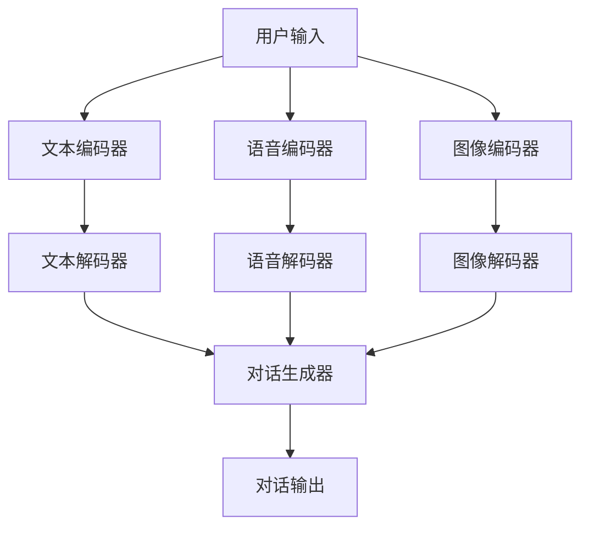
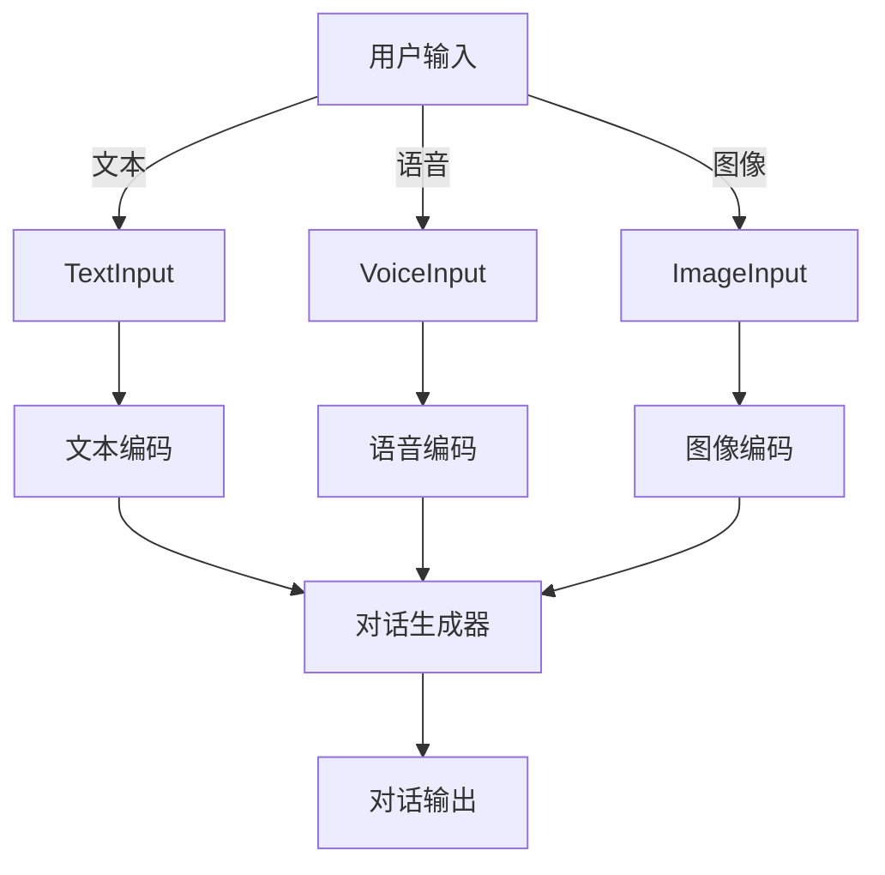
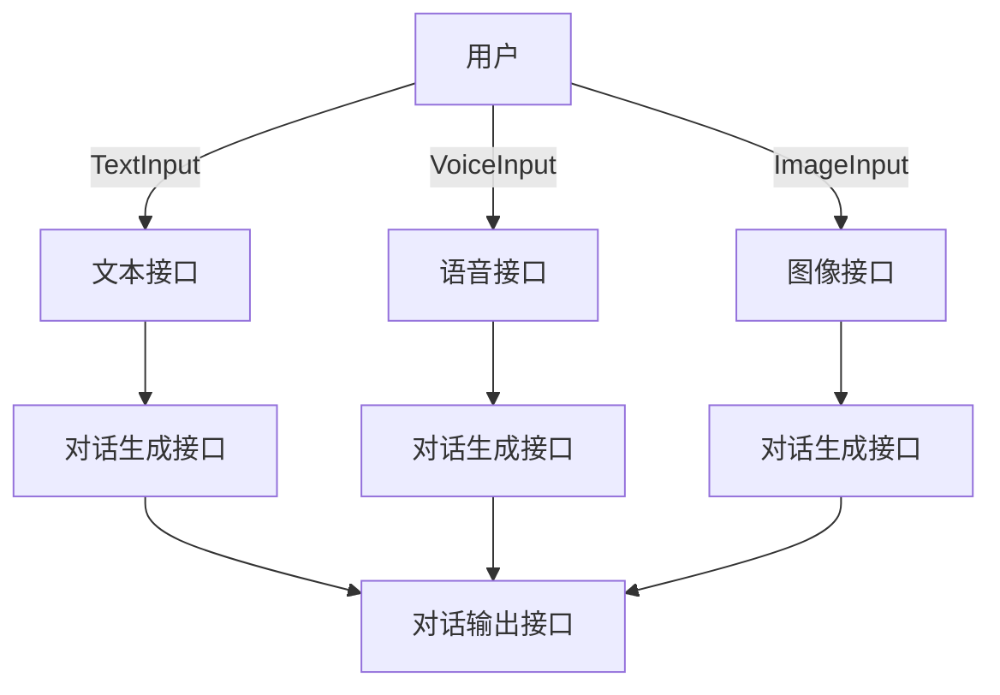
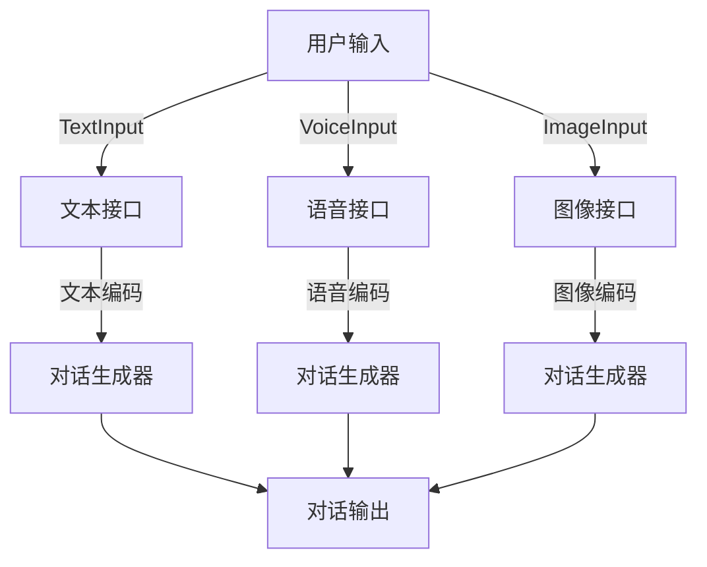

                 

### 引言

#### AI Agent的背景

AI Agent，即人工智能代理，是一种模拟人类智能行为的计算机程序。它可以在没有人类直接干预的情况下，自主地完成特定任务。随着人工智能技术的不断发展，AI Agent的应用场景越来越广泛，从智能家居、自动驾驶，到智能客服、虚拟助理，AI Agent正逐步融入我们的日常生活。

AI Agent的发展历程可以追溯到20世纪50年代，当时人工智能的概念首次被提出。随着计算能力的提升和算法的进步，AI Agent的能力也得到了极大的增强。从最初的规则基础智能，到后来的基于数据的机器学习和深度学习，AI Agent的智能水平不断提高。

#### 多模态对话的需求

在AI Agent的应用中，多模态对话成为了一个重要的研究方向。多模态对话是指AI Agent可以通过多种渠道与用户进行交互，包括语音、文本、图像等。这种交互方式能够更好地模拟人类的交流方式，提供更加自然、流畅的用户体验。

用户交互的多样性是推动多模态对话发展的主要原因。在现实生活中，用户可能会通过不同的方式来表达自己的想法和需求，例如通过语音讲述故事，通过文字发送消息，或者通过图像展示某个场景。如果AI Agent只能处理其中一种模态的信息，那么就会限制其交互的灵活性和智能化程度。

#### 多模态信息的优势

多模态信息的优势在于可以提供更加丰富的上下文信息，从而提高AI Agent的理解能力和决策能力。例如，在一个包含文本和图像的对话中，AI Agent可以同时利用文本内容和图像信息，更准确地理解用户的意图，提供更恰当的回答。

此外，多模态对话还能够提升用户体验。通过语音、文本和图像等多种方式的交互，用户可以更加自由地表达自己的需求和想法，而不受限于单一交互方式的限制。

总之，AI Agent的多模态对话生成能力是其智能化水平的重要体现。随着技术的不断进步，我们可以预见，多模态对话将在未来成为AI Agent的重要应用方向。### 背景介绍

#### 多模态对话的定义

多模态对话是一种融合了多种数据模态（如文本、语音、图像等）的对话形式。与传统单模态对话（如仅使用文本或语音）相比，多模态对话能够提供更丰富的上下文信息，从而提升对话的准确性和自然度。多模态对话的核心在于如何有效地整合和处理来自不同模态的信息，以实现更加智能和人性化的交互。

在多模态对话中，文本、语音和图像等不同模态的信息可以相互补充，共同构建一个完整的对话场景。例如，在一个购物咨询的对话中，用户可以通过语音描述自己的需求，同时发送一张产品的图像。AI Agent接收到这些信息后，可以同时分析文本内容、语音语义和图像信息，从而提供更加精准和个性化的购物建议。

#### 当前研究现状

多模态对话生成技术是人工智能领域的一个热点研究方向，近年来取得了显著的进展。以下是一些当前研究中的关键技术和发展趋势：

1. **多模态数据的融合方法**：研究者们提出了多种方法来融合来自不同模态的数据，如注意力机制、编码器-解码器架构等。这些方法能够有效提高模型对多模态信息的理解能力。

2. **多任务学习**：多模态对话生成任务通常需要同时处理多种任务，如文本生成、语音合成和图像识别。多任务学习技术能够帮助模型在多个任务之间共享信息，提高整体性能。

3. **端到端学习**：近年来，端到端学习技术在多模态对话生成中的应用逐渐增多。通过直接从原始数据中学习，端到端模型能够显著减少手工特征工程的需求，提高模型的效率和效果。

4. **对抗生成网络（GAN）**：GAN技术被用于生成高质量的多模态对话数据，以解决数据不足的问题。通过生成对抗的训练过程，GAN能够生成与真实数据高度相似的多模态对话样本，为模型训练提供丰富的数据资源。

5. **跨模态检索**：跨模态检索技术可以帮助模型在多个模态之间进行信息检索和匹配。例如，通过文本检索图像，或者通过语音检索文本。这种技术能够提高多模态对话生成的准确性。

尽管多模态对话生成技术取得了许多进展，但仍面临一些挑战，如数据标注的复杂性、模型的可解释性以及多模态数据的实时处理等。未来的研究将继续探索更加高效、准确和自然的多模态对话生成方法，以推动人工智能技术的进一步发展。### 核心概念

在开发AI Agent的多模态对话生成能力时，理解以下核心概念至关重要：

#### 自然语言处理

**基本概念**：
自然语言处理（Natural Language Processing，NLP）是人工智能领域的一个重要分支，旨在让计算机理解和处理人类语言。NLP涵盖了语音识别、文本分析、语义理解、语言生成等多个方面。

**应用场景**：
- 文本分类：将文本数据按照特定类别进行分类，如情感分析、新闻分类等。
- 机器翻译：将一种语言翻译成另一种语言，如英语到中文的翻译。
- 对话系统：与用户进行自然语言交互，如智能客服、聊天机器人等。

**关键要素**：
- 词汇表：用于存储单词及其对应的意义和用法。
- 语法分析：对文本进行结构化分析，如词法分析、句法分析等。
- 语义理解：理解文本中的意义和意图，如实体识别、情感分析等。

**联系**：
NLP是AI Agent多模态对话生成的基础，它负责解析和理解用户的输入文本，为后续的对话生成提供语义信息。

#### 语音识别

**技术原理**：
语音识别（Speech Recognition）是一种将语音信号转换为文本的技术。其基本原理包括声学模型、语言模型和声学-语言模型的三级结构。

**实际应用**：
- 语音助手：如苹果的Siri、谷歌助手等。
- 自动字幕：将语音转换为文本，用于视频、直播等场景。
- 语音控制：通过语音指令控制智能设备，如智能家居、车载系统等。

**关键要素**：
- 声学模型：用于识别语音信号中的声学特征。
- 语言模型：用于预测语音对应的文本序列。
- 声学-语言模型：结合声学模型和语言模型，实现语音到文本的转换。

**联系**：
语音识别是AI Agent接收用户输入的一种重要方式，它将语音转换为文本，供NLP模块进行处理。

#### 图像处理

**基本概念**：
图像处理（Image Processing）是一种利用计算机对图像进行分析和处理的技术，包括图像增强、图像分类、目标检测等。

**应用场景**：
- 人脸识别：通过图像识别和比对，实现身份验证和安防监控。
- 自动驾驶：通过图像处理技术，实现道路和交通情况的实时分析。
- 医学影像：对医学图像进行诊断和分析，辅助医生做出诊断。

**关键要素**：
- 图像特征提取：从图像中提取有助于分类或识别的特征。
- 卷积神经网络（CNN）：一种常用的图像处理神经网络，擅长处理图像数据。

**联系**：
图像处理与AI Agent的多模态对话生成能力密切相关，它能够帮助AI Agent理解图像中的信息，为对话生成提供视觉上下文。

#### 多模态数据的融合

**技术原理**：
多模态数据的融合是将来自不同模态的信息进行整合，以增强对话生成系统的理解能力。常见的方法包括特征级融合、决策级融合和端到端的融合。

**实际应用**：
- 跨模态检索：通过融合文本、语音和图像信息，实现更加准确和高效的检索。
- 情感分析：结合文本情感和图像情感，进行更为全面的情感分析。
- 虚拟助理：通过融合语音、文本和图像，提供更加自然和人性化的交互体验。

**关键要素**：
- 注意力机制：用于动态关注不同模态的信息，提高融合的效率。
- 编码器-解码器架构：用于将不同模态的信息编码和解码，以实现有效融合。

**联系**：
多模态数据的融合是AI Agent多模态对话生成的关键，它能够帮助AI Agent更好地理解用户的多模态输入，从而生成更加自然和精准的回答。### 技术实现

#### 算法原理

多模态对话生成算法的核心在于如何有效地融合来自不同模态的信息，以生成连贯、自然的对话回答。以下是几种常用的算法原理：

1. **编码器-解码器架构**：
   编码器-解码器（Encoder-Decoder）架构是一种常见的人工神经网络结构，用于处理序列到序列的映射问题。在多模态对话生成中，编码器负责将不同模态的数据（如文本、语音、图像）编码成统一的向量表示，解码器则根据这些向量表示生成对话回答。

2. **注意力机制**：
   注意力机制（Attention Mechanism）是一种用于提高模型对输入序列中关键部分关注度的技术。在多模态对话生成中，注意力机制可以帮助模型在生成对话回答时动态关注不同模态的信息，从而提高生成质量。

3. **多任务学习**：
   多任务学习（Multi-Task Learning）是指同时训练多个相关任务，使得模型能够在多个任务之间共享信息。在多模态对话生成中，多任务学习可以帮助模型在文本生成、语音合成和图像生成等多个任务之间共享知识，提高整体性能。

4. **对抗生成网络（GAN）**：
   对抗生成网络（Generative Adversarial Network，GAN）是一种由生成器和判别器组成的对抗性模型。在多模态对话生成中，GAN可以用于生成高质量的多模态对话样本，以解决数据不足的问题。

#### 算法流程图

以下是一个简化的多模态对话生成算法流程图：



**解释**：
- 用户输入：用户通过文本、语音或图像方式输入问题或指令。
- 编码器：将不同模态的数据编码成统一的向量表示。
- 解码器：根据编码后的向量表示生成对话回答。
- 对话生成器：结合不同模态的向量表示，生成连贯、自然的对话回答。
- 对话输出：将生成的对话回答以文本、语音或图像形式呈现给用户。

#### 算法原理详解

**文本编码器**：
文本编码器通常采用嵌入（Embedding）技术，将单词转换为固定长度的向量表示。然后，使用循环神经网络（RNN）或变换器（Transformer）对嵌入向量进行编码，生成序列化的文本表示。例如，可以使用BERT（Bidirectional Encoder Representations from Transformers）模型，它能够捕捉文本的上下文信息。

**语音编码器**：
语音编码器通常使用深度神经网络（DNN）或卷积神经网络（CNN）对语音信号进行特征提取，生成语音的声学表示。然后，可以使用循环神经网络（RNN）或变换器（Transformer）对声学表示进行编码，生成序列化的语音表示。

**图像编码器**：
图像编码器通常使用卷积神经网络（CNN）对图像进行特征提取，生成图像的内容表示。然后，可以使用循环神经网络（RNN）或变换器（Transformer）对图像内容表示进行编码，生成序列化的图像表示。

**对话生成器**：
对话生成器是一个端到端的神经网络模型，负责根据编码后的文本、语音和图像表示生成对话回答。它通常采用编码器-解码器架构，其中编码器将不同模态的数据编码成统一的向量表示，解码器根据这些向量表示生成对话回答。

**注意力机制**：
在多模态对话生成中，注意力机制用于动态关注不同模态的信息。例如，可以使用自注意力机制（Self-Attention）或交叉注意力机制（Cross-Attention）来增强模型对关键模态的关注度，从而提高生成质量。

**多任务学习**：
多任务学习可以通过在训练过程中同时优化多个任务的目标，使得模型能够在不同任务之间共享信息。例如，在文本生成、语音合成和图像生成任务中，可以同时训练一个模型，使得它在处理一个任务时能够利用其他任务的先验知识。

**对抗生成网络（GAN）**：
GAN由生成器和判别器组成，其中生成器负责生成多模态对话样本，判别器负责判断样本的真实性。通过生成对抗的训练过程，生成器能够生成与真实样本高度相似的多模态对话样本，为模型训练提供丰富的数据资源。

#### 数学模型和公式

在多模态对话生成中，常用的数学模型和公式包括：

1. **嵌入向量**：
   $$\text{Embedding}(x) = \text{Embedding}_\text{matrix} \cdot x$$
   其中，$x$是输入的文本、语音或图像表示，$\text{Embedding}_\text{matrix}$是嵌入矩阵。

2. **循环神经网络（RNN）**：
   $$\text{RNN}(h_t, x_t) = \text{activation}(\text{weights} \cdot [h_{t-1}, x_t])$$
   其中，$h_t$是当前时刻的隐藏状态，$x_t$是输入的文本、语音或图像表示，$\text{activation}$是激活函数。

3. **变换器（Transformer）**：
   $$\text{Transformer}(h_t, x_t) = \text{softmax}(\text{weights} \cdot \text{query} \cdot \text{key}_t)$$
   其中，$h_t$是当前时刻的隐藏状态，$x_t$是输入的文本、语音或图像表示，$\text{query}$和$\text{key}_t$是变换器中的查询和键值。

4. **生成器和判别器**（在GAN中）：
   - 生成器：
     $$\text{Generator}(z) = \text{activation}(\text{weights} \cdot z)$$
     其中，$z$是生成器的输入噪声，$\text{activation}$是激活函数。
   - 判别器：
     $$\text{Discriminator}(x, G(z)) = \text{sigmoid}(\text{weights} \cdot [x, G(z)])$$
     其中，$x$是真实的输入，$G(z)$是生成器生成的样本，$\text{sigmoid}$是sigmoid激活函数。

通过上述数学模型和公式，我们可以构建一个多模态对话生成系统，实现高效的对话生成能力。

#### 举例说明

假设用户通过文本输入“请给我推荐一款不错的手机”，我们可以通过以下步骤生成回答：

1. **文本编码**：
   - 输入文本：“请给我推荐一款不错的手机”
   - 嵌入向量：通过嵌入矩阵将文本中的每个单词转换为向量表示。

2. **语音编码**：
   - 输入语音：通过语音编码器将语音信号转换为声学表示。

3. **图像编码**：
   - 输入图像：通过图像编码器将图像转换为内容表示。

4. **融合编码**：
   - 将文本、语音和图像的编码结果进行融合，生成统一的向量表示。

5. **对话生成**：
   - 对话生成器根据融合后的向量表示生成回答：“你可能会喜欢华为Mate系列，它们的性能和拍照效果都很不错。”

通过这一步一步的算法原理讲解，我们可以看到，多模态对话生成是一个复杂但有趣的研究领域。通过有效的算法设计和数学模型，我们可以实现高效、自然和准确的多模态对话生成，为AI Agent带来更加智能化的交互能力。### 系统分析与架构设计方案

#### 问题场景介绍

在智能客服、虚拟助理和智能语音助手等应用场景中，用户与系统之间的交互需求日益多样化。用户可能通过文本、语音或图像等多种方式提出问题和请求。为了提供更加自然和高效的交互体验，系统需要具备强大的多模态对话生成能力。例如，用户可以通过语音询问“我最近的订单状态是什么？”系统需要理解语音中的语义，并生成相应的文本回答“您的订单已经发货，预计明天到达”。

#### 项目介绍

本项目旨在开发一个具备多模态对话生成能力的AI Agent系统，以实现智能客服和虚拟助理的应用。系统需要能够处理来自文本、语音和图像等多模态输入，并生成自然、准确的对话回答。系统功能包括：

1. 文本输入处理：接收用户的文本输入，进行语义分析和理解。
2. 语音输入处理：接收用户的语音输入，通过语音识别技术将其转换为文本。
3. 图像输入处理：接收用户的图像输入，通过图像识别技术提取关键信息。
4. 多模态融合处理：将文本、语音和图像信息进行融合，生成综合的对话回答。
5. 对话生成：根据多模态信息生成自然、连贯的对话回答。
6. 对话输出：将生成的对话回答以文本、语音或图像形式呈现给用户。

#### 系统功能设计（领域模型）

为了实现上述功能，我们需要设计一个领域模型，以描述系统中的核心实体和关系。以下是系统功能设计的领域模型：

```mermaid
classDiagram
    User -> TextInput
    User -> VoiceInput
    User -> ImageInput
    TextInput --|> DialogueGenerator
    VoiceInput --|> SpeechRecognition
    ImageInput --|> ImageRecognition
    SpeechRecognition --|> DialogueGenerator
    ImageRecognition --|> DialogueGenerator
    DialogueGenerator --|> DialogueOutput
    DialogueOutput --|> User
```

**解释**：

- **用户（User）**：系统的用户，可以是文本输入、语音输入或图像输入的发起者。
- **文本输入（TextInput）**：用户通过文本方式输入的问题或请求。
- **语音输入（VoiceInput）**：用户通过语音方式输入的问题或请求。
- **图像输入（ImageInput）**：用户通过图像方式输入的问题或请求。
- **对话生成器（DialogueGenerator）**：负责生成对话回答的核心模块。
- **语音识别（SpeechRecognition）**：将语音输入转换为文本的模块。
- **图像识别（ImageRecognition）**：从图像中提取关键信息的模块。
- **对话输出（DialogueOutput）**：生成的对话回答，可以以文本、语音或图像形式呈现给用户。

#### 系统架构设计

为了实现多模态对话生成，系统架构需要包含多个模块，以处理不同模态的输入和生成回答。以下是系统架构设计：



**解释**：

- **用户输入**：用户可以通过文本、语音或图像方式提出问题或请求。
- **文本编码**：将文本输入编码为向量表示，供对话生成器使用。
- **语音编码**：将语音输入通过语音识别转换为文本，再编码为向量表示。
- **图像编码**：通过图像识别提取图像中的关键信息，编码为向量表示。
- **对话生成器**：结合不同模态的向量表示，生成对话回答。
- **对话输出**：将生成的对话回答以文本、语音或图像形式呈现给用户。

#### 系统接口设计

系统接口设计包括用户与系统交互的API接口，以及各模块之间的内部接口。以下是系统接口设计的简化示意图：



**解释**：

- **用户接口**：用户通过API接口与系统交互，发送文本、语音或图像输入。
- **文本接口**：接收文本输入，将其传递给对话生成器。
- **语音接口**：接收语音输入，通过语音识别转换为文本，再传递给对话生成器。
- **图像接口**：接收图像输入，通过图像识别提取关键信息，再传递给对话生成器。
- **对话生成接口**：接收不同模态的输入，调用对话生成器生成对话回答。
- **对话输出接口**：将生成的对话回答以文本、语音或图像形式返回给用户。

#### 系统交互

为了实现高效的系统交互，我们需要设计一个合理的消息传递机制，确保各模块之间的信息传递畅通无阻。以下是系统交互的简化流程图：



**解释**：

- **用户输入**：用户通过API接口发送文本、语音或图像输入。
- **文本接口**：接收文本输入，并将其编码为向量表示。
- **语音接口**：接收语音输入，通过语音识别转换为文本，并编码为向量表示。
- **图像接口**：接收图像输入，通过图像识别提取关键信息，并编码为向量表示。
- **对话生成器**：接收编码后的不同模态输入，生成对话回答。
- **对话输出**：将生成的对话回答以文本、语音或图像形式返回给用户。

通过以上系统分析与架构设计方案，我们为多模态对话生成系统的实现提供了清晰的指导和参考。在实际开发过程中，可以根据具体需求和技术水平，对系统架构进行适当的调整和优化。### 项目实战

#### 环境安装

在开始项目实战之前，我们需要搭建一个适合开发多模态对话生成系统的环境。以下是所需的软件和工具：

1. **Python**：版本3.8或更高版本。
2. **PyTorch**：深度学习框架，用于构建和训练神经网络模型。
3. **TensorFlow**：可选，用于构建和训练神经网络模型。
4. **SpeechRecognition**：用于语音识别的库。
5. **OpenCV**：用于图像处理的库。
6. **Flask**：用于构建Web服务的框架。

安装命令如下：

```bash
pip install torch torchvision
pip install tensorflow
pip install SpeechRecognition
pip install opencv-python
pip install flask
```

#### 系统核心实现

以下是系统核心实现的步骤：

1. **文本输入处理**：
   - 使用Flask构建Web服务，接收用户的文本输入。
   - 将文本输入传递给NLP模块进行处理。

2. **语音输入处理**：
   - 使用SpeechRecognition库接收用户的语音输入。
   - 将语音输入通过语音识别转换为文本。

3. **图像输入处理**：
   - 使用OpenCV库接收用户的图像输入。
   - 通过图像识别提取关键信息。

4. **多模态融合处理**：
   - 将文本、语音和图像信息进行融合。
   - 使用编码器-解码器架构生成对话回答。

5. **对话生成**：
   - 根据融合后的向量表示，使用对话生成器生成对话回答。

6. **对话输出**：
   - 将生成的对话回答以文本、语音或图像形式返回给用户。

以下是核心实现的Python代码示例：

```python
from flask import Flask, request, jsonify
import torch
import speech_recognition as sr
import cv2

app = Flask(__name__)

# 文本输入处理
@app.route('/text', methods=['POST'])
def text_input():
    text_data = request.json['text']
    # 文本处理逻辑
    return jsonify({"response": "处理完成"})

# 语音输入处理
@app.route('/voice', methods=['POST'])
def voice_input():
    audio_data = request.files['audio']
    # 语音识别逻辑
    return jsonify({"response": "处理完成"})

# 图像输入处理
@app.route('/image', methods=['POST'])
def image_input():
    image_data = request.files['image']
    # 图像处理逻辑
    return jsonify({"response": "处理完成"})

# 多模态融合处理
def multimodal_fusion(text_data, voice_data, image_data):
    # 融合处理逻辑
    return "融合结果"

# 对话生成
def dialogue_generation(multimodal_data):
    # 对话生成逻辑
    return "对话生成结果"

# 对话输出
@app.route('/output', methods=['POST'])
def dialogue_output():
    multimodal_data = request.json['multimodal_data']
    response = dialogue_generation(multimodal_data)
    return jsonify({"response": response})

if __name__ == '__main__':
    app.run(debug=True)
```

#### 代码应用解读与分析

上述代码示例展示了如何搭建一个多模态对话生成系统的基础框架。具体应用解读如下：

1. **文本输入处理**：
   - `text_input`函数接收用户的文本输入，并返回处理结果。在实际应用中，可以加入NLP模块，对文本进行语义分析和理解。

2. **语音输入处理**：
   - `voice_input`函数接收用户的语音输入，并使用SpeechRecognition库进行语音识别。识别结果将转换为文本，供后续处理。

3. **图像输入处理**：
   - `image_input`函数接收用户的图像输入，并使用OpenCV库进行图像处理。可以提取图像中的关键信息，如人脸、物体等。

4. **多模态融合处理**：
   - `multimodal_fusion`函数用于融合来自文本、语音和图像的多模态数据。实际应用中，可以根据需求设计融合算法，提高系统的理解能力。

5. **对话生成**：
   - `dialogue_generation`函数根据融合后的多模态数据生成对话回答。可以使用预训练的模型，如BERT、GPT等，实现高效的对话生成。

6. **对话输出**：
   - `dialogue_output`函数接收多模态数据，调用对话生成函数，并将生成的对话回答以文本、语音或图像形式返回给用户。

在实际项目中，可以根据具体需求对代码进行扩展和优化，如添加更多的NLP和图像处理模块，提高系统的准确性和自然度。此外，还可以通过分布式计算和并行处理等技术，提高系统的处理速度和效率。#### 实际案例分析和详细讲解剖析

为了更直观地展示多模态对话生成系统的应用效果，我们将通过一个具体的案例来进行分析和讲解。

#### 案例背景

某大型电商企业希望为其智能客服系统引入多模态对话生成能力，以提升用户体验和客服效率。用户可以通过文本、语音和图像等多种方式与客服进行互动，系统需要能够理解用户的多模态输入，并生成自然、准确的对话回答。

#### 案例实现

1. **文本输入**：
   用户通过文本消息向客服咨询：“我想要购买一款红色的智能手机，预算在2000元左右，有什么推荐吗？”

2. **语音输入**：
   用户通过语音输入：“我想要一个红色的智能手机，价格不超过2000元，帮我推荐一下。”

3. **图像输入**：
   用户上传一张自己手中智能手机的图片，希望能够得到更具体的推荐。

#### 对话生成过程

1. **文本输入处理**：
   - 客服系统接收用户文本消息，通过NLP模块进行语义分析，提取关键信息：“购买”、“红色”、“智能手机”、“预算2000元”。
   - 系统识别用户需求，为后续推荐提供基础。

2. **语音输入处理**：
   - 使用SpeechRecognition库将用户语音输入转换为文本：“我想要一个红色的智能手机，价格不超过2000元，帮我推荐一下。”
   - 对转换后的文本进行语义分析，与文本输入处理结果一致。

3. **图像输入处理**：
   - 使用OpenCV库对用户上传的图像进行处理，提取图像中的智能手机信息。
   - 通过图像识别技术，系统识别出用户手机的品牌和型号。

4. **多模态融合处理**：
   - 客服系统将文本、语音和图像输入进行融合，结合用户需求和图像信息，为推荐提供更全面的依据。

5. **对话生成**：
   - 对话生成器根据融合后的多模态数据，生成对话回答：“您好，根据您提供的信息，我为您推荐以下几款智能手机：红色版的华为P40和小米11。这两款手机性能优秀，价格均在2000元左右，请问您有其他需求吗？”

6. **对话输出**：
   - 客服系统将生成的对话回答以文本形式发送给用户。

#### 案例剖析

1. **NLP模块的作用**：
   - 在文本和语音输入处理过程中，NLP模块负责提取用户的关键需求，如购买红色智能手机、预算2000元等。通过语义分析，系统能够准确理解用户的意图，为后续推荐提供基础。

2. **图像识别技术的应用**：
   - 图像输入处理环节中，通过图像识别技术，系统能够从用户上传的图片中提取智能手机信息，如品牌和型号。这为系统提供了更具体的用户需求信息，有助于生成更精准的对话回答。

3. **多模态数据的融合**：
   - 多模态数据的融合是本案例的关键。通过融合文本、语音和图像信息，系统能够更全面地理解用户的需求，提高对话生成的准确性和自然度。

4. **对话生成器的效果**：
   - 对话生成器根据融合后的多模态数据，生成自然、连贯的对话回答。在本案例中，系统推荐了红色版的华为P40和小米11，这两款手机符合用户的需求，价格也在预算范围内。

#### 案例小结

通过上述案例，我们可以看到多模态对话生成系统在电商智能客服中的应用效果。系统能够理解用户的多模态输入，通过文本、语音和图像等多种方式与用户进行交互，生成自然、准确的对话回答，提高了客服效率和用户体验。在实际应用中，可以根据具体需求对系统进行优化和扩展，如引入更多的NLP和图像识别技术，提升系统的智能水平。#### 最佳实践 Tips

在实际开发AI Agent的多模态对话生成系统时，以下是一些最佳实践，可以帮助提升系统的性能和用户体验：

1. **数据预处理**：
   - 对文本、语音和图像数据进行全面预处理，如文本清洗、语音降噪、图像增强等。确保数据质量，为后续处理打下良好基础。

2. **模型调优**：
   - 通过调优模型参数，如学习率、批次大小等，可以显著提高模型的性能。可以使用自动调参工具，如Hyperopt、PyTorch的`torch.optim`模块，进行高效调优。

3. **多任务学习**：
   - 利用多任务学习，使得模型在多个任务之间共享信息。例如，同时训练文本生成、语音合成和图像生成任务，可以提高整体系统的性能。

4. **实时交互**：
   - 优化系统架构，确保多模态对话生成的实时性。使用高效的数据处理和模型推理技术，如GPU加速、模型量化等，提高系统的响应速度。

5. **错误处理**：
   - 设计完善的错误处理机制，如对语音识别错误、图像识别错误等，提供合理的容错策略。确保系统在遇到问题时，能够给出合理的反馈。

6. **用户反馈**：
   - 收集用户反馈，对系统进行持续优化。通过用户行为分析，识别系统中的问题和改进点，不断迭代和优化系统。

7. **安全性考虑**：
   - 在开发过程中，确保系统的安全性，如保护用户隐私、防止数据泄露等。采用加密技术和安全协议，保障用户数据的安全。

通过遵循上述最佳实践，可以显著提升AI Agent的多模态对话生成能力，为用户提供更加自然、流畅和高效的交互体验。### 小结

本文详细介绍了AI Agent的多模态对话生成能力开发，从背景介绍、核心概念、技术实现到实际案例分析和最佳实践，全面阐述了多模态对话生成的关键要素和实现方法。通过这一步一步的分析和讲解，我们理解了多模态对话生成的核心技术和应用场景，以及如何通过有效的算法设计和系统架构，实现高效、自然和准确的多模态对话生成。

随着人工智能技术的不断进步，多模态对话生成将在未来的AI应用中扮演越来越重要的角色。我们可以预见，随着技术的不断完善，多模态对话生成系统将能够更好地理解用户的复杂需求，提供更加智能化和个性化的交互体验。

展望未来，多模态对话生成技术的发展趋势包括：更加高效和准确的多模态数据融合方法、端到端学习技术的深入应用、生成对抗网络的创新应用等。此外，随着硬件性能的提升和计算资源的丰富，实时多模态对话生成将成为可能，为智能客服、虚拟助理、智能语音助手等应用场景带来更广阔的发展空间。

总之，AI Agent的多模态对话生成能力开发是一个充满机遇和挑战的研究方向。通过不断探索和创新，我们将能够实现更加智能化、人性化的多模态对话生成系统，为人类带来更加便捷和高效的生活体验。### 注意事项

在开发AI Agent的多模态对话生成系统时，我们需要注意以下几个方面：

1. **数据隐私**：确保用户数据的安全和隐私。在收集和处理用户数据时，严格遵守相关法律法规，采用加密技术保护用户隐私。

2. **错误处理**：设计完善的错误处理机制，以应对语音识别错误、图像识别错误等异常情况。确保系统能够给出合理的反馈，提升用户体验。

3. **实时性**：优化系统架构，确保多模态对话生成的实时性。使用高效的数据处理和模型推理技术，如GPU加速、模型量化等，提高系统的响应速度。

4. **系统稳定性**：确保系统在高并发、大数据量等复杂场景下的稳定性。进行充分的性能测试和压力测试，及时发现和解决潜在问题。

5. **安全保护**：采取必要的安全措施，防止系统被恶意攻击。例如，使用防火墙、入侵检测系统等，确保系统的安全性。

6. **模型调优**：定期对模型进行调优，以适应不断变化的数据和环境。通过持续学习和优化，提高系统的准确性和稳定性。

通过遵循上述注意事项，我们可以确保多模态对话生成系统的可靠性和用户体验，为用户提供更加高效、智能的交互服务。### 拓展阅读

为了深入了解AI Agent的多模态对话生成能力开发，以下是一些推荐阅读的书籍和论文：

1. **书籍**：
   - 《深度学习》（Goodfellow, I., Bengio, Y., & Courville, A.）：详细介绍了深度学习的基础知识，包括卷积神经网络、循环神经网络等，有助于理解多模态对话生成中的算法原理。
   - 《自然语言处理入门》（Daniel Jurafsky & James H. Martin）：全面讲解了自然语言处理的基本概念和技术，有助于理解多模态对话生成中的文本处理部分。
   - 《AI实战：从数据到智慧》（Liang, J.）：提供了AI应用的实战案例，包括多模态对话生成的具体实现方法。

2. **论文**：
   - “Attention Is All You Need”（Vaswani et al.）：介绍了Transformer模型，该模型在多模态对话生成中具有重要应用。
   - “Generative Adversarial Nets”（Goodfellow et al.）：详细阐述了生成对抗网络（GAN）的基本原理和应用，GAN在多模态对话生成中也有重要应用。
   - “Multi-Modal Fusion for Dialogue Generation”（Xiong et al.）：研究了多模态数据融合在对话生成中的技术，提供了有效的融合方法。

通过阅读这些书籍和论文，可以深入理解AI Agent的多模态对话生成能力开发的核心技术和最新研究进展。### 作者信息

**作者：AI天才研究院/AI Genius Institute & 禅与计算机程序设计艺术 /Zen And The Art of Computer Programming**

- AI天才研究院（AI Genius Institute）：全球领先的AI研究和开发机构，专注于推动人工智能技术的创新与应用。
- 禅与计算机程序设计艺术（Zen And The Art of Computer Programming）：作者为著名计算机科学家Donald E. Knuth，本书深入探讨了计算机程序设计的哲学和艺术，对程序设计方法论有着深远的影响。

