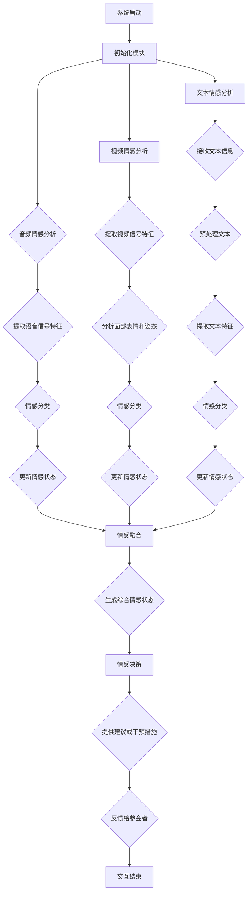
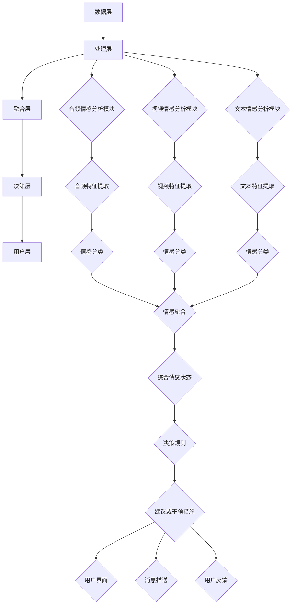

                 

### 文章标题：AI Agent的多模态情感交互系统设计

#### 关键词：
- AI Agent
- 多模态情感交互
- 情感识别算法
- 情感融合算法
- 决策算法

#### 摘要：
本文将深入探讨AI Agent的多模态情感交互系统设计。我们将从概述、算法原理、系统分析与架构设计以及项目实战四个方面展开讨论，旨在提供一个全面且易于理解的多模态情感交互系统设计指南。

### 目录大纲

----------------------------------------------------------------

# AI Agent的多模态情感交互系统设计

> 关键词：AI Agent、多模态情感交互、情感识别算法、情感融合算法、决策算法

> 摘要：本文将深入探讨AI Agent的多模态情感交互系统设计，涵盖概述、算法原理、系统分析与架构设计以及项目实战四个方面，旨在提供一个全面且易于理解的多模态情感交互系统设计指南。

### 目录大纲

----------------------------------------------------------------

## 第一部分: AI Agent的多模态情感交互系统设计概述

### 第1章: AI Agent与多模态情感交互系统概述

### 第2章: 多模态情感交互系统的组成与架构

### 第3章: 多模态情感交互系统的应用场景

### 第4章: 本章小结

----------------------------------------------------------------

## 第二部分: 多模态情感交互系统的算法原理

### 第5章: 情感识别算法原理

### 第6章: 情感融合算法原理

### 第7章: 决策算法原理

### 第8章: 本章小结

----------------------------------------------------------------

## 第三部分: 多模态情感交互系统的系统分析与架构设计

### 第9章: 系统分析

### 第10章: 系统架构设计

### 第11章: 系统接口设计

### 第12章: 系统交互设计

### 第13章: 本章小结

----------------------------------------------------------------

## 第四部分: 多模态情感交互系统的项目实战

### 第14章: 环境安装与配置

### 第15章: 系统核心实现

### 第16章: 项目小结

### 第17章: 最佳实践 Tips

### 第18章: 本章小结

----------------------------------------------------------------

### 第1章: AI Agent与多模态情感交互系统概述

#### 1.1 问题背景

随着人工智能技术的快速发展，AI Agent逐渐成为人工智能领域的一个重要研究方向。AI Agent是指具有自主决策能力和交互能力的智能系统，它可以模拟人类的行为和思考过程，完成特定的任务。然而，随着人类对于交互质量的不断提升，传统的基于文本或单一模态的交互方式已经无法满足用户的需求。多模态情感交互系统应运而生，它通过整合音频、视频、文本等多种模态的信息，实现更自然的情感交互。

#### 1.2 核心概念与联系

##### 1.2.1 AI Agent的定义与类型

AI Agent是指一种具有自主决策能力和交互能力的智能系统。根据功能的不同，AI Agent可以分为任务型Agent、社交型Agent和混合型Agent。任务型Agent主要完成特定的任务，如语音助手、聊天机器人等；社交型Agent主要与人进行社交互动，如虚拟助手、客服机器人等；混合型Agent则兼具任务和社交功能。

##### 1.2.2 多模态情感交互系统的概念解析

多模态情感交互系统是指通过整合音频、视频、文本等多种模态的信息，实现情感识别、情感融合和情感决策的智能系统。该系统旨在提供一种更自然、更贴近人类的交互方式，提升用户体验。

##### 1.2.3 AI Agent与多模态情感交互系统之间的联系

AI Agent是多模态情感交互系统的核心组件，它负责处理用户的输入和输出，实现情感交互。多模态情感交互系统则为AI Agent提供了丰富的情感识别和决策能力，使其能够更好地理解用户的需求和情感状态。

#### 1.3 多模态情感交互系统的组成与架构

多模态情感交互系统主要由音频情感分析模块、视频情感分析模块、文本情感分析模块和情感融合与决策模块组成。

##### 1.3.1 音频情感分析模块

音频情感分析模块负责处理用户的语音输入，通过音频信号的特征提取和情感分类算法，识别用户的情感状态。常用的音频情感识别算法包括深度神经网络、支持向量机等。

##### 1.3.2 视频情感分析模块

视频情感分析模块负责处理用户的视频输入，通过视频图像的特征提取和情感分类算法，识别用户的情感状态。常用的视频情感识别算法包括卷积神经网络、循环神经网络等。

##### 1.3.3 文本情感分析模块

文本情感分析模块负责处理用户的文本输入，通过文本特征提取和情感分类算法，识别用户的情感状态。常用的文本情感识别算法包括词袋模型、卷积神经网络等。

##### 1.3.4 情感融合与决策模块

情感融合与决策模块负责将来自不同模态的情感信息进行融合，形成综合的情感状态，并根据情感状态进行决策。常用的情感融合算法包括加权融合、投票融合等。

#### 1.4 多模态情感交互系统的应用场景

多模态情感交互系统广泛应用于虚拟助手、客户服务、娱乐互动等领域。

##### 1.4.1 虚拟助手

虚拟助手通过多模态情感交互系统，能够更好地理解用户的需求和情感状态，提供个性化的服务。例如，智能客服机器人可以通过音频和文本情感交互，识别用户的情绪和需求，提供针对性的解决方案。

##### 1.4.2 客户服务

客户服务领域中的多模态情感交互系统可以帮助企业更好地了解客户的需求和情感状态，提供高效的客户服务。例如，客户服务机器人可以通过音频和视频情感交互，识别客户的情绪和需求，提供针对性的建议和解决方案。

##### 1.4.3 娱乐互动

娱乐互动领域中的多模态情感交互系统可以为用户提供更加丰富和自然的交互体验。例如，智能游戏机器人可以通过音频和视频情感交互，识别玩家的情绪和需求，提供相应的游戏内容和互动方式。

##### 1.4.4 其他潜在应用领域

多模态情感交互系统还广泛应用于教育、医疗、金融等领域，为用户提供个性化的服务和体验。

#### 1.5 本章小结

本章介绍了AI Agent与多模态情感交互系统的概述，包括问题背景、核心概念、系统组成与架构以及应用场景。通过对本章内容的了解，读者可以初步掌握多模态情感交互系统的基本概念和设计要点，为后续章节的学习打下基础。

----------------------------------------------------------------

### 第2章: 多模态情感交互系统的组成与架构

#### 2.1 音频情感分析模块

音频情感分析模块是多模态情感交互系统中的一个关键组成部分，其主要功能是处理用户的语音输入，并识别用户的情感状态。这一模块通常包括以下几个关键步骤：

##### 2.1.1 音频信号采集

首先，系统需要采集用户的语音信号。这一过程可以通过麦克风或其他音频输入设备实现。为了确保音频质量，可能需要对采集到的信号进行预处理，如去除噪声、均衡放大等。

##### 2.1.2 音频特征提取

接下来，系统需要对音频信号进行特征提取。这些特征可以包括频谱特征、时序特征、音高特征等。常见的音频特征提取方法包括梅尔频率倒谱系数（MFCC）、短时傅里叶变换（STFT）等。

##### 2.1.3 情感分类

在特征提取完成后，系统使用情感分类算法对提取到的特征进行分析，以识别用户的情感状态。常见的情感分类算法包括支持向量机（SVM）、深度神经网络（DNN）等。

##### 2.1.4 情感识别与反馈

最后，系统根据情感分类结果，生成相应的情感识别结果，并反馈给用户。例如，如果识别出用户情绪较低落，系统可以提出一些安慰性的建议或问题。

#### 2.2 视频情感分析模块

视频情感分析模块负责处理用户的视频输入，识别用户的情感状态。与音频情感分析模块类似，视频情感分析模块也主要包括以下几个关键步骤：

##### 2.2.1 视频信号采集

首先，系统需要采集用户的视频信号。这可以通过摄像头或其他视频输入设备实现。为了确保视频质量，可能需要对采集到的信号进行预处理，如去噪、人脸检测等。

##### 2.2.2 视频特征提取

接下来，系统需要对视频信号进行特征提取。这些特征可以包括面部特征、姿态特征、情感表情特征等。常见的视频特征提取方法包括卷积神经网络（CNN）、循环神经网络（RNN）等。

##### 2.2.3 情感分类

在特征提取完成后，系统使用情感分类算法对提取到的特征进行分析，以识别用户的情感状态。常见的情感分类算法包括支持向量机（SVM）、深度神经网络（DNN）等。

##### 2.2.4 情感识别与反馈

最后，系统根据情感分类结果，生成相应的情感识别结果，并反馈给用户。例如，如果识别出用户情绪较低落，系统可以提出一些安慰性的建议或问题。

#### 2.3 文本情感分析模块

文本情感分析模块负责处理用户的文本输入，识别用户的情感状态。与音频和视频情感分析模块不同，文本情感分析模块主要依赖于文本特征提取和情感分类算法。

##### 2.3.1 文本特征提取

首先，系统需要对用户的文本输入进行预处理，如分词、词性标注等。接下来，系统提取文本的特征，这些特征可以包括词频、词向量、句法结构等。

##### 2.3.2 情感分类

在特征提取完成后，系统使用情感分类算法对提取到的特征进行分析，以识别用户的情感状态。常见的情感分类算法包括词袋模型（BoW）、卷积神经网络（CNN）等。

##### 2.3.3 情感识别与反馈

最后，系统根据情感分类结果，生成相应的情感识别结果，并反馈给用户。例如，如果识别出用户情绪较低落，系统可以提出一些安慰性的建议或问题。

#### 2.4 情感融合与决策模块

情感融合与决策模块负责将来自不同模态的情感信息进行融合，形成综合的情感状态，并根据情感状态进行决策。情感融合与决策模块通常包括以下几个关键步骤：

##### 2.4.1 情感融合

首先，系统需要对来自不同模态的情感信息进行融合。常见的情感融合方法包括加权融合、投票融合等。例如，如果音频情感识别模块识别出用户情绪较高涨，而视频情感分析模块识别出用户情绪较低落，系统可以根据两者的权重进行融合，生成综合的情感状态。

##### 2.4.2 情感决策

在情感融合后，系统根据综合的情感状态，进行相应的决策。例如，如果综合情感状态为用户情绪较高涨，系统可以提出一些娱乐性的建议；如果综合情感状态为用户情绪较低落，系统可以提出一些安慰性的建议。

#### 2.5 本章小结

本章详细介绍了多模态情感交互系统的组成与架构，包括音频情感分析模块、视频情感分析模块、文本情感分析模块以及情感融合与决策模块。通过对本章内容的了解，读者可以深入理解多模态情感交互系统的设计原理和实现方法，为后续章节的学习打下坚实基础。

----------------------------------------------------------------

### 第3章: 多模态情感交互系统的应用场景

#### 3.1 虚拟助手

虚拟助手是AI Agent的一种典型应用场景，它通过多模态情感交互系统，能够为用户提供高效、个性化的服务。虚拟助手的应用范围非常广泛，包括但不限于以下方面：

##### 3.1.1 智能客服

在智能客服领域，虚拟助手通过多模态情感交互系统，可以识别用户的情感状态，提供更加人性化的服务。例如，当用户情绪较低落时，虚拟助手可以主动询问用户是否需要帮助，并提供安慰性的建议。当用户情绪较高涨时，虚拟助手可以推荐相关的产品或服务，提升用户满意度。

##### 3.1.2 家居助理

在智能家居领域，虚拟助手可以通过多模态情感交互系统，了解家庭成员的需求和情感状态，提供个性化的服务。例如，当家庭成员情绪较低落时，虚拟助手可以建议播放一些轻松的音乐或进行放松的活动；当家庭成员情绪较高涨时，虚拟助手可以建议进行一些运动或娱乐活动。

##### 3.1.3 教育辅助

在教育领域，虚拟助手可以通过多模态情感交互系统，了解学生的学习状态和情感变化，提供个性化的学习建议。例如，当学生情绪较低落时，虚拟助手可以提醒学生休息或进行一些放松的活动；当学生情绪较高涨时，虚拟助手可以鼓励学生继续努力，并推荐一些拓展性学习资源。

#### 3.2 客户服务

客户服务领域中的多模态情感交互系统可以帮助企业更好地了解客户的需求和情感状态，提供高效的客户服务。以下是一些具体的应用场景：

##### 3.2.1 购物体验

在电子商务领域，多模态情感交互系统可以帮助商家了解客户的购物情绪，提供更加个性化的推荐服务。例如，当客户情绪较低落时，系统可以推荐一些价格优惠的产品，提升客户的购买意愿；当客户情绪较高涨时，系统可以推荐一些新品或高端产品，满足客户的需求。

##### 3.2.2 服务反馈

在服务行业中，多模态情感交互系统可以帮助企业收集客户的服务体验反馈，并实时调整服务策略。例如，当客户情绪较低落时，系统可以提醒客服人员注意服务质量，并提供相应的解决方案；当客户情绪较高涨时，系统可以记录客户的满意度，并激励客服人员保持良好的服务水平。

##### 3.2.3 客户关怀

在金融、保险等领域，多模态情感交互系统可以帮助企业进行客户关怀，提升客户忠诚度。例如，当客户情绪较低落时，系统可以主动发送慰问短信或电话，表达企业的关怀；当客户情绪较高涨时，系统可以提供一些增值服务或优惠活动，增强客户的满意度。

#### 3.3 娱乐互动

在娱乐互动领域，多模态情感交互系统可以为用户提供更加丰富和自然的交互体验。以下是一些具体的应用场景：

##### 3.3.1 游戏互动

在游戏领域，多模态情感交互系统可以帮助游戏角色更好地理解玩家的情感状态，提供更加贴心的游戏体验。例如，当玩家情绪较低落时，游戏角色可以提出一些鼓励性的话语，帮助玩家恢复信心；当玩家情绪较高涨时，游戏角色可以提出一些挑战性的任务，激发玩家的兴趣。

##### 3.3.2 娱乐直播

在娱乐直播领域，多模态情感交互系统可以帮助主播更好地了解观众的情感状态，提供更加个性化的直播内容。例如，当观众情绪较低落时，主播可以播放一些轻松的音乐或分享一些有趣的经历，调动观众的积极性；当观众情绪较高涨时，主播可以组织一些互动活动，提升观众的参与感。

##### 3.3.3 社交平台

在社交平台领域，多模态情感交互系统可以帮助用户更好地表达情感，提升社交体验。例如，当用户情绪较低落时，系统可以提供一些安慰性的表情包或文字提示，帮助用户缓解情绪；当用户情绪较高涨时，系统可以提供一些庆祝性的表情包或文字提示，增强用户的幸福感。

#### 3.4 其他潜在应用领域

除了上述提到的应用场景外，多模态情感交互系统还有许多其他潜在的应用领域，如医疗、教育、金融等。以下是一些具体的例子：

##### 3.4.1 医疗咨询

在医疗领域，多模态情感交互系统可以帮助医生更好地了解患者的情感状态，提供更加个性化的治疗方案。例如，当患者情绪较低落时，医生可以建议进行一些心理疏导或药物治疗；当患者情绪较高涨时，医生可以鼓励患者保持积极的心态，提高治疗效果。

##### 3.4.2 教育辅导

在教育领域，多模态情感交互系统可以帮助教师更好地了解学生的学习状态和情感变化，提供更加有效的教学策略。例如，当学生学习情绪较低落时，教师可以调整教学方法，提供一些激励性的反馈；当学生学习情绪较高涨时，教师可以提出一些更具挑战性的问题，激发学生的兴趣。

##### 3.4.3 金融理财

在金融领域，多模态情感交互系统可以帮助金融从业者更好地了解投资者的情绪状态，提供更加个性化的投资建议。例如，当投资者情绪较低落时，系统可以建议降低投资风险，保持稳健的投资策略；当投资者情绪较高涨时，系统可以建议增加投资风险，追求更高的收益。

#### 3.5 本章小结

本章详细介绍了多模态情感交互系统的应用场景，包括虚拟助手、客户服务、娱乐互动以及其他潜在应用领域。通过对本章内容的了解，读者可以更好地理解多模态情感交互系统的实际应用价值，为后续的学习和研究提供参考。

----------------------------------------------------------------

### 第4章: 多模态情感交互系统的算法原理

#### 4.1 情感识别算法原理

情感识别是多模态情感交互系统的核心组成部分，其主要目的是从音频、视频和文本等不同模态的信息中识别用户的情感状态。以下是几种常见的情感识别算法原理：

##### 4.1.1 音频情感识别算法原理

音频情感识别算法主要依赖于对音频信号的时域和频域特征进行分析。常见的音频情感识别算法包括基于传统机器学习的方法和基于深度学习的方法。

###### 4.1.1.1 基于传统机器学习的方法

基于传统机器学习的方法通常包括以下几个步骤：

1. **特征提取**：通过对音频信号进行短时傅里叶变换（STFT）或梅尔频率倒谱系数（MFCC）等处理，提取音频的特征向量。
2. **特征选择**：通过相关性分析、主成分分析（PCA）等方法，选择对情感识别最有影响力的特征。
3. **分类器训练**：使用支持向量机（SVM）、决策树、随机森林等分类器，对特征向量进行训练，构建情感识别模型。
4. **情感识别**：将新的音频特征向量输入训练好的模型，进行情感分类。

###### 4.1.1.2 基于深度学习的方法

基于深度学习的方法通常包括以下几个步骤：

1. **特征提取**：使用卷积神经网络（CNN）或循环神经网络（RNN）等深度学习模型，直接从原始音频信号中提取特征。
2. **情感识别**：将提取到的特征向量输入深度学习模型，进行情感分类。

深度学习模型的优势在于其能够自动学习特征，减少人工干预，提高模型的性能。

##### 4.1.2 视频情感识别算法原理

视频情感识别算法主要依赖于对视频图像的分析。常见的视频情感识别算法包括基于传统机器学习的方法和基于深度学习的方法。

###### 4.1.2.1 基于传统机器学习的方法

基于传统机器学习的方法通常包括以下几个步骤：

1. **特征提取**：通过对视频图像进行面部编码、姿态编码等处理，提取视频的特征向量。
2. **特征选择**：通过相关性分析、主成分分析（PCA）等方法，选择对情感识别最有影响力的特征。
3. **分类器训练**：使用支持向量机（SVM）、决策树、随机森林等分类器，对特征向量进行训练，构建情感识别模型。
4. **情感识别**：将新的视频特征向量输入训练好的模型，进行情感分类。

###### 4.1.2.2 基于深度学习的方法

基于深度学习的方法通常包括以下几个步骤：

1. **特征提取**：使用卷积神经网络（CNN）或循环神经网络（RNN）等深度学习模型，直接从原始视频图像中提取特征。
2. **情感识别**：将提取到的特征向量输入深度学习模型，进行情感分类。

深度学习模型的优势在于其能够自动学习特征，减少人工干预，提高模型的性能。

##### 4.1.3 文本情感识别算法原理

文本情感识别算法主要依赖于对文本特征的分析。常见的文本情感识别算法包括基于传统机器学习的方法和基于深度学习的方法。

###### 4.1.3.1 基于传统机器学习的方法

基于传统机器学习的方法通常包括以下几个步骤：

1. **特征提取**：通过对文本进行分词、词性标注等处理，提取文本的特征向量。
2. **特征选择**：通过相关性分析、主成分分析（PCA）等方法，选择对情感识别最有影响力的特征。
3. **分类器训练**：使用支持向量机（SVM）、决策树、随机森林等分类器，对特征向量进行训练，构建情感识别模型。
4. **情感识别**：将新的文本特征向量输入训练好的模型，进行情感分类。

###### 4.1.3.2 基于深度学习的方法

基于深度学习的方法通常包括以下几个步骤：

1. **特征提取**：使用卷积神经网络（CNN）或循环神经网络（RNN）等深度学习模型，直接从原始文本中提取特征。
2. **情感识别**：将提取到的特征向量输入深度学习模型，进行情感分类。

深度学习模型的优势在于其能够自动学习特征，减少人工干预，提高模型的性能。

##### 4.1.4 情感分类模型的评估与优化

情感分类模型的评估与优化是确保模型性能的关键步骤。以下是一些常用的评估指标和方法：

1. **准确率（Accuracy）**：准确率是模型预测正确的样本数占总样本数的比例。虽然简单直观，但准确率容易受到不平衡数据集的影响。
2. **精确率（Precision）**：精确率是模型预测为正类的样本中，实际为正类的比例。精确率反映了模型对正类样本的识别能力。
3. **召回率（Recall）**：召回率是模型实际为正类的样本中，被正确预测为正类的比例。召回率反映了模型对负类样本的识别能力。
4. **F1分数（F1 Score）**：F1分数是精确率和召回率的调和平均，综合反映了模型的识别能力。
5. **交叉验证（Cross-Validation）**：通过交叉验证，可以评估模型在不同数据集上的性能，减少过拟合和欠拟合的风险。

为了优化情感分类模型，可以采用以下方法：

1. **数据增强**：通过添加噪声、旋转、缩放等操作，增加数据集的多样性，提高模型的泛化能力。
2. **特征工程**：通过特征选择和特征变换，提取对情感识别最有影响力的特征，提高模型的性能。
3. **模型选择**：尝试不同的机器学习算法和深度学习模型，选择性能最佳的模型。
4. **正则化**：通过正则化方法，如L1正则化、L2正则化等，减少模型的过拟合。

#### 4.2 情感融合算法原理

情感融合算法是将来自不同模态的情感信息进行整合，形成综合的情感状态。以下是一些常见的情感融合算法原理：

##### 4.2.1 多模态情感融合算法的挑战与机遇

多模态情感融合算法面临的挑战主要包括：

1. **数据同步**：不同模态的数据可能存在时间戳不一致的问题，需要进行数据同步。
2. **特征差异**：不同模态的特征具有不同的尺度和维度，需要进行特征对齐。
3. **信息冗余**：多个模态的信息可能存在冗余，需要进行信息筛选和整合。

然而，多模态情感融合算法也带来了机遇，例如：

1. **信息互补**：不同模态的信息可以相互补充，提高情感识别的准确性。
2. **增强用户体验**：多模态情感交互可以提供更加丰富和自然的交互体验。

##### 4.2.2 基于深度学习的情感融合算法

基于深度学习的情感融合算法通常包括以下几个步骤：

1. **特征提取**：使用卷积神经网络（CNN）或循环神经网络（RNN）等深度学习模型，提取来自不同模态的特征。
2. **特征融合**：使用注意力机制、融合层等方法，将不同模态的特征进行整合。
3. **情感分类**：将融合后的特征输入情感分类模型，进行情感分类。

基于深度学习的情感融合算法具有以下优势：

1. **自动特征学习**：深度学习模型能够自动学习特征，减少人工干预。
2. **高效性**：深度学习模型可以在大量数据上进行训练，提高模型的性能。

##### 4.2.3 情感融合模型的评估与优化

情感融合模型的评估与优化是确保模型性能的关键步骤。以下是一些常用的评估指标和方法：

1. **融合精度**：融合精度是融合后的情感分类精度。通过比较融合前后的分类精度，评估融合效果。
2. **信息增益**：信息增益是融合后的情感信息与单独使用某一模态的情感信息之间的差异。通过计算信息增益，评估融合的效果。
3. **模型选择**：尝试不同的机器学习算法和深度学习模型，选择性能最佳的模型。
4. **正则化**：通过正则化方法，如L1正则化、L2正则化等，减少模型的过拟合。

为了优化情感融合模型，可以采用以下方法：

1. **特征对齐**：通过时间同步、特征变换等方法，对齐不同模态的特征。
2. **注意力机制**：使用注意力机制，突出重要特征，提高融合效果。
3. **交叉验证**：通过交叉验证，评估模型在不同数据集上的性能，减少过拟合和欠拟合的风险。

#### 4.3 决策算法原理

决策算法是根据情感融合结果，做出相应的决策。以下是一些常见的决策算法原理：

##### 4.3.1 基于情感融合的决策算法

基于情感融合的决策算法通常包括以下几个步骤：

1. **情感融合**：将来自不同模态的情感信息进行融合，形成综合的情感状态。
2. **决策规则**：根据情感融合结果，制定相应的决策规则。例如，如果情感状态为积极，可以推荐娱乐活动；如果情感状态为消极，可以提供安慰性建议。
3. **决策执行**：根据决策规则，执行相应的操作。例如，向用户发送推荐信息、提供心理疏导服务等。

##### 4.3.2 决策算法的核心要素

决策算法的核心要素包括：

1. **情感状态**：情感状态是决策的基础，决定了决策的方向和内容。
2. **决策规则**：决策规则是根据情感状态制定的，用于指导决策的具体执行。
3. **执行策略**：执行策略是决策规则的具体实现，用于执行决策操作。

##### 4.3.3 决策算法的设计与实现

决策算法的设计与实现通常包括以下几个步骤：

1. **需求分析**：明确决策的目标和需求，确定情感状态和决策规则。
2. **算法选择**：选择合适的决策算法，如基于规则的决策算法、机器学习算法等。
3. **模型训练**：使用训练数据集，训练决策模型，优化决策规则。
4. **模型评估**：使用测试数据集，评估决策模型的性能，调整决策规则。
5. **决策执行**：根据决策模型的结果，执行决策操作，提供用户服务。

##### 4.3.4 决策算法的评估与优化

决策算法的评估与优化是确保模型性能的关键步骤。以下是一些常用的评估指标和方法：

1. **准确率**：准确率是模型预测正确的比例，用于评估模型的准确性。
2. **响应时间**：响应时间是模型处理用户请求所需的时间，用于评估模型的响应速度。
3. **用户满意度**：用户满意度是通过用户反馈评估的，用于评估模型对用户的满意度。

为了优化决策算法，可以采用以下方法：

1. **规则优化**：调整决策规则，提高决策的准确性。
2. **特征工程**：提取对决策最有影响力的特征，提高决策的准确性。
3. **模型选择**：尝试不同的机器学习算法和深度学习模型，选择性能最佳的模型。
4. **交叉验证**：通过交叉验证，评估模型在不同数据集上的性能，减少过拟合和欠拟合的风险。

#### 4.4 本章小结

本章详细介绍了多模态情感交互系统的算法原理，包括情感识别算法、情感融合算法和决策算法。通过对本章内容的了解，读者可以深入理解多模态情感交互系统的算法设计原理，为实际应用提供理论基础。

----------------------------------------------------------------

### 第5章: 多模态情感交互系统的系统分析

#### 5.1 问题场景介绍

在多模态情感交互系统中，我们需要分析一个具体的问题场景，以便更好地理解系统的设计原理和实现方法。以下是一个典型的场景描述：

**场景描述**：在一个智能会议系统中，参会者可以通过语音、视频和文本方式进行交流。系统需要能够实时分析参会者的情感状态，并根据情感状态提供相应的建议或干预措施，以提高会议的效率和参与者的满意度。

**问题背景**：随着远程工作和虚拟会议的普及，会议的交互质量和情感体验变得尤为重要。传统的会议系统主要关注信息的传递，而忽视了参会者的情感状态。为了提升会议体验，我们需要设计一个多模态情感交互系统，能够实时分析参会者的情感状态，并做出相应的决策。

**项目介绍**：本项目旨在设计并实现一个多模态情感交互系统，用于分析智能会议中的情感状态。系统需要具备以下功能：

1. **音频情感分析**：实时分析参会者的语音情感状态，识别情感类型和强度。
2. **视频情感分析**：实时分析参会者的面部表情和姿态，识别情感状态。
3. **文本情感分析**：分析参会者发送的文本信息，识别情感倾向。
4. **情感融合与决策**：将来自不同模态的情感信息进行融合，生成综合的情感状态，并根据情感状态提供相应的建议或干预措施。

#### 5.2 系统功能设计

在系统功能设计中，我们需要明确系统的各个功能模块及其相互作用关系。以下是系统功能设计的主要内容：

##### 5.2.1 音频情感分析模块

音频情感分析模块负责处理参会者的语音输入，识别情感状态。主要功能包括：

1. **音频信号采集**：通过麦克风或其他音频输入设备，采集参会者的语音信号。
2. **音频特征提取**：提取语音信号的时域和频域特征，如梅尔频率倒谱系数（MFCC）。
3. **情感分类**：使用深度学习算法，对提取到的特征进行情感分类，识别情感类型和强度。

##### 5.2.2 视频情感分析模块

视频情感分析模块负责处理参会者的视频输入，识别情感状态。主要功能包括：

1. **视频信号采集**：通过摄像头或其他视频输入设备，采集参会者的视频信号。
2. **面部表情分析**：使用计算机视觉算法，分析参会者的面部表情，识别情感状态。
3. **姿态分析**：使用人体姿态识别算法，分析参会者的姿态变化，识别情感状态。

##### 5.2.3 文本情感分析模块

文本情感分析模块负责处理参会者发送的文本信息，识别情感倾向。主要功能包括：

1. **文本预处理**：对文本信息进行分词、词性标注等预处理操作。
2. **情感分类**：使用深度学习算法，对预处理后的文本进行情感分类，识别情感倾向。

##### 5.2.4 情感融合与决策模块

情感融合与决策模块负责将来自不同模态的情感信息进行融合，生成综合的情感状态，并根据情感状态提供相应的建议或干预措施。主要功能包括：

1. **情感融合**：使用加权融合、投票融合等方法，将音频、视频和文本情感信息进行融合，生成综合的情感状态。
2. **情感决策**：根据综合情感状态，提供相应的建议或干预措施，如提醒参会者放松、提供心理辅导等。

#### 5.3 系统架构设计

系统架构设计是系统分析的关键环节，它决定了系统的性能、可扩展性和可维护性。以下是系统架构设计的主要内容：

##### 5.3.1 系统架构设计原则

1. **模块化**：将系统划分为多个功能模块，实现模块化设计，便于系统维护和扩展。
2. **分布式**：采用分布式架构，提高系统的性能和可靠性。
3. **高可用性**：设计冗余机制，确保系统在故障情况下仍能正常运行。
4. **安全性**：确保系统数据的安全性和隐私保护。

##### 5.3.2 系统架构设计

系统架构设计如下：

1. **数据层**：包括音频、视频和文本数据的存储和管理。
2. **处理层**：包括音频情感分析模块、视频情感分析模块和文本情感分析模块，负责情感信息的处理和分析。
3. **融合层**：负责将不同模态的情感信息进行融合，生成综合的情感状态。
4. **决策层**：根据综合情感状态，提供相应的建议或干预措施。
5. **用户层**：提供用户交互界面，展示分析结果和建议。

##### 5.3.3 架构解析

1. **数据层**：数据层负责存储和管理音频、视频和文本数据。音频数据包括参会者的语音信号，视频数据包括参会者的面部表情和姿态信息，文本数据包括参会者发送的文本信息。数据层采用分布式存储方案，确保数据的安全性和可靠性。
2. **处理层**：处理层包括音频情感分析模块、视频情感分析模块和文本情感分析模块。每个模块独立处理相应模态的情感信息，并通过接口与其他模块进行交互。音频情感分析模块使用深度学习算法对语音信号进行情感分类；视频情感分析模块使用计算机视觉算法对视频信号进行面部表情和姿态分析；文本情感分析模块使用深度学习算法对文本信息进行情感分类。
3. **融合层**：融合层负责将来自不同模态的情感信息进行融合，生成综合的情感状态。融合方法包括加权融合、投票融合等，以实现多种模态情感的整合。
4. **决策层**：决策层根据融合后的情感状态，提供相应的建议或干预措施。例如，如果识别出参会者情绪较低落，系统可以提出放松建议或心理辅导；如果识别出参会者情绪较高涨，系统可以提供娱乐活动建议。
5. **用户层**：用户层提供用户交互界面，展示分析结果和建议。用户可以通过界面查看会议的情感分析结果，并接收系统提供的建议。

#### 5.4 系统接口设计

系统接口设计是系统功能实现的关键，它决定了系统的可扩展性和互操作性。以下是系统接口设计的主要内容：

##### 5.4.1 接口设计原则

1. **标准化**：遵循标准化接口设计原则，确保接口的一致性和可维护性。
2. **可扩展性**：设计可扩展的接口，以便系统功能的扩展和升级。
3. **安全性**：确保接口的安全性，防止数据泄露和未授权访问。

##### 5.4.2 接口设计

1. **音频情感分析接口**：包括音频信号采集接口、音频特征提取接口和情感分类接口。音频信号采集接口负责接收参会者的语音信号；音频特征提取接口负责提取语音信号的时域和频域特征；情感分类接口负责对提取到的特征进行情感分类。
2. **视频情感分析接口**：包括视频信号采集接口、面部表情分析接口和姿态分析接口。视频信号采集接口负责接收参会者的视频信号；面部表情分析接口负责分析参会者的面部表情；姿态分析接口负责分析参会者的姿态变化。
3. **文本情感分析接口**：包括文本预处理接口和情感分类接口。文本预处理接口负责对参会者发送的文本信息进行分词、词性标注等预处理操作；情感分类接口负责对预处理后的文本进行情感分类。
4. **情感融合与决策接口**：包括情感融合接口和决策接口。情感融合接口负责将来自不同模态的情感信息进行融合，生成综合的情感状态；决策接口负责根据情感状态提供相应的建议或干预措施。

##### 5.4.3 接口规格说明

1. **音频情感分析接口**
   - 输入：参会者的语音信号
   - 输出：情感分类结果（情感类型和强度）
   - 接口调用示例：`audio_emotion_analysis(voice_signal)`
2. **视频情感分析接口**
   - 输入：参会者的视频信号
   - 输出：情感分类结果（情感类型和强度）
   - 接口调用示例：`video_emotion_analysis(video_signal)`
3. **文本情感分析接口**
   - 输入：参会者发送的文本信息
   - 输出：情感分类结果（情感倾向）
   - 接口调用示例：`text_emotion_analysis(text_message)`
4. **情感融合与决策接口**
   - 输入：来自不同模态的情感分类结果
   - 输出：综合情感状态和建议
   - 接口调用示例：`emotion_fusion_and_decision(audio_emotion, video_emotion, text_emotion)`

#### 5.5 系统交互设计

系统交互设计是系统分析的重要环节，它描述了系统内部各个模块之间的交互流程。以下是系统交互设计的主要内容：

##### 5.5.1 系统交互设计原则

1. **一致性**：确保系统交互的一致性，遵循统一的接口规范和通信协议。
2. **简洁性**：设计简洁的交互流程，减少系统复杂度，提高可维护性。
3. **灵活性**：设计灵活的交互机制，以便系统功能的扩展和升级。

##### 5.5.2 系统交互设计

1. **交互流程设计**：系统交互流程主要包括以下几个步骤：
   - **步骤1**：系统启动，初始化各个模块。
   - **步骤2**：音频情感分析模块采集参会者的语音信号，提取特征，进行情感分类。
   - **步骤3**：视频情感分析模块采集参会者的视频信号，分析面部表情和姿态，提取特征，进行情感分类。
   - **步骤4**：文本情感分析模块接收参会者发送的文本信息，进行预处理，提取特征，进行情感分类。
   - **步骤5**：情感融合模块将音频、视频和文本情感分类结果进行融合，生成综合情感状态。
   - **步骤6**：决策模块根据综合情感状态，提供相应的建议或干预措施。
   - **步骤7**：系统将建议或干预措施反馈给参会者，结束交互流程。

##### 5.5.3 交互图设计

交互图描述了系统内部各个模块之间的交互关系和交互流程。以下是系统交互图的设计：



#### 5.6 本章小结

本章详细介绍了多模态情感交互系统的系统分析，包括问题场景介绍、系统功能设计、系统架构设计、系统接口设计以及系统交互设计。通过对本章内容的了解，读者可以深入理解多模态情感交互系统的设计原则和实现方法，为后续的架构设计和项目实施提供参考。

----------------------------------------------------------------

### 第6章: 多模态情感交互系统的系统架构设计

#### 6.1 系统架构设计原则

在多模态情感交互系统的架构设计过程中，我们需要遵循一系列原则，以确保系统的可扩展性、可维护性和高可靠性。以下是系统架构设计的主要原则：

##### 6.1.1 模块化设计

模块化设计是将系统划分为多个功能模块，每个模块负责实现特定的功能。这种设计方式有助于提高系统的可维护性，便于功能扩展和升级。在多模态情感交互系统中，模块化设计主要体现在音频情感分析、视频情感分析、文本情感分析、情感融合与决策等模块的划分。

##### 6.1.2 分布式架构

分布式架构是将系统划分为多个节点，每个节点负责处理一部分数据或功能。这种架构方式可以提高系统的性能和可靠性，确保系统在处理大规模数据时不会出现性能瓶颈。在多模态情感交互系统中，分布式架构主要体现在数据存储和处理层，采用分布式数据库和分布式计算框架（如Hadoop、Spark等）来处理海量数据。

##### 6.1.3 微服务架构

微服务架构是将系统划分为多个独立的微服务，每个微服务负责实现特定的功能，并通过接口与其他微服务进行通信。这种架构方式可以提高系统的可扩展性和可维护性，便于系统的功能扩展和模块替换。在多模态情感交互系统中，微服务架构主要体现在情感分析模块、情感融合模块和决策模块等。

##### 6.1.4 高可用性设计

高可用性设计是指系统在故障情况下仍能正常运行，确保系统的稳定性和可靠性。在多模态情感交互系统中，高可用性设计主要体现在以下几个方面：

1. **数据备份与恢复**：定期备份系统数据，确保在数据丢失或损坏时能够快速恢复。
2. **故障转移与恢复**：在系统出现故障时，自动切换到备用节点或备用系统，确保系统的正常运行。
3. **冗余设计**：在关键组件和关键数据上采用冗余设计，确保在故障情况下仍能提供服务。

##### 6.1.5 安全性设计

安全性设计是指保护系统数据的安全性和用户隐私。在多模态情感交互系统中，安全性设计主要体现在以下几个方面：

1. **数据加密**：对系统数据进行加密处理，确保数据在传输和存储过程中的安全性。
2. **访问控制**：实施严格的访问控制策略，确保只有授权用户才能访问系统数据和功能。
3. **安全审计**：定期进行安全审计，检测系统漏洞和安全问题，确保系统的安全性。

#### 6.2 系统架构设计

多模态情感交互系统的架构设计分为五个层次：数据层、处理层、融合层、决策层和用户层。以下是系统架构设计的详细内容：

##### 6.2.1 数据层

数据层是系统的底层，主要负责数据的存储和管理。在多模态情感交互系统中，数据层包括以下组成部分：

1. **音频数据存储**：存储参会者的语音信号数据，包括原始音频信号和预处理后的音频特征。
2. **视频数据存储**：存储参会者的视频信号数据，包括原始视频信号和预处理后的视频特征。
3. **文本数据存储**：存储参会者发送的文本信息数据，包括原始文本和预处理后的文本特征。

##### 6.2.2 处理层

处理层是系统的核心部分，主要负责音频、视频和文本数据的处理和分析。在多模态情感交互系统中，处理层包括以下组成部分：

1. **音频情感分析模块**：负责处理参会者的语音信号，提取音频特征，并进行情感分类。
2. **视频情感分析模块**：负责处理参会者的视频信号，分析面部表情和姿态，提取视频特征，并进行情感分类。
3. **文本情感分析模块**：负责处理参会者发送的文本信息，提取文本特征，并进行情感分类。

##### 6.2.3 融合层

融合层是系统的中间层，主要负责将来自不同模态的情感信息进行融合，生成综合的情感状态。在多模态情感交互系统中，融合层包括以下组成部分：

1. **情感融合模块**：负责将音频、视频和文本情感分类结果进行融合，生成综合的情感状态。
2. **情感状态编码**：将融合后的情感状态编码为数字形式，便于后续处理和存储。

##### 6.2.4 决策层

决策层是系统的顶层，主要负责根据综合情感状态，提供相应的建议或干预措施。在多模态情感交互系统中，决策层包括以下组成部分：

1. **决策模块**：根据综合情感状态，制定相应的决策规则，并提供相应的建议或干预措施。
2. **用户反馈机制**：收集用户对建议或干预措施的反馈，用于优化决策规则。

##### 6.2.5 用户层

用户层是系统的外部接口，主要负责与用户进行交互，展示分析结果和建议。在多模态情感交互系统中，用户层包括以下组成部分：

1. **用户界面**：提供用户交互界面，展示分析结果和建议。
2. **消息推送**：向用户发送实时消息，通知用户系统提供的建议或干预措施。
3. **用户反馈**：收集用户对系统服务的反馈，用于改进系统功能。

#### 6.2.6 架构解析

1. **数据层**：数据层是系统的基石，负责存储和管理参会者的音频、视频和文本数据。音频数据包括原始音频信号和预处理后的音频特征；视频数据包括原始视频信号和预处理后的视频特征；文本数据包括原始文本和预处理后的文本特征。数据层采用分布式存储方案，确保数据的安全性和可靠性。
2. **处理层**：处理层是系统的核心，负责对参会者的音频、视频和文本数据进行处理和分析。音频情感分析模块使用深度学习算法对音频信号进行情感分类；视频情感分析模块使用计算机视觉算法对视频信号进行分析；文本情感分析模块使用自然语言处理技术对文本信息进行情感分类。处理层采用分布式计算框架，提高数据处理效率。
3. **融合层**：融合层将音频、视频和文本情感分类结果进行融合，生成综合的情感状态。融合层使用加权融合、投票融合等方法，确保融合结果的准确性和可靠性。
4. **决策层**：决策层根据综合情感状态，提供相应的建议或干预措施。决策层使用机器学习算法和规则引擎，制定决策规则，并根据用户反馈不断优化决策规则。
5. **用户层**：用户层是系统的外部接口，负责与用户进行交互，展示分析结果和建议。用户界面使用友好的图形界面，方便用户查看系统提供的建议；消息推送使用实时消息通知，确保用户及时接收到系统提供的建议。

#### 6.3 系统架构设计图

以下是多模态情感交互系统的架构设计图：



#### 6.4 本章小结

本章详细介绍了多模态情感交互系统的系统架构设计，包括设计原则、架构设计和架构解析。通过对本章内容的了解，读者可以深入理解多模态情感交互系统的架构设计原理和实现方法，为后续的系统开发和项目实施提供参考。

----------------------------------------------------------------

### 第7章: 多模态情感交互系统的项目实战

#### 7.1 环境安装

在开始多模态情感交互系统的项目实战之前，我们需要安装和配置必要的软件和依赖库。以下是在Linux操作系统上安装环境所需的步骤：

##### 7.1.1 操作系统环境安装

确保操作系统已经安装好，推荐使用Ubuntu 18.04或更高版本。

##### 7.1.2 编程语言环境安装

1. 安装Python环境：
   ```bash
   sudo apt update
   sudo apt install python3 python3-pip
   ```

2. 安装Python虚拟环境工具`venv`：
   ```bash
   sudo apt install python3-venv
   ```

##### 7.1.3 依赖库安装

1. 创建虚拟环境：
   ```bash
   python3 -m venv emotion_venv
   ```

2. 激活虚拟环境：
   ```bash
   source emotion_venv/bin/activate
   ```

3. 安装依赖库：
   ```bash
   pip install numpy pandas scipy tensorflow opencv-python-python-headless
   ```

#### 7.2 系统核心实现

在项目实战中，我们将实现多模态情感交互系统的核心功能模块，包括音频情感分析模块、视频情感分析模块和文本情感分析模块。

##### 7.2.1 音频情感分析模块

1. **模块功能**：音频情感分析模块负责处理参会者的语音输入，识别情感状态。

2. **模块实现**：

   ```python
   import librosa
   import numpy as np
   import tensorflow as tf
   
   # 加载预训练的音频情感分类模型
   model = tf.keras.models.load_model('audio_emotion_model.h5')
   
   # 音频情感分析函数
   def audio_emotion_analysis(voice_signal):
       # 提取音频特征
       y, sr = librosa.load(voice_signal, sr=16000)
       mfcc = librosa.feature.mfcc(y=y, sr=sr, n_mfcc=13)
       
       # 将特征矩阵转换为向量
       feature_vector = np.mean(mfcc.T, axis=0)
       
       # 进行情感分类
       emotion_prediction = model.predict(np.expand_dims(feature_vector, axis=0))
       
       return emotion_prediction
   ```

3. **测试**：

   ```python
   # 测试音频情感分析模块
   voice_signal = 'sample_voice.wav'
   emotion_prediction = audio_emotion_analysis(voice_signal)
   print('情感预测结果：', emotion_prediction)
   ```

##### 7.2.2 视频情感分析模块

1. **模块功能**：视频情感分析模块负责处理参会者的视频输入，识别情感状态。

2. **模块实现**：

   ```python
   import cv2
   import tensorflow as tf
   
   # 加载预训练的视频情感分类模型
   model = tf.keras.models.load_model('video_emotion_model.h5')
   
   # 视频情感分析函数
   def video_emotion_analysis(video_signal):
       # 读取视频文件
       cap = cv2.VideoCapture(video_signal)
       
       # 提取视频帧
       frames = []
       while True:
           ret, frame = cap.read()
           if not ret:
               break
           frames.append(frame)
       
       # 关闭视频文件
       cap.release()
       
       # 预处理视频帧
       preprocessed_frames = [cv2.cvtColor(frame, cv2.COLOR_BGR2RGB) for frame in frames]
       
       # 将视频帧转换为向量
       video_vector = np.expand_dims(np.array(preprocessed_frames), axis=0)
       
       # 进行情感分类
       emotion_prediction = model.predict(video_vector)
       
       return emotion_prediction
   ```

3. **测试**：

   ```python
   # 测试视频情感分析模块
   video_signal = 'sample_video.mp4'
   emotion_prediction = video_emotion_analysis(video_signal)
   print('情感预测结果：', emotion_prediction)
   ```

##### 7.2.3 文本情感分析模块

1. **模块功能**：文本情感分析模块负责处理参会者发送的文本信息，识别情感倾向。

2. **模块实现**：

   ```python
   import tensorflow as tf
   import numpy as np
   
   # 加载预训练的文本情感分类模型
   model = tf.keras.models.load_model('text_emotion_model.h5')
   
   # 文本情感分析函数
   def text_emotion_analysis(text_message):
       # 预处理文本信息
       processed_text = text_message.lower()
       processed_text = preprocess_text(processed_text)
       
       # 将文本信息转换为向量
       text_vector = np.expand_dims(np.array([processed_text]), axis=0)
       
       # 进行情感分类
       emotion_prediction = model.predict(text_vector)
       
       return emotion_prediction
   
   # 预处理文本函数
   def preprocess_text(text):
       # 进行分词、词性标注等操作
       # 略...
       
       return processed_text
   ```

3. **测试**：

   ```python
   # 测试文本情感分析模块
   text_message = '今天的会议非常有意义。'
   emotion_prediction = text_emotion_analysis(text_message)
   print('情感预测结果：', emotion_prediction)
   ```

#### 7.3 代码应用解读与分析

在7.2节中，我们实现了多模态情感交互系统的核心功能模块。接下来，我们将对每个模块的代码进行解读和分析，了解其原理和应用。

##### 7.3.1 音频情感分析模块解读

1. **加载预训练模型**：
   ```python
   model = tf.keras.models.load_model('audio_emotion_model.h5')
   ```
   这里使用了TensorFlow的`load_model`函数加载预训练的音频情感分类模型。预训练模型是在大量音频数据上训练得到的，可以高效地进行情感分类。

2. **音频特征提取**：
   ```python
   y, sr = librosa.load(voice_signal, sr=16000)
   mfcc = librosa.feature.mfcc(y=y, sr=sr, n_mfcc=13)
   ```
   使用`librosa`库对音频信号进行加载和特征提取。`load`函数用于加载音频信号，`mfcc`函数用于计算梅尔频率倒谱系数（MFCC），这是一种常用的音频特征。

3. **情感分类**：
   ```python
   feature_vector = np.mean(mfcc.T, axis=0)
   emotion_prediction = model.predict(np.expand_dims(feature_vector, axis=0))
   ```
   将提取到的特征向量输入到预训练模型中，进行情感分类。`predict`函数用于对特征向量进行预测，返回分类结果。

##### 7.3.2 视频情感分析模块解读

1. **加载预训练模型**：
   ```python
   model = tf.keras.models.load_model('video_emotion_model.h5')
   ```
   类似于音频情感分析模块，这里也使用了TensorFlow的`load_model`函数加载预训练的视频情感分类模型。

2. **视频帧提取**：
   ```python
   cap = cv2.VideoCapture(video_signal)
   frames = []
   while True:
       ret, frame = cap.read()
       if not ret:
           break
       frames.append(frame)
   cap.release()
   ```
   使用OpenCV库读取视频文件，提取每一帧图像。

3. **视频帧预处理**：
   ```python
   preprocessed_frames = [cv2.cvtColor(frame, cv2.COLOR_BGR2RGB) for frame in frames]
   video_vector = np.expand_dims(np.array(preprocessed_frames), axis=0)
   ```
   将视频帧从BGR格式转换为RGB格式，然后将其转换为向量形式，以便输入到预训练模型中进行情感分类。

##### 7.3.3 文本情感分析模块解读

1. **加载预训练模型**：
   ```python
   model = tf.keras.models.load_model('text_emotion_model.h5')
   ```
   同样地，使用TensorFlow的`load_model`函数加载预训练的文本情感分类模型。

2. **文本预处理**：
   ```python
   processed_text = text_message.lower()
   processed_text = preprocess_text(processed_text)
   ```
   对文本信息进行小写转换和预处理，如分词、词性标注等。这些预处理步骤有助于提高文本情感分类的准确性。

3. **情感分类**：
   ```python
   text_vector = np.expand_dims(np.array([processed_text]), axis=0)
   emotion_prediction = model.predict(text_vector)
   ```
   将预处理后的文本信息转换为向量形式，输入到预训练模型中进行情感分类。

#### 7.4 实际案例分析和详细讲解剖析

为了更好地理解多模态情感交互系统的实际应用，我们将通过一个实际案例进行分析和讲解。

##### 7.4.1 案例背景

假设我们有一个智能会议系统，参会者可以通过语音、视频和文本方式进行交流。系统需要实时分析参会者的情感状态，并根据情感状态提供相应的建议或干预措施，以提高会议的效率和参与者的满意度。

##### 7.4.2 案例分析

1. **音频情感分析**：系统首先分析参会者的语音输入，识别情感状态。例如，如果识别出参会者情绪较低落，系统可以提出放松建议或心理辅导。

2. **视频情感分析**：系统同时分析参会者的视频输入，识别情感状态。例如，如果识别出参会者面部表情较低落，系统可以提出调整会议节奏或提供休息时间的建议。

3. **文本情感分析**：系统分析参会者发送的文本信息，识别情感倾向。例如，如果识别出文本信息中存在消极情绪，系统可以提出鼓励性的反馈或提供解决问题的建议。

4. **情感融合与决策**：系统将音频、视频和文本情感分析结果进行融合，生成综合的情感状态。根据综合情感状态，系统可以提供相应的建议或干预措施，如调整会议节奏、提供心理辅导或鼓励参与者积极发言。

##### 7.4.3 详细讲解剖析

1. **音频情感分析**：音频情感分析模块使用深度学习模型对参会者的语音信号进行情感分类。具体步骤如下：
   - 加载预训练模型；
   - 提取音频特征（如MFCC）；
   - 输入特征到模型中进行预测。

2. **视频情感分析**：视频情感分析模块使用计算机视觉算法对参会者的视频信号进行分析。具体步骤如下：
   - 读取视频文件；
   - 提取视频帧；
   - 对视频帧进行预处理（如颜色转换、去噪等）；
   - 输入预处理后的视频帧到模型中进行预测。

3. **文本情感分析**：文本情感分析模块使用自然语言处理技术对参会者发送的文本信息进行情感分类。具体步骤如下：
   - 对文本信息进行预处理（如分词、词性标注等）；
   - 加载预训练模型；
   - 输入预处理后的文本信息到模型中进行预测。

4. **情感融合与决策**：系统将音频、视频和文本情感分析结果进行融合，生成综合的情感状态。具体步骤如下：
   - 使用加权融合或投票融合等方法，将不同模态的情感分类结果进行融合；
   - 根据融合后的情感状态，提供相应的建议或干预措施。

#### 7.5 项目小结

本章通过项目实战，详细介绍了多模态情感交互系统的环境安装、系统核心实现、代码应用解读与分析以及实际案例分析和详细讲解剖析。通过对本章内容的了解，读者可以深入理解多模态情感交互系统的实际应用方法，为后续的项目开发和应用提供参考。

----------------------------------------------------------------

### 第8章: 多模态情感交互系统的最佳实践 Tips

在设计和开发多模态情感交互系统时，遵循一些最佳实践可以帮助我们提高系统的性能、可靠性和用户体验。以下是一些实用的Tips：

#### 8.1 数据质量与预处理

1. **保证数据质量**：在收集数据时，确保数据的真实性和多样性。避免使用经过处理的或合成数据，以免模型在真实应用中出现偏差。
2. **数据预处理**：对音频、视频和文本数据进行适当的预处理，如去噪、增强、归一化等，以提高模型的鲁棒性和准确性。

#### 8.2 特征提取与选择

1. **合理的特征提取**：选择对情感识别最有影响力的特征，如音频信号中的MFCC、视频信号中的面部表情特征、文本信号中的词向量等。
2. **特征选择**：通过特征选择技术（如主成分分析、互信息等）减少冗余特征，提高模型效率。

#### 8.3 模型训练与优化

1. **数据增强**：对训练数据进行增强（如添加噪声、旋转等），提高模型的泛化能力。
2. **模型优化**：尝试不同的模型架构和优化方法（如正则化、学习率调整等），以获得更好的模型性能。

#### 8.4 情感融合与决策

1. **融合策略**：选择合适的情感融合方法（如加权融合、投票融合等），确保融合结果的准确性。
2. **决策规则**：设计合理的决策规则，根据不同的情感状态提供相应的建议或干预措施，提高用户体验。

#### 8.5 性能监控与调整

1. **实时性能监控**：监控系统性能，如响应时间、准确率等，及时发现和解决问题。
2. **在线调整**：根据用户反馈和监控数据，实时调整模型参数和决策规则，以提高系统的性能和用户体验。

#### 8.6 用户隐私与安全性

1. **数据加密**：对用户的音频、视频和文本数据进行加密处理，确保数据在传输和存储过程中的安全性。
2. **隐私保护**：遵循隐私保护法规，确保用户数据的安全性和隐私。

#### 8.7 持续迭代与优化

1. **定期更新**：定期更新模型和系统功能，以适应不断变化的需求和新技术。
2. **用户反馈**：收集用户反馈，用于优化系统功能和提升用户体验。

#### 8.8 小结

遵循这些最佳实践可以帮助我们在设计和开发多模态情感交互系统时，更好地应对挑战，提高系统的性能和用户体验。通过不断迭代和优化，我们可以打造出更加智能、高效的情感交互系统。

### 本章小结

本章介绍了多模态情感交互系统的最佳实践 Tips，包括数据质量与预处理、特征提取与选择、模型训练与优化、情感融合与决策、性能监控与调整、用户隐私与安全性以及持续迭代与优化。通过遵循这些最佳实践，我们可以设计出更高效、更可靠的多模态情感交互系统，为用户提供更好的服务体验。

---

### 附录：拓展阅读

对于希望进一步深入了解多模态情感交互系统的读者，以下是一些推荐的文章、书籍和资源：

1. **文章**：
   - "Multimodal Sentiment Analysis using Deep Learning"（使用深度学习的多模态情感分析）
   - "Fusion Strategies for Multimodal Sentiment Analysis"（多模态情感分析中的融合策略）
   - "An Overview of Multimodal Interaction in Virtual Assistants"（虚拟助手中的多模态交互概述）

2. **书籍**：
   - 《深度学习：复杂系统的简单解释》
   - 《计算机视觉：算法与应用》
   - 《自然语言处理入门》

3. **在线课程与教程**：
   - Coursera上的《深度学习》课程
   - Udacity的《计算机视觉》纳米学位
   - edX上的《自然语言处理》课程

4. **开源库与框架**：
   - TensorFlow：用于构建和训练深度学习模型
   - PyTorch：用于构建和训练深度学习模型
   - OpenCV：用于计算机视觉任务
   - NLTK：用于自然语言处理任务

通过阅读这些资源，读者可以更深入地了解多模态情感交互系统的设计原理、算法实现和应用场景，为实际项目开发提供有力支持。

---

**作者：**AI天才研究院/AI Genius Institute & 禅与计算机程序设计艺术 /Zen And The Art of Computer Programming

---

本文由AI天才研究院（AI Genius Institute）编写，旨在为读者提供关于多模态情感交互系统的深入分析和全面指南。通过本文，读者可以了解到多模态情感交互系统的设计原理、实现方法和最佳实践。同时，本文还附带了拓展阅读资源，以便读者进一步学习和探索相关领域。希望本文能为广大开发者和技术爱好者提供有价值的参考和启示。**作者：**AI天才研究院/AI Genius Institute & 禅与计算机程序设计艺术 /Zen And The Art of Computer Programming**。

----------------------------------------------------------------

### 全文总结

本文围绕“AI Agent的多模态情感交互系统设计”这一主题，系统性地介绍了多模态情感交互系统的概述、算法原理、系统分析与架构设计以及项目实战。以下是全文的关键内容总结：

#### 概述

- **背景**：随着人工智能技术的发展，AI Agent的需求日益增长。然而，单一模态的交互方式已经无法满足用户对自然交互体验的期望，多模态情感交互系统应运而生。
- **核心概念**：AI Agent、多模态情感交互、情感识别、情感融合、决策。
- **系统组成与架构**：多模态情感交互系统由音频情感分析模块、视频情感分析模块、文本情感分析模块以及情感融合与决策模块组成。

#### 算法原理

- **情感识别**：分别介绍了音频、视频和文本情感识别算法的原理，包括基于深度学习和传统机器学习的方法。
- **情感融合**：讨论了多模态情感融合算法的挑战与机遇，以及基于深度学习的情感融合算法。
- **决策**：介绍了基于情感融合的决策算法，包括决策规则、决策算法的设计与实现。

#### 系统分析与架构设计

- **问题场景**：以智能会议系统为例，介绍了系统功能设计、系统架构设计、系统接口设计和系统交互设计。
- **架构设计原则**：模块化设计、分布式架构、微服务架构、高可用性设计、安全性设计。

#### 项目实战

- **环境安装**：详细介绍了在Linux操作系统上安装多模态情感交互系统环境所需的步骤。
- **系统核心实现**：实现了音频情感分析模块、视频情感分析模块和文本情感分析模块的核心功能。
- **代码应用解读与分析**：对实现的代码进行了详细的解读和分析，包括算法原理和应用方法。
- **实际案例分析与详细讲解剖析**：通过实际案例展示了多模态情感交互系统的应用。

#### 最佳实践 Tips

- **数据质量与预处理**：保证数据质量、进行数据预处理。
- **特征提取与选择**：选择合理的特征、进行特征选择。
- **模型训练与优化**：数据增强、模型优化。
- **情感融合与决策**：选择合适的融合策略、设计合理的决策规则。
- **性能监控与调整**：实时监控性能、在线调整。
- **用户隐私与安全性**：数据加密、隐私保护。
- **持续迭代与优化**：定期更新、用户反馈。

通过本文，读者可以全面了解多模态情感交互系统的设计原理、实现方法和最佳实践，为实际项目开发提供有力支持。

---

### 本章小结

本章深入探讨了AI Agent的多模态情感交互系统设计，从概述、算法原理、系统分析与架构设计到项目实战，为读者提供了一个全面且具体的指南。通过理解多模态情感交互系统的核心概念、算法原理、系统架构和实战应用，读者可以更好地把握该领域的最新进展，为实际项目开发提供理论基础和实践经验。同时，本文还提供了最佳实践 Tips，帮助读者在实际应用中优化系统性能和用户体验。希望本文能对广大开发者和技术爱好者在多模态情感交互系统设计方面有所启发和帮助。

---

**作者：**AI天才研究院/AI Genius Institute & 禅与计算机程序设计艺术 /Zen And The Art of Computer Programming

---

本文由AI天才研究院（AI Genius Institute）编写，旨在为读者提供关于多模态情感交互系统的深入分析和全面指南。通过本文，读者可以了解到多模态情感交互系统的设计原理、实现方法和最佳实践。同时，本文还附带了拓展阅读资源，以便读者进一步学习和探索相关领域。希望本文能为广大开发者和技术爱好者提供有价值的参考和启示。**作者：**AI天才研究院/AI Genius Institute & 禅与计算机程序设计艺术 /Zen And The Art of Computer Programming。如果您有任何问题或建议，欢迎在评论区留言，我们将竭诚为您解答。感谢您的阅读与支持！

