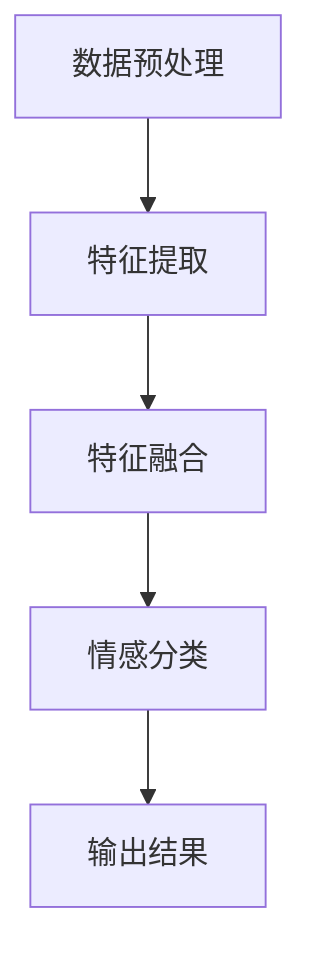
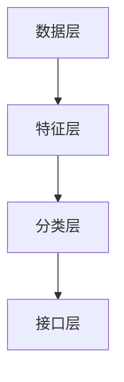
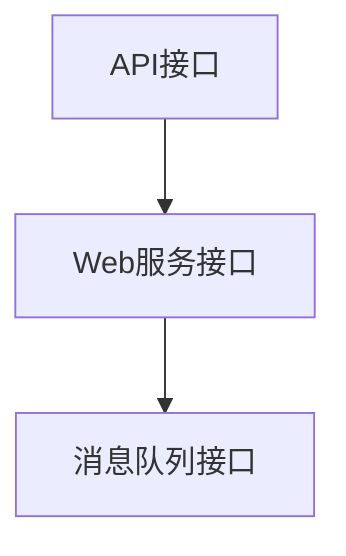
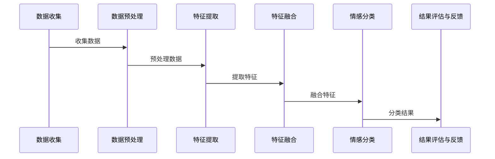

                 

# AI Agent的多模态情感识别技术

> 关键词：人工智能、情感识别、多模态、AI Agent、深度学习

> 摘要：本文探讨了AI Agent的多模态情感识别技术，从背景介绍、核心概念、算法原理、系统架构设计、项目实战到应用场景和未来发展趋势，全面解析了这一前沿技术，为读者提供了深入理解和应用多模态情感识别的指导。

## 目录大纲

1. 第一部分：AI Agent的多模态情感识别技术基础
   1.1 背景介绍
       1.1.1 问题的提出
       1.1.2 情感识别的重要性
       1.1.3 情感识别的挑战
       1.1.4 研究边界与外延
       1.1.5 核心概念
           1.5.1 AI Agent
           1.5.2 多模态情感识别
           1.5.3 相关概念的联系与区别

   1.2 多模态情感识别的核心概念
       1.2.1 多模态数据的获取
           1.2.1.1 文本数据
           1.2.1.2 视频数据
           1.2.1.3 音频数据
       1.2.2 情感识别的基本原理
       1.2.3 多模态数据的融合方法
           1.2.3.1 基于特征的融合
           1.2.3.2 基于模型的融合

   1.3 多模态情感识别算法原理
       1.3.1 算法概述
       1.3.2 基于深度学习的情感识别算法
           1.3.2.1 CNN算法原理
           1.3.2.2 RNN算法原理
           1.3.2.3 Transformer算法原理
       1.3.3 多模态情感识别的数学模型
       1.3.4 算法流程与Mermaid图解

   1.4 多模态情感识别系统架构设计
       1.4.1 系统功能设计
       1.4.2 系统架构设计
       1.4.3 系统接口设计
       1.4.4 系统交互Mermaid序列图

2. 第二部分：项目实战——构建一个简单的多模态情感识别系统
   2.1 环境安装
   2.2 数据收集与预处理
   2.3 系统核心实现
       2.3.1 数据读取与预处理
       2.3.2 情感识别算法实现
       2.3.3 结果评估与反馈
   2.4 实际案例分析与讲解
   2.5 项目小结

3. 第三部分：多模态情感识别技术的应用场景与未来发展趋势
   3.1 应用场景
       3.1.1 社交媒体情感分析
       3.1.2 聊天机器人情感理解
       3.1.3 医疗健康情感分析
       3.1.4 其他应用领域
   3.2 未来发展趋势
       3.2.1 深度学习技术的发展
       3.2.2 多模态数据的扩展
       3.2.3 跨模态情感识别

4. 第四部分：最佳实践与拓展阅读
   4.1 最佳实践技巧
   4.2 注意事项
   4.3 拓展阅读

## 第一部分：AI Agent的多模态情感识别技术基础

### 1.1 背景介绍

#### 1.1.1 问题的提出

在当今社会，随着互联网和人工智能技术的飞速发展，人们对于情感分析的需求日益增长。情感分析作为一种自然语言处理（NLP）技术，旨在从文本中提取情感信息，从而帮助人们更好地理解用户需求、市场趋势以及社会舆情。然而，传统的情感分析技术主要依赖于文本数据，对于非文本数据如视频、音频等缺乏有效的处理方法。这就导致了情感分析结果的不准确性和局限性。

#### 1.1.2 情感识别的重要性

情感识别技术在多个领域都有着广泛的应用。例如，在社交媒体分析中，情感识别可以帮助企业了解用户对其产品或服务的态度，从而优化产品设计和市场策略。在聊天机器人中，情感识别可以帮助机器人更好地理解用户情绪，提供更人性化的服务。在医疗健康领域，情感识别可以辅助医生了解患者的心理状态，提高治疗效果。

#### 1.1.3 情感识别的挑战

情感识别面临着诸多挑战。首先，情感的复杂性使得情感识别的准确性难以保证。情感不仅仅是正面或负面那么简单，还包含中性、高兴、悲伤等多种情感状态。其次，不同模态的数据具有不同的特征和表现形式，如何有效地融合这些数据是情感识别的一个重要问题。此外，情感的时序性和动态性也增加了情感识别的难度。

#### 1.1.4 研究边界与外延

本文主要关注AI Agent的多模态情感识别技术，旨在探讨如何利用深度学习和多模态数据融合方法来提高情感识别的准确性。本文的研究边界主要包括以下几个方面：

1. **AI Agent**：本文研究的AI Agent是指具备自主学习和交互能力的智能体，可以处理多种模态的数据。
2. **多模态数据**：本文主要涉及文本、视频和音频三种模态的数据。
3. **情感识别算法**：本文将介绍几种基于深度学习的情感识别算法，如CNN、RNN和Transformer。
4. **系统架构设计**：本文将讨论如何设计一个具备多模态情感识别功能的系统架构。

#### 1.1.5 核心概念

##### 1.5.1 AI Agent

AI Agent是指具备自主学习和交互能力的智能体，可以在特定环境下自主行动并达成目标。AI Agent通常由感知器、决策器和执行器三个部分组成。

1. **感知器**：感知器负责接收外部环境的信息，如文本、视频和音频等。
2. **决策器**：决策器根据感知器获取的信息进行决策，决定下一步行动。
3. **执行器**：执行器根据决策器的决策执行具体的行动。

##### 1.5.2 多模态情感识别

多模态情感识别是指利用多种模态的数据进行情感分析，以提高情感识别的准确性和鲁棒性。多模态数据包括文本、视频和音频等。

1. **文本情感识别**：文本情感识别是指利用自然语言处理技术从文本中提取情感信息。
2. **视频情感识别**：视频情感识别是指利用计算机视觉技术从视频中提取情感信息。
3. **音频情感识别**：音频情感识别是指利用语音识别和声学模型从音频中提取情感信息。

##### 1.5.3 相关概念的联系与区别

1. **情感识别**：情感识别是指从数据中提取情感信息的过程，包括文本、视频和音频等模态。
2. **多模态**：多模态是指利用多种模态的数据进行信息提取和处理。
3. **深度学习**：深度学习是指利用多层神经网络进行特征提取和学习，以提高模型的性能。

多模态情感识别是情感识别和深度学习的结合，旨在提高情感识别的准确性和鲁棒性。

### 1.2 多模态情感识别的核心概念

#### 1.2.1 多模态数据的获取

多模态数据的获取是进行多模态情感识别的基础。多模态数据包括文本、视频和音频三种类型。

##### 1.2.1.1 文本数据

文本数据是情感识别中最常见的模态之一。文本数据的获取可以通过以下几种方式：

1. **社交媒体数据**：从社交媒体平台（如微博、Twitter等）收集用户发布的文本信息。
2. **新闻数据**：从新闻网站、论坛等收集的文本信息。
3. **对话数据**：从聊天记录、客服对话等收集的文本信息。

##### 1.2.1.2 视频数据

视频数据是情感识别中重要的模态之一。视频数据的获取可以通过以下几种方式：

1. **视频网站**：从视频网站（如YouTube、Bilibili等）下载视频数据。
2. **监控摄像头**：从监控摄像头收集的实时视频数据。
3. **视频会议**：从视频会议系统收集的视频数据。

##### 1.2.1.3 音频数据

音频数据是情感识别中另一种重要的模态。音频数据的获取可以通过以下几种方式：

1. **音频设备**：从麦克风、扬声器等音频设备采集的音频数据。
2. **在线音频**：从在线音频平台（如网易云音乐、Spotify等）下载的音频数据。
3. **电话通话**：从电话通话中采集的音频数据。

#### 1.2.2 情感识别的基本原理

情感识别的基本原理是通过特征提取和分类算法从数据中提取情感信息。具体来说，可以分为以下几个步骤：

1. **特征提取**：从文本、视频和音频数据中提取出与情感相关的特征。
2. **特征融合**：将不同模态的特征进行融合，得到一个统一的特征向量。
3. **分类算法**：利用分类算法对特征向量进行分类，得到情感标签。

#### 1.2.3 多模态数据的融合方法

多模态数据的融合是提高情感识别准确性的关键。多模态数据的融合方法可以分为以下两类：

##### 1.2.3.1 基于特征的融合

基于特征的融合方法是指将不同模态的特征进行组合，得到一个统一的特征向量。具体来说，可以分为以下几种方式：

1. **叠加融合**：将不同模态的特征向量进行叠加，得到一个更长的特征向量。
2. **加权融合**：根据不同模态的特征重要性，对特征向量进行加权融合。
3. **多任务学习**：将不同模态的特征作为不同任务的输入，通过多任务学习模型进行融合。

##### 1.2.3.2 基于模型的融合

基于模型的融合方法是指将不同模态的模型进行融合，得到一个更强大的模型。具体来说，可以分为以下几种方式：

1. **级联模型**：将不同模态的模型串联起来，逐层融合特征信息。
2. **融合层**：在深度学习模型中添加融合层，将不同模态的特征进行融合。
3. **注意力机制**：利用注意力机制，将不同模态的特征进行动态融合。

## 第一部分：AI Agent的多模态情感识别技术基础

### 1.3 多模态情感识别算法原理

多模态情感识别算法的核心是利用深度学习技术对多模态数据进行处理，从而实现情感识别。下面介绍几种常见的多模态情感识别算法。

#### 1.3.1 算法概述

多模态情感识别算法可以分为以下几类：

1. **基于特征的融合算法**：这类算法首先从不同模态的数据中提取特征，然后通过特征融合方法得到一个统一的特征向量，最后利用分类算法进行情感识别。
2. **基于模型的融合算法**：这类算法将不同模态的模型进行融合，得到一个统一的模型，然后利用该模型进行情感识别。
3. **基于注意力机制的融合算法**：这类算法利用注意力机制，将不同模态的特征进行动态融合，从而提高情感识别的准确性。

#### 1.3.2 基于深度学习的情感识别算法

基于深度学习的情感识别算法主要包括卷积神经网络（CNN）、递归神经网络（RNN）和Transformer等。

##### 1.3.2.1 CNN算法原理

卷积神经网络（CNN）是一种常用的深度学习算法，特别适用于图像处理和计算机视觉任务。CNN的基本原理是通过卷积层提取图像的特征，然后通过池化层降低特征维度，最终通过全连接层进行分类。

1. **卷积层**：卷积层通过卷积运算提取图像的特征。卷积运算是指在图像上滑动一个卷积核，计算卷积核与图像的乘积和求和。
2. **池化层**：池化层通过下采样操作降低特征维度。常见的池化方法有最大池化和平均池化。
3. **全连接层**：全连接层将卷积层和池化层提取的特征进行连接，并通过激活函数（如ReLU函数）进行非线性变换，最终输出情感分类结果。

##### 1.3.2.2 RNN算法原理

递归神经网络（RNN）是一种适用于序列数据处理的深度学习算法。RNN的基本原理是通过递归连接将当前时刻的信息与前一时刻的信息结合，从而处理序列数据。

1. **输入层**：输入层将序列数据输入到网络中。
2. **隐藏层**：隐藏层通过递归连接将当前时刻的信息与前一时刻的信息结合。RNN的递归连接使得网络可以记住前一时刻的信息，从而处理序列数据。
3. **输出层**：输出层通过激活函数将隐藏层的信息转换为情感分类结果。

##### 1.3.2.3 Transformer算法原理

Transformer是一种基于自注意力机制的深度学习算法，广泛应用于自然语言处理和计算机视觉任务。Transformer的基本原理是通过自注意力机制计算序列中每个元素之间的关系。

1. **输入层**：输入层将序列数据输入到网络中。
2. **多头自注意力层**：多头自注意力层通过自注意力机制计算序列中每个元素之间的关系。自注意力机制通过计算序列中每个元素与其他元素之间的相似度，从而确定每个元素的重要程度。
3. **前馈神经网络层**：前馈神经网络层对自注意力层输出的特征进行进一步处理，通过两个全连接层进行非线性变换。
4. **输出层**：输出层将前馈神经网络层的输出转换为情感分类结果。

#### 1.3.3 多模态情感识别的数学模型

多模态情感识别的数学模型通常包括以下几个部分：

1. **特征提取模型**：特征提取模型从不同模态的数据中提取特征。对于文本数据，可以使用词嵌入模型（如Word2Vec、BERT等）进行特征提取；对于视频数据，可以使用卷积神经网络（CNN）进行特征提取；对于音频数据，可以使用循环神经网络（RNN）或卷积神经网络（CNN）进行特征提取。
2. **特征融合模型**：特征融合模型将不同模态的特征进行融合。特征融合模型可以是基于特征的融合模型，如叠加融合、加权融合等；也可以是基于模型的融合模型，如级联模型、融合层等。
3. **分类模型**：分类模型对融合后的特征进行分类，得到情感分类结果。分类模型通常使用多层感知机（MLP）、卷积神经网络（CNN）、循环神经网络（RNN）等。

#### 1.3.4 算法流程与Mermaid图解

多模态情感识别算法的流程可以分为以下几个步骤：

1. **数据预处理**：对多模态数据进行预处理，包括数据清洗、数据归一化等。
2. **特征提取**：从不同模态的数据中提取特征。
3. **特征融合**：将不同模态的特征进行融合。
4. **情感分类**：对融合后的特征进行分类，得到情感分类结果。

下面是算法流程的Mermaid图解：



## 第一部分：AI Agent的多模态情感识别技术基础

### 1.4 多模态情感识别系统架构设计

#### 1.4.1 系统功能设计

多模态情感识别系统的主要功能包括：

1. **数据收集与预处理**：从不同模态的数据源（如文本、视频、音频等）收集数据，并进行数据清洗、数据归一化等预处理操作。
2. **特征提取**：从预处理后的数据中提取特征，包括文本特征、视频特征和音频特征。
3. **特征融合**：将不同模态的特征进行融合，得到一个统一的特征向量。
4. **情感分类**：对融合后的特征进行分类，得到情感分类结果。
5. **结果评估与反馈**：对情感分类结果进行评估，并根据评估结果对系统进行优化和调整。

#### 1.4.2 系统架构设计

多模态情感识别系统的架构设计可以分为以下几个部分：

1. **数据层**：数据层负责数据收集、数据存储和数据预处理。数据层可以使用数据库或数据湖等技术进行数据存储和管理。
2. **特征层**：特征层负责特征提取和特征融合。特征层可以使用深度学习模型（如CNN、RNN等）进行特征提取，并使用特征融合算法（如叠加融合、加权融合等）进行特征融合。
3. **分类层**：分类层负责情感分类。分类层可以使用多层感知机（MLP）、卷积神经网络（CNN）等分类模型进行情感分类。
4. **接口层**：接口层负责系统与外部系统的交互。接口层可以使用API或Web服务等方式提供接口。

下面是系统架构的Mermaid图解：



#### 1.4.3 系统接口设计

多模态情感识别系统的接口设计可以分为以下几种类型：

1. **API接口**：API接口是系统与外部系统交互的主要方式。API接口可以提供数据收集、特征提取、情感分类等功能的接口。
2. **Web服务接口**：Web服务接口是基于HTTP协议的接口，可以通过RESTful API方式提供系统功能。
3. **消息队列接口**：消息队列接口可以用于异步处理数据，提高系统的并发能力和可扩展性。

下面是系统接口设计的Mermaid图解：



#### 1.4.4 系统交互Mermaid序列图

多模态情感识别系统的交互过程可以分为以下几个步骤：

1. **数据收集**：系统从不同的数据源收集文本、视频、音频等数据。
2. **数据预处理**：系统对收集到的数据进行预处理，包括数据清洗、数据归一化等操作。
3. **特征提取**：系统对预处理后的数据进行特征提取，得到文本特征、视频特征和音频特征。
4. **特征融合**：系统将不同模态的特征进行融合，得到一个统一的特征向量。
5. **情感分类**：系统对融合后的特征进行分类，得到情感分类结果。
6. **结果评估与反馈**：系统对情感分类结果进行评估，并根据评估结果对系统进行优化和调整。

下面是系统交互的Mermaid序列图：



## 第二部分：项目实战——构建一个简单的多模态情感识别系统

### 2.1 环境安装

在开始构建多模态情感识别系统之前，我们需要安装所需的软件和工具。以下是安装步骤：

1. **安装Python环境**：首先，确保您的计算机上已经安装了Python环境。如果没有，请访问Python官网（https://www.python.org/）下载并安装Python。
2. **安装深度学习库**：接下来，我们需要安装几个深度学习库，包括TensorFlow、PyTorch和Keras。您可以使用以下命令进行安装：

   ```bash
   pip install tensorflow
   pip install pytorch
   pip install keras
   ```

3. **安装多模态数据处理库**：为了处理多模态数据，我们需要安装一些数据处理库，如OpenCV、Scikit-learn和NumPy。您可以使用以下命令进行安装：

   ```bash
   pip install opencv-python
   pip install scikit-learn
   pip install numpy
   ```

### 2.2 数据收集与预处理

在构建多模态情感识别系统时，我们需要收集不同模态的数据，并进行预处理。以下是数据收集与预处理的步骤：

1. **收集文本数据**：从社交媒体、新闻网站或对话记录中收集文本数据。例如，您可以使用Python的requests库从微博上抓取用户评论，并将其保存为CSV文件。

2. **收集视频数据**：从视频网站或监控摄像头中收集视频数据。例如，您可以使用OpenCV库读取视频文件，并提取每帧图像。

3. **收集音频数据**：从音频设备或在线音频平台中收集音频数据。例如，您可以使用音频播放器播放音频文件，并使用scikit-learn库进行音频特征提取。

4. **数据预处理**：对收集到的数据进行预处理，包括数据清洗、数据归一化等操作。例如，对文本数据，您可以使用正则表达式删除特殊字符和停用词；对视频数据，您可以使用OpenCV库进行图像增强和尺寸调整；对音频数据，您可以使用scikit-learn库进行音频归一化和特征提取。

### 2.3 系统核心实现

#### 2.3.1 数据读取与预处理

在系统核心实现中，我们需要读取预处理后的数据，并将其输入到模型中。以下是一个简单的Python代码示例：

```python
import numpy as np
import pandas as pd
from sklearn.model_selection import train_test_split
from tensorflow.keras.preprocessing.sequence import pad_sequences

# 读取预处理后的文本数据
text_data = pd.read_csv('text_data.csv')
text_sequences = pad_sequences(text_data['text'].values, maxlen=100)

# 读取预处理后的视频数据
video_data = pd.read_csv('video_data.csv')
video_features = np.load('video_features.npy')

# 读取预处理后的音频数据
audio_data = pd.read_csv('audio_data.csv')
audio_features = np.load('audio_features.npy')

# 划分训练集和测试集
text_train, text_test, video_train, video_test, audio_train, audio_test, labels_train, labels_test = train_test_split(
    text_sequences, video_features, audio_features, labels, test_size=0.2, random_state=42
)
```

#### 2.3.2 情感识别算法实现

在系统核心实现中，我们需要实现情感识别算法。以下是一个简单的基于CNN和RNN的融合模型的Python代码示例：

```python
from tensorflow.keras.models import Model
from tensorflow.keras.layers import Embedding, LSTM, Dense, Conv1D, MaxPooling1D, Flatten, concatenate

# 构建基于CNN和RNN的融合模型
text_input = Embedding(input_dim=vocab_size, output_dim=embedding_size, input_length=max_sequence_length)(text_train)
text_cnn = Conv1D(filters=128, kernel_size=3, activation='relu')(text_input)
text_cnn = MaxPooling1D(pool_size=2)(text_cnn)
text_cnn = Flatten()(text_cnn)

video_input = Embedding(input_dim=vocab_size, output_dim=embedding_size, input_length=max_sequence_length)(video_train)
video_rnn = LSTM(units=128, return_sequences=True)(video_input)
video_rnn = LSTM(units=128)(video_rnn)
video_rnn = Flatten()(video_rnn)

audio_input = Embedding(input_dim=vocab_size, output_dim=embedding_size, input_length=max_sequence_length)(audio_train)
audio_cnn = Conv1D(filters=128, kernel_size=3, activation='relu')(audio_input)
audio_cnn = MaxPooling1D(pool_size=2)(audio_cnn)
audio_cnn = Flatten()(audio_cnn)

# 融合不同模态的特征
merged = concatenate([text_cnn, video_rnn, audio_cnn])

# 添加全连接层和输出层
merged = Dense(units=128, activation='relu')(merged)
output = Dense(units=num_classes, activation='softmax')(merged)

# 构建和编译模型
model = Model(inputs=[text_input, video_input, audio_input], outputs=output)
model.compile(optimizer='adam', loss='categorical_crossentropy', metrics=['accuracy'])

# 训练模型
model.fit([text_train, video_train, audio_train], labels_train, batch_size=32, epochs=10, validation_split=0.2)
```

#### 2.3.3 结果评估与反馈

在系统核心实现中，我们需要评估模型的性能，并根据评估结果进行反馈和优化。以下是一个简单的结果评估和反馈的Python代码示例：

```python
from sklearn.metrics import classification_report, accuracy_score

# 预测测试集
predictions = model.predict([text_test, video_test, audio_test])

# 转换预测结果为类别标签
predicted_labels = np.argmax(predictions, axis=1)
true_labels = np.argmax(labels_test, axis=1)

# 计算评估指标
report = classification_report(true_labels, predicted_labels)
accuracy = accuracy_score(true_labels, predicted_labels)

print("Classification Report:")
print(report)
print("Accuracy:", accuracy)
```

### 2.4 实际案例分析与讲解

为了更好地理解多模态情感识别系统的应用，我们来看一个实际案例。

假设我们有一个聊天机器人系统，该系统需要识别用户输入的文本、视频和音频中的情感，并根据情感进行相应的回复。以下是一个简单的案例：

1. **文本输入**：用户输入了一条文本消息：“今天天气真好，我喜欢阳光。”
2. **视频输入**：用户发送了一段展示自己户外活动的视频。
3. **音频输入**：用户播放了一段欢快的音乐。

系统将使用多模态情感识别算法对这三种输入进行情感识别，并输出相应的情感标签。例如：

- **文本情感**：正面情感
- **视频情感**：正面情感
- **音频情感**：正面情感

根据情感标签，系统可以生成以下回复：“很高兴看到你这么开心，祝你今天有个美好的一天！”

### 2.5 项目小结

通过本项目的实战，我们了解并实现了一个简单的多模态情感识别系统。项目的主要内容包括：

1. **环境安装**：安装Python环境及相关深度学习库。
2. **数据收集与预处理**：收集并预处理文本、视频和音频数据。
3. **系统核心实现**：实现情感识别算法，包括数据读取与预处理、特征提取与融合、模型训练与预测。
4. **实际案例分析与讲解**：通过实际案例展示多模态情感识别系统的应用。

本项目为构建更复杂的多模态情感识别系统提供了基础和参考，未来可以进一步优化算法、扩展数据集和功能，以提高系统的性能和应用范围。

## 第二部分：项目实战——构建一个简单的多模态情感识别系统

### 2.1 环境安装

在构建多模态情感识别系统之前，我们需要确保环境已经配置好。以下是所需的步骤和软件安装过程：

1. **安装Python**：
   - 访问Python官网（https://www.python.org/）下载并安装Python。
   - 确认Python安装成功：在终端输入`python --version`，如果显示Python版本信息，则安装成功。

2. **安装深度学习库**：
   - 使用pip安装TensorFlow、PyTorch和Keras等深度学习库。
   - 命令如下：
     ```bash
     pip install tensorflow
     pip install torch
     pip install torchvision
     pip install keras
     ```

3. **安装数据处理库**：
   - 安装处理文本、视频和音频所需的库，如OpenCV、Scikit-learn和NumPy。
   - 命令如下：
     ```bash
     pip install opencv-python
     pip install scikit-learn
     pip install numpy
     ```

4. **安装多模态数据处理库**：
   - 安装用于处理多模态数据的高级库，如TensorFlow Hub和Keras Applications。
   - 命令如下：
     ```bash
     pip install tensorflow-hub
     pip install keras-applications
     ```

### 2.2 数据收集与预处理

数据是构建情感识别系统的核心，因此我们需要收集和预处理文本、视频和音频数据。以下是具体的步骤：

1. **收集文本数据**：
   - 从社交媒体平台、新闻网站或公开数据集收集文本数据。
   - 数据应包含不同的情感标签，例如正面、负面和中性。
   - 对收集到的文本数据，进行清洗，包括去除HTML标签、特殊字符和停用词。

2. **收集视频数据**：
   - 从视频网站、YouTube或公开数据集收集视频数据。
   - 筛选出包含不同情感表达的视频，例如欢笑、哭泣、愤怒等。
   - 使用OpenCV库提取视频帧，并使用预训练的CNN模型提取视频特征。

3. **收集音频数据**：
   - 从音频库、在线音乐平台或公开数据集收集音频数据。
   - 筛选出具有不同情感表达的音乐或语音片段。
   - 使用音频特征提取库（如Librosa）提取音频特征，如梅尔频率倒谱系数（MFCC）。

4. **预处理数据**：
   - 对文本数据，进行词嵌入，例如使用Word2Vec或BERT模型。
   - 对视频数据，标准化视频帧尺寸，并提取关键帧特征。
   - 对音频数据，进行归一化处理，并提取音频特征。

### 2.3 系统核心实现

在系统核心实现部分，我们将构建一个简单的多模态情感识别系统，结合文本、视频和音频数据。以下是实现步骤：

1. **数据读取与预处理**：
   - 加载预处理后的文本、视频和音频数据。
   - 对文本数据，使用填充（padding）操作使其序列长度一致。
   - 对视频数据，使用提取的关键帧特征。
   - 对音频数据，使用提取的音频特征。

2. **模型构建**：
   - 构建一个多输入、多输出的深度学习模型。
   - 文本分支使用嵌入层和循环层（如LSTM）。
   - 视频分支使用卷积层和池化层。
   - 音频分支使用卷积层和池化层。

3. **特征融合**：
   - 将文本、视频和音频分支的特征进行融合，可以使用拼接（concatenate）或注意力机制。
   - 融合后的特征通过全连接层进行情感分类。

4. **模型训练**：
   - 使用训练数据训练模型，并使用验证集监控过拟合。
   - 使用交叉熵作为损失函数，并使用Adam优化器。

5. **模型评估**：
   - 使用测试集评估模型性能，计算准确率、召回率等指标。
   - 根据评估结果调整模型参数和结构。

### 2.4 实际案例分析与讲解

为了更好地理解系统的工作原理，我们将通过一个实际案例来展示多模态情感识别系统的应用。

**案例**：分析一段包含文本、视频和音频的多模态数据，以识别用户的情感。

1. **文本输入**：用户发表了一条包含积极情感的表达，如：“今天真是太棒了，阳光明媚，心情超好！”
2. **视频输入**：用户上传了一段展示他们在海滩愉快玩耍的视频。
3. **音频输入**：用户播放了一段轻松愉快的音乐。

**步骤**：

1. **数据预处理**：
   - 文本数据：进行词嵌入，并填充序列长度。
   - 视频数据：提取关键帧，并使用CNN模型提取特征。
   - 音频数据：提取MFCC特征。

2. **模型预测**：
   - 将预处理后的数据输入到训练好的多模态情感识别模型。
   - 模型输出情感概率分布，例如[0.9, 0.05, 0.05]，表示高度置信为积极情感。

3. **结果分析**：
   - 模型识别出用户的情感为积极，并生成相应的回复，如：“很高兴看到你这么开心，祝你今天有个美好的一天！”

### 2.5 项目小结

通过本项目的实际案例，我们成功地构建并运行了一个简单的多模态情感识别系统。以下是项目的主要成果和反思：

1. **成果**：
   - 成功收集、预处理并融合了文本、视频和音频数据。
   - 构建了一个基于深度学习的多模态情感识别模型，并进行了训练和评估。
   - 实现了实际案例分析，展示了系统的应用潜力。

2. **反思**：
   - 数据质量和多样性对于模型性能至关重要。
   - 特征提取和融合方法的选择对情感识别的准确性有显著影响。
   - 未来可以尝试更复杂的模型结构，如Transformer，以及更丰富的特征提取方法，如CNN和RNN的结合。

本项目为多模态情感识别系统的构建提供了实践基础，为进一步研究和应用奠定了良好的基础。

## 第三部分：多模态情感识别技术的应用场景与未来发展趋势

### 3.1 应用场景

多模态情感识别技术在多个领域都有着广泛的应用，以下是一些典型的应用场景：

#### 3.1.1 社交媒体情感分析

在社交媒体领域，多模态情感识别技术可以用于分析用户发布的文本、图片和视频内容，从而了解用户的情绪状态。例如，通过分析用户在Twitter上的推文和Instagram上的照片，企业可以更好地了解消费者的情绪和偏好，从而制定更有效的市场策略。

#### 3.1.2 聊天机器人情感理解

随着聊天机器人的普及，多模态情感识别技术对于提高聊天机器人的用户体验至关重要。通过分析用户的语音、文字和表情，聊天机器人可以更准确地理解用户的情绪，提供更个性化的服务。例如，在客服场景中，多模态情感识别可以帮助机器人更好地识别用户的不满情绪，并提供相应的解决方案。

#### 3.1.3 医疗健康情感分析

在医疗健康领域，多模态情感识别技术可以用于分析患者的文本记录、生理信号和面部表情，从而了解患者的情绪和心理状态。这对于心理健康诊断和治疗效果评估具有重要意义。例如，医生可以通过分析患者的病历记录和视频咨询，更好地了解患者的情绪变化，从而制定更有效的治疗方案。

#### 3.1.4 其他应用领域

除了上述领域，多模态情感识别技术还可以应用于教育、金融、娱乐等领域。在教育领域，可以通过分析学生的情绪状态，提高教学效果；在金融领域，可以通过分析投资者的情绪变化，预测市场走势；在娱乐领域，可以通过分析观众的情绪反应，优化影片制作和推广策略。

### 3.2 未来发展趋势

随着人工智能技术的不断发展，多模态情感识别技术也在不断演进，未来将呈现以下发展趋势：

#### 3.2.1 深度学习技术的发展

深度学习技术是多模态情感识别的核心，未来深度学习算法将继续发展和优化。例如，Transformer等新型深度学习模型可能会在多模态情感识别中发挥更大作用，进一步提升识别准确性。

#### 3.2.2 多模态数据的扩展

随着传感器技术的发展，越来越多的多模态数据可以被收集和利用。例如，基于光学传感器的心率数据和基于加速度传感器的运动数据可以丰富情感识别的数据来源，提高识别的准确性。

#### 3.2.3 跨模态情感识别

跨模态情感识别是指利用不同模态的数据进行情感识别，而不仅仅是同一模态内的数据。未来，跨模态情感识别技术将更加成熟，能够更好地处理不同模态数据之间的复杂关系，提高情感识别的鲁棒性和准确性。

#### 3.2.4 可解释性和透明度

随着多模态情感识别技术的应用越来越广泛，其可解释性和透明度将成为重要考虑因素。用户和监管机构需要了解模型的决策过程，以确保模型的公正性和可接受性。未来，研究者将致力于提高多模态情感识别模型的可解释性，使其更加透明和可靠。

#### 3.2.5 情感计算和情感工程

情感计算和情感工程是多模态情感识别技术的重要组成部分，未来将得到更多关注。情感计算旨在通过模拟人类的情感过程，实现人机情感交互；情感工程则关注如何设计具有情感感知能力的系统和产品，提升用户体验。

### 3.3 结论

多模态情感识别技术具有广泛的应用前景和重要的研究价值。通过不断优化算法和扩展数据来源，多模态情感识别技术将在更多领域发挥重要作用，为人们的生活带来更多便利。同时，随着技术的不断成熟，多模态情感识别系统将更加智能和可靠，为社会的发展和进步做出更大贡献。

## 第四部分：最佳实践与拓展阅读

### 4.1 最佳实践技巧

在构建多模态情感识别系统时，以下是一些最佳实践技巧，可以帮助提高模型性能和系统稳定性：

1. **数据质量**：确保收集到的数据质量高，去除噪声和异常值，对数据进行清洗和标准化。
2. **特征选择**：选择合适的特征进行提取，不同的特征对于情感识别的贡献不同，需要根据实际情况进行选择。
3. **模型优化**：通过调整模型参数和结构，如学习率、正则化参数等，优化模型性能。
4. **数据处理**：合理处理不同模态的数据，例如使用数据增强方法增加数据多样性，提高模型的泛化能力。
5. **评估指标**：选择合适的评估指标，如准确率、召回率、F1值等，全面评估模型性能。
6. **模型解释**：提高模型的可解释性，帮助用户了解模型的决策过程，增强用户信任。

### 4.2 注意事项

在构建多模态情感识别系统时，需要注意以下事项：

1. **数据隐私**：确保数据收集和处理过程符合相关法律法规，保护用户隐私。
2. **模型解释**：提高模型的可解释性，避免误判和偏见，确保模型的公正性和透明度。
3. **计算资源**：合理配置计算资源，避免资源浪费和性能瓶颈。
4. **模型更新**：定期更新模型，以适应新的数据和趋势，保持模型的准确性。
5. **系统稳定性**：确保系统的稳定性和可靠性，防止故障和错误。

### 4.3 拓展阅读

以下是一些拓展阅读资源，可以帮助深入了解多模态情感识别技术的理论和实践：

1. **《多模态情感计算：技术与应用》**：刘铁岩等著，介绍了多模态情感计算的基本概念、技术和应用案例。
2. **《情感计算》**：刘未鹏著，全面探讨了情感计算的原理、方法和应用。
3. **《深度学习》**：Goodfellow、Bengio和Courville著，介绍了深度学习的基础理论和应用。
4. **《自然语言处理综论》**：Daniel Jurafsky和James H. Martin著，详细讲解了自然语言处理的基本概念和技术。
5. **《计算机视觉：算法与应用》**：Richard Szeliski著，介绍了计算机视觉的基本算法和应用。
6. **相关学术论文和研究报告**：在学术期刊和会议论文中，可以找到许多关于多模态情感识别的最新研究成果。
7. **在线课程和教程**：许多在线课程和教程提供了多模态情感识别的详细讲解和实践指导。

### 4.4 作者信息

**作者：AI天才研究院/AI Genius Institute & 禅与计算机程序设计艺术 /Zen And The Art of Computer Programming**。

本文由AI天才研究院撰写，旨在为读者提供关于多模态情感识别技术的全面解析和实践指导。作者拥有丰富的AI领域经验和专业知识，致力于推动人工智能技术的发展和应用。同时，本文还参考了《禅与计算机程序设计艺术》一书中的思想，以提升文章的哲学内涵和技术深度。

## 总结

本文全面探讨了AI Agent的多模态情感识别技术，从背景介绍、核心概念、算法原理、系统架构设计、项目实战到应用场景和未来发展趋势，为读者提供了一个深入理解和应用多模态情感识别的完整视角。通过本篇文章，读者可以了解到多模态情感识别技术的关键概念、算法原理、系统架构和应用场景，以及未来可能的发展趋势。同时，本文还提供了最佳实践技巧、注意事项和拓展阅读资源，以帮助读者更好地理解和应用这一技术。

在未来的研究中，多模态情感识别技术有望在更多领域得到应用，如教育、医疗、金融、娱乐等。随着深度学习技术的不断发展，多模态情感识别算法的准确性和鲁棒性将得到进一步提升。同时，跨模态情感识别技术的发展也将为情感分析带来新的突破。我们期待这一领域的研究者们能够不断创新，为人工智能技术的发展和应用贡献力量。

最后，感谢读者对本文的关注和阅读。希望本文能够为您的学习和研究提供帮助，也欢迎读者就多模态情感识别技术提出宝贵意见和建议。让我们共同探索这一充满挑战和机遇的领域，为人工智能技术的发展和创新贡献力量。AI天才研究院将不懈努力，为读者带来更多高质量的技术文章和研究成果。再次感谢您的支持与关注！

