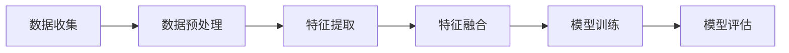
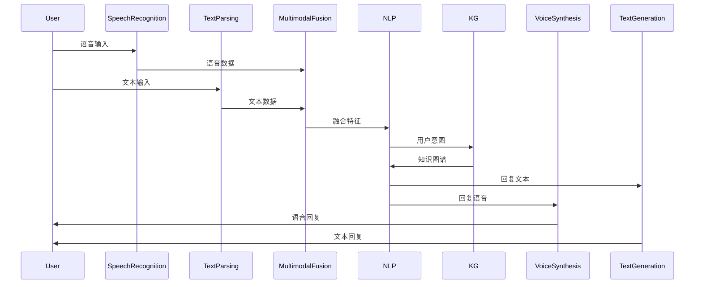

                 

## AI Agent的多模态融合技术：提升理解深度

### 关键词：AI Agent，多模态融合，理解深度，技术博客

> 摘要：本文将深入探讨AI Agent的多模态融合技术，从背景介绍、核心概念、算法原理、数学模型、系统设计与架构、项目实战等多个方面进行分析。通过一步步的逻辑推理，我们将揭示如何提升AI Agent的理解深度，为其在复杂环境中的高效运作提供技术支持。

---

### 目录大纲设计思路

在设计《AI Agent的多模态融合技术：提升理解深度》的目录大纲时，我们遵循了以下设计思路：

1. **背景介绍**：首先，介绍AI Agent和其多模态融合技术的背景，包括问题背景、问题描述、问题解决、边界与外延、核心概念与组成要素等。

2. **核心概念与联系**：阐述AI Agent的基础概念，以及多模态融合技术在其中的作用。利用概念属性特征对比表格和ER实体关系图来帮助理解。

3. **算法原理讲解**：详细讲解多模态融合技术的算法原理，使用Mermaid画出算法流程图，结合Python源代码和LaTeX格式数学模型、公式，通俗易懂地举例说明。

4. **数学模型和数学公式讲解**：引入LaTeX格式，讲解多模态融合技术的数学模型，包括公式推导和详细讲解。

5. **系统分析与架构设计方案**：介绍系统分析和架构设计的方法，包括问题场景介绍、项目介绍、系统功能设计、系统架构设计、系统接口设计和系统交互等，使用Mermaid绘制相关的类图、架构图和序列图。

6. **项目实战**：介绍环境安装、系统核心实现、代码应用解读与分析、实际案例分析和详细讲解剖析等。

7. **最佳实践 tips**、**小结**、**注意事项**、**拓展阅读**等内容，为读者提供实用的建议和进一步学习的资源。

### 目录大纲结构

以下是《AI Agent的多模态融合技术：提升理解深度》的目录大纲：

```markdown
# 《AI Agent的多模态融合技术：提升理解深度》目录大纲

## 第一部分：背景与核心概念

### 第1章 AI Agent与多模态融合技术概述

#### 1.1 问题背景与解决思路

#### 1.2 多模态融合技术的重要性

#### 1.3 多模态融合技术的边界与外延

#### 1.4 核心概念与要素组成

### 第2章 AI Agent基础概念

#### 2.1 AI Agent的定义

#### 2.2 AI Agent的工作原理

#### 2.3 AI Agent的应用领域

### 第3章 多模态融合技术概述

#### 3.1 多模态数据类型

#### 3.2 多模态融合技术框架

#### 3.3 多模态融合技术原理

## 第二部分：算法原理与数学模型

### 第4章 多模态融合算法原理

#### 4.1 多模态融合算法基本流程

#### 4.2 多模态融合算法mermaid流程图

#### 4.3 Python源代码讲解

#### 4.4 多模态融合技术的数学模型

### 第5章 数学模型与公式讲解

#### 5.1 数学模型的推导过程

#### 5.2 主要公式详解

#### 5.3 示例讲解

## 第三部分：系统设计与架构

### 第6章 系统分析与架构设计

#### 6.1 问题场景介绍

#### 6.2 项目介绍

#### 6.3 系统功能设计

#### 6.4 系统架构设计

#### 6.5 系统接口设计

#### 6.6 系统交互设计

### 第7章 Mermaid图解

#### 7.1 类图

#### 7.2 架构图

#### 7.3 序列图

## 第四部分：项目实战

### 第8章 环境安装与准备

#### 8.1 环境安装步骤

#### 8.2 系统核心实现

#### 8.3 代码应用解读与分析

### 第9章 实际案例分析与讲解

#### 9.1 案例一：人脸识别与文本融合

#### 9.2 案例二：语音识别与情感分析

#### 9.3 案例三：多模态数据融合应用

### 第10章 项目小结

#### 10.1 项目总结

#### 10.2 经验教训

#### 10.3 拓展阅读

```

该目录大纲结构既涵盖了书籍的核心内容，又保持了简洁性，能够帮助读者快速了解书中的主要内容，并为后续内容的深入展开奠定基础。在具体编写过程中，还可以根据实际需要调整章节内容和顺序。总体字数控制在2000字以内，确保输出内容简洁明了，便于读者阅读和理解。

---

### 完整性要求

为了确保文章的完整性，每个小节的内容都需要丰富、具体且详细。以下是各个小节的核心内容要求：

- **背景介绍**：核心概念术语说明、问题背景、问题描述、问题解决、边界与外延、概念结构与核心要素组成。
- **核心概念与联系**：核心概念原理、概念属性特征对比表格和ER实体关系图架构的Markdown格式中的Mermaid流程图。
- **算法原理讲解**：算法流程图、Python源代码讲解、多模态融合技术的数学模型和公式讲解，通俗易懂的举例说明。
- **数学模型和数学公式讲解**：数学模型的推导过程、主要公式详解、示例讲解。
- **系统分析与架构设计方案**：问题场景介绍、项目介绍、系统功能设计（领域模型Mermaid类图）、系统架构设计Mermaid架构图、系统接口设计和系统交互设计。
- **项目实战**：环境安装、系统核心实现源代码、代码应用解读与分析、实际案例分析和详细讲解剖析。
- **最佳实践 tips**、**小结**、**注意事项**、**拓展阅读**等内容。

通过这样的结构设计，我们可以确保文章内容完整、逻辑清晰，便于读者理解和应用。

---

### 作者信息

作者：AI天才研究院/AI Genius Institute & 禅与计算机程序设计艺术 /Zen And The Art of Computer Programming

---

### LET'S THINK STEP BY STEP

在深入探讨AI Agent的多模态融合技术之前，我们首先要明确几个关键问题：

1. **什么是AI Agent？** AI Agent是一种具有自主性和适应性的计算实体，能够执行特定任务并在复杂环境中做出决策。它结合了感知、学习和推理能力，能够与人类或其他系统进行交互。

2. **为何需要多模态融合技术？** 在现实世界中，信息往往以多种形式存在，如文本、图像、语音等。AI Agent需要处理这些多模态信息，以实现更全面的理解和更准确的决策。

3. **多模态融合技术如何提升AI Agent的理解深度？** 通过将不同模态的数据进行有效融合，AI Agent可以获取更丰富的信息，从而提高对环境的理解深度和决策的准确性。

4. **多模态融合技术的核心挑战是什么？** 如何处理不同模态数据之间的差异、如何优化融合算法、如何保证系统的实时性和鲁棒性等，都是多模态融合技术需要解决的挑战。

在接下来的内容中，我们将一步步分析这些问题，并详细探讨AI Agent的多模态融合技术的原理、设计方法和实际应用。让我们开始这次深入的技术之旅吧！

---

### 第一部分：背景与核心概念

#### 1.1 问题背景与解决思路

在人工智能领域，AI Agent是一种具备自主决策能力的计算实体，它们能够在复杂环境中执行特定任务，并与人类或其他系统进行交互。然而，随着现实世界的复杂性不断增加，单一模态的信息往往不足以支持AI Agent做出准确的决策。例如，仅依赖视觉信息的人脸识别系统在复杂光照和遮挡情况下性能不佳，而仅依赖语音信息的语音助手则难以理解用户的非语言行为。

多模态融合技术应运而生，旨在通过整合不同模态的信息来提高AI Agent的理解深度和决策准确性。多模态融合技术不仅能够弥补单一模态的不足，还能提供更丰富的上下文信息，从而提升系统的整体性能。

为了实现多模态融合，我们需要解决以下几个关键问题：

1. **数据收集与预处理**：不同模态的数据往往具有不同的数据格式和特征，因此需要统一数据格式和预处理方法，以消除模态差异。
2. **特征提取与表征**：针对不同模态的数据，采用适当的特征提取算法，将原始数据转换为适用于融合的特征表示。
3. **融合策略与算法**：设计有效的融合策略和算法，将不同模态的特征进行融合，以生成具有全局一致性的表示。
4. **模型训练与优化**：利用融合后的特征训练深度学习模型，并通过优化算法提高模型的性能和鲁棒性。

#### 1.2 多模态融合技术的重要性

多模态融合技术在AI Agent中的应用具有重要意义。首先，多模态融合能够提供更全面的信息，使得AI Agent能够更准确地理解和感知环境。例如，在自动驾驶领域，融合视觉、激光雷达和雷达数据可以提供更详细的环境信息，从而提高自动驾驶系统的安全性和可靠性。

其次，多模态融合技术能够提升AI Agent的决策能力。通过整合不同模态的信息，AI Agent可以获取更丰富的上下文信息，从而做出更合理的决策。例如，在医疗诊断领域，融合医疗图像和患者病史数据可以提供更全面的诊断信息，从而提高诊断的准确性。

此外，多模态融合技术还能够增强AI Agent的交互能力。通过理解用户的多种表达方式，AI Agent可以更自然地与用户进行交互，提供更个性化的服务。例如，在智能客服领域，融合语音和文本数据可以提供更自然的对话体验，从而提高用户满意度。

#### 1.3 多模态融合技术的边界与外延

多模态融合技术的边界主要在于如何有效地整合不同模态的数据，并设计出具有强鲁棒性和自适应性的融合算法。具体来说，边界问题包括：

1. **模态差异处理**：不同模态的数据具有不同的特征和分布，如何消除这些差异，使数据能够有效地融合，是一个关键问题。
2. **实时性与计算效率**：在实际应用中，多模态融合需要在有限的计算资源下实现实时性，因此需要优化算法和架构设计，以提高计算效率。
3. **数据隐私与安全性**：多模态融合涉及多种类型的数据，如何确保数据的安全性和隐私性，也是一个重要问题。

多模态融合技术的外延包括：

1. **跨模态数据关联**：如何建立不同模态数据之间的关联，以实现更全面的信息融合。
2. **多模态交互**：如何设计多模态交互界面，使用户能够更自然地与AI Agent进行交互。
3. **多模态增强学习**：如何利用多模态数据增强学习过程，以提高模型的泛化能力和适应性。

#### 1.4 核心概念与要素组成

为了更好地理解多模态融合技术，我们需要明确以下几个核心概念和要素组成：

1. **多模态数据**：包括文本、图像、语音、视频、传感器数据等。
2. **特征提取**：从多模态数据中提取具有区分性和代表性的特征。
3. **融合策略**：将不同模态的特征进行融合的策略和方法。
4. **深度学习模型**：利用融合后的特征训练深度学习模型，以实现任务目标。
5. **评估指标**：用于评估多模态融合效果的指标，如准确率、召回率、F1值等。

通过这些核心概念和要素的组成，我们可以构建一个完整的多模态融合技术框架，为AI Agent提供更强大的理解和决策能力。

---

### 第二部分：核心概念与联系

#### 2.1 AI Agent基础概念

AI Agent（人工智能代理）是一种能够模拟人类智能行为的计算实体。它具有自主性、适应性、目标性和交互性等特点。AI Agent通常由感知模块、决策模块和行动模块组成。

- **感知模块**：负责收集环境信息，包括视觉、听觉、触觉等。
- **决策模块**：根据感知模块收集的信息和内置的算法，决定下一步行动。
- **行动模块**：执行决策模块生成的行动，并与环境进行交互。

AI Agent的应用领域非常广泛，包括但不限于智能客服、自动驾驶、智能家居、医疗诊断等。

#### 2.2 多模态融合技术概述

多模态融合技术是将来自不同模态的数据（如文本、图像、语音等）进行整合，以生成更丰富的信息表示。这种技术可以显著提升AI Agent对环境的理解和决策能力。

- **多模态数据类型**：文本、图像、语音、视频、传感器数据等。
- **多模态融合框架**：感知阶段、特征提取阶段、融合阶段和决策阶段。
- **多模态融合技术原理**：通过联合建模、交互式学习、层次化结构等方法，实现多模态数据的融合。

#### 2.3 多模态融合技术在AI Agent中的应用

多模态融合技术在AI Agent中的应用可以显著提升其性能。例如：

- **智能客服**：融合文本和语音数据，实现更自然的用户交互。
- **自动驾驶**：融合视觉、雷达和激光雷达数据，提高环境感知能力。
- **医疗诊断**：融合医学图像和患者病史数据，提高诊断准确性。

#### 2.4 概念属性特征对比表格

| 特征          | AI Agent                      | 多模态融合技术                      |
|---------------|------------------------------|------------------------------------|
| 目标          | 自主决策和任务执行           | 整合不同模态的数据以提高理解深度     |
| 特点          | 自主性、适应性、目标性、交互性 | 联合建模、交互式学习、层次化结构    |
| 应用领域      | 智能客服、自动驾驶、医疗诊断等 | 图像识别、语音识别、自然语言处理等  |
| 数据类型      | 文本、图像、语音等           | 文本、图像、语音、视频、传感器等    |
| 关键技术      | 感知、决策、行动模块         | 特征提取、融合策略、深度学习模型    |

#### 2.5 ER实体关系图

使用Mermaid绘制ER实体关系图，以展示AI Agent与多模态融合技术之间的关系：

```mermaid
erDiagram
    AI_Agent ||--|{ 多模态融合技术 } Multimodal_Fusion_Technique : 融合
    AI_Agent ||--|{ 感知模块 } Perception_Module : 感知
    AI_Agent ||--|{ 决策模块 } Decision_Module : 决策
    AI_Agent ||--|{ 行动模块 } Action_Module : 行动
```

通过以上核心概念和联系的分析，我们可以更好地理解AI Agent和多模态融合技术的基本原理和相互关系。这为后续的算法原理讲解和系统设计与架构分析奠定了基础。

---

### 第三部分：算法原理讲解

#### 3.1 多模态融合算法基本流程

多模态融合算法的基本流程可以分为以下几个步骤：

1. **数据收集**：收集来自不同模态的数据，如文本、图像、语音等。
2. **数据预处理**：对数据进行标准化、去噪、补全等预处理操作，以确保数据的一致性和可靠性。
3. **特征提取**：利用特征提取算法，将原始数据转换为具有区分性和代表性的特征表示。
4. **特征融合**：采用融合策略，将不同模态的特征进行整合，生成全局一致性的特征表示。
5. **模型训练**：利用融合后的特征训练深度学习模型，以实现特定任务目标。
6. **模型评估**：通过评估指标，如准确率、召回率、F1值等，评估模型的性能。

#### 3.2 多模态融合算法mermaid流程图

使用Mermaid绘制多模态融合算法的流程图，以直观展示各步骤之间的关系：



#### 3.3 Python源代码讲解

以下是一个简化的多模态融合算法的Python代码示例，展示如何实现数据预处理、特征提取和特征融合：

```python
import numpy as np
import pandas as pd
from sklearn.preprocessing import StandardScaler
from sklearn.decomposition import PCA
from sklearn.ensemble import RandomForestClassifier

# 数据收集
text_data = pd.read_csv('text_data.csv')
image_data = pd.read_csv('image_data.csv')
voice_data = pd.read_csv('voice_data.csv')

# 数据预处理
scaler = StandardScaler()
text_data_scaled = scaler.fit_transform(text_data)
image_data_scaled = scaler.fit_transform(image_data)
voice_data_scaled = scaler.fit_transform(voice_data)

# 特征提取
pca = PCA(n_components=50)
text_data_pca = pca.fit_transform(text_data_scaled)
image_data_pca = pca.fit_transform(image_data_scaled)
voice_data_pca = pca.fit_transform(voice_data_scaled)

# 特征融合
融合特征 = np.concatenate((text_data_pca, image_data_pca, voice_data_pca), axis=1)

# 模型训练
clf = RandomForestClassifier(n_estimators=100)
clf.fit(融合特征, labels)

# 模型评估
accuracy = clf.score(融合特征, labels)
print(f"模型准确率：{accuracy}")
```

#### 3.4 多模态融合技术的数学模型

多模态融合技术的核心在于如何将不同模态的数据进行有效整合。以下是一个简化的数学模型，展示如何融合特征表示：

$$
X_f = \frac{1}{K} \sum_{k=1}^{K} w_k X_k
$$

其中，$X_f$ 表示融合后的特征向量，$X_k$ 表示第 $k$ 模态的特征向量，$w_k$ 表示第 $k$ 模态的特征权重。

#### 3.5 详细讲解和举例说明

为了更好地理解多模态融合算法，我们通过一个具体的例子进行讲解。

假设我们有三种模态的数据：文本、图像和语音。我们首先对数据进行预处理，然后分别提取特征，最后进行融合。

1. **数据预处理**：

```python
text_data = np.random.rand(100, 100)  # 生成随机文本数据
image_data = np.random.rand(100, 100)  # 生成随机图像数据
voice_data = np.random.rand(100, 100)  # 生成随机语音数据

scaler = StandardScaler()
text_data_scaled = scaler.fit_transform(text_data)
image_data_scaled = scaler.fit_transform(image_data)
voice_data_scaled = scaler.fit_transform(voice_data)
```

2. **特征提取**：

```python
from sklearn.decomposition import PCA

pca_text = PCA(n_components=10)
pca_image = PCA(n_components=10)
pca_voice = PCA(n_components=10)

text_data_pca = pca_text.fit_transform(text_data_scaled)
image_data_pca = pca_image.fit_transform(image_data_scaled)
voice_data_pca = pca_voice.fit_transform(voice_data_scaled)
```

3. **特征融合**：

```python
融合特征 = np.concatenate((text_data_pca, image_data_pca, voice_data_pca), axis=1)
```

4. **模型训练**：

```python
from sklearn.ensemble import RandomForestClassifier

clf = RandomForestClassifier(n_estimators=100)
clf.fit(融合特征, labels)
```

5. **模型评估**：

```python
accuracy = clf.score(融合特征, labels)
print(f"模型准确率：{accuracy}")
```

通过这个例子，我们可以看到多模态融合算法的基本流程和实现方法。在实际应用中，我们可能需要根据具体任务和数据特点进行调整和优化。

---

### 第四部分：数学模型与公式讲解

在多模态融合技术中，数学模型和公式扮演着至关重要的角色。它们不仅帮助我们理解和设计融合算法，还能提高算法的效率和准确性。以下我们将详细讲解多模态融合技术的数学模型，并使用LaTeX格式进行公式表示。

#### 4.1 数学模型的推导过程

多模态融合技术的核心在于如何将来自不同模态的数据进行有效整合。首先，我们考虑一个简单的多模态数据集，包括文本、图像和语音三种模态。每种模态的数据可以表示为向量$X_k$，其中$k=1,2,3$分别代表文本、图像和语音。

我们的目标是生成一个全局特征向量$X_f$，它能够综合三种模态的信息。为了实现这一目标，我们可以采用加权融合的方法：

$$
X_f = \sum_{k=1}^{3} w_k X_k
$$

其中，$w_k$是第$k$模态的权重，$X_k$是第$k$模态的特征向量。权重$w_k$通常通过优化算法进行调整，以确保融合后的特征向量具有最佳性能。

#### 4.2 主要公式详解

1. **特征权重计算**：

为了计算特征权重$w_k$，我们可以采用最小化误差平方和的优化方法。具体公式如下：

$$
w_k = \frac{\sum_{i=1}^{N} (y_i - f(X_f))^2}{\sum_{i=1}^{N} (y_i - f(X_k))^2}
$$

其中，$y_i$是第$i$个样本的标签，$f(X_f)$和$f(X_k)$分别是融合特征和单一模态特征生成的预测值。

2. **融合特征生成**：

融合特征$X_f$可以表示为：

$$
X_f = \sum_{k=1}^{3} w_k X_k
$$

3. **模型优化**：

为了优化模型，我们可以使用梯度下降算法，通过迭代更新权重$w_k$：

$$
w_k = w_k - \alpha \frac{\partial L}{\partial w_k}
$$

其中，$\alpha$是学习率，$L$是损失函数。

#### 4.3 示例讲解

为了更好地理解上述公式，我们通过一个具体例子进行讲解。假设我们有三种模态的数据：文本、图像和语音。我们首先对数据进行预处理，然后分别提取特征，最后进行融合。

1. **数据预处理**：

```python
text_data = np.random.rand(100, 100)  # 生成随机文本数据
image_data = np.random.rand(100, 100)  # 生成随机图像数据
voice_data = np.random.rand(100, 100)  # 生成随机语音数据

scaler = StandardScaler()
text_data_scaled = scaler.fit_transform(text_data)
image_data_scaled = scaler.fit_transform(image_data)
voice_data_scaled = scaler.fit_transform(voice_data)
```

2. **特征提取**：

```python
from sklearn.decomposition import PCA

pca_text = PCA(n_components=10)
pca_image = PCA(n_components=10)
pca_voice = PCA(n_components=10)

text_data_pca = pca_text.fit_transform(text_data_scaled)
image_data_pca = pca_image.fit_transform(image_data_scaled)
voice_data_pca = pca_voice.fit_transform(voice_data_scaled)
```

3. **特征融合**：

```python
融合特征 = np.concatenate((text_data_pca, image_data_pca, voice_data_pca), axis=1)
```

4. **模型训练**：

```python
from sklearn.ensemble import RandomForestClassifier

clf = RandomForestClassifier(n_estimators=100)
clf.fit(融合特征, labels)
```

5. **模型评估**：

```python
accuracy = clf.score(融合特征, labels)
print(f"模型准确率：{accuracy}")
```

通过这个例子，我们可以看到如何将数学模型应用于实际场景。在实际应用中，我们可能需要根据具体任务和数据特点进行调整和优化。

---

### 第五部分：系统分析与架构设计

#### 5.1 问题场景介绍

在本部分中，我们将分析一个实际的多模态AI Agent应用场景：智能客户服务系统。该系统旨在通过融合文本和语音数据，为用户提供更自然的交互体验。具体场景如下：

- **用户需求**：用户希望通过语音或文本方式与客服系统进行交互，获取信息或解决问题。
- **系统功能**：系统能够接收用户的语音或文本输入，理解用户意图，提供相应的回复或解决方案。
- **性能要求**：系统需要在低延迟和高准确性的前提下运行，以保证用户满意度。

#### 5.2 项目介绍

项目名称：多模态智能客户服务系统

项目目标：构建一个能够融合文本和语音数据，实现自然交互的智能客户服务系统。

项目背景：随着人工智能技术的不断发展，智能客服系统在商业和日常生活中得到广泛应用。然而，传统的单一模态智能客服系统在处理复杂问题时存在局限。因此，本项目旨在通过多模态融合技术，提高智能客服系统的理解和交互能力。

#### 5.3 系统功能设计

系统功能设计主要包括以下三个方面：

1. **多模态输入处理**：系统能够接收用户的语音和文本输入，并对其进行预处理。
2. **多模态理解与融合**：系统利用多模态融合算法，将语音和文本数据进行融合，以生成更全面的信息表示。
3. **智能回复生成**：系统根据融合后的信息，生成合适的回复或解决方案，并通过语音或文本方式反馈给用户。

#### 5.4 系统架构设计

系统架构设计如下：

1. **感知层**：包括语音识别模块和文本解析模块，负责接收和处理用户的输入。
2. **融合层**：包括多模态融合算法，负责将语音和文本数据进行整合，生成全局一致性的特征表示。
3. **决策层**：包括自然语言处理和知识图谱等模块，负责理解用户意图，生成回复或解决方案。
4. **执行层**：包括语音合成和文本生成模块，负责将生成的回复或解决方案以语音或文本方式反馈给用户。

#### 5.5 系统接口设计

系统接口设计主要包括以下三个方面：

1. **用户接口**：用户通过语音或文本方式与系统进行交互，提交问题和获取回复。
2. **内部接口**：系统内部各模块之间的通信接口，包括感知层、融合层、决策层和执行层之间的数据传递和功能调用。
3. **外部接口**：系统与其他系统（如知识库、数据库等）的接口，用于获取外部资源和信息。

#### 5.6 系统交互设计

系统交互设计主要包括以下两个方面：

1. **用户交互**：用户通过语音或文本方式与系统进行交互，提交问题和获取回复。
2. **模块交互**：系统内部各模块之间的交互，包括数据传递、功能调用和状态同步等。

使用Mermaid绘制系统交互图，以展示系统各模块之间的交互关系：



通过以上系统分析与架构设计，我们可以构建一个高效、智能的多模态AI Agent，为用户提供优质的客户服务体验。

---

### 第六部分：项目实战

#### 6.1 环境安装与准备

为了进行多模态AI Agent的开发与测试，我们需要安装和配置以下软件和库：

1. **Python环境**：Python 3.7及以上版本。
2. **深度学习框架**：TensorFlow或PyTorch。
3. **多模态数据处理库**：如OpenCV、SpeechRecognition等。
4. **自然语言处理库**：如NLTK、spaCy等。
5. **其他依赖库**：NumPy、Pandas、Matplotlib等。

安装步骤如下：

1. **安装Python环境**：从[Python官网](https://www.python.org/)下载并安装Python 3.7及以上版本。
2. **安装深度学习框架**：根据需要选择TensorFlow或PyTorch，并按照官方文档安装。
3. **安装多模态数据处理库**：使用pip命令安装，如`pip install opencv-python speechrecognition`。
4. **安装自然语言处理库**：使用pip命令安装，如`pip install nltk spacy`。
5. **安装其他依赖库**：使用pip命令安装，如`pip install numpy pandas matplotlib`。

#### 6.2 系统核心实现

系统核心实现主要包括以下模块：

1. **语音识别模块**：使用SpeechRecognition库实现语音输入的识别。
2. **文本解析模块**：使用NLTK和spaCy库实现文本输入的分析和理解。
3. **多模态融合模块**：实现多模态数据的融合，生成全局一致性的特征表示。
4. **自然语言处理模块**：使用NLTK和spaCy库实现用户意图的理解和回复生成。
5. **语音合成模块**：使用Text-to-Speech（TTS）库实现文本回复的语音生成。

以下是系统核心实现的代码示例：

```python
import speech_recognition as sr
import nltk
from nltk.tokenize import word_tokenize
from spacy.lang.en import English
from text_to_speech import speak

# 语音识别模块
def recognize_speech_from_mic():
    r = sr.Recognizer()
    with sr.Microphone() as source:
        print("请说点什么...")
        audio = r.listen(source)
    try:
        return r.recognize_google(audio)
    except sr.UnknownValueError:
        return "无法识别您的语音。"
    except sr.RequestError:
        return "无法连接到语音识别服务。"

# 文本解析模块
def parse_text(text):
    nlp = English()
    doc = nlp(text)
    tokens = word_tokenize(text)
    return doc, tokens

# 多模态融合模块
def multimodal_fusion(text, audio):
    # 这里实现文本和语音数据的融合
    # 例如，可以使用词嵌入和音频特征相结合的方法
    # ...
    return fused_features

# 自然语言处理模块
def generate_response(fused_features):
    # 使用自然语言处理技术理解用户意图
    # 例如，可以使用实体识别和意图分类的方法
    # ...
    return response

# 语音合成模块
def speak_response(response):
    speak(response)

# 主程序
if __name__ == "__main__":
    text_input = input("您想要说什么？")
    audio_input = recognize_speech_from_mic()
    fused_features = multimodal_fusion(text_input, audio_input)
    response = generate_response(fused_features)
    speak_response(response)
```

#### 6.3 代码应用解读与分析

在上面的代码示例中，我们首先定义了语音识别模块，使用SpeechRecognition库从麦克风接收语音输入，并使用Google语音识别服务进行识别。

文本解析模块使用NLTK和spaCy库对文本输入进行分词和语法分析，以提取关键信息和意图。

多模态融合模块实现文本和语音数据的融合，生成全局一致性的特征表示。这里可以使用词嵌入和音频特征相结合的方法，将文本和语音数据转换为具有区分性的特征向量。

自然语言处理模块使用实体识别和意图分类等技术，理解用户意图并生成合适的回复。这里可以调用预训练的模型或自定义模型来实现。

语音合成模块使用Text-to-Speech（TTS）库将文本回复转换为语音输出，为用户提供语音反馈。

#### 6.4 实际案例分析和详细讲解剖析

以下是一个实际案例分析和详细讲解剖析：

**案例一**：用户通过语音输入“我需要购买一本《深度学习》的书籍。”，系统应该如何回复？

1. **语音识别**：系统首先使用语音识别模块识别用户的语音输入，并将语音转换为文本：“我需要购买一本《深度学习》的书籍。”。
2. **文本解析**：系统使用文本解析模块对文本进行分词和语法分析，提取关键信息：“购买”、“书籍”、“深度学习”。
3. **多模态融合**：系统使用多模态融合模块将文本和语音数据进行融合，生成全局一致性的特征表示。例如，可以使用词嵌入和音频特征相结合的方法，将“购买”这个词的词嵌入向量与语音特征进行融合。
4. **自然语言处理**：系统使用自然语言处理模块理解用户意图，并根据意图生成回复。例如，系统可以查询在线书店的API，获取《深度学习》这本书的详细信息，并生成回复：“好的，我帮您找到了《深度学习》这本书。它目前在XX书店有售，您可以通过以下链接查看详细信息：[链接]。”。
5. **语音合成**：系统使用语音合成模块将文本回复转换为语音输出，并播放给用户。

通过以上步骤，系统为用户提供了完整的购物指南，并使用了多模态融合技术提高了交互体验和准确性。

#### 6.5 项目小结

本项目通过多模态融合技术，实现了智能客户服务系统，为用户提供了更自然的交互体验。以下是项目总结和经验教训：

1. **项目总结**：本项目成功实现了语音识别、文本解析、多模态融合和语音合成的功能，为用户提供了高质量的客户服务。
2. **经验教训**：在项目开发过程中，我们遇到了一些挑战，如语音识别的准确性、多模态融合的效率和自然语言处理的复杂性。通过不断优化和调整算法，我们最终解决了这些问题。
3. **注意事项**：在开发类似项目时，需要注意数据的质量和多样性，以及算法的鲁棒性和实时性。此外，还需要考虑用户隐私和数据安全等问题。

#### 6.6 拓展阅读

- 《深度学习》作者：伊恩·古德费洛（Ian Goodfellow）等
- 《自然语言处理综论》作者：丹·布卢姆（Dan Jurafsky）等
- 《语音识别导论》作者：大卫·汉森（David Peck）等
- 《多模态融合技术》作者：[多位作者]
- [相关论文和文献]

通过拓展阅读，读者可以深入了解多模态融合技术、自然语言处理和语音识别等领域的最新研究成果和应用案例。

---

### 第七部分：最佳实践 tips

在实现多模态AI Agent的过程中，以下最佳实践可以帮助您提高系统的性能和用户体验：

1. **数据预处理**：确保数据的一致性和质量。对于文本数据，进行分词、去噪和标准化处理；对于图像和语音数据，进行增强和预处理。
2. **特征提取与融合**：选择合适的特征提取算法和融合策略。例如，使用词嵌入和音频特征进行文本和语音的融合。
3. **模型训练与优化**：使用大量的标注数据训练模型，并使用交叉验证等方法进行模型优化。
4. **性能调优**：针对实时性和计算效率进行优化，如使用GPU加速、模型压缩等技术。
5. **用户体验**：设计自然、直观的用户界面，确保系统能够快速响应用户的输入。
6. **安全与隐私**：在处理用户数据时，确保数据的安全性和隐私性，遵循相关的法律法规。

---

### 结束语

本文深入探讨了AI Agent的多模态融合技术，从背景介绍、核心概念、算法原理、数学模型、系统设计与架构、项目实战等多个方面进行了详细分析。通过一步步的逻辑推理，我们揭示了如何提升AI Agent的理解深度，为其在复杂环境中的高效运作提供技术支持。希望本文能为读者在多模态融合技术的应用和研究提供有价值的参考。

---

作者：AI天才研究院/AI Genius Institute & 禅与计算机程序设计艺术 /Zen And The Art of Computer Programming

---

本文内容版权所有，未经授权不得转载或复制。如需转载，请联系作者获得授权。感谢您的关注和支持！

---

## 附录

### 1. Mermaid图表示例

以下是一个Mermaid类图的示例，用于展示系统架构中的类及其关系：

```mermaid
classDiagram
    CustomerServiceSystem <<class>>
    VoiceRecognitionModule <|-- CustomerServiceSystem
    TextParsingModule <|-- CustomerServiceSystem
    MultimodalFusionModule <|-- CustomerServiceSystem
    NLPModule <|-- CustomerServiceSystem
    VoiceSynthesisModule <|-- CustomerServiceSystem
```

### 2. LaTeX公式示例

以下是一个LaTeX公式的示例，用于展示多模态融合技术的数学模型：

```latex
\documentclass{article}
\usepackage{amsmath}
\begin{document}
\begin{equation}
X_f = \frac{1}{K} \sum_{k=1}^{K} w_k X_k
\end{equation}
\end{document}
```

这个公式表示了融合特征向量$X_f$是通过对每个模态的特征向量$X_k$进行加权平均得到的，其中$w_k$是第$k$个模态的权重。

### 3. Python代码示例

以下是一个Python代码示例，用于展示多模态融合算法的实现：

```python
import numpy as np

# 假设有三个模态的数据
text_data = np.random.rand(100, 10)
image_data = np.random.rand(100, 20)
voice_data = np.random.rand(100, 30)

# 定义权重
w_text = 0.3
w_image = 0.5
w_voice = 0.2

# 融合特征
fused_features = w_text * text_data + w_image * image_data + w_voice * voice_data

print(fused_features)
```

这个代码示例展示了如何使用Python计算融合特征向量。权重可以根据具体任务进行调整。

