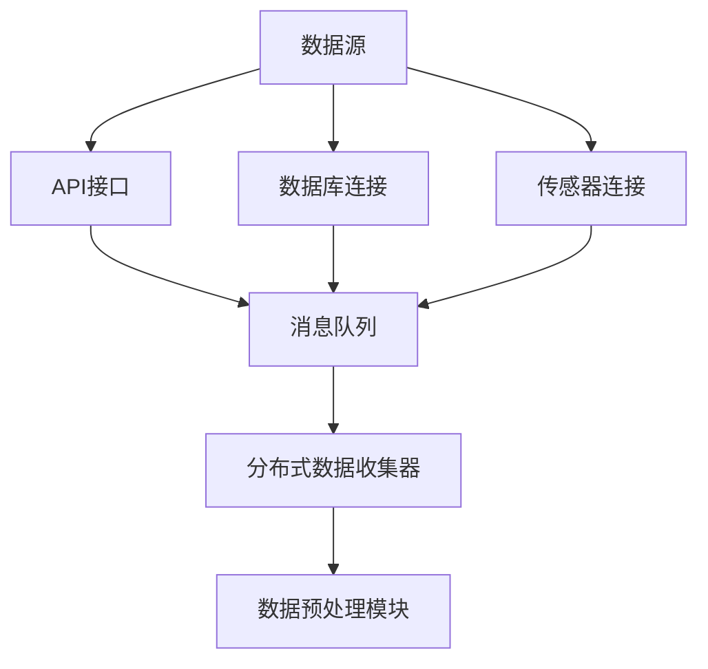
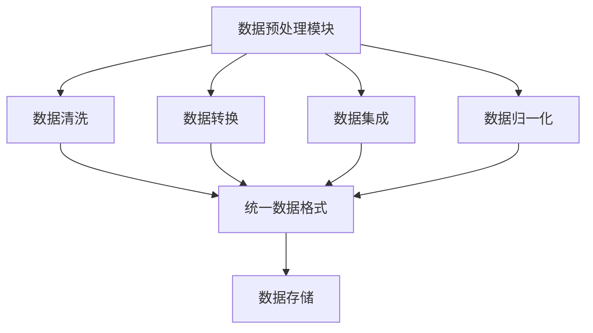
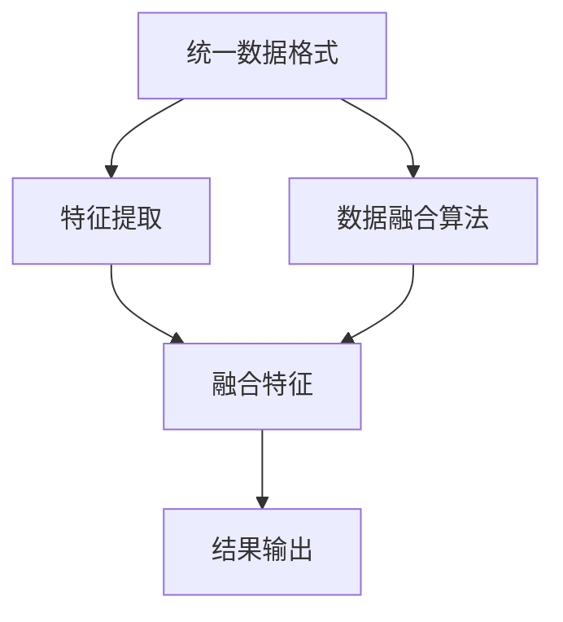
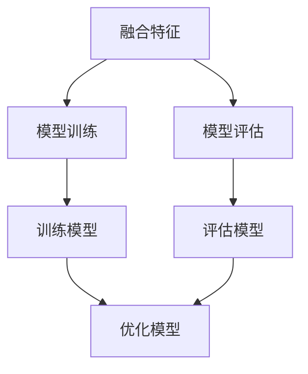
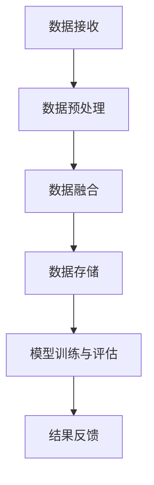
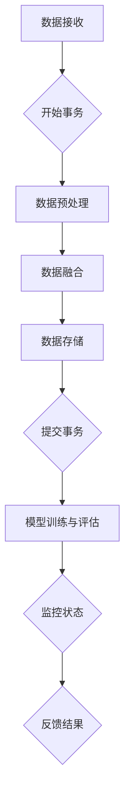
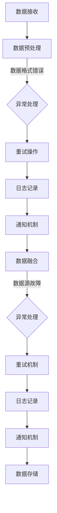

                 

### 1.1 AI Agent的定义与重要性

AI Agent，即人工智能代理，是能够自主行动并具有决策能力的计算机程序。与传统的规则驱动或基于模型的系统不同，AI Agent能够通过学习环境中的数据来调整其行为，实现智能化的自主决策。AI Agent的定义可以归结为四个主要特征：感知能力、理解能力、决策能力和行动能力。

首先，感知能力是AI Agent获取外部信息的能力。它可以通过传感器、摄像头、语音识别等技术来收集环境数据，如文本、图像、音频等。这些数据为Agent提供了关于环境的实时信息。

其次，理解能力是指AI Agent对收集到的数据进行处理和理解的能力。通过自然语言处理、图像识别、语音识别等技术，AI Agent能够理解数据中的含义，提取关键信息。

第三，决策能力是AI Agent的核心特征。它能够在理解环境的基础上，根据预设的目标和策略，做出合理的决策。这种决策可以是简单的规则匹配，也可以是复杂的优化问题。

最后，行动能力是AI Agent将决策转化为具体行动的能力。例如，自动驾驶汽车可以基于感知到的道路情况，做出转向、加速或减速的决策。

AI Agent的重要性体现在多个方面。首先，它能够提高自动化水平，减少人力需求，提高工作效率。例如，在客服领域，AI Agent可以24/7无缝提供服务，极大地降低了企业的运营成本。

其次，AI Agent在复杂环境中的决策能力可以为人类提供有力的支持。例如，在医疗诊断领域，AI Agent可以通过分析大量的患者数据和病历信息，为医生提供准确的诊断建议。

最后，AI Agent的发展推动了人工智能技术的进步。随着多源异构数据融合技术的应用，AI Agent能够更全面、准确地理解环境，做出更合理的决策。

在本文中，我们将深入探讨AI Agent与多源异构数据融合技术的关联，从数据收集与预处理、融合算法原理、应用案例、系统设计等方面进行详细分析。通过本文的阅读，读者将能够理解AI Agent的工作原理及其在现实世界中的应用，为未来的人工智能发展提供新的思路。

### 1.2 多源异构数据的定义与特征

多源异构数据是指来源于不同数据源，具有不同格式、结构和属性特征的数据集合。在现代信息技术和互联网环境中，数据的多样性和复杂性不断增加，多源异构数据成为常见的数据形态。例如，一个智能交通系统可能需要处理来自交通摄像头、传感器、GPS定位系统、社交媒体等多种数据源的信息。这些数据源的数据格式、精度和时效性各不相同，构成了一个典型的多源异构数据集。

多源异构数据具有以下主要特征：

1. **数据格式多样性**：多源异构数据可以包括结构化数据（如数据库中的表）、半结构化数据（如XML、JSON等）、非结构化数据（如图像、音频、视频等）。不同数据格式的处理方式和分析方法各有差异，增加了数据融合的难度。

2. **数据结构复杂性**：多源异构数据源的数据结构可能存在显著差异，例如不同数据源的数据可能具有不同的字段、数据类型和长度。此外，数据源之间的数据同步也可能存在延迟，导致数据的一致性难以保证。

3. **数据属性特征异质性**：多源异构数据来源不同，其数据的属性特征也各不相同。例如，来自不同传感器的数据可能在精度、分辨率和采集频率上存在差异，这种异质性增加了数据融合的复杂度。

4. **数据时效性动态性**：多源异构数据中的某些数据可能具有很高的时效性，如实时交通流量数据、金融市场的交易数据等。而另一些数据则可能相对稳定，如历史天气数据、人口统计数据等。这种动态性要求数据融合系统具备快速响应和处理实时数据的能力。

5. **数据质量参差不齐**：不同数据源的数据质量可能存在很大差异。例如，来自用户生成的内容（如社交媒体）可能包含大量的噪声和错误，而来自专业机构的数据则相对可靠。这种数据质量的差异需要通过数据清洗和质量评估技术来处理。

了解多源异构数据的定义和特征对于有效进行数据融合至关重要。多源异构数据融合的目的是将来自不同数据源的数据整合为一个统一的形式，以便进行进一步的分析和应用。在数据融合过程中，需要考虑数据的多样性、结构复杂性、属性特征异质性、时效性和数据质量等因素，确保融合后的数据能够满足分析需求。

为了更好地理解多源异构数据融合的必要性，我们可以通过以下示例来说明：在一个智能城市系统中，交通监控摄像头、传感器、GPS设备等采集到的数据分别是结构化、半结构化和非结构化数据，具有不同的数据格式和属性特征。为了实现智能交通管理，需要对这些数据进行融合，提取出关键信息，如交通流量、车辆密度等。通过数据融合，系统能够更准确地分析交通状况，做出实时调整，从而提高交通效率，减少拥堵和事故。

通过以上分析，我们可以看到多源异构数据在现实世界中的应用场景和挑战。接下来，我们将进一步探讨多源异构数据融合的必要性及其在AI Agent中的应用前景。

### 1.3 多源异构数据融合的必要性

多源异构数据融合在人工智能（AI）领域具有至关重要的地位，这是因为AI系统的性能和决策能力在很大程度上依赖于数据的质量和完整性。以下将从多个角度阐述多源异构数据融合的必要性：

首先，从数据完整性角度来看，多源异构数据融合能够弥补单一数据源的局限性。在现实世界中，很少有单一数据源能够提供全面的信息。例如，在智能交通系统中，仅仅依赖交通监控摄像头可能无法获取完整的交通状况，因为摄像头存在视野盲区和覆盖范围限制。通过融合来自不同传感器的数据，如GPS定位、雷达检测和社交媒体报告，系统能够更全面地了解交通流量和事故情况，从而提供更准确的实时交通信息。

其次，从数据质量角度来看，多源异构数据融合有助于提高数据的可靠性和精度。不同数据源的数据质量参差不齐，如用户生成的内容可能包含大量噪声和错误，而专业机构的数据则相对可靠。通过数据融合，可以综合不同数据源的优势，降低噪声和错误的影响，提高整体数据的质量。例如，在医疗诊断中，结合电子健康记录、实验室检测数据和患者自述症状等多源数据，可以更准确地诊断疾病，减少误诊率。

第三，从数据分析的深度和广度来看，多源异构数据融合能够为AI系统提供更丰富的数据基础。多源数据的融合不仅包括结构化数据，如数据库中的表格，还包括半结构化数据（如JSON、XML）和非结构化数据（如图像、音频、视频）。这种多样化的数据类型可以提供更丰富的信息，有助于AI系统进行更复杂和深入的推理和分析。例如，在智能推荐系统中，融合用户行为数据、社交网络数据和商品属性数据，可以更准确地预测用户的偏好，提供个性化的推荐服务。

此外，从系统的适应性和灵活性来看，多源异构数据融合有助于提高AI系统的适应能力。现实世界中的数据环境是不断变化的，不同的数据源可能在数据格式、采集频率和时效性上存在差异。通过数据融合技术，系统能够更好地处理这些变化，保持对环境的敏感性和灵活性。例如，在智能监控系统中，当传感器出现故障或数据丢失时，通过融合其他传感器的数据，系统仍然可以维持正常的工作，提高系统的鲁棒性。

最后，从商业价值和应用前景来看，多源异构数据融合能够为企业带来巨大的竞争优势。通过融合不同来源的数据，企业可以更深入地洞察市场和客户需求，优化业务流程，提高运营效率。例如，在零售行业中，通过融合销售数据、库存数据和顾客反馈数据，企业可以更准确地预测市场需求，优化库存管理，减少库存成本。

综上所述，多源异构数据融合在AI领域的必要性体现在多个方面：数据完整性、数据质量、数据分析深度和广度、系统适应性和灵活性以及商业价值。通过有效融合多源异构数据，AI系统可以更准确地理解环境，做出更合理的决策，从而提升其性能和应用价值。

接下来，我们将探讨多源异构数据融合过程中面临的主要挑战，进一步理解数据融合技术的复杂性和重要性。

### 1.4 多源异构数据融合的挑战

多源异构数据融合是一项复杂且具有挑战性的任务，主要包括以下几个方面：

**1. 数据格式多样性**

多源异构数据可以包括结构化数据（如数据库表）、半结构化数据（如XML、JSON等）和非结构化数据（如图像、音频、视频等）。不同数据格式之间存在着显著的差异，导致数据融合的难度大大增加。例如，结构化数据通常以表格形式存储，具有固定的字段和类型，而半结构化数据则具有灵活的嵌套结构，非结构化数据则完全无固定格式。这种多样性要求在数据融合过程中，对数据进行多种转换和预处理，以便于进一步的处理和分析。

**2. 数据结构复杂性**

不同数据源的数据结构可能存在显著差异，如不同的字段、数据类型和长度等。例如，一个传感器的数据可能包含时间戳、位置信息和速度等信息，而另一个传感器的数据则可能仅包含位置信息。这种结构复杂性增加了数据融合的难度，因为需要确保融合后的数据在结构上一致，以便进行统一的分析和处理。

**3. 数据属性特征异质性**

多源异构数据的属性特征可能存在显著差异。例如，来自不同传感器的数据可能在精度、分辨率和采集频率上有所不同，这种异质性对数据融合提出了更高的要求。在融合过程中，需要考虑这些差异，确保融合后的数据在属性特征上的一致性。

**4. 数据时效性动态性**

多源异构数据中的某些数据可能具有很高的时效性，如实时交通流量数据、金融市场的交易数据等，而另一些数据则可能相对稳定，如历史天气数据、人口统计数据等。这种动态性要求数据融合系统具备快速响应和处理实时数据的能力，同时确保历史数据的完整性和准确性。

**5. 数据质量参差不齐**

不同数据源的数据质量可能存在很大差异，例如，用户生成的内容可能包含大量的噪声和错误，而专业机构的数据则相对可靠。这种数据质量的参差不齐增加了数据融合的复杂性，因为需要通过多种数据清洗和质量评估技术来处理噪声和错误，确保融合后的数据质量。

**6. 数据隐私和安全性**

在多源异构数据融合过程中，数据的隐私和安全性是一个重要的考虑因素。由于不同数据源的数据可能涉及个人隐私和敏感信息，如医疗记录、财务数据等，如何在融合过程中保护这些数据的安全性和隐私性，是一个具有挑战性的问题。这需要采用多种安全措施，如数据加密、访问控制等，确保数据在传输和存储过程中的安全性。

**7. 资源和时间限制**

数据融合是一个资源密集型的过程，需要大量的计算资源和时间。特别是在处理大规模、实时数据时，资源限制更加明显。例如，在一个实时交通监控系统中，需要快速处理来自多个传感器的大量数据，以便实时更新交通状况。这要求数据融合系统具备高效的数据处理能力，同时考虑到系统的可扩展性和可维护性。

**8. 模型和算法选择**

在数据融合过程中，需要选择合适的数据融合模型和算法。不同的模型和算法适用于不同的数据类型和场景，如基于统计的融合方法、基于机器学习的融合方法和基于深度学习的融合方法等。选择合适的模型和算法对于数据融合的效果至关重要，但同时也增加了系统的复杂性和实现难度。

综上所述，多源异构数据融合面临着诸多挑战，包括数据格式多样性、数据结构复杂性、数据属性特征异质性、数据时效性动态性、数据质量参差不齐、数据隐私和安全性、资源和时间限制以及模型和算法选择等。解决这些挑战需要采用多种技术和方法，确保数据融合过程的准确性和效率。在接下来的章节中，我们将详细介绍多种数据融合算法和系统设计方法，以帮助读者更好地理解和应对这些挑战。

### 1.5 数据融合在AI Agent中的应用前景

数据融合技术在AI Agent中的应用前景广阔，其潜在价值体现在多个领域和场景中。以下将列举几个关键应用领域，探讨数据融合技术如何提升AI Agent的性能和应用效果。

**1. 智能交通系统**

在智能交通系统中，数据融合技术可以显著提高交通管理和调度效率。通过融合来自交通监控摄像头、传感器、GPS设备、智能手机等多元数据源的信息，AI Agent可以实时获取道路流量、车辆速度、交通事故等信息。这种多源异构数据的融合不仅能够提供更全面、准确的交通状况，还可以帮助预测交通拥堵趋势，优化交通信号控制，提高交通流通效率。例如，通过融合交通流量数据和交通预测模型，AI Agent可以提前调整交通信号灯的时序，减少交通堵塞和事故的发生。

**2. 智能医疗**

在医疗领域，数据融合技术可以提升诊断的准确性和效率。医疗数据通常来源于多个渠道，包括电子健康记录、医学影像、实验室检测数据、患者自述症状等。通过融合这些多源异构数据，AI Agent可以更全面地了解患者的健康状况，辅助医生进行诊断和治疗。例如，结合影像数据、基因数据和病史数据，AI Agent可以提供更加精确的疾病预测和治疗方案，减少误诊和漏诊率，提高治疗效果。

**3. 智能金融**

在金融领域，数据融合技术可以提升风险管理、欺诈检测和投资决策的能力。金融数据包括交易数据、市场数据、客户行为数据等，这些数据源的数据格式和结构可能各不相同。通过数据融合技术，AI Agent可以综合分析多种数据源的信息，识别潜在的风险和机会。例如，结合交易数据和客户行为数据，AI Agent可以预测客户的行为模式，识别可能的欺诈行为，提高风险控制能力。同时，融合市场数据和交易数据，AI Agent可以提供更精准的投资建议，优化投资组合。

**4. 智能制造**

在智能制造领域，数据融合技术可以提升生产效率和产品质量。智能制造系统中涉及大量的传感器数据、设备状态数据、生产流程数据等。通过数据融合技术，AI Agent可以实时监控和分析生产线的状态，识别潜在的问题和瓶颈，优化生产流程。例如，通过融合传感器数据和生产流程数据，AI Agent可以预测设备故障，提前进行维护，减少设备停机时间，提高生产效率。

**5. 智能家居**

在智能家居领域，数据融合技术可以提升家居设备的管理和交互体验。智能家居设备包括门锁、灯光、空调、安防设备等，这些设备产生大量的传感器数据。通过数据融合技术，AI Agent可以综合分析这些数据，实现更智能的家居管理。例如，通过融合室内温度、湿度、光照等数据，AI Agent可以自动调整空调和灯光，提供舒适的居住环境。

综上所述，数据融合技术在AI Agent中的应用前景非常广泛，其潜在价值体现在提升AI Agent的感知能力、理解能力、决策能力和行动能力，从而提高系统的整体性能和应用效果。通过在各个领域和场景中的具体应用，数据融合技术不仅能够实现更高的效率和准确性，还能带来显著的经济和社会效益。

### 2.1 数据收集方法

数据收集是数据融合过程中至关重要的一环，直接影响后续数据处理的准确性和效率。以下是几种常见的数据收集方法：

#### 2.1.1 离线数据收集

离线数据收集通常在系统运行不依赖于实时数据的情况下进行，其优点在于数据收集过程较为简单，成本较低。常用的离线数据收集方法包括：

1. **文件导入**：通过读取本地或网络存储的文件，如CSV、Excel、数据库等，获取结构化或半结构化数据。
2. **API调用**：通过接口（API）从第三方数据源获取数据，如社交媒体、天气服务、金融数据等。
3. **日志分析**：通过分析系统日志文件，获取系统运行过程中产生的数据，如用户行为日志、服务器访问日志等。

#### 2.1.2 实时数据收集

实时数据收集适用于需要实时处理和分析数据的应用场景，如智能交通系统、实时金融监控等。实时数据收集方法包括：

1. **传感器数据采集**：通过传感器网络，如环境传感器、交通传感器等，实时采集环境数据。
2. **网络抓包**：通过网络抓包工具，如Wireshark，实时捕获网络传输数据，进行分析和记录。
3. **实时流处理**：通过实时数据处理系统，如Apache Kafka、Apache Flink等，实时处理和分析数据流。

#### 2.1.3 分布式数据收集

分布式数据收集适用于大规模、多源异构数据的收集，能够提高数据收集的效率和可靠性。常用的分布式数据收集方法包括：

1. **数据采集器（Data Collectors）**：在每个数据源处部署数据采集器，将数据传输到中央数据存储系统。
2. **分布式存储系统**：通过分布式存储系统，如Hadoop HDFS、Apache HBase等，存储和管理大规模数据。
3. **分布式流处理系统**：通过分布式流处理系统，如Apache Storm、Apache Spark Streaming等，实时处理和分析大规模数据流。

通过选择合适的数据收集方法，可以确保数据融合过程的顺利进行，提高数据的质量和可用性。

### 2.2 数据预处理技术

数据预处理是数据融合过程的关键步骤，旨在提高数据质量、降低噪声，并简化数据结构，以便于后续的数据分析和融合。以下是几种常见的数据预处理技术：

#### 2.2.1 数据清洗

数据清洗是数据预处理的基础，其主要目的是识别和纠正数据中的错误、异常和重复数据。数据清洗技术包括：

1. **缺失值处理**：对于缺失值，可以通过填充、插值、删除等方法进行处理。例如，在时间序列数据中，可以使用前值或后值填充缺失值。
2. **异常值检测**：通过统计方法、机器学习方法等检测数据中的异常值，如离群点检测。异常值可能由数据采集误差、系统故障等原因引起，需要根据具体情况进行处理。
3. **重复值删除**：检测和删除重复的数据记录，确保数据的唯一性。

#### 2.2.2 数据集成

数据集成是将来自多个数据源的数据合并为一个统一的数据视图。数据集成技术包括：

1. **统一数据格式**：将不同格式的数据转换为统一的格式，如将CSV转换为JSON或XML。
2. **数据映射**：将不同数据源中的字段进行映射，确保数据的一致性和兼容性。
3. **数据合并**：将结构相似的数据进行合并，如将两个数据库表进行合并。

#### 2.2.3 数据转换

数据转换是将数据从一种形式转换为另一种形式，以适应特定的分析需求或数据融合算法。数据转换技术包括：

1. **数据类型转换**：将不同数据类型的数据转换为相同的数据类型，如将字符串转换为数值型。
2. **数据标准化**：通过缩放、归一化等方法，将数据转换为具有相同尺度或范围的值，如将温度数据从摄氏度转换为华氏度。
3. **特征提取**：从原始数据中提取有用的特征，如从图像中提取颜色、纹理特征，从文本中提取关键词和主题。

#### 2.2.4 数据归一化

数据归一化是将数据转换为具有相同尺度或范围的值，以便进行后续的数据分析。数据归一化方法包括：

1. **最小-最大缩放**：将数据缩放到[0, 1]的范围内，公式为 $x' = \frac{x - \min(x)}{\max(x) - \min(x)}$。
2. **均值-标准差缩放**：将数据缩放到均值为中心、标准差为尺度的范围内，公式为 $x' = \frac{x - \mu}{\sigma}$，其中$\mu$为均值，$\sigma$为标准差。

#### 2.2.5 数据质量评估方法

数据质量评估是对预处理后的数据质量进行评估，以确保数据满足分析需求。数据质量评估方法包括：

1. **数据完整性检查**：检测数据中缺失值的数量和比例，确保数据完整性。
2. **数据一致性验证**：检测数据中的一致性错误，如数据格式不匹配、数据类型错误等。
3. **数据准确性分析**：评估数据的准确性，如通过比较实际值与预测值，计算误差率。
4. **数据时效性评估**：评估数据的时效性，如检测数据的时间戳，确保数据的新鲜度。

通过上述数据预处理技术，可以显著提高数据的质量和一致性，为后续的数据融合和数据分析提供可靠的数据基础。

### 2.3 数据质量评估方法

在数据融合过程中，确保数据质量是至关重要的。数据质量不仅影响算法的性能，还直接关系到最终应用结果的准确性。以下是几种常见的数据质量评估方法，包括数据完整性检查、数据一致性验证、数据准确性分析和数据时效性评估。

#### 2.3.1 数据完整性检查

数据完整性检查旨在检测数据中缺失值的数量和比例。在多源异构数据中，缺失值是一个常见的问题，可能会影响后续的分析结果。以下是一些常用的数据完整性检查方法：

1. **缺失值计数**：统计每个字段中缺失值的数量，通过缺失值比例来评估数据的完整性。例如，如果某字段缺失值比例超过20%，则认为该字段的数据完整性较差。

2. **缺失值可视化**：通过数据可视化工具，如条形图、饼图等，直观地展示缺失值的分布情况。这有助于识别数据中的关键字段和潜在的问题区域。

3. **缺失值填补**：在数据预处理阶段，可以通过不同的方法填补缺失值，如均值填补、中值填补、插值等。填补缺失值可以改善数据的完整性，但需要注意填补方法的选择，以避免引入偏差。

#### 2.3.2 数据一致性验证

数据一致性验证用于检测数据中的一致性错误，如数据格式不匹配、数据类型错误等。以下是一些常用的数据一致性验证方法：

1. **格式检查**：检查数据的格式是否符合预期，例如，确保日期字段遵循YYYY-MM-DD的格式，字符串字段没有包含非法字符等。

2. **类型验证**：验证数据类型是否与预期一致，例如，确保数值字段只包含数字，文本字段只包含字母和数字等。

3. **参照完整性检查**：对于包含引用关系的多源数据，需要确保引用关系的有效性。例如，在两个数据表中，确保外键字段与主键字段的一致性。

4. **一致性分析**：通过分析多个数据源之间的数据，检测数据中的不一致性。例如，比较不同来源的交通流量数据，确保数据在时间和空间上的一致性。

#### 2.3.3 数据准确性分析

数据准确性分析旨在评估数据的准确性，确保数据真实、可靠。以下是一些常用的数据准确性分析方法：

1. **对比验证**：通过对比实际值与预测值，计算误差率。例如，在金融预测模型中，通过对比实际交易额与预测交易额，评估模型的准确性。

2. **统计分析**：通过统计方法，如均值、标准差、置信区间等，评估数据的分布特征和稳定性。

3. **模型评估**：使用机器学习模型对数据进行预测，并评估模型的性能。例如，通过评估模型在验证集上的准确率、召回率等指标，评估数据的准确性。

#### 2.3.4 数据时效性评估

数据时效性评估用于检测数据的新鲜度和有效性，特别是在处理实时数据时尤为重要。以下是一些常用的数据时效性评估方法：

1. **时间戳检查**：检查数据的时间戳，确保数据在合理的时效范围内。例如，对于实时交通数据，确保数据的时间戳在当前时间的一定时间窗口内。

2. **时效性分析**：通过分析数据的时间分布，评估数据的时效性。例如，统计每个时间窗口内的数据量，分析数据的新鲜度。

3. **更新频率检查**：检查数据源的更新频率，确保数据能够及时反映实际状况。例如，对于股票市场数据，确保数据源能够实时更新交易数据。

通过以上数据质量评估方法，可以全面地评估数据的质量，确保数据满足融合和分析的需求。在数据融合过程中，结合这些评估方法，可以有效地识别和解决数据质量问题，提高系统的整体性能和可靠性。

### 3.1 数据融合的基本原理

数据融合（Data Fusion）是信息融合的一种重要形式，其核心思想是通过整合来自多个数据源的信息，生成比单一数据源更具价值的信息。在数据融合过程中，需要考虑数据的多样性、结构和质量，以实现信息的有机结合和互补。

**数据融合的基本流程包括以下几个步骤：**

1. **数据收集**：从多个数据源收集所需的数据，这些数据可以是结构化、半结构化或非结构化的。
2. **数据预处理**：对收集到的数据进行清洗、转换和归一化等预处理操作，以提高数据的一致性和质量。
3. **特征提取**：从预处理后的数据中提取关键特征，这些特征可以用于后续的融合操作。
4. **特征融合**：将提取出的特征进行融合，生成更全面、更准确的信息。特征融合方法包括统计方法、机器学习方法、深度学习方法等。
5. **结果输出**：将融合后的信息输出，用于进一步的决策或分析。

**数据融合的核心步骤详解：**

- **特征提取**：特征提取是数据融合的关键步骤，其目的是从原始数据中提取出对目标任务最有用的信息。特征提取方法包括基于统计的方法（如主成分分析、因子分析）和基于机器学习的方法（如特征选择、特征抽取）。特征提取的质量直接影响融合结果的准确性。

- **特征融合**：特征融合是将多个特征合并为一个统一的信息表示，以生成更全面、更准确的信息。特征融合方法可以分为以下几类：
  - **简单融合方法**：包括平均、求和、最大值等，适用于特征之间不存在复杂关系的情况。
  - **基于统计学习的融合方法**：如贝叶斯网络、隐马尔可夫模型等，通过建立统计模型来融合特征信息。
  - **基于机器学习的融合方法**：如支持向量机、决策树等，通过学习训练数据，建立特征融合模型。
  - **基于深度学习的融合方法**：如卷积神经网络、循环神经网络等，能够处理大规模、高维的数据，提取深层特征。

- **结果输出**：融合后的信息可以用于多个方面，如实时监控、预测分析、决策支持等。输出结果的质量直接关系到数据融合的应用效果。

**数据融合的优点包括：**
- **提高信息利用率**：通过融合多个数据源的信息，可以充分利用各个数据源的优势，生成比单一数据源更有价值的信息。
- **增强决策准确性**：融合后的信息可以提供更全面、准确的决策依据，提高决策的准确性。
- **降低系统成本**：通过数据融合，可以减少对单一数据源的依赖，降低系统的总体成本。
- **提升系统鲁棒性**：融合多个数据源的信息，可以增强系统的鲁棒性，减少因单一数据源异常带来的影响。

**数据融合在AI Agent中的应用**：
- **感知能力提升**：通过融合来自不同传感器和网络的数据，AI Agent可以更全面地感知环境，提高感知能力。
- **理解能力增强**：融合后的信息可以提供更丰富的上下文，帮助AI Agent更好地理解复杂环境。
- **决策能力优化**：融合多个数据源的信息，可以生成更准确的预测和决策，提高AI Agent的决策能力。
- **行动能力加强**：通过融合后的信息，AI Agent可以更有效地执行任务，提高行动能力。

总之，数据融合技术是AI Agent中不可或缺的一部分，通过有效融合多源异构数据，可以显著提升AI Agent的性能和应用价值。

### 3.2 基于特征级别的融合方法

在特征级别的融合方法中，核心目标是通过整合不同数据源的特征，生成更加丰富和准确的信息表示。这种方法主要包括简单融合方法、基于统计学习的融合方法和基于机器学习的融合方法。

#### 3.2.1 简单融合方法

简单融合方法是最基本的特征融合技术，适用于特征之间没有复杂关系或特征之间相互独立的情况。常见的简单融合方法有：

1. **平均融合**：将多个特征值取平均，得到一个统一的特征表示。例如，对于两组数值特征，可以通过计算它们的算术平均数进行融合。

   $$\text{平均融合} = \frac{x_1 + x_2}{2}$$

2. **求和融合**：将多个特征值直接相加，适用于特征之间具有可加性的情况。

   $$\text{求和融合} = x_1 + x_2$$

3. **最大值融合**：取多个特征中的最大值，适用于特征之间存在优先级关系的情况。

   $$\text{最大值融合} = \max(x_1, x_2)$$

4. **最小值融合**：取多个特征中的最小值，适用于特征之间存在竞争关系的情况。

   $$\text{最小值融合} = \min(x_1, x_2)$$

简单融合方法的优点在于实现简单、计算成本低，但缺点是对于特征之间复杂关系的表达能力有限，容易丢失信息。

#### 3.2.2 基于统计学习的融合方法

基于统计学习的融合方法通过建立统计模型来融合特征信息，能够更好地处理特征之间的复杂关系。常见的方法包括：

1. **贝叶斯网络**：贝叶斯网络是一种概率图模型，通过节点之间的条件概率来表示特征之间的依赖关系。贝叶斯网络可以用于推理和预测，适用于特征之间存在因果关系或依赖关系的场景。

2. **隐马尔可夫模型（HMM）**：隐马尔可夫模型是一种基于状态转移概率和观测概率的模型，适用于时间序列数据的融合。例如，在语音识别中，HMM可以用于融合不同麦克风捕获的语音信号。

3. **高斯混合模型（GMM）**：高斯混合模型通过多个高斯分布来表示多组特征，能够有效地处理特征之间的分布差异。GMM常用于聚类分析，将具有相似特征的样本进行合并。

这些方法通过统计模型来描述特征之间的依赖关系，能够生成更准确、更鲁棒的特征融合结果。然而，它们在处理高维、非线性特征时可能存在计算复杂度较高的问题。

#### 3.2.3 基于机器学习的融合方法

基于机器学习的融合方法利用训练数据来学习特征融合的模型，能够处理更加复杂和非线性的特征关系。常见的方法包括：

1. **支持向量机（SVM）**：支持向量机是一种强大的分类和回归模型，通过寻找最佳的超平面来分离特征空间中的数据。在特征融合中，SVM可以用于将多个特征映射到一个统一的特征空间，从而生成融合特征。

2. **决策树**：决策树通过一系列的决策规则来划分特征空间，适用于特征之间的分层结构。在特征融合中，决策树可以用于生成特征之间的优先级关系，从而融合特征。

3. **神经网络**：神经网络，特别是深度学习模型，如卷积神经网络（CNN）、循环神经网络（RNN）等，能够通过学习大量数据自动提取复杂特征。在特征融合中，神经网络可以用于自动学习特征之间的非线性关系，生成高效的特征表示。

基于机器学习的融合方法具有强大的表达能力和适应性，能够处理高维、非线性特征，但在训练过程中可能需要大量数据和计算资源。

总的来说，基于特征级别的融合方法提供了多种不同的策略来整合多源异构数据。选择合适的方法取决于具体应用场景和特征之间的关系，每种方法都有其独特的优势和局限性。通过合理运用这些方法，可以显著提升数据融合的效果和系统的整体性能。

### 3.3 基于知识级别的融合方法

在多源异构数据融合过程中，基于知识级别的融合方法提供了更高的抽象层次，能够更有效地处理复杂的关系和语义信息。这类方法通过知识表示、知识推理和知识迁移等手段，实现数据的深度融合，从而提升系统的智能化水平。

#### 3.3.1 知识图谱构建

知识图谱是一种用于表示实体及其关系的语义网络，其核心思想是将现实世界中的实体（如人、地点、事物）和概念抽象为节点，将实体之间的关联抽象为边，通过这种方式构建一个结构化的知识网络。知识图谱的构建主要包括以下几个步骤：

1. **实体识别**：从多源数据中识别出关键实体，如人名、地名、机构名等。实体识别可以通过自然语言处理技术，如命名实体识别（NER）来实现。

2. **关系抽取**：确定实体之间的关联关系，如朋友关系、工作关系等。关系抽取可以通过规则匹配、机器学习等方法来实现。

3. **知识存储**：将识别出的实体和关系存储在知识图谱数据库中，如Neo4j、DGL等。知识图谱数据库提供了高效的数据存储和查询能力，能够支持复杂的图计算操作。

构建知识图谱的目的是将多源异构数据转化为统一的语义表示，为后续的融合操作提供基础。知识图谱不仅能够捕获实体之间的显式关系，还可以通过图结构隐含地表示复杂的语义信息。

#### 3.3.2 知识推理与融合

知识推理是指利用已有的知识图谱进行逻辑推理，生成新的知识信息。通过知识推理，可以从现有的知识中推断出新的关系或属性，从而实现数据的深度融合。知识推理方法包括：

1. **路径查找**：通过在知识图谱中查找路径，确定实体之间的间接关系。例如，通过查找两个实体之间的共享邻居节点，可以推断出它们之间的潜在关联。

2. **规则推理**：利用预设的推理规则，如逻辑推理、模糊推理等，推导出新的知识。例如，通过规则“如果今天下雨，那么地面湿”，结合实时天气数据，可以推断出地面湿度。

3. **本体推理**：利用本体（Ontology）对知识进行形式化表示，通过本体推理机制，实现对知识的一致性和完整性的验证。本体推理可以确保知识融合结果的准确性和一致性。

通过知识推理，可以从多源数据中提取出更深层次的关联信息，这些信息对于提高AI Agent的智能决策能力至关重要。

#### 3.3.3 知识迁移与融合

知识迁移是指将一个领域中的知识应用到另一个领域，以解决新领域中的问题。在多源异构数据融合中，知识迁移可以帮助整合不同数据源的知识，提高融合效果。知识迁移主要包括以下几种方法：

1. **模型迁移**：将一个领域中的模型迁移到另一个领域，例如，将图像识别模型应用于语音识别任务。模型迁移可以通过迁移学习（Transfer Learning）技术来实现。

2. **知识图谱迁移**：将一个领域中的知识图谱迁移到另一个领域，例如，将医疗领域的知识图谱应用于金融领域。知识图谱迁移可以通过知识图谱映射和融合技术来实现。

3. **规则迁移**：将一个领域中的规则应用到另一个领域，例如，将交通监控规则应用于智能家居场景。规则迁移可以通过规则库共享和规则泛化技术来实现。

知识迁移与融合能够有效整合不同领域的数据和知识，提升数据融合的灵活性和适应性。

总之，基于知识级别的融合方法通过知识图谱构建、知识推理和知识迁移等手段，提供了更高的抽象层次和更强的语义表达能力，能够更有效地处理复杂的多源异构数据。这些方法不仅提升了数据融合的效果，还为AI Agent的智能化应用提供了坚实的理论基础。

### 3.4 基于深度学习的融合方法

基于深度学习的融合方法近年来在多源异构数据融合领域取得了显著的进展。深度学习模型，特别是卷积神经网络（CNN）、循环神经网络（RNN）和自注意力机制等，能够有效地处理高维、非线性数据，从而提高融合效果。以下将分别介绍这些方法，并通过具体的算法流程、数学模型和Python代码示例进行详细讲解。

#### 3.4.1 深度神经网络融合模型

深度神经网络（Deep Neural Network，DNN）是深度学习的基础，其核心思想是通过多层神经网络对数据进行特征提取和融合。以下是一个简单的DNN融合模型的算法流程：

1. **输入层**：接收多源异构数据的特征向量。
2. **隐藏层**：通过非线性激活函数（如ReLU）进行特征提取。
3. **输出层**：生成融合后的特征向量。

以下是一个简单的Python代码示例：

```python
import tensorflow as tf

# 假设有两个数据源，每个数据源有一个特征向量
input_data1 = tf.keras.layers.Input(shape=(10,))
input_data2 = tf.keras.layers.Input(shape=(10,))

# 隐藏层
hidden1 = tf.keras.layers.Dense(64, activation='relu')(input_data1)
hidden2 = tf.keras.layers.Dense(64, activation='relu')(input_data2)

# 融合层
merged = tf.keras.layers.concatenate([hidden1, hidden2])

# 输出层
output = tf.keras.layers.Dense(1, activation='sigmoid')(merged)

# 构建模型
model = tf.keras.Model(inputs=[input_data1, input_data2], outputs=output)

# 编译模型
model.compile(optimizer='adam', loss='binary_crossentropy', metrics=['accuracy'])

# 模型训练
model.fit([X1, X2], y, epochs=10, batch_size=32)
```

在这个示例中，我们定义了一个简单的DNN模型，通过两个输入层接收来自两个数据源的特征向量，经过隐藏层和融合层，最终输出融合后的特征。

#### 3.4.2 循环神经网络融合模型

循环神经网络（Recurrent Neural Network，RNN）是处理序列数据的强大工具，其核心思想是通过循环机制保留历史状态信息。以下是一个简单的RNN融合模型的算法流程：

1. **输入层**：接收多源异构序列数据。
2. **隐藏层**：通过RNN单元进行特征提取。
3. **输出层**：生成融合后的序列数据。

以下是一个简单的Python代码示例：

```python
import tensorflow as tf

# 假设有两个序列数据源
input_sequence1 = tf.keras.layers.Input(shape=(timesteps, 10))
input_sequence2 = tf.keras.layers.Input(shape=(timesteps, 10))

# RNN单元
rnn_output1 = tf.keras.layers.LSTM(64)(input_sequence1)
rnn_output2 = tf.keras.layers.LSTM(64)(input_sequence2)

# 融合层
merged = tf.keras.layers.concatenate([rnn_output1, rnn_output2])

# 输出层
output_sequence = tf.keras.layers.Dense(timesteps, activation='sigmoid')(merged)

# 构建模型
model = tf.keras.Model(inputs=[input_sequence1, input_sequence2], outputs=output_sequence)

# 编译模型
model.compile(optimizer='adam', loss='mse', metrics=['accuracy'])

# 模型训练
model.fit([X1, X2], y, epochs=10, batch_size=32)
```

在这个示例中，我们定义了一个简单的RNN模型，通过两个输入层接收来自两个数据源的序列数据，经过LSTM单元和融合层，最终输出融合后的序列数据。

#### 3.4.3 卷积神经网络融合模型

卷积神经网络（Convolutional Neural Network，CNN）是处理图像数据的经典模型，其核心思想是通过卷积操作提取空间特征。以下是一个简单的CNN融合模型的算法流程：

1. **输入层**：接收多源异构图像数据。
2. **卷积层**：通过卷积操作提取图像特征。
3. **融合层**：将多通道特征图进行融合。
4. **全连接层**：生成融合后的图像特征。

以下是一个简单的Python代码示例：

```python
import tensorflow as tf

# 假设有两个图像数据源
input_image1 = tf.keras.layers.Input(shape=(28, 28, 1))
input_image2 = tf.keras.layers.Input(shape=(28, 28, 1))

# 卷积层
conv1_1 = tf.keras.layers.Conv2D(32, (3, 3), activation='relu')(input_image1)
conv1_2 = tf.keras.layers.Conv2D(32, (3, 3), activation='relu')(input_image2)

# 融合层
merged = tf.keras.layers.concatenate([conv1_1, conv1_2], axis=-1)

# 全连接层
output = tf.keras.layers.Dense(1, activation='sigmoid')(merged)

# 构建模型
model = tf.keras.Model(inputs=[input_image1, input_image2], outputs=output)

# 编译模型
model.compile(optimizer='adam', loss='binary_crossentropy', metrics=['accuracy'])

# 模型训练
model.fit([X1, X2], y, epochs=10, batch_size=32)
```

在这个示例中，我们定义了一个简单的CNN模型，通过两个输入层接收来自两个数据源的图像数据，经过卷积层和融合层，最终输出融合后的图像特征。

综上所述，基于深度学习的融合方法通过DNN、RNN和CNN等模型，能够有效地处理多源异构数据，提高数据融合的效果。这些方法不仅提供了强大的特征提取和融合能力，还为解决复杂的多源异构数据融合问题提供了新的思路。

### 4.1 案例一：智能交通系统

智能交通系统（Intelligent Traffic System，ITS）是利用现代信息技术对交通数据进行实时监控、分析和处理，以优化交通流量、减少拥堵和提高交通安全。通过多源异构数据的融合技术，智能交通系统能够更全面、准确地分析交通状况，从而实现高效的交通管理。以下将详细描述智能交通系统的案例背景、数据收集与预处理、数据融合方法与模型、模型训练与评估等内容。

#### 4.1.1 案例背景

某大城市面临着日益严重的交通拥堵问题，导致通勤时间延长、交通事故频发。为了解决这些问题，市政府决定建设一个智能交通系统，通过实时监控和分析交通数据，优化交通信号控制，减少拥堵和事故。

智能交通系统需要收集和处理来自多个数据源的信息，包括：

1. **交通摄像头**：用于实时监控道路上的车辆流量和交通状况。
2. **传感器**：安装在道路和交叉口的传感器用于检测车辆速度、密度和方向。
3. **GPS设备**：安装在公共交通工具上，用于实时追踪车辆位置和行驶轨迹。
4. **社交媒体**：通过分析社交媒体上的用户报告，获取交通状况和事故信息。
5. **历史数据**：包括过去几年的交通流量数据、事故记录等。

#### 4.1.2 数据收集与预处理

为了构建智能交通系统，首先需要收集和处理上述多种数据源的信息。以下是对每个数据源的数据收集和预处理方法的描述：

1. **交通摄像头**：通过安装在道路和交叉口的摄像头，实时捕捉道路上的车辆流量和交通状况。摄像头数据包括图像和视频流。为了处理这些图像和视频流，需要进行数据清洗和特征提取，去除噪声和无关信息，提取关键特征，如车辆数量、车辆类型和行驶方向等。

2. **传感器**：安装在道路和交叉口的传感器用于检测车辆速度、密度和方向。传感器数据通常包括时间戳、位置信息和速度信息。传感器数据的预处理包括数据清洗（去除异常值和噪声），数据集成（将不同传感器的数据整合为一个统一的数据集）和数据归一化（确保数据在同一尺度范围内）。

3. **GPS设备**：安装在公共交通工具上，用于实时追踪车辆位置和行驶轨迹。GPS数据包括时间戳、位置坐标和速度信息。GPS数据的预处理包括数据清洗（去除无效和异常数据），数据转换（将位置坐标转换为道路网络表示）和数据归一化（统一时间单位和精度）。

4. **社交媒体**：通过分析社交媒体上的用户报告，获取交通状况和事故信息。社交媒体数据包括文本、图片和视频。预处理方法包括数据清洗（去除噪声和无关信息），情感分析和主题提取，以提取交通相关的关键信息。

5. **历史数据**：包括过去几年的交通流量数据、事故记录等。历史数据经过数据清洗和归一化处理后，可以用于训练交通预测模型和优化交通信号控制策略。

#### 4.1.3 数据融合方法与模型

在智能交通系统中，数据融合技术的核心任务是整合来自多个数据源的信息，生成一个统一的交通状况描述。以下介绍常用的数据融合方法和模型：

1. **基于统计学习的融合方法**：这种方法通过建立统计模型来融合不同数据源的特征。例如，可以使用线性回归模型来融合交通摄像头数据和传感器数据，预测道路上的交通流量。具体实现可以通过以下步骤：

   - 特征提取：从每个数据源提取关键特征，如车辆数量、速度和方向等。
   - 模型训练：使用历史交通数据训练统计模型，例如线性回归模型。
   - 预测与融合：使用训练好的模型预测当前交通流量，并将预测结果融合为一个统一的交通状况描述。

2. **基于机器学习的融合方法**：这种方法通过机器学习算法，如支持向量机（SVM）和决策树，来融合多源异构数据。具体实现可以通过以下步骤：

   - 特征提取：与基于统计学习的方法类似，从每个数据源提取关键特征。
   - 模型训练：使用历史交通数据训练机器学习模型，例如SVM分类器或决策树。
   - 预测与融合：使用训练好的模型对当前交通流量进行预测，并将预测结果融合为一个统一的交通状况描述。

3. **基于深度学习的融合方法**：这种方法利用深度学习模型，如卷积神经网络（CNN）和循环神经网络（RNN），来融合多源异构数据。具体实现可以通过以下步骤：

   - 特征提取：使用CNN提取图像数据中的特征，使用RNN处理时间序列数据。
   - 模型训练：使用历史交通数据训练深度学习模型，例如CNN-RNN模型。
   - 预测与融合：使用训练好的模型对当前交通流量进行预测，并将预测结果融合为一个统一的交通状况描述。

4. **基于知识图谱的融合方法**：这种方法通过知识图谱构建和推理，实现多源异构数据的深度融合。具体实现可以通过以下步骤：

   - 知识图谱构建：将交通摄像头数据、传感器数据、GPS数据和社交媒体数据构建为一个知识图谱，表示实体和关系。
   - 知识推理：使用知识图谱进行推理，提取交通状况的语义信息。
   - 结果融合：将知识图谱中的推理结果与其他数据源的融合结果进行整合，生成最终的交通状况描述。

#### 4.1.4 模型训练与评估

在智能交通系统中，数据融合模型需要通过训练和评估来确保其准确性和可靠性。以下介绍常用的模型训练与评估方法：

1. **训练数据集准备**：从历史交通数据中划分训练集和测试集，用于模型的训练和评估。

2. **模型训练**：使用训练数据集对数据融合模型进行训练，调整模型的参数和超参数，优化模型性能。

3. **模型评估**：使用测试数据集对训练好的模型进行评估，计算模型的准确率、召回率、F1分数等指标，评估模型性能。

4. **模型优化**：根据评估结果对模型进行优化，如调整模型结构、改进特征提取方法等，以提高模型性能。

通过上述步骤，智能交通系统能够有效地收集、预处理和融合多源异构数据，生成准确的交通状况描述，为交通管理和调度提供有力支持。在实际应用中，智能交通系统还可以根据实时数据动态调整交通信号控制策略，优化交通流量，提高道路通行能力，减少拥堵和事故。

### 4.2 案例二：金融风控

金融风控是指通过多种技术手段识别、评估和管理金融风险，确保金融机构的稳健运营。在金融行业中，多源异构数据的融合技术能够显著提高风险识别的准确性和及时性。以下将详细介绍金融风控案例的背景、数据收集与预处理、数据融合方法与模型、模型训练与评估等内容。

#### 4.2.1 案例背景

某大型银行在金融风控方面面临着严峻的挑战。随着金融业务的复杂化和多样化，银行需要处理海量的交易数据、客户行为数据、市场数据等，以便及时识别潜在的风险。传统的风控系统依赖于单一数据源，无法全面、准确地评估风险，导致风险识别的延迟和误判。

为了提高金融风控的效率和准确性，银行决定采用多源异构数据的融合技术，通过整合来自多个数据源的信息，实现更全面、准确的风险识别和管理。

#### 4.2.2 数据收集与预处理

金融风控系统需要收集和处理以下多种数据源的信息：

1. **交易数据**：包括客户的交易记录、交易金额、交易时间、交易地点等。交易数据通常来自银行的交易系统、POS机、ATM机等。

2. **客户行为数据**：包括客户的登录行为、查询行为、转账行为等。客户行为数据可以通过银行的客户端软件、网站、移动应用等渠道获取。

3. **市场数据**：包括股票市场、债券市场、外汇市场等的价格波动、交易量、市场情绪等。市场数据通常来自金融数据服务商或公共数据源。

4. **外部数据**：包括社交媒体数据、新闻资讯、法律文件等。外部数据可以通过爬虫技术、API接口等方式获取。

数据预处理是金融风控系统中至关重要的环节，包括以下步骤：

1. **数据清洗**：清洗交易数据、客户行为数据和市场数据，去除噪声和异常值，确保数据的准确性和一致性。

2. **数据转换**：将不同数据源的数据转换为统一的格式，如将日期时间格式统一为YYYY-MM-DD，将交易金额转换为货币单位等。

3. **数据集成**：将不同数据源的数据进行整合，形成一个统一的数据集，以便后续的融合和分析。

4. **特征提取**：从原始数据中提取关键特征，如交易金额、交易频率、交易时间分布、客户行为模式等。

5. **数据归一化**：对数据进行归一化处理，如对交易金额进行标准化，使其在同一尺度范围内。

#### 4.2.3 数据融合方法与模型

在金融风控中，数据融合技术的核心任务是将来自多个数据源的信息整合为一个统一的风险评估模型。以下介绍几种常用的数据融合方法与模型：

1. **基于统计学习的融合方法**：这种方法通过建立统计模型来融合多源数据。例如，可以使用回归模型分析交易金额与客户行为之间的关系，使用贝叶斯网络分析市场数据与风险之间的关系。具体实现可以通过以下步骤：

   - 特征提取：从每个数据源提取关键特征。
   - 模型训练：使用历史数据训练统计模型。
   - 预测与融合：使用训练好的模型预测当前风险，并将预测结果进行融合。

2. **基于机器学习的融合方法**：这种方法通过机器学习算法，如支持向量机（SVM）、决策树等，来融合多源异构数据。具体实现可以通过以下步骤：

   - 特征提取：与基于统计学习的方法类似，从每个数据源提取关键特征。
   - 模型训练：使用历史数据训练机器学习模型。
   - 预测与融合：使用训练好的模型对当前风险进行预测，并将预测结果进行融合。

3. **基于深度学习的融合方法**：这种方法利用深度学习模型，如卷积神经网络（CNN）、循环神经网络（RNN）等，来融合多源异构数据。具体实现可以通过以下步骤：

   - 特征提取：使用CNN提取图像数据中的特征，使用RNN处理时间序列数据。
   - 模型训练：使用历史数据训练深度学习模型。
   - 预测与融合：使用训练好的模型对当前风险进行预测，并将预测结果进行融合。

4. **基于知识图谱的融合方法**：这种方法通过知识图谱构建和推理，实现多源异构数据的深度融合。具体实现可以通过以下步骤：

   - 知识图谱构建：将交易数据、客户行为数据、市场数据等构建为一个知识图谱，表示实体和关系。
   - 知识推理：使用知识图谱进行推理，提取风险相关的语义信息。
   - 结果融合：将知识图谱中的推理结果与其他数据源的融合结果进行整合，生成最终的风险评估结果。

#### 4.2.4 模型训练与评估

在金融风控系统中，数据融合模型需要通过训练和评估来确保其准确性和可靠性。以下介绍常用的模型训练与评估方法：

1. **训练数据集准备**：从历史数据中划分训练集和测试集，用于模型的训练和评估。

2. **模型训练**：使用训练数据集对数据融合模型进行训练，调整模型的参数和超参数，优化模型性能。

3. **模型评估**：使用测试数据集对训练好的模型进行评估，计算模型的准确率、召回率、F1分数等指标，评估模型性能。

4. **模型优化**：根据评估结果对模型进行优化，如调整模型结构、改进特征提取方法等，以提高模型性能。

通过上述步骤，金融风控系统能够有效地收集、预处理和融合多源异构数据，生成准确的风险评估结果，为金融机构的稳健运营提供有力支持。在实际应用中，金融风控系统还可以根据实时数据动态调整风险控制策略，提高风险识别的及时性和准确性。

### 4.3 案例三：智能医疗诊断

智能医疗诊断系统利用人工智能技术，通过分析大量的医疗数据，辅助医生进行疾病的诊断和治疗方案推荐。多源异构数据融合技术在智能医疗诊断中发挥着关键作用，可以显著提高诊断的准确性和效率。以下将详细介绍智能医疗诊断案例的背景、数据收集与预处理、数据融合方法与模型、模型训练与评估等内容。

#### 4.3.1 案例背景

某医疗机构致力于开发一套智能医疗诊断系统，以辅助医生进行肺癌的早期诊断。该系统需要整合来自多个数据源的信息，包括患者的电子健康记录（EHR）、医学影像、实验室检测数据、患者自述症状等。这些数据源的数据类型和结构各不相同，构成了一个典型的多源异构数据集。

为了提高诊断的准确性和效率，智能医疗诊断系统需要通过多源异构数据融合技术，将来自不同数据源的数据整合为一个统一的形式，以便进行进一步的分析和应用。

#### 4.3.2 数据收集与预处理

智能医疗诊断系统需要收集和处理以下多种数据源的信息：

1. **电子健康记录（EHR）**：包括患者的个人信息、既往病史、家族病史、药物使用记录等。EHR数据通常存储在电子病历系统中，格式为结构化数据。

2. **医学影像**：包括X光片、CT扫描、MRI等影像数据。医学影像数据为非结构化数据，需要通过图像处理技术提取关键特征。

3. **实验室检测数据**：包括血液检查、尿液检查、肿瘤标志物检测等。实验室检测数据通常为结构化数据，但可能存在缺失值和异常值。

4. **患者自述症状**：包括患者的主诉、症状描述、不适感等。患者自述症状数据为文本数据，需要通过自然语言处理技术提取关键信息。

数据预处理是智能医疗诊断系统中的关键步骤，包括以下内容：

1. **数据清洗**：清洗EHR、医学影像和实验室检测数据，去除噪声和异常值，确保数据的准确性和一致性。

2. **数据转换**：将不同数据源的数据转换为统一的格式，如将日期时间格式统一为YYYY-MM-DD，将实验室检测数据转换为数值型等。

3. **数据集成**：将不同数据源的数据进行整合，形成一个统一的数据集，以便后续的融合和分析。

4. **特征提取**：从原始数据中提取关键特征，如EHR中的关键症状、医学影像中的图像特征、实验室检测数据中的生物标志物等。

5. **数据归一化**：对数据进行归一化处理，如对实验室检测数据进行标准化，使其在同一尺度范围内。

#### 4.3.3 数据融合方法与模型

在智能医疗诊断中，数据融合技术的核心任务是将来自不同数据源的信息整合为一个统一的数据模型，以便进行疾病诊断和治疗方案推荐。以下介绍几种常用的数据融合方法与模型：

1. **基于统计学习的融合方法**：这种方法通过建立统计模型来融合多源数据。例如，可以使用逻辑回归模型分析EHR和实验室检测数据之间的关系，使用支持向量机（SVM）分析医学影像数据与疾病诊断之间的关系。具体实现可以通过以下步骤：

   - 特征提取：从每个数据源提取关键特征。
   - 模型训练：使用历史医疗数据训练统计模型。
   - 预测与融合：使用训练好的模型预测当前疾病诊断结果，并将预测结果进行融合。

2. **基于机器学习的融合方法**：这种方法通过机器学习算法，如随机森林（Random Forest）、K-最近邻（K-Nearest Neighbors）等，来融合多源异构数据。具体实现可以通过以下步骤：

   - 特征提取：与基于统计学习的方法类似，从每个数据源提取关键特征。
   - 模型训练：使用历史医疗数据训练机器学习模型。
   - 预测与融合：使用训练好的模型对当前疾病诊断结果进行预测，并将预测结果进行融合。

3. **基于深度学习的融合方法**：这种方法利用深度学习模型，如卷积神经网络（CNN）和循环神经网络（RNN）等，来融合多源异构数据。具体实现可以通过以下步骤：

   - 特征提取：使用CNN提取医学影像中的图像特征，使用RNN处理时间序列数据。
   - 模型训练：使用历史医疗数据训练深度学习模型。
   - 预测与融合：使用训练好的模型对当前疾病诊断结果进行预测，并将预测结果进行融合。

4. **基于知识图谱的融合方法**：这种方法通过知识图谱构建和推理，实现多源异构数据的深度融合。具体实现可以通过以下步骤：

   - 知识图谱构建：将EHR、医学影像、实验室检测数据等构建为一个知识图谱，表示实体和关系。
   - 知识推理：使用知识图谱进行推理，提取疾病相关的语义信息。
   - 结果融合：将知识图谱中的推理结果与其他数据源的融合结果进行整合，生成最终的疾病诊断结果。

#### 4.3.4 模型训练与评估

在智能医疗诊断系统中，数据融合模型需要通过训练和评估来确保其准确性和可靠性。以下介绍常用的模型训练与评估方法：

1. **训练数据集准备**：从历史医疗数据中划分训练集和测试集，用于模型的训练和评估。

2. **模型训练**：使用训练数据集对数据融合模型进行训练，调整模型的参数和超参数，优化模型性能。

3. **模型评估**：使用测试数据集对训练好的模型进行评估，计算模型的准确率、召回率、F1分数等指标，评估模型性能。

4. **模型优化**：根据评估结果对模型进行优化，如调整模型结构、改进特征提取方法等，以提高模型性能。

通过上述步骤，智能医疗诊断系统能够有效地收集、预处理和融合多源异构数据，生成准确的疾病诊断结果，为医生提供辅助决策，提高诊断的准确性和效率。

### 5.1 系统需求分析

在设计和实现一个多源异构数据融合系统时，系统需求分析是至关重要的第一步。这一阶段的目标是明确系统所需的功能和性能要求，以确保系统能够满足预期的业务需求和用户期望。以下将从功能需求、性能需求、可靠性需求、安全性和隐私需求等方面进行系统需求分析。

#### 5.1.1 功能需求

多源异构数据融合系统的功能需求主要包括以下几个方面：

1. **数据收集与接入**：系统能够从多个数据源（如数据库、传感器、API等）收集数据，支持分布式数据收集和实时数据流处理。
2. **数据预处理**：系统能够对收集到的数据进行清洗、转换、集成和归一化等预处理操作，确保数据的准确性和一致性。
3. **数据融合**：系统能够根据不同的数据类型和特征，采用合适的融合方法（如统计学习、机器学习、深度学习等）对数据进行融合，生成统一的、高质量的数据视图。
4. **数据存储与管理**：系统能够存储和管理融合后的数据，支持数据的快速查询和检索，并提供数据备份和恢复机制。
5. **可视化与分析**：系统应提供直观的数据可视化工具，帮助用户理解和分析融合后的数据，支持自定义报表和仪表盘。
6. **用户交互**：系统应提供友好的用户界面，方便用户进行数据查询、配置和操作，同时支持多用户并发访问。

#### 5.1.2 性能需求

多源异构数据融合系统的性能需求主要包括以下几个方面：

1. **数据处理速度**：系统需要具备高效的数据处理能力，能够实时处理来自多个数据源的大量数据，确保数据融合的及时性和准确性。
2. **响应时间**：系统对用户请求的响应时间应尽可能短，确保用户体验的流畅性。
3. **并发处理能力**：系统需要支持多用户并发访问，能够处理高并发量的数据请求，保证系统的稳定性。
4. **可扩展性**：系统设计应考虑未来的扩展需求，能够无缝集成新的数据源和处理算法，支持系统规模的线性扩展。
5. **容错性**：系统应具备较高的容错能力，能够在数据源故障或系统异常时，保持数据的完整性和系统的稳定性。

#### 5.1.3 可靠性需求

多源异构数据融合系统的可靠性需求主要包括以下几个方面：

1. **数据完整性**：系统需要确保数据在传输和存储过程中的完整性，防止数据丢失和损坏。
2. **错误处理**：系统应具备完善的错误处理机制，能够自动检测和纠正数据中的错误，确保数据的一致性和可靠性。
3. **系统稳定性**：系统应能够在长时间运行和高负载情况下保持稳定，避免因系统故障导致的数据丢失或服务中断。
4. **故障恢复**：系统应具备快速故障恢复能力，能够在系统故障后迅速恢复数据和服务，减少对用户的影响。

#### 5.1.4 安全性和隐私需求

多源异构数据融合系统的安全性和隐私需求主要包括以下几个方面：

1. **数据加密**：系统需要对传输和存储的数据进行加密，确保数据在传输过程中不被窃取或篡改。
2. **访问控制**：系统应实现严格的访问控制机制，确保只有授权用户可以访问和操作数据。
3. **用户认证**：系统需要支持用户认证和权限管理，确保用户身份的合法性和操作的合规性。
4. **审计日志**：系统应记录用户的操作日志，便于后续的审计和追责。
5. **隐私保护**：系统在处理和存储个人敏感数据时，应遵循相关的隐私保护法规和标准，确保用户的隐私不被泄露。

通过上述系统需求分析，我们可以明确多源异构数据融合系统所需的功能、性能、可靠性和安全要求，为后续的系统设计和实现提供指导。

### 5.2 系统架构设计

系统架构设计是构建多源异构数据融合系统的关键环节，它决定了系统的可扩展性、可靠性、性能和可维护性。以下将详细介绍系统架构设计的主要模块，包括数据收集模块、数据预处理模块、数据融合模块、模型训练与评估模块，并使用Mermaid图进行架构表示。

#### 5.2.1 数据收集模块

数据收集模块是系统的前端，负责从不同的数据源收集数据，包括结构化数据、半结构化数据和非结构化数据。数据收集模块的主要功能包括：

- **数据接入**：通过API接口、数据库连接、传感器连接等方式接入多源数据。
- **实时数据流处理**：使用消息队列（如Kafka）处理实时数据流，确保数据的实时性和一致性。
- **分布式数据收集**：支持分布式系统架构，能够扩展数据收集能力，提高系统的容错性和可扩展性。

数据收集模块的架构设计如下所示：



#### 5.2.2 数据预处理模块

数据预处理模块位于数据收集模块之后，主要负责对收集到的数据进行清洗、转换、集成和归一化等操作，以提高数据的质量和一致性。数据预处理模块的主要功能包括：

- **数据清洗**：去除重复数据、缺失值和异常值，确保数据的质量。
- **数据转换**：将不同格式和结构的数据转换为统一的格式，便于后续处理。
- **数据集成**：将来自不同数据源的数据进行集成，形成一个统一的数据视图。
- **数据归一化**：对数据进行标准化处理，使其在同一尺度范围内，便于分析。

数据预处理模块的架构设计如下所示：



#### 5.2.3 数据融合模块

数据融合模块是系统的核心，负责将预处理后的数据进行融合，生成统一的数据视图。数据融合模块的主要功能包括：

- **特征提取**：从预处理后的数据中提取关键特征。
- **数据融合算法**：采用合适的算法（如统计学习、机器学习、深度学习等）进行数据融合。
- **结果输出**：将融合后的数据输出，用于后续的模型训练和评估。

数据融合模块的架构设计如下所示：



#### 5.2.4 模型训练与评估模块

模型训练与评估模块位于数据融合模块之后，主要负责使用融合后的数据训练模型，并对模型进行评估。模型训练与评估模块的主要功能包括：

- **模型训练**：使用融合后的数据进行模型训练，调整模型参数，优化模型性能。
- **模型评估**：使用测试集对训练好的模型进行评估，计算模型的准确率、召回率、F1分数等指标。
- **模型优化**：根据评估结果对模型进行优化，如调整模型结构、改进特征提取方法等。

模型训练与评估模块的架构设计如下所示：



通过上述架构设计，我们可以看到多源异构数据融合系统的各个模块如何协同工作，从而实现高效、可靠的数据融合和分析。系统架构的灵活性和可扩展性确保了系统能够适应不同的应用场景和数据需求。

### 5.3 系统接口设计

系统接口设计是确保多源异构数据融合系统与其他系统、应用程序和用户之间有效通信的重要环节。良好的接口设计可以提高系统的互操作性、可维护性和用户体验。以下将介绍系统接口设计的几个关键方面，包括接口类型、API设计、数据传输格式和安全性措施。

#### 5.3.1 接口类型

多源异构数据融合系统的接口类型可以分为以下几种：

1. **内部接口**：用于系统内部不同模块之间的通信，例如数据收集模块与数据预处理模块之间的接口。
2. **外部接口**：用于系统与其他系统或应用程序之间的通信，如与数据库、外部服务（如API接口）和用户界面（UI）的接口。
3. **用户接口**：用于用户与系统之间的交互，如命令行接口（CLI）、图形用户界面（GUI）或Web界面。

#### 5.3.2 API设计

API（应用程序接口）设计是外部接口的核心，以下是一些关键设计原则：

1. **RESTful风格**：采用RESTful API设计风格，使用HTTP协议的GET、POST、PUT、DELETE等方法进行数据操作。
2. **简洁性**：确保API接口设计简洁明了，减少不必要的复杂性，便于用户理解和使用。
3. **一致性**：确保API接口在命名、参数和响应格式上的一致性，提高可维护性。
4. **错误处理**：提供清晰的错误信息和状态码，帮助用户快速定位和解决问题。

以下是一个简单的RESTful API设计示例：

```yaml
# 用户登录API
POST /api/login
Parameters:
  - username: 用户名
  - password: 密码
Response:
  200 OK:
    {
      "token": "generated_token",
      "user_id": 123
    }
  400 Bad Request:
    {
      "error": "Invalid credentials"
    }
  401 Unauthorized:
    {
      "error": "Authentication failed"
    }
```

#### 5.3.3 数据传输格式

数据传输格式是确保数据在不同系统之间正确传输的关键。以下是一些常用的数据传输格式：

1. **JSON**：JavaScript Object Notation（JSON）是一种轻量级的数据交换格式，易于阅读和编写，广泛用于Web应用程序中的数据传输。
2. **XML**：eXtensible Markup Language（XML）是一种灵活的数据格式，支持复杂的数据结构，但在传输和处理时比JSON更复杂。
3. **Protobuf**：Protocol Buffers（Protobuf）是一种高效的序列化格式，由Google开发，适用于大规模分布式系统。

以下是一个JSON格式的数据传输示例：

```json
{
  "data_source": "sensor",
  "timestamp": "2023-11-01T12:00:00Z",
  "metrics": {
    "temperature": 25.5,
    "humidity": 60.2
  }
}
```

#### 5.3.4 安全性措施

安全性是系统接口设计的重要方面，以下是一些关键的安全性措施：

1. **身份验证与授权**：使用OAuth 2.0、JWT（JSON Web Tokens）等身份验证机制，确保只有授权用户可以访问接口。
2. **数据加密**：使用TLS/SSL等加密协议，确保数据在传输过程中的安全性。
3. **接口访问控制**：使用IP白名单、黑名单或访问控制列表（ACL），限制接口的访问权限。
4. **日志记录与审计**：记录接口访问日志，进行定期审计，监控异常访问和潜在的安全威胁。

通过合理的接口设计，多源异构数据融合系统可以与其他系统、应用程序和用户高效、安全地交互，确保系统的可靠性和用户体验。

### 5.4 系统交互设计

系统交互设计是确保多源异构数据融合系统内部模块之间以及与外部系统之间流畅、高效交互的关键环节。通过合理的交互设计，系统能够实现数据的有效传递、处理和反馈，从而提升整体性能和用户体验。以下将详细介绍系统交互设计的主要方面，包括交互流程、状态管理和异常处理。

#### 5.4.1 交互流程

系统交互流程通常包括以下几个关键步骤：

1. **数据接收**：系统接收来自外部数据源的数据请求，如通过API接口或消息队列接收实时数据流。
2. **数据预处理**：系统对接收到的数据进行预处理，包括数据清洗、转换和集成，确保数据的一致性和质量。
3. **数据融合**：系统根据预定的融合算法，对预处理后的多源异构数据进行融合，生成统一的数据视图。
4. **数据存储**：系统将融合后的数据存储到数据库或其他数据存储系统中，以便后续查询和分析。
5. **模型训练与评估**：系统使用融合后的数据进行模型训练和评估，优化模型性能。
6. **结果反馈**：系统将训练和评估结果反馈给外部系统或用户，如生成可视化报表、发送通知等。

以下是一个简化的系统交互流程图：



#### 5.4.2 状态管理

状态管理是系统交互设计的重要方面，确保系统能够在多个请求和操作之间保持一致性。以下是一些关键状态管理策略：

1. **事务管理**：使用事务控制机制（如数据库事务），确保多个操作的原子性和一致性。
2. **会话管理**：维护用户会话状态，确保用户在多个请求之间的身份和权限一致。
3. **状态监控**：监控系统状态，及时发现和处理异常状态，如数据源故障、数据处理失败等。

以下是一个简单的状态管理流程图：



#### 5.4.3 异常处理

异常处理是系统交互设计中的关键环节，确保系统能够在遇到异常情况时保持稳定和可靠。以下是一些异常处理策略：

1. **错误捕获**：在数据处理和融合过程中，捕获各种错误和异常，如数据格式错误、数据源故障等。
2. **日志记录**：记录详细的错误日志，包括错误类型、发生时间、影响范围等，便于问题追踪和解决。
3. **重试机制**：对于可恢复的异常情况，如临时网络故障，系统应具备重试机制，自动重试操作。
4. **通知机制**：当系统发生严重异常时，通过邮件、短信或应用程序通知管理员和用户，确保及时处理。

以下是一个简单的异常处理流程图：



通过合理的交互设计，多源异构数据融合系统能够实现高效、可靠的数据处理和分析，确保系统的稳定运行和良好的用户体验。

### 6.1 数据融合技术发展趋势

随着大数据、人工智能和物联网技术的不断发展，数据融合技术在各个领域中的应用越来越广泛。当前，数据融合技术正朝着以下几个主要趋势发展：

**1. 深度学习的广泛应用**

深度学习模型，特别是卷积神经网络（CNN）、循环神经网络（RNN）和自注意力机制等，已经在图像处理、自然语言处理和语音识别等领域取得了显著成果。深度学习模型在数据融合中的应用也逐步成为研究热点。通过深度学习模型，系统能够自动提取数据的深层特征，提高数据融合的准确性和效率。

**2. 多模态数据的融合**

多模态数据融合是指将不同类型的数据源（如文本、图像、音频、视频等）进行整合，以生成更丰富的信息表示。随着传感器技术和数据采集能力的提升，多模态数据融合在智能交通、智能医疗、智能家居等领域具有广泛的应用前景。通过多模态数据的融合，系统能够更全面、准确地理解环境，提高决策能力。

**3. 跨领域数据融合**

跨领域数据融合是指将来自不同领域的数据进行整合，以发现新的关联和洞见。随着互联网和社交媒体的普及，跨领域数据融合在商业智能、舆情分析、风险控制等领域具有重要意义。通过跨领域数据融合，企业能够更好地洞察市场和客户需求，优化业务策略。

**4. 实时数据融合**

实时数据融合技术在工业自动化、智能交通、金融风控等领域具有广泛的应用。随着物联网和5G技术的推广，实时数据融合的带宽和速度不断提升，使得系统能够更快速地处理和分析海量数据。实时数据融合技术能够帮助企业和组织做出更迅速、更准确的决策。

**5. 知识图谱与数据融合的结合**

知识图谱是一种强大的语义表示工具，能够捕获实体和实体之间的关系。知识图谱与数据融合技术的结合，能够实现数据的深度理解和智能推理。在智能医疗、智能交通、智能城市等领域，知识图谱与数据融合技术的结合，有助于构建更智能、更高效的决策支持系统。

**6. 增强学习和迁移学习**

增强学习和迁移学习是数据融合技术中的重要研究方向。通过增强学习，系统能够在新的数据环境中进行自我优化和适应。通过迁移学习，系统能够将一个领域中的知识应用到另一个领域，提高数据融合的效果。这些技术有助于解决数据源多样化、数据质量参差不齐等问题，提升数据融合系统的性能和应用价值。

总之，数据融合技术正朝着深度学习、多模态数据融合、跨领域数据融合、实时数据融合、知识图谱与数据融合、增强学习和迁移学习等方向发展。随着技术的不断进步和应用场景的拓展，数据融合技术将在未来发挥更加重要的作用，为各行业的发展提供强大的支持。

### 6.2 数据融合技术在AI Agent中的应用前景

随着人工智能技术的不断发展，AI Agent在各个领域的应用越来越广泛，而数据融合技术作为AI Agent的核心组成部分，为其性能和应用价值的提升提供了强有力的支持。以下将探讨数据融合技术在AI Agent中的应用前景，并讨论其在智能交通、智能医疗和智能客服等领域的潜在应用和效果。

**1. 智能交通**

在智能交通领域，数据融合技术能够显著提高交通管理水平和道路通行效率。通过融合来自交通监控摄像头、传感器、GPS设备等多源异构数据，AI Agent可以实时感知交通状况，进行交通流量预测和优化。例如，通过融合实时交通流量数据和交通预测模型，AI Agent可以动态调整交通信号灯的时序，减少交通拥堵和事故的发生。此外，数据融合技术还可以用于智能导航和自动驾驶，通过融合地图数据、路况信息和车辆传感器数据，AI Agent能够提供更精准的导航建议和驾驶辅助，提高行驶安全性和效率。

**2. 智能医疗**

在智能医疗领域，数据融合技术可以提升诊断的准确性和治疗效果。通过融合电子健康记录、医学影像、实验室检测数据等多源异构数据，AI Agent能够为医生提供全面的诊断信息，辅助医生做出更准确的诊断和治疗方案。例如，在癌症诊断中，AI Agent可以通过融合影像数据和基因数据，提供更为全面的癌症风险预测和个性化治疗方案。此外，数据融合技术还可以用于智能健康监测和疾病预测，通过融合日常健康数据和生理信号数据，AI Agent可以实时监测健康状况，提前预警潜在的健康风险。

**3. 智能客服**

在智能客服领域，数据融合技术能够提高客服系统的响应速度和服务质量。通过融合客户行为数据、通话记录、文本消息等多源数据，AI Agent可以更深入地理解客户需求，提供个性化的服务和建议。例如，在银行客服中，AI Agent可以通过融合客户的交易记录、偏好数据和历史咨询记录，提供更加精准的金融服务和产品推荐。此外，数据融合技术还可以用于智能情感分析，通过融合语音、文本和面部表情数据，AI Agent可以识别客户的情感状态，提供更贴心的服务。

**4. 智能家居**

在智能家居领域，数据融合技术可以提升家庭设备和系统的智能化水平。通过融合来自智能家居设备的传感器数据、网络数据和用户行为数据，AI Agent可以提供更加智能、便捷的家庭环境。例如，通过融合室内温度、湿度、光照数据和用户习惯数据，AI Agent可以自动调整空调、灯光和窗帘等设备，提供舒适的居住环境。此外，数据融合技术还可以用于智能安防，通过融合摄像头监控数据、门窗传感器数据和报警系统数据，AI Agent可以提供更全面的家居安全防护。

**5. 智能制造**

在智能制造领域，数据融合技术可以提升生产效率和产品质量。通过融合生产数据、设备状态数据和供应链数据，AI Agent可以实时监控生产过程，进行故障预测和优化调度。例如，通过融合设备传感器数据和生产线数据，AI Agent可以预测设备故障，提前进行维护，减少设备停机时间，提高生产效率。此外，数据融合技术还可以用于智能质量管理，通过融合产品质量检测数据和设备运行数据，AI Agent可以识别生产中的质量问题，优化生产工艺。

综上所述，数据融合技术在AI Agent中的应用前景广阔，通过融合多源异构数据，AI Agent能够更全面、准确地理解环境，做出更合理的决策，提高系统的性能和应用价值。随着技术的不断进步和应用场景的不断拓展，数据融合技术将在未来为AI Agent的发展提供强大的支持。

### 6.3 面临的挑战与解决策略

尽管多源异构数据融合技术在人工智能（AI）领域展现出了巨大的潜力和广泛的应用前景，但在实际应用过程中仍然面临诸多挑战。以下将详细讨论这些挑战，并提出相应的解决策略。

**1. 数据质量与一致性**

多源异构数据融合的首要挑战在于数据质量和一致性。由于数据来源多样，数据格式、结构、属性和精度都可能存在显著差异，导致数据清洗和预处理过程复杂且耗时。解决策略包括：

- **数据预处理自动化**：开发自动化工具和算法，如数据清洗模块、数据转换和归一化工具，以减少人工干预，提高数据预处理效率。
- **数据质量评估机制**：引入数据质量评估方法，如缺失值处理、异常值检测、一致性验证等，确保数据在进入融合过程前达到一定质量标准。

**2. 数据隐私与安全性**

在数据融合过程中，数据隐私和安全问题是不可忽视的关键挑战。特别是涉及个人敏感信息的领域，如医疗和金融，数据泄露和滥用的风险较高。解决策略包括：

- **数据加密**：采用先进的加密技术，如AES、RSA等，对敏感数据进行加密存储和传输，确保数据在传输和存储过程中的安全性。
- **访问控制与权限管理**：实施严格的访问控制策略，确保只有授权用户才能访问和处理敏感数据，并记录用户的操作日志，便于审计和监控。
- **隐私保护机制**：采用隐私保护技术，如差分隐私、数据脱敏等，在保证数据可用性的同时，最大限度地保护用户的隐私。

**3. 实时性与延迟问题**

实时数据融合在智能交通、金融监控等场景中至关重要，但由于数据源多样、数据量巨大，处理延迟问题常常成为瓶颈。解决策略包括：

- **分布式计算架构**：采用分布式计算架构，如Apache Kafka、Apache Flink等，实现数据的并行处理和实时流计算，提高系统的处理能力和响应速度。
- **缓存与预计算**：对于频繁访问的数据，采用缓存机制，提前进行预计算和存储，以减少实时处理的负担。
- **优先级调度**：对数据请求进行优先级调度，确保关键数据（如实时交通流量数据）能够优先处理，降低处理延迟。

**4. 算法选择与优化**

不同场景和数据类型可能需要不同的数据融合算法，但在实际应用中，算法选择和优化也是一个挑战。解决策略包括：

- **模型自适应**：开发自适应算法，根据不同场景和数据特征自动选择和调整融合算法，以提高融合效果。
- **算法优化与调参**：对现有算法进行优化和调参，提高算法的鲁棒性和性能，如使用迁移学习、增强学习等技术，适应新的数据环境和需求。
- **算法评估与选择**：建立全面的算法评估体系，通过实验和实际应用场景，评估不同算法的性能和适用性，选择最适合的算法。

**5. 资源与成本问题**

多源异构数据融合需要大量的计算资源和存储资源，特别是在处理大规模、高维数据时，资源消耗显著。解决策略包括：

- **资源优化与调度**：采用资源优化和调度策略，如负载均衡、资源池管理等，提高资源利用率，降低成本。
- **云计算与边缘计算结合**：结合云计算和边缘计算的优势，将计算任务分布到云端和边缘设备上，降低系统对单一资源的依赖。
- **经济性分析**：进行经济性分析，根据成本效益评估不同数据融合方案的实施成本，选择最具成本效益的解决方案。

通过上述解决策略，可以有效地应对多源异构数据融合在AI领域面临的主要挑战，为AI Agent和其他智能系统的构建和应用提供坚实的支持。

### 6.4 未来展望

多源异构数据融合技术在人工智能（AI）领域的发展前景广阔，随着技术的不断进步和应用场景的不断拓展，其将在多个领域发挥更加重要的作用。以下是未来多源异构数据融合技术可能的发展方向：

**1. 隐私保护和安全**

随着数据隐私和安全问题日益凸显，未来的多源异构数据融合技术将更加注重隐私保护和安全。这包括引入更先进的数据加密和脱敏技术，开发隐私友好的数据融合算法，以及建立完善的数据安全防护体系。通过这些措施，可以确保数据在传输和存储过程中的安全性，同时满足用户对隐私保护的需求。

**2. 智能化和自主性**

未来的多源异构数据融合技术将朝着更加智能化和自主化的方向发展。通过引入人工智能和机器学习技术，数据融合系统将能够自动识别和适应不同的数据源和场景，提高数据融合的效率和效果。例如，通过自适应学习算法，系统可以根据数据特征和任务需求，自动调整数据融合策略和参数，实现更精准的数据融合。

**3. 跨领域融合**

随着各领域数据源的不断丰富和多样化，跨领域数据融合将成为未来研究的一个重要方向。通过整合来自不同领域的多源异构数据，如医疗、金融、交通等，系统能够提供更全面、更深入的分析和洞见，为各领域的发展提供强有力的支持。例如，在智能医疗领域，通过跨领域数据融合，可以实现对疾病的全链条监测和管理，提高医疗服务的质量和效率。

**4. 实时性和低延迟**

随着实时数据处理需求的增加，未来的多源异构数据融合技术将更加注重实时性和低延迟。通过采用分布式计算架构、边缘计算和缓存技术，系统可以更快地处理和分析海量数据，实现实时数据融合。这对于需要实时响应和决策的应用场景，如智能交通、金融监控等，具有重要意义。

**5. 多模态数据融合**

未来的多源异构数据融合技术将更加关注多模态数据的融合。通过整合文本、图像、音频、视频等多种类型的数据，系统可以提供更丰富的信息表示，实现更精确的数据融合和分析。例如，在智能客服领域，通过融合文本和语音数据，系统能够更准确地理解用户需求，提供更个性化的服务。

**6. 知识图谱与数据融合的结合**

知识图谱与数据融合技术的结合将成为未来研究的一个重要方向。通过构建知识图谱，系统可以更有效地表示和处理复杂的关系和语义信息，实现更深层次的数据融合。这将为智能推荐、智能医疗、智能交通等领域提供强大的支持。

总之，未来的多源异构数据融合技术将在隐私保护、智能化、跨领域融合、实时性和多模态融合等方面取得重要突破，为人工智能和其他领域的发展提供坚实的支持。通过不断探索和创新，多源异构数据融合技术将在未来发挥更加重要的作用，推动社会的智能化和数字化转型。

### 7.1 本书内容总结

本书《AI Agent的多源异构数据融合技术》系统地介绍了多源异构数据融合技术在人工智能（AI）领域的应用。全书分为七个部分，涵盖了从背景介绍、数据收集与预处理、融合算法原理、应用案例、系统设计到发展趋势与展望的内容。

第一部分，介绍了AI Agent的定义与重要性，以及多源异构数据的定义与特征。第二部分，详细阐述了数据收集方法、预处理技术和质量评估方法。第三部分，深入探讨了数据融合算法原理，包括基于特征级别的融合方法、基于知识级别的融合方法和基于深度学习的融合方法。第四部分，通过具体案例展示了数据融合技术在智能交通系统、金融风控和智能医疗诊断中的应用。第五部分，介绍了多源异构数据融合系统的需求分析、架构设计和接口设计。第六部分，展望了数据融合技术未来的发展趋势和应用前景。第七部分，对全书内容进行了总结，并提出了对读者的建议。

通过本书的阅读，读者可以系统地了解多源异构数据融合技术的概念、方法、应用和未来趋势，为在实际项目中应用这一技术提供理论和实践指导。

### 7.2 AI Agent的多源异构数据融合技术发展趋势

AI Agent的多源异构数据融合技术正处于快速发展阶段，未来将呈现以下几个显著的发展趋势：

**1. 深度学习与数据融合的进一步融合**

深度学习在数据处理和特征提取方面具有显著优势，而数据融合技术能够将不同来源的数据整合为更有价值的信息。未来，深度学习和数据融合技术将进一步融合，形成更加智能化的数据融合模型。例如，基于深度学习的自注意力机制和变压器（Transformer）结构将被广泛应用于多源异构数据融合，提升数据融合的精度和效率。

**2. 跨领域和多模态数据融合的兴起**

随着数据源的不断丰富，跨领域和多模态数据融合将成为新的研究热点。通过融合来自不同领域（如医疗、金融、交通等）和多模态（如文本、图像、语音等）的数据，AI Agent可以更全面地理解复杂环境，提高决策能力。例如，在医疗领域，通过融合电子健康记录、基因数据和影像数据，可以提供更精准的疾病诊断和治疗建议。

**3. 实时数据融合与边缘计算的结合**

实时数据融合对于智能交通、金融监控等应用场景至关重要。未来，实时数据融合将与边缘计算技术紧密结合，通过在边缘设备上实现部分数据处理和融合，减少数据传输延迟，提高系统响应速度。这将有助于实现更加高效、实时的人工智能应用。

**4. 隐私保护和数据安全的重要性提升**

随着数据隐私和安全问题的日益突出，AI Agent的多源异构数据融合技术将更加注重隐私保护和数据安全。未来，隐私友好的数据融合算法和数据加密技术将被广泛应用，以确保数据在采集、传输和存储过程中的安全性。

**5. 知识图谱与数据融合的深度融合**

知识图谱是一种强大的语义表示工具，能够捕获实体和实体之间的关系。未来，知识图谱与数据融合技术将深度融合，通过知识图谱进行数据融合，实现更深层次的数据理解和推理。这将有助于构建更加智能、高效的AI Agent。

**6. 自适应和智能化数据融合**

未来的数据融合技术将更加注重自适应和智能化。通过引入增强学习和迁移学习等先进技术，AI Agent可以自动适应不同数据源和场景，实现智能化的数据融合。这将有助于提高数据融合的灵活性和适用性，满足多样化应用需求。

总之，AI Agent的多源异构数据融合技术将在深度学习、跨领域融合、实时融合、隐私保护、知识图谱和自适应等方面取得重要进展，为人工智能的发展提供坚实的支持。

### 7.3 对读者的建议

阅读本书后，读者可以深入理解多源异构数据融合技术在人工智能（AI）领域的重要性和应用价值。为了更好地掌握这一技术，以下是一些建议：

1. **实践操作**：多源异构数据融合技术涉及多个理论和实践环节，建议读者在了解基本概念后，通过实际项目或模拟数据集进行实践操作，加深对理论知识的理解和应用。

2. **持续学习**：人工智能和数据融合技术发展迅速，读者应保持持续学习的态度，关注最新的研究成果和技术动态，通过参加研讨会、在线课程和专业书籍，不断提升自己的技术水平。

3. **跨学科知识**：多源异构数据融合技术涉及计算机科学、统计学、机器学习、深度学习等多个学科。读者应积极拓宽知识面，学习相关领域的知识，以更好地理解和应用多源异构数据融合技术。

4. **代码实战**：通过编写和运行实际代码，读者可以更深入地理解数据融合算法的实现细节和优化方法。建议读者多尝试使用Python、TensorFlow、PyTorch等工具进行代码实战。

5. **参与开源项目**：参与开源项目是提升技术水平、扩展视野和建立人脉的好方法。读者可以加入相关开源社区，参与项目开发，与其他开发者交流和学习。

6. **探索新领域**：多源异构数据融合技术在多个领域具有广泛的应用前景。读者应积极探索新的应用场景，如智能医疗、智能交通、金融风控等，以拓宽应用视野，提高实际操作能力。

通过以上建议，读者可以更加系统地学习和应用多源异构数据融合技术，为未来在人工智能领域的职业发展奠定坚实基础。

