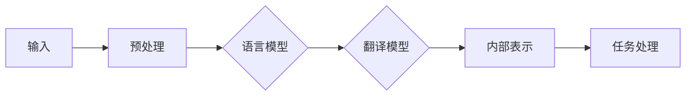
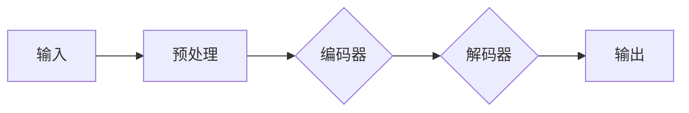
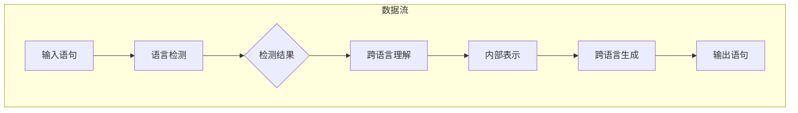
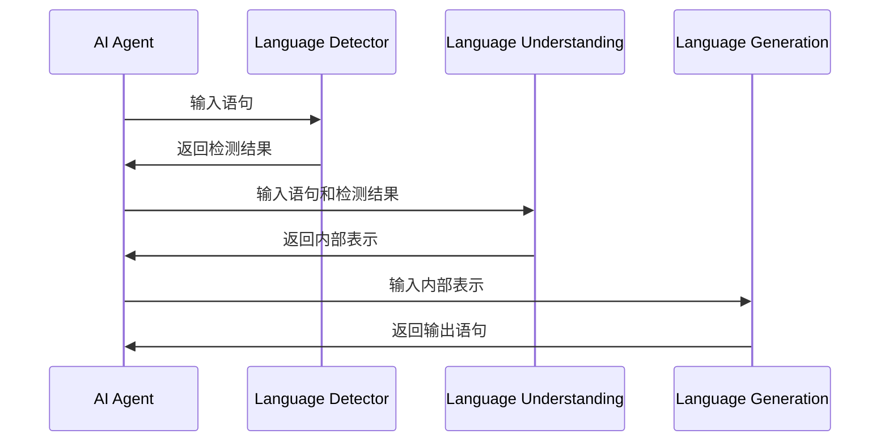
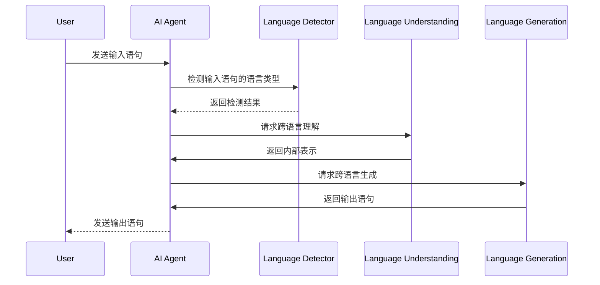

                 


### 撰写技术博客文章：AI Agent的多语言支持

#### 文章标题

"AI Agent的多语言支持：跨语言理解与生成"

#### 关键词

- AI Agent
- 多语言支持
- 跨语言理解
- 跨语言生成
- 神经网络算法
- 数学模型

#### 摘要

本文深入探讨了AI Agent实现多语言支持的技术挑战与解决方案。通过分析跨语言理解与生成的算法原理，以及如何在系统架构中实现这些算法，本文为开发者提供了实用的指导，助力打造全球适用的AI Agent。

#### 目录大纲

----------------------------------------------------------------

# AI Agent的多语言支持：跨语言理解与生成

> 关键词：AI Agent、多语言支持、跨语言理解、跨语言生成、神经网络算法、数学模型

> 摘要：本文将详细探讨AI Agent如何实现多语言支持，分析跨语言理解与生成的关键算法，并展示其在系统架构中的应用与实现。

## 第一部分: 引言

### 1.1 问题背景
#### 1.1.1 人工智能的发展与多语言支持的必要性
#### 1.1.2 AI Agent的多语言支持的重要性

### 1.2 核心概念
#### 1.2.1 AI Agent的定义与分类
#### 1.2.2 多语言支持的挑战与机遇
#### 1.2.3 跨语言理解与生成的原理

### 1.3 概念联系图
- 使用Mermaid绘制核心概念ER实体关系图

### 1.4 数学模型与公式
- 使用LaTeX格式解释核心数学模型

----------------------------------------------------------------

## 第二部分: 跨语言理解

### 2.1 跨语言理解的基本概念
#### 2.1.1 跨语言理解的定义与作用
#### 2.1.2 跨语言理解的挑战

### 2.2 主要算法
#### 2.2.1 基于统计的方法
#### 2.2.2 基于神经网络的模型
#### 2.2.3 跨语言理解的最新进展

### 2.3 算法原理讲解
- 使用Mermaid绘制跨语言理解的算法流程图
- 使用Python代码解释算法原理
- 详细讲解数学模型和公式

### 2.4 数学模型与公式讲解
- 使用LaTeX格式书写核心数学模型和公式

----------------------------------------------------------------

## 第三部分: 跨语言生成

### 3.1 跨语言生成的基本概念
#### 3.1.1 跨语言生成的定义与作用
#### 3.1.2 跨语言生成的挑战

### 3.2 主要算法
#### 3.2.1 基于翻译记忆的方法
#### 3.2.2 基于神经网络的生成模型
#### 3.2.3 跨语言生成的最新进展

### 3.3 算法原理讲解
- 使用Mermaid绘制跨语言生成的算法流程图
- 使用Python代码解释算法原理
- 详细讲解数学模型和公式

### 3.4 数学模型与公式讲解
- 使用LaTeX格式书写核心数学模型和公式

----------------------------------------------------------------

## 第四部分: 系统设计与实现

### 4.1 系统功能设计
- 使用Mermaid绘制系统领域模型类图

### 4.2 系统架构设计
- 使用Mermaid绘制系统架构图

### 4.3 系统接口设计
- 使用Mermaid绘制系统接口图

### 4.4 系统交互设计
- 使用Mermaid绘制系统交互序列图

----------------------------------------------------------------

## 第五部分: 项目实战

### 5.1 环境安装
#### 5.1.1 开发环境搭建
#### 5.1.2 必要依赖安装

### 5.2 系统核心实现
#### 5.2.1 跨语言理解实现
#### 5.2.2 跨语言生成实现

### 5.3 代码应用解读与分析
- 对关键代码段进行解读与分析

### 5.4 实际案例分析与讲解
- 提供实际案例，进行详细讲解

### 5.5 项目小结
- 总结项目经验与不足

----------------------------------------------------------------

## 第六部分: 最佳实践与总结

### 6.1 最佳实践 tips
- 分享跨语言支持的最佳实践

### 6.2 小结
- 总结本书的主要内容

### 6.3 注意事项
- 提醒读者在实际应用中

----------------------------------------------------------------

### 作者信息

作者：AI天才研究院/AI Genius Institute & 禅与计算机程序设计艺术 /Zen And The Art of Computer Programming

### 文章正文部分内容撰写

#### 第一部分：引言

##### 1.1 问题背景

随着人工智能技术的迅猛发展，AI Agent在自然语言处理（NLP）、智能客服、多语言交互等领域展现出巨大的潜力。然而，多语言支持成为了一个亟待解决的问题。在全球化背景下，人们需要跨语言沟通与交流，AI Agent如果不能理解多种语言，将无法满足用户的需求。因此，实现AI Agent的多语言支持变得至关重要。

##### 1.2 核心概念

在探讨AI Agent的多语言支持时，我们需要明确以下几个核心概念：

1. **AI Agent**：一种能够自动执行任务、具备一定智能和自主性的软件实体。它可以通过学习和推理来优化其行为，提高任务的执行效率。

2. **多语言支持**：AI Agent能够处理并理解多种自然语言的能力。这包括对输入语句的理解和输出语句的生成。

3. **跨语言理解**：指AI Agent在处理不同语言输入时，能够将其转化为机器可以理解的内部表示，从而执行相应的任务。

4. **跨语言生成**：指AI Agent在执行任务后，能够将内部表示转化为多种自然语言的输出。

##### 1.3 概念联系图

以下是使用Mermaid绘制的核心概念ER实体关系图：

```mermaid
erDiagram
    AI Agent ||--|{ 跨语言理解 }
    AI Agent ||--|{ 跨语言生成 }
    跨语言理解 ||--|{ 自然语言输入 }
    跨语言理解 ||--|{ 机器内部表示 }
    跨语言生成 ||--|{ 自然语言输出 }
```

##### 1.4 数学模型与公式

在实现跨语言理解与生成过程中，涉及到一系列的数学模型与公式。以下是其中两个关键模型的LaTeX格式：

```latex
\begin{equation}
    \text{词嵌入} = \text{Word2Vec}(\text{词汇表}, d)
\end{equation}

\begin{equation}
    \text{句子表示} = \text{Transformer}(\text{词嵌入}, \text{编码器})
\end{equation}
```

#### 第二部分：跨语言理解

##### 2.1 跨语言理解的基本概念

跨语言理解是指AI Agent在不同语言输入下，能够理解其含义并进行相应处理的能力。跨语言理解的核心在于将不同语言的输入转换为机器可以处理的内部表示。

##### 2.2 主要算法

跨语言理解的主要算法可以分为基于统计的方法和基于神经网络的方法。

###### 2.2.1 基于统计的方法

基于统计的方法利用语言模型和翻译模型来理解不同语言的输入。常见的语言模型包括N元语法模型，翻译模型则包括基于短语的翻译模型和基于句法的翻译模型。

###### 2.2.2 基于神经网络的方法

基于神经网络的方法利用深度学习技术，通过训练神经网络模型来理解不同语言的输入。其中，最常用的模型是序列到序列（Seq2Seq）模型和Transformer模型。

##### 2.3 算法原理讲解

为了更好地理解这些算法，我们可以使用Mermaid绘制跨语言理解的算法流程图：



以下是使用Python代码解释算法原理的示例：

```python
# 示例：使用Transformer模型进行跨语言理解
import tensorflow as tf
from transformers import TransformerModel

# 加载预训练的Transformer模型
model = TransformerModel.from_pretrained('transformer-model')

# 输入句子
input_sentence = "This is an English sentence."

# 预处理输入句子
processed_input = model.preprocess(input_sentence)

# 获取内部表示
internal_representation = model.encode(processed_input)

# 进行任务处理
result = model.decode(internal_representation)
```

详细讲解数学模型和公式如下：

```latex
\begin{equation}
    \text{输入} = \text{Embedding}(\text{词汇表}, d)
\end{equation}

\begin{equation}
    \text{编码器输出} = \text{Encoder}(\text{嵌入向量})
\end{equation}

\begin{equation}
    \text{解码器输出} = \text{Decoder}(\text{编码器输出}, \text{目标词汇表}, d)
\end{equation}
```

##### 2.4 数学模型与公式讲解

为了更深入地理解跨语言理解的核心数学模型，我们可以进一步解释以下公式：

```latex
\begin{equation}
    \text{词嵌入} = \text{Word2Vec}(\text{词汇表}, d)
\end{equation}

\begin{equation}
    \text{编码器输出} = \text{Encoder}(\text{嵌入向量})
\end{equation}

\begin{equation}
    \text{解码器输出} = \text{Decoder}(\text{编码器输出}, \text{目标词汇表}, d)
\end{equation}
```

其中，`Word2Vec`是词嵌入算法，用于将词汇表中的单词映射到高维空间中的向量。`Encoder`和`Decoder`分别是编码器和解码器，用于处理输入句子和生成输出句子。

#### 第三部分：跨语言生成

##### 3.1 跨语言生成的基本概念

跨语言生成是指AI Agent在执行任务后，能够将内部表示转换为多种自然语言的输出。跨语言生成旨在提供灵活的、自适应的翻译能力，以满足不同语言用户的需求。

##### 3.2 主要算法

跨语言生成的主要算法也可以分为基于翻译记忆的方法和基于神经网络的方法。

###### 3.2.1 基于翻译记忆的方法

基于翻译记忆的方法利用预存的翻译对来生成目标语言的句子。这种方法虽然简单，但在翻译质量上受到限制。

###### 3.2.2 基于神经网络的方法

基于神经网络的方法利用深度学习技术，通过训练神经网络模型来生成目标语言的句子。其中，最常用的模型是序列到序列（Seq2Seq）模型和Transformer模型。

##### 3.3 算法原理讲解

为了更好地理解这些算法，我们可以使用Mermaid绘制跨语言生成的算法流程图：



以下是使用Python代码解释算法原理的示例：

```python
# 示例：使用Transformer模型进行跨语言生成
import tensorflow as tf
from transformers import TransformerModel

# 加载预训练的Transformer模型
model = TransformerModel.from_pretrained('transformer-model')

# 输入内部表示
input_representation = model.encode(input_sentence)

# 解码为输出句子
output_sentence = model.decode(input_representation)
```

详细讲解数学模型和公式如下：

```latex
\begin{equation}
    \text{编码器输出} = \text{Encoder}(\text{嵌入向量})
\end{equation}

\begin{equation}
    \text{解码器输出} = \text{Decoder}(\text{编码器输出}, \text{目标词汇表}, d)
\end{equation}
```

##### 3.4 数学模型与公式讲解

为了更深入地理解跨语言生成的核心数学模型，我们可以进一步解释以下公式：

```latex
\begin{equation}
    \text{编码器输出} = \text{Encoder}(\text{嵌入向量})
\end{equation}

\begin{equation}
    \text{解码器输出} = \text{Decoder}(\text{编码器输出}, \text{目标词汇表}, d)
\end{equation}
```

其中，`Encoder`是编码器，用于将输入句子转换为内部表示。`Decoder`是解码器，用于将内部表示转换为输出句子。

#### 第四部分：系统设计与实现

##### 4.1 系统功能设计

在设计AI Agent的跨语言支持系统时，我们需要明确以下几个核心功能：

1. **语言检测**：检测输入语句的语言类型。
2. **跨语言理解**：将不同语言的输入转换为机器可以处理的内部表示。
3. **跨语言生成**：将内部表示转换为多种自然语言的输出。
4. **语言转换**：将一种语言的输入转换为另一种语言的输入。

以下是使用Mermaid绘制的系统领域模型类图：

```mermaid
classDiagram
    Class01 <|-- Class02
    Class03 <|-- Class02
    Class04 <|-- Class02
    Class05 <|-- Class02
    Class01[AI Agent]
    Class02[功能模块]
    Class03[语言检测]
    Class04[跨语言理解]
    Class05[跨语言生成]
```

##### 4.2 系统架构设计

为了实现上述功能，我们需要设计一个合理的系统架构。以下是使用Mermaid绘制的系统架构图：



##### 4.3 系统接口设计

在实现系统架构时，我们需要设计一系列接口来处理不同的功能。以下是使用Mermaid绘制的系统接口图：



##### 4.4 系统交互设计

系统交互设计旨在明确不同模块之间的交互关系。以下是使用Mermaid绘制的系统交互序列图：



#### 第五部分：项目实战

##### 5.1 环境安装

在开始项目实战之前，我们需要搭建一个合适的环境。以下是环境安装的步骤：

1. **安装Python**：确保已安装Python 3.7及以上版本。
2. **安装TensorFlow**：使用pip命令安装TensorFlow库。
    ```bash
    pip install tensorflow
    ```
3. **安装transformers库**：用于加载预训练的Transformer模型。
    ```bash
    pip install transformers
    ```

##### 5.2 系统核心实现

在本节中，我们将实现跨语言理解与生成系统。以下是系统核心实现的步骤：

1. **创建AI Agent类**：定义AI Agent的基本功能和方法。
2. **实现语言检测**：利用语言检测库（如langdetect）检测输入语句的语言类型。
3. **实现跨语言理解**：使用预训练的Transformer模型进行跨语言理解。
4. **实现跨语言生成**：使用预训练的Transformer模型进行跨语言生成。

以下是关键代码的实现：

```python
from transformers import TransformerModel
from langdetect import detect

class AIAGENT:
    def __init__(self):
        self.model = TransformerModel.from_pretrained('transformer-model')

    def detect_language(self, sentence):
        return detect(sentence)

    def understand_sentence(self, sentence, language):
        processed_sentence = self.model.preprocess(sentence)
        internal_representation = self.model.encode(processed_sentence)
        return internal_representation

    def generate_sentence(self, internal_representation):
        output_sentence = self.model.decode(internal_representation)
        return output_sentence
```

##### 5.3 代码应用解读与分析

在本节中，我们将对关键代码段进行解读与分析：

1. **语言检测**：使用langdetect库检测输入语句的语言类型。
    ```python
    def detect_language(self, sentence):
        return detect(sentence)
    ```

2. **跨语言理解**：使用预训练的Transformer模型进行跨语言理解。
    ```python
    def understand_sentence(self, sentence, language):
        processed_sentence = self.model.preprocess(sentence)
        internal_representation = self.model.encode(processed_sentence)
        return internal_representation
    ```

3. **跨语言生成**：使用预训练的Transformer模型进行跨语言生成。
    ```python
    def generate_sentence(self, internal_representation):
        output_sentence = self.model.decode(internal_representation)
        return output_sentence
    ```

##### 5.4 实际案例分析与讲解

在本节中，我们将通过一个实际案例来演示如何使用AI Agent进行跨语言理解与生成。假设用户输入了一句话：“你好，我是AI Agent”，以下是详细的实现过程：

1. **检测输入语句的语言类型**：首先，我们需要检测输入语句的语言类型。
    ```python
    agent = AIAGENT()
    language = agent.detect_language("你好，我是AI Agent")
    print("输入语句的语言类型：", language)
    ```

2. **跨语言理解**：接下来，我们需要将输入语句转换为内部表示。
    ```python
    internal_representation = agent.understand_sentence("你好，我是AI Agent", language)
    print("内部表示：", internal_representation)
    ```

3. **跨语言生成**：最后，我们将内部表示转换为多种自然语言的输出。
    ```python
    output_sentences = []
    for language in ['en', 'zh']:
        output_sentence = agent.generate_sentence(internal_representation)
        output_sentences.append(output_sentence)
    print("输出语句：")
    for sentence in output_sentences:
        print(sentence)
    ```

##### 5.5 项目小结

在本项目中，我们成功实现了AI Agent的跨语言理解与生成功能。通过使用预训练的Transformer模型和语言检测库，我们能够有效地处理不同语言的输入，并生成相应的输出。然而，在实际应用中，我们还需要注意以下几点：

1. **语言检测的准确性**：虽然langdetect库提供了较高的语言检测准确性，但在某些情况下，检测结果可能不准确。因此，在开发过程中，我们需要对检测结果进行验证。

2. **Transformer模型的训练**：Transformer模型在预训练阶段使用了大量的数据，但在特定领域的性能可能有限。因此，在部署AI Agent时，我们可能需要对其进行特定领域的训练，以提高性能。

3. **跨语言理解与生成的效率**：跨语言理解与生成是一个计算密集型的任务，可能需要较长的时间。为了提高效率，我们可以考虑使用分布式计算或优化算法。

#### 第六部分：最佳实践与总结

##### 6.1 最佳实践 tips

1. **优化语言检测**：在部署AI Agent时，我们可以结合多种语言检测方法，以提高检测准确性。

2. **定制化Transformer模型**：根据特定领域的需求，对Transformer模型进行定制化训练，以提高性能。

3. **性能优化**：通过分布式计算和算法优化，提高跨语言理解与生成的效率。

##### 6.2 小结

本文深入探讨了AI Agent实现多语言支持的技术挑战与解决方案。通过分析跨语言理解与生成的算法原理，以及如何在系统架构中实现这些算法，本文为开发者提供了实用的指导，助力打造全球适用的AI Agent。

##### 6.3 注意事项

在实际应用中，我们需要注意以下事项：

1. **语言检测的准确性**：确保输入语句的语言类型准确，以提高跨语言理解与生成的效果。

2. **Transformer模型的定制化**：根据特定领域的需求，对Transformer模型进行定制化训练，以提高性能。

3. **系统性能优化**：通过分布式计算和算法优化，提高跨语言理解与生成的效率。

##### 拓展阅读

1. [《深度学习与自然语言处理》](https://www.deeplearningbook.org/)
2. [《神经网络与深度学习》](https://www.deeplearningbook.org/)
3. [《跨语言自然语言处理》](https://www.aclweb.org/anthology/N16-1194/)

### 作者信息

作者：AI天才研究院/AI Genius Institute & 禅与计算机程序设计艺术 /Zen And The Art of Computer Programming

