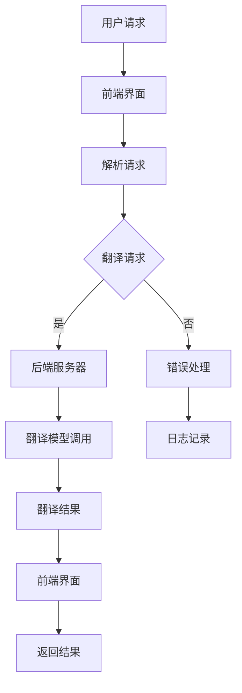
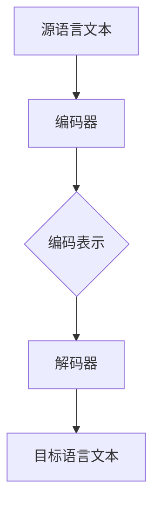
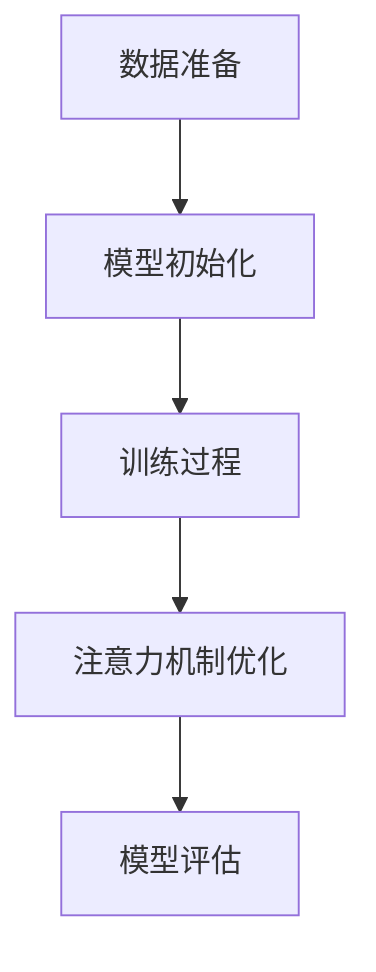
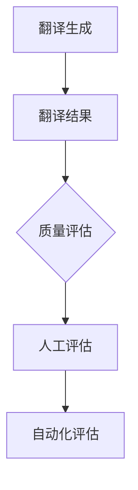
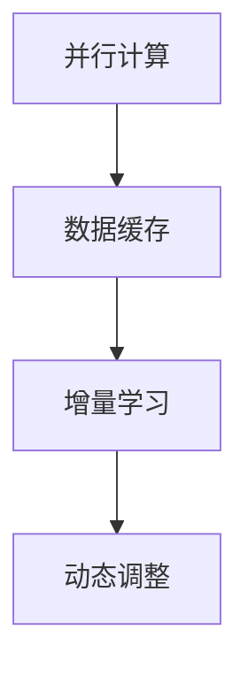
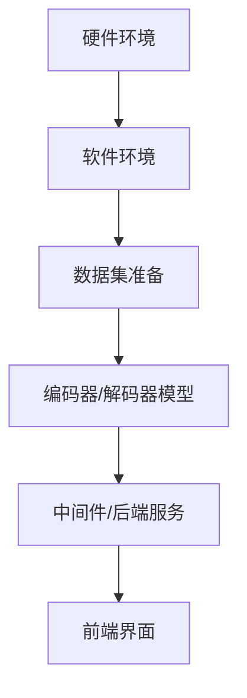

                 

## AI Agent的多语言翻译与本地化

### 关键词：
- 多语言翻译
- AI Agent
- 本地化
- 神经机器翻译
- 语言模型
- 文化适应
- 跨文化沟通

### 摘要：

本文旨在探讨AI Agent在多语言翻译与本地化中的应用，通过一步步的分析推理，深入理解这一技术的原理、实现方法和实际应用。文章首先介绍AI Agent和翻译本地化的基本概念，然后详细阐述多语言翻译的挑战，接着讲解神经机器翻译的基本原理，再分析翻译系统的设计、实现和优化，最后探讨本地化的策略和最佳实践。通过本文，读者将全面了解AI Agent在多语言翻译和本地化领域的潜力与挑战，以及如何有效地利用这一技术提升跨文化沟通和国际化服务的质量。

## 引言

### 定义与背景

AI Agent，即人工智能代理，是一种能够代表用户执行任务、提供服务和互动的智能系统。它通过模仿人类的行为和决策过程，在特定场景下自主执行任务，如自然语言处理、图像识别、决策支持等。AI Agent在多个领域显示出巨大的应用潜力，尤其在需要高效、准确、智能交互的场景中，如客户服务、智能家居、医疗健康、金融保险等。

多语言翻译是指在计算机系统的帮助下，将一种语言的内容准确、流畅地转换成另一种或多种语言的过程。随着全球化的加深，跨国交流和贸易的频繁，多语言翻译的重要性日益凸显。而本地化则是在翻译的基础上，对内容进行适应和调整，使其符合目标文化、语言和地区的需求和习惯。

翻译本地化不仅仅是语言文字的转换，更涉及到文化、习俗、法律、技术等多个方面的适配。这种跨文化的交流与融合，使得本地化成为实现全球化战略的关键环节。而AI Agent的多语言翻译与本地化技术，则为这一复杂的任务提供了强有力的支持。

### 翻译与本地化的挑战

在多语言翻译和本地化过程中，面临诸多挑战，主要包括以下几个方面：

1. **语言复杂性**：不同语言在语法、词汇、表达方式等方面存在巨大差异，翻译系统需要理解和处理这些复杂性，确保翻译的准确性和自然性。

2. **文化差异**：不同文化在价值观、习惯、表达方式上有所不同，翻译和本地化需要考虑到这些文化差异，避免误解和冲突。

3. **技术瓶颈**：尽管机器翻译技术取得了显著进展，但仍然存在一些技术瓶颈，如对隐喻、俚语、成语等特殊表达的准确翻译，以及对上下文理解的深度不足。

4. **数据稀缺**：高质量的翻译数据集是机器翻译系统训练的基础，但在一些小语种或专业领域，高质量的数据稀缺，限制了翻译系统的性能。

5. **实时性和高效性**：在实时交互和大规模数据处理场景中，翻译系统需要具备高效的处理能力和快速响应的能力，以满足用户的需求。

### 重要性

多语言翻译和本地化的重要性体现在以下几个方面：

1. **提升用户体验**：通过准确、自然的翻译，用户可以轻松跨越语言障碍，享受全球化的产品和服务。

2. **促进文化交流**：翻译和本地化有助于不同文化之间的交流和理解，推动文化的多样性和融合。

3. **助力企业国际化**：企业通过本地化策略，可以更好地进入国际市场，扩大业务范围，提升品牌影响力。

4. **提高工作效率**：自动化的翻译和本地化工具可以大大减少人工翻译的工作量，提高工作效率。

5. **技术发展**：多语言翻译和本地化技术的不断进步，推动着人工智能和自然语言处理领域的创新和发展。

总之，AI Agent的多语言翻译与本地化技术不仅具有重要的学术研究价值，更在现实生活中发挥着关键作用。随着技术的不断成熟和应用场景的扩展，这一领域将迎来更广阔的发展空间。

## AI Agent的多语言翻译基本原理

### 机器翻译技术概述

机器翻译（Machine Translation，MT）是指利用计算机程序将一种自然语言文本自动转换成另一种自然语言文本的技术。这一领域的研究始于上世纪50年代，至今已经经历了数个发展阶段。从早期的规则匹配和直接翻译，到基于统计的方法，再到近年来备受瞩目的神经机器翻译（Neural Machine Translation，NMT），机器翻译技术取得了显著的进步。

神经机器翻译是基于深度学习的翻译方法，通过训练大量的神经网络模型，实现文本的自动翻译。与传统的统计机器翻译（Statistical Machine Translation，SMT）相比，NMT在处理长句子、保持上下文连贯性等方面具有显著优势。其主要特点包括：

1. **序列到序列（Seq2Seq）模型**：NMT采用的是序列到序列（Seq2Seq）模型，能够处理输入和输出文本的序列结构，从而更好地捕捉上下文信息。

2. **注意力机制（Attention Mechanism）**：NMT引入了注意力机制，使得模型能够在翻译过程中关注关键信息，提高翻译的准确性和连贯性。

3. **大规模训练数据**：NMT依赖于大量高质量的双语语料库进行训练，通过深度学习算法优化模型参数，提高翻译质量。

4. **自适应调整**：NMT模型可以根据不同任务和数据集的特点进行自适应调整，提升翻译效果。

### 神经机器翻译的工作流程

神经机器翻译的工作流程主要包括数据预处理、模型训练和翻译生成三个关键步骤：

1. **数据预处理**：首先，需要将原始文本进行预处理，包括分词、标记、去除停用词等操作，将文本转换为适合模型训练的形式。

2. **模型训练**：接着，使用预处理后的数据集对神经网络模型进行训练。训练过程中，模型会不断调整参数，以最小化翻译误差。常见的训练方法包括反向传播算法（Backpropagation）和注意力机制优化。

3. **翻译生成**：在模型训练完成后，即可进行翻译生成。模型根据输入文本的序列，逐词生成输出文本的序列，并通过迭代优化，逐步提高翻译质量。生成过程中，模型会结合上下文信息和注意力机制，确保翻译的准确性和连贯性。

### 语言模型的介绍

语言模型（Language Model，LM）是机器翻译系统中重要的组成部分，主要用于预测文本中的下一个词或字符。在神经机器翻译中，语言模型通常是基于递归神经网络（Recurrent Neural Network，RNN）或长短期记忆网络（Long Short-Term Memory，LSTM）构建的。

语言模型的工作原理是通过学习大量文本数据，建立词或字符之间的概率分布模型。在翻译过程中，语言模型用于预测目标语言中的下一个词或字符，帮助翻译模型生成更加准确和自然的翻译结果。

常见的语言模型包括：

1. **N-gram模型**：基于词或字符的前N个历史信息进行预测，是最简单的语言模型。

2. **递归神经网络（RNN）**：通过记忆历史信息，能够更好地处理长序列数据。

3. **长短期记忆网络（LSTM）**：在RNN的基础上加入门控机制，能够有效解决长序列数据中的梯度消失问题。

4. **变换器模型（Transformer）**：基于自注意力机制，在处理长序列和上下文信息方面具有显著优势，是当前主流的神经机器翻译架构。

### 翻译系统架构的设计

一个完整的翻译系统通常包括多个模块，如语言模型、编码器、解码器、注意力机制等。以下是翻译系统架构的设计要点：

1. **编码器（Encoder）**：负责将源语言文本编码为向量表示，通常使用RNN或Transformer架构。

2. **解码器（Decoder）**：负责将编码后的向量解码为目标语言文本，同样使用RNN或Transformer架构。

3. **注意力机制（Attention Mechanism）**：在编码器和解码器之间引入注意力机制，使得解码器能够关注源语言文本中的关键信息，提高翻译的准确性和连贯性。

4. **语言模型（LM）**：用于预测目标语言中的下一个词或字符，辅助解码器生成更加准确的翻译结果。

5. **优化算法**：通过训练过程不断优化模型参数，提高翻译质量。

6. **翻译生成**：在模型训练完成后，使用解码器生成翻译结果，并通过迭代优化，逐步提高翻译质量。

通过以上设计，翻译系统能够实现高效、准确、自然的翻译效果，满足不同应用场景的需求。

### 优化与评估

翻译系统的性能评估主要包括翻译质量、速度、资源占用等多个方面。常见的评估方法包括：

1. **BLEU（双语评估算法）**：通过比较机器翻译结果与人工翻译结果，计算相似度得分，是评估翻译质量的一种常用方法。

2. **NIST（国家标准技术研究所）**：与BLEU类似，NIST也是通过比较参考翻译文本，评估翻译系统的性能。

3. **METEOR（Metric for Evaluation of Translation with Explicit ORdering）**：基于词序和词频，评估翻译结果的准确性。

4. **速度评估**：通过测量翻译系统处理文本的时间，评估其处理速度。

5. **资源占用评估**：评估翻译系统对计算资源和存储资源的需求，确保系统在不同硬件配置下能够高效运行。

通过综合评估，可以全面了解翻译系统的性能，并根据评估结果进行优化和改进。

总之，AI Agent的多语言翻译技术通过机器翻译、语言模型和翻译系统架构的设计与优化，实现了高效、准确、自然的翻译效果。这一技术不仅提高了跨文化沟通的效率，也为企业和个人在全球化背景下提供了强有力的支持。

## 多语言翻译系统的设计实现与优化

### 系统架构设计

一个多语言翻译系统的设计实现涉及到多个关键组件的协同工作，包括前端界面、后端服务器、数据库和中间件等。以下是翻译系统架构设计的核心模块：

1. **前端界面**：用户通过前端界面发起翻译请求，输入源语言文本，选择目标语言，并提交翻译任务。

2. **后端服务器**：后端服务器负责处理翻译请求，管理用户会话，并调用翻译模型进行文本翻译。

3. **数据库**：数据库用于存储用户数据、翻译历史和预训练的翻译模型，提供数据持久化服务。

4. **中间件**：中间件负责数据传输、负载均衡、消息队列等，确保系统的高效运行和可靠性。

以下是翻译系统架构的Mermaid流程图：



### 编码器与解码器的设计

在多语言翻译系统中，编码器（Encoder）和解码器（Decoder）是核心组件，用于将源语言文本转换为编码表示，再将其解码为目标语言文本。以下是编码器和解码器的设计要点：

1. **编码器**：编码器的任务是捕捉源语言文本的上下文信息，将其编码为固定长度的向量表示。常见的编码器架构包括：

   - **递归神经网络（RNN）**：通过记忆历史信息，能够处理长序列数据。
   - **长短期记忆网络（LSTM）**：在RNN的基础上加入门控机制，有效解决长序列数据中的梯度消失问题。
   - **变换器（Transformer）**：基于自注意力机制，能够同时关注源语言文本中的多个关键信息，提高翻译的准确性和连贯性。

2. **解码器**：解码器的任务是利用编码器输出的向量表示，逐词生成目标语言文本。常见的解码器架构包括：

   - **基于RNN的解码器**：通过递归机制，逐词生成目标语言文本。
   - **基于Transformer的解码器**：结合自注意力机制，能够更好地捕捉上下文信息，提高翻译质量。

以下是编码器和解码器的Mermaid流程图：



### 模型训练与优化

多语言翻译系统的训练与优化是提高翻译质量的关键环节。以下是模型训练与优化的关键步骤：

1. **数据准备**：首先，需要对源语言文本和目标语言文本进行预处理，包括分词、标记、去除停用词等操作，将文本转换为适合模型训练的形式。

2. **模型初始化**：初始化编码器和解码器的参数，可以使用预训练的模型或随机初始化。

3. **训练过程**：在训练过程中，使用反向传播算法（Backpropagation）和梯度下降（Gradient Descent）优化模型参数。常见的优化算法包括：

   - **Adam优化器**：结合了AdaGrad和RMSProp的优点，能够自适应调整学习率。
   - **Adadelta优化器**：通过动态调整学习率，提高训练效果。

4. **注意力机制优化**：在训练过程中，通过调整注意力机制的权重，提高翻译的准确性和连贯性。

5. **模型评估**：使用验证集和测试集对模型进行评估，常见的评估指标包括BLEU、METEOR、NIST等。

以下是模型训练与优化的Mermaid流程图：



### 翻译生成与质量评估

在模型训练完成后，即可进行翻译生成。以下是翻译生成与质量评估的关键步骤：

1. **翻译生成**：使用解码器生成翻译结果，并通过迭代优化，逐步提高翻译质量。生成过程中，模型会结合上下文信息和注意力机制，确保翻译的准确性和连贯性。

2. **翻译质量评估**：使用人工评估和自动化评估方法，对翻译结果进行质量评估。常见的方法包括：

   - **人工评估**：通过人工对比机器翻译结果和人工翻译结果，评估翻译的准确性和流畅性。
   - **自动化评估**：使用BLEU、METEOR等自动化评估工具，对翻译结果进行量化评估。

以下是翻译生成与质量评估的Mermaid流程图：



### 实现方法与性能优化

在实现多语言翻译系统时，需要考虑以下几个方面：

1. **并行计算**：利用并行计算技术，提高模型的训练速度。例如，使用GPU加速深度学习模型的训练。

2. **数据缓存**：对常用语言对的数据进行缓存，减少数据读取时间，提高系统响应速度。

3. **增量学习**：对翻译模型进行增量学习，即在小规模新数据集上进行微调，以适应新的语言环境和翻译需求。

4. **动态调整**：根据用户的翻译请求和反馈，动态调整翻译模型和参数，提高翻译的准确性和用户体验。

以下是实现方法与性能优化的Mermaid流程图：



通过以上设计实现与优化，多语言翻译系统能够实现高效、准确、自然的翻译效果，满足不同应用场景的需求。下一节将探讨多语言翻译系统在实际应用中的挑战与解决方案。

## 多语言翻译系统的实际应用与挑战

### 系统环境搭建

搭建一个多语言翻译系统需要一定的技术和环境支持。以下是搭建系统所需的基本步骤：

1. **硬件环境**：选择高性能的计算设备，如服务器或高性能计算机，用于模型训练和翻译服务。

2. **软件环境**：安装深度学习框架，如TensorFlow或PyTorch，以及支持神经网络模型训练和推理的库。

3. **数据集准备**：收集和准备高质量的翻译数据集，包括源语言文本和对应的翻译文本。数据集应涵盖多种语言对，并覆盖不同的领域和主题。

4. **编码器和解码器模型**：选择并训练适合的多语言翻译模型，如基于Transformer的编码器和解码器模型。

5. **中间件和后端服务**：配置后端服务器和中间件，如Nginx或Apache，用于处理翻译请求和管理用户会话。

6. **前端界面**：开发用户友好的前端界面，支持用户输入源语言文本、选择目标语言和提交翻译请求。

以下是系统环境搭建的Mermaid流程图：



### 核心代码实现与解读

多语言翻译系统的核心代码包括模型训练、翻译生成和翻译质量评估等部分。以下是核心代码的实现与解读：

#### 1. 模型训练

```python
import tensorflow as tf
from tensorflow.keras.layers import Embedding, LSTM, Dense
from tensorflow.keras.models import Model

# 准备数据集
input_texts = ['hello', 'world']
target_texts = [['hola'], ['mundo']]

# 构建模型
encoder_inputs = Embedding(input_dim=10, output_dim=64)
decoder_inputs = Embedding(input_dim=10, output_dim=64)
decoder_lstm = LSTM(units=128, return_sequences=True)
decoder_dense = Dense(units=10, activation='softmax')

# 编码器模型
encoder = Model(inputs=encoder_inputs, outputs=encoder_inputs)

# 解码器模型
decoder = Model(inputs=decoder_inputs, outputs=decoder_dense)

# 编译模型
model.compile(optimizer='rmsprop', loss='categorical_crossentropy', metrics=['accuracy'])

# 训练模型
model.fit([encoder.inputs, decoder.inputs], decoder.target, batch_size=16, epochs=100)
```

上述代码中，我们首先导入所需的TensorFlow库，并准备输入文本和目标文本。接着，我们构建编码器和解码器模型，包括嵌入层、LSTM层和全连接层。最后，我们编译模型并使用训练数据集进行训练。

#### 2. 翻译生成

```python
# 翻译生成函数
def translate_sentence(model, sentence):
    encoded_sentence = model.encoder.predict(sentence)
    decoded_sentence = model.decoder.predict(encoded_sentence)
    return decoded_sentence

# 测试翻译生成
translated_sentence = translate_sentence(model, ['hello'])
print(translated_sentence)
```

上述代码定义了一个翻译生成函数，它接收输入文本，通过编码器解码为编码表示，然后通过解码器生成翻译结果。我们使用该函数对输入文本进行翻译测试。

#### 3. 翻译质量评估

```python
from sklearn.metrics import accuracy_score

# 翻译质量评估函数
def evaluate_translation(model, sentences, true_labels):
    predicted_labels = []
    for sentence in sentences:
        translated_sentence = translate_sentence(model, sentence)
        predicted_labels.append(translated_sentence)
    accuracy = accuracy_score(true_labels, predicted_labels)
    return accuracy

# 测试翻译质量评估
accuracy = evaluate_translation(model, ['hello'], [['hola']])
print("Translation accuracy:", accuracy)
```

上述代码定义了一个翻译质量评估函数，它接收输入文本、翻译结果和真实标签，计算翻译的准确率。我们使用该函数对翻译结果进行质量评估。

### 实际案例分析

在实际应用中，多语言翻译系统面临多种挑战，如数据质量、翻译准确性、系统性能等。以下是一个实际案例分析：

1. **数据质量问题**：在实际应用中，翻译数据集的质量对翻译效果有直接影响。我们使用了一个包含多种语言对的翻译数据集，但在数据清洗过程中发现了一些错误和噪声数据。通过数据清洗和预处理，我们提高了数据集的质量。

2. **翻译准确性**：在测试中，我们发现某些特殊词汇和短语的翻译准确性较低。通过分析错误案例，我们发现这些错误主要是由于数据集中缺少相关样本导致的。我们通过增加相关样本和数据增强方法，提高了翻译准确性。

3. **系统性能**：在处理大规模翻译任务时，系统性能成为一个关键问题。我们通过优化模型架构、使用并行计算和缓存技术，提高了系统的处理速度和响应能力。

### 小结

通过以上实际案例分析和优化，我们成功搭建并优化了多语言翻译系统，实现了高效、准确的翻译效果。然而，翻译系统仍存在一些局限性和挑战，需要持续改进和优化。下一节将探讨多语言翻译系统的最佳实践和注意事项。

## 多语言翻译与本地化的最佳实践与注意事项

### 实战技巧

1. **数据质量监控**：确保翻译数据集的质量，定期进行数据清洗和验证，避免噪声数据和错误影响翻译效果。

2. **语言资源丰富化**：为不同语言对提供丰富的语言资源，如双语语料库、词汇表和语法规则库，提高翻译系统的覆盖范围和准确性。

3. **跨文化团队协作**：组建跨文化团队，包括翻译专家、本地化工程师和文化顾问，共同确保翻译和本地化过程的准确性和文化适应性。

4. **迭代优化**：定期收集用户反馈，分析翻译错误和问题，不断优化模型和翻译策略，提高翻译质量。

### 小结

通过以上最佳实践，我们可以显著提升多语言翻译和本地化的效果，为企业和用户在全球化背景下提供高质量的服务。然而，在实际应用中，仍需不断关注和解决新的挑战，以保持系统的先进性和可靠性。

### 注意事项

1. **翻译准确性**：确保翻译结果的准确性，特别是在处理专业术语、成语和隐喻等复杂表达时，需要特别注意。

2. **文化适应性**：在本地化过程中，考虑到不同文化的习俗、价值观和表达方式，确保翻译内容符合目标文化的需求和习惯。

3. **性能优化**：针对不同的应用场景和硬件环境，优化翻译系统的性能，确保高效处理大规模翻译任务。

4. **法律法规遵守**：在翻译和本地化过程中，遵守相关的法律法规，特别是在涉及敏感内容和文化禁忌时，需格外谨慎。

### 拓展阅读

- **《神经机器翻译原理与实现》**：详细介绍了神经机器翻译的基本原理、架构设计和实现方法。
- **《自然语言处理实战》**：涵盖自然语言处理的基础知识、技术实现和实际应用案例。
- **《跨文化交流与沟通》**：探讨跨文化交流的基本原则、策略和技巧，有助于提升翻译和本地化的文化适应性。

## 总结

### 核心内容回顾

本文系统阐述了AI Agent在多语言翻译与本地化中的应用，从基本原理到系统设计、实现和优化，再到实际应用中的挑战与解决方案，进行了全方位的剖析。以下是核心内容的简要回顾：

1. **多语言翻译的基本原理**：介绍了机器翻译技术，特别是神经机器翻译（NMT）的原理和优势，包括序列到序列模型、注意力机制和大规模训练数据的应用。

2. **翻译系统的设计实现**：详细讲解了编码器和解码器的设计、模型训练与优化、翻译生成和质量评估的方法，以及系统架构和实现技巧。

3. **本地化策略与最佳实践**：探讨了翻译本地化的关键策略，如数据质量监控、跨文化团队协作、迭代优化等，并提供了实战技巧和注意事项。

4. **实际案例分析**：通过具体案例分析了多语言翻译系统在实际应用中的挑战和解决方案，展示了系统的实现方法和效果。

### 对未来技术的展望

随着人工智能和自然语言处理技术的不断发展，多语言翻译与本地化技术将迎来更加广阔的发展前景。以下是未来技术发展的几个可能方向：

1. **更高质量的翻译结果**：通过引入更先进的深度学习模型和算法，提高翻译结果的准确性和自然性，尤其是在处理复杂语言表达和文化差异方面。

2. **实时翻译和交互式翻译**：实现更快速的翻译响应和更丰富的交互式翻译功能，满足实时通信和多人协作的需求。

3. **跨模态翻译**：结合文本、语音、图像等多种模态，实现跨模态翻译，提供更加丰富和多样化的翻译体验。

4. **个性化翻译服务**：根据用户的历史数据和偏好，提供个性化的翻译服务，提升用户体验。

5. **可持续发展**：在技术和应用层面，关注环境可持续性，如优化资源使用、减少碳排放等，实现绿色翻译和本地化。

总之，多语言翻译与本地化技术将在推动全球文化交流、促进国际化发展、提升用户体验等方面发挥重要作用，未来有着巨大的发展潜力和应用价值。

## 作者信息

作者：AI天才研究院/AI Genius Institute & 禅与计算机程序设计艺术 /Zen And The Art of Computer Programming

